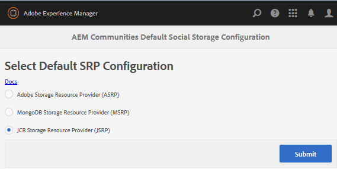

# JSRP - JCR Storage Resource Provider {#jsrp-jcr-storage-resource-provider}

## Über JSRP {#about-jsrp}

Wenn AEM Communities JSRP als Speicheroption (Standard) verwendet, werden Community-Inhalte in JCR gespeichert und benutzergenerierte Inhalte (UGC) können nur von der Autoren- oder Veröffentlichungsinstanz aufgerufen werden, in der sie veröffentlicht wurden.

Aufgrund der Einfachheit der Implementierung ist JSRP im Allgemeinen am besten für Demonstrations- oder Entwicklungsumgebungen einer Veröffentlichungsinstanz und einer Autoreninstanz geeignet.

Siehe auch [Eigenschaften der SRP-Optionen](working-with-srp.md#characteristics-of-srp-options) und [Empfohlene Topologien](topologies.md).

## Konfiguration {#configuration}

### JSRP {#select-jsrp} auswählen

Standardmäßig ist JSRP die Speicheroption für UGC.

Die [Speicherkonfigurationskonsole](srp-config.md) ermöglicht die Auswahl der standardmäßigen Speicherkonfiguration, die angibt, welche SRP-Implementierung verwendet werden soll.

Um in der Autorenumgebung auf die Speicherkonfigurationskonsole zuzugreifen

* Über die globale Navigation: **[!UICONTROL Tools]** > **[!UICONTROL Communities]** > **[!UICONTROL Speicherkonfiguration]**

* Wählen Sie **[!UICONTROL JCR Storage Resource Provider (JSRP)]** aus.

* Klicken Sie auf **[!UICONTROL Übermitteln]**

### Veröffentlichen der Konfiguration {#publishing-the-configuration}

Während JSRP die Standardkonfiguration ist, um sicherzustellen, dass die identische Konfiguration in der Veröffentlichungsumgebung festgelegt ist:

* Über die globale Navigation: **[!UICONTROL Tools]** > **[!UICONTROL Bereitstellung]** > **[!UICONTROL Replikation]**
* Wählen Sie **[!UICONTROL Tree aktivieren]** > **[!UICONTROL Startpfad]**:

   * Navigieren Sie zu `/conf/global/settings/community/srpc/`

* Wählen Sie **[!UICONTROL Activate]**

## Verwalten von Benutzerdaten {#managing-user-data}

Informationen zu *Benutzern*, *Benutzerprofilen* und *Benutzergruppen*, die häufig in der Veröffentlichungsumgebung eingegeben werden, finden Sie unter:

* [Benutzersynchronisierung](sync.md)
* [Verwalten von Benutzern und Benutzergruppen](users.md)

## Fehlerbehebung {#troubleshooting}

### UGC in JCR nicht sichtbar {#ugc-not-visible-in-jcr}

Stellen Sie sicher, dass JSRP als Standardanbieter konfiguriert wurde, indem Sie die Konfiguration der Speicheroption aktivieren. Standardmäßig ist der Speicher-Ressourcenanbieter JSRP.

Rufen Sie auf allen Autoren- und Veröffentlichungsinstanzen AEM die Konsole Speicherkonfiguration erneut auf oder überprüfen Sie das AEM Repository:

* In JCR, wenn [/conf/global/settings/community](http://localhost:4502/crx/de/index.jsp#/conf/global/settings/community)

   * Enthält keinen Knoten [srpc](http://localhost:4502/crx/de/index.jsp#/conf/global/settings/community/srpc), bedeutet dies, dass der Speicheranbieter JSRP ist.
   * Wenn der Knoten srpc vorhanden ist und den Knoten [defaultconfiguration](http://localhost:4502/crx/de/index.jsp#/conf/global/settings/community/srpc/defaultconfiguration) enthält, sollten die Eigenschaften der Standardkonfiguration JSRP als Standardanbieter definieren.

### UGC in Autoreninstanz nicht sichtbar {#ugc-not-visible-on-author-instance}

Das ist kein Fehler. Ein Merkmal von JSRP ist, dass in der Veröffentlichungsumgebung eingegebene Community-Inhalte nur in der Veröffentlichungsumgebung sichtbar sind.

### UGC in Veröffentlichungsinstanz nicht sichtbar {#ugc-not-visible-on-publish-instance}

Wenn eine einzelne Veröffentlichungsinstanz oder ein Veröffentlichungscluster bereitgestellt ist, befolgen Sie die Anweisungen für [UGC nicht in JCR](#ugc-not-visible-in-jcr) sichtbar.

Wenn eine Veröffentlichungsfarm bereitgestellt wird, ist ein Merkmal von JSRP, dass Community-Inhalte nur auf der Veröffentlichungsinstanz sichtbar sind, auf der sie veröffentlicht wurde.

Damit UGC in jeder Veröffentlichungsinstanz sichtbar ist, ist ein Veröffentlichungscluster erforderlich.
