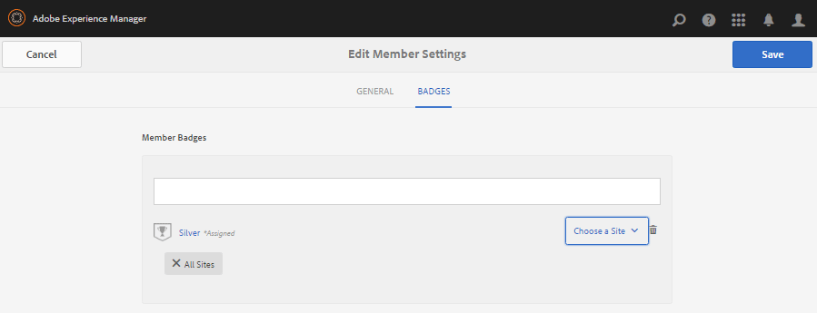

# Mitglieder und Gruppenverwaltungskonsolen {#members-groups-management-consoles}

## Überblick {#overview}

AEM Communities-Funktionen erfordern häufig, dass Site-Besucher registriert und angemeldet sind, bevor sie an einer Community in der Veröffentlichungsumgebung teilnehmen. Ihre Benutzerregistrierung muss nur in der Veröffentlichungsumgebung vorhanden sein. Sie werden häufig als *Mitglieder* bezeichnet, um sie von in der Autorenumgebung registrierten *Benutzern* zu unterscheiden.

### Mitglieder (Benutzer) bei der Veröffentlichung {#members-users-on-publish}

Mithilfe der Communities Mitglieder und Gruppen-Konsolen können in der *Veröffentlichungsumgebung* registrierte Mitglieder und Mitgliedsgruppen aus der *Autorenumgebung* erstellt und verwaltet werden. Dies ist nur möglich, wenn der [Tunneldienst](deploy-communities.md#tunnel-service-on-author) aktiviert ist.

### Benutzer im Autor {#users-on-author}

Zum Verwalten von in der *Autorenumgebung* registrierten Benutzern und Gruppen ist erforderlich, um die Sicherheitskonsole der Plattform zu verwenden:

* Wählen Sie aus der globalen Navigation `Tools, Security, Users`
* Wählen Sie aus der globalen Navigation `Tools, Security, Groups`

>[!NOTE]
>
>Wenn Beispielinhalte bereitgestellt und aktiviert sind, gibt es viele Beispielbenutzer sowohl in der Autor- als auch in der Veröffentlichungsumgebung. Diese Benutzer sind nicht vorhanden, wenn sie mit [nosampleContent-Ausführungsmodus](../../help/sites-administering/production-ready.md)ausgeführt werden.

## Mitgliederkonsole {#members-console}

In der Autorenumgebung zur Mitgliederkonsole gelangen, um in der Veröffentlichungsumgebung registrierte Mitglieder zu verwalten:

* Aus globaler Navigation: **[!UICONTROL Navigation > Communities > Member]**

>[!CAUTION]
>
>Die Mitgliederkonsole kann nicht verwendet werden, wenn der [Tunneldienst](deploy-communities.md#tunnel-service-on-author) nicht aktiviert ist.

### Suche{#search-features}

Klicken Sie auf das Symbol für das Seitenbedienfeld auf der linken Seite der `Members` Kopfzeile, um das Suchseitenbedienfeld zu öffnen.

 

Klicken Sie auf das Suchsymbol auf der linken Seite der `Members` Kopfzeile, um das Suchseitenbedienfeld zu schließen.

### Mitgliederstatistiken {#member-statistics}

Die Spalten `Views`, `Posts`und `Follows` werden aktualisiert, wenn der Benutzer Mitglied einer oder mehrerer Community-Sites ist, auf denen Adobe Analytics `Likes`aktiviertist.

### CSV exportieren {#export-csv}

Wenn Sie den `Export CSV` Link auswählen, werden alle Mitglieder als Liste mit kommagetrennten Werten heruntergeladen, die für den Import in eine Tabelle geeignet sind.

Die Spaltenüberschriften sind

`| Screen Name |Last Name |First Name |Status |Views |Posts |Follows |Likes |`

## Neues Mitglied erstellen {#create-new-member}

Wählen Sie diese Option, `Create Member` um einen Benutzer in der Veröffentlichungsumgebung zu erstellen.

### ALLGEMEINE - Mitgliederdetails {#general-member-details}

Die meisten Felder sind optionale Felder, die das Mitglied später in seinem Profil ausfüllen kann.

* **[!UICONTROL ID]**(*erforderlich*) Die autorisierbare ID ist die Anmelde-ID des Mitglieds.
Standardmäßig wird die ID auf den Wert der erforderlichen E-Mail-Adresse eingestellt.
   *Nach der Erstellung kann die ID nicht mehr geändert werden.*

* **[!UICONTROL E-Mail-Adresse]**(*erforderlich*) Die E-Mail-Adresse des Mitglieds.
Das Mitglied kann seine E-Mail-Adresse bei der Aktualisierung seines Profils ändern.Wenn die ID standardmäßig auf die E-Mail-Adresse eingestellt ist, ändert sich die ID *nicht* , wenn die E-Mail-Adresse geändert wird.

* **[!UICONTROL Kennwort]**(*erforderlich*) Das Anmeldekennwort.

* **[!UICONTROL Kennwort]** erneut eingeben (*erforderlich*) Geben Sie das Kennwort zur Überprüfung erneut ein.

* **[!UICONTROL Mitglied zu Sites]** hinzufügen (*optional*) Wählen Sie aus vorhandenen Community-Sites aus, um das Mitglied zur Mitgliedergruppe der Community-Site hinzuzufügen.

* **[!UICONTROL Mitglied zu Gruppen]** hinzufügen (*optional*) Wählen Sie aus vorhandenen Mitgliedsgruppen aus, um das Mitglied dieser Gruppe hinzuzufügen.

* Wählen Sie **[!UICONTROL Speichern]**

### GENERAL - Account settings {#general-account-settings}

Unter &quot;Kontoeinstellungen&quot;kann ein Community-Administrator

* **[!UICONTROL Status]**
   * Verbotene Benutzer Ein Mitglied kann sich nicht anmelden, was verhindert, dass es Seiten anzeigt oder an Aktivitäten teilnimmt, für die eine Anmeldung erforderlich ist. Sie können immer noch anonym eine offene Community-Site besuchen.

   * Nicht verbotenEin Mitglied hat vollen Zugriff auf die Community-Site.
   Der Standardwert ist `Not Banned`.

* **[!UICONTROL Beitragsbeschränkungen]**Wenn diese aktiviert sind, ist die Fähigkeit des Mitglieds, Inhalte zu posten, eingeschränkt.
Der Standardwert hängt von der Konfiguration der Beitragsgrenzen ab.
Siehe [Mitgliederbeitragsbeschränkungen](limits.md).

* **[!UICONTROL Kennwort]**&#x200B;ändern Ein Link, der beim Ändern eines vorhandenen Mitglieds vorhanden ist. Bietet einem Community-Administrator die Möglichkeit, ein Kennwort für ein Mitglied zurückzusetzen.

### ALLGEMEIN - Foto {#general-photo}

Um einen Avatar für das Element bereitzustellen, wählen Sie zunächst &quot;Bild **[!UICONTROL hochladen&quot;]** und wählen Sie dann ein Bild vom Typ .jpg, .png, .tif oder .gif. Die bevorzugte Größe eines Bildes ist 240 x 240 Pixel bei 72 dpi.

### GENERAL - Add Member to Sites {#general-add-member-to-sites}

Das Mitglied kann einer oder mehreren Mitgliedergruppen der Community-Sites hinzugefügt werden. Beginnen Sie mit der Eingabe von Text in das Textfeld.

### GENERAL - Add Member to Groups {#general-add-member-to-groups}

Das Mitglied kann einer oder mehreren Mitgliedergruppen hinzugefügt werden. Beginnen Sie mit der Eingabe von Text in das Textfeld.

### Registerkarte &quot;BADGES&quot; {#badges-tab}

Das `BADGES` Bedienfeld bietet die Möglichkeit, Kennzeichen manuell zuzuweisen und zu sperren. Die Abzeichen können für zugewiesene Rollen sowie für gewöhnlich verdiente Abzeichen verwendet werden.

Siehe auch [Scoring und Badges](implementing-scoring.md).

* **[!UICONTROL Hinzufügen von Abzeichen]**
   * Geben Sie mit der Eingabe an, um aus den [verfügbaren Abzeichen](badges.md)auszuwählen. Wählen Sie nach Auswahl eines Kennzeichens jede Website oder alle Sites aus, auf denen das Zeichen zusammen mit dem Avatar des Mitglieds angezeigt werden soll.
   * Es können mehrere Abzeichen und Sites ausgewählt werden.
* **[!UICONTROL Entfernen von Markierungen]**
   * Wählen Sie das Papierkorbsymbol neben einer Markierung aus, um sie zu entfernen

## Gruppenkonsole {#groups-console}

Die in der Autorenumgebung verfügbare Gruppenkonsole ermöglicht die Erstellung und Verwaltung von in der Veröffentlichungsumgebung registrierten Mitgliedsgruppen. Sie ist besonders nützlich für:
* [Privilegierte Mitgliedergruppen](users.md#privilegedmembersgroups)
* Gruppenbasierte Zuweisung von [Aktivierungsressourcen](resources.md)

So greifen Sie auf die Konsole &quot;Gruppen&quot;zu:
* Aus globaler Navigation: **[!UICONTROL Navigation > Communities > Gruppen]**

>[!CAUTION]
>
>Die Konsole Gruppen kann nicht verwendet werden, wenn der [Tunneldienst](deploy-communities.md#tunnel-service-on-author) nicht aktiviert ist.

### Neue Gruppe erstellen {#create-new-group}

Wählen Sie diese Option, `Add Group` um eine Gruppe in der Veröffentlichungsumgebung zu erstellen.

Die folgenden Felder sind zum Erstellen einer neuen Gruppe von Mitgliedern auf der Seite der Veröffentlichung erforderlich:

* **[!UICONTROL ID]**(*erforderlich*) Die eindeutige ID der Gruppe.
   *Nach der Erstellung kann die ID nicht mehr geändert werden.*

* **[!UICONTROL Name]**(*optional*) Der Anzeigename für die Gruppe.

   Der Standardwert ist die ID.

* **[!UICONTROL Beschreibung]**(*optional*) Eine Beschreibung des Zwecks und der Berechtigungen der Gruppe.

* **[!UICONTROL Mitglieder zu Gruppe]** hinzufügen (*optional*) Wählen Sie Mitglieder auf der Veröffentlichungsseite aus, die als erste Mitglieder der Gruppe aufgenommen werden sollen.

* Wählen Sie **[!UICONTROL Speichern]**

## Autorisierte Administratoren {#authorized-administrators}

Bei der Arbeit mit Mitgliedern in der Communities-Mitgliederkonsole ist es erforderlich, als Benutzer mit entsprechenden Berechtigungen angemeldet zu sein und den Replizierungsagenten, der vom [Tunneldienst](deploy-communities.md#tunnel-service-on-author) verwendet wird, korrekt zu konfigurieren.

Wenn der angemeldete Benutzer nicht als angemeldet angemeldet `admin`ist, muss er Mitglied der `administrators` Benutzergruppe sein.

Siehe auch [Replizierungsagenten beim Autor](deploy-communities.md#replication-agents-on-author).
