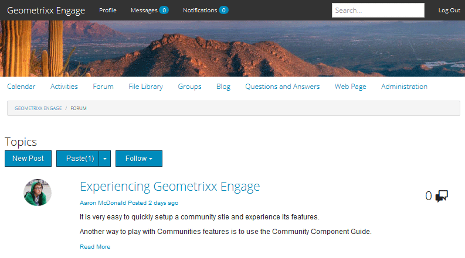

# Community-Inhalte moderieren {#moderating-community-content}

## Überblick {#overview}

Community-Inhalte, auch als benutzergenerierte Inhalte (User-Generated Content, UGC) bezeichnet, werden erstellt, wenn ein Mitglied (bei Site-Besuchern angemeldet) Inhalte von einer veröffentlichten Community-Site durch Interaktion mit einer der folgenden Community-Komponenten postet:

* [Blog](/help/communities/blog-feature.md): Mitglieder posten einen Blog-Artikel oder -Kommentar.
* [Kalender](/help/communities/calendar.md): Mitglieder posten ein Kalenderereignis oder einen Kommentar.
* [Kommentare](/help/communities/comments.md): Mitglieder posten einen Kommentar oder antworten auf einen Kommentar.

* [Forum](/help/communities/forum.md): Mitglieder posten ein neues Thema oder antworten auf ein Thema.
* [Ideation](/help/communities/ideation-feature.md): Mitglieder posten eine Idee oder einen Kommentar.
* [QnA](/help/communities/working-with-qna.md): Mitglieder erstellen eine Frage oder beantworten eine Frage.
* [Reviews](/help/communities/reviews.md): Mitglieder posten einen Kommentar, wenn sie ein Element bewerten.

Die Moderation von UGC ist nützlich, um positive Beiträge zu erkennen und negative (wie Spam und missbräuchliche Sprache) zu begrenzen. UGC kann in verschiedenen Umgebungen moderiert werden:

* [Community-Inhaltsspeicher](working-with-srp.md)

* [Konsole für die Massenmoderation](moderation.md)

  Auf die Moderationskonsole können Administratoren und [Community-Moderatoren](/help/communities/users.md) in der öffentlichen Umgebung und Administratoren in der Autorenumgebung zugreifen. Dies ist möglich, wenn Community-Inhalte in einem [Common Store](/help/communities/working-with-srp.md) gespeichert werden.

* [Kontextbezogene Moderation](in-context.md)

  Die Moderation in der Publish-Umgebung kann von Administratoren und Community-Moderatoren direkt auf der Seite durchgeführt werden, auf der der Inhalt veröffentlicht wurde.

## Moderationsaktionen {#moderation-actions}

Die Aktionen, die für gepostete Inhalte (UGC) durchgeführt werden können, variieren je nach Benutzeridentität und Umgebung. In der folgenden Tabelle wird die folgende Terminologie verwendet, um die verschiedenen Rollen gemäß der Benutzeridentität zu beschreiben:

* `Admin`

  Ein Benutzer, der Mitglied der Gruppe &quot;[-](users.md)&quot; ist.

* `Moderator`

  Mitglied einer Gruppe [Community-Moderatoren](users.md#publishenvironmentusersandgroups) (hat [Moderatorberechtigungen](in-context.md#moderatorpermissions)).

* `Creator`

  Der Benutzer, der den Inhalt veröffentlicht hat.

* `Member`

  Ein angemeldeter Benutzer ohne spezielle Berechtigungen.

* `Visitor`

  Ein anonymer Benutzer.

<table>
 <tbody>
  <tr>
   <td> </td>
   <td><strong>Admin</strong></td>
   <td><strong>Moderator</strong></td>
   <td><strong>Ersteller</strong></td>
   <td><strong>Mitglied</strong></td>
   <td><strong>Besucher</strong></td>
   <td><strong>Ereignis  Ausgelöst</strong></td>
   <td><strong>vormoderiert</strong></td>
  </tr>
  <tr>
   <td><strong>Bearbeiten/  löschen</strong></td>
   <td>X</td>
   <td>X</td>
   <td>X</td>
   <td> </td>
   <td> </td>
   <td> </td>
   <td> </td>
  </tr>
  <tr>
   <td><strong>Ausschneiden</strong></td>
   <td>X</td>
   <td>X</td>
   <td> </td>
   <td> </td>
   <td> </td>
   <td> </td>
   <td> </td>
  </tr>
  <tr>
   <td><strong>Ablehnen</strong></td>
   <td>X</td>
   <td>X</td>
   <td> </td>
   <td> </td>
   <td> </td>
   <td>X</td>
   <td> </td>
  </tr>
  <tr>
   <td><strong>Schließen/  erneut öffnen</strong></td>
   <td>X</td>
   <td>X</td>
   <td> </td>
   <td> </td>
   <td> </td>
   <td>X</td>
   <td>x  </td>
  </tr>
  <tr>
   <td><strong>Markierung aufheben/ </strong></td>
   <td>X</td>
   <td>X</td>
   <td> </td>
   <td>X</td>
   <td> </td>
   <td>X</td>
   <td> </td>
  </tr>
  <tr>
   <td><strong>Zulassen</strong></td>
   <td>X</td>
   <td>X</td>
   <td> </td>
   <td> </td>
   <td> </td>
   <td>X</td>
   <td>X</td>
  </tr>
 </tbody>
</table>

### Bearbeiten/Löschen {#edit-delete}

Nachdem ein Beitrag erstellt wurde, kann er vom Ersteller, einem Administrator oder Community-Moderator bearbeitet oder gelöscht werden.

Wenn benutzergenerierter Inhalt gelöscht wird, wird er aus dem Repository entfernt und kann möglicherweise nicht wiederhergestellt werden.

### Ausschneiden {#cut}

Es ist möglich, dass ein Administrator oder Community-Moderator ein oder mehrere Forumsthemen oder QNa-Fragen von einem Ort an einen anderen verschiebt. Dies umfasst von einer Community-Site zu einer anderen Community-Site, sofern dasselbe Mitglied auf beiden Sites Moderationsrechte hat.

Durch Auswahl der Aktion Ausschneiden wird der Inhalt in die Zwischenablage kopiert. Mehrere Beiträge können kopiert und als Gruppe an den neuen Speicherort verschoben werden.

Wenn andererseits Inhalt in der Zwischenablage vorhanden ist, wird neben Neuer Beitrag eine Schaltfläche Einfügen mit einer Zahl angezeigt, die die Anzahl der einzufügenden Beiträge angibt. Die Schaltfläche Einfügen enthält eine Option zum Löschen der Zwischenablage anstatt des Einfügens.

### Ablehnen {#deny}

Ein Moderator kann die Sichtbarkeit von benutzergenerierten Inhalten auf der veröffentlichten Website unterbinden. Für Administratoren und Community-Moderatoren ist der Beitrag weiterhin verfügbar und wird als Spam gekennzeichnet.

### Schließen/Erneut öffnen {#close-reopen}

Die Aktion „Schließen“ gilt für den gesamten Konversations-Thread (ein Forumsthema oder der ursprüngliche Kommentar) und umfasst alle nachfolgenden Beiträge oder Antworten.

Nach Abschluss des Vorgangs sind nicht nur keine weiteren Antworten möglich, sondern es sind auch keine Moderationsmaßnahmen zulässig.

Um Vorgänge auszuführen, muss das Thema oder der Kommentar erneut geöffnet werden.

Die Aktion „Schließen/Erneut öffnen“ kann von Administratoren oder Community-Moderatoren ausgeführt werden.

### Markierung/Markierung aufheben {#flag-unflag}

Das Kennzeichnen ist ein Mittel für jedes angemeldete Mitglied mit Ausnahme des Erstellers des Inhalts, um anzugeben, dass ein Problem mit dem Inhalt eines Posts besteht. Nach der Kennzeichnung wird das Symbol zum Aufheben der Kennzeichnung angezeigt, sodass dasselbe Mitglied die Kennzeichnung des Inhalts aufheben kann.

Kontextbezogene Moderation kann so konfiguriert werden, dass Mitglieder beim Kennzeichnen eines Beitrags einen Grund auswählen können. Die Liste der auswählbaren Markierungsgründe ist konfigurierbar, einschließlich der Frage, ob ein benutzerdefinierter Grund eingegeben werden kann. Der Markierungsgrund wird beim UGC gespeichert, aber der Grund hat keinen Trigger für eine bestimmte Aktion. Nur die Anzahl der Markierungen gibt Triggern eine Benachrichtigung. Markierte Inhalte werden als solche kommentiert, sodass Moderatoren darauf reagieren können.

Das System verfolgt alle Markierungen, die markiert wurden, und den Markierungsgrund und sendet ein Ereignis, wenn der Schwellenwert erreicht wurde. Wenn der UGC von einem Community-Moderator zugelassen wird, werden diese Flags archiviert. Wenn nach dem Zulassen und Archivieren nachfolgende Markierungen vorhanden sind, werden diese so archiviert, als ob es keine vorherigen Markierungen gegeben hätte.

### Zulassen {#allow}

Die Aktion „Zulassen“ ist eine Option für benutzergenerierten Inhalt, der gekennzeichnet, verweigert oder in einem vormoderierten System nicht genehmigt wurde. Die Aktion Zulassen löscht alle markierten oder abgelehnten/Spam-Status und archiviert alle markierten Daten.

## Allgemeine Moderationskonzepte {#common-moderation-concepts}

### Vormoderation {#premoderation}

Wenn UGC vormoderiert wird, wird der Beitrag erst dann auf der veröffentlichten Website angezeigt, wenn er durch eine Moderationsaktion genehmigt wurde. Wenn Sie bei der Erstellung einer [Community-Site](/help/communities/sites-console.md) das Kontrollkästchen [Inhalt wird vormoderiert](sites-console.md#moderation) aktivieren, wird die Vormoderation für die gesamte Site aktiviert. Wenn Komponenten auf einer Seite platziert werden, können Komponenten, die die Moderation unterstützen, über eine Einstellung im Bearbeitungsdialogfeld für die Vormoderation konfiguriert werden:

* [Kommentare](comments.md) und [Bewertungen](reviews.md)
in **[!UICONTROL Benutzermoderation]** > **[!UICONTROL Pre-Moderation]**.

* [Forum](/help/communities/forum.md), [ideation](/help/communities/ideation-feature.md), [QnA](/help/communities/working-with-qna.md) und [calendar](/help/communities/calendar.md)
in **[!UICONTROL Einstellungen]** > **[!UICONTROL Moderiert]**.

### Spam-Erkennung {#spam-detection}

Die Spam-Erkennung ist eine Funktion zur automatischen Moderation, die unerwünschte Teile gesendeter benutzergenerierter Inhalte herausfiltert, indem sie als Spam markiert werden. Nach der Aktivierung wird anhand einer vorkonfigurierten Sammlung von Spam-Wörtern erkannt, ob es sich bei einem benutzergenerierten Inhalt um Spam handelt. Die Standard-Spam-Wörter finden Sie unter

`/libs/settings/community/sites/moderation/spamdetector-conf/profiles/spam_words.txt`.

Um jedoch die standardmäßigen Spam-Wörter anzupassen oder zu erweitern, erstellen Sie im Verzeichnis /apps einen Satz von Wörtern, der der Struktur der standardmäßigen Spam-Wörter mit &quot;[&quot; &#x200B;](/help/communities/overlay-comments.md).

Ein benutzergenerierter Beitrag (über alle Inhaltstypen hinweg, z. B. Blogs, Foren und Kommentare), der Spam-Wörter enthält, ist mit dem Text „Dieser Beitrag wurde als Spam klassifiziert“ über dem Beitrag markiert.

Moderator kann einen solchen Beitrag sehen und markieren Sie den gleichen, um zu erlauben oder zu verweigern, auf der Website zu erscheinen. Moderationsaktionen für diese Beiträge können entweder kontextbezogen oder über die Benutzeroberfläche für die Massenmoderation ausgeführt werden.

Gehen Sie wie folgt vor, um die Spam-Erkennungs-Engine zu aktivieren:

1. Öffnen Sie [Web](https://localhost:4502/system/console/configMgr)Konsole“, indem Sie zu `/system/console/configMgr` wechseln.

1. Suchen Sie die Konfiguration **AEM Communities Auto Moderation** und bearbeiten Sie sie.
1. Fügen Sie den Eintrag **[!UICONTROL SpamProcess]** hinzu.

>[!NOTE]
>
>Die Spam-Erkennung ist nur für englische Gebietsschemata implementiert.

### Empfindung {#sentiment}

Die Stimmung wird anhand der Anzahl positiver und negativer Keywords ([watchwords](#configuringwatchwords)) in einem Beitrag (UGC) berechnet.

Die Stimmungsanalyse verwendet einen Satz vorkonfigurierter Regeln und berechnet die Stimmungslage des benutzergenerierten Inhalts (UGC). Die Standardregeln sind unter `/libs/cq/workflow/components/workflow/social/sentiments/rules`.

Die Regeln erzeugen einen Wert von 1 (alle negativen, keine positiven Wörter) bis 10 (alle positiven, keine negativen Wörter). Ein Gefühlswert von 5 ist eine neutrale Empfindung und der Standardwert.

Die in der /libs-Komponente definierten Regeln sind:

* Regel 1: Setzen Sie den Wert auf 1, wenn keine positiven Wörter und mindestens ein negatives Wort vorhanden sind.
* Regel 2: Setzen Sie den Wert auf 10, wenn keine negativen Wörter und mindestens ein positives Wort vorhanden sind.
* Regel 3: Setzen Sie den Wert auf 3, wenn mehr negative Wörter als positive Wörter vorhanden sind.
* Regel 4: Setzen Sie den Wert auf 8, wenn mehr positive als negative Wörter vorhanden sind.

Um Regeln zu überschreiben oder hinzuzufügen, erstellen Sie im Verzeichnis /apps einen Regelsatz entsprechend der Struktur der Standardregeln. Bearbeiten Sie die Konfiguration der Gefühle, damit Sie den Speicherort der Regeln identifizieren können.

Nach der Analyse wird die Stimmung mit dem UGC gespeichert.

In der [Konsole für die Massenmoderation](/help/communities/moderation.md) ist es möglich, benutzergenerierten Inhalt zu filtern und anzuzeigen, je nachdem, ob die Stimmung negativ, neutral oder positiv ist.

#### Schlagwörter {#watchwords}

AEM Communities bietet einen *Schlagwortanalysator* als Schritt bei der Auswertung von [Sentiment](#sentiment). Der Beitrag zum Sentimentwert von Schlagwörtern beruht auf einem Vergleich von negativen und positiven Schlagwörtern, die im geposteten Inhalt verwendet werden, und verbotenen Wörtern.

#### Konfigurieren von Sentiments und Schlagwörtern {#configure-sentiment-and-watchwords}

Die Liste der positiven und negativen Schlagwörter kann angepasst werden, ebenso wie die Stimmungsregeln.

Die Standardliste von Schlüsselwörtern kann als Eigenschaften eines Knotens im Repository eingegeben werden, ähnlich wie bei der Standardliste, oder indem die Standardeinstellung überschrieben wird, indem der OSGi-Dienst `sentimentprocess.name` mit der Liste der Wörter konfiguriert wird.

Der **sentimentprocess.name** kann auch geändert werden, um auf den Speicherort eines benutzerdefinierten Satzes von Stimmungsregeln zu verweisen.

So konfigurieren Sie Stimmung und Schlagwörter:

* Melden Sie sich bei Ihrer Autoreninstanz als Administrator an.
* Öffnen Sie [Web-Konsole](https://localhost:4502/system/console/configMgr).
* Suchen Sie `sentimentprocess.name`.
* Wählen Sie die Konfiguration aus, damit Sie sie im Bearbeitungsmodus öffnen können.

* **Positive Schlagwörter**

  Eine kommagetrennte Liste von Wörtern, die zu einer positiven Stimmung beitragen, welche die Standardeinstellungen überschreibt. Standard ist eine leere Liste.

* **Negative Schlagwörter**

  Eine kommagetrennte Liste von Wörtern, die zu einer negativen Stimmung beitragen, welche die Standardeinstellungen überschreibt. Standard ist eine leere Liste.

* **Expliziter Pfad zum Watchwords-Knoten**

  Der Repository-Speicherort eines Knotens, der `positive` und `negative` Eigenschaften enthält, die Standard-Schlagwörter spezifizieren. Der Standardwert ist `/libs/settings/community/watchwords/default`.

* **Stimmungsregeln**

  Der Repository-Speicherort der Regeln für die Berechnung der Stimmung basierend auf positiven und negativen Schlagwörtern. Der Standardwert ist `/libs/cq/workflow/components/workflow/social/sentiments/rules` (es ist jedoch kein Workflow mehr beteiligt).

Im Folgenden finden Sie ein Beispiel für einen benutzerdefinierten Eintrag für die Standard-Schlagwörter, wenn `Explicit Path to Watchwords Node` auf `/libs/settings/community/watchwords/default` gesetzt ist.

### Moderatorberechtigungen {#moderator-permissions}

Die folgenden Berechtigungen werden zusammen als `moderator permissions` bezeichnet, wenn sie derselben Ressource zugewiesen sind:

* `Read`
* `Modify`
* `Create`
* `Delete`
* `Replicate`
