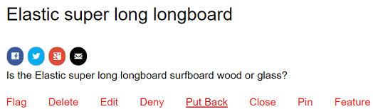
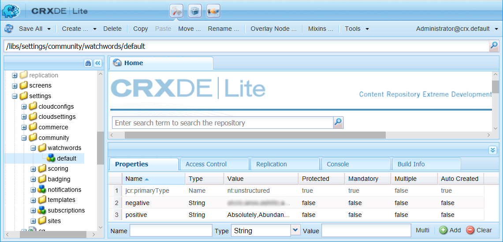

# Moderieren von Community-Inhalten {#moderating-community-content}

## Übersicht {#overview}

Community-Inhalte, auch als benutzergenerierte Inhalte (UGC) bezeichnet, werden erstellt, wenn ein Mitglied (der angemeldete Site-Besucher) Inhalte von einer veröffentlichten Community-Site durch Interaktion mit einer der folgenden Community-Komponenten veröffentlicht:

* [Blog](/help/communities/blog-feature.md): Mitglieder posten einen Blogartikel oder Kommentar.
* [Kalender](/help/communities/calendar.md): Mitglieder posten ein Kalenderereignis oder einen Kommentar.
* [Kommentare](/help/communities/comments.md): Mitglieder posten einen Kommentar oder eine Antwort auf einen Kommentar.

* [Forum](/help/communities/forum.md): Mitglieder veröffentlichen ein neues Thema oder antworten auf ein Thema.
* [Idee](/help/communities/ideation-feature.md): Mitglieder posten eine Idee oder einen Kommentar.
* [Fragen und Antworten](/help/communities/working-with-qna.md): -Mitglieder eine Frage erstellen oder eine Frage beantworten.
* [Überprüfungen](/help/communities/reviews.md): Mitglieder posten einen Kommentar bei der Bewertung eines Artikels.

Die Moderation der benutzergenerierten Inhalte ist nützlich, um positive Beiträge zu erkennen und negative zu begrenzen (z. B. Spam und missbräuchliche Sprache). UGC kann in verschiedenen Umgebungen moderiert werden:

* [Community-Inhaltsspeicherung](working-with-srp.md)

* [Massenmoderationskonsole](moderation.md)

   Auf die Moderationskonsole können Administratoren zugreifen und [Community-Moderatoren](/help/communities/users.md) in der öffentlichen Umgebung sowie von Administratoren in der Autorenumgebung. Dies ist möglich, wenn Community-Inhalte in einer [gemeinsamer Speicher](/help/communities/working-with-srp.md).

* [Kontextbezogene Moderation](in-context.md)

   Die Moderation in der Veröffentlichungsumgebung kann von Administratoren und Community-Moderatoren direkt auf der Seite durchgeführt werden, auf der der Inhalt veröffentlicht wurde.

## Moderationsaktionen {#moderation-actions}

Die Aktionen, die für veröffentlichte Inhalte (UGC) durchgeführt werden können, hängen von der Benutzeridentität und der Umgebung ab. Die folgende Tabelle verwendet die folgende Terminologie, um die verschiedenen Rollen entsprechend der Benutzeridentität zu beschreiben:

* `Admin`

   Ein Benutzer, der Mitglied von [community-administrators](users.md) hinzugefügt.

* `Moderator`

   Mitglied eines [Community-Moderatoren](users.md#publishenvironmentusersandgroups) Gruppe (hat [Moderatorberechtigungen](in-context.md#moderatorpermissions)).

* `Creator`

   Der Benutzer, der den Inhalt veröffentlicht hat.

* `Member`

   Ein angemeldeter Benutzer ohne spezielle Berechtigungen.

* `Visitor`

   Anonymer Benutzer.

<table>
 <tbody>
  <tr>
   <td> </td>
   <td><strong>Admin</strong></td>
   <td><strong>Moderator</strong></td>
   <td><strong>Ersteller</strong></td>
   <td><strong>Mitglied</strong></td>
   <td><strong>Besucher</strong></td>
   <td><strong>Ereignis  Ausgelöst</strong></td>
   <td><strong>Vormoderiert</strong></td>
  </tr>
  <tr>
   <td><strong>Bearbeiten/  Löschen</strong></td>
   <td>X</td>
   <td>X</td>
   <td>X</td>
   <td> </td>
   <td> </td>
   <td> </td>
   <td> </td>
  </tr>
  <tr>
   <td><strong>Ausschneiden</strong></td>
   <td>X</td>
   <td>X</td>
   <td> </td>
   <td> </td>
   <td> </td>
   <td> </td>
   <td> </td>
  </tr>
  <tr>
   <td><strong>Ablehnen</strong></td>
   <td>X</td>
   <td>X</td>
   <td> </td>
   <td> </td>
   <td> </td>
   <td>X</td>
   <td> </td>
  </tr>
  <tr>
   <td><strong>Close/  Neu öffnen</strong></td>
   <td>X</td>
   <td>X</td>
   <td> </td>
   <td> </td>
   <td> </td>
   <td>X</td>
   <td>X  </td>
  </tr>
  <tr>
   <td><strong>Markierung/  Markierung entfernen</strong></td>
   <td>X</td>
   <td>X</td>
   <td> </td>
   <td>X</td>
   <td> </td>
   <td>X</td>
   <td> </td>
  </tr>
  <tr>
   <td><strong>Gastzugang</strong></td>
   <td>X</td>
   <td>X</td>
   <td> </td>
   <td> </td>
   <td> </td>
   <td>X</td>
   <td>X</td>
  </tr>
 </tbody>
</table>

### Bearbeiten/Löschen {#edit-delete}

Nachdem ein Beitrag erstellt wurde, kann er vom Ersteller, einem Administrator oder Community-Moderator bearbeitet oder gelöscht werden.

Wenn UGC gelöscht wird, wird es aus dem Repository entfernt und kann nicht wiederhergestellt werden.

### Ausschneiden {#cut}

Administratoren oder Community-Moderatoren können ein oder mehrere Forenthemen oder Fragen der Fragen der Frage von einem Ort zum anderen verschieben. Dies umfasst von einer Community-Site zu einer anderen Community-Site, sofern dasselbe Mitglied über Moderationsberechtigungen auf beiden Sites verfügt.

Durch Auswahl der Aktion &quot;Ausschneiden&quot;wird der Inhalt in die Zwischenablage kopiert. Es können mehrere Beiträge kopiert und als Gruppe an den neuen Speicherort verschoben werden.

Wenn Inhalte in der Zwischenablage vorhanden sind, wird an der anderen Stelle neben &quot;Neuer Beitrag&quot;die Schaltfläche &quot;Einfügen&quot;angezeigt, wobei eine Zahl die Anzahl der Beiträge angibt, die eingefügt werden sollen. Die Schaltfläche &quot;Einfügen&quot;enthält eine Option zum Löschen der Zwischenablage, anstatt sie einzufügen.

### Ablehnen {#deny}

Ein Moderator kann verhindern, dass UGC auf der veröffentlichten Site sichtbar bleibt. Administratoren und Community-Moderatoren steht der Beitrag weiterhin zur Verfügung und wird als Spam bezeichnet.

### Schließen/erneut öffnen {#close-reopen}

Die Aktion Schließen bezieht sich auf den gesamten Diskussionsthread (ein Forenthema oder der ursprüngliche Kommentar) und enthält alle nachfolgenden Beiträge oder Antworten.

Wenn keine weiteren Antworten möglich sind, sind auch keine Moderationsaktionen zulässig.

Um Vorgänge auszuführen, muss das Thema oder der Kommentar erneut geöffnet werden.

Die Aktion Schließen/Neu öffnen kann von Administratoren oder Community-Moderatoren durchgeführt werden.

### Markierung/Markierung aufheben {#flag-unflag}

Die Kennzeichnung ist eine Möglichkeit für jedes angemeldete Mitglied, mit Ausnahme des Erstellers des Inhalts, anzugeben, dass ein Problem mit dem Inhalt eines Beitrags besteht. Nach der Kennzeichnung wird ein Symbol zum Aufheben der Markierung angezeigt, mit dem dasselbe Mitglied die Kennzeichnung des Inhalts aufheben kann.

Die kontextbezogene Moderation kann so konfiguriert werden, dass Mitglieder beim Kennzeichnen eines Beitrags einen Grund auswählen können. Die Liste der auswählbaren Flag-Gründe ist konfigurierbar, einschließlich der Angabe, ob ein benutzerdefinierter Grund angegeben werden kann. Der Flag-Grund wird mit der UGC gespeichert, der Grund Trigger jedoch keine bestimmte Aktion. Nur die Anzahl der Flags Trigger eine Benachrichtigung. Gekennzeichnete Inhalte werden als solche kommentiert, sodass Moderatoren darauf reagieren können.

Das System verfolgt alle Kennzeichnungen, die markiert sind, und den Grund der Kennzeichnung und sendet ein Ereignis, wenn der Schwellenwert erreicht ist. Wenn die UGC von einem Community-Moderator zugelassen wird, werden diese Flags archiviert. Nach der Erlaubnis und Archivierung würden bei nachfolgenden Flaggschiffen sie so archiviert, als gäbe es keine vorherigen Flaggings.

### Gastzugang {#allow}

Die Aktion Zulassen ist eine Option für benutzergenerierte Inhalte, die in einem vormoderierten System gekennzeichnet, abgelehnt oder nicht genehmigt wurde. Mit der Aktion Zulassen werden alle gekennzeichneten oder abgelehnten/Spam-Status gelöscht und alle gekennzeichneten Daten werden archiviert.

## Allgemeine Moderationskonzepte {#common-moderation-concepts}

### Vormoderation {#premoderation}

Wenn UGC vormoderiert ist, wird der Beitrag erst dann auf der veröffentlichten Site angezeigt, wenn er durch eine Moderationsaktion genehmigt wurde. Während der Erstellung einer [Community-Site](/help/communities/sites-console.md), das Kontrollkästchen [Inhalt ist vormoderiert](sites-console.md#moderation) aktiviert die Vormoderation für die gesamte Site. Sobald Komponenten auf einer Seite platziert sind, können Komponenten, die Moderation unterstützen, mit einer Einstellung im Bearbeitungsdialogfeld für die Vormoderation konfiguriert werden:

* [Kommentare](comments.md) und [Bewertungen](reviews.md)
in **[!UICONTROL Benutzermoderation]** > **[!UICONTROL Vormoderation]**.

* [Forum](/help/communities/forum.md), [Idee](/help/communities/ideation-feature.md), [Fragen und Antworten](/help/communities/working-with-qna.md)und [calendar](/help/communities/calendar.md)
in **[!UICONTROL Einstellungen]** > **[!UICONTROL Moderiert]**.

### Spam-Erkennung {#spam-detection}

Die Spam-Erkennung ist eine Funktion der automatischen Moderation, die unerwünschte Teile gesendeter benutzergenerierter Inhalte herausfiltert, indem diese als Spam gekennzeichnet werden. Nach der Aktivierung wird anhand einer vorkonfigurierten Sammlung von Spam-Wörtern ermittelt, ob der vom Benutzer erstellte Inhalt Spam ist oder nicht. Die standardmäßigen Spam-Wörter finden Sie unter

`/libs/settings/community/sites/moderation/spamdetector-conf/profiles/spam_words.txt`.

Um jedoch die standardmäßigen Spam-Wörter anzupassen oder zu erweitern, erstellen Sie eine Reihe von Wörtern im Verzeichnis /apps, die der Struktur der standardmäßigen Spam-Wörter folgen, indem Sie [Overlay](/help/communities/overlay-comments.md).

Ein benutzergenerierter Beitrag (über alle Inhaltstypen hinweg, z. B. Blogs, Foren und Kommentare), der Spam-Wörter enthält, wird mit dem Text &quot;Dieser Beitrag wurde als Spam klassifiziert&quot;über dem Beitrag markiert.

Moderatoren können einen solchen Beitrag sehen und denselben markieren, um die Anzeige auf der Site zu ermöglichen oder zu verweigern. Moderationsaktionen für diese Beiträge können entweder kontextbezogen oder über die Massenmoderations-Benutzeroberfläche durchgeführt werden.

Gehen Sie wie folgt vor, um die Spamerkennungs-Engine zu aktivieren:

1. Öffnen [Web-Konsole](https://localhost:4502/system/console/configMgr), indem Sie `/system/console/configMgr`.

1. Suchen **Automatische AEM Communities-Moderation** und bearbeiten Sie sie.
1. Fügen Sie die **[!UICONTROL SpamProcess]** eingeben.

>[!NOTE]
>
>Die Spam-Erkennung wird nur für das englische Gebietsschema implementiert.

### Empfindung {#sentiment}

Das Sentiment wird anhand der Anzahl positiver und negativer Suchbegriffe ([Schlagwörter](#configuringwatchwords)) in einem Beitrag vorhanden ist (UGC).

Die Sentimentanalyse verwendet einen Satz vorkonfigurierter Regeln und berechnet das Sentiment der UGC. Die Standardregeln befinden sich unter: `/libs/cq/workflow/components/workflow/social/sentiments/rules.`

Der Wert, den die Regeln generieren, reicht von 1 (alle negativen, keine positiven Wörter) bis 10 (alle positiven, keine negativen Wörter). Der Sentimentwert 5 ist ein neutrales Sentiment und der Standardwert.

Die in der Komponente /libs definierten Regeln sind:

* Regel 1: Setzen Sie den Wert auf 1, wenn keine positiven und mindestens ein negatives Wort vorhanden sind.
* Regel 2: Setzen Sie den Wert auf 10, wenn keine negativen und mindestens ein positives Wort vorhanden sind.
* Regel 3: Setzen Sie den Wert auf 3, wenn es mehr negative Wörter als positive Wörter gibt.
* Regel 4: den Wert auf 8 setzen, wenn positivere Wörter als negative Wörter vorhanden sind.

Um Regeln zu überschreiben oder hinzuzufügen, erstellen Sie einen Regelsatz im Verzeichnis /apps entsprechend der Struktur der Standardregeln. Bearbeiten Sie die Sentimentkonfiguration, um den Speicherort der Regeln anzugeben.

Nach der Analyse wird das Sentiment mit dem UGC gespeichert.

Aus dem [Massenmoderationskonsole](/help/communities/moderation.md)kann UGC basierend darauf gefiltert und angezeigt werden, ob das Sentiment negativ, neutral oder positiv ist.

#### Schlagwörter {#watchwords}

AEM Communities bietet eine *Watchword-Analyse* als einen Schritt im Prozess zur Bewertung [sentiment](#sentiment). Der Beitrag zum Sentimentwert, der von Schlagwörtern bereitgestellt wird, ist auf einen Vergleich von negativen und positiven Schlagwörtern, die im veröffentlichten Inhalt verwendet werden, sowie verbotenen Wörtern zurückzuführen.

#### Konfigurieren von Sentimenten und Schlagwörtern {#configure-sentiment-and-watchwords}

Die Liste positiver und negativer Schlagwörter kann wie die Sentimentregeln angepasst werden.

Die Standardliste der Schlagwörter kann als Eigenschaften eines Knotens im Repository eingegeben werden, ähnlich wie die Standardliste oder indem der Standard durch Konfiguration des OSGi-Dienstes überschrieben wird `sentimentprocess.name` mit der Wortliste.

Die **sentimentprocess.name** kann auch geändert werden, um auf den Speicherort eines benutzerdefinierten Satzes von Sentimentregeln zu verweisen.

So konfigurieren Sie Sentiment und Schlagwörter:

* Melden Sie sich bei Ihrer Autoreninstanz als Administrator an.
* Öffnen [Web-Konsole](https://localhost:4502/system/console/configMgr).
* Suchen `sentimentprocess.name`.
* Wählen Sie die Konfiguration aus, die im Bearbeitungsmodus geöffnet werden soll.

* **Positive Watchwords**

   Eine kommagetrennte Liste von Wörtern, die zu einem positiven Sentiment beitragen, das die Standardwerte außer Kraft setzt. Der Standardwert ist eine leere Liste.

* **Negative Schlagwörter**

   Eine kommagetrennte Liste von Wörtern, die zu einem negativen Sentiment beitragen, das die Standardwerte außer Kraft setzt. Der Standardwert ist eine leere Liste.

* **Expliziter Pfad zum Watchwords-Knoten**

   Der Repository-Speicherort eines Knotens, der den Standard enthält `positive` und `negative` Eigenschaften, die standardmäßige Schlagwörter angeben. Der Standardwert ist `/libs/settings/community/watchwords/default`.

* **Sentimentregeln**

   Der Repository-Speicherort der Regeln zur Berechnung des Sentiments basierend auf positiven und negativen Schlagwörtern. Der Standardwert ist `/libs/cq/workflow/components/workflow/social/sentiments/rules` (es ist jedoch kein Workflow mehr beteiligt).

Im Folgenden finden Sie ein Beispiel für einen benutzerdefinierten Eintrag für die standardmäßigen Schlagwörter, wenn `Explicit Path to Watchwords Node` auf `/libs/settings/community/watchwords/default`.

### Moderatorberechtigungen {#moderator-permissions}

Die folgenden Berechtigungen werden, wenn sie derselben Ressource zugewiesen sind, zusammen als `moderator permissions`:

* `Read`
* `Modify`
* `Create`
* `Delete`
* `Replicate`
