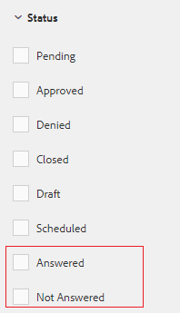

# Moderationskonsole {#moderation-console}

In AEM Communities ist die Massenmoderation von Community-Inhalten](/help/communities/moderate-ugc.md) sowohl in der Autoren- als auch in der Veröffentlichungsumgebung durch Administratoren und Community-Moderatoren möglich (vertrauenswürdige Community-Mitglieder, die als Moderatoren zugewiesen sind).[

Administratoren und Community-Moderatoren können auch [kontextbezogene Moderation](/help/communities/in-context.md) in der Veröffentlichungsumgebung durchführen.

Eine Funktion aller [Community-Sites](/help/communities/sites-console.md) ist ein `Administration`-Menüelement, das Benutzern zur Verfügung steht, die sich mit Administratorrechten anmelden. Der Link `Administration` bietet Zugriff auf die Moderationskonsole.

In der Moderationskonsole haben Administratoren und Community-Moderatoren Zugriff auf alle benutzergenerierten Inhalte (UGC), deren Moderation sie zulassen können. Wenn es zulässig ist, mehrere Sites zu moderieren, können Sie Beiträge auf allen Sites anzeigen oder nach ausgewählten Communities-Sites filtern.

Weitere Informationen finden Sie unter [Verwalten von Benutzern und Benutzergruppen](/help/communities/users.md).

Die Moderationskonsole unterstützt:

* Massenmäßige Durchführung von Moderationsaufgaben.
* Suchen nach benutzergenerierten Inhalten.
* Anzeigen von UGC-Details.
* Anzeigen von UGC-Autorendetails.

Moderationsaufgaben können nur ausgeführt werden, wenn sie als Administrator oder Mitglied mit ` [moderator permissions](/help/communities/in-context.md#identifyingtrustedmembers)` angemeldet sind.

## Zugriff auf die Veröffentlichungsumgebung {#publish-environment-access}

Der Zugriff auf die Moderationskonsole von einer veröffentlichten Community-Site aus erfolgt über einen Link &quot;Administration&quot;, der angezeigt wird, wenn ein Community-Moderator angemeldet ist.

Über den Link Administration wird die Moderationskonsole angezeigt:

## Zugriff auf Autorenumgebung {#author-environment-access}

In der Autorenumgebung, um die Moderationskonsole zu erreichen

* Wählen Sie in der globalen Navigation **[!UICONTROL Communities]** > **[!UICONTROL Moderation]** aus.

Nur wenn Sie als Administrator oder Mitglied mit [Moderatorberechtigungen](/help/communities/in-context.md#identifyingtrustedmembers) angemeldet sind, können Moderationsaufgaben ausgeführt werden. Der einzige angezeigte Community-Inhalt ist derjenige, den das angemeldete Mitglied moderieren darf.

>[!NOTE]
>
>UGC aus der Veröffentlichungsumgebung ist nur dann in der Autoreninstanz sichtbar, wenn das ausgewählte SRP einen gemeinsamen Speicher implementiert. Beispielsweise ist der Speicher standardmäßig JSRP, kein gängiger Speicher für Autoren- und Veröffentlichungsinstanz. Weitere Informationen finden Sie unter [Community-Inhaltsspeicher](/help/communities/working-with-srp.md).

## Benutzeroberfläche der Moderationskonsole {#moderation-console-ui}

Abgesehen von der linken Navigationsleiste (die auf der Autoreninstanz, aber nicht auf der Veröffentlichungsinstanz angezeigt wird) hat die Moderationsbenutzeroberfläche die folgenden Hauptbereiche:

* **[Navigationsleiste oben](#top-navigation-bar)**
* **[Symbolleiste](#toolbar)**
* **[Inhaltsbereich](#content-area)**

### Navigationsleiste oben {#top-navigation-bar}

Die obere Navigationsleiste ist für alle Konsolen konstant. Weitere Informationen finden Sie unter [Grundlegende Handhabung](/help/sites-authoring/basic-handling.md).

### Symbolleiste {#toolbar}

Die Symbolleiste, die sich unter der oberen Navigationsleiste befindet, stellt den folgenden Umschalter auf der linken Seite bereit:

* [Filter ](/help/communities/moderation.md#filterrail)
railoptiert eine Leiste, in der die Eigenschaften zum Filtern des Inhalts ausgewählt werden können.

Die Symbolleiste, die sich unter der oberen Navigationsleiste befindet, stellt den folgenden Umschalter auf der linken Seite bereit:

[Filter ](/help/communities/moderation.md#filterrail)
optimiert eine Leiste bei Auswahl von Suche, wodurch Eigenschaften zum Filtern des Inhalts ausgewählt werden können.

### Inhaltsbereich {#content-area}

Der Inhaltsbereich enthält Informationen für veröffentlichte UGC:

* UGC veröffentlicht
* Mitgliedsname
* Mitglied Avatar
* Speicherort des Beitrags.
* Wann es gepostet wurde.
* Anzahl der Antworten auf den Beitrag.
*  Dem Beitrag zugeordnete Sentimentdaten
* Bei Genehmigung wird ein Häkchen angezeigt.
* Wenn eine Anlage vorhanden ist, wird eine Papierklammer angezeigt.

>[!NOTE]
> 
>Der Inhaltsbereich verfügt über einen *unendlichen Bildlauf*, was bedeutet, dass Sie mit dem Bildlauf fortfahren können, bis Sie das Ende des Inhalts erreicht haben. Die Symbolleiste bleibt auch beim Scrollen an einer festen, sichtbaren Position über dem Inhaltsbereich.

### Filterleiste {#ootbfilters}

Das Symbol für das seitliche Bedienfeld öffnet die Filterleiste. Die Filterleiste, die links neben dem Inhaltsbereich angezeigt wird, bietet verschiedene Filter, von denen jeder unmittelbare Auswirkungen auf die referenzierte benutzergenerierte Inhalte hat, die im Inhaltsbereich angezeigt werden.

Die Filter in jeder Kategorie sind **OR**&#39;d zusammen, und die Filter in verschiedenen Kategorien sind **AND**&#39;d zusammen.

Wenn Sie beispielsweise sowohl **Frage** als auch **Antwort** aktivieren, werden Inhalte angezeigt, die entweder eine **Frage** *oder* und eine **Antwort** sind.

Wenn Sie jedoch **Frage** und **Ausstehend** aktivieren, wird nur Inhalt angezeigt, der eine **Frage** ist und **Ausstehend** lautet.

>[!NOTE]
>
>Community-Moderatoren können die vordefinierten Filter in der Benutzeroberfläche der Moderationskonsole mit einem Lesezeichen versehen. Da diese Filter an das Ende der URL angehängt werden (als Abfragezeichenfolgenparameter), können Moderatoren später zu den mit Lesezeichen versehenen Filtern zurückkehren und diese Links auch freigeben.

Wenn die Filterleiste geöffnet ist, wird das seitliche Bedienfeld durch das Symbol Suchen geschlossen. Wenn Sie jedoch die Filterleiste schließen und nur den vom Benutzer generierten Inhalt anzeigen möchten, klicken Sie auf das Symbol Suchen und wählen Sie die Option Nur Inhalt .

#### Inhalts-Pfad {#content-path}

Der Inhaltspfad beschränkt die angezeigte Referenz-UGC auf die im angegebenen Inhalts-Repository platzierten Beiträge.

#### Textsuche {#text-search}

Die Textsuche beschränkt die Anzeige des referenzierten benutzergenerierten Inhalts auf Beiträge, die den eingegebenen Text enthalten.

#### Website {#site}

Die Site beschränkt die Anzeige des referenzierten benutzergenerierten Inhalts auf Beiträge auf ausgewählten Community-Sites. Wenn keine Sites aktiviert sind, werden alle Verweise auf UGC angezeigt.

>[!NOTE]
>
>Wenn ein Administrator auf die Massen-Moderationskonsole zugreift, werden alle Verweise auf UGC angezeigt, einschließlich der Sites, die nicht mit dem [Website-Erstellungsassistenten](/help/communities/sites-console.md) erstellt wurden, wie z. B. die Geometrixx.
>
>Wenn ein Mitglied der vertrauenswürdigen Community auf die Massen-Moderationskonsole auf der Veröffentlichungsinstanz zugreift, werden nur Verweise auf UGC angezeigt, die für Community-Sites erstellt wurden, die das Mitglied moderieren darf, und können mit dem Site-Filter gefiltert werden.

#### Inhaltstyp {#content-type}

Der Content-Typ beschränkt die angezeigte referenzierte benutzergenerierte Inhaltsanzeige auf Beiträge des ausgewählten Ressourcentyps. Es können ein oder mehrere der folgenden Typen ausgewählt werden. Alle Typen werden angezeigt, wenn keine ausgewählt sind.

* **Kommentar**
* **Forumthema**
* **Forumsantwort**
* **Frage**
* **Antwort**
* **Blog-Artikel**
* **Blog-Kommentar**
* **Kalenderereignis**
* **Kalenderkommentar**
* **Ordner in Dateibibliothek**
* **Dokument in Dateibibliothek**
* **Idee**
* **Ideen-Kommentar**

#### Zusätzliche Content-Typen {#additional-content-types}

So fügen Sie zusätzliche Ressourcen zum Filtern hinzu:

* Melden Sie sich bei Ihrer Autoreninstanz als Administrator an.
* Öffnen Sie [Web Console](https://localhost:4502/system/console/configMgr).
* Suchen Sie `AEM Communities Moderation Dashboard Filters`.
* Wählen Sie die Konfiguration aus, die im Bearbeitungsmodus geöffnet werden soll.
* Geben Sie den Ressourcentyp einer Komponente ein, nach der gefiltert werden soll:

   * Um beispielsweise nach eingeschlossenen Abstimmungskomponenten zu filtern, geben Sie Folgendes ein:

      `Voting=social/tally/components/hbs/voting`
   

* Wählen Sie Speichern aus.
* Aktualisieren Sie die Konsole Communities - Moderation .

Das Ergebnis ist ein neuer auswählbarer Filter für `Voting` unter der Filtergruppe `Content Type`.

Wenn dieser Filter ausgewählt ist, zeigt der Inhalt des Dashboards UGC an, der mit einem der eingegebenen Ressourcentypen übereinstimmt.

#### Status {#status}

Der Status beschränkt die Anzeige des referenzierten benutzergenerierten Inhalts auf Beiträge mit dem ausgewählten Status, bei denen es sich um einen oder mehrere Beiträge mit dem Status Ausstehend, Genehmigt, Verweigert oder Geschlossen sowie Entwurf oder Geplant für Blogartikel sowie Beantwortet oder Nicht beantwortet für Fragen zur Fragen zur Fragen der Fragen. Wenn keine ausgewählt ist, werden alle angezeigt.

>[!NOTE]
>
>Wenn nur der Status Nicht beantwortet ausgewählt ist, sieht der Moderator den gesamten Inhalt (für alle Inhaltstypen) mit Ausnahme der beantworteten Fragen. Dies liegt daran, dass die Eigenschaft, die für die beantwortet Frage verantwortlich ist, nicht vorhanden ist, wenn Fragen nicht beantwortet werden und andere Inhalte wie Forenthema, Blog-Artikel oder Kommentare enthalten sind.

#### Kennzeichnung {#flagging}

Durch die Kennzeichnung wird der referenzierte benutzergenerierte Inhalt auf Beiträge beschränkt, die als markiert oder ausgeblendet gekennzeichnet sind.

Sobald ein Inhaltselement gekennzeichnet ist, bleibt es so lange gekennzeichnet, bis Sie dieses einzelne Inhaltselement aufheben, indem Sie die Schaltfläche **Flag** erneut auswählen. Beachten Sie, dass es keine Kennzeichnungsebenen gibt, z. B. &quot;Wichtig&quot;oder &quot;Follow-up&quot;.

#### Mitglieder {#members}

Mitglieder beschränken die referenzierte UGC, die für UGC angezeigt wird, die durch den eingegebenen Mitgliedsnamen veröffentlicht wurde.

#### Veröffentlichungszeitraum {#posted-in-the-last}

Posted In Last limits the referenced UGC displayed to posts in the last hour, day, week, month, or year.

#### Empfindung {#sentiment}

 Sentimenteinschränkt die referenzierte UGC, die für Beiträge mit einem Sentimentwert angezeigt wird, der entweder positiv, negativ oder neutral ist.

## Benutzerdefinierte Filter {#custom-filters}

Neben den vordefinierten Filtern in [Filterleiste](/help/communities/moderation.md#ootbfilters) können der Moderations-Benutzeroberfläche weitere benutzerdefinierte Filter für Metadaten hinzugefügt werden. Entwickler können den Beispielcode in Github verwenden, um die vorhandenen Filter der Moderations-Benutzeroberfläche zu erweitern.

Das [Beispielprojekt](https://github.com/Adobe-Marketing-Cloud/aem-communities-extensions/tree/main/aem-communities-moderation-filter) auf Github implementiert den Tag-Filter, um die UGC-Liste basierend darauf zu filtern, ob die spezifischen Tags auf benutzergenerierte Inhalte angewendet werden. Sie können dem Beispielcode folgen und analoge Filter für andere ähnliche UGC-Metadatenfelder erstellen.

So installieren Sie das Beispiel für den Filter Tags :

1. Öffnen Sie den Paketmanager in der AEM-Autoreninstanz ([https://[aem-author]:4502/crx/packmgr/index.jsp](https://aem65-communities-demo.corp.adobe.com:4502/crx/packmgr/index.jsp)) und in der AEM-Veröffentlichungsinstanz ([https://[aem-publish]:4503/crx/packmgr/index.jsp](https://aem65-communities-demo.corp.adobe.com:4502/crx/packmgr/index.jsp)).
1. Erstellen Sie das Paket `com.adobe.social.sample.moderation.filter.ui.apps-1.0-SNAPSHOT.zip` aus dem Github-Code und installieren und aktivieren Sie es.
1. Öffnen Sie die Bundles-Konsole in der AEM-Autoreninstanz ( `https://[aem-author]:4502/system/console/bundles`) und in der AEM-Veröffentlichungsinstanz ( `https://[aem-publish]:4503/system/console/bundles`).
1. Erstellen Sie das Paket ` [com](https://sample-moderation-filter.com/).adobe.social.sample.moderation.filter.core-1.0-SNAPSHOT.jar` von Github und installieren und aktivieren Sie es.
1. Wechseln Sie zum Knoten **/apps/social/moderation/facets** in der AEM-Autoreninstanz ([https://[aem-author]:4502/crx/de/index.jsp#/apps/social/moderation/facets](https://aem65-communities-demo.corp.adobe.com:4502/crx/de/index.jsp#/apps/social/moderation/facets)) und AEM-Veröffentlichung ([https://[aem-publish]:4502/crx/de/index.jsp#/social/moderation/facets](https://aem65-communities-demo.corp.adobe.com:4502/crx/de/index.jsp#/apps/social/moderation/facets) -Instanz.
1. Fügen Sie einen technischen Benutzer **communities-utility-reader** mit `jcr:read` -Berechtigungen hinzu.

So stellen Sie die benutzerdefinierten Filter auf bestehenden Community-Sites bereit:

1. Bearbeiten Sie `Clientlibs` der vorhandenen Moderationsseite `/content/we-retail/us/en/community/moderation/shell3/jcr:content/head/clientlibs.`

   * Neue Kategorie `cq.social.hbs.moderation.v2.` hinzufügen

1. Wechseln zu `/content/we-retail/us/en/community/moderation/shell3/jcr:content/rails/searchWell/items/filters.`

   * Auf neue Komponente festlegen `sling:resourceType = social/moderation/v2/filters.`

1. Rufen Sie `/content/we-retail/us/en/community/moderation/shell3/jcr:content/views/content/items/modcontainer` auf.

   * Auf neue Komponente festlegen `sling:resourceType = social/moderation/v2/modcontainer`.

## Moderationsaktionen {#moderation-actions}

[Moderationsaktionen ](/help/communities/moderate-ugc.md#moderation-actions) können für eine oder mehrere Auswahlen durchgeführt werden, die im Inhaltsbereich oder beim Anzeigen von Inhaltsdetails vorgenommen werden.

Um die Beiträge stapelweise zu moderieren, klicken Sie im Inhaltsbereich auf das Symbol Auswählen () auf einem Beitrag, das angezeigt wird, wenn Sie mit der Maus (Desktop) darauf zeigen oder auf den Beitrag (Mobil) drücken und einen Finger gedrückt halten. Auf diese Weise können Sie den Mehrfachauswahlmodus aufrufen und jetzt die nachfolgenden Beiträge auswählen, die in der Massenmoderierung berücksichtigt werden sollen, indem Sie einfach darauf klicken. Verwenden Sie die in der Symbolleiste angezeigten Schaltflächen, um Moderationsaktionen für die ausgewählten Beiträge durchzuführen. Alle Aktionen werden zur Bestätigung aufgefordert.

Um einen einzelnen Beitrag im Inhaltsbereich zu moderieren, bewegen Sie den Mauszeiger (Desktop) darauf oder drücken Sie die Eingabetaste und halten Sie den Finger auf den Beitrag (Mobil), sodass Schaltflächen auf dem Beitrag erscheinen. Bei der Verwendung einzelner Inhaltsdetails wird nur eine Löschaktion zur Bestätigung aufgefordert.

### Moderieren mehrerer Beiträge {#moderating-multiple-posts}

Rufen Sie den Massenauswahlmodus auf, indem Sie auf das Symbol `Select` für einen Beitrag klicken:

Um den Massenauswahlmodus zu beenden, wählen Sie in der Symbolleiste das Symbol Abbrechen (x) aus:

Moderationsaktionen, die an mehreren Beiträgen durchgeführt werden können:

* Ablehnen
* Löschen
* Beiträge schließen/erneut öffnen

Die Symbole für diese Aktionen werden nur dann in der Symbolleiste angezeigt, wenn mehrere Beiträge ausgewählt sind.

### Moderieren eines einzelnen Beitrags {#moderating-a-single-post}

Im Einzelauswahlmodus ist es möglich:

* Zeigen Sie die Benutzerdetails an, indem Sie den Namen des Benutzers auswählen.
* Zeigen Sie den Beitrag im Kontext an, indem Sie den Link zum Beitrag auswählen.
* [Antwort](#reply)
* [Gastzugang](#allow)
* [Ablehnen](#deny)
* [Löschen](#delete)
* [Schließen](#close)
* Anzeigen von [Moderationsverlauf](#moderation-history)
* [Details anzeigen](#viewdetails)

In der Kartenansicht über den Symbolen für Moderationsaktionen ist der Text des Beitrags vorhanden und darunter sind die Daten, die angeben:

* Wenn Antworten vorliegen und wenn ja, vor der Anzahl der Antworten.
* Wenn es gekennzeichnet wurde.
* Wenn es genehmigt wurde.
* Zeitpunkt der Veröffentlichung des UGC.

#### Antwort {#reply}

Beim Arbeiten mit einem einzelnen Beitrag wird ein Symbol Antworten angezeigt, wenn der UGC-Typ Antworten unterstützt und so konfiguriert ist, dass Antworten zulässig sind.

#### Gastzugang {#allow}

Wenn Sie mit einem einzelnen Beitrag arbeiten, wird das Symbol Zulassen angezeigt, wenn der Beitrag entweder gekennzeichnet oder abgelehnt wurde. Wenn die Option Zulassen aktiviert ist, werden alle Flags gelöscht.

#### Ablehnen {#deny}

Die Moderationsaktion **Ablehnen** ist nur für moderierte Inhalte verfügbar und wird nur im Mehrfachauswahlmodus auf nicht moderierten Inhalten angezeigt.

Nicht moderierte Inhalte werden immer genehmigt.

Inhalt, der moderiert wird, wechselt in den Status Ausstehend und kann später geändert werden, um genehmigt oder abgelehnt zu werden.

Inhalt, der den Status &quot;Ausstehend&quot;verlässt, kann nie in den Status &quot;Ausstehend&quot;zurückkehren. Inhalte, die als genehmigt oder abgelehnt markiert sind, können jederzeit in einen anderen Status geändert werden.

#### Löschen {#delete}

Im Einzelauswahl- oder Massenmodus können Sie Elemente auswählen und löschen. Die Löschaktion führt zu einem Bestätigungsdialogfeld. Nach dem Löschen werden diese Elemente sofort aus dem Inhaltsbereich entfernt. **Sobald UGC gelöscht wurde, wird es dauerhaft aus dem Repository entfernt und kann später nicht mehr abgerufen** werden.

#### Schließen {#close}

Beim Arbeiten mit einem einzelnen Beitrag wird ein Symbol Schließen angezeigt, wenn der UGC-Typ die Möglichkeit unterstützt, weitere Beiträge für diese Ressource zu verhindern.

#### Moderationsverlauf {#moderation-history}

Wenn Sie mit einem einzelnen Beitrag arbeiten, wird beim Bewegen des Mauszeigers über diesen ein Symbol für den Moderationsverlauf angezeigt. Wenn Sie das Symbol auswählen, wird ein Bereich angezeigt, der einen Verlauf der bezüglich des UGC-Beitrags durchgeführten Aktionen enthält.

Um zum Inhaltsbereich zurückzukehren und mehrere UGC-Beiträge anzuzeigen, wählen Sie das X in der oberen rechten Ecke des Detailbereichs der Ansicht aus.

Beispiel:

#### Details anzeigen {#view-detail}

Wenn Sie mit einem einzelnen Beitrag arbeiten, können Sie weitere Details anzeigen, indem Sie die UGC im Detailmodus öffnen.

Bewegen Sie dazu den Mauszeiger über den Beitrag, um das Symbol `View Detail` anzuzeigen, und wählen Sie ihn aus, um ein Bedienfeld mit weiteren Details zum Beitrag anzuzeigen.

Um zum Inhaltsbereich zurückzukehren und mehrere UGC-Beiträge anzuzeigen, wählen Sie das X in der oberen rechten Ecke des Detailbereichs der Ansicht aus.

Beispiel:

