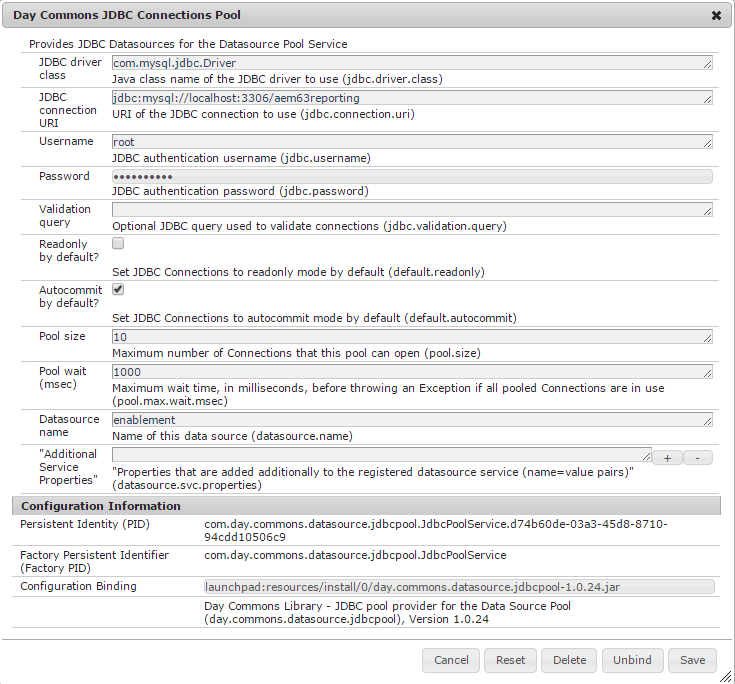

# MySQL-Konfiguration für Aktivierungsfunktionen {#mysql-configuration-for-enablement-features}

MySQL ist eine relationale Datenbank, die in erster Linie für die SCORM-Verfolgung und die Berichte-Daten für die Aktivierungsressourcen verwendet wird. Es sind Tabellen für andere Funktionen wie das Verfolgen der Video-Pause/-Wiederaufnahme enthalten.

Diese Anweisungen beschreiben, wie eine Verbindung zum MySQL-Server hergestellt, die Aktivierungsdatenbank eingerichtet und die Datenbank mit den Ausgangsdaten gefüllt wird.

## Voraussetzungen {#requirements}

Bevor Sie die Funktion zur Aktivierung von MySQL für Communities konfigurieren, stellen Sie sicher, dass

* Installieren Sie [MySQL Server](https://dev.mysql.com/downloads/mysql/) Community Server Version 5.6:
   * Version 5.7 wird für SCORM nicht unterstützt.
   * Kann derselbe Server sein wie die Authoring-AEM-Instanz.
* Installieren Sie auf allen AEM-Instanzen den offiziellen [JDBC-Treiber für MySQL](deploy-communities.md#jdbc-driver-for-mysql).
* Installieren Sie [MySQL Workbench](https://dev.mysql.com/downloads/tools/workbench/).
* Installieren Sie auf allen AEM-Instanzen das [SCORM-Paket](enablement.md#scorm).

## MySQL installieren {#installing-mysql}

MySQL sollte gemäß den Anweisungen für das Zielgruppe OS heruntergeladen und installiert werden.

### Tabellennamen in Kleinbuchstaben {#lower-case-table-names}

Da bei SQL nicht zwischen Groß- und Kleinschreibung unterschieden wird, müssen bei Betriebssystemen, bei denen die Groß-/Kleinschreibung beachtet wird, alle Tabellennamen in Kleinbuchstaben eingestellt werden.

So geben Sie beispielsweise alle Tabellennamen in Kleinbuchstaben unter Linux an:

* Datei bearbeiten `/etc/my.cnf`
* Fügen Sie im `[mysqld]` Abschnitt die folgende Zeile hinzu: `lower_case_table_names = 1`

### UTF8-Zeichensatz {#utf-character-set}

Um eine bessere mehrsprachige Unterstützung zu bieten, muss der UTF8-Zeichensatz verwendet werden.

Ändern Sie MySQL so, dass UTF8 als Zeichensatz verwendet wird:
* mysql > SET NAMES &#39;utf8&#39;;

Ändern Sie die MySQL-Datenbank in UTF8:
* Datei bearbeiten `/etc/my.cnf`
* Fügen Sie im `[client]` Abschnitt Folgendes hinzu: `default-character-set=utf8`
* Fügen Sie im `[mysqld]` Abschnitt Folgendes hinzu: `character-set-server=utf8`

## MySQL Workbench installieren {#installing-mysql-workbench}

MySQL Workbench bietet eine Benutzeroberfläche zum Ausführen von SQL-Skripten, die das Schema und die Ausgangsdaten installieren.

MySQL Workbench sollte gemäß den Anweisungen für das Zielgruppe OS heruntergeladen und installiert werden.

## Aktivierungsverbindung {#enablement-connection}

Wenn MySQL Workbench zum ersten Mal gestartet wird, werden, sofern sie nicht bereits für andere Zwecke verwendet werden, noch keine Verbindungen angezeigt:

### Neue Verbindungseinstellungen {#new-connection-settings}

1. Klicken Sie auf das Symbol &quot;+&quot;rechts neben `MySQL Connections`.
1. Geben `Setup New Connection`Sie im Dialogfeld Werte ein, die für Ihre Plattform zu Demonstrationszwecken geeignet sind, wobei sich die Autoreninstanz AEM und MySQL auf demselben Server befinden:
   * Verbindungsname: `Enablement`
   * Verbindungsmethode: `Standard (TCP/IP)`
   * Hostname: `127.0.0.1`
   * Benutzername: `root`
   * Kennwort: `no password by default`
   * Standard-Schema: `leave blank`
1. Wählen Sie diese Option, `Test Connection` um die Verbindung zum ausgeführten MySQL-Dienst zu überprüfen.

**Hinweise**:
* Der Standardanschluss ist `3306`.
* Die `Connection Name` gewählte Bezeichnung wird als `datasource` Name in der [JDBC OSGi-Konfiguration](#configure-jdbc-connections)eingegeben.

#### Erfolgreiche Verbindung {#successful-connection}

#### Neue Aktivierungsverbindung {#new-enablement-connection}

## Datenbank einrichten {#database-setup}

Beachten Sie beim Öffnen der neuen Aktivierungsverbindung, dass ein Test-Schema und Standardbenutzerkonten vorhanden sind.

### SQL-Skripten abrufen {#obtain-sql-scripts}

Die SQL-Skripten werden mit CRXDE Lite auf der Autoreninstanz abgerufen. Das [SCORM-Paket](deploy-communities.md#scorm) muss installiert sein:

1. Wechseln Sie zu CRXDE Lite:
   * For example, [http://localhost:4502/crx/de](http://localhost:4502/crx/de)
1. Erweitern des `/libs/social/config/scorm/` Ordners
1. Download `database_scormengine.sql`
1. Download `database_scorm_integration.sql`

Eine Möglichkeit zum Herunterladen des Schemas besteht darin,

* Wählen Sie den `jcr:content`Knoten für die SQL-Datei aus.
* Beachten Sie, dass der Wert für die `jcr:data`Eigenschaft ein Link zur Ansicht ist.
* Wählen Sie den Link &quot;Ansicht&quot;, um die Daten in einer lokalen Datei zu speichern.

### SCORM-Datenbank erstellen {#create-scorm-database}

Die zu erstellende SCORM-Datenbank für die Aktivierung lautet:

* name: `ScormEngineDB`
* erstellt aus Skripten:
   * Schema: `database_scormengine.sql`
   * data: Gehen Sie `database_scorm_integration.sql`wie folgt vor ([open](#step-open-sql-file), [execute](#step-execute-sql-script)), um jedes [SQL-Skript](#obtain-sql-scripts) zu installieren. [Aktualisieren Sie](#refresh) bei Bedarf, um die Ergebnisse der Skriptausführung anzuzeigen.

Installieren Sie das Schema, bevor Sie die Daten installieren.

>[!CAUTION]
>
>Wenn der Datenbankname geändert wird, stellen Sie sicher, dass Sie ihn in den folgenden Elementen korrekt angeben:
>
>* [JDBC-Konfiguration](#configure-jdbc-connections)
>* [SCORM-Konfiguration](#configure-scorm)
>

#### Schritt 1: SQL-Datei öffnen {#step-open-sql-file}

In der MySQL-Workbench

* Über das Pulldown-Menü Datei
* Wählen Sie nun eine der folgenden Optionen aus `Open SQL Script ...`
* Wählen Sie in dieser Reihenfolge eine der folgenden Optionen aus:
   1. `database_scormengine.sql`
   1. `database_scorm_integration.sql`

#### Schritt 2: SQL Script ausführen {#step-execute-sql-script}

Wählen Sie im Workbench-Fenster für die in Schritt 1 geöffnete Datei das Skript `lightening (flash) icon` aus.

Beachten Sie, dass die Ausführung des `database_scormengine.sql` Skripts zum Erstellen der SCORM-Datenbank möglicherweise eine Minute in Anspruch nehmen kann.

#### Aktualisieren {#refresh}

Nachdem die Skripten ausgeführt wurden, muss der `SCHEMAS` Abschnitt des Skripts aktualisiert werden, `Navigator` damit die neue Datenbank angezeigt wird. Verwenden Sie das Aktualisierungssymbol rechts neben &quot;SCHEMAS&quot;:

#### Ergebnis: scormenginedb {#result-scormenginedb}

Nach der Installation und Aktualisierung von SCHEMAS wird der Bildschirm angezeigt `scormenginedb` .

## JDBC-Verbindungen konfigurieren {#configure-jdbc-connections}

Der JDBC Connections Pool **von OSGi für** Day Commons konfiguriert den MySQL JDBC-Treiber.

Alle Veröffentlichungs- und Autoreninstanzen von AEM sollten auf denselben MySQL-Server verweisen.

Wenn MySQL auf einem Server ausgeführt wird, der sich von AEM unterscheidet, muss der Hostname des Servers anstelle von &quot;localhost&quot;im JDBC-Connector angegeben werden (der die [ScormEngine](#configurescormengineservice) -Konfiguration ausfüllt).

* Auf jeder Autoren- und Veröffentlichungsinstanz von AEM
* Mit Administratorrechten angemeldet
* Access the [web console](../../help/sites-deploying/configuring-osgi.md)
   * For example, [http://localhost:4502/system/console/configMgr](http://localhost:4502/system/console/configMgr)
* Suchen Sie die `Day Commons JDBC Connections Pool`
* Wählen Sie das `+` Symbol aus, um eine neue Konfiguration zu erstellen

* Geben Sie die folgenden Werte ein:
   * **[!UICONTROL JDBC-Treiberklasse]**: `com.mysql.jdbc.Driver`
   * **DBC-Verbindung URIJ **: Geben Sie`jdbc:mysql://localhost:3306/aem63reporting`den Server anstelle von localhost an, wenn der MySQL-Server nicht mit dem AEM-Server &quot;this&quot;identisch ist.
   * **[!UICONTROL Benutzername]**: Stamm-Node oder geben Sie den konfigurierten Benutzernamen für den MySQL-Server ein, wenn nicht &quot;root&quot;.
   * **[!UICONTROL Kennwort]**: Löschen Sie dieses Feld, wenn für MySQL kein Kennwort festgelegt wurde. Geben Sie andernfalls das konfigurierte Kennwort für den MySQL-Benutzernamen ein.
   * **[!UICONTROL Name]** der Datenquelle: Name, der für die [MySQL-Verbindung](#new-connection-settings)eingegeben wurde, z. B. &quot;Aktivierung&quot;.
* Wählen Sie **[!UICONTROL Speichern]** aus.

## Scorm konfigurieren {#configure-scorm}

### AEM Communities ScormEngine-Dienst {#aem-communities-scormengine-service}

Die OSGi-Konfiguration für den ScormEngine-Dienst **der** AEM Communities konfiguriert SCORM für die Verwendung des MySQL-Servers durch eine Aktivierungsgemeinschaft.

Diese Konfiguration ist vorhanden, wenn das [SCORM-Paket](deploy-communities.md#scorm-package) installiert ist.

Alle Veröffentlichungs- und Autoreninstanzen verweisen auf denselben MySQL-Server.

Wenn MySQL auf einem Server ausgeführt wird, der sich von AEM unterscheidet, muss der Hostname des Servers anstelle von &quot;localhost&quot;im ScormEngine-Dienst angegeben werden, der normalerweise von der [JDBC Connection](#configure-jdbc-connections) -Konfiguration ausgefüllt wird.

* Auf jeder Autoren- und Veröffentlichungsinstanz von AEM
* Mit Administratorrechten angemeldet
* Access the [web console](../../help/sites-deploying/configuring-osgi.md)
   * For example, [http://localhost:4502/system/console/configMgr](http://localhost:4502/system/console/configMgr)
* Suchen Sie die `AEM Communities ScormEngine Service`
* Wählen Sie das Bearbeitungssymbol
   
* Überprüfen Sie, ob die folgenden Parameterwerte mit der [JDBC Connection](#configurejdbcconnectionspool) -Konfiguration übereinstimmen:
   * **[!UICONTROL JDBC-Verbindungs-URI]**: `jdbc:mysql://localhost:3306/ScormEngineDB` ScormEngineDB ** ist der standardmäßige Datenbankname in den SQL-Skripten
   * **[!UICONTROL Benutzername]**: Stamm-Node oder geben Sie den konfigurierten Benutzernamen für den MySQL-Server ein, wenn nicht &quot;root&quot;
   * **[!UICONTROL Kennwort]**: Löschen Sie dieses Feld, wenn für MySQL kein Kennwort festgelegt wurde. Geben Sie andernfalls das konfigurierte Kennwort für den MySQL-Benutzernamen ein.
* Zum folgenden Parameter:
   * **[!UICONTROL Scorm-Benutzerkennwort]**: NICHT BEARBEITEN

      Nur zur internen Verwendung: Es ist für einen speziellen Dienstbenutzer bestimmt, der von AEM Communities zur Kommunikation mit der Scorm-Engine verwendet wird.
* Wählen Sie **[!UICONTROL Speichern]** aus

### Adobe Granite CSRF-Filter {#adobe-granite-csrf-filter}

Um sicherzustellen, dass Aktivierungskurse in allen Browsern korrekt funktionieren, müssen Sie Mozilla als Benutzeragent hinzufügen, der nicht vom CSRF-Filter überprüft wird.

* Melden Sie sich mit Administratorrechten bei der AEM-Veröffentlichungsinstanz an.
* Access the [web console](../../help/sites-deploying/configuring-osgi.md)
   * For example, [http://localhost:4503/system/console/configMgr](http://localhost:4503/system/console/configMgr)
* Suchen Sie `Adobe Granite CSRF Filter`.
* Wählen Sie das Bearbeitungssymbol aus.

   

* Klicken Sie auf das `[+]` Symbol, um einen sicheren Benutzeragent hinzuzufügen.
* Geben Sie Folgendes ein `Mozilla/*`.
* Wählen Sie **[!UICONTROL Speichern]** aus.

