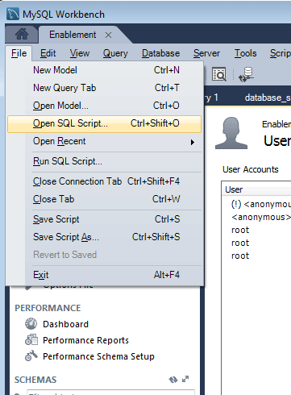

# MySQL-Konfiguration für Aktivierungsfunktionen {#mysql-configuration-for-enablement-features}

MySQL ist eine relationale Datenbank, die hauptsächlich für SCORM-Tracking- und Reporting-Daten für Aktivierungsressourcen verwendet wird. Dazu gehören Tabellen für andere Funktionen wie das Tracking von angehaltenen/wiederaufgenommenen Videos.

In diesen Anweisungen wird beschrieben, wie Sie eine Verbindung zum MySQL-Server herstellen, die Aktivierungsdatenbank einrichten und die Datenbank mit Anfangsdaten füllen.

## Voraussetzungen {#requirements}

Stellen Sie vor der Konfiguration der Aktivierungsfunktion von MySQL für Communities sicher, dass Sie

* Installieren Sie [MySQL Server](https://dev.mysql.com/downloads/mysql/) Community Server Version 5.6:
   * Version 5.7 wird für SCORM nicht unterstützt.
   * Kann derselbe Server sein wie AEM Autoreninstanz.
* Installieren Sie auf allen AEM Instanzen den offiziellen [JDBC-Treiber für MySQL](deploy-communities.md#jdbc-driver-for-mysql).
* Installieren Sie [MySQL Workbench](https://dev.mysql.com/downloads/tools/workbench/).
* Installieren Sie auf allen AEM das [SCORM-Paket](enablement.md#scorm).

## Installieren von MySQL {#installing-mysql}

MySQL sollte heruntergeladen und entsprechend den Anweisungen für das Zielbetriebssystem installiert werden.

### Tabellennamen in Kleinbuchstaben {#lower-case-table-names}

Da bei SQL nicht zwischen Groß- und Kleinschreibung unterschieden wird, müssen bei Betriebssystemen, bei denen zwischen Groß- und Kleinschreibung unterschieden wird, alle Tabellennamen in Kleinbuchstaben geschrieben werden.

So geben Sie beispielsweise alle Tabellennamen mit Kleinbuchstaben unter Linux an:

* Datei bearbeiten `/etc/my.cnf`
* Fügen Sie im Abschnitt `[mysqld]` die folgende Zeile hinzu: `lower_case_table_names = 1`

### UTF8-Zeichensatz {#utf-character-set}

Um eine bessere mehrsprachige Unterstützung zu bieten, ist es erforderlich, den UTF8-Zeichensatz zu verwenden.

Ändern Sie MySQL so, dass UTF8 als Zeichensatz verwendet wird:
* mysql > SET NAMES &#39;utf8&#39;;

Ändern Sie die MySQL-Datenbank in UTF8:
* Datei bearbeiten `/etc/my.cnf`
* Fügen Sie im Abschnitt `[client]` Folgendes hinzu: `default-character-set=utf8`
* Fügen Sie im Abschnitt `[mysqld]` Folgendes hinzu: `character-set-server=utf8`

## Installieren von MySQL Workbench {#installing-mysql-workbench}

MySQL Workbench bietet eine Benutzeroberfläche zum Ausführen von SQL-Skripten, die das Schema und die Anfangsdaten installieren.

MySQL Workbench sollte heruntergeladen und entsprechend den Anweisungen für das Zielbetriebssystem installiert werden.

## Aktivierungsverbindung {#enablement-connection}

Wenn die MySQL Workbench zum ersten Mal gestartet wird, sofern sie nicht bereits für andere Zwecke verwendet wird, werden noch keine Verbindungen angezeigt:

### Neue Verbindungseinstellungen {#new-connection-settings}

1. Wählen Sie rechts neben `MySQL Connections` das Symbol &quot;+&quot;aus.
1. Geben Sie im Dialogfeld `Setup New Connection` die für Ihre Plattform geeigneten Werte zu Demonstrationszwecken ein, wobei sich die Autoreninstanz AEM MySQL auf demselben Server befindet:
   * Verbindungsname: `Enablement`
   * Verbindungsmethode: `Standard (TCP/IP)`
   * Hostname: `127.0.0.1`
   * Benutzername: `root`
   * Passwort: `no password by default`
   * Standardschema: `leave blank`
1. Wählen Sie `Test Connection` aus, um die Verbindung zum ausgeführten MySQL-Dienst zu überprüfen.

**Hinweise**:
* Der Standardanschluss ist `3306`.
* Der ausgewählte `Connection Name` wird als `datasource` Name in [JDBC OSGi-Konfiguration](#configure-jdbc-connections) angegeben.

#### Erfolgreiche Verbindung {#successful-connection}

#### Neue Aktivierungsverbindung {#new-enablement-connection}

## Datenbankeinrichtung {#database-setup}

Beachten Sie beim Öffnen der neuen Aktivierungsverbindung, dass es ein Testschema und standardmäßige Benutzerkonten gibt.

### Abrufen von SQL-Scripts {#obtain-sql-scripts}

Die SQL-Skripte werden mithilfe der CRXDE Lite in der Autoreninstanz abgerufen. Das [SCORM-Paket](deploy-communities.md#scorm) muss installiert sein:

1. Navigieren zur CRXDE Lite:
   * Beispiel: [http://localhost:4502/crx/de](http://localhost:4502/crx/de)
1. Erweitern Sie den Ordner `/libs/social/config/scorm/` .
1. Download `database_scormengine.sql`
1. `database_scorm_integration.sql` herunterladen

Eine Methode zum Herunterladen des Schemas ist:

* Wählen Sie den Knoten `jcr:content` für die SQL-Datei aus.
* Beachten Sie, dass der Wert für die Eigenschaft `jcr:data` ein Ansichtslink ist.
* Wählen Sie den Ansichtslink aus, um die Daten in einer lokalen Datei zu speichern.

### SCORM-Datenbank erstellen {#create-scorm-database}

Die zu erstellende Aktivierungs-SCORM-Datenbank lautet:

* name: `ScormEngineDB`
* erstellt aus Skripten:
   * Schema: `database_scormengine.sql`
   * data: `database_scorm_integration.sql`
Führen Sie die folgenden Schritte aus (
[Öffnen](#step-open-sql-file),  [Ausführen](#step-execute-sql-script)), um jedes  [SQL-Skript](#obtain-sql-scripts)  zu installieren.  Falls erforderlich, aktualisieren Sie, um die Ergebnisse der Skriptausführung anzuzeigen.

Installieren Sie das Schema, bevor Sie die Daten installieren.

>[!CAUTION]
>
>Wenn der Datenbankname geändert wird, geben Sie ihn in folgenden Fällen richtig an:
>
>* [JDBC-Konfiguration](#configure-jdbc-connections)
* [SCORM-Konfiguration](#configure-scorm)

#### Schritt 1: Öffnen Sie die SQL-Datei {#step-open-sql-file}

In der MySQL Workbench

* Über das Pulldown-Menü Datei
* Wählen Sie nun eine der folgenden Optionen aus `Open SQL Script ...`
* Wählen Sie in dieser Reihenfolge eine der folgenden Optionen aus:
   1. `database_scormengine.sql`
   1. `database_scorm_integration.sql`

#### Schritt 2: SQL Script ausführen {#step-execute-sql-script}

Wählen Sie im Workbench-Fenster für die in Schritt 1 geöffnete Datei `lightening (flash) icon` aus, um das Skript auszuführen.

Beachten Sie, dass die Ausführung des Skripts `database_scormengine.sql` zum Erstellen der SCORM-Datenbank möglicherweise eine Minute in Anspruch nehmen kann.

#### Aktualisieren {#refresh}

Nachdem die Skripte ausgeführt wurden, muss der Abschnitt `SCHEMAS` des Abschnitts `Navigator` aktualisiert werden, damit die neue Datenbank angezeigt wird. Verwenden Sie das Aktualisierungssymbol rechts neben &quot;SCHEMAS&quot;:

#### Ergebnis: scormenginedb {#result-scormenginedb}

Nach der Installation und Aktualisierung von SCHEMAS wird das `scormenginedb` angezeigt.

## Konfigurieren von JDBC-Verbindungen {#configure-jdbc-connections}

Die OSGi-Konfiguration für **Day Commons JDBC Connections Pool** konfiguriert den MySQL JDBC-Treiber.

Alle Veröffentlichungs- und AEM-Instanzen sollten auf denselben MySQL-Server verweisen.

Wenn MySQL auf einem Server ausgeführt wird, der sich von AEM unterscheidet, muss der Server-Hostname anstelle von &quot;localhost&quot;im JDBC-Connector angegeben werden (der die [ScormEngine](#configurescormengineservice)-Konfiguration füllt).

* In jeder AEM der Autoren- und Veröffentlichungsinstanz
* Mit Administratorrechten angemeldet
* Zugriff auf die [Web-Konsole](../../help/sites-deploying/configuring-osgi.md)
   * Beispiel: [http://localhost:4502/system/console/configMgr](http://localhost:4502/system/console/configMgr)
* Suchen Sie nach `Day Commons JDBC Connections Pool` .
* Wählen Sie das Symbol `+` aus, um eine neue Konfiguration zu erstellen

   

* Geben Sie die folgenden Werte ein:
   * **[!UICONTROL JDBC-Treiberklasse]**: `com.mysql.jdbc.Driver`
   * **DBC connection URIJ**:  `jdbc:mysql://localhost:3306/aem63reporting` den Server anstelle von localhost angeben, wenn der MySQL-Server nicht mit dem &quot;this&quot;-AEM identisch ist.
   * **[!UICONTROL Benutzername]**: Stamm oder geben Sie den konfigurierten Benutzernamen für den MySQL-Server ein, falls nicht &quot;root&quot;.
   * **[!UICONTROL Kennwort]**: Löschen Sie dieses Feld, wenn kein Kennwort für MySQL festgelegt wurde. Geben Sie andernfalls das konfigurierte Kennwort für den MySQL-Benutzernamen ein.
   * **[!UICONTROL Datenquellenname]**: Name, der für die  [MySQL-Verbindung](#new-connection-settings) eingegeben wurde, z. B. &quot;Aktivierung&quot;.
* Wählen Sie **[!UICONTROL Speichern]** aus.

## Konfigurieren von Scorm {#configure-scorm}

### AEM Communities ScormEngine-Dienst {#aem-communities-scormengine-service}

Die OSGi-Konfiguration für **AEM Communities ScormEngine Service** konfiguriert SCORM für die Verwendung des MySQL-Servers durch eine Aktivierungs-Community.

Diese Konfiguration ist vorhanden, wenn das [SCORM-Paket](deploy-communities.md#scorm-package) installiert ist.

Alle Veröffentlichungs- und Autoreninstanzen verweisen auf denselben MySQL-Server.

Wenn MySQL auf einem Server ausgeführt wird, der sich von AEM unterscheidet, muss der Server-Hostname anstelle von &quot;localhost&quot;im ScormEngine-Dienst angegeben werden, der normalerweise aus der [JDBC Connection](#configure-jdbc-connections)-Konfiguration gefüllt wird.

* In jeder AEM der Autoren- und Veröffentlichungsinstanz
* Mit Administratorrechten angemeldet
* Zugriff auf die [Web-Konsole](../../help/sites-deploying/configuring-osgi.md)
   * Beispiel: [http://localhost:4502/system/console/configMgr](http://localhost:4502/system/console/configMgr)
* Suchen Sie nach `AEM Communities ScormEngine Service` .
* Bearbeiten-Symbol auswählen

   

* Stellen Sie sicher, dass die folgenden Parameterwerte mit der [JDBC Connection](#configurejdbcconnectionspool)-Konfiguration übereinstimmen:
   * **[!UICONTROL JDBC-Verbindungs-URI]**:  `jdbc:mysql://localhost:3306/ScormEngineDB` ** ScormEngineDBist der standardmäßige Datenbankname in den SQL-Skripten
   * **[!UICONTROL Benutzername]**: Stamm oder geben Sie den konfigurierten Benutzernamen für den MySQL-Server ein, falls nicht &quot;root&quot;
   * **[!UICONTROL Kennwort]**: Löschen Sie dieses Feld, wenn kein Kennwort für MySQL festgelegt ist. Geben Sie andernfalls das konfigurierte Kennwort für den MySQL-Benutzernamen ein.
* Für den folgenden Parameter:
   * **[!UICONTROL Scorm-Benutzerkennwort]**: NICHT BEARBEITEN

      Nur zur internen Verwendung: Es ist für einen speziellen Dienstbenutzer bestimmt, der von AEM Communities zur Kommunikation mit der Scorm-Engine verwendet wird.
* Wählen Sie **[!UICONTROL Speichern]** aus

### Adobe Granite CSRF Filter {#adobe-granite-csrf-filter}

Um sicherzustellen, dass Aktivierungskurse in allen Browsern ordnungsgemäß funktionieren, muss Mozilla als Benutzeragent hinzugefügt werden, der nicht vom CSRF-Filter überprüft wird.

* Melden Sie sich mit Administratorrechten bei der AEM Veröffentlichungsinstanz an.
* Zugriff auf die [Web-Konsole](../../help/sites-deploying/configuring-osgi.md)
   * Beispiel: [http://localhost:4503/system/console/configMgr](http://localhost:4503/system/console/configMgr)
* Suchen Sie `Adobe Granite CSRF Filter`.
* Wählen Sie das Bearbeitungssymbol aus.

   

* Wählen Sie das Symbol `[+]` aus, um einen sicheren Benutzeragenten hinzuzufügen.
* Geben Sie Folgendes ein `Mozilla/*`.
* Wählen Sie **[!UICONTROL Speichern]** aus.
