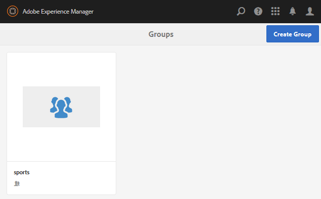

# Erstellen von verschachtelten Gruppen{#authoring-nested-groups}

## Erstellen von Gruppen unter Autor {#creating-groups-on-author}

Bei AEM-Autoreninstanz aus der globalen Navigation:

* Wählen Sie **[!UICONTROL Communities]** > **[!UICONTROL Sites]**.
* Wählen Sie **[!UICONTROL Ordner]** aktivieren, um ihn zu öffnen.
* Wählen Sie die Karte für die englische Site **[!UICONTROL Erste Schritte-Lernprogramm]** aus.

   * Wählen Sie das Kartenbild aus.
   * Wählen Sie *nicht* ein Symbol aus.

Das Ergebnis ist, die [Gruppenkonsole](/help/communities/groups.md) zu erreichen:

Die Funktion &quot;Gruppen&quot;wird als Ordner angezeigt, in dem Instanzen von Gruppen erstellt werden. Wählen Sie den Ordner &quot;Gruppen&quot;, um ihn zu öffnen. Die bei der Veröffentlichung erstellte Gruppe ist sichtbar.

## Hauptkunstgruppe erstellen {#create-main-arts-group}

Diese Gruppe kann erstellt werden, da die Sitestruktur für den Einsatz eine Gruppenfunktion enthält. Die Konfiguration der Funktion in den `Reference Template`-Standardeinstellungen der Site ermöglicht die Auswahl einer beliebigen aktivierten Gruppenvorlage. Die Vorlage, die für diese neue Gruppe ausgewählt wird, ist `Reference Group`.

Diese Konsolen ähneln der Communities Sites-Konsole.

* Wählen Sie **[!UICONTROL Gruppe erstellen]**.

* **Community-Gruppenvorlage**:

   * **[!UICONTROL Community-Gruppentitel]**: Kunst.
   * **[!UICONTROL Community-Gruppenbeschreibung]**: Eine übergeordnete Gruppe für verschiedene Kunstgruppen.
   * **[!UICONTROL Community-Gruppenstamm]**:  *als Standard* beibehalten.
   * **[!UICONTROL Zusätzliche verfügbare Community-Gruppensprache(n)]**: Verwenden Sie das Dropdownmenü, um die verfügbaren Gemeinschaftsgruppensprachen auszuwählen. Das Menü zeigt alle Sprachen an, in denen die übergeordnete Community-Site erstellt wurde. Benutzer können in diesem Schritt eine der folgenden Sprachen auswählen, um Gruppen in mehreren Gebietsschemas zu erstellen. Dieselbe Gruppe wird in mehreren angegebenen Sprachen in der Konsole &quot;Gruppen&quot;der jeweiligen Community-Sites erstellt.
   * **[!UICONTROL Community-Gruppenname]**: Kunst.
   * **[!UICONTROL Vorlage]**: Dropdown-Liste  `Reference Group.`
   * Wählen Sie **[!UICONTROL Weiter]** aus.

Führen Sie mit den folgenden Einstellungen weitere Schritte durch:

* **[!UICONTROL Design]**

   * Ändern Sie den Entwurf oder lassen Sie das Standarddesign der übergeordneten Site zu.
   * Wählen Sie **[!UICONTROL Weiter]** aus.

* **[!UICONTROL Einstellungen]**

   * **[!UICONTROL Moderation]**

      * Leer lassen (von übergeordneter Site übernehmen).
   * **[!UICONTROL Mitgliedschaft]**

      * Verwenden Sie den Standardwert `Optional Membership.`

      * **[!UICONTROL Miniaturansicht]**
         * `optional.*`
      * **[!UICONTROL Wählen Sie Weiter]** aus.

* Wählen Sie **[!UICONTROL Erstellen]**.

### Verschachteln von Gruppen innerhalb der Artgruppe {#nesting-groups-within-arts-group}

Der Ordner `groups` enthält jetzt zwei Gruppen (aktualisieren Sie die Seite).

####  Gruppe veröffentlichen{#publish-group}

Bewegen Sie den Mauszeiger vor dem Erstellen von Gruppen, die innerhalb der Gruppe `arts` verschachtelt sind, über die Karte `arts` und wählen Sie das Veröffentlichungssymbol, um sie zu veröffentlichen.

Warten Sie auf die Bestätigung, dass die Gruppe veröffentlicht wurde.

Die Gruppe `arts` sollte auch einen Ordner `groups` enthalten, der jedoch leer ist und in dem neue Gruppen erstellt werden können. Navigieren Sie zum Ordner &quot;art group&quot;und erstellen Sie 3 verschachtelte Gruppen mit jeweils unterschiedlichen Mitgliedseinstellungen:

1. **[!UICONTROL Visuell]**

   * Titel: `Visual Arts`
   * Name: `visual`
   * Vorlage: `Reference Group`
   * Mitgliedschaft: Wählen Sie `Optional Membership`, eine öffentliche Gruppe, die für alle Mitglieder geöffnet ist.

1. **[!UICONTROL Audition]**

   * Titel: `Auditory Arts`
   * Name: `auditory`
   * Vorlage: `Reference Group`
   * Mitgliedschaft: Wählen Sie `Required Membership`, eine offene Gruppe, die für Mitglieder verfügbar ist.

1. **[!UICONTROL Verlauf]**

   * Titel: `Art History`
   * Name: `history`
   * Vorlage: `Reference Group`
   * Mitgliedschaft: Wählen Sie `Restricted Membership`, eine Geheimgruppe, die nur für eingeladene Mitglieder sichtbar ist. Beispiel: Laden Sie [demo user](/help/communities/tutorials.md#demo-users) `emily.andrews@mailinator.com` ein.

Aktualisieren Sie die Seite, um alle drei verschachtelten Gruppen (Unter-Communities) anzuzeigen.

So navigieren Sie von der Konsole Communities Sites zu den verschachtelten Gruppen:

* Wählen Sie **[!UICONTROL den Ordner]**
* Wählen Sie **[!UICONTROL Karte &quot;Erste Schritte&quot;]**
* Ordner **[!UICONTROL Gruppen]**
* Wählen Sie **[!UICONTROL Kundenkarte]**
* Ordner **[!UICONTROL Gruppen]**

## Veröffentlichungsgruppen {#publishing-groups}

Nach der Veröffentlichung der Haupt-Community-Site:

* Veröffentlichen Sie jede Gruppe einzeln:

   * Warten auf Bestätigung der Veröffentlichung der Gruppe.

* Veröffentlichen Sie die übergeordnete Gruppe, bevor Sie verschachtelte Gruppen veröffentlichen:

   * Alle Gruppen müssen von oben nach unten veröffentlicht werden.

## Erlebnis bei der Veröffentlichung {#experience-on-publish}

Bei der Anmeldung können die verschiedenen Gruppen angezeigt werden, z. B. mit den [Demobenutzern](/help/communities/tutorials.md#demo-users), die für Folgendes verwendet werden:

* Mitglied der Gruppe &quot;Kunst/Verlauf&quot;: emily.andrews@mailinator.com/Kennwort
   * Die eingeschränkte (geheime) Gruppe, Kunst/Geschichte, ist sichtbar:
   * Können optionale (öffentliche) Gruppen sehen.
   * Kann eingeschränkten (offenen) Gruppen beitreten.

* Gruppenmanager: aaron.mcdonald@mailinator.com/Kennwort

   * Können optionale (öffentliche) Gruppen sehen.
   * Kann eingeschränkten (offenen) Gruppen beitreten.
   * Eingeschränkte (geheime) Gruppen können nicht angezeigt werden.

Greifen Sie beim Autor auf die Communities [Mitglieder und Gruppen-Konsolen](/help/communities/members.md) zu, um weitere Benutzer zu verschiedenen Mitgliedsgruppen hinzuzufügen, die den Community-Gruppen entsprechen.

