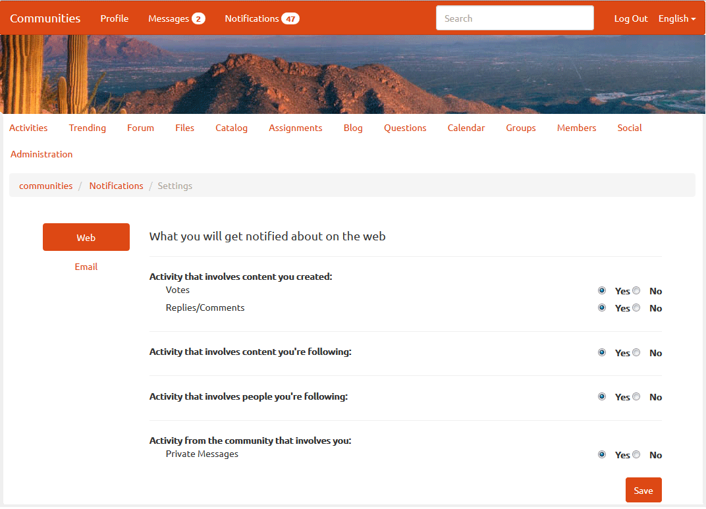

# Communities-Benachrichtigungen {#communities-notifications}

## Überblick {#overview}

AEM Communities stellt einen Benachrichtigungsabschnitt bereit, der Ereignisse anzeigt, die für das Mitglied der Community von Interesse sind.

Benachrichtigungen sind ähnlich wie [Aktivitäten](/help/communities/essentials-activities.md) und [Abonnement](/help/communities/subscriptions.md), da sie aus Folgendem resultieren können:

* Das Mitglied, das Inhalte veröffentlicht.
* Das Mitglied, das sich dafür entschieden hat, einem anderen Mitglied zu folgen.
* Das Mitglied, das sich dafür entschieden hat, bestimmte Themen, Artikel und andere Threads von Inhalten zu befolgen.
* Das Mitglied-Tagging (@Erwähnung) eines anderen Community-Mitglieds in einem vom Benutzer erstellten Inhalt.

Was Benachrichtigungen von Aktivitäten und Abonnements unterscheidet, ist:

* Ein Link zum Abschnitt &quot;Benachrichtigungen&quot;ist immer in der Kopfzeile einer Community-Site vorhanden:

   * Aktivitäten erfordern, dass die Stream-Funktion [Aktivität](/help/communities/functions.md#activity-stream-function) in die Struktur der Community-Site einbezogen wird.
   * Abonnement erfordern [Konfiguration von email](/help/communities/email.md).

* Die Implementierung von Benachrichtigungen erfolgt über skalierbare und pluggable Kanal:

   * Aktivitäten sind nur im Internet verfügbar.
   * Abonnement sind nur per E-Mail verfügbar.

Ab Communities [FP1](/help/communities/deploy-communities.md#latestfeaturepack) stehen folgende Benachrichtigungs-Kanäle zur Verfügung:

* Der Web-Kanal, auf den über den Link `Notifications` zugegriffen wird.
* Der E-Mail-Kanal, der verfügbar ist, wenn die E-Mail richtig konfiguriert ist.

Zukünftige Kanal sind mobile Geräte und Desktop-PCs.

### Voraussetzungen {#requirements}

**Email konfigurieren**

Die E-Mail-Benachrichtigung muss so konfiguriert sein, dass der E-Mail-Kanal funktioniert.

Anweisungen zum Einrichten der E-Mail finden Sie unter [Konfigurieren der E-Mail](/help/communities/analytics.md).

**Verfolgung aktivieren**

Komponenten müssen konfiguriert werden, um Folgendes zu aktivieren. Folgende Funktionen sind zulässig: [blog](/help/communities/blog-feature.md), [forum](/help/communities/forum.md), [QnA](/help/communities/working-with-qna.md), [calendar](/help/communities/calendar.md), [fileLibrary](/help/communities/file-library.md) und [comments](/help/communities/comments.md).

**Hinweis**:

* Komponenten, die in Community [Site-Vorlagen](/help/communities/sites.md) und [Gruppenvorlagen](/help/communities/tools-groups.md) verwendet werden, können bereits für folgende Aufgaben konfiguriert werden.

* Die Profile der Mitglieder sind bereits so konfiguriert, dass sie anderen Mitgliedern folgen können.

## Benachrichtigungen von{#notifications-from-following}


Mit der Schaltfläche **[!UICONTROL Folgen]** können Sie Einsendungen als Aktivitäten, Abonnements und/oder Benachrichtigungen verfolgen. Jedes Mal, wenn die Schaltfläche **[!UICONTROL Folgen]** ausgewählt ist, können Sie eine Auswahl ein- oder ausschalten. Die Auswahl `Email Subscriptions` ist nur bei der Konfiguration vorhanden.

Wenn eine der folgenden Methoden ausgewählt ist, wird der Text der Schaltfläche in **[!UICONTROL Nach]** geändert. Aus praktischen Gründen können Sie `Unfollow All` auswählen, um alle Methoden auszuschalten.

Die Schaltfläche **[!UICONTROL Folgen]** wird angezeigt:

* Beim Anzeigen des Profils eines anderen Mitglieds.
* Auf einer Hauptseite mit Funktionen wie Foren, QnA und Blogs:

   * Folgt der gesamten Aktivität für diese allgemeine Funktion.

* Für einen bestimmten Eintrag, z. B. ein Forenthema, eine Frage zur QnA oder einen Blog-Artikel:

   * Folgt der gesamten Aktivität für diesen spezifischen Eintrag.

## Verwalten der Benachrichtigungseinstellungen {#managing-notification-settings}

Wenn Sie auf der Seite &quot;Benachrichtigungen&quot;den Link &quot;Benachrichtigungseinstellungen&quot;auswählen, können Sie verwalten, wie Benachrichtigungen empfangen werden.

Der Web-Kanal ist immer aktiviert.



Der E-Mail-Kanal, der auf der richtigen [Konfiguration von email](/help/communities/email.md) basiert, stellt dieselben Einstellungen wie für den Web-Kanal bereit.

Der E-Mail-Kanal ist standardmäßig deaktiviert.


Es kann von einem Mitglied aktiviert werden, hängt aber dennoch von der Konfiguration der E-Mail ab.


## Ansehen der Benachrichtigungen {#viewing-notifications}

### Webbenachrichtigungen {#web-notifications}

Ein [Assistent, der eine Community-Site](/help/communities/sites-console.md) erstellt hat, enthält jetzt einen Link zur Funktion `Notifications` in der Kopfzeilenleiste der Site oberhalb des Banners. Im Gegensatz zu Nachrichten werden Benachrichtigungen für jede Community-Site erstellt, während Nachrichten während des Site-Erstellungsprozesses aktiviert werden müssen.

Wenn Sie die veröffentlichte Site besuchen, werden bei Auswahl des Links `Notifications` alle Benachrichtigungen für das Mitglied angezeigt.


### E-Mail-Benachrichtigungen {#email-notifications}

Wenn der E-Mail-Kanal aktiviert ist, erhält das Mitglied eine E-Mail mit einer Verknüpfung zum Inhalt im Web.


## E-Mail-Benachrichtigungen {#customize-email-notifications} anpassen

Organisationen können die E-Mail-Benachrichtigungen anpassen, indem sie [die Vorlagen unter **/libs/settings/community/templates/email/html** überlagern.](/help/communities/client-customize.md#overlays)

Um beispielsweise die Benachrichtigungen zu Erwähnungen in E-Mails (für eine Communities-Komponente) zu ändern, fügen Sie in den Vorlagen der Komponenten, für die Sie die Unterstützung für **@mentions** aktiviert haben, eine **if**-Bedingung für Verb **mention** hinzu.

Um die E-Mail-Benachrichtigungsvorlage für &quot;@mension&quot;in Blog-Kommentaren zu ändern, platzieren Sie die Vorlage &quot;Out-of-the-Box&quot; unter: **/libs/settings/community/templates/email/html/social.journal.components.hbs.comment/de**

```java
{{#equals this.verb "mention"}}\
    A new mention <a href="{{objectUrl}}">comment</a> {{#if this.target.properties.[jcr:title]}}to the article "{{{target.displayName}}}" {{/if}}was added by {{{user.name}}} on {{dateUtil this.published format="EEE, d MMM yyyy HH:mm:ss z"}}.\n \
{{/equals}}\
```

