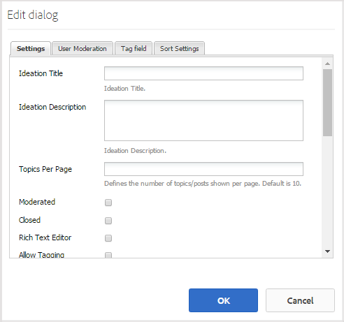

# Erleben Sie die veröffentlichte Site {#experience-the-published-site}

## Neue Site bei der Veröffentlichung suchen {#browse-to-new-site-on-publish}

Nachdem die neu erstellte Communities-Site veröffentlicht wurde, navigieren Sie zur URL, die beim Erstellen der Site angezeigt wird, jedoch auf dem Veröffentlichungsserver, z.

* Autor-URL = https://localhost:4502/content/sites/engage/en.html
* Veröffentlichungs-URL = https://localhost:4503/content/sites/engage/en.html

Um Verwirrung darüber zu vermeiden, welches Mitglied bei Autor und Veröffentlichung angemeldet ist, wird empfohlen, für jede Instanz verschiedene Browser zu verwenden.

Bei der ersten Ankunft auf der veröffentlichten Site wäre der Site-Besucher normalerweise nicht bereits angemeldet und anonym.

`https://localhost:4503/content/sites/engage/en.html {#http-localhost-content-sites-engage-en-html}`

## Anonymer Site-Besucher {#anonymous-site-visitor}

In der Benutzeroberfläche sieht ein anonymer Site-Besucher Folgendes:

* Titel der Site (Tutorial &quot;Erste Schritte&quot;)
* Kein Profil-Link
* Keine Nachrichten-Verknüpfung
* Kein Benachrichtigungslink
* Suchfeld
* Link zur Anmeldung
* Das Markenbanner
* Menüverknüpfungen für die Komponenten, die in der Referenz-Site-Vorlage enthalten sind.

Wenn Sie verschiedene Links auswählen, befinden Sie sich im schreibgeschützten Modus.

### Anonymen Zugriff auf JCR verhindern {#prevent-anonymous-access-on-jcr}

Durch eine bekannte Einschränkung wird der Inhalt der Community-Site anonymen Besuchern durch jcr-Inhalte und json zugänglich gemacht, obwohl der anonyme Zugriff **für den Site-Inhalt deaktiviert** ist. Dieses Verhalten kann jedoch mithilfe von Sling-Beschränkungen als Behelfslösung gesteuert werden.

Gehen Sie wie folgt vor, um den Inhalt Ihrer Community-Site vor dem Zugriff durch anonyme Benutzer durch jcr-Inhalte und json zu schützen:

1. Wechseln Sie auf der Instanz im AEM Author zu https:// Hostname:port/editor.html/content/site/sitename.html.

   >[!NOTE]
   >
   >Gehen Sie nicht zur lokalisierten Site.

1. Gehen Sie zu **Seiteneigenschaften**.

   

1. Navigieren Sie zur Registerkarte **Erweitert**.

   

1. Enable **Authentication Requirement**.
1. Hinzufügen den Pfad der Anmeldeseite. For example, **/content/......./GetStarted**.
1. Veröffentlichen Sie die Seite.

## Vertrauenswürdiger Community-Mitglied {#trusted-community-member}

Diese Erfahrung setzt voraus, dass [Aaron McDonald](/help/communities/tutorials.md#demo-users) die Rollen von [Community Manager und Moderator](/help/communities/create-site.md#roles)zugewiesen wurde. Falls nicht, kehren Sie zur Autorendatei zurück, um die Site-Einstellungen [zu](/help/communities/sites-console.md#modifying-site-properties) ändern, und wählen Sie Aaron McDonald als Community Manager und Moderator aus.

Wählen Sie in der oberen rechten Ecke Benutzername (aaron.mcdonald@mailinator.com) `Log in`und Kennwort (Kennwort) aus und melden Sie sich an. Beachten Sie die Möglichkeit, sich mit Twitter- oder Facebook-Anmeldedaten anzumelden.

Nachdem Sie sich als registriertes Community-Mitglied angemeldet haben, beachten Sie die folgenden Menüpunkte, um auf Ihre Community-Site zu klicken und sie zu erkunden:

* **Mit der Option &quot;Profil** &quot;können Sie Ihr Profil Ansicht und bearbeiten.
* [Die Option &quot;Nachrichten](/help/communities/configure-messaging.md) &quot;leitet Sie zum Abschnitt &quot;Direktnachrichten&quot;weiter, in dem Sie Folgendes ausführen können:

   1. Ansicht der Direktnachrichten, die Sie erhalten haben (Posteingang), gesendet (Gesendete Artikel) und gelöscht (Papierkorb).
   1. Erstellen Sie neue Direktnachrichten, die an Personen und Gruppen gesendet werden.

* [Die Option &quot;Benachrichtigungen](/help/communities/notifications.md) &quot;leitet Sie zum Benachrichtigungsabschnitt weiter, in dem Sie Ihre interessanten Ereignis Ansicht und die Benachrichtigungseinstellungen bearbeiten können.
* [Wenn Sie über Moderationsberechtigungen verfügen, führt Administration](/help/communities/published-site.md#moderationlink) Sie zur Seite &quot;AEM Communities-Moderation&quot;.

Beachten Sie, dass die Kalenderseite die Startseite ist, da die gewählte Referenz-Site-Vorlage zuerst die Kalenderfunktion enthielt, gefolgt von der Aktivität-Stream-Funktion, der Forumsfunktion usw. Diese Struktur ist in der Konsole [Site-Vorlage](/help/communities/sites.md#edit-site-template) oder beim Ändern der Site-Eigenschaften in der Authoring-Umgebung sichtbar:

>[!NOTE]
>
>Weitere Informationen zu Communities-Komponenten und -Funktionen finden Sie unter:
>
>* [Communities-Komponenten](/help/communities/author-communities.md) (für Autoren)
>* [Komponenten-, Funktionen- und Funktionsgrundlagen](/help/communities/essentials.md) (für Entwickler)

>

### Forum-Link {#forum-link}

Ansicht der Basisforumsfunktion durch Auswahl des Forumslinks.

Mitglieder können ein neues Thema posten oder einem Thema folgen.

Site-Besucher können Beiträge auf verschiedene Weise Ansicht leisten und sortieren.

### Gruppen-Link {#groups-link}

Da Aaron ein Gruppenadministrator ist, kann Aaron durch Auswahl des Links Gruppen eine neue Community-Gruppe erstellen, indem es eine Gruppenvorlage, ein Bild, ob die Gruppe offen oder geheim ist, und einladende Mitglieder auswählt.

Dies ist ein Beispiel, bei dem eine Gruppe in der Umgebung zum Veröffentlichen erstellt wird.

Gruppen können auch in der Autorengruppe erstellt und innerhalb der Community-Site in der Autorenkonsole ([Community-Gruppenkonsole](/help/communities/groups.md)) verwaltet werden. Die Erfahrung mit dem [Erstellen von Gruppen unter Autor](/help/communities/nested-groups.md) ist als Nächstes in dieser Übung.

Erstellen einer Referenzgruppe:

1. Neue **Gruppe auswählen**
1. **Registerkarte „Settings“**

   * Gruppenname : `Sports`
   * Beschreibung : `A parent group for various sporting groups`.
   * Gruppen-URL-Name : `sports`
   * Auswählen `Open Group` (die Teilnahme eines beliebigen Community-Mitglieds durch Beitritt zulassen)

1. **Registerkarte &quot;Vorlage&quot;**

   * Auswählen `Reference Group` (enthält eine Gruppenfunktion in ihrer Struktur, um verschachtelte Gruppen zuzulassen)

1. Gruppe **erstellen auswählen**

Nachdem eine neue Gruppe erstellt wurde, **wählen Sie die neue Sportgruppe** aus, um zwei Gruppen (verschachtelt) darin zu erstellen. Da eine Site-Struktur nicht mit der Funktion &quot;Gruppen&quot;beginnen kann, muss nach dem Öffnen der Gruppe &quot;Sport&quot;der Link &quot;Gruppen&quot;ausgewählt werden:

Der zweite Satz von Links, beginnend mit `Blog`, gehört zur aktuell ausgewählten Gruppe, der `Sports` Gruppe. Durch Auswahl des `Groups` Links &quot;Sport&quot;können zwei Gruppen innerhalb der Gruppe &quot;Sport&quot;verschachtelt werden.

Fügen Sie als Beispiel zwei hinzu `new groups`.

* Ein Name `Baseball`

   * Lassen Sie es als `Open Group` (erforderliche Mitgliedschaft) eingestellt.
   * Wählen Sie auf der Registerkarte &quot;Vorlagen&quot; `Conversational Group`.

* Ein Name `Gymnastics`

   * Ändern Sie die Einstellung in `Member Only Group` (eingeschränkte Mitgliedschaft).
   * Wählen Sie auf der Registerkarte &quot;Vorlagen&quot; `Conversational Group`.

**Hinweis**:

* Eine Aktualisierung der Seite kann erforderlich sein, bevor beide Gruppen angezeigt werden.
* Diese Vorlage enthält *nicht* die Funktion &quot;Gruppen&quot;, sodass keine weitere Verschachtelung von Gruppen möglich ist.
* Beim Autor bietet die [Gruppenkonsole](/help/communities/groups.md) eine dritte Option - eine `Public Group` (optionale Mitgliedschaft).

Nachdem beide Gruppen erstellt wurden, wählen Sie die Baseball-Gruppe, eine offene Gruppe, und beachten Sie die Links:

`Discussions` `What's New` `Members`

Die Links der Gruppe werden unterhalb der Links der Haupt-Site angezeigt und führen zur folgenden Anzeige:

Unter &quot;Autor&quot;- mit Administratorrechten navigieren Sie zur [Communities Groups-Konsole](/help/communities/members.md) und fügen Sie der `Community Engage Gymnastics <uid> Members` Gruppe Weston McCall hinzu.

Melden Sie sich bei der Veröffentlichung als Aaron McDonald an und Ansicht der Gruppen in der Gruppe &quot;Sport&quot;als anonymer Site-Besucher:

* Von Startseite
* Select `Groups` link
* Select `Sports` link
* Link &quot;Sport&quot; `Groups` auswählen

Nur die Baseballgruppe wird angezeigt.

Melden Sie sich als Weston McCall (weston.mccall@dodgit.com / Kennwort) an und navigieren Sie zum gleichen Speicherort. Beachten Sie, dass Weston in der Lage ist, `Join` die offene `Baseball` Gruppe und entweder `enter or Leave` die private `Gymnastics` Gruppe.

### Webseitenlink {#web-page-link}

Ansicht der grundlegenden Webseite, die in der Site enthalten ist, durch Auswahl des Links &quot;Webseite&quot;. Die Standard-AEM-Authoring-Werkzeuge können verwendet werden, um Inhalte zu dieser Umgebung in der Autorendatei hinzuzufügen.

Rufen Sie beispielsweise die **Autoreninstanz** auf, öffnen Sie den `engage` Ordner in der Konsole [&quot;](/help/communities/sites-console.md)Communities Sites&quot;und klicken Sie auf das Symbol zum **Öffnen der Site** , um in den Bearbeitungsmodus für Autoren zu wechseln. Wählen Sie dann den Modus &quot;Vorschau&quot;aus, um den `Web Page` Link auszuwählen, und wählen Sie dann den Bearbeitungsmodus, um Titel- und Textkomponenten hinzuzufügen. Als letztes veröffentlichen Sie entweder nur die Seite oder die gesamte Site erneut.

### Moderationslink {#moderationlink}

Wenn das Community-Mitglied über Moderationsberechtigungen verfügt, wird der Link &quot;Moderation&quot;angezeigt. Wenn Sie ihn auswählen, werden die veröffentlichten Community-Inhalte angezeigt und können ähnlich wie die [Moderationskonsole](/help/communities/moderate-ugc.md) in der Authoring-Umgebung [moderiert](/help/communities/moderation.md) werden.

Verwenden Sie die Zurück-Schaltfläche des Browsers, um zur veröffentlichten Site zurückzukehren. Die meisten Konsolen sind in der Umgebung &quot;Veröffentlichen&quot;nicht über die globale Navigation zugänglich. 

## Selbstregistrierung {#self-registration}

Nach dem Abmelden ist es möglich, eine neue Benutzerregistrierung zu erstellen.

* Wählen Sie nun eine der folgenden Optionen aus `Log In`
* Wählen Sie nun eine der folgenden Optionen aus `Sign up for a new account`

 

Standardmäßig ist die E-Mail-Adresse die Anmelde-ID. Wenn diese Option deaktiviert ist, kann der Besucher seine eigene Anmelde-ID (Benutzername) eingeben. Der Benutzername muss in der Umgebung zum Veröffentlichen eindeutig sein.

Nachdem Sie den Namen, die E-Mail-Adresse und das Kennwort des Benutzers angegeben haben, `Sign Up` wird der Benutzer durch Auswahl dieser Option erstellt und für die Unterzeichnung aktiviert.

Nach dem Anmelden ist die erste angezeigte Seite ihre `Profile` Seite, die sie personalisieren können.

Wenn das Mitglied seine Anmelde-ID vergisst, ist es möglich, wiederherzustellen, wenn ihre E-Mail-Adresse verwendet wird.

