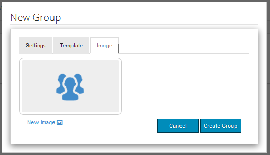

# Berichte-Konsole {#reports-console}

## Übersicht {#overview}

Für AEM Communities gibt es verschiedene Berichte, auf die von der Autorendatei aus auf verschiedene Weise zugegriffen werden kann.

Die verschiedenen Berichte sind im Allgemeinen:

* [Zuweisungsbericht](#assignments-report)

   Eine [Community](/help/communities/overview.md#enablement-community)für die Aktivierung bietet einen Überblick über den Fortschritt der Lernenden bei ihren Aufgaben, einschließlich eines zugehörigen Ergebnisses bei der Implementierung des SCORM-Standards.

* [Ansichtsbericht](#views-report)

   Bietet eine Übersicht über die Ansichten von Inhalten von Community-Mitgliedern und Site-Besuchern für jede Community-Site.

* [Post-Bericht](#posts-report)

   Bietet ein Diagramm mit verschiedenen Beitragstypen von Community-Mitgliedern zu jeder Community-Site.

Wenn [Adobe Analytics aktiviert](/help/communities/sites-console.md#analytics)ist, enthalten Berichte die Anzahl der Ansichten, Wiedergaben, Kommentare und Bewertungen für jede Aktivierungsressource im Laufe der Zeit.

Tabuläre Berichte können zur anschließenden Verarbeitung im .csv-Format exportiert werden.

## Berichte-Konsolen {#reporting-consoles}

### Berichte für Community-Sites {#reports-for-community-sites}

* Aus globaler Navigation: **[!UICONTROL Navigation]** > **[!UICONTROL Communities]** > **[!UICONTROL Berichte]**

* Wählen Sie aus:

   * **[!UICONTROL Zuweisungsbericht]**

      * Erstellen Sie einen Bericht für die ausgewählte Community-Site, den ausgewählten Benutzer bzw. die ausgewählte Gruppe und die Zuweisung.
   * **[!UICONTROL Post-Bericht]**

      * Erstellen Sie einen Bericht für die ausgewählte Community-Site, den Inhaltstyp und den Zeitraum.
   * **[!UICONTROL Ansichtsbericht]**

      * einen Bericht für die ausgewählte Community-Site, den Inhaltstyp und den Zeitraum erstellen.

### Berichte zu Aktivierungsressourcen und Lernpfaden {#reports-for-enablement-resources-and-learning-paths}

* Aus globaler Navigation: **[!UICONTROL Navigation]** > **[!UICONTROL Communities]** > **[!UICONTROL Ressourcen]**

* Wählen Sie eine vorhandene Community-Site für die Aktivierung aus:

   * Klicken Sie auf das Symbol **Bericht** , um Berichte zu erstellen, die alle Aktivierungsressourcen abdecken.
   * Wählen Sie einen Lernpfad für die Aktivierung aus.
   * Klicken Sie auf das Symbol **Bericht** , um Berichte zu erstellen für:

      * Die im Lieferumfang enthaltenen Aktivierungsressourcen.
      * Die Lernenden, die dem Lernpfad zugewiesen sind.

* Diese Berichte bieten:

   * Tabellendaten als CSV herunterladen:

      * Identifizieren des Lernenden
      * ihr Status
      * Ob zugewiesen oder über Katalog aufgerufen
      * Anzahl der Kommentare
      * Sternbewertung

Weitere Informationen finden Sie im Abschnitt [Berichte](/help/communities/resources.md#report) der Ressourcenkonsole.

## Zuweisungsbericht {#assignments-report}

Die Konsole &quot;Zuweisungen&quot;ermöglicht das Filtern von Berichten nach der Aktivierung der Community-Site, Benutzern oder Gruppen und der Zuweisung.

Der Bericht enthält Informationen über ihre Fortschritte sowie Kommentare und Bewertungen.

Wählen Sie die Kriterien für den Bericht aus:

* **Website**

   Wählen Sie eine Community-Site für die Aktivierung aus.

* **Benutzer oder Gruppe**
   * Wählen Sie Benutzer, um einen Bericht für einen Lernenden zu erstellen.
   * Wählen Sie Gruppe, um einen Bericht für eine Gruppe von Lernenden zu erstellen.
   Der Tunneldienst greift von der Umgebung zur Veröffentlichung auf Mitglieder und Mitgliedergruppen zu.

* **Zuweisung**

   Wählen Sie aus den den den ausgewählten Lernenden zugewiesenen Ressourcen.

Wählen Sie **Erstellen** , um den Bericht zu erstellen:

## Ansichtsbericht {#views-report}

Die Konsole &quot;Ansichten&quot;ermöglicht die Erstellung von Berichten auf Ansichten durch Community-Funktionen für einen bestimmten Zeitraum.

Wählen Sie die Kriterien für den Bericht aus:

* **[!UICONTROL Website]**

   Wählen Sie eine Community-Site aus.

* **[!UICONTROL Inhaltstyp]**

   Sie können &quot;Alle Inhalte&quot;auswählen oder eine der Funktionen auf der Site auswählen.

* **[!UICONTROL Zeitrahmen]**

   Wählen Sie eine der folgenden Optionen:

   * Letzte 7 Tage
   * Letzte 30 Tage
   * Letzte 90 Tage
   * Letztes Jahr

Wählen Sie **[!UICONTROL Generieren]** , um den Bericht zu erstellen.

## Post-Bericht {#posts-report}

In der Konsole &quot;Beiträge&quot;können Berichte für die Anzahl der Beiträge zu Community-Funktionen für einen bestimmten Zeitraum generiert werden.

Wählen Sie die Kriterien für den Bericht aus:

* **[!UICONTROL Website]**

   Wählen Sie eine Community-Site aus.

* **[!UICONTROL Inhaltstyp]**

   Sie können &quot;Alle Inhalte&quot;auswählen oder eine der Funktionen auf der Site auswählen.

* **[!UICONTROL Zeitrahmen]**

   Wählen Sie eine der folgenden Optionen:

   * Letzte 7 Tage
   * Letzte 30 Tage
   * Letzte 90 Tage
   * Letztes Jahr

Wählen Sie **[!UICONTROL Generieren]** , um den Bericht zu erstellen.

## Fehlerbehebung {#troubleshooting}

### Keine Community-Sites aufgelistet {#no-community-sites-listed}

Wenn keine Community-Sites aufgelistet sind, stellen Sie sicher, dass Adobe Analytics für eine Site aktiviert wurde. Wenn Sie Berichte zu Zuweisungen auswählen, stellen Sie sicher, dass sich die Zuweisungsfunktion in der Struktur der Community-Site befindet.

### Berichte werden nicht in der AEM Author-Instanz angezeigt {#reports-do-not-show-in-aem-author-instance}

Wenn Berichte nicht in der AEM Author-Instanz angezeigt werden, prüfen Sie, ob Anpassungen vorgenommen wurden, z. B. die URL-Zuordnung in der Veröffentlichungsinstanz. Wenn die URL-Zuordnung nur auf der AEM Publish-Instanz der Communities-Site erfolgt, stellen Sie sicher, dass dasselbe in der AEM Authoring-Instanz in der Konfiguration der **Site-Trendbericht Social-KomponentenFactory** konfiguriert wurde.

