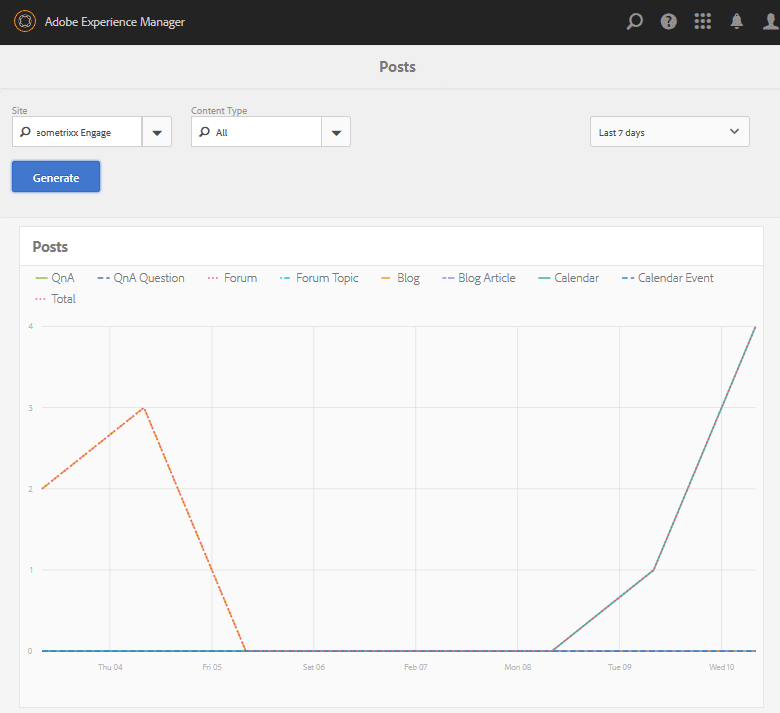

# Berichte-Konsole {#reports-console}

## Übersicht {#overview}

Für AEM Communities gibt es verschiedene Berichte, auf die von der Autorendatei aus auf verschiedene Weise zugegriffen werden kann.

Die verschiedenen Berichte sind im Allgemeinen:

* [Zuweisungsbericht](#assignments-report)

   For an [enablement community](/help/communities/overview.md#enablement-community), provides an overview of learners&#39; progress on their assignments, including an associated score if implementing the SCORM standard.

* [Ansichtsbericht](#views-report)

   Bietet eine Übersicht über die Ansichten von Inhalten von Community-Mitgliedern und Site-Besuchern für jede Community-Site.

* [Post-Bericht](#posts-report)

   Provides a chart of various types of posts by community members to any community site.

When [Adobe Analytics is enabled](/help/communities/sites-console.md#analytics), reports will include the number of views, plays, comments and ratings for each enablement resource over time.

Tabuläre Berichte können zur anschließenden Verarbeitung im .csv-Format exportiert werden.

## Reporting Consoles {#reporting-consoles}

### Reports for Community Sites {#reports-for-community-sites}

* From global navigation: **[!UICONTROL Navigation]** > **[!UICONTROL Communities]** >  **[!UICONTROL Reports]**

* Wählen Sie aus:

   * **[!UICONTROL Zuweisungsbericht]**

      * Erstellen Sie einen Bericht für die ausgewählte Community-Site, den ausgewählten Benutzer bzw. die ausgewählte Gruppe und die Zuweisung.
   * **[!UICONTROL Post-Bericht]**

      * Erstellen Sie einen Bericht für die ausgewählte Community-Site, den Inhaltstyp und den Zeitraum.
   * **[!UICONTROL Ansichtsbericht]**

      * generate a report for selected Community Site, Content Type, and Time Period.

### Berichte zu Aktivierungsressourcen und Lernpfaden {#reports-for-enablement-resources-and-learning-paths}

* Aus globaler Navigation: **[!UICONTROL Navigation]** > **[!UICONTROL Communities]** > **[!UICONTROL Ressourcen]**

* Wählen Sie eine vorhandene Community-Site für die Aktivierung aus:

   * Select **Report** icon to generate reports which cover all enablement resources.
   * Wählen Sie einen Lernpfad für die Aktivierung aus.
   * Klicken Sie auf das Symbol **Bericht** , um Berichte zu erstellen für:

      * Die im Lieferumfang enthaltenen Aktivierungsressourcen.
      * Die Lernenden, die dem Lernpfad zugewiesen sind.

* Diese Berichte bieten:

   * Tabellendaten als CSV herunterladen:

      * Identifizieren des Lernenden
      * ihr Status
      * Ob zugewiesen oder über Katalog aufgerufen
      * Anzahl der Kommentare
      * Sternbewertung

Weitere Informationen finden Sie im Abschnitt [Berichte](/help/communities/resources.md#report) der Ressourcenkonsole.

## Zuweisungsbericht {#assignments-report}

Die Konsole &quot;Zuweisungen&quot;ermöglicht das Filtern von Berichten nach der Aktivierung der Community-Site, Benutzern oder Gruppen und der Zuweisung.

The report provides information on their progress as well as any comments or ratings provided.

Wählen Sie die Kriterien für den Bericht aus:

* **Website**

   Wählen Sie eine Community-Site für die Aktivierung aus.

* **Benutzer oder Gruppe**
   * Select User to generate a report for one learner.
   * Wählen Sie Gruppe, um einen Bericht für eine Gruppe von Lernenden zu erstellen.

   Der Tunneldienst greift von der Umgebung zur Veröffentlichung auf Mitglieder und Mitgliedergruppen zu.

* **Zuweisung**

   Wählen Sie aus den den den ausgewählten Lernenden zugewiesenen Ressourcen.

Select **Generate** to create the report:

## Ansichtsbericht {#views-report}

The Views console allows reports to be generated on page views by community feature(s) for a given time period.

Select the criteria for the report:

* **[!UICONTROL Website]**

   Wählen Sie eine Community-Site aus.

* **[!UICONTROL Inhaltstyp]**

   Sie können &quot;Alle Inhalte&quot;auswählen oder eine der Funktionen auf der Site auswählen.

* **[!UICONTROL Zeitrahmen]**

   Wählen Sie eine der folgenden Optionen:

   * Letzte 7 Tage
   * Letzte 30 Tage
   * Letzte 90 Tage
   * Letztes Jahr

Wählen Sie **[!UICONTROL Generieren]** , um den Bericht zu erstellen.

## Post-Bericht {#posts-report}

In der Konsole &quot;Beiträge&quot;können Berichte für die Anzahl der Beiträge zu Community-Funktionen für einen bestimmten Zeitraum generiert werden.

Wählen Sie die Kriterien für den Bericht aus:

* **[!UICONTROL Website]**

   Wählen Sie eine Community-Site aus.

* **[!UICONTROL Inhaltstyp]**

   Sie können &quot;Alle Inhalte&quot;auswählen oder eine der Funktionen auf der Site auswählen.

* **[!UICONTROL Zeitrahmen]**

   Wählen Sie eine der folgenden Optionen:

   * Letzte 7 Tage
   * Letzte 30 Tage
   * Letzte 90 Tage
   * Letztes Jahr

Wählen Sie **[!UICONTROL Generieren]** , um den Bericht zu erstellen.

## Fehlerbehebung {#troubleshooting}

### Keine Community-Sites aufgelistet {#no-community-sites-listed}

Wenn keine Community-Sites aufgelistet sind, stellen Sie sicher, dass Adobe Analytics für eine Site aktiviert wurde. Wenn Sie Berichte zu Zuweisungen auswählen, stellen Sie sicher, dass sich die Zuweisungsfunktion in der Struktur der Community-Site befindet.

### Berichte werden nicht in der AEM Author-Instanz angezeigt {#reports-do-not-show-in-aem-author-instance}

Wenn Berichte nicht in der AEM Author-Instanz angezeigt werden, prüfen Sie, ob Anpassungen vorgenommen wurden, z. B. die URL-Zuordnung in der Veröffentlichungsinstanz. If URL mapping is done only on AEM Publish instance of the communities site, ensure that the same has been configured in AEM Author instance in **Site Trend Report Social Component Factory** configuration.

