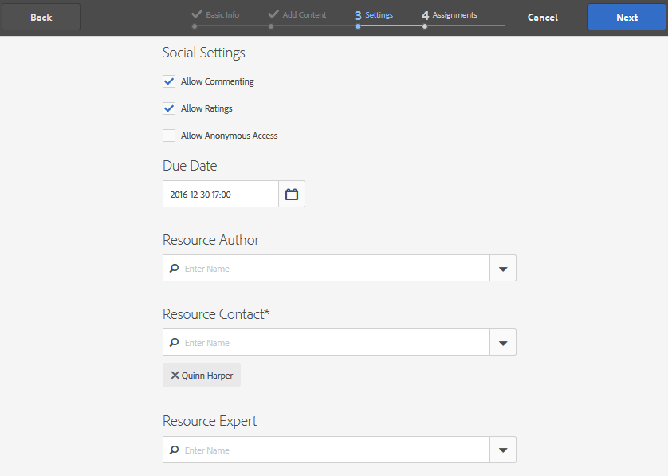

# Aktivierungsressourcen {#create-and-assign-enablement-resources} erstellen und zuweisen

## hinzufügen einer Aktivierungsressource {#add-an-enablement-resource}

So fügen Sie der neuen Community-Site eine Aktivierungsressource hinzu:

* Melden Sie sich als Systemadministrator bei der Autoreninstanz an:
   * Beispiel: [http://localhost:4502/](http://localhost:4503/)
* Wählen Sie in der globalen Navigation **[!UICONTROL Communities]** > **[!UICONTROL Ressourcen]**

   

   
* Wählen Sie die Community-Site aus, der die Aktivierungsressourcen hinzugefügt werden:
   * Wählen Sie **[!UICONTROL Aktivierungsübung]**.
* Wählen Sie im Menü **[!UICONTROL Erstellen]**.
* Wählen Sie **[!UICONTROL Ressource]**.

### Grundlegende Informationen {#basic-info}

Füllen Sie die grundlegenden Informationen für die Ressource aus:

* **[!UICONTROL Site-Name]**

   Auf den Namen der ausgewählten Community-Site setzen: Übungen zur Aktivierung

* **[!UICONTROL Ressourcenname&amp;ast;]**

   Skiunterricht 1

* **[!UICONTROL Tags]**

   Übung: Sport/Skifahren

* **[!UICONTROL Im Katalog anzeigen]**

   Stellen Sie sie auf **Ein** ein.

* **[!UICONTROL Beschreibung]**

   Schneeschlitten für Anfänger.

* **[!UICONTROL Bild hinzufügen]**

   hinzufügen Sie ein Bild, das die Ressource für das Mitglied in der Ansicht &quot;Zuweisungen&quot;darstellt.

   

* Wählen Sie **[!UICONTROL Weiter]** aus

### Inhalt hinzufügen {#add-content}

Es wird zwar so angezeigt, als ob mehrere Ressourcen ausgewählt wären, es ist jedoch nur eine zulässig.

Wählen Sie `'+' icon` in der oberen rechten Ecke aus, um mit der Auswahl der Ressource zu beginnen, indem Sie die Quelle angeben.

Eine Ressource hochladen. Bei einer Videoressource können Sie entweder ein benutzerdefiniertes Beginn hochladen, das vor der Videowiedergabe angezeigt wird, oder eine Miniaturansicht aus dem Video generieren lassen (dies kann einige Minuten dauern - es ist nicht erforderlich zu warten).

* Wählen Sie **[!UICONTROL Weiter]** aus.

### Einstellungen {#settings}

* **[!UICONTROL Einstellungen für Social Media]**

   Lassen Sie die Standardeinstellungen so, dass die Kommentierung und Bewertung der Aktivierungsressourcen durch die Lernenden möglich ist.

* **[!UICONTROL Fälligkeitsdatum]**

   *(Optional)* Es kann ein Datum gewählt werden, bis zu dem die Zuweisung abgeschlossen werden soll.

* **[!UICONTROL Ressourcen-Autor]**

   *(Optional)* Lassen Sie das Feld leer.

* **[!UICONTROL Resource Contact&amp;ast;]**

   *(Erforderlich)* Wählen Sie über das Pulldown-Menü ein Mitglied aus  `Quinn Harper`.

* **[!UICONTROL Ressourcen-Experte]**

   *(Optional)* Lassen Sie das Feld leer.

   **Hinweis**: Wenn Benutzer oder Gruppen nicht sichtbar sind, überprüfen Sie, ob sie der  `Community Enable Members` Gruppe hinzugefügt und in der Veröffentlichungsinstanz  ** gespeichert wurden.

   

* Wählen Sie **[!UICONTROL Weiter]** aus

### Zuweisungen {#assignments}

* **[!UICONTROL Bevollmächtigte hinzufügen]**

   Lassen Sie die Einstellung deaktiviert, da diese Aktivierungsressource einem Lernpfad hinzugefügt wird. Wenn ein Lernender der einzelnen Aktivierungsressource sowie einem Lernpfad mit der Aktivierungsressource zugewiesen ist, wird der Lernende der Aktivierungsressource zweimal zugewiesen.

   

* Wählen Sie **[!UICONTROL Erstellen]**

   

Die erfolgreiche Erstellung der Ressource kehrt bei Auswahl der neu erstellten Ressource zur Ressourcenkonsole zurück. Über diese Konsole können Sie andere Einstellungen veröffentlichen, hinzufügen und ändern.

Um eine neue Version der Ressource für die Aktivierung hochzuladen, wird empfohlen, eine neue Ressource zu erstellen und dann die Anmeldung für Mitglieder aus der alten Version aufzuheben und sie in der neuen Version einzutragen.

### Ressource {#publish-the-resource} veröffentlichen

Bevor die Lernenden die zugewiesenen Ressourcen sehen können, müssen sie veröffentlicht werden:

* Wählen Sie das Symbol Welt `Publish`

Die Aktivierung wird mit einer Erfolgsmeldung bestätigt:

## hinzufügen einer zweiten Aktivierungsressource {#add-a-second-enablement-resource}

Wiederholen Sie die oben stehenden Schritte, um eine zweite zugehörige Aktivierungsressource zu erstellen und zu veröffentlichen, aus der ein Lernpfad erstellt wird.

**Die zweite Ressource** veröffentlichen.

Kehren Sie zur Liste der Ressourcen des Tutorials zur Aktivierung zurück.

*Hinweis: Wenn beide Ressourcen nicht sichtbar sind, aktualisieren Sie die Seite.*

## hinzufügen eines Lernpfads {#add-a-learning-path}

Ein Lernpfad ist eine logische Gruppierung von Ressourcen zur Aktivierung, die einen Kurs bilden.

* Wählen Sie in der Ressourcenkonsole `+ Create`
* Wählen Sie **[!UICONTROL Lernpfad]**

hinzufügen Sie die **[!UICONTROL Basisinformationen]**:

* **[!UICONTROL Lernpfad-Name]**

   Skiunterricht

* **[!UICONTROL Tags]**

   Übung: Skifahren

* **[!UICONTROL Im Katalog anzeigen]**

   Nicht aktivieren

* **[!UICONTROL Hochladen eines Bildes]**

   Zum Darstellen des Lernpfads in der Ressourcenkonsole.

   

* Wählen Sie **[!UICONTROL Weiter]** aus.

Überspringen Sie das nächste Bedienfeld, da es keine erforderlichen Lernpfade zum Hinzufügen gibt.

* Wählen Sie **[!UICONTROL Weiter]** aus

Im Bereich Hinzufügen Ressourcen:

* Wählen Sie `+ Add Resources` aus, um die 2 Skilesenressourcen auszuwählen, die dem Lernpfad hinzugefügt werden sollen.

   Hinweis: Nur **published**-Ressourcen können ausgewählt werden.

>[!NOTE]
>
>Sie können die verfügbaren Ressourcen nur auf derselben Ebene wie der Lernpfad auswählen. Beispielsweise stehen für einen Lernpfad, der in einer Gruppe erstellt wird, nur Ressourcen auf Gruppenebene zur Verfügung; für einen Lernpfad, der auf einer Community-Site erstellt wurde, stehen die Ressourcen auf dieser Site zum Hinzufügen zum Lernpfad zur Verfügung.

* Klicken Sie auf **[!UICONTROL Übermitteln]**.

   

   

* Wählen Sie **[!UICONTROL Weiter]** aus

   

* **[!UICONTROL Bevollmächtigte hinzufügen]**

   Verwenden Sie das Pulldown-Menü, um die Gruppe `Community Ski Class` auszuwählen, zu der die Mitglieder `Riley Taylor` und `Sidney Croft.` gehören sollten

* **[!UICONTROL Lernpfad Kontakt&amp;ast;]**

   *(Erforderlich)* Wählen Sie über das Pulldown-Menü ein Mitglied aus  `Quinn Harper`.

* Wählen Sie **[!UICONTROL Erstellen]**.

   

Bei erfolgreicher Erstellung des Lernpfads wird die Ressourcenkonsole mit dem neu erstellten Lernpfad ausgewählt. Über diese Konsole können Sie andere Einstellungen veröffentlichen, hinzufügen und ändern.

**Veröffentlichen** Sie den Lernpfad.

