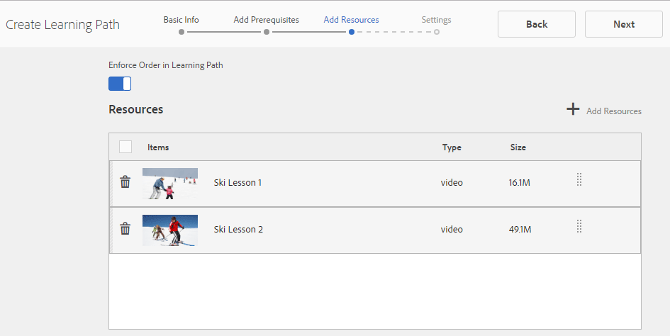

# Erstellen und Zuweisen von Aktivierungsressourcen {#create-and-assign-enablement-resources}

## Hinzufügen einer Aktivierungsressource {#add-an-enablement-resource}

So fügen Sie der neuen Community-Site eine Aktivierungsressource hinzu:

* Melden Sie sich als Systemadministrator auf der Autoreninstanz an:
   * Beispiel: [http://localhost:4502/](http://localhost:4503/)
* Wählen Sie in der globalen Navigation **[!UICONTROL Communities]** > **[!UICONTROL Ressourcen]** aus.

   

   
* Wählen Sie die Community-Site aus, zu der Aktivierungsressourcen hinzugefügt werden:
   * Wählen Sie **[!UICONTROL Aktivierungs-Tutorial]** aus.
* Wählen Sie im Menü **[!UICONTROL Erstellen]** aus.
* Wählen Sie **[!UICONTROL Resource]** aus.

### Grundlegende Informationen {#basic-info}

Füllen Sie die grundlegenden Informationen für die Ressource aus:

* **[!UICONTROL Site-Name]**

   Auf den Namen der ausgewählten Community-Site setzen: Tutorial zur Aktivierung

* **[!UICONTROL Resource Name&amp;ast;]**

   Skiunterricht 1

* **[!UICONTROL Tags]**

   Tutorial: Sport/Skifahren

* **[!UICONTROL Im Katalog anzeigen]**

   Setzen Sie es auf **On**.

* **[!UICONTROL Beschreibung]**

   Schneeschlitt für Anfänger.

* **[!UICONTROL Bild hinzufügen]**

   Fügen Sie dem Mitglied in der Ansicht &quot;Assignments&quot;ein Bild hinzu, das die Ressource darstellt.

   

* Wählen Sie **[!UICONTROL Weiter]** aus

### Inhalt hinzufügen {#add-content}

Es wird zwar so angezeigt, als ob mehrere Ressourcen ausgewählt sein könnten, aber nur eine ist zulässig.

Wählen Sie `'+' icon` in der oberen rechten Ecke aus, um mit der Auswahl der Ressource zu beginnen, indem Sie die Quelle identifizieren.

Eine Ressource hochladen. Wenn eine Videoressource vorhanden ist, laden Sie entweder ein benutzerdefiniertes Bild hoch, das vor der Videowiedergabe angezeigt werden soll, oder lassen Sie zu, dass eine Miniaturansicht aus dem Video generiert wird (es kann einige Minuten dauern - es ist nicht erforderlich zu warten).

* Wählen Sie **[!UICONTROL Weiter]** aus.

### Einstellungen {#settings}

* **[!UICONTROL Einstellungen für Social Media]**

   Behalten Sie die Standarderstellung für die Kommentierung und Bewertung von Aktivierungsressourcen durch die Lernenden bei.

* **[!UICONTROL Fälligkeitsdatum]**

   *(Optional)* Es kann ein Datum ausgewählt werden, bis zu dem die Zuweisung abgeschlossen werden soll.

* **[!UICONTROL Ressourcen-Autor]**

   *(Optional)* Lassen Sie das Feld leer.

* **[!UICONTROL Resource Contact&amp;ast;]**

   *(Erforderlich)* Wählen Sie über das Pulldown-Menü ein Mitglied aus  `Quinn Harper`.

* **[!UICONTROL Ressourcen-Experte]**

   *(Optional)* Lassen Sie das Feld leer.

   **Hinweis**: Wenn Benutzer oder Gruppen nicht sichtbar sind, vergewissern Sie sich, dass sie zur  `Community Enable Members` Gruppe hinzugefügt und in der Veröffentlichungsinstanz  ** gespeichert wurden.

   

* Wählen Sie **[!UICONTROL Weiter]** aus

### Zuweisungen {#assignments}

* **[!UICONTROL Bevollmächtigte hinzufügen]**

   Lassen Sie die Einstellung deaktiviert, da diese Aktivierungsressource einem Lernpfad hinzugefügt wird. Wenn ein Lernender der einzelnen Aktivierungsressource sowie einem learningPath mit der Aktivierungsressource zugewiesen wird, wird der Lernende der Aktivierungsressource zweimal zugewiesen.

   

* Wählen Sie **[!UICONTROL Erstellen]**

   

Die erfolgreiche Erstellung der Ressource kehrt zur Ressourcenkonsole zurück, wobei die neu erstellte Ressource ausgewählt ist. In dieser Konsole können Sie Inhalte veröffentlichen, Lernende hinzufügen und andere Einstellungen ändern.

Um eine neue Version der Aktivierungsressource hochzuladen, wird empfohlen, eine neue Ressource zu erstellen, dann die Registrierung für Mitglieder aus der alten Version aufzuheben und sie in der neuen Version zu registrieren.

### Ressource {#publish-the-resource} veröffentlichen

Damit die Teilnehmer die zugewiesenen Ressourcen sehen können, müssen sie veröffentlicht werden:

* Wählen Sie das Welt-Symbol `Publish` aus.

Die Aktivierung wird mit einer Erfolgsmeldung bestätigt:

## Eine zweite Aktivierungsressource {#add-a-second-enablement-resource} hinzufügen

Wiederholen Sie die obigen Schritte, um eine zweite zugehörige Aktivierungsressource zu erstellen und zu veröffentlichen, aus der ein Lernpfad erstellt wird.

**** Veröffentlichen Sie die zweite Ressource.

Kehren Sie zur Liste des Tutorials zur Aktivierung der Ressourcen zurück.

*Hinweis: Wenn beide Ressourcen nicht sichtbar sind, aktualisieren Sie die Seite.*

## Lernpfad hinzufügen {#add-a-learning-path}

Ein Lernpfad ist eine logische Gruppierung der Aktivierungsressourcen, die einen Kurs bilden.

* Wählen Sie in der Ressourcenkonsole `+ Create` aus.
* Wählen Sie **[!UICONTROL Lernpfad]**

Fügen Sie die **[!UICONTROL Basic Info]** hinzu:

* **[!UICONTROL Lernpfad-Name]**

   Skiunterricht

* **[!UICONTROL Tags]**

   Tutorial: Skiing

* **[!UICONTROL Im Katalog anzeigen]**

   Nicht aktivieren

* **[!UICONTROL Bild hochladen]**

   Zum Darstellen des Lernpfads in der Ressourcenkonsole.

   

* Wählen Sie **[!UICONTROL Weiter]** aus.

Überspringen Sie das nächste Bedienfeld, da es keine erforderlichen Lernpfade zum Hinzufügen gibt.

* Wählen Sie **[!UICONTROL Weiter]** aus

Im Bereich Ressourcen hinzufügen :

* Wählen Sie `+ Add Resources` aus, um die 2 Ressourcen für Ski-Läsionen auszuwählen, die zum Lernpfad hinzugefügt werden sollen.

   Hinweis: Es können nur **veröffentlichte** Ressourcen ausgewählt werden.

>[!NOTE]
>
>Sie können nur die Ressourcen auswählen, die auf derselben Ebene wie der Lernpfad verfügbar sind. Beispielsweise sind für einen in einer Gruppe erstellten Lernpfad nur die Ressourcen auf Gruppenebene verfügbar. für einen Lernpfad, der auf einer Community-Site erstellt wurde, stehen die Ressourcen auf dieser Site zum Hinzufügen zum Lernpfad zur Verfügung.

* Klicken Sie auf **[!UICONTROL Übermitteln]**.

   

   

* Wählen Sie **[!UICONTROL Weiter]** aus

   

* **[!UICONTROL Bevollmächtigte hinzufügen]**

   Wählen Sie im Pulldown-Menü die Gruppe `Community Ski Class` aus, der die Mitglieder `Riley Taylor` und `Sidney Croft.` angehören sollen

* **[!UICONTROL Lernpfad Kontakt&amp;ast;]**

   *(Erforderlich)* Wählen Sie über das Pulldown-Menü ein Mitglied aus  `Quinn Harper`.

* Wählen Sie **[!UICONTROL Erstellen]**.

   

Bei erfolgreicher Erstellung des Lernpfads wird die Konsole Ressourcen mit dem neu erstellten Lernpfad ausgewählt. In dieser Konsole können Sie Inhalte veröffentlichen, Lernende hinzufügen und andere Einstellungen ändern.

**** Veröffentlichen Sie den Lernpfad.
