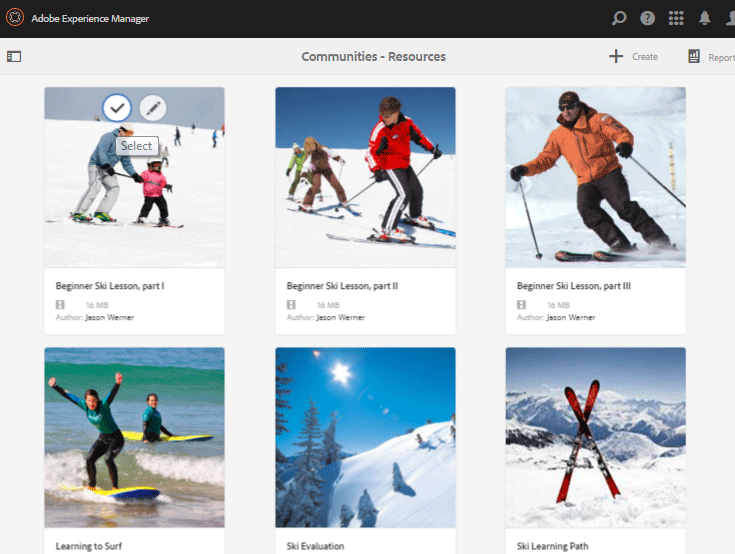
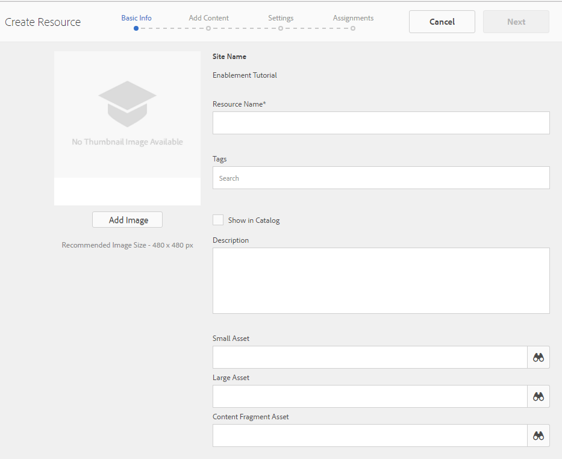

# Aktivierungsressourcen-Konsole {#enablement-resources-console}

Für AEM Communities erstellt, verwaltet und weist die Ressourcenkonsole [Aktivierungsmanager](users.md) Ressourcen für Mitglieder einer Aktivierungs-Community-Site zu.

## Voraussetzungen {#requirements}

Bevor Sie Aktivierungsressourcen für eine Community-Site hinzufügen, müssen die AEM Instanzen ordnungsgemäß konfiguriert werden, einschließlich:

* SCORM
* FFmpeg

Weitere Informationen finden Sie unter [Konfigurieren der Aktivierung](enablement.md).

>[!CAUTION]
>
>Wenn SCORM nach der Erstellung der Community-Site installiert wird, müssen alle Aktivierungsressourcen, die vor der Installation von SCORM vorhanden sind, neu erstellt werden.

>[!NOTE]
>
>Mit der Veröffentlichung von [AEM 6.3](deploy-communities.md#latestfeaturepack) und den entsprechenden Communities Feature Packs [AEM 6.2 FP3](deploy-communities.md#latestfeaturepack) und [AEM 6.1 FP7] (https://docs.adobe.com/content/docs/en/aem/6-1/deploy/communities.html#Latest Feature Pack) ist für die Aktivierungsfunktion keine [MySQL-Datenbank](mysql.md) mehr erforderlich.

## Terminologie {#terminology}

### Ressource {#resource}

Ressourcen sind für eine [Aktivierungs-Community](overview.md#enablement-community) unerlässlich. Sie sind die Materialien, die den Mitgliedern zugewiesen sind, um sie in die Lage zu versetzen, ihre Fähigkeiten zu verbessern.

Eigenschaften einer Ressource:

* kann vom Typ sein:
   * Bild (JPG, PNG, GIF, BMP)
   * Video (MP4)
   * Flash (SWF)
   * Dokument (PDF)
   * Quiz (SCORM)
* Kann über einen oder mehrere Lernpfade referenziert werden.

### Lernpfad {#learning-path}

Ein Lernpfad ist ein logischer Satz von Aktivierungsressourcen, die gruppiert werden, um die Zuweisung zu Mitgliedern zu erleichtern.

### Mitgliedergruppe {#members-group}

Wenn eine Community-Site erstellt wird, wird der Name, der der Site für die URL gegeben wird, bei der Erstellung der [Site-spezifischen Benutzergruppen](users.md) verwendet, die mit verschiedenen Berechtigungen für verschiedene Rollen konfiguriert wurden. Alle diese automatisch erstellten Gruppen erhalten das Präfix `Community <site-name>`.

Eine dieser Benutzergruppen ist die Gruppe `Community <site-name> Members` , die registrierte Benutzer in der Veröffentlichungsumgebung als Community-Mitglieder identifiziert. Ein Beispiel finden Sie im Tutorial [Erste Schritte mit AEM Communities für die Aktivierung](getting-started-enablement.md) .

Für [Interaktionsgemeinschaften](overview.md#egagementcommunity) ist es sinnvoll, Site-Besuchern zu erlauben, sich selbst zu registrieren oder soziale Anmeldungen zu verwenden. Anschließend werden sie automatisch zur Mitgliedergruppe hinzugefügt.

Für [Aktivierungsgemeinschaften](overview.md#enablement-community) wird empfohlen, die Site privat zu gestalten, sodass dann ein Administrator Benutzer zur Mitgliedergruppe hinzufügen muss.

## Zugriff auf die Aktivierungsressourcen einer Community-Site {#accessing-a-community-site-s-enablement-resources}

### Navigieren zu Communities-Ressourcen {#navigate-to-communities-resources}

In der Autorenumgebung, um die Ressourcenkonsole zu erreichen

* Über die globale Navigation: **[!UICONTROL Navigation]** > **[!UICONTROL Communities]** > **[!UICONTROL Ressourcen]**

   

### Community-Site auswählen {#select-a-community-site}

Die Communities-Ressourcen-Konsole zeigt alle Community-Sites an.

Aktivierungsressourcen werden für eine bestimmte Community-Site erstellt, nachdem Sie die Site in der Ressourcenkonsole ausgewählt haben.

Sobald eine bestimmte Community-Site ausgewählt ist, können alle vorhandenen Aktivierungsressourcen und Lernpfade für die Verwaltung und Änderung aufgerufen und neue Aktivierungsressourcen und Lernpfade erstellt werden.

#### Suche {#search-features}

Wählen Sie das Umschalter-Symbol für das seitliche Bedienfeld aus, um nach einer Aktivierungsressource oder einem Lernpfad zu suchen. Wenn diese Option aktiviert ist, wird auf der linken Seite der Konsole ein Suchfeld geöffnet und ein Textfeld bereitgestellt, in das Suchbegriffe eingegeben werden können.

#### Auswahlmodus {#selection-mode}

Um mehrere Aktivierungsressourcen auszuwählen, wählen Sie die erste aus, indem Sie den Mauszeiger über die Karte bewegen und das Häkchen-Symbol auswählen. Wenn Sie eine andere Karte auswählen, wird diese der Auswahlgruppe hinzugefügt. Wenn Sie ein zweites Mal auswählen, wird die Karte deaktiviert.

## Erstellen einer Ressource {#create-a-resource}

Hinzufügen einer neuen Aktivierungsressource zur Community-Site

* Wählen Sie das Symbol `Create` aus.
* Wählen Sie im angezeigten Untermenü **[!UICONTROL Resource]** aus.

Dadurch wird ein schrittweiser Prozess gestartet mit:

* Beschreibung der Ressource (Name, Kartenbild und Text).
* Auswahl des Ressourceninhalts.
* Auswählen eines Titelbilds für die Ressource
* Identifizieren von Ressourcenkontakten.
* Zuweisen von Ressourcen zu Mitgliedern.

Wenn die Ressource Teil eines Kurses, eines Lernpfads ist, sollten Mitglieder nur dem Lernpfad zugewiesen werden. Zuweisungen können hinzugefügt werden, nachdem die Aktivierungsressource erstellt wurde.

### 1 Grundlegende Informationen {#basic-info}

* **[!UICONTROL Bild hinzufügen]**

   (*Optional*) Ein Bild, das auf der Karte für die Aktivierungsressource auf der Zuweisungsseite des Mitglieds sowie in der Ressourcenkonsole angezeigt wird. Das Bild wird aus dem lokalen Dateisystem des Servers ausgewählt. Wenn kein Bild bereitgestellt wird, wird eine Miniaturansicht für die hochgeladene Ressource generiert.

   ***Hinweis***: Die empfohlene Bildgröße beträgt nicht einfach 480 x 480 Pixel. Aufgrund des responsiven Designs der Karten mit verschiedenen Browser-Abmessungen variiert die Anzeigegröße von 220 x 165 Pixel bis 400 x 165 Pixel.

* **[!UICONTROL Site-Name]**

   (*readonly*) Die Community-Site, der die Ressource hinzugefügt wird.

* **[!UICONTROL Ressourcenname]**

   (*Erforderlich*) Der Anzeigename für die Ressource. Ein gültiger Knotenname wird aus dem Anzeigenamen erstellt.

* **[!UICONTROL Tags]**

   (*Optional*) Es können ein oder mehrere Tags ausgewählt werden, die die Aktivierungsressource mit einem oder mehreren Katalogen verknüpfen. Siehe [Tagging von Aktivierungsressourcen](tag-resources.md).

* **[!UICONTROL Im Katalog anzeigen]**

   Wenn diese Option deaktiviert ist, wird die Aktivierungsressource in keinem Katalog angezeigt. Wenn diese Option aktiviert ist, wird die Aktivierungsressource in allen Katalogen angezeigt, es sei denn, [vorgefiltert](catalog-developer-essentials.md#pre-filters) oder die Mitgliedsfilter aus der Benutzeroberfläche. Diese Option ist standardmäßig deaktiviert.

* **[!UICONTROL Beschreibung]**

   (*Optional*) Die Beschreibung, die für die Aktivierungsressource angezeigt werden soll.

* **[!UICONTROL Kleines Asset]**

   (*Optional*) Ausgewählt aus AEM Assets. Ein Miniaturbild, das die Ressource in der Veröffentlichungsumgebung darstellt, z. B. in einem Katalog.

* **[!UICONTROL Großes Asset]**

   (*Optional*) Ausgewählt aus AEM Assets. Ein großes Bild, das die Ressource in der Veröffentlichungsumgebung darstellt, z. B. auf der Hauptseite einer Ressource.

* **[!UICONTROL Inhaltsfragment-Asset]**

   (*Optional*) Ausgewählt aus AEM Assets. Ein Inhaltsfragment, auf das in der Veröffentlichungsumgebung verwiesen werden kann, das jedoch nicht standardmäßig verwendet wird.

* Wählen Sie **[!UICONTROL Weiter]** aus

### 2 Inhalt hinzufügen {#add-content}

Es wird zwar so angezeigt, als ob mehrere Aktivierungsressourcen ausgewählt sein könnten, aber nur eine ist zulässig.

Wählen Sie `'+' icon` in der oberen rechten Ecke aus, um mit der Auswahl der Ressource zu beginnen, indem Sie die Quelle identifizieren.

* **[!UICONTROL Upload aus lokalen Dateien]**

   Beim Hochladen aus dem lokalen Dateisystem wird der native Dateibrowser verwendet, um eine Datei auszuwählen und hochzuladen. Unterstützte Dateitypen sind SCORM.zip (HTML5 oder SWF), MP4-Video-, SWF-, PDF- und Bildtypen (JPG, PNG, GIF, BMP). Der Dateiname wird zum Namen des Assets, das der Asset-Bibliothek hinzugefügt wird.

* **[!UICONTROL Asset-Bibliothek durchsuchen]**

   Wählen Sie aus der Asset-Bibliothek aus. Die Auswahl ist auf diejenigen beschränkt, die auf der Community-Site sichtbar sind.

* **[!UICONTROL Externe URL hinzufügen]**

   Geben Sie einen Link zu Lerninhalten ein.

   Geben Sie in das sich öffnende Dialogfeld Folgendes ein:

   * **[!UICONTROL Titel]**

      Der Name des Assets für die Aktivierungsressource.

   * **[!UICONTROL URL]**

      Die URL zu einem Asset.

* **[!UICONTROL Adobe Connect-URL hinzufügen]**

   Geben Sie einen Link zu einer Adobe Connect-Sitzung ein.

   Geben Sie in das sich öffnende Dialogfeld Folgendes ein:

   * **[!UICONTROL Titel]**

      Der Name des Assets für die Aktivierungsressource.

   * **[!UICONTROL URL]**

      Die URL zu einer Adobe Connect-Sitzung.

* **[!UICONTROL Externe Ressource definieren]**

   Geben Sie an, wo das Material vorgestellt werden soll. Die Werte für den Erfolgsstatus und das Erfolgsergebnis werden manuell eingegeben (siehe [Berichte](reports.md)). Ein hochgeladenes Titelbild kann verwendet werden, um zusätzliche Informationen bereitzustellen.

   Geben Sie in das sich öffnende Dialogfeld Folgendes ein:

   * **[!UICONTROL Titel]**

      Der Name des Assets für die Aktivierungsressource.

   * **[!UICONTROL Speicherort]**

      Die Lage eines physischen Standorts, z. B. eines Klassenzimmers.

#### Beispiel einer hinzugefügten Videoressource {#example-of-an-added-video-resource}

* **[!UICONTROL Ressourcen-Titelbild]**

   Das Titelbild ist ein Bild, das angezeigt wird, wenn die Aktivierungsressource zum ersten Mal angezeigt wird. Beispielsweise wird das Titelbild angezeigt, wenn eine Videoressource noch nicht wiedergegeben wird. Wenn kein benutzerdefiniertes Bild hochgeladen wird, wird ein Standardbild angezeigt. Bei Videoressourcen kann [eine Miniaturansicht](enablement.md#ffmpeg) erstellt werden, jedoch nur beim Hochladen und nicht, wenn das Video als URL referenziert wird. Für Standortressourcen kann das Bild verwendet werden, um zusätzliche Informationen bereitzustellen.

   Die empfohlene Größe für das Titelbild beträgt 640 x 360 Pixel.

* Wählen Sie **[!UICONTROL Weiter]** aus.

### 3 Einstellungen {#settings}

>[!NOTE]
>
>Lernende sollten nicht direkt in Aktivierungsressourcen eingeschrieben werden, die aus einem Lernpfad referenziert werden sollen. Lernende müssen nur in den Lernpfad eingeschrieben werden.
>
>Wenn ein Mitglied sowohl in einer Ressource als auch in einem Lernpfad eingeschrieben ist, der auf diese Ressource verweist, zeigen seine Zuweisungen sowohl die einzelne Ressource als auch die Ressource im Lernpfad an.

* **[!UICONTROL Einstellungen für Social Media]**

   Diese Einstellungen steuern, ob Lernende Eingaben zur Aktivierungsressource bereitstellen können. Die [Moderationseinstellungen](sites-console.md#moderation) entsprechen denen der übergeordneten Community-Site.

   * **[!UICONTROL Kommentieren zulassen]**

      Wenn diese Option aktiviert ist, können Mitglieder die Ressource kommentieren. Diese Option ist standardmäßig aktiviert.

   * **[!UICONTROL Bewertungen zulassen]**

      Wenn diese Option aktiviert ist, dürfen Mitglieder die Ressource bewerten. Diese Option ist standardmäßig aktiviert.

   * **[!UICONTROL Anonymen Zugriff erlauben]**

      Wenn diese Option aktiviert ist, können anonyme Site-Besucher die Ressource in einem Katalog anzeigen, wenn die Community-Site auch einen anonymen Zugriff zulässt. Diese Option ist standardmäßig deaktiviert.

* **[!UICONTROL Fälligkeitsdatum]**

   *(Optional)* Es kann ein Datum ausgewählt werden, bis zu dem die Zuweisung abgeschlossen werden soll.

* **[!UICONTROL Ressourcen-Autor]**

   *(Optional)* Der Autor der Aktivierungsressource. Verwenden Sie das Pulldown-Menü, um aus den Benutzern auszuwählen, die Mitglieder der [Mitgliedergruppe](#members-group) sind.

* **[!UICONTROL Resource Contact&amp;ast;]**

   *(Erforderlich)* Eine Person, die das Mitglied bezüglich der Aktivierungsressource kontaktieren kann. Verwenden Sie das Pulldown-Menü, um aus den Benutzern auszuwählen, die Mitglieder der [Mitgliedergruppe](#members-group) sind.

* **[!UICONTROL Ressourcen-Experte]**

   *(Optional)* Eine Person, die das Mitglied kontaktieren kann, die über Fachwissen in Bezug auf die Aktivierungsressource verfügt. Verwenden Sie das Pulldown-Menü, um aus Benutzern auszuwählen, die Mitglieder der [Mitgliedergruppe](#members-group) sind.

### 4 Zuweisung {#assignments}

* **[!UICONTROL Bevollmächtigte hinzufügen]**

   Wählen Sie im Pulldown-Menü [Mitglieder](#members-group) - die Benutzer und Benutzergruppen (fettgedruckt) aus, die als Lernende eingeschrieben werden sollen. Wenn sich Mitglieder bei der Community-Site anmelden, werden die Aktivierungsressourcen (und Lernpfade), für die sie angemeldet sind, auf ihrer Seite [Zuweisungen](functions.md#assignments-function) angezeigt.

* Wählen Sie **[!UICONTROL Erstellen]**.

   

Die erfolgreiche Erstellung der Aktivierungsressource kehrt mit der ausgewählten neu erstellten Ressource zur Ressourcenkonsole zurück. In dieser Konsole können Sie [die Ressource](#managing-a-resource) verwalten.

## Lernpfad erstellen {#create-a-learning-path}

So fügen Sie einen neuen Lernpfad zur Community-Site hinzu

* Symbol `Create` auswählen
* Wählen Sie im angezeigten Untermenü **[!UICONTROL Lernpfad]** aus.

Dadurch wird ein schrittweiser Prozess gestartet mit:

* Identifizieren des Lernpfads
* Bereitstellung eines Kartenbilds zur Darstellung des Lernpfads für die Lernenden.
* Referenzierung der Aktivierungsressourcen, die in den Lernpfad aufgenommen werden sollen.
* Optionales Sortieren der Ressourcen.
* Optional Identifizieren von vorausgesetzten Lernpfaden.
* Identifizieren eines Lernpfadkontakts.
* Abonnieren von Mitgliedern.

Bei Aktivierungsressourcen, die in einem Lernpfad enthalten sind, sollten die Zuweisungen nur für den Lernpfad und nicht für die einzelnen Ressourcen vorgenommen werden.

### Grundlegende Informationen {#basic-info-1}

* **[!UICONTROL Bild hinzufügen]**

   (*Optional*) Ein Bild, das auf der Karte für den Lernpfad auf der Zuweisungsseite des Mitglieds sowie in der Ressourcenkonsole angezeigt wird. Das Bild wird aus dem lokalen Dateisystem des Servers ausgewählt. Wenn kein Bild bereitgestellt wird, wird eine Miniaturansicht für die hochgeladene Ressource generiert.

   ***Hinweis***: Die empfohlene Bildgröße beträgt nicht mehr einfach 480 x 480 Pixel. Aufgrund des responsiven Designs der Karten mit verschiedenen Browser-Abmessungen variiert die Anzeigegröße von 220 x 165 Pixel bis 400 x 165 Pixel.

* **[!UICONTROL Site-Name]**

   (*Readonly*) Die Community-Site, der die Ressource hinzugefügt wird.

* **[!UICONTROL Lernpfad-Name]**

   (*Erforderlich*) Der Anzeigename für den Lernpfad. Ein gültiger Knotenname wird aus dem Anzeigenamen erstellt.

* **[!UICONTROL Tags]**

   (*Optional*) Es können ein oder mehrere Tags ausgewählt werden, die den Lernpfad mit einem oder mehreren Katalogen verknüpfen. Siehe [Tagging von Aktivierungsressourcen](tag-resources.md).

* **[!UICONTROL Im Katalog anzeigen]**

   Wenn diese Option deaktiviert ist, wird der Lernpfad in keinem Katalog angezeigt. Wenn diese Option aktiviert ist, wird der Lernpfad in allen Katalogen angezeigt, es sei denn, [vorgefiltert](catalog-developer-essentials.md#pre-filters) oder die Mitgliedsfilter aus der Benutzeroberfläche. Durch die Anzeige des Lernpfads in einem Katalog wird LESE indirekt Zugriff auf alle darin enthaltenen Ressourcen gewährt. Diese Option ist standardmäßig deaktiviert.

* **[!UICONTROL Beschreibung]**

   (*Optional*) Die Beschreibung, die für die Aktivierungsressource angezeigt werden soll.

* **[!UICONTROL Kleines Asset]**

   (*Optional*) Ausgewählt aus AEM Assets. Ein Miniaturbild, das die Ressource in der Veröffentlichungsumgebung darstellt, z. B. in einem Katalog.

* **[!UICONTROL Großes Asset]**

   (*Optional*) Ausgewählt aus AEM Assets. Ein großes Bild, das die Ressource in der Veröffentlichungsumgebung darstellt, z. B. auf der Hauptseite einer Ressource.

* **[!UICONTROL Inhaltsfragment-Asset]**

   (*Optional*) Ausgewählt aus AEM Assets. Ein Inhaltsfragment, auf das in der Veröffentlichungsumgebung verwiesen werden kann, das jedoch nicht standardmäßig verwendet wird.

* Wählen Sie **[!UICONTROL Weiter]** aus.

### Voraussetzungen hinzufügen {#add-prerequisites}

* **[!UICONTROL Erforderliche Lernpfade]**

   (*Optional*) Wenn andere veröffentlichte Lernpfade ausgewählt sind, müssen sie abgeschlossen werden, bevor ein Lernender diesen Lernpfad auswählen kann.

* Wählen Sie **[!UICONTROL Weiter]** aus.

### Ressourcen hinzufügen {#add-resources}

* **[!UICONTROL Reihenfolge im Lernpfad erzwingen]**

   (*Optional*) Wenn auf &quot;Ein&quot;gesetzt, ist die Reihenfolge, in der die Aktivierungsressourcen hinzugefügt werden, die Reihenfolge, in der die Lernenden den Lernpfad durchlaufen müssen. Der Standardwert ist &quot;Aus&quot;.

* **[!UICONTROL Ressourcen]**

   Eine oder mehrere Ressourcen, die aus den *veröffentlichten* Aktivierungsressourcen ausgewählt wurden, die für die aktuelle Community-Site erstellt wurden.

>[!NOTE]
>
>Sie können nur die Ressourcen auswählen, die auf derselben Ebene wie der Lernpfad verfügbar sind. Beispielsweise sind für einen in einer Gruppe erstellten Lernpfad nur die Ressourcen auf Gruppenebene verfügbar. für einen Lernpfad, der auf einer Community-Site erstellt wurde, stehen die Ressourcen auf dieser Site zum Hinzufügen zum Lernpfad zur Verfügung.

* Wählen Sie **[!UICONTROL Weiter]** aus.

### Einstellungen {#settings-1}

* **[!UICONTROL Einschreibungen hinzufügen]**

   Verwenden Sie das Pulldown-Menü, um aus den (fett gedruckten) Mitgliedern und Mitgliedergruppen auszuwählen, die Mitglieder der [Mitgliedergruppe](#members-group) der Community-Site sind. Es ist nicht erforderlich, beim ersten Erstellen des Lernpfads Zuweisungen hinzuzufügen. Die Eigenschaften des Lernpfads können geändert werden, um Lernende zu einem späteren Zeitpunkt hinzuzufügen.

* **[!UICONTROL Lernpfad Kontakt&amp;ast;]**

   *(Erforderlich)* Eine Person, die das Mitglied bezüglich des Lernpfads kontaktieren kann. Verwenden Sie das Pulldown-Menü, um aus den Benutzern auszuwählen, die Mitglieder der [Mitgliedergruppe der Community-Site](#members-group) sind.

* Wählen Sie **[!UICONTROL Erstellen]**

>[!NOTE]
>
>Aktivierungsressourcen, auf die über den Lernpfad verwiesen wird, sollten nicht dieselben Zuweisenden (Lernenden) auflisten, falls vorhanden.
>
>Wenn ein Mitglied sowohl in einer Aktivierungsressource als auch in einem Lernpfad eingeschrieben ist, der auf diese Ressource verweist, zeigen seine Zuweisungen sowohl die einzelne Ressource als auch die Ressource im Lernpfad an.

## Verwalten einer Ressource {#managing-a-resource}

So verwalten Sie eine einzelne Aktivierungsressource:

* Wählen Sie in der Konsole **[!UICONTROL Ressourcen]** die Community-Site aus, die die Ressource enthält.
* Wählen Sie die Ressource aus.

Für die ausgewählte Aktivierungsressource haben Sie folgende Möglichkeiten:

* Eigenschaften anzeigen (Standard)
* Bearbeiten von Eigenschaften
* Löschen
* Veröffentlichen
* Veröffentlichung rückgängig machen

Um eine neue Version der Aktivierungsressource hochzuladen, wird empfohlen, eine neue Ressource zu erstellen, dann die Registrierung für Mitglieder aus der alten Version aufzuheben und sie in der neuen Version zu registrieren.

### Ressource bearbeiten {#edit-resource}

Durch Auswahl des Stiftsymbols werden die Schritte zum Erstellen einer Aktivierungsressource verfügbar gemacht, sodass alle bereitgestellten Informationen geändert werden können.

Wenn die einzige Änderung darin besteht, Zuweisungen im Schritt Einstellungen zu ändern, werden die Änderungen durch Speichern veröffentlicht. Wenn andere Änderungen vorgenommen werden, muss die Ressource nach dem Speichern explizit veröffentlicht werden.

### Ressource löschen {#delete-resource}

Durch Auswahl des Papierkorbsymbols wird die Aktivierungsressource nach der Bestätigung `Deleted` angezeigt.

### Veröffentlichen {#publish}

Bevor Lernende die zugewiesenen Aktivierungsressourcen sehen können, müssen sie veröffentlicht werden:

* Wählen Sie das Weltsymbol zu `Publish` aus.
* Wählen Sie im angezeigten Dialogfeld **[!UICONTROL Publish]** erneut aus.
* Wählen Sie **[!UICONTROL Close]** aus.

Obwohl im Dialogfeld angegeben wird, dass die Aktion in die Warteschlange gestellt wird, wird sie oft sofort veröffentlicht.

### Veröffentlichung aufheben {#unpublish}

Um die Aktivierungsressourcen vorübergehend für Mitglieder in der Veröffentlichungsumgebung nicht zugänglich zu machen, ohne sie zu löschen, verwenden Sie das Weltsymbol für die Ressource `Unpublish` .

### Bericht {#report}

Über das Symbol Bericht können Sie auf die Berichte zugreifen, die bei der Interaktion der Lernenden mit den ihnen zugewiesenen Aktivierungsressourcen in der Veröffentlichungsumgebung erstellt wurden. Der Bericht variiert je nach Ressourcentyp.

Für alle Lernpfade ist es möglich, einen Bericht anzuzeigen, der auf Ressourcen oder Lernenden basiert ( `User Report`).

Dieser Bericht ist speziell für die aktuelle Aktivierungsressource oder den Lernpfad gedacht. Die Tiefe der bereitgestellten Berichte hängt davon ab, ob [Adobe Analytics](analytics.md) lizenziert und für die Community-Site aktiviert ist. Die Berichte [Timeline](#timeline), [Viewer-Interaktion](#viewer-engagement) und [Interaktion nach Gerät](#engagement-by-device) werden basierend auf dem [Abrufintervall](analytics.md#report-importer) aus Adobe Analytics importiert.

Für alle Aktivierungsressourcen gibt es Berichte zu [Assignee-Status](#assignee-status) und [Bewertungen](#ratings) sowie zur [Berichtübersicht](#report-summary)-Tabelle.

#### Zeitleiste {#timeline}

Der Bericht zur Analytics-Timeline zeigt an, wann Ereignisse im Laufe der Zeit für diese Aktivierungsressource auftreten:

* **Ansichten**

   Eine Ansicht ist, wenn ein Lernender die Seite mit den Ressourcendetails besucht.

* **Wiedergaben**

   Bei einer Wiedergabe interagiert alLerner mit der Ressource, z. B. beim Abspielen eines Videos oder Öffnen einer PDF-Datei.

* **Bewertungen**

   Eine Bewertung besteht darin, dass ein Lernender einer Ressource eine Sternbewertung zuweist.

* **Kommentare**

   Ein Kommentar ist, wenn alLerner einen Kommentar hinzufügt.

Die vertikale Achse ist die Anzahl der Ereignisse.

Die horizontale Achse ist die Kalenderzeit.

[Adobe Analytics erforderlich](sites-console.md#analytics).

#### Betrachterinteraktion {#viewer-engagement}

Der Bericht zur Interaktion mit Analytics-Viewern zeigt für Videoressourcen die Anzahl der Lernenden an, die die Ressource angesehen haben, und, falls sie nicht bis zum Ende wiedergegeben wurde, an welchem Punkt die Wiedergabe angehalten wurde.

Die vertikale Achse gibt die Anzahl der Lernenden an, die diese Ressource angesehen haben.

Die horizontale Achse ist die Dauer dieser Ressource.

[Marketing Cloud-Organisations-ID erforderlich](sites-console.md#enablement).

#### Interaktion nach Gerät {#engagement-by-device}

Der Bericht &quot;Analytics-Interaktion nach Gerät&quot;beschreibt für Videoressourcen den Prozentsatz der Ansichten, die vom Desktop und von Mobilgeräten aus wiedergegeben wurden.

[Marketing Cloud-Organisations-ID erforderlich](sites-console.md#enablement).

#### Status des Bevollmächtigten {#assignee-status}

Der Bericht zum Bevollmächtigten-Status beschreibt anhand der Anzahl der Lernenden, wie viele

* **Nicht gestartet**
* **In Bearbeitung**
* **Abgeschlossen**

#### Bewertungen {#ratings}

Der Bericht Bewertungen basiert auf der Anzahl der Lernenden, die die Aktivierungsressource bewertet haben, wobei die Anzahl der einzelnen Sternbewertungen sowie eine Zusammenfassung der Gesamtanzahl der Bewertungen und der durchschnittlichen Bewertung angezeigt werden.

#### Berichtszusammenfassung {#report-summary}

Bei einer Aktivierungsressource ist die Berichtszusammenfassung eine Tabellenliste.

* Jeder Lernende, der mit der Ressource interagiert hat
   * Ihr Status
   * Ob ihnen die Ressource zugewiesen wurde
      * Anders als beim Suchen der Ressource in einem Katalog
      * Anzahl der geposteten Kommentare
      * gegebenenfalls die Angabe des Ratings

Bei einem Ressourcenbericht für Lernpfade ist die Berichtszusammenfassung eine Tabellenliste

* Jede Ressource im Lernpfad
   * Veröffentlichungsstatus
   * Anzahl der Ansichten
   * Anzahl der Wiedergaben
   * Durchschnittliche Bewertung
   * Format
   * Größe
   * Community-Site-Name

Für einen Lernpfad-Benutzerbericht ist die Berichtszusammenfassung eine Tabellenliste.

* Jeder Lernende, der dem Lernpfad zugewiesen ist:
   * Anzahl der abgeschlossenen Ressourcen
   * Ihr Status.

Die Anzeige der Tabelle kann angepasst werden, indem Spalten mithilfe der Auswahl `Show / hide columns` ausgewählt werden.

#### Bericht als CSV herunterladen {#download-report-as-csv}

Die Tabelle &quot;Berichtzusammenfassung&quot;kann im CSV-Format mithilfe einer Schaltfläche oben in der Konsole heruntergeladen werden.

* Für eine Aktivierungsressource: `Download Resource Report as CSV`-Schaltfläche.
* Für einen Lernpfad: `Download Learning Path Report as CSV`-Schaltfläche.

Die vollständige Berichtzusammenfassung wird unabhängig von den für die Anzeige ausgewählten Spalten heruntergeladen.
