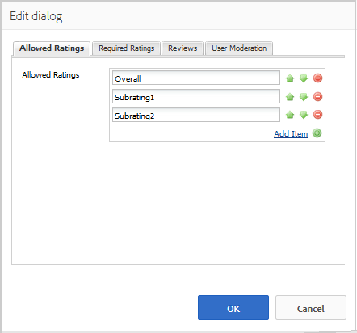

# Verwenden der Bewertungszusammenfassung (Anzeige) {#using-reviews-and-reviews-summary-display}

Die Komponente `Reviews` ist ein Verbund aus [Kommentaren](comments.md) und [Bewertung](rating.md) Komponenten, die einsatzbereit sind.

Die Komponente `Reviews Summary (Display)` bietet eine Zusammenfassung einer aktiven oder geschlossenen Instanz einer `Reviews` -Komponente, die an anderer Stelle auf der Site angezeigt werden kann.

>[!NOTE]
>
>Das anonyme Posten eines Reviews wird nicht unterstützt. Besucher der Site müssen sich registrieren (Mitglied werden) und sich anmelden, um teilnehmen zu können. Der angemeldete Besucher kann seine Überprüfung jederzeit aktualisieren.

## Hinzufügen einer Überprüfung zu einer Seite {#adding-a-review-to-a-page}

Um eine `Reviews` -Komponente im Autorenmodus zu einer Seite hinzuzufügen, suchen Sie im Komponenten-Browser nach `Communities / Reviews` und ziehen Sie sie an die gewünschte Stelle auf einer Seite, z. B. an eine Position relativ zur Funktion, die Benutzer überprüfen können.

Die erforderlichen Informationen finden Sie unter [Grundlagen der Communities-Komponenten](basics.md).

Wenn die [ erforderlichen clientseitigen Bibliotheken](reviews-basics.md#essentials-for-client-side) enthalten sind, wird die Komponente `Reviews` so angezeigt.

## Konfigurieren von Überprüfungen {#configuring-reviews}

Wählen Sie die platzierte Komponente `Reviews` aus, damit Sie auf das Symbol `Configure` zugreifen und dieses auswählen können, mit dem das Bearbeitungsdialogfeld geöffnet wird.

Geben Sie auf der Registerkarte **[!UICONTROL Zulässige Bewertungen]** die vollständige Liste der Bewertungen an, die Mitgliedern angezeigt werden sollen. Die erste Bewertung sollte eine allgemeine/allgemeine Bewertung sein, da sie die durchschnittliche Bewertung für die Komponente `Review Summary (Display)` liefert. Die nächsten beiden Bewertungen in der Standardkonfiguration sollten einen anderen Titel erhalten als &quot;Unterbewertung 1&quot;oder &quot;Unterbewertung 2&quot;.

* **[!UICONTROL Zulässige Bewertungen]**

  Eine Liste von Bewertungen, aus denen ein Mitglied wählen kann.

  Verwenden Sie die Schaltflächen nach oben, nach unten und zum Löschen, um die sichtbaren Auswahlen zu ändern.

  Klicken Sie auf **[!UICONTROL Element hinzufügen]** , um eine weitere Bewertungsoption hinzuzufügen.

Geben Sie auf der Registerkarte **[!UICONTROL Erforderliche Bewertungen]** Elemente aus der Liste der für die Bewertung erforderlichen **[!UICONTROL zulässigen Bewertungen]** erneut ein. Wenn ein Element nur auf der Registerkarte Zulässige Bewertungen angegeben wird, kann es beim Senden durch das Mitglied nicht markiert bleiben.

Auf der Website sind erforderliche Bewertungen mit einem Sternchen gekennzeichnet. Wenn ein Element erforderlich ist und nicht markiert bleibt, wird dem Mitglied eine Nachricht angezeigt und die Übermittlung wird verweigert, bis alle erforderlichen Bewertungen markiert sind.

* **[!UICONTROL Erforderliche Bewertungen]**

  Eine Untergruppe zulässiger Bewertungen, die angibt, welche Bewertungen erforderlich sind.

  Verwenden Sie die Schaltflächen nach oben, nach unten und zum Löschen, um die sichtbaren Auswahlen zu ändern.

  Klicken Sie auf **[!UICONTROL Element hinzufügen]** , um eine weitere Antwortoption hinzuzufügen.

>[!NOTE]
>
>Wenn ein Element auf der Registerkarte **[!UICONTROL Erforderliche Bewertungen]** eingegeben wird, das nicht auf der Registerkarte **[!UICONTROL Zulässige Bewertungen]** angegeben ist, ist es nicht in den zu bewertenden Elementen enthalten.

Geben Sie auf der Registerkarte **[!UICONTROL Bewertungen]** an, wie Prüfungen verarbeitet werden.

* **[!UICONTROL Antworten zulassen]**

  Wenn diese Option aktiviert ist, erlauben Sie Antworten auf Überprüfungen. Die Option Standard ist deaktiviert.

* **[!UICONTROL Geschlossen]**

  Wenn diese Option aktiviert ist, wird die Überprüfung für neue Überprüfungen und Antworten gesperrt. Die Option Standard ist deaktiviert.

* **[!UICONTROL Datei-Uploads zulassen]**

  Wenn diese Option aktiviert ist, können Dateianlagen für die Überprüfung hochgeladen werden. Die Option Standard ist deaktiviert.

* **Maximale Dateigröße**

  Nur relevant, wenn **[!UICONTROL Datei-Uploads zulassen]** aktiviert ist. Dieses Feld begrenzt die Größe (in Byte) einer hochgeladenen Datei. Der Standardwert ist 10 MB.

* **[!UICONTROL Max. Nachrichtenlänge]**

  Maximale Zeichenanzahl, die in das Textfeld eingegeben werden kann. Der Standardwert beträgt 4096 Zeichen.

* **[!UICONTROL Zulässige Dateitypen]**

  Nur relevant, wenn **[!UICONTROL Datei-Uploads zulassen]** aktiviert ist. Eine kommagetrennte Liste von Dateierweiterungen mit dem Trennzeichen &quot;Punkt&quot;. Beispiel: .jpg, .jpeg, .png, .doc, .docx, .pdf. Wenn Dateitypen angegeben sind, sind die nicht angegebenen nicht zulässig. Die Standardeinstellung ist nicht so festgelegt, dass alle Dateitypen zulässig sind.

* **[!UICONTROL Rich-Text-Editor]**

  Wenn diese Option aktiviert ist, können Beiträge mit Markup eingegeben werden. Die Option Standard ist deaktiviert.

* **[!UICONTROL Abstimmung zulassen]**

  Wenn diese Option aktiviert ist, nehmen Sie die Abstimmungsfunktion für ein Thema auf. Die Option Standard ist deaktiviert.

Geben Sie auf der Registerkarte **[!UICONTROL Benutzermoderation]** an, wie die veröffentlichten Bewertungen verwaltet werden. Weitere Informationen finden Sie unter [Moderieren benutzergenerierter Inhalte](moderate-ugc.md).

* **[!UICONTROL Vormoderation]**

  Wenn diese Option aktiviert ist, müssen Überprüfungen genehmigt werden, bevor sie auf einer Veröffentlichungs-Site erscheinen. Die Option Standard ist deaktiviert.

* **[!UICONTROL Bewertungen löschen]**

  Wenn diese Option aktiviert ist, kann das Mitglied, das die Überprüfung veröffentlicht hat, sie löschen. Die Option Standard ist deaktiviert.

* **[!UICONTROL Reviews verweigern]**

  Wenn diese Option aktiviert ist, können Moderatoren Bewertungen ablehnen. Die Option Standard ist deaktiviert.

* **[!UICONTROL Bewertungen schließen/erneut öffnen]**

  Wenn diese Option aktiviert ist, können Moderatoren Bewertungen schließen und erneut öffnen. Die Option Standard ist deaktiviert.

* **[!UICONTROL Flag Reviews]**

  Ist diese Option aktiviert, können Mitglieder Bewertungen als unangemessen kennzeichnen. Die Option Standard ist deaktiviert.

* **[!UICONTROL Liste mit Kennzeichnungsgründen]**

  Wenn diese Option aktiviert ist, können Mitglieder aus einer Dropdown-Liste den Grund auswählen, aus dem eine Überprüfung als unangemessen gekennzeichnet wird. Die Option Standard ist deaktiviert.

* **[!UICONTROL Grund für benutzerdefinierte Kennzeichnung]**

  Wenn diese Option aktiviert ist, können Mitglieder einen eigenen Grund dafür eingeben, warum eine Überprüfung als unangemessen gekennzeichnet wird. Die Option Standard ist deaktiviert.

* **[!UICONTROL Moderationsschwellenwert]**

  Geben Sie an, wie oft eine Überprüfung von Mitgliedern als unangemessen gekennzeichnet werden muss, bevor Moderatoren benachrichtigt werden. Der Standardwert ist einmal (1).

* **[!UICONTROL Kennzeichnungslimit]**

  Geben Sie an, wie oft eine Überprüfung gekennzeichnet werden muss, bevor sie in der öffentlichen Ansicht ausgeblendet wird. Diese Zahl muss größer oder gleich dem **[!UICONTROL Moderationsschwellenwert]** sein. Der Standardwert ist 5.

### Hinzufügen einer Bewertungszusammenfassung (Anzeige) zu einer Seite {#adding-a-review-summary-display-to-a-page}

Um eine `Reviews Summary (Display)` -Komponente zu einer Seite im Autorenmodus hinzuzufügen, suchen Sie die Komponente

* `Communities / Reviews Summary (Display)`

Ziehen Sie sie an eine Stelle auf einer Seite, auf der eine Zusammenfassung einer aktiven oder geschlossenen Überprüfung angezeigt werden soll.

Die erforderlichen Informationen finden Sie unter [Grundlagen der Communities-Komponenten](basics.md).

Wenn die [erforderlichen clientseitigen Bibliotheken](reviews-basics.md#essentials-for-client-side) eingeschlossen sind, wird die Komponente `Reviews Summary (Display)` so angezeigt.

>[!NOTE]
>
>Der &quot;Durchschnitt&quot;spiegelt die Stimmen für den ersten Punkt wider, der auf den Registerkarten &quot;Zulässige Bewertungen&quot;der zusammengefassten Überprüfung aufgeführt ist.

### Konfigurieren der Bewertungszusammenfassung (Anzeige) {#configuring-reviews-summary-display}

Wählen Sie die platzierte Komponente `Reviews Summary (Display)` aus, damit Sie auf das Symbol `Configure` zugreifen und dieses auswählen können, mit dem das Bearbeitungsdialogfeld geöffnet wird.

Auf der Registerkarte **[!UICONTROL Bewertungszusammenfassung]**

* `Review Path`

  Geben Sie die platzierte Instanz der Komponente &quot;`reviews`&quot;ein oder navigieren Sie zu dieser, damit Sie beispielsweise eine Zusammenfassung erstellen können, wenn Sie sie der Webseite der Seite &quot;[Geometrixx Engage&quot;hinzufügen, ](getting-started.md) lautet der Pfad:

  `/content/sites/engage/en/page/jcr:content/content/primary/reviews`

* `Include histogram`

  Wenn diese Option aktiviert ist, zeigen Sie ein Balkendiagramm an, das angibt, wie viele Sternbewertungen es in den zusammengefassten Rezensionen gibt. Die Option Standard ist deaktiviert.

### Ändern zu einem benutzerdefinierten Überprüfungstyp {#changing-to-a-custom-review-type}

Die Komponente &quot;Bewertungen&quot;verwendet das Kommentarsystem.

Durch Änderung des Kommentarressourcentyps generiert das Kommentarsystem nicht mehr eine Instanz eines Kommentars, der den Standard verwendet, sondern eine, die von Entwicklern angepasst (erweitert) wurde.

Wenn die benutzerdefinierten Ressourcentypen bekannt sind, geben Sie den [Designmodus](../../help/sites-authoring/default-components-designmode.md) ein und doppelklicken Sie auf die platzierte `Comments` -Komponente, um ein Dialogfeld mit einer zusätzlichen Registerkarte zu öffnen.

Geben Sie auf der Registerkarte **[!UICONTROL Ressourcentypen]** den benutzerdefinierten Ressourcentyp für neue Instanzen der `Comments or Voting` -Komponenten an:

* **[!UICONTROL Kommentar-Ressourcentyp]**

  Navigieren Sie zum Ressourcentyp einer erweiterten `comment`Komponente (einzelner Kommentar) in /apps. Zum Beispiel: `/apps/social/commons/components/hbs/comments/comment`.

  Diese Ressource identifiziert den resourceType des UGC, der erstellt wurde, wenn ein Besucher einen Kommentar veröffentlicht.

* **[!UICONTROL Abstimmungs-Ressourcentyp]**

  Navigieren Sie zum resourceType einer erweiterten `voting`Komponente in /apps. Zum Beispiel: `/apps/social/components/hbs/voting`.

  Diese Ressource identifiziert den Ressourcentyp des UGC, der erstellt wurde, wenn ein Besucher eine Stimme sendet.

* **[!UICONTROL Kommentar-Systemressourcentyp]**

  Navigieren Sie zum Ressourcentyp einer erweiterten `comments`Komponente (Kommentarsystem) in /apps. Lassen Sie das Feld leer, es sei denn, die Seitenvorlage [enthält dynamisch ](scf.md#add-or-include-a-communities-component) das Kommentarsystem im zugrunde liegenden Skript, anstatt zur Seite als Ressource hinzugefügt zu werden (Kommentarknoten). Erfahren Sie mehr über den [`{{include}}` Helper](handlebars-helpers.md#include).

## Site-Besuchererlebnis {#site-visitor-experience}

### Moderatoren und Administratoren {#moderators-and-administrators}

Wenn der angemeldete Benutzer über Moderator- oder Administratorberechtigungen verfügt, kann er die durch die Konfiguration der Komponente zulässigen Moderationsaufgaben ausführen, unabhängig davon, wer den Review verfasst hat.

### Mitglieder {#members}

Wenn der Besucher der Site angemeldet ist, kann er je nach Konfiguration:

* Post - eine neue Überprüfung
* Bearbeiten einer eigenen Überprüfung
* Löschen einer eigenen Überprüfung
* Anderen Überprüfungskommentaren zuweisen

Pro Mitglied ist nur eine Bewertung zulässig. Das Mitglied kann sein Rating jederzeit ändern.

### Anonym {#anonymous}

Besucher der Website, die nicht angemeldet sind, dürfen veröffentlichte Rezensionen nur lesen, übersetzen, sofern sie unterstützt werden. Sie dürfen jedoch keine Bewertung oder einen Review hinzufügen und auch keine Reviewkommentare anderer Benutzer kennzeichnen.

## Zusätzliche Informationen {#additional-information}

Weitere Informationen finden Sie auf der Entwickler-Seite [Grundlagen der Überprüfung](reviews-basics.md) .

Informationen zur Moderation von veröffentlichten Kommentaren finden Sie unter [Moderieren benutzergenerierter Inhalte](moderate-ugc.md).

Informationen zur Übersetzung von veröffentlichten Kommentaren finden Sie unter [Übersetzen benutzergenerierter Inhalte](translate-ugc.md).
