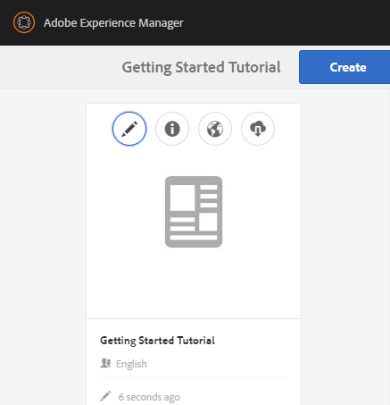
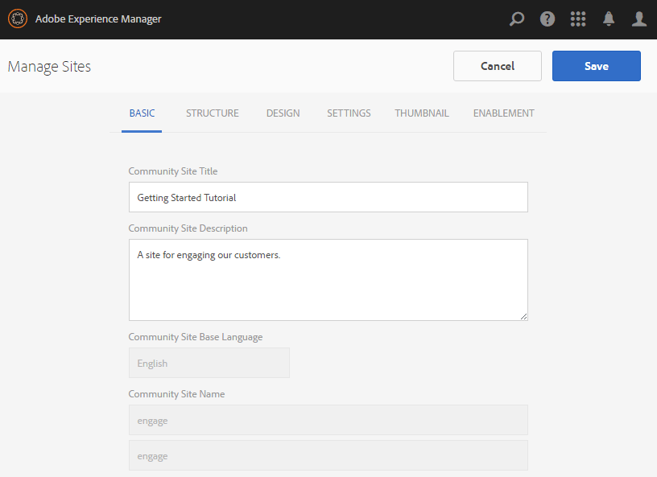

# Communities Sites Console {#communities-sites-console}

Die Communities Sites-Konsole bietet Zugriff auf:

* Site-Erstellung
* Site-Bearbeitung
* Site-Management
* [Erstellen und Bearbeiten verschachtelter Gruppen](/help/communities/groups.md) (Untergruppen)

Siehe [Erste Schritte mit AEM Communities](/help/communities/getting-started.md), um zu erfahren, wie schnell eine Community-Site in der Autoren-Umgebung erstellt werden kann, und wie Community-Gruppen aus den Umgebung zum Erstellen und Veröffentlichen erstellt werden können.

>[!NOTE]
>
>Die Hauptmenüs Communities für die Erstellung von [Community-Sites](/help/communities/sites-console.md), [Community-Sitevorlagen](/help/communities/sites.md), [Community-Gruppenvorlagen](/help/communities/tools-groups.md) und [Community-Funktionen](/help/communities/functions.md) sind nur für die Verwendung in der Autor-Umgebung vorgesehen.

## Voraussetzungen {#prerequisites}

Bevor Sie eine Community-Site erstellen, muss *Folgendes ausgeführt werden:*

* Vergewissern Sie sich, dass eine oder mehrere Instanzen im Veröffentlichungsmodus ausgeführt werden.
* Aktivieren Sie den [Tunneldienst](/help/communities/deploy-communities.md#tunnel-service-on-author), um Mitglieder und Mitgliedsgruppen zu verwalten.
* Identifizieren Sie den [primären Herausgeber](/help/communities/deploy-communities.md#primary-publisher).
* [Konfigurieren Sie die ](/help/communities/deploy-communities.md#replication-agents-on-author) Replizierung, wenn der primäre Herausgeberanschluss nicht der Standardwert ist (4503).

Um sicherzustellen, dass die Site viele Funktionen unterstützt, sollten Sie folgende Schritte durchführen:

* Installieren Sie das [aktuelle Feature Pack](/help/communities/deploy-communities.md#latestfeaturepack).
* Aktivieren Sie [Adobe Analytics](/help/communities/analytics.md) für AEM Communities.
* [email](/help/communities/email.md) konfigurieren
* Identifizieren Sie [Community-Administratoren](/help/communities/users.md#creating-community-members).
* [Aktivieren Sie OAuth-](/help/communities/social-login.md#adobe-granite-oauth-authentication-handler) Handler für die Anmeldung in sozialen Netzwerken.

## Zugriff auf Communities Sites Console {#accessing-communities-sites-console}

In der Umgebung &quot;Autor&quot;zur Konsole &quot;Communities Sites&quot;gelangen Sie wie folgt:

* Aus globaler Navigation: **[!UICONTROL Communities]** > **[!UICONTROL Sites]**

Die Communities Sites-Konsole zeigt alle vorhandenen Community-Sites an. In dieser Konsole können Community-Sites erstellt, bearbeitet, verwaltet und gelöscht werden.

Um eine neue Community-Site zu erstellen, wählen Sie das Symbol **Erstellen**.

Um auf eine bestehende Community-Site zuzugreifen, um eine verschachtelte Gruppe zu erstellen, zu bearbeiten, zu veröffentlichen, zu exportieren oder hinzuzufügen, wählen Sie das Ordnersymbol der Site aus.

Die folgende Abbildung zeigt beispielsweise die Haupt-Konsole Communities Sites , in der die Ordner für zwei Community-Sites angezeigt werden: [enable](/help/communities/getting-started-enablement.md) und [engagement](/help/communities/getting-started.md):

## Site-Erstellung {#site-creation}

Die Site-Erstellungskonsole bietet einen schrittweisen Ansatz, um Funktionen der Site basierend auf einer ausgewählten [Community-Site-Vorlage](/help/communities/sites.md) und Einstellungen zusammenzustellen.

Jede erstellte Site verfügt über eine Anmeldefunktion, da Site-Besucher sich anmelden müssen, bevor sie Inhalte posten, Nachrichten senden oder an einer Gruppe teilnehmen können. Zu den weiteren Funktionen gehören Profil, Nachrichten, Benachrichtigungen, Site-Menü, Suche, Design und Branding.

Der Prozess wird gestartet, indem Sie die Schaltfläche `Create` oben in der Communities Sites-Konsole auswählen.

Der Erstellungsprozess besteht aus einer Reihe von Schritten, die als Bedienfelder mit einer Reihe von zu konfigurierenden Funktionen (die als Unterbereiche dargestellt werden) dargestellt werden. Es ist möglich, zum Schritt **Weiter** oder zum Schritt **Zurück** zum vorherigen Schritt vorzugehen, bevor die Site im letzten Schritt übernommen wird.

### Schritt 1: Site-Vorlage {#step-site-template}

Im Bedienfeld &quot;Site-Vorlage&quot;werden Titel, Beschreibung, Site-Stammordner, Basissprache, Name und Site-Vorlage angegeben:

* **Community-Site-Titel**

   Ein Anzeigentitel für die Site.

   Der Titel wird sowohl auf der veröffentlichten Site als auch in der Benutzeroberfläche des Site-Administrators angezeigt.

* **Community-Site-Beschreibung**

   Eine Beschreibung der Site.

   Die Beschreibung wird nicht auf der veröffentlichten Site angezeigt.

* **Community-Site-Stammordner**

   Der Stammpfad zur Site.

   Der Standardstamm ist `/content/sites`, der Stammordner kann jedoch an einen beliebigen Speicherort auf der Website verschoben werden.

* **Grundsprache der Community-Site**

   (Für eine Sprache unberührt lassen: Englisch) Verwenden Sie das Pulldown-Menü, um eine *oder mehr* Basissprache aus den verfügbaren Sprachen auszuwählen: Deutsch, Italienisch, Französisch, Japanisch, Spanisch, Portugiesisch (Brasilien), Chinesisch (Traditionell) und Chinesisch (vereinfacht). Eine Community-Site wird für jede hinzugefügte Sprache erstellt und befindet sich im selben Site-Ordner, wie unter [Übersetzung von Inhalten für mehrsprachige Sites](/help/sites-administering/translation.md) beschrieben. Die Stammseite jeder Site enthält eine untergeordnete Seite, die nach dem Sprachcode einer der ausgewählten Sprachen benannt ist, wie z.B. &quot;en&quot; für Englisch oder &quot;fr&quot; für Französisch.

* **Community-Site-Name**:

   Der Name der Stammseite der Site, die in der URL angezeigt wird.

   * Überprüfen Sie den Dublette-Namen, da er nach dem Erstellen der Site nicht leicht geändert werden kann.
   * Die Basis-URL ( `https://server:port/site root/site name)` wird unter dem `Community Site Name` angezeigt.

   * Für eine gültige URL hängen Sie einen Basissprachcode an + &quot;.html&quot;

      *Beispiel*, `https://localhost:4502/content/sites/mysight/en.html`

* **Community-Site-** Vorlagenmenü

   Verwenden Sie das Pulldown-Menü, um eine verfügbare [Community-Site-Vorlage](/help/communities/tools.md) auszuwählen.

* Wählen Sie **Weiter** aus.

### Schritt 2: Design {#step-design}

Das Bedienfeld &quot;Design&quot;enthält 2 Unterbereiche zum Auswählen des Designs und des Branding-Banners:

#### COMMUNITY SITE-THEMA {#community-site-theme}

Das Framework verwendet [Twitter-Bootstrap](https://twitterbootstrap.org/), um ein reaktionsfähiges, flexibles Design auf die Site zu bringen. Es kann eines der vielen vorab geladenen Bootstrap-Themen ausgewählt werden, um die ausgewählte Community-Site-Vorlage zu gestalten, oder es kann ein Bootstrap-Design hochgeladen werden.

Wenn diese Option aktiviert ist, wird das Design mit einem undurchsichtigen blauen Häkchen überlagert.

Nach der Veröffentlichung der Community-Site ist es möglich, die Eigenschaften [zu bearbeiten und ein anderes Design auszuwählen.](#modifying-site-properties)

#### COMMUNITY SITE BRANDING {#community-site-branding}

Das Branding einer Community-Site ist ein Bild, das als Kopfzeile am oberen Rand jeder Seite angezeigt wird.

Das Bild sollte so groß sein, dass es im Browser wie erwartet angezeigt wird, und 120 Pixel hoch.

Beachten Sie beim Erstellen oder Auswählen eines Bildes Folgendes:

* Die Bildhöhe wird auf 120 Pixel abgeschnitten, gemessen vom oberen Bildrand.
* Das Bild wird am linken Rand des Browserfensters fixiert.
* Die Bildgröße wird nicht geändert, d. h., wenn die Bildbreite ...

   * Wenn die Breite des Browsers geringer ist, wird das Bild horizontal wiederholt.
   * Größer als die Breite des Browsers, scheint das Bild beschnitten zu sein.

* Wählen Sie **Weiter** aus.

### Schritt 3: Einstellungen {#step-settings}

Das Einstellungsbedienfeld enthält mehrere Unterbereiche mit Funktionen, die konfiguriert werden müssen, bevor Sie zum letzten Schritt zur Erstellung der Site wechseln.

* [BENUTZERVERWALTUNG](#user-management)
* [TAG](#tagging)
* [ROLLEN](#roles)
* [MODERATION](#moderation)
* [ANALYSEN](#analytics)
* [ÜBERSETZUNG](#translation)
* [AKTIVIERUNG](#enablement)

>[!NOTE]
>
>**Tunnel-Dienst aktivieren**
>
>Mehrere Unterbereiche unter &quot;Einstellungen&quot;ermöglichen es einem vertrauenswürdigen Mitglied, UGC zu moderieren, Gruppen zu verwalten oder Kontaktpersonen für die Aktivierung von Ressourcen in der Umgebung &quot;Veröffentlichen&quot;zu sein.
>
>Die Regel besteht darin, dass auf der Seite der Veröffentlichung [Benutzer und Benutzergruppen](/help/communities/users.md) (Mitglieder und Mitgliedergruppen) nicht in der Umgebung &quot;Autor&quot;dupliziert werden darf.
>
>Daher ist es beim Erstellen der Community-Site in der Autorenrolle und beim Zuweisen von vertrauenswürdigen Mitgliedern zu verschiedenen Rollen erforderlich, Mitgliedsdaten aus der Veröffentlichungs-Umgebung abzurufen.
>
>Dies wird erreicht, indem ` [AEM Communities Publish Tunnel Service](/help/communities/deploy-communities.md#tunnel-service-on-author)` für die Autorendatei aktiviert wird.

#### BENUTZERVERWALTUNG {#user-management}

>[!NOTE]
>
>Es wird empfohlen, dass [Community-Sites für die Aktivierung](/help/communities/overview.md#enablement-community) privat sein sollten (wenden Sie sich für weitere Informationen an Ihren Kundenbetreuer).
>
>Eine Community-Site ist privat, wenn anonymen Site-Besuchern der Zugriff verweigert wird, sie sich nicht selbst registrieren können und sie möglicherweise keine Social-Anmeldung verwenden.

* **Benutzerregistrierung zulassen**

   Wenn diese Option aktiviert ist, können Site-Besucher durch Selbstregistrierung Community-Mitglieder werden.
Wenn diese Option deaktiviert ist, ist die Community-Site *Eingeschränkt* und die Site-Besucher müssen der Mitgliedergruppe der Community-Site zugeordnet sein, eine Anfrage stellen oder per E-Mail eine Einladung erhalten. Wenn diese Option deaktiviert ist, sollte der anonyme Zugriff nicht erlaubt sein.
Deaktivieren Sie die Option für eine *private* Community-Site. Diese Option ist standardmäßig aktiviert.

* **Anonymen Zugriff erlauben**

   Wenn aktiviert, ist die Community-Site *open *und jeder Site-Besucher kann auf die Site zugreifen.
Wenn diese Option deaktiviert ist, können nur angemeldete Mitglieder auf die Site zugreifen.
Deaktivieren Sie die Option für eine *private *Community-Site. Diese Option ist standardmäßig aktiviert.

* **Messaging zulassen**

   Wenn diese Option aktiviert ist, können Mitglieder Nachrichten an einander und an die Gruppe innerhalb der Community-Site senden.
Wenn diese Option deaktiviert ist, wird Messaging für die Community nicht eingerichtet.
Diese Option ist standardmäßig deaktiviert.

* **Anmeldung über soziale Medien erlauben: Facebook**

   Wenn diese Option aktiviert ist, erlauben Sie Site-Besuchern, sich mit ihren Facebook-Kontoangaben anzumelden. Die ausgewählte [Facebook-Cloud-Konfiguration](/help/communities/social-login.md#create-a-facebook-connect-cloud-service) sollte so konfiguriert werden, dass Benutzer zur Mitgliedergruppe der Community-Site hinzugefügt werden, sobald die Community-Site erstellt wurde.
Wenn diese Option deaktiviert ist, wird keine Facebook-Anmeldung angezeigt.
Lassen Sie das Kontrollkästchen für eine *private* Community-Site deaktiviert. Diese Option ist standardmäßig deaktiviert.

* **Anmeldung über soziale Medien erlauben: Twitter**

   Wenn diese Option aktiviert ist, erlauben Sie Site-Besuchern, sich mit ihren Twitter-Kontoangaben anzumelden. Die ausgewählte [Twitter-Cloud-Konfiguration](/help/communities/social-login.md#create-a-twitter-connect-cloud-service) sollte so konfiguriert werden, dass Benutzer zur Mitgliedergruppe der Community-Site hinzugefügt werden, sobald die Community-Site erstellt wurde.
Wenn diese Option deaktiviert ist, wird keine Twitter-Anmeldung angezeigt.
Lassen Sie das Kontrollkästchen für eine *private* Community-Site deaktiviert. Diese Option ist standardmäßig deaktiviert.

>[!NOTE]
>
>**Zulassen von Social-Anmeldungen**
>
>Während Beispielkonfigurationen für Facebook und Twitter existieren und auswählbar sind, müssen für eine [Produktions-Umgebung](/help/sites-administering/production-ready.md) benutzerdefinierte Facebook- und Twitter-Anwendungen erstellt werden. Siehe [Social-Anmeldung bei Facebook und Twitter](/help/communities/social-login.md).

#### TAGGGING {#tagging}

Die Tags, die auf Community-Inhalte angewendet werden können, werden gesteuert, indem Sie Tag-Namensraum auswählen, die zuvor über die [Tagging-Konsole](/help/sites-administering/tags.md#tagging-console) definiert wurden.

Darüber hinaus wird bei der Auswahl von Tag-Namensräumen für die Community-Site die Auswahl beim Definieren von Katalogen und Ressourcen eingeschränkt. Wichtige Informationen finden Sie unter [Tagging-Aktivierungsressourcen](/help/communities/tag-resources.md).

* Textfeld: Eingabe von Beginn zur Identifizierung von Tags, die auf der Site verwendet werden dürfen.

#### ROLLEN {#roles}

Die Rollen [der Community-Mitglieder](/help/communities/users.md) werden mit diesen Einstellungen zugewiesen.

Die Suche nach Community-Mitgliedern ist mit der Type-Ahead-Suche einfach.

* **Community-Manager**

   Beginn eingeben, um ein oder mehrere Community-Mitglieder oder Mitgliedsgruppen auszuwählen, die Community-Mitglieder und -Mitgliedsgruppen verwalten können.

* **Community-Moderatoren**

   Beginn eingeben, um ein oder mehrere Community-Mitglieder oder Mitgliedsgruppen auszuwählen, denen als Moderatoren von benutzergenerierten Inhalten vertraut werden soll.

* **Privilegierte Community-Mitglieder**

   Beginn eingeben, um ein oder mehrere Community-Mitglieder oder -Mitgliedsgruppen auszuwählen, damit neue Inhalte erstellt werden können, wenn `Allow Privileged Member` für eine [Community-Funktion](/help/communities/functions.md) ausgewählt wurde.

* **Community-Administratoren**

   Beginn eingeben, um einen oder mehrere Site-Administratoren auszuwählen, die die Sitestruktur unabhängig von anderen Site-Administratoren und dem standardmäßigen Community-Administrator verwalten können. Sie können Gruppen auf jeder Ebene der Hierarchie erstellen und zum Standardadministrator der verschachtelten Gruppen werden (sie können später jedoch aus der Administratorrolle verschachtelter Gruppen entfernt werden).

#### MODERATION {#moderation}

Die globale Einstellung für die Moderation benutzergenerierter Inhalte (UGC) wird durch diese Einstellungen gesteuert. Die einzelnen Komponenten verfügen über zusätzliche Einstellungen zur Steuerung der Moderation.

* **Inhalt ist vormoderiert**

   Wenn diese Option aktiviert ist, werden gepostete Community-Inhalte erst angezeigt, nachdem sie von einem Moderator genehmigt wurden. Diese Option ist standardmäßig deaktiviert. Weitere Informationen finden Sie unter [Moderieren von Community-Inhalten](/help/communities/moderate-ugc.md#premoderation).

* **Kennzeichnung des Schwellenwerts, bevor der Inhalt ausgeblendet wird**

   Wenn der Wert größer als 0 ist, muss ein Thema oder Beitrag vor der öffentlichen Ansicht markiert werden. Bei einem Wert von -1 wird das gekennzeichnete Thema oder der Beitrag nie aus der öffentlichen Ansicht ausgeblendet. Der Standardwert ist 5.

#### ANALYTICS {#analytics}

* **Analytics aktivieren**

   Nur verfügbar, wenn Adobe Analytics für Communities-Funktionen konfiguriert wurde.

Diese Option ist standardmäßig deaktiviert. Wenn diese Option aktiviert ist, wird ein zusätzliches Auswahlmenü angezeigt:

* **Framework-Verweis der Cloud-Konfiguration**

   Wählen Sie im Pulldown-Menü das für diese Community-Site konfigurierte Analytics Cloud-Service-Framework aus.
   `Communities` ist das Framework-Beispiel aus der Dokumentation zur  [Analytics-Konfiguration für Communities-](/help/communities/analytics.md#aem-analytics-framework-configuration) Funktionen.

#### TRANSLATION {#translation}

* **Maschinelle Übersetzung zulassen**

   Wenn diese Option aktiviert ist (Standardeinstellung deaktiviert), wird die maschinelle Übersetzung für UGC innerhalb der Site aktiviert. Dies hat keine Auswirkungen auf andere Inhalte wie Seiteninhalte, auch wenn die Site als mehrsprachige Site eingerichtet wurde. Informationen zum Konfigurieren eines lizenzierten Übersetzungsdienstes für AEM Communities finden Sie unter [Benutzergenerierte Inhalte übersetzen](/help/communities/translate-ugc.md). Eine vollständige Übersicht finden Sie unter [Übersetzung von Inhalten für mehrsprachige Sites](/help/sites-administering/translation.md).

* **Maschinelle Übersetzung für ausgewählte Sprachen aktivieren**

   Die für die maschinelle Übersetzung aktivierten Sprachen entsprechen standardmäßig den Systemeinstellungen, die in der [Konfiguration der Übersetzungs-Integration](/help/communities/translate-ugc.md#translation-integration-configuration) angegeben sind. Diese Standardeinstellungen können für diese Site überschrieben werden, indem Standardwerte gelöscht und/oder andere Sprachen aus dem Pulldown-Menü ausgewählt werden.

* **Übersetzungsanbieter auswählen**

   Standardmäßig ist der Dienstleister ein Testdienst, der `microsoft` nur zur Demonstration verwendet. Wenn kein Dienstleister für Übersetzung lizenziert ist, sollte **Maschinelle Übersetzung zulassen** deaktiviert werden.

* **Globalen geteilten Speicher auswählen**

   Für eine Website mit mehreren Sprachkopien bietet ein globaler gemeinsamer Store einen einzigen Konversationsthread, der von jeder Sprachkopie aus sichtbar ist. Dies wird erreicht, indem eine der Sprachen als Sprachkopie ausgewählt wird. Der Standardwert ist *Kein globaler freigegebener Store*.

* **Übersetzungsanbieter-Konfiguration auswählen**

   Wählen Sie ein [Framework für die Integration von Übersetzungen](/help/sites-administering/tc-tic.md), das für den lizenzierten Übersetzungsanbieter erstellt wurde.

* **Wählen Sie die Übersetzungsoptionen für Ihre Community-Site**

   * **Gesamte Seite übersetzen**

      Wenn diese Option aktiviert ist, werden alle UGC auf einer Seite in die Basissprache der Seite übersetzt.

      Die Standardeinstellung ist *nicht ausgewählt*.

   * **Nur Auswahl übersetzen**

      Wenn diese Option aktiviert ist, wird neben jedem Beitrag eine Übersetzungsoption angezeigt, mit der einzelne Beiträge in die Basissprache der Seite übersetzt werden können.
Die Standardeinstellung ist *selected*.

* **Speicheroptionen auswählen**

   * **Übersetzen Sie Beiträge auf Benutzeranforderung und bleiben Sie**
danach bestehen. Wenn diese Option aktiviert ist, werden Inhalte erst übersetzt, nachdem eine Anforderung gestellt wurde. Nach der Übersetzung wird die Übersetzung im Repository gespeichert.

      Die Standardeinstellung ist *nicht ausgewählt*.

   * **Übersetzungen nicht behalten**

      Wenn diese Option aktiviert ist, werden Übersetzungen nicht im Repository gespeichert.

      Wenn diese Option nicht ausgewählt ist, bleiben die Übersetzungen erhalten.

      Die Standardeinstellung ist *nicht ausgewählt*.

* **Smart Rendering**

   Wählen Sie eine der folgenden Optionen:

   * `Always show contributions in the original language` (default)
   * `Always show contributions in user preferred language`
   * `Show contributions in user preferred language for only logged-in users`

#### AKTIVIERUNG {#enablement}

Die `ENABLEMENT`Einstellungen gelten, wenn die ausgewählte Community-Site-Vorlage die [Zuweisungsfunktion](/help/communities/functions.md#assignments-function) enthält, die verfügbar ist, wenn die Aktivierungsfunktionen lizenziert und [konfiguriert sind. ](/help/communities/enablement.md) Die Referenz-Website-Vorlage mit der Zuweisungsfunktion ist `Reference Structured Learning Site Template.`

* **Aktivierungsmanager**
 (Erforderlich) Nur Mitglieder der  `Community Enablementmanagers` Gruppe können ausgewählt werden, um diese Community für die Aktivierung zu verwalten. Aktivierungsmanager sind für die Zuweisung von Mitgliedern zu Ressourcen verantwortlich. Siehe auch [Verwalten von Benutzern und Benutzergruppen](/help/communities/users.md).

* **ID der Marketing Cloud-Organisation**

   (Optional) Die ID für eine Lizenz von [Video Heartbeat Analytics](/help/communities/analytics.md#video-heartbeat-analytics).

* Wählen Sie **Weiter** aus.

### Schritt 4: Communities-Site {#step-create-communities-site} erstellen

Wenn Anpassungen erforderlich sind, verwenden Sie die Schaltfläche **Zurück**, um sie vorzunehmen.

Wenn **Create** ausgewählt und gestartet wurde, kann der Vorgang zum Erstellen der Site nicht unterbrochen werden.

Nachdem die Site erstellt wurde:

* Das Ändern der URL (Knotenname) wird nicht unterstützt.
* Zukünftige Änderungen an der Community-Site-Vorlage haben keine Auswirkungen auf die erstellte Community-Site.
* Die Deaktivierung der Community-Site-Vorlage hat keine Auswirkungen auf die erstellte Community-Site.
* Sie können die [STRUKTUR](#modify-structure) einer Community-Site bearbeiten, indem Sie deren Eigenschaften ändern.

Nach Abschluss des Vorgangs wird der Ordner für die neue Site in der Konsole Communities Sites angezeigt, in der Autoren Seiteninhalte hinzufügen können oder Administratoren die Eigenschaften der Site ändern können.

Um eine Community-Site zu ändern, wählen Sie ihren Projektordner aus, um ihn zu öffnen:

Wenn Sie den Mauszeiger über eine Site bewegen oder eine Sitekarte berühren, werden Symbole angezeigt, die es ermöglichen, [die Site im Autorenmodus zu bearbeiten](#authoring-site-content), [die Site-Eigenschaften für Änderungen zu öffnen](#modifying-site-properties), [die Site zu veröffentlichen](#publishing-the-site), [die Site zu exportieren und ](#exporting-the-site)die Site zu löschen>.

## Erstellen von Site-Inhalten {#authoring-site-content}

Der Inhalt einer Website kann mit den gleichen Tools wie jede andere AEM erstellt werden. Um die Site zum Authoring zu öffnen, wählen Sie das `Open Site`-Symbol, das angezeigt wird, wenn Sie den Mauszeiger über die Site bewegen. Die Site wird in einer neuen Registerkarte geöffnet, sodass auf die Konsole Communities Sites weiterhin zugegriffen werden kann.

>[!NOTE]
>
>Wenn Sie mit AEM nicht vertraut sind, Ansicht der Dokumentation unter [basic handling](/help/sites-authoring/basic-handling.md) und [quick guide to authoring pages](/help/sites-authoring/qg-page-authoring.md).

## Ändern der Site-Eigenschaften {#modifying-site-properties}

Die Eigenschaften einer vorhandenen Site, die während des Site-Erstellungsprozesses angegeben werden, können durch Auswahl des `Edit Site`Symbols geändert werden, das angezeigt wird, wenn Sie den Mauszeiger über die Site bewegen.

`Details of the following properties match the descriptions provided in the` [Site-](#site-creation) Erstellung.

### Basic {#modify-basic} ändern

Das BASIC-Bedienfeld ermöglicht die Änderung von:

* Community-Site-Titel
* Community-Site-Beschreibung

Der Community-Site-Name darf nicht geändert werden.

Die Auswahl einer anderen Community-Site-Vorlage hätte keine Auswirkungen auf eine vorhandene Community-Site, da keine Verbindung zwischen Vorlagen und Sites bestehen bleibt.

Stattdessen kann die [STRUKTUR](#modify-structure) der Community-Site geändert werden.

### Struktur ändern {#modify-structure}

Das STRUKTURbedienfeld ermöglicht die Änderung der Struktur, die ursprünglich aus der ausgewählten Community-Site-Vorlage erstellt wurde. Über den Bereich können Sie:

* Ziehen Sie weitere [Community-Funktionen](/help/communities/functions.md) per Drag &amp; Drop in die Site-Struktur.
* Auf einer Instanz einer Community-Funktion in der Site-Struktur:

   * **`gear icon`**

      Bearbeiten Sie Einstellungen, einschließlich des Anzeigentitels und des URL-Namens* sowie [privilegierte Mitgliedergruppen](/help/communities/users.md#privilegedmembersgroups).

   * **`trashcan icon`**

      Entfernen (Löschen) von Funktionen aus der Site-Struktur.

   * **`grid icon`**

      Ändern Sie die Reihenfolge der Funktionen, die in der Navigationsleiste auf der obersten Navigationsebene der Site angezeigt werden.

>[!NOTE]
>
>Sie können die Reihenfolge aller Funktionen in der Site-Struktur mit Ausnahme der Funktion oben ändern. Daher kann die Startseite der Communities site nicht geändert werden.

>[!CAUTION]
>
>* Der Anzeigentitel kann ohne Nebenwirkungen geändert werden, es wird jedoch nicht empfohlen, den URL-Namen einer Community-Funktion zu bearbeiten, die zu einer Community-Site gehört.
>
>
Wenn Sie beispielsweise die URL umbenennen, wird die vorhandene UGC nicht verschoben, sodass die UGC verliert wird.

>[!CAUTION]
>
>Die Funktion &quot;Gruppen&quot;darf weder die Funktion *first noch die Funktion* in der Sitestruktur sein.**
>
>Jede andere Funktion, wie z. B. die Funktion [page](/help/communities/functions.md#page-function), muss eingeschlossen und zuerst aufgelistet werden.

#### Beispiel: Hinzufügen einer Katalogfunktion zu einer Community-Site-Struktur {#example-adding-a-catalog-function-to-a-community-site-structure}

### Design ändern {#modify-design}

Das DESIGN-Bedienfeld ermöglicht die Anwendung eines neuen Designs:

* [Community-Site-Thema](#community-site-theme)
* [Community-Site-Branding](#community-site-branding)

   * Blättern Sie nach unten im Bedienfeld, um das Markenbild zu ändern.

### Einstellungen ändern {#modify-settings}

Das Bedienfeld &quot;EINSTELLUNGEN&quot;ermöglicht den Zugriff auf die meisten Einstellungen unter den Unterfeldern von Schritt 3 der Community-Site-Erstellung:

* [Benutzerverwaltung](#user-management)
* [Tags](#tagging)
* [Moderation](#moderation)
* [Mitgliederrollen](#roles)
* [Analytics](#analytics)
* [Übersetzung](#translation)

### Miniaturansicht ändern {#modify-thumbnail}

Im Bereich &quot;MINIATURANSICHT&quot;kann ein Bild hochgeladen werden, das die Site in der Konsole &quot;Communities Sites&quot;darstellt.

### Aktivierung ändern {#modify-enablement}

Das Fenster &quot;ENABLEMENT&quot;ermöglicht den Zugriff auf die Einstellungen, die während der Erstellung der Community-Site bereitgestellt werden.

Siehe Beschreibung [ENABLEMENT](#enablement).

## Veröffentlichen der Site {#publishing-the-site}

Nachdem eine Community-Site neu erstellt oder geändert wurde, ist es möglich, die Site zu veröffentlichen (aktivieren), indem Sie das `Publish Site`-Symbol auswählen, das angezeigt wird, wenn Sie den Mauszeiger über die Site bewegen.

Nach erfolgreicher Veröffentlichung der Site wird ein Hinweis angezeigt.

### Veröffentlichen mit verschachtelten Gruppen {#publishing-with-nested-groups}

Nach dem Veröffentlichen einer Community-Site müssen alle Untergruppen (verschachtelte Gruppen), die mit der [Groups-Konsole](/help/communities/groups.md) erstellt wurden, einzeln veröffentlicht werden.

## Exportieren der Site {#exporting-the-site}

Wählen Sie das Exportsymbol, wenn Sie den Mauszeiger über die Site halten, um ein Paket der Community-Site zu erstellen, das sowohl im [Package Manager](/help/sites-administering/package-manager.md) gespeichert als auch heruntergeladen wird.

Beachten Sie, dass UGC nicht im Site-Paket enthalten ist.

## Löschen der Site {#deleting-the-site}

Um die Community-Site zu löschen, wählen Sie das Symbol &quot;Site löschen&quot;, das angezeigt wird, wenn Sie den Mauszeiger über die Site in der Communities Site-Konsole bewegen. Durch diese Aktion werden alle mit der Site verknüpften Elemente entfernt, z. B. UGC, Benutzergruppen, Assets und Datenbankdatensätze.

## Community-Benutzergruppen {#created-community-user-groups}

Sobald die neue Community-Site veröffentlicht wurde, werden neue Mitgliedsgruppen (Benutzergruppen werden in der Umgebung zum Veröffentlichen erstellt) mit den entsprechenden Berechtigungen für verschiedene Verwaltungs- und Mitgliedsrollen erstellt.

Der für die Mitgliedergruppen erstellte Name umfasst den *Site-Namen*, der der Site in [Schritt 1](#step13asitetemplate) (der Name, der in der URL angezeigt wird) zugewiesen wurde, sowie eine eindeutige ID, um Konflikte mit Community-Sites und -Gruppen mit demselben Site-Namen für verschiedene Community-Site-Stammordner zu vermeiden.

Wenn der Name beispielsweise &quot;interagieren&quot;für eine Site mit dem Titel &quot;Erste Schritte-Tutorial&quot;wäre, wäre die Benutzergruppe für Moderatoren:

* title: Community-Interaktionsmoderatoren
* name: community-*engagement-uid*-moderatoren

Beachten Sie, dass alle Mitglieder, denen beim Erstellen der Site Rollen als Moderatoren oder Gruppenadministratoren zugewiesen wurden, der entsprechenden Gruppe zugewiesen und der Mitgliedergruppe zugewiesen werden. Diese Gruppen und Mitgliederzuweisungen werden bei der Veröffentlichung der neuen Site erstellt.

Weitere Informationen finden Sie unter [Verwalten von Benutzern und Benutzergruppen](/help/communities/users.md).

>[!NOTE]
>
>Wenn [Social-Anmeldung zulassen: Facebook](#user-management) ist aktiviert, sobald die Benutzergruppe
>
>* `community-<site-name>-<uid>-members`
>
>
erstellt wurde, sollte der angewendete [Facebook-Cloud-Dienst](/help/communities/social-login.md#createafacebookcloudservice) so konfiguriert werden, dass dieser Gruppe Benutzer hinzugefügt werden.

## Konfigurieren für Authentifizierungsfehler {#configure-for-authentication-error}

Standardmäßig wird eine Community-Site zu einer Beispielseite für die Anmeldung umgeleitet, wenn der Benutzer die falschen Anmeldeinformationen eingibt und sich nicht anmeldet. Diese Beispielanmeldung ist auf einem [Produktionsserver](/help/sites-administering/production-ready.md) nicht vorhanden.

Führen Sie zur korrekten Umleitung die folgenden Schritte aus, um sicherzustellen, dass die Authentifizierung bei der Umleitung auf die Community-Site fehlschlägt, sobald eine Site konfiguriert wurde und veröffentlicht wird:

* Auf jeder AEM Instanz im Veröffentlichungsmodus.
* Melden Sie sich mit Administratorrechten an.
* Rufen Sie die [Webkonsole](/help/sites-deploying/configuring-osgi.md) auf.

   * Beispiel: [https://localhost:4503/system/console/configMgr](https://localhost:4503/system/console/configMgr).

* Suchen Sie nach `Adobe Granite Login Selector Authentication Handler`.
* Klicken Sie auf das Symbol `pencil`, um die Konfiguration zur Bearbeitung zu öffnen.
* Geben Sie eine **Seitenzuordnungen für die Anmeldung** wie folgt ein:

   `/content/sites/<site-name>/path/to/login/page:/content/sites/<site-name>`

   Beispiel:
   `/content/sites/engage/en/signin:/content/sites/engage/en`

* Wählen Sie **Speichern** aus.

### Testauthentifizierungsumleitung {#test-authentication-redirection}

In derselben AEM Instanz im Veröffentlichungsmodus, die mit einer Zuordnung der Anmeldeseite für die Community-Site konfiguriert wurde:

* Navigieren Sie zur Community-Site-Startseite.

   * Beispiel: [https://localhost:4503/content/sites/engage/en.html](https://localhost:4503/content/sites/engage/en.html)

* Wählen Sie Abmelden.
* Wählen Sie Anmelden.
* Geben Sie offensichtlich falsche Anmeldeangaben ein, z. B. Benutzername &quot;x&quot;und Kennwort &quot;x&quot;.
* Die Anmeldeseite sollte mit der Fehlermeldung &quot;Ungültige Anmeldung&quot;angezeigt werden.

## Zugriff auf Community-Sites über die Haupt-Sites-Konsole {#accessing-community-sites-from-main-sites-console}

In der Konsole der globalen Navigations-Sites befinden sich Community-Sites im Ordner `Community Sites`.

Obwohl es möglich ist, auf eine Community-Site auf diese Weise zuzugreifen, sollte die Community-Site für administrative Aufgaben von der Communities Sites-Konsole aus aufgerufen werden.

