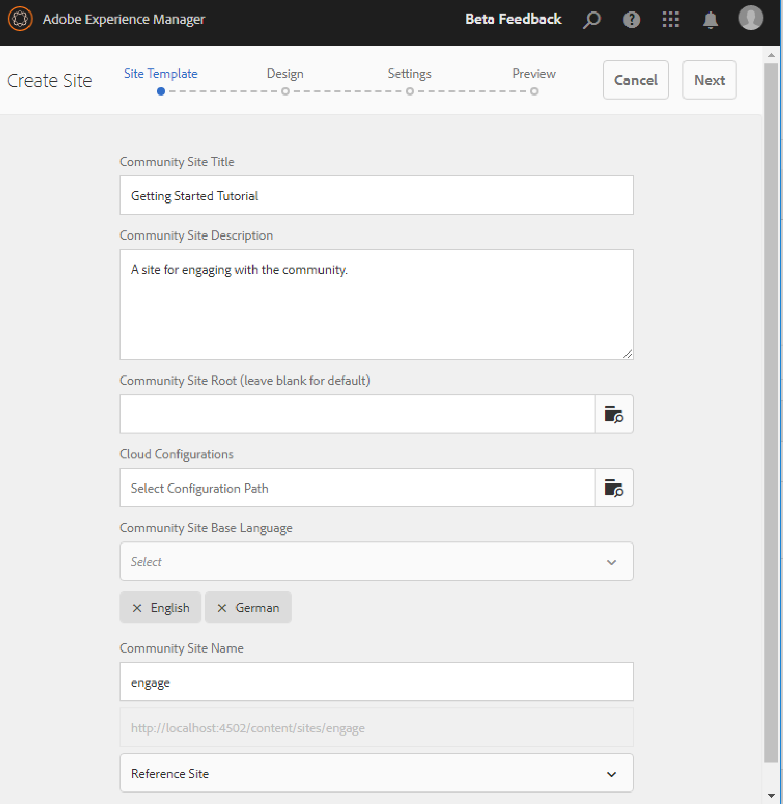

# Communities Sites-Konsole {#communities-sites-console}

Die Communities Sites-Konsole bietet Zugriff auf:

* Site-Erstellung
* Site-Bearbeitung
* Site-Management
* [Erstellen und Bearbeiten verschachtelter Gruppen](/help/communities/groups.md) (Unter-Communities)

Siehe [Erste Schritte mit AEM Communities](/help/communities/getting-started.md) wo Sie erfahren können, wie schnell eine Community-Site in der Autorenumgebung erstellt werden kann und wie Sie Community-Gruppen aus der Autoren- und Veröffentlichungsumgebung erstellen.

>[!NOTE]
>
>Die Hauptmenüs der Gemeinschaften zur Erstellung von [Community-Sites](/help/communities/sites-console.md), [Community-Site-Vorlagen](/help/communities/sites.md), [Community-Gruppenvorlagen](/help/communities/tools-groups.md), und [Community-Funktionen](/help/communities/functions.md) sind nur zur Verwendung in der Autorenumgebung vorgesehen.

## Voraussetzungen {#prerequisites}

Bevor Sie eine Community-Site erstellen, ist dies *erforderlich* an:

* Stellen Sie sicher, dass eine oder mehrere Veröffentlichungsinstanzen ausgeführt werden.
* Aktivieren Sie die [Tunneldienst](/help/communities/deploy-communities.md#tunnel-service-on-author) zur Verwaltung von Mitgliedern und Mitgliedergruppen.
* Identifizieren Sie die [primärer Herausgeber](/help/communities/deploy-communities.md#primary-publisher).
* [Replikation konfigurieren](/help/communities/deploy-communities.md#replication-agents-on-author) , wenn der primäre Herausgeberanschluss nicht der Standardanschluss ist (4503).

Um sicherzustellen, dass die Site viele Funktionen unterstützt, empfiehlt es sich, die folgenden Schritte durchzuführen:

* Installieren Sie die [neueste Feature Pack](/help/communities/deploy-communities.md#latestfeaturepack).
* Aktivieren [Adobe Analytics](/help/communities/analytics.md) für AEM Communities.
* Konfigurieren [email](/help/communities/email.md)
* Identifizieren [Community-Administratoren](/help/communities/users.md#creating-community-members).
* [OAuth-Handler aktivieren](/help/communities/social-login.md#adobe-granite-oauth-authentication-handler) für die Anmeldung in sozialen Netzwerken.

## Zugreifen auf die Communities Sites-Konsole {#accessing-communities-sites-console}

Gehen Sie in der Autorenumgebung in die Konsole Communities Sites :

* Über die globale Navigation: **[!UICONTROL Communities]** > **[!UICONTROL Sites]**

In der Communities Sites-Konsole werden alle vorhandenen Community-Sites angezeigt. In dieser Konsole können Community-Sites erstellt, bearbeitet, verwaltet und gelöscht werden.

Um eine Community-Site zu erstellen, wählen Sie die **Erstellen** Symbol.

Um auf eine vorhandene Community-Site für das Authoring, Ändern, Veröffentlichen, Exportieren oder Hinzufügen einer verschachtelten Gruppe zuzugreifen, wählen Sie das Ordnersymbol der Site aus.

## Erstellung einer Site {#site-creation}

Die Site-Erstellungskonsole bietet einen schrittweisen Ansatz, um Funktionen der Site basierend auf einer ausgewählten [Community-Site-Vorlage](/help/communities/sites.md) und -Einstellungen.

Jede erstellte Site verfügt über eine Anmeldefunktion, da sich Besucher der Site anmelden müssen, bevor sie Inhalte posten, Nachrichten senden oder an einer Gruppe teilnehmen können. Weitere Funktionen sind Benutzerprofile, Messaging, Benachrichtigungen, Site-Menü, Suche, Themen und Branding.

Der Prozess wird durch Auswahl der `Create` -Schaltfläche oben in der Communities-Sites-Konsole.

Der Erstellungsprozess besteht aus einer Reihe von Schritten, die als Bedienfelder mit einer Reihe von zu konfigurierenden Funktionen präsentiert werden (als Unterbedienfelder dargestellt). Es ist möglich, **Nächste** Schritt oder **Zurück** in den vorherigen Schritt, bevor die Site im letzten Schritt übergeben wird.

### Schritt 1: Site-Vorlage {#step-site-template}

Im Bereich &quot;Site-Vorlage&quot;werden der Titel, die Beschreibung, der Site-Stamm, die Basissprache, der Name und die Site-Vorlage angegeben:

* **Community-Site-Titel**

  Ein Anzeigetitel für die Site.

  Der Titel wird auf der veröffentlichten Site und in der Administrator-Benutzeroberfläche der Site angezeigt.

* **Community-Site-Beschreibung**

  Eine Beschreibung der Site.

  Die Beschreibung wird nicht auf der veröffentlichten Site angezeigt.

* **Community-Site-Stammordner**

  Der Stammpfad zur Site.

  Der Standardstamm lautet `/content/sites`, aber der Stamm kann an einen beliebigen Ort auf der Website verschoben werden.

* **Grundsprache der Community-Site**

  (Für eine Sprache unberührt lassen: Englisch) Wählen Sie über das Pulldown-Menü eine Sprache aus. *oder mehr* Basissprachen aus den verfügbaren Sprachen: Deutsch, Italienisch, Französisch, Japanisch, Spanisch, Portugiesisch (Brasilien), Chinesisch (Traditionell) und Chinesisch (vereinfacht). Eine Community-Site wird für jede hinzugefügte Sprache erstellt und befindet sich im selben Site-Ordner gemäß den Best Practices, die unter [Übersetzen von Inhalten für mehrsprachige Sites](/help/sites-administering/translation.md). Die Stammseite jeder Site enthält eine untergeordnete Seite mit dem Namen des Sprachcodes einer der ausgewählten Sprachen, z. B. &quot;en&quot;für Englisch oder &quot;fr&quot;für Französisch.

* **Community-Site-Name**:

  Der Name der Stammseite der Site, der in der URL angezeigt wird.

   * Überprüfen Sie den Namen, da er nach der Erstellung der Site nicht einfach geändert werden kann.
   * Die Basis-URL ( `https://server:port/site root/site name)` wird unter dem `Community Site Name`.

   * Hängen Sie für eine gültige URL einen Basissprachcode an + &quot;.html&quot;.

     *Zum Beispiel*, `https://localhost:4502/content/sites/mysight/en.html`

* **Community-Site-Vorlage** Menü

  Verwenden Sie das Pulldown-Menü, um eine verfügbare [Community-Site-Vorlage](/help/communities/tools.md).

* Wählen Sie **Weiter** aus.

### Schritt 2: Design {#step-design}

Das Bedienfeld &quot;Design&quot;enthält zwei Unterbedienfelder zur Auswahl des Designs und des Branding-Banners:

#### SITE-THEMA DER GEMEINSCHAFT {#community-site-theme}

Das Framework verwendet `Twitter Bootstrap` , um ein responsives, flexibles Design auf die Site zu bringen. Es kann eines der vielen vorab geladenen Bootstrap-Designs ausgewählt werden, um die ausgewählte Community-Site-Vorlage zu gestalten, oder ein Bootstrap-Design kann hochgeladen werden.

Wenn diese Option aktiviert ist, wird das Design mit einem undurchsichtig blauen Häkchen überlagert.

Nach der Veröffentlichung der Community-Site ist es möglich, [Eigenschaften bearbeiten](#modifying-site-properties) und wählen Sie ein anderes Design aus.

#### GEMEINSCHAFTLICHE SITE-BRANCHE {#community-site-branding}

Community-Site-Branding ist ein Bild, das oben auf jeder Seite als Kopfzeile angezeigt wird.

Die Bildgröße sollte der erwarteten Anzeige der Seite im Browser und einer Höhe von 120 Pixel entsprechen.

Beachten Sie beim Erstellen oder Auswählen eines Bildes Folgendes:

* Die Bildhöhe wird von der oberen Kante des Bildes auf 120 Pixel zugeschnitten.
* Das Bild wird am linken Rand des Browser-Fensters fixiert.
* Die Größe des Bildes wird nicht geändert, d. h. wenn die Bildbreite ...

   * Weniger breit als der Browser, das Bild wiederholt sich horizontal.
   * Größer als die Breite des Browsers, scheint das Bild zugeschnitten zu sein.

* Wählen Sie **Weiter** aus.

### Schritt 3: Einstellungen {#step-settings}

Das Einstellungsbedienfeld enthält mehrere Unterbedienfelder mit Funktionen, die vor dem Wechsel zum letzten Schritt zur Erstellung der Site konfiguriert werden müssen.

* [BENUTZERVERWALTUNG](#user-management)
* [TAGGING](#tagging)
* [ROLLEN](#roles)
* [MODERATION](#moderation)
* [ANALYTICS](#analytics)
* [ÜBERSETZUNG](#translation)

>[!NOTE]
>
>**Aktivieren des Tunneldienstes**
>
>Einige der Unterbereiche Einstellungen ermöglichen es einem vertrauenswürdigen Mitglied, UGC zu moderieren, Gruppen zu verwalten oder Kontakte für Aktivierungsressourcen in der Veröffentlichungsumgebung zu sein.
>
>Die Konvention ist für die Veröffentlichungsseite vorgesehen. [Benutzer und Benutzergruppen](/help/communities/users.md) (Mitglieder und Mitgliedergruppen) nicht in der Autorenumgebung dupliziert werden.
>
>Wenn Sie daher die Community-Site in der Autorenumgebung erstellen und vertrauenswürdigen Mitgliedern verschiedene Rollen zuweisen, müssen Sie Mitgliedsdaten aus der Veröffentlichungsumgebung abrufen.
>
>Dazu aktivieren Sie die ` [AEM Communities Publish Tunnel Service](/help/communities/deploy-communities.md#tunnel-service-on-author)` für die Autorenumgebung.

#### BENUTZERVERWALTUNG {#user-management}

* **Benutzerregistrierung zulassen**

  Wenn diese Option aktiviert ist, können Besucher der Site durch Selbstregistrierung Community-Mitglieder werden.
Wenn diese Option deaktiviert ist, wird die Community-Site *eingeschränkt* und Besucher der Site müssen der Mitgliedergruppe der Community-Site zugewiesen werden, eine Anfrage stellen oder per E-Mail eine Einladung erhalten. Wenn diese Option deaktiviert ist, sollte der anonyme Zugriff nicht erlaubt sein.
Deaktivieren Sie die Option für *privat* Community-Site. Die Option Standard ist aktiviert.

* **Anonymen Zugriff erlauben**

  Ist diese Option aktiviert, wird die Community-Site *open* und jeder Besucher der Site kann auf die Site zugreifen.
Wenn diese Option deaktiviert ist, können nur angemeldete Mitglieder auf die Site zugreifen.
Deaktivieren Sie die Option für *privat* Community-Site. Die Option Standard ist aktiviert.

* **Messaging zulassen**

  Wenn diese Option aktiviert ist, können Mitglieder Nachrichten miteinander und an die Gruppe innerhalb der Community-Site senden.
Wenn diese Option deaktiviert ist, werden Nachrichten nicht für die Community eingerichtet.
Die Option Standard ist deaktiviert.

* **Anmeldung über soziale Medien erlauben: Facebook**

  Wenn diese Option aktiviert ist, können sich Besucher der Site mit ihren Facebook-Kontoanmeldeinformationen anmelden. Die ausgewählte [Facebook-Cloud-Konfiguration](/help/communities/social-login.md#create-a-facebook-connect-cloud-service) sollte so konfiguriert werden, dass Benutzer zur Mitgliedergruppe der Community-Site hinzugefügt werden, sobald die Community-Site erstellt wurde.
Wenn diese Option deaktiviert ist, wird keine Facebook-Anmeldung angezeigt.
Lassen Sie die Option deaktiviert für *privat* Community-Site. Die Option Standard ist deaktiviert.

* **Anmeldung über soziale Medien erlauben: Twitter**

  Wenn diese Option aktiviert ist, können sich Besucher der Site mit ihren Twitter-Kontoanmeldeinformationen anmelden. Die ausgewählte [Twitter-Cloud-Konfiguration](/help/communities/social-login.md#create-a-twitter-connect-cloud-service) sollte so konfiguriert werden, dass Benutzer zur Mitgliedergruppe der Community-Site hinzugefügt werden, sobald die Community-Site erstellt wurde.
Wenn diese Option deaktiviert ist, wird keine Twitter-Anmeldung angezeigt.
Lassen Sie die Option deaktiviert für *privat* Community-Site. Die Option Standard ist deaktiviert.

>[!NOTE]
>
>**Zulassen von Social-Anmeldungen**
>
>Während es möglicherweise Beispiele für Facebook- und Twitter-Konfigurationen gibt und diese für eine [Produktionsumgebung](/help/sites-administering/production-ready.md)ist es erforderlich, benutzerdefinierte Facebook- und Twitter-Anwendungen zu erstellen. Siehe [Anmeldung über Social Media mit Facebook und Twitter](/help/communities/social-login.md).

#### TAGGING {#tagging}

Die Tags, die auf Community-Inhalte angewendet werden können, werden durch die Auswahl von Tag-Namespaces gesteuert, die zuvor über die [Tagging-Konsole](/help/sites-administering/tags.md#tagging-console).

Darüber hinaus wird durch die Auswahl von Tag-Namespaces für die Community-Site die beim Definieren von Katalogen und Ressourcen angezeigte Auswahl eingeschränkt.

* Textsuchfeld : Beginnen Sie mit der Eingabe, um die Tags zu identifizieren, die auf der Site verwendet werden dürfen.

#### ROLLEN {#roles}

Die [Rollen von Community-Mitgliedern](/help/communities/users.md) mit diesen Einstellungen zugewiesen werden.

Die Suche nach Community-Mitgliedern ist einfach durch die Suche nach Typ-Ahead.

* **Community-Manager**

  Beginnen Sie mit der Typisierung, um ein oder mehrere Community-Mitglieder oder Mitgliedergruppen auszuwählen, die Community-Mitglieder und Mitgliedergruppen verwalten können.

* **Community-Moderatoren**

  Beginnen Sie mit der Eingabe, um ein oder mehrere Community-Mitglieder oder Mitgliedergruppen auszuwählen, die als Moderatoren von benutzergenerierten Inhalten vertrauenswürdig sind.

* **Privilegierte Community-Mitglieder**

  Beginnen Sie mit der Typisierung, um ein oder mehrere Community-Mitglieder oder Mitgliedergruppen auszuwählen und Inhalte zu erstellen, wenn `Allow Privileged Member` wurde für eine [Community-Funktion](/help/communities/functions.md).

* **Community-Administratoren**

  Beginnen Sie mit der Typisierung, um einen oder mehrere Site-Administratoren auszuwählen, die die Site-Struktur unabhängig von anderen Site-Administratoren und dem standardmäßigen Community-Administrator verwalten können. Sie können Gruppen auf jeder Hierarchieebene erstellen und zum Standardadministrator der verschachtelten Gruppen werden (sie können später jedoch aus der Administratorrolle verschachtelter Gruppen entfernt werden).

#### MODERATION {#moderation}

Die globale Einstellung für die Moderation benutzergenerierter Inhalte (UGC) wird durch diese Einstellungen gesteuert. Einzelne Komponenten verfügen über zusätzliche Einstellungen zur Steuerung der Moderation.

* **Inhalt ist vormoderiert**

  Wenn diese Option aktiviert ist, werden veröffentlichte Community-Inhalte erst angezeigt, nachdem sie von einem Moderator genehmigt wurden. Die Option Standard ist deaktiviert. Weitere Informationen finden Sie unter [Moderieren von Community-Inhalten](/help/communities/moderate-ugc.md#premoderation).

* **Kennzeichnung des Schwellenwerts, bevor der Inhalt ausgeblendet wird**

  Bei mehr als 0 muss die Häufigkeit definiert werden, mit der ein Thema oder Beitrag gekennzeichnet werden muss, bevor er aus der öffentlichen Ansicht ausgeblendet wird. Wenn der Wert auf -1 festgelegt ist, wird das gekennzeichnete Thema oder der Beitrag nie aus der öffentlichen Ansicht ausgeblendet. Der Standardwert lautet 5.

#### ANALYTICS {#analytics}

* **Analytics aktivieren**

  Nur verfügbar, wenn Adobe Analytics [konfiguriert](/help/communities/analytics.md) für Communities-Funktionen.
Die Option Standard ist deaktiviert. Wenn diese Option aktiviert ist, wird ein zusätzliches Auswahlmenü angezeigt:

* **Framework-Verweis der Cloud-Konfiguration**

  Wählen Sie aus dem Pulldown-Menü das für diese Community-Site konfigurierte Analytics Cloud-Service-Framework aus.
  `Communities` ist das Framework-Beispiel aus [Analytics-Konfiguration für Communities-Funktionen](/help/communities/analytics.md#aem-analytics-framework-configuration) Dokumentation.

#### ÜBERSETZUNG {#translation}

* **Maschinelle Übersetzung zulassen**

  Wenn diese Option aktiviert ist (die Standardeinstellung ist deaktiviert), wird die maschinelle Übersetzung für benutzergenerierte Inhalte auf der Site aktiviert. Dies hat keine Auswirkungen auf andere Inhalte, wie z. B. Seiteninhalte, selbst wenn die Site als mehrsprachige Site eingerichtet ist. Siehe [Übersetzen benutzergenerierter Inhalte](/help/communities/translate-ugc.md) Informationen zum Konfigurieren eines lizenzierten Übersetzungsdienstes für AEM Communities. Siehe [Übersetzen von Inhalten für mehrsprachige Sites](/help/sites-administering/translation.md) für einen vollständigen Überblick.

* **Maschinelle Übersetzung für ausgewählte Sprachen aktivieren**

  Die für die maschinelle Übersetzung aktivierten Sprachen entsprechen standardmäßig der Systemeinstellung, die von der [Konfiguration der Übersetzungsintegration](/help/communities/translate-ugc.md#translation-integration-configuration). Diese Standardeinstellungen können für diese Site überschrieben werden, indem Standardwerte gelöscht und/oder andere Sprachen aus dem Pulldown-Menü ausgewählt werden.

* **Einen Übersetzungsanbieter auswählen**

  Standardmäßig ist der Dienstleister ein Testdienst, der Folgendes verwendet: `microsoft` nur zur Veranschaulichung. Wenn kein Übersetzungsdienstleister lizenziert ist, **Maschinelle Übersetzung zulassen** deaktiviert werden.

* **Auswählen eines globalen freigegebenen Stores**

  Für eine Website mit mehreren Sprachkopien bietet ein globaler freigegebener Speicher einen einzigen Konversationsthread, der von jeder Sprachkopie aus sichtbar ist. Dies wird erreicht, indem eine der Sprachen als Sprachkopie ausgewählt wird. Der Standardwert ist *Kein globaler freigegebener Store*.

* **Übersetzungsanbieter-Konfiguration auswählen**

  Wählen Sie eine [Framework zur Übersetzungsintegration](/help/sites-administering/tc-tic.md) erstellt für den lizenzierten Übersetzungsanbieter.

* **Wählen Sie die Übersetzungsoptionen für Ihre Community-Site**

   * **Gesamte Seite übersetzen**

     Wenn diese Option aktiviert ist, werden alle benutzergenerierten Inhalte einer Seite in die Basissprache der Seite übersetzt.

     Der Standardwert ist *nicht ausgewählt*.

   * **Nur Auswahl übersetzen**

     Wenn diese Option aktiviert ist, wird neben jedem Beitrag eine Übersetzungsoption angezeigt, mit der einzelne Beiträge in die Basissprache der Seite übersetzt werden können.
Der Standardwert ist *selected*.

* **Speicheroptionen auswählen**

   * **Übersetzen von Beiträgen auf Benutzeranfrage und danach beibehalten**
Wenn diese Option aktiviert ist, wird der Inhalt erst übersetzt, nachdem eine Anforderung gestellt wurde. Nach der Übersetzung wird die Übersetzung im Repository gespeichert.

     Der Standardwert ist *nicht ausgewählt*.

   * **Übersetzungen nicht behalten**

     Wenn diese Option aktiviert ist, werden Übersetzungen nicht im Repository gespeichert.

     Wenn diese Option nicht ausgewählt ist, werden die Übersetzungen beibehalten.

     Der Standardwert ist *nicht ausgewählt*.

* **Smart Rendering**

  Wählen Sie eine der folgenden Optionen aus:

   * `Always show contributions in the original language` (default)
   * `Always show contributions in user preferred language`
   * `Show contributions in user preferred language for only logged-in users`

### Schritt 4: Erstellen der Communities-Site {#step-create-communities-site}

Falls Anpassungen erforderlich sind, verwenden Sie die **Zurück** -Schaltfläche, um sie zu erstellen.

Einmal **Erstellen** ausgewählt und gestartet wurde, kann der Prozess zum Erstellen der Site nicht unterbrochen werden.

Nachdem die Site erstellt wurde:

* Das Ändern der URL (Knotenname) wird nicht unterstützt.
* Künftige Änderungen an der Community-Site-Vorlage wirken sich nicht auf die erstellte Community-Site aus.
* Die Deaktivierung der Community-Site-Vorlage hat keine Auswirkungen auf die erstellte Community-Site.
* Die [STRUKTUR](#modify-structure) einer Community-Site durch Ändern ihrer Eigenschaften.

Nach Abschluss des Prozesses wird der Ordner für die neue Site in der Communities Sites-Konsole angezeigt, von der aus Autoren Seiteninhalte hinzufügen können oder Administratoren die Eigenschaften der Site ändern können.

Um eine Community-Site zu bearbeiten, wählen Sie deren Projektordner aus, um sie zu öffnen:

Wenn Sie den Mauszeiger über eine Site bewegen oder eine Sitekarte berühren, werden Symbole angezeigt, die Folgendes ermöglichen:

* [Bearbeiten der Site im Autorenmodus](#authoring-site-content)
* [Öffnen der Site-Eigenschaften zur Änderung](#modifying-site-properties)
* [Veröffentlichen der Site](#publishing-the-site)
* [Exportieren der Site](#exporting-the-site)
* [Löschen der Site](#deleting-the-site)

## Erstellen von Site-Inhalten {#authoring-site-content}

Der Inhalt einer Website kann mit den gleichen Tools wie jede andere AEM erstellt werden. Um die Site für die Bearbeitung zu öffnen, wählen Sie die `Open Site` -Symbol, das angezeigt wird, wenn Sie den Mauszeiger über die Site bewegen. Die Site wird in einer neuen Registerkarte geöffnet, sodass die Konsole &quot;Communities-Sites&quot;weiterhin verfügbar ist.

>[!NOTE]
>
>Wenn Sie nicht mit AEM vertraut sind, lesen Sie die Dokumentation unter [grundlegende Handhabung](/help/sites-authoring/basic-handling.md) und [Kurzanleitung zum Erstellen von Seiten](/help/sites-authoring/qg-page-authoring.md).

## Ändern von Site-Eigenschaften {#modifying-site-properties}

Die Eigenschaften einer vorhandenen Site, die während des Site-Erstellungsprozesses angegeben werden, können durch Auswahl der `Edit Site`-Symbol, das angezeigt wird, wenn Sie den Mauszeiger über die Site bewegen.

`Details of the following properties match the descriptions provided in the` [Site-Erstellung](#site-creation) Abschnitt.

### Standard ändern {#modify-basic}

Das BASIC-Panel ermöglicht die Änderung von:

* Community-Site-Titel
* Community-Site-Beschreibung

Der Community-Site-Name darf nicht geändert werden.

Die Auswahl einer anderen Community-Site-Vorlage hätte keine Auswirkungen auf eine bestehende Community-Site, da keine Verbindung zwischen Vorlagen und Sites besteht.

Stattdessen wird die [STRUKTUR](#modify-structure) der Community-Site geändert werden.

### Struktur ändern {#modify-structure}

Das Bedienfeld STRUKTUR ermöglicht die Änderung der Struktur, die ursprünglich aus der ausgewählten Community-Site-Vorlage erstellt wurde. Im Bedienfeld haben Sie folgende Möglichkeiten:

* Zusätzliche Drag-and-Drop-Funktionen [Community-Funktionen](/help/communities/functions.md) in die Site-Struktur.
* Auf einer Instanz einer Community-Funktion in der Site-Struktur:

   * **`gear icon`**

     Einstellungen bearbeiten, einschließlich Anzeigentitel und URL-Name, und [privilegierte Mitgliedergruppen](/help/communities/users.md#privilegedmembersgroups).

   * **`trashcan icon`**

     Entfernen (Löschen) von Funktionen aus der Site-Struktur.

   * **`grid icon`**

     Ändern Sie die Reihenfolge der Funktionen, wie sie in der Navigationsleiste auf oberster Ebene der Site angezeigt werden.

>[!NOTE]
>
>Sie können die Reihenfolge aller Funktionen in der Site-Struktur ändern, mit Ausnahme der Funktion oben. Daher kann die Startseite einer Community-Site nicht geändert werden.

>[!CAUTION]
>
>* Der Anzeigentitel kann ohne Nebenwirkungen geändert werden. Es wird jedoch nicht empfohlen, den URL-Namen einer Community-Funktion zu bearbeiten, die zu einer Community-Site gehört.
>
>Beispielsweise werden durch das Umbenennen der URL keine vorhandenen UGC verschoben, sodass der benutzergenerierte Inhalt &quot;verloren&quot;wird.

>[!CAUTION]
>
>Die Funktion &quot;Gruppen&quot;muss *not* die *first noch die einzige* -Funktion in der Site-Struktur.
>
>Jede andere Funktion, z. B. die [Seitenfunktion](/help/communities/functions.md#page-function), muss zuerst eingeschlossen und aufgelistet werden.

#### Beispiel : Hinzufügen einer Katalogfunktion zu einer Community-Site-Struktur {#example-adding-a-catalog-function-to-a-community-site-structure}

### Design ändern {#modify-design}

Im Bedienfeld DESIGN kann ein neues Design angewendet werden:

* [Community-Site-Thema](#community-site-theme)
* [Community-Site-Branding](#community-site-branding)

   * Scrollen Sie zum unteren Rand des Bedienfelds, damit Sie das Markenbild ändern können.

### Einstellungen ändern {#modify-settings}

Das Fenster EINSTELLUNGEN ermöglicht den Zugriff auf die meisten Einstellungen unter den Unterfeldern von für Schritt 3 der Community-Site-Erstellung:

* [User Management](#user-management)
* [Tags](#tagging)
* [Moderation](#moderation)
* [Mitgliederrollen](#roles)
* [Analyse](#analytics)
* [Übersetzung](#translation)

### Miniaturansicht ändern {#modify-thumbnail}

Im Bedienfeld &quot;MINIATURANSICHT&quot;kann ein Bild hochgeladen werden, das die Site in der Konsole &quot;Communities-Sites&quot;darstellt.

## Veröffentlichen der Site {#publishing-the-site}

Nachdem eine Community-Site neu erstellt oder geändert wurde, kann die Site veröffentlicht (aktiviert) werden, indem Sie die `Publish Site` -Symbol, das angezeigt wird, wenn Sie den Mauszeiger über die Site bewegen.

Es gibt einen Hinweis, nachdem die Site erfolgreich veröffentlicht wurde.

### Veröffentlichen mit verschachtelten Gruppen {#publishing-with-nested-groups}

Nach dem Veröffentlichen einer Community-Site muss jede Unter-Community (verschachtelte Gruppe) einzeln veröffentlicht werden, die mit der [Gruppenkonsole](/help/communities/groups.md).

## Exportieren der Site {#exporting-the-site}

Wählen Sie das Exportsymbol aus, wenn Sie den Mauszeiger über die Site halten, damit Sie ein Paket der Community-Site erstellen können, das beide im [Package Manager](/help/sites-administering/package-manager.md) und heruntergeladen.

UGC ist nicht im Site-Paket enthalten.

## Löschen der Site {#deleting-the-site}

Um die Community-Site zu löschen, wählen Sie das Symbol Site löschen aus, das angezeigt wird, wenn Sie den Mauszeiger über die Site in der Communities-Site-Konsole bewegen. Durch diese Aktion werden alle mit der Site verknüpften Elemente entfernt, z. B. benutzergenerierte Inhalte, Benutzergruppen, Assets und Datenbankdatensätze.

## Erstellte Community-Benutzergruppen {#created-community-user-groups}

Sobald die neue Community-Site veröffentlicht wurde, werden neue Mitgliedergruppen (Benutzergruppen werden in der Veröffentlichungsumgebung erstellt) erstellt, für die die entsprechenden Berechtigungen für verschiedene Admin- und Mitgliederrollen festgelegt sind.

Der für die Mitgliedergruppen erstellte Name enthält die *site-name* gemäß [Schritt 1](#step13asitetemplate) (der in der URL angezeigte Name). Sie enthält außerdem eine eindeutige ID, um Konflikte mit Community-Sites und -Gruppen zu vermeiden, die denselben Site-Namen für verschiedene Community-Site-Stämme haben.

Wenn der Name beispielsweise &quot;engage&quot;für eine Site mit dem Titel &quot;Erste Schritte-Tutorial&quot;wäre, wäre die Benutzergruppe für Moderatoren:

* title: Community-Interaktionsmoderatoren
* name: community-*engage-uid*-moderators

Alle Mitglieder, denen beim Erstellen der Website Rollen als Moderatoren oder Gruppenadministratoren zugewiesen wurden, werden der entsprechenden Gruppe zugewiesen und der Mitgliedergruppe zugewiesen. Diese Gruppen und Mitgliederzuweisungen werden beim Veröffentlichen der neuen Site erstellt.

Weitere Informationen finden Sie unter [Verwalten von Benutzern und Benutzergruppen](/help/communities/users.md).

>[!NOTE]
>
>Wenn [Social-Anmeldung zulassen: Facebook](#user-management) aktiviert ist, sobald die Benutzergruppe `community-<site-name>-<uid>-members`
>erstellt wird, wird die angewendete [Facebook Cloud-Dienst](/help/communities/social-login.md#createafacebookcloudservice) sollte so konfiguriert sein, dass Benutzer zu dieser Gruppe hinzugefügt werden.

## Authentifizierungsfehler konfigurieren {#configure-for-authentication-error}

Standardmäßig leitet eine Community-Site zu einer Beispielanmeldeseite um, wenn der Benutzer die falschen Anmeldedaten eingibt und sich nicht anmeldet. Diese Beispielanmeldung ist nicht in einer [Produktionsserver](/help/sites-administering/production-ready.md).

Führen Sie zur korrekten Umleitung die folgenden Schritte aus, um sicherzustellen, dass die Authentifizierung bei der Umleitung zur Community-Site fehlschlägt, sobald eine Site konfiguriert und zur Veröffentlichung gepusht wurde:

* Auf jeder AEM Veröffentlichungsinstanz.
* Melden Sie sich mit Administratorrechten an.
* Zugriff auf [Web-Konsole](/help/sites-deploying/configuring-osgi.md).

   * Beispiel: [https://localhost:4503/system/console/configMgr](https://localhost:4503/system/console/configMgr).

* Suchen `Adobe Granite Login Selector Authentication Handler`.
* Wählen Sie die `pencil` -Symbol, damit Sie die Konfiguration zur Bearbeitung öffnen können.
* Geben Sie einen **Zuordnungen von Anmeldeseiten** wie folgt:

  `/content/sites/<site-name>/path/to/login/page:/content/sites/<site-name>`

  Zum Beispiel:
  `/content/sites/engage/en/signin:/content/sites/engage/en`

* Wählen Sie **Speichern** aus.

### Testauthentifizierungsumleitung {#test-authentication-redirection}

Auf derselben AEM Veröffentlichungsinstanz, die mit einem Anmeldeseitenzuordnung für die Community-Site konfiguriert wurde:

* Navigieren Sie zur Startseite der Community-Site.

   * Beispiel: [https://localhost:4503/content/sites/engage/en.html](https://localhost:4503/content/sites/engage/en.html)

* Wählen Sie Abmelden aus.
* Wählen Sie Anmelden aus.
* Geben Sie falsche Anmeldedaten ein, z. B. Benutzername &quot;x&quot;und Kennwort &quot;x&quot;.
* Die Anmeldeseite sollte mit dem Fehler &quot;Ungültige Anmeldung&quot;angezeigt werden.

## Zugriff auf Community-Sites über die Konsole &quot;Haupt-Sites&quot; {#accessing-community-sites-from-main-sites-console}

In der Konsole für globale Navigations-Sites befinden sich Community-Sites im `Community Sites` Ordner.

Obwohl es möglich ist, auf eine Community-Site auf diese Weise zuzugreifen, sollte die Community-Site für administrative Aufgaben über die Communities-Sites-Konsole aufgerufen werden.

