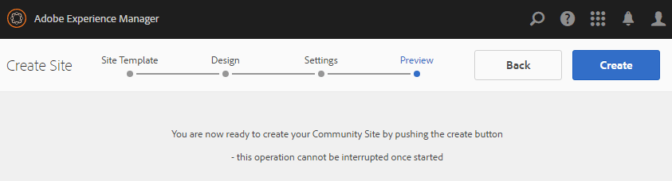

# Communities Sites-Konsole {#communities-sites-console}

Die Communities Sites-Konsole bietet Zugriff auf:

* Site-Erstellung
* Site-Bearbeitung
* Site-Management
* [Erstellen und Bearbeiten verschachtelter Gruppen](/help/communities/groups.md)  (Untergruppen)

Unter [Erste Schritte mit AEM Communities](/help/communities/getting-started.md) erfahren Sie, wie schnell eine Community-Site in der Autorenumgebung erstellt werden kann und wie Sie Community-Gruppen aus der Autoren- und Veröffentlichungsumgebung erstellen.

>[!NOTE]
>
>Die Hauptmenüs der Communities zur Erstellung von [Community-Sites](/help/communities/sites-console.md), [Community-Site-Vorlagen](/help/communities/sites.md), [Community-Gruppenvorlagen](/help/communities/tools-groups.md) und [Community-Funktionen](/help/communities/functions.md) sind nur zur Verwendung in der Autorenumgebung vorgesehen.

## Voraussetzungen {#prerequisites}

Vor der Erstellung einer Community-Site ist *erforderlich*:

* Stellen Sie sicher, dass eine oder mehrere Veröffentlichungsinstanzen ausgeführt werden.
* Aktivieren Sie den [Tunneldienst](/help/communities/deploy-communities.md#tunnel-service-on-author), um Mitglieder und Mitgliedergruppen zu verwalten.
* Identifizieren Sie den [primären Herausgeber](/help/communities/deploy-communities.md#primary-publisher).
* [Konfigurieren Sie die ](/help/communities/deploy-communities.md#replication-agents-on-author) Replikation, wenn der primäre Publisher-Anschluss nicht der Standard ist (4503).

Um sicherzustellen, dass die Site viele Funktionen unterstützt, empfiehlt es sich, die folgenden Schritte auszuführen:

* Installieren Sie das [neueste Feature Pack](/help/communities/deploy-communities.md#latestfeaturepack).
* Aktivieren Sie [Adobe Analytics](/help/communities/analytics.md) für AEM Communities.
* [email](/help/communities/email.md) konfigurieren
* Identifizieren Sie [Community-Administratoren](/help/communities/users.md#creating-community-members).
* [Aktivieren Sie den OAuth-](/help/communities/social-login.md#adobe-granite-oauth-authentication-handler) Handler für die Anmeldung in sozialen Netzwerken.

## Zugriff auf die Communities Sites-Konsole {#accessing-communities-sites-console}

Gehen Sie in der Autorenumgebung in die Konsole Communities Sites :

* Über die globale Navigation: **[!UICONTROL Communities]** > **[!UICONTROL Sites]**

Die Communities Sites-Konsole zeigt alle vorhandenen Community-Sites an. In dieser Konsole können Community-Sites erstellt, bearbeitet, verwaltet und gelöscht werden.

Um eine neue Community-Site zu erstellen, wählen Sie das Symbol **Erstellen** aus.

Um auf eine bestehende Community-Site zuzugreifen, wählen Sie zum Erstellen, Ändern, Veröffentlichen, Exportieren oder Hinzufügen einer verschachtelten Gruppe das Ordnersymbol der Site aus.

Die folgende Abbildung zeigt beispielsweise die Haupt-Konsole Communities-Sites , in der die Ordner für zwei Community-Sites angezeigt werden: [enable](/help/communities/getting-started-enablement.md) und [engage](/help/communities/getting-started.md):

## Site-Erstellung {#site-creation}

Die Site-Erstellungskonsole bietet einen schrittweisen Ansatz, um Funktionen der Site basierend auf einer ausgewählten [Community-Site-Vorlage](/help/communities/sites.md) und Einstellungen zusammenzuführen.

Jede erstellte Site verfügt über eine Anmeldefunktion, da sich Besucher der Site anmelden müssen, bevor sie Inhalte posten, Nachrichten senden oder an einer Gruppe teilnehmen können. Weitere Funktionen sind Benutzerprofile, Messaging, Benachrichtigungen, Site-Menü, Suche, Themen und Branding.

Der Prozess wird gestartet, indem Sie die Schaltfläche `Create` oben in der Communities-Sites-Konsole auswählen.

Der Erstellungsprozess besteht aus einer Reihe von Schritten, die als Bedienfelder mit einer Reihe von zu konfigurierenden Funktionen präsentiert werden (als Unterbedienfelder dargestellt). Sie können zum Schritt **Weiter** oder **Zurück** zum vorherigen Schritt übergehen, bevor Sie die Site im letzten Schritt übergeben.

### Schritt 1: Site-Vorlage {#step-site-template}

Im Bereich &quot;Site-Vorlage&quot;werden der Titel, die Beschreibung, der Site-Stamm, die Basissprache, der Name und die Site-Vorlage angegeben:

* **Community-Site-Titel**

   Ein Anzeigetitel für die Site.

   Der Titel wird auf der veröffentlichten Site sowie in der Administrator-Benutzeroberfläche der Site angezeigt.

* **Community-Site-Beschreibung**

   Eine Beschreibung der Site.

   Die Beschreibung wird nicht auf der veröffentlichten Site angezeigt.

* **Community-Site-Stammordner**

   Der Stammpfad zur Site.

   Der Standardstamm ist `/content/sites`, der Stamm kann jedoch an einen beliebigen Speicherort auf der Website verschoben werden.

* **Grundsprache der Community-Site**

   (Für eine einzelne Sprache unberührt lassen: Englisch) Verwenden Sie das Pulldown-Menü, um eine *oder mehrere* Basissprachen aus den verfügbaren Sprachen auszuwählen: Deutsch, Italienisch, Französisch, Japanisch, Spanisch, Portugiesisch (Brasilien), Chinesisch (Traditionell) und Chinesisch (vereinfacht). Für jede hinzugefügte Sprache wird eine Community-Site erstellt, die im selben Site-Ordner vorhanden ist. Befolgen Sie dabei die Best Practices, die unter [Übersetzen von Inhalten für mehrsprachige Sites](/help/sites-administering/translation.md) beschrieben werden. Die Stammseite jeder Site enthält eine untergeordnete Seite mit dem Namen des Sprachcodes einer der ausgewählten Sprachen, z. B. &quot;en&quot;für Englisch oder &quot;fr&quot;für Französisch.

* **Community-Site-Name**:

   Der Name der Stammseite der Site, der in der URL angezeigt wird.

   * Überprüfen Sie den Namen, da er nach der Erstellung der Site nicht einfach geändert werden kann.
   * Die Basis-URL ( `https://server:port/site root/site name)`) wird unter `Community Site Name` angezeigt.

   * Hängen Sie für eine gültige URL einen Basissprachcode + &quot;.html&quot; an.

      *Beispiel*, `https://localhost:4502/content/sites/mysight/en.html`

* **Community-Site-** Vorlagenmenü

   Verwenden Sie das Pulldown-Menü, um eine verfügbare [Community-Site-Vorlage](/help/communities/tools.md) auszuwählen.

* Wählen Sie **Weiter** aus.

### Schritt 2: Design {#step-design}

Das Bedienfeld &quot;Design&quot;enthält zwei Unterbedienfelder zur Auswahl des Designs und des Branding-Banners:

#### COMMUNITY SITE-THEMA {#community-site-theme}

Das Framework verwendet [Twitter Bootstrap](https://twitterbootstrap.org/), um ein responsives, flexibles Design auf die Site zu bringen. Es kann eines der vielen vorab geladenen Bootstrap-Designs ausgewählt werden, um die ausgewählte Community-Site-Vorlage zu gestalten. Andernfalls kann ein Bootstrap-Design hochgeladen werden.

Wenn diese Option aktiviert ist, wird das Design mit einem undurchsichtigen blauen Häkchen überlagert.

Nachdem die Community-Site veröffentlicht wurde, können Sie [die Eigenschaften](#modifying-site-properties) bearbeiten und ein anderes Design auswählen.

#### COMMUNITY SITE BRANDING {#community-site-branding}

Community-Site-Branding ist ein Bild, das oben auf jeder Seite als Kopfzeile angezeigt wird.

Die Bildgröße sollte der erwarteten Anzeige der Seite im Browser und einer Höhe von 120 Pixel entsprechen.

Beachten Sie beim Erstellen oder Auswählen eines Bildes Folgendes:

* Die Bildhöhe wird vom oberen Rand des Bildes auf 120 Pixel zugeschnitten.
* Das Bild wird am linken Rand des Browser-Fensters fixiert.
* Die Größe des Bildes wird nicht geändert, d. h. wenn die Bildbreite ...

   * Weniger breit als der Browser, wird das Bild horizontal wiederholt.
   * Größer als die Breite des Browsers, wird das Bild scheinbar zugeschnitten.

* Wählen Sie **Weiter** aus.

### Schritt 3: Einstellungen {#step-settings}

Das Einstellungsbedienfeld enthält mehrere Unterbedienfelder mit Funktionen, die vor dem Wechsel zum letzten Schritt zur Erstellung der Site konfiguriert werden müssen.

* [BENUTZERVERWALTUNG](#user-management)
* [TAGGING](#tagging)
* [ROLLEN](#roles)
* [MODERATION](#moderation)
* [ANALYTICS](#analytics)
* [ÜBERSETZUNG](#translation)
* [AKTIVIERUNG](#enablement)

>[!NOTE]
>
>**Aktivieren des Tunneldienstes**
>
>Einige der Unterbereiche Einstellungen ermöglichen es einem vertrauenswürdigen Mitglied, UGC zu moderieren, Gruppen zu verwalten oder Kontakte für Aktivierungsressourcen in der Veröffentlichungsumgebung zu sein.
>
>Die Konvention ist dafür gedacht, Benutzer und Benutzergruppen (Mitglieder und Mitgliedergruppen) auf der Veröffentlichungsseite [nicht in der Autorenumgebung zu duplizieren.](/help/communities/users.md)
>
>Wenn Sie daher die Community-Site in der Autorenumgebung erstellen und vertrauenswürdigen Mitgliedern verschiedene Rollen zuweisen, müssen Sie Mitgliedsdaten aus der Veröffentlichungsumgebung abrufen.
>
>Dies wird erreicht, indem ` [AEM Communities Publish Tunnel Service](/help/communities/deploy-communities.md#tunnel-service-on-author)` für die Autorenumgebung aktiviert wird.

#### BENUTZERVERWALTUNG {#user-management}

>[!NOTE]
>
>Es wird empfohlen, [Aktivierungs-Community-Sites](/help/communities/overview.md#enablement-community) privat zu sein (wenden Sie sich für weitere Informationen an Ihren Kundenbetreuer).
>
>Eine Community-Site ist privat, wenn anonymen Site-Besuchern der Zugriff verweigert wird, sie sich möglicherweise nicht selbst registrieren und keine Anmeldung über soziale Netzwerke verwenden.

* **Benutzerregistrierung zulassen**

   Wenn diese Option aktiviert ist, können Besucher der Site durch Selbstregistrierung Community-Mitglieder werden.
Wenn diese Option deaktiviert ist, ist die Community-Site *restricted* und die Site-Besucher müssen der Mitgliedergruppe der Community-Site zugewiesen sein, eine Anfrage stellen oder per E-Mail eine Einladung erhalten. Wenn diese Option deaktiviert ist, sollte der anonyme Zugriff nicht erlaubt sein.
Deaktivieren Sie die Option für eine *private* Community-Site. Diese Option ist standardmäßig aktiviert.

* **Anonymen Zugriff erlauben**

   Wenn diese Option aktiviert ist, ist die Community-Site *geöffnet *und jeder Besucher der Site kann auf die Site zugreifen.
Wenn diese Option deaktiviert ist, können nur angemeldete Mitglieder auf die Site zugreifen.
Deaktivieren Sie die Option für eine *private *Community-Site. Diese Option ist standardmäßig aktiviert.

* **Messaging zulassen**

   Wenn diese Option aktiviert ist, können Mitglieder Nachrichten miteinander und an die Gruppe innerhalb der Community-Site senden.
Wenn diese Option deaktiviert ist, werden Nachrichten nicht für die Community eingerichtet.
Diese Option ist standardmäßig deaktiviert.

* **Anmeldung über soziale Medien erlauben: Facebook**

   Wenn diese Option aktiviert ist, können sich Besucher der Site mit ihren Facebook-Kontoanmeldeinformationen anmelden. Die ausgewählte [Facebook-Cloud-Konfiguration](/help/communities/social-login.md#create-a-facebook-connect-cloud-service) sollte so konfiguriert werden, dass Benutzer zur Mitgliedergruppe der Community-Site hinzugefügt werden, sobald die Community-Site erstellt wurde.
Wenn diese Option deaktiviert ist, wird keine Facebook-Anmeldung angezeigt.
Lassen Sie die Option für eine *private* Community-Site deaktiviert. Diese Option ist standardmäßig deaktiviert.

* **Anmeldung über soziale Medien erlauben: Twitter**

   Wenn diese Option aktiviert ist, können sich Besucher der Site mit ihren Twitter-Kontoanmeldeinformationen anmelden. Die ausgewählte [Twitter-Cloud-Konfiguration](/help/communities/social-login.md#create-a-twitter-connect-cloud-service) sollte so konfiguriert werden, dass Benutzer zur Mitgliedergruppe der Community-Site hinzugefügt werden, sobald die Community-Site erstellt wurde.
Wenn diese Option deaktiviert ist, wird keine Twitter-Anmeldung angezeigt.
Lassen Sie die Option für eine *private* Community-Site deaktiviert. Diese Option ist standardmäßig deaktiviert.

>[!NOTE]
>
>**Zulassen von Social-Anmeldungen**
>
>Auch wenn Beispielkonfigurationen für Facebook und Twitter vorhanden und auswählbar sein können, ist es für eine [Produktionsumgebung](/help/sites-administering/production-ready.md) erforderlich, benutzerdefinierte Facebook- und Twitter-Anwendungen zu erstellen. Siehe [Anmeldung in sozialen Netzwerken mit Facebook und Twitter](/help/communities/social-login.md).

#### TAGGING {#tagging}

Die Tags, die auf Community-Inhalte angewendet werden können, werden durch die Auswahl von Tag-Namespaces gesteuert, die zuvor über die [Tagging-Konsole](/help/sites-administering/tags.md#tagging-console) definiert wurden.

Darüber hinaus wird durch die Auswahl von Tag-Namespaces für die Community-Site die beim Definieren von Katalogen und Ressourcen angezeigte Auswahl eingeschränkt. Wichtige Informationen finden Sie unter [Tagging von Aktivierungsressourcen](/help/communities/tag-resources.md) .

* Textsuchfeld : Beginnen Sie mit der Eingabe, um die Tags zu identifizieren, die auf der Site verwendet werden dürfen.

#### ROLLEN {#roles}

Die [Rollen von Community-Mitgliedern](/help/communities/users.md) werden mit diesen Einstellungen zugewiesen.

Die Suche nach Community-Mitgliedern ist einfach durch die Suche nach Typ-Ahead.

* **Community-Manager**

   Beginnen Sie mit der Typisierung, um ein oder mehrere Community-Mitglieder oder Mitgliedergruppen auszuwählen, die Community-Mitglieder und Mitgliedergruppen verwalten können.

* **Community-Moderatoren**

   Beginnen Sie mit der Eingabe, um ein oder mehrere Community-Mitglieder oder Mitgliedergruppen auszuwählen, die als Moderatoren von benutzergenerierten Inhalten vertrauenswürdig sind.

* **Privilegierte Community-Mitglieder**

   Beginnen Sie mit der Eingabe, um ein oder mehrere Community-Mitglieder oder Mitgliedergruppen auszuwählen, damit neue Inhalte erstellt werden können, wenn `Allow Privileged Member` für eine [Community-Funktion](/help/communities/functions.md) ausgewählt wurde.

* **Community-Administratoren**

   Beginnen Sie mit der Typisierung, um einen oder mehrere Site-Administratoren auszuwählen, die die Site-Struktur unabhängig von anderen Site-Administratoren und standardmäßigen Community-Administratoren verwalten können. Sie können Gruppen auf jeder Hierarchieebene erstellen und zum Standardadministrator der verschachtelten Gruppen werden (sie können später jedoch aus der Administratorrolle verschachtelter Gruppen entfernt werden).

#### MODERATION {#moderation}

Die globale Einstellung für die Moderation benutzergenerierter Inhalte (UGC) wird durch diese Einstellungen gesteuert. Einzelne Komponenten verfügen über zusätzliche Einstellungen zur Steuerung der Moderation.

* **Inhalt ist vormoderiert**

   Wenn diese Option aktiviert ist, werden veröffentlichte Community-Inhalte erst angezeigt, nachdem sie von einem Moderator genehmigt wurden. Diese Option ist standardmäßig deaktiviert. Weitere Informationen finden Sie unter [Moderieren von Community-Inhalten](/help/communities/moderate-ugc.md#premoderation).

* **Kennzeichnung des Schwellenwerts, bevor der Inhalt ausgeblendet wird**

   Bei mehr als 0 muss die Häufigkeit definiert werden, mit der ein Thema oder Beitrag gekennzeichnet werden muss, bevor er aus der öffentlichen Ansicht ausgeblendet wird. Wenn der Wert auf -1 festgelegt ist, wird das gekennzeichnete Thema oder der Beitrag nie aus der öffentlichen Ansicht ausgeblendet. Der Standardwert ist 5.

#### ANALYTICS {#analytics}

* **Analytics aktivieren**

   Nur verfügbar, wenn Adobe Analytics für Communities-Funktionen [konfiguriert](/help/communities/analytics.md) wurde.
Diese Option ist standardmäßig deaktiviert. Wenn diese Option aktiviert ist, wird ein zusätzliches Auswahlmenü angezeigt:

* **Framework-Verweis der Cloud-Konfiguration**

   Wählen Sie aus dem Pulldown-Menü das für diese Community-Site konfigurierte Analytics Cloud Service-Framework aus.
   `Communities` ist das Framework-Beispiel aus der Dokumentation  [Analytics-Konfiguration für Communities-](/help/communities/analytics.md#aem-analytics-framework-configuration) Funktionen.

#### ÜBERSETZUNG {#translation}

* **Maschinelle Übersetzung zulassen**

   Wenn diese Option aktiviert ist (die Standardeinstellung ist deaktiviert), wird die maschinelle Übersetzung für benutzergenerierte Inhalte auf der Site aktiviert. Dies wirkt sich nicht auf andere Inhalte aus, z. B. Seiteninhalte, selbst wenn die Site als mehrsprachige Site eingerichtet ist. Informationen zum Konfigurieren eines lizenzierten Übersetzungsdienstes für AEM Communities finden Sie unter [Übersetzen benutzergenerierter Inhalte](/help/communities/translate-ugc.md) . Eine vollständige Übersicht finden Sie unter [Übersetzen von Inhalten für mehrsprachige Sites](/help/sites-administering/translation.md) .

* **Maschinelle Übersetzung für ausgewählte Sprachen aktivieren**

   Die für die maschinelle Übersetzung aktivierten Sprachen entsprechen standardmäßig der Systemeinstellung, die von der [Konfiguration der Übersetzungsintegration](/help/communities/translate-ugc.md#translation-integration-configuration) angegeben wird. Diese Standardeinstellungen können für diese Site überschrieben werden, indem Standardwerte gelöscht und/oder andere Sprachen aus dem Pulldown-Menü ausgewählt werden.

* **Übersetzungsanbieter auswählen**

   Standardmäßig ist der Dienstleister ein Testdienst, der `microsoft` nur zur Veranschaulichung verwendet. Wenn kein Übersetzungsdienstleister lizenziert ist, sollte die Option **Maschinelle Übersetzung zulassen** deaktiviert werden.

* **Globalen geteilten Speicher auswählen**

   Für eine Website mit mehreren Sprachkopien bietet ein globaler freigegebener Speicher einen einzigen Konversationsthread, der von jeder Sprachkopie aus sichtbar ist. Dies wird erreicht, indem eine der Sprachen als Sprachkopie ausgewählt wird. Der Standardwert ist *Kein globaler freigegebener Store*.

* **Übersetzungsanbieter-Konfiguration auswählen**

   Wählen Sie ein [Framework für die Übersetzungsintegration](/help/sites-administering/tc-tic.md) aus, das für den lizenzierten Übersetzungsanbieter erstellt wurde.

* **Wählen Sie die Übersetzungsoptionen für Ihre Community-Site**

   * **Gesamte Seite übersetzen**

      Wenn diese Option aktiviert ist, werden alle benutzergenerierten Inhalte einer Seite in die Basissprache der Seite übersetzt.

      Der Standardwert ist *nicht ausgewählt*.

   * **Nur Auswahl übersetzen**

      Wenn diese Option aktiviert ist, wird neben jedem Beitrag eine Übersetzungsoption angezeigt, mit der einzelne Beiträge in die Basissprache der Seite übersetzt werden können.
Der Standardwert ist *selected*.

* **Speicheroptionen auswählen**

   * **Übersetzen von Beiträgen auf Benutzeranfrage und bestehen**
danach fort. Wenn diese Option ausgewählt ist, wird der Inhalt erst übersetzt, wenn eine Anfrage gestellt wurde. Nach der Übersetzung wird die Übersetzung im Repository gespeichert.

      Der Standardwert ist *nicht ausgewählt*.

   * **Übersetzungen nicht behalten**

      Wenn diese Option aktiviert ist, werden Übersetzungen nicht im Repository gespeichert.

      Wenn diese Option nicht ausgewählt ist, werden die Übersetzungen beibehalten.

      Der Standardwert ist *nicht ausgewählt*.

* **Smart Rendering**

   Wählen Sie eine der folgenden Optionen aus:

   * `Always show contributions in the original language` (default)
   * `Always show contributions in user preferred language`
   * `Show contributions in user preferred language for only logged-in users`

#### AKTIVIERUNG {#enablement}

Die `ENABLEMENT`Einstellungen gelten, wenn die ausgewählte Community-Site-Vorlage die [Zuweisungsfunktion](/help/communities/functions.md#assignments-function) enthält, die verfügbar ist, wenn die Aktivierungsfunktionen lizenziert und [konfiguriert](/help/communities/enablement.md) sind. Die Referenz-Website-Vorlage mit der Zuweisungsfunktion ist `Reference Structured Learning Site Template.`

* **Aktivierungsmanager**
 (Erforderlich) Es können nur Mitglieder der  `Community Enablementmanagers` Gruppe ausgewählt werden, um diese Aktivierungs-Community zu verwalten. Aktivierungsmanager sind für die Zuweisung von Mitgliedern zu Ressourcen verantwortlich. Siehe auch [Verwalten von Benutzern und Benutzergruppen](/help/communities/users.md).

* **ID der Marketing Cloud-Organisation**

   (optional) Die ID für eine [Video Heartbeat Analytics](/help/communities/analytics.md#video-heartbeat-analytics)-Lizenz.

* Wählen Sie **Weiter** aus.

### Schritt 4: Erstellen der Communities-Site {#step-create-communities-site}

Wenn Anpassungen erforderlich sind, verwenden Sie die Schaltfläche **Zurück** , um sie vorzunehmen.

Nachdem **Create** ausgewählt und gestartet wurde, kann der Prozess der Erstellung der Site nicht mehr unterbrochen werden.

Nachdem die Site erstellt wurde:

* Das Ändern der URL (Knotenname) wird nicht unterstützt.
* Künftige Änderungen an der Community-Site-Vorlage wirken sich nicht auf die erstellte Community-Site aus.
* Die Deaktivierung der Community-Site-Vorlage hat keine Auswirkungen auf die erstellte Community-Site.
* Sie können die [STRUKTUR](#modify-structure) einer Community-Site bearbeiten, indem Sie deren Eigenschaften ändern.

Nach Abschluss des Vorgangs wird der Ordner für die neue Site in der Communities Sites-Konsole angezeigt. Von dort aus können Autoren Seiteninhalte hinzufügen oder Administratoren können die Eigenschaften der Site ändern.

Um eine Community-Site zu ändern, wählen Sie deren Projektordner aus, um sie zu öffnen:

Wenn Sie den Mauszeiger über eine Site bewegen oder eine Sitekarte berühren, werden Symbole angezeigt, die die Bearbeitung der Site im Autorenmodus [, [Öffnen der Site-Eigenschaften für Änderungen](#modifying-site-properties), [Veröffentlichen der Site](#publishing-the-site), [Exportieren der Site](#exporting-the-site) und [Löschen der Site](#deleting-the-site).](#authoring-site-content)

## Erstellen von Site-Inhalten {#authoring-site-content}

Der Inhalt einer Website kann mit den gleichen Tools wie jede andere AEM erstellt werden. Um die Website zum Authoring zu öffnen, wählen Sie das Symbol `Open Site` aus, das angezeigt wird, wenn Sie den Mauszeiger auf der Site halten. Die Site wird in einer neuen Registerkarte geöffnet, sodass die Konsole &quot;Communities-Sites&quot;weiterhin verfügbar ist.

>[!NOTE]
>
>Wenn Sie nicht mit AEM vertraut sind, lesen Sie die Dokumentation zu [Grundlegender Umgang](/help/sites-authoring/basic-handling.md) und eine [Kurzanleitung zum Erstellen von Seiten](/help/sites-authoring/qg-page-authoring.md).

## Ändern der Site-Eigenschaften {#modifying-site-properties}

Die Eigenschaften einer vorhandenen Site, die während des Site-Erstellungsprozesses angegeben werden, können geändert werden, indem Sie das Symbol `Edit Site`auswählen, das beim Bewegen der Maus über die Site angezeigt wird.

`Details of the following properties match the descriptions provided in the` [Site-](#site-creation) Erstellung.

### Ändern von Basic {#modify-basic}

Das BASIC-Panel ermöglicht die Änderung von:

* Community-Site-Titel
* Community-Site-Beschreibung

Der Community-Site-Name darf nicht geändert werden.

Die Auswahl einer anderen Community-Site-Vorlage hätte keine Auswirkungen auf eine bestehende Community-Site, da keine Verbindung zwischen Vorlagen und Sites besteht.

Stattdessen kann die [STRUKTUR](#modify-structure) der Community-Site geändert werden.

### Struktur ändern {#modify-structure}

Das Bedienfeld STRUKTUR ermöglicht die Änderung der Struktur, die ursprünglich aus der ausgewählten Community-Site-Vorlage erstellt wurde. Im Bedienfeld haben Sie folgende Möglichkeiten:

* Ziehen Sie zusätzliche [Community-Funktionen](/help/communities/functions.md) per Drag-and-Drop in die Site-Struktur.
* Auf einer Instanz einer Community-Funktion in der Site-Struktur:

   * **`gear icon`**

      Bearbeitungseinstellungen, einschließlich Anzeigentitel und URL-Name* sowie [privilegierte Mitgliedergruppen](/help/communities/users.md#privilegedmembersgroups).

   * **`trashcan icon`**

      Entfernen (Löschen) von Funktionen aus der Site-Struktur.

   * **`grid icon`**

      Ändern Sie die Reihenfolge der Funktionen, wie sie in der Navigationsleiste auf oberster Ebene der Site angezeigt werden.

>[!NOTE]
>
>Sie können die Reihenfolge aller Funktionen in der Site-Struktur ändern, mit Ausnahme der Funktion oben. Daher kann die Startseite der Communities-Site nicht geändert werden.

>[!CAUTION]
>
>* Der Anzeigentitel kann ohne Nebenwirkungen geändert werden. Es wird jedoch nicht empfohlen, den URL-Namen einer Community-Funktion zu bearbeiten, die zu einer Community-Site gehört.
>
>
Wenn Sie beispielsweise die URL umbenennen, werden vorhandene UGC nicht verschoben, sodass der UGC-Wert &quot;verloren&quot;wird.

>[!CAUTION]
>
>Die Gruppenfunktion muss *nicht* die *erste und nicht die einzige* Funktion in der Site-Struktur sein.
>
>Jede andere Funktion, z. B. die [Seitenfunktion](/help/communities/functions.md#page-function), muss zuerst eingeschlossen und aufgelistet werden.

#### Beispiel : Hinzufügen einer Katalogfunktion zu einer Community-Site-Struktur {#example-adding-a-catalog-function-to-a-community-site-structure}

### Design ändern {#modify-design}

Im Bedienfeld DESIGN kann ein neues Design angewendet werden:

* [Community-Site-Thema](#community-site-theme)
* [Community-Site-Branding](#community-site-branding)

   * Scrollen Sie zum unteren Rand des Bedienfelds, um das Markenbild zu ändern.

### Einstellungen ändern {#modify-settings}

Das Fenster EINSTELLUNGEN ermöglicht den Zugriff auf die meisten Einstellungen unter den Unterfeldern von für Schritt 3 der Community-Site-Erstellung:

* [Benutzerverwaltung](#user-management)
* [Tags](#tagging)
* [Moderation](#moderation)
* [Mitgliederrollen](#roles)
* [Analytics](#analytics)
* [Übersetzung](#translation)

### Miniaturansicht ändern {#modify-thumbnail}

Im Bedienfeld &quot;MINIATURANSICHT&quot;kann ein Bild hochgeladen werden, das die Site in der Konsole &quot;Communities-Sites&quot;darstellt.

### Aktivierung ändern {#modify-enablement}

Das Bedienfeld AKTIVIERUNG ermöglicht den Zugriff auf die Einstellungen, die während der Erstellung der Community-Site bereitgestellt werden.

Siehe Beschreibung [ENABLEMENT](#enablement) .

## Veröffentlichen der Site {#publishing-the-site}

Nachdem eine Community-Site neu erstellt oder geändert wurde, ist es möglich, die Site zu veröffentlichen (zu aktivieren), indem Sie das Symbol `Publish Site` auswählen, das angezeigt wird, wenn Sie den Mauszeiger über die Site bewegen.

Es gibt einen Hinweis, nachdem die Site erfolgreich veröffentlicht wurde.

### Veröffentlichen mit verschachtelten Gruppen {#publishing-with-nested-groups}

Nach dem Veröffentlichen einer Community-Site muss jede Unter-Community (verschachtelte Gruppe), die mit der [Gruppenkonsole](/help/communities/groups.md) erstellt wurde, einzeln veröffentlicht werden.

## Exportieren der Site {#exporting-the-site}

Wählen Sie das Exportsymbol aus, wenn Sie den Mauszeiger über die Website bewegen, um ein Paket der Community-Site zu erstellen, das sowohl im [Package Manager](/help/sites-administering/package-manager.md) gespeichert als auch heruntergeladen wurde.

Beachten Sie, dass UGC nicht im Site-Paket enthalten ist.

## Löschen der Site {#deleting-the-site}

Um die Community-Site zu löschen, wählen Sie das Symbol Site löschen aus, das angezeigt wird, wenn Sie den Mauszeiger über die Site in der Communities-Site-Konsole bewegen. Mit dieser Aktion werden alle mit der Site verknüpften Elemente entfernt, z. B. benutzergenerierte Inhalte, Benutzergruppen, Assets und Datenbankdatensätze.

## Erstellte Community-Benutzergruppen {#created-community-user-groups}

Sobald die neue Community-Site veröffentlicht wurde, werden neue Mitgliedergruppen (Benutzergruppen werden in der Veröffentlichungsumgebung erstellt) erstellt, für die die entsprechenden Berechtigungen für verschiedene Admin- und Mitgliederrollen festgelegt sind.

Der für die Mitgliedergruppen erstellte Name umfasst den *Site-Namen*, der der Site in [Schritt 1](#step13asitetemplate) zugewiesen wurde (der Name, der in der URL angezeigt wird), sowie eine eindeutige ID, um Konflikte mit Community-Sites und Gruppen mit demselben Site-Namen für verschiedene Community-Site-Stämme zu vermeiden.

Wenn der Name beispielsweise &quot;engage&quot;für eine Site mit dem Titel &quot;Erste Schritte-Tutorial&quot;wäre, wäre die Benutzergruppe für Moderatoren:

* title: Community-Moderatoren einbinden
* name: community-*engage-uid*-moderators

Beachten Sie, dass alle Mitglieder, denen beim Erstellen der Site Rollen als Moderatoren oder Gruppenadministratoren zugewiesen wurden, der entsprechenden Gruppe zugewiesen und der Mitgliedergruppe zugewiesen werden. Diese Gruppen und Mitgliederzuweisungen werden beim Veröffentlichen der neuen Site erstellt.

Weitere Informationen finden Sie unter [Verwalten von Benutzern und Benutzergruppen](/help/communities/users.md).

>[!NOTE]
>
>Wenn [Social-Anmeldung zulassen: Facebook](#user-management) ist aktiviert, sobald die Benutzergruppe
>
>* `community-<site-name>-<uid>-members`
>
>
erstellt wurde, sollte der angewendete [Facebook-Cloud-Service](/help/communities/social-login.md#createafacebookcloudservice) so konfiguriert sein, dass dieser Gruppe Benutzer hinzugefügt werden.

## Konfigurieren für Authentifizierungsfehler {#configure-for-authentication-error}

Standardmäßig wird eine Community-Site zu einer Beispielanmeldeseite umgeleitet, wenn der Benutzer die falschen Anmeldedaten eingibt und sich nicht anmeldet. Diese Beispielanmeldung ist auf einem [Produktionsserver](/help/sites-administering/production-ready.md) nicht vorhanden.

Führen Sie zur korrekten Umleitung die folgenden Schritte aus, um sicherzustellen, dass die Authentifizierung bei der Umleitung zur Community-Site fehlschlägt, sobald eine Site konfiguriert und zur Veröffentlichung gepusht wurde:

* Auf jeder AEM Veröffentlichungsinstanz.
* Melden Sie sich mit Administratorrechten an.
* Rufen Sie die [Web-Konsole](/help/sites-deploying/configuring-osgi.md) auf.

   * Beispiel: [https://localhost:4503/system/console/configMgr](https://localhost:4503/system/console/configMgr).

* Suchen Sie `Adobe Granite Login Selector Authentication Handler`.
* Wählen Sie das Symbol `pencil` aus, um die Konfiguration zur Bearbeitung zu öffnen.
* Geben Sie eine **Anmeldeseitenzuordnungen** wie folgt ein:

   `/content/sites/<site-name>/path/to/login/page:/content/sites/<site-name>`

   Beispiel:
   `/content/sites/engage/en/signin:/content/sites/engage/en`

* Wählen Sie **Speichern** aus.

### Testauthentifizierungsumleitung {#test-authentication-redirection}

Auf derselben AEM Veröffentlichungsinstanz, die mit einem Anmeldeseitenzuordnung für die Community-Site konfiguriert wurde:

* Navigieren Sie zur Startseite der Community-Site.

   * Beispiel: [https://localhost:4503/content/sites/engage/en.html](https://localhost:4503/content/sites/engage/en.html)

* Wählen Sie Abmelden aus.
* Wählen Sie Anmelden aus.
* Geben Sie offensichtlich falsche Anmeldedaten ein, z. B. Benutzername &quot;x&quot;und Kennwort &quot;x&quot;.
* Die Anmeldeseite sollte mit dem Fehler &quot;Ungültige Anmeldung&quot;angezeigt werden.

## Zugriff auf Community-Sites über die Haupt-Sites-Konsole {#accessing-community-sites-from-main-sites-console}

In der Konsole für globale Navigations-Sites befinden sich Community-Sites im Ordner `Community Sites` .

Obwohl es möglich ist, auf eine Community-Site auf diese Weise zuzugreifen, sollte die Community-Site für administrative Aufgaben über die Communities-Sites-Konsole aufgerufen werden.

