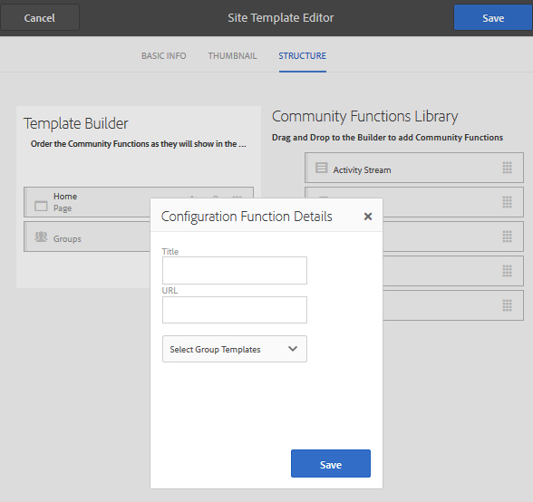

# Site-Vorlagen {#site-templates}

Die Konsole &quot;Site-Vorlagen&quot;ähnelt der Konsole [Gruppenvorlagen](tools-groups.md), die sich auf Funktionen konzentriert, die für Community-Gruppen von Interesse sind.

>[!NOTE]
>
>Die Konsolen zum Erstellen von [Community-Sites](sites-console.md), [Community-Site-Vorlagen](sites.md), [Community-Gruppenvorlagen](tools-groups.md) und [Community-Funktionen](functions.md) sind nur zur Verwendung in der Autorenumgebung vorgesehen.

## Site-Vorlagenkonsole {#site-templates-console}

Gehen Sie in der Autorenumgebung wie folgt vor, um die Konsole der Community-Sites zu erreichen:

* Über die globale Navigation: **[!UICONTROL Tools > Communities > Site-Vorlagen]**

Diese Konsole zeigt die Vorlagen an, aus denen eine [Community-Site](sites-console.md) erstellt werden kann, und ermöglicht die Erstellung neuer Site-Vorlagen.

## Site-Vorlage erstellen {#create-site-template}

Wählen Sie `Create` aus, um mit der Erstellung einer neuen Site-Vorlage zu beginnen.

Dadurch wird der Site-Editor-Bereich angezeigt, der drei Unterbereiche enthält:

### Grundlegende Informationen {#basic-info}

Im Bedienfeld &quot;Grundlegende Informationen&quot;werden ein Name, eine Beschreibung und die Frage, ob die Vorlage aktiviert oder deaktiviert ist, konfiguriert:

* **[!UICONTROL Name der Community-Site-Vorlage]**

   Die Vorlagenname-ID.

* **[!UICONTROL Beschreibung der Community-Site-Vorlage]**

   Die Vorlagenbeschreibung.

* **[!UICONTROL Deaktiviert/Aktiviert]**

   Ein Umschalter steuert, ob die Vorlage referenzierbar ist.

### Miniaturansicht  {#thumbnail}

(Optional) Wählen Sie das Symbol Bild hochladen aus, um eine Miniaturansicht mit dem Namen und der Beschreibung für Ersteller von Community-Sites anzuzeigen.

### Struktur {#structure}

Um Community-Funktionen hinzuzufügen, ziehen Sie von der rechten Seite nach links in die Reihenfolge, in der die Links zum Site-Menü angezeigt werden sollen. Stile werden während der Erstellung der Site auf die Vorlage angewendet.

Wenn Sie beispielsweise eine Homepage wünschen, ziehen Sie die Funktion Seite aus der Bibliothek und legen Sie sie unter dem Vorlagenaufbau ab. Dadurch wird das Dialogfeld für die Seitenkonfiguration geöffnet. Informationen zu den Konfigurationsdialogen finden Sie in der [Funktionskonsole](functions.md) .

Ziehen Sie weiterhin alle anderen Community-Funktionen, die für eine auf dieser Vorlage basierende Community-Site gewünscht werden, per Drag-and-Drop.

Die Seitenfunktion stellt eine leere Seite bereit. Die Funktion &quot;Gruppen&quot;bietet die Möglichkeit, innerhalb der Community-Site eine Gruppensite (Unter-Community) zu erstellen.

>[!CAUTION]
>
>Die Gruppenfunktion muss *nicht* die *erste und nicht die einzige* Funktion in der Site-Struktur sein.
>
>Jede andere Funktion, z. B. die [Seitenfunktion](functions.md#page-function), muss zuerst eingeschlossen und aufgelistet werden.

### Gruppenvorlagen für Gruppenfunktionen {#group-templates-for-groups-function}

Wenn Sie eine Gruppenfunktion in die Site-Vorlage aufnehmen, erfordert die Konfiguration die Angabe der Gruppenvorlagenoptionen, die zulässig sind, wenn eine neue Gruppe in der Veröffentlichungsumgebung erstellt wird.

>[!CAUTION]
>
>Die Funktion &quot;Gruppen&quot;darf *nicht* die Funktion *first und nicht die einzige Funktion* in der Site-Struktur sein.

Wenn Sie zwei oder mehr Community-Gruppenvorlagen auswählen, können Sie beim Erstellen einer neuen Gruppe in der Community dem Gruppenadministrator eine Auswahl treffen.

##  Site-Vorlage bearbeiten{#edit-site-template}

Beim Anzeigen von Site-Vorlagen in der Haupt-Konsole [Site-Vorlagen](#site-templates-console) ist es möglich, eine vorhandene Site-Vorlage zur Bearbeitung auszuwählen.

Dieser Prozess stellt dieselben Bedienfelder bereit wie [Erstellen einer Site-Vorlage](#create-site-template).
