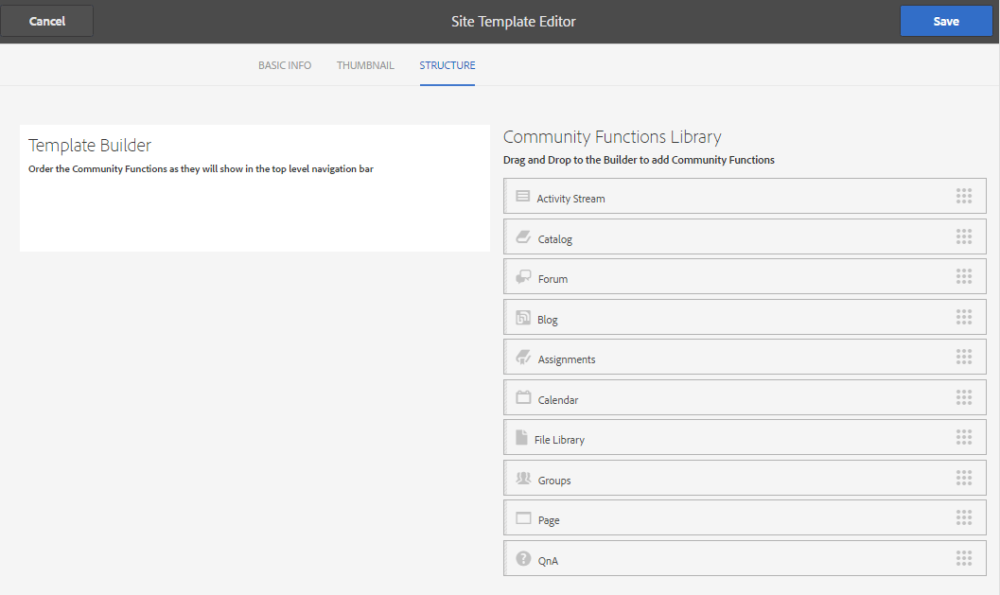

# Site-Vorlagen {#site-templates}

Die Konsole &quot;Site-Vorlagen&quot;ist der Konsole [Gruppenvorlagen](tools-groups.md) sehr ähnlich, die sich auf Funktionen konzentriert, die für Community-Gruppen von Interesse sind.

>[!NOTE]
>
>Die Konsolen für die Erstellung von [Community-Sites](sites-console.md), [Community-Sitevorlagen](sites.md), [Community-Gruppenvorlagen](tools-groups.md) und [Community-Funktionen](functions.md) sind nur für die Verwendung in der Autor-Umgebung vorgesehen.

## Site-Vorlagenkonsole {#site-templates-console}

In der Umgebung &quot;Autor&quot;zur Konsole der Community-Sites gelangen Sie wie folgt:

* Aus globaler Navigation: **[!UICONTROL Tools > Communities > Site-Vorlagen]**

Diese Konsole zeigt die Vorlagen an, aus denen eine [Community-Site](sites-console.md) erstellt werden kann, und ermöglicht die Erstellung neuer Site-Vorlagen.

## Site-Vorlage erstellen {#create-site-template}

Um eine neue Site-Vorlage zu erstellen, wählen Sie `Create`.

Dadurch wird der Site-Editor-Bereich angezeigt, der drei Unterbereiche enthält:

### Grundlegende Informationen {#basic-info}

Im Bedienfeld &quot;Grundlegende Informationen&quot;werden ein Name, eine Beschreibung und die Konfiguration der Vorlage, ob sie aktiviert oder deaktiviert ist, wie folgt konfiguriert:

* **[!UICONTROL Name der Community-Site-Vorlage]**

   Die Vorlagenname-ID.

* **[!UICONTROL Beschreibung der Community-Site-Vorlage]**

   Die Vorlagenbeschreibung.

* **[!UICONTROL Deaktiviert/aktiviert]**

   Ein Umschalter steuert, ob die Vorlage referenzierbar ist.

### Miniaturansicht  {#thumbnail}

(Optional) Wählen Sie das Symbol Bild hochladen, um eine Miniaturansicht mit dem Namen und der Beschreibung für Ersteller von Community-Sites anzuzeigen.

### Struktur {#structure}

Um Community-Funktionen hinzuzufügen, ziehen Sie von der rechten Seite nach links in der Reihenfolge, in der die Sitemenü-Links angezeigt werden sollen. Stile werden während der Erstellung der Site auf die Vorlage angewendet.

Wenn Sie beispielsweise eine Startseite erstellen möchten, ziehen Sie die Funktion &quot;Seite&quot;aus der Bibliothek und legen Sie sie unter dem Vorlagenaufbau ab. Dadurch wird das Dialogfeld für die Seitenkonfiguration geöffnet. Informationen zu den Konfigurationsdialogen finden Sie in der Konsole [Funktionen](functions.md).

Ziehen Sie weitere Community-Funktionen, die basierend auf dieser Vorlage für eine Community-Site gewünscht werden, und legen Sie sie ab.

Die Seitenfunktion stellt eine leere Seite bereit. Die Funktion &quot;Gruppen&quot;bietet die Möglichkeit, innerhalb der Community-Site eine Gruppensite (Unter-Community) zu erstellen.

>[!CAUTION]
>
>Die Funktion &quot;Gruppen&quot;darf weder die Funktion *first noch die Funktion* in der Sitestruktur sein.**
>
>Jede andere Funktion, wie z. B. die Funktion [page](functions.md#page-function), muss eingeschlossen und zuerst aufgelistet werden.

### Gruppenvorlagen für die Gruppenfunktion {#group-templates-for-groups-function}

Wenn Sie eine Gruppenfunktion in die Site-Vorlage aufnehmen, müssen Sie die Gruppenvorlagenauswahl festlegen, die beim Erstellen einer neuen Umgebung in der Veröffentlichungsgruppe zulässig ist.

>[!CAUTION]
>
>Die Funktion Gruppen darf nicht die Funktion *first noch nicht* in der Sitestruktur sein.**

Wenn Sie zwei oder mehr Community-Gruppenvorlagen auswählen, wird dem Gruppenadministrator beim Erstellen einer neuen Gruppe in der Community eine Auswahl angezeigt.

##  Site-Vorlage bearbeiten{#edit-site-template}

Bei der Anzeige von Site-Vorlagen in der Haupt-Konsole [Site-Vorlagen](#site-templates-console) ist es möglich, eine vorhandene Site-Vorlage zur Bearbeitung auszuwählen.

Dieser Prozess stellt dieselben Bereiche bereit wie [Erstellen einer Site-Vorlage](#create-site-template).
