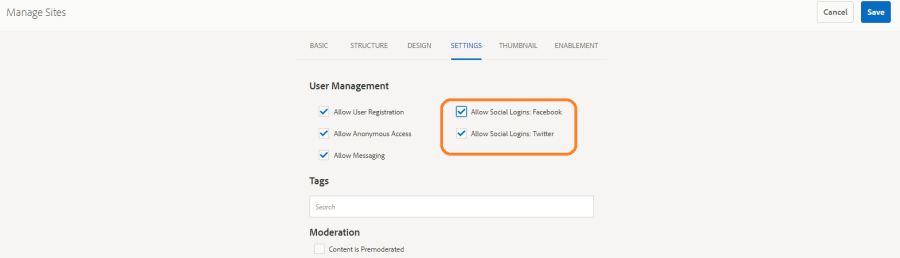

# Anmeldung über Social Media mit Facebook und Twitter {#social-login-with-facebook-and-twitter}

Die Anmeldung in Social bietet die Möglichkeit, einem Site-Besucher die Möglichkeit zu geben, sich mit seinem Facebook- oder Twitter-Konto anzumelden. Daher, einschließlich zulässiger Facebook- oder Twitter-Daten in ihr AEM Mitgliederprofil.

## Social-Anmeldeübersicht {#social-login-overview}

Um die Anmeldung über soziale Netzwerke einzubeziehen, ist es *erforderlich* , um benutzerdefinierte Facebook- und Twitter-Anwendungen zu erstellen.

Während das Beispiel für &quot;we-retail&quot;Beispiel Beispiel-Facebook- und Twitter-Apps und Cloud-Services bereitstellt, sind diese nicht auf einer [Produktions-Website](../../help/sites-administering/production-ready.md).

Die erforderlichen Schritte sind:

1. [Aktivieren der OAuth-Authentifizierung](#adobe-granite-oauth-authentication-handler) auf allen AEM Veröffentlichungsinstanzen.

   Wenn OAuth nicht aktiviert ist, schlagen die Anmeldeversuche fehl.

1. **Erstellen** eine soziale App und einen Cloud-Service.

   * So unterstützen Sie die Anmeldung mit Facebook:

      * Erstellen Sie eine [Facebook-App](#create-a-facebook-app).
      * Erstellen und veröffentlichen Sie eine [Facebook Connect-Cloud-Dienst](#create-a-facebook-connect-cloud-service).

   * So unterstützen Sie die Anmeldung mit Twitter:

      * Erstellen Sie eine [Twitter-App](#create-a-twitter-app).
      * Erstellen und veröffentlichen Sie eine [Twitter Connect-Cloud-Service](#create-a-twitter-connect-cloud-service).

1. [**Aktivieren** Social-Anmeldung](#enable-social-login) für eine Community-Site.

Es gibt zwei grundlegende Konzepte:

1. **Anwendungsbereich** (Berechtigungen) Gibt die Daten an, die die App anfordern darf.

   * Facebook und Twitter [Adobe Granite OAuth Application and Provider](#adobe-granite-oauth-application-and-provider) -Instanzen schließen standardmäßig die grundlegenden App-Berechtigungen in ihren Bereich ein.

1. **Felder** (params) gibt die tatsächlichen Daten an, die mit URL-Parametern angefordert werden.

   * Diese Felder werden in [AEM Communities Facebook OAuth Provider](#aem-communities-facebook-oauth-provider) und [AEM Communities Twitter OAuth Provider](#aem-communities-twitter-oauth-provider).
   * Die Standardfelder reichen für die meisten Anwendungsfälle aus, können jedoch geändert werden.

## Facebook-Anmeldung {#facebook-login}

### Facebook API-Version {#facebook-api-version}

Die Anmeldung über Social Media und das Facebook-Beispiel für We-Retail wurden entwickelt, als die Facebook Graph-API Version 1.0 war. Ab AEM 6.4 wurde die GA- und AEM 6.3 SP1-Social-Anmeldung aktualisiert, um mit der neueren Facebook Graph API 2.5-Version zu funktionieren.

>[!NOTE]
>
>Bei älteren AEM-Versionen, wenn in Protokollen eine Ausnahme vorliegt **Token kann nicht aus diesem extrahiert werden**, aktualisieren Sie für diese AEM auf die neueste CFP-Version.

Informationen zur Facebook Graph-API-Version finden Sie in der [Facebook API-Änderungsprotokoll](https://developers.facebook.com/docs/apps/changelog).

### Erstellen einer Facebook App {#create-a-facebook-app}

Eine ordnungsgemäß konfigurierte Facebook-Anwendung ist erforderlich, um die Anmeldung in Facebook Social zu aktivieren.

Um eine Facebook-Anwendung zu erstellen, befolgen Sie die Facebook-Anweisungen unter [https://developers.facebook.com/apps/](https://developers.facebook.com/apps/). Änderungen an ihren Anweisungen werden in den folgenden Informationen nicht berücksichtigt.

Im Allgemeinen ab Facebook API v2.7:

* *Neue Facebook-App hinzufügen*
   * Für *Plattform*, wählen Sie Website aus:
      * Für *Site-URL*, eingeben `  https://<server>:<port>.`
      * Für *Anzeigename* Geben Sie einen Titel ein, der als Titel des Facebook Connect-Dienstes verwendet werden soll.
      * Für *Kategorie* empfohlene Auswahl *Apps für Seiten*, kann jedoch alles sein.
      * *Produkt hinzufügen: Facebook-Anmeldung*
      * Für *Gültige OAuth-Umleitungs-URIs*, eingeben `  https://<server>:<port>.`

>[!NOTE]
>
>Für die Entwicklung funktioniert http://localhost:4503.

Suchen Sie nach der Erstellung der Anwendung die **[!UICONTROL App-ID]** und **[!UICONTROL App-Geheimnis]** -Einstellungen. Diese Informationen sind für die Konfiguration der [Facebook Cloud-Dienst](#createafacebookcloudservice).

### Erstellen eines Facebook Connect-Cloud Service {#create-a-facebook-connect-cloud-service}

Die [Adobe Granite OAuth Application and Provider](#adobe-granite-oauth-application-and-provider) -Instanz, instanziiert durch Erstellen einer Cloud Service-Konfiguration, identifiziert die Facebook-Anwendung und die Mitgliedergruppe(n), zu denen die neuen Benutzer hinzugefügt werden.

1. Melden Sie sich auf der AEM Autoreninstanz mit Administratorrechten an.
1. Wählen Sie in der globalen Navigation die Option **[!UICONTROL Instrumente]** > **[!UICONTROL Cloud Service]** > **[!UICONTROL Facebook Social-Anmeldekonfiguration]**.
1. Wählen Sie die Konfiguration **[!UICONTROL Kontextpfad]**.

   **[!UICONTROL Kontextpfad]** sollte dem Cloud-Konfigurationspfad entsprechen, den Sie beim Erstellen/Bearbeiten einer Community-Site ausgewählt haben.

1. Überprüfen Sie, ob Ihr Kontextpfad aktiviert ist, um Cloud-Services darunter zu erstellen.
1. Navigieren Sie zu **[!UICONTROL Instrumente]** > **[!UICONTROL Allgemein]** > **[!UICONTROL Konfigurationsbrowser]**. Wählen Sie Ihren Kontext aus und bearbeiten Sie Eigenschaften. Aktivieren Sie Cloud-Konfigurationen , falls noch nicht aktiviert.

   

   * Weitere Informationen finden Sie in der Dokumentation zum [Konfigurations-Browser](/help/sites-administering/configurations.md).

1. **Erstellen/Bearbeiten** Facebook-Cloud-Service-Konfiguration.

   

   * **[!UICONTROL Titel]** (*Erforderlich*) Geben Sie einen Anzeigetitel ein, der die Facebook App identifiziert. Verwenden Sie den gleichen Namen, der als *Anzeigename* für die Facebook-App.
   * **[!UICONTROL App-ID/API-Schlüssel]** (*Erforderlich*) Geben Sie die ***App-ID*** für die Facebook App. Dadurch wird die [Adobe Granite OAuth Application and Provider](https://helpx.adobe.com/experience-manager/6-3/communities/using/social-login.html#AdobeGraniteOAuthApplicationandProvider) -Instanz, die über das Dialogfeld erstellt wurde.
   * **[!UICONTROL App-Geheimnis]** (*Erforderlich*) Geben Sie die ***App-Geheimnis*** für die Facebook App.
   * **[!UICONTROL Benutzer erstellen]** Wenn diese Option aktiviert ist, wird bei der Anmeldung mit einem Facebook-Konto ein AEM Benutzereintrag erstellt und als Mitglied zu den ausgewählten Benutzergruppen hinzugefügt.  Die Standardeinstellung ist aktiviert (dringend empfohlen).
   * **[!UICONTROL Benutzer-IDs maskieren]**: Lassen Sie die Auswahl aufgehoben.
   * **[!UICONTROL E-Mail-Umfang]**: Die E-Mail-ID des Benutzers sollte aus Facebook abgerufen werden.
   * **[!UICONTROL Zu Benutzergruppen hinzufügen]** Wählen Sie Benutzergruppe hinzufügen aus, um eine oder mehrere [Mitgliedergruppen](https://helpx.adobe.com/experience-manager/6-3/communities/using/users.html) für die Community-Site, zu der Benutzer hinzugefügt werden.

   >[!NOTE]
   >
   >Gruppen können jederzeit hinzugefügt oder entfernt werden. Die Mitgliedschaften bestehender Benutzer sind jedoch nicht betroffen. Die automatische Mitgliedschaft gilt nur für neue Benutzer, die nach der Aktualisierung dieses Felds erstellt werden. Wählen Sie für Sites, bei denen anonyme Benutzer deaktiviert sind, Benutzer zu der entsprechenden Community-Mitgliedergruppe für diese geschlossene Community-Site hinzufügen.

   * Auswählen **[!UICONTROL SPEICHERN]**.
   * **[!UICONTROL Veröffentlichen]**.

Das Ergebnis ist ein [Adobe Granite OAuth Application and Provider](https://helpx.adobe.com/experience-manager/6-3/communities/using/social-login.html#adobe-granite-oauth-application-and-provider) -Instanz, die keine weitere Änderung erfordert, es sei denn, es werden zusätzliche Bereiche (Berechtigungen) hinzugefügt. Der Standardbereich sind die Standardberechtigungen für die Facebook-Anmeldung. Wenn zusätzlicher Umfang gewünscht wird, muss die OSGi-Konfiguration direkt bearbeitet werden. Wenn Änderungen direkt über System/Konsole vorgenommen werden, sollten Sie die Cloud Service-Konfigurationen nicht über die Touch-optimierte Benutzeroberfläche bearbeiten, um eine Überschrift zu vermeiden.

### AEM Communities Facebook OAuth Provider {#aem-communities-facebook-oauth-provider}

Der AEM Communities-Provider erweitert die [Adobe Granite OAuth Application and Provider](#adobe-granite-oauth-application-and-provider) -Instanz.

Dieser Provider muss bearbeitet werden, um:

* Benutzeraktualisierungen zulassen
* Zusätzliche Felder hinzufügen [innerhalb des Anwendungsbereichs](#adobe-granite-oauth-application-and-provider)

   * Standardmäßig sind nicht alle Felder eingeschlossen, die zulässig sind.

Wenn die Bearbeitung in jeder AEM Veröffentlichungsinstanz erforderlich ist:

1. Melden Sie sich mit Administratorrechten an.
1. Navigieren Sie zum [Web-Konsole](../../help/sites-deploying/configuring-osgi.md). Beispiel: http://localhost:4503/system/console/configMgr.
1. Suchen Sie nach AEM Communities Facebook OAuth Provider.
1. Wählen Sie das Stiftsymbol aus, um es zur Bearbeitung zu öffnen.

   

   * **[!UICONTROL OAuth-Provider-ID]**

     (*Erforderlich*) Der Standardwert lautet *soco - facebook*. Bearbeiten Sie nicht.

   * **[!UICONTROL Cloud Service-Konfiguration]**

     Der Standardwert ist `/etc/  cloudservices /  facebookconnect`. Bearbeiten Sie nicht.

   * **[!UICONTROL OAuth-Provider-Dienstkonfiguration]**

     Der Standardwert ist `/apps/social/facebookprovider/config/`. Bearbeiten Sie nicht.

   * **[!UICONTROL Aktivieren von Tags]**

     Nicht bearbeiten.

   * **[!UICONTROL Benutzerpfad]**

     Speicherort im Repository, an dem Benutzerdaten gespeichert werden. Für eine Community-Site sollte der Pfad der Standardpfad sein, um sicherzustellen, dass Mitglieder das Profil einer anderen Person anzeigen können */home/users/community*.

   * **[!UICONTROL Felder aktivieren]**

     Wenn diese Option aktiviert ist, werden die aufgeführten Felder in der Anforderung an Facebook zur Benutzerauthentifizierung und -informationen angegeben. Die Standardeinstellung ist deaktiviert.

   * **[!UICONTROL Felder]**

     Wenn Felder aktiviert sind, werden beim Aufrufen der Facebook Graph-API die folgenden Felder eingeschlossen. Die Felder müssen innerhalb des in der Cloud Service-Konfiguration definierten Bereichs zulässig sein. Zusätzliche Felder erfordern möglicherweise eine Genehmigung durch Facebook. Weitere Informationen finden Sie im Abschnitt Facebook-Anmeldeberechtigungen in der Facebook-Dokumentation. Als Parameter hinzugefügte Standardfelder sind:

      * id
      * name
      * first_name
      * last_name
      * Verknüpfung
      * locale
      * picture
      * timezone
      * updated_time
      * verifiziert
      * email

   Wenn ein Feld hinzugefügt oder geändert wird, aktualisieren Sie die entsprechende Standardsynchronisierungshandler-Konfiguration, um die Zuordnung zu korrigieren.

   * **[!UICONTROL Benutzer aktualisieren]**

     Wenn diese Option aktiviert ist, werden die Benutzerdaten im Repository bei jeder Anmeldung aktualisiert, um Profiländerungen oder zusätzliche angeforderte Daten widerzuspiegeln. Die Option Standard ist deaktiviert.

#### Nächste Schritte {#next-steps}

Die nächsten Schritte sind für Facebook und Twitter gleich:

* [Veröffentlichen der Cloud Service-Konfigurationen](#publishcloudservices)
* [Aktivieren für eine Community-Site](#enable-social-login)

## Twitter Login {#twitter-login}

### Twitter App erstellen {#create-a-twitter-app}

Eine konfigurierte Twitter-Anwendung ist erforderlich, um die Anmeldung über Twitter Social zu aktivieren.

Befolgen Sie die neuesten Anweisungen zum Erstellen einer Twitter-Anwendung unter [https://apps.twitter.com](https://apps.twitter.com/).

Allgemein:

1. Geben Sie einen *Name* , die Ihre Twitter-Anwendung für die Nutzer Ihrer Website identifizieren.
1. Geben Sie einen *Beschreibung*.
1. Für *website* - Eingabe `https://<server>`.
1. Für *Callback-URL* - Eingabe `https://server`.

   >[!NOTE]
   >
   >Es ist nicht erforderlich, den Port anzugeben.
   >
   >Für die Entwicklung funktioniert https://127.0.0.1/.

1. Suchen Sie nach der Erstellung der Anwendung die **[!UICONTROL Consumer (API) Key]** und **[!UICONTROL Consumer (API) Secret]**. Diese Informationen werden für die Konfiguration der [Twitter Cloud-Dienst](#createatwittercloudservice).

#### Berechtigungen {#permissions}

Im Abschnitt Berechtigungen der Twitter-Anwendungsverwaltung:

* **[!UICONTROL Zugriff]**: Auswählen `Read only`.

   * Andere Optionen werden nicht unterstützt

* **[!UICONTROL Zusätzliche Berechtigungen]**: Wählen Sie optional `Request email addresses from users`.

   * Wenn diese Option nicht ausgewählt ist, enthält das Benutzerprofil in AEM keine E-Mail-Adresse.
   * In den Anweisungen unter Twitter werden zusätzliche Schritte beschrieben.

Die einzige REST-Anfrage für die Anmeldung über soziale Netzwerke ist *[Anmeldedaten für GET-Konto/Überprüfung](https://dev.twitter.com/rest/reference/get/account/verify_credentials)*.

### Erstellen eines Twitter Connect-Cloud Service {#create-a-twitter-connect-cloud-service}

Die [Adobe Granite OAuth Application and Provider](#adobe-granite-oauth-application-and-provider) -Instanz, instanziiert durch Erstellen einer Cloud Service-Konfiguration, identifiziert die Twitter-Anwendung und die Mitgliedergruppe(n), zu denen die neuen Benutzer hinzugefügt werden.

1. Melden Sie sich auf der Autoreninstanz mit Administratorrechten an.
1. Wählen Sie in der globalen Navigation die Option **[!UICONTROL Instrumente]** > **[!UICONTROL Cloud Service]** > **[!UICONTROL Twitter Social-Anmeldekonfiguration]**.
1. Wählen Sie die **[!UICONTROL Kontextpfad]** Konfiguration.

   Der Kontextpfad sollte mit dem Cloud-Konfigurationspfad übereinstimmen, den Sie beim Erstellen/Bearbeiten einer Community-Site ausgewählt haben.

1. Überprüfen Sie, ob Ihr Kontextpfad aktiviert ist, um Cloud-Services darunter zu erstellen.
1. Navigieren Sie zu **[!UICONTROL Instrumente]** > **[!UICONTROL Allgemein]** > **[!UICONTROL Konfigurationsbrowser]**. Wählen Sie Ihren Kontext aus und bearbeiten Sie Eigenschaften. Aktivieren Sie Cloud-Konfigurationen , falls noch nicht aktiviert.

   

   * Weitere Informationen finden Sie in der Dokumentation zum [Konfigurations-Browser](/help/sites-administering/configurations.md).

1. Erstellen/Bearbeiten Sie die Cloud-Service-Konfiguration für Twitter.

   

   * **[!UICONTROL Titel]**

     (*Erforderlich*) Geben Sie einen Anzeigetitel ein, der die Twitter App identifiziert. Verwenden Sie den gleichen Namen, der als *Anzeigename* für die Twitter-App.

   * **[!UICONTROL Consumer Key]**

     (*Erforderlich*) Geben Sie die **Consumer (API) Key** für die Twitter-App. Dadurch wird die [Adobe Granite OAuth Application and Provider](https://helpx.adobe.com/experience-manager/6-3/communities/using/social-login.html#AdobeGraniteOAuthApplicationandProvider) -Instanz, die über das Dialogfeld erstellt wurde.

   * **[!UICONTROL Verbrauchergeheimnis]**

     (*Erforderlich*) Geben Sie die ***Consumer(API) Secret*** für die Twitter App.

   * **[!UICONTROL Benutzer erstellen]**

     Wenn diese Option aktiviert ist, wird durch die Anmeldung mit einem Twitter-Konto ein AEM Benutzereintrag erstellt und als Mitglied zu den ausgewählten Benutzergruppen hinzugefügt. Die Standardeinstellung ist aktiviert (dringend empfohlen).

   * **[!UICONTROL Benutzer-IDs maskieren]**

     Lassen Sie die Auswahl aufgehoben.

   * **[!UICONTROL Zu Benutzergruppen hinzufügen]**

     Wählen Sie Benutzergruppe hinzufügen aus, um eine oder mehrere [Mitgliedergruppen](https://helpx.adobe.com/experience-manager/6-3/communities/using/users.html) für die Community-Site, zu der Benutzer hinzugefügt werden.

   >[!NOTE]
   >
   >Gruppen können jederzeit hinzugefügt oder entfernt werden. Die Mitgliedschaften bestehender Benutzer sind jedoch nicht betroffen. Die automatische Mitgliedschaft gilt nur für neue Benutzer, die nach der Aktualisierung dieses Felds erstellt werden. Fügen Sie für Sites, bei denen anonyme Benutzer deaktiviert sind, Benutzer der entsprechenden Community-Mitglieder-Gruppe hinzu, die für diese geschlossene Community-Site vorgesehen ist.
   >

1. Auswählen **[!UICONTROL SPEICHERN]** und **[!UICONTROL Veröffentlichen]**.

Das Ergebnis ist ein [Adobe Granite OAuth Application and Provider](https://helpx.adobe.com/experience-manager/6-3/communities/using/social-login.html#adobe-granite-oauth-application-and-provider) -Instanz, die keine weitere Änderung erfordert. Der Standardbereich sind die Standardberechtigungen für die Twitter-Anmeldung.

### AEM Communities Twitter OAuth Provider {#aem-communities-twitter-oauth-provider}

Die AEM Communities-Konfiguration erweitert die [Adobe Granite OAuth Application and Provider](#adobe-granite-oauth-application-and-provider) -Instanz. Dieser Provider muss bearbeitet werden, um Benutzeraktualisierungen zu ermöglichen.

Wenn die Bearbeitung in jeder AEM Veröffentlichungsinstanz erforderlich ist:

1. Melden Sie sich mit Administratorrechten an.
1. Navigieren Sie zum [Web-Konsole](../../help/sites-deploying/configuring-osgi.md).

   Beispiel: http://localhost:4503/system/console/configMgr.

1. Suchen Sie nach AEM Communities Twitter OAuth Provider.
1. Wählen Sie das Stiftsymbol aus, um es zur Bearbeitung zu öffnen.

   

   * **[!UICONTROL OAuth-Provider-ID]**

   (*Erforderlich*) Der Standardwert lautet *soco - twitter*. Bearbeiten Sie nicht.

   * **[!UICONTROL Cloud Service-Konfiguration]**

     Der Standardwert ist *conf.* Bearbeiten Sie nicht.

   * **[!UICONTROL OAuth-Provider-Dienstkonfiguration]**

     Der Standardwert ist `/apps/social/twitterprovider/config/`. Bearbeiten Sie nicht.

   * **[!UICONTROL Benutzerpfad]**

     Speicherort im Repository, an dem Benutzerdaten gespeichert werden. Für eine Community-Site sollte der Pfad der Standardpfad sein, um sicherzustellen, dass Mitglieder das Profil einer anderen Person anzeigen können `/home/users/community`.

   * **[!UICONTROL Parameter aktivieren]** - nicht bearbeiten
   * **[!UICONTROL URL-Parameter]** - nicht bearbeiten
   * **[!UICONTROL Benutzer aktualisieren]**

     Wenn diese Option aktiviert ist, werden die Benutzerdaten im Repository bei jeder Anmeldung aktualisiert, um Profiländerungen oder zusätzliche angeforderte Daten widerzuspiegeln. Die Standardeinstellung ist deaktiviert.

#### Nächste Schritte {#next-steps-1}

Die nächsten Schritte sind für Facebook und Twitter gleich:

* [Veröffentlichen der Cloud Service-Konfigurationen](#publishcloudservices)
* [Aktivieren für eine Community-Site](#enable-social-login)

## Social-Anmeldung aktivieren {#enable-social-login}

### AEM Communities Sites-Konsole {#aem-communities-sites-console}

Sobald ein Cloud-Service konfiguriert ist, kann er für die entsprechende Social-Anmeldeeinstellung für eine Community-Site aktiviert werden, die die [Benutzerverwaltung](https://helpx.adobe.com/experience-manager/6-3/communities/using/sites-console.html#USERMANAGEMENT) Einstellungsunterbereich während der Community-Site [Erstellung](https://helpx.adobe.com/experience-manager/6-3/communities/using/sites-console.html#SiteCreation) oder [management](https://helpx.adobe.com/experience-manager/6-3/communities/using/sites-console.html#ModifyingSiteProperties).

1. Wählen Sie den Site-Konfigurationskontext aus, in dem Sie Ihre Social-Anmeldekonfigurationen gespeichert haben.

1. Legen Sie auf der Registerkarte Allgemein Cloud-Konfigurationen fest.

   

1. Aktivieren Sie auf der Registerkarte Einstellungen die Option **[!UICONTROL Social-Anmeldungen]** und Speichern.

   

## Social-Anmeldung testen {#test-social-login}

* Sichern [Adobe Granite OAuth Authentication Handler](#adobe-granite-oauth-authentication-handler) wurde in allen Veröffentlichungsinstanzen aktiviert.
* Stellen Sie sicher, dass die Cloud-Services veröffentlicht wurden.
* Stellen Sie sicher, dass die Community-Site veröffentlicht wurde.
* Starten Sie die veröffentlichte Site in einem Browser.
Beispiel: http://localhost:4503/content/sites/engage/en.html
* Auswählen **[!UICONTROL Anmelden]**.
* Wählen Sie entweder **[!UICONTROL Mit Facebook anmelden]** oder **[!UICONTROL Anmelden mit Twitter]**.
* Wenn Sie noch nicht bei Facebook oder Twitter angemeldet sind, melden Sie sich mit den entsprechenden Anmeldeinformationen an.
* Abhängig vom Dialogfeld, das von der Facebook- oder Twitter-App angezeigt wird, kann es erforderlich sein, Berechtigungen zu erteilen.
* Beachten Sie, dass die Symbolleiste oben auf der Seite aktualisiert wird, um die erfolgreiche Anmeldung widerzuspiegeln.
* Auswählen **[!UICONTROL Profil]**: Auf der Seite &quot;Profil&quot;werden das Avatarbild, der Vorname und der Nachname des Benutzers angezeigt. Außerdem werden die Informationen aus dem Facebook- oder Twitter-Profil entsprechend den zulässigen Feldern/Parametern angezeigt.

## OAuth-Konfigurationen AEM Platform {#aem-platform-oauth-configurations}

### Adobe Granite OAuth Authentication Handler {#adobe-granite-oauth-authentication-handler}

Die `Adobe Granite OAuth Authentication Handler` ist standardmäßig nicht aktiviert und ***muss für alle AEM Veröffentlichungsinstanzen aktiviert sein.***

Um den Authentifizierungs-Handler bei der Veröffentlichung zu aktivieren, öffnen Sie einfach die OSGi-Konfiguration und speichern Sie sie:

* Melden Sie sich mit Administratorrechten an.
* Navigieren Sie zum [Web-Konsole](../../help/sites-deploying/configuring-osgi.md).
Beispiel: http://localhost:4503/system/console/configMgr
* Suchen `Adobe Granite OAuth Authentication Handler`.
* Wählen Sie diese Option aus, um die Konfiguration zur Bearbeitung zu öffnen.
* Wählen Sie **[!UICONTROL Speichern]** aus.

>[!CAUTION]
>
>Verwechseln Sie den Authentifizierungs-Handler nicht mit einer Facebook- oder Twitter-Instanz von *Adobe Granite OAuth Application and Provider*.

### Adobe Granite OAuth Application and Provider {#adobe-granite-oauth-application-and-provider}

Wenn ein Cloud-Service für Facebook oder Twitter erstellt wird, wird eine Instanz von `Adobe Granite OAuth Authentication Handler` erstellt wird.

So suchen Sie die erstellte Instanz für eine Facebook- oder Twitter-App:

1. Melden Sie sich mit Administratorrechten an.
1. Navigieren Sie zum [Web-Konsole](../../help/sites-deploying/configuring-osgi.md).

   Beispiel: http://localhost:4503/system/console/configMgr.

1. Suchen Sie Adobe Granite OAuth Application und Provider.

   * Suchen Sie die Instanz, in der **[!UICONTROL Client-ID]** entspricht der **[!UICONTROL App-ID]**.

     

     Mit Ausnahme der folgenden Eigenschaften bleiben die anderen Eigenschaften der Konfiguration unverändert:

   * **[!UICONTROL Konfigurations-ID]**

     (*Erforderlich*) OAuth-Konfigurations-IDs müssen eindeutig sein. Wird automatisch generiert, wenn der Cloud-Service erstellt wird.

   * **[!UICONTROL Client-ID]**

     (*Erforderlich*) Die bei der Erstellung des Cloud-Service angegebene Anwendungs-ID.

   * **[!UICONTROL Client-Geheimnis]**

     (*Erforderlich*) Das Anwendungsgeheimnis, das beim Erstellen des Cloud-Service angegeben wurde.

   * **[!UICONTROL Umfang]**

     (*Optional*) Ein zusätzlicher Umfang für das, was erlaubt ist, kann vom Provider angefordert werden. Der Standardbereich umfasst die Berechtigungen, die für die Bereitstellung von Social-Authentifizierung und Profildaten erforderlich sind.

   * **[!UICONTROL Anbieter-ID]**

     (*Erforderlich*) Die Anbieter-ID für AEM Communities wird bei der Erstellung des Cloud-Service festgelegt. Bearbeiten Sie nicht. Für Facebook Connect lautet der Wert *soco - facebook*. Für Twitter Connect lautet der Wert *soco - twitter*.

   * **[!UICONTROL Gruppen]**

     (*Empfohlen*) Eine oder mehrere Mitgliedergruppen, denen erstellte Benutzer hinzugefügt werden. Für AEM Communities wird empfohlen, die Mitgliedergruppe für die Community-Site aufzulisten.

   * **[!UICONTROL Callback-URL]**

     (*Optional*) URL, die mit den OAuth-Anbietern konfiguriert wurde, um den Client zurück zu leiten. Verwenden Sie eine relative URL, um den Host der ursprünglichen Anforderung zu verwenden. Lassen Sie das Feld leer, um stattdessen die ursprünglich angeforderte URL zu verwenden. Das Suffix &quot;/callback/j_security_check&quot;wird automatisch an diese URL angehängt.

   >[!NOTE]
   >
   >Die Domäne für den Rückruf muss beim Provider (Facebook oder Twitter) registriert sein.

Für jede OAuth-Authentifizierungs-Handler-Konfiguration werden in der Instanz zwei zusätzliche Konfigurationen erstellt:

* Apache Jackrabbit Oak Default Sync Handler (org.apache.jackrabbit.oak.spi.security.authentication.external.impl.DefaultSyncHandler) - Dort sind keine Änderungen erforderlich. Sie können sich jedoch die Benutzerfeldzuordnungen ansehen, wie Facebook-Felder einem CQ-Benutzerprofilknoten zugeordnet werden. Beachten Sie außerdem, dass &quot;Sync Handler Name&quot;mit der Konfigurations-ID der OAuth-Provider-Konfiguration übereinstimmt.
* Apache Jackrabbit Oak External Login Module (org.apache.jackrabbit.oak.spi.security.authentication.external.impl.ExternalLoginModuleFactory) - Dort sind keine Änderungen erforderlich, Sie werden jedoch feststellen, dass &quot;Identity Provider Name&quot;und &quot;Sync Handler Name&quot;identisch sind und auf die entsprechenden OAuth- bzw. Synchronisierungs-Handler-Konfigurationen verweisen.

Weitere Informationen finden Sie unter [Authentifizierung mit dem externen Apache Oak-Anmeldemodul](https://jackrabbit.apache.org/oak/docs/security/authentication/externalloginmodule.html).

## OAuth-Benutzerübergreifende Leistung {#oauth-user-traversal-performance}

Bei Community-Sites, bei denen sich Hunderttausende von Benutzern mit ihrer Facebook- oder Twitter-Anmeldung registrieren, kann die durchgängige Leistung der Abfrage, die ausgeführt wird, wenn ein Site-Besucher seine Social-Anmeldung verwendet, durch Hinzufügen des folgenden Oak-Index verbessert werden.

Wenn in den Protokollen übergreifende Warnungen angezeigt werden, wird empfohlen, diesen Index hinzuzufügen.

Auf einer Autoreninstanz, die mit Administratorrechten angemeldet ist:

1. Wählen Sie in der globalen Navigation **Instrumente, [CRX/DE Lite](../../help/sites-developing/developing-with-crxde-lite.md).**
1. Erstellen Sie einen Index mit dem Namen ntBaseLucene-oauth aus einer Kopie von ntBaseLucene:

   * Unterknoten `/oak:index`
   * Knoten auswählen `ntBaseLucene`
   * Auswählen **[!UICONTROL Kopieren]**
   * Klicken Sie auf `/oak:index`
   * Auswählen **[!UICONTROL Einfügen]**
   * Umbenennen der Kopie von ntBaseLucene in `ntBaseLucene-oauth`

1. Ändern Sie die Eigenschaften des Knotens ntBaseLucene-oauth:

   * **[!UICONTROL indexPath]**: `/oak:index/ntBaseLucene-oauth`
   * **[!UICONTROL name]**: `oauthid-123****`
   * **[!UICONTROL reindex]**: `true`
   * **[!UICONTROL reindexCount]**: `1`

1. Unter dem Knoten /oak:index/ntBaseLucene-oauth/indexRules/nt:base/properties:

   * Löschen Sie alle untergeordneten Knoten mit Ausnahme von cqTags.
   * Umbenennen von cqTags in `oauthid-123****`
   * Eigenschaften des Knotens ändern `oauthid-123****`

      * **[!UICONTROL name]**: `oauthid-123****`

   * Klicken Sie auf **[!UICONTROL Alle speichern]**.

* Für **name** `oauthid-123`, ersetzen *123* mit der Facebook ***App-ID*** oder Twitter ***Consumer (API) Key*** , der den Wert der **Client-ID** im [Adobe Granite OAuth Application and Provider](social-login.md#adobe-granite-oauth-application-and-provider) Konfiguration.

  

Weitere Informationen und Tools finden Sie unter [Oak-Abfragen und Indizierung](../../help/sites-deploying/queries-and-indexing.md).

## Dispatcher-Konfiguration {#dispatcher-configuration}

Siehe [Konfigurieren des Dispatchers für Communities](dispatcher.md).
