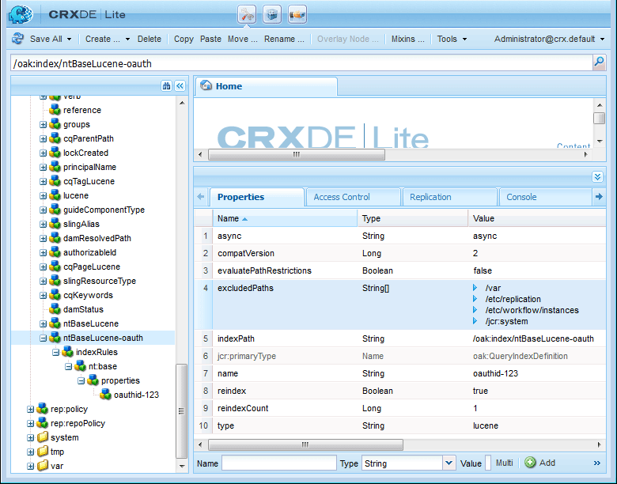

# Social-Media-Anmeldung mit Facebook und Twitter {#social-login-with-facebook-and-twitter}

Die Social-Media-Anmeldung ist die Funktion, einem Site-Besucher die Möglichkeit zu bieten, sich mit seinem Facebook- oder Twitter-Konto anzumelden. Schließen Sie daher zulässige Facebook- oder Twitter-Daten in ihr AEM-Mitgliederprofil ein.

## Social-Media-Anmeldeübersicht {#social-login-overview}

Um Social-Media-Anmeldungen einzuschließen *müssen* benutzerdefinierte Facebook- und Twitter-Programme erstellen.

Während das Beispiel „we-retail“ Beispiele für Facebook- und Twitter-Apps sowie Cloud-Services bietet, sind diese nicht auf einer [Produktions-Website](../../help/sites-administering/production-ready.md) verfügbar.

Die erforderlichen Schritte sind:

1. [OAuth-Authentifizierung aktivieren](#adobe-granite-oauth-authentication-handler) auf allen AEM-Veröffentlichungsinstanzen.

   Ohne aktivierte OAuth schlagen Anmeldeversuche fehl.

1. **Erstellen** einer Social-App und eines Cloud-Services.

   * So unterstützen Sie die Anmeldung mit Facebook:

      * Erstellen Sie eine [Facebook-App](#create-a-facebook-app).
      * Erstellen und veröffentlichen Sie einen [Facebook Connect Cloud Service](#create-a-facebook-connect-cloud-service).

   * So unterstützen Sie die Anmeldung mit Twitter:

      * Erstellen Sie eine [Twitter-App](#create-a-twitter-app).
      * Erstellen und veröffentlichen Sie einen [Twitter Connect Cloud Service](#create-a-twitter-connect-cloud-service).

1. [**Aktivieren** Social-](#enable-social-login) für eine Community-Site.

Es gibt zwei grundlegende Konzepte:

1. **Umfang** (Berechtigungen) gibt die Daten an, die die App anfordern darf.

   * Die Facebook- und Twitter [Adobe Granite OAuth Application and Provider](#adobe-granite-oauth-application-and-provider)-Instanzen enthalten standardmäßig die grundlegenden App-Berechtigungen in ihrem Gültigkeitsbereich.

1. **Felder** (Parameter) gibt die tatsächlichen Daten an, die mithilfe von URL-Parametern angefordert werden.

   * Diese Felder sind in [AEM Communities Facebook OAuth Provider](#aem-communities-facebook-oauth-provider) und [AEM Communities Twitter OAuth Provider](#aem-communities-twitter-oauth-provider) angegeben.
   * Die Standardfelder sind für die meisten Anwendungsfälle ausreichend, können jedoch geändert werden.

## Facebook-Anmeldung {#facebook-login}

### Facebook API-Version {#facebook-api-version}

Die Social-Media-Anmeldung und das Beispiel für den We-Retail-Facebook wurden entwickelt, als die Facebook Graph-API Version 1.0 war.
Ab AEM 6.4 GA und AEM 6.3 SP1 wurde die Social-Media-Anmeldung für die Verwendung mit der neueren Version Facebook Graph API 2.5 aktualisiert.

>[!NOTE]
>
>Wenn bei älteren AEM-Versionen eine Ausnahme in den Protokollen auftritt (**kann kein Token daraus extrahieren**, aktualisieren Sie auf die neueste CFP für diese AEM-Version.

Versionsinformationen zur Facebook Graph-API finden Sie im [Facebook API-Änderungsprotokoll](https://developers.facebook.com/docs/apps/changelog).

### Erstellen einer Facebook-App {#create-a-facebook-app}

Um die Anmeldung bei Facebook Social zu ermöglichen, ist eine ordnungsgemäß konfigurierte Facebook-Anwendung erforderlich.

Um ein Facebook-Programm zu erstellen, befolgen Sie die Anweisungen von Facebook unter [https://developers.facebook.com/apps/](https://developers.facebook.com/apps/). Änderungen an ihren Anweisungen werden in den folgenden Informationen nicht angezeigt.

Ab Facebook API v2.7 gilt im Allgemeinen Folgendes:

* *Neue Facebook-App hinzufügen*
   * Wählen Sie *Platform* die Option Website:
      * Geben Sie *Site-*) `  https://<server>:<port>.`
      * Geben *unter &quot;*&quot; einen Titel ein, der als Titel des Facebook Connect-Services verwendet werden soll.
      * Für *Kategorie* wird die Auswahl von *Apps für Seiten* empfohlen, kann aber alles sein.
      * *Produkt hinzufügen: Facebook-Anmeldung*
      * Geben *für gültige OAuth* Umleitungs-URIs `  https://<server>:<port>.`

>[!NOTE]
>
>Für die Entwicklung wird http://localhost:4503 funktionieren.

Suchen Sie nach der Erstellung der Anwendung die Einstellungen **[!UICONTROL App-ID]** und **[!UICONTROL App Secret]**. Diese Informationen sind für die Konfiguration des [Facebook Cloud Service](#createafacebookcloudservice) erforderlich.

### Erstellen eines Facebook Connect-Cloud Service {#create-a-facebook-connect-cloud-service}

Die durch Erstellen einer Cloud-Service-Konfiguration instanziierte Adobe-Instanz von [Granite OAuth Application and Provider](#adobe-granite-oauth-application-and-provider) identifiziert das Facebook-Programm und die Mitgliedergruppe(n), zu der/denen die neuen Benutzer hinzugefügt werden.

1. Melden Sie sich auf der AEM-Autoreninstanz mit Administratorrechten an.
1. Wählen Sie in der globalen Navigation **[!UICONTROL Tools]** > **[!UICONTROL Cloud Service]** > **[!UICONTROL Konfiguration für die Anmeldung über Facebook]**.
1. Wählen Sie die Konfiguration **[!UICONTROL Kontextpfad]**.

   **[!UICONTROL Kontextpfad]** sollte dem Cloud-Konfigurationspfad entsprechen, den Sie beim Erstellen/Bearbeiten einer Community-Site ausgewählt haben.

1. Überprüfen Sie, ob Ihr Kontextpfad aktiviert ist, um darunter Cloud Services zu erstellen.
1. Navigieren Sie **[!UICONTROL Tools]** > **[!UICONTROL Allgemein]** > **[!UICONTROL Konfigurations-Browser]**. Wählen Sie Ihren Kontext aus und bearbeiten Sie Eigenschaften. Aktivieren Sie Cloud-Konfigurationen, falls noch nicht aktiviert.

   

   * Weitere Informationen finden Sie in der Dokumentation zum [Konfigurations-Browser](/help/sites-administering/configurations.md).

1. **Erstellen/Bearbeiten** Facebook Cloud Service-Konfiguration.

   

   * **[!UICONTROL Titel]** (*Erforderlich*) Geben Sie einen Anzeigetitel ein, der die Facebook-App identifiziert. Verwenden Sie den gleichen Namen wie den *Anzeigenamen* für die Facebook-App.
   * **[!UICONTROL App-ID/API-]** (*erforderlich*) Geben Sie die ***App-ID*** für die Facebook-App ein. Dadurch wird die im Dialogfeld erstellte Adobe-Instanz von [Granite OAuth Application and Provider](https://helpx.adobe.com/de/experience-manager/6-3/communities/using/social-login.html#AdobeGraniteOAuthApplicationandProvider) identifiziert.
   * **[!UICONTROL App-Geheimnis]** (*Erforderlich*) Geben Sie das ***App-Geheimnis*** für die Facebook-App ein.
   * **[!UICONTROL Benutzer erstellen]** Wenn diese Option aktiviert ist, wird bei der Anmeldung mit einem Facebook-Konto ein AEM-Benutzereintrag erstellt und als Mitglied der/den ausgewählten Benutzergruppe(n) hinzugefügt.  Standard ist aktiviert (wird dringend empfohlen).
   * **[!UICONTROL Benutzer-IDs maskieren]**: Deaktivieren Sie diese Option.
   * **[!UICONTROL E-Mail-Umfang]**: Die E-Mail-ID des Benutzers sollte aus Facebook abgerufen werden.
   * **[!UICONTROL Zu Benutzergruppen hinzufügen]** Wählen Sie Benutzergruppe hinzufügen aus, um eine oder mehrere [Mitgliedsgruppen](https://helpx.adobe.com/de/experience-manager/6-3/communities/using/users.html) für die Community-Site auszuwählen, der Benutzer hinzugefügt werden sollen.

   >[!NOTE]
   >
   >Gruppen können jederzeit hinzugefügt oder entfernt werden. Die Zugehörigkeit bestehender Benutzer ist davon jedoch nicht betroffen. Die automatische Mitgliedschaft gilt nur für neue Benutzer, die nach dieser Feldaktualisierung erstellt werden. Bei Sites mit deaktivierten anonymen Benutzern sollten Sie Benutzer zu der entsprechenden Community-Mitgliedergruppe hinzufügen, die für diese geschlossene Community-Site vorgesehen ist.

   * Wählen Sie **[!UICONTROL SPEICHERN]**.
   * **[!UICONTROL Publish]**.

Das Ergebnis ist eine [Adobe Granite OAuth Application and Provider](https://helpx.adobe.com/de/experience-manager/6-3/communities/using/social-login.html#adobe-granite-oauth-application-and-provider)-Instanz, die nur durch Hinzufügen eines zusätzlichen Bereichs (Berechtigungen) weiter geändert werden muss. Der Standardbereich sind die Standardberechtigungen für die Anmeldung bei Facebook. Wenn ein zusätzlicher Umfang gewünscht wird, muss die OSGi-Konfiguration direkt bearbeitet werden. Wenn Änderungen direkt über das System/die Konsole vorgenommen werden, sollten Sie Ihre Cloud Service-Konfigurationen nicht über die Touch-optimierte Benutzeroberfläche bearbeiten, um sie nicht zu überschreiben.

### AEM Communities Facebook OAuth-Anbieter {#aem-communities-facebook-oauth-provider}

Der AEM Communities-Anbieter erweitert die OAuth-Anwendungs- und Provider2-Instanz von [Adobe ](#adobe-granite-oauth-application-and-provider) Granite.

Dieser Anbieter muss für Folgendes bearbeitet werden:

* Benutzeraktualisierungen zulassen
* Zusätzliche Felder hinzufügen [im Umfang](#adobe-granite-oauth-application-and-provider)

   * Nicht alle standardmäßig zulässigen Felder sind standardmäßig enthalten.

Wenn eine Bearbeitung erforderlich ist, führen Sie auf jeder AEM-Veröffentlichungsinstanz Folgendes aus:

1. Melden Sie sich mit Administratorrechten an.
1. Navigieren Sie zur [Web-Konsole](../../help/sites-deploying/configuring-osgi.md). Beispiel: http://localhost:4503/system/console/configMgr.
1. Suchen Sie AEM Communities Facebook OAuth Provider.
1. Wählen Sie das Stiftsymbol aus, um es zur Bearbeitung zu öffnen.

   

   * **[!UICONTROL OAuth-Anbieter-ID]**

     (*Erforderlich*) Der Standardwert ist *soco -facebook*. Nicht bearbeiten.

   * **[!UICONTROL Cloud Service-Konfiguration]**

     Der Standardwert ist `/etc/  cloudservices /  facebookconnect`. Nicht bearbeiten.

   * **[!UICONTROL OAuth Provider-Dienst-Konfiguration]**

     Der Standardwert ist `/apps/social/facebookprovider/config/`. Nicht bearbeiten.

   * **[!UICONTROL Tags aktivieren]**

     Nicht bearbeiten.

   * **[!UICONTROL Benutzerpfad]**

     Speicherort im Repository, in dem Benutzerdaten gespeichert werden. Um für eine Community-Site sicherzustellen, dass die Mitglieder Berechtigungen zum Anzeigen des Profils der anderen Mitglieder haben, sollte der Pfad standardmäßig */home/users/community sein*.

   * **[!UICONTROL Felder aktivieren]**

     Wenn diese Option aktiviert ist, werden die aufgelisteten Felder in der Anfrage an Facebook zur Benutzerauthentifizierung und Informationen angegeben. Die Auswahl für Standard ist aufgehoben.

   * **[!UICONTROL Felder]**

     Wenn Felder aktiviert sind, werden beim Aufruf der Facebook Graph-API die folgenden Felder einbezogen. Die Felder müssen innerhalb des in der Cloud Service-Konfiguration definierten Bereichs zulässig sein. Für zusätzliche Felder ist möglicherweise eine Genehmigung durch Facebook erforderlich. Weitere Informationen finden Sie im Abschnitt Anmeldeberechtigungen für Facebook in der Dokumentation zu Facebook. Die Standardfelder werden als Parameter hinzugefügt:

      * id
      * name
      * first_name
      * last_name
      * Verknüpfung
      * locale
      * Bild
      * Zeitzone
      * updated_time
      * Verifiziert
      * email

   Wenn ein Feld hinzugefügt oder geändert wird, aktualisieren Sie die entsprechende Konfiguration des Standard-Synchronisierungs-Handlers, um die Zuordnung zu korrigieren.

   * **[!UICONTROL Benutzer aktualisieren]**

     Wenn diese Option aktiviert ist, werden die Benutzerdaten im Repository bei jeder Anmeldung aktualisiert, damit Profiländerungen oder zusätzliche angeforderte Daten angezeigt werden. Die Auswahl von Standard ist deaktiviert.

#### Nächste Schritte {#next-steps}

Die nächsten Schritte sind für Facebook und Twitter gleich:

* [Konfigurationen von Publish as a Cloud Service](#publishcloudservices)
* [Aktivieren für eine Community-Site](#enable-social-login)

## Twitter-Anmeldung {#twitter-login}

### Erstellen einer Twitter-App {#create-a-twitter-app}

Um die Anmeldung bei Twitter Social zu aktivieren, ist eine konfigurierte Twitter-Anwendung erforderlich.

Befolgen Sie die neuesten Anweisungen zum Erstellen einer Twitter-Anwendung unter [https://apps.twitter.com](https://apps.twitter.com/).

Allgemein:

1. Geben Sie *Name* ein, um die Twitter-Anwendung für die Benutzer Ihrer Website zu identifizieren.
1. Geben Sie eine *Beschreibung* ein.
1. Für *Website* - geben Sie `https://<server>` ein.
1. Geben *für „Callback* URL“ `https://server` ein.

   >[!NOTE]
   >
   >Es ist nicht erforderlich, den Port anzugeben.
   >
   >Für die Entwicklung wird https://127.0.0.1/ funktionieren.

1. Suchen Sie nach der Erstellung der Anwendung den **[!UICONTROL Consumer (API) Key]** und **[!UICONTROL Consumer (API) Secret]**. Diese Informationen werden zum Konfigurieren des [Twitter-Cloud-Service](#createatwittercloudservice) benötigt.

#### Berechtigungen {#permissions}

Gehen Sie im Abschnitt Berechtigungen der Twitter-Anwendungsverwaltung folgendermaßen vor:

* **[!UICONTROL Zugriff]**: `Read only` auswählen.

   * Andere Optionen werden nicht unterstützt

* **[!UICONTROL Zusätzliche Berechtigungen]**: Wählen Sie optional &quot;`Request email addresses from users`&quot;.

   * Wenn diese Option nicht ausgewählt ist, enthält das Benutzerprofil in AEM keine E-Mail-Adresse.
   * Hinweise zur twitter-Umgebung Hinweise zu weiteren Schritten.

Die einzige REST-Anfrage für die Anmeldung bei Social Media ist an *[GET-Konto/Anmeldeinformationen überprüfen](https://dev.twitter.com/rest/reference/get/account/verify_credentials)*.

### Erstellen eines Twitter Connect-Cloud Service {#create-a-twitter-connect-cloud-service}

Die [Adobe Granite OAuth Application and Provider](#adobe-granite-oauth-application-and-provider)-Instanz, die durch Erstellen einer Cloud-Service-Konfiguration instanziiert wird, identifiziert das Twitter-Programm und die Mitgliedergruppe(n), zu der/denen die neuen Benutzer hinzugefügt werden.

1. Melden Sie sich auf der Autoreninstanz mit Administratorrechten an.
1. Wählen Sie in der globalen Navigation **[!UICONTROL Tools]** > **[!UICONTROL Cloud Service]** > **[!UICONTROL Twitter Konfiguration für die Anmeldung über Social Media]**.
1. Wählen Sie die Konfiguration **[!UICONTROL Kontextpfad]** .

   Der Kontextpfad sollte dem Cloud-Konfigurationspfad entsprechen, den Sie beim Erstellen/Bearbeiten einer Community-Site ausgewählt haben.

1. Überprüfen Sie, ob Ihr Kontextpfad aktiviert ist, um darunter Cloud Services zu erstellen.
1. Navigieren Sie **[!UICONTROL Tools]** > **[!UICONTROL Allgemein]** > **[!UICONTROL Konfigurations-Browser]**. Wählen Sie Ihren Kontext aus und bearbeiten Sie Eigenschaften. Aktivieren Sie Cloud-Konfigurationen, falls noch nicht aktiviert.

   

   * Weitere Informationen finden Sie in der Dokumentation zum [Konfigurations-Browser](/help/sites-administering/configurations.md).

1. Erstellen/Bearbeiten der Twitter-Cloud-Service-Konfiguration.

   

   * **[!UICONTROL Titel]**

     (*Erforderlich*) Geben Sie einen Anzeigetitel ein, der die Twitter-App identifiziert. Verwenden Sie den gleichen Namen wie den *Anzeigenamen* für die Twitter-App.

   * **[!UICONTROL Consumer Key]**

     (*Erforderlich*) Geben Sie den **Consumer (API) Key** für die Twitter-App ein. Dadurch wird die im Dialogfeld erstellte Adobe-Instanz von [Granite OAuth Application and Provider](https://helpx.adobe.com/de/experience-manager/6-3/communities/using/social-login.html#AdobeGraniteOAuthApplicationandProvider) identifiziert.

   * **[!UICONTROL Consumer Secret]**

     (*Erforderlich*) Geben Sie das ***Consumer(API) Secret*** für die Twitter-App ein.

   * **[!UICONTROL Benutzer erstellen]**

     Wenn diese Option aktiviert ist, wird bei der Anmeldung mit einem Twitter-Konto ein AEM-Benutzereintrag erstellt und als Mitglied der/den ausgewählten Benutzergruppe(n) hinzugefügt. Standard ist aktiviert (wird dringend empfohlen).

   * **[!UICONTROL Benutzer-IDs maskieren]**

     Auswahl aufheben.

   * **[!UICONTROL Zu Benutzergruppen hinzufügen]**

     Wählen Sie Benutzergruppe hinzufügen aus, um eine oder [ (](https://helpx.adobe.com/de/experience-manager/6-3/communities/using/users.html)) für die Community-Site auszuwählen, der Benutzer hinzugefügt werden sollen.

   >[!NOTE]
   >
   >Gruppen können jederzeit hinzugefügt oder entfernt werden. Die Mitgliedschaft bestehender Benutzer ist davon jedoch nicht betroffen. Die automatische Mitgliedschaft gilt nur für neue Benutzer, die nach dieser Feldaktualisierung erstellt werden. Wenn anonyme Benutzer deaktiviert sind, fügen Sie Benutzer zu der entsprechenden Community-Mitgliedergruppe hinzu, die für diese geschlossene Community-Site vorgesehen ist.
   >

1. Wählen Sie **[!UICONTROL SPEICHERN]** und **[!UICONTROL Publish]**.

Das Ergebnis ist eine [Adobe Granite OAuth Application and Provider](https://helpx.adobe.com/de/experience-manager/6-3/communities/using/social-login.html#adobe-granite-oauth-application-and-provider)-Instanz, die nicht weiter geändert werden muss. Der Standardbereich sind die Standardberechtigungen für die Twitter-Anmeldung.

### AEM Communities Twitter OAuth-Anbieter {#aem-communities-twitter-oauth-provider}

Die AEM Communities-Konfiguration erweitert die OAuth-Anwendungs- und Provider-Instanz [Adobe](#adobe-granite-oauth-application-and-provider)Granite. Dieser Anbieter muss bearbeitet werden, damit Benutzeraktualisierungen zulässig sind.

Wenn eine Bearbeitung erforderlich ist, führen Sie auf jeder AEM-Veröffentlichungsinstanz Folgendes aus:

1. Melden Sie sich mit Administratorrechten an.
1. Navigieren Sie zur [Web-Konsole](../../help/sites-deploying/configuring-osgi.md).

   Beispiel: http://localhost:4503/system/console/configMgr.

1. Suchen Sie AEM Communities Twitter OAuth Provider.
1. Wählen Sie das Stiftsymbol aus, um es zur Bearbeitung zu öffnen.

   

   * **[!UICONTROL OAuth-Anbieter-ID]**

   (*Erforderlich*) Der Standardwert ist *soco -twitter*. Nicht bearbeiten.

   * **[!UICONTROL Cloud Service-Konfiguration]**

     Der Standardwert ist *conf.* Nicht bearbeiten.

   * **[!UICONTROL OAuth Provider-Dienst-Konfiguration]**

     Der Standardwert ist `/apps/social/twitterprovider/config/`. Nicht bearbeiten.

   * **[!UICONTROL Benutzerpfad]**

     Speicherort im Repository, in dem Benutzerdaten gespeichert werden. Um für eine Community-Site sicherzustellen, dass Mitglieder Berechtigungen zum Anzeigen des Profils der anderen Mitglieder haben, sollte der Pfad der `/home/users/community` sein.

   * **[!UICONTROL Parameter aktivieren]** - nicht bearbeiten
   * **[!UICONTROL URL-Parameter]** - nicht bearbeiten
   * **[!UICONTROL Benutzer aktualisieren]**

     Wenn diese Option aktiviert ist, werden die Benutzerdaten im Repository bei jeder Anmeldung aktualisiert, damit Profiländerungen oder zusätzliche angeforderte Daten angezeigt werden. Die Auswahl für Standard ist aufgehoben.

#### Nächste Schritte {#next-steps-1}

Die nächsten Schritte sind für Facebook und Twitter gleich:

* [Konfigurationen von Publish as a Cloud Service](#publishcloudservices)
* [Aktivieren für eine Community-Site](#enable-social-login)

## Social-Media-Anmeldung aktivieren {#enable-social-login}

### AEM Communities Sites-Konsole {#aem-communities-sites-console}

Nachdem ein Cloud-Service konfiguriert wurde, kann er für die entsprechende Einstellung zur Anmeldung bei einer Community-Site über das Unterbedienfeld [Benutzerverwaltung](https://helpx.adobe.com/de/experience-manager/6-3/communities/using/sites-console.html#USERMANAGEMENT) „Einstellungen“ während der Erstellung einer Community[Site ](https://helpx.adobe.com/de/experience-manager/6-3/communities/using/sites-console.html#SiteCreation) oder [&#128279;](https://helpx.adobe.com/de/experience-manager/6-3/communities/using/sites-console.html#ModifyingSiteProperties) aktiviert werden.

1. Wählen Sie den Site-Konfigurationskontext aus, in dem Sie Ihre Konfigurationen für die Anmeldung über Social Media gespeichert haben.

1. Legen Sie auf der Registerkarte Allgemein die Cloud-Konfigurationen fest.

   

1. Aktivieren Sie auf der Registerkarte „Einstellungen **[!UICONTROL die Option „Social-]**-Anmeldungen“ und Speichern.

   

## Social-Media-Anmeldung testen {#test-social-login}

* Stellen Sie sicher, dass [Adobe Granite OAuth Authentication Handler](#adobe-granite-oauth-authentication-handler) auf allen Veröffentlichungsinstanzen aktiviert wurde.
* Stellen Sie sicher, dass die Cloud-Services veröffentlicht wurden.
* Stellen Sie sicher, dass die Community-Site veröffentlicht wurde.
* Starten Sie die veröffentlichte Site in einem Browser.
Beispiel: http://localhost:4503/content/sites/engage/en.html
* Wählen Sie **[!UICONTROL Anmelden]** aus.
* Wählen Sie entweder **[!UICONTROL Mit Facebook anmelden]** oder **[!UICONTROL Mit Twitter anmelden]**.
* Wenn Sie noch nicht bei Facebook oder Twitter angemeldet sind, melden Sie sich mit den entsprechenden Anmeldeinformationen an.
* Je nach dem von der Facebook- oder Twitter-App angezeigten Dialogfeld kann es erforderlich sein, Berechtigungen zu erteilen.
* Beachten Sie, dass die Symbolleiste am oberen Seitenrand aktualisiert wird, um die erfolgreiche Anmeldung widerzuspiegeln.
* Wählen Sie **[!UICONTROL Profil]** aus: Auf der Seite Profil werden das Avatarbild, der Vorname und der Nachname des Benutzers angezeigt. Es werden auch die Informationen aus dem Facebook- oder Twitter-Profil entsprechend den zulässigen Feldern/Parametern angezeigt.

## AEM Platform OAuth-Konfigurationen {#aem-platform-oauth-configurations}

### Adobe Granite OAuth Authentication Handler {#adobe-granite-oauth-authentication-handler}

Der `Adobe Granite OAuth Authentication Handler` ist nicht standardmäßig aktiviert und ***muss auf allen AEM-Veröffentlichungsinstanzen aktiviert sein.***

Um den Authentifizierungs-Handler bei der Veröffentlichung zu aktivieren, öffnen Sie einfach die OSGi-Konfiguration und speichern Sie sie:

* Melden Sie sich mit Administratorrechten an.
* Navigieren Sie zur [Web-Konsole](../../help/sites-deploying/configuring-osgi.md).
Beispiel: http://localhost:4503/system/console/configMgr
* Suchen Sie `Adobe Granite OAuth Authentication Handler`.
* Wählen Sie aus, um die Konfiguration zur Bearbeitung zu öffnen.
* Wählen Sie **[!UICONTROL Speichern]** aus.

>[!CAUTION]
>
>Achten Sie darauf, den Authentifizierungs-Handler nicht mit einer Facebook- oder Twitter-Instanz von *Adobe Granite OAuth Application and Provider&rbrace; zu*.

### Adobe Granite OAuth Application and Provider {#adobe-granite-oauth-application-and-provider}

Wenn ein Cloud Service für Facebook oder Twitter erstellt wird, wird eine Instanz von `Adobe Granite OAuth Authentication Handler` erstellt.

So suchen Sie die erstellte Instanz für eine Facebook- oder Twitter-App:

1. Melden Sie sich mit Administratorrechten an.
1. Navigieren Sie zur [Web-Konsole](../../help/sites-deploying/configuring-osgi.md).

   Beispiel: http://localhost:4503/system/console/configMgr.

1. Suchen Sie Adobe Granite OAuth Application and Provider.

   * Suchen Sie die Instanz, bei der **[!UICONTROL Client ID]** mit der **[!UICONTROL App ID]** übereinstimmt.

     

     Mit Ausnahme der folgenden Eigenschaften lassen Sie die anderen Eigenschaften der Konfiguration unverändert:

   * **[!UICONTROL Konfigurations-ID]**

     (*Erforderlich*) OAuth-Konfigurations-IDs müssen eindeutig sein. Wird automatisch generiert, wenn ein Cloud-Service erstellt wird.

   * **[!UICONTROL Client-ID]**

     (*Erforderlich*) Die Anwendungs-ID, die beim Erstellen des Cloud-Service angegeben wurde.

   * **[!UICONTROL Client-Geheimnis]**

     (*Erforderlich*) Das Anwendungsgeheimnis, das beim Erstellen des Cloud-Service angegeben wurde.

   * **[!UICONTROL Umfang]**

     (*Optional*) Zusätzliche Bereiche für zulässige Funktionen können beim Anbieter angefragt werden. Der Standardbereich umfasst die Berechtigungen, die zum Bereitstellen von Social-Media-Authentifizierung und Profildaten erforderlich sind.

   * **[!UICONTROL Provider-ID]**

     (*Erforderlich*) Die Provider-ID für AEM Communities wird beim Erstellen des Cloud-Service festgelegt. Nicht bearbeiten. Für Facebook Connect lautet der Wert *soco -facebook*. Für Twitter Connect lautet der Wert *soco -twitter*.

   * **[!UICONTROL Gruppen]**

     (*Empfohlen*) Eine oder mehrere Mitgliedsgruppen, denen erstellte Benutzer hinzugefügt werden. Für AEM Communities wird empfohlen, die Mitgliedergruppe für die Community-Site aufzulisten.

   * **[!UICONTROL Callback-URL]**

     (*Optional*) URL, die mit den OAuth-Anbietern konfiguriert wurde, um den Client zurück zu leiten. Verwenden Sie eine relative URL, um den Host der ursprünglichen Anfrage zu verwenden. Lassen Sie das Feld leer, um stattdessen die ursprünglich angeforderte URL zu verwenden. Das Suffix &quot;/callback/j_security_check“ wird automatisch an diese URL angehängt.

   >[!NOTE]
   >
   >Die Domain für den Callback muss beim Provider registriert sein (Facebook oder Twitter).

Für jede OAuth-Authentifizierungs-Handler-Konfiguration werden zwei zusätzliche Konfigurationen in der Instanz erstellt:

* Apache Jackrabbit Oak Standard Sync Handler (org.apache.jackrabbit.oak.spi.security.authentication.external.impl.DefaultSyncHandler) - Keine Bearbeitungen erforderlich, aber Sie können sich die Benutzerfeldzuordnungen ansehen, wie Facebook-Felder einem CQ-Benutzerprofilknoten zugeordnet werden. Beachten Sie außerdem, dass „Sync Handler Name“ mit der Konfigurations-ID der OAuth-Provider-Konfiguration übereinstimmt.
* Externes Apache Jackrabbit Oak-Anmeldemodul (org.apache.jackrabbit.oak.spi.security.authentication.external.impl.ExternalLoginModuleFactory) - Keine Änderungen dort erforderlich, aber Sie werden möglicherweise feststellen, dass „Identity Provider Name“ und „Sync Handler Name“ identisch sind und auf die entsprechenden OAuth- bzw. Sync Handler-Konfigurationen verweisen.

Weitere Informationen finden Sie unter [Authentifizierung mit dem externen Apache Oak-Anmeldemodul](https://jackrabbit.apache.org/oak/docs/security/authentication/externalloginmodule.html).

## Leistung beim Durchlaufen von OAuth-Benutzern {#oauth-user-traversal-performance}

Bei Community-Sites, auf denen sich Hunderttausende von Benutzenden mit ihrer Facebook- oder Twitter-Anmeldung registrieren, kann die Durchlaufleistung der Abfrage, die durchgeführt wird, wenn ein Site-Besucher seine Social-Media-Anmeldung verwendet, durch Hinzufügen des folgenden Oak-Index verbessert werden.

Wenn Durchlaufwarnungen in den Protokollen angezeigt werden, wird empfohlen, diesen Index hinzuzufügen.

Auf einer Autoreninstanz, mit Administratorrechten angemeldet:

1. Wählen Sie in der globalen Navigation **Tools, [CRX/DE Lite](../../help/sites-developing/developing-with-crxde-lite.md).**
1. Erstellen Sie einen Index mit dem Namen ntBaseLucene-oauth aus einer Kopie von ntBaseLucene:

   * Unter dem Knoten `/oak:index`
   * `ntBaseLucene` auswählen
   * Wählen Sie **[!UICONTROL Kopieren]**
   * Klicken Sie auf `/oak:index`
   * Wählen Sie **[!UICONTROL Einfügen]** aus
   * Kopie von ntBaseLucene in `ntBaseLucene-oauth` umbenennen

1. Ändern Sie die Eigenschaften des Knotens ntBaseLucene-oauth:

   * **[!UICONTROL indexPath]**: `/oak:index/ntBaseLucene-oauth`
   * **[!UICONTROL name]**: `oauthid-123&#x200B;**&#x200B;**`
   * **[!UICONTROL neu indizieren]**: `true`
   * **[!UICONTROL reindexCount]**: `1`

1. Unter dem Knoten /oak:index/ntBaseLucene-oauth/indexRules/nt:base/properties:

   * Löschen Sie alle untergeordneten Knoten außer cqTags.
   * Umbenennen von cqTags in `oauthid-123**&#x200B;**`
   * Ändern der Eigenschaften von Knoten `oauthid-123**&#x200B;**`

      * **[!UICONTROL name]**: `oauthid-123&#x200B;**&#x200B;**`

   * Klicken Sie auf **[!UICONTROL Alle speichern]**.

* Ersetzen Sie für **name**-`oauthid-123` *123* durch den Facebook ***App ID*** oder Twitter ***Consumer (API) Key*** der Wert der **Client ID** in der [Adobe Granite OAuth Application and Provider](social-login.md#adobe-granite-oauth-application-and-provider)-Konfiguration.

  

Weitere Informationen und Tools finden Sie unter [Oak-Abfragen und -Indizierung](../../help/sites-deploying/queries-and-indexing.md).

## Dispatcher-Konfiguration {#dispatcher-configuration}

Siehe [Konfigurieren von Dispatcher für Communities](dispatcher.md).
