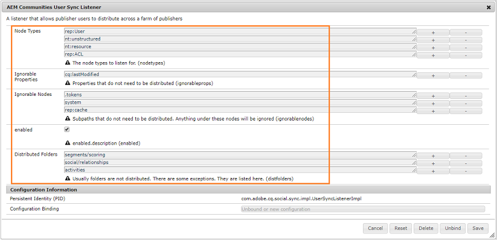

# Communities-Benutzersynchronisierung {#communities-user-synchronization}

## Einführung {#introduction}

In AEM Communities kann aus der Veröffentlichungsumgebung (je nach konfigurierten Berechtigungen) *Site-Besucher* zu *Mitgliedern* werden, *Benutzergruppen* erstellen und ihr *Mitgliederprofil* bearbeiten.

*Benutzerdaten* sind ein Begriff, der verwendet wird, um auf  *Benutzer*,  *Benutzerprofile* und  *Benutzergruppen* zu verweisen.

** Membersis ist ein Begriff, der verwendet wird, um auf in der Veröffentlichungsumgebung registrierte  ** Benutzer im Gegensatz zu in der Autorenumgebung registrierten Benutzern zu verweisen.

Weitere Informationen zu Benutzerdaten finden Sie unter [Verwalten von Benutzern und Benutzergruppen](/help/communities/users.md).

## Synchronisieren von Benutzern auf einer Veröffentlichungsfarm {#synchronizing-users-across-a-publish-farm}

Standardmäßig werden in der Veröffentlichungsumgebung erstellte Benutzerdaten nicht in der Autorenumgebung angezeigt.

Die meisten in der Autorenumgebung erstellten Benutzerdaten sollen in der Autorenumgebung verbleiben und werden weder synchronisiert noch in Veröffentlichungsinstanzen repliziert.

Wenn [topology](/help/communities/topologies.md) eine [Veröffentlichungsfarm](/help/sites-deploying/recommended-deploys.md#tarmk-farm) ist, müssen Registrierung und Änderungen, die an einer Veröffentlichungsinstanz vorgenommen wurden, mit anderen Veröffentlichungsinstanzen synchronisiert werden. Mitglieder müssen sich anmelden und ihre Daten auf einem beliebigen Veröffentlichungsknoten anzeigen können.

Wenn die Benutzersynchronisierung aktiviert ist, werden die Benutzerdaten automatisch über die Veröffentlichungsinstanzen in der Farm synchronisiert.

### Anweisungen zur Benutzersynchronisierung {#user-sync-setup-instructions}

Detaillierte schrittweise Anweisungen zum Aktivieren der Synchronisierung über eine Veröffentlichungsfarm hinweg finden Sie unter:

* [Benutzersynchronisierung](/help/sites-administering/sync.md)

## Benutzersynchronisierung im Hintergrund {#user-sync-in-the-background}


* **vlt-Paket**

   Es handelt sich um eine ZIP-Datei aller Änderungen, die an einem Herausgeber vorgenommen werden und die über Herausgeber verteilt werden müssen. Änderungen an einem Herausgeber generieren Ereignisse, die vom Ereignis-Listener &quot;change&quot;ausgewählt werden. Dadurch wird ein vlt-Paket erstellt, das alle Änderungen enthält.

* **Verteilungspaket**

   Es enthält Verteilungsinformationen für Sling. Dies sind Informationen darüber, wo der Inhalt verteilt werden muss und wann er zuletzt verteilt wurde.

## Was passiert wenn ... {#what-happens-when}

### Veröffentlichen Sie die Site über die Communities-Sites-Konsole {#publish-site-from-communities-sites-console}

Wenn beim Autor eine Community-Site über die [Communities Sites-Konsole](/help/communities/sites-console.md) veröffentlicht wird, wirkt sich dies auf [replizieren](/help/sites-deploying/configuring.md#replication-reverse-replication-and-replication-agents) die zugehörigen Seiten aus und Sling verteilt die dynamisch erstellten Community-Benutzergruppen, einschließlich ihrer Mitgliedschaft.

### Benutzer wird erstellt oder Profil in der Veröffentlichungsinstanz bearbeitet {#user-is-created-or-edits-profile-on-publish}

Standardmäßig werden Benutzer und Profile, die in der Veröffentlichungsumgebung erstellt wurden (z. B. durch Selbstregistrierung, Anmeldung bei sozialen Netzwerken, LDAP-Authentifizierung), nicht in der Autorenumgebung angezeigt.

Wenn die Topologie eine [Veröffentlichungsfarm](/help/communities/topologies.md) ist und die Benutzersynchronisierung korrekt konfiguriert wurde, werden das *Benutzer*- und das *Benutzerprofil* über die Veröffentlichungsfarm hinweg mithilfe der Sling-Verteilung synchronisiert.

### Neue Community-Gruppe wird auf Publish {#new-community-group-is-created-on-publish} erstellt.

Obwohl von einer Veröffentlichungsinstanz initiiert, erfolgt die Erstellung einer Community-Gruppe, die zu neuen Seiten auf der Site und einer neuen Benutzergruppe führt, tatsächlich auf der Autoreninstanz.

Im Rahmen dieses Prozesses werden die neuen Seiten der Site auf allen Veröffentlichungsinstanzen repliziert. Die dynamisch erstellte Community-Benutzergruppe und ihre Mitglieder werden an alle Veröffentlichungsinstanzen verteilt.

### Erstellung von Benutzern oder Benutzergruppen über die Sicherheitskonsole {#users-or-user-groups-are-created-using-security-console}

Per Design werden die in der Veröffentlichungsumgebung erstellten Benutzerdaten nicht in der Autorenumgebung angezeigt (und umgekehrt).

Wenn in der Veröffentlichungsumgebung neue Benutzer über die Konsole [Benutzerverwaltung und Sicherheit](/help/sites-administering/security.md) hinzugefügt werden, werden die neuen Benutzer und ihre Gruppenmitgliedschaft im Rahmen der Benutzersynchronisierung ggf. mit anderen Veröffentlichungsinstanzen synchronisiert. Bei der Benutzersynchronisierung werden auch die über die Sicherheitskonsole erstellten Benutzergruppen synchronisiert.

### Benutzer-Posts Inhalt auf Veröffentlichungsinstanz {#user-posts-content-on-publish}

Bei benutzergenerierten Inhalten (UGC) werden die in einer Veröffentlichungsinstanz eingegebenen Daten über das [konfigurierte SRP](/help/communities/srp-config.md) aufgerufen.

## Best Practices {#bestpractices}

Standardmäßig ist die Benutzersynchronisierung **deaktiviert**. Die Aktivierung der Benutzersynchronisierung beinhaltet die Änderung *vorhandener* OSGi-Konfigurationen. Aufgrund der Aktivierung der Benutzersynchronisierung sollten keine neuen Konfigurationen hinzugefügt werden.

Die Benutzersynchronisierung ist davon abhängig, dass die Autorenumgebung die Verteilung der Benutzerdaten verwaltet, auch wenn die Benutzerdaten nicht in der Autoreninstanz erstellt werden .

**Voraussetzungen**

1. Wenn Benutzer und Benutzergruppen bereits auf einem Herausgeber erstellt wurden, wird empfohlen, die Benutzerdaten vor der Konfiguration und Aktivierung der Benutzersynchronisierung [manuell zu synchronisieren](/help/sites-administering/sync.md#manually-syncing-users-and-user-groups).

   Sobald die Benutzersynchronisierung aktiviert wurde, werden nur neu erstellte Benutzer und Gruppen synchronisiert .

1. Stellen Sie sicher, dass der neueste Code installiert wurde:

   * [AEM-Plattformupdates](https://experienceleague.adobe.com/docs/experience-manager-release-information/aem-release-updates/aem-releases-updates.html?lang=de)
   * [AEM Communities-Updates](/help/communities/deploy-communities.md#latestfeaturepack)

Die folgenden Konfigurationen sind erforderlich, um die Benutzersynchronisierung in AEM Communities zu aktivieren. Stellen Sie sicher, dass diese Konfigurationen korrekt sind, um zu verhindern, dass die Sling-Inhaltsverteilung fehlschlägt.

### Apache Sling Distribution Agent – Sync Agents Factory {#apache-sling-distribution-agent-sync-agents-factory}

Diese Konfiguration ruft den Inhalt ab, der über die Publisher hinweg synchronisiert werden soll. Die Konfiguration befindet sich in der -Autoreninstanz. Der Autor muss alle vorhandenen Herausgeber verfolgen und alle Informationen synchronisieren.

Die Standardwerte in der Konfiguration gelten für eine einzelne Veröffentlichungsinstanz. Da die Benutzersynchronisierung zum Synchronisieren mehrerer Veröffentlichungsinstanzen nützlich ist, z. B. für eine Veröffentlichungsfarm, müssen zusätzliche Veröffentlichungsinstanzen zur Konfiguration hinzugefügt werden.

**Wie wird der Inhalt synchronisiert?**

Die Autoreninstanz pingt den Exporter-Endpunkt von Herausgebern. Wenn ein Benutzer für bestimmte Herausgeber (n) erstellt oder aktualisiert wird, ruft der Autor den Inhalt von seinen Exporter-Endpunkten ab und [pusht den Inhalt](/help/communities/sync.md#main-pars-image-1413756164) an andere Herausgeber (n-1, d. h. von den Herausgebern, von denen der Inhalt abgerufen wird).

Konfigurieren der Konfiguration von Apache Sling Sync Agents :

1. Melden Sie sich mit Administratorrechten für Ihre AEM-Autoreninstanz an.
1. Rufen Sie die [Web-Konsole](https://helpx.adobe.com/experience-manager/6-4/help/sites-deploying/configuring-osgi.html) auf. Beispiel: [https://localhost:4502/system/console/configMgr](https://localhost:4502/system/console/configMgr).
1. Suchen Sie **Apache Sling Distribution Agent - Sync Agents Factory**.

   * Wählen Sie die vorhandene Konfiguration aus, um sie zur Bearbeitung zu öffnen (Bleistiftsymbol).

      Überprüfungsname: **socialpubsync.**

   * Aktivieren Sie das Kontrollkästchen **Aktiviert** .
   * Wählen Sie **Mehrere Warteschlangen verwenden.**
   * Geben Sie **Exporter Endpoints** und **Importer Endpoints** an (Sie können weitere Exporter- und Importtool-Endpunkte hinzufügen).

      Diese Endpunkte definieren, woher der Inhalt abgerufen werden soll und wo der Inhalt gepusht werden soll. Der Autor ruft den Inhalt vom angegebenen Exportendpunkt ab und sendet ihn an die Herausgeber (außer den Herausgeber, von dem er den Inhalt abgerufen hat).
   

### Adobe Granite Distribution – Encrypted Password Transport Secret Provider {#adobe-granite-distribution-encrypted-password-transport-secret-provider}

Dadurch kann der Autor den autorisierten Benutzer identifizieren, da er berechtigt ist, Benutzerdaten vom Autor zur Veröffentlichung zu synchronisieren.

Der [autorisierte Benutzer, der](/help/sites-administering/sync.md#createauthuser) auf allen Veröffentlichungsinstanzen erstellt wurde, hilft den Herausgebern, eine Verbindung zum Autor herzustellen und die Sling-Verteilung auf der Autoreninstanz zu konfigurieren. Dieser autorisierte Benutzer verfügt über alle erforderlichen [ACLs](/help/sites-administering/sync.md#howtoaddacl).

Wann immer Daten auf Herausgebern installiert oder von diesen abgerufen werden sollen, stellt der Autor eine Verbindung mit den Herausgebern her, die die in dieser Konfiguration festgelegten Anmeldeinformationen (Benutzername und Kennwort) verwenden.

So verbinden Sie Autoren mit Herausgebern mit autorisierten Benutzern:

1. Melden Sie sich mit Administratorrechten für Ihre AEM-Autoreninstanz an.
1. Rufen Sie die [Web-Konsole](/help/sites-deploying/configuring-osgi.md) auf.

   Beispiel: [https://localhost:4502/system/console/configMgr](https://localhost:4502/system/console/configMgr).
1. Suchen Sie nach **Adobe Granite Distribution - Encrypted Password Transport Secret Provider.**
1. Wählen Sie die vorhandene Konfiguration aus, um sie zur Bearbeitung zu öffnen (Bleistiftsymbol).

   Verify property **socialpubsync** - **publishUser.**

1. Legen Sie den Benutzernamen und das Kennwort auf den autorisierten Benutzer [fest](/help/sites-administering/sync.md#createauthorizeduser).

   Beispiel: **usersync - admin**


### Apache Sling Distribution Agent – Queue Agents Factory {#apache-sling-distribution-agent-queue-agents-factory}

Diese Konfiguration wird verwendet, um die Daten zu konfigurieren, die Sie über Publisher hinweg synchronisieren möchten. Wenn Daten in Pfaden erstellt/aktualisiert werden, die in **Zulässige Roots** angegeben sind, wird &quot;var/community/distribution/diff&quot;aktiviert und der erstellte Replikator ruft die Daten von einem Herausgeber ab und installiert sie auf anderen Herausgebern.

So konfigurieren Sie die zu synchronisierenden Daten (Knotenpfade):

1. Melden Sie sich mit Administratorrechten für Ihre Autoreninstanz an.
1. Rufen Sie die [Web-Konsole](https://helpx.adobe.com/experience-manager/6-4/help/sites-deploying/configuring-osgi.html) auf.

   Beispiel: [https://localhost:4503/system/console/configMgr](https://localhost:4503/system/console/configMgr).

1. Suchen Sie **Apache Sling Distribution Agent - Queue Agents Factory**.
1. Wählen Sie die vorhandene Konfiguration aus, um sie zur Bearbeitung zu öffnen (Bleistiftsymbol).

   Überprüfungsname: **socialpubsync -reverse**

1. Aktivieren Sie das Kontrollkästchen **Aktiviert** und speichern Sie.
1. Geben Sie die Knotenpfade an, die in **Zulässige Wurzeln** repliziert werden sollen.
1. Wiederholen Sie dies für jede **publish**-Instanz.

   

### Adobe Granite Distribution – Diff Observer Factory {#adobe-granite-distribution-diff-observer-factory}

Mit dieser Konfiguration wird die Gruppenmitgliedschaft über Publisher hinweg synchronisiert.
Wenn die Mitgliedschaft in einer Gruppe in einem Herausgeber nicht von anderen Herausgebern aktualisiert wird, stellen Sie sicher, dass **ref :members** zu **Look-properties-Namen** hinzugefügt wird.

So stellen Sie die Mitgliedersynchronisierung sicher:

1. Melden Sie sich mit Administratorrechten für Ihre AEM-Autoreninstanz an.
1. Rufen Sie die [Web-Konsole](https://helpx.adobe.com/experience-manager/6-4/help/sites-deploying/configuring-osgi.html) auf.

   Beispiel: [https://localhost:4503/system/console/configMgr](https://localhost:4503/system/console/configMgr).

1. Suchen Sie **Adobe Granite Distribution - Diff Observer Factory**.
1. Wählen Sie die vorhandene Konfiguration aus, um sie zur Bearbeitung zu öffnen (Bleistiftsymbol).

   Überprüfen Sie **Agentenname: socialpubsync -reverse**.

1. Aktivieren Sie das Kontrollkästchen **Aktiviert** .
1. Geben Sie **rep:members** als Beschreibung für propertyName in **Namen der gesuchten Eigenschaften** an und speichern Sie.

   

### Apache Sling Distribution Trigger – Scheduled Triggers Factory {#apache-sling-distribution-trigger-scheduled-triggers-factory}

Mit dieser Konfiguration können Sie das Abrufintervall konfigurieren (nach dem Publisher gepingt und Änderungen vom Autor abgerufen werden), um die Änderungen über Publisher hinweg zu synchronisieren.

Der Autor fragt Herausgeber alle 30 Sekunden ab (Standard). Wenn Pakete im Ordner `/var/sling/distribution/packages/  socialpubsync -  vlt /shared` vorhanden sind, werden diese Pakete abgerufen und auf anderen Publishern installiert.

So ändern Sie das Abrufintervall:

1. Melden Sie sich mit Administratorrechten für Ihre AEM-Autoreninstanz an.
1. Rufen Sie die [Web-Konsole](/help/sites-deploying/configuring-osgi.md) auf, z. B. [https://localhost:4502/system/console/configMgr](https://localhost:4502/system/console/configMgr)
1. Suchen Sie nach **Apache Sling Distribution Trigger - Scheduled Trigger Factory**

   * Wählen Sie die vorhandene Konfiguration aus, um sie zur Bearbeitung zu öffnen (Bleistiftsymbol).

      Überprüfen Sie **socialpubsync -scheduled-Trigger**

   * Stellen Sie das Intervall in Sekunden auf das gewünschte Intervall ein und speichern Sie es.

   

### AEM Communities User Sync Listener {#aem-communities-user-sync-listener}

Überprüfen Sie für Probleme in der Sling-Distribution, bei denen es eine Diskrepanz bei Abonnements gibt und die darauf folgen, ob die folgenden Eigenschaften in den Konfigurationen **AEM Communities User Sync Listener** festgelegt sind:

* NodeTypes
* IgnorableProperties
* IgnorableNodes
* DistributedFolders

So synchronisieren Sie Abonnements, folgt und Benachrichtigungen

Auf jeder AEM Veröffentlichungsinstanz:

1. Melden Sie sich mit Administratorrechten an.
1. Rufen Sie die [Web-Konsole](/help/sites-deploying/configuring-osgi.md) auf. Beispiel: [https://localhost:4503/system/console/configMgr](https://localhost:4503/system/console/configMgr).
1. Suchen Sie **AEM Communities User Sync Listener**.
1. Wählen Sie die vorhandene Konfiguration aus, um sie zur Bearbeitung zu öffnen (Bleistiftsymbol)

   Überprüfungsname: **socialpubsync -scheduled-Trigger**

1. Legen Sie die folgenden **NodeTypes** fest:

   `rep:User`

   `nt:unstructured`

   `nt:resource`

   `rep:ACL`

   `sling:Folder`

   `sling:OrderedFolder`

   Die in dieser Eigenschaft angegebenen Knotentypen werden synchronisiert und die Benachrichtigungsinformationen (Blogs und Konfigurationen folgen) werden zwischen verschiedenen Herausgebern synchronisiert.

1. Fügen Sie alle zu synchronisierenden Ordner in **DistributedFolders** hinzu. Beispiel:

   `segments/scoring`

   `social/relationships`

   `activities`

1. Setzen Sie **Ignorablenodes** auf:

   `.tokens`

   `system`

   `rep:cache` (da wir Sticky-Sitzungen verwenden, müssen wir diesen Knoten nicht mit verschiedenen Herausgebern synchronisieren.)

   

### Eindeutige Sling-ID {#unique-sling-id}

AEM Autoreninstanz verwendet die Sling-ID, um zu ermitteln, woher die Daten kommen und an welche Herausgeber das Paket zurückgesendet werden muss (oder muss es nicht).

Stellen Sie sicher, dass alle Herausgeber in einer Veröffentlichungsfarm über eine eindeutige Sling-ID verfügen. Wenn die Sling-ID für mehrere Veröffentlichungsinstanzen in einer Veröffentlichungsfarm identisch ist, schlägt die Benutzersynchronisierung fehl. Da der Autor nicht weiß, woher das Paket abgerufen werden soll und wo es installiert werden soll.

Um eine eindeutige Sling-ID von Herausgebern in der Veröffentlichungsfarm sicherzustellen, gilt Folgendes für jede Veröffentlichungsinstanz:

1. Navigieren Sie zu [https://_host:port_/system/console/status-slingsettings](https://localhost:4503/system/console/status-slingsettings).
1. Überprüfen Sie den Wert von **Sling ID**.

   

   Wenn die Sling-ID einer Veröffentlichungsinstanz der Sling-ID einer anderen Veröffentlichungsinstanz entspricht, gehen Sie wie folgt vor:

1. Beenden Sie eine der Veröffentlichungsinstanzen mit einer übereinstimmenden Sling-ID.
1. Suchen und löschen Sie im Verzeichnis `crx-quickstart/launchpad/felix` die Datei *sling.id.file.*

   Beispielsweise auf einem Linux-System:

   `rm -i $(find . -type f -name sling.id.file)`

   Beispiel für ein Windows-System:

   Verwenden Sie den Windows-Explorer und suchen Sie nach `sling.id.file`

1. Starten Sie die Veröffentlichungsinstanz. Beim Start wird ihm eine neue Sling-ID zugewiesen.
1. Überprüfen Sie, ob die **Sling-ID** jetzt eindeutig ist.

Wiederholen Sie diese Schritte, bis alle Veröffentlichungsinstanzen über eine eindeutige Sling-ID verfügen.

### Vault Package Builder Factory {#vault-package-builder-factory}

Damit Updates ordnungsgemäß synchronisiert werden, müssen Sie den Vault Package Builder für die Benutzersynchronisierung ändern.
In `/home/users` wird ein `*/rep:cache` -Knoten erstellt. Es handelt sich um einen Cache, der verwendet wird, um festzustellen, dass dieser Cache direkt verwendet werden kann, wenn wir den Prinzipalnamen eines Knotens abfragen.

Die Benutzersynchronisierung kann angehalten werden, wenn `rep :cache`-Knoten über Publisher hinweg synchronisiert werden.

Um sicherzustellen, dass Aktualisierungen in jeder AEM Veröffentlichungsinstanz ordnungsgemäß über Herausgeber hinweg synchronisiert werden:

1. Zugriff auf die [Web-Konsole](/help/sites-deploying/configuring-osgi.md)

   Beispiel: [https://localhost:4503/system/console/configMgr](https://localhost:4503/system/console/configMgr).
1. Suchen Sie nach **Apache Sling Distribution Packaging - Vault Package Builder Factory**

   Builder name: socialpubsync-vlt.

1. Wählen Sie das Bearbeitungssymbol aus.
1. Fügen Sie zwei Paketknotenfilter hinzu:
   * `/home/users|-.*/.tokens`
   * `/home/users|-.*/rep:cache`
1. Richtlinienverarbeitung
   * Um vorhandene rep :policy -Knoten durch neue zu überschreiben, fügen Sie einen dritten Paketfilter hinzu: `/home/users|+.*/rep:policy`
   * Um zu verhindern, dass Richtlinien verteilt werden, legen Sie Folgendes fest: `Acl Handling: IGNORE`

   

## Fehlerbehebung bei der Sling-Distribution in AEM Communities {#troubleshoot-sling-distribution-in-aem-communities}

Wenn die Sling-Verteilung fehlschlägt, führen Sie die folgenden Debugging-Schritte aus:

1. **Auf  [falsch hinzugefügte Konfigurationen überprüfen](/help/sites-administering/sync.md#improperconfig)**

   Stellen Sie sicher, dass nicht mehrere Konfigurationen hinzugefügt oder bearbeitet werden. Stattdessen sollten die vorhandenen Standardkonfigurationen bearbeitet werden.
1. **Konfigurationen überprüfen**

   Stellen Sie sicher, dass alle [Konfigurationen](/help/communities/sync.md#bestpractices) in Ihrer AEM-Autoreninstanz entsprechend festgelegt sind, wie in [Best Practices](/help/communities/sync.md#main-pars-header-863110628) beschrieben.

1. **Überprüfen der autorisierten Benutzerberechtigungen**

   Wenn die Pakete nicht ordnungsgemäß installiert sind, überprüfen Sie, ob der [autorisierte Benutzer](/help/sites-administering/sync.md#createauthuser), der in der ersten Veröffentlichungsinstanz erstellt wurde, über die richtigen ACLs verfügt.

   Um dies zu überprüfen, ändern Sie anstelle des [erstellten autorisierten Benutzers](/help/sites-administering/sync.md#createauthuser) die Konfiguration [Adobe Granite Distribution - Encrypted Password Transport Secret Provider](/help/sites-administering/sync.md#adobegraniteencpasswrd) in der -Autoreninstanz, um Administratorbenutzerberechtigungen zu verwenden. Versuchen Sie nun, die Pakete erneut zu installieren. Wenn die Benutzersynchronisierung problemlos mit Administratorberechtigungen funktioniert, bedeutet dies, dass der erstellte Veröffentlichungsbenutzer keine entsprechenden ACLs hatte.

1. **Überprüfen der Konfiguration von &quot;Diff Observer Factory&quot;**

   Wenn nur bestimmte Knoten nicht in der Veröffentlichungsfarm synchronisiert werden - z. B. Gruppenmitglieder nicht synchronisiert werden -, stellen Sie sicher, dass die Konfiguration [Adobe Granite Distribution - Diff Observer Factory](/help/sites-administering/sync.md#diffobserver) aktiviert und **rep: Mitglieder** werden in **Namen der angezeigten Eigenschaften** festgelegt.

1. **Überprüfen Sie die Konfiguration des AEM Communities User Sync Listener .** Wenn die erstellten Benutzer synchronisiert werden, Abonnements und folgende Abonnements jedoch nicht funktionieren, stellen Sie sicher, dass die AEM Communities User Sync Listener-Konfiguration über Folgendes verfügt:

   * Knotentypen - festgelegt auf **rep:User, nt :unstructured**, **nt :resource**, **rep:ACL**, **sling:Folder** und **sling:OrderedFolder**.
   * Ignorierbare Knoten - festgelegt auf **.tokens**, **system** und **rep:cache**.
   * Verteilte Ordner - auf die Ordner eingestellt, die verteilt werden sollen.

1. **Überprüfen Sie die bei der Benutzererstellung in der Veröffentlichungsinstanz generierten Protokolle**

   Wenn die obigen Konfigurationen entsprechend eingestellt sind, die Benutzersynchronisierung jedoch nicht funktioniert, überprüfen Sie die bei der Benutzererstellung generierten Protokolle.

   Überprüfen Sie wie folgt, ob die Reihenfolge der Protokolle identisch ist:

   ```shell
   15.05.2016 18:33:01.523 *INFO* [sling-oak-observation-7422] com.adobe.cq.social.sync.impl.PublisherSyncServiceImpl Handing these paths to the distribution subsystem: [/home/users/C, /home/users/C/Cw-5avWqilmqsNn5hCvK]
   15.05.2016 18:33:01.523 *INFO* [sling-oak-observation-7422] org.apache.sling.distribution.agent.impl.SimpleDistributionAgent [agent][socialpubsync-reverse] REQUEST-START DSTRQ2: ADD paths=[/home/users/C, /home/users/C/Cw-5avWqilmqsNn5hCvK], user=communities-user-admin
   15.05.2016 18:33:01.523 *INFO* [sling-oak-observation-7431] com.adobe.cq.social.sync.impl.PublisherSyncServiceImpl Handing these paths to the distribution subsystem: [/home/users/C/Cw-5avWqilmqsNn5hCvK, /home/users/C/Cw-5avWqilmqsNn5hCvK/profile, /home/users/C/Cw-5avWqilmqsNn5hCvK/rep:policy]
   15.05.2016 18:33:01.523 *INFO* [sling-oak-observation-7431] org.apache.sling.distribution.agent.impl.SimpleDistributionAgent [agent][socialpubsync-reverse] REQUEST-START DSTRQ3: ADD paths=[/home/users/C/Cw-5avWqilmqsNn5hCvK, /home/users/C/Cw-5avWqilmqsNn5hCvK/profile, /home/users/C/Cw-5avWqilmqsNn5hCvK/rep:policy], user=communities-user-admin
   15.05.2016 18:33:01.757 *INFO* [sling-oak-observation-7431] org.apache.jackrabbit.vault.packaging.impl.JcrPackageDefinitionImpl unwrapping package sling/distribution:socialpubsync-vlt_1463337181554_ebb27ad9-a861-4405-9342-d64c916654e2:0.0.1
   15.05.2016 18:33:01.820 *INFO* [sling-oak-observation-7422] org.apache.jackrabbit.vault.packaging.impl.JcrPackageDefinitionImpl unwrapping package sling/distribution:socialpubsync-vlt_1463337181554_58811273-5861-48fe-95d2-4aff367b99c3:0.0.1
   15.05.2016 18:33:02.023 *INFO* [sling-oak-observation-7430] com.adobe.cq.social.sync.impl.PublisherSyncServiceImpl Handing these paths to the distribution subsystem: [/home/users/C/Cw-5avWqilmqsNn5hCvK/profile]
   15.05.2016 18:33:02.023 *INFO* [sling-oak-observation-7430] org.apache.sling.distribution.agent.impl.SimpleDistributionAgent [agent][socialpubsync-reverse] REQUEST-START DSTRQ4: ADD paths=[/home/users/C/Cw-5avWqilmqsNn5hCvK/profile], user=communities-user-admin
   15.05.2016 18:33:02.273 *INFO* [sling-oak-observation-7430] org.apache.jackrabbit.vault.packaging.impl.JcrPackageDefinitionImpl unwrapping package sling/distribution:socialpubsync-vlt_1463337182039_f34f4fa6-10b9-42eb-8740-4da9d4d38f99:0.0.1
   ```

Debugging:

1. Deaktivieren Sie die Benutzersynchronisierung:
1. Melden Sie sich in AEM Autoreninstanz mit Administratorrechten an.

   1. Rufen Sie die [Web-Konsole](/help/sites-deploying/configuring-osgi.md) auf. Beispiel: [https://localhost:4502/system/console/configMgr](https://localhost:4502/system/console/configMgr).
   1. Suchen Sie die Konfiguration **Apache Sling Distribution Agent - Sync Agents Factory**.
   1. Deaktivieren Sie das Kontrollkästchen **Aktiviert** .

      Beim Deaktivieren der Benutzersynchronisierung in der Autoreninstanz werden die Endpunkte (Exporter und Importer) deaktiviert und die Autoreninstanz ist statisch. Die **vlt**-Pakete werden vom Autor nicht gepingt oder abgerufen.

      Wenn nun ein Benutzer in der Veröffentlichungsinstanz erstellt wird, wird das Paket **vlt** im Knoten */var/sling/distribution/packages/ socialpubsync - vlt /data* erstellt. Und wenn diese Pakete vom Autor an einen anderen Dienst gesendet werden. Sie können diese Daten herunterladen und extrahieren, um zu überprüfen, welche Eigenschaften an andere Dienste gesendet werden.

1. Gehen Sie zu einem Herausgeber und erstellen Sie einen Benutzer im Herausgeber. Daher werden Ereignisse erstellt.
1. Überprüfen Sie die [Reihenfolge der Protokolle](/help/communities/sync.md#troubleshoot-sling-distribution-in-aem-communities), die bei der Benutzererstellung erstellt wurden.
1. Überprüfen Sie, ob ein **vlt**-Paket für **/var/sling/distribution/packages/socialpubsync-vlt/data** erstellt wird.
1. Aktivieren Sie jetzt die Benutzersynchronisierung in AEM Autoreninstanz.
1. Ändern Sie im Publisher die Exporter- oder Importtool-Endpunkte in **Apache Sling Distribution Agent - Sync Agents Factory**.
Wir können Paketdaten herunterladen und extrahieren, um zu überprüfen, welche Eigenschaften an andere Herausgeber gesendet werden und welche Daten verloren gehen.
