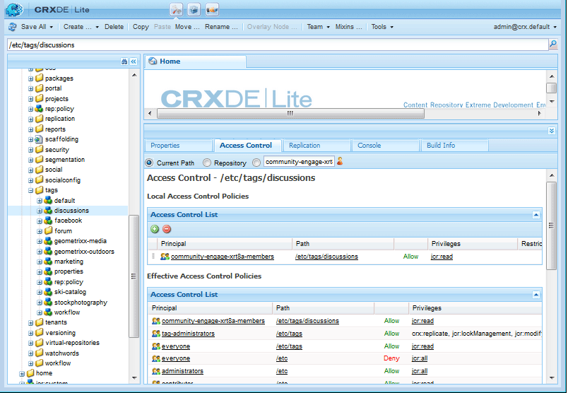

# Tagging benutzergenerierter Inhalte {#tagging-user-generated-content}

## Überblick {#overview}

Das Tagging benutzergenerierter Inhalte (UGC) ist das Mittel, mit dem Community-Mitglieder anderen Mitgliedern bei der Suche nach Inhalten helfen können.

In der Regel werden Tags von Autoren und Administratoren in der Autorenumgebung angewendet. Das Tagging von UGC ist insofern einzigartig, als UGC-Tags von Community-Mitgliedern in der Veröffentlichungsumgebung angewendet werden.

Die Tag-Namespaces und Taxonomien sind für beide Anwendungen gleich.

## Communities-Funktionen {#communities-features}

Die AEM Communities-Funktionen, die für das Tagging konfiguriert werden können, sind:

* [Blog](blog-feature.md)
* [Kalender](calendar.md)
* [Dateibibliothek](file-library.md)
* [Forum](forum.md#configuretheaddedforum)
* [Fragen und Antworten](working-with-qna.md)

## Verwalten von Tags {#administering-tags}

Informationen zum Erstellen und Verwalten von Tag-Namespaces und Taxonomien finden Sie unter [Verwalten von Tags](../../help/sites-administering/tags.md#tagging-console) .

Entwicklerinformationen finden Sie unter [Tag Essentials](tag.md) .

Informationen zum Hinzufügen einer Social Tag Cloud-Komponente zur Seite finden Sie unter [Social Tag Cloud verwenden](tagcloud.md) , um die Suche nach veröffentlichten UGC-Inhalten mithilfe der angewendeten Tags zu erleichtern.

### Tag-Berechtigungen {#tag-permissions}

Die Standardberechtigungen sind so eingestellt, dass Tag-Namespaces nicht von allen in der Veröffentlichungsumgebung gelesen werden können.

Da Tags in der Veröffentlichungsumgebung auf UGC angewendet werden, muss die Leseberechtigung für Community-Mitglieder aktiviert sein, damit sie Tags auswählen können, die angewendet werden sollen.

Siehe [Festlegen von Tag-Berechtigungen](../../help/sites-administering/tags.md#setting-tag-permissions).

Im Folgenden sehen Sie, wie es in CRXDE angezeigt wird, wenn ein Administrator Leseberechtigungen für `/etc/tag/discussions` für die Gruppe `Community Engage Members` auf  anwendet.

