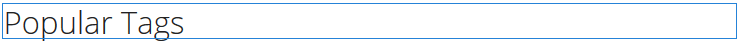

# Verwenden von einer Social-Tag-Cloud {#using-social-tag-cloud}

## Einführung {#introduction}

Die Komponente `Social Tag Cloud` markiert Tags, die von Community-Mitgliedern beim Posten von Inhalten angewendet werden. Dies dient der Bestimmung beliebter Themen und ermöglicht es Site-Besuchern, gekennzeichnete Inhalte schneller aufzufinden.

Informationen zu einer weiteren Möglichkeit zur Bestimmung von Trends finden Sie unter [Aktivitätstrends](trends.md).

Auf dieser Seite werden die `Social Tag Cloud`-Komponentendialogeinstellungen Dokumente und die Benutzererfahrung beschrieben.

Detaillierte Informationen für Entwickler finden Sie unter [Tag-Grundlagen](tag.md).

Informationen zum Erstellen und Verwalten von Tags sowie zu den angewendeten Inhalts-Tags finden Sie unter [Verwalten von Tags](../../help/sites-administering/tags.md).

## Hinzufügen einer Social-Tag-Cloud {#adding-a-social-tag-cloud}

Um einer Seite im Autorenmodus eine `Social Tag Cloud`-Komponente hinzuzufügen, suchen Sie im Komponentenbrowser nach `Communities / Social Tag Cloud` und ziehen Sie sie auf eine Seite, auf der die Tag-Cloud angezeigt werden soll.

Die erforderlichen Informationen finden Sie unter [Komponenten der Communities](basics.md).

Wenn die [erforderlichen clientseitigen Bibliotheken](tag.md#essentials-for-client-side) einbezogen werden, wird die `Social Tag Cloud`-Komponente wie folgt angezeigt:

## Konfigurieren einer Social-Tag-Cloud {#configuring-social-tag-cloud}

Wählen Sie die platzierte Komponente `Social Tag Cloud` aus, auf die zugegriffen werden soll, und wählen Sie das Symbol `Configure` aus, mit dem das Bearbeitungsdialogfeld geöffnet wird.

Geben Sie unter der Registerkarte **[!UICONTROL Social Tag Cloud]** an, welche Tags angezeigt werden sollen und, wenn die Tags aktive Links sind, den Speicherort der Seite für die Suchergebnisse:

* **[!UICONTROL Anzuzeigende Social Tags]** Legt fest, welche UGC-Tags angezeigt werden sollen. Die verfügbaren Optionen sind:

   * `From page and child pages`
   * `All tags`

   Die Standardeinstellung ist `From page and child pages`, wobei &quot;page&quot;auf die unten stehende Einstellung **Seite** verweist.

* **[!UICONTROL Seite]**

   (Erforderlich, wenn nicht `All tags)` Der Pfad zum UGC für eine Seite. Wird kein Pfad angegeben, verweist die Standardeinstellung automatisch auf die aktuelle Seite.

* **[!UICONTROL Keine Einschränkung bezüglich Tags]**

   Wenn diese Option aktiviert ist, werden die Tags in der Tag-Cloud als Nur-Text angezeigt. Wenn diese Option nicht aktiviert ist, werden die Tags als aktive Links angezeigt, die nach allen Inhalten suchen, auf die dieses Tag angewendet wird. Standardmäßig ist die Option deaktiviert und es muss ein **[!UICONTROL Suchergebnispfad]** festgelegt werden.

* **[!UICONTROL Suchergebnispfad]**

   Der Pfad zu einer Seite, auf der eine `Search Result`-Komponente platziert wurde, die so konfiguriert ist, dass sie auf UGC verweist, der den UGC-Pfad enthält, der mit der Einstellung **Seite** angegeben wurde.

## Anpassen der Anzeige einer Social-Tag-Cloud {#change-display-of-social-tag-cloud}

Um die Anzeige der **Social Tag Cloud** zu bearbeiten, geben Sie [Designmodus](../../help/sites-authoring/default-components-designmode.md) ein und klicken Sie mit der Dublette auf die platzierte `Social Tag Cloud`-Komponente, um ein Dialogfeld mit einer zusätzlichen Registerkarte zu öffnen.

Geben Sie auf der Registerkarte **[!UICONTROL Social Tag Cloud (Design)]** an, wie Tags angezeigt werden. Ein Tag kann ein einfaches Tag, ein einzelnes Wort im Standard-Namensraum oder eine hierarchische Taxonomie sein:

* **[!UICONTROL Vollständige Titelpfade anzeigen]**

   Wenn diese Option aktiviert ist, werden die Titel der übergeordneten Tags und des Namensraums für jedes angewendete Tag angezeigt.

   Beispiel:

   * Aktiviert: `Geometrixx Media: Gadgets / Cars`
   * Deaktiviert: `Cars`

   Bei einfachen Tags ist kein Unterschied feststellbar.

   Diese Option ist standardmäßig deaktiviert.

* **[!UICONTROL Nur Leaf-Tags anzeigen]**

   Wenn diese Option aktiviert ist, werden nur angewendete Tags angezeigt, die keine anderen Tags enthalten.

   Beispiel für TagID:

   `Geometrixx Media: Gadgets / Cars`

   Es gibt drei Tags, die angewendet werden können:

   `Geometrixx Media (the namespace)`, `Gadgets`, und `Cars`

   * Überprüft: Nur `Cars` wird angezeigt, wenn sie angewendet wird.
   * Nicht aktiviert: `Geometrixx Media` und `Gadgets`sowie `Cars` werden angezeigt, sofern angewendet.

   Einfache Tags sind immer Leaf-Tags.

   Diese Option ist standardmäßig deaktiviert.

* **[!UICONTROL Verknüpfungsvorlage]**

   Eine Vorlage, die nicht standardmäßig verwendet wird, um die Links in einer Tag-Cloud anzuzeigen, wenn die Verknüpfungen über das Dialogfeld zum Bearbeiten der Komponente aktiviert werden.

* **[!UICONTROL Gleiche Größe für alle Tags]**

   Wenn diese Option aktiviert ist, werden alle Wörter in der Tag-Cloud gleich formatiert. Wenn diese Option deaktiviert ist, werden Wörter je nach Verwendung unterschiedlich formatiert. Diese Option ist standardmäßig deaktiviert.

## Zusätzliche Informationen {#additional-information}

Weitere Informationen finden Sie auf der Seite [Tag Essentials](tag.md) für Entwickler.

Informationen zum Erstellen und Verwalten von Tags finden Sie unter [Tagging Benutzergenerierter Inhalt](tag-ugc.md) (UGC).
