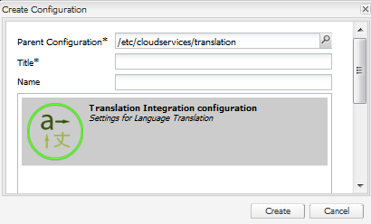
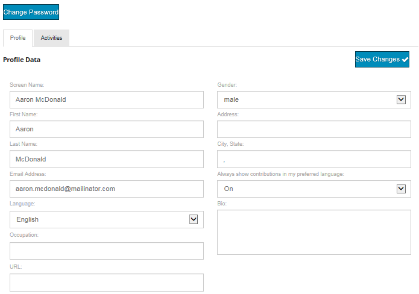

# Übersetzen benutzergenerierter Inhalte {#translating-user-generated-content}

Die Übersetzungsfunktion für Adobe Experience Manager (AEM) Communities erweitert das Konzept der [Übersetzung des Seiteninhalts](../../help/sites-administering/translation.md) auf die benutzergenerierten Inhalte (UGC), die mithilfe von [Social Component Framework (SCF)-Komponenten](scf.md) auf Community-Sites veröffentlicht werden.

Die Übersetzung von UGC ermöglicht es Site-Besuchern und Mitgliedern, durch die Beseitigung von Sprachbarrieren eine globale Community zu erleben.

Beispiel:

* Ein Mitglied aus Frankreich postet ein Rezept in französischer Sprache in das Community-Forum einer multinationalen Kochwebsite.
* Ein anderes japanisches Mitglied verwendet die Übersetzungsfunktion, um die Übersetzung des Rezepts aus dem Französischen ins Japanische Trigger.
* Nachdem das Rezept auf Japanisch gelesen wurde, veröffentlicht das Mitglied aus Japan einen Kommentar auf Japanisch.
* Das Mitglied aus Frankreich verwendet die Übersetzungsfunktion, um den japanischen Kommentar ins Französische zu übersetzen.
* Globale Kommunikation.

## Überblick {#overview}

In diesem Abschnitt wird insbesondere erläutert, wie der Übersetzungsdienst mit UGC funktioniert. Es wird außerdem davon ausgegangen, dass Sie über Kenntnisse dazu verfügen, wie Sie AEM mit einem [Übersetzungsdienstleister](../../help/sites-administering/translation.md#connectingtoatranslationserviceprovider) verbinden und diesen Dienst in eine Website integrieren können, indem Sie ein [Framework für die Übersetzungsintegration](../../help/sites-administering/tc-tic.md) konfigurieren.

Wenn ein Übersetzungsdienstleister mit der Site verknüpft ist, verwaltet jede Sprachkopie der Site eigene Threads von UGC, die über SCF-Komponenten wie Kommentare veröffentlicht werden.

Wenn eine Übersetzungsintegration zusätzlich zum Übersetzungsdienstleister konfiguriert ist, ist es möglich, dass jede Sprachkopie der Site einen einzigen Thread von UGC gemeinsam nutzt und so eine globale Kommunikation über Sprachkopien hinweg ermöglicht. Anstelle eines Diskussionsthreads, der nach Sprache getrennt ist, ermöglicht der konfigurierte globale gemeinsame Speicher [1, den gesamten Thread unabhängig davon sichtbar zu machen, von welcher Sprachkopie er angezeigt wird. ](#global-translation-of-ugc) Außerdem können mehrere Konfigurationen für die Integration von Übersetzungen konfiguriert werden, die verschiedene globale gemeinsame Stores für eine logische Gruppierung globaler Teilnehmer angeben, z. B. nach Regionen.

## Standardübersetzungsdienst {#the-default-translation-service}

AEM Communities enthält eine [Testlizenz](../../help/sites-administering/tc-msconf.md#microsoft-translator-trial-license) für einen [standardmäßigen Übersetzungsdienst](../../help/sites-administering/tc-msconf.md), der für mehrere Sprachen aktiviert ist.

Wenn [ eine Community-Site erstellt, wird der standardmäßige Übersetzungsdienst aktiviert, wenn `Allow Machine Translation` im Unterbereich [ÜBERSETZUNG](sites-console.md#translation) aktiviert ist.](sites-console.md)

>[!CAUTION]
>
>Der standardmäßige Übersetzungsdienst dient nur zur Veranschaulichung.
>
>Für ein Produktionssystem ist ein lizenzierter Übersetzungsdienst erforderlich. Wenn keine Lizenz erteilt wurde, sollte der standardmäßige Übersetzungsdienst [deaktiviert](../../help/sites-administering/tc-msconf.md#microsoft-translator-trial-license-geometrixx-outdoors) sein.

## Globale Übersetzung von UGC {#global-translation-of-ugc}

Wenn eine Website über mehrere [Sprachkopien](../../help/sites-administering/tc-prep.md) verfügt, erkennt der standardmäßige Übersetzungsdienst nicht, dass auf einer Site eingegebene benutzergenerierte Inhalte mit in einer anderen Site eingegebenen benutzergenerierten Inhalten in Verbindung stehen können. Dies trifft zu, wenn die benutzergenerierte Inhalte von derselben Komponente generiert werden (die Sprachkopie der Seite, die die Komponente enthält).

Es ähnelt Gruppen von Menschen, die ein Thema diskutieren. Sie kennen keine Kommentare, die in anderen Gruppen als ihren eigenen gemacht werden, im Vergleich zu allen in einer großen Gruppe, die an einem Gespräch teilnimmt.

Wenn &quot;eine Gruppenkonversation&quot;gewünscht wird, ist es möglich, eine globale Übersetzung auf einer Website mit mehreren Sprachkopien zu aktivieren, sodass der gesamte Thread unabhängig davon sichtbar ist, von welcher Sprachkopie er angezeigt wird.

Wenn beispielsweise ein Forum auf der Basis-Site eingerichtet wurde, Sprachkopien erstellt wurden und die globale Übersetzung aktiviert wurde, wird ein im Forum gepostetes Thema, das in einer Sprachkopie erstellt wurde, in allen Sprachkopien angezeigt. Dasselbe gilt für alle Antworten, unabhängig davon, von welcher Sprachkopie die Antwort eingegeben wurde. Das Ergebnis wäre, dass das Thema und der gesamte Thread mit Antworten sichtbar wären, unabhängig davon, von welcher Sprachkopie das Thema angezeigt wird.

>[!CAUTION]
>
>Alle UGC, die vor der globalen Übersetzung existierten, sind nicht mehr sichtbar.
>
>Während sich das UGC noch im [gemeinsamen Speicher](working-with-srp.md) befindet, befindet es sich unter dem sprachspezifischen UGC-Speicherort, während neue Inhalte, die nach der Konfiguration der globalen Übersetzung hinzugefügt wurden, vom globalen freigegebenen Speicherort abgerufen werden.
>
>Es gibt kein Migrationstool zum Verschieben oder Zusammenführen sprachspezifischer Inhalte in den globalen freigegebenen Speicher.

### Konfiguration für Übersetzungsintegration {#translation-integration-configuration}

So erstellen Sie eine Übersetzungsintegration, die einen Connector für Übersetzungsdienst mit der Website in der Autoreninstanz integriert:

* Als Administrator anmelden
* Aus dem [Hauptmenü](http://localhost:4502/)
* Wählen Sie **[!UICONTROL Tools]**
* Wählen Sie **[!UICONTROL Vorgänge]** aus
* Auswählen von **[!UICONTROL Cloud]**
* Auswählen von **[!UICONTROL Cloud Services]**
* Scrollen Sie nach unten zu **[!UICONTROL Übersetzungsintegration]**

  

* Wählen Sie **[!UICONTROL Konfigurationen anzeigen]** aus.

  

* Wählen Sie das Symbol `[+]` neben **[!UICONTROL Verfügbare Konfigurationen]** aus, damit Sie eine Konfiguration erstellen können.

#### Dialogfeld &quot;Konfiguration erstellen&quot; {#create-configuration-dialog}

* **[!UICONTROL Übergeordnete Konfiguration]**

  (Erforderlich) Lassen Sie in der Regel als Standard. Der Standardwert ist `/etc/cloudservices/translation`.

* **[!UICONTROL Titel]**

  (Erforderlich) Geben Sie einen Anzeigetitel Ihrer Wahl ein. Kein Standardwert.

* **[!UICONTROL Name]**

  (Optional) Geben Sie einen Namen für die Konfiguration ein. Der Standardwert ist ein Knotenname, der auf dem Titel basiert.

* Wählen Sie **[!UICONTROL Erstellen]** aus

#### Dialogfeld &quot;Übersetzungskonfiguration&quot; {#translation-config-dialog}

Detaillierte Anweisungen finden Sie unter [Erstellen einer Konfiguration für die Übersetzungsintegration](../../help/sites-administering/tc-tic.md#creating-a-translation-integration-configuration).

* Registerkarte **[!UICONTROL Sites]**: kann als Standard beibehalten werden.

* Registerkarte **[!UICONTROL Communities]**:
   * **[!UICONTROL Übersetzungsanbieter]**
Wählen Sie den Übersetzungsanbieter aus der Dropdownliste aus. Der Standardwert ist `microsoft`, der Testdienst.

   * **[!UICONTROL Inhaltskategorie]**
Wählen Sie eine Kategorie aus, die den zu übersetzenden Inhalt beschreibt. Der Standardwert ist `General.`

   * **[!UICONTROL Gebietsschema auswählen..]**
(Optional) Durch Auswahl eines Gebietsschemas zum Speichern von benutzergenerierten Inhalten werden Beiträge aus allen Sprachkopien in einer globalen Konversation angezeigt. Standardmäßig wählen Sie das Gebietsschema für die [Basissprache](sites-console.md#translation) für die Website. Bei Auswahl von `No Common Store` wird die globale Übersetzung deaktiviert. Standardmäßig ist die globale Übersetzung deaktiviert.

* Registerkarte **[!UICONTROL Assets]**: kann als Standard beibehalten werden.
* Wählen Sie **[!UICONTROL OK]** aus.

#### Aktivierung {#activation}

Der neue Cloud-Dienst für die Übersetzungsintegration muss in der Publish-Umgebung aktiviert werden. Wenn sie einer Website zugeordnet ist und noch nicht aktiviert ist, wird der Aktivierungsarbeitsablauf aufgefordert, diese Cloud-Service-Konfiguration zu veröffentlichen, wenn die Seite, mit der sie verknüpft ist, veröffentlicht wird.

## Verwalten von Übersetzungseinstellungen {#managing-translation-settings}

>[!NOTE]
>
>**Bevorzugte Sprache**
>
>Wenn Sie feststellen, ob der Beitrag in einer anderen Sprache als der bevorzugten Sprache verfasst ist, muss die bevorzugte Sprache des Site-Besuchers festgelegt werden.
>
>Die bevorzugte Sprache ist die Sprachvoreinstellung, die in einem Benutzerprofil festgelegt wird, wenn der Site-Besucher angemeldet ist und eine Spracheinstellung festgelegt hat.
>
>Wenn der Besucher der Site anonym ist oder keine Spracheinstellung in seinem Profil angegeben hat, ist die bevorzugte Sprache die Basissprache der Seitenvorlage.

### Benutzerpräferenz {#user-preference}

#### Benutzerprofil {#user-profile}

Alle Communities-Sites bieten ein Benutzerprofil, das angemeldete Mitglieder bearbeiten können, um sich selbst für die Community zu identifizieren und ihre Voreinstellungen festzulegen.

Eine dieser Einstellungen ist, ob Community-Inhalte immer in ihrer bevorzugten Sprache angezeigt werden sollen. Standardmäßig ist die Einstellung nicht festgelegt und standardmäßig auf die Systemeinstellung festgelegt. Der Benutzer kann die Einstellung entweder auf Ein oder Aus ändern, um die Systemeinstellung zu überschreiben.

Wenn Seiten automatisch in die bevorzugte Sprache des Benutzers übersetzt werden, wird die Benutzeroberfläche für die Anzeige des Originaltextes und die Verbesserung der Übersetzung weiterhin zur Verfügung gestellt.

### Community-Site-Einstellung {#community-site-setting}

Wenn eine Community-Site erstellt wird, kann die Übersetzungsoption aktiviert und konfiguriert werden. Die Übersetzungseinstellung gilt für Inhalte, die anonyme Site-Besucher anzeigen können, wird jedoch durch die Profileinstellung des Benutzers überschrieben.
