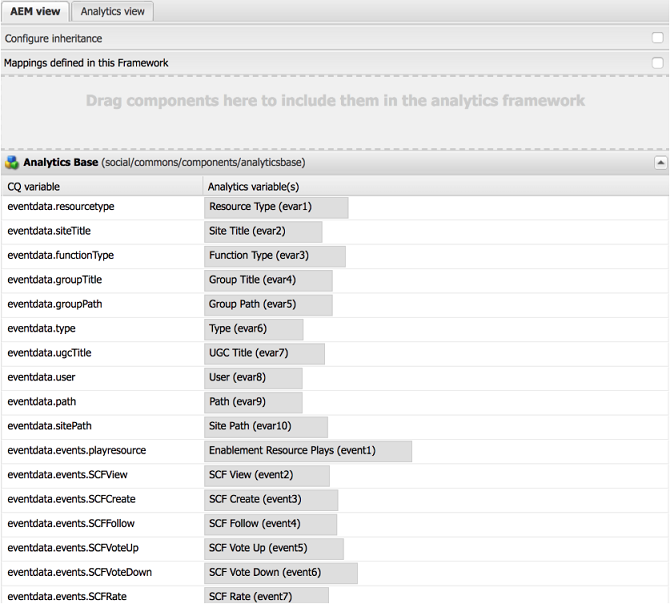

# User and UGC Management Service in AEM Communities {#user-and-ugc-management-service-in-aem-communities}

>[!IMPORTANT]
>
>Die DSGVO wird in den folgenden Abschnitten als Beispiel verwendet, die behandelten Details gelten jedoch für alle Datenschutzbestimmungen wie die DSGVO, den CCPA usw.

AEM Communities stellt vorkonfigurierte APIs zum Verwalten von Benutzerprofilen und zum Massenverwalten von benutzergenerierten Inhalten bereit. Nach der Aktivierung ermöglicht **UserUgcManagement**-Service den privilegierten Benutzern (Community-Administratoren und -Moderatoren), Benutzerprofile zu deaktivieren und benutzergenerierten Inhalt für bestimmte Benutzer per Massenlöschung oder Massenexport zu löschen. Diese APIs ermöglichen es Verantwortlichen und Auftragsverarbeitern außerdem, die Datenschutz-Grundverordnung (DSGVO) der Europäischen Union und andere DSGVO-bezogene Datenschutzbestimmungen einzuhalten.

Weitere Informationen finden Sie auf der [DSGVO-Seite im Adobe Privacy Center.](https://www.adobe.com/de/privacy/general-data-protection-regulation.html)

>[!NOTE]
>
>Wenn Sie [Adobe Analytics auf der AEM Communities](/help/communities/analytics.md)-Site konfiguriert haben, werden die erfassten Benutzerdaten an Adobe Analytics-Server gesendet. Adobe Analytics bietet APIs, mit denen Sie auf Benutzerdaten zugreifen, diese exportieren und löschen und die DSGVO einhalten können. Weitere Informationen finden Sie unter [Senden von Zugriffs- und Löschanfragen](https://experienceleague.adobe.com/docs/analytics/admin/data-governance/gdpr-submit-access-delete.html?lang=de).

Um diese APIs verwenden zu können, müssen Sie den `/services/social/ugcmanagement`-Endpunkt aktivieren, indem Sie den UserUgcManagement-Service aktivieren. Um diesen Service zu aktivieren, installieren Sie das [Beispiel-Servlet](https://github.com/Adobe-Marketing-Cloud/aem-communities-ugc-migration/tree/main/bundles/communities-ugc-management-servlet), das auf [GitHub.com](https://github.com/Adobe-Marketing-Cloud/aem-communities-ugc-migration/tree/main/bundles/communities-ugc-management-servlet) verfügbar ist. Rufen Sie dann den Endpunkt in der Veröffentlichungsinstanz Ihrer Communities-Site mit entsprechenden Parametern mithilfe einer HTTP-Anfrage auf, ähnlich wie in:

`https://localhost:port/services/social/ugcmanagement?user=<authorizable ID>&operation=<getUgc>`. Sie können jedoch auch eine Benutzeroberfläche (Benutzeroberfläche) zum Verwalten von Benutzerprofilen und benutzergenerierten Inhalten im System erstellen.

Diese APIs ermöglichen die Ausführung der folgenden Funktionen.

## Abrufen des benutzergenerierten Inhalts einer Benutzerin oder eines Benutzers {#retrieve-the-ugc-of-a-user}

**getUserUgc(ResourceResolver, ResourceResolver, String user, OutputStream)** hilft beim Exportieren des gesamten UGC eines Benutzers aus dem System.

* **user**: Autorisierbare ID eines Benutzers.
* **outputStream**: Das Ergebnis wird als Ausgabe-Stream zurückgegeben, bei dem es sich um eine ZIP-Datei handelt, die den vom Benutzer generierten Inhalt (als JSON-Datei) und Anhänge (einschließlich der vom Benutzer hochgeladenen Bilder oder Videos) enthält.

Um beispielsweise den benutzergenerierten Inhalt (UGC) eines Benutzers mit dem Namen Weston McCall zu exportieren, der weston.mccall@dodgit.com als autorisierbare ID verwendet, um sich bei der Communities-Site anzumelden, können Sie eine HTTP-GET-Anfrage ähnlich der folgenden senden:

`https://localhost:port/services/social/ugcmanagement?user=weston.mccall@dodgit.com&operation=getUgc`

## Löschen des benutzergenerierten Inhalts eines Benutzers {#delete-the-ugc-of-a-user}

**deleteUserUgc(ResourceResolver, String user)** hilft beim Löschen des gesamten UGC für einen Benutzer aus dem System.

* **user**: Autorisierbare ID des Benutzers.

Um beispielsweise den UGC eines Benutzers zu löschen, dessen autorisierbare ID über eine HTTP-POST-Anfrage `weston.mccall@dodgit.com` wird, verwenden Sie die folgenden Parameter:

* Benutzer = `weston.mccall@dodgit.com`
* operation = `deleteUgc`

### Löschen von benutzergenerierten Inhalten aus Adobe Analytics {#delete-ugc-from-adobe-analytics}

Um Benutzerdaten aus der Adobe Analytics zu löschen, befolgen Sie den [DSGVO-Analytics-Workflow](https://experienceleague.adobe.com/docs/analytics/admin/data-governance/an-gdpr-workflow.html?lang=de) da die API Benutzerdaten nicht aus Adobe Analytics löscht.

Die von AEM Communities verwendeten Adobe Analytics-Variablenzuordnungen werden in der folgenden Abbildung dargestellt:

## Deaktivieren von Benutzerkonten {#disable-a-user-account}

**deleteUserAccount(ResourceResolver, String user)** hilft beim Deaktivieren eines Benutzerkontos.

* **user**: Autorisierbare ID des Benutzers.

>[!NOTE]
>
>Durch Deaktivieren eines Benutzers werden alle benutzergenerierten Inhalte gelöscht, die der Benutzer auf dem Server hat.

Um beispielsweise das Profil eines Benutzers zu löschen, dessen autorisierbare ID über eine HTTP-POST-Anfrage `weston.mccall@dodgit.com` wird, verwenden Sie die folgenden Parameter:

* Benutzer = `weston.mccall@dodgit.com`
* operation = `deleteUser`

>[!NOTE]
>
>Die `deleteUserAccount()`-API deaktiviert nur ein Benutzerprofil im System und entfernt den benutzergenerierten Inhalt. Um jedoch ein Benutzerprofil aus dem System zu löschen, navigieren Sie zu **CRXDE Lite** unter `https://<server>:<port>/crx/de`, suchen Sie den Benutzerknoten und löschen Sie ihn.
