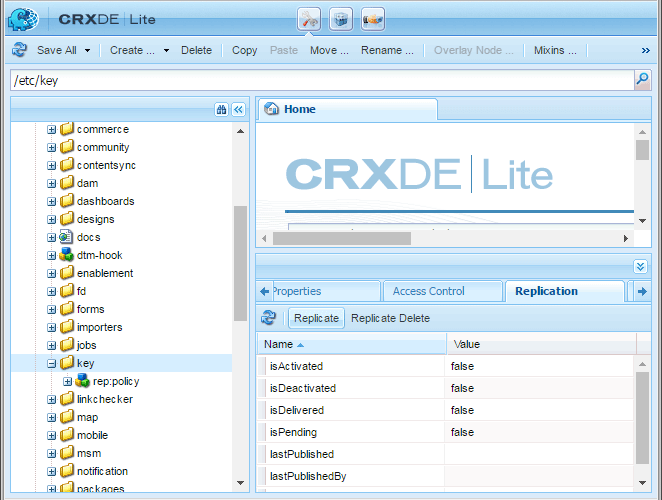

# Bereitstellen von Communities{#deploying-communities}

## Voraussetzungen {#prerequisites}

* [AEM 6.5 Platform](/help/sites-deploying/deploy.md)

* AEM Communities-Lizenz

* Optionale Lizenzen für:

   * [Adobe Analytics für Communities-Funktionen](/help/communities/analytics.md)
   * [MongoDB für MSRP](/help/communities/msrp.md)
   * [Adobe Cloud für ASRP](/help/communities/asrp.md)

## Checkliste für die Installation {#installation-checklist}

**Für die [AEM Plattform](/help/sites-deploying/deploy.md#what-is-aem)**:

* Installieren Sie die neuesten [AEM 6.5 Updates](#aem64updates).

* Wenn Sie nicht die Standardanschlüsse (4502, 4503) verwenden, konfigurieren Sie [Replikationsagenten](#replication-agents-on-author).
* [Replizieren des Verschlüsselungsschlüssels](#replicate-the-crypto-key)
* Wenn die Globalisierung unterstützt wird, richten [die automatisierte Übersetzung ein](/help/sites-administering/translation.md)
(Beispiel-Setup wird für die Entwicklung bereitgestellt).

**Für die Funktion [Communities](/help/communities/overview.md)**:

* Bei der Bereitstellung einer [Veröffentlichungsfarm](/help/sites-deploying/recommended-deploys.md#tarmk-farm): [ den primären Herausgeber identifizieren](#primary-publisher)

* [Tunneldienst aktivieren](#tunnel-service-on-author)
* [Social-Anmeldung aktivieren](/help/communities/social-login.md#adobe-granite-oauth-authentication-handler)
* [Konfigurieren von Adobe Analytics](/help/communities/analytics.md)
* Einrichten eines [standardmäßigen E-Mail-Diensts](/help/communities/email.md)
* Identifizieren Sie die Auswahl für [freigegebenen UGC-Speicher](/help/communities/working-with-srp.md) (**SRP**).

   * Wenn MongoDB SRP [(MSRP)](/help/communities/msrp.md)

      * [MongoDB installieren und konfigurieren](/help/communities/msrp.md#mongodb-configuration)
      * [Solr konfigurieren](/help/communities/solr.md)
      * [MSRP auswählen](/help/communities/srp-config.md)

   * Wenn relationale Datenbank SRP [ (DSRP)](/help/communities/dsrp.md)

      * [JDBC-Treiber für MySQL installieren](#jdbc-driver-for-mysql)
      * [MySQL für DSRP installieren und konfigurieren](/help/communities/dsrp-mysql.md)
      * [Solr konfigurieren](/help/communities/solr.md)
      * [DSRP auswählen](/help/communities/srp-config.md)

   * Wenn Adobe SRP [(ASRP)](/help/communities/asrp.md)

      * Wenden Sie sich zur Bereitstellung an Ihren Kundenbetreuer.
      * [ASRP auswählen](/help/communities/srp-config.md)

   * Wenn JCR SRP [(JSRP)](/help/communities/jsrp.md)

      * Kein freigegebener UGC-Speicher (benutzergenerierter Inhalt):

         * UGC wird nie repliziert.
         * UGC ist nur auf einer AEM Instanz oder einem Cluster sichtbar, in dem sie eingegeben wurde.

      * Die Standardeinstellung ist JSRP


## Neueste Versionen {#latest-releases}

AEM 6.5 Communities GA umfasst Communities-Pakete. Weitere Informationen zu Updates für AEM 6.5 [Communities](/help/release-notes/release-notes.md#experiencemanagercommunities) finden Sie unter [AEM 6.5 Versionshinweise](/help/release-notes/release-notes.md#communities-release-notes.html).

### AEM 6.5 Updates {#aem-updates}

Ab AEM 6.4 werden Aktualisierungen an Communities als Teil von AEM Cumulative Fix Packs und Service Packs bereitgestellt.

Die neuesten Aktualisierungen für AEM 6.5 finden Sie unter [Adobe Experience Manager 6.4 Cumulative Fix Packs and Service Packs](https://helpx.adobe.com/de/experience-manager/aem-releases-updates.html).

### Versionsverlauf {#version-history}

Wie AEM 6.4 und höher sind AEM Communities-Funktionen und Hotfixes Teil von AEM Communities Cumulative Fix Packs und Service Packs. Es gibt daher keine separaten Feature Packs.

### JDBC-Treiber für MySQL {#jdbc-driver-for-mysql}

Eine Communities-Funktion verwendet eine MySQL-Datenbank:

* Für [DSRP](/help/communities/dsrp.md): UGC speichern

Der MySQL-Connector muss separat abgerufen und installiert werden.

Die erforderlichen Schritte sind:

1. Laden Sie das ZIP-Archiv von [https://dev.mysql.com/downloads/connector/j/](https://dev.mysql.com/downloads/connector/j/) herunter.

   * Die Version muss >= 5.1.38 sein.

1. Extract `mysql-connector-java-&lt;version&gt;-bin.jar (bundle) from the archive`
1. Verwenden Sie die Web-Konsole, um das Bundle zu installieren und zu starten:

   * Beispiel: https://localhost:4502/system/console/bundles
   * Klicken Sie auf **`Install/Update`**
   * Durchsuchen... , um das aus dem heruntergeladenen ZIP-Archiv extrahierte Bundle auszuwählen.
   * Überprüfen Sie, ob der JDBC-Treiber der *Oracle Corporation für MySQLcom.mysql.jdbc* aktiv ist, und starten Sie ihn gegebenenfalls (oder überprüfen Sie die Protokolle).

1. Wenn Sie nach der Konfiguration von JDBC in einer vorhandenen Bereitstellung installieren, binden Sie JDBC erneut an den neuen Connector, indem Sie die JDBC-Konfiguration von der Web-Konsole aus erneut speichern:

   * Beispiel: https://localhost:4502/system/console/configMgr
   * Suchen Sie die Konfiguration `Day Commons JDBC Connections Pool` und wählen Sie aus, um die Konfiguration zu öffnen.
   * Wählen Sie `Save`.

1. Wiederholen Sie die Schritte 3 und 4 für alle Autoren- und Veröffentlichungsinstanzen.

Weitere Informationen zum Installieren von Bundles finden Sie auf der Seite [Web-Konsole](/help/sites-deploying/web-console.md#bundles) .

#### Beispiel : MySQL Connector-Bundle installiert {#example-installed-mysql-connector-bundle}


### AEM erweiterte MLS {#aem-advanced-mls}

Damit die SRP-Sammlung (MSRP oder DSRP) erweiterte mehrsprachige Suche (MLS) unterstützen kann, sind zusätzlich zu einem benutzerdefinierten Schema und einer Solr-Konfiguration neue Solr-Plug-ins erforderlich. Alle erforderlichen Elemente werden in einer herunterladbaren ZIP-Datei zusammengefasst.

Der erweiterte MLS-Download (auch als &quot;Phasetwo&quot;bezeichnet) ist im Adobe-Repository verfügbar:

* [AEM-SOLR-MLS-phasetwo](https://repo1.maven.org/maven2/com/adobe/tat/AEM-SOLR-MLS-phasetwo/1.2.40/)

   * Version 1.2.40, 6. April 2016
   * AEM-SOLR-MLS-phasetwo-1.2.40.zip herunterladen

Weitere Informationen und Installationsinformationen finden Sie unter [Solr-Konfiguration](/help/communities/solr.md) für SRP.

### Über Links zur Paketfreigabe {#about-links-to-package-share}

**Pakete, die in der Adobe AEM Cloud angezeigt werden**

Die Links zu Paketen auf dieser Seite erfordern keine laufende Instanz von AEM, da sie auf Package Share auf `adobeaemcloud.com` basieren. Während die Pakete sichtbar sind, dient die Schaltfläche `Install` zur Installation der Pakete auf einer Adobe-gehosteten Site. Wenn Sie eine Installation auf einer lokalen AEM-Instanz durchführen möchten, führt die Auswahl von `Install` zu einem Fehler.

**Installieren auf einer lokalen AEM-Instanz**

Um die in `adobeaemcloud.com` sichtbaren Pakete auf einer lokalen AEM zu installieren, muss das Paket zunächst auf eine lokale Festplatte heruntergeladen werden:

* Wählen Sie die Registerkarte **Assets** aus.
* Wählen Sie **Download auf Festplatte** aus.

Verwenden Sie auf der lokalen AEM-Instanz einen Package Manager (z. B. [https://localhost:4502/crx/packmgr/](https://localhost:4502/crx/packmgr/)), um das Package-Repository für die lokale AEM hochzuladen.

Alternativ dazu wird beim Zugriff auf das Paket über Package Share von der lokalen AEM-Instanz aus (z. B. [https://localhost:4502/crx/packageshare/](https://localhost:4502/crx/packageshare/)) die Schaltfläche `Download` in das Package-Repository der lokalen AEM-Instanz heruntergeladen.

Sobald Sie sich im Package-Repository der lokalen AEM-Instanz befinden, installieren Sie das Package mit Package Manager.

Weitere Informationen finden Sie unter [Arbeiten mit Paketen](/help/sites-administering/package-manager.md#package-share).

## Empfohlene Bereitstellungen {#recommended-deployments}

In AEM Communities wird UGC mithilfe eines gemeinsamen Stores gespeichert, der häufig als [Speicherressourcenanbieter (SRP)](/help/communities/working-with-srp.md) bezeichnet wird. Die empfohlene Implementierung konzentriert sich auf die Auswahl einer SRP-Option für den gemeinsamen Speicher.

Der gemeinsame Speicher unterstützt die Moderation von und die Analyse von benutzergenerierten Inhalten in der Veröffentlichungsumgebung, während gleichzeitig keine [Replikation](/help/communities/sync.md) des benutzergenerierten Inhalts mehr erforderlich ist.

* [Community-Inhaltsspeicher](/help/communities/working-with-srp.md) : beschreibt die SRP-Speicheroptionen für AEM Communities

* [Empfohlene Topologien](/help/communities/topologies.md) : beschreibt die je nach Anwendungsfall und SRP-Auswahl zu verwendende Topologie

## Upgrade {#upgrading}

Beim Upgrade von früheren Versionen von AEM auf die AEM 6.5-Plattform ist es wichtig, den Abschnitt [Aktualisieren auf AEM 6.5](/help/sites-deploying/upgrade.md) zu lesen.

Lesen Sie neben der Aktualisierung der Plattform auch den Abschnitt [Aktualisierung auf AEM Communities 6.5](/help/communities/upgrade.md) , um mehr über Communities-Änderungen zu erfahren.

## Konfigurationen {#configurations}

### Primärer Herausgeber {#primary-publisher}

Wenn es sich bei der ausgewählten Bereitstellung um eine [Veröffentlichungsfarm](/help/communities/topologies.md#tarmk-publish-farm) handelt, muss eine AEM Veröffentlichungsinstanz als **`primary publisher`** für Aktivitäten identifiziert werden, die nicht in allen Instanzen auftreten sollten. Beispielsweise Funktionen, die auf **Benachrichtigungen** oder **Adobe Analytics** angewiesen sind.

Standardmäßig ist die OSGi-Konfiguration mit dem Kontrollkästchen **`Primary Publisher`** konfiguriert, sodass alle Veröffentlichungsinstanzen in einer Veröffentlichungsfarm sich selbst als Primär identifizieren.`AEM Communities Publisher Configuration`

Daher ist es erforderlich, die Konfiguration auf allen sekundären Veröffentlichungsinstanzen zu bearbeiten **, um das Kontrollkästchen **`Primary Publisher`**zu deaktivieren.**


Für alle anderen (sekundären) Veröffentlichungsinstanzen in einer Veröffentlichungsfarm :

* Anmelden mit Administratorrechten
* Zugriff auf die [Web-Konsole](/help/sites-deploying/configuring-osgi.md)

   * Beispiel: [https://localhost:4503/system/console/configMgr](https://localhost:4503/system/console/configMgr)

* Suchen Sie den `AEM Communities Publisher Configuration`
* Bearbeiten-Symbol auswählen
* Deaktivieren Sie das Kontrollkästchen **Primär Publisher** .
* Wählen Sie **Speichern** aus

### Replikationsagenten auf der Autoreninstanz {#replication-agents-on-author}

Die Replikation wird für Site-Inhalte verwendet, die in der Veröffentlichungsumgebung erstellt wurden, z. B. Community-Gruppen, und für die Verwaltung von Mitgliedern und Mitgliedergruppen aus der Autorenumgebung mithilfe des [Tunneldienstes](#tunnel-service-on-author).

Stellen Sie für den primären Herausgeber sicher, dass die [Konfiguration des Replikationsagenten](/help/sites-deploying/replication.md) den Veröffentlichungsserver und den autorisierten Benutzer richtig identifiziert. Der standardmäßig autorisierte Benutzer `admin` verfügt bereits über die entsprechenden Berechtigungen (ist Mitglied von `Communities Administrators`).

Damit andere Benutzer über die entsprechenden Berechtigungen verfügen, müssen sie als Mitglied der `administrators`-Benutzergruppe (auch Mitglied von `Communities Administrators`) hinzugefügt werden.

Es gibt zwei Replikationsagenten in der Autorenumgebung, für die die Transportkonfiguration korrekt konfiguriert werden muss.

* Zugriff auf die Replikationskonsole im Autorenmodus

   * Von der globalen Navigation: **Tools, Bereitstellung, Replikation, Agenten für Autor**

* Gehen Sie für beide Agenten genauso vor:

   * **Standardagent (publish)**
   * **Agenten für Rückwärtsreplikation (Veröffentlichungsrückwärts)**

      1. Wählen Sie den Agenten aus.
      1. Wählen Sie **edit** aus.
      1. Wählen Sie die Registerkarte **Transport** aus
      1. Wenn es sich nicht um Port `4503` handelt, bearbeiten Sie den **URI**, um den richtigen Anschluss anzugeben.

      1. Wenn es sich nicht um Benutzer `admin` handelt, bearbeiten Sie die **Benutzer** und das **Kennwort**, um ein Mitglied der Benutzergruppe `administrators` anzugeben.

Die folgenden Abbildungen zeigen die Ergebnisse einer Änderung des Ports von 4503 auf 6103 durch :

#### Standardagent (publish) {#default-agent-publish}


#### Agenten für Rückwärtsreplikation (Rückwärts veröffentlichen) {#reverse-replication-agent-publish-reverse}


### Tunnel-Dienst auf Autoreninstanz {#tunnel-service-on-author}

Wenn Sie die Autorenumgebung zum [Erstellen von Sites](/help/communities/sites-console.md), [Ändern der Site-Eigenschaften](/help/communities/sites-console.md#modifying-site-properties) oder [Verwalten von Community-Mitgliedern](/help/communities/members.md) verwenden, müssen Sie auf Mitglieder (Benutzer) zugreifen, die in der Veröffentlichungsumgebung registriert sind, nicht auf Benutzer, die in der Autorenumgebung registriert sind.

Der Tunneldienst stellt diesen Zugriff mithilfe des Replikationsagenten auf der Autoreninstanz bereit.

So aktivieren Sie den Tunneldienst :

* Melden Sie sich bei **author** mit Administratorrechten an.
* Wenn der Herausgeber nicht localhost:4503 ist oder der Transportbenutzer nicht `admin` ist,
dann [konfigurieren Sie den Replikationsagenten](#replication-agents-on-author).

* Zugriff auf die [Web-Konsole](/help/sites-deploying/configuring-osgi.md)

   * Beispiel: [https://localhost:4502/system/console/configMgr](https://localhost:4502/system/console/configMgr)

* Suchen Sie den `AEM Communities Publish Tunnel Service`
* Bearbeiten-Symbol auswählen
* Aktivieren Sie das Kontrollkästchen **enable** .
* Wählen Sie **Speichern** aus.


### Replizieren des Crypto-Schlüssels {#replicate-the-crypto-key}

Es gibt zwei Funktionen von AEM Communities, für die alle AEM Serverinstanzen dieselben Verschlüsselungsschlüssel verwenden müssen. Dies sind [Analytics](/help/communities/analytics.md) und [ASRP](/help/communities/asrp.md).

Ab AEM 6.3 wird das Schlüsselmaterial im Dateisystem und nicht mehr im Repository gespeichert.

Um das Schlüsselmaterial aus der Autoreninstanz in alle anderen Instanzen zu kopieren, müssen Sie Folgendes tun:

* Greifen Sie auf die AEM-Instanz zu, in der sich normalerweise eine Autoreninstanz befindet, die das zu kopierende Schlüsselmaterial enthält

   * Suchen Sie das Bundle `com.adobe.granite.crypto.file` im lokalen Dateisystem.

     Zum Beispiel:

      * `<author-aem-install-dir>/crx-quickstart/launchpad/felix/bundle21`
      * Die `bundle.info`-Datei identifiziert das Bundle

   * Navigieren zum Datenordner
Beispiel:

      * `<author-aem-install-dir>/crx-quickstart/launchpad/felix/bundle21/data`

   * Kopieren Sie die Dateien hmac und primary .

* Für jede AEM-Instanz

   * Navigieren zum Datenordner
Beispiel:

      * `<publish-aem-install-dir>/crx-quickstart/launchpad/felix/bundle21/data`

   * Fügen Sie die beiden zuvor kopierten Dateien ein.
   * Wenn die Ziel-AEM-Instanz ausgeführt wird, müssen Sie das Granite Crypto Bundle ](#refresh-the-granite-crypto-bundle) aktualisieren.[

>[!CAUTION]
>
>Wenn bereits eine andere Sicherheitsfunktion konfiguriert wurde, die auf den Verschlüsselungsschlüsseln basiert, kann die Replikation der Verschlüsselungsschlüssel die Konfiguration beschädigen. Wenden Sie sich zur Unterstützung an den [Kundendienst](https://experienceleague.adobe.com/?lang=de&amp;support-solution=General&amp;support-tab=home#support).

#### Repository-Replikation {#repository-replication}

Das Schlüsselmaterial, das im Repository gespeichert ist (wie bei AEM 6.2 und früher), kann beibehalten werden. Geben Sie die folgende Systemeigenschaft beim ersten Start jeder AEM-Instanz an (wodurch das anfängliche Repository erstellt wird):

* `-Dcom.adobe.granite.crypto.file.disable=true`

>[!NOTE]
>
>Es ist wichtig zu überprüfen, ob der [Replikationsagent auf der Autoreninstanz](#replication-agents-on-author) korrekt konfiguriert ist.

Wenn das Schlüsselmaterial im Repository gespeichert ist, können Sie den Crypto-Schlüssel vom Autor auf andere Instanzen wie folgt replizieren:

Verwenden von [CRXDE Lite](/help/sites-developing/developing-with-crxde-lite.md) :

* Navigieren Sie zu [https://&lt;Server>:&lt;Port>/crx/de](https://localhost:4502/crx/de).
* Klicken Sie auf `/etc/key`
* Registerkarte `Replication` öffnen
* Klicken Sie auf `Replicate`

* [Aktualisieren des Granite Crypto-Bundles](#refresh-the-granite-crypto-bundle)



#### Aktualisieren des Granite Crypto-Bundles {#refresh-the-granite-crypto-bundle}

* Rufen Sie in jeder Veröffentlichungsinstanz die [Web-Konsole](/help/sites-deploying/configuring-osgi.md) auf.

   * Beispiel: [https://&lt;Server>:&lt;Port>/system/console/bundles](https://localhost:4503/system/console/bundles)

* Suchen Sie das Bundle `Adobe Granite Crypto Support` (com.adobe.granite.crypto).
* Wählen Sie **Aktualisieren**


* Nach einem Augenblick sollte ein Dialogfeld &quot;**Erfolg**&quot; angezeigt werden:
  `Operation completed successfully.`

### Apache HTTP Server {#apache-http-server}

Stellen Sie bei Verwendung des Apache HTTP-Servers sicher, dass Sie den richtigen Servernamen für alle relevanten Einträge verwenden.

Achten Sie insbesondere darauf, in den `RedirectMatch` den richtigen Servernamen zu verwenden, nicht &quot;`localhost`&quot;.

#### Beispiel für httpd.conf {#httpd-conf-sample}

```shell
<IfModule alias_module>
     # XAMPP does not have a favicon; this prevents any 404 errors which may arise.
     Redirect 404 /favicon.ico
     <Location /favicon.ico>
         ErrorDocument 404 "No favicon"
     </Location>

    # Return from "Sign Out" generates response header directing you to "/", generating a 404 error
    # The RedirectMatch resolves it correctly when modified for the target Community Site :
    RedirectMatch ^/$ https://[server name]/content/sites/engage/en.html
 ...
 </IfModule>
```

### Dispatcher {#dispatcher}

Informationen zur Verwendung einer Dispatcher finden Sie unter :

* AEM der Dokumentation zu [Dispatcher](https://experienceleague.adobe.com/docs/experience-manager-dispatcher/using/dispatcher.html?lang=de)
* [Installieren des Dispatchers](https://experienceleague.adobe.com/docs/experience-manager-dispatcher/using/getting-started/dispatcher-install.html?lang=de)
* [Konfigurieren von Dispatcher für Communities](/help/communities/dispatcher.md)
* [Bekannte Probleme](/help/communities/troubleshooting.md#dispatcher-refetch-fails)

## Verwandte Communities - Dokumentation {#related-communities-documentation}

* Unter [Verwalten von Communities-Sites](/help/communities/administer-landing.md) erfahren Sie mehr über die Erstellung einer Community-Site, die Konfiguration von Community-Site-Vorlagen, die Moderation von Community-Inhalten, die Verwaltung von Mitgliedern und die Konfiguration von Messaging.

* Besuchen Sie [Entwickeln von Communities](/help/communities/communities.md) , wo Sie mehr über das Social-Komponenten-Framework (SCF) und die Anpassung von Communities-Komponenten und -Funktionen erfahren.

* Besuchen Sie [Authoring von Communities-Komponenten](/help/communities/author-communities.md) , wo Sie erfahren können, wie Sie Communities-Komponenten erstellen und konfigurieren.

