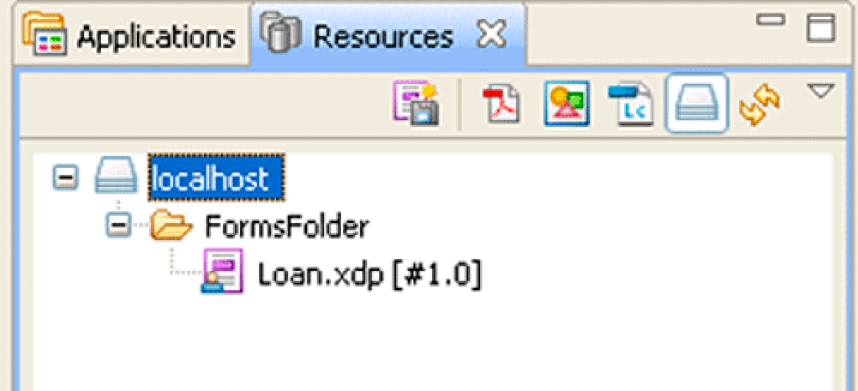

# Arbeiten mit AEM Forms Repository {#working-with-aem-forms-repository}

**Beispiele und Beispiele in diesem Dokument gelten nur für die AEM Forms on JEE-Umgebung.**

**Über den Repository-Dienst**

Der Repository-Dienst stellt Dienste zur Ressourcenspeicherung und -verwaltung für AEM Forms bereit. Wenn Entwickler eine *AEM Forms*-Anwendung erstellen, können sie die Assets im Repository anstatt im Dateisystem bereitstellen. Die Elemente können alle Typen von Zusätzen umfassen, darunter XML-Formulare, PDF-Formulare (einschließlich Acrobat-Formularen), Formularfragmente, Bilder, Profile, Richtlinien, SWF-Dateien, DDX-Dateien, XML-Schemas, WSDL-Dateien und Testdaten.

Betrachten Sie beispielsweise die folgende Forms-Anwendung mit dem Namen *Applications/FormsApplication*:

Beachten Sie, dass sich im FormsFolder eine Datei mit dem Namen &quot;Loan.xdp&quot;befindet. Um auf diesen Formularentwurf zuzugreifen, geben Sie den vollständigen Pfad an (einschließlich der Version): `Applications/FormsApplication/1.0/FormsFolder/Loan.xdp`.

>[!NOTE]
>
>Informationen zum Erstellen einer Forms-Anwendung mit Workbench finden Sie unter [Workbench Help](https://www.adobe.com/go/learn_aemforms_workbench_63).

Der Pfad zu einer Ressource im AEM Forms-Repository lautet:

`Applications/Application-name/Application-version/Folder.../Filename`

Die folgenden Werte zeigen einige Beispiele für URI-Werte:

* Applications/AppraisalReport/1.0/Forms/FullForm.xdp
* Applications/AnotherApp/1.1/Assets/picture.jpg
* Applications/SomeApp/2.0/Resources/Data/XSDs/MyData.xsd

>[!NOTE]
>
>Sie können das AEM Forms-Repository mithilfe eines Webbrowsers durchsuchen. Um das Repository zu durchsuchen, geben Sie die folgende URL in einen Webbrowser `https://[server name]:[server port]/repository` ein. Mithilfe eines Webbrowsers können Sie die Schnellstartergebnisse überprüfen, die mit dem Abschnitt Arbeiten mit dem AEM Forms-Repository verknüpft sind. Wenn Sie beispielsweise Inhalte zum AEM Forms-Repository hinzufügen, können Sie den Inhalt in einem Webbrowser anzeigen. (Siehe [Schnellstart (SOAP-Modus): Schreiben einer Ressource mit der Java-API](/help/forms/developing/repository-service-api-quick-starts.md#quick-start-soap-mode-writing-a-resource-using-the-java-api).)

Die Repository-API bietet eine Reihe von Vorgängen, mit denen Sie Informationen aus dem Repository speichern und abrufen können. Beispielsweise können Sie eine Liste von Ressourcen abrufen oder spezifische Ressourcen abrufen, die im Repository gespeichert sind, wenn eine Ressource im Rahmen der Verarbeitung einer Anwendung benötigt wird.

>[!NOTE]
>
>Die Repository-API kann nicht für die Interaktion mit Content Services (nicht mehr unterstützt) verwendet werden. Um mit Content Services (nicht mehr unterstützt) zu interagieren, verwenden Sie die Document Management-API.

Mithilfe der Repository-Dienst-API können Sie die folgenden Aufgaben ausführen:

* Erstellen von Ordnern. Siehe [Erstellen von Ordnern](aem-forms-repository.md#creating-folders).
* Schreiben Sie Ressourcen und ihre Eigenschaften. Siehe [Schreibressourcen](aem-forms-repository.md#writing-resources).
* Auflisten von Ressourcen in einer bestimmten Sammlung oder im Zusammenhang mit anderen Ressourcen Siehe [Auflisten von Ressourcen](aem-forms-repository.md#listing-resources).
* Lesen Sie Ressourcen und ihre Eigenschaften. Siehe [Lesen von Ressourcen](aem-forms-repository.md#reading-resources).
* Aktualisieren Sie die Ressourcen und ihre Eigenschaften. Siehe [Aktualisieren von Ressourcen](aem-forms-repository.md#updating-resources).
* Suchen Sie nach Ressourcen, einschließlich ihres Verlaufs, der zugehörigen Ressourcen und Eigenschaften. Siehe [Suchen nach Ressourcen](aem-forms-repository.md#searching-for-resources).
* Geben Sie Beziehungen zwischen Ressourcen an. Siehe [Erstellen von Ressourcenbeziehungen](aem-forms-repository.md#creating-resource-relationships).
* Verwalten Sie die Zugriffskontrolle für Ressourcen, einschließlich Sperren und Entsperren von Ressourcen sowie Lesen und Schreiben von Zugriffssteuerungslisten (ACLs). Siehe [Sperren von Ressourcen](aem-forms-repository.md#locking-resources).
* Löschen Sie Ressourcen und ihre Eigenschaften. Siehe [Löschen von Ressourcen](aem-forms-repository.md#deleting-resources).

>[!NOTE]
>
>Mithilfe der Repository-API können Sie die Zugriffskontrolle auf Ressourcen nicht verwalten, nach Ressourcen suchen oder mithilfe eines ECM-Repositorys Ressourcenbeziehungen angeben.

>[!NOTE]
>
>Wenn eine verschlüsselte PDF-Datei in das Repository geschrieben wird, kann die automatisierte Beziehungsextraktionsfunktion nicht verwendet werden. Andernfalls kann eine verschlüsselte PDF-Datei im Repository gespeichert und später abgerufen werden. Der Abruf kann wählen, ob die PDF-Datei entschlüsselt werden soll, nachdem sie aus dem Repository abgerufen wurde.

>[!NOTE]
>
>Weitere Informationen zum Repository-Dienst finden Sie unter [Dienstreferenz für AEM Forms](https://www.adobe.com/go/learn_aemforms_services_63).

## Erstellen von Ordnern {#creating-folders}

Ordner (Ressourcensammlungen) werden zum Speichern von Objekten (Dateien oder Ressourcen) in organisierten Gruppierungen verwendet. Ordner können Ressourcen und andere Ordner enthalten, die auch als Unterordner bezeichnet werden. Ressourcen können jeweils nur in einem Ordner gespeichert werden.

Dateien erben Zugriffssteuerungslisten (ACLs) aus Ordnern, und Unterordner erben ACLs von ihren übergeordneten Ordnern. Daher müssen die übergeordneten Ordner vorhanden sein, bevor Sie untergeordnete Ordner erstellen können. Mit der IDE können Sie nur auf Ordner-für-Ordner-Basis interagieren, nicht auf Datei-für-Datei-Basis. Sie können keine Versionsordner verändern, und dies ist nicht erforderlich. ein Ordner selbst keine Daten enthält. Stattdessen handelt es sich lediglich um einen Container für Ressourcen, die Daten enthalten. Die standardmäßige ACL ist eine Berechtigung auf Systemebene. Das bedeutet, dass Benutzer über Berechtigungen auf Systemebene (Lesen, Schreiben, Durchlaufen, Verwalten von ACLs) verfügen müssen, bis ihnen jemand Berechtigungen für einen bestimmten Ordner erteilt. ACLs funktionieren nur in der IDE.

>[!NOTE]
>
>Weitere Informationen zum Repository-Dienst finden Sie unter [Dienstreferenz für AEM Forms](https://www.adobe.com/go/learn_aemforms_services_63).

### Zusammenfassung der Schritte {#summary-of-steps}

Gehen Sie wie folgt vor, um einen Ordner zu erstellen:

1. Projektdateien einschließen.
1. Erstellen Sie den Service-Client.
1. Erstellen Sie den Ordner.
1. Schreiben Sie den Ordner in das Repository.

**Projektdateien einschließen**

Schließen Sie die erforderlichen Dateien in Ihr Entwicklungsprojekt ein. Wenn Sie eine Clientanwendung mit Java erstellen, schließen Sie die erforderlichen JAR-Dateien ein. Wenn Sie Webdienste verwenden, schließen Sie die Proxy-Dateien ein.

**Dienstclient erstellen**

Bevor Sie eine Ressourcensammlung programmgesteuert erstellen können, müssen Sie eine Verbindung herstellen und Anmeldeinformationen angeben. Dies wird durch Erstellen eines Service-Clients erreicht.

**Erstellen Sie den Ordner**

Rufen Sie die Methode des Repository-Dienstes auf, um die Ressourcenerfassung zu erstellen und die Ressourcenerfassung mit identifizierenden Informationen, einschließlich UUID, Ordnername und Beschreibung, zu füllen.

**Den Ordner in das Repository schreiben**

Rufen Sie die Methode des Repository-Dienstes auf, um die Ressourcenerfassung zu schreiben und den URI des Zielordners anzugeben.

**Siehe auch**

[Erstellen von Ordnern mit der Java-API](aem-forms-repository.md#create-folders-using-the-java-api)

[Erstellen von Ordnern mit der Webdienst-API](aem-forms-repository.md#create-folders-using-the-web-service-api)

[Einbeziehung von AEM Forms Java-Bibliotheksdateien](/help/forms/developing/invoking-aem-forms-using-java.md#including-aem-forms-java-library-files)

[Verbindungseigenschaften festlegen](/help/forms/developing/invoking-aem-forms-using-java.md#setting-connection-properties)

[Schnellstarts zur Repository Service-API](/help/forms/developing/repository-service-api-quick-starts.md#repository-service-api-quick-starts)

### Erstellen von Ordnern mit der Java-API {#create-folders-using-the-java-api}

Erstellen Sie mithilfe der Repository Service-API (Java) einen Ordner:

1. Projektdateien einschließen

   Fügen Sie Projektdateien in den Klassenpfad Ihres Java-Projekts ein.

1. Dienstclient erstellen

   Erstellen Sie ein `ResourceRepositoryClient` -Objekt, indem Sie seinen Konstruktor verwenden und ein `ServiceClientFactory` -Objekt übergeben, das Verbindungseigenschaften enthält.

1. Erstellen Sie den Ordner

   Um eine Ressourcensammlung zu erstellen, müssen Sie zunächst ein `com.adobe.repository.infomodel.bean.RepositoryInfomodelFactoryBean` -Objekt erstellen.

   Rufen Sie die `newResourceCollection` -Methode des Objekts `repositoryInfomodelFactoryBean` auf und übergeben Sie die folgenden Parameter:

   * Eine `com.adobe.repository.infomodel.Id` UUID-Kennung, die der Ressource zugewiesen werden soll.
   * Eine `com.adobe.repository.infomodel.Lid` UUID-Kennung, die der Ressource zugewiesen werden soll.
   * Ein `java.lang.String` , der den Namen der Ressourcensammlung enthält. Beispiel: `FormsFolder`.

   Die Methode gibt ein `com.adobe.repository.infomodel.bean.ResourceCollection` -Objekt zurück, das den neuen Ordner darstellt.

   Legen Sie die Beschreibung des Ordners mit der `setDescription`-Methode fest und übergeben Sie den folgenden Parameter:

   * Ein `String` , der die Ressourcenkollektion beschreibt. In diesem Beispiel wird `"test Folder"` `.` verwendet

1. Den Ordner in das Repository schreiben

   Rufen Sie die `writeResource` -Methode des Objekts auf und übergeben Sie den URI des Ordners und das `ResourceCollection` -Objekt. `ResourceRepositoryClient` Der URI zum Ordner kann beispielsweise der folgende Wert `/Applications/FormsApplication/1.0/` sein.

   Die Methode gibt eine Instanz des neu erstellten `com.adobe.repository.infomodel.bean.Resource` -Objekts zurück. Sie können beispielsweise den Bezeichnerwert der neuen Ressource abrufen, indem Sie die `getId` -Methode des Objekts `com.adobe.repository.infomodel.bean.Resource` aufrufen.

**Siehe auch**

[Erstellen von Ordnern](aem-forms-repository.md#creating-folders)

[Schnellstart (SOAP-Modus): Erstellen eines Ordners mit der Java-API](/help/forms/developing/repository-service-api-quick-starts.md#quick-start-soap-mode-creating-a-folder-using-the-java-api)

[Einbeziehung von AEM Forms Java-Bibliotheksdateien](/help/forms/developing/invoking-aem-forms-using-java.md#including-aem-forms-java-library-files)

[Verbindungseigenschaften festlegen](/help/forms/developing/invoking-aem-forms-using-java.md#setting-connection-properties)

### Erstellen von Ordnern mithilfe der Webdienst-API {#create-folders-using-the-web-service-api}

Erstellen Sie mithilfe der Repository Service-API (Webdienst) einen Ordner:

1. Projektdateien einschließen

   * Erstellen Sie eine Microsoft .NET-Client-Assembly, die die Repository-WSDL mit base64 verwendet.
   * Verweisen Sie auf die Microsoft .NET-Clientassembly.

1. Dienstclient erstellen

   Erstellen Sie mit der Microsoft .NET-Clientassembly ein `RepositoryServiceService`-Objekt, indem Sie seinen Standardkonstruktor aufrufen. Legen Sie die Eigenschaft `Credentials` mithilfe eines `System.Net.NetworkCredential` -Objekts fest, das den Benutzernamen und das Kennwort enthält.

1. Erstellen Sie den Ordner

   Erstellen Sie den Ordner mithilfe des Standardkonstruktors für die Klasse `ResourceCollection` und übergeben Sie die folgenden Parameter:

   * Ein `Id` -Objekt, das erstellt wird, indem der Standardkonstruktor für die `Id` -Klasse aufgerufen und dem `Resource` -Feld des Objekts `id` zugewiesen wird.
   * Ein `Lid` -Objekt, das erstellt wird, indem der Standardkonstruktor für die `Lid` -Klasse aufgerufen und dem `Resource` -Feld des Objekts `lid` zugewiesen wird.
   * Eine Zeichenfolge, die den Namen der Ressourcensammlung enthält, die dem `name` -Feld des Objekts `Resource` zugewiesen ist. Der in diesem Beispiel verwendete Name ist `"testfolder"`.
   * Eine Zeichenfolge, die die Beschreibung der Ressourcensammlung enthält, die dem Feld `Resource` des Objekts `description` zugewiesen ist. Die in diesem Beispiel verwendete Beschreibung ist `"test folder"`.

1. Den Ordner in das Repository schreiben

   Rufen Sie die `writeResource` -Methode des Objekts `RepositoryServiceService` auf und übergeben Sie die folgenden Parameter:

   * Der Pfad, in dem der Ordner erstellt werden soll.
   * Das `ResourceCollection`-Objekt, das den Ordner darstellt.
   * Übergeben Sie `null` für die anderen beiden Parameter.

**Siehe auch**

[Erstellen von Ordnern](aem-forms-repository.md#creating-folders)

[Aufrufen von AEM Forms mit der Base64-Kodierung](/help/forms/developing/invoking-aem-forms-using-web.md#invoking-aem-forms-using-base64-encoding)

## Schreibressourcen {#writing-resources}

Sie können Ressourcen an einem bestimmten Speicherort im Repository erstellen. Die natürliche Dateigröße unterliegt Datenbankbeschränkungen und Sitzungszeitlimit. Für die Standardkonfiguration sind Dateien auf 25 MB beschränkt. Um die maximale Dateigröße zu erhöhen oder zu verringern, müssen Sie die Datenbankkonfiguration ändern.

Das Schreiben von Ressourcen entspricht dem Speichern von Daten im Repository. Nachdem Sie eine Ressource in das Repository geschrieben haben, wird sie für alle Clients im Repository-Ökosystem zugänglich. Wenn Sie Ressourcen wie XML-Schemata, XDP-Dateien und XSD-Dateien in das Repository schreiben, werden die Inhalte basierend auf dem MIME-Typ analysiert. Wenn der MIME-Typ unterstützt wird, bestimmt der Parser, ob eine implizite Beziehung zu anderen Inhalten besteht. Wenn beispielsweise ein kaskadierendes Stylesheet (CSS) über eine relative URL verfügt, die auf eine allgemeine CSS verweist, wird erwartet, dass Sie die allgemeine CSS auch in das Repository senden. Die Beziehung zwischen den beiden Ressourcen wird als ausstehende Beziehung für einen nicht anpassbaren Zeitraum von 30 Tagen gespeichert. Wenn Sie die allgemeine CSS innerhalb des Zeitraums von 30 Tagen an das Repository senden, wird die Beziehung gebildet.

Wenn Sie eine Ressource erstellen, wird die Zugriffssteuerungsliste (ACL) vom übergeordneten Ordner übernommen. Der Stammordner verfügt über Berechtigungen auf Systemebene, bis eine erste Ressource oder ein anfänglicher Ordner erstellt wird. Ab diesem Zeitpunkt erhält die Ressource oder der Ordner standardmäßige ACL-Berechtigungen.

Sie können Ressourcen programmgesteuert schreiben, indem Sie die Java-API des Repository-Dienstes oder die Webdienst-API verwenden.

>[!NOTE]
>
>Weitere Informationen zum Repository-Dienst finden Sie unter [Dienstreferenz für AEM Forms](https://www.adobe.com/go/learn_aemforms_services_63).

### Zusammenfassung der Schritte {#summary_of_steps-1}

Gehen Sie wie folgt vor, um eine Ressource zu schreiben:

1. Projektdateien einschließen.
1. Erstellen Sie einen Repository-Dienst-Client.
1. Geben Sie den URI der zu lesenden Ressource an.
1. Lesen Sie die Ressource.

**Projektdateien einschließen**

Schließen Sie die erforderlichen Dateien in Ihr Entwicklungsprojekt ein. Wenn Sie eine Clientanwendung mit Java erstellen, schließen Sie die erforderlichen JAR-Dateien ein. Wenn Sie Webdienste verwenden, schließen Sie die Proxy-Dateien ein.

**Dienstclient erstellen**

Bevor Sie eine Ressource programmgesteuert lesen können, müssen Sie eine Verbindung herstellen und Anmeldeinformationen angeben. Dies wird durch Erstellen eines Service-Clients erreicht.

**Geben Sie den URI des Zielordners für die Ressource an**

Erstellen Sie eine Zeichenfolge, die den URI der zu lesenden Ressource enthält. Die Syntax enthält Schrägstriche, wie in diesem Beispiel gezeigt: &quot;/*path*/*folder*&quot;.

**Ressource erstellen**

Rufen Sie die Methode des Repository-Dienstes auf, um die Ressource zu erstellen, und geben Sie in die Ressource identifizierende Informationen ein, einschließlich UUID, Ressourcenname und Beschreibung.

**Ressourceninhalt angeben**

Rufen Sie die Methode des Repository-Dienstes auf, um Ressourceninhalte zu erstellen und diesen Inhalt in der Ressource zu speichern.

**Die Ressource in den Zielordner schreiben**

Rufen Sie die Methode des Repository-Dienstes auf, um die Ressource zu schreiben, und geben Sie den URI des Zielordners an.

**Siehe auch**

[Schreiben von Ressourcen mit der Java-API](aem-forms-repository.md#write-resources-using-the-java-api)

[Schreiben von Ressourcen mithilfe der Web-Dienst-API](aem-forms-repository.md#write-resources-using-the-web-service-api)

[Einbeziehung von AEM Forms Java-Bibliotheksdateien](/help/forms/developing/invoking-aem-forms-using-java.md#including-aem-forms-java-library-files)

[Verbindungseigenschaften festlegen](/help/forms/developing/invoking-aem-forms-using-java.md#setting-connection-properties)

[Schnellstarts zur Repository Service-API](/help/forms/developing/repository-service-api-quick-starts.md#repository-service-api-quick-starts)

### Ressourcen mit der Java-API {#write-resources-using-the-java-api} schreiben

Schreiben Sie eine Ressource mithilfe der Repository Service API (Java):

1. Projektdateien einschließen

   Schließen Sie Client-JAR-Dateien in den Klassenpfad Ihres Java-Projekts ein.

1. Dienstclient erstellen

   Erstellen Sie ein `ResourceRepositoryClient` -Objekt, indem Sie seinen Konstruktor verwenden und ein `ServiceClientFactory` -Objekt übergeben, das Verbindungseigenschaften enthält.

1. Geben Sie den URI des Zielordners für die Ressource an

   Geben Sie den URI des Zielordners für die Ressource an. In diesem Fall lautet der URI des Ordners `"/testFolder"`, da die Ressource `testResource` im Ordner `testFolder` gespeichert wird. Der URI wird als `java.lang.String`-Objekt gespeichert.

1. Ressource erstellen

   Um eine Ressource zu erstellen, müssen Sie zunächst ein `com.adobe.repository.infomodel.bean.RepositoryInfomodelFactoryBean` -Objekt erstellen.

   Rufen Sie die `newResource` -Methode des Objekts `RepositoryInfomodelFactoryBean` auf, die ein `com.adobe.repository.infomodel.bean.Resource` -Objekt erstellt. In diesem Beispiel werden die folgenden Parameter bereitgestellt:

   * Ein `com.adobe.repository.infomodel.Id` -Objekt, das durch Aufrufen des Standardkonstruktors für die Klasse `Id` erstellt wird.
   * Ein `com.adobe.repository.infomodel.Lid` -Objekt, das durch Aufrufen des Standardkonstruktors für die Klasse `Lid` erstellt wird.
   * Ein `java.lang.String` , der den Dateinamen der Ressource enthält.

   Um die Beschreibung der Ressource anzugeben, rufen Sie die `setDescription` -Methode des Objekts auf und übergeben Sie eine Zeichenfolge, die die Beschreibung enthält. `Resource` In diesem Beispiel lautet die Beschreibung `"test resource"`.

1. Ressourceninhalt angeben

   Um Inhalte für die Ressource zu erstellen, rufen Sie die `newResourceContent` -Methode des Objekts `RepositoryInfomodelFactoryBean` auf, die ein `com.adobe.repository.infomodel.bean.ResourceContent` -Objekt zurückgibt. Fügen Sie Inhalte zum `ResourceContent`-Objekt hinzu. In diesem Beispiel wird dies durch die folgenden Schritte erreicht:

   * Rufen Sie die `setDataDocument`-Methode des `ResourceContent`-Objekts auf und übergeben Sie ein `com.adobe.idp.Document`-Objekt
   * Rufen Sie die `setSize`-Methode des Objekts `ResourceContent` auf und übergeben Sie die Größe in Byte des `Document`-Objekts

   Fügen Sie der Ressource den Inhalt hinzu, indem Sie die `setContent` -Methode des Objekts `Resource` aufrufen und das `ResourceContent` -Objekt übergeben. Weitere Informationen finden Sie unter [AEM Forms API Reference](https://www.adobe.com/go/learn_aemforms_javadocs_63_en).

1. Die Ressource in den Zielordner schreiben

   Rufen Sie die `writeResource` -Methode des Objekts auf und übergeben Sie den URI des Ordners sowie das `Resource` -Objekt.`ResourceRepositoryClient`

**Siehe auch**

[Schreiben von Ressourcen](aem-forms-repository.md#writing-resources)

[Schnellstart (SOAP-Modus): Ressource mit der Java-API schreiben](/help/forms/developing/repository-service-api-quick-starts.md#quick-start-soap-mode-writing-a-resource-using-the-java-api)

[Einbeziehung von AEM Forms Java-Bibliotheksdateien](/help/forms/developing/invoking-aem-forms-using-java.md#including-aem-forms-java-library-files)

[Verbindungseigenschaften festlegen](/help/forms/developing/invoking-aem-forms-using-java.md#setting-connection-properties)

### Schreiben von Ressourcen mithilfe der Webdienst-API {#write-resources-using-the-web-service-api}

Schreiben Sie eine Ressource mithilfe der Repository Service-API (Webdienst):

1. Projektdateien einschließen

   * Erstellen Sie eine Microsoft .NET-Client-Assembly, die die Repository-WSDL mit base64 verwendet.
   * Verweisen Sie auf die Microsoft .NET-Clientassembly.

1. Dienstclient erstellen

   Erstellen Sie mit der Microsoft .NET-Clientassembly ein `RepositoryServiceService`-Objekt, indem Sie seinen Standardkonstruktor aufrufen. Legen Sie die Eigenschaft `Credentials` mithilfe eines `System.Net.NetworkCredential` -Objekts fest, das den Benutzernamen und das Kennwort enthält.

1. Geben Sie den URI des Zielordners für die Ressource an

   Geben Sie den URI des Zielordners für die Ressource an. In diesem Fall lautet der URI des Ordners `"/testFolder"`, da die Ressource `testResource` im Ordner `testFolder` gespeichert wird. Wenn Sie eine mit Microsoft .NET Framework kompatible Sprache verwenden (z. B. C#), speichern Sie den URI in einem `System.String`-Objekt.

1. Ressource erstellen

   Um eine Ressource zu erstellen, rufen Sie den Standardkonstruktor für die Klasse `Resource` auf. In diesem Beispiel werden die folgenden Informationen im `Resource` -Objekt gespeichert:

   * Ein `com.adobe.repository.infomodel.Id` -Objekt, das durch Aufrufen des Standardkonstruktors für die `Id` -Klasse erstellt und dem `Resource` -Feld des Objekts `id` zugewiesen wird.
   * Ein `com.adobe.repository.infomodel.Lid` -Objekt, das durch Aufrufen des Standardkonstruktors für die `Lid` -Klasse erstellt und dem `Resource` -Feld des Objekts `lid` zugewiesen wird.
   * Eine Zeichenfolge, die den Dateinamen der Ressource enthält, der dem `name` -Feld des Objekts `Resource` zugewiesen ist. Der in diesem Beispiel verwendete Name ist `"testResource"`.
   * Eine Zeichenfolge, die die Beschreibung der Ressource enthält, die dem Feld `Resource` des Objekts `description` zugewiesen ist. Die in diesem Beispiel verwendete Beschreibung ist `"test resource"`.

1. Ressourceninhalt angeben

   Um Inhalte für die Ressource zu erstellen, rufen Sie den Standardkonstruktor für die Klasse `ResourceContent` auf. Fügen Sie dann Inhalte zum `ResourceContent`-Objekt hinzu. In diesem Beispiel wird dies durch die folgenden Schritte erreicht:

   * Zuweisen eines `BLOB` -Objekts, das ein Dokument enthält, zum `ResourceContent` -Objektfeld `dataDocument` .
   * Zuweisen der Größe in Byte des Objekts `BLOB` zum `ResourceContent`-Objektfeld `size`

   Fügen Sie den Inhalt der Ressource hinzu, indem Sie das `ResourceContent`-Objekt dem `Resource` -Feld des Objekts `content` zuweisen.

1. Die Ressource in den Zielordner schreiben

   Rufen Sie die `writeResource` -Methode des Objekts auf und übergeben Sie den URI des Ordners sowie das `Resource` -Objekt. `RepositoryServiceService` Übergeben Sie `null` für die anderen beiden Parameter.

**Siehe auch**

[Schreiben von Ressourcen](aem-forms-repository.md#writing-resources)

[Aufrufen von AEM Forms mit der Base64-Kodierung](/help/forms/developing/invoking-aem-forms-using-web.md#invoking-aem-forms-using-base64-encoding)

## Auflisten von Ressourcen {#listing-resources}

Sie können Ressourcen durch Auflistung von Ressourcen aufdecken. Für das Repository wird eine Abfrage durchgeführt, um alle Ressourcen zu finden, die mit einer bestimmten Ressourcensammlung verbunden sind.

Nachdem Sie Ihre Ressourcen organisiert haben, können Sie die von Ihnen erstellte Struktur überprüfen, indem Sie einen bestimmten Zweig der Struktur sehen, ähnlich wie bei einem Betriebssystem.

Auflisten von Ressourcen funktioniert nach Beziehung: -Ressourcen sind Mitglieder von Ordnern. Die Mitgliedschaft wird durch eine Beziehung des Typs &quot;Mitglied von&quot;repräsentiert. Wenn Sie Ressourcen in einem bestimmten Ordner auflisten, fragen Sie nach Ressourcen, die mit einem bestimmten Ordner durch die Beziehung &quot;Mitglied von&quot;verbunden sind. Beziehungen sind in die Richtung gerichtet: Ein Mitglied einer Beziehung hat eine Quelle, die Mitglied der Zielgruppe ist. Die Quelle ist die Ressource. das Ziel der übergeordnete Ordner ist.

>[!NOTE]
>
>Weitere Informationen zum Repository-Dienst finden Sie unter [Dienstreferenz für AEM Forms](https://www.adobe.com/go/learn_aemforms_services_63).

### Zusammenfassung der Schritte {#summary_of_steps-2}

Gehen Sie wie folgt vor, um Ressourcen aufzulisten:

1. Projektdateien einschließen.
1. Erstellen Sie den Service-Client.
1. Geben Sie den Ordnerpfad an.
1. Rufen Sie die Liste der Ressourcen ab.

**Projektdateien einschließen**

Schließen Sie die erforderlichen Dateien in Ihr Entwicklungsprojekt ein. Wenn Sie eine Clientanwendung mit Java erstellen, schließen Sie die erforderlichen JAR-Dateien ein. Wenn Sie Webdienste verwenden, schließen Sie die Proxy-Dateien ein.

**Dienstclient erstellen**

Bevor Sie eine Ressourcensammlung programmgesteuert erstellen können, müssen Sie eine Verbindung herstellen und Anmeldeinformationen angeben. Dies wird durch Erstellen eines Service-Clients erreicht.

**Geben Sie den Ordnerpfad an**

Erstellen Sie eine Zeichenfolge, die den Pfad des Ordners mit den Ressourcen enthält. Die Syntax enthält Schrägstriche, wie in diesem Beispiel gezeigt: &quot;/*path*/*folder*&quot;.

**Liste der Ressourcen abrufen**

Rufen Sie die Methode des Repository-Dienstes auf, um die Liste der Ressourcen abzurufen, und geben Sie den Pfad des Zielordners an.

**Siehe auch**

[Auflisten von Ressourcen mit der Java-API](aem-forms-repository.md#list-resources-using-the-java-api)

[Auflisten von Ressourcen mithilfe der Webdienst-API](aem-forms-repository.md#list-resources-using-the-web-service-api)

[Einbeziehung von AEM Forms Java-Bibliotheksdateien](/help/forms/developing/invoking-aem-forms-using-java.md#including-aem-forms-java-library-files)

[Verbindungseigenschaften festlegen](/help/forms/developing/invoking-aem-forms-using-java.md#setting-connection-properties)

[Schnellstarts zur Repository Service-API](/help/forms/developing/repository-service-api-quick-starts.md#repository-service-api-quick-starts)

### Auflisten von Ressourcen mit der Java-API {#list-resources-using-the-java-api}

Auflisten von Ressourcen mithilfe der Repository Service API (Java):

1. Projektdateien einschließen

   Schließen Sie Client-JAR-Dateien in den Klassenpfad Ihres Java-Projekts ein.

1. Dienstclient erstellen

   Erstellen Sie ein `ResourceRepositoryClient` -Objekt, indem Sie seinen Konstruktor verwenden und ein `ServiceClientFactory` -Objekt übergeben, das Verbindungseigenschaften enthält.

1. Geben Sie den Ordnerpfad an

   Geben Sie den URI der zu abgefragenden Ressourcensammlung an. In diesem Fall lautet der URI `"/testFolder"`. Der URI wird als `java.lang.String`-Objekt gespeichert.

1. Liste der Ressourcen abrufen

   Rufen Sie die `listMembers` -Methode des Objekts auf und übergeben Sie den URI des Ordners.`ResourceRepositoryClient`

   Die Methode gibt ein `java.util.List` von `com.adobe.repository.infomodel.bean.Resource` Objekten zurück, die die Quelle eines `com.adobe.repository.infomodel.bean.Relation` vom Typ `Relation.TYPE_MEMBER_OF` sind und den URI für die Ressourcenkollektion als Ziel haben. Sie können diese `List` durchlaufen, um jede der Ressourcen abzurufen. In diesem Beispiel werden der Name und die Beschreibung jeder Ressource angezeigt.

**Siehe auch**

[Auflisten von Ressourcen](aem-forms-repository.md#listing-resources).

[Schnellstart (SOAP-Modus): Auflisten von Ressourcen mit der Java-API](/help/forms/developing/repository-service-api-quick-starts.md#quick-start-soap-mode-listing-resources-using-the-java-api)

[Einbeziehung von AEM Forms Java-Bibliotheksdateien](/help/forms/developing/invoking-aem-forms-using-java.md#including-aem-forms-java-library-files)

[Verbindungseigenschaften festlegen](/help/forms/developing/invoking-aem-forms-using-java.md#setting-connection-properties)

### Auflisten von Ressourcen mithilfe der Webdienst-API {#list-resources-using-the-web-service-api}

Auflisten von Ressourcen mithilfe der Repository Service-API (Webdienst):

1. Projektdateien einschließen

   * Erstellen Sie eine Microsoft .NET-Client-Assembly, die die Repository-WSDL verwendet.
   * Verweisen Sie auf die Microsoft .NET-Clientassembly.

1. Dienstclient erstellen

   Erstellen Sie mit der Microsoft .NET-Clientassembly ein `RepositoryServiceService`-Objekt, indem Sie seinen Standardkonstruktor aufrufen. Legen Sie die Eigenschaft `Credentials` mithilfe eines `System.Net.NetworkCredential` -Objekts fest, das den Benutzernamen und das Kennwort enthält.

1. Geben Sie den Ordnerpfad an

   Geben Sie eine Zeichenfolge an, die den URI des zu abgefragenden Ordners enthält. In diesem Fall lautet der URI `"/testFolder"`. Wenn Sie eine Sprache verwenden, die mit Microsoft .NET Framework kompatibel ist (z. B. C#), speichern Sie den URI in einem `System.String` -Objekt.

1. Liste der Ressourcen abrufen

   Rufen Sie die `listMembers` -Methode des Objekts auf und übergeben Sie den URI des Ordners als ersten Parameter. `RepositoryServiceService` Übergeben Sie `null` für die anderen beiden Parameter.

   Die Methode gibt ein Array von Objekten zurück, die in `Resource`-Objekte umgewandelt werden können. Sie können durch das Objekt-Array navigieren, um jede der zugehörigen Ressourcen abzurufen. In diesem Beispiel werden der Name und die Beschreibung jeder Ressource angezeigt.

**Siehe auch**

[Auflisten von Ressourcen](aem-forms-repository.md#listing-resources).

[Aufrufen von AEM Forms mit der Base64-Kodierung](/help/forms/developing/invoking-aem-forms-using-web.md#invoking-aem-forms-using-base64-encoding)

## Ressourcen lesen {#reading-resources}

Sie können Ressourcen von einem bestimmten Speicherort im Repository abrufen, um ihren Inhalt und ihre Metadaten zu lesen. Der Workflow wird durch ein Initialisierungsformular voran beendet. Der Prozess verfügt über alle Berechtigungen, die zum Lesen des Formulars erforderlich sind. Das System ruft das Datenformular ab und liest den Inhalt aus dem Repository. Das Repository gewährt Zugriff auf den Inhalt und die Metadaten (die Möglichkeit, auch zu wissen, ob die Ressource vorhanden ist).

Das Repository verfügt über die folgenden vier Berechtigungstypen:

* **traverse**: ermöglicht die Auflistung von Ressourcen; das heißt, um Ressourcenmetadaten zu lesen, jedoch keine Ressourceninhalte
* **lesen**: ermöglicht das Lesen des Ressourceninhalts
* **schreiben**: ermöglicht Ihnen das Schreiben von Ressourceninhalten
* **Verwalten von Zugriffssteuerungslisten (ACLs)**: ermöglicht die Bearbeitung von ACLs für Ressourcen

Benutzer können Prozesse nur ausführen, wenn sie über die Berechtigung zum Ausführen des Prozesses verfügen. IDE-Benutzer benötigen Berechtigungen zum Durchlaufen und Lesen, um mit dem Repository synchronisiert zu werden. ACLs gelten nur zur Entwurfszeit, da die Laufzeit im Systemkontext erfolgt.

Sie können Ressourcen programmgesteuert lesen, indem Sie die Java-API des Repository-Dienstes oder die Webdienst-API verwenden.

>[!NOTE]
>
>Weitere Informationen zum Repository-Dienst finden Sie unter [Dienstreferenz für AEM Forms](https://www.adobe.com/go/learn_aemforms_services_63).

### Zusammenfassung der Schritte {#summary_of_steps-3}

Gehen Sie wie folgt vor, um eine Ressource zu lesen:

1. Projektdateien einschließen.
1. Erstellen Sie einen Repository-Dienst-Client.
1. Geben Sie den URI der zu lesenden Ressource an.
1. Lesen Sie die Ressource.

**Projektdateien einschließen**

Schließen Sie die erforderlichen Dateien in Ihr Entwicklungsprojekt ein. Wenn Sie eine Clientanwendung mit Java erstellen, schließen Sie die erforderlichen JAR-Dateien ein. Wenn Sie Webdienste verwenden, schließen Sie die Proxy-Dateien ein.

**Dienstclient erstellen**

Bevor Sie eine Ressource programmgesteuert lesen können, müssen Sie eine Verbindung herstellen und Anmeldeinformationen angeben. Dies wird durch Erstellen eines Service-Clients erreicht.

**Geben Sie den URI der zu lesenden Ressource an**

Erstellen Sie eine Zeichenfolge, die den URI der zu lesenden Ressource enthält. Die Syntax enthält Schrägstriche, wie in diesem Beispiel gezeigt: &quot;/*path*/*resource*&quot;.

**Ressource lesen**

Rufen Sie die Methode des Repository-Dienstes auf, um die Ressource zu lesen, und geben Sie den URI an.

**Siehe auch**

[Lesen von Ressourcen mithilfe der Java-API](aem-forms-repository.md#read-resources-using-the-java-api)

[Lesen von Ressourcen mit der Web-Dienst-API](aem-forms-repository.md#reading-resources-using-the-web-service-api)

[Einbeziehung von AEM Forms Java-Bibliotheksdateien](/help/forms/developing/invoking-aem-forms-using-java.md#including-aem-forms-java-library-files)

[Verbindungseigenschaften festlegen](/help/forms/developing/invoking-aem-forms-using-java.md#setting-connection-properties)

[Schnellstarts zur Repository Service-API](/help/forms/developing/repository-service-api-quick-starts.md#repository-service-api-quick-starts)

### Lesen von Ressourcen mithilfe der Java-API {#read-resources-using-the-java-api}

Lesen Sie eine Ressource mithilfe der Repository Service API (Java):

1. Projektdateien einschließen

   Schließen Sie Client-JAR-Dateien in den Klassenpfad Ihres Java-Projekts ein.

1. Dienstclient erstellen

   Erstellen Sie ein `ResourceRepositoryClient` -Objekt, indem Sie seinen Konstruktor verwenden und ein `ServiceClientFactory` -Objekt übergeben, das Verbindungseigenschaften enthält.

1. Geben Sie den URI der zu lesenden Ressource an

   Geben Sie einen string -Wert an, der den URI der abzurufenden Ressource darstellt. Wenn die Ressource beispielsweise *testResource* in einem Ordner namens *testFolder* heißt, geben Sie `/testFolder/testResource` an.

1. Ressource lesen

   Rufen Sie die `readResource` -Methode des Objekts auf und übergeben Sie den URI der Ressource als Parameter. `ResourceRepositoryClient` Diese Methode gibt eine `Resource` -Instanz zurück, die die Ressource darstellt.

**Siehe auch**

[Lesen von Ressourcen](aem-forms-repository.md#reading-resources)

[Schnellstart (SOAP-Modus): Ressource mit der Java-API lesen](/help/forms/developing/repository-service-api-quick-starts.md#quick-start-soap-mode-reading-a-resource-using-the-java-api)

[Einbeziehung von AEM Forms Java-Bibliotheksdateien](/help/forms/developing/invoking-aem-forms-using-java.md#including-aem-forms-java-library-files)

[Verbindungseigenschaften festlegen](/help/forms/developing/invoking-aem-forms-using-java.md#setting-connection-properties)

### Lesen von Ressourcen mit der Web-Service-API {#reading-resources-using-the-web-service-api}

Lesen einer Ressource mithilfe der Repository Service-API (Webdienst):

1. Projektdateien einschließen

   * Erstellen Sie eine Microsoft .NET-Client-Assembly, die die Repository-WSDL verwendet. (Siehe [Erstellen einer .NET-Client-Assembly, die die Base64-Kodierung](/help/forms/developing/invoking-aem-forms-using-web.md#creating-a-net-client-assembly-that-uses-base64-encoding) verwendet.)
   * Verweisen Sie auf die Microsoft .NET-Clientassembly. (Siehe [Erstellen einer .NET-Client-Assembly, die die Base64-Kodierung](/help/forms/developing/invoking-aem-forms-using-web.md#creating-a-net-client-assembly-that-uses-base64-encoding) verwendet.)

1. Dienstclient erstellen

   Erstellen Sie mit der Microsoft .NET-Clientassembly ein `RepositoryServiceService`-Objekt, indem Sie seinen Standardkonstruktor aufrufen. Legen Sie die Eigenschaft `Credentials` mithilfe eines `System.Net.NetworkCredential` -Objekts fest, das den Benutzernamen und das Kennwort enthält.

1. Geben Sie den URI der zu lesenden Ressource an

   Geben Sie eine Zeichenfolge an, die den URI der abzurufenden Ressource enthält. Da sich die Ressource `testResource` in dem Ordner `testFolder` befindet, lautet ihr URI in diesem Fall `"/testFolder/testResource"`. Wenn Sie eine mit Microsoft .NET Framework kompatible Sprache verwenden (z. B. C#), speichern Sie den URI in einem `System.String`-Objekt.

1. Ressource lesen

   Rufen Sie die `readResource` -Methode des Objekts auf und übergeben Sie den URI der Ressource als ersten Parameter. `RepositoryServiceService` Übergeben Sie `null` für die anderen beiden Parameter.

**Siehe auch**

[Lesen von Ressourcen](aem-forms-repository.md#reading-resources)

[Aufrufen von AEM Forms mit der Base64-Kodierung](/help/forms/developing/invoking-aem-forms-using-web.md#invoking-aem-forms-using-base64-encoding)

## Aktualisieren von Ressourcen {#updating-resources}

Sie können den Inhalt der Ressourcen im Repository abrufen und aktualisieren. Wenn Sie Ressourcen aktualisieren, bleibt die Zugriffskontrolle auf diese Ressourcen zwischen den Versionen unverändert. Bei einer Aktualisierung haben Sie die Möglichkeit, die Hauptversion zu erhöhen. Wenn Sie die Hauptversion nicht inkrementieren, wird die Nebenversion automatisch aktualisiert.

Wenn Sie eine Ressource aktualisieren, wird die neue Version basierend auf den angegebenen Ressourcenattributen erstellt. Beim Aktualisieren einer Ressource geben Sie zwei wichtige Parameter an: den Ziel-URI und eine Ressourceninstanz, die alle aktualisierten Metadaten enthält. Wenn Sie ein bestimmtes Attribut (z. B. den Namen) nicht ändern, ist das Attribut in der übergebenen Instanz weiterhin erforderlich. Die Beziehungen, die beim Analysieren des Inhalts erstellt werden, werden der jeweiligen Version hinzugefügt und nur weitergeleitet, wenn sie spezifiziert sind.

Wenn Sie beispielsweise eine XDP-Datei aktualisieren, die Verweise auf andere Ressourcen enthält, werden diese zusätzlichen Verweise ebenfalls aufgezeichnet. Angenommen, die Datei &quot;form.xdp&quot;, Version 1.0, enthält zwei externe Verweise: ein Logo und ein Stylesheet, und Sie aktualisieren anschließend form.xdp, sodass es jetzt drei Verweise enthält: ein Logo, ein Stylesheet und eine Schemadatei. Während der Aktualisierung fügt das Repository die dritte Beziehung (zur Schemadatei) zu seiner ausstehenden Beziehungstabelle hinzu. Sobald die Schemadatei im Repository vorhanden ist, wird die Beziehung automatisch gebildet. Wenn jedoch die form.xdp-Version 2.0 das -Logo nicht mehr verwendet, weist die form.xdp-Version 2.0 keine Beziehung zum -Logo auf.

Alle Aktualisierungsvorgänge sind atomisch und transaktional. Wenn beispielsweise zwei Benutzer dieselbe Ressource lesen und beide Version 1.0 auf Version 2.0 aktualisieren möchten, wird einer von ihnen erfolgreich sein und einer von ihnen schlägt fehl, wird die Integrität des Repositorys gewahrt und beide erhalten eine Meldung, die den Erfolg oder Fehler bestätigt. Wenn die Transaktion nicht übertragen wird, wird sie im Fall eines Datenbankfehlers zurückgesetzt und abhängig vom Anwendungsserver eine Zeitüberschreitung oder ein Rollback durchgeführt.

Sie können Ressourcen programmgesteuert aktualisieren, indem Sie die Java-API des Repository-Dienstes oder die Webdienst-API verwenden.

>[!NOTE]
>
>Weitere Informationen zum Repository-Dienst finden Sie unter [Dienstreferenz für AEM Forms](https://www.adobe.com/go/learn_aemforms_services_63).

### Zusammenfassung der Schritte {#summary_of_steps-4}

Gehen Sie wie folgt vor, um eine Ressource zu aktualisieren:

1. Projektdateien einschließen.
1. Erstellen Sie einen Repository-Dienst-Client.
1. Rufen Sie die zu aktualisierende Ressource ab.
1. Aktualisieren Sie die Ressource.

**Projektdateien einschließen**

Schließen Sie die erforderlichen Dateien in Ihr Entwicklungsprojekt ein. Wenn Sie eine Clientanwendung mit Java erstellen, schließen Sie die erforderlichen JAR-Dateien ein. Wenn Sie Webdienste verwenden, schließen Sie die Proxy-Dateien ein.

**Dienstclient erstellen**

Bevor Sie eine Ressource programmgesteuert lesen können, müssen Sie eine Verbindung herstellen und Anmeldeinformationen angeben. Dies wird durch Erstellen eines Service-Clients erreicht.

**Zu aktualisierende Ressource abrufen**

Lesen Sie die Ressource. Weitere Informationen finden Sie unter [Lesen von Ressourcen](aem-forms-repository.md#reading-resources).

**Aktualisieren der Ressource**

Legen Sie die neuen Informationen in der Ressource fest und rufen Sie die Methode des Repository-Dienstes auf, um die Ressource zu aktualisieren. Geben Sie dabei den URI, die aktualisierte Ressource und die Art und Weise an, wie die Versionsinformationen aktualisiert werden sollen.

**Siehe auch**

[Aktualisieren von Ressourcen mithilfe der Java-API](aem-forms-repository.md#update-resources-using-the-java-api)

[Aktualisieren von Ressourcen mithilfe der Webdienst-API](aem-forms-repository.md#update-resources-using-the-web-service-api)

[Einbeziehung von AEM Forms Java-Bibliotheksdateien](/help/forms/developing/invoking-aem-forms-using-java.md#including-aem-forms-java-library-files)

[Verbindungseigenschaften festlegen](/help/forms/developing/invoking-aem-forms-using-java.md#setting-connection-properties)

[Schnellstarts zur Repository Service-API](/help/forms/developing/repository-service-api-quick-starts.md#repository-service-api-quick-starts)

### Aktualisieren von Ressourcen mithilfe der Java-API {#update-resources-using-the-java-api}

Aktualisieren Sie eine Ressource mithilfe der Repository Service API (Java):

1. Projektdateien einschließen

   Schließen Sie Client-JAR-Dateien in den Klassenpfad Ihres Java-Projekts ein.

1. Dienstclient erstellen

   Erstellen Sie ein `ResourceRepositoryClient` -Objekt, indem Sie seinen Konstruktor verwenden und ein `ServiceClientFactory` -Objekt übergeben, das Verbindungseigenschaften enthält.

1. Zu aktualisierende Ressource abrufen

   Geben Sie den URI der Ressource an, die abgerufen und gelesen werden soll. In diesem Beispiel lautet der URI der Ressource `"/testFolder/testResource"`.

1. Aktualisieren der Ressource

   Aktualisieren Sie die Informationen des Objekts `Resource`. Um in diesem Beispiel die Beschreibung zu aktualisieren, rufen Sie die `setDescription` -Methode des Objekts `Resource` auf und übergeben Sie die neue Beschreibungszeichenfolge als Parameter.

   Rufen Sie dann die `updateResource` -Methode des Objekts `ServiceClientFactory` auf und übergeben Sie die folgenden Parameter:

   * Ein `java.lang.String` -Objekt, das den URI der Ressource enthält.
   * Das `Resource`-Objekt, das die aktualisierten Ressourceninformationen enthält.
   * Ein `boolean` -Wert, der angibt, ob die Haupt- oder Nebenversion aktualisiert werden soll. In diesem Beispiel wird der Wert `true` übergeben, um anzugeben, dass die Hauptversion inkrementiert werden soll.

**Siehe auch**

[Aktualisieren von Ressourcen](aem-forms-repository.md#updating-resources)

[Schnellstart (SOAP-Modus): Aktualisieren einer Ressource mit der Java-API](/help/forms/developing/repository-service-api-quick-starts.md#quick-start-soap-mode-updating-a-resource-using-the-java-api)

[Einbeziehung von AEM Forms Java-Bibliotheksdateien](/help/forms/developing/invoking-aem-forms-using-java.md#including-aem-forms-java-library-files)

[Verbindungseigenschaften festlegen](/help/forms/developing/invoking-aem-forms-using-java.md#setting-connection-properties)

### Aktualisieren von Ressourcen mithilfe der Webdienst-API {#update-resources-using-the-web-service-api}

Aktualisieren Sie eine Ressource mithilfe der Repository-API (Webdienst):

1. Projektdateien einschließen

   * Erstellen Sie eine Microsoft .NET-Client-Assembly, die die Repository-WSDL verwendet.
   * Verweisen Sie auf die Microsoft .NET-Clientassembly.

1. Dienstclient erstellen

   Erstellen Sie mit der Microsoft .NET-Clientassembly ein `RepositoryServiceService`-Objekt, indem Sie seinen Standardkonstruktor aufrufen. Legen Sie die Eigenschaft `Credentials` mithilfe eines `System.Net.NetworkCredential` -Objekts fest, das den Benutzernamen und das Kennwort enthält.

1. Zu aktualisierende Ressource abrufen

   Geben Sie den URI der abzurufenden Ressource an und lesen Sie die Ressource. In diesem Beispiel lautet der URI der Ressource `"/testFolder/testResource"`. Weitere Informationen finden Sie unter [Lesen von Ressourcen](aem-forms-repository.md#reading-resources).

1. Aktualisieren der Ressource

   Aktualisieren Sie die Informationen des Objekts `Resource`. Um in diesem Beispiel die Beschreibung zu aktualisieren, weisen Sie dem `description` -Feld des Objekts `Resource` einen neuen Wert zu.

1. Rufen Sie die `updateResource` -Methode des Objekts `RepositoryServiceService` auf und übergeben Sie die folgenden Parameter:

   * Ein `System.String` -Objekt, das den URI der Ressource enthält.
   * Das `Resource`-Objekt, das die aktualisierten Ressourceninformationen enthält.
   * Ein `boolean` -Wert, der angibt, ob die Haupt- oder Nebenversion aktualisiert werden soll. In diesem Beispiel wird der Wert `true` übergeben, um anzugeben, dass die Hauptversion inkrementiert werden soll.
   * Übergeben Sie `null` für die verbleibenden beiden Parameter.

**Siehe auch**

[Aktualisieren von Ressourcen](aem-forms-repository.md#updating-resources)

[Aufrufen von AEM Forms mit der Base64-Kodierung](/help/forms/developing/invoking-aem-forms-using-web.md#invoking-aem-forms-using-base64-encoding)

## Suchen nach Ressourcen {#searching-for-resources}

Sie können Abfragen erstellen, die verwendet werden, um im Repository nach Ressourcen zu suchen, einschließlich Verlauf, zugehörige Ressourcen und Eigenschaften.

Sie können verwandte Ressourcen abrufen, um Abhängigkeiten zwischen einem Formular und seinen Fragmenten zu ermitteln. Wenn Sie beispielsweise über ein Formular verfügen, können Sie bestimmen, welche Fragmente oder externen Ressourcen es verwendet. Wenn Sie ein Bild haben, können Sie auch herausfinden, welche Formulare das Bild verwenden. Sie können auch anhand von Eigenschaften nach verwandten Ressourcen suchen. Sie können beispielsweise nach allen Formularen suchen, die ein Bild mit einem angegebenen Namen verwenden, oder nach jedem Bild suchen, das von einem Formular mit einem bestimmten Namen verwendet wird. Sie können auch mithilfe von Ressourceneigenschaften suchen. Sie können beispielsweise eine Abfrage durchführen, um alle Formulare oder Ressourcen zu finden, deren Name mit einer bestimmten Zeichenfolge beginnt, die die Platzhalter &quot;%&quot;und &quot;_&quot;enthalten kann. Beachten Sie, dass auf Eigenschaften basierende Suchen nicht auf Beziehungen basieren. bei solchen Suchen wird davon ausgegangen, dass Sie über spezifische Kenntnisse zu einer bestimmten Ressource verfügen.

**Abfrageanweisungen**

Eine *query* enthält eine oder mehrere Anweisungen, die logisch mit Bedingungen verbunden sind. Eine *Anweisung* besteht aus einem linken Operand, einem Operator und einem rechten Operand. Darüber hinaus können Sie die Sortierreihenfolge für die Suchergebnisse festlegen. Die *Sortierreihenfolge* enthält Informationen, die einer SQL `ORDER BY`-Klausel entsprechen, und besteht aus Elementen, die die Attribute enthalten, auf denen die Suche basiert, sowie einem Wert, der angibt, ob eine aufsteigende oder absteigende Reihenfolge verwendet werden soll.

Sie können mithilfe der Java-API des Repository-Dienstes programmgesteuert nach Ressourcen suchen. Derzeit ist es nicht möglich, die Webdienst-API für die Suche nach Ressourcen zu verwenden.

**Sortierverhalten**

Die Sortierreihenfolge wird beim Aufrufen der `searchProperties` -Methode des Objekts und beim Angeben einer Sortierreihenfolge nicht berücksichtigt. `ResourceRepositoryClient` Angenommen, Sie erstellen eine Ressource mit drei benutzerdefinierten Eigenschaften, wobei die Attributnamen `name`, `secondName` und `asecondName` lauten. Als Nächstes erstellen Sie ein Sortierreihenfolgen-Element für den Attributnamen und setzen den Wert `ascending` auf `true`.

Dann rufen Sie die `searchProperties`-Methode des Objekts auf und übergeben die Sortierreihenfolge. `ResourceRepositoryClient` Die Suche gibt die richtige Ressource mit den drei Eigenschaften zurück. Die Eigenschaften werden jedoch nicht nach Attributnamen sortiert. Sie werden in der Reihenfolge zurückgegeben, in der sie hinzugefügt wurden: `name`, `secondName` und `asecondName`.

>[!NOTE]
>
>Weitere Informationen zum Repository-Dienst finden Sie unter [Dienstreferenz für AEM Forms](https://www.adobe.com/go/learn_aemforms_services_63).

### Zusammenfassung der Schritte {#summary_of_steps-5}

Gehen Sie wie folgt vor, um nach Ressourcen zu suchen:

1. Projektdateien einschließen.
1. Erstellen Sie einen Repository-Dienst-Client.
1. Geben Sie den Zielordner für die Suche an.
1. Geben Sie die bei der Suche verwendeten Attribute an.
1. Erstellen Sie die bei der Suche verwendete Abfrage.
1. Erstellen Sie die Sortierreihenfolge für die Suchergebnisse.
1. Suchen Sie nach den Ressourcen.
1. Rufen Sie die Ressourcen aus dem Suchergebnis ab.

**Projektdateien einschließen**

Schließen Sie die erforderlichen Dateien in Ihr Entwicklungsprojekt ein. Wenn Sie eine Clientanwendung mit Java erstellen, schließen Sie die erforderlichen JAR-Dateien ein. Wenn Sie Webdienste verwenden, schließen Sie die Proxy-Dateien ein.

**Dienstclient erstellen**

Bevor Sie eine Ressource programmgesteuert lesen können, müssen Sie eine Verbindung herstellen und Anmeldeinformationen angeben. Dies wird durch Erstellen eines Service-Clients erreicht.

**Geben Sie den Zielordner für die Suche an**

Erstellen Sie eine Zeichenfolge, die den Basispfad enthält, von dem aus die Suche durchgeführt werden soll. Die Syntax enthält Schrägstriche, wie in diesem Beispiel gezeigt: &quot;/*path*/*folder*&quot;.

**Geben Sie die bei der Suche verwendeten Attribute an**

Sie können Ihre Suche auf den Attributen in Ressourcen basieren. Geben Sie die Werte der Attribute an, mit denen die Suche durchgeführt werden soll.

**Erstellen der bei der Suche verwendeten Abfrage**

Erstellen Sie eine Abfrage mithilfe von Anweisungen und Bedingungen. Jede Anweisung gibt das Attribut an, auf dem die Suche basieren soll, die zu verwendende Bedingung und den bei der Suche zu verwendenden Attributwert.

**Erstellen der Sortierreihenfolge für die Suchergebnisse**

Die Sortierreihenfolge besteht aus Elementen, von denen jedes eines der bei der Suche verwendeten Attribute enthält, und einem Wert, der angibt, ob eine aufsteigende oder absteigende Reihenfolge verwendet werden soll.

**Suche nach Ressourcen**

Suchen Sie mithilfe des Ordners, der Abfrage und der Sortierreihenfolge nach den Ressourcen. Geben Sie außerdem die Suchtiefe und eine Obergrenze für die Anzahl der zurückzugebenden Ergebnisse an.

**Abrufen der Ressourcen aus dem Suchergebnis**

Durchsuchen Sie die zurückgegebene Liste der Ressourcen und extrahieren Sie die Informationen zur weiteren Verarbeitung.

**Siehe auch**

[Suche nach Ressourcen mithilfe der Java-API](aem-forms-repository.md#search-for-resources-using-the-java-api)

[Einbeziehung von AEM Forms Java-Bibliotheksdateien](/help/forms/developing/invoking-aem-forms-using-java.md#including-aem-forms-java-library-files)

[Verbindungseigenschaften festlegen](/help/forms/developing/invoking-aem-forms-using-java.md#setting-connection-properties)

[Schnellstarts zur Repository Service-API](/help/forms/developing/repository-service-api-quick-starts.md#repository-service-api-quick-starts)

### Suche nach Ressourcen mithilfe der Java-API {#search-for-resources-using-the-java-api}

Suchen Sie mithilfe der Repository Service-API (Java) nach einer Ressource:

1. Projektdateien einschließen

   Schließen Sie Client-JAR-Dateien in den Klassenpfad Ihres Java-Projekts ein.

1. Dienstclient erstellen

   Erstellen Sie ein `ResourceRepositoryClient` -Objekt, indem Sie seinen Konstruktor verwenden und ein `ServiceClientFactory` -Objekt übergeben, das Verbindungseigenschaften enthält.

1. Geben Sie den Zielordner für die Suche an

   Geben Sie den URI des Basispfads an, aus dem die Suche ausgeführt werden soll. In diesem Beispiel lautet der URI der Ressource `/testFolder`.

1. Geben Sie die bei der Suche verwendeten Attribute an

   Geben Sie die Werte für die Attribute an, nach denen die Suche durchgeführt werden soll. Die Attribute befinden sich in einem `com.adobe.repository.infomodel.bean.Resource` -Objekt. In diesem Beispiel wird die Suche mit dem Attribut name durchgeführt. Daher wird ein `java.lang.String` verwendet, der den Namen des Objekts `Resource` enthält, in diesem Fall `testResource`.

1. Erstellen der bei der Suche verwendeten Abfrage

   Um eine Abfrage zu erstellen, erstellen Sie ein `com.adobe.repository.query.Query` -Objekt, indem Sie den Standardkonstruktor für die Klasse `Query` aufrufen und der Abfrage Anweisungen hinzufügen.

   Um eine Anweisung zu erstellen, rufen Sie den Konstruktor für die Klasse `com.adobe.repository.query.Query.Statement` auf und übergeben Sie die folgenden Parameter:

   * Ein linker Operand, der die Ressourcenattributkonstante enthält. In diesem Beispiel wird der statische Wert `Resource.ATTRIBUTE_NAME` verwendet, da der Name der Ressource als Grundlage für die Suche verwendet wird.
   * Ein Operator, der die bei der Suche nach dem Attribut verwendete Bedingung enthält. Der Operator muss eine der statischen Konstanten in der Klasse `Query.Statement` sein. In diesem Beispiel wird der statische Wert `Query.Statement.OPERATOR_BEGINS_WITH` verwendet.
   * Ein rechter Operand, der den Attributwert enthält, für den die Suche durchgeführt werden soll. In diesem Beispiel wird das Attribut name verwendet, ein `String`, das den Wert `"testResource"` enthält.

   Geben Sie den Namespace des linken Operanden an, indem Sie die `setNamespace` -Methode des Objekts `Query.Statement` aufrufen und einen der statischen Werte übergeben, die in der `com.adobe.repository.infomodel.bean.ResourceProperty` -Klasse enthalten sind. In diesem Beispiel wird `ResourceProperty.RESERVED_NAMESPACE_REPOSITORY` verwendet.

   Fügen Sie jede Anweisung zur Abfrage hinzu, indem Sie die `addStatement` -Methode des Objekts `Query` aufrufen und das `Query.Statement` -Objekt übergeben.

1. Erstellen der Sortierreihenfolge für die Suchergebnisse

   Um die in den Suchergebnissen verwendete Sortierreihenfolge anzugeben, erstellen Sie ein `com.adobe.repository.query.sort.SortOrder` -Objekt, indem Sie den Standardkonstruktor für die Klasse `SortOrder` aufrufen und der Sortierreihenfolge Elemente hinzufügen.

   Um ein Element für die Sortierreihenfolge zu erstellen, rufen Sie einen der Konstruktoren für die Klasse `com.adobe.repository.query.sort.SortOrder.Element` auf. In diesem Beispiel wird der statische Wert `Resource.ATTRIBUTE_NAME` als erster Parameter verwendet und die aufsteigende Reihenfolge (ein `boolean`-Wert von `true`) als zweiter Parameter angegeben, da der Name der Ressource als Grundlage für die Suche verwendet wird.

   Fügen Sie jedes Element zur Sortierreihenfolge hinzu, indem Sie die `addSortElement` -Methode des Objekts `SortOrder` aufrufen und das `SortOrder.Element` -Objekt übergeben.

1. Suche nach Ressourcen

   Um basierend auf den Attributeigenschaften nach `resources` zu suchen, rufen Sie die `searchProperties` -Methode des Objekts `ResourceRepositoryClient` auf und übergeben Sie die folgenden Parameter:

   * Ein `String` , der den Basispfad enthält, aus dem die Suche ausgeführt werden soll. In diesem Fall wird `"/testFolder"` verwendet.
   * Die bei der Suche verwendete Abfrage.
   * Die Tiefe der Suche. In diesem Fall wird `com.adobe.repository.infomodel.bean.ResourceCollection.DEPTH_INFINITE` verwendet, um anzugeben, dass der Basispfad und alle zugehörigen Ordner verwendet werden sollen.
   * Ein `int` -Wert, der die erste Zeile angibt, aus der die nicht paginierte Ergebnismenge ausgewählt werden soll. In diesem Beispiel ist `0` angegeben.
   * Ein `int` -Wert, der die maximale Anzahl an zurückzugebenden Ergebnissen angibt. In diesem Beispiel ist `10` angegeben.
   * Die bei der Suche verwendete Sortierreihenfolge.

   Die Methode gibt `java.util.List` von `Resource` Objekten in der angegebenen Sortierreihenfolge zurück.

1. Abrufen der Ressourcen aus dem Suchergebnis

   Um die im Suchergebnis enthaltenen Ressourcen abzurufen, navigieren Sie durch das `List` und geben Sie jedes Objekt in ein `Resource`, um seine Informationen zu extrahieren. In diesem Beispiel wird der Name jeder Ressource angezeigt.

**Siehe auch**

[Suchen nach Ressourcen](aem-forms-repository.md#searching-for-resources)

[Schnellstart (SOAP-Modus): Suchen nach Ressourcen mithilfe der Java-API](/help/forms/developing/repository-service-api-quick-starts.md#quick-start-soap-mode-searching-for-resources-using-the-java-api)

[Einbeziehung von AEM Forms Java-Bibliotheksdateien](/help/forms/developing/invoking-aem-forms-using-java.md#including-aem-forms-java-library-files)

[Verbindungseigenschaften festlegen](/help/forms/developing/invoking-aem-forms-using-java.md#setting-connection-properties)

## Erstellen von Ressourcenbeziehungen {#creating-resource-relationships}

Sie können Beziehungen zwischen Ressourcen im Repository angeben. Es gibt drei Arten von Beziehungen:

* **Abhängigkeit**: eine Beziehung, in der eine Ressource von anderen Ressourcen abhängig ist, d. h. alle zugehörigen Ressourcen im Repository benötigt werden.
* **Mitgliedschaft (Dateisystem)**: eine Beziehung, in der sich eine Ressource in einem bestimmten Ordner befindet.
* **Benutzerdefiniert**: eine Beziehung, die Sie zwischen Ressourcen angeben. Wenn beispielsweise eine Ressource veraltet ist und eine andere in das Repository eingefügt wird, können Sie Ihre eigene Ersatzbeziehung festlegen.

Sie können Ihre eigenen benutzerspezifischen Beziehungen erstellen. Wenn Sie beispielsweise eine HTML-Datei im Repository speichern und ein Bild verwenden, können Sie eine benutzerdefinierte Beziehung festlegen, um die HTML-Datei mit dem Bild zu verknüpfen (da normalerweise nur XML-Dateien mit Bildern verknüpft werden, die eine vom Repository definierte Abhängigkeitsbeziehung verwenden). Ein weiteres Beispiel für eine benutzerdefinierte Beziehung wäre, wenn Sie eine andere Ansicht des Repositorys mit einer zyklischen Diagrammstruktur anstatt einer Baumstruktur erstellen möchten. Sie können ein Kreisdiagramm zusammen mit einem Viewer definieren, um diese Beziehungen zu durchlaufen. Schließlich könnten Sie darauf hinweisen, dass eine Ressource eine andere Ressource ersetzt, obwohl die beiden Ressourcen völlig verschieden sind. In diesem Fall können Sie einen Beziehungstyp außerhalb des reservierten Bereichs definieren und eine Beziehung zwischen diesen beiden Ressourcen erstellen. Ihre Anwendung wäre der einzige Client, der die Beziehung erkennen und verarbeiten könnte, und könnte zur Durchführung von Suchvorgängen zu dieser Beziehung verwendet werden.

Sie können Beziehungen zwischen Ressourcen programmgesteuert angeben, indem Sie die Java-API des Repository-Dienstes oder die Webdienst-API verwenden.

>[!NOTE]
>
>Weitere Informationen zum Repository-Dienst finden Sie unter [Dienstreferenz für AEM Forms](https://www.adobe.com/go/learn_aemforms_services_63).

### Zusammenfassung der Schritte {#summary_of_steps-6}

Gehen Sie wie folgt vor, um eine Beziehung zwischen zwei Ressourcen anzugeben:

1. Projektdateien einschließen.
1. Erstellen Sie einen Repository-Dienst-Client.
1. Geben Sie die URIs der Ressourcen an, die verknüpft werden sollen.
1. Erstellen Sie die Beziehung.

**Projektdateien einschließen**

Schließen Sie die erforderlichen Dateien in Ihr Entwicklungsprojekt ein. Wenn Sie eine Clientanwendung mit Java erstellen, schließen Sie die erforderlichen JAR-Dateien ein. Wenn Sie Webdienste verwenden, schließen Sie die Proxy-Dateien ein.

**Dienstclient erstellen**

Bevor Sie eine Ressource programmgesteuert lesen können, müssen Sie eine Verbindung herstellen und Anmeldeinformationen angeben. Dies wird durch Erstellen eines Service-Clients erreicht.

**Geben Sie die URIs der Ressourcen an, die verknüpft werden sollen**

Erstellen Sie Strings, die die URIs der Ressource enthalten, die zugeordnet werden soll. Die Syntax enthält Schrägstriche, wie in diesem Beispiel gezeigt: &quot;/*path*/*resource*&quot;.

**Erstellen der Beziehung**

Rufen Sie die Methode des Repository-Dienstes auf, um den Beziehungstyp zu erstellen und anzugeben.

**Siehe auch**

[Erstellen von Beziehungsressourcen mit der Java-API](aem-forms-repository.md#create-relationship-resources-using-the-java-api)

[Erstellen von Beziehungsressourcen mithilfe der Webdienst-API](aem-forms-repository.md#create-relationship-resources-using-the-web-service-api)

[Einbeziehung von AEM Forms Java-Bibliotheksdateien](/help/forms/developing/invoking-aem-forms-using-java.md#including-aem-forms-java-library-files)

[Verbindungseigenschaften festlegen](/help/forms/developing/invoking-aem-forms-using-java.md#setting-connection-properties)

[Schnellstarts zur Repository Service-API](/help/forms/developing/repository-service-api-quick-starts.md#repository-service-api-quick-starts)

### Erstellen von Beziehungsressourcen mit der Java-API {#create-relationship-resources-using-the-java-api}

Erstellen Sie Beziehungsressourcen mithilfe der Java-API des Repository-Diensts und führen Sie die folgenden Aufgaben aus:

1. Projektdateien einschließen

   Schließen Sie Client-JAR-Dateien in den Klassenpfad Ihres Java-Projekts ein.

1. Dienstclient erstellen

   Erstellen Sie ein `ResourceRepositoryClient` -Objekt, indem Sie seinen Konstruktor verwenden und ein `ServiceClientFactory` -Objekt übergeben, das Verbindungseigenschaften enthält.

1. Geben Sie die URIs der Ressourcen an, die verknüpft werden sollen

   Geben Sie die URIs der Ressourcen an, die verknüpft werden sollen. In diesem Fall sind die URIs `testResource1` und `testResource2`, da die Ressourcen im Ordner `testFolder` benannt sind, `"/testFolder/testResource1"` und `"/testFolder/testResource2"`. Die URIs werden als `java.lang.String`-Objekte gespeichert. In diesem Beispiel werden die Ressourcen zuerst in das Repository geschrieben und ihre URIs abgerufen. Weitere Informationen zum Schreiben einer Ressource finden Sie unter [Schreibressourcen](aem-forms-repository.md#writing-resources).

1. Erstellen der Beziehung

   Rufen Sie die `createRelationship` -Methode des Objekts `ResourceRepositoryClient` auf und übergeben Sie die folgenden Parameter:

   * Der URI der Quellressource.
   * Der URI der Zielressource.
   * Der Typ der Beziehung, der eine der statischen Konstanten in der `com.adobe.repository.infomodel.bean.Relation`-Klasse ist. In diesem Beispiel wird durch Angabe des Werts `Relation.TYPE_DEPENDANT_OF` eine Abhängigkeit hergestellt.
   * Ein `boolean` -Wert, der angibt, ob die Zielressource automatisch auf die `com.adobe.repository.infomodel.Id`-basierte Kennung der neuen Kopfressource aktualisiert wird. In diesem Beispiel wird aufgrund der Abhängigkeitsbeziehung der Wert `true` angegeben.

   Sie können auch eine Liste der zugehörigen Ressourcen für eine bestimmte Ressource abrufen, indem Sie die `getRelated` -Methode des Objekts `ResourceRepositoryClient` aufrufen und die folgenden Parameter übergeben:

   * Der URI der Ressource, für die verwandte Ressourcen abgerufen werden sollen. In diesem Beispiel wird die Quellressource ( `"/testFolder/testResource1"`) angegeben.
   * Ein `boolean` -Wert, der angibt, ob die angegebene Ressource die Quellressource in der Beziehung ist. In diesem Beispiel wird der Wert `true` angegeben, da dies der Fall ist.
   * Der Beziehungstyp, der eine der statischen Konstanten in der Klasse `Relation` ist. In diesem Beispiel wird eine Abhängigkeitsbeziehung anhand des zuvor verwendeten Werts angegeben: `Relation.TYPE_DEPENDANT_OF`.

   Die `getRelated` -Methode gibt `java.util.List` von `Resource` -Objekten zurück, über die Sie navigieren können, um alle zugehörigen Ressourcen abzurufen. Dabei werden die in `List` enthaltenen Objekte wie gewünscht in `Resource` umgewandelt. In diesem Beispiel wird erwartet, dass `testResource2` in der Liste der zurückgegebenen Ressourcen enthalten ist.

**Siehe auch**

[Erstellen von Ressourcenbeziehungen](aem-forms-repository.md#creating-resource-relationships)

[Schnellstart (SOAP-Modus): Erstellen von Beziehungen zwischen Ressourcen mithilfe der Java-API](/help/forms/developing/repository-service-api-quick-starts.md#quick-start-soap-mode-creating-relationships-between-resources-using-the-java-api)

[Einbeziehung von AEM Forms Java-Bibliotheksdateien](/help/forms/developing/invoking-aem-forms-using-java.md#including-aem-forms-java-library-files)

[Verbindungseigenschaften festlegen](/help/forms/developing/invoking-aem-forms-using-java.md#setting-connection-properties)

### Erstellen von Beziehungsressourcen mithilfe der Webdienst-API {#create-relationship-resources-using-the-web-service-api}

Erstellen Sie Beziehungsressourcen mithilfe der Repository-API (Webdienst):

1. Projektdateien einschließen

   * Erstellen Sie eine Microsoft .NET-Client-Assembly, die die Repository-WSDL verwendet.
   * Verweisen Sie auf die Microsoft .NET-Clientassembly.

1. Dienstclient erstellen

   Erstellen Sie mit der Microsoft .NET-Clientassembly ein `RepositoryServiceService`-Objekt, indem Sie seinen Standardkonstruktor aufrufen. Legen Sie die Eigenschaft `Credentials` mithilfe eines `System.Net.NetworkCredential` -Objekts fest, das den Benutzernamen und das Kennwort enthält.

1. Geben Sie die URIs der Ressourcen an, die verknüpft werden sollen

   Geben Sie die URIs der Ressourcen an, die verknüpft werden sollen. In diesem Fall sind die URIs `testResource1` und `testResource2`, da die Ressourcen im Ordner `testFolder` benannt sind, `"/testFolder/testResource1"` und `"/testFolder/testResource2"`. Bei Verwendung einer mit Microsoft .NET Framework kompatiblen Sprache (z. B. C#) werden die URIs als `System.String`-Objekte gespeichert. In diesem Beispiel werden die Ressourcen zuerst in das Repository geschrieben und ihre URIs abgerufen. Weitere Informationen zum Schreiben einer Ressource finden Sie unter [Schreibressourcen](aem-forms-repository.md#writing-resources).

1. Erstellen der Beziehung

   Rufen Sie die `createRelationship` -Methode des Objekts `RepositoryServiceService` auf und übergeben Sie die folgenden Parameter:

   * Der URI der Quellressource.
   * Der URI der Zielressource.
   * Die Art der Beziehung. In diesem Beispiel wird durch Angabe des Werts `3` eine Abhängigkeit hergestellt.
   * Ein `boolean` -Wert, der angibt, ob der Beziehungstyp angegeben wurde. In diesem Beispiel ist der Wert `true` angegeben.
   * Ein `boolean` -Wert, der angibt, ob die Zielressource automatisch auf die `Id`-basierte Kennung der neuen Kopfressource aktualisiert wird. In diesem Beispiel wird aufgrund der Abhängigkeitsbeziehung der Wert `true` angegeben.
   * Ein `boolean` -Wert, der angibt, ob der Zielkopf angegeben wurde. In diesem Beispiel ist der Wert `true` angegeben.
   * Übergeben Sie `null` für den letzten Parameter.

   Sie können auch eine Liste der zugehörigen Ressourcen für eine bestimmte Ressource abrufen, indem Sie die `getRelated` -Methode des Objekts `RepositoryServiceService` aufrufen und die folgenden Parameter übergeben:

   * Der URI der Ressource, für die verwandte Ressourcen abgerufen werden sollen. In diesem Beispiel wird die Quellressource ( `"/testFolder/testResource1"`) angegeben.
   * Ein `boolean` -Wert, der angibt, ob die angegebene Ressource die Quellressource in der Beziehung ist. In diesem Beispiel wird der Wert `true` angegeben, da dies der Fall ist.
   * Ein `boolean` -Wert, der angibt, ob die Quellressource angegeben wurde. In diesem Beispiel wird der Wert `true` angegeben.
   * Ein Array von Ganzzahlen, die die Beziehungstypen enthalten. In diesem Beispiel wird eine Abhängigkeitsbeziehung angegeben, indem der gleiche Wert im Array wie zuvor verwendet wird: `3`.
   * Übergeben Sie `null` für die verbleibenden beiden Parameter.

   Die `getRelated`-Methode gibt ein Array von Objekten zurück, die in `Resource`-Objekte umgewandelt werden können, über die Sie die zugehörigen Ressourcen abrufen können. In diesem Beispiel wird erwartet, dass `testResource2` in der Liste der zurückgegebenen Ressourcen enthalten ist.

**Siehe auch**

[Erstellen von Ressourcenbeziehungen](aem-forms-repository.md#creating-resource-relationships)

[Aufrufen von AEM Forms mit der Base64-Kodierung](/help/forms/developing/invoking-aem-forms-using-web.md#invoking-aem-forms-using-base64-encoding)

## Ressourcen sperren {#locking-resources}

Sie können eine Ressource oder einen Satz von Ressourcen sperren, die ausschließlich von einem bestimmten Benutzer verwendet oder von mehreren Benutzern gemeinsam genutzt werden können. Ein freigegebenes Schloss ist ein Hinweis darauf, dass mit der Ressource etwas passieren wird, aber es hindert niemanden daran, mit dieser Ressource zu handeln. Ein freigegebenes Schloss sollte als Signalmechanismus betrachtet werden. Eine exklusive Sperre bedeutet, dass der Benutzer, der die Ressource gesperrt hat, die Ressource ändern wird. Die Sperre stellt sicher, dass niemand anders dies tun kann, bis der Benutzer keinen Zugriff mehr auf die Ressource benötigt und die Sperre aufgehoben hat. Wenn ein Repository-Administrator eine Ressource entsperrt, werden alle exklusiven und freigegebenen Sperren für diese Ressource automatisch entfernt. Dieser Aktionstyp ist für Situationen gedacht, in denen ein Benutzer nicht mehr verfügbar ist und die Ressource nicht entsperrt hat.

Wenn eine Ressource gesperrt ist, wird ein Sperrsymbol angezeigt, wenn Sie die Registerkarte &quot;Ressourcen&quot;in Workbench anzeigen, wie in der folgenden Abbildung dargestellt.

Sie können den Zugriff auf Ressourcen programmgesteuert steuern, indem Sie die Java-API des Repository-Dienstes oder die Webdienst-API verwenden.

>[!NOTE]
>
>Weitere Informationen zum Repository-Dienst finden Sie unter [Dienstreferenz für AEM Forms](https://www.adobe.com/go/learn_aemforms_services_63).

### Zusammenfassung der Schritte {#summary_of_steps-7}

Gehen Sie wie folgt vor, um Ressourcen zu sperren und zu entsperren:

1. Projektdateien einschließen.
1. Erstellen Sie einen Repository-Dienst-Client.
1. Geben Sie den URI der Ressource an, die gesperrt werden soll.
1. Ressource sperren.
1. Rufen Sie die Sperren für die Ressource ab.
1. Ressource entsperren

**Projektdateien einschließen**

Schließen Sie die erforderlichen Dateien in Ihr Entwicklungsprojekt ein. Wenn Sie eine Clientanwendung mit Java erstellen, schließen Sie die erforderlichen JAR-Dateien ein. Wenn Sie Webdienste verwenden, schließen Sie die Proxy-Dateien ein.

**Dienstclient erstellen**

Bevor Sie eine Ressource programmgesteuert lesen können, müssen Sie eine Verbindung herstellen und Anmeldeinformationen angeben. Dies wird durch Erstellen eines Service-Clients erreicht.

**Geben Sie den URI der Ressource an, die gesperrt werden soll**

Erstellen Sie eine Zeichenfolge, die den URI der Ressource enthält, die gesperrt werden soll. Die Syntax enthält Schrägstriche, wie in diesem Beispiel gezeigt: &quot;/*path*/*resource*&quot;.

**Ressource sperren**

Rufen Sie die Methode des Repository-Dienstes auf, um die Ressource zu sperren, und geben Sie den URI, den Typ der Sperre und die Sperrtiefe an.

**Sperren für die Ressource abrufen**

Rufen Sie die Methode des Repository-Dienstes auf, um die Sperren für die Ressource abzurufen, und geben Sie den URI an.

**Ressource entsperren**

Rufen Sie die Methode des Repository-Dienstes auf, um die Ressource zu entsperren und den URI anzugeben.

**Siehe auch**

[Ressourcen mithilfe der Java-API sperren](aem-forms-repository.md#lock-resources-using-the-java-api)

[Sperren von Ressourcen mithilfe der Webdienst-API](aem-forms-repository.md#lock-resources-using-the-web-service-api)

[Einbeziehung von AEM Forms Java-Bibliotheksdateien](/help/forms/developing/invoking-aem-forms-using-java.md#including-aem-forms-java-library-files)

[Verbindungseigenschaften festlegen](/help/forms/developing/invoking-aem-forms-using-java.md#setting-connection-properties)

[Schnellstarts zur Repository Service-API](/help/forms/developing/repository-service-api-quick-starts.md#repository-service-api-quick-starts)

### Ressourcen mithilfe der Java-API sperren {#lock-resources-using-the-java-api}

Ressourcen mithilfe der Repository Service-API (Java) sperren:

1. Projektdateien einschließen

   Schließen Sie Client-JAR-Dateien in den Klassenpfad Ihres Java-Projekts ein.

1. Dienstclient erstellen

   Erstellen Sie ein `ResourceRepositoryClient` -Objekt, indem Sie seinen Konstruktor verwenden und ein `ServiceClientFactory` -Objekt übergeben, das Verbindungseigenschaften enthält.

1. Geben Sie den URI der Ressource an, die gesperrt werden soll

   Geben Sie den URI der Ressource an, die gesperrt werden soll. Da sich die Ressource `testResource` in dem Ordner `testFolder` befindet, lautet ihr URI in diesem Fall `"/testFolder/testResource"`. Der URI wird als `java.lang.String`-Objekt gespeichert.

1. Ressource sperren

   Rufen Sie die `lockResource` -Methode des Objekts `ResourceRepositoryClient` auf und übergeben Sie die folgenden Parameter:

   * Der URI der Ressource.
   * Der Sperrbereich. In diesem Beispiel wird der Sperrbereich als `com.adobe.repository.infomodel.bean.Lock.SCOPE_EXCLUSIVE` angegeben, da die Ressource für die ausschließliche Verwendung gesperrt wird.
   * Die Schlosstiefe. In diesem Beispiel wird die Sperrtiefe als `Lock.DEPTH_ZERO` angegeben, da die Sperre nur für die jeweilige Ressource und nicht für ihre Mitglieder oder untergeordneten Elemente gilt.

   >[!NOTE]
   >
   >Die überladene Version der `lockResource`-Methode, für die vier Parameter erforderlich sind, löst eine Ausnahme aus. Stellen Sie sicher, dass Sie die `lockResource`-Methode verwenden, für die drei Parameter erforderlich sind, wie in dieser exemplarischen Vorgehensweise dargestellt.

1. Sperren für die Ressource abrufen

   Rufen Sie die `getLocks` -Methode des Objekts auf und übergeben Sie den URI der Ressource als Parameter. `ResourceRepositoryClient` Die Methode gibt eine Liste von Sperrobjekten zurück, durch die Sie iterieren können. In diesem Beispiel werden der Sperreigentümer, die Schlosstiefe und der Umfang für jedes Objekt gedruckt, indem die Methoden `getOwnerUserId`, `getDepth` und `getType` der einzelnen Sperrobjekte aufgerufen werden.

1. Ressource entsperren

   Rufen Sie die `unlockResource` -Methode des Objekts auf und übergeben Sie den URI der Ressource als Parameter. `ResourceRepositoryClient` Weitere Informationen finden Sie in der [AEM Forms API-Referenz](https://www.adobe.com/go/learn_aemforms_javadocs_63_en).

**Siehe auch**

[Ressourcen sperren](aem-forms-repository.md#locking-resources)

[Schnellstart (SOAP-Modus): Ressourcen mithilfe der Java-API sperren](/help/forms/developing/repository-service-api-quick-starts.md#quick-start-soap-mode-locking-a-resource-using-the-java-api)

[Einbeziehung von AEM Forms Java-Bibliotheksdateien](/help/forms/developing/invoking-aem-forms-using-java.md#including-aem-forms-java-library-files)

[Verbindungseigenschaften festlegen](/help/forms/developing/invoking-aem-forms-using-java.md#setting-connection-properties)

### Ressourcen mithilfe der Webdienst-API sperren {#lock-resources-using-the-web-service-api}

Ressourcen mithilfe der Repository Service-API (Webdienst) sperren:

1. Projektdateien einschließen

   * Erstellen Sie eine Microsoft .NET-Client-Assembly, die die Repository-WSDL mit Base64 verwendet.
   * Verweisen Sie auf die Microsoft .NET-Clientassembly.

1. Dienstclient erstellen

   Erstellen Sie mit der Microsoft .NET-Clientassembly ein `RepositoryServiceService`-Objekt, indem Sie seinen Standardkonstruktor aufrufen. Legen Sie die Eigenschaft `Credentials` mithilfe eines `System.Net.NetworkCredential` -Objekts fest, das den Benutzernamen und das Kennwort enthält.

1. Geben Sie den URI der Ressource an, die gesperrt werden soll

   Geben Sie eine Zeichenfolge an, die den URI der Ressource enthält, die gesperrt werden soll. Da sich die Ressource `testResource` in diesem Fall im Ordner `testFolder` befindet, lautet ihr URI `"/testFolder/testResource"`. Wenn Sie eine mit Microsoft .NET Framework kompatible Sprache verwenden (z. B. C#), speichern Sie den URI in einem `System.String`-Objekt.

1. Ressource sperren

   Rufen Sie die `lockResource` -Methode des Objekts `RepositoryServiceService` auf und übergeben Sie die folgenden Parameter:

   * Der URI der Ressource.
   * Der Sperrbereich. In diesem Beispiel wird der Sperrbereich als `11` angegeben, da die Ressource für die ausschließliche Verwendung gesperrt wird.
   * Die Schlosstiefe. In diesem Beispiel wird die Sperrtiefe als `2` angegeben, da die Sperre nur für die jeweilige Ressource und nicht für ihre Mitglieder oder untergeordneten Elemente gilt.
   * Ein `int` -Wert, der die Anzahl der Sekunden angibt, bis die Sperre abläuft. In diesem Beispiel wird der Wert von `1000` verwendet.
   * Übergeben Sie `null` für den letzten Parameter.

1. Sperren für die Ressource abrufen

   Rufen Sie die `getLocks` -Methode des Objekts auf und übergeben Sie den URI der Ressource als ersten Parameter und `null` als zweiten Parameter. `RepositoryServiceService` Die Methode gibt ein `object`-Array zurück, das `Lock`-Objekte enthält, durch die Sie iterieren können. In diesem Beispiel werden der Sperreigentümer, die Schlosstiefe und der Umfang für jedes Objekt gedruckt, indem auf die Felder `Lock` , `ownerUserId` , `depth` und `type` des Objekts zugegriffen wird.

1. Ressource entsperren

   Rufen Sie die `unlockResource` -Methode des Objekts auf und übergeben Sie den URI der Ressource als ersten Parameter und `null` als zweiten Parameter.`RepositoryServiceService`

**Siehe auch**

[Ressourcen sperren](aem-forms-repository.md#locking-resources)

[Aufrufen von AEM Forms mit der Base64-Kodierung](/help/forms/developing/invoking-aem-forms-using-web.md#invoking-aem-forms-using-base64-encoding)

## Löschen von Ressourcen {#deleting-resources}

Sie können Ressourcen programmgesteuert von einem bestimmten Speicherort im Repository löschen, indem Sie die Java-API (SOAP) des Repository-Dienstes verwenden.

Wenn Sie eine Ressource löschen, ist der Löschvorgang normalerweise dauerhaft. In einigen Fällen können ECM-Repositorys die Versionen der Ressource jedoch gemäß ihren Verlaufsmechanismen speichern. Daher müssen Sie beim Löschen einer Ressource sicherstellen, dass Sie diese Ressource nie mehr benötigen. Zu den häufigen Gründen für das Löschen einer Ressource gehört die Notwendigkeit, den verfügbaren Speicherplatz in der Datenbank zu erhöhen. Sie können eine Version einer Ressource löschen. Wenn Sie dies jedoch tun, müssen Sie die Kennung der Ressource und nicht die logische Kennung (LID) oder den Pfad angeben. Wenn Sie einen Ordner löschen, werden alle Inhalte in diesem Ordner, einschließlich Unterordnern und Ressourcen, automatisch gelöscht.

Zugehörige Ressourcen werden nicht gelöscht. Wenn Sie beispielsweise über ein Formular verfügen, das die Datei logo.gif verwendet, und logo.gif löschen, wird eine Beziehung in der Tabelle für ausstehende Beziehungen gespeichert. Alternativ können Sie für die veraltete Version den Objektstatus der neuesten Version auf veraltet setzen.

Ein Löschvorgang ist in ECM-Systemen nicht transaktionssicher. Wenn Sie beispielsweise versuchen, 100 Ressourcen zu löschen und der Vorgang für die 50. Ressource fehlschlägt, werden die ersten 49 Instanzen gelöscht, der Rest jedoch nicht. Andernfalls ist das Standardverhalten das Rollback (Nicht-Zusage).

>[!NOTE]
>
>Bei Verwendung der `com.adobe.repository.bindings.dsc.client.ResourceRepositoryClient.deleteResources()`-Methode mit dem ECM-Repository (EMC Documentum Content Server und IBM FileNet P8 Content Manager) wird die Transaktion nicht zurückgesetzt, wenn der Löschvorgang für eine der angegebenen Ressourcen fehlschlägt. Dies bedeutet, dass gelöschte Dateien nicht rückgängig gemacht werden können.

>[!NOTE]
>
>Weitere Informationen zum Repository-Dienst finden Sie unter [Dienstreferenz für AEM Forms](https://www.adobe.com/go/learn_aemforms_services_63).

### Zusammenfassung der Schritte {#summary_of_steps-8}

Gehen Sie wie folgt vor, um eine Ressource zu löschen:

1. Projektdateien einschließen.
1. Erstellen Sie einen Repository-Dienst-Client.
1. Geben Sie den URI der Ressource an, die gelöscht werden soll.
1. Löschen Sie die Ressource.

**Projektdateien einschließen**

Schließen Sie die erforderlichen Dateien in Ihr Entwicklungsprojekt ein. Wenn Sie eine Clientanwendung mit Java erstellen, schließen Sie die erforderlichen JAR-Dateien ein. Wenn Sie Webdienste verwenden, schließen Sie die Proxy-Dateien ein.

**Dienstclient erstellen**

Bevor Sie eine Ressource programmgesteuert lesen können, müssen Sie eine Verbindung herstellen und Anmeldeinformationen angeben. Dies wird durch Erstellen eines Service-Clients erreicht.

**Geben Sie den URI der Ressource an, die gelöscht werden soll**

Erstellen Sie eine Zeichenfolge, die den URI der zu löschenden Ressource enthält. Die Syntax enthält Schrägstriche, wie in diesem Beispiel gezeigt: &quot;/*path*/*resource*&quot;. Wenn es sich bei der zu löschenden Ressource um einen Ordner handelt, wird der Löschvorgang rekursiv ausgeführt.

**Ressource löschen**

Rufen Sie die Methode des Repository-Dienstes auf, um die Ressource zu löschen, und geben Sie den URI an.

**Siehe auch**

[Löschen von Ressourcen mithilfe der Java-API](aem-forms-repository.md#delete-resources-using-the-java-api-soap)

[Löschen von Ressourcen mithilfe der Webdienst-API](aem-forms-repository.md#delete-resources-using-the-web-service-api)

[Einbeziehung von AEM Forms Java-Bibliotheksdateien](/help/forms/developing/invoking-aem-forms-using-java.md#including-aem-forms-java-library-files)

[Verbindungseigenschaften festlegen](/help/forms/developing/invoking-aem-forms-using-java.md#setting-connection-properties)

[Schnellstarts zur Repository Service-API](/help/forms/developing/repository-service-api-quick-starts.md#repository-service-api-quick-starts)

### Löschen von Ressourcen mithilfe der Java-API (SOAP) {#delete-resources-using-the-java-api-soap}

Löschen Sie eine Ressource mithilfe der Repository-API (Java):

1. Projektdateien einschließen

   Schließen Sie Client-JAR-Dateien in den Klassenpfad Ihres Java-Projekts ein.

1. Dienstclient erstellen

   Erstellen Sie ein `ResourceRepositoryClient` -Objekt, indem Sie seinen Konstruktor verwenden und ein `ServiceClientFactory` -Objekt übergeben, das Verbindungseigenschaften enthält.

1. Geben Sie den URI der Ressource an, die gelöscht werden soll

   Geben Sie den URI der abzurufenden Ressource an. Da sich die Ressource testResourceToBeDeleted in dem Ordner testFolder befindet, lautet ihr URI in diesem Fall `/testFolder/testResourceToBeDeleted`. Der URI wird als `java.lang.String`-Objekt gespeichert. In diesem Beispiel wird die Ressource zuerst in das Repository geschrieben und ihr URI abgerufen. Weitere Informationen zum Schreiben einer Ressource finden Sie unter [Schreibressourcen](aem-forms-repository.md#writing-resources).

1. Ressource löschen

   Rufen Sie die `deleteResource` -Methode des Objekts auf und übergeben Sie den URI der Ressource als Parameter.`ResourceRepositoryClient`

**Siehe auch**

[Löschen von Ressourcen](aem-forms-repository.md#deleting-resources)

[Schnellstart (SOAP-Modus): Suchen nach Ressourcen mithilfe der Java-API](/help/forms/developing/repository-service-api-quick-starts.md#quick-start-soap-mode-searching-for-resources-using-the-java-api)

[Einbeziehung von AEM Forms Java-Bibliotheksdateien](/help/forms/developing/invoking-aem-forms-using-java.md#including-aem-forms-java-library-files)

[Verbindungseigenschaften festlegen](/help/forms/developing/invoking-aem-forms-using-java.md#setting-connection-properties)

### Löschen von Ressourcen mithilfe der Webdienst-API {#delete-resources-using-the-web-service-api}

Löschen Sie eine Ressource mithilfe der Repository-API (Webdienst):

1. Projektdateien einschließen

   * Erstellen Sie eine Microsoft .NET-Client-Assembly, die die Repository-WSDL mit Base64 verwendet.
   * Verweisen Sie auf die Microsoft .NET-Clientassembly.

1. Dienstclient erstellen

   Erstellen Sie mit der Microsoft .NET-Clientassembly ein `RepositoryServiceService`-Objekt, indem Sie seinen Standardkonstruktor aufrufen. Legen Sie die Eigenschaft `Credentials` mithilfe eines `System.Net.NetworkCredential` -Objekts fest, das den Benutzernamen und das Kennwort enthält.

1. Geben Sie den URI der Ressource an, die gelöscht werden soll

   Geben Sie den URI der abzurufenden Ressource an. Da sich die Ressource `testResourceToBeDeleted` in dem Ordner `testFolder` befindet, lautet ihr URI in diesem Fall `"/testFolder/testResourceToBeDeleted"`. In diesem Beispiel wird die Ressource zuerst in das Repository geschrieben und ihr URI abgerufen. Weitere Informationen zum Schreiben einer Ressource finden Sie unter [Schreibressourcen](aem-forms-repository.md#writing-resources).

1. Ressource löschen

   Rufen Sie die `deleteResources` -Methode des Objekts auf und übergeben Sie ein `System.String` -Array, das den URI der Ressource als ersten Parameter enthält. `RepositoryServiceService` Übergeben Sie `null` für den zweiten Parameter.

**Siehe auch**

[Löschen von Ressourcen](aem-forms-repository.md#deleting-resources)

[Aufrufen von AEM Forms mit der Base64-Kodierung](/help/forms/developing/invoking-aem-forms-using-web.md#invoking-aem-forms-using-base64-encoding)
