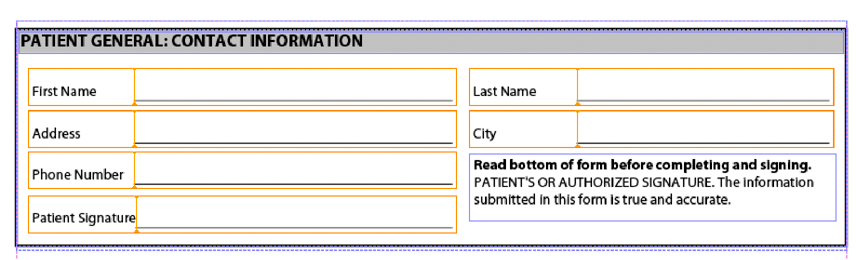
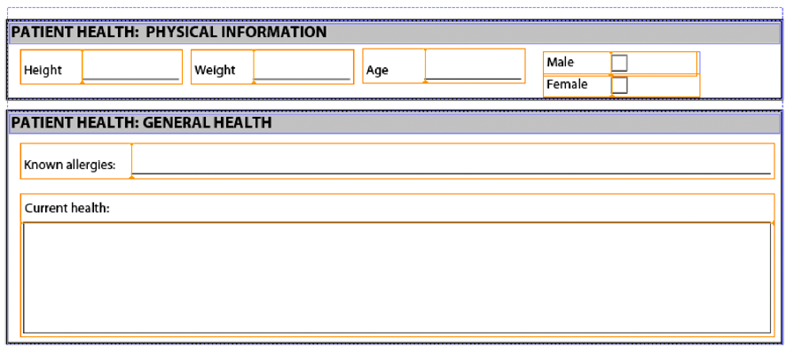
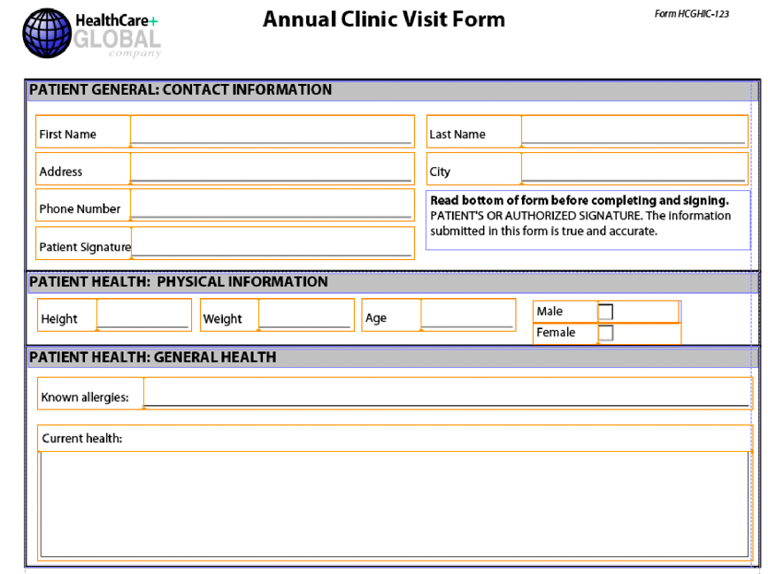

# Assemblieren mehrerer XDP-Fragmente{#assembling-multiple-xdp-fragments}

Sie können mehrere XDP-Fragmente in einem einzelnen XDP-Dokument zusammenstellen. Betrachten Sie beispielsweise XDP-Fragmente, in denen jede XDP-Datei ein oder mehrere Teilformulare enthält, die zum Erstellen eines Gesundheitsformulars verwendet werden. Die folgende Abbildung zeigt die Gliederungsansicht (sie stellt die Datei „tuc018_template_flowed.xdp“ dar, die in der Kurzanleitung *Zusammenstellen mehrerer XDP-Fragmente* verwendet wurde):


Die folgende Abbildung zeigt den Patientenabschnitt (sie stellt die Datei „tuc018_contact.xdp“ dar, die in der Kurzanleitung *Zusammenstellen mehrerer XDP-Fragmente* verwendet wurde):



Die folgende Abbildung zeigt den Abschnitt zur Gesundheit des Patienten (sie stellt die Datei „tuc018_patient.xdp“ dar, die in der Kurzanleitung *Zusammenstellen mehrerer XDP-Fragmente* verwendet wird):



Dieses Fragment enthält zwei Teilformulare mit dem Namen *subPatientPhysical* und *subPatientHealth*. Beide Teilformulare werden im DDX-Dokument referenziert, das an den Assembler-Dienst übergeben wird. Mithilfe des Assembler-Dienstes können Sie alle diese XDP-Fragmente zu einem einzelnen XDP-Dokument kombinieren, wie in der folgenden Abbildung dargestellt.



Das folgende DDX-Dokument stellt mehrere XDP-Fragmente in einem XDP-Dokument zusammen.

```xml
 <?xml version="1.0" encoding="UTF-8"?>
 <DDX xmlns="https://ns.adobe.com/DDX/1.0/">
         <XDP result="tuc018result.xdp">
            <XDP source="tuc018_template_flowed.xdp">
             <XDPContent insertionPoint="ddx_fragment" source="tuc018_contact.xdp" fragment="subPatientContact" required="false"/>
               <XDPContent insertionPoint="ddx_fragment" source="tuc018_patient.xdp" fragment="subPatientPhysical" required="false"/>
               <XDPContent insertionPoint="ddx_fragment" source="tuc018_patient.xdp" fragment="subPatientHealth" required="false"/>
            </XDP>
         </XDP>
 </DDX>
```

Das DDX-Dokument enthält ein XDP-`result`-Tag, das den Namen des Ergebnisses angibt. In diesem Fall ist der Wert `tuc018result.xdp`. Dieser Wert wird in der Anwendungslogik referenziert, die zum Abrufen des XDP-Dokuments verwendet wird, nachdem der Assembler-Dienst das Ergebnis zurückgegeben hat. Betrachten Sie beispielsweise die folgende Java-Anwendungslogik, die zum Abrufen des assemblierten XDP-Dokuments verwendet wird (beachten Sie, dass der Wert fett gedruckt ist):

```java
 //Iterate through the map object to retrieve the result XDP document
 for (Iterator i = allDocs.entrySet().iterator(); i.hasNext();) {
     // Retrieve the Map object’s value
     Map.Entry e = (Map.Entry)i.next();
     //Get the key name as specified in the
     //DDX document
     String keyName = (String)e.getKey();
     if (keyName.equalsIgnoreCase("tuc018result.xdp"))
                 {
         Object o = e.getValue();
         outDoc = (Document)o;
         //Save the result PDF file
         File myOutFile = new File("C:\\AssemblerResultXDP.xdp");
         outDoc.copyToFile(myOutFile);
     }
 }
```

Das Tag `XDP source` gibt die XDP-Datei an, die ein vollständiges XDP-Dokument darstellt, das als Container für das Hinzufügen von XDP-Fragmenten oder als eines von mehreren Dokumenten verwendet werden kann, die der Reihe nach aneinandergehängt werden. In dieser Situation wird das XDP-Dokument nur als Container verwendet (die erste Abbildung, die in *Zusammenstellen mehrerer XDP-Fragmente* gezeigt wird). Das heißt, die anderen XDP-Dateien werden im XDP-Container platziert.

Für jedes Teilformular können Sie ein `XDPContent`-Element hinzufügen (dieses Element ist optional). Beachten Sie im obigen Beispiel, dass es drei Teilformulare gibt: `subPatientContact`, `subPatientPhysical` und `subPatientHealth`. Sowohl das Teilformular `subPatientPhysical` als auch das Teilformular `subPatientHealth` befinden sich in der gleichen XDP-Datei, „tuc018_patient.xdp“. Das Fragment-Element gibt den Namen des Unterformulars an, wie er im Designer definiert ist.

>[!NOTE]
>
>Weitere Informationen zum Assembler-Dienst finden Sie unter [Service-Referenz für AEM Forms](https://www.adobe.com/go/learn_aemforms_services_63).

>[!NOTE]
>
>Weitere Informationen zu einem DDX-Dokument finden Sie in der [Referenz für Assembler-Dienst und DDX](https://www.adobe.com/go/learn_aemforms_ddx_63).

## Zusammenfassung der Schritte {#summary-of-steps}

Um mehrere XDP-Fragmente zusammenzuführen, führen Sie die folgenden Aufgaben aus:

1. Schließen Sie Projektdateien ein.
1. Erstellen Sie einen PDF Assembler-Client.
1. Referenzieren Sie ein vorhandenes DDX-Dokument.
1. Verweisen Sie auf die XDP-Dokumente.
1. Legen Sie Laufzeitoptionen fest.
1. Stellen Sie die mehreren XDP-Dokumente zusammen.
1. Rufen Sie das zusammengestellte XDP-Dokument ab.

**Projektdateien einbeziehen**

Schließen Sie die erforderlichen Dateien in Ihr Entwicklungsprojekt ein. Wenn Sie eine Clientanwendung mit Java erstellen, schließen Sie die erforderlichen JAR-Dateien ein. Wenn Sie Webdienste verwenden, stellen Sie sicher, dass Sie die Proxy-Dateien einschließen.

Die folgenden JAR-Dateien müssen zum Klassenpfad Ihres Projekts hinzugefügt werden:

* adobe-livecycle-client.jar
* adobe-usermanager-client.jar
* adobe-assembler-client.jar
* adobe-utilities.jar (erforderlich, wenn AEM Forms auf JBoss bereitgestellt wird)
* jbossall-client.jar (erforderlich, wenn AEM Forms auf JBoss bereitgestellt wird)

**PDF Assembler-Client erstellen**

Bevor Sie einen Assembler-Vorgang programmgesteuert ausführen können, müssen Sie einen Assembler-Dienst-Client erstellen.

**Verweisen auf ein vorhandenes DDX-Dokument**

Um mehrere XDP-Dokumente zusammenzuführen, muss auf ein DDX-Dokument verwiesen werden. Dieses DDX-Dokument muss `XDP result`, `XDP source` und `XDPContent`-Elemente enthalten.

**Verweisen auf XDP-Dokumente**

Um mehrere XDP-Dokumente zusammenzuführen, verweisen Sie auf alle XDP-Dateien, die zum Zusammenführen des XDP-Ergebnisdokuments verwendet werden. Stellen Sie sicher, dass der Name des im XDP-Dokument enthaltenen Unterformulars, auf welches das `source`-Attribut verweist, im `fragment`-Attribut angegeben ist. Ein Unterformular wird in Designer definiert. Betrachten Sie beispielsweise die folgende XML.

```xml
 <XDPContent insertionPoint="ddx_fragment" source="tuc018_contact.xdp" fragment="subPatientContact" required="false"/>
```

Das Teilformular mit dem Namen *subPatientContact* muss sich in der XDP-Datei mit dem Namen *tuc018_contact.xdp* befinden.

**Festlegen von Laufzeitoptionen**

Sie können Laufzeitoptionen festlegen, die das Verhalten des Assembler-Dienstes während der Ausführung eines Auftrags steuern. Sie können beispielsweise eine Option festlegen, mit der der Assembler-Dienst angewiesen wird, die Verarbeitung eines Auftrags fortzusetzen, wenn ein Fehler auftritt.

**Zusammenführen mehrerer XDP-Dokumente**

Um mehrere XDP-Dateien zusammenzuführen, rufen Sie den `invokeDDX`-Vorgang auf. Der Assembler-Dienst gibt das zusammengeführte XDP-Dokument innerhalb eines Sammlungsobjekts zurück.

**Abrufen des zusammengeführten XDP-Dokuments**

Ein zusammengeführtes XDP-Dokument wird innerhalb eines Sammlungsobjekts zurückgegeben. Durchsuchen Sie das Sammlungsobjekt und speichern Sie das XDP-Dokument als XDP-Datei. Sie können das XDP-Dokument auch an einen anderen AEM Forms-Service, z. B. Output, übergeben.

**Siehe auch**

[Zusammenstellen mehrerer XDP-Fragmente mithilfe der Java-API](assembling-multiple-xdp-fragments.md#assemble-multiple-xdp-fragments-using-the-java-api)

[Zusammenstellen mehrerer XDP-Fragmente mithilfe der Webservice-API](assembling-multiple-xdp-fragments.md#assemble-multiple-xdp-fragments-using-the-web-service-api)

[Einbeziehung von AEM Forms Java-Bibliotheksdateien](/help/forms/developing/invoking-aem-forms-using-java.md#including-aem-forms-java-library-files)

[Verbindungseigenschaften festlegen](/help/forms/developing/invoking-aem-forms-using-java.md#setting-connection-properties)

[Programmatisches Zusammenstellen von PDF-Dokumenten](/help/forms/developing/programmatically-assembling-pdf-documents.md#programmatically-assembling-pdf-documents)

[Erstellen von PDF-Dokumenten mithilfe von Fragmenten](/help/forms/developing/creating-document-output-streams.md#creating-pdf-documents-using-fragments)

## Zusammenstellen mehrerer XDP-Fragmente mithilfe der Java-API {#assemble-multiple-xdp-fragments-using-the-java-api}

So stellen Sie mehrere XDP-Fragmente mithilfe der Assembler-Dienst-API (Java) zusammen:

1. Schließen Sie Projektdateien ein.

   Fügen Sie Client-JAR-Dateien wie „adobe-assembler-client.jar“ in den Klassenpfad Ihres Java-Projekts ein.

1. Erstellen Sie einen PDF Assembler-Client.

   * Erstellen Sie ein `ServiceClientFactory`-Objekt, das Verbindungseigenschaften enthält.
   * Erstellen Sie ein `AssemblerServiceClient`-Objekt, indem Sie seinen Konstruktor verwenden und das `ServiceClientFactory`-Objekt übergeben.

1. Referenzieren Sie ein vorhandenes DDX-Dokument.

   * Erstellen Sie ein `java.io.FileInputStream`-Objekt, das das DDX-Dokument darstellt, indem Sie seinen Konstruktor verwenden und einen Zeichenfolgenwert übergeben, der den Speicherort der DDX-Datei angibt.
   * Erstellen Sie ein `com.adobe.idp.Document`-Objekt, indem Sie seinen Konstruktor verwenden und das `java.io.FileInputStream`-Objekt übergeben.

1. Verweisen Sie auf die XDP-Dokumente.

   * Erstellen Sie ein `java.util.Map`-Objekt, das zum Speichern von XDP-Eingabedokumenten verwendet wird, indem Sie einen `HashMap`-Konstruktor verwenden.
   * Erstellen Sie ein `com.adobe.idp.Document`-Objekt und übergeben Sie das `java.io.FileInputStream`-Objekt, das die XDP-Eingabedatei enthält (wiederholen Sie diese Aufgabe für jede XDP-Datei).
   * Fügen Sie einen Eintrag zu dem `java.util.Map`-Objekt hinzu, indem Sie seine Methode `put` aufrufen und die folgenden Argumente übergeben:

      * Eine Zeichenfolge, die den Speichernamen repräsentiert. Dieser Wert muss mit dem im DDX-Dokument angegebenen `source`-Elementwert übereinstimmen (wiederholen Sie diese Aufgabe für jede XDP-Datei).
      * Ein `com.adobe.idp.Document`-Objekt, das das XDP-Dokument enthält, das dem `source`-Element entspricht (wiederholen Sie diesen Vorgang für jede XDP-Datei).

1. Legen Sie die Laufzeitoptionen fest.

   * Erstellen Sie ein `AssemblerOptionSpec`-Objekt, das Laufzeitoptionen speichert, indem Sie seinen Konstruktor verwenden.
   * Legen Sie Laufzeitoptionen fest, um Ihre Geschäftsanforderungen zu erfüllen, indem Sie eine Methode aufrufen, die zum `AssemblerOptionSpec`-Objekt gehört. Um beispielsweise den Assembler-Dienst anzuweisen, die Verarbeitung eines Auftrags auch dann fortzusetzen, wenn ein Fehler auftritt, rufen Sie die Methode `setFailOnError` des `AssemblerOptionSpec`-Objekts auf und übergeben `false`.

1. Stellen Sie die mehreren XDP-Dokumente zusammen.

   Rufen Sie die Methode `invokeDDX` des `AssemblerServiceClient`-Objekts auf und übergeben Sie die folgenden erforderlichen Werte:

   * Ein `com.adobe.idp.Document`-Objekt, das das zu verwendende DDX-Dokument darstellt
   * Ein `java.util.Map`-Objekt, das die XDP-Eingabedateien enthält
   * Ein `com.adobe.livecycle.assembler.client.AssemblerOptionSpec`-Objekt, das die Laufzeitoptionen angibt, einschließlich der Standardschrift und der Auftragslog-Ebene

   Die Methode `invokeDDX` gibt ein `com.adobe.livecycle.assembler.client.AssemblerResult`-Objekt zurück, das das zusammengestellte XDP-Dokument enthält.

1. Rufen Sie das zusammengestellte XDP-Dokument ab.

   Um das zusammengestellte XDP-Dokument abzurufen, führen Sie die folgenden Aktionen aus:

   * Rufen Sie die Methode `getDocuments` des `AssemblerResult`-Objekts auf. Diese Methode gibt ein `java.util.Map`-Objekt zurück.
   * Iterieren Sie durch das `java.util.Map`-Objekt, bis Sie das resultierende `com.adobe.idp.Document`-Objekt finden.
   * Rufen Sie die Methode `copyToFile` des `com.adobe.idp.Document`-Objekts auf, um das zusammengesetzte XDP-Dokument zu extrahieren.

**Siehe auch**

[Zusammenstellen mehrerer XDP-Fragmente](assembling-multiple-xdp-fragments.md#assembling-multiple-xdp-fragments)
[Kurzanleitung (SOAP-Modus): Zusammenstellen mehrerer XDP-Fragmente mithilfe der Java-API](/help/forms/developing/assembler-service-java-api-quick.md#quick-start-soap-mode-assembling-multiple-xdp-fragments-using-the-java-api)
[Einschließlich AEM Forms Java-Bibliotheksdateien](/help/forms/developing/invoking-aem-forms-using-java.md#including-aem-forms-java-library-files)
[Verbindungseigenschaften festlegen](/help/forms/developing/invoking-aem-forms-using-java.md#setting-connection-properties)

## Zusammenstellen mehrerer XDP-Fragmente mithilfe der Webservice-API {#assemble-multiple-xdp-fragments-using-the-web-service-api}

So stellen Sie mehrere XDP-Fragmente mithilfe der Assembler-Dienst-API (Webservice) zusammen:

1. Schließen Sie Projektdateien ein.

   Erstellen Sie ein Microsoft .NET-Projekt, das MTOM verwendet. Stellen Sie sicher, dass Sie beim Festlegen einer Service-Referenz die folgende WSDL-Definition verwenden:

   ```java
    https://localhost:8080/soap/services/AssemblerService?WSDL&lc_version=9.0.1.
   ```

   >[!NOTE]
   >
   >Ersetzen Sie `localhost` durch die IP-Adresse des Servers, auf dem AEM Forms gehostet wird.

1. Erstellen Sie einen PDF Assembler-Client.

   * Erstellen Sie ein `AssemblerServiceClient`-Objekt, indem Sie seinen standardmäßigen Konstruktor verwenden.
   * Erstellen Sie ein `AssemblerServiceClient.Endpoint.Address`-Objekt, indem Sie den `System.ServiceModel.EndpointAddress`-Konstruktor verwenden. Übergeben Sie einen Zeichenfolgenwert, der dem AEM Forms-Service die WSDL angibt (z. B. `https://localhost:8080/soap/services/AssemblerService?blob=mtom`). Sie brauchen das Attribut `lc_version` nicht zu verwenden. Dieses Attribut wird verwendet, wenn Sie einen Service-Verweis erstellen.
   * Erstellen Sie ein `System.ServiceModel.BasicHttpBinding`-Objekt, indem Sie den Wert des `AssemblerServiceClient.Endpoint.Binding`-Felds abrufen. Wandeln Sie den Rückgabewert in `BasicHttpBinding` um.
   * Legen Sie das `MessageEncoding`-Feld des `System.ServiceModel.BasicHttpBinding`-Objekts auf `WSMessageEncoding.Mtom` fest. Dieser Wert stellt sicher, dass MTOM verwendet wird.
   * Aktivieren Sie die einfache HTTP-Authentifizierung, indem Sie die folgenden Schritte ausführen:

      * Weisen Sie dem Feld `AssemblerServiceClient.ClientCredentials.UserName.UserName` den AEM Forms-Benutzernamen zu.
      * Weisen Sie dem Feld `AssemblerServiceClient.ClientCredentials.UserName.Password` den entsprechenden Kennwortwert zu.
      * Weisen Sie dem Feld `BasicHttpBindingSecurity.Transport.ClientCredentialType` den konstanten Wert `HttpClientCredentialType.Basic` zu.
      * Weisen Sie dem Feld `BasicHttpBindingSecurity.Security.Mode` den konstanten Wert `BasicHttpSecurityMode.TransportCredentialOnly` zu.

1. Referenzieren Sie ein vorhandenes DDX-Dokument.

   * Erstellen Sie ein Objekt `BLOB`, indem Sie den Konstruktor verwenden. Das `BLOB`-Objekt wird zum Speichern des DDX-Dokuments verwendet.
   * Erstellen Sie ein `System.IO.FileStream`-Objekt, indem Sie seinen Konstruktor aufrufen und einen Zeichenfolgenwert übergeben, der den Dateispeicherort des DDX-Dokuments und den Modus enthält, in dem die Datei geöffnet werden soll.
   * Erstellen Sie ein Byte-Array, das den Inhalt des `System.IO.FileStream`-Objekts speichert. Sie können die Größe des Byte-Arrays bestimmen, indem Sie die `Length`-Eigenschaft des `System.IO.FileStream`-Objekts abrufen.
   * Füllen Sie das Byte-Array mit Stream-Daten, indem Sie die Methode `Read` des `System.IO.FileStream`-Objekts aufrufen. Übergeben Sie das Byte-Array, die Startposition und die Länge des zu lesenden Streams.
   * Füllen Sie das `BLOB`-Objekt, indem Sie seiner Eigenschaft `MTOM` den Inhalt des Byte-Arrays zuweisen.

1. Verweisen Sie auf die XDP-Dokumente.

   * Erstellen Sie für jede XDP-Eingabedatei ein `BLOB`-Objekt mithilfe seines Konstruktors. Das `BLOB`-Objekt wird zum Speichern der Eingabedatei verwendet.
   * Erstellen Sie ein `System.IO.FileStream`-Objekt, indem Sie seinen Konstruktor aufrufen und einen Zeichenfolgewert übergeben, der den Dateispeicherort der Eingabedatei und den Modus, in dem die Datei geöffnet werden soll, darstellt.
   * Erstellen Sie ein Byte-Array, das den Inhalt des `System.IO.FileStream`-Objekts speichert. Sie können die Größe des Byte-Arrays bestimmen, indem Sie die `Length`-Eigenschaft des `System.IO.FileStream`-Objekts abrufen.
   * Füllen Sie das Byte-Array mit Stream-Daten, indem Sie die Methode `Read` des `System.IO.FileStream`-Objekts aufrufen. Übergeben Sie das Byte-Array, die Startposition und die Länge des zu lesenden Streams.
   * Füllen Sie das `BLOB`-Objekt, indem Sie dessen `MTOM`-Feld den Inhalt des Byte-Arrays zuweisen.
   * Erstellen Sie ein `MyMapOf_xsd_string_To_xsd_anyType`-Objekt. Dieses Sammlungsobjekt wird zum Speichern von Eingabedateien verwendet, die zum Erstellen eines zusammengestellten XDP-Dokuments erforderlich sind.
   * Erstellen Sie für jede Eingabedatei ein `MyMapOf_xsd_string_To_xsd_anyType_Item`-Objekt.
   * Weisen Sie dem `key`-Feld des `MyMapOf_xsd_string_To_xsd_anyType_Item`-Objekts einen Zeichenfolgewert zu, der den Schlüsselnamen darstellt. Dieser Wert muss mit dem Wert des im DDX-Dokument angegebenen Elements übereinstimmen. (Führen Sie diese Aufgabe für jede XDP-Eingabedatei aus.)
   * Weisen Sie das `BLOB`-Objekt, das die Eingabedatei speichert, dem `value`-Feld des `MyMapOf_xsd_string_To_xsd_anyType_Item`-Objekts zu. (Führen Sie diese Aufgabe für jede XDP-Eingabedatei aus.)
   * Fügen Sie das `MyMapOf_xsd_string_To_xsd_anyType_Item`-Objekt dem `MyMapOf_xsd_string_To_xsd_anyType`-Objekt zu. Rufen Sie die `Add`-Methode des `MyMapOf_xsd_string_To_xsd_anyType`-Objekts auf, und übergeben Sie das `MyMapOf_xsd_string_To_xsd_anyType`-Objekt. (Führen Sie diese Aufgabe für jedes XDP-Eingabedokument aus.)

1. Legen Sie Laufzeitoptionen fest.

   * Erstellen Sie ein `AssemblerOptionSpec`-Objekt, das Laufzeitoptionen speichert, indem Sie seinen Konstruktor verwenden.
   * Legen Sie Laufzeitoptionen fest, um Ihre Geschäftsanforderungen zu erfüllen, indem Sie einem Datenelement, das zum `AssemblerOptionSpec`-Objekt gehört, einen Wert zuweisen. Um beispielsweise den Assembler-Dienst anzuweisen, die Verarbeitung eines Auftrags fortzusetzen, wenn ein Fehler auftritt, weisen Sie dem `failOnError`-Datenelement.des `AssemblerOptionSpec`-Objekts `false` zu.

1. Stellen Sie die mehreren XDP-Dokumente zusammen.

   Rufen Sie die `invokeDDX`-Methode des `AssemblerServiceClient`-Objekts auf und übergeben Sie die folgenden Werte:

   * A `BLOB`-Objekt, das das DDX-Dokument darstellt
   * Das `MyMapOf_xsd_string_To_xsd_anyType`-Objekt, das die erforderlichen Dateien enthält
   * Ein `AssemblerOptionSpec`-Objekt, das Laufzeitoptionen angibt

   Die `invokeDDX`-Methode gibt ein `AssemblerResult`-Objekt an, das die Ergebnisse des Auftrags sowie alle aufgetretenen Ausnahmen enthält.

1. Rufen Sie das zusammengestellte XDP-Dokument ab.

   Um das neu erstellte XDP-Dokument abzurufen, führen Sie die folgenden Aktionen aus:

   * Greifen Sie auf das `documents`-Feld des `AssemblerResult`-Objekts zu, welches ein `Map`-Objekt ist, das die resultierenden PDF-Dokumente enthält.
   * Iterieren Sie durch das `Map`-Objekt, um jedes resultierende Dokument zu erhalten. Wandeln Sie dann `value` der Array-Elemente in `BLOB` um.
   * Extrahieren Sie die Binärdaten, die das PDF-Dokument darstellen, indem Sie auf die `MTOM`-Eigenschaft des `BLOB`-Objekts zugreifen. Dadurch wird ein Array von Bytes ausgegeben, die Sie in eine XDP-Datei schreiben können.

**Siehe auch**

[Zusammenstellen mehrerer XDP-Fragmente](assembling-multiple-xdp-fragments.md#assembling-multiple-xdp-fragments)
[Aufrufen von AEM Forms mithilfe von MTOM](/help/forms/developing/invoking-aem-forms-using-web.md#invoking-aem-forms-using-mtom)
