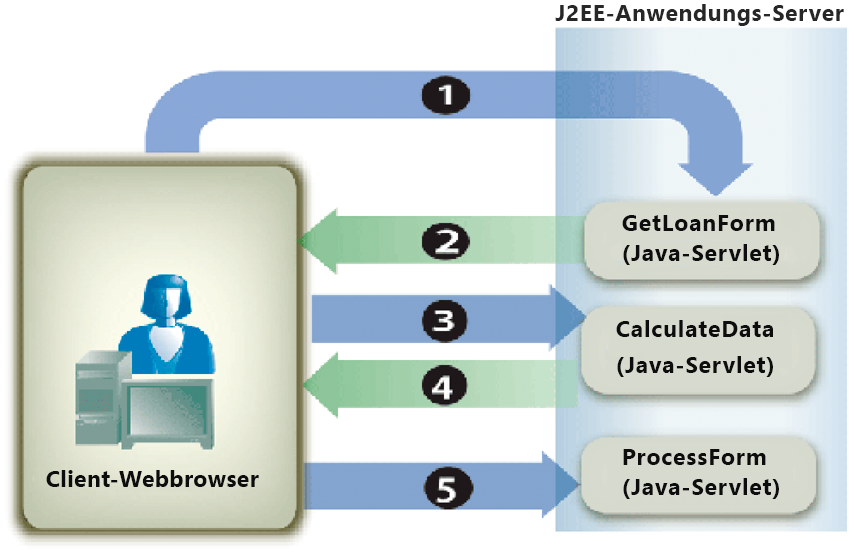

# Formulardaten berechnen {#calculating-form-data}

**Beispiele und Beispiele in diesem Dokument gelten nur für die AEM Forms on JEE-Umgebung.**

Der Forms-Dienst kann die Werte berechnen, die ein Benutzer in ein Formular eingibt, und die Ergebnisse anzeigen. Zur Berechnung der Formulardaten müssen Sie zwei Aufgaben ausführen. Erstellen Sie zunächst ein Formularentwurfsskript, das Formulardaten berechnet. Ein Formularentwurf unterstützt drei Arten von Skripten. Ein Skripttyp wird auf dem Client ausgeführt, ein anderer auf dem Server und der dritte auf dem Server und auf dem Client. Der in diesem Thema beschriebene Skripttyp wird auf dem Server ausgeführt. Serverseitige Berechnungen werden für HTML-, PDF- und Formular-Guide-Transformationen (nicht mehr unterstützt) unterstützt.

Im Rahmen des Formularentwurfsprozesses können Sie Berechnungen und Skripten verwenden, um ein besseres Benutzererlebnis zu bieten. Berechnungen und Skripten können den meisten Formularfeldern und -objekten hinzugefügt werden. Sie müssen ein Formularentwurfsskript erstellen, um Berechnungsvorgänge für Daten durchzuführen, die ein Benutzer in ein interaktives Formular eingibt.

Der Benutzer gibt Werte in das Formular ein und klickt auf die Schaltfläche Berechnen , um die Ergebnisse anzuzeigen. Im folgenden Prozess wird eine Beispielanwendung beschrieben, mit der ein Benutzer Daten berechnen kann:

* Der Benutzer greift auf eine HTML-Seite mit dem Namen StartLoan.html zu, die als Startseite der Webanwendung fungiert. Diese Seite ruft ein Java-Servlet mit dem Namen `GetLoanForm` auf.
* Das Servlet `GetLoanForm` rendert ein Darlehensformular. Dieses Formular enthält ein Skript, interaktive Felder, eine Berechnungsschaltfläche und eine Senden-Schaltfläche.
* Der Benutzer gibt Werte in die Felder des Formulars ein und klickt auf die Schaltfläche Berechnen . Das Formular wird an das Java-Servlet `CalculateData` gesendet, in dem das Skript ausgeführt wird. Das Formular wird mit den im Formular angezeigten Berechnungsergebnissen an den Benutzer zurückgesendet.
* Der Benutzer gibt die Werte weiter ein und berechnet sie, bis ein zufriedenstellendes Ergebnis angezeigt wird. Wenn der Benutzer zufrieden ist, klickt er auf die Schaltfläche Senden , um das Formular zu verarbeiten. Das Formular wird an ein anderes Java-Servlet mit dem Namen `ProcessForm` gesendet, das für das Abrufen der gesendeten Daten verantwortlich ist. (Siehe [Handhabung der übermittelten Forms](/help/forms/developing/rendering-forms.md#handling-submitted-forms).)


Das folgende Diagramm zeigt den Logikfluss der Anwendung.



Die folgende Tabelle beschreibt die Schritte in diesem Diagramm.

<table>
 <thead>
  <tr>
   <th><p>Schritt</p></th>
   <th><p>Beschreibung</p></th>
  </tr>
 </thead>
 <tbody>
  <tr>
   <td><p>1</p></td>
   <td><p>Das Java-Servlet <code>GetLoanForm</code> wird von der HTML-Startseite aus aufgerufen. </p></td>
  </tr>
  <tr>
   <td><p>2</p></td>
   <td><p>Das Java-Servlet <code>GetLoanForm</code> verwendet die Forms-Dienst-Client-API, um das Darlehensformular an den Client-Webbrowser zu rendern. Der Unterschied zwischen der Wiedergabe eines Formulars, das ein für die Ausführung auf dem Server konfiguriertes Skript enthält, und der Wiedergabe eines Formulars, das kein Skript enthält, besteht darin, dass Sie den Zielspeicherort angeben müssen, der zum Ausführen des Skripts verwendet wird. Wenn kein Zielspeicherort angegeben ist, wird ein Skript, das für die Ausführung auf dem Server konfiguriert ist, nicht ausgeführt. Betrachten Sie beispielsweise die in diesem Abschnitt eingeführte Anwendung. Das Java-Servlet <code>CalculateData</code> ist der Zielspeicherort, an dem das Skript ausgeführt wird.</p></td>
  </tr>
  <tr>
   <td><p>3</p></td>
   <td><p>Der Benutzer gibt Daten in interaktive Felder ein und klickt auf die Schaltfläche Berechnen . Das Formular wird an das Java-Servlet <code>CalculateData</code> gesendet, in dem das Skript ausgeführt wird. </p></td>
  </tr>
  <tr>
   <td><p>4</p></td>
   <td><p>Das Formular wird im Webbrowser wiedergegeben, wobei die Berechnungsergebnisse im Formular angezeigt werden. </p></td>
  </tr>
  <tr>
   <td><p>5</p></td>
   <td><p>Der Benutzer klickt auf die Schaltfläche Senden , wenn die Werte zufriedenstellend sind. Das Formular wird an ein anderes Java-Servlet mit dem Namen <code>ProcessForm</code> gesendet.</p></td>
  </tr>
 </tbody>
</table>

In der Regel enthält ein Formular, das als PDF-Inhalt gesendet wird, Skripte, die auf dem Client ausgeführt werden. Serverseitige Berechnungen können jedoch auch ausgeführt werden. Eine Senden-Schaltfläche kann nicht zur Berechnung von Skripten verwendet werden. In diesem Fall werden keine Berechnungen ausgeführt, da der Forms-Dienst die Interaktion für abgeschlossen hält.

Um die Verwendung eines Formularentwurfsskripts zu veranschaulichen, wird in diesem Abschnitt ein einfaches interaktives Formular untersucht, das ein Skript enthält, das für die Ausführung auf dem Server konfiguriert ist. Das folgende Diagramm zeigt einen Formularentwurf mit einem Skript, das Werte hinzufügt, die ein Benutzer in die ersten beiden Felder eingibt, und das Ergebnis im dritten Feld anzeigt.


**A.** Ein Feld namens NumericField1  **B.** Ein Feld namens NumericField2  **C.** Ein Feld namens NumericField3

Die Syntax des Skripts in diesem Formularentwurf lautet wie folgt:

```javascript
     NumericField3 = NumericField2 + NumericField1
```

In diesem Formularentwurf ist die Schaltfläche Berechnen eine Befehlsschaltfläche und das Skript befindet sich im `Click`-Ereignis dieser Schaltfläche. Wenn ein Benutzer Werte in die ersten beiden Felder (NumericField1 und NumericField2) eingibt und auf die Schaltfläche Berechnen klickt, wird das Formular an den Forms-Dienst gesendet, wo das Skript ausgeführt wird. Der Forms-Dienst rendert das Formular auf das Clientgerät zurück, wobei die Berechnungsergebnisse im Feld NumericField3 angezeigt werden.

>[!NOTE]
>
>Weitere Informationen zum Erstellen eines Formularentwurfsskripts finden Sie unter [Forms Designer](https://www.adobe.com/go/learn_aemforms_designer_63).

>[!NOTE]
>
>Weitere Informationen zum Forms-Dienst finden Sie unter [Dienstreferenz für AEM Forms](https://www.adobe.com/go/learn_aemforms_services_63).

## Zusammenfassung der Schritte {#summary-of-steps}

Um Formulardaten zu berechnen, führen Sie die folgenden Aufgaben aus:

1. Projektdateien einschließen.
1. Erstellen Sie ein Forms Client-API-Objekt.
1. Rufen Sie ein Formular mit einem Berechnungsskript ab.
1. Schreiben Sie den Formulardaten-Stream zurück in den Client-Webbrowser

**Projektdateien einschließen**

Fügen Sie die erforderlichen Dateien in Ihr Entwicklungsprojekt ein. Wenn Sie eine Clientanwendung mit Java erstellen, schließen Sie die erforderlichen JAR-Dateien ein. Wenn Sie Webdienste verwenden, stellen Sie sicher, dass Sie die Proxy-Dateien einschließen.

**Erstellen eines Forms Client-API-Objekts**

Bevor Sie einen Client-API-Vorgang für den Forms-Dienst programmgesteuert ausführen können, müssen Sie einen Forms-Dienstclient erstellen. Wenn Sie die Java-API verwenden, erstellen Sie ein `FormsServiceClient` -Objekt. Wenn Sie die Forms-Webdienst-API verwenden, erstellen Sie ein `FormsServiceService` -Objekt.

**Abrufen eines Formulars mit einem Berechnungsskript**

Sie verwenden die Client-API des Forms-Dienstes, um eine Anwendungslogik zu erstellen, die ein Formular verarbeitet, das ein Skript enthält, das für die Ausführung auf dem Server konfiguriert ist. Der Prozess ähnelt der Verarbeitung eines gesendeten Formulars. (Siehe [Handhabung der übermittelten Forms](/help/forms/developing/handling-submitted-forms.md).)

Vergewissern Sie sich, dass der mit dem gesendeten Formular verknüpfte Verarbeitungsstatus `1` `(Calculate)` lautet. Das bedeutet, dass der Forms-Dienst einen Berechnungsvorgang für die Formulardaten durchführt und die Ergebnisse an den Benutzer zurückgeschrieben werden müssen. In diesem Fall wird automatisch ein Skript ausgeführt, das für die Ausführung auf dem Server konfiguriert wurde.

**Schreiben Sie den Formulardaten-Stream zurück in den Client-Webbrowser**

Nachdem Sie überprüft haben, ob der mit einem gesendeten Formular verknüpfte Verarbeitungsstatus `1` lautet, müssen Sie die Ergebnisse zurück in den Client-Webbrowser schreiben. Wenn das Formular angezeigt wird, erscheint der berechnete Wert in den entsprechenden Feldern.

**Siehe auch**

[Einbeziehung von AEM Forms Java-Bibliotheksdateien](/help/forms/developing/invoking-aem-forms-using-java.md#including-aem-forms-java-library-files) 
[Formulardaten mithilfe des Java ](/help/forms/developing/calculating-form-data.md#calculate-form-data-using-the-java-api)
[APICalculate-Formulardaten mithilfe des Webdienst-](/help/forms/developing/calculating-form-data.md#calculate-form-data-using-the-web-service-api)
[APISetting connection ](/help/forms/developing/invoking-aem-forms-using-java.md#setting-connection-properties)
[propertiesForms Service API Quick ](/help/forms/developing/forms-service-api-quick-starts.md#forms-service-api-quick-starts)
[StartsRendern von interaktiven PDF-](/help/forms/developing/rendering-interactive-pdf-forms.md)
[FormularenErstellen von Webanwendungen, die Forms rendern](/help/forms/developing/creating-web-applications-renders-forms.md)

## Formulardaten mithilfe der Java-API {#calculate-form-data-using-the-java-api} berechnen

Berechnen Sie die Formulardaten mithilfe der Forms API (Java):

1. Projektdateien einschließen

   Schließen Sie Client-JAR-Dateien wie adobe-forms-client.jar in den Klassenpfad Ihres Java-Projekts ein.

1. Erstellen eines Forms Client-API-Objekts

   * Erstellen Sie ein `ServiceClientFactory`-&quot; -Objekt, das Verbindungseigenschaften enthält.
   * Erstellen Sie ein `FormsServiceClient` -Objekt, indem Sie dessen Konstruktor verwenden und das `ServiceClientFactory` -Objekt übergeben.

1. Abrufen eines Formulars mit einem Berechnungsskript

   * Um Formulardaten abzurufen, die ein Berechnungsskript enthalten, erstellen Sie ein `com.adobe.idp.Document` -Objekt, indem Sie dessen Konstruktor verwenden und die `javax.servlet.http.HttpServletResponse` -Methode des Objekts `getInputStream` im Konstruktor aufrufen.
   * Rufen Sie die `processFormSubmission` -Methode des Objekts `FormsServiceClient` auf und übergeben Sie die folgenden Werte:

      * Das `com.adobe.idp.Document`-Objekt, das die Formulardaten enthält.
      * Ein string -Wert, der Umgebungsvariablen einschließlich aller relevanten HTTP-Header angibt. Sie müssen den Inhaltstyp angeben, der verarbeitet werden soll, indem Sie einen oder mehrere Werte für die Umgebungsvariable `CONTENT_TYPE` angeben. Um beispielsweise XML- und PDF-Daten zu verarbeiten, geben Sie den folgenden Zeichenfolgenwert für diesen Parameter an: `CONTENT_TYPE=application/xml&CONTENT_TYPE=application/pdf`
      * Ein string -Wert, der den Header-Wert `HTTP_USER_AGENT` angibt; z. B. `Mozilla/4.0 (compatible; MSIE 6.0; Windows NT 5.1; SV1; .NET CLR 1.1.4322)`.
      * Ein `RenderOptionsSpec` -Objekt, das Laufzeitoptionen speichert.

      Die `processFormSubmission`-Methode gibt ein `FormsResult`-Objekt zurück, das die Ergebnisse der Formularübermittlung enthält.

   * Stellen Sie sicher, dass der mit einem gesendeten Formular verknüpfte Verarbeitungsstatus `1` ist, indem Sie die `getAction` -Methode des Objekts `FormsResult` aufrufen. Wenn diese Methode den Wert `1` zurückgibt, wurde die Berechnung durchgeführt und die Daten können in den Client-Webbrowser zurückgeschrieben werden.


1. Schreiben Sie den Formulardaten-Stream zurück in den Client-Webbrowser

   * Erstellen Sie ein `javax.servlet.ServletOutputStream`-Objekt, das zum Senden eines Formulardatenstreams an den Client-Webbrowser verwendet wird.
   * Erstellen Sie ein `com.adobe.idp.Document` -Objekt, indem Sie die `FormsResult` -Methode des Objekts &quot;s `getOutputContent` aufrufen.
   * Erstellen Sie ein `java.io.InputStream` -Objekt, indem Sie die `getInputStream` -Methode des Objekts `com.adobe.idp.Document` aufrufen.
   * Erstellen Sie ein Byte-Array und füllen Sie es mit dem Formulardatenstream, indem Sie die `read` -Methode des Objekts `InputStream` aufrufen und das Byte-Array als Argument übergeben.
   * Rufen Sie die `write` -Methode des Objekts `javax.servlet.ServletOutputStream` auf, um den Formulardatenstream an den Client-Webbrowser zu senden. Übergeben Sie das Byte-Array an die `write`-Methode.

**Siehe auch**


[Einbeziehung von AEM Forms Java-Bibliotheksdateien](/help/forms/developing/invoking-aem-forms-using-java.md#including-aem-forms-java-library-files)
[Verbindungseigenschaften festlegen](/help/forms/developing/invoking-aem-forms-using-java.md#setting-connection-properties)

## Formulardaten mithilfe der Webdienst-API {#calculate-form-data-using-the-web-service-api} berechnen

Berechnen Sie Formulardaten mithilfe der Forms API (Webdienst):

1. Projektdateien einschließen

   * Erstellen Sie Java-Proxyklassen, die die Forms-Dienst-WSDL verwenden.
   * Schließen Sie die Java-Proxy-Klassen in Ihren Klassenpfad ein.

1. Erstellen eines Forms Client-API-Objekts

   Erstellen Sie ein `FormsService` -Objekt und legen Sie Authentifizierungswerte fest.

1. Abrufen eines Formulars mit einem Berechnungsskript

   * Um Formulardaten abzurufen, die in einem Java-Servlet veröffentlicht wurden, erstellen Sie ein `BLOB` -Objekt mithilfe seines Konstruktors.
   * Erstellen Sie ein `java.io.InputStream` -Objekt mithilfe der `javax.servlet.http.HttpServletResponse` -Methode des Objekts `getInputStream` .
   * Erstellen Sie ein `java.io.ByteArrayOutputStream` -Objekt, indem Sie dessen Konstruktor verwenden und die Länge des `java.io.InputStream` -Objekts übergeben.
   * Kopieren Sie den Inhalt des Objekts `java.io.InputStream` in das Objekt `java.io.ByteArrayOutputStream` .
   * Erstellen Sie ein Byte-Array, indem Sie die `toByteArray` -Methode des Objekts `java.io.ByteArrayOutputStream` aufrufen.
   * Füllen Sie das `BLOB`-Objekt, indem Sie seine `setBinaryData`-Methode aufrufen und das Byte-Array als Argument übergeben.
   * Erstellen Sie ein Objekt `RenderOptionsSpec`, indem Sie den Konstruktor verwenden. Legen Sie den Gebietsschemawert fest, indem Sie die `setLocale` -Methode des Objekts `RenderOptionsSpec` aufrufen und einen Zeichenfolgenwert übergeben, der den Gebietsschemawert angibt.
   * Rufen Sie die `processFormSubmission` -Methode des Objekts `FormsServiceClient` auf und übergeben Sie die folgenden Werte:

      * Das `BLOB`-Objekt, das die Formulardaten enthält.
      * Ein string -Wert, der Umgebungsvariablen angibt, die alle relevanten HTTP-Header enthalten. Sie können beispielsweise den folgenden Zeichenfolgenwert angeben: `HTTP_REFERER=referrer&HTTP_CONNECTION=keep-alive&CONTENT_TYPE=application/xml`
      * Ein string -Wert, der den Header-Wert `HTTP_USER_AGENT` angibt; z. B. `Mozilla/4.0 (compatible; MSIE 6.0; Windows NT 5.1; SV1; .NET CLR 1.1.4322)`.
      * Ein `RenderOptionsSpec` -Objekt, das Laufzeitoptionen speichert. Für weitere Informationen, .
      * Ein leeres `BLOBHolder` -Objekt, das von der -Methode ausgefüllt wird.
      * Ein leeres `javax.xml.rpc.holders.StringHolder` -Objekt, das von der -Methode ausgefüllt wird.
      * Ein leeres `BLOBHolder` -Objekt, das von der -Methode ausgefüllt wird.
      * Ein leeres `BLOBHolder` -Objekt, das von der -Methode ausgefüllt wird.
      * Ein leeres `javax.xml.rpc.holders.ShortHolder` -Objekt, das von der -Methode ausgefüllt wird.
      * Ein leeres `MyArrayOf_xsd_anyTypeHolder` -Objekt, das von der -Methode ausgefüllt wird. Dieser Parameter wird zum Speichern von Dateianlagen verwendet, die zusammen mit dem Formular gesendet werden.
      * Ein leeres `FormsResultHolder` -Objekt, das von der -Methode mit dem gesendeten Formular gefüllt wird.

      Die `processFormSubmission`-Methode füllt den Parameter `FormsResultHolder` mit den Ergebnissen der Formularübermittlung. Die `processFormSubmission`-Methode gibt ein `FormsResult`-Objekt zurück, das die Ergebnisse der Formularübermittlung enthält.

   * Stellen Sie sicher, dass der mit einem gesendeten Formular verknüpfte Verarbeitungsstatus `1` ist, indem Sie die `getAction` -Methode des Objekts `FormsResult` aufrufen. Wenn diese Methode den Wert `1` zurückgibt, wurde die Berechnung durchgeführt und die Daten können in den Client-Webbrowser zurückgeschrieben werden.


1. Schreiben Sie den Formulardaten-Stream zurück in den Client-Webbrowser

   * Erstellen Sie ein `javax.servlet.ServletOutputStream`-Objekt, das zum Senden eines Formulardatenstreams an den Client-Webbrowser verwendet wird.
   * Erstellen Sie ein `BLOB`-Objekt, das Formulardaten enthält, indem Sie die `getOutputContent` -Methode des Objekts `FormsResult` aufrufen.
   * Erstellen Sie ein Byte-Array und füllen Sie es durch Aufrufen der `getBinaryData`-Methode des Objekts `BLOB`. Diese Aufgabe weist den Inhalt des Objekts `FormsResult` dem Byte-Array zu.
   * Rufen Sie die `write` -Methode des Objekts `javax.servlet.http.HttpServletResponse` auf, um den Formulardatenstream an den Client-Webbrowser zu senden. Übergeben Sie das Byte-Array an die `write`-Methode.

**Siehe**
[auch Aufrufen von AEM Forms mithilfe der Base64-Kodierung .](/help/forms/developing/invoking-aem-forms-using-web.md#invoking-aem-forms-using-base64-encoding)
