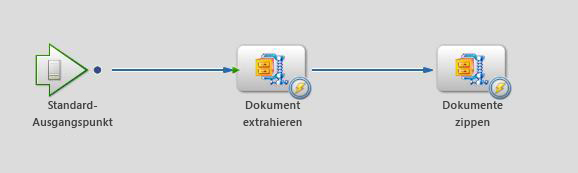

# Komprimieren und Dekomprimieren von Dateien mithilfe eines benutzerdefinierten DSC von AEM Forms auf JEE {#compressing-decompressing-files}

## Vorausgesetztes Wissen {#prerequisites}

Erfahrung mit dem Prozess-Management in AEM Forms on JEE, grundlegender Java™-Programmierung und dem Erstellen benutzerdefinierter Komponenten.

**Weitere erforderliche Produkte**

Java™-Editor, z. B. [Eclipse](https://www.eclipse.org/) oder [Netbeans IDE](https://netbeans.apache.org/)

## Benutzerebene {#user-level}

Fortgeschrittene Einsteiger

Mit AEM Forms on JEE können Entwickelnde benutzerdefinierte ASC (Acrobat Service Container) erstellen, um umfangreiche, vorkonfigurierte Funktionen zu entwickeln. Die Erstellung solcher Komponenten kann mit der Laufzeitumgebung von AEM Forms auf JEE verbunden werden und erfüllt den vorgesehenen Zweck. In diesem Artikel wird erläutert, wie Sie einen benutzerdefinierten ZIP-Service erstellen, mit dem Sie eine Liste von Dateien in eine ZIP-Datei komprimieren und eine ZIP-Datei in eine Liste von Dokumenten entpacken können.

## Erstellen einer benutzerdefinierten ASC-Komponente {#create-custom-dsc-component}

Erstellen Sie eine benutzerdefinierte ASC-Komponente mit zwei Dienstvorgängen, damit Sie eine Liste von Dokumenten komprimieren und entpacken können. Diese Komponente verwendet das Paket java.util.zip für die Komprimierung und Dekomprimierung.

Erstellen einer benutzerdefinierten ASC-Komponente:

1. Fügen Sie die Datei adobe-livecycle-client.jar zur Bibliothek hinzu
1. Fügen Sie die erforderlichen Symbole hinzu
1. Erstellen Sie eine öffentliche Klasse
1. Erstellen Sie zwei öffentliche Methoden mit den Namen UnzipDocument &amp; ZipDocuments
1. Erstellen Sie die Logik für Komprimierung &amp; Dekomprimierung

Den Code finden Sie hier:

```java
/*
 * Custom DSC : ZIP Utility
 * Purpose: This is a LiveCycle ES2 custom component used to Compress & Decompress List of Documents
 * Author: Nithiyanandam Dharmadass
 * Organization: Ministry of Finance, Kingdom of Bahrain
 * Last modified Date: 18/Apr/2011
 */
package nith.lces2.dsc;

import java.util.zip.ZipEntry;
import java.util.zip.ZipInputStream;
import com.adobe.idp.Document;
import java.io.ByteArrayOutputStream;
import java.io.InputStream;
import java.util.ArrayList;
import java.util.List;
import java.util.zip.ZipOutputStream;

public class ZIPService {

    static final int BUFFER = 2048; // 2MB buffer size

    public java.util.List UnzipDocument(com.adobe.idp.Document zipDocument) throws Exception {
        ZipInputStream zis = new ZipInputStream(zipDocument.getInputStream());

        ZipEntry zipFile;

        List resultList = new ArrayList();

        while ((zipFile = zis.getNextEntry()) != null) {

            ByteArrayOutputStream byteArrayOutStream = new ByteArrayOutputStream();

            int count;  // an int variable to hold the number of bytes read from input stream
            byte data[] = new byte[BUFFER];
            while ((count = zis.read(data, 0, BUFFER)) != -1) {
                byteArrayOutStream.write(data, 0, count);   // write to byte array
            }

            com.adobe.idp.Document unzippedDoc = new Document(byteArrayOutStream.toByteArray());  // create an idp document
            unzippedDoc.setAttribute("file", zipFile.getName());
            unzippedDoc.setAttribute("wsfilename", zipFile.getName());  // update the wsfilename attribute
            resultList.add(unzippedDoc);
        }
        return resultList;  // List of uncompressed documents
    }

    public com.adobe.idp.Document ZipDocuments(java.util.List listOfDocuments,java.lang.String zipFileName) throws Exception {

        if (listOfDocuments == null || listOfDocuments.size() == 0) {
            return null;
        }

        ByteArrayOutputStream byteArrayOutStream = new ByteArrayOutputStream();
        ZipOutputStream zos = new ZipOutputStream(byteArrayOutStream);  // ZIP Output Stream

        for (int i = 0; i < listOfDocuments.size(); i++) {
            Document doc = (Document) listOfDocuments.get(i);
            InputStream docInputStream = doc.getInputStream();
            ZipEntry zipEntry = new ZipEntry(doc.getAttribute("file").toString());
            zos.putNextEntry(zipEntry);
            int count;
            byte data[] = new byte[BUFFER];
            while ((count = docInputStream.read(data, 0, BUFFER)) != -1) {
                zos.write(data, 0, count);  // Read document content and add to zip entry
            }
            zos.closeEntry();
        }
        zos.flush();
        zos.close();

        Document zippedDoc = new Document(byteArrayOutStream.toByteArray());
        if(zipFileName==null || zipFileName.equals(""))
        {
            zipFileName = "CompressedList.zip";
        }
        zippedDoc.setAttribute("file", zipFileName);
        return zippedDoc;
    }
}
```

## Erstellen der Datei Component.XML {#create-component-xml-file}

Die Datei component.xml muss im Stammordner des Pakets erstellt werden, das die Service-Vorgänge und deren Parameter definiert hat.

Die Datei component.xml wird hier gezeigt:

```xml
<?xml version="1.0" encoding="UTF-8"?>
<component xmlns="https://adobe.com/idp/dsc/component/document">
<!-- Unique id identifying this component -->
   <component-id>ZipService</component-id>

<!-- Version -->
   <version>1.0</version>

<!-- Start of the Service definition -->
   <services>
<!-- Unique name for service descriptor.
           The value is used as the default name for
           deployed services -->
      <service name="ZipService">
<!-- service implementation class definition -->
        <implementation-class>nith.lces2.dsc.ZIPService</implementation-class>

<!-- description -->
        <description>Compress or Decompress list of documents</description>

<!--  You can provide your own icons for a distinct look   -->
          <small-icon>icons/Zip_icon16.png</small-icon>
          <large-icon>icons/Zip_icon32.png</large-icon>


<!-- automatically deploys the service and starts it after installation -->
         <auto-deploy service-id="ZipService" />

         <operations>
<!-- method name in the interface setSmtpHost-->
            <operation name="UnzipDocument">
<!-- input parameters to the "send" method -->
              <input-parameter name="zipDocument" title="Input ZIP Document" type="com.adobe.idp.Document">
                    <hint>A ZIP File to be decompressed</hint>
                </input-parameter>
                <output-parameter name="resultList" title="Decompressed list of documents" type="java.util.List">
                    <hint>Decompressed ZIP list</hint>
                </output-parameter>
            </operation>
            <operation name="ZipDocuments">
<!-- input parameters to the "send" method -->
              <input-parameter name="listOfDocuments" title="List of Documents" type="java.util.List">
                    <hint>A list of documents to be Compressed</hint>
                </input-parameter>
                <input-parameter name="zipFileName" title="Result File Name" type="java.lang.String">
                    <hint>The name of compressed file (optional)</hint>
                </input-parameter>

                <output-parameter name="zippedDoc" title="Compressed Zip file" type="com.adobe.idp.Document">
                    <hint>Compressed ZIP File</hint>
                </output-parameter>
            </operation>
             </operations>
      </service>
   </services>
</component>
```

## Kompilieren und Bereitstellen der Komponente {#packaging-deploying-component}

1. Kompilieren Sie das Java™-Projekt und erstellen Sie eine JAR-Datei.
1. Stellen Sie die Komponente (.JAR-Datei) über Workbench für die Laufzeit von AEM Forms auf JEE bereit.
1. Starten Sie den Service von Workbench aus (siehe Abbildung unten).


## Verwenden des ZIP-Service in Workflows {#using-zip-service-in-workflows}

Der Vorgang UnzipDocument des benutzerdefinierten Service kann jetzt eine Dokumentvariable als Eingabe akzeptieren und eine Liste von Dokumentvariablen als Ausgabe zurückgeben.


Ebenso kann der Vorgang ZipDocuments der benutzerdefinierten Komponente eine Liste von Dokumenten als Eingabe akzeptieren, sie als ZIP-Datei komprimieren und das komprimierte Dokument zurückgeben.


Die folgende Workflow-Orchestrierung zeigt, wie Sie die angegebene ZIP-Datei entkomprimieren, sie wieder in eine andere ZIP-Datei komprimieren und die Ausgabe zurückgeben können (siehe Abbildung unten).



## Einige Anwendungsfälle für Unternehmen {#business-use-cases}

Sie können diesen ZIP-Service für die folgenden Anwendungsfälle verwenden:

* Suchen Sie alle Dateien in einem bestimmten Ordner und geben Sie die Dateien als komprimiertes Dokument zurück.

* Stellen Sie eine ZIP-Datei mit einer Reihe von PDF-Dokumenten bereit, die nach der Dekomprimierung der Dokumente durch Lesende erweitert werden können. Dafür ist das Modul „Reader Extensions“ für AEM Forms on JEE erforderlich.

* Stellen Sie eine ZIP-Datei mit heterogenem Dokumenttyp bereit, die mithilfe des Generate PDF-Dienstes dekomprimiert und zu einem PDF-Dokument konvertiert werden kann.

* Schützen Sie eine Liste von Dokumenten durch Richtlinien und geben Sie sie als ZIP-Datei zurück.

* Lassen Sie Benutzende alle Anlagen einer Prozessinstanz in einer einzigen ZIP-Datei herunterladen.
