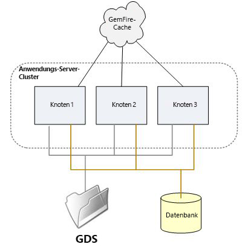
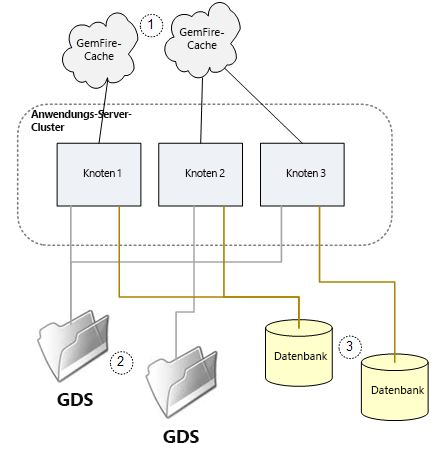

# Konfigurieren und Fehlerbehebung für einen AEM Forms on JEE-Servercluster {#configuring-troubleshooting-aem-forms-jee-server-cluster}

## Vorausgesetztes Wissen {#prerequisites}

Kenntnis der AEM Forms on JEE-, JBoss-, WebSphere- und WebLogic-Anwendungsserver, Red Hat Linux, SUSE Linux, Microsoft Windows, IBM AIX oder Sun Solaris-Betriebssysteme, Oracle, IBM DB2- oder SQL Server-Datenbankserver und Webumgebungen.

## Benutzerebene {#user-level}

Erweitert

Ein AEM Forms on JEE-Cluster ist eine Topologie, die es AEM Forms on JEE ermöglicht, gegenüber dem Ausfall eines Clusterknotens robust zu sein und die Systemkapazität über die Fähigkeiten eines einzelnen Knotens hinaus zu skalieren. Ein Cluster kombiniert mehrere Knoten in einem einzigen logischen System, das Daten teilt und es Transaktionen ermöglicht, sich über mehrere Knoten in ihrer Ausführung zu erstrecken. Ein Cluster ist die gängigste Methode zur Skalierung von AEM Forms on JEE, da jede Kombination von Diensten, die eine beliebige Kombination von Arbeitslasten verarbeitet, unterstützt werden kann. Ein AEM Forms on JEE-Cluster eignet sich nicht unbedingt für alle Bereitstellungsarten, insbesondere kann in vielen Fällen eine nicht geclusterte Architektur mit einem Lastenausgleich für Server geeignet sein.

In diesem Dokument werden die spezifischen Konfigurationsanforderungen und potenziellen Problembereiche besprochen, auf die Sie mit einem AEM Forms on JEE-Cluster stoßen können.

## Was befindet sich in einem Cluster? {#what-is-in-cluster}

Die AEM Forms on JEE-Clusterknoten kommunizieren untereinander und geben Informationen frei, damit der Cluster als Ganzes einen einheitlichen Konfigurations- und Anwendungszustand erhält. Der Austausch von Informationen innerhalb des Clusters erfolgt auf verschiedene Arten gleichzeitig, die in verschiedenen Kontexten verwendet werden. Die grundlegenden Informationsaustauschmethoden sind in der folgenden Abbildung dargestellt:



### Anwendungsservercluster {#application-server-cluster}

Ein AEM Forms on JEE-Cluster stützt sich auf die Clustering-Funktionen des zugrunde liegenden Anwendungsservers. Anwendungsserver-Cluster ermöglichen die Verwaltung der Clusterkonfiguration als Ganzes und bieten Clusterdienste auf niedriger Ebene wie Java Naming and Directory Interface (JNDI), die es Softwarekomponenten ermöglichen, sich im Cluster zu finden. Die Komplexität der Clusterdienste und die zugrunde liegenden technischen Abhängigkeiten des Anwendungsservers hängen vom Anwendungsserver ab. WebSphere und WebLogic verfügen über ausgereifte Verwaltungsfunktionen für Cluster, während JBoss einen sehr grundlegenden Ansatz verfolgt.

### GemFire-Cache {#gemfire-cache}

Der GemFire-Cache ist ein verteilter Cache-Mechanismus, der in jedem Clusterknoten implementiert ist. Die Knoten finden einander und erstellen einen einzigen logischen Cache, der zwischen den Knoten kohärent gehalten wird. Die Knoten, die einander finden, verbinden sich miteinander, um einen einzelnen fiktiven Cache zu verwalten, der in Abbildung 1 als Cloud angezeigt wird. Im Gegensatz zum globalen Dokumentenspeicher und der Datenbank ist der Cache eine reine fiktive Entität. Der tatsächlich zwischengespeicherte Inhalt wird im Speicher und im Ordner `LC_TEMP` auf jedem Clusterknoten gespeichert.

### Datenbank {#database}

Die AEM Forms on JEE-Datenbank, auf die über die JDBC-Datenquellen IDP_DS, EDC_DS und andere zugegriffen wird, wird von allen Knoten des Clusters gemeinsam genutzt. Die meisten persistenten Daten zum Status von AEM Forms on JEE, z. B. welche Transaktionen ausgeführt werden, die mit laufenden Transaktionen verknüpften Benutzerdaten, Daten zur Festlegung der Systemeinstellungen usw., befinden sich in dieser Datenbank.

### Globaler Dokumentenspeicher {#global-document-storage}

Der globale Dokumentenspeicher (GDS) ist ein dateisystembasierter Speicherbereich, der von Document Manager (IDPDocument-Klasse) in AEM Forms on JEE verwendet wird. Der globale Dokumentenspeicher speichert kurzlebige und dauerhaft genutzte Dateien, auf die alle Knoten des Clusters zugreifen können müssen.

### Sonstige Posten {#other-items}

Zusätzlich zu diesen gemeinsam genutzten Hauptressourcen gibt es weitere Elemente mit einem bestimmten Clusterverhalten, z. B. Quartz. Quartz ist ein Planungs-Subsystem, das von AEM Forms on JEE verwendet wird. Es verwendet Datenbanktabellen, um zu erfahren, was geplant ist und welche geplanten Aktivitäten ausgeführt werden. Quartz muss für Installationen und Cluster mit einem Knoten anders konfiguriert werden und sich von anderen AEM Forms on JEE-Einstellungen leiten lassen.

## Häufige Konfigurationsprobleme {#common-configuration}

Eines der frustrierendsten Dinge bei der Pflege oder Fehlerbehebung eines AEM Forms on JEE-Clusters ist, dass es keinen einzigen Ort gibt, um sich zu vergewissern, dass der Cluster gesund ist. Um sicherzustellen, dass alles gut im Cluster ist, müssen einige Untersuchungen und Analysen durchgeführt werden. Abhängig davon, was mit der Clusterkonfiguration nicht stimmt, gibt es mehrere Arten von Fehlern bei der Clusteroperation. Die folgende Abbildung zeigt einen schlecht konfigurierten Cluster, in dem mehrere der freigegebenen Ressourcen nicht ordnungsgemäß freigegeben sind.



Eine interessante und wichtige Sache, die Sie beachten müssen, ist, dass Sie mit der Funktionsweise des Clustering und den möglichen Elementen vertraut sein müssen, nach denen Sie in einem Cluster suchen und überprüfen müssen, selbst wenn Sie nicht beabsichtigen, AEM Forms on JEE in einem Cluster auszuführen. Dies liegt daran, dass einige Teile von AEM Forms on JEE möglicherweise falsche Hinweise auf die Verwendung in einem Cluster haben und sich auf das nicht erwartete Clusterverhalten stützen.

Was ist also mit der Freigabekonfiguration aus Abbildung oben falsch? In den folgenden Abschnitten werden die Probleme beschrieben:

### (1) GemFire-Clusterkonfiguration {#gemfire-cluster-configuration}

Mehrere Dinge können mit dem Gemfire-Cache fehlschlagen. Zwei typische Szenarien sind:

* Knoten, die sich finden sollten, sind dazu nicht in der Lage.

* Knoten, die nicht geclustert werden sollen, finden einander und teilen einen Cache, wenn sie dies nicht sollten.

Wenn Sie Knoten haben, die Sie streben zu gruppieren, ist es wichtig, dass sie sich gegenseitig im Netzwerk finden. Standardmäßig erfolgt dies über Multicast-UDP-Nachrichten. Jeder Knoten sendet Broadcast-Nachrichten, die darauf hinweisen, dass er vorhanden ist, und jeder Knoten, der eine solche Nachricht erhält, beginnt mit den anderen Knoten zu sprechen, die er findet. Diese Art der automatischen Entdeckung ist sehr häufig, und viele Arten von Software und Geräten tun dies.

Ein häufiges Problem bei der automatischen Erkennung besteht darin, dass Multicast-Nachrichten im Rahmen der Netzwerkrichtlinie oder aufgrund von Software-Firewall-Regeln vom Netzwerk gefiltert werden können oder einfach nicht über das Netzwerk, das zwischen Knoten besteht, weitergeleitet werden können. Aufgrund der allgemeinen Schwierigkeit, die automatische Erkennung von UDP in komplexen Netzwerken zu verwenden, ist es gängige Praxis für Produktionsbereitstellungen, eine alternative Erkennungsmethode zu verwenden: TCP-Locators. Eine allgemeine Diskussion der TCP-Locators finden Sie in den Referenzen.

**Woher weiß ich, ob ich Locators oder UDP verwende?**

Die folgenden JVM-Eigenschaften steuern die Methode, die der GemFire-Cache verwendet, um andere Knoten zu finden.

Multicast-Einstellungen:

* `adobe.cache.multicast-port`: Der Multicast-Anschluss, der zum Kommunizieren mit anderen Mitgliedern des gelieferten Systems verwendet wird. Wenn dieser Wert auf null gesetzt ist, ist Multicast sowohl für die Mitgliedererkennung als auch für die Verteilung deaktiviert.

* `gemfire.mcast-address` (optional): Überschreibt die Standard-IP-Adresse, die von Gemfire verwendet wird.

TCP-Locator-Einstellungen:

* `adobe.cache.cluster-locators`: Die IP-Adresse/der Hostname des TCP-Locators und des TCP-Locator-Ports für alle Locators, die von den Systemmitgliedern zur Kommunikation mit laufenden Locators verwendet werden.

Die Liste muss alle derzeit verwendeten Locators enthalten und für jedes Mitglied des Cluster-Systems konsistent konfiguriert sein.

Wenn die TCP-Locator-Liste leer ist, werden keine Locators verwendet und stattdessen wird die Multicast-Methode verwendet.

**Wie kann ich überprüfen, ob mein TCP-Locator ausgeführt wird?**

Wenn zunächst TCP-Locators verwendet werden, sollten Sie Ihre TCP-Locators in der folgenden JVM-Eigenschaft auf allen Clusterknoten aufgelistet haben:

`-Dadobe.cache.cluster-locators=aix01.adobe.com[22345],aix02.adobe.com[22345]`

Es ist nicht erforderlich, die Locators auf den AEM Forms on JEE-Clusterknoten auszuführen. Sie können auf anderen Systemen, die nicht zum Cluster gehören, ausgeführt werden. Es kann mehr als ein System Locators ausführen, und es wird allgemein als Best Practice erachtet, Locators an zwei Standorten auszuführen, da die Möglichkeit besteht, dass ein einzelner Fehler der Locators zu einem Problem beim Neustart des Clusters führen kann. Auf allen Systemen, auf denen Locators ausgeführt werden, sollten Sie sicherstellen können, dass sie mit den folgenden Befehlen auf diesen Computern ausgeführt werden:

`netstat -an | grep 22345`

Die erwartete Antwort sollte lauten:

`tcp 0 0 *.22345 *.* LISTEN`

Ein weiterer Überprüfungsbefehl ist:

`ps -ef | grep gemfire`

Die erwartete Antwort sollte ungefähr so aussehen:

`livecycl 331984 1 0 10:14:51 pts/0 0:03 java -cp ./gemfire.jar: -Dgemfire.license-type=production -Dlocators=localhost[22345] com.gemstone.gemfire.distributed.Locator 22345`

**Wie erkenne ich, welche Knoten GemFire im Cluster befindet?**

GemFire erzeugt Protokollierungsinformationen, mit denen festgestellt werden kann, welche Cluster-Mitglieder vom GemFire-Cache gefunden und übernommen wurden. Dies kann verwendet werden, um zu überprüfen, ob alle richtigen Clustermitglieder gefunden wurden und ob keine zusätzliche oder falsche Clusterknotenerkennung stattfindet. Die Protokolldatei für GemFire befindet sich im konfigurierten temporären Ordner von AEM Forms on JEE:

`.../LC_TEMP/adobeZZ__123456/Caching/Gemfire.log`

Die numerische Zeichenfolge nach `adobeZZ_` ist für den Server-Knoten eindeutig. Daher müssen Sie den tatsächlichen Inhalt Ihres temporären Ordners durchsuchen. Die beiden Zeichen nach `adobe` hängen vom Anwendungsservertyp ab: entweder `wl`, `jb` oder `ws`.

Die folgenden Beispielprotokolle zeigen, was passiert, wenn sich ein Cluster mit zwei Knoten befindet.

Auf dem ersten Knoten, AP-HP8:

```xml
[config 2011/08/05 09:28:09.143 EDT GemfireCacheAdapter <server.startup : 0> tid=0x65] This member, ap-hp8(4268):18763, is becoming group coordinator.
[info 2011/08/05 09:28:09.151 EDT GemfireCacheAdapter <server.startup : 0> tid=0x65] Entered into membership in group GF6.5.1.17 with ID ap-hp8(4268)<v0>:18763/56449.
[info 2011/08/05 09:28:09.152 EDT GemfireCacheAdapter <server.startup : 0> tid=0x65] Starting DistributionManager ap-hp8(4268)<v0>:18763/56449.
[info 2011/08/05 09:28:09.153 EDT GemfireCacheAdapter <server.startup : 0> tid=0x65] Initial (membershipManager) view =  [ap-hp8(4268)<v0>:18763/56449]
[info 2011/08/05 09:28:09.153 EDT GemfireCacheAdapter <server.startup : 0> tid=0x65] Admitting member <ap-hp8(4268)<v0>:18763/56449>. Now there are 1 non-admin member(s).
[info 2011/08/05 09:28:09.154 EDT GemfireCacheAdapter <server.startup : 0> tid=0x65] ap-hp8(4268)<v0>:18763/56449 is the elder and the only member.
[info 2011/08/05 09:28:09.163 EDT GemfireCacheAdapter <server.startup : 0> tid=0x65] Did not hear back from any other system. I am the first one.
[info 2011/08/05 09:28:09.164 EDT GemfireCacheAdapter <server.startup : 0> tid=0x65] DistributionManager ap-hp8(4268)<v0>:18763/56449 started on 239.192.81.1[33456]. There were 0 other DMs. others: []
[info 2011/08/05 09:28:20.841 EDT GemfireCacheAdapter <Pooled Message Processor 1> tid=0xc4] New administration member detected at ap-hp7(2821)<v1>:19498/59136.
```

Auf dem anderen Knoten: AP-HP7:

```xml
[info 2011/08/05 09:28:09.830 EDT GemfireCacheAdapter <server.startup : 0> tid=0x64] Attempting to join distributed system whose membership coordinator is ap-hp8(4268)<v0>:18763 using membership ID ap-hp7(2821):19498
[info 2011/08/05 09:28:10.058 EDT GemfireCacheAdapter <server.startup : 0> tid=0x64] Entered into membership in group GF6.5.1.17 with ID ap-hp7(2821)<v1>:19498/59136.
[info 2011/08/05 09:28:10.059 EDT GemfireCacheAdapter <server.startup : 0> tid=0x64] Starting DistributionManager ap-hp7(2821)<v1>:19498/59136.
[info 2011/08/05 09:28:10.060 EDT GemfireCacheAdapter <server.startup : 0> tid=0x64] Initial (membershipManager) view =  [ap-hp8(4268)<v0>:18763/56449, ap-hp7(2821)<v1>:19498/59136]
[info 2011/08/05 09:28:10.060 EDT GemfireCacheAdapter <server.startup : 0> tid=0x64] Admitting member <ap-hp8(4268)<v0>:18763/56449>. Now there are 1 non-admin member(s).
[info 2011/08/05 09:28:10.060 EDT GemfireCacheAdapter <server.startup : 0> tid=0x64] Admitting member <ap-hp7(2821)<v1>:19498/59136>. Now there are 2 non-admin member(s).
[info 2011/08/05 09:28:10.128 EDT GemfireCacheAdapter <server.startup : 0> tid=0x64] DistributionManager ap-hp7(2821)<v1>:19498/59136 started on 239.192.81.1[33456]. There were 1 other DMs. others: [ap-hp8(4268)<v0>:18763/56449]
```

**Was ist, wenn GemFire Knoten findet, die es nicht finden sollte?**

Jeder einzelne Cluster, der ein Unternehmensnetzwerk teilt, sollte einen separaten Satz von TCP-Locators verwenden, wenn TCP-Locators verwendet werden, oder eine separate UDP-Anschlussnummer, wenn eine Multicast-UDP-Konfiguration verwendet wird. Da die automatische Erkennung von UDP die Standardkonfiguration für AEM Forms on JEE ist und derselbe Standardanschluss, 33456, möglicherweise von mehreren Clustern verwendet wird, ist es möglich, dass Cluster, die nicht kommunizieren sollten, dies unerwartet tun - beispielsweise sollten die Produktions- und QA-Cluster getrennt bleiben, aber über UDP-Multicast eine Verbindung zueinander herstellen.

Die häufigste Situation, in der Sie möglicherweise doppelte Ports in einem Netzwerk entdecken, zu dem GemFire nicht ordnungsgemäß Clustering betreibt, ist der Bootstrap eines Clusters. Sie können feststellen, dass der Bootstrap-Prozess ohne eindeutige Ursache fehlschlägt. In der Regel treten Fehler wie diese auf:

```xml
Caused by: com.ibm.ejs.container.UnknownLocalException: nested exception is: com.adobe.pof.schema.ObjectTypeNotFoundException: Object Type: dsc.sc_service_configuration not found.
                at com.adobe.pof.schema.POFDefaultDomain.getObjectType(POFDefaultDomain.java:93)
                at com.adobe.idp.dsc.initializer.DSCInitializerBean.serviceConfigAuditAttributeExists(DSCInitializerBean.java:225)
                at com.adobe.idp.dsc.initializer.DSCInitializerBean.installSchema(DSCInitializerBean.java:186)
                at com.adobe.idp.dsc.initializer.DSCInitializerBean.bootstrap(DSCInitializerBean.java:94)
                at com.adobe.idp.dsc.initializer.EJSLocalStatelessDSCInitializerBeanLocalEJB_7bb34e85.bootstrap(Unknown Source)
                at com.adobe.livecycle.bootstrap.bootstrappers.DSCBootstrapper.bootstrap(DSCBootstrapper.java:68)
```

In diesem Fall arbeitet der Bootstrapper mit GemFire, um auf die erforderlichen Tabellen zuzugreifen, und es besteht eine Inkonsistenz zwischen den Tabellen, auf die über JDBC zugegriffen wird, und den zwischengespeicherten Tabelleninformationen, die von GemFire zurückgegeben werden, das von einem anderen Cluster mit einer anderen zugrunde liegenden Datenbank stammt.

Obwohl beim Bootstrapping häufig ein doppelter Anschluss sichtbar wird, kann diese Situation später angezeigt werden, wenn ein Cluster neu gestartet wird, nachdem er ausgeschaltet wurde, wenn das Bootstrapping des anderen Clusters stattgefunden hat, oder wenn die Netzwerkkonfiguration geändert wird, um Cluster, die zuvor isoliert waren, für Multicast-Zwecke für einander sichtbar zu machen.

Um diese Situationen zu diagnostizieren, sollten Sie sich die GemFire-Protokolle ansehen und sorgfältig überlegen, ob nur die erwarteten Knoten gefunden werden. Um das Problem zu beheben, muss die

`adobe.cache.multicast-port`

-Eigenschaft auf einen anderen Wert für einen oder beide Cluster fest.

### 2) GDS-Freigabe {#gds-sharing}

Die Freigabe des globalen Dokumentenspeichers wird außerhalb von AEM Forms on JEE selbst auf der O/S-Ebene konfiguriert, wo Sie dafür sorgen müssen, dass dieselbe freigegebene Ordnerstruktur für alle Clusterknoten verfügbar ist. Auf Systemen vom Typ Windows erfolgt dies in der Regel durch Einrichten einer Dateifreigabe entweder von einem Knoten zum anderen oder von einem Remote-Dateisystem wie einer NAS-Einheit zu allen Knoten. Auf UNIX-Systemen erfolgt die Freigabe des globalen Dokumentenspeichers in der Regel über die NFS-Dateifreigabe, entweder von einem Knoten zum anderen oder von einer NAS-Einheit aus.

Ein möglicher Fehlermodus für den Cluster ist, wenn diese Remote-Dateifreigabe nicht verfügbar ist oder geringfügige Probleme aufweist. Eine Remote-Bereitstellung kann aufgrund von Netzwerkproblemen, Sicherheitseinstellungen oder falscher Konfiguration fehlschlagen. Ein Neustart des Systems kann dazu führen, dass Änderungen der Konfiguration, die Tage oder Wochen zuvor vorgenommen wurden, in Kraft treten, was zu Überraschungen führen kann.

**Was würde passieren, wenn eine NFS-Freigabe nicht bereitgestellt werden kann?**

Unter UNIX kann die Art und Weise, wie NFS-Bereitstellungen der Verzeichnisstruktur zugeordnet sind, die Verfügbarkeit eines scheinbar nutzbaren GDS-Ordners ermöglichen, selbst wenn die Bereitstellung fehlschlägt. Ziehen Sie dies in Betracht:

* NAS-Server: Freigegebener Ordner NFS /u01/iapply/livecycle_gds
* Knoten 1: einen Bereitstellungspunkt zum freigegebenen Ordner (auf dem DB-Server gehostet), der sich hier befindet: /u01/iapply/livecycle_gds
* Knoten 2: einen Bereitstellungspunkt zum freigegebenen Ordner (auf dem DB-Server gehostet), der sich hier befindet: /u01/iapply/livecycle_gds

* LCES gibt den Pfad zum GDS an: /u01/iapply/livecycle_gds

Wenn die Bereitstellung auf Node 1 fehlschlägt, enthält die Verzeichnisstruktur weiterhin den Pfad /u01/iapply/livecycle_gds zum leeren Bereitstellungspunkt, und der Knoten scheint korrekt ausgeführt zu werden. Da der Inhalt des globalen Dokumentenspeichers jedoch nicht für den anderen Knoten freigegeben wird, funktioniert der Cluster nicht ordnungsgemäß. Dies kann und geschieht, und das Ergebnis ist, dass der Cluster auf geheimnisvolle Weise scheitert.

Es empfiehlt sich, die Elemente so anzuordnen, dass der Linux-Bereitstellungspunkt nicht als Stammverzeichnis des globalen Dokumentenspeichers verwendet wird, sondern stattdessen ein Ordner darin als GDS-Stammordner verwendet wird:

* Wenn Sie über einen NFS-Server verfügen, kann dieser über ein Verzeichnis verfügen: /some/storage/lc_cluster_dev/LC_GDS
* Und auf Ihrem Clusterknoten haben Sie einen Bereitstellungspunkt: /u01/iapply/shared
* Mount nfs_server: /some/storage/lc_cluster_dev/u01/iapply/shared
* Verweisen Sie Ihren globalen Dokumentenspeicher auf /u01/iapply/shared/LC_GDS

Wenn die Bereitstellung aus irgendeinem Grund nicht erfolgreich ist, enthält der Bare-Bereitstellungspunkt keinen Ordner LC_GDS und Ihr Cluster schlägt vorhersehbar fehl, da er keinen GDS finden kann.

**Wie kann ich sicherstellen, dass alle Knoten denselben globalen Dokumentenspeicher sehen und über Berechtigungen verfügen?**

Die Überprüfung des Zugriffs und der Freigabe des globalen Dokumentenspeichers sollte am besten durch den Zugriff auf jeden Knoten als interaktiver Benutzer durchgeführt werden, entweder über SSH oder Telnet zu UNIX-Knoten oder über Remote-Desktop zu Windows-Systemen. Sie sollten in der Lage sein, auf jedem Knoten zum konfigurierten Ordner des globalen Dokumentenspeichers oder Dateisystem zu navigieren und Testdateien von jedem Knoten zu erstellen, der in allen anderen Knoten sichtbar ist.

Achten Sie auf die Benutzer-ID, unter der AEM Forms on JEE ausgeführt wird. Bei Windows-Turnkey-Installationen handelt es sich um einen lokalen Administrator. Unter UNIX kann es sich um einen bestimmten Dienstbenutzer handeln, der im Startskript oder in der Anwendungsserverkonfiguration konfiguriert ist. Es ist wichtig, dass diese Benutzer-ID in der Lage ist, GDS-Dateien auf allen Knoten gleichmäßig zu erstellen und zu bearbeiten.

Auf UNIX-Systemen verweigern NFS-Konfigurationen häufig das Stammeigentum oder die Root-Zugriffsrechte für Dateien und Objekte. Wenn Sie den Anwendungsserver als Root-Benutzer ausführen, müssen Sie hauptsächlich Optionen auf dem NFS-Server, dem Knoten, in dem die Dateien bereitgestellt werden, oder beides angeben, um den bilateralen Zugriff und die Kontrolle auf Dateien zu ermöglichen, die von einem Knoten erstellt wurden und auf die ein anderer zugreifen kann.

### (3) Freigabe von Datenbanken {#database-sharing}

Damit ein Cluster ordnungsgemäß funktioniert, muss dieselbe Datenbank von allen Clustermitgliedern gemeinsam genutzt werden. Der Spielraum, dies falsch zu machen, ist ungefähr:

* versehentlich IDP_DS, EDC_DS, AdobeDefaultSA_DS oder andere erforderliche Datenquellen auf separaten Clusterknoten unterschiedlich festlegen, sodass die Knoten auf verschiedene Datenbanken verweisen.
* versehentlich mehrere separate Knoten zum Freigeben einer Datenbank festlegen, wenn dies nicht der Fall ist.

Abhängig von Ihrem Anwendungsserver kann es natürlich sein, dass die JDBC-Verbindung in einem Cluster-Bereich definiert wird, sodass unterschiedliche Definitionen auf verschiedenen Knoten nicht möglich sind. Bei Jboss ist es jedoch gänzlich möglich, Dinge so einzurichten, dass eine Datenquelle, wie IDP_DS, auf eine Datenbank auf Knoten 1 verweist, aber auf etwas Anderes auf Knoten 2 verweist.

Das umgekehrte Problem ist eigentlich häufiger, d. h. in einer Situation, in der mehrere eigenständige (oder Cluster-) AEM Forms on JEE-Knoten versehentlich auf dasselbe Schema verweisen, wenn sie nicht vorgesehen sind. Dies geschieht meistens, wenn eine DBA unwissentlich die Verbindungsinformationen einer einzelnen AEM Forms on JEE-Datenbank an sowohl die DEV- als auch die QA-Setupteams sendet. Keiner von ihnen erkennt, dass die DEV- und QA-Instanzen separate Datenbanken erfordern.

## Anwendungsservercluster {#application-server-cluster-1}

Für einen erfolgreichen AEM Forms on JEE-Cluster muss der Anwendungsserver unbedingt konfiguriert und ordnungsgemäß als Cluster ausgeführt werden. In WebSphere und Weblogic ist dies ein unkomplizierter, gut dokumentierter Prozess. In JBoss ist die Clusterkonfiguration ein wenig praktischer, und es kann eine Herausforderung sein, sicherzustellen, dass die Knoten so konfiguriert sind, dass sie als Cluster fungieren und tatsächlich suchen und miteinander kommunizieren. JBoss beruht intern auf JGroups, die UDP-Multicast verwenden, um mit Peer-Knoten zu suchen und zu koordinieren. Außerdem können einige der mit GemFire erwähnten Probleme auftreten, z. B. Knoten, die sich nicht finden, wann sie sollten, oder sich gegenseitig finden, wenn sie es nicht sollten.

Verweise:

* [Hochverfügbare Unternehmensdienste über JBoss-Cluster](https://docs.jboss.org/jbossas/jboss4guide/r4/html/cluster.chapt.html)

* [Oracle WebLogic Server - Verwendung von Clustern](https://docs.oracle.com/cd/E12840_01/wls/docs103/pdf/cluster.pdf)

### Wie kann ich überprüfen, ob JBoss richtig Clustering betreibt? {#check-jboss-clustering}

Wenn JBoss gestartet wird und Clustermitglieder erkannt werden, werden INFO-Level-Meldungen über den Knoten, der dem Cluster beitritt, in der Protokolldatei/Konsole protokolliert.

Wenn bei Ausführung über die Befehlszeilenoption -g ein Cluster-Name angegeben wurde, werden Meldungen ähnlich den folgenden angezeigt:

```xml
GMS: address is 10.36.34.44:55200 (cluster=QE_cluster)
GMS: address is 10.36.34.44:55200 (cluster=QE_cluster-HAPartitionCache)
and ones like:

[org.jboss.ha.framework.interfaces.HAPartition.QE_cluster] (JBoss System Threads(1)-3) Number of cluster members: 1
2011-07-14 11:34:03,072 INFO  [org.jboss.ha.framework.interfaces.HAPartition.QE_cluster] (JBoss System Threads(1)-3) Other members: 0
2011-07-14 11:34:03,138 INFO  [org.jboss.cache.RPCManagerImpl] (main) Received new cluster view: [10.36.34.44:55200|0] [10.36.34.44:55200]
2011-07-14 11:34:03,139 INFO  [org.jboss.cache.RPCManagerImpl] (main) Cache local address is 10.36.34.44:55200
```

### Quartz Scheduler {#quartz-scheduler}

Die Verwendung des internen Quartz Scheduler durch AEM Forms on JEE in einem Cluster soll im Allgemeinen automatisch der globalen Clusterkonfiguration von AEM Forms on JEE folgen. Es gibt jedoch einen Fehler, #2794033, der dazu führt, dass die automatische Clusterkonfiguration von Quartz fehlschlägt, wenn TCP-Locators für Gemfire anstelle der Multicast-Autoerkennung verwendet werden. In diesem Fall wird Quartz fälschlicherweise in einem nicht geclusterten Modus ausgeführt. Dies führt zu Deadlocks und Datenbeschädigungen in den Quartz-Tabellen. Die Nebenwirkungen sind in Version 8.2.x schlechter als in Version 9.0, da Quartz nicht so viel verwendet wird, aber noch da ist.

Für dieses Problem sind folgende Fehlerbehebungen verfügbar: 8.2.1.2 QF2.143 und 9.0.0.2 QF2.44.

Es gibt auch eine Problemumgehung, bei der beide Eigenschaften festgelegt werden:

* `-Dadobe.cache.cluster.locators=xxx`

* `-Dadobe.cache.cluster-locators=xxx`

Beachten Sie, dass eine Einstellung einen Punkt zwischen &quot;Cluster&quot;und &quot;Locators&quot;verwendet und die andere einen Bindestrich verwendet. Dies ist einfach zu implementieren und weniger riskant als das Anwenden eines Software-Patches, es umfasst jedoch die künstliche Erstellung einer verwirrenden zusätzlichen, falsch benannten Konfigurationseinstellung.

### Wie kann ich überprüfen, ob Quartz als einzelner Knoten oder Cluster ausgeführt wird? {#check-quartz}

Um zu bestimmen, wie Quartz sich selbst konfiguriert hat, müssen Sie sich die vom AEM Forms on JEE Scheduler-Dienst beim Start generierten Nachrichten ansehen. Diese Meldungen werden im INFO-Schweregrad erzeugt. Es kann erforderlich sein, die Protokollebene anzupassen und neu zu starten, um die Nachrichten zu erhalten. In der AEM Forms on JEE-Startsequenz beginnt die Quartz-Initialisierung mit der folgenden Zeile:

INFO `[com.adobe.idp.scheduler.SchedulerServiceImpl]` IDPSchedulerService onLoad
Es ist wichtig, diese erste Zeile in den Protokollen zu finden, da einige Anwendungsserver auch Quartz verwenden und ihre Quartz-Instanzen nicht mit der Instanz verwechselt werden sollten, die vom AEM Forms on JEE Scheduler-Dienst verwendet wird. Dies ist der Hinweis, dass der Scheduler-Dienst gestartet wird und die Zeilen, die darauf folgen, zeigen Ihnen, ob er ordnungsgemäß im Clustermodus gestartet wird oder nicht. In dieser Sequenz werden mehrere Nachrichten angezeigt. Die letzte &quot;gestartete&quot;Meldung zeigt die Konfiguration von Quartz an:

Hier wird der Name der Quartz-Instanz angegeben: `IDPSchedulerService_$_ap-hp8.ottperflab.adobe.com1312883903975`. Der Name der Quartz-Instanz des Schedulers beginnt immer mit der Zeichenfolge `IDPSchedulerService_$_`. Die Zeichenfolge, die am Ende dieses Abschnitts angehängt wird, teilt Ihnen mit, ob Quartz im Clustermodus ausgeführt wird. Die lange eindeutige Kennung, die aus dem Hostnamen des Knotens generiert wurde, und eine lange Zeichenfolge mit Ziffern, hier `ap-hp8.ottperflab.adobe.com1312883903975`, zeigt an, dass sie in einem Cluster verwendet wird. Wenn es als einzelner Knoten verwendet wird, ist die Kennung eine zweistellige Zahl, &quot;20&quot;:

INFO `[org.quartz.core.QuartzScheduler]` Planung `IDPSchedulerService_$_20` gestartet.
Diese Prüfung muss auf allen Clusterknoten separat durchgeführt werden, da die Planung jedes Knotens unabhängig voneinander bestimmt, ob der Clustermodus ausgeführt werden soll.

### Welche Probleme entstehen, wenn Quartz im falschen Modus ausgeführt wird? {#quartz-running-in-wrong-mode}

Wenn Quartz so eingerichtet ist, dass es als einzelner Knoten ausgeführt wird, aber tatsächlich in einem Cluster ausgeführt wird und Quartz-Datenbanktabellen für andere Knoten freigegeben werden, führt dies zu einem unzuverlässigen Betrieb des AEM Forms on JEE Scheduler-Dienstes und wird in der Regel von Datenbank-Deadlocks begleitet. Dies ist eine ziemlich typische Stapelablaufverfolgung, die Sie in dieser Situation möglicherweise sehen:

```xml
[1/20/11 10:40:57:584 EST] 00000035 ErrorLogger   E org.quartz.core.ErrorLogger schedulerError An error occured while marking executed job complete. job= 'Asynchronous.TaskFormDataSaved:12955380518320.5650479324757354'
 org.quartz.JobPersistenceException: Couldn't remove trigger: ORA-00060: deadlock detected while waiting for resource  [See nested exception: java.sql.SQLException: ORA-00060: deadlock detected while waiting for resource ]
        at org.quartz.impl.jdbcjobstore.JobStoreSupport.removeTrigger(JobStoreSupport.java:1405)
        at org.quartz.impl.jdbcjobstore.JobStoreSupport.triggeredJobComplete(JobStoreSupport.java:2888)
        at org.quartz.impl.jdbcjobstore.JobStoreSupport$38.execute(JobStoreSupport.java:2872)
        at org.quartz.impl.jdbcjobstore.JobStoreSupport$40.execute(JobStoreSupport.java:3628)
        at org.quartz.impl.jdbcjobstore.JobStoreSupport.executeInNonManagedTXLock(JobStoreSupport.java:3662)
        at org.quartz.impl.jdbcjobstore.JobStoreSupport.executeInNonManagedTXLock(JobStoreSupport.java:3624)
        at org.quartz.impl.jdbcjobstore.JobStoreSupport.triggeredJobComplete(JobStoreSupport.java:2868)
        at org.quartz.core.QuartzScheduler.notifyJobStoreJobComplete(QuartzScheduler.java:1698)
        at org.quartz.core.JobRunShell.run(JobRunShell.java:273)
        at org.quartz.simpl.SimpleThreadPool$WorkerThread.run(SimpleThreadPool.java:529)
Caused by: java.sql.SQLException: ORA-00060: deadlock detected while waiting for resource
```

### Wie synchronisiere ich Systemuhren in einem Cluster? {#ynchronize-system-clocks-cluster}

Damit ein Cluster reibungslos funktioniert, müssen die Uhren auf allen Clusterknoten eng synchronisiert werden. Dies kann nicht mit der Hand erfolgen und muss von einer Form von Zeitsynchronisierungsdienst durchgeführt werden, der sehr regelmäßig ausgeführt wird. Die Uhren auf allen Knoten müssen innerhalb einer Sekunde voneinander liegen. Best Practice schreibt vor, dass nicht nur die Clusterknoten, sondern auch der Lastenausgleich, der Datenbankserver, der GDS-NAS-Server und alle anderen Komponenten synchronisiert werden.

Die Windows-Zeitsynchronisierung erfolgt in der Regel zum Domänencontroller. UNIX-Systeme können mit NTP mit einer anderen Zeitquelle synchronisiert werden. Am besten synchronisieren sich alle Systeme - sowohl die AEM Forms on JEE-Knoten als auch andere Systemkomponenten - nach Möglichkeit mit derselben Quelle.

Es ist absolut nicht ausreichend, auch in den temporärsten Testumgebungen die Uhren auf den Knoten manuell festzulegen. Die manuelle Einstellung der Uhren führt nicht zu einer präzisen Synchronisation, und die Uhren auf den beiden Knoten werden unweigerlich auch über einen Zeitraum von nur einem Tag relativ zueinander treiben. Ein aktiver Zeitsynchronisierungsmechanismus ist für einen zuverlässigen Cluster-Betrieb unerlässlich.

### Lastenausgleich {#load-balancer}

Eine typische Anforderung für einen Cluster, der benutzerinteraktive Dienste bereitstellt, ist ein HTTP-Lastenausgleich, der HTTP-Anforderungen über den Cluster verteilt. Für die erfolgreiche Verwendung eines Lastenausgleichs mit einem AEM Forms on JEE-Cluster muss Folgendes konfiguriert werden:

* Sitzungsstickigkeit

* URL-Neuschreibungsregeln

* Konsistenzprüfung des Knotens

### Was soll ich mit meiner Lastenausgleich-Konsistenzprüffunktion machen? {#load-balancer-health-check}

Einige Lastenausgleichsmodule können so konfiguriert werden, dass eine periodische Konsistenzprüfung auf den Knoten durchgeführt wird, bei denen der Lastenausgleich erfolgt. Normalerweise ist dies eine URL zu einer Anwendungsfunktion, auf die der Lastenausgleich zugreifen möchte. Wenn die Last erfolgreich ist, wird angenommen, dass der Knoten gesund ist und im Lastenausgleich beibehalten wird. Wenn die URL nicht geladen werden kann, wird davon ausgegangen, dass der Knoten fehlerhaft ist und aus dem Satz entfernt wird. Im Allgemeinen ist die Konsistenzprüfungs-URL einfach mit der Anmeldeseite von AEM Forms on JEE AdminUI verbunden. Dies ist keine ideale Konsistenzprüfung für ein Cluster-Mitglied. Es wäre besser, einen kurzlebigen Prozess zu implementieren und die REST-API-URL als Konsistenzprüffunktion zu verwenden.

## Temporärer Dateipfad und ähnliche Clustereinstellungen {#temporary-file-path-cluster-settings}

Bestimmte Dateipfadeinstellungen in AEM Forms on JEE werden Cluster-weit festgelegt und haben für jeden Knoten dieselbe effektive Einstellung, werden jedoch unabhängig voneinander interpretiert, um auf lokale Dateien zu verweisen. Die wichtigsten sind die Einstellungen für den Schriftpfad und die temporären Ordnereinstellungen. Navigieren Sie zum Bildschirm &quot;Core-Konfigurationen der AdminUI&quot;(Startseite > Einstellungen > Core-System > Core-Konfigurationen).

Die folgenden Einstellungen sollten überprüft werden:

1. Speicherort des temporären Ordners
1. Speicherort des Ordners für Adobe-Serverschriftarten
1. Speicherort des Ordners für Kundenschriftarten
1. Speicherort des Ordners für Systemschriftarten
1. Speicherort der Konfigurationsdatei für Data Services

Der Cluster verfügt für jede dieser Konfigurationseinstellungen über nur eine Pfadeinstellung. Ihr temporärer Ordnerspeicherort könnte beispielsweise `/home/project/QA2/LC_TEMP` sein. In einem Cluster ist es erforderlich, dass auf jeden Knoten tatsächlich auf diesen bestimmten Pfad zugegriffen werden kann. Wenn ein Knoten den erwarteten temporären Dateipfad hat und ein anderer nicht, funktioniert der Knoten nicht ordnungsgemäß.

Obwohl diese Dateien und Pfade möglicherweise von den Knoten oder separat oder auf Remote-Dateisystemen gemeinsam genutzt werden, empfiehlt es sich im Allgemeinen, lokale Kopien auf dem Festplattenspeicher des lokalen Knotens zu verwenden.

Insbesondere der Pfad des temporären Ordners sollte nicht zwischen Knoten freigegeben werden. Es sollte ein Verfahren ähnlich dem zur Überprüfung des globalen Dokumentenspeichers beschriebenen verwendet werden, um zu überprüfen, ob der temporäre Ordner nicht freigegeben wird: Wechseln Sie zu jedem Knoten, erstellen Sie eine temporäre Datei im Pfad, der durch die Pfadeinstellung angegeben wird, und überprüfen Sie dann, ob die anderen Knoten die Datei nicht teilen. Der temporäre Ordnerpfad sollte, wenn möglich, auf den lokalen Festplattenspeicher auf jedem Knoten verweisen und sollte überprüft werden.

Stellen Sie für jede der Pfadeinstellungen sicher, dass der Pfad tatsächlich vorhanden ist und von jedem Knoten im Cluster aus zugänglich ist. Verwenden Sie dabei die effektive Benutzeridentität, unter der AEM Forms on JEE ausgeführt wird. Der Schriftartenordnerinhalt muss lesbar sein. Der temporäre Ordner muss Lese-, Schreib- und Steuerelementwerte zulassen.
