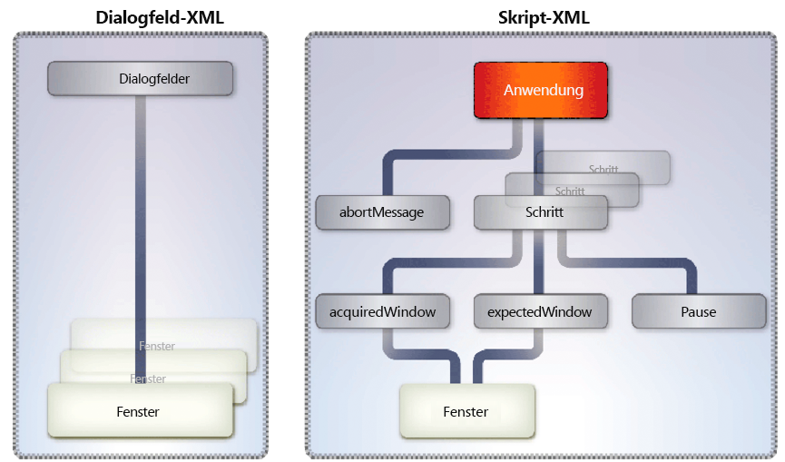

# Konvertieren zwischen Dateiformaten und PDF {#converting-between-file-formatsand-pdf}

**Beispiele und Beispiele in diesem Dokument gelten nur für die Umgebung AEM Forms on JEE.**

**Informationen zum Generate PDF-Dienst**

Der Generate PDF-Dienst kann zahlreiche native Dateiformate in PDF konvertieren. Er kann außerdem PDF-Dokumente in andere Dateiformate konvertieren und die Größe von PDF-Dokumenten optimieren.

Der Generate PDF-Dienst verwendet native Anwendungen, um die folgenden Dateiformate in PDF zu konvertieren. Sofern nicht anders aufgeführt, werden nur die deutschen, französischen, englischen und japanischen Versionen dieser Anwendungen unterstützt. *Windows* zeigt nur Unterstützung für Windows Server® 2003 und Windows Server 2008 an.

* Microsoft Office 2003 und 2007 zum Konvertieren von DOC, DOCX, RTF, TXT, XLS, XLSX, PPT, PPTX, VSD, MPP, MPPX, XPS und PUB (nur Windows)

>[!NOTE]
>
>Für die Konvertierung des Microsoft XPS-Formats in PDF ist Acrobat® 9.2 oder höher erforderlich.

* Autodesk AutoCAD 2005, 2006, 2007, 2008 und 2009 zum Konvertieren von DWF, DWG und DXW (nur auf Englisch)
* Corel WordPerfect 12 und X4 zum Konvertieren von WPD, QPW, SHW (nur auf Englisch)
* OpenOffice 2.0, 2.4, 3.0.1 und 3.1 zum Konvertieren von ODT, ODS, ODP, ODG, ODF, SXW, SXI, SXC, SXD, DOC, DOCX, RTF, RTF, XLS, XLSX, PPT, PPTX, VSD, MPP, MPPX und PUB

>[!NOTE]
>
>Der Generate PDF-Dienst unterstützt keine 64-Bit-Versionen von OpenOffice.

* Adobe Photoshop® CS2 zum Konvertieren von PSD (nur Windows)

>[!NOTE]
>
>Photoshop CS3 und CS4 werden nicht unterstützt, da Windows Server 2003 oder Windows Server 2008 nicht unterstützt wird.

* Adobe FrameMaker® 7.2 und 8 zum Konvertieren von FM (nur Windows)
* Adobe PageMaker® 7.0 zum Konvertieren von PMD, PM6, P65 und PM (nur Windows)
* Native Formate, die von Drittanbieteranwendungen unterstützt werden (erfordert Entwicklung von Setup-Dateien speziell für die Anwendung) (nur Windows)

Der Generate PDF-Dienst kann folgende standardbasierte Dateiformate in PDF konvertieren.

* Videoformate: SWF, FLV (nur Windows)
* Bildformate: JPEG, JPG, JP2, J2Kí, JPC, J2C, GIF, BMP, TIFF, TIF, PNG, JPF
* HTML (Windows, Sun™ Solaris™ und Linux®)

Der Generate PDF-Dienst kann PDF-Dateien in die folgenden Dateiformate konvertieren (nur Windows):

* Encapsulated PostScript (EPS)
* HTML3.2
* HTML 4.01 mit CSS 1.0
* DOC (Microsoft Word-Format)
* RTF
* Text (sowohl barrierefrei als auch unverschlüsselt)
* XML
* PDF/A-1a, das nur den DeviceRGB-Farbraum verwendet
* PDF/A-1b, das nur den DeviceRGB-Farbraum verwendet

Der Generate PDF-Dienst erfordert die Ausführung der folgenden Verwaltungsaufgaben:

* Installieren der erforderlichen nativen Anwendungen auf dem Computer, der als Host für AEM Forms dient
* Installieren Sie Adobe Acrobat Professional oder Acrobat Pro Extended 9.2 auf dem Computer, auf dem AEM Forms gehostet wird
* Ausführen von Einrichtungsaufgaben nach der Installation

Diese Aufgaben werden unter Installieren und Bereitstellen von AEM mit JBoss Turnkey beschrieben.

Sie können diese Aufgaben mithilfe des Generate PDF-Dienstes ausführen:

* Konvertieren von nativen Dateiformaten in PDF
* Konvertieren von HTML-Dokumenten in PDF-Dokumente
* Konvertieren von PDF-Dokumenten in Dateiformate

>[!NOTE]
>
>Weitere Informationen zum Generate PDF-Dienst finden Sie unter [Dienste-Referenz für AEM Forms](https://www.adobe.com/go/learn_aemforms_services_63).

## Word-Dokumente in PDF-Dokumente konvertieren {#converting-word-documents-to-pdf-documents}

In diesem Abschnitt wird beschrieben, wie Sie mit der Generate PDF-API ein Microsoft Word-Dokument programmgesteuert in ein PDF-Dokument konvertieren können.

>[!NOTE]
>
>Weitere Informationen zu weiteren Dateiformaten finden Sie unter [Hinzufügen der Unterstützung für weitere native Dateiformate](converting-file-formats-pdf.md#adding-support-for-additional-native-file-formats).

>[!NOTE]
>
>Weitere Informationen zum Generate PDF-Dienst finden Sie unter [Dienste-Referenz für AEM Forms](https://www.adobe.com/go/learn_aemforms_services_63).

### Zusammenfassung der Schritte {#summary-of-steps}

So konvertieren Sie ein Microsoft Word-Dokument in ein PDF-Dokument:

1. Schließen Sie Projektdateien ein.
1. Erstellen Sie einen Generate PDF-Client.
1. Rufen Sie die zu konvertierende Datei in ein PDF-Dokument ab.
1. Konvertieren Sie die Datei in ein PDF-Dokument.
1. Abrufen der Ergebnisse

**Projektdateien einschließen**

Schließen Sie die erforderlichen Dateien in Ihr Entwicklungsprojekt ein. Wenn Sie eine Clientanwendung mit Java erstellen, schließen Sie die erforderlichen JAR-Dateien ein. Wenn Sie Webdienste verwenden, stellen Sie sicher, dass Sie die Proxydateien einschließen.

**Erstellen eines Generate PDF-Clients**

Bevor Sie einen Generate PDF-Vorgang programmgesteuert durchführen können, erstellen Sie einen Generate PDF-Dienstclient. Wenn Sie die Java-API verwenden, erstellen Sie ein `GeneratePdfServiceClient`-Objekt. Wenn Sie die Webdienst-API verwenden, erstellen Sie ein `GeneratePDFServiceService`-Objekt.

**Rufen Sie die zu konvertierende Datei in ein PDF-Dokument ab**

Rufen Sie das Microsoft Word-Dokument ab, um es in ein PDF-Dokument zu konvertieren.

**Datei in ein PDF-Dokument konvertieren**

Nachdem Sie den Client des Generate PDF-Dienstes erstellt haben, können Sie die `createPDF2`-Methode aufrufen. Diese Methode erfordert Informationen zum zu konvertierenden Dokument, einschließlich der Dateierweiterung.

**Ergebnisse abrufen**

Nachdem die Datei in ein PDF-Dokument konvertiert wurde, können Sie die Ergebnisse abrufen. Wenn Sie beispielsweise eine Word-Datei in ein PDF-Dokument konvertieren, können Sie das PDF-Dokument abrufen und speichern.

**Siehe auch**

[Word-Dokumente mit der Java-API in PDF-Dokumente konvertieren](converting-file-formats-pdf.md#convert-word-documents-to-pdf-documents-using-the-java-api)

[Word-Dokumente mithilfe der Webdienst-API in PDF-Dokumente konvertieren](converting-file-formats-pdf.md#convert-word-documents-to-pdf-documents-using-the-web-service-api)

[Einbeziehung von AEM Forms Java-Bibliotheksdateien](/help/forms/developing/invoking-aem-forms-using-java.md#including-aem-forms-java-library-files)

[Verbindungseigenschaften festlegen](/help/forms/developing/invoking-aem-forms-using-java.md#setting-connection-properties)

[Generieren von PDF-Dienst-API-Quick-Beginn](/help/forms/developing/generate-pdf-service-java-api.md#generate-pdf-service-java-api-quick-start-soap)

### Word-Dokumente mit der Java-API {#convert-word-documents-to-pdf-documents-using-the-java-api} in PDF-Dokumente konvertieren

Konvertieren eines Microsoft Word-Dokuments in ein PDF-Dokument mithilfe der Generate PDF API (Java):

1. Schließen Sie Projektdateien ein.

   Schließen Sie Client-JAR-Dateien wie &quot;adobe-generatepdf-client.jar&quot;im Klassenpfad Ihres Java-Projekts ein.

1. Erstellen Sie einen Generate PDF-Client.

   * Erstellen Sie ein `ServiceClientFactory`-&quot; -Objekt, das Verbindungseigenschaften enthält.
   * Erstellen Sie ein `GeneratePdfServiceClient`-Objekt, indem Sie seinen Konstruktor verwenden und das `ServiceClientFactory`-Objekt übergeben.

1. Rufen Sie die zu konvertierende Datei in ein PDF-Dokument ab.

   * Erstellen Sie ein `java.io.FileInputStream`-Objekt, das die Word-Datei darstellt, die mithilfe des Konstruktors konvertiert werden soll. Übergeben Sie einen Zeichenfolgenwert, der den Dateispeicherort angibt.
   * Erstellen Sie ein `com.adobe.idp.Document`-Objekt, indem Sie seinen Konstruktor verwenden und das `java.io.FileInputStream`-Objekt übergeben.

1. Konvertieren Sie die Datei in ein PDF-Dokument.

   Konvertieren Sie die Datei in ein PDF-Dokument, indem Sie die `createPDF2`-Methode des `GeneratePdfServiceClient`-Objekts aufrufen und die folgenden Werte übergeben:

   * Ein `com.adobe.idp.Document`-Objekt, das die zu konvertierende Datei darstellt.
   * Ein `java.lang.String`-Objekt, das die Dateierweiterung enthält.
   * Ein `java.lang.String`-Objekt, das die bei der Konvertierung zu verwendenden Dateitypeinstellungen enthält. Dateitypeinstellungen bieten Konvertierungseinstellungen für verschiedene Dateitypen, z. B. .doc oder .xls.
   * Ein `java.lang.String`-Objekt, das den Namen der zu verwendenden PDF-Einstellungen enthält. Sie können beispielsweise `Standard` angeben.
   * Ein `java.lang.String`-Objekt, das den Namen der zu verwendenden Sicherheitseinstellungen enthält.
   * Ein optionales `com.adobe.idp.Document`-Objekt, das Einstellungen enthält, die beim Generieren des PDF-Dokuments angewendet werden sollen.
   * Ein optionales `com.adobe.idp.Document`-Objekt, das Metadateninformationen enthält, die auf das PDF-Dokument angewendet werden sollen.

   Die `createPDF2`-Methode gibt ein `CreatePDFResult`-Objekt zurück, das das neue PDF-Dokument und eine Protokollinformationen enthält. Die Protokolldatei enthält in der Regel Fehler- oder Warnmeldungen, die von der Konvertierungsanforderung generiert wurden.

1. Abrufen der Ergebnisse

   So rufen Sie das PDF-Dokument ab:

   * Rufen Sie die `getCreatedDocument`-Methode des Objekts auf, die ein `com.adobe.idp.Document`-Objekt zurückgibt.`CreatePDFResult`
   * Rufen Sie die `copyToFile`-Methode des Objekts auf, um das PDF-Dokument aus dem im vorherigen Schritt erstellten Objekt zu extrahieren.`com.adobe.idp.Document`

   Wenn Sie zum Abrufen des log-Dokuments die `createPDF2`-Methode verwendet haben (nicht für HTML-Konvertierungen), führen Sie die folgenden Schritte aus:

   * Rufen Sie die `CreatePDFResult`-Methode des Objekts `getLogDocument` auf. Gibt ein `com.adobe.idp.Document`-Objekt zurück.
   * Rufen Sie die `com.adobe.idp.Document`-Objektmethode `copyToFile` auf, um das log-Dokument zu extrahieren.


**Siehe auch**

[Zusammenfassung der Schritte](converting-file-formats-pdf.md#summary-of-steps)

[Quick Beginn (SOAP-Modus): Konvertieren eines Microsoft Word-Dokuments in ein PDF-Dokument mit der Java-API](/help/forms/developing/generate-pdf-service-java-api.md#quick-start-soap-mode-converting-a-microsoft-word-document-to-a-pdf-document-using-the-java-api)

[Einbeziehung von AEM Forms Java-Bibliotheksdateien](/help/forms/developing/invoking-aem-forms-using-java.md#including-aem-forms-java-library-files)

[Verbindungseigenschaften festlegen](/help/forms/developing/invoking-aem-forms-using-java.md#setting-connection-properties)

### Word-Dokumente mithilfe der Webdienst-API {#convert-word-documents-to-pdf-documents-using-the-web-service-api} in PDF-Dokumente konvertieren

Konvertieren eines Microsoft Word-Dokuments in ein PDF-Dokument mithilfe der Generate PDF API (Webdienst):

1. Schließen Sie Projektdateien ein.

   Erstellen Sie ein Microsoft .NET-Projekt, das MTOM verwendet. Stellen Sie sicher, dass Sie die folgende WSDL-Definition verwenden: `http://localhost:8080/soap/services/GeneratePDFService?WSDL&lc_version=9.0.1`.

   >[!NOTE]
   >
   >Ersetzen Sie `localhost` durch die IP-Adresse des Servers, auf dem AEM Forms gehostet wird.

1. Erstellen Sie einen Generate PDF-Client.

   * Erstellen Sie ein `GeneratePDFServiceClient`-Objekt mit dem Standardkonstruktor.
   * Erstellen Sie ein `GeneratePDFServiceClient.Endpoint.Address`-Objekt mit dem Konstruktor `System.ServiceModel.EndpointAddress`. Übergeben Sie einen Zeichenfolgenwert, der die WSDL an den AEM Forms-Dienst angibt (z. B. `http://localhost:8080/soap/services/GeneratePDFService?blob=mtom`). Sie müssen das Attribut `lc_version` nicht verwenden. Geben Sie jedoch `?blob=mtom` an.
   * Erstellen Sie ein `System.ServiceModel.BasicHttpBinding`-Objekt, indem Sie den Wert des Felds `GeneratePDFServiceClient.Endpoint.Binding` abrufen. Wandeln Sie den Rückgabewert in `BasicHttpBinding` um.
   * Setzen Sie das Feld `System.ServiceModel.BasicHttpBinding` des Objekts auf `MessageEncoding`. `WSMessageEncoding.Mtom` Dieser Wert stellt sicher, dass MTOM verwendet wird.
   * Aktivieren Sie die einfache HTTP-Authentifizierung, indem Sie die folgenden Aufgaben ausführen:

      * Weisen Sie dem Feld `GeneratePDFServiceClient.ClientCredentials.UserName.UserName` den AEM Forms-Benutzernamen zu.
      * Weisen Sie dem Feld `GeneratePDFServiceClient.ClientCredentials.UserName.Password` den entsprechenden Kennwortwert zu.
      * Weisen Sie dem Feld `BasicHttpBindingSecurity.Transport.ClientCredentialType` den Konstantenwert `HttpClientCredentialType.Basic` zu.
      * Weisen Sie dem Feld `BasicHttpBindingSecurity.Security.Mode` den Konstantenwert `BasicHttpSecurityMode.TransportCredentialOnly` zu.

1. Rufen Sie die zu konvertierende Datei in ein PDF-Dokument ab.

   * Erstellen Sie ein Objekt `BLOB`, indem Sie den Konstruktor verwenden. Das `BLOB`-Objekt wird zum Speichern der Datei verwendet, die Sie in ein PDF-Dokument konvertieren möchten.
   * Erstellen Sie ein `System.IO.FileStream`-Objekt, indem Sie den Konstruktor aufrufen. Übergeben Sie einen Zeichenfolgenwert, der den Dateispeicherort der zu konvertierenden Datei und den Modus zum Öffnen der Datei darstellt.
   * Erstellen Sie ein Bytearray, das den Inhalt des Objekts `System.IO.FileStream` speichert. Sie können die Größe des Byte-Arrays bestimmen, indem Sie die `System.IO.FileStream`-Eigenschaft des Objekts `Length` abrufen.
   * Füllen Sie das Bytearray mit Stream-Daten, indem Sie die `Read`-Methode des Objekts aufrufen und das Bytearray, die Startposition und die zu lesende Stream-Länge übergeben.`System.IO.FileStream`
   * Füllen Sie das `BLOB`-Objekt, indem Sie seiner `MTOM`-Eigenschaft den Inhalt des Byte-Arrays zuweisen.

1. Konvertieren Sie die Datei in ein PDF-Dokument.

   Konvertieren Sie die Datei in ein PDF-Dokument, indem Sie die `CreatePDF2`-Methode des `GeneratePDFServiceService`-Objekts aufrufen und die folgenden Werte übergeben:

   * Ein `BLOB`-Objekt, das die zu konvertierende Datei darstellt.
   * Eine Zeichenfolge, die die Dateierweiterung enthält.
   * Ein `java.lang.String`-Objekt, das die bei der Konvertierung zu verwendenden Dateitypeinstellungen enthält. Dateitypeinstellungen bieten Konvertierungseinstellungen für verschiedene Dateitypen, z. B. .doc oder .xls.
   * Ein Zeichenfolgenobjekt, das die zu verwendenden PDF-Einstellungen enthält. Sie können Folgendes angeben `Standard`.
   * Ein Zeichenfolgenobjekt, das die zu verwendenden Sicherheitseinstellungen enthält. Sie können Folgendes angeben `No Security`.
   * Ein optionales `BLOB`-Objekt, das Einstellungen enthält, die beim Generieren des PDF-Dokuments angewendet werden sollen.
   * Ein optionales `BLOB`-Objekt, das Metadateninformationen enthält, die auf das PDF-Dokument angewendet werden sollen.
   * Ein Ausgabeparameter des Typs `BLOB`, der durch die `CreatePDF2`-Methode gefüllt wird. Die `CreatePDF2`-Methode füllt dieses Objekt mit dem konvertierten Dokument. (Dieser Parameterwert ist nur für den Webdienst-Aufruf erforderlich).
   * Ein Ausgabeparameter des Typs `BLOB`, der durch die `CreatePDF2`-Methode gefüllt wird. Die `CreatePDF2`-Methode füllt dieses Objekt mit dem log-Dokument. (Dieser Parameterwert ist nur für den Webdienst-Aufruf erforderlich).

1. Abrufen der Ergebnisse

   * Rufen Sie das konvertierte PDF-Dokument ab, indem Sie das `BLOB`-Objektfeld `MTOM` einem Bytearray zuweisen. Das Byte-Array stellt das konvertierte PDF-Dokument dar. Stellen Sie sicher, dass Sie das `BLOB`-Objekt verwenden, das als Ausgabeparameter für die `createPDF2`-Methode verwendet wird.
   * Erstellen Sie ein `System.IO.FileStream`-Objekt, indem Sie den Konstruktor aufrufen und einen Zeichenfolgenwert übergeben, der den Dateispeicherort des konvertierten PDF-Dokuments darstellt.
   * Erstellen Sie ein `System.IO.BinaryWriter`-Objekt, indem Sie den Konstruktor aufrufen und das `System.IO.FileStream`-Objekt übergeben.
   * Schreiben Sie den Inhalt des Byte-Arrays in eine PDF-Datei, indem Sie die `Write`-Methode des Objekts aufrufen und das Bytearray übergeben.`System.IO.BinaryWriter`

**Siehe auch**

[Zusammenfassung der Schritte](converting-file-formats-pdf.md#summary-of-steps)

[Aufrufen von AEM Forms mit MTOM](/help/forms/developing/invoking-aem-forms-using-web.md#invoking-aem-forms-using-mtom)

[Aufrufen von AEM Forms mit SwaRef](/help/forms/developing/invoking-aem-forms-using-web.md#invoking-aem-forms-using-swaref)

## Konvertieren von HTML-Dokumenten in PDF-Dokumente {#converting-html-documents-to-pdf-documents}

In diesem Abschnitt wird beschrieben, wie Sie die Generate PDF-API verwenden können, um HTML-Dokumente programmgesteuert in PDF-Dokumente zu konvertieren.

>[!NOTE]
>
>Weitere Informationen zum Generate PDF-Dienst finden Sie unter [Dienste-Referenz für AEM Forms](https://www.adobe.com/go/learn_aemforms_services_63).

### Zusammenfassung der Schritte {#summary_of_steps-1}

So konvertieren Sie ein HTML-Dokument in ein PDF-Dokument:

1. Schließen Sie Projektdateien ein.
1. Erstellen Sie einen Generate PDF-Client.
1. Rufen Sie den HTML-Inhalt ab, der in ein PDF-Dokument konvertiert werden soll.
1. Konvertieren Sie den HTML-Inhalt in ein PDF-Dokument.
1. Abrufen der Ergebnisse

**Projektdateien einschließen**

Schließen Sie die erforderlichen Dateien in Ihr Entwicklungsprojekt ein. Wenn Sie eine Clientanwendung mit Java erstellen, schließen Sie die erforderlichen JAR-Dateien ein. Wenn Sie Webdienste verwenden, stellen Sie sicher, dass Sie die Proxydateien einschließen.

**Erstellen eines Generate PDF-Clients**

Bevor Sie einen Generate PDF-Vorgang programmgesteuert durchführen können, müssen Sie einen Generate PDF-Dienstclient erstellen. Wenn Sie die Java-API verwenden, erstellen Sie ein `GeneratePdfServiceClient`-Objekt. Wenn Sie die Webdienst-API verwenden, erstellen Sie ein `GeneratePDFServiceService`.

**Abrufen des HTML-Inhalts, der in ein PDF-Dokument konvertiert werden soll**

Verweisen Sie auf HTML-Inhalte, die Sie in ein PDF-Dokument konvertieren möchten. Sie können auf HTML-Inhalte wie eine HTML-Datei oder HTML-Inhalte verweisen, auf die über eine URL zugegriffen werden kann.

**HTML-Inhalt in ein PDF-Dokument konvertieren**

Nachdem Sie den Dienstclient erstellt haben, können Sie den entsprechenden PDF-Erstellungsvorgang aufrufen. Dieser Vorgang erfordert Informationen zum zu konvertierenden Dokument, einschließlich des Pfads zum Dokument Zielgruppe.

**Ergebnisse abrufen**

Nachdem der HTML-Inhalt in ein PDF-Dokument konvertiert wurde, können Sie die Ergebnisse abrufen und das PDF-Dokument speichern.

**Siehe auch**

[Konvertieren von HTML-Inhalten in ein PDF-Dokument mit der Java-API](converting-file-formats-pdf.md#convert-html-content-to-a-pdf-document-using-the-java-api)

[Konvertieren von HTML-Inhalten in ein PDF-Dokument mithilfe der Webdienst-API](converting-file-formats-pdf.md#convert-html-content-to-a-pdf-document-using-the-web-service-api)

[Einbeziehung von AEM Forms Java-Bibliotheksdateien](/help/forms/developing/invoking-aem-forms-using-java.md#including-aem-forms-java-library-files)

[Verbindungseigenschaften festlegen](/help/forms/developing/invoking-aem-forms-using-java.md#setting-connection-properties)

[Generieren von PDF-Dienst-API-Quick-Beginn](/help/forms/developing/generate-pdf-service-java-api.md#generate-pdf-service-java-api-quick-start-soap)

### Konvertieren von HTML-Inhalten in ein PDF-Dokument mit der Java-API {#convert-html-content-to-a-pdf-document-using-the-java-api}

Konvertieren eines HTML-Dokuments in ein PDF-Dokument mit der Generate PDF API (Java):

1. Schließen Sie Projektdateien ein.

   Schließen Sie Client-JAR-Dateien wie &quot;adobe-generatepdf-client.jar&quot;im Klassenpfad Ihres Java-Projekts ein.

1. Erstellen Sie einen Generate PDF-Client.

   Erstellen Sie ein `GeneratePdfServiceClient`-Objekt, indem Sie den Konstruktor verwenden und ein `ServiceClientFactory`-Objekt übergeben, das Verbindungseigenschaften enthält.

1. Rufen Sie den HTML-Inhalt ab, der in ein PDF-Dokument konvertiert werden soll.

   Rufen Sie HTML-Inhalte ab, indem Sie eine Zeichenfolgenvariable erstellen und eine URL zuweisen, die auf HTML-Inhalte verweist.

1. Konvertieren Sie den HTML-Inhalt in ein PDF-Dokument.

   Rufen Sie die `htmlToPDF2`-Methode des Objekts auf und übergeben Sie die folgenden Werte:`GeneratePdfServiceClient`

   * Ein `java.lang.String`-Objekt, das die URL der zu konvertierenden HTML-Datei enthält.
   * Ein `java.lang.String`-Objekt, das die bei der Konvertierung zu verwendenden Dateitypeinstellungen enthält. Die Dateitypeinstellungen können Spider-Ebenen enthalten.
   * Ein `java.lang.String`-Objekt, das den Namen der zu verwendenden Sicherheitseinstellungen enthält.
   * Ein optionales `com.adobe.idp.Document`-Objekt, das Einstellungen enthält, die beim Generieren des PDF-Dokuments angewendet werden sollen. Wenn diese Informationen nicht bereitgestellt werden, werden die Einstellungen automatisch anhand der drei vorhergehenden Parameter ausgewählt.
   * Ein optionales `com.adobe.idp.Document`-Objekt, das Metadateninformationen enthält, die auf das PDF-Dokument angewendet werden sollen.

1. Abrufen der Ergebnisse

   Die `htmlToPDF2`-Methode gibt ein `HtmlToPdfResult`-Objekt zurück, das das neue generierte PDF-Dokument enthält. So rufen Sie das neu erstellte PDF-Dokument ab:

   * Rufen Sie die `HtmlToPdfResult`-Methode des Objekts `getCreatedDocument` auf. Gibt ein `com.adobe.idp.Document`-Objekt zurück.
   * Rufen Sie die `copyToFile`-Methode des Objekts auf, um das PDF-Dokument aus dem im vorherigen Schritt erstellten Objekt zu extrahieren.`com.adobe.idp.Document`

**Siehe auch**

[Konvertieren von HTML-Dokumenten in PDF-Dokumente](converting-file-formats-pdf.md#converting-html-documents-to-pdf-documents)

[Quick Beginn (SOAP-Modus): Konvertieren von HTML-Inhalten in ein PDF-Dokument mit der Java-API](/help/forms/developing/generate-pdf-service-java-api.md#quick-start-soap-mode-converting-html-content-to-a-pdf-document-using-the-java-api)

[Quick Beginn (SOAP-Modus): Konvertieren von HTML-Inhalten in ein PDF-Dokument mit der Java-API](/help/forms/developing/generate-pdf-service-java-api.md#quick-start-soap-mode-converting-html-content-to-a-pdf-document-using-the-java-api)

[Einbeziehung von AEM Forms Java-Bibliotheksdateien](/help/forms/developing/invoking-aem-forms-using-java.md#including-aem-forms-java-library-files)

[Verbindungseigenschaften festlegen](/help/forms/developing/invoking-aem-forms-using-java.md#setting-connection-properties)

### Konvertieren von HTML-Inhalten in ein PDF-Dokument mithilfe der Webdienst-API {#convert-html-content-to-a-pdf-document-using-the-web-service-api}

Konvertieren von HTML-Inhalten in ein PDF-Dokument mithilfe der Generate PDF API (Webdienst):

1. Schließen Sie Projektdateien ein.

   Erstellen Sie ein Microsoft .NET-Projekt, das MTOM verwendet. Stellen Sie sicher, dass Sie die folgende WSDL-Definition verwenden: `http://localhost:8080/soap/services/GeneratePDFService?WSDL&lc_version=9.0.1`.

   >[!NOTE]
   >
   >Ersetzen Sie `localhost` durch die IP-Adresse des Servers, auf dem AEM Forms gehostet wird.

1. Erstellen Sie einen Generate PDF-Client.

   * Erstellen Sie ein `GeneratePDFServiceClient`-Objekt mit dem Standardkonstruktor.
   * Erstellen Sie ein `GeneratePDFServiceClient.Endpoint.Address`-Objekt mit dem Konstruktor `System.ServiceModel.EndpointAddress`. Übergeben Sie einen Zeichenfolgenwert, der die WSDL an den AEM Forms-Dienst angibt (z. B. `http://localhost:8080/soap/services/GeneratePDFService?blob=mtom`). Sie müssen das Attribut `lc_version` nicht verwenden. Geben Sie jedoch `?blob=mtom` an.
   * Erstellen Sie ein `System.ServiceModel.BasicHttpBinding`-Objekt, indem Sie den Wert des Felds `GeneratePDFServiceClient.Endpoint.Binding` abrufen. Wandeln Sie den Rückgabewert in `BasicHttpBinding` um.
   * Setzen Sie das Feld `System.ServiceModel.BasicHttpBinding` des Objekts auf `MessageEncoding`. `WSMessageEncoding.Mtom` Dieser Wert stellt sicher, dass MTOM verwendet wird.
   * Aktivieren Sie die einfache HTTP-Authentifizierung, indem Sie die folgenden Aufgaben ausführen:

      * Weisen Sie dem Feld `GeneratePDFServiceClient.ClientCredentials.UserName.UserName` den AEM Forms-Benutzernamen zu.
      * Weisen Sie dem Feld `GeneratePDFServiceClient.ClientCredentials.UserName.Password` den entsprechenden Kennwortwert zu.
      * Weisen Sie dem Feld `BasicHttpBindingSecurity.Transport.ClientCredentialType` den Konstantenwert `HttpClientCredentialType.Basic` zu.
      * Weisen Sie dem Feld `BasicHttpBindingSecurity.Security.Mode` den Konstantenwert `BasicHttpSecurityMode.TransportCredentialOnly` zu.

1. Rufen Sie den HTML-Inhalt ab, der in ein PDF-Dokument konvertiert werden soll.

   Rufen Sie HTML-Inhalte ab, indem Sie eine Zeichenfolgenvariable erstellen und eine URL zuweisen, die auf HTML-Inhalte verweist.

1. Konvertieren Sie den HTML-Inhalt in ein PDF-Dokument.

   Konvertieren Sie den HTML-Inhalt in ein PDF-Dokument, indem Sie die `HtmlToPDF2`-Methode des `GeneratePDFServiceService`-Objekts aufrufen und die folgenden Werte übergeben:

   * Eine Zeichenfolge, die den zu konvertierenden HTML-Inhalt enthält.
   * Ein `java.lang.String`-Objekt, das die bei der Konvertierung zu verwendenden Dateitypeinstellungen enthält.
   * Ein Zeichenfolgenobjekt, das die zu verwendenden Sicherheitseinstellungen enthält.
   * Ein optionales `BLOB`-Objekt, das Einstellungen enthält, die beim Generieren des PDF-Dokuments angewendet werden sollen.
   * Ein optionales `BLOB`-Objekt, das Metadateninformationen enthält, die auf das PDF-Dokument angewendet werden sollen.
   * Ein Ausgabeparameter des Typs `BLOB`, der durch die `CreatePDF2`-Methode gefüllt wird. Die `CreatePDF2`-Methode füllt dieses Objekt mit dem konvertierten Dokument. (Dieser Parameterwert ist nur für den Webdienst-Aufruf erforderlich).

1. Abrufen der Ergebnisse

   * Rufen Sie das konvertierte PDF-Dokument ab, indem Sie das `BLOB`-Objektfeld `MTOM` einem Bytearray zuweisen. Das Byte-Array stellt das konvertierte PDF-Dokument dar. Stellen Sie sicher, dass Sie das `BLOB`-Objekt verwenden, das als Ausgabeparameter für die `HtmlToPDF2`-Methode verwendet wird.
   * Erstellen Sie ein `System.IO.FileStream`-Objekt, indem Sie den Konstruktor aufrufen und einen Zeichenfolgenwert übergeben, der den Dateispeicherort des konvertierten PDF-Dokuments darstellt.
   * Erstellen Sie ein `System.IO.BinaryWriter`-Objekt, indem Sie den Konstruktor aufrufen und das `System.IO.FileStream`-Objekt übergeben.
   * Schreiben Sie den Inhalt des Byte-Arrays in eine PDF-Datei, indem Sie die `Write`-Methode des Objekts aufrufen und das Bytearray übergeben.`System.IO.BinaryWriter`

**Siehe auch**

[Konvertieren von HTML-Dokumenten in PDF-Dokumente](converting-file-formats-pdf.md#converting-html-documents-to-pdf-documents)

[Aufrufen von AEM Forms mit MTOM](/help/forms/developing/invoking-aem-forms-using-web.md#invoking-aem-forms-using-mtom)

[Aufrufen von AEM Forms mit SwaRef](/help/forms/developing/invoking-aem-forms-using-web.md#invoking-aem-forms-using-swaref)

## Konvertieren von PDF-Dokumenten in Nicht-Bildformate {#converting-pdf-documents-to-non-image-formats}

In diesem Abschnitt wird beschrieben, wie Sie mit der Generate PDF Java API und der Web Service API ein PDF-Dokument programmgesteuert in eine RTF-Datei konvertieren können. Dies ist ein Beispiel für ein Nicht-Bildformat. Andere Nicht-Bildformate sind HTML, Text, DOC und EPS. Stellen Sie beim Konvertieren eines PDF-Dokuments in RTF sicher, dass das PDF-Dokument keine Formularelemente wie z. B. eine Senden-Schaltfläche enthält. Formularelemente werden nicht konvertiert.

>[!NOTE]
>
>Weitere Informationen zum Generate PDF-Dienst finden Sie unter [Dienste-Referenz für AEM Forms](https://www.adobe.com/go/learn_aemforms_services_63).

### Zusammenfassung der Schritte {#summary_of_steps-2}

So konvertieren Sie ein PDF-Dokument in einen der unterstützten Typen:

1. Schließen Sie Projektdateien ein.
1. Erstellen Sie einen Generate PDF-Client.
1. Rufen Sie das zu konvertierende PDF-Dokument ab.
1. PDF-Dokument konvertieren.
1. Speichern Sie die konvertierte Datei.

**Projektdateien einschließen**

Schließen Sie die erforderlichen Dateien in Ihr Entwicklungsprojekt ein. Wenn Sie eine Clientanwendung mit Java erstellen, schließen Sie die erforderlichen JAR-Dateien ein. Wenn Sie Webdienste verwenden, stellen Sie sicher, dass Sie die Proxydateien einschließen.

**Erstellen eines Generate PDF-Clients**

Bevor Sie einen Generate PDF-Vorgang programmgesteuert durchführen können, müssen Sie einen Generate PDF-Dienstclient erstellen. Wenn Sie die Java-API verwenden, erstellen Sie ein `GeneratePdfServiceClient`-Objekt. Wenn Sie die Webdienst-API verwenden, erstellen Sie ein `GeneratePDFServiceService`-Objekt.

**Zu konvertierendes PDF-Dokument abrufen**

Rufen Sie das PDF-Dokument ab, um es in ein Nicht-Bildformat zu konvertieren.

**PDF-Dokument konvertieren**

Nachdem Sie den Dienstclient erstellt haben, können Sie den PDF-Exportvorgang aufrufen. Dieser Vorgang erfordert Informationen zum zu konvertierenden Dokument, einschließlich des Pfads zum Dokument Zielgruppe.

**Speichern der konvertierten Datei**

Speichern Sie die konvertierte Datei. Wenn Sie beispielsweise ein PDF-Dokument in eine RTF-Datei konvertieren, speichern Sie das konvertierte Dokument in einer RTF-Datei.

**Siehe auch**

[Konvertieren eines PDF-Dokuments in eine RTF-Datei mit der Java-API](converting-file-formats-pdf.md#convert-a-pdf-document-to-a-rtf-file-using-the-java-api)

[Konvertieren eines PDF-Dokuments in eine RTF-Datei mithilfe der Webdienst-API](converting-file-formats-pdf.md#convert-a-pdf-document-to-a-rtf-file-using-the-web-service-api)

[Einbeziehung von AEM Forms Java-Bibliotheksdateien](/help/forms/developing/invoking-aem-forms-using-java.md#including-aem-forms-java-library-files)

[Verbindungseigenschaften festlegen](/help/forms/developing/invoking-aem-forms-using-java.md#setting-connection-properties)

[Generieren von PDF-Dienst-API-Quick-Beginn](/help/forms/developing/generate-pdf-service-java-api.md#generate-pdf-service-java-api-quick-start-soap)

### Konvertieren eines PDF-Dokuments in eine RTF-Datei mit der Java-API {#convert-a-pdf-document-to-a-rtf-file-using-the-java-api}

Konvertieren Sie ein PDF-Dokument mithilfe der Generate PDF API (Java) in eine RTF-Datei:

1. Schließen Sie Projektdateien ein.

   Schließen Sie Client-JAR-Dateien wie &quot;adobe-generatepdf-client.jar&quot;im Klassenpfad Ihres Java-Projekts ein.

1. Erstellen Sie einen Generate PDF-Client.

   Erstellen Sie ein `GeneratePdfServiceClient`-Objekt, indem Sie den Konstruktor verwenden und ein `ServiceClientFactory`-Objekt übergeben, das Verbindungseigenschaften enthält.

1. Rufen Sie das zu konvertierende PDF-Dokument ab.

   * Erstellen Sie ein `java.io.FileInputStream`-Objekt, das das PDF-Dokument darstellt, das mithilfe des Konstruktors konvertiert werden soll. Übergeben Sie einen Zeichenfolgenwert, der den Speicherort des PDF-Dokuments angibt.
   * Erstellen Sie ein `com.adobe.idp.Document`-Objekt, indem Sie seinen Konstruktor verwenden und das `java.io.FileInputStream`-Objekt übergeben.

1. PDF-Dokument konvertieren.

   Rufen Sie die `exportPDF2`-Methode des Objekts auf und übergeben Sie die folgenden Werte:`GeneratePdfServiceClient`

   * Ein `com.adobe.idp.Document`-Objekt, das die zu konvertierende PDF-Datei darstellt.
   * Ein `java.lang.String`-Objekt, das den Namen der zu konvertierenden Datei enthält.
   * Ein `java.lang.String`-Objekt, das den Namen der Adobe PDF-Einstellungen enthält.
   * Ein `ConvertPDFFormatType`-Objekt, das den Dateityp der Zielgruppe für die Konvertierung angibt.
   * Ein optionales `com.adobe.idp.Document`-Objekt, das Einstellungen enthält, die beim Generieren des PDF-Dokuments angewendet werden sollen.

   Die `exportPDF2`-Methode gibt ein `ExportPDFResult`-Objekt zurück, das die konvertierte Datei enthält.

1. PDF-Dokument konvertieren.

   Um die neu erstellte Datei abzurufen, führen Sie die folgenden Schritte aus:

   * Rufen Sie die `ExportPDFResult`-Methode des Objekts `getConvertedDocument` auf. Gibt ein `com.adobe.idp.Document`-Objekt zurück.
   * Rufen Sie die `com.adobe.idp.Document`-Objektmethode `copyToFile` auf, um das neue Dokument zu extrahieren.

**Siehe auch**

[Zusammenfassung der Schritte](converting-file-formats-pdf.md#summary-of-steps)

[Quick Beginn (SOAP-Modus): Konvertieren von HTML-Inhalten in ein PDF-Dokument mit der Java-API](/help/forms/developing/generate-pdf-service-java-api.md#quick-start-soap-mode-converting-html-content-to-a-pdf-document-using-the-java-api)

[Einbeziehung von AEM Forms Java-Bibliotheksdateien](/help/forms/developing/invoking-aem-forms-using-java.md#including-aem-forms-java-library-files)

[Verbindungseigenschaften festlegen](/help/forms/developing/invoking-aem-forms-using-java.md#setting-connection-properties)

### Konvertieren eines PDF-Dokuments in eine RTF-Datei mithilfe der Webdienst-API {#convert-a-pdf-document-to-a-rtf-file-using-the-web-service-api}

Konvertieren Sie ein PDF-Dokument mithilfe der Generate PDF API (Webdienst) in eine RTF-Datei:

1. Schließen Sie Projektdateien ein.

   Erstellen Sie ein Microsoft .NET-Projekt, das MTOM verwendet. Stellen Sie sicher, dass Sie die folgende WSDL-Definition verwenden: `http://localhost:8080/soap/services/GeneratePDFService?WSDL&lc_version=9.0.1`.

   >[!NOTE]
   >
   >Ersetzen Sie `localhost` durch die IP-Adresse des Servers, auf dem AEM Forms gehostet wird.

1. Erstellen Sie einen Generate PDFf-Client.

   * Erstellen Sie ein `GeneratePDFServiceClient`-Objekt mit dem Standardkonstruktor.
   * Erstellen Sie ein `GeneratePDFServiceClient.Endpoint.Address`-Objekt mit dem Konstruktor `System.ServiceModel.EndpointAddress`. Übergeben Sie einen Zeichenfolgenwert, der die WSDL an den AEM Forms-Dienst angibt (z. B. `http://localhost:8080/soap/services/GeneratePDFService?blob=mtom`). Sie müssen das Attribut `lc_version` nicht verwenden. Geben Sie jedoch `?blob=mtom` an.
   * Erstellen Sie ein `System.ServiceModel.BasicHttpBinding`-Objekt, indem Sie den Wert des Felds `GeneratePDFServiceClient.Endpoint.Binding` abrufen. Wandeln Sie den Rückgabewert in `BasicHttpBinding` um.
   * Setzen Sie das Feld `System.ServiceModel.BasicHttpBinding` des Objekts auf `MessageEncoding`. `WSMessageEncoding.Mtom` Dieser Wert stellt sicher, dass MTOM verwendet wird.
   * Aktivieren Sie die einfache HTTP-Authentifizierung, indem Sie die folgenden Aufgaben ausführen:

      * Weisen Sie dem Feld `GeneratePDFServiceClient.ClientCredentials.UserName.UserName` den AEM Forms-Benutzernamen zu.
      * Weisen Sie dem Feld `GeneratePDFServiceClient.ClientCredentials.UserName.Password` den entsprechenden Kennwortwert zu.
      * Weisen Sie dem Feld `BasicHttpBindingSecurity.Transport.ClientCredentialType` den Konstantenwert `HttpClientCredentialType.Basic` zu.
      * Weisen Sie dem Feld `BasicHttpBindingSecurity.Security.Mode` den Konstantenwert `BasicHttpSecurityMode.TransportCredentialOnly` zu.

1. Rufen Sie das zu konvertierende PDF-Dokument ab.

   * Erstellen Sie ein Objekt `BLOB`, indem Sie den Konstruktor verwenden. Das `BLOB`-Objekt wird zum Speichern eines konvertierten PDF-Dokuments verwendet.
   * Erstellen Sie ein `System.IO.FileStream`-Objekt, indem Sie den Konstruktor aufrufen und einen Zeichenfolgenwert übergeben, der den Dateispeicherort des PDF-Dokuments und den Dateimodus darstellt, in dem die Datei geöffnet werden soll.
   * Erstellen Sie ein Bytearray, das den Inhalt des Objekts `System.IO.FileStream` speichert. Sie können die Größe des Byte-Arrays bestimmen, indem Sie die `System.IO.FileStream`-Eigenschaft des Objekts `Length` abrufen.
   * Füllen Sie das Bytearray mit Stream-Daten, indem Sie die `Read`-Methode des Objekts aufrufen und das Bytearray, die Startposition und die zu lesende Stream-Länge übergeben.`System.IO.FileStream`
   * Füllen Sie das `BLOB`-Objekt, indem Sie seiner `MTOM`-Eigenschaft den Inhalt des Byte-Arrays zuweisen.

1. PDF-Dokument konvertieren.

   Rufen Sie die `ExportPDF2`-Methode des Objekts auf und übergeben Sie die folgenden Werte:`GeneratePDFServiceServiceWse`

   * Ein `BLOB`-Objekt, das die zu konvertierende PDF-Datei darstellt.
   * Eine Zeichenfolge, die den Pfadnamen der zu konvertierenden Datei enthält.
   * Ein `java.lang.String`-Objekt, das den Dateispeicherort angibt.
   * Ein Zeichenfolgenobjekt, das den Dateityp der Zielgruppe für die Konvertierung angibt. Geben Sie `RTF`.
   * Ein optionales `BLOB`-Objekt, das Einstellungen enthält, die beim Generieren des PDF-Dokuments angewendet werden sollen.
   * Ein Ausgabeparameter des Typs `BLOB`, der durch die `ExportPDF2`-Methode gefüllt wird. Die `ExportPDF2`-Methode füllt dieses Objekt mit dem konvertierten Dokument. (Dieser Parameterwert ist nur für den Webdienst-Aufruf erforderlich).

1. Speichern Sie die konvertierte Datei.

   * Rufen Sie das konvertierte RTF-Dokument ab, indem Sie das `BLOB`-Objektfeld `MTOM` einem Bytearray zuweisen. Das Byte-Array stellt das konvertierte RTF-Dokument dar. Stellen Sie sicher, dass Sie das `BLOB`-Objekt verwenden, das als Ausgabeparameter für die `ExportPDF2`-Methode verwendet wird.
   * Erstellen Sie ein `System.IO.FileStream`-Objekt, indem Sie den Konstruktor aufrufen. Übergeben Sie einen Zeichenfolgenwert, der den Speicherort der RTF-Datei darstellt.
   * Erstellen Sie ein `System.IO.BinaryWriter`-Objekt, indem Sie den Konstruktor aufrufen und das `System.IO.FileStream`-Objekt übergeben.
   * Schreiben Sie den Inhalt des Byte-Arrays in eine RTF-Datei, indem Sie die `Write`-Methode des Objekts aufrufen und das Bytearray übergeben.`System.IO.BinaryWriter`

**Siehe auch**

[Zusammenfassung der Schritte](converting-file-formats-pdf.md#summary-of-steps)

[Aufrufen von AEM Forms mit MTOM](/help/forms/developing/invoking-aem-forms-using-web.md#invoking-aem-forms-using-mtom)

[Aufrufen von AEM Forms mit SwaRef](/help/forms/developing/invoking-aem-forms-using-web.md#invoking-aem-forms-using-swaref)

## Hinzufügen der Unterstützung für weitere native Dateiformate {#adding-support-for-additional-native-file-formats}

In diesem Abschnitt wird beschrieben, wie Sie Unterstützung für weitere native Dateiformate hinzufügen. Es bietet einen Überblick über die Interaktionen zwischen dem Generate PDF-Dienst und den nativen Anwendungen, die dieser Dienst zum Konvertieren von nativen Dateiformaten in PDF verwendet.

In diesem Abschnitt werden außerdem die folgenden Themen erläutert:

* So ändern Sie die Antwort, die der Generate PDF-Dienst den nativen Anwendungen bereitstellt, die dieses Produkt bereits verwendet, um native Dateiformate in PDF zu konvertieren
* Die Interaktionen zwischen dem Generate PDF-Dienst, der Komponente &quot;Generate PDF Service Application Monitor&quot;(AppMon) und nativen Anwendungen wie Microsoft Word
* Die Rollen, die XML-Grammatiken in diesen Interaktionen spielen

### Komponenteninteraktionen {#component-interactions}

Der Generate PDF-Dienst konvertiert native Dateiformate, indem er die mit dem Dateiformat verknüpfte Anwendung aufruft und dann mit der Anwendung interagiert, um das Dokument mit dem Standarddrucker zu drucken. Der Standarddrucker muss als Adobe PDF-Drucker eingerichtet werden.

Diese Abbildung zeigt die Komponenten und Treiber, die mit der Unterstützung nativer Anwendungen verbunden sind. Es werden auch die XML-Grammatiken erwähnt, die die Interaktionen beeinflussen.

Komponenteninteraktionen für die Konvertierung nativer Dateien

In diesem Dokument wird der Begriff *native Anwendung* verwendet, um anzugeben, mit welcher Anwendung ein natives Dateiformat wie Microsoft Word erstellt wird.

** AppMonis ist eine Unternehmenskomponente, die mit einer nativen Anwendung auf dieselbe Weise interagiert, wie ein Benutzer durch die von dieser Anwendung angezeigten Dialogfelder navigiert. Die von AppMon verwendeten XML-Grammatiken, mit denen eine Anwendung wie Microsoft Word angewiesen wird, eine Datei zu öffnen und zu drucken, umfassen folgende sequenzielle Aufgaben:

1. Öffnen der Datei durch Auswahl von &quot;Datei&quot;> &quot;Öffnen&quot;
1. Sicherstellen, dass das Dialogfeld &quot;Öffnen&quot;angezeigt wird; falls nicht, Verarbeitung des Fehlers
1. Geben Sie den Dateinamen im Feld &quot;Dateiname&quot;ein und klicken Sie dann auf die Schaltfläche &quot;Öffnen&quot;
1. Sicherstellen, dass die Datei tatsächlich geöffnet wird
1. Öffnen des Dialogfelds &quot;Drucken&quot;durch Auswahl von &quot;Datei&quot;> &quot;Drucken&quot;
1. Sicherstellen, dass das Dialogfeld &quot;Drucken&quot;angezeigt wird

AppMon verwendet standardmäßige Win32-APIs, um mit Drittanbieteranwendungen zu interagieren, um UI-Ereignis wie Tastenanschläge und Mausklicks zu übertragen. Dies ist nützlich, um diese Anwendungen zu steuern und PDF-Dateien daraus zu erstellen.

Aufgrund einer Einschränkung bei diesen Win32-APIs ist AppMon nicht in der Lage, diese UI-Ereignis an bestimmte Windows-Typen zu senden, wie z. B. schwebende Menüleisten (z. B. TextPad) und bestimmte Dialoge, deren Inhalt nicht mit den Win32-APIs abgerufen werden kann.

Eine schwebende Menüleiste lässt sich leicht visuell identifizieren. Es kann jedoch nicht möglich sein, die speziellen Dialoge nur durch visuelle Prüfung zu identifizieren. Sie benötigen eine Drittanbieteranwendung wie Microsoft Spy+ (Teil der Microsoft Visual C++-Entwicklungs-Umgebung) oder eine entsprechende WinID (die kostenlos von [https://www.dennisbabkin.com/php/download.php?what=WinID](https://www.dennisbabkin.com/php/download.php?what=WinID) heruntergeladen werden kann), um einen Dialog zu prüfen, um festzustellen, ob AppMon mit den standardmäßigen Win32-APIs interagieren kann.

Wenn WinID in der Lage ist, den Inhalt des Dialogfelds wie Text, Unterfenster, Fensterklasse-ID usw. zu extrahieren, kann AppMon dies ebenfalls tun.

In dieser Tabelle werden die beim Drucken von nativen Dateiformaten verwendeten Informationen Liste.

<table>
 <thead>
  <tr>
   <th><p>Informationstyp</p></th>
   <th><p>Beschreibung</p></th>
   <th><p>Einträge für native Dateien ändern/erstellen </p></th>
  </tr>
 </thead>
 <tbody>
  <tr>
   <td><p>Administrative Einstellungen </p></td>
   <td><p>Umfasst PDF-Einstellungen, Sicherheitseinstellungen und Dateitypeinstellungen. </p><p>Dateitypeinstellungen verknüpfen Dateinamenerweiterungen mit den entsprechenden nativen Anwendungen. Mit den Dateitypeinstellungen werden auch native Anwendungseinstellungen zum Drucken von nativen Dateien festgelegt. </p></td>
   <td><p>Um die Einstellungen für eine bereits unterstützte native Anwendung zu ändern, legt der Systemadministrator die Dateitypeinstellungen in Administration Console fest. </p><p>Um Unterstützung für ein neues natives Dateiformat hinzuzufügen, müssen Sie die Datei manuell bearbeiten. (Siehe <a href="converting-file-formats-pdf.md#adding-or-modifying-support-for-a-native-file-format">Hinzufügen oder Ändern der Unterstützung für ein natives Dateiformat</a>.) </p></td>
  </tr>
  <tr>
   <td><p>Script </p></td>
   <td><p>Gibt Interaktionen zwischen dem Generate PDF-Dienst und einer nativen Anwendung an. Solche Interaktionen leiten die Anwendung normalerweise zum Drucken einer Datei an den Adobe PDF-Treiber. </p><p>Das Skript enthält Anweisungen, mit denen die native Anwendung angewiesen wird, bestimmte Dialogfelder zu öffnen, und die bestimmte Antworten auf Felder und Schaltflächen in diesen Dialogfeldern bereitstellen. </p></td>
   <td><p>Der Generate PDF-Dienst enthält Skriptdateien für alle unterstützten nativen Anwendungen. Sie können diese Dateien mit einer XML-Bearbeitungsanwendung ändern.</p><p>Um Unterstützung für eine neue native Anwendung hinzuzufügen, müssen Sie eine neue Skriptdatei erstellen. (Siehe <a href="converting-file-formats-pdf.md#creating-or-modifying-an-additional-dialog-xml-file-for-a-native-application">Erstellen oder Ändern einer zusätzlichen XML-Dialogfelddatei für eine native Anwendung</a>.) </p></td>
  </tr>
  <tr>
   <td><p>Allgemeine Anweisungen des Dialogfelds </p></td>
   <td><p>Gibt an, wie auf Dialogfelder reagiert werden soll, die mehreren Anwendungen gemein sind. Solche Dialogfelder werden von Betriebssystemen, Hilfsprogrammen (wie PDFMaker) und Treibern generiert. </p><p>Die Datei, die diese Informationen enthält, lautet "appmon.global.en_US.xml".</p></td>
   <td><p>Ändern Sie diese Datei nicht. </p></td>
  </tr>
  <tr>
   <td><p>Anwendungsspezifische Dialogfeldanweisungen</p></td>
   <td><p>Gibt an, wie auf anwendungsspezifische Dialogfelder reagiert werden soll. </p><p>Die Datei, die diese Informationen enthält, ist appmon.<i>"[Anwendungsname]"</i>.dialog.<i>s[locale]`</i>.xml (z. B. appmon.word.en_US.xml).</p></td>
   <td><p>Ändern Sie diese Datei nicht. </p><p>Informationen zum Hinzufügen von Dialogfeldanweisungen für eine neue native Anwendung finden Sie unter <a href="converting-file-formats-pdf.md#creating_or_modifying_an_additional_dialog_xml_file_for_a_native_application">Erstellen oder Ändern einer zusätzlichen XML-Dialogfelddatei für eine native Anwendung</a>.</p></td>
  </tr>
  <tr>
   <td><p>Zusätzliche anwendungsspezifische Dialogfeldanweisungen </p></td>
   <td><p>Gibt Überschreibungen und Ergänzungen zu anwendungsspezifischen Dialogfeldanweisungen an. Der Abschnitt enthält ein Beispiel für solche Informationen. </p><p>Die Datei, die diese Informationen enthält, ist appmon.<i>"[Anwendungsname]"</i>.additional.<i>"[Gebietsschema]"</i>.xml. Ein Beispiel ist appmon.additional.de_DE.xml.</p></td>
   <td><p>Dateien dieses Typs können mit einer XML-Bearbeitungsanwendung erstellt und geändert werden. (Siehe <a href="converting-file-formats-pdf.md#creating-or-modifying-an-additional-dialog-xml-file-for-a-native-application">Erstellen oder Ändern einer zusätzlichen XML-Dialogfelddatei für eine native Anwendung</a>.) </p><p><strong>Wichtig</strong>: Sie müssen für jede native Anwendung, die Ihr Server unterstützt, zusätzliche anwendungsspezifische Dialogfeldanweisungen erstellen. </p></td>
  </tr>
 </tbody>
</table>

### Grundlagen zu Skript- und Dialogfeld-XML-Dateien {#about-the-script-and-dialog-xml-files}

Skript-XML-Dateien weisen den Generate PDF-Dienst an, durch Anwendungsdialogfelder zu navigieren, genau wie ein Benutzer durch die Anwendungsdialogfelder navigieren würde. Skript-XML-Dateien weisen den Generate PDF-Dienst auch an, auf Dialogfelder zu reagieren, indem sie beispielsweise Schaltflächen drücken, Kontrollkästchen aktivieren oder deaktivieren oder Menüelemente auswählen.

Im Gegensatz dazu reagieren die XML-Dialogfelddateien einfach auf Dialogfelder mit den gleichen Aktionstypen, die in XML-Skriptdateien verwendet werden.

#### Dialogfeld- und Fensterelementterminologie {#dialog-box-and-window-element-terminology}

In diesem Abschnitt und im nächsten Abschnitt werden je nach Perspektive unterschiedliche Terminologie für Dialogfelder und die darin enthaltenen Komponenten verwendet. Dialogfeldkomponenten sind Elemente wie Schaltflächen, Felder und Kombinationsfelder.

Wenn in diesem Abschnitt und im nächsten Abschnitt Dialogfelder und deren Komponenten aus der Perspektive eines Benutzers beschrieben werden, werden Begriffe wie *dialog box*, *button*, *field* und *combo box* verwendet.

Wenn dieser Abschnitt und der nächste Abschnitt Dialogfelder und ihre Komponenten aus der Perspektive ihrer internen Darstellung beschreiben, wird der Begriff *window element* verwendet. Die interne Darstellung der Fensterelemente ist eine Hierarchie, in der jede Fensterelementinstanz durch Beschriftungen gekennzeichnet wird. Die Window-Elementinstanz beschreibt auch ihre physikalischen Eigenschaften und ihr Verhalten.

Aus der Perspektive eines Benutzers zeigen die Dialogfelder und ihre Komponenten ein unterschiedliches Verhalten, wobei einige Dialogfeldelemente ausgeblendet werden, bis sie aktiviert werden. Aus der Sicht der internen Repräsentation gibt es keine solche Frage des Verhaltens. Beispielsweise sieht die interne Darstellung eines Dialogfelds ähnlich aus wie die der darin enthaltenen Komponenten, mit Ausnahme der Verschachtelung der Komponenten im Dialogfeld.

In diesem Abschnitt werden XML-Elemente beschrieben, die AppMon Anweisungen geben. Diese Elemente haben Namen wie das `dialog`-Element und das `window`-Element. Dieses Dokument verwendet eine Schriftart mit Konstantleisten, um XML-Elemente zu unterscheiden. Das `dialog`-Element identifiziert ein Dialogfeld, das eine XML-Skriptdatei absichtlich oder unbeabsichtigt anzeigen kann. Das `window`-Element identifiziert ein Fensterelement (Dialogfeld oder die Komponenten eines Dialogfelds).

#### Hierarchie {#hierarchy}

Dieses Diagramm zeigt die Hierarchie von Skript- und Dialog-XML. Eine XML-Skriptdatei entspricht dem Schema script.xsd, das (im XML-Sinne) das Schema window.xsd enthält. Entsprechend entspricht eine XML-Datei im Dialogfeld dem Schema dialogs.xsd, das auch das Schema window.xsd enthält.



Hierarchie von Skript- und Dialogfeld-XML

#### Skript-XML-Dateien {#script-xml-files}

Eine *Skript-XML-Datei* gibt eine Reihe von Schritten an, die die native Anwendung zum Navigieren zu bestimmten Fensterelementen anweisen und dann Antworten auf diese Elemente bereitstellen. Bei den meisten Antworten handelt es sich um Text oder Tastenkombinationen, die den Eingaben entsprechen, die ein Benutzer in ein Feld, ein Kombinationsfeld oder eine Schaltfläche im entsprechenden Dialogfeld eingeben würde.

Der Zweck der Unterstützung des Generate PDF-Dienstes für XML-Skriptdateien besteht darin, eine native Anwendung zum Drucken einer nativen Datei anzuweisen. Skript-XML-Dateien können jedoch verwendet werden, um jede Aufgabe auszuführen, die ein Benutzer bei der Interaktion mit den Dialogfeldern der nativen Anwendung ausführen kann.

Die Schritte in einer XML-Skriptdatei werden in der richtigen Reihenfolge ausgeführt, ohne dass eine Verzweigung möglich ist. Der einzige unterstützte bedingte Test ist das Zeitlimit/Wiederholen, wodurch ein Skript beendet wird, wenn ein Schritt innerhalb eines bestimmten Zeitraums und nach einer bestimmten Anzahl von weiteren Zustellversuchen nicht erfolgreich abgeschlossen wird.

Zusätzlich zu den sequenziellen Schritten werden die Anweisungen in einem Schritt auch in der richtigen Reihenfolge ausgeführt. Sie müssen sicherstellen, dass die Schritte und Anweisungen die Reihenfolge widerspiegeln, in der ein Benutzer dieselben Schritte durchführen würde.

Jeder Schritt in einer XML-Skript-Datei identifiziert das Fensterelement, das angezeigt werden soll, wenn die Anweisungen des Schritts erfolgreich ausgeführt wurden. Wenn beim Ausführen eines Skriptschritts ein unerwartetes Dialogfeld angezeigt wird, durchsucht der Generate PDF-Dienst die XML-Dateien des Dialogfelds, wie im nächsten Abschnitt beschrieben.

#### Dialogfeld-XML-Dateien {#dialog-xml-files}

Beim Ausführen nativer Anwendungen werden verschiedene Dialogfelder angezeigt, die unabhängig davon angezeigt werden, ob sich die nativen Anwendungen im sichtbaren oder unsichtbaren Modus befinden. Die Dialogfelder können vom Betriebssystem oder von der Anwendung selbst erstellt werden. Wenn native Anwendungen unter der Kontrolle des Generate PDF-Dienstes ausgeführt werden, werden die Dialogfelder &quot;System&quot;und &quot;native Anwendung&quot;in einem unsichtbaren Fenster angezeigt.

Eine *dialog-XML-Datei* gibt an, wie der Generate PDF-Dienst auf systemeigene oder native Anwendungsdialogfelder reagiert. Die XML-Dateien des Dialogfelds ermöglichen es dem Generate PDF-Dienst, auf nicht erforderliche Dialogfelder zu reagieren, sodass der Konvertierungsprozess erleichtert wird.

Wenn das System oder die native Anwendung ein Dialogfeld anzeigt, das nicht von der derzeit ausgeführten XML-Skript-Datei verarbeitet wird, durchsucht der Generate PDF-Dienst die XML-Dateien der Dialogfelder in dieser Reihenfolge und beendet, wenn eine Übereinstimmung gefunden wird:

* appmon.`[appname]`.additional.`[locale]`.xml
* appmon.`[appname]`.`[locale]`.xml (Ändern Sie diese Datei nicht.)
* appmon.global.`[locale]`.xml (Ändern Sie diese Datei nicht.)

Wenn der Generate PDF-Dienst eine Übereinstimmung für das Dialogfeld findet, wird er durch Senden der Tastenkombination oder einer anderen für das Dialogfeld angegebenen Aktion geschlossen. Wenn in den Anweisungen für das Dialogfeld eine Abbruchmeldung angegeben ist, beendet der Generate PDF-Dienst den derzeit ausgeführten Auftrag und generiert eine Fehlermeldung. Eine solche Abbruchmeldung würde im `abortMessage`-Element in der XML-Skriptgrammatik angegeben werden.

Wenn der Generate PDF-Dienst auf ein Dialogfeld stößt, das in keiner der zuvor aufgeführten Dateien beschrieben ist, fügt der Generate PDF-Dienst die Beschriftung des Dialogfelds in den Eintrag für die Protokolldatei ein. Der derzeit ausgeführte Auftrag läuft schließlich ab. Mithilfe der Informationen in der Protokolldatei können Sie dann neue Anweisungen in der zusätzlichen XML-Datei für das Dialogfeld für die native Anwendung zusammenstellen.

### Hinzufügen oder Ändern der Unterstützung für ein natives Dateiformat {#adding-or-modifying-support-for-a-native-file-format}

In diesem Abschnitt werden die Aufgaben beschrieben, die Sie ausführen müssen, um andere native Dateiformate zu unterstützen oder die Unterstützung für ein bereits unterstütztes natives Dateiformat zu ändern.

Bevor Sie Unterstützung hinzufügen oder ändern können, müssen Sie die folgenden Aufgaben ausführen.

#### Auswählen eines Tools zum Identifizieren von Fensterelementen {#choosing-a-tool-for-identifying-window-elements}

Bei den XML-Dateien für Dialogfeld und Skript müssen Sie das Fensterelement (Dialogfeld, Feld oder andere Dialogfeldkomponente) identifizieren, auf das Ihr Dialogfeld oder Skriptelement reagiert. Wenn ein Skript beispielsweise ein Menü für eine native Anwendung aufruft, muss das Skript das Fensterelement in diesem Menü identifizieren, auf das Tastenanschläge oder Aktionen angewendet werden sollen.

Sie können ein Dialogfeld einfach anhand der Beschriftung in der Titelleiste identifizieren. Sie müssen jedoch ein Werkzeug wie Microsoft Spy++ verwenden, um Fensterelemente der unteren Ebene zu identifizieren. Die Fensterelemente der unteren Ebene können durch eine Vielzahl von Attributen identifiziert werden, die nicht offensichtlich sind. Darüber hinaus kann jede native Anwendung das Fensterelement anders identifizieren. Daher gibt es mehrere Möglichkeiten, ein Fensterelement zu identifizieren. Hier finden Sie die empfohlene Reihenfolge für die Berücksichtigung der Identifizierung des Fensters:

1. Beschriftung selbst, wenn sie eindeutig ist
1. Steuerelement-ID, die für ein bestimmtes Dialogfeld eindeutig sein kann oder nicht
1. Klassenname, der eindeutig sein kann oder nicht

Jedes dieser drei Attribute kann zur Identifizierung eines Fensters verwendet werden.

Wenn die Attribute eine Beschriftung nicht identifizieren, können Sie stattdessen ein Fensterelement anhand seines Indexes in Bezug auf das übergeordnete Element identifizieren. Ein *index* gibt die Position des Fensters relativ zu seinen Geschwisterfensterelementen an. Häufig sind Indizes die einzige Möglichkeit, Kombinationsfelder zu identifizieren.

Achten Sie auf folgende Probleme:

* Microsoft Spy++ zeigt Beschriftungen mit einem kaufmännischen Und (&amp;) an, um den Hotkey der Beschriftung zu identifizieren. Beispielsweise zeigt Spy++ die Beschriftung für ein Druckdialogfeld als `Pri&nt` an, was bedeutet, dass der Hotkey *n* lautet. Beschriftungstitel in Skript- und Dialogfeld-XML-Dateien müssen keine kaufmännischen Zeichen enthalten.
* Einige Beschriftungen enthalten Zeilenumbrüche. Der Generate PDF-Dienst kann Zeilenumbrüche nicht identifizieren. Wenn eine Beschriftung einen Zeilenumbruch enthält, muss die Beschriftung ausreichend groß sein, um sie von den anderen Menüelementen zu unterscheiden, und dann für den ausgelassenen Teil reguläre Ausdruck verwenden. Ein Beispiel ist ( `^Long caption title$`). (Siehe [Verwenden von regulären Ausdrücken in Beschriftungsattributen](converting-file-formats-pdf.md#using-regular-expressions-in-caption-attributes).)
* Verwenden Sie Zeichenentitäten (auch als Escape-Sequenzen bezeichnet) für reservierte XML-Zeichen. Verwenden Sie beispielsweise `&` für kaufmännische und `<`- und `>`-Zeichen für Symbole, `&apos;` für Apostrophe und `&quot;` für Anführungszeichen.

Wenn Sie mit Dialog- oder Skript-XML-Dateien arbeiten möchten, sollten Sie die Anwendung Microsoft Spy++ installieren.

#### Entpacken des Dialogfelds und der Skriptdateien {#unpackaging-the-dialog-and-script-files}

Die Dialogue- und Skriptdateien befinden sich in der Datei &quot;appmondata.jar&quot;. Bevor Sie eine dieser Dateien ändern oder neue Skript- oder Dialogfelddateien hinzufügen können, müssen Sie die Verpackung dieser JAR-Datei aufheben. Angenommen, Sie möchten Unterstützung für die Anwendung EditPlus hinzufügen. Sie erstellen zwei XML-Dateien mit den Namen &quot;appmon.editplus.script.en_US.xml&quot;und &quot;appmon.editplus.script.additional.en_US.xml&quot;. Diese XML-Skripten müssen der Datei &quot;adobe-appmondata.jar&quot;an zwei Speicherorten hinzugefügt werden, wie unten angegeben:

* adobe-livecycle-native-jboss-x86_win32.ear > adobe-Native2PDFSvc.war\WEB-INF\lib > adobe-native.jar > Native2PDFSvc-native.jar\bin > adobe-appmondata.jar\com\adobe\appmon. Die Datei &quot;adobe-livecycle-native-jboss-x86_win32.ear&quot;befindet sich im Exportordner unter `[AEM forms install directory]\configurationManager`. (Wenn AEM Forms auf einem anderen J2EE-Anwendungsserver bereitgestellt wird, ersetzen Sie die Datei &quot;adobe-livecycle-native-jboss-x86_win32.ear&quot;durch die EAR-Datei, die Ihrem J2EE-Anwendungsserver entspricht.)
* adobe-generatepdf-dsc.jar > adobe-appmondata.jar\com\adobe\appmon (die Datei &quot;adobe-appmondata.jar&quot;befindet sich in der Datei &quot;adobe-generatepdf-dsc.jar&quot;). Die Datei &quot;adobe-generatepdf-dsc.jar&quot;befindet sich im Ordner &quot;`[AEM forms install directory]\deploy`&quot;.

Nachdem Sie diese XML-Dateien der Datei &quot;adobe-appmondata.jar&quot;hinzugefügt haben, müssen Sie die GeneratePDF-Komponente erneut bereitstellen. So fügen Sie der Datei &quot;adobe-appmondata.jar&quot;Dialogue- und Skript-XML-Dateien hinzu:

1. Öffnen Sie mithilfe eines Tools wie WinZip oder WinRAR die Datei adobe-livecycle-native-jboss-x86_win32.earfile > adobe-Native2PDFSvc.war\WEB-INF\lib > adobe-native.jar > Native2PDFSvc-native.jar\bin > adobe-appmondata.jar.
1. hinzufügen Sie die XML-Dateien &quot;dialog&quot;und &quot;script&quot;in die Datei &quot;appmondata.jar&quot;oder ändern Sie vorhandene XML-Dateien in dieser Datei. (Siehe [Erstellen oder Ändern einer XML-Skript-Skriptdatei für eine native Anwendung](converting-file-formats-pdf.md#creating-or-modifying-a-script-xml-file-for-a-native-application)und [Erstellen oder Ändern einer zusätzlichen XML-Datei für ein natives Dialogfeld](converting-file-formats-pdf.md#creating-or-modifying-an-additional-dialog-xml-file-for-a-native-application).)
1. Öffnen Sie mit einem Tool wie WinZip oder WinRAR adobe-generatepdf-dsc.jar > adobe-appmondata.jar.
1. hinzufügen Sie die XML-Dateien &quot;dialog&quot;und &quot;script&quot;in die Datei &quot;appmondata.jar&quot;oder ändern Sie vorhandene XML-Dateien in dieser Datei. (Siehe [Erstellen oder Ändern einer XML-Skript-Skriptdatei für eine native Anwendung](converting-file-formats-pdf.md#creating-or-modifying-a-script-xml-file-for-a-native-application)und [Erstellen oder Ändern einer zusätzlichen XML-Datei für ein natives Dialogfeld](converting-file-formats-pdf.md#creating-or-modifying-an-additional-dialog-xml-file-for-a-native-application).) Nachdem Sie die XML-Dateien zur Datei &quot;adobe-appmondata.jar&quot;hinzugefügt haben, fügen Sie die neue Datei &quot;adobe-appmondata.jar&quot;in die Datei &quot;adobe-generatepdf-dsc.jar&quot;ein.
1. Wenn Sie Unterstützung für ein zusätzliches natives Dateiformat hinzugefügt haben, erstellen Sie eine Systemvariable, die den Anwendungspfad bereitstellt (siehe [Erstellen einer Anwendungsvariablen, um die native Umgebung](converting-file-formats-pdf.md#creating-an-environment-variable-to-locate-the-native-application) zu finden.)

**So stellen Sie die GeneratePDF-Komponente erneut bereit**

1. Melden Sie sich bei Workbench an.
1. Wählen Sie **Window** > **Show Ansichten** > **Components**. Dadurch wird die Komponenten-Ansicht zu Workbench hinzugefügt.
1. Klicken Sie mit der rechten Maustaste auf die Komponente GeneratePDF und wählen Sie **Stopp Component**.
1. Wenn die Komponente beendet wurde, klicken Sie mit der rechten Maustaste und wählen Sie Komponente deinstallieren, um sie zu entfernen.
1. Klicken Sie mit der rechten Maustaste auf das Symbol **Komponenten** und wählen Sie **Komponente** installieren.
1. Suchen Sie die geänderte Datei &quot;adobe-generatepdf-dsc.jar&quot;und wählen Sie sie aus. Klicken Sie anschließend auf &quot;Öffnen&quot;. Beachten Sie, dass neben der GeneratePDF-Komponente ein rotes Quadrat angezeigt wird.
1. Erweitern Sie die Komponente GeneratePDF, wählen Sie Dienstdeskriptoren und klicken Sie dann mit der rechten Maustaste auf GeneratePDFService und wählen Sie Dienst aktivieren.
1. Geben Sie im daraufhin angezeigten Dialogfeld &quot;Konfiguration&quot;die entsprechenden Konfigurationswerte ein. Wenn Sie diese Werte leer lassen, werden die Standardkonfigurationswerte verwendet.
1. Klicken Sie mit der rechten Maustaste auf GeneratePDF und wählen Sie Beginn Component.
1. Erweitern Sie Active Services. Wenn der Dienst ausgeführt wird, wird neben dem Dienstnamen ein grüner Pfeil angezeigt. Andernfalls befindet sich der Dienst im Status &quot;Beendet&quot;.
1. Wenn sich der Dienst im Status &quot;Beendet&quot;befindet, klicken Sie mit der rechten Maustaste auf den Dienstnamen und wählen Sie Beginn-Dienst.

### Skript-XML-Datei für eine native Anwendung {#creating-or-modifying-a-script-xml-file-for-a-native-application} erstellen oder ändern

Wenn Sie Dateien an eine neue native Anwendung weiterleiten möchten, müssen Sie eine XML-Skript-Datei für diese Anwendung erstellen. Wenn Sie die Interaktion des Generate PDF-Dienstes mit einer bereits unterstützten nativen Anwendung ändern möchten, müssen Sie das Skript für diese Anwendung ändern.

Das Skript enthält Anweisungen, die durch die Fensterelemente der nativen Anwendung navigieren und spezifische Antworten auf diese Elemente bereitstellen. Die Datei, die diese Informationen enthält, lautet `appmon.`[appname]&quot;`.script.`[locale]`.xml`. Ein Beispiel ist appmon.notepad.script.en_US.xml.

#### Identifizieren der Schritte, die das Skript ausführen muss {#identifying-steps-the-script-must-execute}

Legen Sie mithilfe der nativen Anwendung die zu navigierenden Fensterelemente und jede Antwort fest, die Sie zum Drucken des Dokuments ausführen müssen. Beachten Sie die Dialogfelder, die sich aus einer Antwort ergeben. Die Schritte ähneln den folgenden Schritten:

1. Wählen Sie „Datei“ > „Öffnen“.
1. Geben Sie den Pfad an und klicken Sie auf Öffnen.
1. Wählen Sie in der Menüleiste &quot;Datei&quot;> &quot;Drucken&quot;.
1. Geben Sie die für den Drucker erforderlichen Eigenschaften an.
1. Wählen Sie &quot;Drucken&quot;und warten Sie, bis das Dialogfeld &quot;Speichern unter&quot;angezeigt wird. Das Dialogfeld &quot;Speichern unter&quot;ist erforderlich, damit der Generate PDF-Dienst das Ziel für die PDF-Datei angeben kann.

#### Identifizieren der in den Beschriftungsattributen {#identifying-the-dialogs-specified-in-caption-attributes} angegebenen Dialogfelder

Verwenden Sie Microsoft Spy++, um die IDs der Eigenschaften von Fensterelementen in der nativen Anwendung abzurufen. Sie müssen über diese Identitäten verfügen, um Skripten zu schreiben.

#### Verwenden von regulären Ausdrücken in Beschriftungsattributen {#using-regular-expressions-in-caption-attributes}

Sie können reguläre Ausdruck in Beschriftungsspezifikationen verwenden. Der Generate PDF-Dienst verwendet die `java.util.regex.Matcher`-Klasse, um reguläre Ausdruck zu unterstützen. Dieses Dienstprogramm unterstützt die unter `java.util.regex.Pattern` beschriebenen regulären Ausdruck. (Rufen Sie die Java-Website unter [https://java.sun.com/j2se/1.4.2/docs/api/java/util/regex/Pattern.html](https://java.sun.com/j2se/1.4.2/docs/api/java/util/regex/Pattern.html) auf.)

**Regulärer Ausdruck, der den Dateinamen enthält, der im Notepad-Banner dem Editor vorangestellt wird**

```xml
 <!-- The regular expression ".*Notepad" means any number of non-terminating characters followed by Notepad. -->
 <step>
     <expectedWindow>
         <window caption=".*Notepad"/>
     </expectedWindow>
 </step>
```

**Regulärer Ausdruck, der Druck von der Druckeinrichtung unterscheidet**

```xml
 <!-- This regular expression differentiates the Print dialog box from the Print Setup dialog box. The "^" specifies the beginning of the line, and the "$" specifies the end of the line. -->
 <windowList>
     <window controlID="0x01" caption="^Print$" action="press"/>
 </windowList>
```

#### Reihenfolge der window- und windowList-Elemente {#ordering-the-window-and-windowlist-elements}

Sie müssen die Elemente `window` und `windowList` wie folgt bestellen:

* Wenn mehrere `window`-Elemente als untergeordnete Elemente in einem `windowList`- oder `dialog`-Element angezeigt werden, ordnen Sie diese `window`-Elemente in absteigender Reihenfolge an, wobei die Länge der `caption`-Namen die Position in der Reihenfolge angibt.
* Wenn mehrere `windowList`-Elemente in einem `window`-Element angezeigt werden, ordnen Sie diese `windowList`-Elemente in absteigender Reihenfolge an, wobei die Länge der `caption`-Attribute des ersten `indexes/`Elements die Position in der Reihenfolge angibt.

**Reihenfolge von Fensterelementen in einer Dialogfelddatei**

```xml
 <!-- The caption attribute in the following window element is 40 characters long. It is the longest caption in this example, so its parent window element appears before the others. -->
 <window caption="Unexpected Failure in DebugActiveProcess">
     <…>
 </window>

 <!-- Caption length is 33 characters. -->
 <window caption="Adobe Acrobat - License Agreement">
     <…>
 </window>

 <!-- Caption length is 33 characters. -->
 <window caption="Microsoft Visual.*Runtime Library">
     <…>
 </window>

 <!-- The caption attribute in the following window element is 28 characters long. It is the shortest caption in this example, so its parent window element appears after the others. -->
 <window caption="Adobe Acrobat - Registration">
     <…>
 </window>
```

**Reihenfolge von Fensterelementen in einem windowList-Element**

```xml
 <!-- The caption attribute in the following indexes element is 56 characters long. It is the longest caption in this example, so its parent window element appears before the others. -->
 <windowList>
     <window caption="Can&apos;t exit design mode because.* cannot be created"/>
     <window className="Button" caption="OK" action="press"/>
 </windowList>
 <windowList>
     <window caption="Do you want to continue loading the project?"/>
     <window className="Button" caption="No" action="press"/>
 </windowList>
 <windowList>
     <window caption="The macros in this project are disabled"/>
     <window className="Button" caption="OK" action="press"/>
 </windowList>
```

### Erstellen oder Bearbeiten einer zusätzlichen XML-Datei für ein Dialogfeld für eine native Anwendung {#creating-or-modifying-an-additional-dialog-xml-file-for-a-native-application}

Wenn Sie ein Skript für eine native Anwendung erstellen, die zuvor nicht unterstützt wurde, müssen Sie auch eine zusätzliche XML-Datei für das Dialogfeld für diese Anwendung erstellen. Jede native Anwendung, die von AppMon verwendet wird, muss nur eine zusätzliche XML-Datei für das Dialogfeld haben. Die zusätzliche XML-Datei für das Dialogfeld ist erforderlich, auch wenn keine unangeforderten Dialogfelder erwartet werden. Das zusätzliche Dialogfeld muss mindestens ein `window`-Element enthalten, auch wenn dieses `window`-Element lediglich ein Platzhalter ist.

>[!NOTE]
>
>In diesem Zusammenhang bezeichnet der Begriff &quot;zusätzlich&quot;den Inhalt der Datei `appmon.[applicationname].addition.[locale]`.xml. Eine solche Datei gibt Überschreibungen und Ergänzungen zur XML-Datei des Dialogfelds an.

Sie können die zusätzliche XML-Datei für das Dialogfeld für eine native Anwendung für folgende Zwecke ändern:

* So überschreiben Sie die XML-Datei des Dialogfelds für eine Anwendung mit einer anderen Antwort
* So fügen Sie eine Antwort zu einem Dialogfeld hinzu, das in der XML-Datei des Dialogfelds für diese Anwendung nicht adressiert ist

Der Dateiname, der eine zusätzliche Datei &quot;dialogXML&quot;identifiziert, ist `appmon.[appname].addition.[locale].xml`. Ein Beispiel ist appmon.excel.additional.de_DE.xml.

Der Name der zusätzlichen XML-Datei im Dialogfeld muss das Format `appmon.[applicationname].addition.[locale].xml` verwenden, wobei *applicationName* exakt mit dem Anwendungsnamen übereinstimmen muss, der in der XML-Konfigurationsdatei und im Skript verwendet wird.

>[!NOTE]
>
>Keine der in der Konfigurationsdatei native2pdfconfig.xml angegebenen generischen Anwendungen verfügt über eine primäre XML-Datei für das Dialogfeld. Im Abschnitt [Hinzufügen oder Ändern der Unterstützung für ein natives Dateiformat](converting-file-formats-pdf.md#adding-or-modifying-support-for-a-native-file-format) werden diese Spezifikationen beschrieben.

Sie müssen `windowList`-Elemente sortieren, die als untergeordnete Elemente in einem `window`-Element angezeigt werden. (Siehe [Reihenfolge der Fenster- und windowList-Elemente](converting-file-formats-pdf.md#ordering-the-window-and-windowlist-elements).)

### Ändern der XML-Datei für das allgemeine Dialogfeld {#modifying-the-general-dialog-xml-file}

Sie können die XML-Datei des allgemeinen Dialogfelds ändern, um auf vom System erstellte Dialogfelder zu reagieren oder auf Dialogfelder zu reagieren, die mehreren Anwendungen gemein sind.

#### Hinzufügen eines Dateityps in der XML-Konfigurationsdatei {#adding-a-filetype-entry-in-the-xml-configuration-file}

Dieses Verfahren beschreibt, wie Sie die Konfigurationsdatei des Generate PDF-Dienstes aktualisieren, um Dateitypen mit nativen Anwendungen zu verknüpfen. Um diese Konfigurationsdatei zu aktualisieren, müssen Sie Administration Console verwenden, um die Konfigurationsdaten in eine Datei zu exportieren. Der Standarddateiname für die Konfigurationsdaten ist native2pdfconfig.xml.

**Konfigurationsdatei des Generate PDF-Dienstes aktualisieren**

1. Wählen Sie **Home** > **Dienste** > **Adobe PDF Generator** > **Konfigurationsdateien** und wählen Sie dann **Konfiguration exportieren**.
1. Ändern Sie nach Bedarf das Element `filetype-settings` in der Datei native2pdfconfig.xml.
1. Wählen Sie **Home** > **Dienste** > **Adobe PDF Generator** >**Konfigurationsdateien** und wählen Sie dann **Konfiguration importieren**. Die Konfigurationsdaten werden in den Generate PDF-Dienst importiert, wobei vorherige Einstellungen ersetzt werden.

>[!NOTE]
>
>Der Name der Anwendung wird als Wert des `GenericApp`-Elementattributs `name` angegeben. Dieser Wert muss exakt mit dem entsprechenden Namen übereinstimmen, der im Skript angegeben ist, das Sie für diese Anwendung entwickeln. Gleichermaßen sollte das `displayName`-Attribut des Elements genau mit der `expectedWindow`-Fensterbeschriftung des entsprechenden Skripts übereinstimmen. `GenericApp` Diese Gleichwertigkeit wird bewertet, nachdem alle regulären Ausdruck gelöst wurden, die in den Attributen `displayName` oder `caption` angezeigt werden.

In diesem Beispiel wurden die mit dem Generate PDF-Dienst bereitgestellten Standardkonfigurationsdaten geändert, um anzugeben, dass Notepad (nicht Microsoft Word) zur Verarbeitung von Dateien mit der Dateinamenerweiterung .txt verwendet werden soll. Vor dieser Änderung wurde Microsoft Word als native Anwendung angegeben, die solche Dateien verarbeiten soll.

**Änderungen zum Weiterleiten von Textdateien an Notepad (native2pdfconfig.xml)**

```xml
 <filetype-settings>

 <!-- Some native app file types were omitted for brevity. -->
 <!-- The following GenericApp element specifies Notepad as the native application that should be used to process files that have a txt file name extension. -->
             <GenericApp
                 extensions="txt"
                 name="Notepad" displayName=".*Notepad"/>
             <GenericApp
                 extensions="wpd"
                 name="WordPerfect" displayName="Corel WordPerfect"/>
             <GenericApp extensions="pmd,pm6,p65,pm"
                 name="PageMaker" displayName="Adobe PageMaker"/>
             <GenericApp extensions="fm"
                 name="FrameMaker" displayName="Adobe FrameMaker"/>
             <GenericApp extensions="psd"
                 name="Photoshop" displayName="Adobe Photoshop"/>
         </settings>
     </filetype-settings>
```

#### Erstellen einer Variablen für die Umgebung zum Suchen der nativen Anwendung {#creating-an-environment-variable-to-locate-the-native-application}

Erstellen Sie eine Variable zur Umgebung, die den Speicherort der ausführbaren Datei der nativen Anwendung angibt. Die Variable muss das Format `[applicationname]_PATH` verwenden, wobei *applicationname* exakt mit dem Anwendungsnamen übereinstimmen muss, der in der XML-Konfigurationsdatei und im Skript verwendet wird, und bei dem der Pfad den Pfad zur ausführbaren Dublette in Anführungszeichen enthält. Ein Beispiel für eine solche Umgebung ist `Photoshop_PATH`.

Nach dem Erstellen der neuen Umgebung-Variablen müssen Sie den Server neu starten, auf dem der Generate PDF-Dienst bereitgestellt ist.

**Systemvariable in der Windows XP-Umgebung erstellen**

1. Wählen Sie **Systemsteuerung > System**.
1. Klicken Sie im Dialogfeld &quot;Systemeigenschaften&quot;auf die Registerkarte **Erweitert** und klicken Sie dann auf **Variablen der Umgebung**.
1. Klicken Sie unter &quot;Systemvariablen&quot;im Dialogfeld &quot;Umgebung-Variablen&quot;auf **Neu**.
1. Geben Sie im Dialogfeld &quot;Neue Systemvariable&quot;im Feld **Variablenname** einen Namen ein, der das Format `[applicationname]_PATH` verwendet.
1. Geben Sie in das Feld **Variablenwert** den vollständigen Pfad und den Dateinamen der ausführbaren Datei der Anwendung ein und klicken Sie dann auf **OK**. Geben Sie beispielsweise: `c:\windows\Notepad.exe`
1. Klicken Sie im Dialogfeld &quot;Variablen der Umgebung&quot;auf **OK**.

**Systemvariable über die Befehlszeile erstellen**

1. Geben Sie in ein Befehlszeilenfenster die Variablendefinition in folgendem Format ein:

   ```shell
            [applicationname]_PATH=[Full path name]
   ```

   Geben Sie beispielsweise: `NotePad_PATH=C:\WINDOWS\NOTEPAD.EXE`

1. Beginn Sie eine neue Eingabeaufforderung, damit die Systemvariable wirksam wird.

#### XML-Dateien {#xml-files}

AEM Forms enthält XML-Beispieldateien, die dazu führen, dass der Generate PDF-Dienst Notepad zur Verarbeitung von Dateien mit der Dateierweiterung .txt verwendet. Dieser Code ist in diesem Abschnitt enthalten. Darüber hinaus müssen Sie die anderen in diesem Abschnitt beschriebenen Änderungen vornehmen.

#### Zusätzliche XML-Dialogfelddatei {#additional-dialog-xml-file}

Dieses Beispiel enthält die zusätzlichen Dialogfelder für die Notepad-Anwendung. Diese Dialogfelder können zusätzlich zu den vom Generate PDF-Dienst angegebenen Dialogfeldern angezeigt werden.

**Notepad-Dialogfelder(appmon.notepad.additional.en_US.xml)**

```xml
 <dialogs app="Notepad" locale="en_US" version="7.0" xmlns:xsi="https://www.w3.org/2001/XMLSchema-instance" xsi:noNamespaceSchemaLocation="dialogs.xsd">
     <window caption="Caption Title">
         <windowList>
             <window className="Button" caption="OK" action="press"/>
         </windowList>
     </window>
 </dialogs>
```

#### Skript-XML-Datei {#script-xml-file}

In diesem Beispiel wird angegeben, wie der Generate PDF-Dienst mit Notepad interagieren soll, um Dateien mithilfe des Adobe PDF-Druckers zu drucken.

**Notepad-Skript-XML-Datei (appmon.notepad.script.en_US.xml)**

```xml
<?xml version="1.0" encoding="UTF-8" standalone="yes"?>
<!--
*
* ADOBE CONFIDENTIAL
* ___________________
* Copyright 2004 - 2005 Adobe Systems Incorporated
* All Rights Reserved.
*
* NOTICE:  All information contained herein is, and remains
* the property of Adobe Systems Incorporated and its suppliers,
* if any.  The intellectual and technical concepts contained
* herein are proprietary to Adobe Systems Incorporated and its
* suppliers and may be covered by U.S. and Foreign Patents,
* patents in process, and are protected by trade secret or copyright law.
* Dissemination of this information or reproduction of this material
* is strictly forbidden unless prior written permission is obtained
* from Adobe Systems Incorporated.
*-->

<!-- This file automates printing of text files via notepad to Adobe PDF printer. In order to see the complete hierarchy we recommend using the Microsoft Spy++ which details the properties of windows necessary to write scripts. In this sample there are total of eight steps-->

<application name="Notepad" version="9.0" locale="en_US" xmlns:xsi="https://www.w3.org/2001/XMLSchema-instance" xsi:noNamespaceSchemaLocation="scripts.xsd">

    <!-- In this step we wait for the application window to appear -->
    <step>
        <expectedWindow>
            <window caption=".*Notepad"/>
        </expectedWindow>
    </step>

    <!-- In this step, we acquire the application window and send File->Open menu bar, menu item commands and the expectation is the windows Open dialog-->
    <step>
        <acquiredWindow>
            <window caption=".*Notepad">
                <virtualInput>
                    <menuBar>
                        <selection>
                            <name>File</name>
                        </selection>
                        <selection>
                            <name>Open...</name>
                        </selection>
                    </menuBar>
                </virtualInput>
            </window>
        </acquiredWindow>
        <expectedWindow>
            <window caption="Open"/>
        </expectedWindow>
    </step>

    <!-- In this step, we acquire the Open window and then select the 'Edit' widget and input the source path followed by clicking on the 'Open' button . The expectation of this 'action' is that the Open dialog will disappear -->
    <step>
        <acquiredWindow>
            <window caption="Open">
                <windowList>
                    <window className="ComboBoxEx32">
                        <windowList>
                            <window className="ComboBox">
                                <windowList>
                                <window className="Edit" action="inputSourcePath"/>
                                </windowList>
                            </window>
                        </windowList>
                    </window>
                </windowList>
                <windowList>
                    <window className="Button" caption="Open" action="press"/>
                </windowList>
            </window>
        </acquiredWindow>
        <expectedWindow>
            <window caption="Open" action="disappear"/>
        </expectedWindow>
        <pause value="30"/>
    </step>

    <!-- In this step, we acquire the application window and send File->Print menu bar, menu item commands and the expectation is the windows Print dialog-->
    <step>
        <acquiredWindow>
            <window caption=".*Notepad">
                <virtualInput>
                    <menuBar>
                        <selection>
                            <name>File</name>
                        </selection>
                        <selection>
                            <name>Print...</name>
                        </selection>
                    </menuBar>
                </virtualInput>
            </window>
        </acquiredWindow>
        <expectedWindow>
            <window caption="Print">
        </window>
        </expectedWindow>
    </step>

    <!-- In this step, we acquire the Print dialog and click on the 'Preferences' button and the expected window in this case is the dialog with the caption '"Printing Preferences' -->
    <step>
        <acquiredWindow>
            <window caption="Print">
                <windowList>
                    <window caption="General">
                        <windowList>
                            <window className="Button" caption="Preferences" action="press"/>
                        </windowList>
                    </window>
                </windowList>
            </window>
        </acquiredWindow>
        <expectedWindow>
            <window caption="Printing Preferences"/>
        </expectedWindow>
    </step>

    <!-- In this step, we acquire the dialog "Printing Preferences' and select the combo box which is the 10th child of window with caption '"Adobe PDF Settings' and select the first index. (Note: All indeces start with 0.) Besides this we uncheck the box which  has the caption '"View Adobe PDF results' and we click on the button OK. The expectation is that 'Printing Preferences' dialog disappears. -->
    <step>
        <acquiredWindow>
            <window caption="Printing Preferences">
                <windowList>
                    <window caption="Adobe PDF Settings">
                        <windowList>
                            <window className="Button" caption="View Adobe PDF results" action="uncheck"/>
                        </windowList>
                        <windowList>
                            <window className="Button" caption="Ask to Replace existing PDF file" action="uncheck"/>
                        </windowList>
                    </window>
                </windowList>
                <windowList>
                    <window className="Button" caption="OK" action="press"/>
                </windowList>
            </window>
        </acquiredWindow>
        <expectedWindow>
            <window caption="Printing Preferences" action="disappear"/>
        </expectedWindow>
    </step>

    <!-- In this step, we acquire the 'Print' dialog and click on the Print button. The expectation is that the dialog with caption 'Print' disappears. In this case we use the regular expression '^Print$' for specifying the caption given there could be multiple dialogs with caption that includes the word Print. -->
    <step>
        <acquiredWindow>
            <window caption="Print">
                <windowList>
                    <window caption="General"/>
                    <window className="Button" caption="^Print$" action="press"/>
                </windowList>
            </window>
        </acquiredWindow>
        <expectedWindow>
            <window caption="Print" action="disappear"/>
        </expectedWindow>
    </step>
    <step>
        <expectedWindow>
            <window caption="Save PDF File As"/>
        </expectedWindow>
    </step>
    <!-- Finally in this step, we acquire the dialog with caption "Save PDF File As" and in the Edit widget type the destination path for the output PDF file and click on the Save button. The expectation is that the dialog disappears-->
    <step>
        <acquiredWindow>
            <window caption="Save PDF File As">
                <windowList>
                    <window className="Edit" action="inputDestinationPath"/>
                </windowList>
                <windowList>
                    <window className="Button" caption="Save" action="press"/>
                </windowList>
            </window>
        </acquiredWindow>
        <expectedWindow>
            <window caption="Save PDF File As" action="disappear"/>
        </expectedWindow>
    </step>

    <!-- We can always set a retry count or a maximum time for a step. In case we surpass these limitations, PDF Generator generates this abort message and terminates processing. -->
    <abortMessage msg="15078"/>
</application>
```

