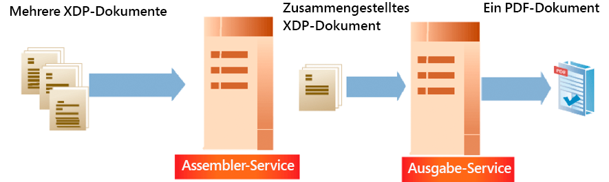
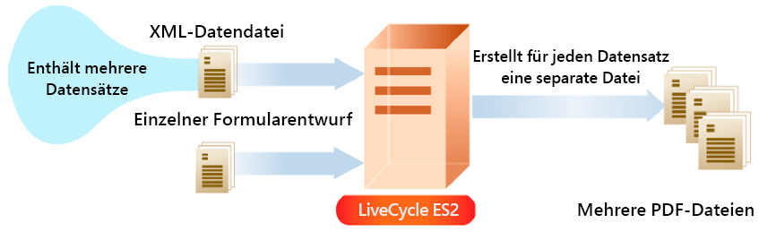
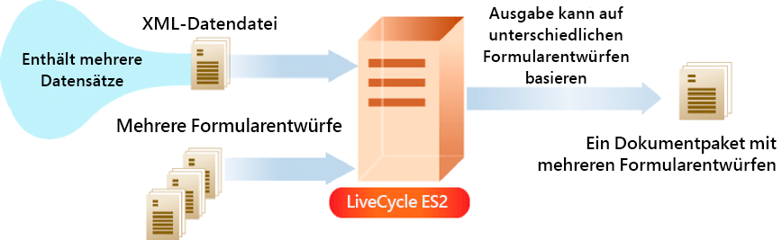

# Erstellen von Dokument-Ausgabestreams {#creating-document-output-streams}

**Info zum Output-Dienst**

Mit dem Output-Dienst können Sie Dokumente als PDF (einschließlich PDF/A-Dokumente), PostScript, Printer Control Language (PCL) und die folgenden Beschriftungsformate ausgeben:

* Zebra - ZPL
* Intermec - IPL
* Datamax - DPL
* TecToshiba - TPCL

Mit dem Output-Dienst können Sie XML-Formulardaten mit einem Formularentwurf zusammenführen und das Dokument an einen Netzwerkdrucker oder eine Netzwerkdatei ausgeben.

Es gibt zwei Möglichkeiten, einen Formularentwurf (eine XDP-Datei) an den Output-Dienst zu übergeben. Sie können entweder eine `com.adobe.idp.Document`-Instanz, die einen Formularentwurf enthält, an den Output-Dienst übergeben. Sie können auch einen URI-Wert übergeben, der den Speicherort des Formularentwurfs angibt. Beide Methoden werden unter *Programmieren mit AEM Formularen* erläutert.

>[!NOTE]
>
>Der Output-Dienst unterstützt keine Acroform PDF-Dokumente, die anwendungsobjektspezifische Skripten enthalten. Acroform PDF-Dokumente, die anwendungsobjektspezifische Skripten enthalten, werden nicht gerendert.

Die folgenden Abschnitte zeigen, wie ein Formularentwurf mit einem URI-Wert an den Output-Dienst übergeben wird:

* [Erstellen von PDF-Dokumenten](creating-document-output-streams.md#creating-pdf-documents)
* [Erstellen von PDF/A-Dokumenten](creating-document-output-streams.md#creating-pdf-a-documents)

Die folgenden Abschnitte zeigen, wie ein Formularentwurf in einer `com.adobe.idp.Document`-Instanz übergeben wird:

* [Übergeben von Dokumenten in Content Services (nicht mehr unterstützt) an den Output Service](creating-document-output-streams.md#passing-documents-located-in-content-services-deprecated-to-the-output-service)
* [Erstellen von PDF-Dokumenten mit Fragmenten](creating-document-output-streams.md#creating-pdf-documents-using-fragments)

Bei der Entscheidung, welche Technik verwendet werden soll, sollten Sie den Formularentwurf von einem anderen AEM Forms-Dienst beziehen und dann innerhalb einer `com.adobe.idp.Document`-Instanz übergeben. Sowohl in den Abschnitten *Übergeben von Dokumenten an den Output-Dienst* als auch *Erstellen von PDF-Dokumenten mit Fragmenten* wird gezeigt, wie ein Formularentwurf von einem anderen AEM Forms-Dienst abgerufen wird. Im ersten Abschnitt wird der Formularentwurf aus Content Services (nicht mehr unterstützt) abgerufen. Im zweiten Abschnitt wird der Formularentwurf vom Assembler-Dienst abgerufen.

Wenn Sie den Formularentwurf von einem festen Speicherort wie dem Dateisystem erhalten, können Sie eine der beiden Methoden verwenden. Das heißt, Sie können den URI-Wert für eine XDP-Datei angeben oder eine `com.adobe.idp.Document`-Instanz verwenden.

Um beim Erstellen eines PDF-Dokuments einen URI-Wert zu übergeben, der den Speicherort des Formularentwurfs angibt, verwenden Sie die `generatePDFOutput`-Methode. Um beim Erstellen eines PDF-Dokuments eine `com.adobe.idp.Document`-Instanz an den Output-Dienst zu übergeben, verwenden Sie die `generatePDFOutput2`-Methode.

Wenn Sie einen Ausgabestream an einen Netzwerkdrucker senden, können Sie beide Methoden verwenden. Um einen Ausgabestream an einen Drucker zu senden, indem eine `com.adobe.idp.Document`-Instanz mit einem Formularentwurf übergeben wird, verwenden Sie die `sendToPrinter2`Methode. Wenn Sie einen Ausgabestream an einen Drucker senden möchten, indem Sie einen URI-Wert übergeben, verwenden Sie die `sendToPrinter`Methode. Der Abschnitt *Drucken-Streams an Drucker* senden verwendet die `sendToPrinter`-Methode.

Sie können diese Aufgaben mithilfe des Output-Dienstes ausführen:

* [Erstellen von PDF-Dokumenten](creating-document-output-streams.md#creating-pdf-documents)
* [Erstellen von PDF/A-Dokumenten](creating-document-output-streams.md#creating-pdf-a-documents)
* [Übergeben von Dokumenten in Content Services (nicht mehr unterstützt) an den Output Service](creating-document-output-streams.md#passing-documents-located-in-content-services-deprecated-to-the-output-service)
* [Erstellen von PDF-Dokumenten mit Fragmenten](creating-document-output-streams.md#creating-pdf-documents-using-fragments)
* [Drucken in Dateien](creating-document-output-streams.md#printing-to-files)
* [Senden von Druckstreams an Drucker](creating-document-output-streams.md#sending-print-streams-to-printers)
* [Mehrere Ausgabedateien erstellen](creating-document-output-streams.md#creating-multiple-output-files)
* [Suchregeln erstellen](creating-document-output-streams.md#creating-search-rules)
* [Reduzieren von PDF-Dokumenten](creating-document-output-streams.md#flattening-pdf-documents)

>[!NOTE]
>
>Weitere Informationen zum Output-Dienst finden Sie unter [Dienste-Referenz für AEM Forms](https://www.adobe.com/go/learn_aemforms_services_63).

## Erstellen von PDF-Dokumenten {#creating-pdf-documents}

Mit dem Output-Dienst können Sie ein PDF-Dokument erstellen, das auf einem Formularentwurf und den von Ihnen bereitgestellten XML-Formulardaten basiert. Das vom Output-Dienst erstellte PDF-Dokument ist kein interaktives PDF-Dokument. Ein Benutzer kann keine Formulardaten eingeben oder ändern.

Wenn Sie ein PDF-Dokument für die langfristige Datenspeicherung erstellen möchten, sollten Sie ein PDF/A-Dokument erstellen. (Siehe [Erstellen von PDF/A-Dokumenten](creating-document-output-streams.md#creating-pdf-a-documents).)

Verwenden Sie den Forms-Dienst, um ein interaktives PDF-Formular zu erstellen, mit dem der Benutzer Daten eingeben kann. (Siehe [Interaktive PDF forms rendern](/help/forms/developing/rendering-forms.md#rendering-interactive-pdf-forms).)

>[!NOTE]
>
>Weitere Informationen zum Output-Dienst finden Sie unter [Dienste-Referenz für AEM Forms](https://www.adobe.com/go/learn_aemforms_services_63).

### Zusammenfassung der Schritte {#summary-of-steps}

So erstellen Sie ein PDF-Dokument:

1. Schließen Sie Projektdateien ein.
1. Erstellen Sie ein Output Client-Objekt.
1. Verweisen Sie auf eine XML-Datenquelle.
1. Legen Sie die PDF-Laufzeitoptionen fest.
1. Legen Sie Laufzeitoptionen für das Rendering fest.
1. Erstellen Sie ein PDF-Dokument.
1. Rufen Sie die Ergebnisse des Vorgangs ab.

**Projektdateien einschließen**

Schließen Sie die erforderlichen Dateien in Ihr Entwicklungsprojekt ein. Wenn Sie eine Clientanwendung mit Java erstellen, schließen Sie die erforderlichen JAR-Dateien ein. Wenn Sie Webdienste verwenden, stellen Sie sicher, dass Sie die Proxydateien einschließen.

Die folgenden JAR-Dateien müssen dem Klassenpfad Ihres Projekts hinzugefügt werden:

* adobe-livecycle-client.jar
* adobe-usermanager-client.jar
* adobe-output-client.jar
* adobe-utilities.jar (Erforderlich, wenn AEM Forms unter JBoss bereitgestellt wird)
* jbossall-client.jar (Erforderlich, wenn AEM Forms unter JBoss bereitgestellt wird)

Wenn AEM Forms auf einem unterstützten J2EE-Anwendungsserver bereitgestellt wird, der nicht JBoss ist, müssen Sie die Dateien &quot;adobe-utilities.jar&quot;und &quot;jbossall-client.jar&quot;durch JAR-Dateien ersetzen, die für den J2EE-Anwendungsserver spezifisch sind, auf dem AEM Forms bereitgestellt wird.

**Output Client-Objekt erstellen**

Bevor Sie einen Output-Dienstvorgang programmgesteuert durchführen können, müssen Sie ein Output-Dienst-Client-Objekt erstellen. Wenn Sie die Java-API verwenden, erstellen Sie ein `OutputClient`-Objekt. Wenn Sie die Output-Webdienst-API verwenden, erstellen Sie ein `OutputServiceService`-Objekt.

**Referenzieren einer XML-Datenquelle**

Um Daten mit dem Formularentwurf zusammenzuführen, müssen Sie auf eine XML-Datenquelle verweisen, die Daten enthält. Für jedes Formularfeld, das mit Daten gefüllt werden soll, muss ein XML-Element vorhanden sein. Der Name des XML-Elements muss mit dem Feldnamen übereinstimmen. Ein XML-Element wird ignoriert, wenn es keinem Formularfeld entspricht oder wenn der XML-Elementname nicht mit dem Feldnamen übereinstimmt. Es ist nicht erforderlich, dass die Reihenfolge, in der die XML-Elemente angezeigt werden, übereinstimmt, wenn alle XML-Elemente angegeben sind.

Betrachten Sie das folgende Beispiel für ein Kreditantragsformular.


Um Daten in diesen Formularentwurf einzufügen, müssen Sie eine XML-Datenquelle erstellen, die dem Formular entspricht. Die folgende XML-Datei stellt eine XDP-XML-Datenquelle dar, die dem Musterhypothekenantragsformular entspricht.

```xml
 <?xml version="1.0" encoding="UTF-8" ?>
 - <xfa:datasets xmlns:xfa="https://www.xfa.org/schema/xfa-data/1.0/">
 - <xfa:data>
 - <data>
     - <Layer>
         <closeDate>1/26/2007</closeDate>
         <lastName>Johnson</lastName>
         <firstName>Jerry</firstName>
         <mailingAddress>JJohnson@NoMailServer.com</mailingAddress>
         <city>New York</city>
         <zipCode>00501</zipCode>
         <state>NY</state>
         <dateBirth>26/08/1973</dateBirth>
         <middleInitials>D</middleInitials>
         <socialSecurityNumber>(555) 555-5555</socialSecurityNumber>
         <phoneNumber>5555550000</phoneNumber>
     </Layer>
     - <Mortgage>
         <mortgageAmount>295000.00</mortgageAmount>
         <monthlyMortgagePayment>1724.54</monthlyMortgagePayment>
         <purchasePrice>300000</purchasePrice>
         <downPayment>5000</downPayment>
         <term>25</term>
         <interestRate>5.00</interestRate>
     </Mortgage>
 </data>
 </xfa:data>
 </xfa:datasets>
```

**Festlegen von PDF-Laufzeitoptionen**

Legen Sie beim Erstellen eines PDF-Dokuments die Datei-URI-Option fest. Diese Option gibt den Namen und den Speicherort der PDF-Datei an, die der Output-Dienst generiert.

>[!NOTE]
>
>Anstatt die Laufzeitoption &quot;Datei-URI&quot;festzulegen, können Sie das PDF-Dokument programmgesteuert vom komplexen Datentyp abrufen, der vom Output-Dienst zurückgegeben wird. Durch Festlegen der Laufzeitoption &quot;Datei-URI&quot;müssen Sie jedoch keine Anwendungslogik erstellen, die das PDF-Dokument programmgesteuert abruft.

**Festlegen von Rendering-Laufzeitoptionen**

Beim Erstellen eines PDF-Dokuments können Sie Laufzeitoptionen für die Wiedergabe festlegen. Obwohl diese Optionen nicht erforderlich sind (im Gegensatz zu den erforderlichen PDF-Laufzeitoptionen), können Sie Aufgaben wie die Leistungsverbesserung des Output-Dienstes ausführen. Sie können beispielsweise den Formularentwurf, den der Output-Dienst verwendet, zwischenspeichern, um die Leistung zu verbessern.

Wenn Sie ein getaggtes Acrobat-Formular als Eingabe verwenden, können Sie die Einstellung für getaggte Formulare nicht mit der Java- oder Webdienst-API des Output-Dienstes deaktivieren. Wenn Sie versuchen, diese Option programmgesteuert auf `false` festzulegen, wird das PDF-Dokument mit Tags versehen.

>[!NOTE]
>
>Wenn Sie keine Rendering-Laufzeitoptionen angeben, werden die Standardwerte verwendet. Informationen zum Rendern von Laufzeitoptionen finden Sie in der Klassenreferenz `RenderOptionsSpec`. (Siehe [AEM Forms API-Referenz](https://www.adobe.com/go/learn_aemforms_javadocs_63_en)).

**PDF-Dokument erstellen**

Nachdem Sie eine gültige XML-Datenquelle mit Formulardaten referenziert und Laufzeitoptionen festgelegt haben, können Sie den Output-Dienst aufrufen, was zur Generierung eines PDF-Dokuments führt.

Beim Generieren eines PDF-Dokuments geben Sie URI-Werte an, die vom Output-Dienst zum Erstellen eines PDF-Dokuments benötigt werden. Ein Formularentwurf kann an Speicherorten wie dem Serverdateisystem oder als Teil einer AEM Forms-Anwendung gespeichert werden. Ein Formularentwurf (oder andere Ressourcen wie eine Bilddatei), der Teil einer Forms-Anwendung ist, kann mit dem Inhaltsstamm-URI-Wert `repository:///` referenziert werden. Betrachten Sie beispielsweise den folgenden Formularentwurf mit dem Namen *Loan.xdp*, der sich in einer Forms-Anwendung mit dem Namen *Applications/FormsApplication* befindet:


Um auf die in der vorherigen Abbildung dargestellte Datei &quot;Loan.xdp&quot;zuzugreifen, geben Sie `repository:///Applications/FormsApplication/1.0/FormsFolder/` als dritten Parameter an, der an die `OutputClient`-Objektmethode `generatePDFOutput` übergeben wird. Geben Sie den Formularnamen (*Loan.xdp*) als zweiten Parameter an, der an die `OutputClient`-Methode des Objekts `generatePDFOutput` übergeben wird.

Wenn die XDP-Datei Bilder (oder andere Ressourcen wie Fragmente) enthält, platzieren Sie die Ressourcen im selben Anwendungsordner wie die XDP-Datei. AEM Forms verwendet den Inhaltsstamm-URI als Basispfad, um Verweise auf Bilder aufzulösen. Wenn die Datei &quot;Loan.xdp&quot;beispielsweise ein Bild enthält, stellen Sie sicher, dass Sie das Bild in `Applications/FormsApplication/1.0/FormsFolder/` platzieren.

>[!NOTE]
>
>Sie können auf einen Forms-Anwendungs-URI verweisen, wenn Sie die `OutputClient`- oder `generatePrintedOutput`-Methoden des Objekts aufrufen.`generatePDFOutput`

>[!NOTE]
>
>Einen vollständigen Beginn zum Erstellen eines PDF-Dokuments durch Referenzieren einer XDP in einer Forms-Anwendung finden Sie unter [Schnellmodus (EJB-Modus): Erstellen eines PDF-Dokuments basierend auf einer Anwendungs-XDP-Datei mit der Java-API](/help/forms/developing/output-service-java-api-quick.md#quick-start-soap-mode-creating-a-pdf-document-based-on-an-application-xdp-file-using-the-java-api).

**Abrufen der Ergebnisse des Vorgangs**

Nachdem der Output-Dienst einen Vorgang ausgeführt hat, gibt er verschiedene Datenelemente wie z. B. XML-Statusdaten zurück, die angeben, ob der Vorgang erfolgreich war.

**Siehe auch**

[Erstellen eines PDF-Dokuments mit der Java-API](creating-document-output-streams.md#create-a-pdf-document-using-the-java-api)

[Erstellen eines PDF-Dokuments mit der Webdienst-API](creating-document-output-streams.md#create-a-pdf-document-using-the-web-service-api)

[Einbeziehung von AEM Forms Java-Bibliotheksdateien](/help/forms/developing/invoking-aem-forms-using-java.md#including-aem-forms-java-library-files)

[Verbindungseigenschaften festlegen](/help/forms/developing/invoking-aem-forms-using-java.md#setting-connection-properties)

[Schnellere Beginn zur API des Output-Dienstes](/help/forms/developing/output-service-java-api-quick.md#output-service-java-api-quick-start-soap)

### Erstellen eines PDF-Dokuments mit der Java-API {#create-a-pdf-document-using-the-java-api}

Erstellen Sie ein PDF-Dokument mithilfe der Output API (Java):

1. Schließen Sie Projektdateien ein.

   Schließen Sie Client-JAR-Dateien wie &quot;adobe-output-client.jar&quot;in den Klassenpfad Ihres Java-Projekts ein.

1. Erstellen Sie ein Output Client-Objekt.

   * Erstellen Sie ein `ServiceClientFactory`-&quot; -Objekt, das Verbindungseigenschaften enthält.
   * Erstellen Sie ein `OutputClient`-Objekt, indem Sie den Konstruktor verwenden und das `ServiceClientFactory`-Objekt übergeben.

1. Verweisen Sie auf eine XML-Datenquelle.

   * Erstellen Sie ein `java.io.FileInputStream`-Objekt, das die XML-Datenquelle darstellt, mit der das PDF-Dokument mithilfe des Konstruktors gefüllt wird, und übergeben Sie einen Zeichenfolgenwert, der den Speicherort der XML-Datei angibt.
   * Erstellen Sie ein Objekt `com.adobe.idp.Document`, indem Sie den Konstruktor verwenden. Übergeben Sie das `java.io.FileInputStream`-Objekt.

1. Legen Sie die PDF-Laufzeitoptionen fest.

   * Erstellen Sie ein Objekt `PDFOutputOptionsSpec`, indem Sie den Konstruktor verwenden.
   * Legen Sie die Option Datei-URI fest, indem Sie die `PDFOutputOptionsSpec`-Methode des Objekts `setFileURI` aufrufen. Übergeben Sie einen Zeichenfolgenwert, der den Speicherort der vom Output-Dienst erstellten PDF-Datei angibt. Die Option &quot;Datei-URI&quot;ist relativ zum J2EE-Anwendungsserver, auf dem AEM Forms ausgeführt wird, und nicht zum Clientcomputer.

1. Legen Sie Laufzeitoptionen für das Rendering fest.

   * Erstellen Sie ein Objekt `RenderOptionsSpec`, indem Sie den Konstruktor verwenden.
   * Zwischenspeichern Sie den Formularentwurf, um die Leistung des Output-Dienstes zu verbessern, indem Sie das `RenderOptionsSpec`-Objekt `setCacheEnabled` aufrufen und `true` übergeben.

   >[!NOTE]
   >
   >Sie können die Version des PDF-Dokuments nicht mit der `RenderOptionsSpec`-Objektmethode `setPdfVersion` festlegen, wenn es sich bei dem Eingabe-Dokument um ein Acrobat-Formular (ein in Acrobat erstelltes Formular) oder um ein XFA-Dokument handelt, das signiert oder zertifiziert ist. Das PDF-Dokument für die Ausgabe behält die ursprüngliche PDF-Version bei. Gleichermaßen können Sie die getaggte Adobe PDF-Option nicht durch Aufrufen der `RenderOptionsSpec`-Objektmethode `setTaggedPDF` festlegen, wenn es sich bei dem Eingabe-Dokument um ein Acrobat-Formular oder ein signiertes oder zertifiziertes XFA-Dokument handelt.

   >[!NOTE]
   >
   >Sie können die Option &quot;Linearisierte PDF&quot;nicht mit der `RenderOptionsSpec`-Objektmethode `setLinearizedPDF` festlegen, wenn das PDF-Eingabedokument zertifiziert oder digital signiert ist. (Siehe [Digitales Signieren von PDF-Dokumenten ](/help/forms/developing/digitally-signing-certifying-documents.md#digitally-signing-pdf-documents)*.)*

1. Erstellen Sie ein PDF-Dokument.

   Erstellen Sie ein PDF-Dokument, indem Sie die `generatePDFOutput`-Methode des Objekts aufrufen und die folgenden Werte übergeben:`OutputClient`

   * Ein `TransformationFormat`-Auflistung-Wert. Um ein PDF-Dokument zu erstellen, geben Sie `TransformationFormat.PDF` an.
   * Ein string-Wert, der den Namen des Formularentwurfs angibt.
   * Ein Zeichenfolgenwert, der den Inhaltsstamm angibt, an dem sich der Formularentwurf befindet.
   * Ein `PDFOutputOptionsSpec`-Objekt, das PDF-Laufzeitoptionen enthält.
   * Ein `RenderOptionsSpec`-Objekt, das Rendering-Laufzeitoptionen enthält.
   * Das `com.adobe.idp.Document`-Objekt, das die XML-Datenquelle enthält, die Daten enthält, die mit dem Formularentwurf zusammengeführt werden sollen.

   Die `generatePDFOutput`-Methode gibt ein `OutputResult`-Objekt zurück, das die Ergebnisse des Vorgangs enthält.

   >[!NOTE]
   >
   >Beachten Sie beim Generieren eines PDF-Dokuments durch Aufrufen der `generatePDFOutput`-Methode, dass Sie keine Daten mit einem XFA-PDF-Formular zusammenführen können, das signiert oder zertifiziert ist. (Siehe [Digitales Signieren und Zertifizieren von Dokumenten ](/help/forms/developing/digitally-signing-certifying-documents.md#digitally-signing-and-certifying-documents)*.)*

   >[!NOTE]
   >
   >Die `OutputResult`-Methode des Objekts `getRecordLevelMetaDataList` gibt `null`*zurück.*

   >[!NOTE]
   >
   >Sie können ein PDF-Dokument auch erstellen, indem Sie die `OutputClient`-Objektmethode `generatePDFOutput2` aufrufen. (Siehe [Übergeben von Dokumenten in Content Services (nicht mehr unterstützt) an den Output Service ](creating-document-output-streams.md#passing-documents-located-in-content-services-deprecated-to-the-output-service)*.)*

1. Rufen Sie die Ergebnisse des Vorgangs ab.

   * Rufen Sie ein `com.adobe.idp.Document`-Objekt ab, das den Status der `generatePDFOutput`-Operation darstellt, indem Sie die `OutputResult`-Objektmethode `getStatusDoc` aufrufen. Diese Methode gibt Status-XML-Daten zurück, die angeben, ob der Vorgang erfolgreich war.
   * Erstellen Sie ein `java.io.File`-Objekt, das die Ergebnisse des Vorgangs enthält. Stellen Sie sicher, dass die Dateinamenerweiterung .xml lautet.
   * Rufen Sie die `copyToFile`-Methode des Objekts auf, um den Inhalt des `com.adobe.idp.Document`-Objekts in die Datei zu kopieren (stellen Sie sicher, dass Sie das `com.adobe.idp.Document`-Objekt verwenden, das von der `getStatusDoc`-Methode zurückgegeben wurde).`com.adobe.idp.Document`

   Obwohl der Output-Dienst das PDF-Dokument an den Speicherort schreibt, der durch das an die `setFileURI`-Objektmethode `PDFOutputOptionsSpec` übergebene Argument angegeben wird, können Sie das PDF/A-Dokument programmgesteuert abrufen, indem Sie die `OutputResult`-Objektmethode `getGeneratedDoc` aufrufen.

**Siehe auch**

[Zusammenfassung der Schritte](creating-document-output-streams.md#summary-of-steps)

[Quick Beginn (EJB-Modus): Erstellen eines PDF-Dokuments mit der Java-API](/help/forms/developing/output-service-java-api-quick.md#quick-start-soap-mode-creating-a-pdf-document-using-the-java-api)

[Quick Beginn (SOAP-Modus): Erstellen eines PDF-Dokuments mit der Java-API](/help/forms/developing/output-service-java-api-quick.md#quick-start-soap-mode-creating-a-pdf-document-using-the-java-api)

[Einbeziehung von AEM Forms Java-Bibliotheksdateien](/help/forms/developing/invoking-aem-forms-using-java.md#including-aem-forms-java-library-files)

[Verbindungseigenschaften festlegen](/help/forms/developing/invoking-aem-forms-using-java.md#setting-connection-properties)

### Erstellen eines PDF-Dokuments mit der Webdienst-API {#create-a-pdf-document-using-the-web-service-api}

Erstellen Sie ein PDF-Dokument mithilfe der Output API (Webdienst):

1. Schließen Sie Projektdateien ein.

   Erstellen Sie ein Microsoft .NET-Projekt, das MTOM verwendet. Stellen Sie sicher, dass Sie die folgende WSDL-Definition verwenden: `http://localhost:8080/soap/services/OutputService?WSDL&lc_version=9.0.1`.

   >[!NOTE]
   >
   >Ersetzen Sie `localhost` durch die IP-Adresse des Servers, auf dem AEM Forms gehostet wird.

1. Erstellen Sie ein Output Client-Objekt.

   * Erstellen Sie ein `OutputServiceClient`-Objekt mit dem Standardkonstruktor.
   * Erstellen Sie ein `OutputServiceClient.Endpoint.Address`-Objekt mit dem Konstruktor `System.ServiceModel.EndpointAddress`. Übergeben Sie einen Zeichenfolgenwert, der die WSDL an den AEM Forms-Dienst angibt (z. B. `http://localhost:8080/soap/services/OutputService?blob=mtom`). Sie müssen das Attribut `lc_version` nicht verwenden. Dieses Attribut wird verwendet, wenn Sie eine Dienstreferenz erstellen. Geben Sie `?blob=mtom` an, um MTOM zu verwenden.
   * Erstellen Sie ein `System.ServiceModel.BasicHttpBinding`-Objekt, indem Sie den Wert des Felds `OutputServiceClient.Endpoint.Binding` abrufen. Wandeln Sie den Rückgabewert in `BasicHttpBinding` um.
   * Setzen Sie das Feld `System.ServiceModel.BasicHttpBinding` des Objekts auf `MessageEncoding`. `WSMessageEncoding.Mtom` Dieser Wert stellt sicher, dass MTOM verwendet wird.
   * Aktivieren Sie die einfache HTTP-Authentifizierung, indem Sie die folgenden Aufgaben ausführen:

      * Weisen Sie dem Feld `OutputServiceClient.ClientCredentials.UserName.UserName` den AEM Forms-Benutzernamen zu.
      * Weisen Sie dem Feld `OutputServiceClient.ClientCredentials.UserName.Password` den entsprechenden Kennwortwert zu.
      * Weisen Sie dem Feld `BasicHttpBindingSecurity.Transport.ClientCredentialType` den Konstantenwert `HttpClientCredentialType.Basic` zu.
      * Weisen Sie dem Feld `BasicHttpBindingSecurity.Security.Mode` den Konstantenwert `BasicHttpSecurityMode.TransportCredentialOnly` zu.

1. Verweisen Sie auf eine XML-Datenquelle.

   * Erstellen Sie ein Objekt `BLOB`, indem Sie den Konstruktor verwenden. Das `BLOB`-Objekt wird zum Speichern von XML-Daten verwendet, die mit dem PDF-Dokument zusammengeführt werden.
   * Erstellen Sie ein `System.IO.FileStream`-Objekt, indem Sie den Konstruktor aufrufen und einen Zeichenfolgenwert übergeben, der den Dateispeicherort der XML-Datei darstellt, die Formulardaten enthält.
   * Erstellen Sie ein Bytearray, das den Inhalt des Objekts `System.IO.FileStream` speichert. Sie können die Größe des Byte-Arrays bestimmen, indem Sie die `System.IO.FileStream`-Eigenschaft des Objekts `Length` abrufen.
   * Füllen Sie das Bytearray mit Stream-Daten, indem Sie die `Read`-Methode des Objekts aufrufen und das Bytearray, die Startposition und die zu lesende Stream-Länge übergeben.`System.IO.FileStream`
   * Füllen Sie das `BLOB`-Objekt, indem Sie dessen `MTOM`-Feld mit dem Inhalt des Byte-Arrays zuweisen.

1. Festlegen von PDF-Laufzeitoptionen

   * Erstellen Sie ein Objekt `PDFOutputOptionsSpec`, indem Sie den Konstruktor verwenden.
   * Legen Sie die Option &quot;Datei-URI&quot;fest, indem Sie einen Zeichenfolgenwert zuweisen, der den Speicherort der PDF-Datei angibt, die der Output-Dienst dem `PDFOutputOptionsSpec`-Datenmember des Objekts `fileURI` generiert. Die Option &quot;Datei-URI&quot;ist relativ zum J2EE-Anwendungsserver, auf dem AEM Forms ausgeführt wird, und nicht zum Clientcomputer.

1. Legen Sie Laufzeitoptionen für das Rendering fest.

   * Erstellen Sie ein Objekt `RenderOptionsSpec`, indem Sie den Konstruktor verwenden.
   * Zwischenspeichern Sie den Formularentwurf, um die Leistung des Output-Dienstes zu verbessern, indem Sie den Wert `true` dem `RenderOptionsSpec`-Datenmember des Objekts `cacheEnabled` zuweisen.

   >[!NOTE]
   >
   >Sie können die Version des PDF-Dokuments nicht mit der `RenderOptionsSpec`-Objektmethode `setPdfVersion` festlegen, wenn es sich bei dem Eingabe-Dokument um ein Acrobat-Formular (ein in Acrobat erstelltes Formular) oder um ein XFA-Dokument handelt, das signiert oder zertifiziert ist. Das PDF-Dokument für die Ausgabe behält die ursprüngliche PDF-Version bei. Genauso können Sie die getaggte Adobe PDF-Option nicht durch Aufrufen der `RenderOptionsSpec`-Objektmethode `setTaggedPDF`* festlegen, wenn das Eingabedokument ein Acrobat-Dokument oder ein signiertes oder zertifiziertes XFA-Dokument ist.*

   >[!NOTE]
   >
   >Sie können die Option &quot;Linearisierte PDF&quot;nicht mithilfe des `RenderOptionsSpec`-Objektelements `linearizedPDF` festlegen, wenn das PDF-Eingabedokument zertifiziert oder digital signiert ist. (Siehe [Digitales Signieren von PDF-Dokumenten ](/help/forms/developing/digitally-signing-certifying-documents.md#digitally-signing-pdf-documents)*.)*

1. Erstellen Sie ein PDF-Dokument.

   Erstellen Sie ein PDF-Dokument, indem Sie die `generatePDFOutput`-Methode des `OutputServiceService`-Objekts aufrufen und die folgenden Werte übergeben:

   * Ein `TransformationFormat`-Auflistung-Wert. Um ein PDF-Dokument zu erstellen, geben Sie `TransformationFormat.PDF` an.
   * Ein string-Wert, der den Namen des Formularentwurfs angibt.
   * Ein Zeichenfolgenwert, der den Inhaltsstamm angibt, an dem sich der Formularentwurf befindet.
   * Ein `PDFOutputOptionsSpec`-Objekt, das PDF-Laufzeitoptionen enthält.
   * Ein `RenderOptionsSpec`-Objekt, das Rendering-Laufzeitoptionen enthält.
   * Das `BLOB`-Objekt, das die XML-Datenquelle enthält, die Daten enthält, die mit dem Formularentwurf zusammengeführt werden sollen.
   * Ein `BLOB`-Objekt, das durch die `generatePDFOutput`-Methode gefüllt wird. Die `generatePDFOutput`-Methode füllt dieses Objekt mit generierten Metadaten, die das Dokument beschreiben. (Dieser Parameterwert ist nur für den Webdienst-Aufruf erforderlich).
   * Ein `BLOB`-Objekt, das durch die `generatePDFOutput`-Methode gefüllt wird. Die `generatePDFOutput`-Methode füllt dieses Objekt mit Ergebnisdaten. (Dieser Parameterwert ist nur für den Webdienst-Aufruf erforderlich).
   * Ein `OutputResult`-Objekt, das die Ergebnisse des Vorgangs enthält. (Dieser Parameterwert ist nur für den Webdienst-Aufruf erforderlich).

   >[!NOTE]
   >
   >Beachten Sie beim Generieren eines PDF-Dokuments durch Aufrufen der `generatePDFOutput`-Methode, dass Sie keine Daten mit einem XFA-PDF-Formular zusammenführen können, das signiert oder zertifiziert ist. (Siehe [Digitales Signieren und Zertifizieren von Dokumenten ](/help/forms/developing/digitally-signing-certifying-documents.md#digitally-signing-and-certifying-documents)*.)*

   >[!NOTE]
   >
   >Sie können ein PDF-Dokument auch erstellen, indem Sie die `OutputClient`-Objektmethode `generatePDFOutput2` aufrufen. (Siehe [Übergeben von Dokumenten in Content Services (nicht mehr unterstützt) an den Output Service ](creating-document-output-streams.md#passing-documents-located-in-content-services-deprecated-to-the-output-service)*.)*

1. Rufen Sie die Ergebnisse des Vorgangs ab.

   * Erstellen Sie ein `System.IO.FileStream`-Objekt, indem Sie den Konstruktor aufrufen und einen Zeichenfolgenwert übergeben, der einen XML-Dateispeicherort darstellt, der Ergebnisdaten enthält. Stellen Sie sicher, dass die Dateinamenerweiterung .xml lautet.
   * Erstellen Sie ein Bytearray, das den Dateninhalt des Objekts `BLOB` speichert, das mit den Ergebnisdaten der `OutputServiceService`-Methode des Objekts `generatePDFOutput` (achter Parameter) gefüllt wurde. Füllen Sie das Bytearray, indem Sie den Wert des Objekts `BLOB` `MTOM` `field` abrufen.
   * Erstellen Sie ein `System.IO.BinaryWriter`-Objekt, indem Sie den Konstruktor aufrufen und das `System.IO.FileStream`-Objekt übergeben.
   * Schreiben Sie den Inhalt des Byte-Arrays in die XML-Datei, indem Sie die `Write`-Methode des Objekts aufrufen und das Bytearray übergeben.`System.IO.BinaryWriter`

   Siehe auch

   [Zusammenfassung der Schritte](creating-document-output-streams.md#summary-of-steps)

   [Aufrufen von AEM Forms mit MTOM](/help/forms/developing/invoking-aem-forms-using-web.md#invoking-aem-forms-using-mtom)

   [Aufrufen von AEM Forms mit SwaRef](/help/forms/developing/invoking-aem-forms-using-web.md#invoking-aem-forms-using-swaref)

   >[!NOTE]
   >
   >Die `OutputServiceService`-Methode des Objekts `generateOutput` wird nicht mehr unterstützt.

## Erstellen von PDF/A-Dokumenten {#creating-pdf-a-documents}

Sie können den Output-Dienst verwenden, um ein PDF/A-Dokument zu erstellen. Da PDF/A ein Archivierungsformat für die langfristige Speicherung des Dokuments ist, werden alle Schriftarten eingebettet und die Datei nicht komprimiert. PDF/A-Dokumente sind daher in der Regel größer als normale PDF-Dokumente. Darüber hinaus enthält ein PDF/A-Dokument keine Audio- und Videoinhalte. Wie andere Output-Dienst-Aufgaben stellen Sie sowohl einen Formularentwurf als auch Daten bereit, die mit einem Formularentwurf zusammengeführt werden, um ein PDF/A-Dokument zu erstellen.

Die PDF/A-1-Spezifikation besteht aus zwei Stufen der Konformität, nämlich a und b. Der Hauptunterschied zwischen den beiden besteht in der Unterstützung der logischen Struktur (Barrierefreiheit), die nicht für das Konformitätsniveau b erforderlich ist. Unabhängig von der Konformitätsstufe schreibt PDF/A-1 vor, dass alle Schriftarten in das generierte PDF/A-Dokument eingebettet sind.

PDF/A ist zwar der Standard für die Archivierung von PDF-Dokumenten, es ist jedoch nicht erforderlich, dass PDF/A für die Archivierung verwendet wird, wenn ein Standard-PDF-Dokument den Anforderungen Ihrer Firma entspricht. Der PDF/A-Standard dient dazu, eine PDF-Datei zu erstellen, die über einen längeren Zeitraum gespeichert werden kann und die Anforderungen an die Erhaltung von Dokumenten erfüllt. Beispielsweise kann eine URL nicht in eine PDF/A-Datei eingebettet werden, da die URL im Laufe der Zeit ungültig werden kann.

Ihr Unternehmen muss seine eigenen Bedürfnisse, die Dauer der Aufbewahrung des Dokuments, die Berücksichtigung der Dateigröße und Ihre eigene Archivierungsstrategie bewerten. Mit dem DocConverter-Dienst können Sie programmgesteuert ermitteln, ob ein PDF-Dokument PDF/A-kompatibel ist. (Siehe [Programmatische Bestimmung der PDF/A-Kompatibilität](/help/forms/developing/pdf-a-documents.md#programmatically-determining-pdf-a-compliancy).)

Ein PDF/A-Dokument muss die im Formularentwurf angegebene Schrift verwenden und Schriften können nicht ersetzt werden. Wenn daher eine Schriftart, die sich in einem PDF-Dokument befindet, auf dem Host-Betriebssystem (OS) nicht verfügbar ist, tritt eine Ausnahme auf.

Wenn ein PDF/A-Dokument in Acrobat geöffnet wird, wird eine Meldung angezeigt, die bestätigt, dass das Dokument ein PDF/A-Dokument ist, wie in der folgenden Abbildung dargestellt.


>[!NOTE]
>
>Die AIIM-Website verfügt über einen FAQ-Abschnitt für PDF/A, auf den Sie unter [https://www.aiim.org/documents/standards/19005-1_FAQ.pdf](https://www.aiim.org/documents/standards/19005-1_FAQ.pdf) zugreifen können.

>[!NOTE]
>
>Weitere Informationen zum Output-Dienst finden Sie unter [Dienste-Referenz für AEM Forms](https://www.adobe.com/go/learn_aemforms_services_63).

### Zusammenfassung der Schritte {#summary_of_steps-1}

So erstellen Sie ein PDF/A-Dokument:

1. Schließen Sie Projektdateien ein.
1. Erstellen Sie ein Output Client-Objekt.
1. Verweisen Sie auf eine XML-Datenquelle.
1. Festlegen von PDF/A-Laufzeitoptionen.
1. Legen Sie Laufzeitoptionen für das Rendering fest.
1. Generieren Sie ein PDF/A-Dokument.
1. Rufen Sie die Ergebnisse des Vorgangs ab.

**Projektdateien einschließen**

Schließen Sie die erforderlichen Dateien in Ihr Entwicklungsprojekt ein. Wenn Sie eine benutzerdefinierte Anwendung mit Java erstellen, schließen Sie die erforderlichen JAR-Dateien ein. Wenn Sie Webdienste verwenden, stellen Sie sicher, dass Sie die Proxydateien einschließen.

Die folgenden JAR-Dateien müssen dem Klassenpfad Ihres Projekts hinzugefügt werden:

* adobe-livecycle-client.jar
* adobe-usermanager-client.jar
* adobe-output-client.jar
* adobe-utilities.jar (Erforderlich, wenn AEM Forms unter JBoss bereitgestellt wird)
* jbossall-client.jar (Erforderlich, wenn AEM Forms unter JBoss bereitgestellt wird)

Wenn AEM Forms auf einem unterstützten J2EE-Anwendungsserver bereitgestellt wird, der nicht JBoss ist, müssen Sie die Dateien &quot;adobe-utilities.jar&quot;und &quot;jbossall-client.jar&quot;durch JAR-Dateien ersetzen, die für den J2EE-Anwendungsserver spezifisch sind, auf dem AEM Forms bereitgestellt wird.

**Output Client-Objekt erstellen**

Bevor Sie einen Output-Dienstvorgang programmgesteuert durchführen können, müssen Sie ein Output-Dienst-Client-Objekt erstellen. Wenn Sie die Java-API verwenden, erstellen Sie ein `OutputClient`-Objekt. Wenn Sie die Output-Webdienst-API verwenden, erstellen Sie ein `OutputServiceService`-Objekt.

**Referenzieren einer XML-Datenquelle**

Um Daten mit dem Formularentwurf zusammenzuführen, müssen Sie auf eine XML-Datenquelle verweisen, die Daten enthält. Für jedes Formularfeld, das mit Daten gefüllt werden soll, muss ein XML-Element vorhanden sein. Der Name des XML-Elements muss mit dem Feldnamen übereinstimmen. Ein XML-Element wird ignoriert, wenn es keinem Formularfeld entspricht oder wenn der XML-Elementname nicht mit dem Feldnamen übereinstimmt. Es ist nicht erforderlich, dass die Reihenfolge, in der die XML-Elemente angezeigt werden, übereinstimmt, wenn alle XML-Elemente angegeben sind.

**Festlegen von PDF/A-Laufzeitoptionen**

Sie können die Option &quot;Datei-URI&quot;beim Erstellen eines PDF/A-Dokuments festlegen. Der URI ist relativ zum J2EE-Anwendungsserver, auf dem AEM Forms gehostet wird. Wenn Sie also C:\Adobe festlegen, wird die Datei in den Ordner auf dem Server geschrieben, nicht in den Clientcomputer. Der URI gibt den Namen und den Speicherort der PDF/A-Datei an, die vom Output-Dienst generiert werden.

**Festlegen von Rendering-Laufzeitoptionen**

Beim Erstellen von PDF/A-Dokumenten können Sie Laufzeitoptionen für das Rendern festlegen. Zwei PDF/A-bezogene Optionen, die Sie einstellen können, sind die Werte `PDFAConformance` und `PDFARevisionNumber`. Der Wert `PDFAConformance` bezieht sich darauf, wie ein PDF-Dokument Anforderungen erfüllt, die angeben, wie langfristige elektronische Dokumente erhalten werden. Gültige Werte für diese Option sind `A` und `B`. Informationen zur Konformität der Stufen a und b finden Sie in der PDF/A-1 ISO-Spezifikation mit dem Titel *ISO 19005-1 Dokument management*.

Der Wert `PDFARevisionNumber` bezieht sich auf die Revisionsnummer eines PDF/A-Dokuments. Informationen zur Revisionsnummer eines PDF/A-Dokuments finden Sie in der PDF/A-1 ISO-Spezifikation mit dem Titel *ISO 19005-1 Dokument Management*.

>[!NOTE]
>
>Beim Erstellen eines PDF/A 1A-Dokuments können Sie die Option für das getaggte Adobe PDF nicht auf `false` setzen. PDF/A 1A ist immer ein PDF-Dokument mit Tags. Sie können die Option &quot;Adobe PDF mit Tags&quot;auch nicht auf `true` setzen, wenn Sie ein PDF/A 1B-Dokument erstellen. PDF/A 1B ist immer ein PDF-Dokument ohne Tags.

**Generieren eines PDF/A-Dokuments**

Nachdem Sie eine gültige XML-Datenquelle mit Formulardaten referenziert und Laufzeitoptionen festgelegt haben, können Sie den Output-Dienst aufrufen, wodurch ein PDF/A-Dokument generiert wird.

**Abrufen der Ergebnisse des Vorgangs**

Nachdem der Output-Dienst einen Vorgang ausgeführt hat, gibt er verschiedene Datenelemente wie XML-Daten zurück, die angeben, ob der Vorgang erfolgreich war.

**Siehe auch**

[Erstellen eines PDF/A-Dokuments mit der Java-API](creating-document-output-streams.md#create-a-pdf-a-document-using-the-java-api)

[Erstellen eines PDF/A-Dokuments mit der Webdienst-API](creating-document-output-streams.md#create-a-pdf-a-document-using-the-web-service-api)

[Einbeziehung von AEM Forms Java-Bibliotheksdateien](/help/forms/developing/invoking-aem-forms-using-java.md#including-aem-forms-java-library-files)

[Verbindungseigenschaften festlegen](/help/forms/developing/invoking-aem-forms-using-java.md#setting-connection-properties)

[Schnellere Beginn zur API des Output-Dienstes](/help/forms/developing/output-service-java-api-quick.md#output-service-java-api-quick-start-soap)

### Erstellen eines PDF/A-Dokuments mit der Java-API {#create-a-pdf-a-document-using-the-java-api}

Erstellen Sie ein PDF/A-Dokument mit der Output API (Java):

1. Schließen Sie Projektdateien ein.

   Schließen Sie Client-JAR-Dateien wie &quot;adobe-output-client.jar&quot;in den Klassenpfad Ihres Java-Projekts ein.

1. Erstellen Sie ein Output Client-Objekt.

   * Erstellen Sie ein `ServiceClientFactory`-&quot; -Objekt, das Verbindungseigenschaften enthält.
   * Erstellen Sie ein `OutputClient`-Objekt, indem Sie den Konstruktor verwenden und das `ServiceClientFactory`-Objekt übergeben.

1. Verweisen Sie auf eine XML-Datenquelle.

   * Erstellen Sie ein `java.io.FileInputStream`-Objekt, das die XML-Datenquelle darstellt, mit der das PDF/A-Dokument mithilfe des Konstruktors gefüllt wird, und übergeben Sie einen Zeichenfolgenwert, der den Speicherort der XML-Datei angibt.
   * Erstellen Sie ein `com.adobe.idp.Document`-Objekt, indem Sie seinen Konstruktor verwenden und das `java.io.FileInputStream`-Objekt übergeben.

1. Festlegen von PDF/A-Laufzeitoptionen.

   * Erstellen Sie ein Objekt `PDFOutputOptionsSpec`, indem Sie den Konstruktor verwenden.
   * Legen Sie die Option Datei-URI fest, indem Sie die `PDFOutputOptionsSpec`-Methode des Objekts `setFileURI` aufrufen. Übergeben Sie einen Zeichenfolgenwert, der den Speicherort der vom Output-Dienst erstellten PDF-Datei angibt. Die Option &quot;Datei-URI&quot;ist relativ zum J2EE-Anwendungsserver, auf dem AEM Forms ausgeführt wird, und nicht zum Clientcomputer.

1. Legen Sie Laufzeitoptionen für das Rendering fest.

   * Erstellen Sie ein Objekt `RenderOptionsSpec`, indem Sie den Konstruktor verwenden.
   * Legen Sie den Wert `PDFAConformance` fest, indem Sie die `RenderOptionsSpec`-Methode des Objekts `setPDFAConformance` aufrufen und einen `PDFAConformance`-Enum-Wert übergeben, der die Konformitätsstufe angibt. Um beispielsweise die Konformitätsstufe A anzugeben, müssen Sie `PDFAConformance.A` übergeben.
   * Legen Sie den Wert `PDFARevisionNumber` fest, indem Sie die `RenderOptionsSpec`-Methode des Objekts `setPDFARevisionNumber` aufrufen und `PDFARevisionNumber.Revision_1` übergeben.

   >[!NOTE]
   >
   >Die PDF-Version eines PDF/A-Dokuments ist 1.4 unabhängig davon, welchen Wert Sie für die `RenderOptionsSpec`-Objektmethode `setPdfVersion`*angeben.*

1. Generieren Sie ein PDF/A-Dokument.

   Erstellen Sie ein PDF/A-Dokument, indem Sie die `OutputClient`-Objektmethode `generatePDFOutput` aufrufen und die folgenden Werte übergeben:

   * Ein `TransformationFormat`-Auflistung-Wert. Um ein PDF/A-Dokument zu erstellen, geben Sie `TransformationFormat.PDFA` an.
   * Ein string-Wert, der den Namen des Formularentwurfs angibt.
   * Ein Zeichenfolgenwert, der den Inhaltsstamm angibt, an dem sich der Formularentwurf befindet.
   * Ein `PDFOutputOptionsSpec`-Objekt, das PDF-Laufzeitoptionen enthält.
   * Ein `RenderOptionsSpec`-Objekt, das Rendering-Laufzeitoptionen enthält.
   * Das `com.adobe.idp.Document`-Objekt, das die XML-Datenquelle enthält, die Daten enthält, die mit dem Formularentwurf zusammengeführt werden sollen.

   Die `generatePDFOutput`-Methode gibt ein `OutputResult`-Objekt zurück, das die Ergebnisse des Vorgangs enthält.

   >[!NOTE]
   >
   >Die `OutputResult`-Methode des Objekts `getRecordLevelMetaDataList` gibt `null` zurück.

   >[!NOTE]
   >
   >Sie können auch ein PDF/A-Dokument erstellen, indem Sie die `generatePDFOutput`2-Methode des Objekts aufrufen. `OutputClient` (Siehe [Übergeben von Dokumenten in Content Services (nicht mehr unterstützt) an den Output Service](creating-document-output-streams.md#passing-documents-located-in-content-services-deprecated-to-the-output-service).)

1. Rufen Sie die Ergebnisse des Vorgangs ab.

   * Erstellen Sie ein `com.adobe.idp.Document`-Objekt, das den Status der `generatePDFOutput`-Methode darstellt, indem Sie die `OutputResult`-Objektmethode `getStatusDoc` aufrufen.
   * Erstellen Sie ein `java.io.File`-Objekt, das die Ergebnisse des Vorgangs enthält. Stellen Sie sicher, dass die Dateinamenerweiterung .xml lautet.
   * Rufen Sie die `copyToFile`-Methode des Objekts auf, um den Inhalt des `com.adobe.idp.Document`-Objekts in die Datei zu kopieren (stellen Sie sicher, dass Sie das `com.adobe.idp.Document`-Objekt verwenden, das von der `getStatusDoc`-Methode zurückgegeben wurde).`com.adobe.idp.Document`

   >[!NOTE]
   >
   >Obwohl der Output-Dienst das PDF/A-Dokument an den Speicherort schreibt, der durch das an die `setFileURI`-Objektmethode übergebene Argument angegeben wird, können Sie das PDF/A-Dokument programmgesteuert abrufen, indem Sie die `OutputResult`-Objektmethode `getGeneratedDoc` aufrufen.`PDFOutputOptionsSpec`

**Siehe auch**

[Zusammenfassung der Schritte](creating-document-output-streams.md#summary-of-steps)

[Quick Beginn (SOAP-Modus): Erstellen eines PDF/A-Dokuments mit der Java-API](/help/forms/developing/output-service-java-api-quick.md#quick-start-soap-mode-creating-a-pdf-a-document-using-the-java-api)

[Einbeziehung von AEM Forms Java-Bibliotheksdateien](/help/forms/developing/invoking-aem-forms-using-java.md#including-aem-forms-java-library-files)

[Verbindungseigenschaften festlegen](/help/forms/developing/invoking-aem-forms-using-java.md#setting-connection-properties).

### Erstellen eines PDF/A-Dokuments mit der Webdienst-API {#create-a-pdf-a-document-using-the-web-service-api}

Erstellen Sie ein PDF/A-Dokument mithilfe der Output API (Webdienst):

1. Schließen Sie Projektdateien ein.

   Erstellen Sie ein Microsoft .NET-Projekt, das MTOM verwendet. Stellen Sie sicher, dass Sie die folgende WSDL-Definition verwenden: `http://localhost:8080/soap/services/OutputService?WSDL&lc_version=9.0.1`.

   >[!NOTE]
   >
   >Ersetzen Sie `localhost` durch die IP-Adresse des Servers, auf dem AEM Forms gehostet wird.

1. Erstellen Sie ein Output Client-Objekt.

   * Erstellen Sie ein `OutputServiceClient`-Objekt mit dem Standardkonstruktor.
   * Erstellen Sie ein `OutputServiceClient.Endpoint.Address`-Objekt mit dem Konstruktor `System.ServiceModel.EndpointAddress`. Übergeben Sie einen Zeichenfolgenwert, der die WSDL an den AEM Forms-Dienst angibt (z. B. `http://localhost:8080/soap/services/OutputService?blob=mtom`). Sie müssen das Attribut `lc_version` nicht verwenden. Dieses Attribut wird verwendet, wenn Sie eine Dienstreferenz erstellen. Geben Sie `?blob=mtom` an, um MTOM zu verwenden.
   * Erstellen Sie ein `System.ServiceModel.BasicHttpBinding`-Objekt, indem Sie den Wert des Felds `OutputServiceClient.Endpoint.Binding` abrufen. Wandeln Sie den Rückgabewert in `BasicHttpBinding` um.
   * Setzen Sie das Feld `System.ServiceModel.BasicHttpBinding` des Objekts auf `MessageEncoding`. `WSMessageEncoding.Mtom` Dieser Wert stellt sicher, dass MTOM verwendet wird.
   * Aktivieren Sie die einfache HTTP-Authentifizierung, indem Sie die folgenden Aufgaben ausführen:

      * Weisen Sie dem Feld `OutputServiceClient.ClientCredentials.UserName.UserName` den AEM Forms-Benutzernamen zu.
      * Weisen Sie dem Feld `OutputServiceClient.ClientCredentials.UserName.Password` den entsprechenden Kennwortwert zu.
      * Weisen Sie dem Feld `BasicHttpBindingSecurity.Transport.ClientCredentialType` den Konstantenwert `HttpClientCredentialType.Basic` zu.
      * Weisen Sie dem Feld `BasicHttpBindingSecurity.Security.Mode` den Konstantenwert `BasicHttpSecurityMode.TransportCredentialOnly` zu.

1. Verweisen Sie auf eine XML-Datenquelle.

   * Erstellen Sie ein Objekt `BLOB`, indem Sie den Konstruktor verwenden. Das `BLOB`-Objekt wird zum Speichern von Daten verwendet, die mit dem PDF/A-Dokument zusammengeführt werden.
   * Erstellen Sie ein `System.IO.FileStream`-Objekt, indem Sie den Konstruktor aufrufen und einen Zeichenfolgenwert übergeben, der den Dateispeicherort des zu verschlüsselnden PDF-Dokuments und den Dateimodus darstellt, in dem die Datei geöffnet werden soll.
   * Erstellen Sie ein Bytearray, das den Inhalt des Objekts `System.IO.FileStream` speichert. Sie können die Größe des Byte-Arrays bestimmen, indem Sie die `System.IO.FileStream`-Eigenschaft des Objekts `Length` abrufen.
   * Füllen Sie das Bytearray mit Stream-Daten, indem Sie die `Read`-Methode des Objekts aufrufen und das Bytearray, die Startposition und die zu lesende Stream-Länge übergeben.`System.IO.FileStream`
   * Füllen Sie das `BLOB`-Objekt, indem Sie dessen `MTOM`-Feld mit dem Byte-Array-Inhalt zuweisen.

1. Festlegen von PDF/A-Laufzeitoptionen.

   * Erstellen Sie ein Objekt `PDFOutputOptionsSpec`, indem Sie den Konstruktor verwenden.
   * Legen Sie die Option &quot;Datei-URI&quot;fest, indem Sie einen Zeichenfolgenwert zuweisen, der den Speicherort der PDF-Datei angibt, die der Output-Dienst dem `PDFOutputOptionsSpec`-Datenmember des Objekts `fileURI` generiert. Die Option &quot;Datei-URI&quot;ist relativ zum J2EE-Anwendungsserver, auf dem AEM Forms ausgeführt wird, und nicht zum Clientcomputer

1. Legen Sie Laufzeitoptionen für das Rendering fest.

   * Erstellen Sie ein Objekt `RenderOptionsSpec`, indem Sie den Konstruktor verwenden.
   * Legen Sie den Wert `PDFAConformance` fest, indem Sie dem `RenderOptionsSpec`-Datenmember des Objekts `PDFAConformance` einen Enum-Wert zuweisen. `PDFAConformance` Um beispielsweise Konformitätsstufe A anzugeben, weisen Sie `PDFAConformance.A` diesem Datenmember zu.
   * Legen Sie den Wert `PDFARevisionNumber` fest, indem Sie dem `RenderOptionsSpec`-Datenmember des Objekts `PDFARevisionNumber` einen Enum-Wert zuweisen. `PDFARevisionNumber` Weisen Sie diesem Datenmember `PDFARevisionNumber.Revision_1` zu.

   >[!NOTE]
   >
   >Die PDF-Version eines PDF/A-Dokuments ist 1.4, unabhängig davon, welchen Wert Sie angeben.

1. Generieren Sie ein PDF/A-Dokument.

   Erstellen Sie ein PDF-Dokument, indem Sie die `generatePDFOutput`-Methode des `OutputServiceService`-Objekts aufrufen und die folgenden Werte übergeben:

   * Ein TransformationFormat-Auflistung-Wert. Um ein PDF-Dokument zu erstellen, geben Sie `TransformationFormat.PDFA` an.
   * Ein string-Wert, der den Namen des Formularentwurfs angibt.
   * Ein Zeichenfolgenwert, der den Inhaltsstamm angibt, an dem sich der Formularentwurf befindet.
   * Ein `PDFOutputOptionsSpec`-Objekt, das PDF-Laufzeitoptionen enthält.
   * Ein `RenderOptionsSpec`-Objekt, das Rendering-Laufzeitoptionen enthält.
   * Das `BLOB`-Objekt, das die XML-Datenquelle enthält, die Daten enthält, die mit dem Formularentwurf zusammengeführt werden sollen.
   * Ein `BLOB`-Objekt, das durch die `generatePDFOutput`-Methode gefüllt wird. Die `generatePDFOutput`-Methode füllt dieses Objekt mit generierten Metadaten, die das Dokument beschreiben. (Dieser Parameterwert ist nur für den Webdienst-Aufruf erforderlich.)
   * Ein `BLOB`-Objekt, das durch die `generatePDFOutput`-Methode gefüllt wird. Die `generatePDFOutput`-Methode füllt dieses Objekt mit Ergebnisdaten. (Dieser Parameterwert ist nur für den Webdienst-Aufruf erforderlich.)
   * Ein `OutputResult`-Objekt, das die Ergebnisse des Vorgangs enthält. (Dieser Parameterwert ist nur für den Webdienst-Aufruf erforderlich.)

   >[!NOTE]
   >
   >Sie können auch ein PDF/A-Dokument erstellen, indem Sie die `generatePDFOutput`2-Methode des Objekts aufrufen. `OutputClient` (Siehe [Übergeben von Dokumenten in Content Services (nicht mehr unterstützt) an den Output Service](creating-document-output-streams.md#passing-documents-located-in-content-services-deprecated-to-the-output-service).)

1. Rufen Sie die Ergebnisse des Vorgangs ab.

   * Erstellen Sie ein `System.IO.FileStream`-Objekt, indem Sie den Konstruktor aufrufen und einen Zeichenfolgenwert übergeben, der einen XML-Dateispeicherort darstellt, der Ergebnisdaten enthält. Stellen Sie sicher, dass die Dateinamenerweiterung .xml lautet.
   * Erstellen Sie ein Bytearray, das den Dateninhalt des Objekts `BLOB` speichert, das mit den Ergebnisdaten der `OutputServiceService`-Methode des Objekts `generatePDFOutput` (achter Parameter) gefüllt wurde. Füllen Sie das Bytearray, indem Sie den Wert des Felds `BLOB` des Objekts `MTOM` abrufen.
   * Erstellen Sie ein `System.IO.BinaryWriter`-Objekt, indem Sie den Konstruktor aufrufen und das `System.IO.FileStream`-Objekt übergeben.
   * Schreiben Sie den Inhalt des Byte-Arrays in die XML-Datei, indem Sie die `Write`-Methode des Objekts aufrufen und das Bytearray übergeben.`System.IO.BinaryWriter`

**Siehe auch**

[Zusammenfassung der Schritte](creating-document-output-streams.md#summary-of-steps)

[Aufrufen von AEM Forms mit MTOM](/help/forms/developing/invoking-aem-forms-using-web.md#invoking-aem-forms-using-mtom)

[Aufrufen von AEM Forms mit SwaRef](/help/forms/developing/invoking-aem-forms-using-web.md#invoking-aem-forms-using-swaref)

## Übergeben von Dokumenten in Content Services (nicht mehr unterstützt) an den Output Service {#passing-documents-located-in-content-services-deprecated-to-the-output-service}

Der Output-Dienst rendert ein nicht interaktives PDF-Formular, das auf einem Formularentwurf basiert, der in der Regel als XDP-Datei gespeichert und in Designer erstellt wird. Sie können ein `com.adobe.idp.Document`-Objekt, das den Formularentwurf enthält, an den Output-Dienst übergeben. Der Output-Dienst rendert dann den Formularentwurf im `com.adobe.idp.Document`-Objekt.

Ein Vorteil der Übergabe eines `com.adobe.idp.Document`-Objekts an den Output-Dienst besteht darin, dass andere AEM Forms-Dienstvorgänge eine `com.adobe.idp.Document`-Instanz zurückgeben. Das heißt, Sie können eine `com.adobe.idp.Document`-Instanz von einem anderen Dienstvorgang abrufen und rendern. Nehmen Sie beispielsweise an, dass eine XDP-Datei in einem Content Services-Knoten (nicht mehr unterstützt) mit dem Namen `/Company Home/Form Designs` gespeichert wird, wie in der folgenden Abbildung dargestellt.

Sie können die Datei &quot;Loan.xdp&quot;programmgesteuert von Content Services (nicht mehr unterstützt) abrufen und die XDP-Datei an den Output-Dienst in einem `com.adobe.idp.Document`-Objekt übergeben.

>[!NOTE]
>
>Weitere Informationen zum Forms-Dienst finden Sie unter [Dienste-Referenz für AEM Forms](https://www.adobe.com/go/learn_aemforms_services_63).

### Zusammenfassung der Schritte {#summary_of_steps-2}

Führen Sie die folgenden Aufgaben aus, um ein von Content Services (nicht mehr unterstützt) stammendes Dokument an den Output-Dienst zu übergeben:

1. Schließen Sie Projektdateien ein.
1. Erstellen Sie eine Ausgabe und ein Dokument Management Client-API-Objekt.
1. Rufen Sie den Formularentwurf aus Content Services (nicht mehr unterstützt) ab.
1. Wiedergabe des nicht interaktiven PDF-Formulars
1. Führen Sie eine Aktion mit dem Datenstrom durch.

**Projektdateien einschließen**

Schließen Sie die erforderlichen Dateien in Ihr Entwicklungsprojekt ein. Wenn Sie eine Clientanwendung mit Java erstellen, schließen Sie die erforderlichen JAR-Dateien ein. Wenn Sie Webdienste verwenden, schließen Sie die Proxydateien ein.

**Erstellen einer Ausgabe und eines Dokument Management Client-API-Objekts**

Bevor Sie einen Output-Dienst-API-Vorgang programmgesteuert durchführen können, erstellen Sie ein Output-Client-API-Objekt. Da dieser Workflow außerdem eine XDP-Datei aus Content Services (nicht mehr unterstützt) abruft, erstellen Sie ein Dokument Management API-Objekt.

**Formularentwurf aus Content Services abrufen (nicht mehr unterstützt)**

Rufen Sie die XDP-Datei über die Java- oder Webdienst-API von Content Services (nicht mehr unterstützt) ab. Die XDP-Datei wird innerhalb einer `com.adobe.idp.Document`-Instanz (oder einer `BLOB`-Instanz, wenn Sie Webdienste verwenden) zurückgegeben. Anschließend können Sie die `com.adobe.idp.Document`-Instanz an den Output-Dienst übergeben.

**Nicht interaktives PDF-Formular wiedergeben**

Um ein nicht interaktives Formular wiederzugeben, übergeben Sie die `com.adobe.idp.Document`-Instanz, die von Content Services (nicht mehr unterstützt) zurückgegeben wurde, an den Output-Dienst.

>[!NOTE]
>
>Zwei neue Methoden mit den Namen `generatePDFOutput2`und g `eneratePrintedOutput2`akzeptieren ein `com.adobe.idp.Document`-Objekt, das einen Formularentwurf enthält. Sie können auch ein `com.adobe.idp.Document`mit dem Formularentwurf an den Output-Dienst übergeben, wenn ein Druckstream an einen Netzwerkdrucker gesendet wird.

**Durchführen einer Aktion mit dem Formulardatenstream**

Sie können das nicht interaktive Formular als PDF-Datei speichern. Das Formular kann in Adobe Reader oder Acrobat angezeigt werden.

**Siehe auch**

[Übergeben von Dokumenten an den Output-Dienst mit der Java-API](creating-document-output-streams.md#pass-documents-to-the-output-service-using-the-java-api)

[Übergeben von Dokumenten an den Output-Dienst mithilfe der Webdienst-API](creating-document-output-streams.md#pass-documents-to-the-output-service-using-the-web-service-api)

[Einbeziehung von AEM Forms Java-Bibliotheksdateien](/help/forms/developing/invoking-aem-forms-using-java.md#including-aem-forms-java-library-files)

[Verbindungseigenschaften festlegen](/help/forms/developing/invoking-aem-forms-using-java.md#setting-connection-properties)

[Schnellere Beginn zur API des Output-Dienstes](/help/forms/developing/output-service-java-api-quick.md#output-service-java-api-quick-start-soap)

[Erstellen von PDF-Dokumenten mit Fragmenten](creating-document-output-streams.md#creating-pdf-documents-using-fragments)

### Übergeben von Dokumenten an den Output-Dienst mit der Java-API {#pass-documents-to-the-output-service-using-the-java-api}

Übergeben Sie ein Dokument, das aus Content Services (nicht mehr unterstützt) abgerufen wird, mithilfe der Output-Dienst- und Content Services-API (nicht mehr unterstützt) (Java):

1. Schließen Sie Projektdateien ein.

   Schließen Sie Client-JAR-Dateien wie &quot;adobe-output-client.jar&quot;und &quot;adobe-contentservices-client.jar&quot;im Klassenpfad Ihres Java-Projekts ein.

1. Erstellen Sie eine Ausgabe und ein Dokument Management Client-API-Objekt.

   * Erstellen Sie ein `ServiceClientFactory`-&quot; -Objekt, das Verbindungseigenschaften enthält. (Siehe [Einstellung von Verbindungseigenschaften](/help/forms/developing/invoking-aem-forms-using-java.md#setting-connection-properties).)
   * Erstellen Sie ein `OutputClient`-Objekt, indem Sie den Konstruktor verwenden und das `ServiceClientFactory`-Objekt übergeben.
   * Erstellen Sie ein `DocumentManagementServiceClientImpl`-Objekt, indem Sie seinen Konstruktor verwenden und das `ServiceClientFactory`-Objekt übergeben.

1. Rufen Sie den Formularentwurf aus Content Services (nicht mehr unterstützt) ab.

   Rufen Sie die `retrieveContent`-Methode des Objekts auf und übergeben Sie die folgenden Werte:`DocumentManagementServiceClientImpl`

   * Ein Zeichenfolgenwert, der den Store angibt, in dem der Inhalt hinzugefügt wird. Der Standardspeicher ist `SpacesStore`. Dieser Wert ist ein obligatorischer Parameter.
   * Ein Zeichenfolgenwert, der den vollständig qualifizierten Pfad des abzurufenden Inhalts angibt (z. B. `/Company Home/Form Designs/Loan.xdp`). Dieser Wert ist ein obligatorischer Parameter.
   * Ein Zeichenfolgenwert, der die Version angibt. Dieser Wert ist ein optionaler Parameter und Sie können eine leere Zeichenfolge übergeben. In diesem Fall wird die neueste Version abgerufen.

   Die `retrieveContent`-Methode gibt ein `CRCResult`-Objekt zurück, das die XDP-Datei enthält. Rufen Sie eine `com.adobe.idp.Document`-Instanz ab, indem Sie die `getDocument`-Methode des Objekts aufrufen.`CRCResult`

1. Wiedergabe des nicht interaktiven PDF-Formulars

   Rufen Sie die `generatePDFOutput2`-Methode des Objekts auf und übergeben Sie die folgenden Werte:`OutputClient`

   * Ein `TransformationFormat`-Auflistung-Wert. Um ein PDF-Dokument zu erstellen, geben Sie `TransformationFormat.PDF` an.
   * Ein Zeichenfolgenwert, der den Inhaltsstamm angibt, in dem sich die zusätzlichen Ressourcen wie Bilder befinden.
   * Ein `com.adobe.idp.Document`-Objekt, das den Formularentwurf darstellt (verwenden Sie die von der `getDocument`-Methode des Objekts zurückgegebene Instanz).`CRCResult`
   * Ein `PDFOutputOptionsSpec`-Objekt, das PDF-Laufzeitoptionen enthält.
   * Ein `RenderOptionsSpec`-Objekt, das Rendering-Laufzeitoptionen enthält.
   * Das `com.adobe.idp.Document`-Objekt, das die XML-Datenquelle enthält, die Daten enthält, die mit dem Formularentwurf zusammengeführt werden sollen.

   Die `generatePDFOutput2`-Methode gibt ein `OutputResult`-Objekt zurück, das die Ergebnisse des Vorgangs enthält.

1. Führen Sie eine Aktion mit dem Formulardatenstream aus.

   * Rufen Sie ein `com.adobe.idp.Document`-Objekt ab, das das nicht interaktive Formular darstellt, indem Sie die `getGeneratedDoc`-Methode des Objekts aufrufen.`OutputResult`
   * Erstellen Sie ein `java.io.File`-Objekt, das die Ergebnisse des Vorgangs enthält. Stellen Sie sicher, dass die Dateinamenerweiterung .pdf lautet.
   * Rufen Sie die `copyToFile`-Methode des Objekts auf, um den Inhalt des `com.adobe.idp.Document`-Objekts in die Datei zu kopieren (stellen Sie sicher, dass Sie das `com.adobe.idp.Document`-Objekt verwenden, das von der `getGeneratedDoc`-Methode zurückgegeben wurde).`com.adobe.idp.Document`

**Siehe auch**

[Zusammenfassung der Schritte](creating-document-output-streams.md#summary-of-steps)

[Quick Beginn (EJB-Modus): Übergeben von Dokumenten an den Output-Dienst mit der Java-API](/help/forms/developing/output-service-java-api-quick.md#quick-start-soap-mode-passing-documents-to-the-output-service-using-the-java-api)

[Quick Beginn (SOAP-Modus): Übergeben von Dokumenten an den Output-Dienst mit der Java-API](/help/forms/developing/output-service-java-api-quick.md#quick-start-soap-mode-passing-documents-to-the-output-service-using-the-java-api)

[Einbeziehung von AEM Forms Java-Bibliotheksdateien](/help/forms/developing/invoking-aem-forms-using-java.md#including-aem-forms-java-library-files)

[Verbindungseigenschaften festlegen](/help/forms/developing/invoking-aem-forms-using-java.md#setting-connection-properties)

### Übergeben von Dokumenten an den Output-Dienst mithilfe der Webdienst-API {#pass-documents-to-the-output-service-using-the-web-service-api}

Übergeben Sie ein aus Content Services (nicht mehr unterstützt) abgerufenes Dokument mithilfe der API Output Service und Content Services (nicht mehr unterstützt):

1. Schließen Sie Projektdateien ein.

   Erstellen Sie ein Microsoft .NET-Projekt, das MTOM verwendet. Da diese Clientanwendung zwei AEM Forms-Dienste aufruft, erstellen Sie zwei Dienstverweise. Verwenden Sie die folgende WSDL-Definition für den Dienstverweis, der mit dem Output-Dienst verknüpft ist: `http://localhost:8080/soap/services/OutputService?WSDL&lc_version=9.0.1`.

   Verwenden Sie die folgende WSDL-Definition für den Dienstverweis, der mit dem Dokument Management-Dienst verknüpft ist: `http://localhost:8080/soap/services/DocumentManagementService?WSDL&lc_version=9.0.1`.

   Da der Datentyp `BLOB` für beide Dienstverweise gleich ist, müssen Sie den Datentyp `BLOB` bei Verwendung vollständig qualifizieren. Im entsprechenden Web-Service-Schnellmodus-Beginn sind alle `BLOB`-Instanzen vollständig qualifiziert.

   >[!NOTE]
   >
   >Ersetzen Sie `localhost` durch die IP-Adresse des Servers, auf dem AEM Forms gehostet wird.

1. Erstellen Sie eine Ausgabe und ein Dokument Management Client-API-Objekt.

   * Erstellen Sie ein `OutputServiceClient`-Objekt mit dem Standardkonstruktor.
   * Erstellen Sie ein `OutputServiceClient.Endpoint.Address`-Objekt mit dem Konstruktor `System.ServiceModel.EndpointAddress`. Übergeben Sie einen Zeichenfolgenwert, der den WSDL-Wert an den Forms-Dienst angibt (z. B. `http://localhost:8080/soap/services/OutputService?blob=mtom`). Sie müssen das Attribut `lc_version` nicht verwenden. Dieses Attribut wird verwendet, wenn Sie eine Dienstreferenz erstellen.)
   * Erstellen Sie ein `System.ServiceModel.BasicHttpBinding`-Objekt, indem Sie den Wert des Felds `OutputServiceClient.Endpoint.Binding` abrufen. Wandeln Sie den Rückgabewert in `BasicHttpBinding` um.
   * Setzen Sie das Feld `System.ServiceModel.BasicHttpBinding` des Objekts auf `MessageEncoding`. `WSMessageEncoding.Mtom` Dieser Wert stellt sicher, dass MTOM verwendet wird.
   * Aktivieren Sie die einfache HTTP-Authentifizierung, indem Sie die folgenden Aufgaben ausführen:

      * Weisen Sie dem Feld `OutputServiceClient.ClientCredentials.UserName.UserName` den AEM Forms-Benutzernamen zu.
      * Weisen Sie dem Feld `OutputServiceClient.ClientCredentials.UserName.Password` den entsprechenden Kennwortwert zu.
      * Weisen Sie dem Feld `BasicHttpBindingSecurity.Transport.ClientCredentialType` den Konstantenwert `HttpClientCredentialType.Basic` zu.
   * Weisen Sie dem Feld `BasicHttpBindingSecurity.Security.Mode` den Konstantenwert `BasicHttpSecurityMode.TransportCredentialOnly` zu.

   >[!NOTE]
   >
   >Wiederholen Sie diese Schritte für den `DocumentManagementServiceClient`Dienstclient.

1. Rufen Sie den Formularentwurf aus Content Services (nicht mehr unterstützt) ab.

   Abrufen von Inhalten durch Aufrufen der `DocumentManagementServiceClient`-Methode des Objekts `retrieveContent` und Übergeben der folgenden Werte:

   * Ein Zeichenfolgenwert, der den Store angibt, in dem der Inhalt hinzugefügt wird. Der Standardspeicher ist `SpacesStore`. Dieser Wert ist ein obligatorischer Parameter.
   * Ein Zeichenfolgenwert, der den vollständig qualifizierten Pfad des abzurufenden Inhalts angibt (z. B. `/Company Home/Form Designs/Loan.xdp`). Dieser Wert ist ein obligatorischer Parameter.
   * Ein Zeichenfolgenwert, der die Version angibt. Dieser Wert ist ein optionaler Parameter und Sie können eine leere Zeichenfolge übergeben. In diesem Fall wird die neueste Version abgerufen.
   * Ein Parameter für die Zeichenfolgenausgabe, der den Wert des Durchsuchen-Links speichert.
   * Ein `BLOB`-Ausgabeparameter, der den Inhalt speichert. Mit diesem Ausgabeparameter können Sie den Inhalt abrufen.
   * Ein `ServiceReference1.MyMapOf_xsd_string_To_xsd_anyType`-Ausgabeparameter, der Inhaltsattribute speichert.
   * Ein Ausgabeparameter `CRCResult`. Anstatt dieses Objekt zu verwenden, können Sie den Inhalt mit dem Ausgabeparameter `BLOB` abrufen.

1. Wiedergabe des nicht interaktiven PDF-Formulars

   Rufen Sie die `generatePDFOutput2`-Methode des Objekts auf und übergeben Sie die folgenden Werte:`OutputServiceClient`

   * Ein `TransformationFormat`-Auflistung-Wert. Um ein PDF-Dokument zu erstellen, geben Sie `TransformationFormat.PDF` an.
   * Ein Zeichenfolgenwert, der den Inhaltsstamm angibt, in dem sich die zusätzlichen Ressourcen wie Bilder befinden.
   * Ein `BLOB`-Objekt, das den Formularentwurf darstellt (verwenden Sie die `BLOB`-Instanz, die von Content Services zurückgegeben wird (nicht mehr unterstützt)).
   * Ein `PDFOutputOptionsSpec`-Objekt, das PDF-Laufzeitoptionen enthält.
   * Ein `RenderOptionsSpec`-Objekt, das Rendering-Laufzeitoptionen enthält.
   * Das `BLOB`-Objekt, das die XML-Datenquelle enthält, die Daten enthält, die mit dem Formularentwurf zusammengeführt werden sollen.
   * Ein output `BLOB`-Objekt, das durch die `generatePDFOutput2`-Methode gefüllt wird. Die `generatePDFOutput2`-Methode füllt dieses Objekt mit generierten Metadaten, die das Dokument beschreiben. (Dieser Parameterwert ist nur für den Webdienst-Aufruf erforderlich).
   * Ein output `OutputResult`-Objekt, das die Ergebnisse des Vorgangs enthält. (Dieser Parameterwert ist nur für den Webdienst-Aufruf erforderlich).

   Die `generatePDFOutput2`-Methode gibt ein `BLOB`-Objekt zurück, das das nicht interaktive PDF-Formular enthält.

1. Führen Sie eine Aktion mit dem Formulardatenstream aus.

   * Erstellen Sie ein `System.IO.FileStream`-Objekt, indem Sie den Konstruktor aufrufen. Übergeben Sie einen Zeichenfolgenwert, der den Dateispeicherort des interaktiven PDF-Dokuments und den Dateimodus darstellt, in dem die Datei geöffnet werden soll.
   * Erstellen Sie ein Bytearray, das den Inhalt des `BLOB`-Objekts speichert, das von der `generatePDFOutput2`-Methode abgerufen wird. Füllen Sie das Bytearray, indem Sie den Wert des `BLOB`-Datenelements des Objekts `MTOM` abrufen.
   * Erstellen Sie ein `System.IO.BinaryWriter`-Objekt, indem Sie den Konstruktor aufrufen und das `System.IO.FileStream`-Objekt übergeben.
   * Schreiben Sie den Inhalt des Byte-Arrays in eine PDF-Datei, indem Sie die `Write`-Methode des Objekts aufrufen und das Bytearray übergeben.`System.IO.BinaryWriter`

**Siehe auch**

[Zusammenfassung der Schritte](creating-document-output-streams.md#summary-of-steps)

[Aufrufen von AEM Forms mit MTOM](/help/forms/developing/invoking-aem-forms-using-web.md#invoking-aem-forms-using-mtom)

## Übergeben von Dokumenten im Repository an den Output Service {#passing-documents-located-in-the-repository-to-the-output-service}

Der Output-Dienst rendert ein nicht interaktives PDF-Formular, das auf einem Formularentwurf basiert, der in der Regel als XDP-Datei gespeichert und in Designer erstellt wird. Sie können ein `com.adobe.idp.Document`-Objekt, das den Formularentwurf enthält, an den Output-Dienst übergeben. Der Output-Dienst rendert dann den Formularentwurf im `com.adobe.idp.Document`-Objekt.

Ein Vorteil der Übergabe eines `com.adobe.idp.Document`-Objekts an den Output-Dienst besteht darin, dass andere AEM Forms-Dienstvorgänge eine `com.adobe.idp.Document`-Instanz zurückgeben. Das heißt, Sie können eine `com.adobe.idp.Document`-Instanz von einem anderen Dienstvorgang abrufen und rendern. Nehmen wir beispielsweise an, dass eine XDP-Datei im AEM Forms-Repository gespeichert wird, wie in der folgenden Abbildung dargestellt.


Der Ordner *FormsFolder* ist ein benutzerdefinierter Speicherort im AEM Forms-Repository (dieser Speicherort ist ein Beispiel und ist nicht standardmäßig vorhanden). In diesem Beispiel befindet sich ein Formularentwurf mit dem Namen &quot;Loan.xdp&quot;in diesem Ordner. Neben dem Formularentwurf können auch andere Formulardaten wie Bilder an dieser Stelle gespeichert werden. Der Pfad zu einer Ressource im AEM Forms-Repository lautet:

`Applications/Application-name/Application-version/Folder.../Filename`

Sie können die Datei &quot;Loan.xdp&quot;programmgesteuert aus dem AEM Forms-Repository abrufen und an den Output-Dienst in einem `com.adobe.idp.Document`-Objekt übergeben.

Sie können eine PDF auf Basis einer XDP-Datei im Repository auf zwei Arten erstellen. Sie können den XDP-Speicherort als Referenz übergeben oder Sie können die XDP programmgesteuert aus dem Repository abrufen und an den Output-Dienst in einer XDP-Datei übergeben.

[Quick Beginn (EJB-Modus): Erstellen eines PDF-Dokuments basierend auf einer Anwendungs-XDP-Datei mit der Java-API](/help/forms/developing/output-service-java-api-quick.md#quick-start-soap-mode-creating-a-pdf-document-based-on-an-application-xdp-file-using-the-java-api)  (zeigt, wie der Speicherort der XDP-Datei durch Referenz weitergegeben wird).

[Quick Beginn (EJB-Modus): Übergeben eines Dokuments im AEM Forms-Repository an den Output-Dienst mithilfe der Java-API](/help/forms/developing/output-service-java-api-quick.md#quick-start-soap-mode-passing-a-document-located-in-the-repository-to-the-output-service-using-the-java-api)  (zeigt, wie die XDP-Datei programmgesteuert aus dem AEM Forms-Repository abgerufen und innerhalb einer  `com.adobe.idp.Document` Instanz an den Output-Dienst übergeben wird). (In diesem Abschnitt wird die Durchführung dieser Aufgabe erläutert.)

>[!NOTE]
>
>Weitere Informationen zum Forms-Dienst finden Sie unter [Dienste-Referenz für AEM Forms](https://www.adobe.com/go/learn_aemforms_services_63).

### Zusammenfassung der Schritte {#summary_of_steps-3}

So übergeben Sie ein vom AEM Forms-Repository abgerufenes Dokument an den Output-Dienst:

1. Schließen Sie Projektdateien ein.
1. Erstellen Sie eine Ausgabe und ein Dokument Management Client-API-Objekt.
1. Rufen Sie den Formularentwurf aus dem AEM Forms-Repository ab.
1. Wiedergabe des nicht interaktiven PDF-Formulars
1. Führen Sie eine Aktion mit dem Datenstrom durch.

**Projektdateien einschließen**

Schließen Sie die erforderlichen Dateien in Ihr Entwicklungsprojekt ein. Wenn Sie eine Clientanwendung mit Java erstellen, schließen Sie die erforderlichen JAR-Dateien ein. Wenn Sie Webdienste verwenden, schließen Sie die Proxydateien ein.

**Erstellen einer Ausgabe und eines Dokument Management Client-API-Objekts**

Bevor Sie einen Output-Dienst-API-Vorgang programmgesteuert durchführen können, erstellen Sie ein Output-Client-API-Objekt. Da dieser Workflow außerdem eine XDP-Datei aus Content Services (nicht mehr unterstützt) abruft, erstellen Sie ein Dokument Management API-Objekt.

**Formularentwurf aus dem AEM Forms-Repository abrufen**

Rufen Sie die XDP-Datei über die Repository-API aus dem AEM Forms-Repository ab. (Siehe [Reading Resources](/help/forms/developing/aem-forms-repository.md#reading-resources).)

Die XDP-Datei wird innerhalb einer `com.adobe.idp.Document`-Instanz (oder einer `BLOB`-Instanz, wenn Sie Webdienste verwenden) zurückgegeben. Anschließend können Sie die `com.adobe.idp.Document`-Instanz an den Output-Dienst übergeben.

**Nicht interaktives PDF-Formular wiedergeben**

Um ein nicht interaktives Formular wiederzugeben, übergeben Sie die `com.adobe.idp.Document`-Instanz, die mit der AEM Forms Repository API zurückgegeben wurde.

>[!NOTE]
>
>Zwei neue Methoden mit den Namen `generatePDFOutput2`und `generatePrintedOutput2`akzeptieren ein `com.adobe.idp.Document`Objekt, das einen Formularentwurf enthält. Sie können auch ein `com.adobe.idp.Document`-Zeichen, das den Formularentwurf enthält, an den Output-Dienst übergeben, wenn ein Druckstream an einen Netzwerkdrucker gesendet wird.

**Durchführen einer Aktion mit dem Formulardatenstream**

Sie können das nicht interaktive Formular als PDF-Datei speichern. Das Formular kann in Adobe Reader oder Acrobat angezeigt werden.

**Siehe auch**

[Übergeben von Dokumenten im Repository an den Output-Dienst mithilfe der Java-API](creating-document-output-streams.md#pass-documents-located-in-the-repository-to-the-output-service-using-the-java-api)

[Einbeziehung von AEM Forms Java-Bibliotheksdateien](/help/forms/developing/invoking-aem-forms-using-java.md#including-aem-forms-java-library-files)

[Verbindungseigenschaften festlegen](/help/forms/developing/invoking-aem-forms-using-java.md#setting-connection-properties)

[Schnellere Beginn zur API des Output-Dienstes](/help/forms/developing/output-service-java-api-quick.md#output-service-java-api-quick-start-soap)

ResourceRepositoryClient

### Übergeben von im Repository befindlichen Dokumenten an den Output-Dienst mit der Java-API {#pass-documents-located-in-the-repository-to-the-output-service-using-the-java-api}

Übergeben Sie ein aus dem Repository abgerufenes Dokument mithilfe des Output-Dienstes und der Repository-API (Java):

1. Schließen Sie Projektdateien ein.

   Schließen Sie Client-JAR-Dateien wie &quot;adobe-output-client.jar&quot;und &quot;adobe-repository-client.jar&quot;im Klassenpfad Ihres Java-Projekts ein.

1. Erstellen Sie eine Ausgabe und ein Dokument Management Client-API-Objekt.

   * Erstellen Sie ein `ServiceClientFactory`-&quot; -Objekt, das Verbindungseigenschaften enthält. (Siehe [Einstellung von Verbindungseigenschaften](/help/forms/developing/invoking-aem-forms-using-java.md#setting-connection-properties).)
   * Erstellen Sie ein `OutputClient`-Objekt, indem Sie den Konstruktor verwenden und das `ServiceClientFactory`-Objekt übergeben.
   * Erstellen Sie ein `DocumentManagementServiceClientImpl`-Objekt, indem Sie seinen Konstruktor verwenden und das `ServiceClientFactory`-Objekt übergeben.

1. Rufen Sie den Formularentwurf aus dem AEM Forms-Repository ab.

   Rufen Sie die `readResourceContent`-Methode des Objekts auf und übergeben Sie einen Zeichenfolgenwert, der den URI-Speicherort an die XDP-Datei angibt. `ResourceRepositoryClient` Beispiel: `/Applications/FormsApplication/1.0/FormsFolder/Loan.xdp`. Dieser Wert ist ein obligatorischer Wert. Diese Methode gibt eine `com.adobe.idp.Document`-Instanz zurück, die die XDP-Datei darstellt.

1. Wiedergabe des nicht interaktiven PDF-Formulars

   Rufen Sie die `generatePDFOutput2`-Methode des Objekts auf und übergeben Sie die folgenden Werte:`OutputClient`

   * Ein `TransformationFormat`-Auflistung-Wert. Um ein PDF-Dokument zu erstellen, geben Sie `TransformationFormat.PDF` an.
   * Ein Zeichenfolgenwert, der den Inhaltsstamm angibt, in dem sich die zusätzlichen Ressourcen wie Bilder befinden. Beispiel: `repository:///Applications/FormsApplication/1.0/FormsFolder/`.
   * Ein `com.adobe.idp.Document`-Objekt, das den Formularentwurf darstellt (verwenden Sie die von der `readResourceContent`-Methode des Objekts zurückgegebene Instanz).`ResourceRepositoryClient`
   * Ein `PDFOutputOptionsSpec`-Objekt, das PDF-Laufzeitoptionen enthält.
   * Ein `RenderOptionsSpec`-Objekt, das Rendering-Laufzeitoptionen enthält.
   * Das `com.adobe.idp.Document`-Objekt, das die XML-Datenquelle enthält, die Daten enthält, die mit dem Formularentwurf zusammengeführt werden sollen.

   Die `generatePDFOutput2`-Methode gibt ein `OutputResult`-Objekt zurück, das die Ergebnisse des Vorgangs enthält.

1. Führen Sie eine Aktion mit dem Formulardatenstream aus.

   * Rufen Sie ein `com.adobe.idp.Document`-Objekt ab, das das nicht interaktive Formular darstellt, indem Sie die `getGeneratedDoc`-Methode des Objekts aufrufen.`OutputResult`
   * Erstellen Sie ein `java.io.File`-Objekt, das die Ergebnisse des Vorgangs enthält. Stellen Sie sicher, dass die Dateinamenerweiterung .pdf lautet.
   * Rufen Sie die `copyToFile`-Methode des Objekts auf, um den Inhalt des `com.adobe.idp.Document`-Objekts in die Datei zu kopieren (stellen Sie sicher, dass Sie das `com.adobe.idp.Document`-Objekt verwenden, das von der `getGeneratedDoc`-Methode zurückgegeben wurde).`com.adobe.idp.Document`

**Siehe auch**

[Zusammenfassung der Schritte](creating-document-output-streams.md#summary-of-steps)

[Quick Beginn (EJB-Modus): Übergeben eines Dokuments im AEM Forms-Repository an den Output-Dienst mit der Java-API](/help/forms/developing/output-service-java-api-quick.md#quick-start-soap-mode-passing-a-document-located-in-the-repository-to-the-output-service-using-the-java-api)

[Einbeziehung von AEM Forms Java-Bibliotheksdateien](/help/forms/developing/invoking-aem-forms-using-java.md#including-aem-forms-java-library-files)

[Verbindungseigenschaften festlegen](/help/forms/developing/invoking-aem-forms-using-java.md#setting-connection-properties)

## Erstellen von PDF-Dokumenten mit Fragmenten {#creating-pdf-documents-using-fragments}

Sie können die Output- und Assembler-Dienste verwenden, um einen Ausgabestream wie ein PDF-Dokument zu erstellen, der auf Fragmenten basiert. Der Assembler-Dienst assembliert ein XDP-Dokument, das auf Fragmenten in mehreren XDP-Dateien basiert. Das assemblierte XDP-Dokument wird an den Output-Dienst übergeben, der ein PDF-Dokument erstellt. Obwohl dieser Arbeitsablauf zeigt, dass ein PDF-Dokument generiert wird, kann der Output-Dienst für diesen Arbeitsablauf andere Ausgabetypen wie ZPL generieren. Ein PDF-Dokument wird nur zu Diskussionszwecken verwendet.

Die folgende Abbildung zeigt diesen Arbeitsablauf.



Bevor Sie *PDF-Dokumente mit Fragmenten* erstellen, sollten Sie sich mit der Verwendung des Assembler-Dienstes vertraut machen, um mehrere XDP-Dokumente zusammenzustellen. (Siehe [Zusammenstellen mehrerer XDP-Fragmente](/help/forms/developing/assembling-pdf-documents.md#assembling-multiple-xdp-fragments).)

>[!NOTE]
>
>Sie können auch einen Formularentwurf, der vom Assembler-Dienst zusammengestellt wurde, an den Forms-Dienst und nicht an den Output-Dienst weiterleiten. Der Hauptunterschied zwischen dem Output-Dienst und dem Forms-Dienst besteht darin, dass der Forms-Dienst interaktive PDF-Dokumente generiert und der Output-Dienst nicht interaktive PDF-Dokumente erzeugt. Auch der Forms-Dienst kann keine druckerbasierten Ausgabestreams wie ZPL generieren.

>[!NOTE]
>
>Weitere Informationen zum Output-Dienst finden Sie unter [Dienste-Referenz für AEM Forms](https://www.adobe.com/go/learn_aemforms_services_63).

### Zusammenfassung der Schritte {#summary_of_steps-4}

So erstellen Sie ein PDF-Dokument basierend auf Fragmenten:

1. Schließen Sie Projektdateien ein.
1. Erstellen Sie ein Output- und Assembler-Client-Objekt.
1. Verwenden Sie den Assembler-Dienst, um den Formularentwurf zu generieren.
1. Verwenden Sie den Output-Dienst, um das PDF-Dokument zu generieren.
1. Speichern Sie das PDF-Dokument als PDF-Datei.

**Projektdateien einschließen**

Schließen Sie die erforderlichen Dateien in Ihr Entwicklungsprojekt ein. Wenn Sie eine Clientanwendung mit Java erstellen, schließen Sie die erforderlichen JAR-Dateien ein. Wenn Sie Webdienste verwenden, stellen Sie sicher, dass Sie die Proxydateien einschließen.

**Erstellen eines Output- und Assembler-Client-Objekts**

Bevor Sie einen Output-Dienst-API-Vorgang programmgesteuert durchführen können, erstellen Sie ein Output-Client-API-Objekt. Da dieser Workflow den Assembler-Dienst zum Erstellen des Formularentwurfs aufruft, erstellen Sie ein Assembler Client-API-Objekt.

**Verwenden Sie den Assembler-Dienst, um den Formularentwurf zu erstellen**

Verwenden Sie den Assembler-Dienst, um den Formularentwurf mithilfe von Fragmenten zu erstellen. Der Assembler-Dienst gibt eine `com.adobe.idp.Document`-Instanz zurück, die den Formularentwurf enthält.

**Verwenden des Output-Dienstes zum Generieren des PDF-Dokuments**

Mit dem Output-Dienst können Sie ein PDF-Dokument mit dem Formularentwurf generieren, den der Assembler-Dienst erstellt hat. Übergeben Sie die `com.adobe.idp.Document`-Instanz, die der Assembler-Dienst an den Output-Dienst zurückgegeben hat.

**PDF-Dokument als PDF-Datei speichern**

Nachdem der Output-Dienst ein PDF-Dokument generiert hat, können Sie es als PDF-Datei speichern.

**Siehe auch**

[Erstellen eines PDF-Dokuments basierend auf Fragmenten mit der Java-API](creating-document-output-streams.md#create-a-pdf-document-based-on-fragments-using-the-java-api)

[Erstellen eines PDF-Dokuments basierend auf Fragmenten mithilfe der Webdienst-API](creating-document-output-streams.md#create-a-pdf-document-based-on-fragments-using-the-web-service-api)

[Einbeziehung von AEM Forms Java-Bibliotheksdateien](/help/forms/developing/invoking-aem-forms-using-java.md#including-aem-forms-java-library-files)

[Verbindungseigenschaften festlegen](/help/forms/developing/invoking-aem-forms-using-java.md#setting-connection-properties)

[Schnellere Beginn zur API des Output-Dienstes](/help/forms/developing/output-service-java-api-quick.md#output-service-java-api-quick-start-soap)

[Zusammenstellen mehrerer XDP-Fragmente](/help/forms/developing/assembling-pdf-documents.md#assembling-multiple-xdp-fragments)

[Erstellen von PDF-Dokumenten](creating-document-output-streams.md#creating-pdf-documents)

### Erstellen eines PDF-Dokuments basierend auf Fragmenten mit der Java-API {#create-a-pdf-document-based-on-fragments-using-the-java-api}

Erstellen Sie ein PDF-Dokument basierend auf Fragmenten mithilfe der Output Service API und Assembler Service API (Java):

1. Schließen Sie Projektdateien ein.

   Schließen Sie Client-JAR-Dateien wie &quot;adobe-output-client.jar&quot;in den Klassenpfad Ihres Java-Projekts ein.

1. Erstellen Sie ein Output- und Assembler-Client-Objekt.

   * Erstellen Sie ein `ServiceClientFactory`-&quot; -Objekt, das Verbindungseigenschaften enthält.
   * Erstellen Sie ein `OutputClient`-Objekt, indem Sie den Konstruktor verwenden und das `ServiceClientFactory`-Objekt übergeben.
   * Erstellen Sie ein `AssemblerServiceClient`-Objekt, indem Sie den Konstruktor verwenden und das `ServiceClientFactory`-Objekt übergeben.

1. Verwenden Sie den Assembler-Dienst, um den Formularentwurf zu generieren.

   Rufen Sie die `invokeDDX`-Methode des Objekts auf und übergeben Sie die folgenden erforderlichen Werte:`AssemblerServiceClient`

   * Ein `com.adobe.idp.Document`-Objekt, das das zu verwendende DDX-Dokument darstellt.
   * Ein `java.util.Map`-Objekt, das die XDP-Eingabedateien enthält.
   * Ein `com.adobe.livecycle.assembler.client.AssemblerOptionSpec`-Objekt, das die Laufzeitoptionen einschließlich der Standardschriftart und der Auftragsprotokollebene angibt.

   Die `invokeDDX`-Methode gibt ein `com.adobe.livecycle.assembler.client.AssemblerResult`-Objekt zurück, das das assemblierte XDP-Dokument enthält. So rufen Sie das assemblierte XDP-Dokument ab:

   * Rufen Sie die `AssemblerResult`-Methode des Objekts `getDocuments` auf. Diese Methode gibt ein `java.util.Map`-Objekt zurück.
   * Durchlaufen Sie das `java.util.Map`-Objekt, bis Sie das resultierende `com.adobe.idp.Document`-Objekt finden.
   * Rufen Sie die `com.adobe.idp.Document`-Objektmethode `copyToFile` auf, um das assemblierte XDP-Dokument zu extrahieren.


1. Verwenden Sie den Output-Dienst, um das PDF-Dokument zu generieren.

   Rufen Sie die `generatePDFOutput2`-Methode des Objekts auf und übergeben Sie die folgenden Werte:`OutputClient`

   * Ein `TransformationFormat`-Auflistung-Wert. Um ein PDF-Dokument zu erstellen, geben Sie `TransformationFormat.PDF` an
   * Ein Zeichenfolgenwert, der den Inhaltsstamm angibt, in dem sich die zusätzlichen Ressourcen wie Bilder befinden
   * Ein `com.adobe.idp.Document`-Objekt, das den Formularentwurf darstellt (verwenden Sie die vom Assembler-Dienst zurückgegebene Instanz)
   * Ein `PDFOutputOptionsSpec`-Objekt, das PDF-Laufzeitoptionen enthält
   * Ein `RenderOptionsSpec`-Objekt, das Rendering-Laufzeitoptionen enthält
   * Das `com.adobe.idp.Document`-Objekt, das die XML-Datenquelle enthält, die Daten enthält, die mit dem Formularentwurf zusammengeführt werden sollen

   Die `generatePDFOutput2`-Methode gibt ein `OutputResult`-Objekt zurück, das die Ergebnisse des Vorgangs enthält

1. Speichern Sie das PDF-Dokument als PDF-Datei.

   * Rufen Sie ein `com.adobe.idp.Document`-Objekt ab, das das PDF-Dokument darstellt, indem Sie die `getGeneratedDoc`-Methode des Objekts aufrufen.`OutputResult`
   * Erstellen Sie ein `java.io.File`-Objekt, das die Ergebnisse des Vorgangs enthält. Stellen Sie sicher, dass die Dateinamenerweiterung .pdf lautet.
   * Rufen Sie die `copyToFile`-Methode des Objekts auf, um den Inhalt des `com.adobe.idp.Document`-Objekts in die Datei zu kopieren. `com.adobe.idp.Document` (Stellen Sie sicher, dass Sie das `com.adobe.idp.Document`-Objekt verwenden, das von der `getGeneratedDoc`-Methode zurückgegeben wurde.)

**Siehe auch**

[Zusammenfassung der Schritte](creating-document-output-streams.md#summary-of-steps)

[Quick Beginn (EJB-Modus): Erstellen eines PDF-Dokuments basierend auf Fragmenten mit der Java-API](/help/forms/developing/output-service-java-api-quick.md#quick-start-soap-mode-creating-a-pdf-document-based-on-fragments-using-the-java-api)

[Quick Beginn (SOAP-Modus): Erstellen eines PDF-Dokuments basierend auf Fragmenten mit der Java-API](/help/forms/developing/output-service-java-api-quick.md#quick-start-soap-mode-creating-a-pdf-document-based-on-fragments-using-the-java-api)

[Einbeziehung von AEM Forms Java-Bibliotheksdateien](/help/forms/developing/invoking-aem-forms-using-java.md#including-aem-forms-java-library-files)

[Verbindungseigenschaften festlegen](/help/forms/developing/invoking-aem-forms-using-java.md#setting-connection-properties).

### Erstellen eines PDF-Dokuments basierend auf Fragmenten mithilfe der Webdienst-API {#create-a-pdf-document-based-on-fragments-using-the-web-service-api}

Erstellen Sie ein PDF-Dokument basierend auf Fragmenten mithilfe der Output Service API und Assembler Service API (Webdienst):

1. Schließen Sie Projektdateien ein.

   Erstellen Sie ein Microsoft .NET-Projekt, das MTOM verwendet. Verwenden Sie die folgende WSDL-Definition für den Dienstverweis, der mit dem Output-Dienst verknüpft ist:

   ```java
    http://localhost:8080/soap/services/OutputService?WSDL&lc_version=9.0.1.
   ```

   Verwenden Sie die folgende WSDL-Definition für den Dienstverweis, der mit dem Assembler-Dienst verknüpft ist:

   ```java
    http://localhost:8080/soap/services/AssemblerService?WSDL&lc_version=9.0.1.
   ```

   Da der Datentyp `BLOB` für beide Dienstverweise gleich ist, müssen Sie den Datentyp `BLOB` bei Verwendung vollständig qualifizieren. Im entsprechenden Web-Service-Schnellmodus-Beginn sind alle `BLOB`-Instanzen vollständig qualifiziert.

   >[!NOTE]
   >
   >Ersetzen Sie `localhost` durch die IP-Adresse des Servers, auf dem AEM Forms gehostet wird.

1. Erstellen Sie ein Output- und Assembler-Client-Objekt.

   * Erstellen Sie ein `OutputServiceClient`-Objekt mit dem Standardkonstruktor.
   * Erstellen Sie ein `OutputServiceClient.Endpoint.Address`-Objekt mit dem Konstruktor `System.ServiceModel.EndpointAddress`. Übergeben Sie einen Zeichenfolgenwert, der die WSDL an den AEM Forms-Dienst angibt (z. B. `http://localhost:8080/soap/services/OutputService?blob=mtom`). Sie müssen das Attribut `lc_version` nicht verwenden. Dieses Attribut wird verwendet, wenn Sie eine Dienstreferenz erstellen. Geben Sie `?blob=mtom` an, um MTOM zu verwenden.
   * Erstellen Sie ein `System.ServiceModel.BasicHttpBinding`-Objekt, indem Sie den Wert des Felds `OutputServiceClient.Endpoint.Binding` abrufen. Wandeln Sie den Rückgabewert in `BasicHttpBinding` um.
   * Setzen Sie das Feld `System.ServiceModel.BasicHttpBinding` des Objekts auf `MessageEncoding`. `WSMessageEncoding.Mtom` Dieser Wert stellt sicher, dass MTOM verwendet wird.
   * Aktivieren Sie die einfache HTTP-Authentifizierung, indem Sie die folgenden Aufgaben ausführen:

      * Weisen Sie dem Feld `OutputServiceClient.ClientCredentials.UserName.UserName`den Benutzernamen für AEM Formulare zu.
      * Weisen Sie dem Feld `OutputServiceClient.ClientCredentials.UserName.Password`den entsprechenden Kennwortwert zu.
      * Weisen Sie dem Feld `BasicHttpBindingSecurity.Transport.ClientCredentialType`den Konstantenwert `HttpClientCredentialType.Basic` zu.
   * Weisen Sie den Konstantenwert `BasicHttpSecurityMode.TransportCredentialOnly` dem Feld `BasicHttpBindingSecurity.Security.Mode`zu.

   >[!NOTE]
   >
   >Wiederholen Sie diese Schritte für das `AssemblerServiceClient`Objekt.

1. Verwenden Sie den Assembler-Dienst, um den Formularentwurf zu generieren.

   Rufen Sie die `invokeDDX`-Methode des Objekts auf und übergeben Sie die folgenden Werte:`AssemblerServiceClient`

   * Ein `BLOB`-Objekt, das das DDX-Dokument darstellt
   * Das `MyMapOf_xsd_string_To_xsd_anyType`-Objekt, das die erforderlichen Dateien enthält
   * Ein `AssemblerOptionSpec`-Objekt, das Laufzeitoptionen angibt

   Die `invokeDDX`-Methode gibt ein `AssemblerResult`-Objekt zurück, das die Ergebnisse des Auftrags und alle aufgetretenen Ausnahmen enthält. So rufen Sie das neu erstellte XDP-Dokument ab:

   * Greifen Sie auf das Feld `AssemblerResult` des Objekts zu, bei dem es sich um ein `Map`-Objekt mit den resultierenden PDF-Dokumenten handelt.`documents`
   * Durchlaufen Sie das `Map`-Objekt, um den assemblierten Formularentwurf abzurufen. Schlagen Sie die `value` des Array-Mitglieds auf ein `BLOB`. Übergeben Sie diese `BLOB`-Instanz an den Output-Dienst.


1. Verwenden Sie den Output-Dienst, um das PDF-Dokument zu generieren.

   Rufen Sie die `generatePDFOutput2`-Methode des Objekts auf und übergeben Sie die folgenden Werte:`OutputServiceClient`

   * Ein `TransformationFormat`-Auflistung-Wert. Um ein PDF-Dokument zu erstellen, geben Sie `TransformationFormat.PDF` an.
   * Ein Zeichenfolgenwert, der den Inhaltsstamm angibt, in dem sich die zusätzlichen Ressourcen, z. B. Bilder, befinden.
   * Ein `BLOB`-Objekt, das den Formularentwurf darstellt (verwenden Sie die `BLOB`-Instanz, die vom Assembler-Dienst zurückgegeben wird).
   * Ein `PDFOutputOptionsSpec`-Objekt, das PDF-Laufzeitoptionen enthält.
   * Ein `RenderOptionsSpec`-Objekt, das Rendering-Laufzeitoptionen enthält.
   * Das `BLOB`-Objekt, das die XML-Datenquelle enthält, die Daten enthält, die mit dem Formularentwurf zusammengeführt werden sollen.
   * Ein output `BLOB`-Objekt, das von der `generatePDFOutput2`-Methode ausgefüllt wird. Die `generatePDFOutput2`-Methode füllt dieses Objekt mit generierten Metadaten, die das Dokument beschreiben. (Dieser Parameterwert ist nur für den Webdienst-Aufruf erforderlich).
   * Ein output `OutputResult`-Objekt, das die Ergebnisse des Vorgangs enthält. (Dieser Parameterwert ist nur für den Webdienst-Aufruf erforderlich).

   Die `generatePDFOutput2`-Methode gibt ein `BLOB`-Objekt zurück, das das nicht interaktive PDF-Formular enthält.

1. Speichern Sie das PDF-Dokument als PDF-Datei.

   * Erstellen Sie ein `System.IO.FileStream`-Objekt, indem Sie den Konstruktor aufrufen. Übergeben Sie einen Zeichenfolgenwert, der den Dateispeicherort des interaktiven PDF-Dokuments und den Dateimodus darstellt, in dem die Datei geöffnet werden soll.
   * Erstellen Sie ein Bytearray, das den Inhalt des `BLOB`-Objekts speichert, das von der `generatePDFOutput2`-Methode abgerufen wird. Füllen Sie das Bytearray, indem Sie den Wert des `BLOB`-Datenelements des Objekts `MTOM` abrufen.
   * Erstellen Sie ein `System.IO.BinaryWriter`-Objekt, indem Sie den Konstruktor aufrufen und das `System.IO.FileStream`-Objekt übergeben.
   * Schreiben Sie den Inhalt des Byte-Arrays in eine PDF-Datei, indem Sie die `Write`-Methode des Objekts aufrufen und das Bytearray übergeben.`System.IO.BinaryWriter`

**Siehe auch**

[Zusammenfassung der Schritte](creating-document-output-streams.md#summary-of-steps)

[Aufrufen von AEM Forms mit MTOM](/help/forms/developing/invoking-aem-forms-using-web.md#invoking-aem-forms-using-mtom)

## Drucken in Dateien {#printing-to-files}

Mit dem Output-Dienst können Sie Streams wie PostScript, Printer Control Language (PCL) oder die folgenden Beschriftungsformate in eine Datei drucken:

* Zebra - ZPL
* Intermec - IPL
* Datamax - DPL
* TecToshiba - TPCL

Mit dem Output-Dienst können Sie XML-Daten mit einem Formularentwurf zusammenführen und das Formular in einer Datei drucken. Die folgende Abbildung zeigt den Output-Dienst zum Erstellen von Laser- und Beschriftungsdateien.

>[!NOTE]
>
>Informationen zum Senden von Druckströmen an Drucker finden Sie unter [Senden von Druckströmen an Drucker](creating-document-output-streams.md#sending-print-streams-to-printers).

>[!NOTE]
>
>Weitere Informationen zum Output-Dienst finden Sie unter [Dienste-Referenz für AEM Forms](https://www.adobe.com/go/learn_aemforms_services_63).

### Zusammenfassung der Schritte {#summary_of_steps-5}

So drucken Sie eine Datei aus:

1. Schließen Sie Projektdateien ein.
1. Erstellen Sie ein Output Client-Objekt.
1. Verweisen Sie auf eine XML-Datenquelle.
1. Legen Sie die zum Drucken in einer Datei erforderlichen Drucklaufzeitoptionen fest.
1. Drucken Sie den Druckstream in eine Datei.
1. Rufen Sie die Ergebnisse des Vorgangs ab.

**Projektdateien einschließen**

Schließen Sie die erforderlichen Dateien in Ihr Entwicklungsprojekt ein. Wenn Sie eine Clientanwendung mit Java erstellen, schließen Sie die erforderlichen JAR-Dateien ein. Wenn Sie Webdienste verwenden, stellen Sie sicher, dass Sie die Proxydateien einschließen.

Die folgenden JAR-Dateien müssen dem Klassenpfad Ihres Projekts hinzugefügt werden:

* adobe-livecycle-client.jar
* adobe-usermanager-client.jar
* adobe-output-client.jar
* adobe-utilities.jar (erforderlich, wenn AEM Forms unter JBoss bereitgestellt wird)
* jbossall-client.jar (erforderlich, wenn AEM Forms unter JBoss bereitgestellt wird)

Wenn AEM Forms auf einem unterstützten J2EE-Anwendungsserver bereitgestellt wird, der nicht JBoss ist, müssen Sie die Dateien &quot;adobe-utilities.jar&quot;und &quot;jbossall-client.jar&quot;durch JAR-Dateien ersetzen, die für den J2EE-Anwendungsserver spezifisch sind, auf dem AEM Forms bereitgestellt wird. (Siehe [Einbeziehung von AEM Forms Java-Bibliotheksdateien](/help/forms/developing/invoking-aem-forms-using-java.md#including-aem-forms-java-library-files).)

**Output Client-Objekt erstellen**

Bevor Sie einen Output-Dienstvorgang programmgesteuert durchführen können, müssen Sie ein Output-Dienst-Client-Objekt erstellen. Wenn Sie die Java-API verwenden, erstellen Sie ein `OutputClient`-Objekt. Wenn Sie die Output-Webdienst-API verwenden, erstellen Sie ein `OutputServiceService`-Objekt.

**Referenzieren einer XML-Datenquelle**

Um ein Dokument mit Daten zu drucken, müssen Sie auf eine XML-Datenquelle verweisen, die XML-Elemente für jedes Formularfeld enthält, das mit Daten gefüllt werden soll. Der Name des XML-Elements muss mit dem Feldnamen übereinstimmen. Ein XML-Element wird ignoriert, wenn es keinem Formularfeld entspricht oder wenn der XML-Elementname nicht mit dem Feldnamen übereinstimmt. Es ist nicht erforderlich, dass die Reihenfolge, in der die XML-Elemente angezeigt werden, übereinstimmt, wenn alle XML-Elemente angegeben sind.

**Festlegen der zum Drucken in einer Datei erforderlichen Drucklaufzeitoptionen**

Um in eine Datei zu drucken, müssen Sie die Laufzeitoption &quot;Datei-URI&quot;festlegen, indem Sie den Speicherort und den Namen der Datei angeben, in der der Output-Dienst gedruckt wird. Um beispielsweise den Output-Dienst anzuweisen, eine PostScript-Datei mit dem Namen *MortgageForm.ps* in C:\Adobe zu drucken, geben Sie C:\Adobe\MortgageForm.ps an.

>[!NOTE]
>
>Es gibt optionale Laufzeitoptionen, die Sie definieren können. Weitere Informationen zu allen Optionen, die Sie festlegen können, finden Sie in der `PrintedOutputOptionsSpec`-Klassenreferenz in [AEM Forms API-Referenz](https://www.adobe.com/go/learn_aemforms_javadocs_63_en).

**Drucken des Druckstreams in eine Datei**

Nachdem Sie auf eine gültige XML-Datenquelle verwiesen haben, die Formulardaten enthält, und Drucklaufzeitoptionen festgelegt haben, können Sie den Output-Dienst aufrufen, wodurch eine Datei gedruckt wird.

**Abrufen der Ergebnisse des Vorgangs**

Nachdem der Output-Dienst einen Vorgang ausgeführt hat, gibt er verschiedene Datenelemente wie XML-Daten zurück, die angeben, ob der Vorgang erfolgreich war.

**Siehe auch**

[Drucken in Dateien mit der Java-API](creating-document-output-streams.md#print-to-files-using-the-java-api)

[Drucken in Dateien mit der Webdienst-API](creating-document-output-streams.md#print-to-files-using-the-web-service-api)

[Einbeziehung von AEM Forms Java-Bibliotheksdateien](/help/forms/developing/invoking-aem-forms-using-java.md#including-aem-forms-java-library-files)

[Verbindungseigenschaften festlegen](/help/forms/developing/invoking-aem-forms-using-java.md#setting-connection-properties)

[Schnellere Beginn zur API des Output-Dienstes](/help/forms/developing/output-service-java-api-quick.md#output-service-java-api-quick-start-soap)

### Drucken in Dateien mit der Java-API {#print-to-files-using-the-java-api}

Drucken Sie mit der Output API (Java) in eine Datei:

1. Schließen Sie Projektdateien ein.

   Schließen Sie Client-JAR-Dateien wie &quot;adobe-output-client.jar&quot;im Klassenpfad Ihres Java-Projekts ein.

1. Erstellen Sie ein Output Client-Objekt.

   * Erstellen Sie ein `ServiceClientFactory`-&quot; -Objekt, das Verbindungseigenschaften enthält.
   * Erstellen Sie ein `OutputClient`-Objekt, indem Sie den Konstruktor verwenden und das `ServiceClientFactory`-Objekt übergeben.

1. Verweisen Sie auf eine XML-Datenquelle.

   * Erstellen Sie ein `java.io.FileInputStream`-Objekt, das die XML-Datenquelle darstellt, mit der das Dokument mithilfe des Konstruktors gefüllt wird, und übergeben Sie einen Zeichenfolgenwert, der den Speicherort der XML-Datei angibt.
   * Erstellen Sie ein `com.adobe.idp.Document`-Objekt, indem Sie seinen Konstruktor verwenden und das `java.io.FileInputStream`-Objekt übergeben.

1. Legen Sie die zum Drucken in einer Datei erforderlichen Drucklaufzeitoptionen fest.

   * Erstellen Sie ein Objekt `PrintedOutputOptionsSpec`, indem Sie den Konstruktor verwenden.
   * Geben Sie die Datei an, indem Sie die `setFileURI`-Methode des PrintedOutputOptionsSpec-Objekts aufrufen und einen Zeichenfolgenwert übergeben, der den Namen und den Speicherort der Datei darstellt. Wenn der Output-Dienst beispielsweise in einer PostScript-Datei mit dem Namen MortgageForm.ps unter C:\Adobe drucken soll, geben Sie C:\\Adobe\MortgageForm.ps an.
   * Geben Sie die Anzahl der zu druckenden Kopien an, indem Sie die `PrintedOutputOptionsSpec`-Methode des Objekts `setCopies` aufrufen und einen ganzzahligen Wert übergeben, der die Anzahl der Exemplare darstellt.

1. Drucken Sie den Druckstream in eine Datei.

   Drucken Sie in eine Datei, indem Sie die `generatePrintedOutput`-Methode des Objekts aufrufen und die folgenden Werte übergeben:`OutputClient`

   * Ein `PrintFormat`-Auflistung-Wert, der das zu erstellende Druckstream-Format angibt. Um beispielsweise einen PostScript-Druckstream zu erstellen, übergeben Sie `PrintFormat.PostScript`.
   * Ein string-Wert, der den Namen des Formularentwurfs angibt.
   * Ein Zeichenfolgenwert, der den Speicherort verwandter Nebendateien wie Bilddateien angibt.
   * Ein Zeichenfolgenwert, der den Speicherort der zu verwendenden XDC-Datei angibt (Sie können `null` übergeben, wenn Sie die XDC-Datei angegeben haben, die mit dem `PrintedOutputOptionsSpec`-Objekt verwendet werden soll).
   * Das `PrintedOutputOptionsSpec`-Objekt, das Laufzeitoptionen enthält, die zum Drucken in einer Datei erforderlich sind.
   * Das `com.adobe.idp.Document`-Objekt, das die XML-Datenquelle enthält, die Formulardaten enthält.

   Die `generatePrintedOutput`-Methode gibt ein `OutputResult`-Objekt zurück, das die Ergebnisse des Vorgangs enthält.

   >[!NOTE]
   >
   >Die `OutputResult`-Methode des Objekts `getRecordLevelMetaDataList` gibt `null` zurück.

1. Rufen Sie die Ergebnisse des Vorgangs ab.

   * Erstellen Sie ein `com.adobe.idp.Document`-Objekt, das den Status der `generatePrintedOutput`-Methode darstellt, indem Sie die `OutputResult`-Methode des Objekts aufrufen (das `getStatusDoc`-Objekt wurde von der `generatePrintedOutput`-Methode zurückgegeben).`OutputResult`
   * Erstellen Sie ein `java.io.File`-Objekt, das die Ergebnisse des Vorgangs enthält. Stellen Sie sicher, dass die Dateierweiterung XML ist.
   * Rufen Sie die `copyToFile`-Methode des Objekts auf, um den Inhalt des `com.adobe.idp.Document`-Objekts in die Datei zu kopieren (stellen Sie sicher, dass Sie das `com.adobe.idp.Document`-Objekt verwenden, das von der `getStatusDoc`-Methode zurückgegeben wurde).`com.adobe.idp.Document`

**Siehe auch**

[Zusammenfassung der Schritte](creating-document-output-streams.md#summary-of-steps)

[Quick Beginn (SOAP-Modus): Drucken in einer Datei mit der Java-API](/help/forms/developing/output-service-java-api-quick.md#quick-start-soap-mode-printing-to-a-file-using-the-java-api)

[Einbeziehung von AEM Forms Java-Bibliotheksdateien](/help/forms/developing/invoking-aem-forms-using-java.md#including-aem-forms-java-library-files)

[Verbindungseigenschaften festlegen](/help/forms/developing/invoking-aem-forms-using-java.md#setting-connection-properties).

### Drucken in Dateien mit der Webdienst-API {#print-to-files-using-the-web-service-api}

Drucken Sie mit der Output API (Webdienst) in eine Datei:

1. Schließen Sie Projektdateien ein.

   Erstellen Sie ein Microsoft .NET-Projekt, das MTOM verwendet. Stellen Sie sicher, dass Sie die folgende WSDL-Definition verwenden: `http://localhost:8080/soap/services/OutputService?WSDL&lc_version=9.0.1`.

   >[!NOTE]
   >
   >Ersetzen Sie `localhost` durch die IP-Adresse des Servers, auf dem AEM Forms gehostet wird.

1. Erstellen Sie ein Output Client-Objekt.

   * Erstellen Sie ein `OutputServiceClient`-Objekt mit dem Standardkonstruktor.
   * Erstellen Sie ein `OutputServiceClient.Endpoint.Address`-Objekt mit dem Konstruktor `System.ServiceModel.EndpointAddress`. Übergeben Sie einen Zeichenfolgenwert, der die WSDL an den AEM Forms-Dienst angibt (z. B. `http://localhost:8080/soap/services/OutputService?blob=mtom`). Sie müssen das Attribut `lc_version` nicht verwenden. Dieses Attribut wird verwendet, wenn Sie eine Dienstreferenz erstellen. Geben Sie `?blob=mtom` an, um MTOM zu verwenden.
   * Erstellen Sie ein `System.ServiceModel.BasicHttpBinding`-Objekt, indem Sie den Wert des Felds `OutputServiceClient.Endpoint.Binding` abrufen. Wandeln Sie den Rückgabewert in `BasicHttpBinding` um.
   * Setzen Sie das Feld `System.ServiceModel.BasicHttpBinding` des Objekts auf `MessageEncoding`. `WSMessageEncoding.Mtom` Dieser Wert stellt sicher, dass MTOM verwendet wird.
   * Aktivieren Sie die einfache HTTP-Authentifizierung, indem Sie die folgenden Aufgaben ausführen:

      * Weisen Sie dem Feld `OutputServiceClient.ClientCredentials.UserName.UserName` den AEM Forms-Benutzernamen zu.
      * Weisen Sie dem Feld `OutputServiceClient.ClientCredentials.UserName.Password` den entsprechenden Kennwortwert zu.
      * Weisen Sie dem Feld `BasicHttpBindingSecurity.Transport.ClientCredentialType` den Konstantenwert `HttpClientCredentialType.Basic` zu.
      * Weisen Sie dem Feld `BasicHttpBindingSecurity.Security.Mode` den Konstantenwert `BasicHttpSecurityMode.TransportCredentialOnly` zu.

1. Verweisen Sie auf eine XML-Datenquelle.

   * Erstellen Sie ein Objekt `BLOB`, indem Sie den Konstruktor verwenden. Das `BLOB`-Objekt wird zum Speichern von Formulardaten verwendet.
   * Erstellen Sie ein `System.IO.FileStream`-Objekt, indem Sie den Konstruktor aufrufen und einen Zeichenfolgenwert übergeben, der den Speicherort der XML-Datei angibt, die Formulardaten enthält.
   * Erstellen Sie ein Bytearray, das den Inhalt des Objekts `System.IO.FileStream` speichert. Sie können die Größe des Byte-Arrays bestimmen, indem Sie die `System.IO.FileStream`-Eigenschaft des Objekts `Length` abrufen.
   * Füllen Sie das Bytearray mit Stream-Daten, indem Sie die `Read`-Methode des Objekts aufrufen und das Bytearray, die Startposition und die zu lesende Stream-Länge übergeben.`System.IO.FileStream`
   * Füllen Sie das `BLOB`-Objekt, indem Sie seine `binaryData`-Eigenschaft mit dem Inhalt des Byte-Arrays zuweisen.

1. Legen Sie die zum Drucken in einer Datei erforderlichen Drucklaufzeitoptionen fest.

   * Erstellen Sie ein Objekt `PrintedOutputOptionsSpec`, indem Sie den Konstruktor verwenden.
   * Geben Sie die Datei an, indem Sie dem `PrintedOutputOptionsSpec`-Datenmember des Objekts `fileURI` einen Zeichenfolgenwert zuweisen, der den Speicherort und den Namen der Datei darstellt. Wenn der Output-Dienst beispielsweise in einer PostScript-Datei mit dem Namen *MortgageForm.ps* unter C:\Adobe drucken soll, geben Sie C:\\Adobe\MortgageForm.ps an.
   * Geben Sie die Anzahl der zu druckenden Kopien an, indem Sie einen ganzzahligen Wert zuweisen, der die Anzahl der Exemplare der `PrintedOutputOptionsSpec`-Datenmitglieder des Objekts `copies` darstellt.

1. Drucken Sie den Druckstream in eine Datei.

   Drucken Sie in eine Datei, indem Sie die `generatePrintedOutput`-Methode des Objekts aufrufen und die folgenden Werte übergeben:`OutputServiceService`

   * Ein `PrintFormat`-Auflistung-Wert, der das zu erstellende Druckstream-Format angibt. Um beispielsweise einen PostScript-Druckstream zu erstellen, übergeben Sie `PrintFormat.PostScript`.
   * Ein string-Wert, der den Namen des Formularentwurfs angibt.
   * Ein Zeichenfolgenwert, der den Speicherort verwandter Nebendateien wie Bilddateien angibt.
   * Ein Zeichenfolgenwert, der den Speicherort der zu verwendenden XDC-Datei angibt (Sie können `null` übergeben, wenn Sie die XDC-Datei angegeben haben, die mit dem `PrintedOutputOptionsSpec`-Objekt verwendet werden soll).
   * Das `PrintedOutputOptionsSpec`-Objekt, das Drucklaufzeitoptionen enthält, die zum Drucken in einer Datei erforderlich sind.
   * Das `BLOB`-Objekt, das die XML-Datenquelle enthält, die Formulardaten enthält.
   * Ein `BLOB`-Objekt, das durch die `generatePDFOutput`-Methode gefüllt wird. Die `generatePDFOutput`-Methode füllt dieses Objekt mit generierten Metadaten, die das Dokument beschreiben. (Dieser Parameterwert ist nur für den Webdienst-Aufruf erforderlich.)
   * Ein `BLOB`-Objekt, das durch die `generatePDFOutput`-Methode gefüllt wird. Die `generatePDFOutput`-Methode füllt dieses Objekt mit Ergebnisdaten. (Dieser Parameterwert ist nur für den Webdienst-Aufruf erforderlich.)
   * Ein `OutputResult`-Objekt, das die Ergebnisse des Vorgangs enthält. (Dieser Parameterwert ist nur für den Webdienst-Aufruf erforderlich.)

1. Rufen Sie die Ergebnisse des Vorgangs ab.

   * Erstellen Sie ein `System.IO.FileStream`-Objekt, indem Sie den Konstruktor aufrufen und einen Zeichenfolgenwert übergeben, der einen XML-Dateispeicherort darstellt, der Ergebnisdaten enthält. Stellen Sie sicher, dass die Dateierweiterung XML ist.
   * Erstellen Sie ein Bytearray, das den Dateninhalt des Objekts `BLOB` speichert, das mit den Ergebnisdaten der `OutputServiceService`-Methode des Objekts `generatePDFOutput` (achter Parameter) gefüllt wurde. Füllen Sie das Bytearray, indem Sie den Wert des `BLOB`-Datenelements des Objekts `MTOM` abrufen.
   * Erstellen Sie ein `System.IO.BinaryWriter`-Objekt, indem Sie den Konstruktor aufrufen und das `System.IO.FileStream`-Objekt übergeben.
   * Schreiben Sie den Inhalt des Byte-Arrays in die XML-Datei, indem Sie die `Write`-Methode des Objekts aufrufen und das Bytearray übergeben.`System.IO.BinaryWriter`

**Siehe auch**

[Zusammenfassung der Schritte](creating-document-output-streams.md#summary-of-steps)

[Aufrufen von AEM Forms mit MTOM](/help/forms/developing/invoking-aem-forms-using-web.md#invoking-aem-forms-using-mtom)

[Aufrufen von AEM Forms mit SwaRef](/help/forms/developing/invoking-aem-forms-using-web.md#invoking-aem-forms-using-swaref)

## Senden von Druckströmen an Drucker {#sending-print-streams-to-printers}

Sie können den Output-Dienst verwenden, um Druckdatenströme wie PostScript, Printer Control Language (PCL) oder die folgenden Beschriftungsformate an Netzwerkdrucker zu senden:

* Zebra - ZPL
* Intermec - IPL
* Datamax - DPL
* TecToshiba - TPCL

Mit dem Output-Dienst können Sie XML-Daten mit einem Formularentwurf zusammenführen und das Formular als Druckstream ausgeben. Sie können beispielsweise einen PostScript-Druckstream erstellen und an einen Netzwerkdrucker senden. Die folgende Abbildung zeigt, wie der Output-Dienst Druckströme an Netzwerkdrucker sendet.

>[!NOTE]
>
>Um zu demonstrieren, wie ein Druckstream an einen Netzwerkdrucker gesendet wird, sendet dieser Abschnitt einen PostScript-Druckstream mithilfe des SharedPrinter-Druckerprotokolls an einen Netzwerkdrucker.

>[!NOTE]
>
>Weitere Informationen zum Output-Dienst finden Sie unter [Dienste-Referenz für AEM Forms](https://www.adobe.com/go/learn_aemforms_services_63).

### Zusammenfassung der Schritte {#summary_of_steps-6}

So senden Sie einen Druckstrom an einen Netzwerkdrucker:

1. Schließen Sie Projektdateien ein.
1. Erstellen Sie ein Output Client-Objekt.
1. Verweisen Sie auf eine XML-Datenquelle.
1. Festlegen von Optionen für die Drucklaufzeit
1. Rufen Sie ein zu druckendes Dokument ab.
1. Senden Sie das Dokument an einen Netzwerkdrucker.

**Projektdateien einschließen**

Schließen Sie die erforderlichen Dateien in Ihr Entwicklungsprojekt ein. Wenn Sie eine Clientanwendung mit Java erstellen, schließen Sie die erforderlichen JAR-Dateien ein. Wenn Sie Webdienste verwenden, stellen Sie sicher, dass Sie die Proxydateien einschließen.

Die folgenden JAR-Dateien müssen dem Klassenpfad Ihres Projekts hinzugefügt werden:

* adobe-livecycle-client.jar
* adobe-usermanager-client.jar
* adobe-output-client.jar
* adobe-utilities.jar (Erforderlich, wenn AEM Forms unter JBoss bereitgestellt wird)
* jbossall-client.jar (Erforderlich, wenn AEM Forms unter JBoss bereitgestellt wird)

Wenn AEM Forms auf einem unterstützten J2EE-Anwendungsserver bereitgestellt wird, der nicht JBoss ist, müssen Sie die Dateien &quot;adobe-utilities.jar&quot;und &quot;jbossall-client.jar&quot;durch JAR-Dateien ersetzen, die für den J2EE-Anwendungsserver spezifisch sind, auf dem AEM Forms bereitgestellt wird.

**Output Client-Objekt erstellen**

Bevor Sie einen Output-Dienstvorgang programmgesteuert durchführen können, erstellen Sie ein Output-Dienst-Client-Objekt. Wenn Sie die Java-API verwenden, erstellen Sie ein `OutputClient`-Objekt. Wenn Sie die Output-Webdienst-API verwenden, erstellen Sie ein `OutputServiceClient`-Objekt.

**Referenzieren einer XML-Datenquelle**

Um ein Dokument mit Daten zu drucken, müssen Sie auf eine XML-Datenquelle verweisen, die XML-Elemente für jedes Formularfeld enthält, das mit Daten gefüllt werden soll. Der Name des XML-Elements muss mit dem Feldnamen übereinstimmen. Ein XML-Element wird ignoriert, wenn es keinem Formularfeld entspricht oder wenn der XML-Elementname nicht mit dem Feldnamen übereinstimmt. Es ist nicht erforderlich, dass die Reihenfolge, in der die XML-Elemente angezeigt werden, übereinstimmt, wenn alle XML-Elemente angegeben sind.

**Festlegen von Optionen für die Drucklaufzeit**

Sie können die Laufzeitoptionen beim Senden eines Druckstreams an einen Drucker festlegen, einschließlich der folgenden Optionen:

* **Kopien**: Gibt die Anzahl der Exemplare an, die an den Drucker gesendet werden sollen. Der Standardwert ist 1. 
* **Stapel**: Eine XCI-Option wird festgelegt, wenn ein Heftklammer verwendet wird. Diese Option kann im Konfigurationsmodell vom Grundelement angegeben werden und wird nur für PS- und PCL-Drucker verwendet.
* **OutputJog**: Eine XCI-Option wird eingestellt, wenn Ausgabeseiten joggt werden sollen (physisch in der Ausgabenablage verschoben). Diese Option ist nur für PS- und PCL-Drucker verfügbar.
* **OutputBin**: XCI-Wert, der verwendet wird, um dem Druckertreiber die Auswahl der entsprechenden Ausgabenablage zu ermöglichen.

>[!NOTE]
>
>Informationen zu allen verfügbaren Laufzeitoptionen finden Sie in der Klassenreferenz `PrintedOutputOptionsSpec`.

**Dokument zum Drucken abrufen**

Rufen Sie einen Druckstream ab, der an einen Drucker gesendet werden soll. Sie können beispielsweise eine PostScript-Datei abrufen und an einen Drucker senden.

Sie können eine PDF-Datei senden, wenn Ihr Drucker PDF unterstützt. Ein Problem beim Senden eines PDF-Dokuments an einen Drucker besteht jedoch darin, dass jeder Druckerhersteller eine andere Implementierung des PDF-Interpreters hat. Das heißt, einige Druckereien verwenden die Adobe PDF-Interpretation, aber es hängt vom Drucker ab. Andere Drucker haben einen eigenen PDF-Interpreter. Daher können die Druckergebnisse variieren.

Eine weitere Einschränkung beim Senden eines PDF-Dokuments an einen Drucker besteht darin, dass es nur gedruckt wird. Es kann nicht auf Duplex, Papierfachauswahl und Heftklammern zugreifen, außer über die Einstellungen auf dem Drucker.

Zum Abrufen eines zu druckenden Dokuments verwenden Sie die `generatePrintedOutput`-Methode. In der folgenden Tabelle sind Inhaltstypen aufgeführt, die für einen bestimmten Druckstream festgelegt werden, wenn die `generatePrintedOutput`-Methode verwendet wird.

<table>
 <thead>
  <tr>
   <th><p>Druckformat </p></th>
   <th><p>Beschreibung</p></th>
  </tr>
 </thead>
 <tbody>
  <tr>
   <td><p>DPL </p></td>
   <td><p>Erstellt einen standardmäßigen oder benutzerdefinierten xdc-Ausgabestream dpl203.xdc.</p></td>
  </tr>
  <tr>
   <td><p>DPL300DPI </p></td>
   <td><p>Erstellt einen DPL 300 DPI-Ausgabestream.</p></td>
  </tr>
  <tr>
   <td><p>DPL406DPI </p></td>
   <td><p>Erstellt einen DPL 400 DPI-Ausgabestream.</p></td>
  </tr>
  <tr>
   <td><p>DPL600DPI </p></td>
   <td><p>Erstellt einen DPL 600 DPI-Ausgabestream.</p></td>
  </tr>
  <tr>
   <td><p>GenericColorPCL </p></td>
   <td><p>Erstellt einen generischen Farb-PCL (5c)-Ausgabestream.</p></td>
  </tr>
  <tr>
   <td><p>GenericPSLevel3 </p></td>
   <td><p>Erstellt einen generischen PostScript Level 3-Ausgabestream.</p></td>
  </tr>
  <tr>
   <td><p>IPL </p></td>
   <td><p>Erstellt einen benutzerdefinierten IPL-Ausgabestream.</p></td>
  </tr>
  <tr>
   <td><p>IPL 300 DPI </p></td>
   <td><p>Erstellt einen IPL 300-DPI-Ausgabestream.</p></td>
  </tr>
  <tr>
   <td><p>IPL 400 DPI </p></td>
   <td><p>Erstellt einen IPL 400 DPI-Ausgabestream.</p></td>
  </tr>
  <tr>
   <td><p>PCL </p></td>
   <td><p>Erstellt einen generischen Monochrom-PCL (5e)-Ausgabestream.</p></td>
  </tr>
  <tr>
   <td><p>PostScript </p></td>
   <td><p>Erstellt einen generischen PostScript Level 2-Ausgabestream.</p></td>
  </tr>
  <tr>
   <td><p>TPCL </p></td>
   <td><p>Erstellt einen benutzerdefinierten TPCL-Ausgabestream.</p></td>
  </tr>
  <tr>
   <td><p>TPCL305DPI </p></td>
   <td><p>Erstellt einen TPCL 305 DPI-Ausgabestream.</p></td>
  </tr>
  <tr>
   <td><p>TPCL600DPI </p></td>
   <td><p>Erstellt einen TPCL 600 DPI-Ausgabestream.</p></td>
  </tr>
  <tr>
   <td><p>ZPL </p></td>
   <td><p>Erstellt einen ZPL 203 DPI-Ausgabestream.</p></td>
  </tr>
  <tr>
   <td><p>ZPL 300 DPI </p></td>
   <td><p>Erstellt einen ZPL 300 DPI-Ausgabestream.</p></td>
  </tr>
 </tbody>
</table>

>[!NOTE]
>
>Sie können einen Druckstream auch mit der `generatePrintedOutput2`-Methode an einen Drucker senden. Die Schnellverfahren, die mit dem Abschnitt zum Senden von Druckströmen an Drucker verbunden sind, verwenden jedoch die `generatePrintedOutput`-Methode.

**Senden des Druckstreams an einen Netzwerkdrucker**

Nachdem Sie ein zu druckendes Dokument abgerufen haben, können Sie den Output-Dienst aufrufen, wodurch ein Druckstream an einen Netzwerkdrucker gesendet wird. Damit der Output-Dienst den Drucker erfolgreich finden kann, müssen Sie sowohl den Druckserver als auch den Druckernamen angeben. Darüber hinaus müssen Sie auch das Druckprotokoll angeben.

>[!NOTE]
>
>Wenn PDFG auf dem forms-Server installiert ist und der Server unter Windows Server 2008 ausgeführt wird, können Sie die SharedPrinter-Eigenschaft nicht verwenden. Verwenden Sie in diesem Fall ein anderes Druckerprotokoll.

>[!NOTE]
>
>Wenn Sie einen Netzwerkdrucker verwenden und der Zugriffsmechanismus &quot;SharedPrinter&quot;ist, müssen Sie den vollständigen Netzwerkpfad des Druckers angeben.Senden Sie einen Druckstrom mithilfe der Java-API an einen Netzwerkdrucker

Senden Sie einen Druckstream mit der Output API (Java) an einen Netzwerkdrucker:

1. Schließen Sie Projektdateien ein.

   Schließen Sie Client-JAR-Dateien wie &quot;adobe-output-client.jar&quot;im Klassenpfad Ihres Java-Projekts ein.

1. Output Client-Objekt erstellen

   * Erstellen Sie ein `ServiceClientFactory`-&quot; -Objekt, das Verbindungseigenschaften enthält.
   * Erstellen Sie ein `OutputClient`-Objekt, indem Sie den Konstruktor verwenden und das `ServiceClientFactory`-Objekt übergeben.

1. Referenzieren einer XML-Datenquelle

   * Erstellen Sie ein `java.io.FileInputStream`-Objekt, das die XML-Datenquelle darstellt, mit der das Dokument mithilfe des Konstruktors gefüllt wird, und übergeben Sie einen Zeichenfolgenwert, der den Speicherort der XML-Datei angibt.
   * Erstellen Sie ein `com.adobe.idp.Document`-Objekt, indem Sie seinen Konstruktor verwenden und das `java.io.FileInputStream`-Objekt übergeben.

1. Festlegen von Optionen für die Drucklaufzeit

   Erstellen Sie ein `PrintedOutputOptionsSpec`-Objekt, das Drucklaufzeitoptionen darstellt. Sie können beispielsweise die Anzahl der zu druckenden Kopien angeben, indem Sie die `PrintedOutputOptionsSpec`-Methode des Objekts `setCopies` aufrufen.

   >[!NOTE]
   >
   >Sie können den Paginierungswert nicht mit der `PrintedOutputOptionsSpec`-Methode des Objekts `setPagination` festlegen, wenn Sie einen ZPL-Druckstream generieren. Ebenso können Sie die folgenden Optionen für einen ZPL-Druckstream nicht festlegen: OutputJog, PageOffset und Staple. Die `setPagination`-Methode ist für die PostScript-Generierung nicht gültig. Es ist nur für die PCL-Generierung gültig.

1. Dokument zum Drucken abrufen

   * Rufen Sie ein zu druckendes Dokument ab, indem Sie die `OutputClient`-Objektmethode `generatePrintedOutput` aufrufen und die folgenden Werte übergeben:

      * Ein `PrintFormat`-Auflistung-Wert, der den Druckstrom angibt. Um beispielsweise einen PostScript-Druckstream zu erstellen, übergeben Sie `PrintFormat.PostScript`.
      * Ein string-Wert, der den Namen des Formularentwurfs angibt.
      * Ein Zeichenfolgenwert, der den Speicherort verwandter Nebendateien, z. B. Bilddateien, angibt.
      * Ein Zeichenfolgenwert, der den Speicherort der zu verwendenden XDC-Datei angibt.
      * Das `PrintedOutputOptionsSpec`-Objekt, das Laufzeitoptionen enthält, die zum Drucken in einer Datei erforderlich sind.
      * Das `com.adobe.idp.Document`-Objekt, das die XML-Datenquelle darstellt, die Formulardaten enthält, die mit dem Formularentwurf zusammengeführt werden sollen.

      Diese Methode gibt ein `OutputResult`-Objekt zurück, das die Ergebnisse des Vorgangs enthält.

   * Erstellen Sie ein `com.adobe.idp.Document`-Objekt, das durch Aufrufen der `OutputResult`-Methode an den Drucker gesendet werden soll. `getGeneratedDoc` Diese Methode gibt ein `com.adobe.idp.Document`-Objekt zurück.


1. Senden des Druckstreams an einen Netzwerkdrucker

   Senden Sie den Druckstrom an einen Netzwerkdrucker, indem Sie die `OutputClient`-Objektmethode `sendToPrinter` aufrufen und die folgenden Werte übergeben:

   * Ein `com.adobe.idp.Document`-Objekt, das den an den Drucker zu sendenden Druckstrom darstellt.
   * Ein `PrinterProtocol`-Auflistung-Wert, der das zu verwendende Druckerprotokoll angibt. Um beispielsweise das SharedPrinter-Protokoll anzugeben, übergeben Sie `PrinterProtocol.SharedPrinter`.
   * Ein Zeichenfolgenwert, der den Namen des Druckservers angibt. Wenn der Name des Druckservers beispielsweise PrintServer1 lautet, übergeben Sie `\\\PrintSever1`.
   * Ein Zeichenfolgenwert, der den Namen des Druckers angibt. Wenn der Name des Druckers beispielsweise Printer1 lautet, übergeben Sie `\\\PrintSever1\Printer1`.

   >[!NOTE]
   >
   >Die `sendToPrinter`-Methode wurde der AEM Forms-API in Version 8.2.1 hinzugefügt.

### Senden eines Druckstreams an einen Drucker mithilfe der Webdienst-API {#send-a-print-stream-to-a-printer-using-the-web-service-api}

Senden Sie einen Druckstream mithilfe der Output API (Webdienst) an einen Netzwerkdrucker:

1. Schließen Sie Projektdateien ein.

   Erstellen Sie ein Microsoft .NET-Projekt, das MTOM verwendet. Stellen Sie sicher, dass Sie die folgende WSDL-Definition verwenden: `http://localhost:8080/soap/services/OutputService?WSDL&lc_version=9.0.1`.

   >[!NOTE]
   >
   >Ersetzen Sie `localhost` durch die IP-Adresse des Servers, auf dem AEM Forms gehostet wird.

1. Erstellen Sie ein Output Client-Objekt.

   * Erstellen Sie ein `OutputServiceClient`-Objekt mit dem Standardkonstruktor.
   * Erstellen Sie ein `OutputServiceClient.Endpoint.Address`-Objekt mit dem Konstruktor `System.ServiceModel.EndpointAddress`. Übergeben Sie einen Zeichenfolgenwert, der die WSDL an den AEM Forms-Dienst angibt (z. B. `http://localhost:8080/soap/services/OutputService?blob=mtom`). Sie müssen das Attribut `lc_version` nicht verwenden. Dieses Attribut wird verwendet, wenn Sie eine Dienstreferenz erstellen. Geben Sie `?blob=mtom` an, um MTOM zu verwenden.
   * Erstellen Sie ein `System.ServiceModel.BasicHttpBinding`-Objekt, indem Sie den Wert des Felds `OutputServiceClient.Endpoint.Binding` abrufen. Wandeln Sie den Rückgabewert in `BasicHttpBinding` um.
   * Setzen Sie das Feld `System.ServiceModel.BasicHttpBinding` des Objekts auf `MessageEncoding`. `WSMessageEncoding.Mtom` Dieser Wert stellt sicher, dass MTOM verwendet wird.
   * Aktivieren Sie die einfache HTTP-Authentifizierung, indem Sie die folgenden Aufgaben ausführen:

      * Weisen Sie dem Feld `OutputServiceClient.ClientCredentials.UserName.UserName` den AEM Forms-Benutzernamen zu.
      * Weisen Sie dem Feld `OutputServiceClient.ClientCredentials.UserName.Password` den entsprechenden Kennwortwert zu.
      * Weisen Sie dem Feld `BasicHttpBindingSecurity.Transport.ClientCredentialType` den Konstantenwert `HttpClientCredentialType.Basic` zu.
      * Weisen Sie dem Feld `BasicHttpBindingSecurity.Security.Mode` den Konstantenwert `BasicHttpSecurityMode.TransportCredentialOnly` zu.

1. Verweisen Sie auf eine XML-Datenquelle.

   * Erstellen Sie ein Objekt `BLOB`, indem Sie den Konstruktor verwenden. Das `BLOB`-Objekt wird zum Speichern von Formulardaten verwendet.
   * Erstellen Sie ein `System.IO.FileStream`-Objekt, indem Sie den Konstruktor aufrufen. Übergeben Sie einen Zeichenfolgenwert, der den Speicherort der XML-Datei angibt, die Formulardaten enthält.
   * Erstellen Sie ein Bytearray, das den Inhalt des Objekts `System.IO.FileStream` speichert. Bestimmen Sie die Byte-Array-Länge, indem Sie die `System.IO.FileStream`-Eigenschaft des Objekts `Length` abrufen.
   * Füllen Sie das Bytearray mit Stream-Daten, indem Sie die `Read`-Methode des Objekts aufrufen und das Bytearray, die Startposition und die zu lesende Stream-Länge übergeben.`System.IO.FileStream`
   * Füllen Sie das `BLOB`-Objekt, indem Sie dessen `MTOM`-Feld mit dem Inhalt des Byte-Arrays zuweisen.

1. Legen Sie Optionen für die Drucklaufzeit fest.

   Erstellen Sie ein Objekt `PrintedOutputOptionsSpec`, indem Sie den Konstruktor verwenden. Sie können beispielsweise die Anzahl der zu druckenden Kopien angeben, indem Sie dem `copies`-Datenmember des Objekts einen ganzzahligen Wert zuweisen, der die Anzahl der Exemplare darstellt.`PrintedOutputOptionsSpec`

   >[!NOTE]
   >
   >Sie können den Paginierungswert nicht mithilfe des `PrintedOutputOptionsSpec`-Datenelements des Objekts `pagination` festlegen, wenn Sie einen ZPL-Druckstream generieren. Ebenso können Sie die folgenden Optionen für einen ZPL-Druckstream nicht festlegen: OutputJog, PageOffset und Staple. Der `pagination`-Datenmember ist für die PostScript-Generierung nicht gültig. Es ist nur für die PCL-Generierung gültig.

1. Rufen Sie ein zu druckendes Dokument ab.

   * Rufen Sie ein zu druckendes Dokument ab, indem Sie die `OutputServiceService`-Objektmethode `generatePrintedOutput` aufrufen und die folgenden Werte übergeben:

      * Ein `PrintFormat`-Auflistung-Wert, der den Druckstrom angibt. Um beispielsweise einen PostScript-Druckstream zu erstellen, übergeben Sie `PrintFormat.PostScript`.
      * Ein string-Wert, der den Namen des Formularentwurfs angibt.
      * Ein Zeichenfolgenwert, der den Speicherort verwandter Nebendateien, z. B. Bilddateien, angibt.
      * Ein Zeichenfolgenwert, der den Speicherort der zu verwendenden XDC-Datei angibt.
      * Das `PrintedOutputOptionsSpec`-Objekt, das Drucklaufzeitoptionen enthält, die beim Senden eines Druckstreams an einen Netzwerkdrucker verwendet werden.
      * Das `BLOB`-Objekt, das die XML-Datenquelle enthält, die Formulardaten enthält.
      * Ein `BLOB`-Objekt, das durch die `generatePrintedOutput`-Methode gefüllt wird. Die `generatePrintedOutput`-Methode füllt dieses Objekt mit generierten Metadaten, die das Dokument beschreiben. (Dieser Parameterwert ist nur für den Webdienst-Aufruf erforderlich.)
      * Ein `BLOB`-Objekt, das durch die `generatePrintedOutput`-Methode gefüllt wird. Die `generatePrintedOutput`-Methode füllt dieses Objekt mit Ergebnisdaten. (Dieser Parameterwert ist nur für den Webdienst-Aufruf erforderlich.)
      * Ein `OutputResult`-Objekt, das die Ergebnisse des Vorgangs enthält. (Dieser Parameterwert ist nur für den Webdienst-Aufruf erforderlich.)
   * Erstellen Sie ein `BLOB`-Objekt, das an den Drucker gesendet werden soll, indem Sie den Wert der `OutputResult`-Methode &quot;s `generatedDoc`&quot;abrufen. Diese Methode gibt ein `BLOB`-Objekt zurück, das PostScript-Daten enthält, die von der `generatePrintedOutput`-Methode zurückgegeben werden.


1. Senden Sie den Druckstrom an einen Netzwerkdrucker.

   Senden Sie den Druckstrom an einen Netzwerkdrucker, indem Sie die `OutputClient`-Objektmethode `sendToPrinter` aufrufen und die folgenden Werte übergeben:

   * Ein `BLOB`-Objekt, das den an den Drucker zu sendenden Druckstrom darstellt.
   * Ein `PrinterProtocol`-Auflistung-Wert, der das zu verwendende Druckerprotokoll angibt. Um beispielsweise das SharedPrinter-Protokoll anzugeben, übergeben Sie `PrinterProtocol.SharedPrinter`.
   * Ein `bool`-Wert, der angibt, ob der vorherige Parameterwert verwendet werden soll. Übergeben Sie den Wert `true`. (Dieser Parameterwert ist nur für den Webdienst-Aufruf erforderlich.)
   * Ein Zeichenfolgenwert, der den Namen des Druckservers angibt. Übergeben Sie beispielsweise `\\\PrintSever1`, wenn der Name des Druckservers PrintServer1 lautet.
   * Ein Zeichenfolgenwert, der den Namen des Druckers angibt. Wenn der Name des Druckers beispielsweise Printer1 lautet, übergeben Sie `\\\PrintSever1\Printer1`.

   >[!NOTE]
   >
   >Die `sendToPrinter`-Methode wurde der AEM Forms-API in Version 8.2.1 hinzugefügt.

## Erstellen mehrerer Ausgabedateien {#creating-multiple-output-files}

Der Output-Dienst kann für jeden Datensatz in einer XML-Datenquelle oder in einer einzigen Datei, die alle Datensätze enthält, separate Dokumente erstellen (dies ist die Standardfunktion). Nehmen wir beispielsweise an, dass sich zehn Datensätze in einer XML-Datenquelle befinden, und Sie weisen den Output-Dienst an, separate PDF-Dokumente (oder andere Ausgabetypen) für jeden Datensatz mithilfe der Output-Dienst-API zu erstellen. Der Output-Dienst generiert daher zehn PDF-Dokumente. (Anstatt Dokumente zu erstellen, können Sie mehrere Druckströme an einen Drucker senden.)

Die folgende Abbildung zeigt auch den Output-Dienst, der eine XML-Datendatei verarbeitet, die mehrere Datensätze enthält. Nehmen Sie jedoch an, dass Sie den Output-Dienst anweisen, ein einzelnes PDF-Dokument zu erstellen, das alle Datensätze enthält. In diesem Fall generiert der Output-Dienst ein Dokument, das alle Datensätze enthält.

Die folgende Abbildung zeigt, wie der Output-Dienst eine XML-Datendatei verarbeitet, die mehrere Datensätze enthält. Angenommen, Sie weisen den Output-Dienst an, für jeden Datensatz ein separates PDF-Dokument zu erstellen. In diesem Fall generiert der Output-Dienst für jeden Datensatz ein separates PDF-Dokument.



Die folgenden XML-Daten zeigen ein Beispiel einer Datendatei, die drei Datensätze enthält.

```xml
 <?xml version="1.0" encoding="UTF-8"?>
 <batch>
 <LoanRecord>
     <mortgageAmount>500000</mortgageAmount>
     <lastName>Blue</lastName>
     <firstName>Tony</firstName>
     <SSN>555666777</SSN>
     <PositionTitle>Product Manager</PositionTitle>
     <Address>555 No Where Dr</Address>
     <City>New York</City>
     <StateProv>New York</StateProv>
     <ZipCode>51256</ZipCode>
     <Email>TBlue@NoMailServer.com</Email>
     <PhoneNum>555-7418</PhoneNum>
     <FaxNum>555-9981</FaxNum>
     <Description>Buy a home</Description>
 </LoanRecord>
 <LoanRecord>
     <mortgageAmount>300000</mortgageAmount>
     <lastName>White</lastName>
     <firstName>Sam</firstName>
     <SSN>555666222</SSN>
     <PositionTitle>Program Manager</PositionTitle>
     <Address>557 No Where Dr</Address>
     <City>New York</City>
     <StateProv>New York</StateProv>
     <ZipCode>51256</ZipCode>
     <Email>SWhite@NoMailServer.com</Email>
     <PhoneNum>555-7445</PhoneNum>
     <FaxNum>555-9986</FaxNum>
     <Description>Buy a home</Description>
 </LoanRecord>
 <LoanRecord>
     <mortgageAmount>700000</mortgageAmount>
     <lastName>Green</lastName>
     <firstName>Steve</firstName>
     <SSN>55566688</SSN>
     <PositionTitle>Project Manager</PositionTitle>
     <Address>445 No Where Dr</Address>
     <City>New York</City>
     <StateProv>New York</StateProv>
     <ZipCode>51256</ZipCode>
     <Email>SGreeb@NoMailServer.com</Email>
     <PhoneNum>555-2211</PhoneNum>
     <FaxNum>555-2221</FaxNum>
     <Description>Buy a home</Description>
 </LoanRecord>
 </batch>
```

Beachten Sie, dass das XML-Element, das jeden Datensatz Beginn und beendet, `LoanRecord` ist. Dieses XML-Element wird von der Anwendungslogik referenziert, die mehrere Dateien generiert.

>[!NOTE]
>
>Weitere Informationen zum Output-Dienst finden Sie unter [Dienste-Referenz für AEM Forms](https://www.adobe.com/go/learn_aemforms_services_63).

### Zusammenfassung der Schritte {#summary_of_steps-7}

So erstellen Sie mehrere PDF-Dateien basierend auf einer XML-Datenquelle:

1. Schließen Sie Projektdateien ein.
1. Erstellen Sie ein Output Client-Objekt.
1. Verweisen Sie auf eine XML-Datenquelle.
1. Legen Sie die PDF-Laufzeitoptionen fest.
1. Legen Sie Laufzeitoptionen für das Rendering fest.
1. Generiert mehrere PDF-Dateien.
1. Rufen Sie die Ergebnisse des Vorgangs ab.

**Projektdateien einschließen**

Schließen Sie die erforderlichen Dateien in Ihr Entwicklungsprojekt ein. Wenn Sie eine Clientanwendung mit Java erstellen, schließen Sie die erforderlichen JAR-Dateien ein. Wenn Sie Webdienste verwenden, stellen Sie sicher, dass Sie die Proxydateien einschließen.

Die folgenden JAR-Dateien müssen dem Klassenpfad Ihres Projekts hinzugefügt werden:

* adobe-livecycle-client.jar
* adobe-usermanager-client.jar
* adobe-output-client.jar
* adobe-utilities.jar (erforderlich, wenn AEM Forms unter JBoss bereitgestellt wird)
* jbossall-client.jar (erforderlich, wenn AEM Forms unter JBoss bereitgestellt wird)

Wenn AEM Forms auf einem unterstützten J2EE-Anwendungsserver bereitgestellt wird, der nicht JBoss ist, müssen Sie die Dateien &quot;adobe-utilities.jar&quot;und &quot;jbossall-client.jar&quot;durch JAR-Dateien ersetzen, die für den J2EE-Anwendungsserver spezifisch sind, auf dem AEM Forms bereitgestellt wird.

**Output Client-Objekt erstellen**

Bevor Sie einen Output-Dienstvorgang programmgesteuert durchführen können, müssen Sie ein Output-Dienst-Client-Objekt erstellen. Wenn Sie die Java-API verwenden, erstellen Sie ein `OutputClient`-Objekt. Wenn Sie die Output-Webdienst-API verwenden, erstellen Sie ein `OutputServiceService`-Objekt.

**Referenzieren einer XML-Datenquelle**

Verweisen Sie auf eine XML-Datenquelle, die mehrere Datensätze enthält. Zum Trennen der Datensätze muss ein XML-Element verwendet werden. Beispiel: In der XML-Beispieldatenquelle, die weiter oben in diesem Abschnitt gezeigt wird, heißt das XML-Element, das Datensätze trennt, `LoanRecord`.

Für jedes Formularfeld, das mit Daten gefüllt werden soll, muss ein XML-Element vorhanden sein. Der Name des XML-Elements muss mit dem Feldnamen übereinstimmen. Ein XML-Element wird ignoriert, wenn es keinem Formularfeld entspricht oder wenn der XML-Elementname nicht mit dem Feldnamen übereinstimmt. Es ist nicht erforderlich, dass die Reihenfolge, in der die XML-Elemente angezeigt werden, übereinstimmt, wenn alle XML-Elemente angegeben sind.

**Festlegen von PDF-Laufzeitoptionen**

Sie müssen die folgenden Laufzeitoptionen festlegen, damit der Output-Dienst erfolgreich mehrere Dateien basierend auf einer XML-Datenquelle erstellen kann:

* **Viele Dateien**: Gibt an, ob der Output-Dienst ein Dokument oder mehrere Dokumente erstellt. Sie können true oder false angeben. Um für jeden Datensatz in der XML-Datenquelle ein separates Dokument zu erstellen, geben Sie &quot;true&quot;an.
* **Datei-URI**: Gibt den Speicherort der Dateien an, die der Output-Dienst generiert. Angenommen, Sie geben C:\\Adobe\forms\Loan.pdf an. In diesem Fall erstellt der Output-Dienst eine Datei mit dem Namen &quot;Loan.pdf&quot;und legt die Datei im Ordner &quot;C:\\Adobe\forms folder&quot;ab. Wenn mehrere Dateien vorliegen, lauten die Dateinamen &quot;Loan0001.pdf&quot;, &quot;Loan0002.pdf&quot;, &quot;Loan0003.pdf&quot;usw. Wenn Sie einen Dateispeicherort angeben, werden die Dateien auf dem Server und nicht auf dem Clientcomputer abgelegt.
* **Datensatzname**: Gibt den XML-Elementnamen in der Datenquelle an, der die Datensätze voneinander trennt. Beispiel: In der XML-Beispieldatenquelle, die weiter oben in diesem Abschnitt gezeigt wird, heißt das XML-Element, das Datensätze trennt, `LoanRecord`. (Anstatt die Laufzeitoption &quot;Datensatzname&quot;festzulegen, können Sie die Datensatzebene festlegen, indem Sie ihr einen numerischen Wert zuweisen, der die Elementebene angibt, die Datensätze enthält. Sie können jedoch nur den Datensatznamen oder die Datensatzebene festlegen. Sie können nicht beide Werte einstellen.)

**Festlegen von Rendering-Laufzeitoptionen**

Beim Erstellen mehrerer Dateien können Sie Laufzeitoptionen für das Rendering festlegen. Obwohl diese Optionen nicht erforderlich sind (im Gegensatz zu den erforderlichen Ausgabelaufzeitoptionen), können Sie Aufgaben wie die Leistungsverbesserung des Output-Dienstes ausführen. Sie können beispielsweise den Formularentwurf, den der Output-Dienst verwendet, zwischenspeichern, um die Leistung zu verbessern.

Wenn der Output-Dienst Stapeldatensätze verarbeitet, liest er Daten, die mehrere Datensätze inkrementell enthalten. Das heißt, der Output-Dienst liest die Daten in den Speicher und gibt die Daten bei der Verarbeitung des Datensatzstapels frei. Der Output-Dienst lädt Daten inkrementell, wenn eine der beiden Laufzeitoptionen eingestellt ist. Wenn Sie die Laufzeitoption &quot;Datensatzname&quot;festlegen, liest der Output-Dienst Daten inkrementell. Wenn Sie die Laufzeitoption &quot;Datensatzstufe&quot;auf 2 oder höher einstellen, liest der Output-Dienst Daten inkrementell.

Sie können steuern, ob der Output-Dienst inkrementelle Ladevorgänge ausführt, indem Sie die `PDFOutputOptionsSpec`- oder die `setLazyLoading`-Methode des `PrintedOutputOptionSpec`-Objekts verwenden. Sie können den Wert `false` an diese Methode übergeben, wodurch das inkrementelle Laden deaktiviert wird.

**Generieren mehrerer PDF-Dateien**

Nachdem Sie auf eine gültige XML-Datenquelle verwiesen haben, die mehrere Datensätze enthält und Laufzeitoptionen festgelegt haben, können Sie den Output-Dienst aufrufen, wodurch mehrere Dateien generiert werden. Beim Generieren mehrerer Datensätze gibt die `OutputResult`-Methode des Objekts `getGeneratedDoc` `null` zurück.

**Abrufen der Ergebnisse des Vorgangs**

Nachdem der Output-Dienst einen Vorgang ausgeführt hat, gibt er XML-Daten zurück, die angeben, ob der Vorgang erfolgreich war. Die folgende XML wird vom Output-Dienst zurückgegeben. In diesem Fall generierte der Output-Dienst 42 Dokumente.

```xml
 <?xml version="1.0" encoding="UTF-8"?>
 <printResult>
 <status>0</status>
 <requestId>4ad85f9e2</requestId>
 <context/>
 <messages>
 <message>Printed all 42 records successfully.</message>
 </messages>
 <printSpec>
 <input>
 <validated>true</validated>
 <dataFile recordIdField="" recordLevel="0" recordName="LoanRecord"/>
 <sniffRules lookAhead="300"/>
 <formDesign>Loan.xdp</formDesign>
 <contentRoot>C:\Adobe</contentRoot>
 <metadata-spec record="false"/>
 </input>
 <output>
 <format>PDF</format>
 <fileURI>C:\Adobe\forms\Loan.pdf</fileURI>
 <optionString>cacheenabled=true&padebug=false&linearpdf=false&pdfarevisionnumber=1&pdfaconformance=A&taggedpdf=false&TransactionTimeOut=180</optionString>
 <waitForResponse>true</waitForResponse>
 <outputStream>multiple</outputStream>
 </output>
 </printSpec>
 </printResult>
```

**Siehe auch**

[Einbeziehung von AEM Forms Java-Bibliotheksdateien](/help/forms/developing/invoking-aem-forms-using-java.md#including-aem-forms-java-library-files)

[Verbindungseigenschaften festlegen](/help/forms/developing/invoking-aem-forms-using-java.md#setting-connection-properties)

[Schnellere Beginn zur API des Output-Dienstes](/help/forms/developing/output-service-java-api-quick.md#output-service-java-api-quick-start-soap)

### Mehrere PDF-Dateien mit der Java-API {#create-multiple-pdf-files-using-the-java-api} erstellen

Erstellen Sie mehrere PDF-Dateien mit der Output API (Java):

1. Projektdateien einschließen&quot;

   Schließen Sie Client-JAR-Dateien wie &quot;adobe-output-client.jar&quot;in den Klassenpfad Ihres Java-Projekts ein. .

1. Output Client-Objekt erstellen

   * Erstellen Sie ein `ServiceClientFactory`-&quot; -Objekt, das Verbindungseigenschaften enthält.
   * Erstellen Sie ein `OutputClient`-Objekt, indem Sie den Konstruktor verwenden und das `ServiceClientFactory`-Objekt übergeben.

1. Referenzieren einer XML-Datenquelle

   * Erstellen Sie ein `java.io.FileInputStream`-Objekt, das die XML-Datenquelle darstellt, die mehrere Datensätze enthält, indem Sie den Konstruktor verwenden und einen Zeichenfolgenwert übergeben, der den Speicherort der XML-Datei angibt.
   * Erstellen Sie ein `com.adobe.idp.Document`-Objekt, indem Sie seinen Konstruktor verwenden und das `java.io.FileInputStream`-Objekt übergeben.

1. Festlegen von PDF-Laufzeitoptionen

   * Erstellen Sie ein Objekt `PDFOutputOptionsSpec`, indem Sie den Konstruktor verwenden.
   * Legen Sie die Option Viele Dateien fest, indem Sie die `PDFOutputOptionsSpec`-Methode des Objekts `setGenerateManyFiles` aufrufen. Geben Sie beispielsweise den Wert `true` an, um den Output-Dienst anzuweisen, für jeden Datensatz in der XML-Datenquelle eine separate PDF-Datei zu erstellen. (Wenn Sie `false` übermitteln, generiert der Output-Dienst ein einzelnes PDF-Dokument, das alle Datensätze enthält.)
   * Legen Sie die Option Datei-URI fest, indem Sie die `PDFOutputOptionsSpec`-Methode des Objekts `setFileUri` aufrufen und einen Zeichenfolgenwert übergeben, der den Speicherort der Dateien angibt, die vom Output-Dienst generiert werden. Die Option &quot;Datei-URI&quot;ist relativ zum J2EE-Anwendungsserver, auf dem AEM Forms ausgeführt wird, und nicht zum Clientcomputer.
   * Legen Sie die Option &quot;Datensatzname&quot;fest, indem Sie die `OutputOptionsSpec`-Methode des Objekts `setRecordName` aufrufen und einen Zeichenfolgenwert übergeben, der den XML-Elementnamen in der Datenquelle angibt, der die Datensätze trennt. (Betrachten Sie zum Beispiel die XML-Datenquelle, die oben in diesem Abschnitt gezeigt wird. Der Name des XML-Elements, das Datensätze voneinander trennt, ist LoanRecord.

1. Festlegen von Rendering-Laufzeitoptionen

   * Erstellen Sie ein Objekt `RenderOptionsSpec`, indem Sie den Konstruktor verwenden.
   * Zwischenspeichern Sie den Formularentwurf, um die Leistung des Output-Dienstes zu verbessern, indem Sie das `RenderOptionsSpec`-Objekt `setCacheEnabled` aufrufen und einen `Boolean`-Wert von `true` übergeben.

1. Generieren mehrerer PDF-Dateien

   Generieren Sie mehrere PDF-Dateien, indem Sie die `generatePDFOutput`-Methode des Objekts aufrufen und die folgenden Werte übergeben:`OutputClient`

   * Ein `TransformationFormat`-Enum-Wert. Um ein PDF-Dokument zu erstellen, geben Sie `TransformationFormat.PDF` an.
   * Ein string-Wert, der den Namen des Formularentwurfs angibt.
   * Ein Zeichenfolgenwert, der den Inhaltsstamm angibt, an dem sich der Formularentwurf befindet.
   * Ein `PDFOutputOptionsSpec`-Objekt, das PDF-Laufzeitoptionen enthält.
   * Ein `RenderOptionsSpec`-Objekt, das Rendering-Laufzeitoptionen enthält.
   * Das `com.adobe.idp.Document`-Objekt, das die XML-Datenquelle enthält, die Daten enthält, die mit dem Formularentwurf zusammengeführt werden sollen.

   Die `generatePDFOutput`-Methode gibt ein `OutputResult`-Objekt zurück, das die Ergebnisse des Vorgangs enthält.

1. Abrufen der Ergebnisse des Vorgangs

   * Erstellen Sie ein `java.io.File`-Objekt, das eine XML-Datei darstellt, die die Ergebnisse der `generatePDFOutput`-Methode enthält. Stellen Sie sicher, dass die Dateinamenerweiterung .xml lautet.
   * Rufen Sie die `copyToFile`-Methode des Objekts auf, um den Inhalt des `com.adobe.idp.Document`-Objekts in die Datei zu kopieren (stellen Sie sicher, dass Sie das `com.adobe.idp.Document`-Objekt verwenden, das von der `applyUsageRights`-Methode zurückgegeben wurde).`com.adobe.idp.Document`

**Siehe auch**

[Zusammenfassung der Schritte](creating-document-output-streams.md#summary-of-steps)

[Quick Beginn (EJB-Modus): Erstellen mehrerer PDF-Dateien mit der Java-API](/help/forms/developing/output-service-java-api-quick.md#quick-start-soap-mode-creating-multiple-pdf-files-using-the-java-api)

[Einbeziehung von AEM Forms Java-Bibliotheksdateien](/help/forms/developing/invoking-aem-forms-using-java.md#including-aem-forms-java-library-files)

[Verbindungseigenschaften festlegen](/help/forms/developing/invoking-aem-forms-using-java.md#setting-connection-properties)

### Mehrere PDF-Dateien mit der Webdienst-API {#create-multiple-pdf-files-using-the-web-service-api} erstellen

Erstellen Sie mehrere PDF-Dateien mithilfe der Output API (Webdienst):

1. Schließen Sie Projektdateien ein.

   Erstellen Sie ein Microsoft .NET-Projekt, das MTOM verwendet. Stellen Sie sicher, dass Sie die folgende WSDL-Definition verwenden: `http://localhost:8080/soap/services/OutputService?WSDL&lc_version=9.0.1`.

   >[!NOTE]
   >
   >Ersetzen Sie `localhost` durch die IP-Adresse des Servers, auf dem AEM Forms gehostet wird.

1. Erstellen Sie ein Output Client-Objekt.

   * Erstellen Sie ein `OutputServiceClient`-Objekt mit dem Standardkonstruktor.
   * Erstellen Sie ein `OutputServiceClient.Endpoint.Address`-Objekt mit dem Konstruktor `System.ServiceModel.EndpointAddress`. Übergeben Sie einen Zeichenfolgenwert, der die WSDL an den AEM Forms-Dienst angibt (z. B. `http://localhost:8080/soap/services/OutputService?blob=mtom`). Sie müssen das Attribut `lc_version` nicht verwenden. Dieses Attribut wird verwendet, wenn Sie eine Dienstreferenz erstellen. Geben Sie `?blob=mtom` an, um MTOM zu verwenden.
   * Erstellen Sie ein `System.ServiceModel.BasicHttpBinding`-Objekt, indem Sie den Wert des Felds `OutputServiceClient.Endpoint.Binding` abrufen. Wandeln Sie den Rückgabewert in `BasicHttpBinding` um.
   * Setzen Sie das Feld `System.ServiceModel.BasicHttpBinding` des Objekts auf `MessageEncoding`. `WSMessageEncoding.Mtom` Dieser Wert stellt sicher, dass MTOM verwendet wird.
   * Aktivieren Sie die einfache HTTP-Authentifizierung, indem Sie die folgenden Aufgaben ausführen:

      * Weisen Sie dem Feld `OutputServiceClient.ClientCredentials.UserName.UserName` den AEM Forms-Benutzernamen zu.
      * Weisen Sie dem Feld `OutputServiceClient.ClientCredentials.UserName.Password` den entsprechenden Kennwortwert zu.
      * Weisen Sie dem Feld `BasicHttpBindingSecurity.Transport.ClientCredentialType` den Konstantenwert `HttpClientCredentialType.Basic` zu.
      * Weisen Sie dem Feld `BasicHttpBindingSecurity.Security.Mode` den Konstantenwert `BasicHttpSecurityMode.TransportCredentialOnly` zu.

1. Verweisen Sie auf eine XML-Datenquelle.

   * Erstellen Sie ein Objekt `BLOB`, indem Sie den Konstruktor verwenden. Das `BLOB`-Objekt wird zum Speichern von Formulardaten verwendet, die mehrere Datensätze enthalten.
   * Erstellen Sie ein `System.IO.FileStream`-Objekt, indem Sie den Konstruktor aufrufen. Übergeben Sie einen Zeichenfolgenwert, der den Dateispeicherort der XML-Datei darstellt, die mehrere Datensätze enthält.
   * Erstellen Sie ein Bytearray, das den Inhalt des Objekts `System.IO.FileStream` speichert. Sie können die Größe des Byte-Arrays bestimmen, indem Sie die `System.IO.FileStream`-Eigenschaft des Objekts `Length` abrufen.
   * Füllen Sie das Bytearray mit Stream-Daten, indem Sie die `Read`-Methode des Objekts aufrufen und das Bytearray, die Startposition und die zu lesende Stream-Länge übergeben.`System.IO.FileStream`
   * Füllen Sie das `BLOB`-Objekt, indem Sie dessen `MTOM`-Feld mit dem Inhalt des Byte-Arrays zuweisen.

1. Legen Sie die PDF-Laufzeitoptionen fest.

   * Erstellen Sie ein Objekt `PDFOutputOptionsSpec`, indem Sie den Konstruktor verwenden.
   * Legen Sie die Option Viele Dateien fest, indem Sie dem `OutputOptionsSpec`-Datenelement des Objekts `generateManyFiles` einen booleschen Wert zuweisen. Weisen Sie diesem Datenmember beispielsweise den Wert `true` zu, um den Output-Dienst anzuweisen, für jeden Datensatz in der XML-Datenquelle eine separate PDF-Datei zu erstellen. (Wenn Sie diesem Datenmember `false` zuweisen, generiert der Output-Dienst eine einzelne PDF-Datei, die alle Datensätze enthält.)
   * Legen Sie die Datei-URI-Option fest, indem Sie einen Zeichenfolgenwert zuweisen, der den Speicherort der Datei(en) angibt, die der Output-Dienst dem `OutputOptionsSpec`-Datenmember des Objekts `fileURI` generiert. Die Option &quot;Datei-URI&quot;ist relativ zum J2EE-Anwendungsserver, auf dem AEM Forms ausgeführt wird, und nicht zum Clientcomputer.
   * Legen Sie die Option für den Datensatznamen fest, indem Sie einen Zeichenfolgenwert zuweisen, der den XML-Elementnamen in der Datenquelle angibt, der die Datensätze an den `OutputOptionsSpec`-Datenmember des Objekts `recordName` trennt.
   * Legen Sie die Option &quot;Kopien&quot;fest, indem Sie einen ganzzahligen Wert zuweisen, der die Anzahl der Kopien angibt, die der Output-Dienst dem `OutputOptionsSpec`-Datenmember des Objekts `copies` generiert.

1. Legen Sie Laufzeitoptionen für das Rendering fest.

   * Erstellen Sie ein Objekt `RenderOptionsSpec`, indem Sie den Konstruktor verwenden.
   * Zwischenspeichern Sie den Formularentwurf, um die Leistung des Output-Dienstes zu verbessern, indem Sie den Wert `true` dem `RenderOptionsSpec`-Datenmember des Objekts `cacheEnabled` zuweisen.

1. Generiert mehrere PDF-Dateien.

   Erstellen Sie mehrere PDF-Dateien, indem Sie die `generatePDFOutput`-Methode des Objekts aufrufen und die folgenden Werte übergeben:`OutputServiceService`

   * Ein TransformationFormat-Enum-Wert. Um ein PDF-Dokument zu erstellen, geben Sie `TransformationFormat.PDF` an.
   * Ein string-Wert, der den Namen des Formularentwurfs angibt.
   * Ein Zeichenfolgenwert, der den Inhaltsstamm angibt, an dem sich der Formularentwurf befindet.
   * Ein `PDFOutputOptionsSpec`-Objekt, das PDF-Laufzeitoptionen enthält.
   * Ein `RenderOptionsSpec`-Objekt, das Rendering-Laufzeitoptionen enthält.
   * Das `BLOB`-Objekt, das die XML-Datenquelle enthält, die Daten enthält, die mit dem Formularentwurf zusammengeführt werden sollen.
   * Ein `BLOB`-Objekt, das durch die `generatePDFOutput`-Methode gefüllt wird. Die `generatePDFOutput`-Methode füllt dieses Objekt mit generierten Metadaten, die das Dokument beschreiben.
   * Ein `BLOB`-Objekt, das durch die `generatePDFOutput`-Methode gefüllt wird. Die `generatePDFOutput`-Methode füllt dieses Objekt mit Ergebnisdaten.
   * Ein `OutputResult`-Objekt, das die Ergebnisse des Vorgangs enthält.

1. Abrufen der Ergebnisse des Vorgangs

   * Erstellen Sie ein `System.IO.FileStream`-Objekt, indem Sie den Konstruktor aufrufen und einen Zeichenfolgenwert übergeben, der einen XML-Dateispeicherort darstellt, der Ergebnisdaten enthält. Stellen Sie sicher, dass die Dateinamenerweiterung .xml lautet.
   * Erstellen Sie ein Bytearray, das den Dateninhalt des Objekts `BLOB` speichert, das mit den Ergebnisdaten der `OutputServiceService`-Methode des Objekts `generatePDFOutput` (achter Parameter) gefüllt wurde. Füllen Sie das Bytearray, indem Sie den Wert des `BLOB`-Datenelements des Objekts `binaryData` abrufen.
   * Erstellen Sie ein `System.IO.BinaryWriter`-Objekt, indem Sie den Konstruktor aufrufen und das `System.IO.FileStream`-Objekt übergeben.
   * Schreiben Sie den Inhalt des Byte-Arrays in die XML-Datei, indem Sie die `Write`-Methode des Objekts aufrufen und das Bytearray übergeben.`System.IO.BinaryWriter`

**Siehe auch**

[Zusammenfassung der Schritte](creating-document-output-streams.md#summary-of-steps)

[Aufrufen von AEM Forms mit MTOM](/help/forms/developing/invoking-aem-forms-using-web.md#invoking-aem-forms-using-mtom)

[Aufrufen von AEM Forms mit SwaRef](/help/forms/developing/invoking-aem-forms-using-web.md#invoking-aem-forms-using-swaref)

## Erstellen von Suchregeln {#creating-search-rules}

Sie können Suchregeln erstellen, die dazu führen, dass der Output-Dienst Eingabedaten prüft und verschiedene Formularentwürfe verwendet, die auf dem Dateninhalt basieren, um Ausgabe zu generieren. Wenn sich beispielsweise der Text *mortgage* in den Eingabedaten befindet, kann der Output-Dienst einen Formularentwurf mit dem Namen Mortgage.xdp verwenden. Wenn sich der Text *automobile* in den Eingabedaten befindet, kann der Output-Dienst einen Formularentwurf verwenden, der als &quot;AutomobileLoan.xdp&quot;gespeichert wird. Obwohl der Output-Dienst verschiedene Ausgabetypen generieren kann, geht dieser Abschnitt davon aus, dass der Output-Dienst eine PDF-Datei generiert. Das folgende Diagramm zeigt den Output-Dienst, der eine PDF-Datei durch Verarbeitung einer XML-Datendatei und Verwendung eines von vielen Formularentwürfen generiert.

Darüber hinaus kann der Output-Dienst Dokument-Pakete generieren, bei denen mehrere Datensätze im Datensatz bereitgestellt werden und jeder Datensatz mit einem Formularentwurf übereinstimmt und ein einzelnes Dokument aus mehreren Formularentwürfen erstellt wird.



>[!NOTE]
>
>Weitere Informationen zum Output-Dienst finden Sie unter [Dienste-Referenz für AEM Forms](https://www.adobe.com/go/learn_aemforms_services_63).

### Zusammenfassung der Schritte {#summary_of_steps-8}

So weisen Sie den Output-Dienst an, beim Generieren eines Dokuments Suchregeln zu verwenden:

1. Schließen Sie Projektdateien ein.
1. Erstellen Sie ein Output Client-Objekt.
1. Verweisen Sie auf eine XML-Datenquelle.
1. Definieren Sie Suchregeln.
1. Legen Sie die PDF-Laufzeitoptionen fest.
1. Legen Sie Laufzeitoptionen für das Rendering fest.
1. Erstellen Sie ein PDF-Dokument.
1. Rufen Sie die Ergebnisse des Vorgangs ab.

**Projektdateien einschließen**

Schließen Sie die erforderlichen Dateien in Ihr Entwicklungsprojekt ein. Wenn Sie eine Clientanwendung mit Java erstellen, schließen Sie die erforderlichen JAR-Dateien ein. Wenn Sie Webdienste verwenden, stellen Sie sicher, dass Sie die Proxydateien einschließen.

Die folgenden JAR-Dateien müssen dem Klassenpfad Ihres Projekts hinzugefügt werden:

* adobe-livecycle-client.jar
* adobe-usermanager-client.jar
* adobe-output-client.jar
* adobe-utilities.jar (Erforderlich, wenn AEM Forms unter JBoss bereitgestellt wird)
* jbossall-client.jar (Erforderlich, wenn AEM Forms unter JBoss bereitgestellt wird)

Wenn AEM Forms auf einem unterstützten J2EE-Anwendungsserver bereitgestellt wird, der nicht JBoss ist, müssen Sie adobe-utilities.jar und jbossall-client.jar durch JAR-Dateien ersetzen, die für den J2EE-Anwendungsserver spezifisch sind, auf dem AEM Forms bereitgestellt wird.

**Output Client-Objekt erstellen**

Bevor Sie einen Output-Dienstvorgang programmgesteuert durchführen können, müssen Sie ein Output-Dienst-Client-Objekt erstellen.

**Referenzieren einer XML-Datenquelle**

Für jedes Formularfeld, das mit Daten gefüllt werden soll, muss ein XML-Element vorhanden sein. Der Name des XML-Elements muss mit dem Feldnamen übereinstimmen. Ein XML-Element wird ignoriert, wenn es keinem Formularfeld entspricht oder wenn der XML-Elementname nicht mit dem Feldnamen übereinstimmt. Es ist nicht erforderlich, die Reihenfolge, in der die XML-Elemente angezeigt werden, einzuhalten, solange alle XML-Elemente angegeben sind.

**Suchregeln definieren**

Um Suchregeln zu definieren, definieren Sie ein oder mehrere Textmuster, nach denen die Output-Dienste in den Eingabedaten suchen. Für jedes von Ihnen definierte Textmuster geben Sie einen entsprechenden Formularentwurf an, der verwendet wird, wenn sich das Textmuster befindet. Wenn sich ein Textmuster befindet, verwendet der Output-Dienst den entsprechenden Formularentwurf, um die Ausgabe zu generieren. Ein Beispiel für ein Textmuster ist *Hypothek*.

>[!NOTE]
>
>Wenn sich keine Textmuster befinden, wird das Standardformular verwendet. Vergewissern Sie sich, dass sich alle von Ihnen verwendeten Formularentwürfe im Inhaltsstamm befinden.

**Festlegen von PDF-Laufzeitoptionen**

Legen Sie die folgenden PDF-Laufzeitoptionen fest, damit der Output-Dienst ein PDF-Dokument auf der Grundlage mehrerer Formularentwürfe erfolgreich erstellen kann:

* **Datei-URI**: Gibt den Namen und den Speicherort der PDF-Datei an, die der Output-Dienst generiert.
* **Regeln**: Gibt die von Ihnen definierten Regeln an.
* **LookAHead**: Gibt die Anzahl der Bytes an, die ab dem Anfang der Eingabedatendatei auf die definierten Textmuster überprüft werden sollen. Der Standardwert ist 500 Byte.

**Festlegen von Rendering-Laufzeitoptionen**

Beim Erstellen von PDF-Dateien können Sie Laufzeitoptionen für die Wiedergabe festlegen. Diese Optionen sind zwar nicht erforderlich (im Gegensatz zu PDF-Laufzeitoptionen), Sie können jedoch Aufgaben wie die Leistungsverbesserung des Output-Dienstes ausführen. Sie können beispielsweise den Formularentwurf, den der Output-Dienst verwendet, zwischenspeichern, um die Leistung zu verbessern.

**PDF-Dokument erstellen**

Nachdem Sie eine gültige XML-Datenquelle referenziert und Laufzeitoptionen festgelegt haben, können Sie den Output-Dienst aufrufen, der ein PDF-Dokument generiert. Wenn der Output-Dienst ein bestimmtes Textmuster in den Eingabedaten sucht, verwendet er den entsprechenden Formularentwurf. Wenn kein Textmuster verwendet wird, verwendet der Output-Dienst den Standardformularentwurf.

**Abrufen der Ergebnisse des Vorgangs**

Nachdem der Output-Dienst einen Vorgang ausgeführt hat, gibt er XML-Daten zurück, die angeben, ob der Vorgang erfolgreich war.

**Siehe auch**

[Einbeziehung von AEM Forms Java-Bibliotheksdateien](/help/forms/developing/invoking-aem-forms-using-java.md#including-aem-forms-java-library-files)

[Verbindungseigenschaften festlegen](/help/forms/developing/invoking-aem-forms-using-java.md#setting-connection-properties)

[Schnellere Beginn zur API des Output-Dienstes](/help/forms/developing/output-service-java-api-quick.md#output-service-java-api-quick-start-soap)

### Suchregeln mit der Java-API {#create-search-rules-using-the-java-api} erstellen

Erstellen Sie Suchregeln mit der Output API (Java):

1. Schließen Sie Projektdateien ein.

   Schließen Sie Client-JAR-Dateien wie &quot;adobe-output-client.jar&quot;in den Klassenpfad Ihres Java-Projekts ein.

1. Erstellen Sie ein Output Client-Objekt.

   * Erstellen Sie ein `ServiceClientFactory`-&quot; -Objekt, das Verbindungseigenschaften enthält.
   * Erstellen Sie ein `OutputClient`-Objekt, indem Sie den Konstruktor verwenden und das `ServiceClientFactory`-Objekt übergeben.

1. Verweisen Sie auf eine XML-Datenquelle.

   * Erstellen Sie ein `java.io.FileInputStream`-Objekt, das die XML-Datenquelle darstellt, mit der das PDF-Dokument mithilfe des Konstruktors gefüllt wird, und übergeben Sie einen Zeichenfolgenwert, der den Speicherort der XML-Datei angibt.
   * Erstellen Sie ein `com.adobe.idp.Document`-Objekt, indem Sie seinen Konstruktor verwenden und das `java.io.FileInputStream`-Objekt übergeben.

1. Definieren Sie Suchregeln.

   * Erstellen Sie ein Objekt `Rule`, indem Sie den Konstruktor verwenden.
   * Definieren Sie ein Textmuster, indem Sie die `Rule`-Methode des Objekts `setPattern` aufrufen und einen Zeichenfolgenwert übergeben, der ein Textmuster angibt.
   * Definieren Sie den entsprechenden Formularentwurf, indem Sie die `Rule`-Methode des Objekts `setForm` aufrufen. Übergeben Sie einen Zeichenfolgenwert, der den Namen des Formularentwurfs angibt.

   >[!NOTE]
   >
   >Wiederholen Sie für jedes zu definierende Textmuster die drei vorhergehenden Unterschritte.

   * Erstellen Sie ein `java.util.List`-Objekt mit einem `java.util.ArrayList`-Konstruktor.
   * Rufen Sie für jedes erstellte `Rule`-Objekt die `java.util.List`-Methode des Objekts `add` auf und übergeben Sie das `Rule`-Objekt.


1. Legen Sie die PDF-Laufzeitoptionen fest.

   * Erstellen Sie ein Objekt `PDFOutputOptionsSpec`, indem Sie den Konstruktor verwenden.
   * Geben Sie den Namen und den Speicherort der PDF-Datei an, die vom Output-Dienst durch Aufrufen der `PDFOutputOptionsSpec`-Methode des Objekts generiert werden. `setFileURI` Übergeben Sie einen Zeichenfolgenwert, der den Speicherort der PDF-Datei angibt. Die Option &quot;Datei-URI&quot;ist relativ zum J2EE-Anwendungsserver, auf dem AEM Forms ausgeführt wird, und nicht zum Clientcomputer.
   * Legen Sie die Regeln fest, die Sie durch Aufrufen der `PDFOutputOptionsSpec`-Objektmethode `setRules` definiert haben. Übergeben Sie das `java.util.List`-Objekt, das die Objekte `Rule` enthält.
   * Legen Sie die Anzahl der Byte fest, die auf die definierten Textmuster überprüft werden sollen, indem Sie die `setLookAhead`-Methode des Objekts aufrufen. `PDFOutputOptionsSpec` Übergeben Sie einen ganzzahligen Wert, der die Anzahl der Byte darstellt.

1. Legen Sie Laufzeitoptionen für das Rendering fest.

   * Erstellen Sie ein Objekt `RenderOptionsSpec`, indem Sie den Konstruktor verwenden.
   * Zwischenspeichern Sie den Formularentwurf, um die Leistung des Output-Dienstes zu verbessern, indem Sie das `RenderOptionsSpec`-Objekt `setCacheEnabled` aufrufen und `true` übergeben.

1. Erstellen Sie ein PDF-Dokument.

   Generieren Sie ein PDF-Dokument, das auf mehreren Formularentwürfen basiert, indem Sie die `generatePDFOutput`-Methode des Objekts `OutputClient` aufrufen und die folgenden Werte übergeben:

   * Ein `TransformationFormat`-Auflistung-Wert. Um ein PDF-Dokument zu erstellen, geben Sie `TransformationFormat.PDF` an.
   * Ein Zeichenfolgenwert, der den Namen des Standardformularentwurfs angibt. Das heißt, der Formularentwurf, der verwendet wird, wenn sich kein Textmuster befindet.
   * Ein Zeichenfolgenwert, der den Inhaltsstamm angibt, an dem sich die Formularentwürfe befinden.
   * Ein `PDFOutputOptionsSpec`-Objekt, das PDF-Laufzeitoptionen enthält.
   * Ein `RenderOptionsSpec`-Objekt, das Rendering-Laufzeitoptionen enthält.
   * Das `com.adobe.idp.Document`-Objekt, das die Formulardaten enthält, die vom Output-Dienst nach den definierten Textmustern gesucht werden.

   Die `generatePDFOutput`-Methode gibt ein `OutputResult`-Objekt zurück, das die Ergebnisse des Vorgangs enthält.

1. Rufen Sie die Ergebnisse des Vorgangs ab.

   * Erstellen Sie ein `com.adobe.idp.Document`-Objekt, das den Status der `generatePDFOutput`-Methode darstellt, indem Sie die `OutputResult`-Objektmethode `getStatusDoc` aufrufen.
   * Erstellen Sie ein `java.io.File`-Objekt, das die Ergebnisse des Vorgangs enthält. Vergewissern Sie sich, dass die Dateierweiterung &quot;.xml&quot;ist.
   * Rufen Sie die `copyToFile`-Methode des Objekts auf, um den Inhalt des `com.adobe.idp.Document`-Objekts in die Datei zu kopieren (stellen Sie sicher, dass Sie das `com.adobe.idp.Document`-Objekt verwenden, das von der `getStatusDoc`-Methode zurückgegeben wurde).`com.adobe.idp.Document`

**Siehe auch**

[Zusammenfassung der Schritte](creating-document-output-streams.md#summary-of-steps)

[Quick Beginn (EJB-Modus): Erstellen von Suchregeln mit der Java-API](/help/forms/developing/output-service-java-api-quick.md#quick-start-soap-mode-creating-search-rules-using-the-java-api)

[Quick Beginn (SOAP-Modus): Erstellen von Suchregeln mit der Java-API](/help/forms/developing/output-service-java-api-quick.md#quick-start-soap-mode-creating-search-rules-using-the-java-api)

[Einbeziehung von AEM Forms Java-Bibliotheksdateien](/help/forms/developing/invoking-aem-forms-using-java.md#including-aem-forms-java-library-files)

[Verbindungseigenschaften festlegen](/help/forms/developing/invoking-aem-forms-using-java.md#setting-connection-properties)

### Suchregeln mit der Webdienst-API {#create-search-rules-using-the-web-service-api} erstellen

Erstellen Sie Suchregeln mithilfe der Output API (Webdienst):

1. Schließen Sie Projektdateien ein.

   Erstellen Sie ein Microsoft .NET-Projekt, das MTOM verwendet. Stellen Sie sicher, dass Sie die folgende WSDL-Definition verwenden: `http://localhost:8080/soap/services/OutputService?WSDL&lc_version=9.0.1`.

   >[!NOTE]
   >
   >Ersetzen Sie `localhost` durch die IP-Adresse des Servers, auf dem AEM Forms gehostet wird.

1. Erstellen Sie ein Output Client-Objekt.

   * Erstellen Sie ein `OutputServiceClient`-Objekt mit dem Standardkonstruktor.
   * Erstellen Sie ein `OutputServiceClient.Endpoint.Address`-Objekt mit dem Konstruktor `System.ServiceModel.EndpointAddress`. Übergeben Sie einen Zeichenfolgenwert, der die WSDL an den AEM Forms-Dienst angibt (z. B. `http://localhost:8080/soap/services/OutputService?blob=mtom`). Sie müssen das Attribut `lc_version` nicht verwenden. Dieses Attribut wird verwendet, wenn Sie eine Dienstreferenz erstellen. Geben Sie `?blob=mtom` an, um MTOM zu verwenden.
   * Erstellen Sie ein `System.ServiceModel.BasicHttpBinding`-Objekt, indem Sie den Wert des Felds `OutputServiceClient.Endpoint.Binding` abrufen. Wandeln Sie den Rückgabewert in `BasicHttpBinding` um.
   * Setzen Sie das Feld `System.ServiceModel.BasicHttpBinding` des Objekts auf `MessageEncoding`. `WSMessageEncoding.Mtom` Dieser Wert stellt sicher, dass MTOM verwendet wird.
   * Aktivieren Sie die einfache HTTP-Authentifizierung, indem Sie die folgenden Aufgaben ausführen:

      * Weisen Sie dem Feld `OutputServiceClient.ClientCredentials.UserName.UserName` den AEM Forms-Benutzernamen zu.
      * Weisen Sie dem Feld `OutputServiceClient.ClientCredentials.UserName.Password` den entsprechenden Kennwortwert zu.
      * Weisen Sie dem Feld `BasicHttpBindingSecurity.Transport.ClientCredentialType` den Konstantenwert `HttpClientCredentialType.Basic` zu.
      * Weisen Sie dem Feld `BasicHttpBindingSecurity.Security.Mode` den Konstantenwert `BasicHttpSecurityMode.TransportCredentialOnly` zu.

1. Verweisen Sie auf eine XML-Datenquelle.

   * Erstellen Sie ein Objekt `BLOB`, indem Sie den Konstruktor verwenden. Das `BLOB`-Objekt wird zum Speichern von Daten verwendet, die mit dem PDF-Dokument zusammengeführt werden.
   * Erstellen Sie ein `System.IO.FileStream`-Objekt, indem Sie den Konstruktor aufrufen und einen Zeichenfolgenwert übergeben, der den Dateispeicherort des zu verschlüsselnden PDF-Dokuments und den Dateimodus darstellt, in dem die Datei geöffnet werden soll.
   * Erstellen Sie ein Bytearray, das den Inhalt des Objekts `System.IO.FileStream` speichert. Sie können die Größe des Byte-Arrays bestimmen, indem Sie die `System.IO.FileStream`-Eigenschaft des Objekts `Length` abrufen.
   * Füllen Sie das Bytearray mit Stream-Daten, indem Sie die `Read`-Methode des Objekts aufrufen und das Bytearray, die Startposition und die zu lesende Stream-Länge übergeben.`System.IO.FileStream`
   * Füllen Sie das `BLOB`-Objekt, indem Sie dessen `MTOM`-Feld mit dem Inhalt des Byte-Arrays zuweisen.

1. Definieren Sie Suchregeln.

   * Erstellen Sie ein Objekt `Rule`, indem Sie den Konstruktor verwenden.
   * Definieren Sie ein Textmuster, indem Sie dem `pattern`-Datenelement des Objekts `Rule` einen Zeichenfolgenwert zuweisen, der ein Textmuster angibt.
   * Definieren Sie den entsprechenden Formularentwurf, indem Sie dem `form`-Datenmember des Objekts `Rule` einen Zeichenfolgenwert zuweisen, der den Formularentwurf angibt.

   >[!NOTE]
   >
   >Wiederholen Sie für jedes zu definierende Textmuster die drei vorhergehenden Unterschritte.

   * Erstellen Sie ein `MyArrayOf_xsd_anyType`-Objekt, das die Regeln speichert.
   * Weisen Sie jedes `Rule`-Objekt einem Element des `MyArrayOf_xsd_anyType`-Arrays zu. Rufen Sie für jedes `Rule`-Objekt die `Add`-Methode des Objekts auf.`MyArrayOf_xsd_anyType`


1. Festlegen von PDF-Laufzeitoptionen

   * Erstellen Sie ein Objekt `PDFOutputOptionsSpec`, indem Sie den Konstruktor verwenden.
   * Legen Sie die Datei-URI-Option fest, indem Sie einen Zeichenfolgenwert zuweisen, der den Speicherort der PDF-Datei angibt, die der Output-Dienst dem `PDFOutputOptionsSpec`-Datenmember des Objekts `fileURI` generiert. Die Option &quot;Datei-URI&quot;ist relativ zum J2EE-Anwendungsserver, auf dem AEM Forms ausgeführt wird, und nicht zum Clientcomputer.
   * Legen Sie die Option &quot;Kopien&quot;fest, indem Sie einen ganzzahligen Wert zuweisen, der die Anzahl der Kopien angibt, die der Output-Dienst dem `PDFOutputOptionsSpec`-Datenmember des Objekts `copies` generiert.
   * Legen Sie die Regeln fest, die Sie definiert haben, indem Sie dem `MyArrayOf_xsd_anyType`-Objekt, das die Regeln speichert, das `PDFOutputOptionsSpec`-Datenelement des `rules`-Objekts zuweisen.
   * Legen Sie die Anzahl der Bytes fest, die auf die definierten Textmuster überprüft werden sollen, indem Sie der Datenmethode `lookAhead` des Objekts einen ganzzahligen Wert zuweisen, der die Anzahl der zu scannenden Bytes darstellt.`PDFOutputOptionsSpec`

1. Festlegen von Rendering-Laufzeitoptionen

   * Erstellen Sie ein Objekt `RenderOptionsSpec`, indem Sie den Konstruktor verwenden.
   * Zwischenspeichern Sie den Formularentwurf, um die Leistung des Output-Dienstes zu verbessern, indem Sie den Wert `true` dem `RenderOptionsSpec`-Datenmember des Objekts `cacheEnabled` zuweisen.

   >[!NOTE]
   >
   >Sie können die Version des PDF-Dokuments nicht mithilfe des `RenderOptionsSpec`-Objekts `pdfVersion`-Mitglieds festlegen, wenn das Eingabedokument ein Acrobat-Dokument ist. Das PDF-Dokument für die Ausgabe behält die PDF-Version des Acrobat-Formulars bei. Gleichermaßen können Sie die Option &quot;PDF mit Tags&quot;nicht mit der `RenderOptionsSpec`-Objektmethode `taggedPDF` festlegen, wenn es sich bei dem Dokument &quot;Eingabe&quot;um ein Acrobat-Formular handelt.

   >[!NOTE]
   >
   >Sie können die Option &quot;Linearisierte PDF&quot;nicht mithilfe des `RenderOptionsSpec`-Objektelements `linearizedPDF` festlegen, wenn das PDF-Eingabedokument zertifiziert oder digital signiert ist. Weitere Informationen finden Sie unter [Digitales Signieren von PDF-Dokumenten](/help/forms/developing/digitally-signing-certifying-documents.md#digitally-signing-pdf-documents).

1. PDF-Dokument erstellen

   Erstellen Sie ein PDF-Dokument, indem Sie die `generatePDFOutput`-Methode des `OutputServiceService`-Objekts aufrufen und die folgenden Werte übergeben:

   * Ein `TransformationFormat`-Auflistung-Wert. Um ein PDF-Dokument zu erstellen, geben Sie `TransformationFormat.PDF` an.
   * Ein string-Wert, der den Namen des Formularentwurfs angibt.
   * Ein Zeichenfolgenwert, der den Inhaltsstamm angibt, an dem sich der Formularentwurf befindet.
   * Ein `PDFOutputOptionsSpec`-Objekt, das PDF-Laufzeitoptionen enthält.
   * Ein `RenderOptionsSpec`-Objekt, das Rendering-Laufzeitoptionen enthält.
   * Das `BLOB`-Objekt, das die XML-Datenquelle enthält, die Daten enthält, die mit dem Formularentwurf zusammengeführt werden sollen.
   * Ein `BLOB`-Objekt, das durch die `generatePDFOutput`-Methode gefüllt wird. Die `generatePDFOutput`-Methode füllt dieses Objekt mit generierten Metadaten, die das Dokument beschreiben. (Dieser Parameterwert ist nur für den Webdienst-Aufruf erforderlich).
   * Ein `BLOB`-Objekt, das durch die `generatePDFOutput`-Methode gefüllt wird. Die `generatePDFOutput`-Methode füllt dieses Objekt mit Ergebnisdaten. (Dieser Parameterwert ist nur für den Webdienst-Aufruf erforderlich).
   * Ein `OutputResult`-Objekt, das die Ergebnisse des Vorgangs enthält. (Dieser Parameterwert ist nur für den Webdienst-Aufruf erforderlich).

   >[!NOTE]
   >
   >Beachten Sie beim Generieren eines PDF-Dokuments durch Aufrufen der `generatePDFOutput`-Methode, dass Sie keine Daten mit einem XFA-PDF-Formular zusammenführen können, das signiert, zertifiziert oder Verwendungsrechte enthält. Weitere Informationen zu Verwendungsrechten finden Sie unter [Verwendungsrechte auf PDF-Dokumente anwenden](/help/forms/developing/assigning-usage-rights.md#applying-usage-rights-to-pdf-documents).

1. Abrufen der Ergebnisse des Vorgangs

   * Erstellen Sie ein `System.IO.FileStream`-Objekt, indem Sie den Konstruktor aufrufen und einen Zeichenfolgenwert übergeben, der einen XML-Dateispeicherort darstellt, der Ergebnisdaten enthält. Stellen Sie sicher, dass die Dateierweiterung XML ist.
   * Erstellen Sie ein Bytearray, das den Dateninhalt des Objekts `BLOB` speichert, das mit den Ergebnisdaten der `OutputServiceService`-Methode des Objekts `generatePDFOutput` (achter Parameter) gefüllt wurde. Füllen Sie das Bytearray, indem Sie den Wert des `BLOB`-Datenelements des Objekts `MTOM` abrufen.
   * Erstellen Sie ein `System.IO.BinaryWriter`-Objekt, indem Sie den Konstruktor aufrufen und das `System.IO.FileStream`-Objekt übergeben.
   * Schreiben Sie den Inhalt des Byte-Arrays in die XML-Datei, indem Sie die `Write`-Methode des Objekts aufrufen und das Bytearray übergeben.`System.IO.BinaryWriter`

**Siehe auch**

[Zusammenfassung der Schritte](creating-document-output-streams.md#summary-of-steps)

[Aufrufen von AEM Forms mit MTOM](/help/forms/developing/invoking-aem-forms-using-web.md#invoking-aem-forms-using-mtom)

[Aufrufen von AEM Forms mit SwaRef](/help/forms/developing/invoking-aem-forms-using-web.md#invoking-aem-forms-using-swaref)

## Reduzieren von PDF-Dokumenten {#flattening-pdf-documents}

Mit dem Output-Dienst können Sie ein interaktives PDF-Dokument in eine nicht interaktive PDF-Datei umwandeln. Mit einem interaktiven PDF-Dokument können Benutzer Daten in die Felder des PDF-Dokuments eingeben oder ändern. Die Umwandlung eines interaktiven PDF-Dokuments in ein nicht interaktives PDF-Dokument wird als *Reduzieren* bezeichnet. Wenn ein PDF-Dokument reduziert wird, kann der Benutzer die Daten in den Dokument-Feldern nicht ändern. Dies kann ein Grund dafür sein, PDF-Dokumente zu reduzieren.

Sie können die folgenden Typen von PDF-Dokumenten reduzieren:

* Interaktive XFA-PDF-Dokumente
* Acrobat Forms

Beim Versuch, eine PDF-Datei zu reduzieren, die kein interaktives PDF-Dokument ist, wird eine Ausnahme ausgelöst.

>[!NOTE]
>
>Weitere Informationen zum Output-Dienst finden Sie unter [Dienste-Referenz für AEM Forms](https://www.adobe.com/go/learn_aemforms_services_63).

### Zusammenfassung der Schritte {#summary_of_steps-9}

So reduzieren Sie ein interaktives PDF-Dokument auf ein nicht interaktives PDF-Dokument:

1. Schließen Sie Projektdateien ein.
1. Erstellen Sie ein Output Client-Objekt.
1. Interaktives PDF-Dokument abrufen
1. Transformieren Sie das PDF-Dokument.
1. Speichern Sie das nicht interaktive PDF-Dokument als PDF-Datei.

**Projektdateien einschließen**

Schließen Sie die erforderlichen Dateien in Ihr Entwicklungsprojekt ein. Wenn Sie eine Clientanwendung mit Java erstellen, schließen Sie die erforderlichen JAR-Dateien ein. Wenn Sie Webdienste verwenden, stellen Sie sicher, dass Sie die Proxydateien einschließen.

Die folgenden JAR-Dateien müssen dem Klassenpfad Ihres Projekts hinzugefügt werden:

* adobe-livecycle-client.jar
* adobe-usermanager-client.jar
* adobe-output-client.jar
* adobe-utilities.jar (erforderlich, wenn AEM Forms unter JBoss bereitgestellt wird)
* jbossall-client.jar (erforderlich, wenn AEM Forms unter JBoss bereitgestellt wird)

Wenn AEM Forms auf einem unterstützten J2EE-Anwendungsserver bereitgestellt wird, der nicht JBoss ist, müssen Sie die Dateien &quot;adobe-utilities.jar&quot;und &quot;jbossall-client.jar&quot;durch JAR-Dateien ersetzen, die für den J2EE-Anwendungsserver spezifisch sind, auf dem AEM Forms bereitgestellt wird. Informationen zum Speicherort aller AEM Forms-JAR-Dateien finden Sie unter [Einschließen von AEM Forms Java-Bibliotheksdateien](/help/forms/developing/invoking-aem-forms-using-java.md#including-aem-forms-java-library-files).

**Output Client-Objekt erstellen**

Bevor Sie einen Output-Dienstvorgang programmgesteuert durchführen können, müssen Sie ein Output-Dienst-Client-Objekt erstellen. Wenn Sie die Java-API verwenden, erstellen Sie ein `OutputClient`-Objekt. Wenn Sie die Output-Webdienst-API verwenden, erstellen Sie ein `OutputServiceService`-Objekt.

**Interaktives PDF-Dokument abrufen**

Rufen Sie ein interaktives PDF-Dokument ab, das Sie in ein nicht interaktives PDF-Dokument umwandeln möchten. Der Versuch, ein nicht interaktives PDF-Dokument zu transformieren, verursacht eine Ausnahme.

**PDF-Dokument transformieren**

Nachdem Sie ein interaktives PDF-Dokument abgerufen haben, können Sie es in ein nicht interaktives PDF-Dokument umwandeln. Der Output-Dienst gibt ein nicht interaktives PDF-Dokument zurück.

**Nicht interaktives PDF-Dokument als PDF-Datei speichern**

Sie können das nicht interaktive PDF-Dokument als PDF-Datei speichern.

**Siehe auch**

[Reduzieren eines PDF-Dokuments mit der Java-API](creating-document-output-streams.md#flatten-a-pdf-document-using-the-java-api)

[Reduzieren eines PDF-Dokuments mithilfe der Webdienst-API](creating-document-output-streams.md#flatten-a-pdf-document-using-the-web-service-api)

[Einbeziehung von AEM Forms Java-Bibliotheksdateien](/help/forms/developing/invoking-aem-forms-using-java.md#including-aem-forms-java-library-files)

[Verbindungseigenschaften festlegen](/help/forms/developing/invoking-aem-forms-using-java.md#setting-connection-properties)

[Schnellere Beginn zur API des Output-Dienstes](/help/forms/developing/output-service-java-api-quick.md#output-service-java-api-quick-start-soap)

### Reduzieren eines PDF-Dokuments mit der Java-API {#flatten-a-pdf-document-using-the-java-api}

Reduzieren Sie ein interaktives PDF-Dokument mithilfe der Output API (Java) auf ein nicht interaktives PDF-Dokument:

1. Schließen Sie Projektdateien ein.

   Schließen Sie Client-JAR-Dateien wie &quot;adobe-output-client.jar&quot;in den Klassenpfad Ihres Java-Projekts ein.

1. Erstellen Sie ein Output Client-Objekt.

   * Erstellen Sie ein `ServiceClientFactory`-&quot; -Objekt, das Verbindungseigenschaften enthält.
   * Erstellen Sie ein `OutputClient`-Objekt, indem Sie den Konstruktor verwenden und das `ServiceClientFactory`-Objekt übergeben.

1. Interaktives PDF-Dokument abrufen

   * Erstellen Sie ein `java.io.FileInputStream`-Objekt, das das interaktive PDF-Dokument darstellt, das mithilfe des Konstruktors transformiert werden soll, und übergeben Sie einen Zeichenfolgenwert, der den Speicherort der interaktiven PDF-Datei angibt.
   * Erstellen Sie ein `com.adobe.idp.Document`-Objekt, indem Sie seinen Konstruktor verwenden und das `java.io.FileInputStream`-Objekt übergeben.

1. Transformieren Sie das PDF-Dokument.

   Wandeln Sie das interaktive PDF-Dokument in ein nicht interaktives PDF-Dokument um, indem Sie die `transformPDF`-Methode des Objekts aufrufen und die folgenden Werte übergeben:`OutputServiceService`

   * Das `com.adobe.idp.Document`-Objekt, das das interaktive PDF-Dokument enthält.
   * Ein `TransformationFormat`-Enum-Wert. Um ein nicht interaktives PDF-Dokument zu erstellen, geben Sie `TransformationFormat.PDF` an.
   * Ein `PDFARevisionNumber`-Enum-Wert, der die Revisionsnummer angibt. Da dieser Parameter für ein PDF/A-Dokument vorgesehen ist, können Sie `null` angeben.
   * Ein Zeichenfolgenwert, der die Änderungsnummer und das Jahr angibt, durch einen Doppelpunkt getrennt. Da dieser Parameter für ein PDF/A-Dokument vorgesehen ist, können Sie `null` angeben.
   * Ein `PDFAConformance`-Enum-Wert, der die PDF/A-Konformitätsstufe darstellt. Da dieser Parameter für ein PDF/A-Dokument vorgesehen ist, können Sie `null` angeben.

   Die `transformPDF`-Methode gibt ein `com.adobe.idp.Document`-Objekt zurück, das ein nicht interaktives PDF-Dokument enthält.

1. Speichern Sie das nicht interaktive PDF-Dokument als PDF-Datei.

   * Erstellen Sie ein `java.io.File`-Objekt und stellen Sie sicher, dass die Dateinamenerweiterung .pdf lautet.
   * Rufen Sie die `copyToFile`-Methode des Objekts auf, um den Inhalt des `Document`-Objekts in die Datei zu kopieren (stellen Sie sicher, dass Sie das `Document`-Objekt verwenden, das von der `transformPDF`-Methode zurückgegeben wurde).`Document`

**Siehe auch**

[Zusammenfassung der Schritte](creating-document-output-streams.md#summary-of-steps)

[Quick Beginn (EJB-Modus): Transformieren eines PDF-Dokuments mit der Java-API](/help/forms/developing/output-service-java-api-quick.md#quick-start-soap-mode-transforming-a-pdf-document-using-the-java-api)

[Quick Beginn (SOAP-Modus): Transformieren eines PDF-Dokuments mit der Java-API](/help/forms/developing/output-service-java-api-quick.md#quick-start-soap-mode-transforming-a-pdf-document-using-the-java-api)

[Einbeziehung von AEM Forms Java-Bibliotheksdateien](/help/forms/developing/invoking-aem-forms-using-java.md#including-aem-forms-java-library-files)

[Verbindungseigenschaften festlegen](/help/forms/developing/invoking-aem-forms-using-java.md#setting-connection-properties)

### Reduzieren eines PDF-Dokuments mithilfe der Webdienst-API {#flatten-a-pdf-document-using-the-web-service-api}

Reduzieren Sie ein interaktives PDF-Dokument mithilfe der Output API (Webdienst) auf ein nicht interaktives PDF-Dokument:

1. Schließen Sie Projektdateien ein.

   Erstellen Sie ein Microsoft .NET-Projekt, das MTOM verwendet. Stellen Sie sicher, dass Sie die folgende WSDL-Definition verwenden: `http://localhost:8080/soap/services/OutputService?WSDL&lc_version=9.0.1`.

   >[!NOTE]
   >
   >Ersetzen Sie `localhost` durch die IP-Adresse des Servers, auf dem AEM Forms gehostet wird.

1. Erstellen Sie ein Output Client-Objekt.

   * Erstellen Sie ein `OutputServiceClient`-Objekt mit dem Standardkonstruktor.
   * Erstellen Sie ein `OutputServiceClient.Endpoint.Address`-Objekt mit dem Konstruktor `System.ServiceModel.EndpointAddress`. Übergeben Sie einen Zeichenfolgenwert, der die WSDL an den AEM Forms-Dienst angibt (z. B. `http://localhost:8080/soap/services/OutputService?blob=mtom`). Sie müssen das Attribut `lc_version` nicht verwenden. Dieses Attribut wird verwendet, wenn Sie eine Dienstreferenz erstellen. Geben Sie `?blob=mtom` an, um MTOM zu verwenden.
   * Erstellen Sie ein `System.ServiceModel.BasicHttpBinding`-Objekt, indem Sie den Wert des Felds `OutputServiceClient.Endpoint.Binding` abrufen. Wandeln Sie den Rückgabewert in `BasicHttpBinding` um.
   * Setzen Sie das Feld `System.ServiceModel.BasicHttpBinding` des Objekts auf `MessageEncoding`. `WSMessageEncoding.Mtom` Dieser Wert stellt sicher, dass MTOM verwendet wird.
   * Aktivieren Sie die einfache HTTP-Authentifizierung, indem Sie die folgenden Aufgaben ausführen:

      * Weisen Sie dem Feld `OutputServiceClient.ClientCredentials.UserName.UserName` den AEM Forms-Benutzernamen zu.
      * Weisen Sie dem Feld `OutputServiceClient.ClientCredentials.UserName.Password` den entsprechenden Kennwortwert zu.
      * Weisen Sie dem Feld `BasicHttpBindingSecurity.Transport.ClientCredentialType` den Konstantenwert `HttpClientCredentialType.Basic` zu.
      * Weisen Sie dem Feld `BasicHttpBindingSecurity.Security.Mode` den Konstantenwert `BasicHttpSecurityMode.TransportCredentialOnly` zu.

1. Interaktives PDF-Dokument abrufen

   * Erstellen Sie ein Objekt `BLOB`, indem Sie den Konstruktor verwenden. Das `BLOB`-Objekt wird zum Speichern des interaktiven PDF-Dokuments verwendet.
   * Erstellen Sie ein `System.IO.FileStream`-Objekt, indem Sie den Konstruktor aufrufen und einen Zeichenfolgenwert übergeben, der den Dateispeicherort des interaktiven PDF-Dokuments darstellt.
   * Erstellen Sie ein Bytearray, das den Inhalt des Objekts `System.IO.FileStream` speichert. Sie können die Größe des Byte-Arrays bestimmen, indem Sie die `System.IO.FileStream`-Eigenschaft des Objekts `Length` abrufen.
   * Füllen Sie das Bytearray mit Stream-Daten, indem Sie die `Read`-Methode des Objekts aufrufen und das Bytearray, die Startposition und die zu lesende Stream-Länge übergeben.`System.IO.FileStream`
   * Füllen Sie das `BLOB`-Objekt, indem Sie seine `MTOM`-Eigenschaft mit dem Inhalt des Byte-Arrays zuweisen.

1. Transformieren Sie das PDF-Dokument.

   Wandeln Sie das interaktive PDF-Dokument in ein nicht interaktives PDF-Dokument um, indem Sie die `transformPDF`-Methode des Objekts aufrufen und die folgenden Werte übergeben:`OutputClient`

   * Ein `BLOB`-Objekt, das das interaktive PDF-Dokument enthält.
   * Ein `TransformationFormat`-Auflistung-Wert. Um ein nicht interaktives PDF-Dokument zu erstellen, geben Sie `TransformationFormat.PDF` an.
   * Ein `PDFARevisionNumber`-Enum-Wert, der die Revisionsnummer angibt.
   * Ein boolescher Wert, der angibt, ob der Enum-Wert `PDFARevisionNumber` verwendet wird. Da dieser Parameter für ein PDF/A-Dokument vorgesehen ist, können Sie `false` angeben.
   * Ein Zeichenfolgenwert, der die Änderungsnummer und das Jahr angibt, durch einen Doppelpunkt getrennt. Da dieser Parameter für ein PDF/A-Dokument vorgesehen ist, können Sie `null` angeben.
   * Ein `PDFAConformance`-Enum-Wert, der die PDF/A-Konformitätsstufe darstellt.
   * Boolescher Wert, der angibt, ob der Enum-Wert `PDFAConformance` verwendet wird. Da dieser Parameter für ein PDF/A-Dokument vorgesehen ist, können Sie `false` angeben.

   Die `transformPDF`-Methode gibt ein `BLOB`-Objekt zurück, das ein nicht interaktives PDF-Dokument enthält.

1. Speichern Sie das nicht interaktive PDF-Dokument als PDF-Datei.

   * Erstellen Sie ein `System.IO.FileStream`-Objekt, indem Sie den Konstruktor aufrufen und einen Zeichenfolgenwert übergeben, der den Dateispeicherort des nicht interaktiven PDF-Dokuments darstellt.
   * Erstellen Sie ein Bytearray, das den Dateninhalt des `BLOB`-Objekts speichert, das von der `transformPDF`-Methode zurückgegeben wurde. Füllen Sie das Bytearray, indem Sie den Wert des `BLOB`-Datenelements des Objekts `MTOM` abrufen.
   * Erstellen Sie ein `System.IO.BinaryWriter`-Objekt, indem Sie den Konstruktor aufrufen und das `System.IO.FileStream`-Objekt übergeben.
   * Schreiben Sie den Inhalt des Byte-Arrays in eine PDF-Datei, indem Sie die `Write`-Methode des Objekts aufrufen und das Bytearray übergeben.`System.IO.BinaryWriter`

**Siehe auch**

[Zusammenfassung der Schritte](creating-document-output-streams.md#summary-of-steps)

[Aufrufen von AEM Forms mit MTOM](/help/forms/developing/invoking-aem-forms-using-web.md#invoking-aem-forms-using-mtom)

[Aufrufen von AEM Forms mit SwaRef](/help/forms/developing/invoking-aem-forms-using-web.md#invoking-aem-forms-using-swaref)
