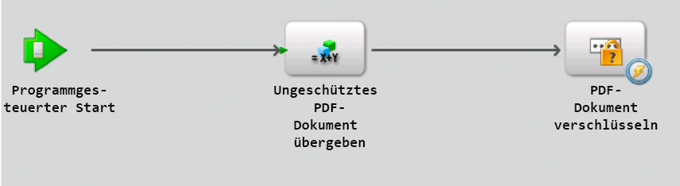
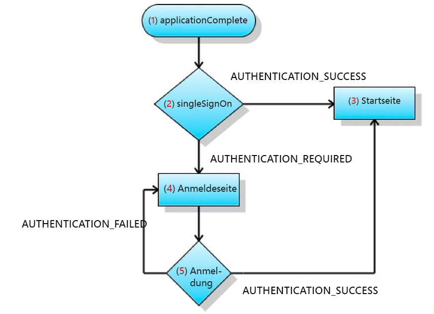

# Erstellen von Flash Builder-Anwendungen, die eine SSO-Authentifizierung mit HTTP-Token ausführen{#creating-flash-builder-applicationsthat-perform-sso-authentication-using-http-tokens}

**Beispiele und Beispiele in diesem Dokument gelten nur für die Umgebung AEM Forms on JEE.**

Sie können eine Clientanwendung mit Flash Builder erstellen, der eine SSO-Authentifizierung (Single Sign-On) mit HTTP-Token durchführt. Angenommen, Sie erstellen eine webbasierte Anwendung mit Flash Builder. Als Nächstes gehen Sie davon aus, dass die Anwendung verschiedene Ansichten enthält, bei denen jede Ansicht einen anderen AEM Forms-Vorgang aufruft. Statt einen Benutzer für jeden Forms-Vorgang zu authentifizieren, können Sie eine Anmeldeseite erstellen, auf der sich der Benutzer nur einmal authentifizieren kann. Nach der Authentifizierung kann ein Benutzer mehrere Vorgänge aufrufen, ohne sich erneut authentifizieren zu müssen. Wenn sich ein Benutzer beispielsweise bei Workspace (oder einer anderen Forms-Anwendung) angemeldet hat, muss er sich nicht erneut authentifizieren.

Obwohl die Clientanwendung die erforderliche Anwendungslogik für die SSO-Authentifizierung enthält, führt AEM Forms-Benutzerverwaltung die tatsächliche Benutzerauthentifizierung durch. Um einen Benutzer mit HTTP-Token zu authentifizieren, ruft die Clientanwendung den Vorgang `authenticateWithHTTPToken` des Authentication Manager-Dienstes auf. User Management kann Benutzer mithilfe eines HTTP-Tokens authentifizieren. Für spätere Remoting- oder Webdienstaufrufe an AEM Forms müssen Sie keine Anmeldeinformationen zur Authentifizierung weitergeben.

>[!NOTE]
>
>Bevor Sie diesen Abschnitt lesen, sollten Sie sich mit Invoking AEM Forms using Remoting vertraut machen. (Siehe [Aufrufen von AEM Forms mit AEM Forms Remoting](/help/forms/developing/invoking-aem-forms-using-remoting.md#invoking-aem-forms-using-remoting).)

Der folgende AEM Forms-Prozess mit kurzer Lebensdauer mit dem Namen `MyApplication/EncryptDocument` wird aufgerufen, nachdem ein Benutzer mithilfe der einmaligen Anmeldung authentifiziert wurde. (Weitere Informationen zu diesem Prozess, z. B. zu Eingabe- und Ausgabewerten, finden Sie unter [Beispiel für einen Prozess mit kurzer Lebensdauer](/help/forms/developing/aem-forms-processes.md).)



>[!NOTE]
>
>Dieser Prozess basiert nicht auf einem vorhandenen AEM Forms-Prozess. Um zusammen mit den Codebeispielen zu folgen, die das Aufrufen dieses Prozesses beschreiben, erstellen Sie einen Prozess mit dem Namen `MyApplication/EncryptDocument` mithilfe von Workbench. (Siehe [Verwenden von Workbench](https://www.adobe.com/go/learn_aemforms_workbench_63).)

Die mit Flash Builder erstellte Clientanwendung interagiert mit dem Sicherheits-Servlet des User Managers, das unter `/um/login` und `/um/logout` konfiguriert ist. Das heißt, die Clientanwendung sendet während des Starts eine Anforderung an die `/um/login`-URL, um den Status des Benutzers zu bestimmen. Dann antwortet User Manager mit dem Benutzerstatus. Die Clientanwendung und das User Manager-Sicherheitsservlet kommunizieren über HTTP.

**Anforderungsformat**

Das Sicherheits-Servlet erfordert die folgenden Eingabevariablen:

* `um_no_redirect` - Dieser Wert muss angegeben werden  `true`. Diese Variable begleitet alle Anforderungen, die an das User Manager-Sicherheits-Servlet gesendet wurden. Es hilft dem Sicherheits-Servlet auch, die eingehende Anforderung von einem Flex-Client oder anderen Webanwendungen zu unterscheiden.
* `j_username` - Dieser Wert ist der Anmeldekennwert des Benutzers, der im Anmeldeformular angegeben ist.
* `j_password` - Dieser Wert ist das entsprechende Kennwort des Benutzers, wie im Anmeldeformular angegeben.

Der Wert `j_password` ist nur für Berechtigungsanforderungen erforderlich. Wenn der Kennwortwert nicht angegeben ist, prüft das Sicherheits-Servlet, ob das von Ihnen verwendete Konto bereits authentifiziert ist. Wenn ja, können Sie fortfahren; Das Sicherheits-Servlet authentifiziert Sie jedoch nicht erneut.

>[!NOTE]
>
>Stellen Sie für eine ordnungsgemäße Verarbeitung von i18n sicher, dass diese Werte in POST vorliegen.

**Antwortformat**

Das unter `/um/login` konfigurierte Sicherheits-Servlet reagiert mithilfe des Formats `URLVariables`. In diesem Format lautet die Ausgabe des Inhaltstyps text/plain. Die Ausgabe enthält Namenswertpaare, die durch ein kaufmännisches Und-Zeichen (&amp;) getrennt sind. Die Antwort enthält die folgenden Variablen:

* `authenticated` - Der Wert ist entweder  `true` oder  `false`.
* `authstate` - Dieser Wert kann einen der folgenden Werte enthalten:

   * `CREDENTIAL_CHALLENGE` - Dieser Status gibt an, dass User Manager die Identität des Benutzers nicht auf irgendeine Weise bestimmen kann. Damit eine Authentifizierung durchgeführt werden kann, müssen Benutzername und Kennwort des Benutzers angegeben werden.
   * `SPNEGO_CHALLENGE`- Dieser Zustand wird wie  `CREDENTIAL_CHALLENGE`.
   * `COMPLETE` - Dieser Status gibt an, dass User Manager den Benutzer authentifizieren kann.
   * `FAILED` - Dieser Status gibt an, dass User Manager den Benutzer nicht authentifizieren konnte. Als Antwort auf diesen Status kann der Flex-Client eine Fehlermeldung an den Benutzer anzeigen.
   * `LOGGED_OUT` - Dieser Status gibt an, dass der Benutzer sich erfolgreich abgemeldet hat.

* `assertionid` - Wenn der Status  `COMPLETE` dann den  `assertionId` Wert des Benutzers enthält. Eine Clientanwendung kann das `AuthResult` für den Benutzer abrufen.

**Anmeldevorgang**

Wenn eine Client-Anwendung Beginn macht, können Sie eine POST an das `/um/login`-Sicherheits-Servlet anfordern. Beispiel: `https://<your_serverhost>:<your_port>/um/login?um_no_redirect=true`. Wenn die Anforderung das User Manager-Sicherheits-Servlet erreicht, führt sie die folgenden Schritte aus:

1. Es wird nach einem Cookie mit dem Namen `lcAuthToken` gesucht. Wenn sich der Benutzer bereits bei einer anderen Forms-Anwendung angemeldet hat, ist dieses Cookie vorhanden. Wenn das Cookie gefunden wird, wird sein Inhalt validiert.
1. Wenn die Header-basierte einmalige Anmeldung aktiviert ist, sucht das Servlet nach konfigurierten Kopfzeilen, um die Identität des Benutzers zu bestimmen.
1. Wenn SPNEGO aktiviert ist, versucht das Servlet, SPNEGO zu starten und versucht, die Identität des Benutzers zu ermitteln.

Wenn das Sicherheits-Servlet ein gültiges Token findet, das mit einem Benutzer übereinstimmt, können Sie mit dem Sicherheits-Servlet fortfahren und mit `authstate=COMPLETE` antworten. Andernfalls reagiert das Sicherheits-Servlet mit `authstate=CREDENTIAL_CHALLENGE`. In der folgenden Liste werden diese Werte erläutert:

* `Case authstate=COMPLETE`: Gibt an, dass der Benutzer authentifiziert ist und der  `assertionid` Wert die Zusicherungskennung für den Benutzer enthält. Zum jetzigen Zeitpunkt kann die Clientanwendung eine Verbindung mit AEM Forms herstellen. Das für diese URL konfigurierte Servlet kann das `AuthResult` für den Benutzer abrufen, indem die `AuthenticationManager.authenticate(HttpRequestToken)`-Methode aufgerufen wird. Die `AuthResult`-Instanz kann den User Manager-Kontext erstellen und in der Sitzung speichern.
* `Case authstate=CREDENTIAL_CHALLENGE`: Gibt an, dass für das Sicherheits-Servlet die Anmeldeinformationen des Benutzers erforderlich sind. Als Antwort kann die Clientanwendung den Anmeldebildschirm für den Benutzer anzeigen und die erhaltene Berechtigung an das Sicherheits-Servlet senden (z. B. `https://<your_serverhost>:<your_port>/um/login?um_no_redirect=true&j_username=administrator&j_password=password)`). Bei erfolgreicher Authentifizierung reagiert das Sicherheits-Servlet mit `authstate=COMPLETE`.

Wenn die Authentifizierung weiterhin nicht erfolgreich ist, antwortet das Sicherheits-Servlet mit `authstate=FAILED`. Um auf diesen Wert zu reagieren, kann die Clientanwendung eine Meldung anzeigen, um die Anmeldeinformationen erneut abzurufen.

>[!NOTE]
>
>Bei &lt; a0/> wird empfohlen, dass der Client die erhaltene Berechtigung in einem POST-Formular an das Sicherheits-Servlet sendet.`authstate=CREDENTIAL_CHALLENGE`

**Abmeldevorgang**

Wenn sich eine Clientanwendung abmeldet, können Sie eine Anforderung an die folgende URL senden:

`https://<your_serverhost>:<your_port>/um/logout?um_no_redirect=true`

Beim Empfang dieser Anforderung löscht das User Manager-Sicherheits-Servlet das `lcAuthToken`-Cookie und reagiert mit `authstate=LOGGED_OUT`. Nachdem die Clientanwendung diesen Wert erhalten hat, kann die Anwendung Bereinigungs-Aufgaben durchführen.

## Erstellen einer Clientanwendung, die AEM Formularbenutzer mit SSO {#creating-a-client-application-that-authenticates-aem-forms-users-using-sso} authentifiziert

Um zu veranschaulichen, wie eine Clientanwendung erstellt wird, die eine SSO-Authentifizierung durchführt, wird eine Beispielclientanwendung erstellt. Die folgende Abbildung zeigt die Schritte, die die Clientanwendung zur Authentifizierung eines Benutzers mit einer einmaligen Anmeldung durchführt.



In der vorherigen Abbildung wird der Anwendungsfluss beschrieben, der beim Beginn der Clientanwendung auftritt.

1. Die Clientanwendung Trigger das Ereignis `applicationComplete`.
1. Der Aufruf von `ISSOManager.singleSignOn` erfolgt. Die Clientanwendung sendet eine Anforderung an das User Manager-Sicherheitsservlet.
1. Wenn das Sicherheits-Servlet den Benutzer authentifiziert, löst `ISSOManager` `SSOEvent.AUTHENTICATION_SUCCESS` aus. Als Antwort zeigt die Clientanwendung die Hauptseite an. In diesem Beispiel ruft die Hauptseite den AEM Forms-Prozess mit kurzer Lebensdauer mit dem Namen MyApplication/EncryptDocument auf.
1. Wenn das Sicherheits-Servlet nicht ermitteln kann, ob der Benutzer gültig ist, fordert die Anwendung erneut Benutzeranmeldeinformationen an. Die `ISSOManager`-Klasse löst das `SSOEvent.AUTHENTICATION_REQUIRED`-Ereignis aus. Die Clientanwendung zeigt die Anmeldeseite an.
1. Die auf der Anmeldeseite angegebenen Anmeldeinformationen werden an die `ISSOManager.login`-Methode gesendet. Ist die Authentifizierung erfolgreich, führt sie zu Schritt 3. Andernfalls wird das Ereignis `SSOEvent.AUTHENTICATION_FAILED` ausgelöst. Die Clientanwendung zeigt die Anmeldeseite und eine entsprechende Fehlermeldung an.

### Clientanwendung {#creating-the-client-application} erstellen

Die Clientanwendung besteht aus den folgenden Dateien:

* `SSOStandalone.mxml`: Die MXML-Hauptdatei, die die Clientanwendung darstellt. (Siehe [Erstellen der Datei SSOStandalone.mxml](creating-flash-builder-applications-perform.md#creating-the-ssostandalone-mxml-file).)
* `um/ISSOManager.as`: Machen Sie Vorgänge im Zusammenhang mit der einmaligen Anmeldung (SSO) verfügbar. (Siehe [Erstellen der Datei ISSOManager.as](creating-flash-builder-applications-perform.md#creating-the-issomanager-as-file).)
* `um/SSOEvent.as`: Der Dienst  `SSOEvent` wird für SSO-bezogene Ereignis gesendet. (Siehe [Erstellen der Datei SSOEvent.as](creating-flash-builder-applications-perform.md#creating-the-ssoevent-as-file).)
* `um/SSOManager.as`: Verwaltet die SSO-bezogenen Vorgänge und sendet geeignete Ereignis. (Siehe [Erstellen der Datei SSOManager.as](creating-flash-builder-applications-perform.md#creating-the-ssomanager-as-file).)
* `um/UserManager.as`: Enthält Anwendungslogik, die den Authentication Manager-Dienst mithilfe seiner WSDL aufruft. (Siehe [Erstellen der Datei UserManager.as](creating-flash-builder-applications-perform.md#creating-the-usermanager-as-file).)
* `views/login.mxml`: Stellt den Anmeldebildschirm dar. (Siehe [Erstellen der Datei &quot;login.mxml](creating-flash-builder-applications-perform.md#creating-the-login-mxml-file)&quot;.)
* `views/logout.mxml`: Stellt den Abmeldebildschirm dar. (Siehe [Erstellen der Datei &quot;logout.mxml](creating-flash-builder-applications-perform.md#creating-the-logout-mxml-file)&quot;.)
* `views/progress.mxml`: Stellt eine Ansicht zum Fortschritt dar. (Siehe [Datei &quot;progress.mxml&quot;erstellen](creating-flash-builder-applications-perform.md#creating-the-progress-mxml-file).)
* `views/remoting.mxml`: Stellt die Ansicht dar, die den kurzlebigen AEM Forms-Prozess MyApplication/EncryptDocument mit Remoting aufruft. (Siehe [Erstellen der Datei &quot;remoting.mxml](creating-flash-builder-applications-perform.md#creating-the-remoting-mxml-file)&quot;.)

Die folgende Abbildung zeigt eine visuelle Darstellung der Clientanwendung.


>[!NOTE]
>
>Beachten Sie, dass es zwei Pakete mit dem Namen um und Ansichten gibt. Stellen Sie beim Erstellen der Clientanwendung sicher, dass Sie die Dateien in den entsprechenden Paketen ablegen. Achten Sie außerdem darauf, die Datei &quot;adobe-remoting-provider.swc&quot;dem Klassenpfad Ihres Projekts hinzuzufügen. (Siehe [Einschließen der AEM Forms Flex-Bibliotheksdatei](/help/forms/developing/invoking-aem-forms-using-remoting.md#including-the-aem-forms-flex-library-file).)

### Erstellen der Datei SSOStandalone.mxml {#creating-the-ssostandalone-mxml-file}

Der folgende Code stellt die Datei SSOStandalone.mxml dar.

```xml
 <?xml version="1.0" encoding="utf-8"?>
 <mx:Application
                 layout="absolute"
                 applicationComplete="initApp()"
                 height="400" width="550"
                 xmlns:v="views.*"
                 backgroundColor="#EDE8F0" viewSourceURL="srcview/index.html">
     <mx:Script>
         <![CDATA[
             import mx.utils.URLUtil;
             import um.SSOEvent;
             import mx.core.UIComponent;
             import um.SSOManager;
             import mx.rpc.events.ResultEvent;
             import mx.utils.ObjectUtil;
             import mx.controls.Alert;
 
             [Bindable]
             private var _serverURL:String;
 
             private var _ssoManager:SSOManager;
 
             private var _progress:UIComponent;
 
             private var _loginPage:UIComponent;
 
             private function initApp():void{
                 _serverURL = determineServerUrl();
                 _ssoManager = new SSOManager(_serverURL);
 
                 _ssoManager.addEventListener(SSOEvent.AUTHENTICATION_FAILED,loginHandler);
                 _ssoManager.addEventListener(SSOEvent.AUTHENTICATION_SUCCESS,loginHandler);
                 _ssoManager.addEventListener(SSOEvent.AUTHENTICATION_REQUIRED,loginHandler);
                 _ssoManager.addEventListener(SSOEvent.LOGOUT_COMPLETE,loginHandler);
                 _ssoManager.addEventListener(SSOEvent.AUTHENTICATION_FAULT,loginHandler);
 
                 trace("[Main] Add the required event handlers for authentication");
                 _ssoManager.singleSignOn();
 
                 showBusy();
             }
 
             private function determineServerUrl():String
             {
                 var s:String ;
                 var appUrl:String = Application.application.url;
                 var givenUrl:String  = ExternalInterface.call("serverUrl.toString");
                 trace("[Main] Application url ["+appUrl+"] Given url ["+givenUrl+"]");
                 if(appUrl != null && appUrl.search("^http") != -1){
                     s = appUrl;
                 }
                 if(s == null){
                     s = givenUrl;
                 }
                 if(s== null){
                     s = "https://hiro-xp:8080/";
                 }
                 s = URLUtil.getFullURL(s,"/");
                 trace("[Main] Would be using ["+s+"] as serverUrl");
                 return s;
             }
 
             private function loginHandler(event:SSOEvent):void
             {
                 trace("[Main] Handling event "+event.type);
                 switch(event.type)
                 {
                     case SSOEvent.AUTHENTICATION_FAILED:
                         viewContent.selectedChild = login;
                         login.showLoginFailed();
                         break;
                     case SSOEvent.AUTHENTICATION_SUCCESS:
                         viewContent.selectedChild = remoting;
                         break;
                     case SSOEvent.AUTHENTICATION_REQUIRED:
                         viewContent.selectedChild = login;
                         break;
                     case SSOEvent.LOGOUT_COMPLETE:
                         viewContent.selectedChild = logout;
                         break;
                     case SSOEvent.AUTHENTICATION_FAULT:
                         Alert.show("Error doing authentication. Root error ["+event.rootEvent+"]","Authentication Fault",Alert.OK);
                 }
             }
 
             public function get ssoManager():SSOManager
             {
                 return _ssoManager;
             }
 
             public function showBusy():void
             {
                 viewContent.selectedChild = progress;
             }
 
             public function get serverUrl():String
             {
                 return _serverURL;
             }
 
         ]]>
     </mx:Script>
     <mx:ViewStack x="0" y="0" id="viewContent" >
         <v:login id="login" />
         <v:remoting id="remoting"  />
         <v:progress id="progress" />
         <v:logout id="logout"/>
     </mx:ViewStack>
 </mx:Application>
 
```

### Erstellen der Datei ISSOManager.as {#creating-the-issomanager-as-file}

Der folgende Code stellt die Datei ISSOManager.as dar.

```java
 package um
 {
     import flash.events.IEventDispatcher;
 
     /**
      * The <code>ISSOManager</code> expose operations related to Single Sign On (SSO) in AEM Forms
      * environment. The application should register appropriate <code>SSOEvent</code> handlers prior
      * to calling any of the following operations
      */
     public interface ISSOManager extends IEventDispatcher
     {
         /**
          * Tries to validate whether the user has an already existing session or not (SSO Scenarios). The application
          * may call this method during the initialization. In general this call would lead to one of the
          * following events getting dispatched
          * <ul>
          * <li>SSOEvent.AUTHENTICATION_SUCCESS - If a SSO session was found and valid
          * <li>SSOEvent.AUTHENTICATION_REQUIRED - No SSO session was found and as such authentication is required in
          * the form of username and password.
          * <li>SSOEvent.AUTHENTICATION_FAULT - Some error has occured while connecting to the server
          * </ul>
          */
         function singleSignOn():void;
 
         /**
          * Authenticates the user using username and password. It may lead to one of the following events
          * <ul>
          * <li>SSOEvent.AUTHENTICATION_SUCCESS - The authentication is successful and a session is established
          * <li>SSOEvent.AUTHENTICATION_FAILED - Authentication has failed
          * </ul>
          */
         function login(username:String, password:String):void;
 
         /**
          * Terminates the current session and logs out the user.
          */
         function logout():void;
 
         /**
          * Get the assertionId for the logged in user
          */
         function get assertionId():String;
     }
 }
```

### Erstellen der Datei SSOEvent.as {#creating-the-ssoevent-as-file}

Der folgende Code stellt die Datei SSOEvent.as dar.

```java
 package um
 {
     import flash.events.Event;
 
     /**
      * The <code>SSOEvent</code> is dispatched for SSO related events
      */
     public class SSOEvent extends Event
     {
         /**
          * This type of event would be dispatched when the Authentication process is successful. Authentication
          * might have been done with SSO or username and password. As a response to this event the application
          * can show the welcome page to the user
          * The application may want to perform specific check for permission/role so as to verify the user is allowed.
          * So as a response to this event the application would do those checks and then only show the welcome page
          */
         public static const AUTHENTICATION_SUCCESS:String = "authenticationSuccess";
 
         /**
          * This type of event would be dispatched when authentication fails using the username, password.
          * As a response to this type of event an application can show an error message to the user.
          * This event would only happen when authentication is done using username and password and NOT in
          * SSO case.
          */
         public static const AUTHENTICATION_FAILED:String = "authenticationFailed";
 
         /**
          * This type of event would be dispatched when authentication using SSO is not achieved. And due to
          * that we require the user's username and password for authentication. As a response to this event
          * the application can show the login page to the user.
          */
         public static const AUTHENTICATION_REQUIRED:String = "authenticationRequired";
 
         /**
          * This type of event would be dispatched when logout is complete. As a response to this event the
          * application may show a logout page informing the user that he has been logged out. Or the application
          * can take the user back to login page
          */
         public static const LOGOUT_COMPLETE:String = "logoutComplete";
 
         /**
          * This type of event would be dispatched when ever there is a problem in doing Authentication. The root cause
          * can be obtained from the <code>rootEvent</code>.
          */
         public static const AUTHENTICATION_FAULT:String = "authenticationFault";
 
         private var _rootEvent:Event;
 
         public function SSOEvent(type:String, rootEvent:Event=null)
         {
             super(type,true,false);
             _rootEvent = rootEvent;
         }
 
         /**
          * The root event. If current event type is <code>AUTHENTICATION_FAULT</code> then it would be an
          * <code>IOErrorEvent</code> in other cases it would be complete event. Its basic use is to extract the root
          * cause in case of an authentication fault.
          */
         public function get rootEvent():Event
         {
             return _rootEvent;
         }
     }
 }
```

### Erstellen der Datei SSOManager.as {#creating-the-ssomanager-as-file}

Der folgende Code stellt die Datei SSOManager.as dar.

```java
 package um
 {
     import flash.events.Event;
     import flash.events.EventDispatcher;
     import flash.events.IOErrorEvent;
     import flash.external.ExternalInterface;
     import flash.net.URLLoader;
     import flash.net.URLLoaderDataFormat;
     import flash.net.URLRequest;
     import flash.net.URLVariables;
 
     import mx.utils.ObjectUtil;
 
     /**
      * Manages the SSO related operations and dispatches appropriate events. It would connect to the UM Filter/Servlet
      * at <code>um/login</code> The UM response would be of form of url encoded variables. It would look for
      * <code>authstate</code> value in the response and depending on that it would proceed.
      *
      * <p>If there is an IO_Error while initial attempt to UM then it would assume it as a 401 response. And it would
      * be assumed that SPNEGO based authenticatin is not working and therefore user would be shown a login page.
      */
     public class SSOManager extends EventDispatcher implements ISSOManager
     {
         private static const SSO_URL:String = "um/login";
         private static const SSO_LOGOUT_URL:String = "um/logout";
         private static const AUTH_COOKIE_NAME:String = "lcAuthToken";
 
         private var _serverUrl:String;
         private var _assertionId:String;
 
         /**
          * Constructs an SSOManager with the given server url.
          *
          * @param serverUrl - The uri of the server to connect to. it must be without any context path e.g
          * http://localhost:8080/. The SSOManager would directly append the path of UM exposed SSO url to it
          * for its operations
          */
         public function SSOManager(serverUrl:String)
         {
             _serverUrl = serverUrl;
         }
 
         public function singleSignOn():void
         {
             sendRequest(SSO_URL,true);
         }
 
         public function login(username:String, password:String):void
         {
             sendRequest(SSO_URL,false,
                 function(request:URLRequest,vars:URLVariables):void
                 {
                     vars.j_username = username;
                     vars.j_password = password;
                 }
             );
         }
 
         public function logout():void
         {
             sendRequest(SSO_LOGOUT_URL);
         }
 
         public function get assertionId():String
         {
             return _assertionId;
         }
 
 
 
         /**
          * Connects to the UM security service.
          */
         private function sendRequest(relativeUrl:String,authenticationRequest:Boolean=false, requestProcessor:Function=null):void
         {
             var loader:URLLoader = new URLLoader();
             loader.dataFormat = URLLoaderDataFormat.VARIABLES;
             var request:URLRequest = new URLRequest(_serverUrl + relativeUrl);
             trace("[SSOmanager] Contacting ["+request.url+"]");
             var vars:URLVariables = new URLVariables();
             vars.um_no_redirect = "true";
             request.data = vars;
             if(requestProcessor != null){
                 requestProcessor(request,vars);
             }
 
             loader.addEventListener(Event.COMPLETE,authHandler);
             //if its an authentication request then only treat io error as a possible 401
             //for others treat them as faults
             if(authenticationRequest){
                 loader.addEventListener(IOErrorEvent.IO_ERROR,httpAuthenticationHandler);
             }else{
                 loader.addEventListener(IOErrorEvent.IO_ERROR,authFaultHandler);
             }
             trace("[SSOmanager] Sending request "+ ObjectUtil.toString(request));
             loader.load(request);
         }
 
         private function authHandler(event:Event):void
         {
             var loader:URLLoader = URLLoader(event.target);
             var response:URLVariables = URLVariables(loader.data);
             trace("[SSOmanager] Processing response ["+ObjectUtil.toString(response)+"]");
             handleAuthResult(response["authstate"],response);
         }
 
         /**
          * Handles the IOErrorEvent. Flash would dispatch IOEvent in response to HTTP 401.
          * There is no way to distinguish it from the genuine IOError.
          */
         private function httpAuthenticationHandler(event:IOErrorEvent):void
         {
             trace("[SSOmanager] Processing IOErrorEvent ["+ObjectUtil.toString(event)+"]");
             handleAuthResult("CREDENTIAL_CHALLENGE");
 
         }
 
         /**
          * Dispatches appropriate <code>SSOEvent</code> on the basis of the <code>authstate</code>
          * value of the response.
          * The response is url encoded in for of
          * <pre>
          * authenticated=false&authstate=SPNEGO_CHALLENGE
          * </pre>
          * Depending on <code>authstate</code> the SSOEvent is dispatched
          */
         private function handleAuthResult(authState:String,response:URLVariables = null):void
         {
             trace("[SSOmanager] processing state "+authState);
             switch(authState)
             {
                 case "FAILED"  :
                     dispatchEvent(new SSOEvent(SSOEvent.AUTHENTICATION_FAILED));
                     break;
                 case "COMPLETE" :
                     _assertionId = response ? response["assertionid"] : null;
                     dispatchEvent(new SSOEvent(SSOEvent.AUTHENTICATION_SUCCESS));
                     break;
                 case "CREDENTIAL_CHALLENGE" :
                     dispatchEvent(new SSOEvent(SSOEvent.AUTHENTICATION_REQUIRED));
                     break;
                 case "LOGGED_OUT" :
                     dispatchEvent(new SSOEvent(SSOEvent.LOGOUT_COMPLETE));
                     break;
                 default:
                     dispatchEvent(new SSOEvent(SSOEvent.AUTHENTICATION_REQUIRED));
                     break;
             }
         }
 
         private function authFaultHandler(event:Event):void
         {
             dispatchEvent(new SSOEvent(SSOEvent.AUTHENTICATION_FAULT,event));
         }
 
     }
 }
```

### Erstellen der Datei UserManager.as {#creating-the-usermanager-as-file}

Der folgende Code stellt die Datei UserManager.as dar.

```java
 package um
 {
     import flash.events.Event;
     import mx.rpc.soap.WebService;
     import mx.rpc.soap.Operation;
     import mx.rpc.IResponder;
     import mx.rpc.events.FaultEvent;
     import mx.rpc.events.ResultEvent;
     import mx.rpc.soap.LoadEvent;
 
     public class UserManager
     {
         private var _ssoManager:ISSOManager;
         private var _serverUrl:String;
 
         public function UserManager(ssoManager:ISSOManager,serverUrl:String)
         {
             _serverUrl = serverUrl;
             _ssoManager = ssoManager;
         }
 
         public function retrieveAssertion(responder:IResponder):String
         {
             var assertionId:String = _ssoManager.assertionId;
             if(!assertionId)
             {
                 trace("[UserManager] AssertionId not found");
                 return null;
             }
 
             var ws:WebService = new WebService();
             var wsdl:String = _serverUrl+'soap/services/AuthenticationManagerService?wsdl&lc_version=8.2.1';
             ws.loadWSDL(wsdl);
             ws.addEventListener(LoadEvent.LOAD,
                 function(event:Event):void
                 {
                     trace("[UserManager] WSDL loaded");
                     var authenticate:Operation = ws.authenticateWithHttpToken as Operation;
                     authenticate.resultFormat = "e4x";
                     authenticate.addEventListener(ResultEvent.RESULT,
                         function(event:Event):void
                         {
                             responder.result(event);
                         }
                     );
                     authenticate.send({assertionId:assertionId});
                 }
             );
 
             ws.addEventListener(FaultEvent.FAULT,
                 function(event:Event):void
                 {
                     responder.fault(event);
                 }
             );
             return null;
         }
     }
 }
```

### Erstellen der Datei login.mxml {#creating-the-login-mxml-file}

Der folgende Code stellt die Datei &quot;login.mxml&quot;dar.

```xml
 <?xml version="1.0" encoding="utf-8"?>
 <mx:Canvas  width="500" height="400">
     <mx:Script>
         <![CDATA[
             import mx.core.Application;
             public function showLoginFailed():void
             {
                 loginMessage.text = "Username or Password incorrect";
             }
 
             private function doLogin():void
             {
                 Application.application.ssoManager.login(j_username.text,j_password.text);
                 Application.application.showBusy();
             }
 
         ]]>
     </mx:Script>
 
     <mx:VBox height="113" width="244" x="128" y="144" horizontalAlign="center" verticalGap="10">
         <mx:HBox width="100%">
             <mx:HBox width="100%" verticalAlign="middle" horizontalAlign="center" height="32">
                 <mx:Label text="Username" fontWeight="bold"/>
                 <mx:TextInput id="j_username"/>
             </mx:HBox>
         </mx:HBox>
         <mx:HBox width="100%" height="33" horizontalAlign="center" horizontalGap="10" verticalAlign="middle">
             <mx:Label text="Password" fontWeight="bold"/>
             <mx:TextInput displayAsPassword="true" id="j_password"/>
         </mx:HBox>
         <mx:Button label="Login" click="doLogin()"/>
     </mx:VBox>
     <mx:Text x="128" y="122" id="loginMessage" width="230" height="14"/>
     <mx:Label x="154" y="65" text="AEM Forms SSO Demo" fontFamily="Georgia" fontSize="20" color="#0A0A0A"/>
 </mx:Canvas>
 
```

### Erstellen der Datei &quot;logout.mxml&quot;{#creating-the-logout-mxml-file}

Der folgende Code stellt die Datei &quot;logout.mxml&quot;dar.

```xml
 <?xml version="1.0" encoding="utf-8"?>
 <mx:Canvas  width="500" height="400">
     <mx:Label x="97" y="188" text="You have successfully logged out from the application"/>
 
 </mx:Canvas>
 
```

### Datei &quot;progress.mxml&quot; {#creating-the-progress-mxml-file} erstellen

Der folgende Code stellt die Datei &quot;progress.mxml&quot;dar.

```xml
 <?xml version="1.0" encoding="utf-8"?>
 <mx:Canvas >
     <mx:Label x="151" y="141" text="Wait...."/>
     <mx:SWFLoader source="LoadingCircle.swf" width="50" height="50" horizontalCenter="0" verticalCenter="0"/>
 </mx:Canvas>
```

### Erstellen der Datei &quot;remoting.mxml&quot;{#creating-the-remoting-mxml-file}

Der folgende Code stellt die Datei remoting.mxml dar, die den Prozess `MyApplication/EncryptDocument` aufruft. Da ein Dokument an den Prozess übergeben wird, befindet sich in dieser Datei die Anwendungslogik, die für die Weitergabe eines sicheren Dokuments an AEM Forms verantwortlich ist. (Siehe [Übergeben sicherer Dokumente zum Aufrufen von Prozessen mit Remoting](/help/forms/developing/invoking-aem-forms-using-remoting.md#passing-secure-documents-to-invoke-processes-using-remoting).)

```xml
 <?xml version="1.0" encoding="utf-8"?>
 <mx:Canvas  width="664" height="400" creationComplete="initializeChannelSet()" xmlns:views="views.*">
     <mx:Script>
 
         <![CDATA[
 
             import mx.rpc.livecycle.DocumentReference;
             import flash.net.FileReference;
             import flash.net.URLRequest;
             import flash.events.Event;
             import flash.events.DataEvent;
             import mx.messaging.ChannelSet;
             import mx.messaging.channels.AMFChannel;
             import mx.rpc.events.ResultEvent;
             import mx.collections.ArrayCollection;
             import mx.rpc.AsyncToken;
             import um.UserManager;
             import mx.rpc.events.ResultEvent;
             import mx.rpc.events.FaultEvent;
             import mx.core.Application;
             import mx.rpc.Responder;
             import mx.utils.ObjectUtil;
 
             // Classes used in file retrieval
             private var fileRef:FileReference = new FileReference();
             private var docRef:DocumentReference = new DocumentReference();
             private var parentResourcePath:String = "/";
             //private var serverPort:String = "'[server]:[port]'";
             private var serverPort:String = "'[server]:[port]'";
             private var now1:Date;
             private var userManager:UserManager;
 
             // Define a ChannelSet object.
             public var cs:ChannelSet;
 
             // Holds information returned from AEM Forms
             [Bindable]
             public var progressList:ArrayCollection = new ArrayCollection();
 
 
             // Set up channel set to invoke AEM Forms.
             // This must be done before calling any service or process, but only
             // once for the entire application.
             private function initializeChannelSet():void {
                 cs = new ChannelSet();
                 cs.addChannel(new AMFChannel("remoting-amf", "https://" + serverPort + "/remoting/messagebroker/amf"));
                 EncryptDocument.channelSet = cs;
 
             //Get the user that is authenticated
             userManager = new UserManager(Application.application.ssoManager,Application.application.serverUrl);
             userManager.retrieveAssertion(
                     new mx.rpc.Responder(
                         function(event:ResultEvent):void
                         {
                             var name:String = XML(event.currentTarget.lastResult)..*::authenticatedUser.*::userid.text();
                             username.text = "Welcome "+name;
                         },
                         function(event:FaultEvent):void
                         {
                             mx.controls.Alert.show(event.fault.faultString,'Error')
                         }
                     )
                 );
 
             }
 
             // Call this method to upload the file.
             // This creates a file picker and lets the user select a PDF file to pass to the EncryptDocument process.
             private function uploadFile():void {
                 fileRef.addEventListener(Event.SELECT, selectHandler);
                 fileRef.addEventListener(DataEvent.UPLOAD_COMPLETE_DATA,completeHandler);
                 fileRef.browse();
             }
 
             // Gets called for selected file. Does the actual upload via the file upload servlet.
             private function selectHandler(event:Event):void {
                 var authTokenService:RemoteObject = new RemoteObject("LC.FileUploadAuthenticator");
                 authTokenService.addEventListener("result", authTokenReceived);
                 authTokenService.channelSet = cs;
                 authTokenService.getFileUploadToken();
             }
 
             private function authTokenReceived(event:ResultEvent):void
             {
                 var token:String = event.result as String;
                 var request:URLRequest = DocumentReference.constructRequestForUpload("https://hiro-xp:8080", token);
 
                 try
                 {
                     fileRef.upload(request);
                 }
                 catch (error:Error)
                 {
                     trace("Unable to upload file.");
                 }
             }
 
             // Called once the file is completely uploaded.
             private function completeHandler(event:DataEvent):void {
 
                 // Set the docRefs url and referenceType parameters
                 docRef.url = event.data as String;
                 docRef.referenceType=DocumentReference.REF_TYPE_URL;
                 executeInvokeProcess();
             }
 
             //This method invokes the EncryptDocument process
             public function executeInvokeProcess():void {
                 //Create an Object to store the input value for the EncryptDocument process
                 now1 = new Date();
 
                 var params:Object = new Object();
                 params["inDoc"]=docRef;
 
                 // Invoke the EncryptDocument process
                 var token:AsyncToken;
                 token = EncryptDocument.invoke(params);
                 token.name = name;
             }
 
 
             // This method handles a successful conversion invocation
             public function handleResult(event:ResultEvent):void
             {
 
                 //Retrieve information returned from the service invocation
                 var token:AsyncToken = event.token;
                 var res:Object = event.result;
                 var dr:DocumentReference = res["outDoc"] as DocumentReference;
                 var now2:Date = new Date();
 
                 // These fields map to columns in the DataGrid
                 var progObject:Object = new Object();
                 progObject.filename = token.name;
                 progObject.timing = (now2.time - now1.time).toString();
                 progObject.state = "Success";
                 progObject.link = "<a href='" + dr.url + "'> open </a>";
                 progressList.addItem(progObject);
             }
 
 
             private function resultHandler(event:ResultEvent):void {
             // Do anything else here.
 
             }
 
             private function logout():void
             {
                 Application.application.ssoManager.logout();
                 Application.application.showBusy();
             }
 
 
         ]]>
 
     </mx:Script>
 
     <mx:RemoteObject id="EncryptDocument" destination="MyApplication/EncryptDocument" result="resultHandler(event);">
             <mx:method name="invoke" result="handleResult(event)"/>
     </mx:RemoteObject>
 
 
     <!--//This consists of what is displayed on the webpage-->
     <mx:Panel id="lcPanel" title="EncryptDocument  (Deprecated for AEM forms) AEM Forms Remoting Example"
           height="25%" width="25%" paddingTop="10" paddingLeft="10" paddingRight="10"
           paddingBottom="10">
         <mx:Label width="100%" color="blue"
                   id="username"/>
 
         <mx:DataGrid x="10" y="0" width="500" id="idProgress" editable="false"
                          dataProvider="{progressList}" height="231" selectable="false" >
         <mx:columns>
                 <mx:DataGridColumn headerText="Filename" width="200" dataField="filename" editable="false"/>
                 <mx:DataGridColumn headerText="State" width="75" dataField="state" editable="false"/>
                 <mx:DataGridColumn headerText="Timing" width="75" dataField="timing" editable="false"/>
                 <mx:DataGridColumn headerText="Click to Open" dataField="link" editable="false" >
                 <mx:itemRenderer>
 
                         <mx:Component>
                         <mx:Text x="0" y="0" width="100%" htmlText="{data.link}"/>
                         </mx:Component>
                     </mx:itemRenderer>
             </mx:DataGridColumn>
         </mx:columns>
     </mx:DataGrid>
     <mx:Button label="Select File" click="uploadFile()" />
     <mx:Button label="Logout"  click="logout()" />
     </mx:Panel>
 </mx:Canvas>
 
 
```

### Zusätzliche Informationen {#additional-information}

Die folgenden Abschnitte enthalten zusätzliche Details, die die Kommunikation zwischen der Clientanwendung und dem User Manager-Sicherheits-Servlet beschreiben.

### Eine neue Authentifizierung erfolgt {#a-new-authentication-occurs}

In diesem Fall versucht der Benutzer zum ersten Mal, sich von einer Clientanwendung bei AEM Forms anzumelden. (Es gibt keine vorherige Sitzung, an der der Benutzer beteiligt war.) Im Ereignis `applicationComplete` wird die `SSOManager.singleSignOn`-Methode aufgerufen, die eine Anforderung an den User Manager sendet.

`GET /um/login?um%5Fno%5Fredirect=true HTTP/1.1`

Das User Manager-Sicherheits-Servlet antwortet mit dem folgenden Wert:

`HTTP/1.1 200 OK`

`authenticated=false&authstate=CREDENTIAL_CHALLENGE`

Als Reaktion auf diesen Wert wird ein `SSOEvent.AUTHENTICATION_REQUIRED`-Wert gesendet. Daher zeigt die Clientanwendung dem Benutzer einen Anmeldebildschirm an. Die Anmeldeinformationen werden an das User Manager-Sicherheitsservlet zurückgesendet.

`GET /um/login?um%5Fno%5Fredirect=true&j%5Fusername=administrator&j%5Fpassword=password HTTP/1.1`

Das User Manager-Sicherheits-Servlet antwortet mit dem folgenden Wert:

```verilog
 HTTP/1.1 200 OK
 Set-Cookie: lcAuthToken=53630BC8-F6D4-F588-5D5B-4668EFB2EC7A; Path=/
 authenticated=true&authstate=COMPLETE&assertionid=53630BC8-F6D4-F588-5D5B-4668EFB2EC7A
```

Daher wird `authstate=COMPLETE the SSOEvent.AUTHENTICATION_SUCCESS` ausgelöst. Die Client-Anwendung kann bei Bedarf eine weitere Verarbeitung durchführen. Beispielsweise kann ein Protokoll erstellt werden, das das Datum und die Uhrzeit der Authentifizierung des Benutzers verfolgt.

### Der Benutzer ist bereits authentifiziert.{#the-user-is-already-authenticated}

In diesem Fall hat sich der Benutzer bereits bei AEM Forms angemeldet und navigiert dann zur Clientanwendung. Die Clientanwendung stellt während des Starts eine Verbindung zum User Manager-Sicherheits-Servlet her.

```verilog
 GET /um/login?um%5Fno%5Fredirect=true HTTP/1.1
 Cookie: JSESSIONID=A4E0BCC2DD4BCCD3167C45FA350BD72A; lcAuthToken=53630BC8-F6D4-F588-5D5B-4668EFB2EC7A
```

Da der Benutzer bereits authentifiziert ist, ist das User Manager-Cookie vorhanden und wird an das User Manager-Sicherheits-Servlet gesendet. Das Servlet ruft dann den Wert `assertionId` ab und prüft, ob er gültig ist. Wenn es gültig ist, wird `authstate=COMPLETE` zurückgegeben. Andernfalls wird `authstate=CREDENTIAL_CHALLENGE` zurückgegeben. Die folgende Antwort ist typisch:

```verilog
 HTTP/1.1 200 OK
        authenticated=true&authstate=COMPLETE&assertionid=53630BC8-F6D4-F588-5D5B-4668EFB2EC7A
```

In diesem Fall wird dem Benutzer kein Anmeldebildschirm angezeigt und stattdessen direkt zum Startbildschirm geleitet.
