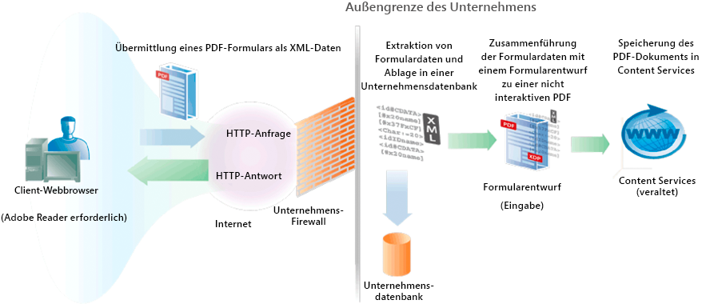

# Erstellen von PDF-Dokumenten mit übermittelten XML-Daten {#creating-pdf-documents-with-submittedxml-data}

**Beispiele und Beispiele in diesem Dokument gelten nur für die Umgebung AEM Forms on JEE.**

## Erstellen von PDF-Dokumenten mit übermittelten XML-Daten {#creating-pdf-documents-with-submitted-xml-data}

Webbasierte Anwendungen, die es Benutzern ermöglichen, interaktive Formulare auszufüllen, erfordern, dass die Daten an den Server zurückgesendet werden. Mit dem Forms-Dienst können Sie die Formulardaten abrufen, die der Benutzer in ein interaktives Formular eingegeben hat. Anschließend können Sie die Formulardaten an einen anderen AEM Forms-Dienstvorgang weiterleiten und ein PDF-Dokument mithilfe der Daten erstellen.

>[!NOTE]
>
>Bevor Sie diesen Inhalt lesen, sollten Sie mit dem Umgang mit gesendeten Formularen vertraut sein. Konzepte wie die Beziehung zwischen einem Formularentwurf und gesendeten XML-Daten werden unter Verarbeiten gesendeter Forms behandelt.

Betrachten Sie den folgenden Arbeitsablauf, der drei AEM Forms-Dienste umfasst:

* Ein Benutzer sendet XML-Daten aus einer webbasierten Anwendung an den Forms-Dienst.
* Der Forms-Dienst wird zum Verarbeiten des gesendeten Formulars und zum Extrahieren von Formularfeldern verwendet. Formulardaten können verarbeitet werden. Die Daten können beispielsweise an eine Unternehmensdatenbank gesendet werden.
* Formulardaten werden an den Output-Dienst gesendet, um ein nicht interaktives PDF-Dokument zu erstellen.
* Das nicht interaktive PDF-Dokument wird in Content Services (nicht mehr unterstützt) gespeichert.

Das folgende Diagramm zeigt eine visuelle Darstellung dieses Workflows.

Nachdem der Benutzer das Formular über den Client-Webbrowser gesendet hat, wird das nicht interaktive PDF-Dokument in Content Services (nicht mehr unterstützt) gespeichert. Die folgende Abbildung zeigt ein in Content Services gespeichertes PDF-Dokument (nicht mehr unterstützt).

### Zusammenfassung der Schritte {#summary-of-steps}

So erstellen Sie ein nicht interaktives PDF-Dokument mit gesendeten XML-Daten und speichern es im PDF-Dokument in Content Services (nicht mehr unterstützt):

1. Schließen Sie Projektdateien ein.
1. Erstellen Sie Forms-, Output- und Dokument Management-Objekte.
1. Rufen Sie Formulardaten mithilfe des Forms-Dienstes ab.
1. Erstellen Sie ein nicht interaktives PDF-Dokument mit dem Output-Dienst.
1. Speichern Sie das PDF-Formular mit dem Dokument Management-Dienst in Content Services (nicht mehr unterstützt).

**Projektdateien einschließen**

Schließen Sie die erforderlichen Dateien in Ihr Entwicklungsprojekt ein. Wenn Sie eine Clientanwendung mit Java erstellen, schließen Sie die erforderlichen JAR-Dateien ein. Wenn Sie Webdienste verwenden, stellen Sie sicher, dass Sie die Proxydateien einschließen.

**Erstellen von Forms-, Output- und Dokument Management-Objekten**

Bevor Sie einen Forms-Dienst-API-Vorgang programmgesteuert durchführen können, erstellen Sie ein Forms Client-API-Objekt. Da dieser Workflow die Output- und Dokument-Management-Dienste aufruft, erstellen Sie auch ein Output Client-API-Objekt und ein Dokument Management Client-API-Objekt.

**Formulardaten mit dem Forms-Dienst abrufen**

Rufen Sie Formulardaten ab, die an den Forms-Dienst gesendet wurden. Sie können gesendete Daten entsprechend Ihren Geschäftsanforderungen verarbeiten. Sie können beispielsweise Formulardaten in einer Unternehmensdatenbank speichern. Um jedoch ein nicht interaktives PDF-Dokument zu erstellen, werden die Formulardaten an den Output-Dienst übergeben.

**Erstellen Sie ein nicht interaktives PDF-Dokument mit dem Output-Dienst.**

Verwenden Sie den Output-Dienst, um ein nicht interaktives PDF-Dokument zu erstellen, das auf einem Formularentwurf und XML-Formulardaten basiert. Im Arbeitsablauf werden die Formulardaten vom Forms-Dienst abgerufen.

**Speichern des PDF-Formulars in Content Services (nicht mehr unterstützt) mithilfe des Dokument Management-Dienstes**

Verwenden Sie die API des Dokument Management-Dienstes, um ein PDF-Dokument in Content Services (nicht mehr unterstützt) zu speichern.

**Siehe auch**

[Einbeziehung von AEM Forms Java-Bibliotheksdateien](/help/forms/developing/invoking-aem-forms-using-java.md#including-aem-forms-java-library-files)

[Verbindungseigenschaften festlegen](/help/forms/developing/invoking-aem-forms-using-java.md#setting-connection-properties)

[Beginn zur Forms Service API](/help/forms/developing/forms-service-api-quick-starts.md#forms-service-api-quick-starts)

### Erstellen eines PDF-Dokuments mit gesendeten XML-Daten mithilfe der Java-API {#create-a-pdf-document-with-submitted-xml-data-using-the-java-api}

Erstellen Sie ein PDF-Dokument mit gesendeten XML-Daten mithilfe der Forms-, Output- und Dokument Management API (Java):

1. Projektdateien einschließen

   Schließen Sie Client-JAR-Dateien wie &quot;adobe-forms-client.jar&quot;, &quot;adobe-output-client.jar&quot;und &quot;adobe-contentservices-client.jar&quot;im Klassenpfad Ihres Java-Projekts ein.

1. Erstellen von Forms-, Output- und Dokument Management-Objekten

   * Erstellen Sie ein `ServiceClientFactory`-&quot; -Objekt, das Verbindungseigenschaften enthält.
   * Erstellen Sie ein `FormsServiceClient`-Objekt, indem Sie seinen Konstruktor verwenden und das `ServiceClientFactory`-Objekt übergeben.
   * Erstellen Sie ein `OutputClient`-Objekt, indem Sie den Konstruktor verwenden und das `ServiceClientFactory`-Objekt übergeben.
   * Erstellen Sie ein `DocumentManagementServiceClientImpl`-Objekt, indem Sie seinen Konstruktor verwenden und das `ServiceClientFactory`-Objekt übergeben.

1. Formulardaten mit dem Forms-Dienst abrufen

   * Rufen Sie die `processFormSubmission`-Methode des Objekts auf und übergeben Sie die folgenden Werte:`FormsServiceClient`

      * Das `com.adobe.idp.Document`-Objekt, das die Formulardaten enthält.
      * Ein Zeichenfolgenwert, der die Umgebung einschließlich aller relevanten HTTP-Header angibt. Geben Sie den zu verwaltenden Inhaltstyp an, indem Sie einen oder mehrere Werte für die Variable `CONTENT_TYPE` &quot;Umgebung&quot;angeben. Um beispielsweise XML-Daten zu verarbeiten, geben Sie den folgenden Zeichenfolgenwert für diesen Parameter an: `CONTENT_TYPE=text/xml`.
      * Ein Zeichenfolgenwert, der den Header-Wert `HTTP_USER_AGENT` angibt, z. B. `Mozilla/4.0 (compatible; MSIE 6.0; Windows NT 5.1; SV1; .NET CLR 1.1.4322)`.
      * Ein `RenderOptionsSpec`-Objekt, das Laufzeitoptionen speichert.

      Die `processFormSubmission`-Methode gibt ein `FormsResult`-Objekt zurück, das die Ergebnisse der Formularübermittlung enthält.

   * Stellen Sie fest, ob die Verarbeitung der Formulardaten durch den Forms-Dienst abgeschlossen ist, indem Sie die `getAction`-Methode des Objekts aufrufen. `FormsResult` Wenn diese Methode den Wert `0` zurückgibt, können die Daten verarbeitet werden.
   * Rufen Sie Formulardaten ab, indem Sie ein `com.adobe.idp.Document`-Objekt erstellen, indem Sie die `getOutputContent`-Methode des Objekts aufrufen. `FormsResult` (Dieses Objekt enthält Formulardaten, die an den Output-Dienst gesendet werden können.)
   * Erstellen Sie ein `java.io.InputStream`-Objekt, indem Sie den `java.io.DataInputStream`-Konstruktor aufrufen und das `com.adobe.idp.Document`-Objekt übergeben.
   * Erstellen Sie ein `org.w3c.dom.DocumentBuilderFactory`-Objekt, indem Sie die `newInstance`-Methode des statischen `org.w3c.dom.DocumentBuilderFactory`-Objekts aufrufen.
   * Erstellen Sie ein `org.w3c.dom.DocumentBuilder`-Objekt, indem Sie die `org.w3c.dom.DocumentBuilderFactory`-Methode des Objekts `newDocumentBuilder` aufrufen.
   * Erstellen Sie ein `org.w3c.dom.Document`-Objekt, indem Sie die `org.w3c.dom.DocumentBuilder`-Methode des Objekts `parse` aufrufen und das `java.io.InputStream`-Objekt übergeben.
   * Rufen Sie den Wert jeder Node im XML-Dokument ab. Eine Möglichkeit, diese Aufgabe durchzuführen, besteht darin, eine benutzerdefinierte Methode zu erstellen, die zwei Parameter akzeptiert: das `org.w3c.dom.Document`-Objekt und den Namen der Node, deren Wert Sie abrufen möchten. Diese Methode gibt einen Zeichenfolgenwert zurück, der den Wert der Node darstellt. Im Codebeispiel, das diesem Prozess folgt, heißt diese benutzerdefinierte Methode `getNodeText`. Der Hauptteil dieser Methode wird angezeigt.

1. Erstellen Sie ein nicht interaktives PDF-Dokument mit dem Output-Dienst.

   Erstellen Sie ein PDF-Dokument, indem Sie die `generatePDFOutput`-Methode des Objekts aufrufen und die folgenden Werte übergeben:`OutputClient`

   * Ein `TransformationFormat`-Enum-Wert. Um ein PDF-Dokument zu erstellen, geben Sie `TransformationFormat.PDF` an.
   * Ein string-Wert, der den Namen des Formularentwurfs angibt. Stellen Sie sicher, dass der Formularentwurf mit den vom Forms-Dienst abgerufenen Formulardaten kompatibel ist.
   * Ein Zeichenfolgenwert, der den Inhaltsstamm angibt, an dem sich der Formularentwurf befindet.
   * Ein `PDFOutputOptionsSpec`-Objekt, das PDF-Laufzeitoptionen enthält.
   * Ein `RenderOptionsSpec`-Objekt, das Rendering-Laufzeitoptionen enthält.
   * Das `com.adobe.idp.Document`-Objekt, das die XML-Datenquelle enthält, die Daten enthält, die mit dem Formularentwurf zusammengeführt werden sollen. Stellen Sie sicher, dass dieses Objekt von der `FormsResult`-Methode des Objekts `getOutputContent` zurückgegeben wurde.
   * Die `generatePDFOutput`-Methode gibt ein `OutputResult`-Objekt zurück, das die Ergebnisse des Vorgangs enthält.
   * Rufen Sie das nicht interaktive PDF-Dokument ab, indem Sie die `getGeneratedDoc`-Methode des Objekts aufrufen. `OutputResult` Diese Methode gibt eine `com.adobe.idp.Document`-Instanz zurück, die das nicht interaktive PDF-Dokument darstellt.

1. Speichern des PDF-Formulars in Content Services (nicht mehr unterstützt) mithilfe des Dokument Management-Dienstes

   hinzufügen Sie den Inhalt, indem Sie die `storeContent`-Methode des `DocumentManagementServiceClientImpl`-Objekts aufrufen und die folgenden Werte übergeben:

   * Ein Zeichenfolgenwert, der den Store angibt, in dem der Inhalt hinzugefügt wird. Der Standardspeicher ist `SpacesStore`. Dieser Wert ist ein obligatorischer Parameter.
   * Ein Zeichenfolgenwert, der den vollständig qualifizierten Pfad des Bereichs angibt, in dem der Inhalt hinzugefügt wird (z. B. `/Company Home/Test Directory`). Dieser Wert ist ein obligatorischer Parameter.
   * Der Knotenname, der den neuen Inhalt darstellt (z. B. `MortgageForm.pdf`). Dieser Wert ist ein obligatorischer Parameter.
   * Ein Zeichenfolgenwert, der den Knotentyp angibt. Um neuen Inhalt hinzuzufügen, z. B. eine PDF-Datei, geben Sie `{https://www.alfresco.org/model/content/1.0}content` an. Dieser Wert ist ein obligatorischer Parameter.
   * Ein `com.adobe.idp.Document`-Objekt, das den Inhalt darstellt. Dieser Wert ist ein obligatorischer Parameter.
   * Ein Zeichenfolgenwert, der den Kodierungswert angibt (z. B. `UTF-8`). Dieser Wert ist ein obligatorischer Parameter.
   * Ein `UpdateVersionType`-Auflistung-Wert, der angibt, wie Versionsinformationen verarbeitet werden (z. B. `UpdateVersionType.INCREMENT_MAJOR_VERSION`, um die Inhaltsversion zu inkrementieren). ) Dieser Wert ist ein obligatorischer Parameter.
   * Eine `java.util.List`-Instanz, die inhaltliche Aspekte angibt. Dieser Wert ist ein optionaler Parameter und Sie können `null` angeben.
   * Ein `java.util.Map`-Objekt, das Inhaltsattribute speichert.

   Die `storeContent`-Methode gibt ein `CRCResult`-Objekt zurück, das den Inhalt beschreibt. Mit einem `CRCResult`-Objekt können Sie beispielsweise den eindeutigen Bezeichnerwert des Inhalts abrufen. Um diese Aufgabe auszuführen, rufen Sie die `CRCResult`-Objektmethode `getNodeUuid` auf.

**Siehe auch**

[Einbeziehung von AEM Forms Java-Bibliotheksdateien](/help/forms/developing/invoking-aem-forms-using-java.md#including-aem-forms-java-library-files)

[Verbindungseigenschaften festlegen](/help/forms/developing/invoking-aem-forms-using-java.md#setting-connection-properties)
