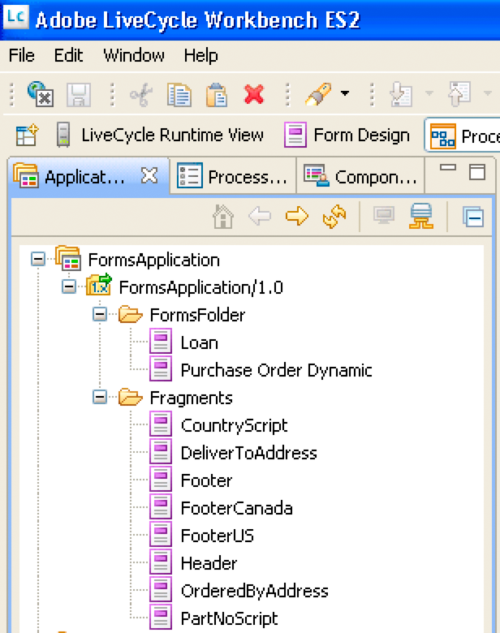

# Erstellen von Webanwendungen, die Forms {#creating-web-applications-thatrenders-forms} rendern

**Beispiele und Beispiele in diesem Dokument gelten nur für die Umgebung AEM Forms on JEE.**

## Erstellen von Webanwendungen, die Forms {#creating-web-applications-that-renders-forms} rendern

Sie können eine webbasierte Anwendung erstellen, die Java-Servlets verwendet, um den Forms-Dienst aufzurufen und Formulare wiederzugeben. Ein Vorteil der Verwendung eines Java™-Servlets besteht darin, dass Sie den Rückgabewert des Prozesses in einen Client-Webbrowser schreiben können. Das heißt, ein Java-Servlet kann als Link zwischen dem Forms-Dienst, der ein Formular zurückgibt, und einem Client-Webbrowser verwendet werden.

>[!NOTE]
>
>In diesem Abschnitt wird beschrieben, wie Sie eine webbasierte Anwendung erstellen, die ein Java-Servlet verwendet, das den Forms-Dienst aufruft und Formulare basierend auf Fragmenten rendert. (Siehe [Rendern von Forms basierend auf Fragmenten](/help/forms/developing/rendering-forms-based-fragments.md).)

Mit einem Java-Servlet können Sie ein Formular in einen Client-Webbrowser schreiben, damit der Kunde Daten in das Formular eingeben und Ansicht erhalten kann. Nachdem der Webbenutzer das Formular mit Daten gefüllt hat, klickt er auf eine Senden-Schaltfläche im Formular, um Informationen an das Java-Servlet zurückzusenden, wo die Daten abgerufen und verarbeitet werden können. Die Daten können beispielsweise an einen anderen Prozess gesendet werden.

In diesem Abschnitt wird erläutert, wie eine webbasierte Anwendung erstellt wird, mit der der Benutzer entweder amerikanische oder kanadische Formulardaten auswählen kann, wie in der folgenden Abbildung dargestellt.


Das wiedergegebene Formular ist ein Formular, das auf Fragmenten basiert. Wenn der Benutzer also amerikanische Daten auswählt, verwendet das zurückgesendete Formular Fragmente, die auf amerikanischen Daten basieren. Die Fußzeile des Formulars enthält beispielsweise eine amerikanische Adresse, wie in der folgenden Abbildung dargestellt.


Wenn der Benutzer kanadische Daten auswählt, enthält das zurückgesendete Formular eine kanadische Adresse, wie in der folgenden Abbildung dargestellt.


>[!NOTE]
>
>Informationen zum Erstellen von Formularentwürfen basierend auf Fragmenten finden Sie unter [Forms Designer](https://www.adobe.com/go/learn_aemforms_designer_63).

**Beispieldateien**

In diesem Abschnitt werden Beispieldateien verwendet, die sich am folgenden Speicherort befinden können:

&lt;>Forms Designer-Installationsordner *>/Samples/Forms/Purchase Order/Form Fragments*

wobei &lt;*Installationsordner* der Installationspfad ist. Für die Clientanwendung wurde die Datei &quot;Purchase Order Dynamic.xdp&quot;von diesem Installationsort kopiert und in eine Forms-Anwendung mit dem Namen *Applications/FormsApplication* bereitgestellt. Die Datei &quot;Purchase Order Dynamic.xdp&quot;wird in einem Ordner mit dem Namen FormsFolder abgelegt. Ebenso werden die Fragmente in dem Ordner Fragments abgelegt, wie in der folgenden Abbildung dargestellt.



Um auf den Formularentwurf &quot;Purchase Order Dynamic.xdp&quot;zuzugreifen, geben Sie `Applications/FormsApplication/1.0/FormsFolder/Purchase Order Dynamic.xdp` als Formularnamen (den ersten Parameter, der an die `renderPDFForm`-Methode übergeben wird) und `repository:///` als Inhaltsstamm-URI-Wert an.

Die von der Webanwendung verwendeten XML-Datendateien wurden aus dem Ordner &quot;Data&quot;nach `C:\Adobe` (dem Dateisystem, das zum J2EE-Anwendungsserver gehört, auf dem AEM Forms gehostet wird) verschoben. Die Dateinamen sind &quot;Bestellung *Canada.xml*&quot;und &quot;Bestellung *US.xml*&quot;.

>[!NOTE]
>
>Informationen zum Erstellen einer Forms-Anwendung mit Workbench finden Sie unter [Workbench Help](https://www.adobe.com/go/learn_aemforms_workbench_63).

### Zusammenfassung der Schritte {#summary-of-steps}

So erstellen Sie webbasierte Anwendungen, die Formulare basierend auf Fragmenten wiedergeben:

1. Erstellen Sie ein neues Webprojekt.
1. Erstellen Sie eine Java-Anwendungslogik, die das Java-Servlet darstellt.
1. Erstellen Sie die Webseite für die Webanwendung.
1. Verpacken Sie die Webanwendung in eine WAR-Datei.
1. Stellen Sie die WAR-Datei auf dem J2EE-Anwendungsserver bereit.
1. Testen Sie Ihre Webanwendung.

>[!NOTE]
>
>Einige dieser Schritte hängen von der J2EE-Anwendung ab, auf der AEM Forms bereitgestellt wird. Die Methode zum Bereitstellen einer WAR-Datei hängt beispielsweise vom J2EE-Anwendungsserver ab, den Sie verwenden. In diesem Abschnitt wird davon ausgegangen, dass AEM Forms unter JBoss® bereitgestellt wird.

### Erstellen eines Webprojekts {#creating-a-web-project}

Der erste Schritt zum Erstellen einer Webanwendung mit einem Java-Servlet, das den Forms-Dienst aufrufen kann, ist das Erstellen eines neuen Webprojekts. Die Java-IDE, auf der dieses Dokument basiert, ist Eclipse 3.3. Erstellen Sie mit der Eclipse-IDE ein Webprojekt und fügen Sie dem Projekt die erforderlichen JAR-Dateien hinzu. Fügen Sie Ihrem Projekt schließlich eine HTML-Seite mit dem Namen *index.html* und ein Java-Servlet hinzu.

Die folgende Liste gibt die JAR-Dateien an, die Sie Ihrem Webprojekt hinzufügen müssen:

* adobe-forms-client.jar
* adobe-livecycle-client.jar
* adobe-usermanager-client.jar
* adobe-utilities.jar

Den Speicherort dieser JAR-Dateien finden Sie unter [Einschließen von AEM Forms Java-Bibliotheksdateien](/help/forms/developing/invoking-aem-forms-using-java.md#including-aem-forms-java-library-files).

**So erstellen Sie ein Webprojekt:**

1. Beginn Eclipse und klicken Sie auf **Datei** > **Neues Projekt**.
1. Wählen Sie im Dialogfeld **Neues Projekt** **Web** > **Dynamisches Webprojekt**.
1. Geben Sie für den Namen Ihres Projekts `FragmentsWebApplication` ein und klicken Sie dann auf **Fertigstellen**.

**So fügen Sie dem Projekt erforderliche JAR-Dateien hinzu:**

1. Klicken Sie im Fenster Project Explorer mit der rechten Maustaste auf das Projekt `FragmentsWebApplication` und wählen Sie **Eigenschaften**.
1. Klicken Sie auf **Java build path** und dann auf die Registerkarte **Bibliotheken**.
1. Klicken Sie auf die Schaltfläche **Hinzufügen Externe JARs** und navigieren Sie zu den einzuschließenden JAR-Dateien.

**So fügen Sie Ihrem Projekt ein Java-Servlet hinzu:**

1. Klicken Sie im Fenster Project Explorer mit der rechten Maustaste auf das Projekt `FragmentsWebApplication` und wählen Sie **Neu** > **Andere**.
1. Erweitern Sie den Ordner **Web**, wählen Sie **Servlet** und klicken Sie dann auf **Weiter**.
1. Geben Sie im Dialogfeld &quot;Servlet erstellen&quot;für den Namen des Servlets `RenderFormFragment` ein und klicken Sie dann auf **Fertig**.

**So fügen Sie Ihrem Projekt eine HTML-Seite hinzu:**

1. Klicken Sie im Fenster Project Explorer mit der rechten Maustaste auf das Projekt `FragmentsWebApplication` und wählen Sie **Neu** > **Andere**.
1. Erweitern Sie den Ordner **Web**, wählen Sie **HTML** und klicken Sie auf **Weiter**.
1. Geben Sie im Dialogfeld &quot;Neues HTML&quot;für den Dateinamen `index.html` ein und klicken Sie dann auf **Fertig**.

>[!NOTE]
>
>Informationen zum Erstellen der HTML-Seite, die das Java-Servlet `RenderFormFragment` aufruft, finden Sie unter [Erstellen der Webseite](/help/forms/developing/rendering-forms.md#creating-the-web-page).

### Java-Anwendungslogik für das Servlet {#creating-java-application-logic-for-the-servlet} erstellen

Sie erstellen eine Java-Anwendungslogik, die den Forms-Dienst vom Java-Servlet aus aufruft. Der folgende Code zeigt die Syntax des Java-Servlets `RenderFormFragment`:

```java
     public class RenderFormFragment extends HttpServlet implements Servlet {
         public void doGet(HttpServletRequest req, HttpServletResponse resp
         throws ServletException, IOException {
         doPost(req,resp);
 
         }
         public void doPost(HttpServletRequest req, HttpServletResponse resp
         throws ServletException, IOException {
             //Add code here to invoke the Forms service
             }
```

Normalerweise platzieren Sie keinen Clientcode innerhalb der `doGet`- oder `doPost`-Methode eines Java-Servlets. Eine bessere Programmierpraxis besteht darin, diesen Code in einer separaten Klasse zu platzieren, die Klasse innerhalb der `doPost`-Methode (oder `doGet`-Methode) zu instanziieren und die entsprechenden Methoden aufzurufen. Bei einer kürzeren Codeausführung werden die Codebeispiele in diesem Abschnitt jedoch auf ein Minimum beschränkt und Codebeispiele werden in die `doPost`-Methode eingefügt.

So rendern Sie ein Formular basierend auf Fragmenten mithilfe der Forms-Dienst-API:

1. Schließen Sie Client-JAR-Dateien wie &quot;adobe-forms-client.jar&quot;im Klassenpfad Ihres Java-Projekts ein. Weitere Informationen über den Speicherort dieser Dateien finden Sie unter [Einbeziehung von AEM Forms Java-Bibliotheksdateien](/help/forms/developing/invoking-aem-forms-using-java.md#including-aem-forms-java-library-files).
1. Rufen Sie den Wert des Optionsfeldes ab, das vom HTML-Formular gesendet wird, und geben Sie an, ob amerikanische oder kanadische Daten verwendet werden sollen. Wenn American gesendet wird, erstellen Sie ein `com.adobe.idp.Document`, das Daten im Ordner *Bestellung US.xml* speichert. Erstellen Sie bei kanadischer Sprache eine `com.adobe.idp.Document`-Variable, die Daten in der Datei *Purchase Order Canada.xml* speichert.
1. Erstellen Sie ein `ServiceClientFactory`-&quot; -Objekt, das Verbindungseigenschaften enthält. (Siehe [Einstellung von Verbindungseigenschaften](/help/forms/developing/invoking-aem-forms-using-java.md#setting-connection-properties).)
1. Erstellen Sie ein `FormsServiceClient`-Objekt, indem Sie den Konstruktor verwenden und das `ServiceClientFactory`-Objekt übergeben.
1. Erstellen Sie ein `URLSpec`-Objekt, das URI-Werte mithilfe seines Konstruktors speichert.
1. Rufen Sie die `setApplicationWebRoot`-Methode des Objekts auf und übergeben Sie einen Zeichenfolgenwert, der den Webstamm der Anwendung darstellt.`URLSpec`
1. Rufen Sie die `setContentRootURI`-Methode des Objekts auf und übergeben Sie einen Zeichenfolgenwert, der den Inhaltsstamm-URI-Wert angibt. `URLSpec` Stellen Sie sicher, dass sich der Formularentwurf und die Fragmente im Inhaltsstamm-URI befinden. Andernfalls gibt der Forms-Dienst eine Ausnahme aus. Um auf das AEM Forms-Repository zu verweisen, geben Sie `repository://` an.
1. Rufen Sie die `setTargetURL`-Methode des Objekts auf und übergeben Sie einen Zeichenfolgenwert, der den URL-Wert der Zielgruppe angibt, an den die Formulardaten gesendet werden. `URLSpec` Wenn Sie die Zielgruppen-URL im Formularentwurf definieren, können Sie eine leere Zeichenfolge übergeben. Sie können auch die URL angeben, an die ein Formular gesendet wird, um Berechnungen durchzuführen.
1. Rufen Sie die `renderPDFForm`-Methode des Objekts auf und übergeben Sie die folgenden Werte:`FormsServiceClient`

   * Ein Zeichenfolgenwert, der den Namen des Formularentwurfs einschließlich der Dateinamenerweiterung angibt.
   * Ein `com.adobe.idp.Document`-Objekt, das Daten enthält, die mit dem Formular zusammengeführt werden sollen (erstellt in Schritt 2).
   * Ein `PDFFormRenderSpec`-Objekt, das Laufzeitoptionen speichert. Weitere Informationen finden Sie unter [AEM Forms API Reference](https://www.adobe.com/go/learn_aemforms_javadocs_63_en).
   * Ein `URLSpec`-Objekt, das URI-Werte enthält, die vom Forms-Dienst zum Wiedergeben eines Formulars basierend auf Fragmenten erforderlich sind.
   * Ein `java.util.HashMap`-Objekt, das Dateianlagen speichert. Dies ist ein optionaler Parameter und Sie können `null` angeben, wenn Sie keine Dateien an das Formular anhängen möchten.

   Die `renderPDFForm`-Methode gibt ein `FormsResult`-Objekt zurück, das einen Formulardatenstream enthält, der in den Client-Webbrowser geschrieben werden muss.

1. Erstellen Sie ein `com.adobe.idp.Document`-Objekt, indem Sie die `FormsResult`-Methode &quot;s `getOutputContent`&quot;aufrufen.
1. Rufen Sie den Inhaltstyp des `com.adobe.idp.Document`-Objekts ab, indem Sie dessen `getContentType`-Methode aufrufen.
1. Legen Sie den Inhaltstyp des Objekts `javax.servlet.http.HttpServletResponse` fest, indem Sie die `setContentType`-Methode aufrufen und den Inhaltstyp des `com.adobe.idp.Document`-Objekts übergeben.
1. Erstellen Sie ein `javax.servlet.ServletOutputStream`-Objekt, das zum Schreiben des Formulardatenstreams in den Client-Webbrowser verwendet wird, indem Sie die `getOutputStream`-Methode des Objekts aufrufen.`javax.servlet.http.HttpServletResponse`
1. Erstellen Sie ein `java.io.InputStream`-Objekt, indem Sie die `com.adobe.idp.Document`-Methode des Objekts `getInputStream` aufrufen.
1. Erstellen Sie ein Bytearray, das mit dem Formulardatenstream gefüllt wird, indem Sie die `read`-Methode des Objekts aufrufen und das Bytearray als Argument übergeben.`InputStream`
1. Rufen Sie die `write`-Methode des Objekts auf, um den Formulardatenstream an den Client-Webbrowser zu senden. `javax.servlet.ServletOutputStream` Übergeben Sie das Bytearray an die `write`-Methode.

Das folgende Codebeispiel stellt das Java-Servlet dar, das den Forms-Dienst aufruft und ein Formular basierend auf Fragmenten rendert.

```java
 /*
     * This Java Quick Start uses the following JAR files
     * 1. adobe-forms-client.jar
     * 2. adobe-livecycle-client.jar
     * 3. adobe-usermanager-client.jar
     *
     * (Because Forms quick starts are implemented as Java servlets, it is
     * not necessary to include J2EE specific JAR files - the Java project
     * that contains this quick start is exported as a WAR file which
     * is deployed to the J2EE application server)
     *
     * These JAR files are located in the following path:
     * <install directory>/sdk/client-libs
     *
     * For complete details about the location of these JAR files,
     * see "Including AEM Forms library files" in Programming with AEM forms
     */
 import java.io.File;
 import java.io.FileInputStream;
 import java.io.IOException;
 import java.io.PrintWriter;
 
 import javax.servlet.Servlet;
 import javax.servlet.ServletException;
 import javax.servlet.ServletOutputStream;
 import javax.servlet.http.HttpServlet;
 import javax.servlet.http.HttpServletRequest;
 import javax.servlet.http.HttpServletResponse;
 import com.adobe.livecycle.formsservice.client.*;
 import java.util.*;
 import java.io.InputStream;
 import java.net.URL;
 
 import com.adobe.idp.Document;
 import com.adobe.idp.dsc.clientsdk.ServiceClientFactory;
 import com.adobe.idp.dsc.clientsdk.ServiceClientFactoryProperties;
 
 public class RenderFormFragment extends HttpServlet implements Servlet {
 
     public void doGet(HttpServletRequest req, HttpServletResponse resp)
         throws ServletException, IOException {
             doPost(req,resp);
 
     }
     public void doPost(HttpServletRequest req, HttpServletResponse resp)
     throws ServletException, IOException {
 
 
 
         try{
             //Set connection properties required to invoke AEM Forms
             Properties connectionProps = new Properties();
             connectionProps.setProperty(ServiceClientFactoryProperties.DSC_DEFAULT_SOAP_ENDPOINT, "https://'[server]:[port]'");
             connectionProps.setProperty(ServiceClientFactoryProperties.DSC_TRANSPORT_PROTOCOL,ServiceClientFactoryProperties.DSC_SOAP_PROTOCOL);
             connectionProps.setProperty(ServiceClientFactoryProperties.DSC_SERVER_TYPE, "JBoss");
             connectionProps.setProperty(ServiceClientFactoryProperties.DSC_CREDENTIAL_USERNAME, "administrator");
             connectionProps.setProperty(ServiceClientFactoryProperties.DSC_CREDENTIAL_PASSWORD, "password");
 
             //Get the value of selected radio button
             String radioValue = req.getParameter("radio");
 
             //Create an Document object to store form data
             Document oInputData = null;
 
             //The value of the radio button determines the form data to use
             //which determines which fragments used in the form
             if (radioValue.compareTo("AMERICAN") == 0)            {
                 FileInputStream myData = new FileInputStream("C:\\Adobe\Purchase Order US.xml");
                 oInputData = new Document(myData);
             }
             else if (radioValue.compareTo("CANADIAN") == 0)            {
                 FileInputStream myData = new FileInputStream("C:\\Adobe\Purchase Order Canada.xml");
                 oInputData = new Document(myData);
             }
 
             //Create a ServiceClientFactory object
             ServiceClientFactory myFactory = ServiceClientFactory.createInstance(connectionProps);
 
             //Create a FormsServiceClient object
             FormsServiceClient formsClient = new FormsServiceClient(myFactory);
 
             //Set the parameter values for the renderPDFForm method
             String formName = "Applications/FormsApplication/1.0/FormsFolder/Purchase Order Dynamic.xdp";
 
             //Cache the PDF form
             PDFFormRenderSpec pdfFormRenderSpec = new PDFFormRenderSpec();
             pdfFormRenderSpec.setCacheEnabled(new Boolean(true));
 
             //Specify URI values that are required to render a form
             //design based on fragments
             URLSpec uriValues = new URLSpec();
             uriValues.setApplicationWebRoot("https://'[server]:[port]'/RenderFormFragment");
             uriValues.setContentRootURI("repository:///");
             uriValues.setTargetURL("https://'[server]:[port]'/FormsServiceClientApp/HandleData");
 
             //Invoke the renderPDFForm method and write the
             //results to a client web browser
             FormsResult formOut = formsClient.renderPDFForm(
                         formName,               //formQuery
                         oInputData,             //inDataDoc
                         pdfFormRenderSpec,      //PDFFormRenderSpec
                         uriValues,                //urlSpec
                         null                    //attachments
                         );
 
             //Create a Document object that stores form data
             Document myData = formOut.getOutputContent();
 
             //Get the content type of the response and
             //set the HttpServletResponse object’s content type
             String contentType = myData.getContentType();
             resp.setContentType(contentType);
 
             //Create a ServletOutputStream object
             ServletOutputStream oOutput = resp.getOutputStream();
 
             //Create an InputStream object
             InputStream inputStream = myData.getInputStream();
 
             //Write the data stream to the web browser
             byte[] data = new byte[4096];
             int bytesRead = 0;
             while ((bytesRead = inputStream.read(data)) > 0)
             {
                 oOutput.write(data, 0, bytesRead);
             }
 
         }catch (Exception e) {
              System.out.println("The following exception occurred: "+e.getMessage());
       }
     }
 }
```

### Erstellen der Webseite {#creating-the-web-page}

Die Webseite &quot;index.html&quot;bietet einen Einstiegspunkt zum Java-Servlet und ruft den Forms-Dienst auf. Diese Webseite ist ein einfaches HTML-Formular, das zwei Optionsfelder und eine Senden-Schaltfläche enthält. Der Name der Optionsfelder ist Radio. Wenn der Benutzer auf die Senden-Schaltfläche klickt, werden die Formulardaten an das Java-Servlet `RenderFormFragment` gesendet.

Das Java-Servlet erfasst die Daten, die von der HTML-Seite veröffentlicht werden, unter Verwendung des folgenden Java-Codes:

```java
             Document oInputData = null;
 
             //Get the value of selected radio button
             String radioValue = req.getParameter("radio");
 
             //The value of the radio button determines the form data to use
             //which determines which fragments used in the form
             if (radioValue.compareTo("AMERICAN") == 0)            {
                 FileInputStream myData = new FileInputStream("C:\\Adobe\Purchase Order US.xml");
                 oInputData = new Document(myData);
             }
             else if (radioValue.compareTo("CANADIAN") == 0)            {
                 FileInputStream myData = new FileInputStream("C:\\Adobe\Purchase Order Canada.xml");
                 oInputData = new Document(myData);
             }
```

Der folgende HTML-Code befindet sich in der Datei &quot;index.html&quot;, die während der Einrichtung der Development-Umgebung erstellt wurde. (Siehe [Webprojekt](/help/forms/developing/rendering-forms.md#creating-a-web-project) erstellen.)

```xml
 <!DOCTYPE html PUBLIC "-//W3C//DTD XHTML 1.0 Transitional//EN" "https://www.w3.org/TR/xhtml1/DTD/xhtml1-transitional.dtd">
 <html xmlns="https://www.w3.org/1999/xhtml">
 <head>
 <meta http-equiv="Content-Type" content="text/html; charset=utf-8" />
 <title>Untitled Document</title>
 </head>
 
 <body>
 <form name="myform" action="https://'[server]:[port]'/FragmentsWebApplication/RenderFormFragment" method="post">
      <table>
      <tr>
        <th>Forms Fragment Web Client</th>
      </tr>
      <tr>
        <td>
          <label>
          <input type="radio" name="radio" id="radio_Data" value="CANADIAN" />
          Canadian data<br />
          </label>
          <p>
            <label>
            <input type="radio" name="radio" id="radio_Data" value="AMERICAN" checked/>
            American data</label>
          </p>
        </td>
      </tr>
      <tr>
      <td>
        <label>
          <input type="submit" name="button_Submit" id="button_Submit" value="Submit" />
            </label>
            </td>
         </tr>
        </table>
      </form>
 </body>
 </html>
```

### Verpacken der Webanwendung {#packaging-the-web-application}

Um das Java-Servlet bereitzustellen, das den Forms-Dienst aufruft, verpacken Sie Ihre Webanwendung in einer WAR-Datei. Stellen Sie sicher, dass externe JAR-Dateien, von denen die Geschäftslogik der Komponente abhängt, wie z. B. adobe-livecycle-client.jar und adobe-forms-client.jar, ebenfalls in der WAR-Datei enthalten sind.

**So verpacken Sie eine Webanwendung in eine WAR-Datei:**

1. Klicken Sie im Fenster **Project Explorer** mit der rechten Maustaste auf das Projekt `FragmentsWebApplication` und wählen Sie **Export** > **WAR-Datei**.
1. Geben Sie in das Textfeld **Webmodul** den Namen des Java-Projekts `FragmentsWebApplication` ein.
1. Geben Sie im Textfeld **Ziel** `FragmentsWebApplication.war`**für den Dateinamen** den Speicherort für die WAR-Datei ein und klicken Sie auf Fertig stellen.

### Bereitstellen der WAR-Datei auf dem J2EE-Anwendungsserver {#deploying-the-war-file-to-the-j2ee-application-server}

Sie können die WAR-Datei auf dem J2EE-Anwendungsserver bereitstellen, auf dem AEM Forms bereitgestellt wird. Nach der Bereitstellung der WAR-Datei können Sie über einen Webbrowser auf die HTML-Webseite zugreifen.

**So stellen Sie die WAR-Datei auf dem J2EE-Anwendungsserver bereit:**

* Kopieren Sie die WAR-Datei vom Exportpfad nach `[Forms Install]\Adobe\Adobe Experience Manager Forms\jboss\server\all\deploy`.

### Testen der Webanwendung {#testing-your-web-application}

Nach der Bereitstellung der Webanwendung können Sie sie mithilfe eines Webbrowsers testen. Wenn Sie denselben Computer verwenden, auf dem AEM Forms gehostet wird, können Sie die folgende URL angeben:

* http://localhost:8080/FragmentsWebApplication/index.html

   Wählen Sie ein Optionsfeld aus und klicken Sie auf &quot;Senden&quot;. Ein Formular, das auf Fragmenten basiert, wird im Webbrowser angezeigt. Falls Probleme auftreten, lesen Sie die Protokolldatei des J2EE-Anwendungsservers.

