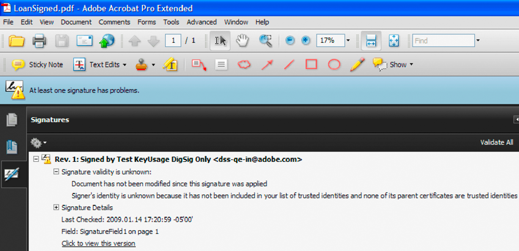

# Digitales Signieren und Zertifizieren von Dokumenten {#digitally-signing-and-certifying-documents}

**Beispiele und Beispiele in diesem Dokument gelten nur für die Umgebung AEM Forms on JEE.**

**Info zum Signature-Dienst**

Der Signature-Dienst ermöglicht Ihrem Unternehmen den Schutz der Sicherheit und Privatsphäre von Adobe PDF-Dokumenten, die es verteilt und empfängt. Dieser Dienst verwendet digitale Signaturen und Zertifizierung, um sicherzustellen, dass nur vorgesehene Empfänger Dokumente ändern können. Da Sicherheitsfunktionen auf das Dokument selbst angewendet werden, bleibt das Dokument während seines gesamten Lebenszyklus sicher und kontrolliert. Ein Dokument bleibt über die Firewall hinaus geschützt, wenn es offline heruntergeladen und an Ihr Unternehmen zurückgesendet wird.

>[!NOTE]
>
>Sie können einen benutzerdefinierten Unterschriften-Handler für den Signature-Dienst erstellen, der aufgerufen wird, wenn bestimmte Vorgänge aufgerufen werden, z. B. das Signieren eines PDF-Dokuments.

**Namen von Unterschriftsfeldern**

Bei einigen Signature-Dienstvorgängen müssen Sie den Namen des Signaturfelds angeben, für das ein Vorgang ausgeführt wird. Wenn Sie beispielsweise ein PDF-Dokument signieren, geben Sie den Namen des Signaturfelds an, das signiert werden soll. Angenommen, der vollständige Name eines Signaturfelds ist `form1[0].Form1[0].SignatureField1[0]`. Sie können `SignatureField1[0]` anstelle von `form1[0].Form1[0].SignatureField1[0]` angeben.

Manchmal führt ein Konflikt dazu, dass der Signature-Dienst das falsche Feld signiert (oder einen anderen Vorgang ausführt, für den der Signaturfeldname erforderlich ist). Dieser Konflikt resultiert aus dem Namen `SignatureField1[0]`, der an zwei oder mehr Stellen im gleichen PDF-Dokument angezeigt wird. Angenommen, ein PDF-Dokument enthält zwei Unterschriftsfelder mit den Namen `form1[0].Form1[0].SignatureField1[0]` und `form1[0].Form1[0].SubForm1[0].SignatureField1[0]` und geben Sie `SignatureField1[0]` an. In diesem Fall signiert der Signature-Dienst das erste Signaturfeld, das er findet, während er alle Signaturfelder im Dokument durchläuft.

Wenn sich in einem PDF-Dokument mehrere Unterschriftsfelder befinden, sollten Sie die vollständigen Namen der Unterschriftsfelder angeben. Geben Sie also `form1[0].Form1[0].SignatureField1[0]`anstelle von `SignatureField1[0]` an.

Sie können diese Aufgaben mithilfe des Signature-Dienstes ausführen:

* hinzufügen und löschen Sie digitale Unterschriftsfelder in einem PDF-Dokument. (Siehe [Unterschriftsfelder hinzufügen](digitally-signing-certifying-documents.md#adding-signature-fields).)
* Rufen Sie die Namen der Signaturfelder in einem PDF-Dokument ab. (Siehe [Signaturfeldnamen abrufen](digitally-signing-certifying-documents.md#retrieving-signature-field-names).)
* Signaturfelder ändern (Siehe [Unterschriftsfelder ändern](digitally-signing-certifying-documents.md#modifying-signature-fields).)
* PDF-Dokumente digital signieren (Siehe [Digitales Signieren von PDF-Dokumenten](digitally-signing-certifying-documents.md#digitally-signing-pdf-documents).)
* PDF-Dokumente zertifizieren. (Siehe [PDF-Dokumente zertifizieren](digitally-signing-certifying-documents.md#certifying-pdf-documents).)
* Digitale Signaturen in einem PDF-Dokument überprüfen (Siehe [Digitale Signaturen überprüfen](digitally-signing-certifying-documents.md#verifying-digital-signatures).)
* Validieren Sie alle digitalen Signaturen in einem PDF-Dokument. (Siehe [Mehrere digitale Signaturen überprüfen](digitally-signing-certifying-documents.md#verifying-digital-signatures).)
* Entfernen Sie eine digitale Signatur aus einem Signaturfeld. (Siehe [Digitale Signaturen entfernen](digitally-signing-certifying-documents.md#removing-digital-signatures).)

>[!NOTE]
>
>Weitere Informationen zum Signature-Dienst finden Sie unter [Dienste-Referenz für AEM Forms](https://www.adobe.com/go/learn_aemforms_services_63).

## Signaturfelder hinzufügen {#adding-signature-fields}

Digitale Signaturen werden in Signaturfeldern angezeigt, die eine grafische Darstellung der Signatur enthaltende Formularfelder sind. Signaturfelder können sichtbar oder unsichtbar sein. Unterzeichner können ein bereits vorhandenes Unterschriftsfeld verwenden oder ein Unterschriftsfeld programmgesteuert hinzugefügt werden. In beiden Fällen muss das Signaturfeld vorhanden sein, bevor ein PDF-Dokument signiert werden kann.

Sie können ein Signaturfeld programmgesteuert hinzufügen, indem Sie die Signature-Dienst-Java-API oder die Signature-Webdienst-API verwenden. Sie können einem PDF-Dokument mehrere Unterschriftsfelder hinzufügen. Jeder Signaturfeldname muss jedoch eindeutig sein.

>[!NOTE]
>
>Bei einigen PDF-Dokument-Typen können Sie kein Unterschriftsfeld programmatisch hinzufügen. Weitere Informationen zum Signature-Dienst und zum Hinzufügen von Signaturfeldern finden Sie unter [Dienste-Referenz für AEM Forms](https://www.adobe.com/go/learn_aemforms_services_63).

### Zusammenfassung der Schritte {#summary-of-steps}

So fügen Sie einem PDF-Dokument ein Unterschriftsfeld hinzu:

1. Schließen Sie Projektdateien ein.
1. Erstellen Sie einen Signaturclient.
1. Rufen Sie ein PDF-Dokument ab, dem ein Unterschriftsfeld hinzugefügt wird.
1. hinzufügen ein Unterschriftsfeld.
1. Speichern Sie das PDF-Dokument als PDF-Datei.

**Projektdateien einschließen**

Schließen Sie die erforderlichen Dateien in Ihr Entwicklungsprojekt ein. Wenn Sie eine Clientanwendung mit Java erstellen, schließen Sie die erforderlichen JAR-Dateien ein. Wenn Sie Webdienste verwenden, stellen Sie sicher, dass Sie die Proxydateien einschließen.

Die folgenden JAR-Dateien müssen dem Klassenpfad Ihres Projekts hinzugefügt werden:

* adobe-livecycle-client.jar
* adobe-usermanager-client.jar
* adobe-signatures-client.jar
* adobe-utilities.jar (erforderlich, wenn AEM Forms unter JBoss bereitgestellt wird)
* jbossall-client.jar (erforderlich, wenn AEM Forms unter JBoss bereitgestellt wird)

**Signaturclient erstellen**

Bevor Sie einen Signature-Dienstvorgang programmgesteuert durchführen können, müssen Sie einen Signature-Dienstclient erstellen.

**PDF-Dokument abrufen, dem ein Unterschriftsfeld hinzugefügt wird**

Sie müssen ein PDF-Dokument abrufen, dem ein Unterschriftsfeld hinzugefügt wird.

**Signaturfeld Hinzufügen**

Um einem PDF-Dokument erfolgreich ein Unterschriftsfeld hinzuzufügen, geben Sie Koordinatenwerte an, die die Position des Unterschriftsfelds angeben. (Wenn Sie ein unsichtbares Unterschriftsfeld hinzufügen, sind diese Werte nicht erforderlich.) Sie können auch angeben, welche Felder im PDF-Dokument gesperrt werden, nachdem eine Unterschrift auf das Unterschriftsfeld angewendet wurde.

**PDF-Dokument als PDF-Datei speichern**

Nachdem der Signature-Dienst dem PDF-Dokument ein Signaturfeld hinzugefügt hat, können Sie das Dokument als PDF-Datei speichern, damit die Benutzer es in Acrobat oder Adobe Reader öffnen können.

**Siehe auch**

[Einbeziehung von AEM Forms Java-Bibliotheksdateien](/help/forms/developing/invoking-aem-forms-using-java.md#including-aem-forms-java-library-files)

[Verbindungseigenschaften festlegen](/help/forms/developing/invoking-aem-forms-using-java.md#setting-connection-properties)

[PDF-Dokumente digital signieren](digitally-signing-certifying-documents.md#digitally-signing-pdf-documents)

### hinzufügen Signaturfelder mit der Java-API {#add-signature-fields-using-the-java-api}

hinzufügen eines Signaturfelds mithilfe der Signature-API (Java):

1. Projektdateien einschließen

   Schließen Sie Client-JAR-Dateien wie &quot;adobe-signatures-client.jar&quot;im Klassenpfad Ihres Java-Projekts ein.

1. Signaturclient erstellen

   * Erstellen Sie ein `ServiceClientFactory`-&quot; -Objekt, das Verbindungseigenschaften enthält.
   * Erstellen Sie ein `SignatureServiceClient`-Objekt, indem Sie seinen Konstruktor verwenden und das `ServiceClientFactory`-Objekt übergeben.

1. PDF-Dokument abrufen, dem ein Unterschriftsfeld hinzugefügt wird

   * Erstellen Sie ein `java.io.FileInputStream`-Objekt, das das PDF-Dokument darstellt, dem ein Unterschriftsfeld hinzugefügt wird, indem Sie den Konstruktor verwenden und einen Zeichenfolgenwert übergeben, der den Speicherort des PDF-Dokuments angibt.
   * Erstellen Sie ein `com.adobe.idp.Document`-Objekt, indem Sie seinen Konstruktor verwenden und das `java.io.FileInputStream`-Objekt übergeben.

1. Signaturfeld Hinzufügen

   * Erstellen Sie ein `PositionRectangle`-Objekt, das den Speicherort des Unterschriftsfelds mithilfe des Konstruktors angibt. Geben Sie im Konstruktor Koordinatenwerte an.
   * Erstellen Sie bei Bedarf ein `FieldMDPOptions`-Objekt, das die Felder angibt, die gesperrt werden, wenn eine digitale Unterschrift auf das Unterschriftsfeld angewendet wird.
   * hinzufügen Sie ein Unterschriftsfeld an ein PDF-Dokument, indem Sie die `addSignatureField`-Methode des `SignatureServiceClient`-Objekts aufrufen und die folgenden Werte übergeben:

      * A `com.adobe.idp`. `Document` -Objekt, das das PDF-Dokument darstellt, dem ein Unterschriftsfeld hinzugefügt wird.
      * Ein Zeichenfolgenwert, der den Namen des Signaturfelds angibt.
      * Ein `java.lang.Integer`-Wert, der die Seitenzahl darstellt, der ein Signaturfeld hinzugefügt wird.
      * Ein `PositionRectangle`-Objekt, das die Position des Signaturfelds angibt.
      * Ein `FieldMDPOptions`-Objekt, das Felder im PDF-Dokument angibt, die nach dem Anwenden einer digitalen Unterschrift auf das Unterschriftsfeld gesperrt werden. Dieser Parameterwert ist optional und Sie können `null` übergeben.
   * Ein `PDFSeedValueOptions`-Objekt, das verschiedene Laufzeitwerte angibt. Dieser Parameterwert ist optional und Sie können `null` übergeben.

      Die `addSignatureField`-Methode gibt ein `com.adobe.idp` zurück. `Document` Objekt, das ein PDF-Dokument mit einem Unterschriftsfeld darstellt.
   >[!NOTE]
   >
   >Sie können die `SignatureServiceClient`-Methode des Objekts aufrufen, um ein unsichtbares Unterschriftsfeld hinzuzufügen.`addInvisibleSignatureField`

1. PDF-Dokument als PDF-Datei speichern

   * Erstellen Sie ein `java.io.File`-Objekt und stellen Sie sicher, dass die Dateierweiterung .pdf ist.
   * Rufen Sie `com.adobe.idp` auf. `Document` - `copyToFile` Methode verwendet, um den Inhalt des  `Document` Objekts in die Datei zu kopieren. Stellen Sie sicher, dass Sie `com.adobe.idp` verwenden. `Document` -Objekt, das von der  `addSignatureField` Methode zurückgegeben wurde.

**Siehe auch**

[Beginn zur Signature Service API](/help/forms/developing/signature-service-java-api-quick.md#signature-service-java-api-quick-start-soap)

### hinzufügen Signaturfelder mit der Webdienst-API {#add-signature-fields-using-the-web-service-api}

So fügen Sie mithilfe der Signature-API (Webdienst) ein Signaturfeld hinzu:

1. Projektdateien einschließen

   Erstellen Sie ein Microsoft .NET-Projekt, das MTOM verwendet. Stellen Sie sicher, dass Sie die folgende WSDL-Definition verwenden: `http://localhost:8080/soap/services/SignatureService?WSDL&lc_version=9.0.1`.

   >[!NOTE]
   >
   >Ersetzen Sie `localhost` durch die IP-Adresse des Servers, auf dem AEM Forms gehostet wird.

1. Signaturclient erstellen

   * Erstellen Sie ein `SignatureServiceClient`-Objekt mit dem Standardkonstruktor.
   * Erstellen Sie ein `SignatureServiceClient.Endpoint.Address`-Objekt mit dem Konstruktor `System.ServiceModel.EndpointAddress`. Übergeben Sie einen Zeichenfolgenwert, der den WSDL-Wert an den AEM Forms-Dienst angibt (z. B. `http://localhost:8080/soap/services/SignatureService?WSDL`). Sie müssen das Attribut `lc_version` nicht verwenden. Dieses Attribut wird verwendet, wenn Sie eine Dienstreferenz erstellen.)
   * Erstellen Sie ein `System.ServiceModel.BasicHttpBinding`-Objekt, indem Sie den Wert des Felds `SignatureServiceClient.Endpoint.Binding` abrufen. Wandeln Sie den Rückgabewert in `BasicHttpBinding` um.
   * Setzen Sie das Feld `System.ServiceModel.BasicHttpBinding` des Objekts auf `MessageEncoding`. `WSMessageEncoding.Mtom` Dieser Wert stellt sicher, dass MTOM verwendet wird.
   * Aktivieren Sie die einfache HTTP-Authentifizierung, indem Sie die folgenden Aufgaben ausführen:

      * Weisen Sie dem Feld `SignatureServiceClient.ClientCredentials.UserName.UserName` den AEM Forms-Benutzernamen zu.
      * Weisen Sie dem Feld `SignatureServiceClient.ClientCredentials.UserName.Password` den entsprechenden Kennwortwert zu.
      * Weisen Sie dem Feld `BasicHttpBindingSecurity.Transport.ClientCredentialType` den Konstantenwert `HttpClientCredentialType.Basic` zu.
      * Weisen Sie dem Feld `BasicHttpBindingSecurity.Security.Mode` den Konstantenwert `BasicHttpSecurityMode.TransportCredentialOnly` zu.

1. PDF-Dokument abrufen, dem ein Unterschriftsfeld hinzugefügt wird

   * Erstellen Sie ein Objekt `BLOB`, indem Sie den Konstruktor verwenden. Das `BLOB`-Objekt wird zum Speichern des PDF-Dokuments verwendet, das ein Unterschriftsfeld enthalten soll.
   * Erstellen Sie ein `System.IO.FileStream`-Objekt, indem Sie den Konstruktor aufrufen und einen Zeichenfolgenwert übergeben, der den Dateispeicherort des PDF-Dokuments und den Dateimodus darstellt, in dem die Datei geöffnet werden soll.
   * Erstellen Sie ein Bytearray, das den Inhalt des Objekts `System.IO.FileStream` speichert. Sie können die Größe des Byte-Arrays bestimmen, indem Sie die `System.IO.FileStream`-Eigenschaft des Objekts `Length` abrufen.
   * Füllen Sie das Bytearray mit Stream-Daten, indem Sie die `Read`-Methode des Objekts aufrufen und das Bytearray, die Startposition und die zu lesende Stream-Länge übergeben.`System.IO.FileStream`
   * Füllen Sie das `BLOB`-Objekt, indem Sie seine `MTOM`-Eigenschaft mit dem Inhalt des Byte-Arrays zuweisen.

1. Signaturfeld Hinzufügen

   hinzufügen Sie ein Unterschriftsfeld an das PDF-Dokument, indem Sie die `addSignatureField`-Methode des `SignatureServiceClient`-Objekts aufrufen und die folgenden Werte übergeben:

   * Ein `BLOB`-Objekt, das das PDF-Dokument darstellt, dem ein Unterschriftsfeld hinzugefügt wird.
   * Ein Zeichenfolgenwert, der den Signaturfeldnamen angibt.
   * Ein ganzzahliger Wert, der die Seitenzahl darstellt, der ein Unterschriftsfeld hinzugefügt wird.
   * Ein `PositionRect`-Objekt, das die Position des Signaturfelds angibt.
   * Ein `FieldMDPOptions`-Objekt, das Felder im PDF-Dokument angibt, die nach dem Anwenden einer digitalen Unterschrift auf das Unterschriftsfeld gesperrt werden. Dieser Parameterwert ist optional und Sie können `null` übergeben.
   * Ein `PDFSeedValueOptions`-Objekt, das verschiedene Laufzeitwerte angibt. Dieser Parameterwert ist optional und Sie können `null` übergeben.

   Die `addSignatureField`-Methode gibt ein `BLOB`-Objekt zurück, das ein PDF-Dokument mit einem Unterschriftsfeld darstellt.

1. PDF-Dokument als PDF-Datei speichern

   * Erstellen Sie ein `System.IO.FileStream`-Objekt, indem Sie den Konstruktor aufrufen und einen Zeichenfolgenwert übergeben, der den Dateispeicherort des PDF-Dokuments darstellt, das das Signaturfeld enthalten soll, sowie den Dateimodus, in dem die Datei geöffnet werden soll.
   * Erstellen Sie ein Bytearray, das den Inhalt des `BLOB`-Objekts speichert, das von der `addSignatureField`-Methode zurückgegeben wurde. Füllen Sie das Bytearray, indem Sie den Wert des `BLOB`-Datenelements des Objekts `binaryData` abrufen.
   * Erstellen Sie ein `System.IO.BinaryWriter`-Objekt, indem Sie den Konstruktor aufrufen und das `System.IO.FileStream`-Objekt übergeben.
   * Schreiben Sie den Inhalt des Byte-Arrays in eine PDF-Datei, indem Sie die `Write`-Methode des Objekts aufrufen und das Bytearray übergeben.`System.IO.BinaryWriter`

**Siehe auch**

[Aufrufen von AEM Forms mit MTOM](/help/forms/developing/invoking-aem-forms-using-web.md#invoking-aem-forms-using-mtom)

[Aufrufen von AEM Forms mit SwaRef](/help/forms/developing/invoking-aem-forms-using-web.md#invoking-aem-forms-using-swaref)

## Signaturfeldnamen {#retrieving-signature-field-names} abrufen

Sie können die Namen aller Signaturfelder abrufen, die sich in einem zu signierenden und zertifizierenden PDF-Dokument befinden. Wenn Sie nicht sicher sind, wie die Signaturfeldnamen in einem PDF-Dokument lauten oder die Namen prüfen möchten, können Sie diese programmgesteuert abrufen. Der Signature-Dienst gibt den vollständig qualifizierten Namen des Signaturfelds zurück, z. B. `form1[0].grantApplication[0].page1[0].SignatureField1[0]`.

>[!NOTE]
>
>Weitere Informationen zum Signature-Dienst finden Sie unter [Dienste-Referenz für AEM Forms](https://www.adobe.com/go/learn_aemforms_services_63)

### Zusammenfassung der Schritte {#summary_of_steps-1}

So rufen Sie Signaturfeldnamen ab:

1. Schließen Sie Projektdateien ein.
1. Erstellen Sie einen Signaturclient.
1. Rufen Sie das PDF-Dokument mit Unterschriftsfeldern ab.
1. Rufen Sie die Signaturfeldnamen ab.

**Projektdateien einschließen**

Schließen Sie die erforderlichen Dateien in Ihr Entwicklungsprojekt ein. Wenn Sie eine Clientanwendung mit Java erstellen, schließen Sie die erforderlichen JAR-Dateien ein. Wenn Sie Webdienste verwenden, stellen Sie sicher, dass Sie die Proxydateien einschließen.

Die folgenden JAR-Dateien müssen dem Klassenpfad Ihres Projekts hinzugefügt werden:

* adobe-livecycle-client.jar
* adobe-usermanager-client.jar
* adobe-signatures-client.jar
* adobe-utilities.jar (erforderlich, wenn AEM Forms unter JBoss bereitgestellt wird)
* jbossall-client.jar (erforderlich, wenn AEM Forms unter JBoss bereitgestellt wird)

Informationen zum Speicherort dieser JAR-Dateien finden Sie unter [Einschließen von AEM Forms Java-Bibliotheksdateien](/help/forms/developing/invoking-aem-forms-using-java.md#including-aem-forms-java-library-files).

**Signaturclient erstellen**

Bevor Sie einen Signature-Dienstvorgang programmgesteuert durchführen können, müssen Sie einen Signature-Dienstclient erstellen.

**PDF-Dokument mit Unterschriftsfeldern abrufen**

Rufen Sie ein PDF-Dokument mit Unterschriftsfeldern ab.

**Signaturfeldnamen abrufen**

Sie können Signaturfeldnamen abrufen, nachdem Sie ein PDF-Dokument abgerufen haben, das ein oder mehrere Unterschriftsfelder enthält.

**Siehe auch**

[Signaturfeldnamen mit der Java-API abrufen](digitally-signing-certifying-documents.md#retrieve-signature-field-names-using-the-java-api)

[Signaturfeld mit der Webdienst-API abrufen](digitally-signing-certifying-documents.md#retrieve-signature-field-using-the-web-service-api)

[Einbeziehung von AEM Forms Java-Bibliotheksdateien](/help/forms/developing/invoking-aem-forms-using-java.md#including-aem-forms-java-library-files)

[Verbindungseigenschaften festlegen](/help/forms/developing/invoking-aem-forms-using-java.md#setting-connection-properties)

[Signaturfelder hinzufügen](digitally-signing-certifying-documents.md#adding-signature-fields)

### Signaturfeldnamen mit der Java-API abrufen {#retrieve-signature-field-names-using-the-java-api}

Signaturfeldnamen mithilfe der Signature-API (Java) abrufen:

1. Projektdateien einschließen

   Schließen Sie Client-JAR-Dateien, wie z. B. &quot;adobe-signatures-client.jar&quot;im Klassenpfad Ihres Java-Projekts ein.

1. Signaturclient erstellen

   * Erstellen Sie ein `ServiceClientFactory`-&quot; -Objekt, das Verbindungseigenschaften enthält.
   * Erstellen Sie ein `SignatureServiceClient`-Objekt, indem Sie seinen Konstruktor verwenden und das `ServiceClientFactory`-Objekt übergeben.

1. PDF-Dokument mit Unterschriftsfeldern abrufen

   * Erstellen Sie ein `java.io.FileInputStream`-Objekt, das das PDF-Dokument darstellt, das Unterschriftsfelder enthält, indem Sie den Konstruktor verwenden und einen Zeichenfolgenwert übergeben, der den Speicherort des PDF-Dokuments angibt.
   * Erstellen Sie ein `com.adobe.idp.Document`-Objekt, indem Sie seinen Konstruktor verwenden und das `java.io.FileInputStream`-Objekt übergeben.

1. Signaturfeldnamen abrufen

   * Rufen Sie die Signaturfeldnamen ab, indem Sie die `SignatureServiceClient`-Objektmethode `getSignatureFieldList` aufrufen und das `com.adobe.idp.Document`-Objekt übergeben, das das PDF-Dokument mit Signaturfeldern enthält. Diese Methode gibt ein `java.util.List`-Objekt zurück, in dem jedes Element ein `PDFSignatureField`-Objekt enthält. Mit diesem Objekt können Sie zusätzliche Informationen zu einem Unterschriftsfeld abrufen, z. B. ob es sichtbar ist.
   * Durchlaufen Sie das `java.util.List`-Objekt, um festzustellen, ob Signaturfeldnamen vorhanden sind. Für jedes Unterschriftsfeld im PDF-Dokument können Sie ein separates `PDFSignatureField`-Objekt abrufen. Um den Namen des Signaturfelds abzurufen, rufen Sie die `PDFSignatureField`-Methode des Objekts `getName` auf. Diese Methode gibt einen Zeichenfolgenwert zurück, der den Signaturfeldnamen angibt.

**Siehe auch**

[Signaturfeldnamen abrufen](digitally-signing-certifying-documents.md#retrieving-signature-field-names)

[Quick Beginn (SOAP-Modus): Abrufen von Signaturfeldnamen mit der Java-API](/help/forms/developing/signature-service-java-api-quick.md#quick-start-soap-mode-retrieving-signature-field-names-using-the-java-api)

[Einbeziehung von AEM Forms Java-Bibliotheksdateien](/help/forms/developing/invoking-aem-forms-using-java.md#including-aem-forms-java-library-files)

[Verbindungseigenschaften festlegen](/help/forms/developing/invoking-aem-forms-using-java.md#setting-connection-properties)

### Signaturfeld mit der Webdienst-API abrufen {#retrieve-signature-field-using-the-web-service-api}

Signaturfeldnamen mit der Signature-API abrufen (Webdienst):

1. Projektdateien einschließen

   Erstellen Sie ein Microsoft .NET-Projekt, das MTOM verwendet. Stellen Sie sicher, dass Sie die folgende WSDL-Definition verwenden: `http://localhost:8080/soap/services/SignatureService?WSDL&lc_version=9.0.1`.

   >[!NOTE]
   >
   >Ersetzen Sie `localhost` durch die IP-Adresse des Servers, auf dem AEM Forms gehostet wird.

1. Signaturclient erstellen

   * Erstellen Sie ein `SignatureServiceClient`-Objekt mit dem Standardkonstruktor.
   * Erstellen Sie ein `SignatureServiceClient.Endpoint.Address`-Objekt mit dem Konstruktor `System.ServiceModel.EndpointAddress`. Übergeben Sie einen Zeichenfolgenwert, der den WSDL-Wert an den AEM Forms-Dienst angibt (z. B. `http://localhost:8080/soap/services/SignatureService?WSDL`). Sie müssen das Attribut `lc_version` nicht verwenden. Dieses Attribut wird verwendet, wenn Sie eine Dienstreferenz erstellen.)
   * Erstellen Sie ein `System.ServiceModel.BasicHttpBinding`-Objekt, indem Sie den Wert des Felds `SignatureServiceClient.Endpoint.Binding` abrufen. Wandeln Sie den Rückgabewert in `BasicHttpBinding` um.
   * Setzen Sie das Feld `System.ServiceModel.BasicHttpBinding` des Objekts auf `MessageEncoding`. `WSMessageEncoding.Mtom` Dieser Wert stellt sicher, dass MTOM verwendet wird.
   * Aktivieren Sie die einfache HTTP-Authentifizierung, indem Sie die folgenden Aufgaben ausführen:

      * Weisen Sie dem Feld `SignatureServiceClient.ClientCredentials.UserName.UserName` den AEM Forms-Benutzernamen zu.
      * Weisen Sie dem Feld `SignatureServiceClient.ClientCredentials.UserName.Password` den entsprechenden Kennwortwert zu.
      * Weisen Sie dem Feld `BasicHttpBindingSecurity.Transport.ClientCredentialType` den Konstantenwert `HttpClientCredentialType.Basic` zu.
      * Weisen Sie dem Feld `BasicHttpBindingSecurity.Security.Mode` den Konstantenwert `BasicHttpSecurityMode.TransportCredentialOnly` zu.

1. PDF-Dokument mit Unterschriftsfeldern abrufen

   * Erstellen Sie ein Objekt `BLOB`, indem Sie den Konstruktor verwenden. Das `BLOB`-Objekt wird zum Speichern des PDF-Dokuments verwendet, das Unterschriftsfelder enthält.
   * Erstellen Sie ein `System.IO.FileStream`-Objekt, indem Sie den Konstruktor aufrufen und einen Zeichenfolgenwert übergeben, der den Dateispeicherort des PDF-Dokuments und den Dateimodus darstellt, in dem die Datei geöffnet werden soll.
   * Erstellen Sie ein Bytearray, das den Inhalt des Objekts `System.IO.FileStream` speichert. Sie können die Größe des Byte-Arrays bestimmen, indem Sie die `System.IO.FileStream`-Eigenschaft des Objekts `Length` abrufen.
   * Füllen Sie das Bytearray mit Stream-Daten, indem Sie die `Read`-Methode des Objekts aufrufen und das Bytearray, die Startposition und die zu lesende Stream-Länge übergeben.`System.IO.FileStream`
   * Füllen Sie das `BLOB`-Objekt, indem Sie dessen `MTOM`-Feld den Inhalt des Byte-Arrays zuweisen.

1. Signaturfeldnamen abrufen

   * Rufen Sie die Signaturfeldnamen ab, indem Sie die `SignatureServiceClient`-Objektmethode `getSignatureFieldList` aufrufen und das `BLOB`-Objekt übergeben, das das PDF-Dokument mit Signaturfeldern enthält. Diese Methode gibt ein Collection-Objekt `MyArrayOfPDFSignatureField` zurück, bei dem jedes Element ein `PDFSignatureField`-Objekt enthält.
   * Durchlaufen Sie das `MyArrayOfPDFSignatureField`-Objekt, um festzustellen, ob Signaturfeldnamen vorhanden sind. Für jedes Unterschriftsfeld im PDF-Dokument können Sie ein `PDFSignatureField`-Objekt abrufen. Um den Namen des Signaturfelds abzurufen, rufen Sie die `PDFSignatureField`-Methode des Objekts `getName` auf. Diese Methode gibt einen Zeichenfolgenwert zurück, der den Signaturfeldnamen angibt.

**Siehe auch**

[Signaturfeldnamen abrufen](digitally-signing-certifying-documents.md#retrieving-signature-field-names)

[Aufrufen von AEM Forms mit MTOM](/help/forms/developing/invoking-aem-forms-using-web.md#invoking-aem-forms-using-mtom)

[Aufrufen von AEM Forms mit SwaRef](/help/forms/developing/invoking-aem-forms-using-web.md#invoking-aem-forms-using-swaref)

## Signaturfelder ändern {#modifying-signature-fields}

Sie können Signaturfelder in einem PDF-Dokument mithilfe der Java-API und der Webdienst-API ändern. Das Ändern eines Signaturfelds umfasst das Manipulieren seiner Signaturfeldsperre- oder Seed-Wert-Lexikonwerte.

Ein *field lock dictionary* gibt eine Liste von Feldern an, die beim Unterschreiben des Unterschriftsfelds gesperrt werden. Ein gesperrtes Feld verhindert, dass Benutzer Änderungen an dem Feld vornehmen. Ein *Seed-Wert-Wörterbuch* enthält Einschränkungsinformationen, die zum Zeitpunkt der Anwendung der Signatur verwendet werden. Beispiel: Sie können die Berechtigungen ändern, die Aktionen steuern, die auftreten können, ohne dass eine Signatur ungültig wird.

Durch Ändern eines vorhandenen Unterschriftsfelds können Sie Änderungen am PDF-Dokument vornehmen, um den sich ändernden Geschäftsanforderungen Rechnung zu tragen. Eine neue Geschäftsanforderung kann beispielsweise die Sperrung aller Dokument-Felder nach der Unterzeichnung des Dokuments erfordern.

In diesem Abschnitt wird beschrieben, wie Sie ein Unterschriftsfeld ändern, indem Sie sowohl die Wörterbuchwerte für Feldsperre als auch die Wörterbuchwerte für Seed-Werte ändern. Änderungen am Unterschriftsfeld-Sperrwörterbuch führen dazu, dass alle Felder im PDF-Dokument gesperrt werden, wenn ein Unterschriftsfeld unterschrieben wird. Änderungen am Wörterbuch für Seed-Werte verbieten bestimmte Änderungen am Dokument.

>[!NOTE]
>
>Weitere Informationen zum Signature-Dienst und zum Ändern von Signaturfeldern finden Sie unter [Dienste-Referenz für AEM Forms](https://www.adobe.com/go/learn_aemforms_services_63).

### Zusammenfassung der Schritte {#summary_of_steps-2}

So ändern Sie Signaturfelder in einem PDF-Dokument:

1. Schließen Sie Projektdateien ein.
1. Erstellen Sie einen Signaturclient.
1. Rufen Sie das PDF-Dokument ab, das das zu ändernde Unterschriftsfeld enthält.
1. Legen Sie Wörterbuchwerte fest.
1. Ändern Sie das Unterschriftsfeld.
1. Speichern Sie das PDF-Dokument als PDF-Datei.

**Projektdateien einschließen**

Schließen Sie die erforderlichen Dateien in Ihr Entwicklungsprojekt ein. Wenn Sie eine Clientanwendung mit Java erstellen, schließen Sie die erforderlichen JAR-Dateien ein. Wenn Sie Webdienste verwenden, stellen Sie sicher, dass Sie die Proxydateien einschließen.

Die folgenden JAR-Dateien müssen dem Klassenpfad Ihres Projekts hinzugefügt werden:

* adobe-livecycle-client.jar
* adobe-usermanager-client.jar
* adobe-signatures-client.jar
* adobe-utilities.jar (erforderlich, wenn AEM Forms unter JBoss bereitgestellt wird)
* jbossall-client.jar (erforderlich, wenn AEM Forms unter JBoss bereitgestellt wird)

Informationen zum Speicherort dieser JAR-Dateien finden Sie unter [Einschließen von LiveCycle Java-Bibliotheksdateien](/help/forms/developing/invoking-aem-forms-using-java.md#including-aem-forms-java-library-files).

**Signaturclient erstellen**

Bevor Sie einen Signature-Dienstvorgang programmgesteuert durchführen können, müssen Sie einen Signature-Dienstclient erstellen.

**PDF-Dokument abrufen, das das zu ändernde Unterschriftsfeld enthält**

Rufen Sie ein PDF-Dokument ab, das das zu ändernde Unterschriftsfeld enthält.

**Festlegen von Wörterbuchwerten**

Um ein Unterschriftsfeld zu ändern, weisen Sie seinem Feldsperrwörterbuch oder Seed-Wert-Wörterbuch Werte zu. Die Angabe von Wörterbuchwerten für die Sperrung von Unterschriftsfeldern umfasst die Angabe von PDF-Dokument-Feldern, die beim Unterschreiben des Unterschriftsfelds gesperrt werden. (In diesem Abschnitt wird beschrieben, wie Sie alle Felder sperren.)

Folgende Wörterbuchwerte für Seed-Werte können festgelegt werden:

* **Überarbeitungsprüfung**: Gibt an, ob eine Sperrüberprüfung durchgeführt wird, wenn eine Unterschrift auf das Unterschriftsfeld angewendet wird.
* **Zertifikatoptionen**: Weist dem Wörterbuch mit dem Seed-Wert des Zertifikats Werte zu. Bevor Sie Zertifikatoptionen festlegen, sollten Sie sich mit einem Wörterbuch mit dem Seed-Wert des Zertifikats vertraut machen. (Siehe [PDF-Referenz](https://www.adobe.com/devnet/acrobat/pdfs/pdf_reference_1-7.pdf).)
* **Digest-Optionen**: Weist Digest-Algorithmen zu, die zum Signieren verwendet werden. Gültige Werte sind SHA1, SHA256, SHA384, SHA512 und RIPEMD160.
* **Filter**: Gibt den Filter an, der mit dem Unterschriftsfeld verwendet wird. Sie können beispielsweise den Filter Adobe.PPKLite verwenden. (Siehe [PDF-Referenz](https://www.adobe.com/devnet/acrobat/pdfs/pdf_reference_1-7.pdf).)
* **Flag-Optionen**: Gibt die mit diesem Unterschriftsfeld verknüpften Flag-Werte an. Der Wert 1 bedeutet, dass ein Unterzeichner nur die angegebenen Werte für den Eintrag verwenden muss. Der Wert 0 bedeutet, dass andere Werte zulässig sind. Die Bit-Positionen lauten wie folgt:

   * **1(Filter):** Der Unterschriften-Handler zum Unterschreiben des Unterschriftsfelds
   * **2 (SubFilter):** Ein Array von Namen, die für die Signierung zu verwendende Kodierungen angeben
   * **3 (V)**: Die erforderliche MindestVersionsnummer des Unterschriften-Handlers, der zum Unterschriftsfeld verwendet wird
   * **4 (Gründe):** Ein Zeichenfolgen-Array, das mögliche Gründe für das Unterschreiben eines Dokuments angibt
   * **5 (PDFLegalWarnings):** Ein Array von Zeichenfolgen, die mögliche rechtliche Aussagen angeben

* **Rechtliche Bescheinigungen**: Wenn ein Dokument zertifiziert ist, wird es automatisch auf bestimmte Inhaltstypen überprüft, die den sichtbaren Inhalt eines Dokuments mehrdeutig oder irreführend machen können. Eine Anmerkung kann beispielsweise Text verdecken, der wichtig ist, um zu verstehen, was zertifiziert wird. Der Scanvorgang generiert Warnungen, die auf das Vorhandensein dieses Inhaltstyps hinweisen. Er enthält außerdem eine zusätzliche Erläuterung des Inhalts, der möglicherweise Warnungen generiert hat.
* **Berechtigungen**: Gibt Berechtigungen an, die für ein PDF-Dokument verwendet werden können, ohne dass die Unterschrift ungültig wird.
* **Gründe**: Gibt Gründe an, aus denen dieses Dokument unterzeichnet werden muss.
* **Zeitstempel**: Gibt Zeitstempeloptionen an. Sie können beispielsweise die URL des verwendeten Zeitstempelservers festlegen.
* **Version**: Gibt die Mindestversionsnummer des Unterschriften-Handlers an, der zum Unterschreiben des Unterschriftsfelds verwendet werden soll.

**Signaturfeld ändern**

Nachdem Sie einen Signature-Dienst-Client erstellt haben, das PDF-Dokument abrufen, das das zu ändernde Signaturfeld enthält, und die Wörterbuchwerte festlegen, können Sie den Signature-Dienst anweisen, das Signaturfeld zu ändern. Der Signature-Dienst gibt dann ein PDF-Dokument zurück, das das geänderte Signaturfeld enthält. Das Original-PDF-Dokument ist davon nicht betroffen.

**PDF-Dokument als PDF-Datei speichern**

Speichern Sie das PDF-Dokument, das das geänderte Unterschriftsfeld enthält, als PDF-Datei, damit die Benutzer es in Acrobat oder Adobe Reader öffnen können.

**Siehe auch**

[Einbeziehung von AEM Forms Java-Bibliotheksdateien](/help/forms/developing/invoking-aem-forms-using-java.md#including-aem-forms-java-library-files)

[Verbindungseigenschaften festlegen](/help/forms/developing/invoking-aem-forms-using-java.md#setting-connection-properties)

[Beginn zur Signature Service API](/help/forms/developing/signature-service-java-api-quick.md#signature-service-java-api-quick-start-soap)

[PDF-Dokumente digital signieren](digitally-signing-certifying-documents.md#digitally-signing-pdf-documents)

### Signaturfelder mit der Java-API {#modify-signature-fields-using-the-java-api} ändern

Signaturfelder mithilfe der Signature-API (Java) ändern:

1. Projektdateien einschließen

   Schließen Sie Client-JAR-Dateien, wie z. B. &quot;adobe-signatures-client.jar&quot;, in den Klassenpfad Ihres Java-Projekts ein.

1. Signaturclient erstellen

   * Erstellen Sie ein `ServiceClientFactory`-&quot; -Objekt, das Verbindungseigenschaften enthält.
   * Erstellen Sie ein `SignatureServiceClient`-Objekt, indem Sie seinen Konstruktor verwenden und das `ServiceClientFactory`-Objekt übergeben.

1. PDF-Dokument abrufen, das das zu ändernde Unterschriftsfeld enthält

   * Erstellen Sie ein `java.io.FileInputStream`-Objekt, das das PDF-Dokument darstellt, das das zu ändernde Unterschriftsfeld enthält, indem Sie den Konstruktor verwenden und einen Zeichenfolgenwert übergeben, der den Speicherort des PDF-Dokuments angibt.
   * Erstellen Sie ein `com.adobe.idp.Document`-Objekt, indem Sie seinen Konstruktor verwenden und das `java.io.FileInputStream`-Objekt übergeben.

1. Festlegen von Wörterbuchwerten

   * Erstellen Sie ein Objekt `PDFSignatureFieldProperties`, indem Sie den Konstruktor verwenden. Ein `PDFSignatureFieldProperties`-Objekt speichert Signaturfeld-Sperrwörterbuch und Seed-Wert-Wörterbuch-Informationen.
   * Erstellen Sie ein Objekt `PDFSeedValueOptionSpec`, indem Sie den Konstruktor verwenden. Mit diesem Objekt können Sie Wörterbuchwerte für Seed-Werte festlegen.
   * Deaktivieren Sie Änderungen am PDF-Dokument, indem Sie die `PDFSeedValueOptionSpec`-Objektmethode `setMdpValue` aufrufen und den `MDPPermissions.NoChanges`-Auflistung-Wert übergeben.
   * Erstellen Sie ein Objekt `FieldMDPOptionSpec`, indem Sie den Konstruktor verwenden. Mit diesem Objekt können Sie die Werte für die Sperrung von Unterschriftsfeldern festlegen.
   * Sperren Sie alle Felder im PDF-Dokument, indem Sie die `FieldMDPOptionSpec`-Objektmethode `setMdpValue` aufrufen und den `FieldMDPAction.ALL`-Auflistung-Wert übergeben.
   * Legen Sie Wörterbuchinformationen zum Seed-Wert fest, indem Sie die `PDFSignatureFieldProperties`-Methode des Objekts `setSeedValue` aufrufen und das `PDFSeedValueOptionSpec`-Objekt übergeben.
   * Legen Sie die Wörterbuchinformationen zum Sperren von Unterschriftsfeldern fest, indem Sie die `PDFSignatureFieldProperties`Objektmethode `setFieldMDP` aufrufen und das `FieldMDPOptionSpec`-Objekt übergeben.

   >[!NOTE]
   >
   >Informationen zum Anzeigen aller Seed-Wert-Wörterbuchwerte, die Sie einstellen können, finden Sie in der `PDFSeedValueOptionSpec`-Klassenreferenz. (Siehe [AEM Forms API Reference](https://www.adobe.com/go/learn_aemforms_javadocs_63_en).)

1. Signaturfeld ändern

   Ändern Sie das Unterschriftsfeld, indem Sie die `modifySignatureField`-Methode des Objekts aufrufen und die folgenden Werte übergeben:`SignatureServiceClient`

   * Das `com.adobe.idp.Document`-Objekt, in dem das zu ändernde PDF-Dokument mit dem Unterschriftsfeld gespeichert wird
   * Ein Zeichenfolgenwert, der den Namen des Signaturfelds angibt
   * Das `PDFSignatureFieldProperties`-Objekt, das das Signaturfeld-Sperrwörterbuch und die Wörterbuchinformationen zum Seed-Wert speichert

   Die `modifySignatureField`-Methode gibt ein `com.adobe.idp.Document`-Objekt zurück, das ein PDF-Dokument speichert, das das geänderte Unterschriftsfeld enthält.

1. PDF-Dokument als PDF-Datei speichern

   * Erstellen Sie ein `java.io.File`-Objekt und stellen Sie sicher, dass die Dateinamenerweiterung .pdf lautet.
   * Rufen Sie die `copyToFile`-Methode des Objekts auf, um den Inhalt des `com.adobe.idp.Document`-Objekts in die Datei zu kopieren. `com.adobe.idp.Document` Stellen Sie sicher, dass Sie das `com.adobe.idp.Document`-Objekt verwenden, das von der `modifySignatureField`-Methode zurückgegeben wurde.

### Signaturfelder mit der Webdienst-API {#modify-signature-fields-using-the-web-service-api} ändern

Ändern Sie ein Signaturfeld mithilfe der Signature-API (Webdienst):

1. Projektdateien einschließen

   Erstellen Sie ein Microsoft .NET-Projekt, das MTOM verwendet. Stellen Sie sicher, dass Sie die folgende WSDL-Definition verwenden: `http://localhost:8080/soap/services/SignatureService?WSDL&lc_version=9.0.1`.

   >[!NOTE]
   >
   >Ersetzen Sie `localhost` durch die IP-Adresse des Servers, auf dem AEM Forms gehostet wird.

1. Signaturclient erstellen

   * Erstellen Sie ein `SignatureServiceClient`-Objekt mit dem Standardkonstruktor.
   * Erstellen Sie ein `SignatureServiceClient.Endpoint.Address`-Objekt mit dem Konstruktor `System.ServiceModel.EndpointAddress`. Übergeben Sie einen Zeichenfolgenwert, der den WSDL-Wert an den AEM Forms-Dienst angibt (z. B. `http://localhost:8080/soap/services/SignatureService?WSDL`). Sie müssen das Attribut `lc_version` nicht verwenden. Dieses Attribut wird verwendet, wenn Sie eine Dienstreferenz erstellen.)
   * Erstellen Sie ein `System.ServiceModel.BasicHttpBinding`-Objekt, indem Sie den Wert des Felds `SignatureServiceClient.Endpoint.Binding` abrufen. Wandeln Sie den Rückgabewert in `BasicHttpBinding` um.
   * Setzen Sie das Feld `System.ServiceModel.BasicHttpBinding` des Objekts auf `MessageEncoding`. `WSMessageEncoding.Mtom` Dieser Wert stellt sicher, dass MTOM verwendet wird.
   * Aktivieren Sie die einfache HTTP-Authentifizierung, indem Sie die folgenden Aufgaben ausführen:

      * Weisen Sie dem Feld `SignatureServiceClient.ClientCredentials.UserName.UserName` den AEM Forms-Benutzernamen zu.
      * Weisen Sie dem Feld `SignatureServiceClient.ClientCredentials.UserName.Password` den entsprechenden Kennwortwert zu.
      * Weisen Sie dem Feld `BasicHttpBindingSecurity.Transport.ClientCredentialType` den Konstantenwert `HttpClientCredentialType.Basic` zu.
      * Weisen Sie dem Feld `BasicHttpBindingSecurity.Security.Mode` den Konstantenwert `BasicHttpSecurityMode.TransportCredentialOnly` zu.

1. PDF-Dokument abrufen, das das zu ändernde Unterschriftsfeld enthält

   * Erstellen Sie ein Objekt `BLOB`, indem Sie den Konstruktor verwenden. Das `BLOB`-Objekt wird zum Speichern des PDF-Dokuments verwendet, das das zu ändernde Unterschriftsfeld enthält.
   * Erstellen Sie ein `System.IO.FileStream`-Objekt, indem Sie den Konstruktor aufrufen und einen Zeichenfolgenwert übergeben, der den Dateispeicherort des PDF-Dokuments und den Dateimodus darstellt, in dem die Datei geöffnet werden soll.
   * Erstellen Sie ein Bytearray, das den Inhalt des Objekts `System.IO.FileStream` speichert. Sie können die Größe des Byte-Arrays bestimmen, indem Sie die `System.IO.FileStream`-Eigenschaft des Objekts `Length` abrufen.
   * Füllen Sie das Bytearray mit Stream-Daten, indem Sie die `Read`-Methode des Objekts aufrufen und das Bytearray, die Startposition und die zu lesende Stream-Länge übergeben.`System.IO.FileStream`
   * Füllen Sie das `BLOB`-Objekt, indem Sie dessen `MTOM`-Eigenschaft den Inhalt des Byte-Arrays zuweisen.

1. Festlegen von Wörterbuchwerten

   * Erstellen Sie ein Objekt `PDFSignatureFieldProperties`, indem Sie den Konstruktor verwenden. Dieses Objekt speichert die Wörterbücher für die Sperrung von Unterschriftsfeldern und die Wörterbuchinformationen für Seed-Werte.
   * Erstellen Sie ein Objekt `PDFSeedValueOptionSpec`, indem Sie den Konstruktor verwenden. Mit diesem Objekt können Sie Wörterbuchwerte für Seed-Werte festlegen.
   * Deaktivieren Sie Änderungen am PDF-Dokument, indem Sie dem `PDFSeedValueOptionSpec`-Datenelement des `mdpValue`-Objekts den Wert `MDPPermissions.NoChanges` der Auflistung zuweisen.
   * Erstellen Sie ein Objekt `FieldMDPOptionSpec`, indem Sie den Konstruktor verwenden. Mit diesem Objekt können Sie die Werte für die Sperrung von Unterschriftsfeldern festlegen.
   * Sperren Sie alle Felder im PDF-Dokument, indem Sie dem `FieldMDPOptionSpec`-Datenelement des `mdpValue`-Objekts den Wert `FieldMDPAction.ALL` der Auflistung zuweisen.
   * Legen Sie Wörterbuchinformationen zum Seed-Wert fest, indem Sie dem `PDFSignatureFieldProperties`-Objekt das `seedValue`-Datenelement des Objekts zuweisen.`PDFSeedValueOptionSpec`
   * Legen Sie die Wörterbuchinformationen zum Sperren von Signaturfeldern fest, indem Sie dem `PDFSignatureFieldProperties`-Objekt das `fieldMDP`-Datenelement des Objekts zuweisen.`FieldMDPOptionSpec`

   >[!NOTE]
   >
   >Informationen zum Anzeigen aller Seed-Wert-Wörterbuchwerte, die Sie einstellen können, finden Sie in der `PDFSeedValueOptionSpec`-Klassenreferenz. (Siehe [AEM Forms API-Referenz](https://www.adobe.com/go/learn_aemforms_javadocs_63_en)).

1. Signaturfeld ändern

   Ändern Sie das Unterschriftsfeld, indem Sie die `modifySignatureField`-Methode des Objekts aufrufen und die folgenden Werte übergeben:`SignatureServiceClient`

   * Das `BLOB`-Objekt, in dem das zu ändernde PDF-Dokument mit dem Unterschriftsfeld gespeichert wird
   * Ein Zeichenfolgenwert, der den Namen des Signaturfelds angibt
   * Das `PDFSignatureFieldProperties`-Objekt, das das Signaturfeld-Sperrwörterbuch und die Wörterbuchinformationen zum Seed-Wert speichert

   Die `modifySignatureField`-Methode gibt ein `BLOB`-Objekt zurück, das ein PDF-Dokument speichert, das das geänderte Unterschriftsfeld enthält.

1. PDF-Dokument als PDF-Datei speichern

   * Erstellen Sie ein `System.IO.FileStream`-Objekt, indem Sie den Konstruktor aufrufen und einen Zeichenfolgenwert übergeben, der den Dateispeicherort des PDF-Dokuments darstellt, das das Signaturfeld enthalten soll, sowie den Modus, in dem die Datei geöffnet werden soll.
   * Erstellen Sie ein Bytearray, das den Inhalt des `BLOB`-Objekts speichert, das von der `addSignatureField`-Methode zurückgegeben wird. Füllen Sie das Bytearray, indem Sie den Wert des `BLOB`-Datenelements des Objekts `MTOM` abrufen.
   * Erstellen Sie ein `System.IO.BinaryWriter`-Objekt, indem Sie den Konstruktor aufrufen und das `System.IO.FileStream`-Objekt übergeben.
   * Schreiben Sie den Inhalt des Byte-Arrays in eine PDF-Datei, indem Sie die `Write`-Methode des Objekts aufrufen und das Bytearray übergeben.`System.IO.BinaryWriter`

**Siehe auch**

[Aufrufen von AEM Forms mit MTOM](/help/forms/developing/invoking-aem-forms-using-web.md#invoking-aem-forms-using-mtom)

[Aufrufen von AEM Forms mit SwaRef](/help/forms/developing/invoking-aem-forms-using-web.md#invoking-aem-forms-using-swaref)

## Digitales Signieren von PDF-Dokumenten {#digitally-signing-pdf-documents}

Digitale Signaturen können zu Sicherheitszwecken auf PDF-Dokumente angewendet werden. Digitale Signaturen bieten wie handschriftliche Signaturen ein Mittel, mit dem sich die Unterzeichner identifizieren und zum Dokument Stellung nehmen. Die zum digitalen Signieren verwendete Technologie stellt sicher, dass sowohl der Unterzeichner als auch die Empfänger genau wissen, was signiert wurde und dass das Dokument nach dem Signieren nicht geändert wurde.

PDF-Dokumente werden mittels der Technologie öffentlicher Schlüssel signiert. Ein Unterzeichner hat zwei Schlüssel: einen öffentlichen Schlüssel und einen privaten Schlüssel. Der private Schlüssel wird in der Berechtigung eines Benutzers gespeichert, die zum Zeitpunkt der Unterzeichnung verfügbar sein muss. Der öffentliche Schlüssel wird im Benutzerzertifikat gespeichert, das den Empfängern zur Überprüfung der Unterschrift zur Verfügung stehen muss. Informationen zu gesperrten Zertifikaten finden Sie in den Zertifikatsperrlisten (CRLs) und den Antworten des Online-Zertifikatstatusprotokolls (OCSP), die von Zertifizierungsstellen (CAs) verteilt werden. Der Zeitpunkt der Signatur kann von einer vertrauenswürdigen Quelle, die als Zeitstempeldienst bezeichnet wird, erhalten werden.

>[!NOTE]
>
>Bevor Sie ein PDF-Dokument digital signieren können, müssen Sie sicherstellen, dass das Zertifikat AEM Forms hinzugefügt wird. Ein Zertifikat wird mithilfe von Administration Console oder programmgesteuert mithilfe der Trust Manager-API hinzugefügt. (Siehe [Berechtigungen mithilfe der Trust Manager-API](/help/forms/developing/credentials.md#importing-credentials-by-using-the-trust-manager-api) importieren.)

Sie können PDF-Dokumente programmgesteuert digital signieren. Beim digitalen Signieren eines PDF-Dokuments müssen Sie auf eine Sicherheitsberechtigung verweisen, die in AEM Forms vorhanden ist. Die Anmeldedaten bestehen aus dem zum Signieren verwendeten privaten Schlüssel.

Der Signature-Dienst führt die folgenden Schritte aus, wenn ein PDF-Dokument signiert wird:

1. Der Signature-Dienst ruft die Berechtigung aus dem Truststore ab, indem er den in der Anforderung angegebenen Alias übergibt.
1. Der Truststore sucht nach der angegebenen Berechtigung.
1. Die Berechtigung wird an den Signature-Dienst zurückgegeben und zum Signieren des Dokuments verwendet. Die Berechtigung wird auch gegen den Alias für zukünftige Anforderungen zwischengespeichert.

Informationen zum Umgang mit den Sicherheitsberechtigungen finden Sie im Handbuch *Installieren und Bereitstellen von AEM Forms* für Ihren Anwendungsserver.

>[!NOTE]
>
>Es gibt Unterschiede zwischen dem Unterzeichnen und Zertifizieren von Dokumenten. (Siehe [PDF-Dokumente zertifizieren](digitally-signing-certifying-documents.md#certifying-pdf-documents).)

>[!NOTE]
>
>Nicht alle PDF-Dokumente unterstützen das Signieren. Weitere Informationen zum Signature-Dienst und zu Dokumenten mit Digitalsignatur finden Sie unter [Dienste-Referenz für AEM Forms](https://www.adobe.com/go/learn_aemforms_services_63).

>[!NOTE]
>
>Der Signature-Dienst unterstützt keine XDP-Dateien mit eingebetteten PDF-Daten als Eingabe für einen Vorgang, z. B. das Zertifizieren eines Dokuments. Diese Aktion führt dazu, dass der Signature-Dienst ein `PDFOperationException` zurückgibt. Um dieses Problem zu beheben, konvertieren Sie die XDP-Datei mithilfe des PDF Utilities-Dienstes in eine PDF-Datei und übergeben Sie dann die konvertierte PDF-Datei an einen Signature-Dienst-Vorgang. (Siehe [Arbeiten mit PDF-Dienstprogrammen](/help/forms/developing/pdf-utilities.md#working-with-pdf-utilities).)

**OpenShield-HSM-Berechtigung**

Bei Verwendung einer OpenShield-HSM-Berechtigung zum Signieren oder Zertifizieren eines PDF-Dokuments kann die neue Berechtigung erst verwendet werden, nachdem der J2EE-Anwendungsserver, auf dem AEM Forms bereitgestellt ist, neu gestartet wurde. Sie können jedoch einen Konfigurationswert festlegen, der dazu führt, dass der Vorgang zum Signieren oder Zertifizieren funktioniert, ohne den J2EE-Anwendungsserver neu zu starten.

Sie können den folgenden Konfigurationswert in der Datei &quot;cknfastrc&quot;hinzufügen, die sich unter &quot;/opt/nfast/cknfastrc&quot;(oder &quot;c:\nfast\cknfastrc&quot;) befindet:

```shell
    CKNFAST_ASSUME_SINGLE_PROCESS=0
```

Nachdem Sie diesen Konfigurationswert zur cknfastrc-Datei hinzugefügt haben, können Sie die neue Berechtigung verwenden, ohne den J2EE-Anwendungsserver neu zu starten.

**Unterschrift ist nicht vertrauenswürdig**

Beim Zertifizieren und Signieren desselben PDF-Dokuments wird beim Öffnen des PDF-Dokuments in Acrobat oder Adobe Reader ein gelbes Dreieck gegen die erste Unterschrift angezeigt, wenn die Zertifizierungsunterschrift nicht vertrauenswürdig ist. Die zertifizierende Signatur muss als vertrauenswürdig eingestuft werden, um dies zu vermeiden.

**Signieren von Dokumenten, die XFA-basierte Formulare sind**

Wenn Sie versuchen, ein XFA-basiertes Formular mit der Signature-Dienst-API zu signieren, fehlen die Daten möglicherweise bei `View` `Signed` `Version` in Acrobat. Betrachten Sie zum Beispiel den folgenden Arbeitsablauf:

* Mit einer XDP-Datei, die mit Designer erstellt wurde, führen Sie einen Formularentwurf zusammen, der ein Unterschriftsfeld und XML-Daten enthält, die Formulardaten enthalten. Mit dem Forms-Dienst können Sie ein interaktives PDF-Dokument erstellen.
* Sie signieren das PDF-Dokument mit der Signature-Dienst-API.

### Zusammenfassung der Schritte {#summary_of_steps-3}

So signieren Sie ein PDF-Dokument digital:

1. Schließen Sie Projektdateien ein.
1. Erstellen Sie einen Signature-Dienst-Client.
1. Signieren Sie das PDF-Dokument.
1. Signieren Sie das PDF-Dokument.
1. Speichern Sie das signierte PDF-Dokument als PDF-Datei.

**Projektdateien einschließen**

Schließen Sie die erforderlichen Dateien in Ihr Entwicklungsprojekt ein. Wenn Sie eine Clientanwendung mit Java erstellen, schließen Sie die erforderlichen JAR-Dateien ein. Wenn Sie Webdienste verwenden, stellen Sie sicher, dass Sie die Proxydateien einschließen.

Die folgenden JAR-Dateien müssen dem Klassenpfad Ihres Projekts hinzugefügt werden:

* adobe-livecycle-client.jar
* adobe-usermanager-client.jar
* adobe-signatures-client.jar
* adobe-utilities.jar (erforderlich, wenn AEM Forms unter JBoss bereitgestellt wird)
* jbossall-client.jar (erforderlich, wenn AEM Forms unter JBoss bereitgestellt wird)

**Signaturclient erstellen**

Bevor Sie einen Signature-Dienstvorgang programmgesteuert durchführen können, müssen Sie einen Signature-Dienstclient erstellen.

**PDF-Dokument signieren lassen**

Um ein PDF-Dokument zu signieren, müssen Sie ein PDF-Dokument abrufen, das ein Signaturfeld enthält. Wenn ein PDF-Dokument kein Unterschriftsfeld enthält, kann es nicht unterschrieben werden. Ein Unterschriftsfeld kann mithilfe von Designer oder programmgesteuert hinzugefügt werden.

**PDF-Dokument signieren**

Beim Signieren eines PDF-Dokuments können Sie Laufzeitoptionen festlegen, die vom Signature-Dienst verwendet werden. Sie können die folgenden Optionen festlegen:

* Aussehen-Optionen
* Sperrüberprüfung
* Zeitstempelwerte

Sie legen die Aussehen-Optionen mit einem `PDFSignatureAppearanceOptionSpec`-Objekt fest. Beispielsweise können Sie das Datum in einer Unterschrift anzeigen, indem Sie die `PDFSignatureAppearanceOptionSpec`-Methode des Objekts `setShowDate` aufrufen und `true` übergeben.

Sie können auch angeben, ob eine Sperrüberprüfung durchgeführt werden soll, die bestimmt, ob das Zertifikat, das zum digitalen Signieren eines PDF-Dokuments verwendet wird, gesperrt wurde. Zur Durchführung der Sperrungsüberprüfung können Sie einen der folgenden Werte angeben:

* **NoCheck**: Führen Sie keine Sperrüberprüfung durch.
* **BestEffort**: Versuchen Sie immer, den Widerruf aller Zertifikate in der Kette zu prüfen. Tritt bei der Überprüfung ein Problem auf, wird davon ausgegangen, dass der Widerruf gültig ist. Wenn ein Fehler auftritt, gehen Sie davon aus, dass das Zertifikat nicht widerrufen wird.
* **CheckIfAvailable:** Überprüfen Sie, ob alle Zertifikate in der Kette auf Sperrung gesetzt wurden, wenn Sperrinformationen verfügbar sind. Tritt bei der Überprüfung ein Problem auf, wird der Widerruf als ungültig angenommen. Wenn ein Fehler auftritt, gehen Sie davon aus, dass das Zertifikat gesperrt und ungültig ist. (Dies ist der Standardwert.)
* **ImmerCheck**: Prüfen Sie, ob alle Zertifikate in der Kette widerrufen werden. Wenn keine Sperrinformationen in einem Zertifikat vorhanden sind, wird der Widerruf als ungültig angenommen.

Um eine Sperrüberprüfung für ein Zertifikat durchzuführen, können Sie eine URL für einen Zertifikatsperrlisten-Liste (CRL) angeben, indem Sie ein `CRLOptionSpec`-Objekt verwenden. Wenn Sie jedoch eine Sperrüberprüfung durchführen möchten und keine URL für einen Zertifikatsperrlisten-Server angeben, ruft der Signature-Dienst die URL aus dem Zertifikat ab.

Statt einen CRL-Server zu verwenden, können Sie einen OCSP-Server (Online Certificate Status Protocol) verwenden, wenn Sie die Sperrüberprüfung durchführen. Bei Verwendung eines OCSP-Servers im Gegensatz zu einem CRL-Server wird die Sperrüberprüfung in der Regel schneller durchgeführt. (Siehe &quot;Online-Zertifikatstatusprotokoll&quot;unter [https://tools.ietf.org/html/rfc2560](https://tools.ietf.org/html/rfc2560).)

Sie können die CRL- und OCSP-Serverreihenfolge festlegen, die der Signature-Dienst mit Adobe Applications and Services verwendet. Wenn beispielsweise der OCSP-Server zuerst in Adobe Applications and Services festgelegt wird, wird der OCSP-Server und anschließend der CRL-Server überprüft. (Siehe &quot;Verwalten von Zertifikaten und Berechtigungen mithilfe des Trust Store&quot;in der AAC-Hilfe).

Wenn Sie angeben, dass keine Sperrüberprüfung durchgeführt werden soll, prüft der Signature-Dienst nicht, ob das zum Signieren oder Zertifizieren eines Dokuments verwendete Zertifikat widerrufen wurde. Das heißt, die Serverinformationen für CRL und OCSP werden ignoriert.

>[!NOTE]
>
>Obwohl eine Zertifikatsperrliste oder ein OCSP-Server im Zertifikat angegeben werden kann, können Sie die im Zertifikat angegebene URL mit einem `CRLOptionSpec`- und einem `OCSPOptionSpec`-Objekt überschreiben. Um beispielsweise den CRL-Server zu überschreiben, können Sie die `CRLOptionSpec`-Methode des Objekts aufrufen.`setLocalURI`

Der Zeitstempel bezieht sich auf den Prozess der Verfolgung des Zeitpunkts, zu dem ein signiertes oder zertifiziertes Dokument geändert wurde. Sobald ein Dokument signiert wurde, sollte es nicht geändert werden, auch nicht vom Eigentümer des Dokuments. Zeitstempel helfen, die Gültigkeit eines signierten oder zertifizierten Dokuments zu erzwingen. Sie können Zeitstempeloptionen mit einem `TSPOptionSpec`-Objekt festlegen. Sie können beispielsweise die URL eines TSP-Servers (Time Stamping Provider) angeben.

>[!NOTE]
>
>Im Java- und Webdienst werden die einzelnen Abschnitte und die entsprechenden schnellen Beginn einer Sperrüberprüfung unterzogen. Da keine Zertifikatsperrliste oder OCSP-Serverinformationen angegeben sind, werden die Serverinformationen aus dem zum digitalen Signieren des PDF-Dokuments verwendeten Zertifikat abgerufen.

Um ein PDF-Dokument erfolgreich zu signieren, können Sie den vollständig qualifizierten Namen des Signaturfelds angeben, das die digitale Signatur enthalten soll, z. B. `form1[0].#subform[1].SignatureField3[3]`. Bei Verwendung eines XFA-Formularfelds kann auch der teilweise Name des Signaturfelds verwendet werden: `SignatureField3[3]`.

Sie müssen auch auf eine Sicherheitsberechtigung verweisen, um ein PDF-Dokument digital signieren zu können. Um auf eine Sicherheitsberechtigung zu verweisen, geben Sie einen Alias an. Der Alias ist ein Verweis auf eine tatsächliche Berechtigung, die sich in einer PKCS#12-Datei (mit der Erweiterung .pfx) oder in einem Hardware-Sicherheitsmodul (HSM) befinden kann. Informationen zur Sicherheitsberechtigung finden Sie im Handbuch *Installieren und Bereitstellen von AEM Forms* für Ihren Anwendungsserver.

**Signiertes PDF-Dokument speichern**

Nachdem der Signature-Dienst das PDF-Dokument digital signiert hat, können Sie es als PDF-Datei speichern, damit die Benutzer es in Acrobat oder Adobe Reader öffnen können.

**Siehe auch**

[PDF-Dokumente mit der Java-API digital signieren](digitally-signing-certifying-documents.md#digitally-sign-pdf-documents-using-the-java-api)

[Digitales Signieren von PDF-Dokumenten mit der Webdienst-API](digitally-signing-certifying-documents.md#digitally-signing-pdf-documents-using-the-web-service-api)

[Einbeziehung von AEM Forms Java-Bibliotheksdateien](/help/forms/developing/invoking-aem-forms-using-java.md#including-aem-forms-java-library-files)

[Verbindungseigenschaften festlegen](/help/forms/developing/invoking-aem-forms-using-java.md#setting-connection-properties)

[Signaturfelder hinzufügen](digitally-signing-certifying-documents.md#adding-signature-fields)

[Signaturfeldnamen abrufen](digitally-signing-certifying-documents.md#retrieving-signature-field-names)

### PDF-Dokumente mit der Java-API {#digitally-sign-pdf-documents-using-the-java-api} digital signieren

PDF-Dokumente mit der Signature-API (Java) digital signieren:

1. Projektdateien einschließen

   Schließen Sie Client-JAR-Dateien wie &quot;adobe-signatures-client.jar&quot;im Klassenpfad Ihres Java-Projekts ein.

1. Signaturclient erstellen

   * Erstellen Sie ein `ServiceClientFactory`-&quot; -Objekt, das Verbindungseigenschaften enthält.
   * Erstellen Sie ein `SignatureServiceClient`-Objekt, indem Sie seinen Konstruktor verwenden und das `ServiceClientFactory`-Objekt übergeben.

1. PDF-Dokument signieren lassen

   * Erstellen Sie ein `java.io.FileInputStream`-Objekt, das das PDF-Dokument darstellt, das mit dem Konstruktor digital signiert werden soll, und übergeben Sie einen Zeichenfolgenwert, der den Speicherort des PDF-Dokuments angibt.
   * Erstellen Sie ein `com.adobe.idp.Document`-Objekt, indem Sie seinen Konstruktor verwenden und das `java.io.FileInputStream`-Objekt übergeben.

1. PDF-Dokument signieren

   Signieren Sie das PDF-Dokument, indem Sie die `sign`-Methode des `SignatureServiceClient`-Objekts aufrufen und die folgenden Werte übergeben:

   * Ein `com.adobe.idp.Document`-Objekt, das das zu signierende PDF-Dokument darstellt.
   * Ein Zeichenfolgenwert, der den Namen des Signaturfelds darstellt, das die digitale Signatur enthalten wird.
   * Ein `Credential`-Objekt, das die Berechtigung darstellt, mit der das PDF-Dokument digital signiert wird. Erstellen Sie ein `Credential`-Objekt, indem Sie die statische `Credential`-Methode des Objekts `getInstance` aufrufen und einen Zeichenfolgenwert übergeben, der den Aliaswert angibt, der der Sicherheitsberechtigung entspricht.
   * Ein `HashAlgorithm`-Objekt, das ein statisches Datenelement angibt, das den Hash-Algorithmus darstellt, mit dem das PDF-Dokument verarbeitet werden soll. Sie können beispielsweise `HashAlgorithm.SHA1` angeben, um den SHA1-Algorithmus zu verwenden.
   * Ein Zeichenfolgenwert, der den Grund für die digitale Unterzeichnung des PDF-Dokuments darstellt.
   * Ein Zeichenfolgenwert, der die Kontaktinformationen des Unterzeichners darstellt.
   * Ein `PDFSignatureAppearanceOptions`-Objekt, das das Erscheinungsbild der digitalen Signatur steuert. Beispielsweise können Sie mit diesem Objekt ein benutzerdefiniertes Logo zu einer digitalen Unterschrift hinzufügen.
   * Ein `java.lang.Boolean`-Objekt, das angibt, ob das Zertifikat des Unterzeichners eine Sperrüberprüfung durchführen soll.
   * Ein `OCSPOptionSpec`-Objekt, das Voreinstellungen für die Unterstützung des Online-Zertifikatstatusprotokolls (OCSP) speichert. Wenn die Sperrüberprüfung nicht durchgeführt wird, wird dieser Parameter nicht verwendet und Sie können `null` angeben.
   * Ein `CRLPreferences`-Objekt, das die Voreinstellungen für die Zertifikatsperrlisten-Liste (CRL) speichert. Wenn die Sperrüberprüfung nicht durchgeführt wird, wird dieser Parameter nicht verwendet und Sie können `null` angeben.
   * Ein `TSPPreferences`-Objekt, das Voreinstellungen für die Unterstützung von Zeitstempelanbietern (TSP) speichert. Dieser Parameter ist optional und kann `null` sein. Weitere Informationen finden Sie unter [AEM Forms API Reference](https://www.adobe.com/go/learn_aemforms_javadocs_63_en).

   Die `sign`-Methode gibt ein `com.adobe.idp.Document`-Objekt zurück, das das signierte PDF-Dokument darstellt.

1. Signiertes PDF-Dokument speichern

   * Erstellen Sie ein `java.io.File`-Objekt und stellen Sie sicher, dass die Dateierweiterung .pdf ist.
   * Rufen Sie die `copyToFile`-Methode des Objekts auf und übergeben Sie `java.io.File`, um den Inhalt des `Document`-Objekts in die Datei zu kopieren. `com.adobe.idp.Document` Stellen Sie sicher, dass Sie das `com.adobe.idp.Document`-Objekt verwenden, das von der `sign`-Methode zurückgegeben wurde.

**Siehe auch**

[PDF-Dokumente digital signieren](digitally-signing-certifying-documents.md#digitally-signing-pdf-documents)

[Quick Beginn (SOAP-Modus): Digitales Signieren eines PDF-Dokuments mit der Java-API](/help/forms/developing/signature-service-java-api-quick.md#quick-start-soap-mode-digitally-signing-a-pdf-document-using-the-java-api)

[Einbeziehung von AEM Forms Java-Bibliotheksdateien](/help/forms/developing/invoking-aem-forms-using-java.md#including-aem-forms-java-library-files)

[Verbindungseigenschaften festlegen](/help/forms/developing/invoking-aem-forms-using-java.md#setting-connection-properties)

### Digitales Signieren von PDF-Dokumenten mit der Webdienst-API {#digitally-signing-pdf-documents-using-the-web-service-api}

So signieren Sie ein PDF-Dokument mit der Signature-API (Webdienst) digital:

1. Projektdateien einschließen

   Erstellen Sie ein Microsoft .NET-Projekt, das MTOM verwendet. Stellen Sie sicher, dass Sie die folgende WSDL-Definition verwenden: `http://localhost:8080/soap/services/SignatureService?WSDL&lc_version=9.0.1`.

   >[!NOTE]
   >
   >Ersetzen Sie `localhost` durch die IP-Adresse des Servers, auf dem AEM Forms gehostet wird.

1. Signaturclient erstellen

   * Erstellen Sie ein `SignatureServiceClient`-Objekt mit dem Standardkonstruktor.
   * Erstellen Sie ein `SignatureServiceClient.Endpoint.Address`-Objekt mit dem Konstruktor `System.ServiceModel.EndpointAddress`. Übergeben Sie einen Zeichenfolgenwert, der den WSDL-Wert an den AEM Forms-Dienst angibt (z. B. `http://localhost:8080/soap/services/SignatureService?WSDL`). Sie müssen das Attribut `lc_version` nicht verwenden. Dieses Attribut wird verwendet, wenn Sie eine Dienstreferenz erstellen.)
   * Erstellen Sie ein `System.ServiceModel.BasicHttpBinding`-Objekt, indem Sie den Wert des Felds `SignatureServiceClient.Endpoint.Binding` abrufen. Wandeln Sie den Rückgabewert in `BasicHttpBinding` um.
   * Setzen Sie das Feld `System.ServiceModel.BasicHttpBinding` des Objekts auf `MessageEncoding`. `WSMessageEncoding.Mtom` Dieser Wert stellt sicher, dass MTOM verwendet wird.
   * Aktivieren Sie die einfache HTTP-Authentifizierung, indem Sie die folgenden Aufgaben ausführen:

      * Weisen Sie dem Feld `SignatureServiceClient.ClientCredentials.UserName.UserName` den AEM Forms-Benutzernamen zu.
      * Weisen Sie dem Feld `SignatureServiceClient.ClientCredentials.UserName.Password` den entsprechenden Kennwortwert zu.
      * Weisen Sie dem Feld `BasicHttpBindingSecurity.Transport.ClientCredentialType` den Konstantenwert `HttpClientCredentialType.Basic` zu.
      * Weisen Sie dem Feld `BasicHttpBindingSecurity.Security.Mode` den Konstantenwert `BasicHttpSecurityMode.TransportCredentialOnly` zu.

1. PDF-Dokument signieren lassen

   * Erstellen Sie ein Objekt `BLOB`, indem Sie den Konstruktor verwenden. Das `BLOB`-Objekt wird zum Speichern eines signierten PDF-Dokuments verwendet.
   * Erstellen Sie ein `System.IO.FileStream`-Objekt, indem Sie den Konstruktor aufrufen und einen Zeichenfolgenwert übergeben, der den Dateispeicherort des zu signierenden PDF-Dokuments sowie den Dateimodus darstellt, in dem die Datei geöffnet werden soll.
   * Erstellen Sie ein Bytearray, das den Inhalt des Objekts `System.IO.FileStream` speichert. Sie können die Größe des Byte-Arrays bestimmen, indem Sie die `System.IO.FileStream`-Eigenschaft des Objekts `Length` abrufen.
   * Füllen Sie das Bytearray mit Stream-Daten, indem Sie die `Read`-Methode des Objekts aufrufen und das Bytearray, die Startposition und die zu lesende Stream-Länge übergeben.`System.IO.FileStream`
   * Füllen Sie das `BLOB`-Objekt, indem Sie dessen `MTOM`-Eigenschaft den Inhalt des Byte-Arrays zuweisen.

1. PDF-Dokument signieren

   Signieren Sie das PDF-Dokument, indem Sie die `sign`-Methode des `SignatureServiceClient`-Objekts aufrufen und die folgenden Werte übergeben:

   * Ein `BLOB`-Objekt, das das zu signierende PDF-Dokument darstellt.
   * Ein Zeichenfolgenwert, der den Namen des Signaturfelds darstellt, das die digitale Signatur enthalten wird.
   * Ein `Credential`-Objekt, das die Berechtigung darstellt, mit der das PDF-Dokument digital signiert wird. Erstellen Sie ein `Credential`-Objekt mit dem Konstruktor und geben Sie den Alias an, indem Sie der `alias`-Eigenschaft des Objekts einen Wert zuweisen.`Credential`
   * Ein `HashAlgorithm`-Objekt, das ein statisches Datenelement angibt, das den Hash-Algorithmus darstellt, mit dem das PDF-Dokument verarbeitet werden soll. Sie können beispielsweise `HashAlgorithm.SHA1` angeben, um den SHA1-Algorithmus zu verwenden.
   * Ein boolescher Wert, der angibt, ob der Hash-Algorithmus verwendet wird.
   * Ein Zeichenfolgenwert, der den Grund für die digitale Unterzeichnung des PDF-Dokuments darstellt.
   * Ein Zeichenfolgenwert, der die Position des Unterzeichners darstellt.
   * Ein Zeichenfolgenwert, der die Kontaktinformationen des Unterzeichners darstellt.
   * Ein `PDFSignatureAppearanceOptions`-Objekt, das das Erscheinungsbild der digitalen Signatur steuert. Beispielsweise können Sie mit diesem Objekt ein benutzerdefiniertes Logo zu einer digitalen Unterschrift hinzufügen.
   * Ein `System.Boolean`-Objekt, das angibt, ob das Zertifikat des Unterzeichners eine Sperrüberprüfung durchführen soll. Wenn diese Sperrüberprüfung durchgeführt wird, wird sie in die Signatur eingebettet. Der Standardwert lautet `false`.
   * Ein `OCSPOptionSpec`-Objekt, das Voreinstellungen für die Unterstützung des Online-Zertifikatstatusprotokolls (OCSP) speichert. Wenn die Sperrüberprüfung nicht durchgeführt wird, wird dieser Parameter nicht verwendet und Sie können `null` angeben. Weitere Informationen zu diesem Objekt finden Sie unter [AEM Forms API Reference](https://www.adobe.com/go/learn_aemforms_javadocs_63_en).
   * Ein `CRLPreferences`-Objekt, das die Voreinstellungen für die Zertifikatsperrlisten-Liste (CRL) speichert. Wenn die Sperrüberprüfung nicht durchgeführt wird, wird dieser Parameter nicht verwendet und Sie können `null` angeben.
   * Ein `TSPPreferences`-Objekt, das Voreinstellungen für die Unterstützung von Zeitstempelanbietern (TSP) speichert. Dieser Parameter ist optional und kann `null` sein.

   Die `sign`-Methode gibt ein `BLOB`-Objekt zurück, das das signierte PDF-Dokument darstellt.

1. Signiertes PDF-Dokument speichern

   * Erstellen Sie ein `System.IO.FileStream`-Objekt, indem Sie den Konstruktor aufrufen. Übergeben Sie einen Zeichenfolgenwert, der den Dateispeicherort des signierten PDF-Dokuments und den Dateimodus darstellt, in dem die Datei geöffnet werden soll.
   * Erstellen Sie ein Bytearray, das den Inhalt des `BLOB`-Objekts speichert, das von der `sign`-Methode zurückgegeben wurde. Füllen Sie das Bytearray, indem Sie den Wert des `BLOB`-Datenelements des Objekts `MTOM` abrufen.
   * Erstellen Sie ein `System.IO.BinaryWriter`-Objekt, indem Sie den Konstruktor aufrufen und das `System.IO.FileStream`-Objekt übergeben.
   * Schreiben Sie den Inhalt des Byte-Arrays in eine PDF-Datei, indem Sie die `Write`-Methode des Objekts aufrufen und das Bytearray übergeben.`System.IO.BinaryWriter`

**Siehe auch**

[PDF-Dokumente digital signieren](digitally-signing-certifying-documents.md#digitally-signing-pdf-documents)

[Aufrufen von AEM Forms mit MTOM](/help/forms/developing/invoking-aem-forms-using-web.md#invoking-aem-forms-using-mtom)

[Aufrufen von AEM Forms mit SwaRef](/help/forms/developing/invoking-aem-forms-using-web.md#invoking-aem-forms-using-swaref)

## Digital Signing Interactive Forms {#digitally-signing-interactive-forms}

Sie können ein interaktives Formular signieren, das vom Forms-Dienst erstellt wird. Betrachten Sie zum Beispiel den folgenden Arbeitsablauf:

* Sie führen ein XFA-basiertes PDF-Formular zusammen, das mit Designer erstellt wurde, und Formulardaten, die sich in einem XML-Dokument befinden, mit dem Forms-Dienst. Der Forms-Server rendert ein interaktives Formular.
* Sie signieren das interaktive Formular mit der Signature-Dienst-API.

Das Ergebnis ist ein interaktives, digital signiertes PDF-Formular. Wenn Sie ein PDF-Formular signieren, das auf einem XFA-Formular basiert, müssen Sie sicherstellen, dass Sie die PDF-Datei als statisches PDF-Formular für die Adobe speichern. Wenn Sie versuchen, ein PDF-Formular zu signieren, das als dynamisches PDF-Formular der Adobe gespeichert wurde, tritt eine Ausnahme auf. Da Sie das Formular signieren, das vom Forms-Dienst zurückgegeben wird, stellen Sie sicher, dass das Formular ein Unterschriftsfeld enthält.

>[!NOTE]
>
>Bevor Sie ein interaktives Formular digital signieren können, müssen Sie sicherstellen, dass das Zertifikat AEM Forms hinzugefügt wird. Ein Zertifikat wird mithilfe von Administration Console oder programmgesteuert mithilfe der Trust Manager-API hinzugefügt. (Siehe [Berechtigungen mithilfe der Trust Manager-API](/help/forms/developing/credentials.md#importing-credentials-by-using-the-trust-manager-api) importieren.)

Wenn Sie die Forms Service API verwenden, setzen Sie die Laufzeitoption `GenerateServerAppearance` auf `true`. Diese Laufzeitoption stellt sicher, dass das Erscheinungsbild des Formulars, das auf dem Server generiert wird, gültig bleibt, wenn es in Acrobat oder Adobe Reader geöffnet wird. Es wird empfohlen, diese Laufzeitoption beim Generieren eines interaktiven Formulars für die Anmeldung mit der Forms API festzulegen.

>[!NOTE]
>
>Bevor Sie Digital Signing Interactive Forms lesen, sollten Sie sich mit dem Signieren von PDF-Dokumenten auskennen. (Siehe [Digitales Signieren von PDF-Dokumenten](digitally-signing-certifying-documents.md#digitally-signing-pdf-documents).)

### Zusammenfassung der Schritte {#summary_of_steps-4}

So signieren Sie ein interaktives Formular, das der Forms-Dienst zurückgibt:

1. Schließen Sie Projektdateien ein.
1. Erstellen Sie einen Forms- und Signaturclient.
1. Rufen Sie das interaktive Formular mit dem Forms-Dienst ab.
1. Unterschreiben Sie das interaktive Formular.
1. Speichern Sie das signierte PDF-Dokument als PDF-Datei.

**Projektdateien einschließen**

Schließen Sie die erforderlichen Dateien in Ihr Entwicklungsprojekt ein. Wenn Sie eine Clientanwendung mit Java erstellen, schließen Sie die erforderlichen JAR-Dateien ein. Wenn Sie Webdienste verwenden, stellen Sie sicher, dass Sie die Proxydateien einschließen.

Die folgenden JAR-Dateien müssen dem Klassenpfad Ihres Projekts hinzugefügt werden:

* adobe-livecycle-client.jar
* adobe-usermanager-client.jar
* adobe-signatures-client.jar
* adobe-forms-client.jar
* adobe-utilities.jar (erforderlich, wenn AEM Forms unter JBoss bereitgestellt wird)
* jbossall-client.jar (erforderlich, wenn AEM Forms unter JBoss bereitgestellt wird)

Informationen zum Speicherort dieser JAR-Dateien finden Sie unter [Einschließen von AEM Forms Java-Bibliotheksdateien](/help/forms/developing/invoking-aem-forms-using-java.md#including-aem-forms-java-library-files).

**Forms- und Signaturclient erstellen**

Da dieser Arbeitsablauf sowohl den Forms- als auch den Signature-Dienst aufruft, erstellen Sie sowohl einen Forms-Dienstclient als auch einen Signature-Dienstclient.

**Interaktives Formular mit dem Forms-Dienst abrufen**

Mit dem Forms-Dienst können Sie das interaktive PDF-Formular zum Signieren abrufen. Ab AEM Forms können Sie ein `com.adobe.idp.Document`-Objekt an den Forms-Dienst übergeben, der das wiederzugebende Formular enthält. Der Name dieser Methode ist `renderPDFForm2`. Diese Methode gibt ein `com.adobe.idp.Document`-Objekt zurück, das das zu signierende Formular enthält. Sie können diese `com.adobe.idp.Document`-Instanz an den Signature-Dienst übergeben.

Genauso können Sie, wenn Sie Webdienste verwenden, die `BLOB`-Instanz übergeben, die der Forms-Dienst an den Signature-Dienst zurückgibt.

>[!NOTE]
>
>Der mit dem Abschnitt &quot;Digitales Signieren - Interaktives Forms&quot;verknüpfte Beginn ruft die `renderPDFForm2`-Methode auf.

**Interaktives Formular unterschreiben**

Beim Signieren eines PDF-Dokuments können Sie Laufzeitoptionen festlegen, die vom Signature-Dienst verwendet werden. Sie können die folgenden Optionen festlegen:

* Aussehen-Optionen
* Sperrüberprüfung
* Zeitstempelwerte

Sie legen die Aussehen-Optionen mit einem `PDFSignatureAppearanceOptionSpec`-Objekt fest. Beispielsweise können Sie das Datum in einer Unterschrift anzeigen, indem Sie die `PDFSignatureAppearanceOptionSpec`-Methode des Objekts `setShowDate` aufrufen und `true` übergeben.

**Signiertes PDF-Dokument speichern**

Nachdem der Signature-Dienst das PDF-Dokument digital signiert hat, können Sie es als PDF-Datei speichern. Die PDF-Datei kann in Acrobat oder Adobe Reader geöffnet werden.

**Siehe auch**

[Interaktives Formular mit der Java-API digital signieren](digitally-signing-certifying-documents.md#digitally-sign-an-interactive-form-using-the-java-api)

[Interaktives Formular mit der Webdienst-API digital signieren](digitally-signing-certifying-documents.md#digitally-sign-an-interactive-form-using-the-web-service-api)

[Einbeziehung von AEM Forms Java-Bibliotheksdateien](/help/forms/developing/invoking-aem-forms-using-java.md#including-aem-forms-java-library-files)

[Verbindungseigenschaften festlegen](/help/forms/developing/invoking-aem-forms-using-java.md#setting-connection-properties)

[PDF-Dokumente digital signieren](digitally-signing-certifying-documents.md#digitally-signing-pdf-documents)

[Interaktive PDF forms wiedergeben](/help/forms/developing/rendering-forms.md#rendering-interactive-pdf-forms)

### Interaktives Formular mit der Java-API {#digitally-sign-an-interactive-form-using-the-java-api} digital signieren

Interaktives Formular mit der Forms- und Signature-API (Java) digital signieren:

1. Projektdateien einschließen

   Schließen Sie Client-JAR-Dateien wie &quot;adobe-signatures-client.jar&quot;und &quot;adobe-forms-client.jar&quot;in den Klassenpfad Ihres Java-Projekts ein.

1. Forms- und Signaturclient erstellen

   * Erstellen Sie ein `ServiceClientFactory`-&quot; -Objekt, das Verbindungseigenschaften enthält.
   * Erstellen Sie ein `SignatureServiceClient`-Objekt, indem Sie seinen Konstruktor verwenden und das `ServiceClientFactory`-Objekt übergeben.
   * Erstellen Sie ein `FormsServiceClient`-Objekt, indem Sie seinen Konstruktor verwenden und das `ServiceClientFactory`-Objekt übergeben.

1. Interaktives Formular mit dem Forms-Dienst abrufen

   * Erstellen Sie ein `java.io.FileInputStream`-Objekt, das das PDF-Dokument darstellt, das mithilfe seines Konstruktors an den Forms-Dienst übergeben wird. Übergeben Sie einen Zeichenfolgenwert, der den Speicherort des PDF-Dokuments angibt.
   * Erstellen Sie ein `com.adobe.idp.Document`-Objekt, indem Sie seinen Konstruktor verwenden und das `java.io.FileInputStream`-Objekt übergeben.
   * Erstellen Sie ein `java.io.FileInputStream`-Objekt, das das XML-Dokument darstellt, das Formulardaten enthält, die mithilfe des Konstruktors an den Forms-Dienst übergeben werden. Übergeben Sie einen Zeichenfolgenwert, der den Speicherort der XML-Datei angibt.
   * Erstellen Sie ein `com.adobe.idp.Document`-Objekt, indem Sie seinen Konstruktor verwenden und das `java.io.FileInputStream`-Objekt übergeben.
   * Erstellen Sie ein `PDFFormRenderSpec`-Objekt, mit dem Laufzeitoptionen festgelegt werden. Rufen Sie die `setGenerateServerAppearance`-Methode des Objekts auf und übergeben Sie `true`.`PDFFormRenderSpec`
   * Rufen Sie die `renderPDFForm2`-Methode des Objekts auf und übergeben Sie die folgenden Werte:`FormsServiceClient`

      * Ein `com.adobe.idp.Document`-Objekt, das das zu rendernde PDF-Formular enthält.
      * Ein `com.adobe.idp.Document`-Objekt, das Daten enthält, die mit dem Formular zusammengeführt werden sollen.
      * Ein `PDFFormRenderSpec`-Objekt, das Laufzeitoptionen speichert.
      * Ein `URLSpec`-Objekt, das URI-Werte enthält, die vom Forms-Dienst benötigt werden. Sie können `null` für diesen Parameterwert angeben.
      * Ein `java.util.HashMap`-Objekt, das Dateianlagen speichert. Dies ist ein optionaler Parameter und Sie können `null` angeben, wenn Sie keine Dateien an das Formular anhängen möchten.

      Die `renderPDFForm2`-Methode gibt ein `FormsResult`-Objekt zurück, das einen Formulardatenstrom enthält

   * Rufen Sie das PDF-Formular ab, indem Sie die `FormsResult`-Methode des Objekts `getOutputContent` aufrufen. Diese Methode gibt ein `com.adobe.idp.Document`-Objekt zurück, das das interaktive Formular darstellt.


1. Interaktives Formular unterschreiben

   Signieren Sie das PDF-Dokument, indem Sie die `sign`-Methode des `SignatureServiceClient`-Objekts aufrufen und die folgenden Werte übergeben:

   * Ein `com.adobe.idp.Document`-Objekt, das das zu signierende PDF-Dokument darstellt. Stellen Sie sicher, dass dieses Objekt das `com.adobe.idp.Document`-Objekt ist, das vom Forms-Dienst abgerufen wird.
   * Ein Zeichenfolgenwert, der den Namen des unterschriebenen Unterschriftsfelds darstellt.
   * Ein `Credential`-Objekt, das die Berechtigung darstellt, mit der das PDF-Dokument digital signiert wird. Erstellen Sie ein `Credential`-Objekt, indem Sie die statische `Credential`-Methode des Objekts aufrufen. `getInstance` Übergeben Sie einen Zeichenfolgenwert, der den Aliaswert angibt, der der Sicherheitsberechtigung entspricht.
   * Ein `HashAlgorithm`-Objekt, das ein statisches Datenelement angibt, das den Hash-Algorithmus darstellt, mit dem das PDF-Dokument verarbeitet werden soll. Sie können beispielsweise `HashAlgorithm.SHA1` angeben, um den SHA1-Algorithmus zu verwenden.
   * Ein Zeichenfolgenwert, der den Grund für die digitale Unterzeichnung des PDF-Dokuments darstellt.
   * Ein Zeichenfolgenwert, der die Kontaktinformationen des Unterzeichners darstellt.
   * Ein `PDFSignatureAppearanceOptions`-Objekt, das das Erscheinungsbild der digitalen Signatur steuert. Beispielsweise können Sie mit diesem Objekt ein benutzerdefiniertes Logo zu einer digitalen Unterschrift hinzufügen.
   * Ein `java.lang.Boolean`-Objekt, das angibt, ob das Zertifikat des Unterzeichners eine Sperrüberprüfung durchführen soll.
   * Ein `OCSPPreferences`-Objekt, das Voreinstellungen für die Unterstützung des Online-Zertifikatstatusprotokolls (OCSP) speichert. Wenn die Sperrüberprüfung nicht durchgeführt wird, wird dieser Parameter nicht verwendet und Sie können `null` angeben.
   * Ein `CRLPreferences`-Objekt, das die Voreinstellungen für die Zertifikatsperrlisten-Liste (CRL) speichert. Wenn die Sperrüberprüfung nicht durchgeführt wird, wird dieser Parameter nicht verwendet und Sie können `null` angeben.
   * Ein `TSPPreferences`-Objekt, das Voreinstellungen für die Unterstützung von Zeitstempelanbietern (TSP) speichert. Dieser Parameter ist optional und kann `null` sein.

   Die `sign`-Methode gibt ein `com.adobe.idp.Document`-Objekt zurück, das das signierte PDF-Dokument darstellt.

1. Signiertes PDF-Dokument speichern

   * Erstellen Sie ein `java.io.File`-Objekt und stellen Sie sicher, dass die Dateinamenerweiterung .pdf lautet.
   * Rufen Sie die `copyToFile`-Methode des Objekts auf und übergeben Sie `java.io.File`, um den Inhalt des `Document`-Objekts in die Datei zu kopieren. `com.adobe.idp.Document` Stellen Sie sicher, dass Sie das `com.adobe.idp.Document`-Objekt verwenden, das von der `sign`-Methode zurückgegeben wurde.

**Siehe auch**

[Interaktives Forms digital signieren](digitally-signing-certifying-documents.md#digitally-signing-interactive-forms)

[Quick Beginn (SOAP-Modus): Digitales Signieren eines PDF-Dokuments mit der Java-API](/help/forms/developing/signature-service-java-api-quick.md#quick-start-soap-mode-digitally-signing-a-pdf-document-using-the-java-api)

[Einbeziehung von AEM Forms Java-Bibliotheksdateien](/help/forms/developing/invoking-aem-forms-using-java.md#including-aem-forms-java-library-files)

[Verbindungseigenschaften festlegen](/help/forms/developing/invoking-aem-forms-using-java.md#setting-connection-properties)

### Interaktive Formulare mit der Webdienst-API {#digitally-sign-an-interactive-form-using-the-web-service-api} digital signieren

Interaktive Formulare mit der Forms- und Signature-API (Webdienst) digital signieren:

1. Projektdateien einschließen

   Erstellen Sie ein Microsoft .NET-Projekt, das MTOM verwendet. Da diese Clientanwendung zwei AEM Forms-Dienste aufruft, erstellen Sie zwei Dienstverweise. Verwenden Sie die folgende WSDL-Definition für den Dienstverweis, der mit dem Signature-Dienst verknüpft ist: `http://localhost:8080/soap/services/SignatureService?WSDL&lc_version=9.0.1`.

   Verwenden Sie die folgende WSDL-Definition für den Dienstverweis, der mit dem Forms-Dienst verknüpft ist: `http://localhost:8080/soap/services/FormsService?WSDL&lc_version=9.0.1`.

   Da der Datentyp `BLOB` für beide Dienstverweise gleich ist, müssen Sie den Datentyp `BLOB` bei Verwendung vollständig qualifizieren. Im entsprechenden Web-Service-Schnellmodus-Beginn sind alle `BLOB`-Instanzen vollständig qualifiziert.

   >[!NOTE]
   >
   >Ersetzen Sie `localhost` durch die IP-Adresse des Servers, auf dem AEM Forms gehostet wird.

1. Forms- und Signaturclient erstellen

   * Erstellen Sie ein `SignatureServiceClient`-Objekt mit dem Standardkonstruktor.
   * Erstellen Sie ein `SignatureServiceClient.Endpoint.Address`-Objekt mit dem Konstruktor `System.ServiceModel.EndpointAddress`. Übergeben Sie einen Zeichenfolgenwert, der den WSDL-Wert an den AEM Forms-Dienst angibt (z. B. `http://localhost:8080/soap/services/SignatureService?WSDL`). Sie müssen das Attribut `lc_version` nicht verwenden. Dieses Attribut wird verwendet, wenn Sie eine Dienstreferenz erstellen.)
   * Erstellen Sie ein `System.ServiceModel.BasicHttpBinding`-Objekt, indem Sie den Wert des Felds `SignatureServiceClient.Endpoint.Binding` abrufen. Wandeln Sie den Rückgabewert in `BasicHttpBinding` um.
   * Setzen Sie das Feld `System.ServiceModel.BasicHttpBinding` des Objekts auf `MessageEncoding`. `WSMessageEncoding.Mtom` Dieser Wert stellt sicher, dass MTOM verwendet wird.
   * Aktivieren Sie die einfache HTTP-Authentifizierung, indem Sie die folgenden Aufgaben ausführen:

      * Weisen Sie dem Feld `SignatureServiceClient.ClientCredentials.UserName.UserName` den AEM Forms-Benutzernamen zu.
      * Weisen Sie dem Feld `SignatureServiceClient.ClientCredentials.UserName.Password` den entsprechenden Kennwortwert zu.
      * Weisen Sie dem Feld `BasicHttpBindingSecurity.Transport.ClientCredentialType` den Konstantenwert `HttpClientCredentialType.Basic` zu.
   * Weisen Sie dem Feld `BasicHttpBindingSecurity.Security.Mode` den Konstantenwert `BasicHttpSecurityMode.TransportCredentialOnly` zu.

   >[!NOTE]
   >
   >Wiederholen Sie diese Schritte für den Forms-Dienstclient.

1. Interaktives Formular mit dem Forms-Dienst abrufen

   * Erstellen Sie ein Objekt `BLOB`, indem Sie den Konstruktor verwenden. Das `BLOB`-Objekt wird zum Speichern eines signierten PDF-Dokuments verwendet.
   * Erstellen Sie ein `System.IO.FileStream`-Objekt, indem Sie den Konstruktor aufrufen und einen Zeichenfolgenwert übergeben, der den Dateispeicherort des zu signierenden PDF-Dokuments sowie den Dateimodus darstellt, in dem die Datei geöffnet werden soll.
   * Erstellen Sie ein Bytearray, das den Inhalt des Objekts `System.IO.FileStream` speichert. Sie können die Größe des Byte-Arrays bestimmen, indem Sie die `System.IO.FileStream`-Eigenschaft des Objekts `Length` abrufen.
   * Füllen Sie das Bytearray mit Stream-Daten, indem Sie die `Read`-Methode des Objekts aufrufen und das Bytearray, die Startposition und die zu lesende Stream-Länge übergeben.`System.IO.FileStream`
   * Füllen Sie das `BLOB`-Objekt, indem Sie dessen `MTOM`-Eigenschaft den Inhalt des Byte-Arrays zuweisen.
   * Erstellen Sie ein Objekt `BLOB`, indem Sie den Konstruktor verwenden. Das `BLOB`-Objekt wird zum Speichern von Formulardaten verwendet.
   * Erstellen Sie ein `System.IO.FileStream`-Objekt, indem Sie den Konstruktor aufrufen und einen Zeichenfolgenwert übergeben, der den Dateispeicherort der XML-Datei, die Formulardaten enthält, sowie den Modus, in dem die Datei geöffnet werden soll.
   * Erstellen Sie ein Bytearray, das den Inhalt des Objekts `System.IO.FileStream` speichert. Sie können die Größe des Byte-Arrays bestimmen, indem Sie die `System.IO.FileStream`-Eigenschaft des Objekts `Length` abrufen.
   * Füllen Sie das Bytearray mit Stream-Daten, indem Sie die `Read`-Methode des Objekts aufrufen und das Bytearray, die Startposition und die zu lesende Stream-Länge übergeben.`System.IO.FileStream`
   * Füllen Sie das `BLOB`-Objekt, indem Sie dessen `MTOM`-Eigenschaft den Inhalt des Byte-Arrays zuweisen.
   * Erstellen Sie ein `PDFFormRenderSpec`-Objekt, mit dem Laufzeitoptionen festgelegt werden. Weisen Sie den Wert `true` dem `PDFFormRenderSpec`-Objektfeld `generateServerAppearance` zu.
   * Rufen Sie die `renderPDFForm2`-Methode des Objekts auf und übergeben Sie die folgenden Werte:`FormsServiceClient`

      * Ein `BLOB`-Objekt, das das zu rendernde PDF-Formular enthält.
      * Ein `BLOB`-Objekt, das Daten enthält, die mit dem Formular zusammengeführt werden sollen.
      * Ein `PDFFormRenderSpec`-Objekt, das Laufzeitoptionen speichert.
      * Ein `URLSpec`-Objekt, das URI-Werte enthält, die vom Forms-Dienst benötigt werden. Sie können `null` für diesen Parameterwert angeben.
      * Ein `java.util.HashMap`-Objekt, das Dateianlagen speichert. Dies ist ein optionaler Parameter und Sie können `null` angeben, wenn Sie keine Dateien an das Formular anhängen möchten.
      * Ein langer Ausgabeparameter, mit dem die Anzahl der Seiten im Formular gespeichert wird.
      * Ein Zeichenfolgenausgabeparameter, der für den Gebietsschemawert verwendet wird.
      * Ein `FormResult`-Wert, der ein Ausgabeparameter ist, der zum Speichern des interaktiven Formulars verwendet wird.
   * Rufen Sie das PDF-Formular zurück, indem Sie das `FormsResult`-Objektfeld `outputContent` aufrufen. Dieses Feld speichert ein `BLOB`-Objekt, das das interaktive Formular darstellt.


1. Interaktives Formular unterschreiben

   Signieren Sie das PDF-Dokument, indem Sie die `sign`-Methode des `SignatureServiceClient`-Objekts aufrufen und die folgenden Werte übergeben:

   * Ein `BLOB`-Objekt, das das zu signierende PDF-Dokument darstellt. Verwenden Sie die vom Forms-Dienst zurückgegebene `BLOB`-Instanz.
   * Ein Zeichenfolgenwert, der den Namen des unterschriebenen Unterschriftsfelds darstellt.
   * Ein `Credential`-Objekt, das die Berechtigung darstellt, mit der das PDF-Dokument digital signiert wird. Erstellen Sie ein `Credential`-Objekt mit dem Konstruktor und geben Sie den Alias an, indem Sie der `alias`-Eigenschaft des Objekts einen Wert zuweisen.`Credential`
   * Ein `HashAlgorithm`-Objekt, das ein statisches Datenelement angibt, das den Hash-Algorithmus darstellt, mit dem das PDF-Dokument verarbeitet werden soll. Sie können beispielsweise `HashAlgorithm.SHA1` angeben, um den SHA1-Algorithmus zu verwenden.
   * Ein boolescher Wert, der angibt, ob der Hash-Algorithmus verwendet wird.
   * Ein Zeichenfolgenwert, der den Grund für die digitale Unterzeichnung des PDF-Dokuments darstellt.
   * Ein Zeichenfolgenwert, der die Position des Unterzeichners darstellt.
   * Ein Zeichenfolgenwert, der die Kontaktinformationen des Unterzeichners darstellt.
   * Ein `PDFSignatureAppearanceOptions`-Objekt, das das Erscheinungsbild der digitalen Signatur steuert. Beispielsweise können Sie mit diesem Objekt ein benutzerdefiniertes Logo zu einer digitalen Unterschrift hinzufügen.
   * Ein `System.Boolean`-Objekt, das angibt, ob das Zertifikat des Unterzeichners eine Sperrüberprüfung durchführen soll. Wenn diese Sperrüberprüfung durchgeführt wird, wird sie in die Signatur eingebettet. Der Standardwert lautet `false`.
   * Ein `OCSPPreferences`-Objekt, das Voreinstellungen für die Unterstützung des Online-Zertifikatstatusprotokolls (OCSP) speichert. Wenn die Sperrüberprüfung nicht durchgeführt wird, wird dieser Parameter nicht verwendet und Sie können `null` angeben. Weitere Informationen zu diesem Objekt finden Sie unter [AEM Forms API Reference](https://www.adobe.com/go/learn_aemforms_javadocs_63_en).
   * Ein `CRLPreferences`-Objekt, das die Voreinstellungen für die Zertifikatsperrlisten-Liste (CRL) speichert. Wenn die Sperrüberprüfung nicht durchgeführt wird, wird dieser Parameter nicht verwendet und Sie können `null` angeben.
   * Ein `TSPPreferences`-Objekt, das Voreinstellungen für die Unterstützung von Zeitstempelanbietern (TSP) speichert. Dieser Parameter ist optional und kann `null` sein.

   Die `sign`-Methode gibt ein `BLOB`-Objekt zurück, das das signierte PDF-Dokument darstellt.

1. Signiertes PDF-Dokument speichern

   * Erstellen Sie ein `System.IO.FileStream`-Objekt, indem Sie den Konstruktor aufrufen. Übergeben Sie einen Zeichenfolgenwert, der den Dateispeicherort des signierten PDF-Dokuments und den Dateimodus darstellt, in dem die Datei geöffnet werden soll.
   * Erstellen Sie ein Bytearray, das den Inhalt des `BLOB`-Objekts speichert, das von der `sign`-Methode zurückgegeben wurde. Füllen Sie das Bytearray, indem Sie den Wert des `BLOB`-Datenelements des Objekts `MTOM` abrufen.
   * Erstellen Sie ein `System.IO.BinaryWriter`-Objekt, indem Sie den Konstruktor aufrufen und das `System.IO.FileStream`-Objekt übergeben.
   * Schreiben Sie den Inhalt des Byte-Arrays in eine PDF-Datei, indem Sie die `Write`-Methode des Objekts aufrufen und das Bytearray übergeben.`System.IO.BinaryWriter`

**Siehe auch**

[Interaktives Forms digital signieren](digitally-signing-certifying-documents.md#digitally-signing-interactive-forms)

[Aufrufen von AEM Forms mit MTOM](/help/forms/developing/invoking-aem-forms-using-web.md#invoking-aem-forms-using-mtom)

## PDF-Dokumente zertifizieren {#certifying-pdf-documents}

Sie können ein PDF-Dokument absichern, indem Sie es mit einem bestimmten Signaturtyp (einer zertifizierten Signatur) zertifizieren. Eine zertifizierte Signatur entscheidet sich wie folgt von einer digitalen Signatur:

* Sie muss die erste, auf das PDF-Dokument angewendete Signatur sein. Das heißt, zum Zeitpunkt, zu dem die zertifizierte Signatur angewendet wird, müssen alle anderen Signaturfelder im Dokument unsigniert sein. In einem PDF-Dokument ist nur eine zertifizierte Signatur zulässig. Wenn Sie ein PDF-Dokument signieren und zertifizieren möchten, müssen Sie es vor dem signieren zertifizieren. Nach dem Zertifizieren eines PDF-Dokuments können Sie weitere Signaturfelder digital signieren.
* Der Autor oder Ersteller des Dokuments kann festlegen, dass das Dokument auf bestimmte Arten modifiziert werden kann, ohne dass die zertifizierte Signatur ungültig wird. Beispiel: Das Ausfüllen von Formularen oder Einfügen von Kommentaren im Dokument kann zulässig sein. Wenn der Autor festlegt, dass eine bestimmte Änderung nicht zulässig ist, Acrobat verhindert, dass Benutzer das Dokument auf diese Weise ändern. Wenn solche Änderungen vorgenommen werden, etwa durch Verwenden einer anderen Anwendung, wird die zertifizierte Signatur ungültig und Acrobat gibt eine Warnung aus, wenn ein Benutzer das Dokument öffnet. (Bei nicht zertifizierten Signaturen werden Änderungen nicht verhindert und Bearbeitungsvorgänge führen nicht dazu, dass die ursprüngliche Signatur ungültig wird.)
* Zum Zeitpunkt des Signierens wird das Dokument auf bestimmte Typen von Inhalt überprüft, durch die die Inhalte eines Dokuments mehrdeutig oder irreführend werden könnten. Beispiel: Eine Anmerkung kann Text auf einer Seite verdecken, der für das Verständnis dessen, was zertifiziert wird, wichtig ist. Eine Erläuterung (gültige Beglaubigung) zu solchen Inhalten kann bereitgestellt werden.

Sie können PDF-Dokumente programmgesteuert mit der Signature-Dienst-Java-API oder der Signature-Webdienst-API zertifizieren. Beim Zertifizieren eines PDF-Dokuments müssen Sie auf eine Sicherheitsberechtigung verweisen, die im Berechtigungsdienst vorhanden ist. Informationen zur Sicherheitsberechtigung finden Sie im Handbuch *Installieren und Bereitstellen von AEM Forms* für Ihren Anwendungsserver.

>[!NOTE]
>
>Wenn beim Zertifizieren und Signieren desselben PDF-Dokuments die Zertifizierungsunterschrift nicht als vertrauenswürdig eingestuft wird, wird beim Öffnen des PDF-Dokuments in Acrobat oder Adobe Reader neben der ersten Unterschrift ein gelbes Dreieck angezeigt. Die Zertifizierungsunterschrift muss als vertrauenswürdig eingestuft werden, um diese Situation zu vermeiden.

>[!NOTE]
>
>Bei Verwendung einer OpenShield-HSM-Berechtigung zum Signieren oder Zertifizieren eines PDF-Dokuments kann die neue Berechtigung erst verwendet werden, nachdem der J2EE-Anwendungsserver, auf dem AEM Forms bereitgestellt ist, neu gestartet wurde. Sie können jedoch einen Konfigurationswert festlegen, der dazu führt, dass der Vorgang zum Signieren oder Zertifizieren funktioniert, ohne den J2EE-Anwendungsserver neu zu starten.

Sie können den folgenden Konfigurationswert in der Datei &quot;cknfastrc&quot;hinzufügen, die sich unter &quot;/opt/nfast/cknfastrc&quot;(oder &quot;c:\nfast\cknfastrc&quot;) befindet:

```shell
    CKNFAST_ASSUME_SINGLE_PROCESS=0
```

Nachdem Sie diesen Konfigurationswert zur cknfastrc-Datei hinzugefügt haben, können Sie die neue Berechtigung verwenden, ohne den J2EE-Anwendungsserver neu zu starten.

>[!NOTE]
>
>Weitere Informationen zum Signature-Dienst und zum Zertifizieren eines Dokuments finden Sie unter [Dienste-Referenz für AEM Forms](https://www.adobe.com/go/learn_aemforms_services_63).

### Zusammenfassung der Schritte {#summary_of_steps-5}

So zertifizieren Sie ein PDF-Dokument:

1. Schließen Sie Projektdateien ein.
1. Erstellen Sie einen Signaturclient.
1. PDF-Dokument zertifizieren lassen.
1. PDF-Dokument zertifizieren.
1. Speichern Sie das zertifizierte PDF-Dokument als PDF-Datei.

**Projektdateien einschließen**

Schließen Sie die erforderlichen Dateien in Ihr Entwicklungsprojekt ein. Wenn Sie eine Clientanwendung mit Java erstellen, schließen Sie die erforderlichen JAR-Dateien ein. Wenn Sie Webdienste verwenden, stellen Sie sicher, dass Sie die Proxydateien einschließen.

Die folgenden JAR-Dateien müssen dem Klassenpfad Ihres Projekts hinzugefügt werden:

* adobe-livecycle-client.jar
* adobe-usermanager-client.jar
* adobe-signatures-client.jar
* adobe-utilities.jar (erforderlich, wenn AEM Forms unter JBoss bereitgestellt wird)
* jbossall-client.jar (erforderlich, wenn AEM Forms unter JBoss bereitgestellt wird)

Informationen zum Speicherort dieser JAR-Dateien finden Sie unter [Einschließen von AEM Forms Java-Bibliotheksdateien](/help/forms/developing/invoking-aem-forms-using-java.md#including-aem-forms-java-library-files).

**Signaturclient erstellen**

Bevor Sie einen Signaturvorgang programmgesteuert durchführen können, müssen Sie einen Signaturclient erstellen.

**PDF-Dokument zertifizieren lassen**

Um ein PDF-Dokument zu zertifizieren, müssen Sie ein PDF-Dokument abrufen, das ein Unterschriftsfeld enthält. Wenn ein PDF-Dokument kein Unterschriftsfeld enthält, kann es nicht zertifiziert werden. Ein Unterschriftsfeld kann mithilfe von Designer oder programmgesteuert hinzugefügt werden. Informationen zum programmgesteuerten Hinzufügen eines Signaturfelds finden Sie unter [Hinzufügen von Signaturfeldern](digitally-signing-certifying-documents.md#adding-signature-fields).

**PDF-Dokument zertifizieren**

Zum erfolgreichen Zertifizieren eines PDF-Dokuments benötigen Sie die folgenden Eingabewerte, die vom Signature-Dienst zum Zertifizieren eines PDF-Dokuments verwendet werden:

* **PDF-Dokument**: Ein PDF-Dokument, das ein Unterschriftsfeld enthält. Dabei handelt es sich um ein Formularfeld, das eine grafische Darstellung der zertifizierten Unterschrift enthält. Ein PDF-Dokument muss ein Unterschriftsfeld enthalten, bevor es zertifiziert werden kann. Ein Unterschriftsfeld kann mithilfe von Designer oder programmgesteuert hinzugefügt werden. (Siehe [Unterschriftsfelder hinzufügen](digitally-signing-certifying-documents.md#adding-signature-fields).)
* **Name** des Unterschriftsfelds: Der vollständig qualifizierte Name des zertifizierten Signaturfelds. Der folgende Wert ist ein Beispiel: `form1[0].#subform[1].SignatureField3[3]`. Bei Verwendung eines XFA-Formularfelds kann auch der teilweise Name des Signaturfelds verwendet werden: `SignatureField3[3]`. Wenn für den Feldnamen ein Null-Wert übergeben wird, wird ein unsichtbares Unterschriftsfeld dynamisch erstellt und zertifiziert.
* **Sicherheitsberechtigung**: Eine Berechtigung zum Zertifizieren des PDF-Dokuments. Diese Sicherheitsberechtigung enthält ein Kennwort und einen Alias, der mit einem Alias übereinstimmen muss, der in der Berechtigung im Berechtigungsdienst angezeigt wird. Der Alias ist ein Verweis auf eine tatsächliche Berechtigung, die sich in einer PKCS#12-Datei (mit der Erweiterung .pfx) oder in einem Hardware-Sicherheitsmodul (HSM) befinden kann.
* **Hash-Algorithmus**: Ein Hash-Algorithmus, mit dem das PDF-Dokument verarbeitet werden kann.
* **Grund für die Unterzeichnung**: Ein Wert, der in Acrobat oder Adobe Reader angezeigt wird, sodass andere Benutzer den Grund für die Zertifizierung des PDF-Dokuments kennen.
* **Speicherort des Unterzeichners**: Der Speicherort des Unterzeichners, der durch die Berechtigung angegeben wird.
* **Kontaktangaben**: Kontaktinformationen des Unterzeichners, z. B. Adresse und Telefonnummer.
* **Berechtigungsinformationen**: Berechtigungen, die die Aktionen steuern, die ein Endbenutzer an einem Dokument ausführen kann, ohne dass die zertifizierte Signatur ungültig wird. Sie können die Berechtigung beispielsweise so festlegen, dass jede Änderung am PDF-Dokument dazu führt, dass die zertifizierte Signatur ungültig wird.
* **Rechtliche Erklärung**: Wenn ein Dokument zertifiziert ist, wird es automatisch auf bestimmte Inhaltstypen überprüft, die den Inhalt eines Dokuments mehrdeutig oder irreführend machen könnten. Beispiel: Eine Anmerkung kann Text auf einer Seite verdecken, der für das Verständnis dessen, was zertifiziert wird, wichtig ist. Der Scanvorgang erzeugt Warnungen zu diesen Inhaltstypen. Dieser Wert bietet eine zusätzliche Erläuterung des Inhalts, der möglicherweise Warnungen generiert hat.
* **Aussehen-Optionen**: Optionen, die das Erscheinungsbild der zertifizierten Signatur steuern. Beispielsweise kann die zertifizierte Signatur Datumsangaben anzeigen.
* **Sperrüberprüfung**: Dieser Wert gibt an, ob die Sperrüberprüfung für das Zertifikat des Unterzeichners durchgeführt wird. Die Standardeinstellung von `false` bedeutet, dass die Sperrüberprüfung nicht durchgeführt wird.
* **OCSP-Einstellungen**: Unterstützung für das Online-Zertifikatstatusprotokoll (OCSP), das Informationen zum Status der Berechtigung bereitstellt, mit der das PDF-Dokument zertifiziert wird. Sie können beispielsweise die URL des Servers angeben, der Informationen über die Berechtigung bereitstellt, mit der Sie sich beim PDF-Dokument anmelden.
* **CRL-Einstellungen**: Einstellungen für Zertifikatsperrlisten-Listen (CRL), wenn die Sperrüberprüfung abgeschlossen ist. Sie können beispielsweise angeben, dass immer geprüft werden soll, ob eine Berechtigung gesperrt wurde.
* **Zeitstempel**: Einstellungen, die Zeitstempelinformationen definieren, die auf die zertifizierte Signatur angewendet werden. Ein Zeitstempel gibt an, dass bestimmte Daten vor einer bestimmten Zeit ermittelt wurden. Dieses Wissen hilft, eine vertrauensvolle Beziehung zwischen dem Unterzeichner und dem Prüfer aufzubauen.

**Zertifiziertes PDF-Dokument als PDF-Datei speichern**

Nachdem der Signature-Dienst das PDF-Dokument zertifiziert hat, können Sie es als PDF-Datei speichern, damit die Benutzer es in Acrobat oder Adobe Reader öffnen können.

**Siehe auch**

[PDF-Dokumente mit der Java-API zertifizieren](digitally-signing-certifying-documents.md#certify-pdf-documents-using-the-java-api)

[PDF-Dokumente mithilfe der Webdienst-API zertifizieren](digitally-signing-certifying-documents.md#certify-pdf-documents-using-the-web-service-api)

[Einbeziehung von AEM Forms Java-Bibliotheksdateien](/help/forms/developing/invoking-aem-forms-using-java.md#including-aem-forms-java-library-files)

[Verbindungseigenschaften festlegen](/help/forms/developing/invoking-aem-forms-using-java.md#setting-connection-properties)

[Signaturfelder hinzufügen](digitally-signing-certifying-documents.md#adding-signature-fields)

### PDF-Dokumente mit der Java-API {#certify-pdf-documents-using-the-java-api} zertifizieren

PDF-Dokumente mithilfe der Signature-API (Java) zertifizieren:

1. Projektdateien einschließen

   Schließen Sie Client-JAR-Dateien wie &quot;adobe-signatures-client.jar&quot;im Klassenpfad Ihres Java-Projekts ein.

1. Signaturclient erstellen

   * Erstellen Sie ein `ServiceClientFactory`-&quot; -Objekt, das Verbindungseigenschaften enthält.
   * Erstellen Sie ein `SignatureServiceClient`-Objekt, indem Sie seinen Konstruktor verwenden und das `ServiceClientFactory`-Objekt übergeben.

1. PDF-Dokument zertifizieren lassen

   * Erstellen Sie ein `java.io.FileInputStream`-Objekt, das das zu zertifizierende PDF-Dokument mithilfe des Konstruktors darstellt und einen Zeichenfolgenwert übergibt, der den Speicherort des PDF-Dokuments angibt.
   * Erstellen Sie ein `com.adobe.idp.Document`-Objekt, indem Sie seinen Konstruktor verwenden und das `java.io.FileInputStream`-Objekt übergeben.

1. PDF-Dokument zertifizieren

   Zertifizieren Sie das PDF-Dokument, indem Sie die `SignatureServiceClient`-Objektmethode `certify` aufrufen und die folgenden Werte übergeben:

   * Das `com.adobe.idp.Document`-Objekt, das das zu zertifizierende PDF-Dokument darstellt.
   * Ein Zeichenfolgenwert, der den Namen des Unterschriftsfelds darstellt, das die Unterschrift enthalten soll.
   * Ein `Credential`-Objekt, das die Berechtigung darstellt, mit der das PDF-Dokument zertifiziert wird. Erstellen Sie ein `Credential`-Objekt, indem Sie die statische `Credential`-Methode des Objekts `getInstance` aufrufen und einen Zeichenfolgenwert übergeben, der den Aliaswert angibt, der der Sicherheitsberechtigung entspricht.
   * Ein `HashAlgorithm`-Objekt, das ein statisches Datenelement angibt, das den Hash-Algorithmus darstellt, mit dem das PDF-Dokument verarbeitet wird. Sie können beispielsweise `HashAlgorithm.SHA1` angeben, um den SHA1-Algorithmus zu verwenden.
   * Ein Zeichenfolgenwert, der den Grund für die Zertifizierung des PDF-Dokuments darstellt.
   * Ein Zeichenfolgenwert, der die Kontaktinformationen des Unterzeichners darstellt.
   * Ein `MDPPermissions`-Objekt, das Aktionen angibt, die für das PDF-Dokument ausgeführt werden können, wodurch die Unterschrift ungültig wird.
   * Ein `PDFSignatureAppearanceOptions`-Objekt, das das Erscheinungsbild der zertifizierten Signatur steuert. Ändern Sie bei Bedarf das Erscheinungsbild der Signatur, indem Sie eine Methode wie `setShowDate` aufrufen.
   * Ein Zeichenfolgenwert, der erklärt, welche Aktionen die Unterschrift ungültig machen.
   * Ein `java.lang.Boolean`-Objekt, das angibt, ob das Zertifikat des Unterzeichners eine Sperrüberprüfung durchführen soll. Wenn diese Sperrüberprüfung durchgeführt wird, wird sie in die Signatur eingebettet. Der Standardwert lautet `false`.
   * Ein `java.lang.Boolean`-Objekt, das angibt, ob das zertifizierte Unterschriftsfeld gesperrt ist. Wenn das Feld gesperrt ist, wird das Unterschriftsfeld als schreibgeschützt markiert, seine Eigenschaften können nicht geändert werden und es kann nicht von Personen gelöscht werden, die nicht über die erforderlichen Berechtigungen verfügen. Der Standardwert lautet `false`.
   * Ein `OCSPPreferences`-Objekt, das Voreinstellungen für die Unterstützung des Online-Zertifikatstatusprotokolls (OCSP) speichert. Wenn die Sperrüberprüfung nicht durchgeführt wird, wird dieser Parameter nicht verwendet und Sie können `null` angeben. Weitere Informationen zu diesem Objekt finden Sie unter [AEM Forms API Reference](https://www.adobe.com/go/learn_aemforms_javadocs_63_en).
   * Ein `CRLPreferences`-Objekt, das die Voreinstellungen für die Zertifikatsperrlisten-Liste (CRL) speichert. Wenn die Sperrüberprüfung nicht durchgeführt wird, wird dieser Parameter nicht verwendet und Sie können `null` angeben.
   * Ein `TSPPreferences`-Objekt, das Voreinstellungen für die Unterstützung von Zeitstempelanbietern (TSP) speichert. Nachdem Sie beispielsweise ein `TSPPreferences`-Objekt erstellt haben, können Sie die URL des TSP-Servers festlegen, indem Sie die `TSPPreferences`-Methode des Objekts `setTspServerURL` aufrufen. Dieser Parameter ist optional und kann `null` sein. Weitere Informationen finden Sie unter [Dienste-Referenz für AEM Forms](https://www.adobe.com/go/learn_aemforms_services_63).

   Die `certify`-Methode gibt ein `com.adobe.idp.Document`-Objekt zurück, das das zertifizierte PDF-Dokument darstellt.

1. Zertifiziertes PDF-Dokument als PDF-Datei speichern

   * Erstellen Sie ein `java.io.File`-Objekt und stellen Sie sicher, dass die Dateierweiterung .pdf ist.
   * Rufen Sie die `copyToFile`-Methode des Objekts auf, um den Inhalt des `com.adobe.idp.Document`-Objekts in die Datei zu kopieren.`com.adobe.idp.Document`

**Siehe auch**

[PDF-Dokumente zertifizieren](digitally-signing-certifying-documents.md#certifying-pdf-documents)

[Quick Beginn (SOAP-Modus): PDF-Dokumente mit der Java-API zertifizieren](/help/forms/developing/signature-service-java-api-quick.md#quick-start-soap-mode-certifying-a-pdf-document-using-the-java-api)

[Einbeziehung von AEM Forms Java-Bibliotheksdateien](/help/forms/developing/invoking-aem-forms-using-java.md#including-aem-forms-java-library-files)

[Verbindungseigenschaften festlegen](/help/forms/developing/invoking-aem-forms-using-java.md#setting-connection-properties)

### PDF-Dokumente mithilfe der Webdienst-API {#certify-pdf-documents-using-the-web-service-api} zertifizieren

PDF-Dokumente mithilfe der Signature-API (Webdienst) zertifizieren:

1. Projektdateien einschließen

   Erstellen Sie ein Microsoft .NET-Projekt, das MTOM verwendet. Stellen Sie sicher, dass Sie die folgende WSDL-Definition verwenden: `http://localhost:8080/soap/services/SignatureService?WSDL&lc_version=9.0.1`.

   >[!NOTE]
   >
   >Ersetzen Sie `localhost` durch die IP-Adresse des Servers, auf dem AEM Forms gehostet wird.

1. Signaturclient erstellen

   * Erstellen Sie ein `SignatureServiceClient`-Objekt mit dem Standardkonstruktor.
   * Erstellen Sie ein `SignatureServiceClient.Endpoint.Address`-Objekt mit dem Konstruktor `System.ServiceModel.EndpointAddress`. Übergeben Sie einen Zeichenfolgenwert, der den WSDL-Wert an den AEM Forms-Dienst angibt (z. B. `http://localhost:8080/soap/services/SignatureService?WSDL`). Sie müssen das Attribut `lc_version` nicht verwenden. Dieses Attribut wird verwendet, wenn Sie eine Dienstreferenz erstellen.)
   * Erstellen Sie ein `System.ServiceModel.BasicHttpBinding`-Objekt, indem Sie den Wert des Felds `SignatureServiceClient.Endpoint.Binding` abrufen. Wandeln Sie den Rückgabewert in `BasicHttpBinding` um.
   * Setzen Sie das Feld `System.ServiceModel.BasicHttpBinding` des Objekts auf `MessageEncoding`. `WSMessageEncoding.Mtom` Dieser Wert stellt sicher, dass MTOM verwendet wird.
   * Aktivieren Sie die einfache HTTP-Authentifizierung, indem Sie die folgenden Aufgaben ausführen:

      * Weisen Sie dem Feld `SignatureServiceClient.ClientCredentials.UserName.UserName` den AEM Forms-Benutzernamen zu.
      * Weisen Sie dem Feld `SignatureServiceClient.ClientCredentials.UserName.Password` den entsprechenden Kennwortwert zu.
      * Weisen Sie dem Feld `BasicHttpBindingSecurity.Transport.ClientCredentialType` den Konstantenwert `HttpClientCredentialType.Basic` zu.
      * Weisen Sie dem Feld `BasicHttpBindingSecurity.Security.Mode` den Konstantenwert `BasicHttpSecurityMode.TransportCredentialOnly` zu.

1. PDF-Dokument zertifizieren lassen

   * Erstellen Sie ein Objekt `BLOB`, indem Sie den Konstruktor verwenden. Das `BLOB`-Objekt wird zum Speichern eines zertifizierten PDF-Dokuments verwendet.
   * Erstellen Sie ein `System.IO.FileStream`-Objekt, indem Sie den Konstruktor aufrufen und einen Zeichenfolgenwert übergeben, der den Dateispeicherort des zu zertifizierenden PDF-Dokuments und den Dateimodus darstellt, in dem die Datei geöffnet werden soll.
   * Erstellen Sie ein Bytearray, das den Inhalt des Objekts `System.IO.FileStream` speichert. Sie können die Größe des Byte-Arrays bestimmen, indem Sie die `System.IO.FileStream`-Eigenschaft des Objekts `Length` abrufen.
   * Füllen Sie das Bytearray mit Stream-Daten, indem Sie die `Read`-Methode des Objekts aufrufen und das Bytearray, die Startposition und die zu lesende Stream-Länge übergeben.`System.IO.FileStream`
   * Füllen Sie das `BLOB`-Objekt, indem Sie seinem `MTOM`-Datenelement den Inhalt des Byte-Arrays zuweisen.

1. PDF-Dokument zertifizieren

   Zertifizieren Sie das PDF-Dokument, indem Sie die `SignatureServiceClient`-Objektmethode `certify` aufrufen und die folgenden Werte übergeben:

   * Das `BLOB`-Objekt, das das zu zertifizierende PDF-Dokument darstellt.
   * Ein Zeichenfolgenwert, der den Namen des Unterschriftsfelds darstellt, das die Unterschrift enthalten soll.
   * Ein `Credential`-Objekt, das die Berechtigung darstellt, mit der das PDF-Dokument zertifiziert wird. Erstellen Sie ein `Credential`-Objekt mit dem Konstruktor und geben Sie den Alias an, indem Sie der `Credential`-Eigenschaft des Objekts `alias` einen Wert zuweisen.
   * Ein `HashAlgorithm`-Objekt, das ein statisches Datenelement angibt, das den Hash-Algorithmus darstellt, mit dem das PDF-Dokument verarbeitet wird. Sie können beispielsweise `HashAlgorithm.SHA1` angeben, um den SHA1-Algorithmus zu verwenden.
   * Ein boolescher Wert, der angibt, ob der Hash-Algorithmus verwendet wird.
   * Ein Zeichenfolgenwert, der den Grund für die Zertifizierung des PDF-Dokuments darstellt.
   * Ein Zeichenfolgenwert, der die Position des Unterzeichners darstellt.
   * Ein Zeichenfolgenwert, der die Kontaktinformationen des Unterzeichners darstellt.
   * Der statische Datenmember eines `MDPPermissions`-Objekts, der Aktionen angibt, die für das PDF-Dokument ausgeführt werden können und die die Unterschrift ungültig machen.
   * Ein boolescher Wert, der angibt, ob das `MDPPermissions`-Objekt verwendet werden soll, das als vorheriger Parameterwert übergeben wurde.
   * Ein Zeichenfolgenwert, der erklärt, welche Aktionen die Unterschrift ungültig machen.
   * Ein `PDFSignatureAppearanceOptions`-Objekt, das das Erscheinungsbild der zertifizierten Signatur steuert. Erstellen Sie ein Objekt `PDFSignatureAppearanceOptions`, indem Sie den Konstruktor verwenden. Sie können das Erscheinungsbild der Signatur ändern, indem Sie einen ihrer Datenmitglieder festlegen.
   * Ein `System.Boolean`-Objekt, das angibt, ob das Zertifikat des Unterzeichners eine Sperrüberprüfung durchführen soll. Wenn diese Sperrüberprüfung durchgeführt wird, wird sie in die Signatur eingebettet. Der Standardwert lautet `false`.
   * Ein `System.Boolean`-Objekt, das angibt, ob das zertifizierte Unterschriftsfeld gesperrt ist. Wenn das Feld gesperrt ist, wird das Unterschriftsfeld als schreibgeschützt markiert, seine Eigenschaften können nicht geändert werden und es kann nicht von Personen gelöscht werden, die nicht über die erforderlichen Berechtigungen verfügen. Der Standardwert lautet `false`.
   * Ein `System.Boolean`-Objekt, das angibt, ob das Unterschriftsfeld gesperrt ist. Das heißt, wenn Sie `true` an den vorherigen Parameter übergeben, dann geben Sie `true` an diesen Parameter weiter.
   * Ein `OCSPPreferences`-Objekt, das Voreinstellungen für die OCSP-Unterstützung (Online Certificate Status Protocol) speichert, das Informationen zum Status der Berechtigung bereitstellt, die zum Zertifizieren des PDF-Dokuments verwendet wird. Wenn die Sperrüberprüfung nicht durchgeführt wird, wird dieser Parameter nicht verwendet und Sie können `null` angeben.
   * Ein `CRLPreferences`-Objekt, das die Voreinstellungen für die Zertifikatsperrlisten-Liste (CRL) speichert. Wenn die Sperrüberprüfung nicht durchgeführt wird, wird dieser Parameter nicht verwendet und Sie können `null` angeben.
   * Ein `TSPPreferences`-Objekt, das Voreinstellungen für die Unterstützung von Zeitstempelanbietern (TSP) speichert. Nachdem Sie beispielsweise ein `TSPPreferences`-Objekt erstellt haben, können Sie die URL des TSP festlegen, indem Sie den `TSPPreferences`-Datenmember des Objekts `tspServerURL` festlegen. Dieser Parameter ist optional und kann `null` sein.

   Die `certify`-Methode gibt ein `BLOB`-Objekt zurück, das das zertifizierte PDF-Dokument darstellt.

1. Zertifiziertes PDF-Dokument als PDF-Datei speichern

   * Erstellen Sie ein `System.IO.FileStream`-Objekt, indem Sie den Konstruktor aufrufen und einen Zeichenfolgenwert übergeben, der den Dateispeicherort des PDF-Dokuments darstellt, das das zertifizierte PDF-Dokument enthalten soll, sowie den Dateimodus, in dem die Datei geöffnet werden soll.
   * Erstellen Sie ein Bytearray, das den Inhalt des `BLOB`-Objekts speichert, das von der `certify`-Methode zurückgegeben wurde. Füllen Sie das Bytearray, indem Sie den Wert des `BLOB`-Datenelements des Objekts `binaryData` abrufen.
   * Erstellen Sie ein `System.IO.BinaryWriter`-Objekt, indem Sie den Konstruktor aufrufen und das `System.IO.FileStream`-Objekt übergeben.
   * Schreiben Sie den Inhalt des Byte-Arrays in eine PDF-Datei, indem Sie die `Write`-Methode des Objekts aufrufen und das Bytearray übergeben.`System.IO.BinaryWriter`

**Siehe auch**

[PDF-Dokumente zertifizieren](digitally-signing-certifying-documents.md#certifying-pdf-documents)

[Aufrufen von AEM Forms mit MTOM](/help/forms/developing/invoking-aem-forms-using-web.md#invoking-aem-forms-using-mtom)

[Aufrufen von AEM Forms mit SwaRef](/help/forms/developing/invoking-aem-forms-using-web.md#invoking-aem-forms-using-swaref)

## Digitale Signaturen überprüfen {#verifying-digital-signatures}

Digitale Signaturen können überprüft werden, um sicherzustellen, dass ein signiertes PDF-Dokument nicht geändert wurde und die digitale Signatur gültig ist. Beim Überprüfen einer digitalen Signatur können Sie den Status der Signatur und die Eigenschaften der Signatur, z. B. die Identität des Unterzeichners, überprüfen. Bevor Sie einer digitalen Signatur vertrauen, sollten Sie sie überprüfen. Verwenden Sie beim Überprüfen einer digitalen Signatur ein PDF-Dokument, das eine digitale Signatur enthält.

Nehmen Sie an, dass die Identität des Unterzeichners unbekannt ist. Wenn Sie das PDF-Dokument in Acrobat öffnen, wird in einer Warnmeldung darauf hingewiesen, dass die Identität des Unterzeichners unbekannt ist, wie in der folgenden Abbildung dargestellt.



Ebenso können Sie beim programmatischen Überprüfen einer digitalen Signatur den Status der Identität des Unterzeichners bestimmen. Wenn Sie beispielsweise die Digitalsignatur im Dokument der vorherigen Abbildung überprüfen, ist die Identität des Unterzeichners unbekannt.

>[!NOTE]
>
>Weitere Informationen zum Signature-Dienst und zum Überprüfen digitaler Signaturen finden Sie unter [Dienste-Referenz für AEM Forms](https://www.adobe.com/go/learn_aemforms_services_63).

### Zusammenfassung der Schritte {#summary_of_steps-6}

So überprüfen Sie eine Digitalsignatur:

1. Schließen Sie Projektdateien ein.
1. Erstellen Sie einen Signaturclient.
1. Rufen Sie das PDF-Dokument ab, das die zu überprüfende Signatur enthält.
1. Legen Sie PKI-Laufzeitoptionen fest.
1. Überprüfen Sie die digitale Signatur.
1. Legen Sie den Status der Signatur fest.
1. Bestimmen Sie die Identität des Unterzeichners.

**Projektdateien einschließen**

Schließen Sie die erforderlichen Dateien in Ihr Entwicklungsprojekt ein. Wenn Sie eine Clientanwendung mit Java erstellen, schließen Sie die erforderlichen JAR-Dateien ein. Wenn Sie Webdienste verwenden, schließen Sie die Proxydateien ein.

Die folgenden JAR-Dateien müssen dem Klassenpfad Ihres Projekts hinzugefügt werden:

* adobe-livecycle-client.jar
* adobe-usermanager-client.jar
* adobe-signatures-client.jar
* adobe-utilities.jar (erforderlich, wenn AEM Forms unter JBoss bereitgestellt wird)
* jbossall-client.jar (erforderlich, wenn AEM Forms unter JBoss bereitgestellt wird)

Informationen zum Speicherort dieser JAR-Dateien finden Sie unter [Einschließen von AEM Forms Java-Bibliotheksdateien](/help/forms/developing/invoking-aem-forms-using-java.md#including-aem-forms-java-library-files).

**Signaturclient erstellen**

Bevor Sie einen Signature-Dienstvorgang programmgesteuert durchführen, erstellen Sie einen Signature-Dienstclient.

**PDF-Dokument abrufen, das die zu überprüfende Signatur enthält**

Wenn Sie eine Signatur überprüfen möchten, die zum digitalen Signieren oder Zertifizieren eines PDF-Dokuments verwendet wird, können Sie ein PDF-Dokument abrufen, das eine Signatur enthält.

**Festlegen von PKI-Laufzeitoptionen**

Legen Sie die folgenden PKI-Laufzeitoptionen fest, die der Signature-Dienst beim Überprüfen von Signaturen in einem PDF-Dokument verwendet:

* Überprüfungszeit
* Sperrüberprüfung
* Zeitstempelwerte

Während Sie diese Optionen einstellen, können Sie die Überprüfungszeit angeben. Sie können beispielsweise die aktuelle Zeit (die Zeit auf dem Computer des Validators) auswählen, was bedeutet, dass die aktuelle Zeit verwendet werden soll. Weitere Informationen zu den verschiedenen Zeitwerten finden Sie unter `VerificationTime` Auflistung in [AEM Forms API Reference](https://www.adobe.com/go/learn_aemforms_javadocs_63_en).

Sie können auch angeben, ob die Sperrüberprüfung im Rahmen des Überprüfungsprozesses durchgeführt werden soll. Sie können beispielsweise eine Sperrüberprüfung durchführen, um zu ermitteln, ob das Zertifikat gesperrt wurde. Weitere Informationen zu den Optionen für die Sperrüberprüfung finden Sie unter `RevocationCheckStyle` Auflistung in [AEM Forms API Reference](https://www.adobe.com/go/learn_aemforms_javadocs_63_en).

Um die Sperrüberprüfung für ein Zertifikat durchzuführen, geben Sie eine URL zu einem Zertifikatsperrlisten-Liste (CRL) an, indem Sie ein `CRLOptionSpec`-Objekt verwenden. Wenn Sie jedoch keine URL für den CRL-Server angeben, ruft der Signature-Dienst die URL aus dem Zertifikat ab.

Statt einen CRL-Server zu verwenden, können Sie einen OCSP-Server (Online Certificate Status Protocol) verwenden, wenn Sie die Sperrüberprüfung durchführen. Normalerweise wird die Sperrüberprüfung bei Verwendung eines OCSP-Servers im Gegensatz zu einem CRL-Server schneller durchgeführt. (Siehe [Online-Zertifikatstatusprotokoll](https://tools.ietf.org/html/rfc2560).)

Sie können die CRL- und OCSP-Serverreihenfolge festlegen, die der Signature-Dienst verwendet, indem Sie Adobe Applications und Services verwenden. Wenn beispielsweise der OCSP-Server zuerst in Adobe Applications and Services festgelegt wird, wird der OCSP-Server und anschließend der CRL-Server überprüft.

Wenn Sie keine Sperrüberprüfung durchführen, prüft der Signature-Dienst nicht, ob das Zertifikat gesperrt wurde. Das heißt, die Serverinformationen für CRL und OCSP werden ignoriert.

>[!NOTE]
>
>Sie können die im Zertifikat angegebene URL überschreiben, indem Sie ein `CRLOptionSpec`- und ein `OCSPOptionSpec`-Objekt verwenden. Um beispielsweise den CRL-Server zu überschreiben, können Sie die `CRLOptionSpec`-Methode des Objekts aufrufen.`setLocalURI`

Bei der Zeitstempelung wird der Zeitpunkt verfolgt, zu dem ein signiertes oder zertifiziertes Dokument geändert wurde. Nachdem ein Dokument signiert wurde, kann es von niemandem geändert werden. Zeitstempel helfen, die Gültigkeit eines signierten oder zertifizierten Dokuments zu erzwingen. Sie können Zeitstempeloptionen mit einem `TSPOptionSpec`-Objekt festlegen. Sie können beispielsweise die URL eines TSP-Servers (Time Stamping Provider) angeben.

>[!NOTE]
>
>In den Schnelltests für Java und Webdienst ist die Überprüfungszeit auf `VerificationTime.CURRENT_TIME` und die Sperrüberprüfung auf `RevocationCheckStyle.BestEffort` eingestellt. Da keine Zertifikatsperrlisten- oder OCSP-Serverinformationen angegeben sind, werden die Serverinformationen aus dem Zertifikat abgerufen.

**Digitalsignatur überprüfen**

Um eine Signatur erfolgreich zu überprüfen, geben Sie den vollständig qualifizierten Namen des Signaturfelds an, das die Signatur enthält, z. B. `form1[0].#subform[1].SignatureField3[3]`. Bei Verwendung eines XFA-Formularfelds können Sie auch den Teilnamen des Signaturfelds verwenden: `SignatureField3`.

Standardmäßig beschränkt der Signature-Dienst die Zeit, die ein Dokument nach der Validierung signiert werden kann, auf 65 Minuten. Wenn ein Benutzer versucht, eine Signatur zur aktuellen Zeit zu überprüfen, und die Signaturzeit nach der aktuellen Zeit liegt und innerhalb von 65 Minuten liegt, erstellt der Signature-Dienst keinen Überprüfungsfehler.

>[!NOTE]
>
>Weitere Werte, die Sie zum Überprüfen einer Unterschrift benötigen, finden Sie unter [AEM Forms API Reference](https://www.adobe.com/go/learn_aemforms_javadocs_63_en).

**Status der Signatur festlegen**

Bei der Überprüfung einer digitalen Signatur können Sie den Status der Signatur überprüfen.

**Identität des Unterzeichners bestimmen**

Sie können die Identität des Unterzeichners festlegen, bei der es sich um einen der folgenden Werte handeln kann:

* **Unbekannt**: Dieser Unterzeichner ist unbekannt, da die Unterzeichner-Überprüfung nicht durchgeführt werden kann.
* **Vertrauenswürdig**: Diesem Unterzeichner wird vertraut.
* **Nicht vertrauenswürdig**: Diesem Unterzeichner wird nicht vertraut.

**Siehe auch**

[Digitale Signaturen mit der Java-API überprüfen](#verify-digital-signatures-using-the-java-api)

[Digitale Signaturen mit der Web-Service-API überprüfen](#verify-digital-signatures-using-the-web-service-api)

[Einbeziehung von AEM Forms Java-Bibliotheksdateien](/help/forms/developing/invoking-aem-forms-using-java.md#including-aem-forms-java-library-files)

[Verbindungseigenschaften festlegen](/help/forms/developing/invoking-aem-forms-using-java.md#setting-connection-properties)

### Digitale Signaturen mit der Java-API {#verify-digital-signatures-using-the-java-api} überprüfen

Überprüfen einer digitalen Signatur mithilfe der Signature Service API (Java):

1. Projektdateien einschließen

   Schließen Sie Client-JAR-Dateien wie &quot;adobe-signatures-client.jar&quot;im Klassenpfad Ihres Java-Projekts ein.

1. Signaturclient erstellen

   * Erstellen Sie ein `ServiceClientFactory`-&quot; -Objekt, das Verbindungseigenschaften enthält.
   * Erstellen Sie ein `SignatureServiceClient`-Objekt, indem Sie seinen Konstruktor verwenden und das `ServiceClientFactory`-Objekt übergeben.

1. PDF-Dokument abrufen, das die zu überprüfende Signatur enthält

   * Erstellen Sie ein `java.io.FileInputStream`-Objekt, das das PDF-Dokument darstellt, das die Signatur enthält, die mithilfe des Konstruktors überprüft werden soll. Übergeben Sie einen Zeichenfolgenwert, der den Speicherort des PDF-Dokuments angibt.
   * Erstellen Sie ein `com.adobe.idp.Document`-Objekt, indem Sie seinen Konstruktor verwenden und das `java.io.FileInputStream`-Objekt übergeben.

1. Festlegen von PKI-Laufzeitoptionen

   * Erstellen Sie ein Objekt `PKIOptions`, indem Sie den Konstruktor verwenden.
   * Legen Sie die Überprüfungszeit fest, indem Sie die `setVerificationTime`-Auflistung des Objekts aufrufen und einen `VerificationTime`-Wert übergeben, der die Überprüfungszeit angibt.`PKIOptions`
   * Legen Sie die Option zur Prüfung der Sperre fest, indem Sie die `PKIOptions`-Objektmethode `setRevocationCheckStyle` aufrufen und einen `RevocationCheckStyle`-Auflistung-Wert übergeben, der angibt, ob eine Sperrüberprüfung durchgeführt werden soll.

1. Digitalsignatur überprüfen

   Überprüfen Sie die Signatur, indem Sie die `verify2`-Methode des Objekts aufrufen und die folgenden Werte übergeben:`SignatureServiceClient`

   * Ein `com.adobe.idp.Document`-Objekt, das ein digital signiertes oder zertifiziertes PDF-Dokument enthält.
   * Ein Zeichenfolgenwert, der den Signaturfeldnamen darstellt, der die zu überprüfende Signatur enthält.
   * Ein `PKIOptions`-Objekt, das PKI-Laufzeitoptionen enthält.
   * Eine `VerifySPIOptions`-Instanz, die SPI-Informationen enthält. Sie können `null` für diesen Parameter angeben.

   Die `verify2`-Methode gibt ein `PDFSignatureVerificationInfo`-Objekt zurück, das Informationen enthält, die zur Überprüfung der digitalen Signatur verwendet werden können.

1. Status der Signatur festlegen

   * Bestimmen Sie den Status der Signatur, indem Sie die `PDFSignatureVerificationInfo`-Objektmethode `getStatus` aufrufen. Diese Methode gibt ein `SignatureStatus`-Objekt zurück, das den Signaturstatus angibt. Wenn beispielsweise ein signiertes PDF-Dokument nicht geändert wird, gibt diese Methode `SignatureStatus.DocumentSigNoChanges` zurück.

1. Identität des Unterzeichners bestimmen

   * Bestimmen Sie die Identität des Unterzeichners, indem Sie die `PDFSignatureVerificationInfo`-Methode des Objekts `getSigner` aufrufen. Diese Methode gibt ein `IdentityInformation`-Objekt zurück.
   * Rufen Sie die `IdentityInformation`-Methode des Objekts `getStatus` auf, um die Identität des Unterzeichners zu bestimmen. Diese Methode gibt einen `IdentityStatus`-Auflistung-Wert zurück, der die Identität angibt. Wenn der Unterzeichner beispielsweise vertrauenswürdig ist, gibt diese Methode `IdentityStatus.TRUSTED` zurück.

**Siehe auch**

[Digitale Signaturen überprüfen](#verify-digital-signatures-using-the-java-api)

[Quick Beginn (SOAP-Modus): Digitale Signaturen mit der Java-API überprüfen](/help/forms/developing/signature-service-java-api-quick.md#quick-start-soap-mode-verifying-a-digital-signature-using-the-java-api)

[Einbeziehung von AEM Forms Java-Bibliotheksdateien](/help/forms/developing/invoking-aem-forms-using-java.md#including-aem-forms-java-library-files)

[Verbindungseigenschaften festlegen](/help/forms/developing/invoking-aem-forms-using-java.md#setting-connection-properties)

### Digitale Signaturen mit der Webdienst-API {#verify-digital-signatures-using-the-web-service-api} überprüfen

Überprüfen einer digitalen Signatur mithilfe der Signature Service API (Webdienst):

1. Projektdateien einschließen

   Erstellen Sie ein Microsoft .NET-Projekt, das MTOM verwendet. Stellen Sie sicher, dass Sie die folgende WSDL-Definition verwenden: `http://localhost:8080/soap/services/SignatureService?WSDL&lc_version=9.0.1`.

   >[!NOTE]
   >
   >Ersetzen Sie `localhost` durch die IP-Adresse des Servers, auf dem AEM Forms gehostet wird.

1. Signaturclient erstellen

   * Erstellen Sie ein `SignatureServiceClient`-Objekt mit dem Standardkonstruktor.
   * Erstellen Sie ein `SignatureServiceClient.Endpoint.Address`-Objekt mit dem Konstruktor `System.ServiceModel.EndpointAddress`. Übergeben Sie einen Zeichenfolgenwert, der den WSDL-Wert an den AEM Forms-Dienst angibt (z. B. `http://localhost:8080/soap/services/SignatureService?WSDL`). Sie müssen das Attribut `lc_version` nicht verwenden. Dieses Attribut wird verwendet, wenn Sie eine Dienstreferenz erstellen.)
   * Erstellen Sie ein `System.ServiceModel.BasicHttpBinding`-Objekt, indem Sie den Wert des Felds `SignatureServiceClient.Endpoint.Binding` abrufen. Wandeln Sie den Rückgabewert in `BasicHttpBinding` um.
   * Setzen Sie das Feld `System.ServiceModel.BasicHttpBinding` des Objekts auf `MessageEncoding`. `WSMessageEncoding.Mtom` Dieser Wert stellt sicher, dass MTOM verwendet wird.
   * Aktivieren Sie die einfache HTTP-Authentifizierung, indem Sie die folgenden Aufgaben ausführen:

      * Weisen Sie dem Feld `SignatureServiceClient.ClientCredentials.UserName.UserName` den AEM Forms-Benutzernamen zu.
      * Weisen Sie dem Feld `SignatureServiceClient.ClientCredentials.UserName.Password` den entsprechenden Kennwortwert zu.
      * Weisen Sie dem Feld `BasicHttpBindingSecurity.Transport.ClientCredentialType` den Konstantenwert `HttpClientCredentialType.Basic` zu.
      * Weisen Sie dem Feld `BasicHttpBindingSecurity.Security.Mode` den Konstantenwert `BasicHttpSecurityMode.TransportCredentialOnly` zu.

1. PDF-Dokument abrufen, das die zu überprüfende Signatur enthält

   * Erstellen Sie ein Objekt `BLOB`, indem Sie den Konstruktor verwenden. Das `BLOB`-Objekt wird zum Speichern eines PDF-Dokuments verwendet, das eine zu überprüfende digitale oder zertifizierte Signatur enthält.
   * Erstellen Sie ein `System.IO.FileStream`-Objekt, indem Sie den Konstruktor aufrufen. Übergeben Sie einen Zeichenfolgenwert, der den Dateispeicherort des signierten PDF-Dokuments und den Dateimodus darstellt, in dem die Datei geöffnet werden soll.
   * Erstellen Sie ein Bytearray, das den Inhalt des Objekts `System.IO.FileStream` speichert. Sie können die Größe des Byte-Arrays bestimmen, indem Sie die `System.IO.FileStream`-Eigenschaft des Objekts `Length` abrufen.
   * Füllen Sie das Bytearray mit Stream-Daten, indem Sie die `System.IO.FileStream`-Methode des Objekts `Read` aufrufen. Übergeben Sie das Bytearray, die Startposition und die zu lesende Stream-Länge.
   * Füllen Sie das `BLOB`-Objekt, indem Sie dessen `MTOM`-Eigenschaft den Inhalt des Byte-Arrays zuweisen.

1. Festlegen von PKI-Laufzeitoptionen

   * Erstellen Sie ein Objekt `PKIOptions`, indem Sie den Konstruktor verwenden.
   * Legen Sie die Überprüfungszeit fest, indem Sie dem `PKIOptions`-Datenelement des Objekts `verificationTime` einen `VerificationTime`-Auflistung-Wert zuweisen, der die Überprüfungszeit angibt.
   * Legen Sie die Option zur Prüfung der Sperre fest, indem Sie dem `PKIOptions`-Datenelement des Objekts `revocationCheckStyle` den Wert `RevocationCheckStyle` der Auflistung zuweisen, der angibt, ob eine Sperrüberprüfung durchgeführt werden soll.

1. Digitalsignatur überprüfen

   Überprüfen Sie die Signatur, indem Sie die `verify2`-Methode des Objekts aufrufen und die folgenden Werte übergeben:`SignatureServiceClient`

   * Das `BLOB`-Objekt, das ein digital signiertes oder zertifiziertes PDF-Dokument enthält.
   * Ein Zeichenfolgenwert, der den Signaturfeldnamen darstellt, der die zu überprüfende Signatur enthält.
   * Ein `PKIOptions`-Objekt, das PKI-Laufzeitoptionen enthält.
   * Eine `VerifySPIOptions`-Instanz, die SPI-Informationen enthält. Sie können `null` für diesen Parameter angeben.

   Die `verify2`-Methode gibt ein `PDFSignatureVerificationInfo`-Objekt zurück, das Informationen enthält, die zur Überprüfung der digitalen Signatur verwendet werden können.

1. Status der Signatur festlegen

   Ermitteln Sie den Status der Signatur, indem Sie den Wert des `PDFSignatureVerificationInfo`-Datenelements des Objekts `status` abrufen. Dieser Datenmember speichert ein `SignatureStatus`-Objekt, das den Status der Signatur angibt. Wenn beispielsweise ein signiertes PDF-Dokument geändert wird, speichert der Datenmember `status` den Wert `SignatureStatus.DocumentSigNoChanges`.

1. Identität des Unterzeichners bestimmen

   * Bestimmen Sie die Identität des Unterzeichners, indem Sie den Wert des `PDFSignatureVerificationInfo`-Datenelements des Objekts `signer` abrufen. Dieses Element gibt ein `IdentityInformation`-Objekt zurück.
   * Rufen Sie den `IdentityInformation`-Datenmember des Objekts `status` ab, um die Identität des Unterzeichners zu bestimmen. Dieser Datenmember gibt einen `IdentityStatus`-Auflistung-Wert zurück, der die Identität angibt. Wenn der Unterzeichner beispielsweise vertrauenswürdig ist, gibt dieses Mitglied `IdentityStatus.TRUSTED` zurück.

**Siehe auch**

[Digitale Signaturen überprüfen](#verify-digital-signatures-using-the-java-api)

[Aufrufen von AEM Forms mit MTOM](/help/forms/developing/invoking-aem-forms-using-web.md#invoking-aem-forms-using-mtom)

[Aufrufen von AEM Forms mit SwaRef](/help/forms/developing/invoking-aem-forms-using-web.md#invoking-aem-forms-using-swaref)

## Überprüfen mehrerer digitaler Signaturen {#verifying-multiple-digital-signatures}

AEM Forms bietet die Möglichkeit, alle digitalen Signaturen zu überprüfen, die sich in einem PDF-Dokument befinden. Angenommen, ein PDF-Dokument enthält mehrere digitale Signaturen, weil ein Geschäftsprozess Unterschriften von mehreren Unterzeichnern erfordert. Betrachten Sie zum Beispiel eine Finanztransaktion, die sowohl die Unterschrift eines Kreditsachverständigen als auch eines Managers erfordert. Sie können die Java-API oder Webdienst-API des Signature-Dienstes verwenden, um alle Signaturen im PDF-Dokument zu überprüfen. Beim Überprüfen mehrerer digitaler Signaturen können Sie den Status und die Eigenschaften jeder Signatur prüfen. Bevor Sie einer digitalen Signatur vertrauen, sollten Sie sie überprüfen. Es wird empfohlen, dass Sie mit der Überprüfung einer einzelnen digitalen Signatur vertraut sind.

>[!NOTE]
>
>Weitere Informationen zum Signature-Dienst und zum Überprüfen digitaler Signaturen finden Sie unter [Dienste-Referenz für AEM Forms](https://www.adobe.com/go/learn_aemforms_services_63).

### Zusammenfassung der Schritte {#summary_of_steps-7}

So überprüfen Sie mehrere digitale Unterschriften:

1. Schließen Sie Projektdateien ein.
1. Erstellen Sie einen Signaturclient.
1. Rufen Sie das PDF-Dokument ab, das die zu überprüfenden Signaturen enthält.
1. Legen Sie PKI-Laufzeitoptionen fest.
1. Rufen Sie alle digitalen Signaturen ab.
1. Durchlaufen Sie alle Unterschriften.

**Projektdateien einschließen**

Schließen Sie die erforderlichen Dateien in Ihr Entwicklungsprojekt ein. Wenn Sie eine Clientanwendung mit Java erstellen, schließen Sie die erforderlichen JAR-Dateien ein. Wenn Sie Webdienste verwenden, schließen Sie die Proxydateien ein.

Die folgenden JAR-Dateien müssen dem Klassenpfad Ihres Projekts hinzugefügt werden:

* adobe-livecycle-client.jar
* adobe-usermanager-client.jar
* adobe-signatures-client.jar
* adobe-utilities.jar (erforderlich, wenn AEM Forms unter JBoss bereitgestellt wird)
* jbossall-client.jar (erforderlich, wenn AEM Forms unter JBoss bereitgestellt wird)

Informationen zum Speicherort dieser JAR-Dateien finden Sie unter [Einschließen von AEM Forms Java-Bibliotheksdateien](/help/forms/developing/invoking-aem-forms-using-java.md#including-aem-forms-java-library-files).

**Signaturclient erstellen**

Bevor Sie einen Signature-Dienstvorgang programmgesteuert durchführen, erstellen Sie einen Signature-Dienstclient.

**PDF-Dokument abrufen, das die zu überprüfenden Unterschriften enthält**

Wenn Sie eine Signatur überprüfen möchten, die zum digitalen Signieren oder Zertifizieren eines PDF-Dokuments verwendet wird, können Sie ein PDF-Dokument abrufen, das eine Signatur enthält.

**PKI-Laufzeitoptionen festlegen**

Legen Sie die folgenden PKI-Laufzeitoptionen fest, die der Signature-Dienst beim Überprüfen aller Signaturen in einem PDF-Dokument verwendet:

* Überprüfungszeit
* Sperrüberprüfung
* Zeitstempelwerte

Während Sie diese Optionen einstellen, können Sie die Überprüfungszeit angeben. Sie können beispielsweise die aktuelle Zeit (die Zeit auf dem Computer des Validators) auswählen, was bedeutet, dass die aktuelle Zeit verwendet werden soll. Weitere Informationen zu den verschiedenen Zeitwerten finden Sie unter `VerificationTime` Auflistung in [AEM Forms API Reference](https://www.adobe.com/go/learn_aemforms_javadocs_63_en).

Sie können auch angeben, ob die Sperrüberprüfung im Rahmen des Überprüfungsprozesses durchgeführt werden soll. Sie können beispielsweise eine Sperrüberprüfung durchführen, um zu ermitteln, ob das Zertifikat gesperrt wurde. Weitere Informationen zu den Optionen für die Sperrüberprüfung finden Sie unter `RevocationCheckStyle` Auflistung in [AEM Forms API Reference](https://www.adobe.com/go/learn_aemforms_javadocs_63_en).

Um die Sperrüberprüfung für ein Zertifikat durchzuführen, geben Sie eine URL zu einem Zertifikatsperrlisten-Liste (CRL) an, indem Sie ein `CRLOptionSpec`-Objekt verwenden. Wenn Sie jedoch keine URL für einen Zertifikatsperrlisten-Server angeben, ruft der Signature-Dienst die URL aus dem Zertifikat ab.

Statt einen CRL-Server zu verwenden, können Sie einen OCSP-Server (Online Certificate Status Protocol) verwenden, wenn Sie die Sperrüberprüfung durchführen. Normalerweise wird die Sperrüberprüfung schneller durchgeführt, wenn ein OCSP-Server anstelle eines CRL-Servers verwendet wird. (Siehe [Online-Zertifikatstatusprotokoll](https://tools.ietf.org/html/rfc2560).)

Sie können die CRL- und OCSP-Serverreihenfolge festlegen, die der Signature-Dienst verwendet, indem Sie Adobe Applications und Services verwenden. Wenn beispielsweise der OCSP-Server zuerst in Adobe Applications and Services festgelegt wird, wird der OCSP-Server und anschließend der CRL-Server überprüft.

Wenn Sie keine Sperrüberprüfung durchführen, prüft der Signature-Dienst nicht, ob das Zertifikat gesperrt wurde. Das heißt, die Serverinformationen für CRL und OCSP werden ignoriert.

>[!NOTE]
>
>Sie können die im Zertifikat angegebene URL überschreiben, indem Sie ein `CRLOptionSpec`- und ein `OCSPOptionSpec`-Objekt verwenden. Um beispielsweise den CRL-Server zu überschreiben, können Sie die `CRLOptionSpec`-Methode des Objekts aufrufen.`setLocalURI`

Bei der Zeitstempelung wird der Zeitpunkt verfolgt, zu dem ein signiertes oder zertifiziertes Dokument geändert wurde. Nachdem ein Dokument signiert wurde, kann es von niemandem geändert werden. Zeitstempel helfen, die Gültigkeit eines signierten oder zertifizierten Dokuments zu erzwingen. Sie können Zeitstempeloptionen mit einem `TSPOptionSpec`-Objekt festlegen. Sie können beispielsweise die URL eines TSP-Servers (Time Stamping Provider) angeben.

>[!NOTE]
>
>In den Schnelltests für Java und Webdienst ist die Überprüfungszeit auf `VerificationTime.CURRENT_TIME` und die Sperrüberprüfung auf `RevocationCheckStyle.BestEffort` eingestellt. Da keine Zertifikatsperrlisten- oder OCSP-Serverinformationen angegeben sind, werden die Serverinformationen aus dem Zertifikat abgerufen.

**Alle digitalen Signaturen abrufen**

Um alle digitalen Unterschriften in einem PDF-Dokument zu überprüfen, rufen Sie die digitalen Unterschriften aus dem PDF-Dokument ab. Alle Signaturen werden in einer Liste zurückgegeben. Überprüfen Sie im Rahmen der Überprüfung einer digitalen Signatur den Status der Signatur.

>[!NOTE]
>
>Anders als bei der Überprüfung einer einzelnen digitalen Unterschrift müssen Sie bei der Überprüfung mehrerer Unterschriften nicht den Unterschriftsfeldnamen angeben.

**Durchsuchen aller Unterschriften**

Durchlaufen Sie jede Unterschrift. Das heißt, für jede Signatur überprüfen Sie die digitale Signatur und überprüfen Sie die Identität des Unterzeichners und den Status jeder Signatur. (Siehe [Digitale Signaturen überprüfen](#verify-digital-signatures-using-the-java-api).)

>[!NOTE]
>
>Sie müssen nicht alle Unterschriften durchlaufen, wenn die Anforderung das gesamte Dokument ist.

**Siehe auch**

[Mehrere digitale Signaturen mit der Java-API überprüfen](#verify-digital-signatures-using-the-java-api)

[Mehrere digitale Signaturen mithilfe der Webdienst-API überprüfen](#verify-digital-signatures-using-the-web-service-api)

[Einbeziehung von AEM Forms Java-Bibliotheksdateien](/help/forms/developing/invoking-aem-forms-using-java.md#including-aem-forms-java-library-files)

[Verbindungseigenschaften festlegen](/help/forms/developing/invoking-aem-forms-using-java.md#setting-connection-properties)

### Mehrere digitale Signaturen mit der Java-API {#verify-multiple-digital-signatures-using-the-java-api} überprüfen

Mehrere digitale Signaturen mithilfe der Signature Service API (Java) überprüfen:

1. Projektdateien einschließen

   Schließen Sie Client-JAR-Dateien wie &quot;adobe-signatures-client.jar&quot;im Klassenpfad Ihres Java-Projekts ein.

1. Signaturclient erstellen

   * Erstellen Sie ein `ServiceClientFactory`-&quot; -Objekt, das Verbindungseigenschaften enthält.
   * Erstellen Sie ein `SignatureServiceClient`-Objekt, indem Sie seinen Konstruktor verwenden und das `ServiceClientFactory`-Objekt übergeben.

1. PDF-Dokument abrufen, das die zu überprüfenden Unterschriften enthält

   * Erstellen Sie ein `java.io.FileInputStream`-Objekt, das das PDF-Dokument darstellt, das mehrere digitale Signaturen enthält, die mithilfe des Konstruktors überprüft werden sollen. Übergeben Sie einen Zeichenfolgenwert, der den Speicherort des PDF-Dokuments angibt.
   * Erstellen Sie ein `com.adobe.idp.Document`-Objekt, indem Sie seinen Konstruktor verwenden und das `java.io.FileInputStream`-Objekt übergeben.

1. PKI-Laufzeitoptionen festlegen

   * Erstellen Sie ein Objekt `PKIOptions`, indem Sie den Konstruktor verwenden.
   * Legen Sie die Überprüfungszeit fest, indem Sie die `setVerificationTime`-Auflistung des Objekts aufrufen und einen `VerificationTime`-Wert übergeben, der die Überprüfungszeit angibt.`PKIOptions`
   * Legen Sie die Option zur Prüfung der Sperre fest, indem Sie die `PKIOptions`-Objektmethode `setRevocationCheckStyle` aufrufen und einen `RevocationCheckStyle`-Auflistung-Wert übergeben, der angibt, ob eine Sperrüberprüfung durchgeführt werden soll.

1. Alle digitalen Signaturen abrufen

   Rufen Sie die `verifyPDFDocument`-Methode des Objekts auf und übergeben Sie die folgenden Werte:`SignatureServiceClient`

   * Ein `com.adobe.idp.Document`-Objekt, das ein PDF-Dokument mit mehreren digitalen Signaturen enthält.
   * Ein `PKIOptions`-Objekt, das PKI-Laufzeitoptionen enthält.
   * Eine `VerifySPIOptions`-Instanz, die SPI-Informationen enthält. Sie können `null` für diesen Parameter angeben.

   Die `verifyPDFDocument`-Methode gibt ein `PDFDocumentVerificationInfo`-Objekt zurück, das Informationen über alle digitalen Signaturen im PDF-Dokument enthält.

1. Durchsuchen aller Unterschriften

   * Durchlaufen Sie alle Signaturen, indem Sie die `PDFDocumentVerificationInfo`-Objektmethode `getVerificationInfos` aufrufen. Diese Methode gibt ein `java.util.List`-Objekt zurück, wobei jedes Element ein `PDFSignatureVerificationInfo`-Objekt ist. Verwenden Sie ein `java.util.Iterator`-Objekt, um die Liste der Signaturen zu durchlaufen.
   * Mit dem `PDFSignatureVerificationInfo`-Objekt können Sie Aufgaben durchführen, z. B. den Signaturstatus durch Aufrufen der `PDFSignatureVerificationInfo`-Objektmethode `getStatus`. Diese Methode gibt ein `SignatureStatus`-Objekt zurück, dessen statisches Datenelement Sie über den Status der Signatur informiert. Wenn die Signatur beispielsweise unbekannt ist, gibt diese Methode `SignatureStatus.DocumentSignatureUnknown` zurück.

**Siehe auch**

[Überprüfen mehrerer digitaler Signaturen](#verifying-multiple-digital-signatures)

[Quick Beginn (SOAP-Modus): Mehrere digitale Signaturen mit der Java-API überprüfen](/help/forms/developing/signature-service-java-api-quick.md#quick-start-soap-mode-verifying-multiple-digital-signatures-using-the-java-api)

[Einbeziehung von AEM Forms Java-Bibliotheksdateien](/help/forms/developing/invoking-aem-forms-using-java.md#including-aem-forms-java-library-files)

[Digitale Signaturen überprüfen](#verify-digital-signatures-using-the-java-api)

[Verbindungseigenschaften festlegen](/help/forms/developing/invoking-aem-forms-using-java.md#setting-connection-properties)

### Mehrere digitale Signaturen mithilfe der Webdienst-API {#verifying-multiple-digital-signatures-using-the-web-service-api} überprüfen

Mehrere digitale Signaturen mithilfe der Signature Service API (Webdienst) überprüfen:

1. Projektdateien einschließen

   Erstellen Sie ein Microsoft .NET-Projekt, das MTOM verwendet. Stellen Sie sicher, dass Sie die folgende WSDL-Definition verwenden: `http://localhost:8080/soap/services/SignatureService?WSDL&lc_version=9.0.1`.

   >[!NOTE]
   >
   >Ersetzen Sie `localhost` durch die IP-Adresse des Servers, auf dem AEM Forms gehostet wird.

1. Signaturclient erstellen

   * Erstellen Sie ein `SignatureServiceClient`-Objekt mit dem Standardkonstruktor.
   * Erstellen Sie ein `SignatureServiceClient.Endpoint.Address`-Objekt mit dem Konstruktor `System.ServiceModel.EndpointAddress`. Übergeben Sie einen Zeichenfolgenwert, der den WSDL-Wert an den AEM Forms-Dienst angibt (z. B. `http://localhost:8080/soap/services/SignatureService?WSDL`). Sie müssen das Attribut `lc_version` nicht verwenden. Dieses Attribut wird verwendet, wenn Sie eine Dienstreferenz erstellen.)
   * Erstellen Sie ein `System.ServiceModel.BasicHttpBinding`-Objekt, indem Sie den Wert des Felds `SignatureServiceClient.Endpoint.Binding` abrufen. Wandeln Sie den Rückgabewert in `BasicHttpBinding` um.
   * Setzen Sie das Feld `System.ServiceModel.BasicHttpBinding` des Objekts auf `MessageEncoding`. `WSMessageEncoding.Mtom` Dieser Wert stellt sicher, dass MTOM verwendet wird.
   * Aktivieren Sie die einfache HTTP-Authentifizierung, indem Sie die folgenden Aufgaben ausführen:

      * Weisen Sie dem Feld `SignatureServiceClient.ClientCredentials.UserName.UserName` den AEM Forms-Benutzernamen zu.
      * Weisen Sie dem Feld `SignatureServiceClient.ClientCredentials.UserName.Password` den entsprechenden Kennwortwert zu.
      * Weisen Sie dem Feld `BasicHttpBindingSecurity.Transport.ClientCredentialType` den Konstantenwert `HttpClientCredentialType.Basic` zu.
      * Weisen Sie dem Feld `BasicHttpBindingSecurity.Security.Mode` den Konstantenwert `BasicHttpSecurityMode.TransportCredentialOnly` zu.

1. PDF-Dokument abrufen, das die zu überprüfenden Unterschriften enthält

   * Erstellen Sie ein Objekt `BLOB`, indem Sie den Konstruktor verwenden. Das `BLOB`-Objekt speichert ein PDF-Dokument, das mehrere zu überprüfende digitale Signaturen enthält.
   * Erstellen Sie ein `System.IO.FileStream`-Objekt, indem Sie den Konstruktor aufrufen. Übergeben Sie einen Zeichenfolgenwert, der den Dateispeicherort des PDF-Dokuments und den Dateimodus darstellt, in dem die Datei geöffnet werden soll.
   * Erstellen Sie ein Bytearray, das den Inhalt des Objekts `System.IO.FileStream` speichert. Sie können die Größe des Byte-Arrays bestimmen, indem Sie die `System.IO.FileStream`-Eigenschaft des Objekts `Length` abrufen.
   * Füllen Sie das Bytearray mit Stream-Daten, indem Sie die `System.IO.FileStream`-Methode des Objekts `Read` aufrufen. Übergeben Sie das Bytearray, die Startposition und die zu lesende Stream-Länge.
   * Füllen Sie das `BLOB`-Objekt, indem Sie dessen `MTOM`-Eigenschaft den Inhalt des Byte-Arrays zuweisen.

1. PKI-Laufzeitoptionen festlegen

   * Erstellen Sie ein Objekt `PKIOptions`, indem Sie den Konstruktor verwenden.
   * Legen Sie die Überprüfungszeit fest, indem Sie dem `PKIOptions`-Datenelement des Objekts `verificationTime` einen `VerificationTime`-Auflistung-Wert zuweisen, der die Überprüfungszeit angibt.
   * Legen Sie die Option zur Prüfung der Sperre fest, indem Sie dem `PKIOptions`-Datenelement des Objekts `revocationCheckStyle` einen `RevocationCheckStyle`-Auflistung-Wert zuweisen, der angibt, ob die Sperrüberprüfung durchgeführt werden soll.

1. Alle digitalen Signaturen abrufen

   Rufen Sie die `verifyPDFDocument`-Methode des Objekts auf und übergeben Sie die folgenden Werte:`SignatureServiceClient`

   * Ein `BLOB`-Objekt, das ein PDF-Dokument mit mehreren digitalen Signaturen enthält.
   * Ein `PKIOptions`-Objekt, das PKI-Laufzeitoptionen enthält.
   * Eine `VerifySPIOptions`-Instanz, die SPI-Informationen enthält. Sie können null für diesen Parameter angeben.

   Die `verifyPDFDocument`-Methode gibt ein `PDFDocumentVerificationInfo`-Objekt zurück, das Informationen über alle digitalen Signaturen im PDF-Dokument enthält.

1. Durchsuchen aller Unterschriften

   * Durchlaufen Sie alle Signaturen, indem Sie das `PDFDocumentVerificationInfo`-Objekt `verificationInfos`-Datenelement abrufen. Dieser Datenmember gibt ein `Object`-Array zurück, wobei jedes Element ein `PDFSignatureVerificationInfo`-Objekt ist.
   * Mit dem `PDFSignatureVerificationInfo`-Objekt können Sie Aufgaben wie die Bestimmung des Unterschriftsstatus durchführen, indem Sie den `PDFSignatureVerificationInfo`-Datenmember des Objekts `status` abrufen. Dieser Datenmember gibt ein `SignatureStatus`-Objekt zurück, dessen statisches Datenelement Sie über den Status der Signatur informiert. Wenn die Signatur beispielsweise unbekannt ist, gibt diese Methode `SignatureStatus.DocumentSignatureUnknown` zurück.

**Siehe auch**

[Überprüfen mehrerer digitaler Signaturen](#verifying-multiple-digital-signatures)

[Aufrufen von AEM Forms mit MTOM](/help/forms/developing/invoking-aem-forms-using-web.md#invoking-aem-forms-using-mtom)

[Aufrufen von AEM Forms mit SwaRef](/help/forms/developing/invoking-aem-forms-using-web.md#invoking-aem-forms-using-swaref)

## Digitale Signaturen entfernen {#removing-digital-signatures}

Digitale Signaturen müssen aus einem Signaturfeld entfernt werden, bevor eine neuere digitale Signatur angewendet werden kann. Eine digitale Signatur kann nicht überschrieben werden. Wenn Sie versuchen, eine digitale Unterschrift auf ein Unterschriftsfeld anzuwenden, das eine Unterschrift enthält, tritt eine Ausnahme auf.

>[!NOTE]
>
>Weitere Informationen zum Signature-Dienst finden Sie unter [Dienste-Referenz für AEM Forms](https://www.adobe.com/go/learn_aemforms_services_63).

### Zusammenfassung der Schritte {#summary_of_steps-8}

So entfernen Sie eine digitale Unterschrift aus einem Unterschriftsfeld:

1. Schließen Sie Projektdateien ein.
1. Erstellen Sie einen Signaturclient.
1. Rufen Sie das PDF-Dokument ab, das eine zu entfernende Unterschrift enthält.
1. Entfernen Sie die digitale Signatur aus dem Signaturfeld.
1. Speichern Sie das PDF-Dokument als PDF-Datei.

**Projektdateien einschließen**

Schließen Sie die erforderlichen Dateien in Ihr Entwicklungsprojekt ein. Wenn Sie eine Clientanwendung mit Java erstellen, schließen Sie die erforderlichen JAR-Dateien ein. Wenn Sie Webdienste verwenden, stellen Sie sicher, dass Sie die Proxydateien einschließen.

Die folgenden JAR-Dateien müssen dem Klassenpfad Ihres Projekts hinzugefügt werden:

* adobe-livecycle-client.jar
* adobe-usermanager-client.jar
* adobe-signatures-client.jar
* adobe-utilities.jar (erforderlich, wenn AEM Forms unter JBoss bereitgestellt wird)
* jbossall-client.jar (erforderlich, wenn AEM Forms unter JBoss bereitgestellt wird)

Informationen zum Speicherort dieser JAR-Dateien finden Sie unter [Einschließen von AEM Forms Java-Bibliotheksdateien](/help/forms/developing/invoking-aem-forms-using-java.md#including-aem-forms-java-library-files).

**Signaturclient erstellen**

Bevor Sie einen Signature-Dienstvorgang programmgesteuert durchführen können, müssen Sie einen Signature-Dienstclient erstellen.

**PDF-Dokument abrufen, das eine Signatur zum Entfernen enthält**

Um eine Unterschrift aus einem PDF-Dokument zu entfernen, müssen Sie ein PDF-Dokument abrufen, das eine Unterschrift enthält.

**Entfernen der digitalen Signatur aus dem Signaturfeld**

Um eine digitale Unterschrift erfolgreich aus einem PDF-Dokument zu entfernen, müssen Sie den Namen des Unterschriftsfelds angeben, das die digitale Unterschrift enthält. Außerdem müssen Sie über die Berechtigung zum Entfernen der digitalen Signatur verfügen. Andernfalls tritt eine Ausnahme auf.

**PDF-Dokument als PDF-Datei speichern**

Nachdem der Signature-Dienst eine digitale Signatur aus einem Signaturfeld entfernt hat, können Sie das PDF-Dokument als PDF-Datei speichern, damit die Benutzer es in Acrobat oder Adobe Reader öffnen können.

**Siehe auch**

[Digitale Signaturen mit der Java-API entfernen](digitally-signing-certifying-documents.md#remove-digital-signatures-using-the-java-api)

[Digitale Signaturen mit der Webdienst-API entfernen](digitally-signing-certifying-documents.md#remove-digital-signatures-using-the-web-service-api)

[Einbeziehung von AEM Forms Java-Bibliotheksdateien](/help/forms/developing/invoking-aem-forms-using-java.md#including-aem-forms-java-library-files)

[Verbindungseigenschaften festlegen](/help/forms/developing/invoking-aem-forms-using-java.md#setting-connection-properties)

[Signaturfelder hinzufügen](digitally-signing-certifying-documents.md#adding-signature-fields)

### Digitale Signaturen mit der Java-API {#remove-digital-signatures-using-the-java-api} entfernen

Entfernen Sie eine digitale Signatur mithilfe der Signature-API (Java):

1. Projektdateien einschließen

   Schließen Sie Client-JAR-Dateien wie &quot;adobe-signatures-client.jar&quot;im Klassenpfad Ihres Java-Projekts ein.

1. Erstellen Sie einen Signaturclient.

   * Erstellen Sie ein `ServiceClientFactory`-&quot; -Objekt, das Verbindungseigenschaften enthält.
   * Erstellen Sie ein `SignatureServiceClient`-Objekt, indem Sie seinen Konstruktor verwenden und das `ServiceClientFactory`-Objekt übergeben.

1. PDF-Dokument abrufen, das eine Signatur zum Entfernen enthält

   * Erstellen Sie ein `java.io.FileInputStream`-Objekt, das das PDF-Dokument darstellt, das die zu entfernende Unterschrift enthält, indem Sie den Konstruktor verwenden und einen Zeichenfolgenwert übergeben, der den Speicherort des PDF-Dokuments angibt.
   * Erstellen Sie ein `com.adobe.idp.Document`-Objekt, indem Sie seinen Konstruktor verwenden und das `java.io.FileInputStream`-Objekt übergeben.

1. Entfernen der digitalen Signatur aus dem Signaturfeld

   Entfernen Sie eine digitale Signatur aus einem Signaturfeld, indem Sie die `SignatureServiceClient`-Methode des Objekts `clearSignatureField` aufrufen und die folgenden Werte übergeben:

   * Ein `com.adobe.idp.Document`-Objekt, das das PDF-Dokument darstellt, das die zu entfernende Signatur enthält.
   * Ein Zeichenfolgenwert, der den Namen des Signaturfelds angibt, das die digitale Signatur enthält.

   Die `clearSignatureField`-Methode gibt ein `com.adobe.idp.Document`-Objekt zurück, das das PDF-Dokument darstellt, von dem die digitale Unterschrift entfernt wurde.

1. PDF-Dokument als PDF-Datei speichern

   * Erstellen Sie ein `java.io.File`-Objekt und stellen Sie sicher, dass die Dateierweiterung .pdf ist.
   * Rufen Sie die `com.adobe.idp.Document`-Methode des Objekts `copyToFile` auf. Übergeben Sie das `java.io.File`-Objekt, um den Inhalt des `com.adobe.idp.Document`-Objekts in die Datei zu kopieren. Stellen Sie sicher, dass Sie das `Document`-Objekt verwenden, das von der `clearSignatureField`-Methode zurückgegeben wurde.

**Siehe auch**

[Entfernen digitaler Signaturen](digitally-signing-certifying-documents.md#removing-digital-signatures)

[Quick Beginn (SOAP-Modus): Entfernen einer digitalen Signatur mit der Java-API](/help/forms/developing/signature-service-java-api-quick.md#quick-start-soap-mode-removing-a-digital-signature-using-the-java-api)

[Einbeziehung von AEM Forms Java-Bibliotheksdateien](/help/forms/developing/invoking-aem-forms-using-java.md#including-aem-forms-java-library-files)

[Verbindungseigenschaften festlegen](/help/forms/developing/invoking-aem-forms-using-java.md#setting-connection-properties)

### Digitale Signaturen mit der Webdienst-API {#remove-digital-signatures-using-the-web-service-api} entfernen

Entfernen Sie eine digitale Signatur mithilfe der Signature-API (Webdienst):

1. Projektdateien einschließen

   Erstellen Sie ein Microsoft .NET-Projekt, das MTOM verwendet. Stellen Sie sicher, dass Sie die folgende WSDL-Definition verwenden: `http://localhost:8080/soap/services/SignatureService?WSDL&lc_version=9.0.1`.

   >[!NOTE]
   >
   >Ersetzen Sie `localhost` durch die IP-Adresse des Servers, auf dem AEM Forms gehostet wird.

1. Signaturclient erstellen

   * Erstellen Sie ein `SignatureServiceClient`-Objekt mit dem Standardkonstruktor.
   * Erstellen Sie ein `SignatureServiceClient.Endpoint.Address`-Objekt mit dem Konstruktor `System.ServiceModel.EndpointAddress`. Übergeben Sie einen Zeichenfolgenwert, der den WSDL-Wert an den AEM Forms-Dienst angibt (z. B. `http://localhost:8080/soap/services/SignatureService?WSDL`). Sie müssen das Attribut `lc_version` nicht verwenden. Dieses Attribut wird verwendet, wenn Sie eine Dienstreferenz erstellen.)
   * Erstellen Sie ein `System.ServiceModel.BasicHttpBinding`-Objekt, indem Sie den Wert des Felds `SignatureServiceClient.Endpoint.Binding` abrufen. Wandeln Sie den Rückgabewert in `BasicHttpBinding` um.
   * Setzen Sie das Feld `System.ServiceModel.BasicHttpBinding` des Objekts auf `MessageEncoding`. `WSMessageEncoding.Mtom` Dieser Wert stellt sicher, dass MTOM verwendet wird.
   * Aktivieren Sie die einfache HTTP-Authentifizierung, indem Sie die folgenden Aufgaben ausführen:

      * Weisen Sie dem Feld `SignatureServiceClient.ClientCredentials.UserName.UserName` den AEM Forms-Benutzernamen zu.
      * Weisen Sie dem Feld `SignatureServiceClient.ClientCredentials.UserName.Password` den entsprechenden Kennwortwert zu.
      * Weisen Sie dem Feld `BasicHttpBindingSecurity.Transport.ClientCredentialType` den Konstantenwert `HttpClientCredentialType.Basic` zu.
      * Weisen Sie dem Feld `BasicHttpBindingSecurity.Security.Mode` den Konstantenwert `BasicHttpSecurityMode.TransportCredentialOnly` zu.

1. PDF-Dokument abrufen, das eine Signatur zum Entfernen enthält

   * Erstellen Sie ein Objekt `BLOB`, indem Sie den Konstruktor verwenden. Das `BLOB`-Objekt wird zum Speichern eines PDF-Dokuments verwendet, das eine zu entfernende digitale Unterschrift enthält.
   * Erstellen Sie ein `System.IO.FileStream`-Objekt, indem Sie den Konstruktor aufrufen und einen Zeichenfolgenwert übergeben, der den Dateispeicherort des signierten PDF-Dokuments und den Dateimodus darstellt, in dem die Datei geöffnet werden soll.
   * Erstellen Sie ein Bytearray, das den Inhalt des Objekts `System.IO.FileStream` speichert. Sie können die Größe des Byte-Arrays bestimmen, indem Sie die `System.IO.FileStream`-Eigenschaft des Objekts `Length` abrufen.
   * Füllen Sie das Bytearray mit Stream-Daten, indem Sie die `System.IO.FileStream`-Methode des Objekts `Read` aufrufen. Übergeben Sie das Bytearray, die Startposition und die zu lesende Stream-Länge.
   * Füllen Sie das `BLOB`-Objekt, indem Sie seine `MTOM`-Eigenschaft mit dem Inhalt des Byte-Arrays zuweisen.

1. Entfernen der digitalen Signatur aus dem Signaturfeld

   Entfernen Sie die digitale Signatur, indem Sie die `clearSignatureField`-Methode des Objekts aufrufen und die folgenden Werte übergeben:`SignatureServiceClient`

   * Ein `BLOB`-Objekt, das das signierte PDF-Dokument enthält.
   * Ein Zeichenfolgenwert, der den Namen des Signaturfelds darstellt, das die zu entfernende digitale Signatur enthält.

   Die `clearSignatureField`-Methode gibt ein `BLOB`-Objekt zurück, das das PDF-Dokument darstellt, von dem die digitale Unterschrift entfernt wurde.

1. PDF-Dokument als PDF-Datei speichern

   * Erstellen Sie ein `System.IO.FileStream`-Objekt, indem Sie den Konstruktor aufrufen und einen Zeichenfolgenwert übergeben, der den Dateispeicherort des PDF-Dokuments darstellt, das ein leeres Unterschriftsfeld enthält, sowie den Modus, in dem die Datei geöffnet werden soll.
   * Erstellen Sie ein Bytearray, das den Inhalt des `BLOB`-Objekts speichert, das von der `sign`-Methode zurückgegeben wurde. Füllen Sie das Bytearray, indem Sie den Wert des `BLOB`-Datenelements des Objekts `MTOM` abrufen.
   * Erstellen Sie ein `System.IO.BinaryWriter`-Objekt, indem Sie den Konstruktor aufrufen und das `System.IO.FileStream`-Objekt übergeben.
   * Schreiben Sie den Inhalt des Byte-Arrays in die PDF-Datei, indem Sie die `Write`-Methode des Objekts aufrufen und das Bytearray übergeben.`System.IO.BinaryWriter`

**Siehe auch**

[Entfernen digitaler Signaturen](digitally-signing-certifying-documents.md#removing-digital-signatures)

[Aufrufen von AEM Forms mit MTOM](/help/forms/developing/invoking-aem-forms-using-web.md#invoking-aem-forms-using-mtom)

[Aufrufen von AEM Forms mit SwaRef](/help/forms/developing/invoking-aem-forms-using-web.md#invoking-aem-forms-using-swaref)
