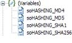

# Erstellen und Verwenden von Hashes in dynamischen PDF forms {#generate-work-with-hashes-dynamic-pdf-forms}


## Vorausgesetztes Wissen {#prerequisite-knowledge}

AEM Forms on JEE Designer verfügt über eine Reihe von Funktionen, die der Zugriff auf und der Aufruf von Funktionen in Skriptobjekten ermöglichen.

## Benutzerebene {#user-level}

Anfang

Wenn Sie ein Kennwort in Ihrem PDF-Formular ausblenden möchten und es nicht in unverschlüsseltem Text im Quellcode oder an einer anderen Stelle im PDF-Dokument enthalten sein soll, ist es wichtig zu wissen, wie mit MD4-, MD5-, SHA-1- und SHA-256-Hashes generiert und funktioniert.

Es geht darum, das Kennwort zu verschleiern, indem ein eindeutiger Hash generiert und dieser Hash im PDF-Dokument gespeichert wird. Dieser einzigartige Hash kann von verschiedenen Hash-Funktionen erzeugt werden. In diesem Artikel werde ich Ihnen zeigen, wie Sie ihn im PDF-Formular generieren und wie Sie mit ihnen arbeiten.

Eine Hash-Funktion akzeptiert eine lange Zeichenfolge (oder Nachricht) beliebiger Länge als Eingabe und erzeugt eine feste Längenzeichenfolge als Ausgabe, manchmal auch als NachrichtenDigest oder digitaler Fingerabdruck bezeichnet.

Mit AEM Forms on JEE Designer können Sie die verschiedenen Hash-Funktionen in Skriptobjekte als JavaScript implementieren und in einem dynamischen PDF-Dokument ausführen. Die Beispiel-PDFs, die in den Beispieldateien für diesen Artikel enthalten sind, verwenden Open-Source-Implementierungen der folgenden Hash-Funktionen:

* MD4 und MD5, von Ronald Rivest entworfen

* SHA-1 und SHA-256 - wie von NIST definiert

Der größte Vorteil der Verwendung von Hashes besteht darin, dass Sie Kennwörter nicht direkt durch Vergleich klarer Textzeichenfolgen vergleichen müssen. Sie können stattdessen die beiden Hashes der beiden Passwörter vergleichen. Da es sehr unwahrscheinlich ist, dass zwei verschiedene Zeichenfolgen denselben Hash aufweisen, können Sie bei beiden Hashes davon ausgehen, dass auch die verglichenen Zeichenfolgen (in diesem Fall die Passwörter) identisch sind.

>[!NOTE]
>
>Es gibt einige bekannte Sicherheitsprobleme (so genannte Hash-Kollisionen) mit MD4 oder MD5. Aufgrund dieser Hash-Kollisionen und anderer SHA-1-Hacks (einschließlich Regenbogentabellen) beschloss ich, mich auf die SHA-256-Hash-Funktion in der zweiten Stichprobe zu konzentrieren.  Weitere Informationen finden Sie auf den Seiten [Kollision](https://en.wikipedia.org/wiki/Hash_collision) und [Regenbogentabelle](https://en.wikipedia.org/wiki/Rainbow_table) von Wikipedia.

## Überprüfen der Skriptobjekte {#examining-script-objects}

Wenn Sie eines der beiden angegebenen Beispiele in AEM Forms on JEE Designer öffnen, finden Sie die vier Skriptobjekte in der Palette &quot;Hierarchie&quot;(siehe Abbildung unten).



Um die JavaScript-Implementierung der Hash-Funktionen in diesen Skriptobjekten anzuzeigen, wählen Sie das Skriptobjekt aus und suchen Sie im Skript-Editor nach dem Code.  Sie können sehen, wie die folgenden Hash-Funktionen implementiert wurden:

* soHASHING_MD4.hex_md4()
* soHASHING_MD4.b64_md4()
* soHASHING_MD4.str_md4()
* soHASHING_MD5.hex_md5()
* soHASHING_MD5.b64_md5()
* soHASHING_MD5.str_md5()
* soHASHING_SHA1.hex_sha1()
* soHASHING_SHA1.b64_sha1( )
* soHASHING_SHA1.str_sha1( )
* soHASHING_SHA256.hex_sha256()
* soHASHING_SHA256.b64_sha256()
* soHASHING_SHA256.str_sha256()

Wie Sie aus dieser Liste sehen können, gibt es verschiedene Funktionen für die verschiedenen Ausgabetypen des Hash. Sie können zwischen `hex_` für hexadezimale Ziffern, `b64_` für Base64-kodierte Ausgabe oder `str_` für einfache Zeichenfolgenkodierung wählen.

Je nach ausgewählter Hash-Funktion variiert die Länge des Hash:

* MD4: 128 Bits
* MD5: 128 Bits
* SHA-1: 160 Bit
* SHA-256: 256 Bits

## Probieren der PDF forms {#try-sample-pdf-forms}

Die Beispieldateien für diesen Artikel enthalten zwei PDF forms. Im ersten Beispiel können Sie eine Zeichenfolge eingeben und dann MD4-, MD5-, SHA-1- und SHA-256-Hash-Werte für die Zeichenfolge generieren.  Das zweite Beispiel ist ein einfaches Formular, das Textfelder entsperrt, wenn ein korrektes Kennwort eingegeben wird.

### Beispiel 1:  Hashes erzeugen {#generating-dashes}

Gehen Sie wie folgt vor, um das erste Beispiel auszuprobieren:

1. Öffnen Sie nach dem Herunterladen und Entpacken der Beispieldateien hashing_forms_sample1.pdf mit AEM Forms on JEE Designer. Alternativ können Sie Adobe Reader oder Adobe Acrobat Professional verwenden, um das Beispiel zu öffnen und anzuzeigen. Sie können den Quellcode jedoch nicht sehen.
1. Geben Sie in das Textfeld [!UICONTROL clear text] ein Kennwort oder eine andere Nachricht ein, die Sie mit einem Hash versehen möchten.
1. Klicken Sie auf eine der vier Schaltflächen, um den MD4-, MD5-, SHA-1- oder SHA-256-Hash zu generieren. Je nachdem, auf welche Schaltfläche Sie geklickt haben, wird eine der vier Hash-Funktionen aufgerufen, die eine hexadezimale Ausgabe erzeugen, und Ihre Zeichenfolge oder Nachricht wird gehasht.

Das Ergebnis des Hash-Vorgangs wird im Feld [!UICONTROL hash] angezeigt. Die Länge des Hash hängt von der ausgewählten Hash-Funktion ab.

Alle Beispiele verwenden Hexadezimalziffern als Ausgabetyp. Mit dem Skript-Editor können Sie die Beispiele ändern und den Ausgabetyp in Base64 oder simple String ändern.

### Beispiel 2:  Passwörter abgleichen {#matching-passwords}

Das zweite Beispiel zeigt, wie Hashes im Hintergrund verglichen werden, ohne das richtige Kennwort enthüllen zu müssen. Das von Ihnen eingegebene Kennwort wird mit Hashing versehen. Das echte Kennwort, das in einem unsichtbaren Feld gespeichert ist, wird ebenfalls gehasht. Das Kennwort ist sicher, nicht weil es unsichtbar ist, sondern weil es gehasht wurde. Da es nicht möglich ist, das Kennwort aus dem Hash-Wert zu rekonstruieren, ist es sicher, das Kennwort in Hash-Form anzuzeigen. Der Vergleich erfolgt nur zwischen den Hashes, nicht zwischen den Kennwörtern in Klartext. Wenn beide Hashes identisch sind, können Sie davon ausgehen, dass die Kennwörter identisch sind.

Gehen Sie wie folgt vor, um das zweite Beispiel auszuprobieren:

1. Öffnen Sie `hashing_forms_sample2.pdf` mit AEM Forms on JEE Designer. Alternativ können Sie Adobe Reader oder Adobe Acrobat Professional verwenden, um das Beispiel zu öffnen und anzuzeigen. Sie können den Quellcode jedoch nicht sehen.
1. Wählen Sie eines der beiden Kennwortfelder mit der Bezeichnung [!UICONTROL Password MAN] oder [!UICONTROL Password WOMAN] aus und geben Sie die Passwörter ein:
   1. Das Kennwort für den Mann ist `bob`
   1. Das Kennwort für die Frau ist `alice`
1. Wenn Sie den Fokus aus den Kennwortfeldern verschieben oder die Eingabetaste drücken, wird der Hash des eingegebenen Kennworts automatisch generiert und mit dem gespeicherten Hash des richtigen Kennworts im Hintergrund verglichen. Die richtigen Hash-Kennwörter werden in den unsichtbaren Textfeldern `passwd_man_hashed` und `passwd_woman_hashed` gespeichert. Wenn Sie das richtige Kennwort für den Mann eingeben, werden die Textfelder `Man 1` und `Man 2` barrierefrei gemacht, damit Sie Text in diesen eingeben können. Dasselbe Verhalten gilt für die Felder der Frau.
1. Optional können Sie auf die Schaltfläche mit der Bezeichnung &quot;Kennwörter löschen&quot;klicken, um die Textfelder zu deaktivieren und ihren Rahmen zu ändern.

Der Code zum Vergleichen der beiden Hash-Werte und zum Aktivieren der Textfelder ist einfach:

```xml
if (soHASHING_SHA256.hex_sha256(this.rawValue) == passwd_man_hashed.rawValue){
     VAL_man_1.access = "open";
     VAL_man_2.access = "open";
     VAL_man_1.borderColor = "0,255,0";
     VAL_man_2.borderColor = "0,255,0";
}
```

## Von hier aus {#next-steps}

Wo brauchst du so etwas? Angenommen, ein PDF-Formular enthält Felder, die nur von autorisierten Personen ausgefüllt werden sollten. Durch das Schützen dieser Felder mit einem Kennwort, das nirgends im Dokument wie in Sample_2.pdf im Klartext zu sehen ist, können Sie sicherstellen, dass diese Felder nur für Benutzer zugänglich sind, die das Kennwort kennen.

Ich empfehle Ihnen, die beiden PDF-Beispieldateien weiter zu untersuchen.  Sie können mit Sample_1.pdf neue Hash-Werte generieren und die generierten Werte verwenden, um entweder das Kennwort oder die Hash-Funktion zu ändern, die in Sample_2.pdf verwendet wird.  Die im Abschnitt &quot;Attribution&quot;aufgelisteten Ressourcen enthalten auch zusätzliche Informationen zum Hashing und zu den spezifischen JavaScript-Implementierungen, die in diesem Artikel verwendet werden.

## Attribution {#attributions}

* [Ronald Rivest](https://en.wikipedia.org/wiki/Ron_Rivest)
* [NIST](https://csrc.nist.gov/projects/cryptographic-standards-and-guidelines)
* [Hash-Kollision](https://en.wikipedia.org/wiki/Hash_collision)
* [Regenbogentabelle](https://en.wikipedia.org/wiki/Rainbow_table)
* [Startseite des JavaScript-MD5-Projekts](http://pajhome.org.uk/crypt/md5/)
* [jsSHA2-Projekt-Startseite](https://anmar.eu.org/projects/jssha2/)


