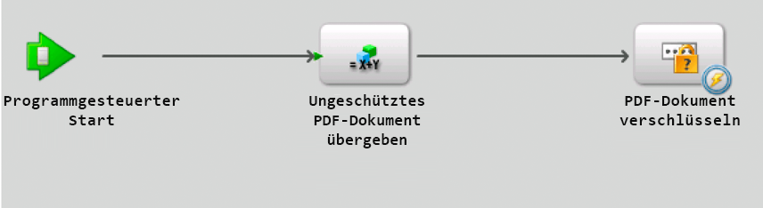

# Aufrufen von AEM Forms mit Remoting {#invoking-aem-forms-using-remoting}

**Beispiele und Beispiele in diesem Dokument gelten nur für die Umgebung AEM Forms on JEE.**

Prozesse, die in Workbench erstellt wurden, können mithilfe von Remoting aufgerufen werden. Das heißt, Sie können einen AEM Forms-Prozess aus einer mit Flex erstellten Clientanwendung aufrufen. Diese Funktion basiert auf Data Services.

>[!NOTE]
>
>Bei der Verwendung von Remoting wird empfohlen, Prozesse aufzurufen, die in Workbench erstellt wurden, im Gegensatz zu AEM Forms-Diensten. Es ist jedoch möglich, AEM Forms-Dienste direkt aufzurufen. (Siehe PDF-Dokumente mit Remoting im AEM Forms Developer Center verschlüsseln.)

>[!NOTE]
>
>Wenn ein AEM Forms-Dienst nicht so konfiguriert ist, dass er anonymen Zugriff zulässt, führen Anfragen von einem Flex-Client zu einer Webbrowser-Herausforderung. Der Benutzer muss die Anmeldeinformationen für Benutzername und Kennwort eingeben.

Der folgende AEM Forms-Prozess mit kurzer Lebensdauer mit dem Namen `MyApplication/EncryptDocument` kann mit Remoting aufgerufen werden. (Weitere Informationen zu diesem Prozess, z. B. zu Eingabe- und Ausgabewerten, finden Sie unter [Beispiel für einen Prozess mit kurzer Lebensdauer](/help/forms/developing/aem-forms-processes.md).)



>[!NOTE]
>
>Um einen AEM Forms-Prozess mit einer Flex-Anwendung aufzurufen, stellen Sie sicher, dass ein Remoting-Endpunkt aktiviert ist. Standardmäßig ist ein Remoting-Endpunkt aktiviert, wenn Sie einen Prozess bereitstellen.

Wenn dieser Prozess aufgerufen wird, führt er die folgenden Aktionen aus:

1. Ruft das unbesicherte PDF-Dokument ab, das als Eingabewert übergeben wird. Diese Aktion basiert auf dem Vorgang `SetValue`. Der Name des Eingabeparameters ist `inDoc` und der Datentyp ist `document`. (Der Datentyp `document` ist in Workbench verfügbar.)
1. Sie verschlüsselt das PDF-Dokument mit einem Kennwort. Diese Aktion basiert auf dem Vorgang `PasswordEncryptPDF`. Der Name des Ausgabewerts für diesen Vorgang ist `outDoc` und stellt das kennwortverschlüsselte PDF-Dokument dar. Der Datentyp von outDoc ist `document`.
1. Speichert das kennwortverschlüsselte PDF-Dokument als PDF-Datei im lokalen Dateisystem. Diese Aktion basiert auf dem Vorgang `WriteDocument`. 

>[!NOTE]
>
>Der `MyApplication/EncryptDocument`-Prozess basiert nicht auf einem vorhandenen AEM Forms-Prozess. Um mit den Codebeispielen zu folgen, erstellen Sie einen Prozess mit dem Namen `MyApplication/EncryptDocument` mithilfe von Workbench.

>[!NOTE]
>
>Weitere Informationen zum Aufrufen eines Prozesses mit langer Lebensdauer mithilfe von Remoting finden Sie unter [Aufrufen von Prozessen mit menschlicher Zielgruppe und langer Lebensdauer](/help/forms/developing/invoking-human-centric-long-lived.md#invoking-human-centric-long-lived-processes).

**Siehe auch**

[AEM Forms Flex-Bibliotheksdatei einschließen](invoking-aem-forms-using-remoting.md#including-the-aem-forms-flex-library-file)

[Umgang mit Dokumenten mit (für AEM Formulare nicht mehr unterstützt) AEM Forms Remoting](invoking-aem-forms-using-remoting.md#handling-documents-with-remoting)

[Aufrufen eines Prozesses mit kurzer Lebensdauer durch Übergeben eines unsicheren Dokuments mithilfe von (für AEM Formulare nicht mehr unterstützt) AEM Forms Remoting](invoking-aem-forms-using-remoting.md#invoking-a-short-lived-process-by-passing-an-unsecure-document-using-remoting)

[Authentifizieren von Clientanwendungen, die mit Flex erstellt wurden](invoking-aem-forms-using-remoting.md#authenticating-client-applications-built-with-flex)

[Übergeben sicherer Dokumente zum Aufrufen von Prozessen mit Remoting](invoking-aem-forms-using-remoting.md#passing-secure-documents-to-invoke-processes-using-remoting)

[Aufrufen benutzerdefinierter Komponentendienste mit Remoting](invoking-aem-forms-using-remoting.md#invoking-custom-component-services-using-remoting)

[Erstellen einer Clientanwendung, die mit Flex erstellt wurde und einen menschenorientierten Prozess mit langer Lebensdauer aufruft](/help/forms/developing/invoking-human-centric-long-lived.md#creating-a-client-application-built-with-flex-that-invokes-a-human-centric-long-lived-process)

[Erstellen von Flash Builder-Anwendungen, die eine SSO-Authentifizierung mit HTTP-Token durchführen](/help/forms/developing/creating-flash-builder-applications-perform.md#creating-flash-builder-applications-that-perform-sso-authentication-using-http-tokens)

Informationen zum Anzeigen von Prozessdaten in einem Flex-Diagrammsteuerelement finden Sie unter [Anzeigen von AEM Forms-Prozessdaten in Flex-Diagrammen](https://www.adobe.com/devnet/livecycle/articles/populating_flexcontrols.html).

>[!NOTE]
>
>*Legen Sie die Datei &quot;crossdomain.xml&quot;unbedingt an der richtigen Stelle ab. Wenn Sie beispielsweise AEM Forms unter JBoss bereitgestellt haben, platzieren Sie diese Datei am folgenden Speicherort: &lt;install_directory>\Adobe_Experience_Manager_forms\jboss\server\lc_turnkey\deploy\jboss-web.deployer\ROOT.war.*

## Einschließen der AEM Forms Flex-Bibliotheksdatei {#including-the-aem-forms-flex-library-file}

Um AEM Forms-Prozesse programmgesteuert mit Remoting aufzurufen, fügen Sie die Datei &quot;adobe-remoting-provider.swc&quot;zum Klassenpfad Ihres Flex-Projekts hinzu. Diese SWC-Datei befindet sich am folgenden Speicherort:

* *&lt;install_directory>\Adobe_Experience_Manager_forms\sdk\misc\DataServices\Client-Libraries*

   wobei &lt;*install_directory* der Ordner ist, in dem AEM Forms installiert ist.

**Siehe auch**

[Aufrufen von AEM Forms mithilfe von (für AEM Formulare nicht mehr unterstützt) AEM Forms Remoting](invoking-aem-forms-using-remoting.md#invoking-aem-forms-using-remoting)

[Umgang mit Dokumenten mit (für AEM Formulare nicht mehr unterstützt) AEM Forms Remoting](invoking-aem-forms-using-remoting.md#handling-documents-with-remoting)

[Aufrufen eines Prozesses mit kurzer Lebensdauer durch Übergeben eines unsicheren Dokuments mithilfe von (für AEM Formulare nicht mehr unterstützt) AEM Forms Remoting](invoking-aem-forms-using-remoting.md#invoking-a-short-lived-process-by-passing-an-unsecure-document-using-remoting)

[Authentifizieren von Clientanwendungen, die mit Flex erstellt wurden](invoking-aem-forms-using-remoting.md#authenticating-client-applications-built-with-flex)

## Umgang mit Dokumenten mit Remoting {#handling-documents-with-remoting}

Einer der wichtigsten nicht primitiven Java-Typen, die in AEM Forms verwendet werden, ist die `com.adobe.idp.Document`-Klasse. Für den Aufruf eines AEM Forms-Vorgangs ist in der Regel ein Dokument erforderlich. Es handelt sich in erster Linie um ein PDF-Dokument, kann aber auch andere Dokument-Typen wie SWF-, HTML-, XML- oder DOC-Dateien enthalten. (Siehe [Übergeben von Daten an AEM Forms-Dienste mithilfe der Java-API](/help/forms/developing/invoking-aem-forms-using-java.md#passing-data-to-aem-forms-services-using-the-java-api).)

Eine mit Flex erstellte Clientanwendung kann kein Dokument direkt anfordern. Beispielsweise können Sie Adobe Reader nicht starten, um eine URL anzufordern, die eine PDF-Datei erzeugt. Anfragen nach Dokument-Typen wie PDF- und Microsoft Word-Dokumenten geben ein URL-Ergebnis zurück. Der Kunde ist dafür verantwortlich, den Inhalt der URL anzuzeigen. Der Dokument Management-Dienst hilft beim Generieren der URL- und Inhaltstypinformationen. Anforderungen für XML-Dokumente geben das vollständige XML-Dokument zurück.

### Übergeben eines Dokuments als Eingabeparameter {#passing-a-document-as-an-input-parameter}

Eine mit Flex erstellte Clientanwendung kann ein Dokument nicht direkt an einen AEM Forms-Prozess übergeben. Stattdessen verwendet die Clientanwendung eine Instanz der ActionScript-Klasse `mx.rpc.livecycle.DocumentReference`, um Eingabeparameter an einen Vorgang zu übergeben, der eine `com.adobe.idp.Document`-Instanz erwartet. Eine Flex-Clientanwendung verfügt über mehrere Optionen zum Einrichten eines `DocumentReference`-Objekts:

* Wenn sich das Dokument auf dem Server befindet und der Dateispeicherort bekannt ist, stellen Sie die Eigenschaft referenceType des DocumentReference-Objekts auf REF_TYPE_FILE ein. Setzen Sie die Eigenschaft fileRef auf den Speicherort der Datei, wie im folgenden Beispiel gezeigt:

```java
 ... var docRef: DocumentReference = new DocumentReference(); 
 docRef.referenceType = DocumentReference.REF_TYPE_FILE; 
 docRef.fileRef = "C:/install/adobe/cs2/How to Uninstall.pdf"; ...
```

* Wenn sich das Dokument auf dem Server befindet und Sie dessen URL kennen, setzen Sie die Eigenschaft referenceType des DocumentReference-Objekts auf REF_TYPE_URL. Setzen Sie die Eigenschaft url auf die URL, wie im folgenden Beispiel gezeigt:

```java
... var docRef: DocumentReference = new DocumentReference(); 
docRef.referenceType = DocumentReference.REF_TYPE_URL; 
docRef.url = "https://companyserver:8080/DocumentManager/116/7855"; ...
```

* Um ein DocumentReference-Objekt aus einer Textzeichenfolge in der Clientanwendung zu erstellen, setzen Sie die Eigenschaft referenceType des DocumentReference-Objekts auf REF_TYPE_INLINE. Legen Sie die Texteigenschaft auf den Text fest, der in das Objekt eingeschlossen werden soll, wie im folgenden Beispiel gezeigt:

```java
... var docRef: DocumentReference = new DocumentReference(); 
docRef.referenceType = DocumentReference.REF_TYPE_INLINE; 
docRef.text = "Text for my document";  // Optionally, you can override the server’s default character set  // if necessary:  // docRef.charsetName=CharacterSetName  ...
```

* Wenn sich das Dokument nicht auf dem Server befindet, verwenden Sie das Remoting-Upload-Servlet, um ein Dokument nach AEM Forms hochzuladen. Neu in AEM Forms ist die Möglichkeit, sichere Dokumente hochzuladen. Beim Hochladen eines sicheren Dokuments müssen Sie einen Benutzer verwenden, der die Rolle *Anwendungsbenutzer für das Hochladen von Dokumenten* hat. Ohne diese Rolle kann der Benutzer kein sicheres Dokument hochladen. Es wird empfohlen, Single Sign-On zum Hochladen eines sicheren Dokuments zu verwenden. (Siehe [Übergeben sicherer Dokumente zum Aufrufen von Prozessen mit Remoting](invoking-aem-forms-using-remoting.md#passing-secure-documents-to-invoke-processes-using-remoting).)

>[!NOTE]
Wenn AEM Forms so konfiguriert ist, dass unsichere Dokumente hochgeladen werden können, können Sie einen Benutzer verwenden, der nicht über die Rolle &quot;Anwendungsbenutzer beim Hochladen von Dokumenten&quot;verfügt, um ein Dokument hochzuladen. Ein Benutzer kann auch über die Berechtigung zum Hochladen von Dokumenten verfügen. Wenn AEM Forms jedoch so konfiguriert ist, dass nur sichere Dokumente zulässig sind, stellen Sie sicher, dass der Benutzer über die Berechtigung &quot;Anwendungsbenutzer hochladen&quot;oder &quot;Dokument-Upload&quot;verfügt. (Siehe [Konfigurieren von AEM Forms zum Akzeptieren sicherer und unsicherer Dokumente](invoking-aem-forms-using-remoting.md#configuring-aem-forms-to-accept-secure-and-unsecure-documents).

Sie verwenden standardmäßige Upload-Funktionen für Flash für die angegebene Upload-URL: `https://SERVER:PORT/remoting/lcfileupload`. Sie können das `DocumentReference`-Objekt dann verwenden, wenn ein Eingabeparameter des Typs `Document` erwartet wird
` private function startUpload():void  {  fileRef.addEventListener(Event.SELECT, selectHandler);  fileRef.addEventListener("uploadCompleteData", completeHandler);  try  {   var success:Boolean = fileRef.browse();  }    catch (error:Error)  {   trace("Unable to browse for files.");  }  }      private function selectHandler(event:Event):void {  var request:URLRequest = new  URLRequest("https://SERVER:PORT/remoting/lcfileupload")  try   {   fileRef.upload(request);   }    catch (error:Error)   {   trace("Unable to upload file.");   }  }    private function completeHandler(event:DataEvent):void  {   var params:Object = new Object();   var docRef:DocumentReference = new DocumentReference();   docRef.url = event.data as String;   docRef.referenceType = DocumentReference.REF_TYPE_URL;  }`Der Beginn Remoting Quick verwendet das Remoting-Upload-Servlet, um eine PDF-Datei an den `MyApplication/EncryptDocument`Prozess zu übergeben. (Siehe [Aufrufen eines Prozesses mit kurzer Lebensdauer durch Übergeben eines unsicheren Dokuments mit (für AEM Formulare nicht mehr unterstützt) AEM Forms Remoting](invoking-aem-forms-using-remoting.md#invoking-a-short-lived-process-by-passing-an-unsecure-document-using-remoting).)

```java
 
private
function startUpload(): void  { 
 fileRef.addEventListener(Event.SELECT, selectHandler); 
 fileRef.addEventListener("uploadCompleteData", completeHandler); 
 try  { 
  var success: Boolean = fileRef.browse(); 
 }  
 catch (error: Error)  { 
  trace("Unable to browse for files."); 
 } 
}   
private
function selectHandler(event: Event): void { 
 var request: URLRequest = new  URLRequest("https://SERVER:PORT/remoting/lcfileupload")  try  { 
  fileRef.upload(request); 
 }  
 catch (error: Error)  { 
  trace("Unable to upload file."); 
 } 
}  
private
function completeHandler(event: DataEvent): void  { 
 var params: Object = new Object(); 
 var docRef: DocumentReference = new DocumentReference(); 
 docRef.url = event.data as String; 
 docRef.referenceType = DocumentReference.REF_TYPE_URL; 
}
```

Der Beginn Remoting Quick verwendet das Remoting-Upload-Servlet, um eine PDF-Datei an den `MyApplication/EncryptDocument`Prozess zu übergeben. (Siehe [Aufrufen eines Prozesses mit kurzer Lebensdauer durch Übergeben eines unsicheren Dokuments mit (für AEM Formulare nicht mehr unterstützt) AEM Forms Remoting](invoking-aem-forms-using-remoting.md#invoking-a-short-lived-process-by-passing-an-unsecure-document-using-remoting).)

### Zurückgeben eines Dokuments an eine Clientanwendung {#passing-a-document-back-to-a-client-application}

Eine Clientanwendung empfängt ein Objekt des Typs `mx.rpc.livecycle.DocumentReference` für einen Dienstvorgang, der eine `com.adobe.idp.Document`-Instanz als Ausgabeparameter zurückgibt. Da eine Clientanwendung ActionScript-Objekte und nicht Java behandelt, können Sie ein Java-basiertes Dokument-Objekt nicht an einen Flex-Client zurückgeben. Stattdessen generiert der Server eine URL für das Dokument und gibt die URL zurück an den Client. Die Eigenschaft `DocumentReference` des Objekts gibt an, ob sich der Inhalt im `DocumentReference`-Objekt befindet oder von einer URL in der Eigenschaft `DocumentReference.url` abgerufen werden muss. `referenceType` Die `DocumentReference.contentType`-Eigenschaft gibt den Typ des Dokuments an.

**Siehe auch**

[Aufrufen von AEM Forms mithilfe von (für AEM Formulare nicht mehr unterstützt) AEM Forms Remoting](invoking-aem-forms-using-remoting.md#invoking-aem-forms-using-remoting)

[AEM Forms Flex-Bibliotheksdatei einschließen](invoking-aem-forms-using-remoting.md#including-the-aem-forms-flex-library-file)

[Aufrufen eines Prozesses mit kurzer Lebensdauer durch Übergeben eines unsicheren Dokuments mithilfe von (für AEM Formulare nicht mehr unterstützt) AEM Forms Remoting](invoking-aem-forms-using-remoting.md#invoking-a-short-lived-process-by-passing-an-unsecure-document-using-remoting)

[Authentifizieren von Clientanwendungen, die mit Flex erstellt wurden](invoking-aem-forms-using-remoting.md#authenticating-client-applications-built-with-flex)

[Übergeben sicherer Dokumente zum Aufrufen von Prozessen mit Remoting](invoking-aem-forms-using-remoting.md#passing-secure-documents-to-invoke-processes-using-remoting)

## Aufrufen eines Prozesses mit kurzer Lebensdauer durch Übergeben eines unsicheren Dokuments mit Remoting {#invoking-a-short-lived-process-by-passing-an-unsecure-document-using-remoting}

So rufen Sie einen AEM Forms-Prozess aus einer mit Flex erstellten Anwendung auf:

1. Erstellen Sie eine `mx:RemoteObject`-Instanz.
1. Erstellen Sie eine `ChannelSet`-Instanz.
1. Übergeben Sie erforderliche Eingabewerte.
1. Verarbeiten Sie Rückgabewerte.

>[!NOTE]
In diesem Abschnitt wird beschrieben, wie Sie einen AEM Forms-Prozess aufrufen und ein Dokument hochladen, wenn AEM Forms für das Hochladen unsicherer Dokumente konfiguriert ist. Informationen zum Aufrufen von AEM Forms-Prozessen und Hochladen sicherer Dokumente sowie zum Konfigurieren von AEM Forms für das Akzeptieren sicherer und unsicherer Dokumente finden Sie unter [Übergeben sicherer Dokumente zum Aufrufen von Prozessen mit Remoting](invoking-aem-forms-using-remoting.md#passing-secure-documents-to-invoke-processes-using-remoting).

**Erstellen einer mx:RemoteObject-Instanz**

Sie erstellen eine `mx:RemoteObject`-Instanz, um einen in Workbench erstellten AEM Forms-Prozess aufzurufen. Um eine `mx:RemoteObject`-Instanz zu erstellen, geben Sie die folgenden Werte an:

* **id:** Der Name der  `mx:RemoteObject` Instanz, die den aufzurufenden Prozess darstellt.
* **Ziel:** Der Name des aufzurufenden AEM Forms-Prozesses. Um beispielsweise den Prozess `MyApplication/EncryptDocument` aufzurufen, geben Sie `MyApplication/EncryptDocument` an.
* **result:** Der Name der Flex-Methode, die das Ergebnis verarbeitet.

Geben Sie im Tag `mx:RemoteObject` ein `<mx:method>`-Tag an, das den Namen der Aufrufmethode des Prozesses angibt. Normalerweise lautet der Name einer Forms-Aufrufmethode `invoke`.

Im folgenden Codebeispiel wird eine `mx:RemoteObject`-Instanz erstellt, die den `MyApplication/EncryptDocument`-Prozess aufruft.

```java
 <mx:RemoteObject id="EncryptDocument" destination="MyApplication/EncryptDocument" result="resultHandler(event);">
          <mx:method name="invoke" result="handleExecuteInvoke(event)"/>
      </mx:RemoteObject>
```

**Erstellen eines Kanals nach AEM Forms**

Eine Clientanwendung kann AEM Forms aufrufen, indem ein Kanal in MXML oder ActionScript angegeben wird, wie das folgende ActionScript-Beispiel zeigt. Der Kanal muss ein `AMFChannel`, `SecureAMFChannel`, `HTTPChannel` oder `SecureHTTPChannel` sein.

```java
     ...
     private function refresh():void{
         var cs:ChannelSet= new ChannelSet();
         cs.addChannel(new AMFChannel("my-amf",
             "https://yourlcserver:8080/remoting/messagebroker/amf"));
         EncryptDocument.setCredentials("administrator", "password");
         EncryptDocument.channelSet = cs;
     }
     ...
```

Weisen Sie die `ChannelSet`-Instanz dem `mx:RemoteObject`-Instanzfeld `channelSet` zu (wie im vorherigen Codebeispiel gezeigt). Im Allgemeinen importieren Sie die Kanal-Klasse in eine Importanweisung, anstatt den vollständig qualifizierten Namen anzugeben, wenn Sie die `ChannelSet.addChannel`-Methode aufrufen.

**Übergeben von Eingabewerten**

Ein in Workbench erstellter Prozess kann null oder mehr Eingabeparameter annehmen und einen Ausgabewert zurückgeben. Eine Clientanwendung übergibt Eingabeparameter innerhalb eines `ActionScript`-Objekts mit Feldern, die zu Parametern gehören, die zum AEM Forms-Prozess gehören. Für den Prozess mit kurzer Lebensdauer mit dem Namen `MyApplication/EncryptDocument` ist ein Eingabeparameter mit dem Namen `inDoc` erforderlich. Der Name des Vorgangs, der vom Prozess offen gelegt wird, ist `invoke` (der Standardname für einen Prozess mit kurzer Lebensdauer). (Siehe [Aufrufen von AEM Forms mithilfe von (für AEM Formulare nicht mehr unterstützt) AEM Forms Remoting](invoking-aem-forms-using-remoting.md#invoking-aem-forms-using-remoting).)

Im folgenden Codebeispiel wird ein PDF-Dokument an den `MyApplication/EncryptDocument`-Prozess übergeben:

```java
     ...
     var params:Object = new Object();
 
     //Document is an instance of DocumentReference
     //that store an unsecured PDF document
     params["inDoc"] = pdfDocument;
 
     // Invoke an operation synchronously:
     EncryptDocument.invoke(params);
     ...
```

In diesem Codebeispiel ist `pdfDocument` eine `DocumentReference`-Instanz, die ein unbesichertes PDF-Dokument enthält. Informationen zu einem `DocumentReference` finden Sie unter [Verarbeiten von Dokumenten mit (für AEM Formulare nicht mehr unterstützt) AEM Forms Remoting](invoking-aem-forms-using-remoting.md#handling-documents-with-remoting).

**Aufrufen einer bestimmten Version eines Dienstes**

Sie können eine bestimmte Version eines Forms-Dienstes aufrufen, indem Sie einen Parameter `_version` in der Parameterzuordnung des Aufrufs verwenden. So rufen Sie beispielsweise Version 1.2 des `MyApplication/EncryptDocument`-Dienstes auf:

```java
 var params:Object = new Object();
 params["inDoc"] = pdfDocument;
 params["_version"] = "1.2"
 var token:AsyncToken = echoService.echoString(params);
```

Der Parameter `version` muss eine Zeichenfolge sein, die einen einzelnen Punkt enthält. Die Werte links, Hauptversion und rechts, Nebenversion des Zeitraums müssen Ganzzahlen sein. Wenn dieser Parameter nicht angegeben ist, wird die head-aktive Version aufgerufen.

**Umgang mit Rückgabewerten**

Die AEM Forms-Prozessausgabeparameter werden in ActionScript-Objekte deserialisiert, aus denen die Clientanwendung bestimmte Parameter anhand des Namens extrahiert, wie im folgenden Beispiel gezeigt. (Der Ausgabewert des Prozesses `MyApplication/EncryptDocument` heißt `outDoc`.)

```java
     ...
     var res:Object = event.result;
     var docRef:DocumentReference = res["outDoc"] as DocumentReference;
     ...
```

**MyApplication/EncryptDocument-Prozess aufrufen**

Sie können den `MyApplication/EncryptDocument`-Prozess aufrufen, indem Sie die folgenden Schritte ausführen:

1. Erstellen Sie eine `mx:RemoteObject`-Instanz entweder über ActionScript oder MXML. Siehe Erstellen einer mx:RemoteObject-Instanz.
1. Richten Sie eine `ChannelSet`-Instanz für die Kommunikation mit AEM Forms ein und verknüpfen Sie sie mit der `mx:RemoteObject`-Instanz. Siehe Erstellen eines Kanals für AEM Forms.
1. Rufen Sie die `login`-Methode des ChannelSet oder die `setCredentials`-Methode des Dienstes auf, um den Wert und das Kennwort des Benutzers anzugeben. (Siehe [Single Sign-On](invoking-aem-forms-using-remoting.md#using-single-sign-on) verwenden.)
1. Füllen Sie eine `mx.rpc.livecycle.DocumentReference`-Instanz mit einem ungesicherten PDF-Dokument, das an den `MyApplication/EncryptDocument`-Prozess übergeben wird. (Siehe [Übergeben eines Dokuments als Eingabeparameter](invoking-aem-forms-using-remoting.md#passing-a-document-as-an-input-parameter).)
1. Verschlüsseln Sie das PDF-Dokument, indem Sie die `mx:RemoteObject`-Instanz-Methode `invoke` aufrufen. Übergeben Sie die `Object`-Variable, die den Eingabeparameter enthält (das ungeschützte PDF-Dokument). Siehe Übergeben von Eingabewerten.
1. Rufen Sie das kennwortverschlüsselte PDF-Dokument ab, das vom Prozess zurückgegeben wird. Siehe Umgang mit Rückgabewerten.

[Quick Beginn: Aufrufen eines Prozesses mit kurzer Lebensdauer durch Übergeben eines unsicheren Dokuments mithilfe von (für AEM Formulare nicht mehr unterstützt) AEM Forms Remoting](/help/forms/developing/invocation-api-quick-starts.md#quick-start-invoking-a-short-lived-process-by-passing-an-unsecure-document-using-deprecated-for-aem-forms-aem-forms-remoting)

## Authentifizieren von Clientanwendungen, die mit Flex erstellt wurden{#authenticating-client-applications-built-with-flex}

Es gibt mehrere Möglichkeiten, wie AEM Forms-User Manager eine Remoting-Anforderung von einer Flex-Anwendung authentifizieren kann, einschließlich AEM Forms Single Sign-On über den zentralen Anmeldedienst, einfache Authentifizierung und benutzerdefinierte Authentifizierung. Wenn weder Single Sign-On noch anonymer Zugriff aktiviert sind, führt eine Remoting-Anforderung zu einer einfachen Authentifizierung (Standard) oder einer benutzerdefinierten Authentifizierung.

Die Basisauthentifizierung beruht auf der standardmäßigen J2EE-Basisauthentifizierung aus dem Web Application Container. Bei der einfachen Authentifizierung führt ein HTTP 401-Fehler zu einer Browseranforderung. Wenn Sie also versuchen, eine Verbindung mit einer Forms-Anwendung über RemoteObject herzustellen und sich noch nicht bei der Flex-Anwendung angemeldet haben, werden Sie vom Browser aufgefordert, einen Benutzernamen und ein Kennwort einzugeben.

Bei der benutzerdefinierten Authentifizierung sendet der Server einen Fehler an den Client, um anzugeben, dass eine Authentifizierung erforderlich ist.

>[!NOTE]
Weitere Informationen zum Durchführen der Authentifizierung mit HTTP-Token finden Sie unter [Erstellen von Flash Builder-Anwendungen, die die SSO-Authentifizierung mit HTTP-Token durchführen](/help/forms/developing/creating-flash-builder-applications-perform.md#creating-flash-builder-applications-that-perform-sso-authentication-using-http-tokens).

### Verwenden der benutzerdefinierten Authentifizierung {#using-custom-authentication}

Sie aktivieren die benutzerdefinierte Authentifizierung in Administration Console, indem Sie die Authentifizierungsmethode am Remoting-Endpunkt von &quot;Einfach&quot;in &quot;Benutzerdefiniert&quot;ändern. Wenn Sie eine benutzerdefinierte Authentifizierung verwenden, ruft Ihre Clientanwendung die `ChannelSet.login`-Methode zum Anmelden und die `ChannelSet.logout`-Methode zum Abmelden auf.

>[!NOTE]
In der vorherigen Version von AEM Forms haben Sie Anmeldeinformationen durch Aufruf der `RemoteObject.setCredentials`-Methode an ein Ziel gesendet. Die `setCredentials`-Methode übergab die Anmeldeinformationen erst beim ersten Versuch der Komponente, eine Verbindung zum Server herzustellen, an den Server. Wenn die Komponente ein Ereignis zur Fehlerbehebung ausgegeben hat, können Sie nicht sicher sein, ob der Fehler aufgrund eines Authentifizierungsfehlers oder aus einem anderen Grund aufgetreten ist. Die `ChannelSet.login`-Methode stellt beim Aufruf eine Verbindung zum Server her, damit Sie ein Authentifizierungsproblem sofort bearbeiten können. Obwohl Sie weiterhin die `setCredentials`-Methode verwenden können, wird empfohlen, die `ChannelSet.login`-Methode zu verwenden.

Da mehrere Ziele dieselben Kanal und das zugehörige ChannelSet-Objekt verwenden können, wird der Benutzer bei der Anmeldung an einem Ziel an einem anderen Ziel, das denselben Kanal oder dieselben Kanal verwendet, angemeldet. Wenn zwei Komponenten demselben ChannelSet-Objekt unterschiedliche Berechtigungen zuweisen, werden die zuletzt angewendeten Anmeldeinformationen verwendet. Wenn mehrere Komponenten dasselbe authentifizierte ChannelSet-Objekt verwenden, protokolliert der Aufruf der `logout`-Methode alle Komponenten aus den Zielen.

Im folgenden Beispiel werden die Methoden `ChannelSet.login` und `ChannelSet.logout` mit einem RemoteObject-Steuerelement verwendet. Diese Anwendung führt die folgenden Aktionen aus:

* Erstellt ein `ChannelSet`-Objekt im `creationComplete`-Handler, das die von der `RemoteObject`-Komponente verwendeten Kanal darstellt
* Übergibt Anmeldeinformationen an den Server, indem die `ROLogin`-Funktion als Reaktion auf ein Schaltflächen-Klick-Ereignis aufgerufen wird
* Verwendet die RemoteObject-Komponente, um eine Zeichenfolge als Reaktion auf ein Schaltflächenklick-Ereignis an den Server zu senden. Der Server gibt denselben String zurück an die RemoteObject-Komponente
* Verwendet das Ereignis result der RemoteObject-Komponente, um die Zeichenfolge in einem TextArea-Steuerelement anzuzeigen
* Abmelden vom Server durch Aufruf der Funktion `ROLogout` als Reaktion auf ein Ereignis mit Schaltflächenklick

```java
 <?xml version=”1.0”?>
 <!-- security/SecurityConstraintCustom.mxml -->
 <mx:Application xmlns:mx=”https://www.adobe.com/2006/mxml” width=”100%”
     height=”100%” creationComplete=”creationCompleteHandler();”>
 
     <mx:Script>
         <![CDATA[
             import mx.controls.Alert;
             import mx.messaging.config.ServerConfig;
             import mx.rpc.AsyncToken;
             import mx.rpc.AsyncResponder;
             import mx.rpc.events.FaultEvent;
             import mx.rpc.events.ResultEvent;
             import mx.messaging.ChannelSet;
 
             // Define a ChannelSet object.
             public var cs:ChannelSet;
 
             // Define an AsyncToken object.
             public var token:AsyncToken;
 
             // Initialize ChannelSet object based on the
             // destination of the RemoteObject component.
             private function creationCompleteHandler():void {
                 if (cs == null)
                 cs = ServerConfig.getChannelSet(remoteObject.destination);
             }
 
             // Login and handle authentication success or failure.
             private function ROLogin():void {
                 // Make sure that the user is not already logged in.
                 if (cs.authenticated == false) {
                     token = cs.login(“sampleuser”, “samplepassword”);
                     // Add result and fault handlers.
                     token.addResponder(new AsyncResponder(LoginResultEvent,
                     LoginFaultEvent));
                 }
             }
 
             // Handle successful login.
             private function LoginResultEvent(event:ResultEvent,
                 token:Object=null):void  {
                     switch(event.result) {
                         case “success”:
                             authenticatedCB.selected = true;
                             break;
                             default:
                     }
                 }
 
                 // Handle login failure.
                 private function LoginFaultEvent(event:FaultEvent,
                     token:Object=null):void {
                         switch(event.fault.faultCode) {
                             case “Client.Authentication”:
                                 default:
                                 authenticatedCB.selected = false;
                                 Alert.show(“Login failure: “ + event.fault.faultString);
                     }
                 }
 
                 // Logout and handle success or failure.
                 private function ROLogout():void {
                     // Add result and fault handlers.
                     token = cs.logout();
                     token.addResponder(new
                         AsyncResponder(LogoutResultEvent,LogoutFaultEvent));
                 }
 
                 // Handle successful logout.
                 private function LogoutResultEvent(event:ResultEvent,
                     token:Object=null):void {
                         switch (event.result) {
                             case “success”:
                                 authenticatedCB.selected = false;
                                 break;
                                 default:
                     }
                 }
 
                 // Handle logout failure.
                 private function LogoutFaultEvent(event:FaultEvent,
                     token:Object=null):void {
                         Alert.show(“Logout failure: “ + event.fault.faultString);
                 }
                 // Handle message recevied by RemoteObject component.
                 private function resultHandler(event:ResultEvent):void {
                     ta.text += “Server responded: “+ event.result + “\n”;
                 }
 
                 // Handle fault from RemoteObject component.
                 private function faultHandler(event:FaultEvent):void {
                     ta.text += “Received fault: “ + event.fault + “\n”;
                 }
             ]]>
     </mx:Script>
     <mx:HBox>
         <mx:Label text=”Enter a text for the server to echo”/>
         <mx:TextInput id=”ti” text=”Hello World!”/>
         <mx:Button label=”Login”
             click=”ROLogin();”/>
         <mx:Button label=”Echo”
             enabled=”{authenticatedCB.selected}”
             click=”remoteObject.echo(ti.text);”/>
         <mx:Button label=”Logout”
             click=”ROLogout();”/>
         <mx:CheckBox id=”authenticatedCB”
             label=”Authenticated?”
             enabled=”false”/>
     </mx:HBox>
     <mx:TextArea id=”ta” width=”100%” height=”100%”/>
 
     <mx:RemoteObject id=”remoteObject”
         destination=”myDest”
         result=”resultHandler(event);”
         fault=”faultHandler(event);”/>
 </mx:Application>
```

Die Methoden `login` und `logout` geben ein AsyncToken-Objekt zurück. Weisen Sie dem AsyncToken-Objekt Ereignis-Handler zu, damit das result-Ereignis einen erfolgreichen Aufruf verarbeiten kann und das error-Ereignis einen Fehler verarbeiten kann.

### Single Sign-On {#using-single-sign-on}

AEM Formularbenutzer können eine Verbindung zu mehreren AEM Forms-Webanwendungen herstellen, um eine Aufgabe durchzuführen. Wenn Benutzer von einer Webanwendung zur nächsten wechseln, ist es nicht effizient, dass sie sich bei jeder Webanwendung separat anmelden müssen. Mit dem AEM Forms Single Sign-On-Mechanismus können Benutzer sich einmalig anmelden und dann auf jede AEM Forms-Webanwendung zugreifen. Da AEM Forms-Entwickler Clientanwendungen für die Verwendung mit AEM Forms erstellen können, müssen sie auch den Single-Sign-On-Mechanismus nutzen können.

Jede AEM Forms-Webanwendung wird in einer eigenen Web Archive-Datei (WAR) verpackt, die dann als Teil einer Enterprise Archive (EAR)-Datei verpackt wird. Da ein Anwendungsserver die Freigabe von Sitzungsdaten über verschiedene Webanwendungen hinweg nicht zulässt, verwendet AEM Forms HTTP-Cookies, um Authentifizierungsinformationen zu speichern. Authentifizierungs-Cookies ermöglichen es dem Benutzer, sich bei einer Forms-Anwendung anzumelden und dann eine Verbindung zu anderen AEM Forms-Webanwendungen herzustellen. Diese Technik wird als Single Sign-On bezeichnet.

AEM Forms-Entwickler schreiben Clientanwendungen, um die Funktionalität von Formularleitfäden (nicht mehr unterstützt) zu erweitern und Workspace anzupassen. Beispielsweise kann eine Workspace-Anwendung einen Beginn ausführen. Die Clientanwendung verwendet dann einen Remoting-Endpunkt, um Daten vom Forms-Dienst abzurufen.

Wenn ein AEM Forms-Dienst mit AEM Forms Remoting (für AEM Formulare nicht mehr unterstützt) aufgerufen wird, übergibt die Clientanwendung das Authentifizierungs-Cookie als Teil der Anforderung. Da der Benutzer sich bereits authentifiziert hat, ist keine zusätzliche Anmeldung erforderlich, um eine Verbindung zwischen der Clientanwendung und dem AEM Forms-Dienst herzustellen.

>[!NOTE]
Wenn ein Cookie ungültig ist oder fehlt, gibt es keine implizite Umleitung zu einer Anmeldeseite. Daher können Sie weiterhin einen anonymen Dienst aufrufen.

Sie können den AEM Forms Single Sign-On-Mechanismus umgehen, indem Sie eine Clientanwendung schreiben, die sich selbst anmeldet und sich abmeldet. Wenn Sie den Single-Sign-On-Mechanismus umgehen, können Sie mit Ihrer Anwendung eine einfache oder benutzerdefinierte Authentifizierung verwenden.

Da dieser Mechanismus nicht den AEM Forms Single Sign-On-Mechanismus verwendet, wird kein Authentifizierungs-Cookie in den Client geschrieben. Anmeldeinformationen werden im `ChannelSet`-Objekt für den Remoting-Kanal gespeichert. Daher werden alle `RemoteObject`-Aufrufe, die Sie über die gleichen `ChannelSet`-Aufrufe tätigen, im Kontext dieser Anmeldeinformationen vorgenommen.

### Single Sign-On in AEM Forms einrichten{#setting-up-single-sign-on-in-aem-forms}

Um Single Sign-On in AEM Forms zu verwenden, installieren Sie die Workflow-Komponente für Formulare, die den zentralisierten Anmeldedienst enthält. Nachdem sich ein Benutzer erfolgreich angemeldet hat, gibt der zentrale Anmeldedienst ein Authentifizierungs-Cookie an den Benutzer zurück. Jede nachfolgende Anforderung an eine Forms-Webanwendung enthält das Cookie. Wenn das Cookie gültig ist, gilt der Benutzer als authentifiziert und muss sich nicht erneut anmelden.

### Schreiben einer Clientanwendung mit Single Sign-On {#writing-a-client-application-that-uses-single-sign-on}

Wenn Sie den Single-Sign-On-Mechanismus nutzen, erwarten Sie, dass sich die Benutzer über den zentralen Anmeldedienst anmelden, bevor Sie eine Clientanwendung starten. Das heißt, eine Clientanwendung meldet sich nicht über den Browser oder durch Aufruf der `ChannelSet.login`-Methode an.

Wenn Sie den AEM Forms Single Sign-On-Mechanismus verwenden, konfigurieren Sie den Remoting-Endpunkt so, dass eine benutzerdefinierte Authentifizierung verwendet wird, nicht einfach. Andernfalls führt ein Authentifizierungsfehler bei Verwendung der einfachen Authentifizierung zu einer Browseranforderung, die dem Benutzer nicht angezeigt werden soll. Stattdessen erkennt Ihre Anwendung den Authentifizierungsfehler und zeigt dann eine Meldung an, die den Benutzer anweist, sich mit dem zentralen Anmeldedienst anzumelden.

Eine Clientanwendung greift über einen Remoting-Endpunkt mit der Komponente `RemoteObject` auf AEM Forms zu, wie im folgenden Beispiel gezeigt.

```java
 <?xml version="1.0"?>
 <mx:Application
        backgroundColor="#FFFFFF">
 
       <mx:Script>
          <![CDATA[
 
            import mx.controls.Alert;
            import mx.rpc.events.FaultEvent;
 
            // Prompt user to login on a fault.
            private function faultHandler(event:FaultEvent):void
            {
             if(event.fault.faultCode=="Client.Authentication")
             {
                 Alert.show(
                     event.fault.faultString + "\n" +
                     event.fault.faultCode + "\n" +
                     "Please login to continue.");
             }
         }
          ]]>
       </mx:Script>
 
       <mx:RemoteObject id="srv"
           destination="product"
           fault="faultHandler(event);"/>
 
       <mx:DataGrid
           width="100%" height="100%"
           dataProvider="{srv.getProducts.lastResult}"/>
 
       <mx:Button label="Get Data"
           click="srv.getProducts();"/>
 
 </mx:Application>
```

**Anmeldung als neuer Benutzer während der Ausführung der Flex-Anwendung**

Eine mit Flex erstellte Anwendung enthält das Authentifizierungs-Cookie bei jeder Anforderung an einen AEM Forms-Dienst. Aus Leistungsgründen validiert AEM Forms das Cookie nicht bei jeder Anforderung. AEM Forms erkennt jedoch, wenn ein Authentifizierungs-Cookie durch ein anderes Authentifizierungs-Cookie ersetzt wird.

Beispielsweise können Sie eine Client-Anwendung Beginn haben und während die Anwendung aktiv ist, melden Sie sich mit dem zentralen Anmeldedienst ab. Als Nächstes können Sie sich als ein anderer Benutzer anmelden. Durch die Anmeldung als anderer Benutzer wird das vorhandene Authentifizierungs-Cookie durch ein Authentifizierungs-Cookie für den neuen Benutzer ersetzt.

Bei der nächsten Anforderung von der Clientanwendung erkennt AEM Forms, dass sich das Cookie geändert hat, und meldet den Benutzer ab. Daher schlägt die erste Anforderung nach einer Cookie-Änderung fehl. Alle nachfolgenden Anforderungen werden im Kontext des neuen Cookies gestellt und sind erfolgreich.

**Abmelden**

Um sich von AEM Forms abzumelden und eine Sitzung zu ungültigen, muss das Authentifizierungs-Cookie vom Client-Computer gelöscht werden. Da Single Sign-On es dem Benutzer ermöglichen soll, sich einmal anzumelden, soll das Cookie nicht von einer Clientanwendung gelöscht werden. Diese Aktion meldet den Benutzer effektiv ab.

Daher erzeugt der Aufruf der `RemoteObject.logout`-Methode in einer Clientanwendung eine Fehlermeldung auf dem Client, die angibt, dass die Sitzung nicht abgemeldet wird. Stattdessen kann der Benutzer den zentralisierten Anmeldedienst verwenden, um sich abzumelden und das Authentifizierungs-Cookie zu löschen.

**Abmelden, während die Flex-Anwendung noch ausgeführt wird**

Sie können eine mit Flex erstellte Clientanwendung Beginn und den zentralisierten Anmeldedienst verwenden, um sich abzumelden. Während des Abmeldevorgangs wird das Authentifizierungs-Cookie gelöscht. Wenn eine Remoting-Anforderung ohne Cookie oder mit einem ungültigen Cookie ausgeführt wird, wird die Benutzersitzung ungültig. Diese Aktion ist in der Tat eine Abmeldung. Wenn die Clientanwendung das nächste Mal versucht, eine Verbindung zu einem AEM Forms-Dienst herzustellen, wird der Benutzer aufgefordert, sich anzumelden.

**Siehe auch**

[Aufrufen von AEM Forms mithilfe von (für AEM Formulare nicht mehr unterstützt) AEM Forms Remoting](invoking-aem-forms-using-remoting.md#invoking-aem-forms-using-remoting)

[Umgang mit Dokumenten mit (für AEM Formulare nicht mehr unterstützt) AEM Forms Remoting](invoking-aem-forms-using-remoting.md#handling-documents-with-remoting)

[AEM Forms Flex-Bibliotheksdatei einschließen](invoking-aem-forms-using-remoting.md#including-the-aem-forms-flex-library-file)

[Aufrufen eines Prozesses mit kurzer Lebensdauer durch Übergeben eines unsicheren Dokuments mithilfe von (für AEM Formulare nicht mehr unterstützt) AEM Forms Remoting](invoking-aem-forms-using-remoting.md#invoking-a-short-lived-process-by-passing-an-unsecure-document-using-remoting)

[Übergeben sicherer Dokumente zum Aufrufen von Prozessen mit Remoting](invoking-aem-forms-using-remoting.md#passing-secure-documents-to-invoke-processes-using-remoting)

## Übergeben sicherer Dokumente zum Aufrufen von Prozessen mit Remoting {#passing-secure-documents-to-invoke-processes-using-remoting}

Sie können sichere Dokumente an AEM Forms übergeben, wenn Sie einen Prozess aufrufen, für den ein oder mehrere Dokumente erforderlich sind. Durch die Weitergabe eines sicheren Dokuments schützen Sie Geschäftsinformationen und vertrauliche Dokumente. In diesem Fall kann ein Dokument auf ein PDF-Dokument, ein XML-Dokument, ein Word-Dokument usw. verweisen. Die Weitergabe eines sicheren Dokuments von einer in Flex geschriebenen Clientanwendung an AEM Forms ist erforderlich, wenn AEM Forms so konfiguriert ist, dass sichere Dokumente zulässig sind. (Siehe [Konfigurieren von AEM Forms zum Akzeptieren sicherer und unsicherer Dokumente](invoking-aem-forms-using-remoting.md#configuring-aem-forms-to-accept-secure-and-unsecure-documents).)

Verwenden Sie beim Übergeben eines sicheren Dokuments die einmalige Anmeldung und geben Sie einen AEM Forms-Benutzer an, der die Rolle *Dokument Upload Application User* hat. Ohne diese Rolle kann der Benutzer kein sicheres Dokument hochladen. Sie können einem Benutzer programmgesteuert eine Rolle zuweisen. (Siehe [Verwalten von Rollen und Berechtigungen](/help/forms/developing/users.md#managing-roles-and-permissions).)

>[!NOTE]
Wenn Sie eine neue Rolle erstellen und sicheres Dokumente hochladen möchten, müssen Sie die Berechtigung zum Hochladen von Dokumenten angeben.

AEM Forms unterstützt einen Vorgang mit dem Namen `getFileUploadToken`, der ein Token zurückgibt, das an das Upload-Servlet übergeben wird. Die `DocumentReference.constructRequestForUpload`-Methode erfordert eine URL zu AEM Forms zusammen mit dem Token, das von der `LC.FileUploadAuthenticator.getFileUploadToken`-Methode zurückgegeben wird. Diese Methode gibt ein `URLRequest`-Objekt zurück, das beim Aufruf des Upload-Servlets verwendet wird. Der folgende Code zeigt diese Anwendungslogik.

```java
     ...
         private function startUpload():void
         {
             fileRef.addEventListener(Event.SELECT, selectHandler);
             fileRef.addEventListener("uploadCompleteData", completeHandler);
             try
             {
         var success:Boolean = fileRef.browse();
             }
             catch (error:Error)
             {
                 trace("Unable to browse for files.");
             }
 
         }
 
          private function selectHandler(event:Event):void
             {
             var authTokenService:RemoteObject = new RemoteObject("LC.FileUploadAuthenticator");
             authTokenService.addEventListener("result", authTokenReceived);
             authTokenService.channelSet = cs;
             authTokenService.getFileUploadToken();
             }
 
         private function authTokenReceived(event:ResultEvent):void
             {
             var token:String = event.result as String;
             var request:URLRequest = DocumentReference.constructRequestForUpload("http://localhost:8080", token);
 
             try
             {
           fileRef.upload(request);
             }
             catch (error:Error)
             {
             trace("Unable to upload file.");
             }
             }
 
         private function completeHandler(event:DataEvent):void
         {
 
             var params:Object = new Object();
             var docRef:DocumentReference = new DocumentReference();
             docRef.url = event.data as String;
             docRef.referenceType = DocumentReference.REF_TYPE_URL;
         }
         ...
```

)

### Konfigurieren von AEM Forms zum Akzeptieren sicherer und unsicherer Dokumente {#configuring-aem-forms-to-accept-secure-and-unsecure-documents}

Sie können Administration Console verwenden, um anzugeben, ob Dokumente beim Übergeben eines Dokuments von einer Flex-Clientanwendung an einen AEM Forms-Prozess sicher sind. Standardmäßig ist AEM Forms so konfiguriert, dass es sichere Dokumente akzeptiert. Sie können AEM Forms so konfigurieren, dass es sichere Dokumente akzeptiert, indem Sie die folgenden Schritte ausführen:

1. Melden Sie sich bei Administration Console an.
1. Klicken Sie auf **Einstellungen**.
1. Klicken Sie auf **Core-Systemeinstellungen.**
1. Klicken Sie auf Konfigurationen.
1. Stellen Sie sicher, dass die Option &quot;Hochladen von nicht geschützten Dokumenten aus Flex-Anwendungen zulassen&quot;deaktiviert ist.

>[!NOTE]
Um AEM Forms so zu konfigurieren, dass es unsichere Dokumente akzeptiert, wählen Sie die Option &quot;Nicht gesichertes Dokument-Upload von Flex-Anwendungen zulassen&quot;aus. Starten Sie anschließend eine Anwendung oder einen Dienst neu, um sicherzustellen, dass die Einstellung wirksam wird.

### Quick Beginn: Aufrufen eines Prozesses mit kurzer Lebensdauer durch Übergeben eines sicheren Dokuments mit Remoting {#quick-start-invoking-a-short-lived-process-by-passing-a-secure-document-using-remoting}

Im folgenden Codebeispiel wird das Element `MyApplication/EncryptDocument.`Ein Benutzer muss sich anmelden, um auf die Schaltfläche &quot;Datei auswählen&quot;zu klicken, mit der eine PDF-Datei hochgeladen und der Prozess aufgerufen wird. Das heißt, nach der Authentifizierung des Benutzers ist die Schaltfläche &quot;Datei auswählen&quot;aktiviert. Die folgende Abbildung zeigt die Flex-Clientanwendung, nachdem ein Benutzer authentifiziert wurde. Beachten Sie, dass das Kontrollkästchen für die Authentifizierung aktiviert ist.


Wenn AEM Forms so konfiguriert ist, dass nur sichere Dokumente hochgeladen werden können und der Benutzer nicht über die Rolle *Dokument-Upload-Anwendungsbenutzer* verfügt, wird eine Ausnahme ausgelöst. Hat der Benutzer diese Rolle, wird die Datei hochgeladen und der Prozess aufgerufen.

```java
 <?xml version="1.0" encoding="utf-8"?>
 <mx:Application  xmlns="*"
      creationComplete="initializeChannelSet();">
        <mx:Script>
        <![CDATA[
      import mx.rpc.livecycle.DocumentReference;
      import flash.net.FileReference;
      import flash.net.URLRequest;
      import flash.events.Event;
      import flash.events.DataEvent;
      import mx.messaging.ChannelSet;
      import mx.messaging.channels.AMFChannel;
      import mx.rpc.events.ResultEvent;
      import mx.collections.ArrayCollection;
      import mx.rpc.AsyncToken;
      import mx.controls.Alert;
      import mx.rpc.events.FaultEvent;
      import mx.rpc.AsyncResponder;
 
      // Classes used in file retrieval
      private var fileRef:FileReference = new FileReference();
      private var docRef:DocumentReference = new DocumentReference();
      private var parentResourcePath:String = "/";
      private var now1:Date;
      private var serverPort:String = "hiro-xp:8080";
 
      // Define a ChannelSet object.
      public var cs:ChannelSet;
 
      // Define an AsyncToken object.
      public var token:AsyncToken;
 
       // Holds information returned from AEM Forms
      [Bindable]
      public var progressList:ArrayCollection = new ArrayCollection();
 
 
      // Handles a successful login
     private function LoginResultEvent(event:ResultEvent,
         token:Object=null):void  {
             switch(event.result) {
                 case "success":
                     authenticatedCB.selected = true;
                     btnFile.enabled = true;
                     btnLogout.enabled = true;
                     btnLogin.enabled = false;
                         break;
                     default:
                 }
             }
 
 
 // Handle login failure.
 private function LoginFaultEvent(event:FaultEvent,
     token:Object=null):void {
     switch(event.fault.faultCode) {
                 case "Client.Authentication":
                         default:
                         authenticatedCB.selected = false;
                         Alert.show("Login failure: " + event.fault.faultString);
                 }
             }
 
 
      // Set up channel set to invoke AEM Forms
      private function initializeChannelSet():void {
        cs = new ChannelSet();
        cs.addChannel(new AMFChannel("remoting-amf", "https://" + serverPort + "/remoting/messagebroker/amf"));
        EncryptDocument2.channelSet = cs;
      }
 
     // Call this method to upload the file.
      // This creates a file picker and lets the user select a PDF file to pass to the EncryptDocument process.
      private function uploadFile():void {
        fileRef.addEventListener(Event.SELECT, selectHandler);
        fileRef.addEventListener(DataEvent.UPLOAD_COMPLETE_DATA,completeHandler);
        fileRef.browse();
      }
 
      // Gets called for selected file. Does the actual upload via the file upload servlet.
      private function selectHandler(event:Event):void {
              var authTokenService:RemoteObject = new RemoteObject("LC.FileUploadAuthenticator");
         authTokenService.addEventListener("result", authTokenReceived);
         authTokenService.channelSet = cs;
         authTokenService.getFileUploadToken();
      }
 
     private function authTokenReceived(event:ResultEvent):void
     {
     var token:String = event.result as String;
     var request:URLRequest = DocumentReference.constructRequestForUpload("https://hiro-xp:8080", token);
 
     try
     {
           fileRef.upload(request);
     }
     catch (error:Error)
     {
         trace("Unable to upload file.");
     }
 }
 
      // Called once the file is completely uploaded.
      private function completeHandler(event:DataEvent):void {
 
        // Set the docRef’s url and referenceType parameters
        docRef.url = event.data as String;
        docRef.referenceType=DocumentReference.REF_TYPE_URL;
        executeInvokeProcess();
      }
 
     //This method invokes the EncryptDocument process
      public function executeInvokeProcess():void {
         //Create an Object to store the input value for the EncryptDocument process
           now1 = new Date();
 
         var params:Object = new Object();
         params["inDoc"]=docRef;
 
         // Invoke the EncryptDocument process
         var token:AsyncToken;
         token = EncryptDocument2.invoke(params);
         token.name = name;
      }
 
      // AEM Forms  login method
      private function ROLogin():void {
         // Make sure that the user is not already logged in.
 
         //Get the User and Password
         var userName:String = txtUser.text;
         var pass:String = txtPassword.text;
 
        if (cs.authenticated == false) {
             token = cs.login(userName, pass);
 
         // Add result and fault handlers.
         token.addResponder(new AsyncResponder(LoginResultEvent,    LoginFaultEvent));
                 }
             }
 
      // This method handles a successful process invocation
      public function handleResult(event:ResultEvent):void
      {
            //Retrieve information returned from the service invocation
          var token:AsyncToken = event.token;
          var res:Object = event.result;
          var dr:DocumentReference = res["outDoc"] as DocumentReference;
          var now2:Date = new Date();
 
           // These fields map to columns in the DataGrid
          var progObject:Object = new Object();
          progObject.filename = token.name;
          progObject.timing = (now2.time - now1.time).toString();
          progObject.state = "Success";
          progObject.link = "<a href='" + dr.url + "'> open </a>";
          progressList.addItem(progObject);
      }
 
      // Prompt user to login on a fault.
       private function faultHandler(event:FaultEvent):void
            {
             if(event.fault.faultCode=="Client.Authentication")
             {
                 Alert.show(
                     event.fault.faultString + "\n" +
                     event.fault.faultCode + "\n" +
                     "Please login to continue.");
             }
            }
 
       // AEM Forms  logout method
     private function ROLogout():void {
         // Add result and fault handlers.
         token = cs.logout();
         token.addResponder(new AsyncResponder(LogoutResultEvent,LogoutFaultEvent));
     }
 
     // Handle successful logout.
     private function LogoutResultEvent(event:ResultEvent,
         token:Object=null):void {
         switch (event.result) {
         case "success":
                 authenticatedCB.selected = false;
                 btnFile.enabled = false;
                 btnLogout.enabled = false;
                 btnLogin.enabled = true;
                 break;
                 default:
             }
     }
 
     // Handle logout failure.
     private function LogoutFaultEvent(event:FaultEvent,
             token:Object=null):void {
             Alert.show("Logout failure: " + event.fault.faultString);
     }
 
          private function resultHandler(event:ResultEvent):void {
          // Do anything else here.
          }
        ]]>
 
      </mx:Script>
      <mx:RemoteObject id="EncryptDocument" destination="MyApplication/EncryptDocument" result="resultHandler(event);">
          <mx:method name="invoke" result="handleResult(event)"/>
      </mx:RemoteObject>
 
       <!--//This consists of what is displayed on the webpage-->
      <mx:Panel id="lcPanel" title="EncryptDocument  (Deprecated for AEM forms) AEM Forms Remoting Example"
           height="25%" width="25%" paddingTop="10" paddingLeft="10" paddingRight="10"
           paddingBottom="10">
         <mx:Label width="100%" color="blue"
                text="Select a PDF file to pass to the EncryptDocument process"/>
        <mx:DataGrid x="10" y="0" width="500" id="idProgress" editable="false"
           dataProvider="{progressList}" height="231" selectable="false" >
          <mx:columns>
            <mx:DataGridColumn headerText="Filename" width="200" dataField="filename" editable="false"/>
            <mx:DataGridColumn headerText="State" width="75" dataField="state" editable="false"/>
            <mx:DataGridColumn headerText="Timing" width="75" dataField="timing" editable="false"/>
            <mx:DataGridColumn headerText="Click to Open" dataField="link" editable="false" >
             <mx:itemRenderer>
                <mx:Component>
                   <mx:Text x="0" y="0" width="100%" htmlText="{data.link}"/>
                </mx:Component>
             </mx:itemRenderer>
            </mx:DataGridColumn>
          </mx:columns>
        </mx:DataGrid>
        <mx:Button label="Select File" click="uploadFile()"  id="btnFile" enabled="false"/>
        <mx:Button label="Login" click="ROLogin();" id="btnLogin"/>
        <mx:Button label="LogOut" click="ROLogout();" enabled="false" id="btnLogout"/>
        <mx:HBox>
         <mx:Label text="User:"/>
         <mx:TextInput id="txtUser" text=""/>
         <mx:Label text="Password:"/>
         <mx:TextInput id="txtPassword" text="" displayAsPassword="true"/>
         <mx:CheckBox id="authenticatedCB"
             label="Authenticated?"
             enabled="false"/>
     </mx:HBox>
      </mx:Panel>
 </mx:Application>
```

**Siehe auch**

[Aufrufen von AEM Forms mithilfe von (für AEM Formulare nicht mehr unterstützt) AEM Forms Remoting](invoking-aem-forms-using-remoting.md#invoking-aem-forms-using-remoting)

[Umgang mit Dokumenten mit (für AEM Formulare nicht mehr unterstützt) AEM Forms Remoting](invoking-aem-forms-using-remoting.md#handling-documents-with-remoting)

[AEM Forms Flex-Bibliotheksdatei einschließen](invoking-aem-forms-using-remoting.md#including-the-aem-forms-flex-library-file)

[Aufrufen eines Prozesses mit kurzer Lebensdauer durch Übergeben eines unsicheren Dokuments mithilfe von (für AEM Formulare nicht mehr unterstützt) AEM Forms Remoting](invoking-aem-forms-using-remoting.md#invoking-a-short-lived-process-by-passing-an-unsecure-document-using-remoting)

[Authentifizieren von Clientanwendungen, die mit Flex erstellt wurden](invoking-aem-forms-using-remoting.md#authenticating-client-applications-built-with-flex)

## Aufrufen benutzerdefinierter Komponentendienste mit Remoting {#invoking-custom-component-services-using-remoting}

Mit Remoting können Sie Dienste aufrufen, die sich in einer benutzerdefinierten Komponente befinden. Betrachten Sie zum Beispiel die Bankkomponente, die den Kundendienst enthält. Sie können Vorgänge, die zum Kundendienst gehören, mit einer in Flex geschriebenen Clientanwendung aufrufen. Bevor Sie den mit diesem Abschnitt verknüpften schnellen Beginn ausführen können, müssen Sie die benutzerdefinierte Komponente &quot;Bank&quot;erstellen.

Der Kundendienst stellt einen Vorgang mit dem Namen `createCustomer` offen. In dieser Diskussion wird beschrieben, wie Sie eine Flex-Clientanwendung erstellen, die den Kundendienst aufruft und einen Kunden erstellt. Dieser Vorgang erfordert ein komplexes Objekt des Typs `com.adobe.livecycle.sample.customer.Customer`, das den neuen Kunden darstellt. Die folgende Abbildung zeigt die Clientanwendung, die den Kundendienst aufruft und einen neuen Kunden erstellt. Der Vorgang `createCustomer` gibt einen Kunden-ID-Wert zurück. Der Bezeichnerwert wird im Textfeld &quot;Kunden-ID&quot;angezeigt.


In der folgenden Tabelle werden die Steuerelemente Liste, die Teil dieser Clientanwendung sind.

<table>
 <thead>
  <tr>
   <th><p>Kontrollname</p></th>
   <th><p>Beschreibung</p></th>
  </tr>
 </thead>
 <tbody>
  <tr>
   <td><p>txtFirst</p></td>
   <td><p>Gibt den Vornamen des Kunden an. </p></td>
  </tr>
  <tr>
   <td><p>txtLast</p></td>
   <td><p>Gibt den Nachnamen des Kunden an. </p></td>
  </tr>
  <tr>
   <td><p>txtPhone</p></td>
   <td><p>Gibt die Telefonnummer des Kunden an.</p></td>
  </tr>
  <tr>
   <td><p>txtStreet</p></td>
   <td><p>Gibt den Straßennamen des Kunden an.</p></td>
  </tr>
  <tr>
   <td><p>txtState</p></td>
   <td><p>Gibt den Status des Kunden an. </p></td>
  </tr>
  <tr>
   <td><p>txtZIP</p></td>
   <td><p>Gibt die Postleitzahl des Kunden an. </p></td>
  </tr>
  <tr>
   <td><p>txtCity</p></td>
   <td><p>Gibt den Ort des Kunden an.</p></td>
  </tr>
  <tr>
   <td><p>txtCustId</p></td>
   <td><p>Gibt den Kunden-ID-Wert an, zu dem das neue Konto gehört. Dieses Textfeld wird durch den Rückgabewert des Vorgangs <code>createCustomer</code> des Kundendiensts gefüllt. </p></td>
  </tr>
 </tbody>
</table>

### Zuordnen komplexer AEM Forms-Datentypen {#mapping-aem-forms-complex-data-types}

Einige AEM Forms-Vorgänge erfordern komplexe Datentypen als Eingabewerte. Diese komplexen Datentypen definieren die vom Vorgang verwendeten Laufzeitwerte. Der Vorgang `createCustomer` des Kundendiensts erfordert beispielsweise eine `Customer`-Instanz, die die für den Dienst erforderlichen Laufzeitwerte enthält. Ohne den komplexen Typ löst der Kundendienst eine Ausnahme aus und führt den Vorgang nicht aus.

Erstellen Sie beim Aufrufen eines AEM Forms-Dienstes ActionScript-Objekte, die den erforderlichen komplexen AEM Forms-Typen zugeordnet sind. Erstellen Sie für jeden komplexen Datentyp, den ein Vorgang erfordert, ein separates ActionScript-Objekt.

Verwenden Sie in der ActionScript-Klasse das Metadaten-Tag `RemoteClass`, um dem komplexen AEM Forms-Typ zuzuordnen. Erstellen Sie beispielsweise beim Aufrufen des Vorgangs `createCustomer` des Kundendiensts eine ActionScript-Klasse, die dem Datentyp `com.adobe.livecycle.sample.customer.Customer` zugeordnet ist.

Die folgende ActionScript-Klasse mit dem Namen Customer zeigt die Zuordnung zum AEM Forms-Datentyp `com.adobe.livecycle.sample.customer.Customer`.

```java
 package customer
 
 {
     [RemoteClass(alias="com.adobe.livecycle.sample.customer.Customer")]
     public class Customer
     {
            public var name:String;
            public var street:String;
            public var city:String;
            public var state:String;
            public var phone:String;
            public var zip:int;
        }
 }
```

Der vollständig qualifizierte Datentyp des komplexen AEM Forms-Typs wird dem Alias-Tag zugewiesen.

Die Felder der ActionScript-Klasse entsprechen den Feldern, die zum komplexen AEM Forms-Typ gehören. Die sechs Felder in der Customer ActionScript-Klasse stimmen mit den Feldern überein, die zu `com.adobe.livecycle.sample.customer.Customer` gehören.

>[!NOTE]
Eine gute Methode zur Bestimmung der Feldnamen, die zu einem komplexen Forms-Typ gehören, ist die Ansicht der WSDL eines Dienstes in einem Webbrowser. Eine WSDL gibt die komplexen Typen eines Dienstes und die entsprechenden Datenmitglieder an. Der folgende WSDL wird für den Kundendienst verwendet: `https://[yourServer]:[yourPort]/soap/services/CustomerService?wsdl.`

Die Customer ActionScript-Klasse gehört zu einem-Paket namens customer. Es wird empfohlen, alle ActionScript-Klassen, die komplexen AEM Forms-Datentypen zugeordnet sind, in ihrem eigenen Paket zu platzieren. Erstellen Sie einen Ordner im Ordner &quot;src&quot;des Flex-Projekts und legen Sie die ActionScript-Datei wie in der folgenden Abbildung gezeigt im Ordner ab.


### Quick Beginn: Aufrufen des benutzerdefinierten Kundendienstes mit Remoting {#quick-start-invoking-the-customer-custom-service-using-remoting}

Im folgenden Codebeispiel wird der Kundendienst aufgerufen und ein neuer Kunde erstellt. Wenn Sie dieses Codebeispiel ausführen, stellen Sie sicher, dass alle Textfelder ausgefüllt sind. Erstellen Sie außerdem die Datei &quot;Customer.as&quot;, die `com.adobe.livecycle.sample.customer.Customer` zugeordnet ist.

>[!NOTE]
Bevor Sie diesen schnellen Beginn ausführen können, müssen Sie die benutzerdefinierte Komponente &quot;Bank&quot;erstellen und bereitstellen.

```java
 <?xml version="1.0" encoding="utf-8"?>
 <mx:Application  layout="absolute" backgroundColor="#B1ABAB">
 
 <mx:Script>
            <![CDATA[
 
      import flash.net.FileReference;
      import flash.net.URLRequest;
      import flash.events.Event;
      import flash.events.DataEvent;
      import mx.messaging.ChannelSet;
      import mx.messaging.channels.AMFChannel;
      import mx.rpc.events.ResultEvent;
      import mx.collections.ArrayCollection;
      import mx.rpc.AsyncToken;
      import mx.managers.CursorManager;
      import mx.rpc.remoting.mxml.RemoteObject;
 
 
      // Custom class that corresponds to an input to the
      // AEM Forms encryption method
      import customer.Customer;
 
      // Classes used in file retrieval
      private var fileRef:FileReference = new FileReference();
      private var parentResourcePath:String = "/";
      private var serverPort:String = "hiro-xp:8080";
      private var now1:Date;
      private var fileName:String;
 
      // Prepares parameters for encryptPDFUsingPassword method call
      public function executeCreateCustomer():void
      {
 
        var cs:ChannelSet= new ChannelSet();
     cs.addChannel(new AMFChannel("remoting-amf", "https://" + serverPort + "/remoting/messagebroker/amf"));
 
     customerService.setCredentials("administrator", "password");
     customerService.channelSet = cs;
 
     //Create a Customer object required to invoke the Customer service's
     //createCustomer operation
     var myCust:Customer = new Customer();
 
     //Get values from the user of the Flex application
     var fullName:String = txtFirst.text +" "+txtLast.text ;
     var Phone:String = txtPhone.text;
     var Street:String = txtStreet.text;
     var State:String = txtState.text;
     var Zip:int = parseInt(txtZIP.text);
     var City:String = txtCity.text;
 
     //Populate Customer fields
     myCust.name = fullName;
     myCust.phone = Phone;
     myCust.street= Street;
     myCust.state= State;
     myCust.zip = Zip;
     myCust.city = City;
 
     //Invoke the Customer service's createCustomer operation
     var params:Object = new Object();
        params["inCustomer"]=myCust;
     var token:AsyncToken;
        token = customerService.createCustomer(params);
        token.name = name;
      }
 
      private function handleResult(event:ResultEvent):void
      {
          // Retrieve the information returned from the service invocation
          var token:AsyncToken = event.token;
          var res:Object = event.result;
          var custId:String = res["CustomerId"] as String;
 
          //Assign to the custId to the text box
          txtCustId.text = custId;
      }
 
 
      private function resultHandler(event:ResultEvent):void
      {
 
      }
            ]]>
 </mx:Script>
 <mx:RemoteObject id="customerService" destination="CustomerService" result="resultHandler(event);">
 <mx:method name="createCustomer" result="handleResult(event)"/>
 </mx:RemoteObject>
 
 
 <mx:Style source="../bank.css"/>
     <mx:Grid>
                     <mx:GridRow width="100%" height="100%">
                         <mx:GridItem width="100%" height="100%">
                             <mx:Label text="New Customer" fontSize="16" fontWeight="bold"/>
                         </mx:GridItem>
                         <mx:GridItem width="100%" height="100%">
                         </mx:GridItem>
                         <mx:GridItem width="100%" height="100%">
                         </mx:GridItem>
                     </mx:GridRow>
                     <mx:GridRow width="100%" height="100%">
                         <mx:GridItem width="100%" height="100%">
                             <mx:Label text="First Name:" fontSize="12" fontWeight="bold"/>
                         </mx:GridItem>
                         <mx:GridItem width="100%" height="100%">
                             <mx:TextInput styleName="textField" id="txtFirst"/>
                         </mx:GridItem>
                         <mx:GridItem width="100%" height="100%">
                             <mx:Button label="Create Customer" id="btnCreateCustomer" click="executeCreateCustomer()"/>
                         </mx:GridItem>
                     </mx:GridRow>
                     <mx:GridRow width="100%" height="100%">
                         <mx:GridItem width="100%" height="100%">
                             <mx:Label text="Last Name" fontSize="12" fontWeight="bold"/>
                         </mx:GridItem>
                         <mx:GridItem width="100%" height="100%">
                             <mx:TextInput styleName="textField" id="txtLast"/>
                         </mx:GridItem>
                         <mx:GridItem width="100%" height="100%">
                         </mx:GridItem>
                     </mx:GridRow>
                     <mx:GridRow width="100%" height="100%">
                         <mx:GridItem width="100%" height="100%">
                             <mx:Label text="Phone" fontSize="12" fontWeight="bold"/>
                         </mx:GridItem>
                         <mx:GridItem width="100%" height="100%">
                             <mx:TextInput styleName="textField" id="txtPhone"/>
                         </mx:GridItem>
                         <mx:GridItem width="100%" height="100%">
                         </mx:GridItem>
                     </mx:GridRow>
                     <mx:GridRow width="100%" height="100%">
                         <mx:GridItem width="100%" height="100%">
                             <mx:Label text="Street" fontSize="12" fontWeight="bold"/>
                         </mx:GridItem>
                         <mx:GridItem width="100%" height="100%">
                             <mx:TextInput styleName="textField" id="txtStreet"/>
                         </mx:GridItem>
                         <mx:GridItem width="100%" height="100%">
                         </mx:GridItem>
                     </mx:GridRow>
                     <mx:GridRow width="100%" height="100%">
                         <mx:GridItem width="100%" height="100%">
                             <mx:Label text="State" fontSize="12" fontWeight="bold"/>
                         </mx:GridItem>
                         <mx:GridItem width="100%" height="100%">
                             <mx:TextInput styleName="textField" id="txtState"/>
                         </mx:GridItem>
                         <mx:GridItem width="100%" height="100%">
                         </mx:GridItem>
                     </mx:GridRow>
                     <mx:GridRow width="100%" height="100%">
                         <mx:GridItem width="100%" height="100%">
                             <mx:Label text="ZIP" fontSize="12" fontWeight="bold"/>
                         </mx:GridItem>
                         <mx:GridItem width="100%" height="100%">
                             <mx:TextInput styleName="textField" id="txtZIP"/>
                         </mx:GridItem>
                         <mx:GridItem width="100%" height="100%">
                         </mx:GridItem>
                     </mx:GridRow>
                     <mx:GridRow width="100%" height="100%">
                         <mx:GridItem width="100%" height="100%">
                             <mx:Label text="City" fontSize="12" fontWeight="bold"/>
                         </mx:GridItem>
                         <mx:GridItem width="100%" height="100%">
                             <mx:TextInput styleName="textField" id="txtCity"/>
                         </mx:GridItem>
                         <mx:GridItem width="100%" height="100%">
                         </mx:GridItem>
                     </mx:GridRow>
                             <mx:GridRow width="100%" height="100%">
                         <mx:GridItem width="100%" height="100%">
                             <mx:Label text="Customer Identifier" fontSize="12" fontWeight="bold"/>
                         </mx:GridItem>
                         <mx:GridItem width="100%" height="100%">
                             <mx:TextInput styleName="textField" id="txtCustId" editable="false"/>
                         </mx:GridItem>
                         <mx:GridItem width="100%" height="100%">
                         </mx:GridItem>
                     </mx:GridRow>
                 </mx:Grid>
 </mx:Application>
 
```

**Stylesheet**

Dieser Quick-Beginn enthält ein Stylesheet mit dem Namen *bank.css*. Der folgende Code stellt das verwendete Stylesheet dar.

```css
 /* CSS file */
 global
 {
          backgroundGradientAlphas: 1.0, 1.0;
          backgroundGradientColors: #525152,#525152;
          borderColor: #424444;
          verticalAlign: middle;
          color: #FFFFFF;
          font-size:12;
          font-weight:normal;
 }
 
 ApplicationControlBar
 {
          fillAlphas: 1.0, 1.0;
          fillColors: #393839, #393839;
 }
 
 .textField
 {
          backgroundColor: #393839;
          background-disabled-color: #636563;
 }
 
 
 .button
 {
          fillColors: #636563, #424242;
 }
 
 .dropdownMenu
 {
          backgroundColor: #DDDDDD;
          fillColors: #636563, #393839;
          alternatingItemColors: #888888, #999999;
 }
 
 .questionLabel
 {
 
 }
 
 ToolTip
 {
        backgroundColor: black;
        backgroundAlpha: 1.0;
        cornerRadius: 0;
        color: white;
 }
 
 DateChooser
 {
        cornerRadius: 0; /* pixels */
        headerColors: black, black;
        borderColor: black;
        themeColor: black;
        todayColor: red;
        todayStyleName: myTodayStyleName;
        headerStyleName: myHeaderStyleName;
        weekDayStyleName: myWeekDayStyleName;
        dropShadowEnabled: true;
 }
 
 .myTodayStyleName
 {
        color: white;
 }
 
 .myWeekDayStyleName
 {
        fontWeight: normal;
 }
 
 .myHeaderStyleName
 {
        color: red;
        fontSize: 16;
        fontWeight: bold;
 }
```

**Siehe auch**

[Aufrufen von AEM Forms mithilfe von (für AEM Formulare nicht mehr unterstützt) AEM Forms Remoting](invoking-aem-forms-using-remoting.md#invoking-aem-forms-using-remoting)

[Umgang mit Dokumenten mit (für AEM Formulare nicht mehr unterstützt) AEM Forms Remoting](invoking-aem-forms-using-remoting.md#handling-documents-with-remoting)

[AEM Forms Flex-Bibliotheksdatei einschließen](invoking-aem-forms-using-remoting.md#including-the-aem-forms-flex-library-file)

[Aufrufen eines Prozesses mit kurzer Lebensdauer durch Übergeben eines unsicheren Dokuments mithilfe von (für AEM Formulare nicht mehr unterstützt) AEM Forms Remoting](invoking-aem-forms-using-remoting.md#invoking-a-short-lived-process-by-passing-an-unsecure-document-using-remoting)

[Authentifizieren von Clientanwendungen, die mit Flex erstellt wurden](invoking-aem-forms-using-remoting.md#authenticating-client-applications-built-with-flex)

[Übergeben sicherer Dokumente zum Aufrufen von Prozessen mit Remoting](invoking-aem-forms-using-remoting.md#passing-secure-documents-to-invoke-processes-using-remoting)
