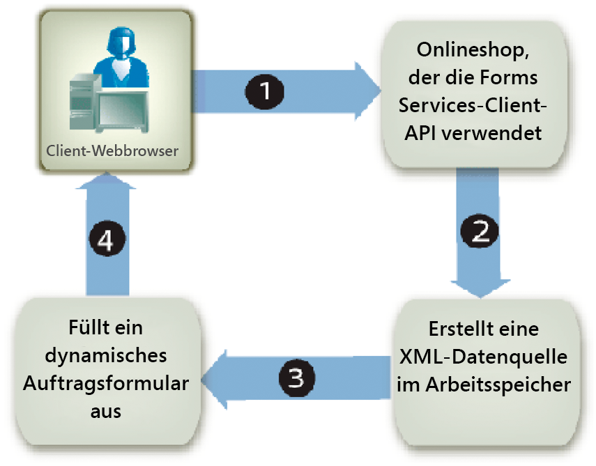

# Vorausfüllen von Forms mit flexiblen Layouts {#prepopulating-forms-with-flowable-layouts1}

## Vorausfüllen von Forms mit flexiblen Layouts {#prepopulating-forms-with-flowable-layouts2}

Beim Vorausfüllen von Formularen werden Daten für Benutzer in einem wiedergegebenen Formular angezeigt. Angenommen, ein Benutzer meldet sich auf einer Website mit einem Benutzernamen und einem Kennwort an. Bei erfolgreicher Authentifizierung fragt die Client-Anwendung eine Datenbank nach Benutzerinformationen ab. Die Daten werden mit dem Formular zusammengeführt und das Formular wird dann für den Benutzer wiedergegeben. Dadurch kann der Benutzer personalisierte Daten im Formular anzeigen.

Das Vorausfüllen eines Formulars hat die folgenden Vorteile:

* Ermöglicht dem Benutzer das Anzeigen benutzerdefinierter Daten in einem Formular.
* Verringert den Tippaufwand, den der Benutzer beim Ausfüllen eines Formulars hat.
* Stellt die Datenintegrität sicher, indem gesteuert wird, wo die Daten platziert werden.

Die folgenden beiden XML-Datenquellen können ein Formular im Voraus ausfüllen:

* Eine XDP-Datenquelle, die der XFA-Syntax entspricht (oder XFDF-Daten, um ein mit Acrobat erstelltes Formular im Voraus auszufüllen).
* Eine beliebige XML-Datenquelle, die Name/Wert-Paare enthält, die mit den Feldnamen des Formulars übereinstimmen (die Beispiele in diesem Abschnitt verwenden eine beliebige XML-Datenquelle).

Für jedes Formularfeld, das vorausgefüllt werden soll, muss ein XML-Element vorhanden sein. Der Name des XML-Elements muss mit dem Feldnamen übereinstimmen. Ein XML-Element wird ignoriert, wenn es keinem Formularfeld entspricht oder wenn der XML-Elementname nicht mit dem Feldnamen übereinstimmt. Es ist nicht erforderlich, die Reihenfolge der Anzeige der XML-Elemente einzuhalten, solange alle XML-Elemente angegeben sind.

Wenn Sie ein Formular vorab ausfüllen, das bereits Daten enthält, müssen Sie die Daten angeben, die bereits in der XML-Datenquelle angezeigt werden. Angenommen, ein Formular mit 10 Feldern enthält Daten in vier Feldern. Nehmen wir als Nächstes an, dass Sie die restlichen sechs Felder im Voraus ausfüllen möchten. In diesem Fall müssen Sie 10 XML-Elemente in der XML-Datenquelle angeben, die zum Vorausfüllen des Formulars verwendet wird. Wenn Sie nur sechs Elemente angeben, sind die ursprünglichen vier Felder leer.

Sie können beispielsweise ein Formular wie das Beispielbestätigungsformular im Voraus ausfüllen. (Siehe &quot;Bestätigungsformular&quot;in [Rendern interaktiver PDF forms](/help/forms/developing/rendering-interactive-pdf-forms.md).)

Um das Beispielbestätigungsformular im Voraus auszufüllen, müssen Sie eine XML-Datenquelle erstellen, die drei XML-Elemente enthält, die den drei Feldern im Formular entsprechen. Dieses Formular enthält die folgenden drei Felder: `FirstName`, `LastName` und `Amount`. Der erste Schritt besteht darin, eine XML-Datenquelle zu erstellen, die XML-Elemente enthält, die mit den Feldern im Formularentwurf übereinstimmen. Der nächste Schritt besteht darin, den XML-Elementen Datenwerte zuzuweisen, wie im folgenden XML-Code dargestellt.

```xml
     <Untitled>
         <FirstName>Jerry</FirstName>
         <LastName>Johnson</LastName>
         <Amount>250000</Amount>
     </Untitled>
```

Nachdem Sie das Bestätigungsformular mit dieser XML-Datenquelle ausgefüllt und dann das Formular wiedergegeben haben, werden die den XML-Elementen zugewiesenen Datenwerte angezeigt, wie im folgenden Diagramm dargestellt.


### Vorausfüllen von Formularen mit flexiblen Layouts {#prepopulating_forms_with_flowable_layouts-1}

Forms mit flexiblen Layouts ist nützlich, um Benutzern eine unbestimmte Datenmenge anzuzeigen. Da sich das Layout des Formulars automatisch an die Datenmenge anpasst, die zusammengeführt wird, müssen Sie für das Formular kein festes Layout oder keine feste Seitenanzahl vorab festlegen, wie es für ein Formular mit festem Layout erforderlich ist.

Ein Formular wird in der Regel mit Daten gefüllt, die während der Laufzeit abgerufen werden. Daher können Sie ein Formular im Voraus ausfüllen, indem Sie eine XML-Datenquelle im Arbeitsspeicher erstellen und die Daten direkt in die XML-Datenquelle im Arbeitsspeicher platzieren.

Stellen Sie sich eine webbasierte Anwendung vor, z. B. einen Online-Store. Nachdem ein Online-Käufer den Kauf von Artikeln abgeschlossen hat, werden alle gekauften Artikel in eine XML-Datenquelle im Arbeitsspeicher eingefügt, die zum Vorausfüllen eines Formulars verwendet wird. Das folgende Diagramm zeigt diesen Vorgang, der in der Tabelle nach dem Diagramm erläutert wird.



Die folgende Tabelle beschreibt die Schritte in diesem Diagramm.

<table>
 <thead>
  <tr>
   <th><p>Schritt</p></th>
   <th><p>Beschreibung</p></th>
  </tr>
 </thead>
 <tbody>
  <tr>
   <td><p>1</p></td>
   <td><p>Ein Benutzer kauft Artikel aus einem webbasierten Online-Store. </p></td>
  </tr>
  <tr>
   <td><p>2</p></td>
   <td><p>Nachdem der Benutzer den Kauf abgeschlossen hat und auf die Senden -Schaltfläche klickt, wird eine XML-Datenquelle im Arbeitsspeicher erstellt. Die gekauften Elemente und Benutzerinformationen werden in die XML-Datenquelle des Arbeitsspeichers eingefügt. </p></td>
  </tr>
  <tr>
   <td><p>3</p></td>
   <td><p>Die XML-Datenquelle dient zum Vorausfüllen eines Bestellformulars (ein Beispiel für dieses Formular finden Sie in dieser Tabelle). </p></td>
  </tr>
  <tr>
   <td><p>4</p></td>
   <td><p>Das Bestellformular wird im Client-Webbrowser wiedergegeben. </p></td>
  </tr>
 </tbody>
</table>

Das folgende Diagramm zeigt ein Beispiel für ein Bestellformular. Die Informationen in der Tabelle können an die Anzahl der Datensätze in den XML-Daten angepasst werden.


>[!NOTE]
>
>Ein Formular kann mit Daten aus anderen Quellen wie z. B. einer Unternehmensdatenbank oder externen Anwendungen vorausgefüllt werden.

### Überlegungen zum Formularentwurf {#form-design-considerations}

Forms mit flexiblen Layouts basieren auf Formularentwürfen, die in Designer erstellt werden. Ein Formularentwurf gibt einen Satz von Layout-, Darstellungs- und Datenerfassungsregeln an, einschließlich der Berechnung von Werten basierend auf der Benutzereingabe. Die Regeln werden angewendet, wenn Daten in ein Formular eingegeben werden. Felder, die einem Formular hinzugefügt werden, sind Teilformulare, die sich im Formularentwurf befinden. Im Bestellformular, das im vorherigen Diagramm dargestellt wird, ist jede Zeile beispielsweise ein Teilformular. Weitere Informationen zum Erstellen eines Formularentwurfs mit Teilformularen finden Sie unter [Erstellen eines Bestellformulars mit flexiblem Layout](https://www.adobe.com/go/learn_aemforms_qs_poformflowable_9).

### Grundlagen zu Datenuntergruppen {#understanding-data-subgroups}

Eine XML-Datenquelle dient zum Vorausfüllen von Formularen mit festen Layouts und flexiblen Layouts. Der Unterschied besteht jedoch darin, dass eine XML-Datenquelle, die ein Formular mit flexiblem Layout im Voraus ausfüllt, sich wiederholende XML-Elemente enthält, die zum Vorausfüllen von Teilformularen verwendet werden, die innerhalb des Formulars wiederholt werden. Diese sich wiederholenden XML-Elemente werden als Datenuntergruppen bezeichnet.

Eine XML-Datenquelle, mit der das im vorherigen Diagramm dargestellte Bestellformular im Voraus ausgefüllt wird, enthält vier sich wiederholende Datenuntergruppen. Jede Datenuntergruppe entspricht einem gekauften Artikel. Die gekauften Artikel sind ein Monitor, eine Schreibtischleuchte, ein Telefon und ein Adressbuch.

Die folgende XML-Datenquelle dient zum Vorausfüllen des Bestellformulars.

```xml
     <header>
         <!-- XML elements used to prepopulate non-repeating fields such as address
         <!and city
         <txtPONum>8745236985</txtPONum>
         <dtmDate>2004-02-08</dtmDate>
         <txtOrderedByCompanyName>Any Company Name</txtOrderedByCompanyName>
         <txtOrderedByAddress>555, Any Blvd.</txtOrderedByAddress>
         <txtOrderedByCity>Any City</txtOrderedByCity>
         <txtOrderedByStateProv>ST</txtOrderedByStateProv>
         <txtOrderedByZipCode>12345</txtOrderedByZipCode>
         <txtOrderedByCountry>Any Country</txtOrderedByCountry>
         <txtOrderedByPhone>(123) 456-7890</txtOrderedByPhone>
         <txtOrderedByFax>(123) 456-7899</txtOrderedByFax>
         <txtOrderedByContactName>Contact Name</txtOrderedByContactName>
         <txtDeliverToCompanyName>Any Company Name</txtDeliverToCompanyName>
         <txtDeliverToAddress>7895, Any Street</txtDeliverToAddress>
         <txtDeliverToCity>Any City</txtDeliverToCity>
         <txtDeliverToStateProv>ST</txtDeliverToStateProv>
         <txtDeliverToZipCode>12346</txtDeliverToZipCode>
         <txtDeliverToCountry>Any Country</txtDeliverToCountry>
         <txtDeliverToPhone>(123) 456-7891</txtDeliverToPhone>
         <txtDeliverToFax>(123) 456-7899</txtDeliverToFax>
         <txtDeliverToContactName>Contact Name</txtDeliverToContactName>
     </header>
     <detail>
         <!-- A data subgroup that contains information about the monitor>
         <txtPartNum>00010-100</txtPartNum>
         <txtDescription>Monitor</txtDescription>
         <numQty>1</numQty>
         <numUnitPrice>350.00</numUnitPrice>
     </detail>
     <detail>
         <!-- A data subgroup that contains information about the desk lamp>
         <txtPartNum>00010-200</txtPartNum>
         <txtDescription>Desk lamps</txtDescription>
         <numQty>3</numQty>
         <numUnitPrice>55.00</numUnitPrice>
     </detail>
     <detail>
         <!-- A data subgroup that contains information about the Phone>
             <txtPartNum>00025-275</txtPartNum>
             <txtDescription>Phone</txtDescription>
             <numQty>5</numQty>
             <numUnitPrice>85.00</numUnitPrice>
     </detail>
     <detail>
         <!-- A data subgroup that contains information about the address book>
         <txtPartNum>00300-896</txtPartNum>
         <txtDescription>Address book</txtDescription>
         <numQty>2</numQty>
         <numUnitPrice>15.00</numUnitPrice>
     </detail>
```

Beachten Sie, dass jede Datenuntergruppe vier XML-Elemente enthält, die diesen Informationen entsprechen:

* Artikelteilnummer
* Beschreibung der Elemente
* Artikelmenge
* Stückpreis

Der Name des übergeordneten XML-Elements einer Datenuntergruppe muss mit dem Namen des Teilformulars übereinstimmen, das sich im Formularentwurf befindet. Im vorherigen Diagramm sehen Sie beispielsweise, dass der Name des übergeordneten XML-Elements der Datenuntergruppe `detail` lautet. Dies entspricht dem Namen des Teilformulars, das sich im Formularentwurf befindet, auf dem das Bestellformular basiert. Wenn der Name des übergeordneten XML-Elements der Datenuntergruppe und des Teilformulars nicht übereinstimmen, wird kein serverseitiges Formular vorausgefüllt.

Jede Datenuntergruppe muss XML-Elemente enthalten, die mit den Feldnamen im Teilformular übereinstimmen. Das Teilformular `detail` im Formularentwurf enthält die folgenden Felder:

* txtPartNum
* txtDescription
* numQty
* numUnitPrice

>[!NOTE]
>
>Wenn Sie versuchen, ein Formular mit einer Datenquelle zu füllen, die sich wiederholende XML-Elemente enthält, und die `RenderAtClient`-Option auf `No` festlegen, wird nur der erste Datensatz in das Formular eingefügt. Um sicherzustellen, dass alle Datendatensätze mit dem Formular zusammengeführt werden, setzen Sie `RenderAtClient` auf `Yes`. Weitere Informationen zur Option `RenderAtClient` finden Sie unter [Rendern von Forms am Client](/help/forms/developing/rendering-forms-client.md).

>[!NOTE]
>
>Weitere Informationen zum Forms-Dienst finden Sie unter [Dienstreferenz für AEM Forms](https://www.adobe.com/go/learn_aemforms_services_63).

### Zusammenfassung der Schritte {#summary-of-steps}

Führen Sie die folgenden Aufgaben aus, um ein Formular mit flexiblem Layout im Voraus auszufüllen:

1. Projektdateien einschließen.
1. Erstellen Sie eine speicherinterne XML-Datenquelle.
1. Konvertieren Sie die XML-Datenquelle.
1. Wiedergabe eines vorausgefüllten Formulars.

**Projektdateien einschließen**

Fügen Sie die erforderlichen Dateien in Ihr Entwicklungsprojekt ein. Wenn Sie eine Clientanwendung mit Java erstellen, schließen Sie die erforderlichen JAR-Dateien ein. Wenn Sie Webdienste verwenden, stellen Sie sicher, dass Sie die Proxy-Dateien einschließen.

**Projektdateien einschließen**

Fügen Sie die erforderlichen Dateien in Ihr Entwicklungsprojekt ein. Wenn Sie eine Clientanwendung mit Java erstellen, schließen Sie die erforderlichen JAR-Dateien ein. Wenn Sie Webdienste verwenden, stellen Sie sicher, dass Sie die Proxy-Dateien einschließen.

**Erstellen einer speicherinternen XML-Datenquelle**

Sie können `org.w3c.dom`-Klassen verwenden, um eine XML-Datenquelle im Arbeitsspeicher zu erstellen und ein Formular mit flexiblem Layout im Voraus auszufüllen. Sie müssen Daten in eine XML-Datenquelle platzieren, die dem Formular entspricht. Informationen zur Beziehung zwischen einem Formular mit flexiblem Layout und der XML-Datenquelle finden Sie unter [Grundlagen zu Datenuntergruppen](#understanding-data-subgroups).

**Konvertieren der XML-Datenquelle**

Eine XML-Datenquelle im Arbeitsspeicher, die mithilfe von `org.w3c.dom`-Klassen erstellt wird, kann in ein `com.adobe.idp.Document`-Objekt konvertiert werden, bevor es zum Vorausfüllen eines Formulars verwendet werden kann. Eine XML-Datenquelle im Arbeitsspeicher kann mithilfe von Java XML Transformation-Klassen konvertiert werden.

>[!NOTE]
>
>Wenn Sie die WSDL des Forms-Dienstes zum Vorausfüllen eines Formulars verwenden, müssen Sie ein `org.w3c.dom.Document`-Objekt in ein `BLOB`-Objekt konvertieren.

**Vorausgefülltes Formular wiedergeben**

Sie rendern ein vorausgefülltes Formular wie ein anderes. Der einzige Unterschied besteht darin, dass Sie das `com.adobe.idp.Document`-Objekt verwenden, das die XML-Datenquelle enthält, um das Formular im Voraus auszufüllen.

**Siehe auch**

[Einbeziehung von AEM Forms Java-Bibliotheksdateien](/help/forms/developing/invoking-aem-forms-using-java.md#including-aem-forms-java-library-files)

[Verbindungseigenschaften festlegen](/help/forms/developing/invoking-aem-forms-using-java.md#setting-connection-properties)

[Schnellstarts zur Forms Service-API](/help/forms/developing/forms-service-api-quick-starts.md#forms-service-api-quick-starts)

[Rendern interaktiver PDF forms](/help/forms/developing/rendering-interactive-pdf-forms.md)

[Erstellen von Webanwendungen, die Forms rendern](/help/forms/developing/creating-web-applications-renders-forms.md)

### Vorausfüllen von Formularen mit der Java-API {#prepopulating-forms-using-the-java-api}

So füllen Sie ein Formular mit einem flexiblen Layout mithilfe der Forms API (Java) im Voraus aus:

1. Projektdateien einschließen

   Schließen Sie Client-JAR-Dateien wie adobe-forms-client.jar in den Klassenpfad Ihres Java-Projekts ein. Weitere Informationen über den Speicherort dieser Dateien finden Sie unter [Einbeziehung von AEM Forms Java-Bibliotheksdateien](/help/forms/developing/invoking-aem-forms-using-java.md#including-aem-forms-java-library-files).

1. Erstellen einer speicherinternen XML-Datenquelle

   * Erstellen Sie ein Java `DocumentBuilderFactory` -Objekt, indem Sie die `DocumentBuilderFactory` -Klasse aufrufen.&quot;`newInstance`-Methode.
   * Erstellen Sie ein Java `DocumentBuilder` -Objekt, indem Sie die `newDocumentBuilder` -Methode des Objekts `DocumentBuilderFactory` aufrufen.
   * Rufen Sie die `newDocument`-Methode des `DocumentBuilder`-Objekts auf, um ein `org.w3c.dom.Document`-Objekt zu instanziieren.
   * Erstellen Sie das Stammelement der XML-Datenquelle, indem Sie die `createElement` -Methode des Objekts `org.w3c.dom.Document` aufrufen. Dadurch wird ein `Element` -Objekt erstellt, das das Stammelement darstellt. Übergeben Sie einen string -Wert, der den Namen des Elements darstellt, an die `createElement` -Methode. Wandeln Sie den Rückgabewert in `Element` um. Hängen Sie anschließend das Stammelement an das Dokument an, indem Sie die `appendChild` -Methode des Objekts `Document` aufrufen und das Stammelementobjekt als Argument übergeben. Die folgenden Codezeilen zeigen diese Anwendungslogik:

      ` Element root = (Element)document.createElement("transaction");  document.appendChild(root);`

   * Erstellen Sie das Header-Element der XML-Datenquelle, indem Sie die `createElement`-Methode des Objekts `Document` aufrufen. Übergeben Sie einen string -Wert, der den Namen des Elements darstellt, an die `createElement` -Methode. Wandeln Sie den Rückgabewert in `Element` um. Hängen Sie anschließend das Kopfzeilenelement an das Stammelement an, indem Sie die `appendChild` -Methode des Objekts `root` aufrufen und das Kopfzeilenelementobjekt als Argument übergeben. Die XML-Elemente, die an das Header-Element angehängt werden, entsprechen dem statischen Teil des Formulars. Die folgenden Codezeilen zeigen diese Anwendungslogik:

      ` Element header = (Element)document.createElement("header");  root.appendChild(header);`

   * Erstellen Sie ein untergeordnetes Element, das zum Kopfzeilenelement gehört, indem Sie die `createElement` -Methode des Objekts `Document` aufrufen und einen Zeichenfolgenwert übergeben, der den Namen des Elements darstellt. Wandeln Sie den Rückgabewert in `Element` um. Legen Sie anschließend einen Wert für das untergeordnete Element fest, indem Sie dessen `appendChild`-Methode aufrufen und die `Document`-Methode des Objekts `createTextNode` als Argument übergeben. Geben Sie einen Zeichenfolgenwert an, der als Wert des untergeordneten Elements angezeigt wird. Hängen Sie abschließend das untergeordnete Element an das Kopfzeilenelement an, indem Sie die `appendChild` -Methode des Kopfzeilenelements aufrufen und das untergeordnete Elementobjekt als Argument übergeben. Die folgenden Codezeilen zeigen diese Anwendungslogik:

      ` Element poNum= (Element)document.createElement("txtPONum");  poNum.appendChild(document.createTextNode("8745236985"));  header.appendChild(LastName);`


   * Fügen Sie alle verbleibenden Elemente zum Kopfzeilenelement hinzu, indem Sie den letzten Unterschritt für jedes Feld wiederholen, das im statischen Teil des Formulars erscheint (im XML-Datenquellendiagramm werden diese Felder in Abschnitt A angezeigt. (Siehe [Grundlagen zu Datenuntergruppen](#understanding-data-subgroups).)
   * Erstellen Sie das Detailelement der XML-Datenquelle, indem Sie die `createElement` -Methode des Objekts `Document` aufrufen. Übergeben Sie einen string -Wert, der den Namen des Elements darstellt, an die `createElement` -Methode. Wandeln Sie den Rückgabewert in `Element` um. Hängen Sie als Nächstes das Detailelement an das Stammelement an, indem Sie die `appendChild` -Methode des Objekts `root` aufrufen und das Detailelementobjekt als Argument übergeben. Die XML-Elemente, die an das Detailelement angehängt werden, entsprechen dem dynamischen Teil des Formulars. Die folgenden Codezeilen zeigen diese Anwendungslogik:

      ` Element detail = (Element)document.createElement("detail");  root.appendChild(detail);`

   * Erstellen Sie ein untergeordnetes Element, das zum Detailelement gehört, indem Sie die `createElement` -Methode des Objekts `Document` aufrufen und einen Zeichenfolgenwert übergeben, der den Namen des Elements darstellt. Wandeln Sie den Rückgabewert in `Element` um. Legen Sie anschließend einen Wert für das untergeordnete Element fest, indem Sie dessen `appendChild`-Methode aufrufen und die `Document`-Methode des Objekts `createTextNode` als Argument übergeben. Geben Sie einen Zeichenfolgenwert an, der als Wert des untergeordneten Elements angezeigt wird. Hängen Sie abschließend das untergeordnete Element an das Detailelement an, indem Sie die `appendChild`-Methode des Detailelements aufrufen und das untergeordnete Elementobjekt als Argument übergeben. Die folgenden Codezeilen zeigen diese Anwendungslogik:

      ` Element txtPartNum = (Element)document.createElement("txtPartNum");  txtPartNum.appendChild(document.createTextNode("00010-100"));  detail.appendChild(txtPartNum);`

   * Wiederholen Sie den letzten Unterschritt für alle XML-Elemente, die an das Detailelement angehängt werden sollen. Um die XML-Datenquelle, die zum Ausfüllen des Bestellformulars verwendet wird, ordnungsgemäß zu erstellen, müssen Sie die folgenden XML-Elemente an das Detailelement anhängen: `txtDescription`, `numQty` und `numUnitPrice`.
   * Wiederholen Sie die letzten beiden Unterschritte für alle Datenelemente, die zum Vorausfüllen des Formulars verwendet werden.

1. Konvertieren der XML-Datenquelle

   * Erstellen Sie ein `javax.xml.transform.Transformer` -Objekt, indem Sie die statische `newInstance` -Methode des `javax.xml.transform.Transformer` -Objekts aufrufen.
   * Erstellen Sie ein `Transformer` -Objekt, indem Sie die `newTransformer` -Methode des Objekts `TransformerFactory` aufrufen.
   * Erstellen Sie ein Objekt `ByteArrayOutputStream`, indem Sie den Konstruktor verwenden.
   * Erstellen Sie ein `javax.xml.transform.dom.DOMSource`-Objekt, indem Sie dessen Konstruktor verwenden und das `org.w3c.dom.Document`-Objekt übergeben, das in Schritt 1 erstellt wurde.
   * Erstellen Sie ein `javax.xml.transform.dom.DOMSource`-Objekt, indem Sie seinen Konstruktor verwenden und das `ByteArrayOutputStream`-Objekt übergeben.
   * Füllen Sie das Java `ByteArrayOutputStream`-Objekt, indem Sie die `javax.xml.transform.Transformer` -Methode des Objekts `transform` aufrufen und die `javax.xml.transform.dom.DOMSource` - und `javax.xml.transform.stream.StreamResult` -Objekte übergeben.
   * Erstellen Sie ein Byte-Array und weisen Sie die Größe des `ByteArrayOutputStream`-Objekts dem Byte-Array zu.
   * Füllen Sie das Byte-Array, indem Sie die `toByteArray` -Methode des Objekts `ByteArrayOutputStream` aufrufen.
   * Erstellen Sie ein `com.adobe.idp.Document` -Objekt, indem Sie dessen Konstruktor verwenden und das Byte-Array übergeben.

1. Vorausgefülltes Formular wiedergeben

   Rufen Sie die `renderPDFForm` -Methode des Objekts `FormsServiceClient` auf und übergeben Sie die folgenden Werte:

   * Ein string -Wert, der den Namen des Formularentwurfs einschließlich der Dateinamenerweiterung angibt.
   * Ein `com.adobe.idp.Document` -Objekt, das Daten enthält, die mit dem Formular zusammengeführt werden sollen. Stellen Sie sicher, dass Sie das `com.adobe.idp.Document`-Objekt verwenden, das in den Schritten 1 und 2 erstellt wurde.
   * Ein `PDFFormRenderSpec` -Objekt, das Laufzeitoptionen speichert.
   * Ein `URLSpec` -Objekt, das URI-Werte enthält, die für den Forms-Dienst erforderlich sind.
   * Ein `java.util.HashMap` -Objekt, das Dateianlagen speichert. Dies ist ein optionaler Parameter. Sie können `null` angeben, wenn Sie keine Dateien an das Formular anhängen möchten.

   Die `renderPDFForm`-Methode gibt ein `FormsResult`-Objekt zurück, das einen Formulardatenstream enthält, der in den Client-Webbrowser geschrieben werden muss.

   * Erstellen Sie ein `javax.servlet.ServletOutputStream`-Objekt, das zum Senden eines Formulardatenstreams an den Client-Webbrowser verwendet wird.
   * Erstellen Sie ein `com.adobe.idp.Document` -Objekt, indem Sie die `FormsResult` -Methode des Objekts &quot;s `getOutputContent` aufrufen.
   * Erstellen Sie ein `java.io.InputStream` -Objekt, indem Sie die `getInputStream` -Methode des Objekts `com.adobe.idp.Document` aufrufen.
   * Erstellen Sie ein Byte-Array, das mit dem Formulardatenstream gefüllt wird, indem Sie die `read` -Methode des Objekts `InputStream` aufrufen und das Byte-Array als Argument übergeben.
   * Rufen Sie die `write` -Methode des Objekts `javax.servlet.ServletOutputStream` auf, um den Formulardatenstream an den Client-Webbrowser zu senden. Übergeben Sie das Byte-Array an die `write`-Methode.


**Siehe auch**

[Schnellstart (SOAP-Modus): Vorausfüllen von Forms mit flexiblen Layouts mithilfe der Java-API](/help/forms/developing/forms-service-api-quick-starts.md#quick-start-soap-mode-prepopulating-forms-with-flowable-layouts-using-the-java-api)

[Einbeziehung von AEM Forms Java-Bibliotheksdateien](/help/forms/developing/invoking-aem-forms-using-java.md#including-aem-forms-java-library-files)

[Verbindungseigenschaften festlegen](/help/forms/developing/invoking-aem-forms-using-java.md#setting-connection-properties)

### Vorausfüllen von Formularen mit der Webdienst-API {#prepopulating-forms-using-the-web-service-api}

So füllen Sie ein Formular mit einem flexiblen Layout mithilfe der Forms-API (Webdienst) im Voraus aus:

1. Projektdateien einschließen

   * Erstellen Sie Java-Proxyklassen, die die Forms-Dienst-WSDL verwenden. (Siehe [Erstellen von Java-Proxy-Klassen mit Apache Axis](/help/forms/developing/invoking-aem-forms-using-web.md#creating-java-proxy-classes-using-apache-axis).)
   * Schließen Sie die Java-Proxy-Klassen in Ihren Klassenpfad ein.

1. Erstellen einer speicherinternen XML-Datenquelle

   * Erstellen Sie ein Java `DocumentBuilderFactory` -Objekt, indem Sie die `DocumentBuilderFactory` -Klasse aufrufen.&quot;`newInstance`-Methode.
   * Erstellen Sie ein Java `DocumentBuilder` -Objekt, indem Sie die `newDocumentBuilder` -Methode des Objekts `DocumentBuilderFactory` aufrufen.
   * Rufen Sie die `newDocument`-Methode des `DocumentBuilder`-Objekts auf, um ein `org.w3c.dom.Document`-Objekt zu instanziieren.
   * Erstellen Sie das Stammelement der XML-Datenquelle, indem Sie die `createElement` -Methode des Objekts `org.w3c.dom.Document` aufrufen. Dadurch wird ein `Element` -Objekt erstellt, das das Stammelement darstellt. Übergeben Sie einen string -Wert, der den Namen des Elements darstellt, an die `createElement` -Methode. Wandeln Sie den Rückgabewert in `Element` um. Hängen Sie anschließend das Stammelement an das Dokument an, indem Sie die `appendChild` -Methode des Objekts `Document` aufrufen und das Stammelementobjekt als Argument übergeben. Die folgenden Codezeilen zeigen diese Anwendungslogik:

      ` Element root = (Element)document.createElement("transaction");  document.appendChild(root);`

   * Erstellen Sie das Header-Element der XML-Datenquelle, indem Sie die `createElement`-Methode des Objekts `Document` aufrufen. Übergeben Sie einen string -Wert, der den Namen des Elements darstellt, an die `createElement` -Methode. Wandeln Sie den Rückgabewert in `Element` um. Hängen Sie anschließend das Kopfzeilenelement an das Stammelement an, indem Sie die `appendChild` -Methode des Objekts `root` aufrufen und das Kopfzeilenelementobjekt als Argument übergeben. Die XML-Elemente, die an das Header-Element angehängt werden, entsprechen dem statischen Teil des Formulars. Die folgenden Codezeilen zeigen diese Anwendungslogik:

      ` Element header = (Element)document.createElement("header");  root.appendChild(header);`

   * Erstellen Sie ein untergeordnetes Element, das zum Kopfzeilenelement gehört, indem Sie die `createElement` -Methode des Objekts `Document` aufrufen und einen Zeichenfolgenwert übergeben, der den Namen des Elements darstellt. Wandeln Sie den Rückgabewert in `Element` um. Legen Sie anschließend einen Wert für das untergeordnete Element fest, indem Sie dessen `appendChild`-Methode aufrufen und die `Document`-Methode des Objekts `createTextNode` als Argument übergeben. Geben Sie einen Zeichenfolgenwert an, der als Wert des untergeordneten Elements angezeigt wird. Hängen Sie abschließend das untergeordnete Element an das Kopfzeilenelement an, indem Sie die `appendChild` -Methode des Kopfzeilenelements aufrufen und das untergeordnete Elementobjekt als Argument übergeben. Die folgenden Codezeilen zeigen diese Anwendungslogik:

      ` Element poNum= (Element)document.createElement("txtPONum");  poNum.appendChild(document.createTextNode("8745236985"));  header.appendChild(LastName);`

   * Fügen Sie alle verbleibenden Elemente zum Kopfzeilenelement hinzu, indem Sie den letzten Unterschritt für jedes Feld wiederholen, das im statischen Teil des Formulars erscheint (im XML-Datenquellendiagramm werden diese Felder in Abschnitt A angezeigt. (Siehe [Grundlagen zu Datenuntergruppen](#understanding-data-subgroups).)
   * Erstellen Sie das Detailelement der XML-Datenquelle, indem Sie die `createElement` -Methode des Objekts `Document` aufrufen. Übergeben Sie einen string -Wert, der den Namen des Elements darstellt, an die `createElement` -Methode. Wandeln Sie den Rückgabewert in `Element` um. Hängen Sie als Nächstes das Detailelement an das Stammelement an, indem Sie die `appendChild` -Methode des Objekts `root` aufrufen und das Detailelementobjekt als Argument übergeben. Die XML-Elemente, die an das Detailelement angehängt werden, entsprechen dem dynamischen Teil des Formulars. Die folgenden Codezeilen zeigen diese Anwendungslogik:

      ` Element detail = (Element)document.createElement("detail");  root.appendChild(detail);`

   * Erstellen Sie ein untergeordnetes Element, das zum Detailelement gehört, indem Sie die `createElement` -Methode des Objekts `Document` aufrufen und einen Zeichenfolgenwert übergeben, der den Namen des Elements darstellt. Wandeln Sie den Rückgabewert in `Element` um. Legen Sie anschließend einen Wert für das untergeordnete Element fest, indem Sie dessen `appendChild`-Methode aufrufen und die `Document`-Methode des Objekts `createTextNode` als Argument übergeben. Geben Sie einen Zeichenfolgenwert an, der als Wert des untergeordneten Elements angezeigt wird. Hängen Sie abschließend das untergeordnete Element an das Detailelement an, indem Sie die `appendChild`-Methode des Detailelements aufrufen und das untergeordnete Elementobjekt als Argument übergeben. Die folgenden Codezeilen zeigen diese Anwendungslogik:

      ` Element txtPartNum = (Element)document.createElement("txtPartNum");  txtPartNum.appendChild(document.createTextNode("00010-100"));  detail.appendChild(txtPartNum);`

   * Wiederholen Sie den letzten Unterschritt für alle XML-Elemente, die an das Detailelement angehängt werden sollen. Um die XML-Datenquelle, die zum Ausfüllen des Bestellformulars verwendet wird, ordnungsgemäß zu erstellen, müssen Sie die folgenden XML-Elemente an das Detailelement anhängen: `txtDescription`, `numQty` und `numUnitPrice`.
   * Wiederholen Sie die letzten beiden Unterschritte für alle Datenelemente, die zum Vorausfüllen des Formulars verwendet werden.

1. Konvertieren der XML-Datenquelle

   * Erstellen Sie ein `javax.xml.transform.Transformer` -Objekt, indem Sie die statische `newInstance` -Methode des `javax.xml.transform.Transformer` -Objekts aufrufen.
   * Erstellen Sie ein `Transformer` -Objekt, indem Sie die `newTransformer` -Methode des Objekts `TransformerFactory` aufrufen.
   * Erstellen Sie ein Objekt `ByteArrayOutputStream`, indem Sie den Konstruktor verwenden.
   * Erstellen Sie ein `javax.xml.transform.dom.DOMSource`-Objekt, indem Sie dessen Konstruktor verwenden und das `org.w3c.dom.Document`-Objekt übergeben, das in Schritt 1 erstellt wurde.
   * Erstellen Sie ein `javax.xml.transform.dom.DOMSource`-Objekt, indem Sie seinen Konstruktor verwenden und das `ByteArrayOutputStream`-Objekt übergeben.
   * Füllen Sie das Java `ByteArrayOutputStream`-Objekt, indem Sie die `javax.xml.transform.Transformer` -Methode des Objekts `transform` aufrufen und die `javax.xml.transform.dom.DOMSource` - und `javax.xml.transform.stream.StreamResult` -Objekte übergeben.
   * Erstellen Sie ein Byte-Array und weisen Sie die Größe des `ByteArrayOutputStream`-Objekts dem Byte-Array zu.
   * Füllen Sie das Byte-Array, indem Sie die `toByteArray` -Methode des Objekts `ByteArrayOutputStream` aufrufen.
   * Erstellen Sie ein `BLOB` -Objekt, indem Sie seinen Konstruktor verwenden, seine `setBinaryData` -Methode aufrufen und das Byte-Array übergeben.

1. Vorausgefülltes Formular wiedergeben

   Rufen Sie die `renderPDFForm` -Methode des Objekts `FormsService` auf und übergeben Sie die folgenden Werte:

   * Ein string -Wert, der den Namen des Formularentwurfs einschließlich der Dateinamenerweiterung angibt.
   * Ein `BLOB` -Objekt, das Daten enthält, die mit dem Formular zusammengeführt werden sollen. Stellen Sie sicher, dass Sie das `BLOB`-Objekt verwenden, das in den Schritten 1 und 2 erstellt wurde.
   * Ein `PDFFormRenderSpecc` -Objekt, das Laufzeitoptionen speichert. Weitere Informationen finden Sie unter [AEM Forms API Reference](https://www.adobe.com/go/learn_aemforms_javadocs_63_en).
   * Ein `URLSpec` -Objekt, das URI-Werte enthält, die für den Forms-Dienst erforderlich sind.
   * Ein `java.util.HashMap` -Objekt, das Dateianlagen speichert. Dies ist ein optionaler Parameter. Sie können `null` angeben, wenn Sie keine Dateien an das Formular anhängen möchten.
   * Ein leeres `com.adobe.idp.services.holders.BLOBHolder` -Objekt, das von der -Methode ausgefüllt wird. Damit wird das wiedergegebene PDF-Formular gespeichert.
   * Ein leeres `javax.xml.rpc.holders.LongHolder` -Objekt, das von der -Methode ausgefüllt wird. (Dieses Argument speichert die Anzahl der Seiten im Formular).
   * Ein leeres `javax.xml.rpc.holders.StringHolder` -Objekt, das von der -Methode ausgefüllt wird. (Dieses Argument speichert den Gebietsschemawert).
   * Ein leeres `com.adobe.idp.services.holders.FormsResultHolder` -Objekt, das die Ergebnisse dieses Vorgangs enthält.

   Die `renderPDFForm`-Methode füllt das `com.adobe.idp.services.holders.FormsResultHolder`-Objekt, das als letzter Argumentwert übergeben wird, mit einem Formulardatenstream, der in den Client-Webbrowser geschrieben werden muss.

   * Erstellen Sie ein `FormResult` -Objekt, indem Sie den Wert des `com.adobe.idp.services.holders.FormsResultHolder` -Datenelements des Objekts `value` abrufen.
   * Erstellen Sie ein `BLOB`-Objekt, das Formulardaten enthält, indem Sie die `getOutputContent` -Methode des Objekts `FormsResult` aufrufen.
   * Rufen Sie den Inhaltstyp des Objekts `BLOB` ab, indem Sie dessen Methode `getContentType` aufrufen.
   * Legen Sie den Inhaltstyp des Objekts `javax.servlet.http.HttpServletResponse` fest, indem Sie seine `setContentType`-Methode aufrufen und den Inhaltstyp des Objekts `BLOB` übergeben.
   * Erstellen Sie ein `javax.servlet.ServletOutputStream` -Objekt, das zum Schreiben des Formulardatenstreams in den Client-Webbrowser durch Aufrufen der `javax.servlet.http.HttpServletResponse` -Methode des Objekts `getOutputStream` verwendet wird.
   * Erstellen Sie ein Byte-Array und füllen Sie es durch Aufrufen der `getBinaryData`-Methode des Objekts `BLOB`. Diese Aufgabe weist den Inhalt des Objekts `FormsResult` dem Byte-Array zu.
   * Rufen Sie die `write` -Methode des Objekts `javax.servlet.http.HttpServletResponse` auf, um den Formulardatenstream an den Client-Webbrowser zu senden. Übergeben Sie das Byte-Array an die `write`-Methode.

   >[!NOTE]
   >
   >Die `renderPDFForm`-Methode füllt das `com.adobe.idp.services.holders.FormsResultHolder`-Objekt, das als letzter Argumentwert übergeben wird, mit einem Formulardatenstream, der in den Client-Webbrowser geschrieben werden muss.

**Siehe auch**

[Aufrufen von AEM Forms mit der Base64-Kodierung](/help/forms/developing/invoking-aem-forms-using-web.md#invoking-aem-forms-using-base64-encoding)
