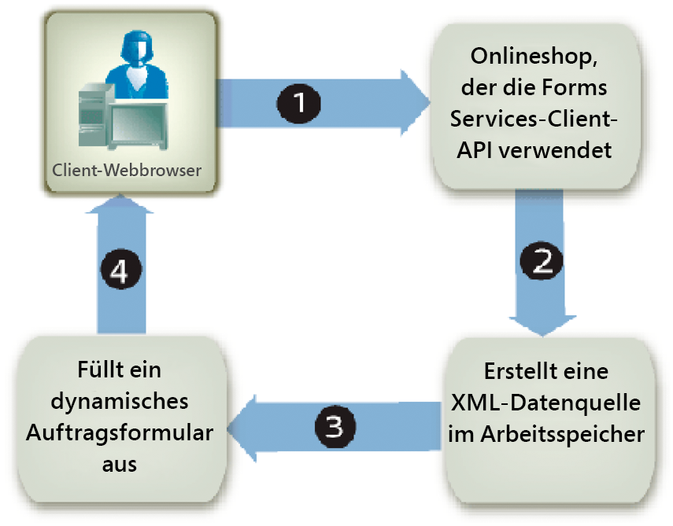
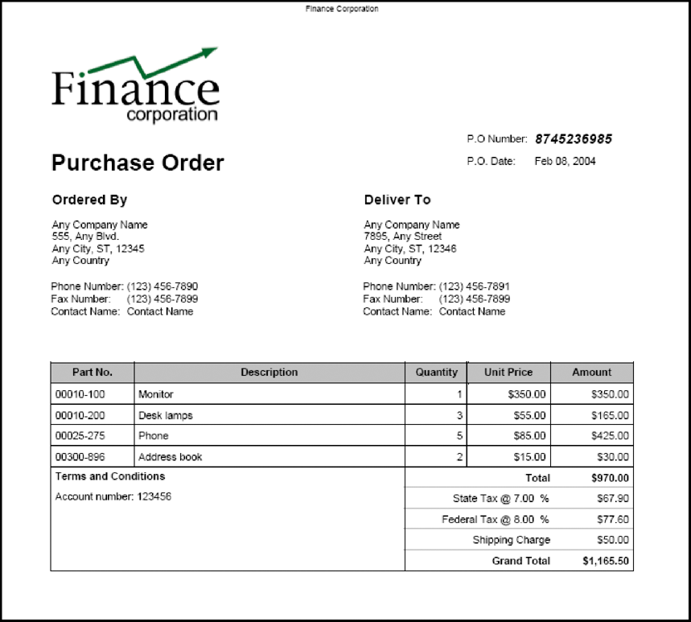

# Vorausfüllen von Formularen mit flexiblen Layouts {#prepopulating-forms-with-flowable-layouts1}

## Vorausfüllen von Formularen mit flexiblen Layouts {#prepopulating-forms-with-flowable-layouts2}

Beim Vorausfüllen von Formularen werden Daten für Benutzer in einem gerenderten Formular angezeigt. Angenommen, ein Benutzer meldet sich auf einer Website mit einem Benutzernamen und einem Kennwort an. Bei erfolgreicher Authentifizierung fragt die Client-Anwendung eine Datenbank nach Benutzerinformationen ab. Die Daten werden mit dem Formular zusammengeführt und das Formular wird dann für den Benutzer gerendert. Dadurch kann der Benutzer personalisierte Daten im Formular ansehen.

Das Vorausfüllen von Formularen hat die folgenden Vorteile:

* Benutzer können benutzerdefinierte Daten in einem Formular anzeigen.
* Der manuelle Eingabeaufwand beim Ausfüllen des Formulars verringert sich.
* Die Datenintegrität wird sichergestellt, da die Platzierung der Daten gesteuert wird.

Formulare können mit den folgenden beiden XML-Datenquellen im Vorhinein gefüllt werden:

* Eine XDP-Datenquelle, die im XML-Format vorliegt und der XFA-Syntax entspricht (oder XFDF-Daten, um ein mit Acrobat erstelltes Formular im Vorhinein auszufüllen).
* Eine beliebige XML-Datenquelle, die Name/Wert-Paare enthält, die den Feldnamen des Formulars entsprechen (in den Beispielen in diesem Abschnitt wird eine beliebige XML-Datenquelle verwendet).

Für jedes Formularfeld, das vorab ausgefüllt werden soll, muss ein XML-Element vorhanden sein. Der Name des XML-Elements muss mit dem Feldnamen übereinstimmen. Ein XML-Element wird ignoriert, wenn es keinem Formularfeld entspricht oder wenn der XML-Elementname nicht mit dem Feldnamen übereinstimmt. Es ist nicht erforderlich, die Reihenfolge der Anzeige der XML-Elemente einzuhalten, solange alle XML-Elemente angegeben sind.

Wenn Sie ein Formular vorab ausfüllen, das bereits Daten enthält, müssen Sie die Daten angeben, die bereits in der XML-Datenquelle angezeigt werden. Angenommen, ein Formular mit 10 Feldern enthält in vier Feldern Daten. Nehmen wir weiter an, dass Sie die restlichen sechs Felder vorab ausfüllen möchten. In diesem Fall müssen Sie in der XML-Datenquelle, die zum Vorausfüllen des Formulars verwendet wird, 10 XML-Elemente angeben. Wenn Sie nur sechs Elemente angeben, sind die ursprünglichen vier Felder leer.

Sie können beispielsweise ein Formular wie das Beispielbestätigungsformular im Vorhinein ausfüllen. (Siehe „Bestätigungsformular“ in [Rendern interaktiver PDF-Formulare](/help/forms/developing/rendering-interactive-pdf-forms.md).)

Um das Beispielbestätigungsformular im Voraus auszufüllen, müssen Sie eine XML-Datenquelle mit drei XML-Elementen erstellen, die den drei Feldern im Formular entsprechen. Dieses Formular enthält die folgenden drei Felder: `FirstName`, `LastName` und `Amount`. Der erste Schritt besteht in der Erstellung einer XML-Datenquelle, die XML-Elemente enthält, die den Feldern im Formularentwurf entsprechen. Der nächste Schritt besteht darin, den XML-Elementen Datenwerte zuzuweisen, wie im folgenden XML-Code dargestellt.

```xml
     <Untitled>
         <FirstName>Jerry</FirstName>
         <LastName>Johnson</LastName>
         <Amount>250000</Amount>
     </Untitled>
```

Nachdem Sie das Bestätigungsformular mit dieser XML-Datenquelle vorab ausgefüllt und es gerendert haben, werden die den XML-Elementen zugewiesenen Datenwerte angezeigt, wie im folgenden Diagramm dargestellt.


### Vorausfüllen von Formularen mit flexiblen Layouts {#prepopulating_forms_with_flowable_layouts-1}

Formulare mit flexiblen Layouts sind nützlich, um Benutzern eine unbestimmte Datenmenge anzuzeigen. Da sich das Layout des Formulars automatisch an die Datenmenge anpasst, die zusammengeführt wird, müssen Sie für das Formular kein festes Layout oder keine feste Seitenanzahl vorab festlegen, wie es für ein Formular mit festem Layout erforderlich ist.

Formulare werden in der Regel mit Daten gefüllt, die während der Laufzeit abgerufen werden. Daher können Sie Formulare im Voraus ausfüllen, indem Sie eine XML-Datenquelle im Arbeitsspeicher erstellen und die Daten direkt in die XML-Datenquelle im Arbeitsspeicher einfügen.

Stellen Sie sich eine web-basierte Applikation vor, z. B. einen Online-Store. Nachdem ein Online-Käufer den Kauf von Artikeln abgeschlossen hat, werden alle gekauften Artikel in eine XML-Datenquelle im Arbeitsspeicher eingefügt, die zum Vorausfüllen eines Formulars verwendet wird. Das folgende Diagramm zeigt diesen Vorgang, der in der Tabelle nach dem Diagramm erläutert wird.



Die folgende Tabelle beschreibt die Schritte in diesem Diagramm.

<table>
 <thead>
  <tr>
   <th><p>Schritt</p></th>
   <th><p>Beschreibung</p></th>
  </tr>
 </thead>
 <tbody>
  <tr>
   <td><p>1</p></td>
   <td><p>Ein Benutzer kauft Artikel in einem web-basierten Online-Store. </p></td>
  </tr>
  <tr>
   <td><p>2</p></td>
   <td><p>Nachdem der Benutzer den Kauf abgeschlossen und auf die Schaltfläche „Senden“ geklickt hat, wird eine XML-Datenquelle im Arbeitsspeicher erstellt. Die Informationen über die gekauften Artikel und die Benutzerinformationen werden in die XML-Datenquelle im Arbeitsspeicher eingefügt. </p></td>
  </tr>
  <tr>
   <td><p>3</p></td>
   <td><p>Die XML-Datenquelle dient zum Vorausfüllen eines Bestellformulars (ein Beispiel für dieses Formular finden Sie in dieser Tabelle). </p></td>
  </tr>
  <tr>
   <td><p>4</p></td>
   <td><p>Das Bestellformular wird im Client-Webbrowser gerendert. </p></td>
  </tr>
 </tbody>
</table>

Das folgende Diagramm zeigt ein Beispielbestellformular. Die Informationen in der Tabelle können an die Anzahl der Einträge in den XML-Daten angepasst werden.



>[!NOTE]
>
>Formulare können mit Daten aus anderen Quellen, wie z. B. einer Unternehmensdatenbank oder externen Programmen, vorab ausgefüllt werden.

### Überlegungen zum Formular-Design {#form-design-considerations}

Forms mit flexiblen Layouts basieren auf Formular-Designs, die in Designer erstellt werden. Ein Formular-Design legt einen Satz von Layout-, Darstellungs- und Datenerfassungsregeln fest, einschließlich der Berechnung von Werten basierend auf der Benutzereingabe. Die Regeln werden angewendet, wenn Daten in ein Formular eingegeben werden. Felder, die einem Formular hinzugefügt werden, sind Teilformulare, die sich im Formular-Design befinden. In dem im vorherigen Diagramm gezeigten Bestellformular zum Beispiel ist jede Zeile ein Teilformular. Informationen zum Erstellen eines Formular-Designs mit Teilformularen finden Sie unter [Bestellformular mit flexiblem Layout](https://www.adobe.com/go/learn_aemforms_qs_poformflowable_9_de).

### Grundlagen zu Datenuntergruppen {#understanding-data-subgroups}

Eine XML-Datenquelle dient zum Vorausfüllen von Formularen mit festen Layouts und flexiblen Layouts. Der Unterschied besteht jedoch darin, dass eine XML-Datenquelle, die ein Formular mit einem flexiblen Layout vorausfüllt, sich wiederholende XML-Elemente enthält. Diese werden zum Vorausfüllen von Teilformularen verwendet, die innerhalb des Formulars wiederholt werden. Die sich wiederholenden XML-Elemente werden als Datenuntergruppen bezeichnet.

Eine XML-Datenquelle, mit der das im vorherigen Diagramm dargestellte Bestellformular vorausgefüllt wird, enthält vier sich wiederholende Datenuntergruppen. Jede Datenuntergruppe entspricht einem gekauften Artikel. Die gekauften Artikel sind ein Monitor, eine Schreibtischleuchte, ein Telefon und ein Adressbuch.

Die folgende XML-Datenquelle dient zum Vorausfüllen des Bestellformulars.

```xml
     <header>
         <!-- XML elements used to prepopulate non-repeating fields such as address
         <!and city
         <txtPONum>8745236985</txtPONum>
         <dtmDate>2004-02-08</dtmDate>
         <txtOrderedByCompanyName>Any Company Name</txtOrderedByCompanyName>
         <txtOrderedByAddress>555, Any Blvd.</txtOrderedByAddress>
         <txtOrderedByCity>Any City</txtOrderedByCity>
         <txtOrderedByStateProv>ST</txtOrderedByStateProv>
         <txtOrderedByZipCode>12345</txtOrderedByZipCode>
         <txtOrderedByCountry>Any Country</txtOrderedByCountry>
         <txtOrderedByPhone>(123) 456-7890</txtOrderedByPhone>
         <txtOrderedByFax>(123) 456-7899</txtOrderedByFax>
         <txtOrderedByContactName>Contact Name</txtOrderedByContactName>
         <txtDeliverToCompanyName>Any Company Name</txtDeliverToCompanyName>
         <txtDeliverToAddress>7895, Any Street</txtDeliverToAddress>
         <txtDeliverToCity>Any City</txtDeliverToCity>
         <txtDeliverToStateProv>ST</txtDeliverToStateProv>
         <txtDeliverToZipCode>12346</txtDeliverToZipCode>
         <txtDeliverToCountry>Any Country</txtDeliverToCountry>
         <txtDeliverToPhone>(123) 456-7891</txtDeliverToPhone>
         <txtDeliverToFax>(123) 456-7899</txtDeliverToFax>
         <txtDeliverToContactName>Contact Name</txtDeliverToContactName>
     </header>
     <detail>
         <!-- A data subgroup that contains information about the monitor>
         <txtPartNum>00010-100</txtPartNum>
         <txtDescription>Monitor</txtDescription>
         <numQty>1</numQty>
         <numUnitPrice>350.00</numUnitPrice>
     </detail>
     <detail>
         <!-- A data subgroup that contains information about the desk lamp>
         <txtPartNum>00010-200</txtPartNum>
         <txtDescription>Desk lamps</txtDescription>
         <numQty>3</numQty>
         <numUnitPrice>55.00</numUnitPrice>
     </detail>
     <detail>
         <!-- A data subgroup that contains information about the Phone>
             <txtPartNum>00025-275</txtPartNum>
             <txtDescription>Phone</txtDescription>
             <numQty>5</numQty>
             <numUnitPrice>85.00</numUnitPrice>
     </detail>
     <detail>
         <!-- A data subgroup that contains information about the address book>
         <txtPartNum>00300-896</txtPartNum>
         <txtDescription>Address book</txtDescription>
         <numQty>2</numQty>
         <numUnitPrice>15.00</numUnitPrice>
     </detail>
```

Beachten Sie, dass jede Datenuntergruppe vier XML-Elemente enthält, die diesen Informationen entsprechen:

* Artikelteilnummer
* Artikelbeschreibung
* Artikelmenge
* Stückpreis

Der Name des übergeordneten XML-Elements einer Datenuntergruppe muss mit dem Namen des Teilformulars übereinstimmen, das sich im Formularentwurf befindet. Beachten Sie beispielsweise im vorherigen Diagramm, dass der Name des übergeordneten XML-Elements der Datenuntergruppe `detail` lautet. Dies entspricht dem Namen des Teilformulars, das sich im Formularentwurf befindet, auf dem das Bestellformular basiert. Wenn der Name des übergeordneten XML-Elements der Datenuntergruppe und des Teilformulars nicht übereinstimmen, wird ein Server-seitiges Formular nicht vorausgefüllt.

Jede Datenuntergruppe muss XML-Elemente enthalten, die mit den Feldnamen im Teilformular übereinstimmen. Das Teilformular `detail` im Formularentwurf enthält die folgenden Felder:

* txtPartNum
* txtDescription
* numQty
* numUnitPrice

>[!NOTE]
>
>Wenn Sie versuchen, ein Formular mit einer Datenquelle zu füllen, die sich wiederholende XML-Elemente enthält, und die Option `RenderAtClient` auf `No` setzen, wird nur der erste Dateneintrag mit dem Formular zusammengeführt. Um sicherzustellen, dass alle Dateneinträge mit dem Formular zusammengeführt werden, setzen Sie `RenderAtClient` auf `Yes`. Für Informationen zur Option `RenderAtClient` siehe [Rendern von Formularen auf dem Client](/help/forms/developing/rendering-forms-client.md).

>[!NOTE]
>
>Weitere Informationen zum Forms-Service finden Sie in der [Service-Referenz für AEM Forms](https://www.adobe.com/go/learn_aemforms_services_63).

### Zusammenfassung der Schritte {#summary-of-steps}

Führen Sie die folgenden Aufgaben aus, um ein Formular mit flexiblem Layout vorauszufüllen:

1. Schließen Sie Projektdateien ein.
1. Erstellen Sie eine speicherinterne XML-Datenquelle.
1. Konvertieren Sie die XML-Datenquelle.
1. Rendern Sie ein vorausgefülltes Formular.

**Einschließen von Projektdateien**

Schließen Sie die erforderlichen Dateien in Ihr Entwicklungsprojekt ein. Wenn Sie ein Client-Programm mit Java erstellen, schließen Sie die erforderlichen JAR-Dateien ein. Wenn Sie Webdienste verwenden, stellen Sie sicher, dass Sie die Proxy-Dateien einschließen.

**Einschließen von Projektdateien**

Schließen Sie die erforderlichen Dateien in Ihr Entwicklungsprojekt ein. Wenn Sie ein Client-Programm mit Java erstellen, schließen Sie die erforderlichen JAR-Dateien ein. Wenn Sie Webdienste verwenden, stellen Sie sicher, dass Sie die Proxy-Dateien einschließen.

**Erstellen einer speicherinternen XML-Datenquelle**

Sie können mithilfe von `org.w3c.dom`-Klassen eine speicherinterne XML-Datenquelle erstellen, um ein Formular mit flexiblem Layout vorauszufüllen. Fügen Sie Daten in eine XML-Datenquelle ein, die dem Formular entspricht. Informationen zur Beziehung zwischen einem Formular mit flexiblem Layout und der XML-Datenquelle finden Sie unter [Grundlagen zu Datenuntergruppen](#understanding-data-subgroups).

**Konvertieren der XML-Datenquelle**

Eine speicherinterne XML-Datenquelle, die mithilfe von `org.w3c.dom`-Klassen erstellt wurde, kann in ein `com.adobe.idp.Document`-Objekt konvertiert werden, bevor es zum Vorausfüllen eines Formulars verwendet wird. Eine speicherinterne XML-Datenquelle kann mithilfe von Java-XML-Transformations-Klassen konvertiert werden.

>[!NOTE]
>
>Wenn Sie die WSDL des Forms-Dienstes zum Vorausfüllen eines Formulars verwenden, müssen Sie ein `org.w3c.dom.Document`-Objekt in ein `BLOB`-Objekt konvertieren.

**Rendern eines vorausgefüllten Formulars**

Ein vorausgefülltes Formular wird genau wie andere Formulare gerendert. Der einzige Unterschied besteht darin, dass Sie das `com.adobe.idp.Document`-Objekt mit der XML-Datenquelle verwenden, um das Formular vorauszufüllen.

**Siehe auch**

[Einbeziehung von AEM Forms Java-Bibliotheksdateien](/help/forms/developing/invoking-aem-forms-using-java.md#including-aem-forms-java-library-files)

[Verbindungseigenschaften festlegen](/help/forms/developing/invoking-aem-forms-using-java.md#setting-connection-properties)

[Schnellstart mit der Forms Service-API](/help/forms/developing/forms-service-api-quick-starts.md#forms-service-api-quick-starts)

[Rendern interaktiver PDF-Formulare](/help/forms/developing/rendering-interactive-pdf-forms.md)

[Erstellen von Web-Programmen, die Formulare wiedergeben](/help/forms/developing/creating-web-applications-renders-forms.md)

### Vorausfüllen von Formularen mit der Java-API {#prepopulating-forms-using-the-java-api}

So füllen Sie ein Formular mit einem flexiblen Layout mithilfe der Forms API (Java) im Voraus aus:

1. Projektdateien einschließen

   Fügen Sie Client-JAR-Dateien wie „adobe-forms-client.jar“ in den Klassenpfad Ihres Java-Projekts ein. Weitere Informationen über den Speicherort dieser Dateien finden Sie unter [Einbeziehung von AEM Forms Java-Bibliotheksdateien](/help/forms/developing/invoking-aem-forms-using-java.md#including-aem-forms-java-library-files).

1. Erstellen einer arbeitsspeicherinternen XML-Datenquelle

   * Erstellen Sie ein Java-Objekt vom Typ `DocumentBuilderFactory`, indem Sie die Methode `newInstance` der Klasse `DocumentBuilderFactory` aufrufen.
   * Erstellen Sie ein Java-Objekt vom Typ `DocumentBuilder`, indem Sie die Methode `newDocumentBuilder` des `DocumentBuilderFactory`-Objekts aufrufen.
   * Rufen Sie die Methode `newDocument` des Objekts `DocumentBuilder` auf, um ein Objekt `org.w3c.dom.Document` zu instantiieren.
   * Erstellen Sie das Stammelement der XML-Datenquelle, indem Sie die Methode `createElement` des `org.w3c.dom.Document`-Objekts aufrufen. Dadurch wird ein `Element`-Objekt erstellt, das das Stammelement darstellt. Übergeben Sie einen Zeichenfolgenwert, der den Namen des Elements darstellt, an die Methode `createElement`. Wandeln Sie den Rückgabewert in `Element` um. Hängen Sie anschließend das Stammelement an das Dokument an, indem Sie die Methode `appendChild` des `Document`-Objekts aufrufen, und übergeben Sie das Stammelement-Objekt als Argument. Die folgenden Code-Zeilen zeigen diese Anwendungslogik:

     ` Element root = (Element)document.createElement("transaction");  document.appendChild(root);`

   * Erstellen Sie das Header-Element der XML-Datenquelle, indem Sie die Methode `createElement` des `Document`-Objekts aufrufen. Übergeben Sie einen Zeichenfolgenwert, der den Namen des Elements darstellt, an die Methode `createElement`. Wandeln Sie den Rückgabewert in `Element` um. Hängen Sie anschließend das Header-Element an das Stammelement an, indem Sie die Methode `appendChild` des `root`-Objekts aufrufen, und übergeben Sie das Objekt des Header-Elements als Argument. Die XML-Elemente, die an das Kopfzeilenelement angehängt werden, entsprechen dem statischen Teil des Formulars. Die folgenden Code-Zeilen zeigen diese Programmlogik:

     ` Element header = (Element)document.createElement("header");  root.appendChild(header);`

   * Erstellen Sie ein untergeordnetes Element, das zum Header-Element gehört, indem Sie die Methode `createElement` des `Document`-Objekts aufrufen, und übergeben Sie einen Zeichenfolgenwert, der den Namen des Elements darstellt. Wandeln Sie den Rückgabewert in `Element` um. Legen Sie anschließend einen Wert für das untergeordnete Element fest, indem Sie dessen Methode `appendChild` aufrufen, und übergeben Sie die Methode `createTextNode` des `Document`-Objekts als Argument. Geben Sie einen Zeichenfolgenwert an, der als Wert des untergeordneten Elements angezeigt werden soll. Hängen Sie abschließend das untergeordnete Element an das Header-Element an, indem Sie dessen Methode `appendChild` aufrufen, und übergeben Sie das untergeordnete Element-Objekt als Argument. Die folgenden Code-Zeilen zeigen diese Programmlogik:

     ` Element poNum= (Element)document.createElement("txtPONum");  poNum.appendChild(document.createTextNode("8745236985"));  header.appendChild(LastName);`


   * Fügen Sie alle verbleibenden Elemente zum Kopfzeilenelement hinzu, indem Sie den letzten Unterschritt für jedes Feld wiederholen, das im statischen Teil des Formulars erscheint (im Diagramm der XML-Datenquelle werden diese Felder in Abschnitt A angezeigt). (Siehe [Grundlagen zu Datenuntergruppen](#understanding-data-subgroups).)
   * Erstellen Sie das Detailelement der XML-Datenquelle, indem Sie die Methode `createElement` des `Document`-Objekts aufrufen. Übergeben Sie einen Zeichenfolgenwert, der den Namen des Elements darstellt, an die Methode `createElement`. Wandeln Sie den Rückgabewert in `Element` um. Hängen Sie anschließend das Detailelement an das Stammelement an, indem Sie die Methode `appendChild` des `root`-Objekts aufrufen, und übergeben Sie das Objekt des Detailelements als Argument. Die XML-Elemente, die an das Detailelement angehängt werden, entsprechen dem dynamischen Teil des Formulars. Die folgenden Code-Zeilen zeigen diese Programmlogik:

     ` Element detail = (Element)document.createElement("detail");  root.appendChild(detail);`

   * Erstellen Sie ein untergeordnetes Element, das zum Detailelement gehört, indem Sie die Methode `createElement` des `Document`-Objekts aufrufen, und übergeben Sie einen Zeichenfolgenwert, der den Namen des Elements darstellt. Wandeln Sie den Rückgabewert in `Element` um. Legen Sie anschließend einen Wert für das untergeordnete Element fest, indem Sie dessen Methode `appendChild` aufrufen, und übergeben Sie die Methode `createTextNode` des `Document`-Objekts als Argument. Geben Sie einen Zeichenfolgenwert an, der als Wert des untergeordneten Elements angezeigt werden soll. Hängen Sie abschließend das untergeordnete Element an das Detailelement an, indem Sie die Methode `appendChild` des Detailelements aufrufen, und übergeben Sie das untergeordnete Element-Objekt als Argument. Die folgenden Code-Zeilen zeigen diese Programmlogik:

     ` Element txtPartNum = (Element)document.createElement("txtPartNum");  txtPartNum.appendChild(document.createTextNode("00010-100"));  detail.appendChild(txtPartNum);`

   * Wiederholen Sie den letzten Unterschritt für alle XML-Elemente, die an das Detailelement angehängt werden sollen. Um die XML-Datenquelle, die zum Ausfüllen des Bestellformulars verwendet wird, ordnungsgemäß zu erstellen, müssen Sie die folgenden XML-Elemente an das Detailelement anhängen: `txtDescription`, `numQty` und `numUnitPrice`.
   * Wiederholen Sie die letzten beiden Unterschritte für alle Datenelemente, die zum Vorausfüllen des Formulars verwendet werden.

1. Konvertieren der XML-Datenquelle

   * Erstellen Sie ein Objekt vom Typ `javax.xml.transform.Transformer`, indem Sie die statische Methode `newInstance` des Objekts `javax.xml.transform.Transformer` aufrufen.
   * Erstellen Sie ein Objekt vom Typ `Transformer`, indem Sie die Methode `newTransformer` des Objekts `TransformerFactory` aufrufen.
   * Erstellen Sie ein Objekt `ByteArrayOutputStream`, indem Sie den Konstruktor verwenden.
   * Erstellen Sie ein `javax.xml.transform.dom.DOMSource`-Objekt, indem Sie seinen Konstruktor verwenden und das `org.w3c.dom.Document`-Objekt übergeben, das in Schritt 1 erstellt wurde.
   * Erstellen Sie ein `javax.xml.transform.dom.DOMSource`-Objekt, indem Sie seinen Konstruktor verwenden und das `ByteArrayOutputStream`-Objekt übergeben.
   * Füllen Sie das Java `ByteArrayOutputStream`-Objekt, indem Sie die Methode `transform` des `javax.xml.transform.Transformer`-Objekts aufrufen und die Objekte `javax.xml.transform.dom.DOMSource` und `javax.xml.transform.stream.StreamResult` übergeben.
   * Erstellen Sie ein Byte-Array und weisen Sie diesem die Größe des `ByteArrayOutputStream`-Objekts zu.
   * Füllen Sie das Byte-Array auf, indem Sie die Methode `toByteArray` des Objekts `ByteArrayOutputStream` aufrufen.
   * Erstellen Sie ein `com.adobe.idp.Document`-Objekt, indem Sie dessen Konstruktor verwenden und das Byte-Array übergeben.

1. Rendern von im Voraus ausgefüllten Formularen

   Rufen Sie die Methode `renderPDFForm` des `FormsServiceClient`-Objekts auf und übergeben Sie die folgenden Werte:

   * Ein Zeichenfolgenwert, der den Namen des Formularentwurfs einschließlich der Dateinamenerweiterung angibt.
   * Ein `com.adobe.idp.Document`-Objekt, das Daten enthält, die mit dem Formular zusammengeführt werden sollen. Stellen Sie sicher, dass Sie das `com.adobe.idp.Document`-Objekt verwenden, das in den Schritten 1 und 2 erstellt wurde.
   * Ein `PDFFormRenderSpec`-Objekt, das Laufzeitoptionen speichert.
   * Ein `URLSpec`-Objekt, das URI-Werte enthält, die für den Forms-Service erforderlich sind.
   * Ein `java.util.HashMap`-Objekt, das Dateianlagen speichert. Dies ist ein optionaler Parameter. Sie können `null` festlegen, wenn Sie keine Dateien an das Formular anhängen möchten.

   Die Methode `renderPDFForm` gibt ein `FormsResult`-Objekt zurück, das einen Formulardaten-Stream enthält, der in den Client-Webbrowser geschrieben werden muss.

   * Erstellen Sie ein `javax.servlet.ServletOutputStream`-Objekt, das zum Senden eines Formulardaten-Streams an den Client-Webbrowser verwendet wird.
   * Erstellen Sie ein Objekt vom Typ `com.adobe.idp.Document`, indem Sie die Methode `getOutputContent` des `FormsResult`-Objekts aufrufen.
   * Erstellen Sie ein Objekt vom Typ `java.io.InputStream`, indem Sie die Methode `getInputStream` des `com.adobe.idp.Document`-Objekts aufrufen.
   * Erstellen Sie ein Byte-Array und füllen Sie es mit dem Formulardatenstrom, indem Sie die Methode `read` des `InputStream`-Objekts aufrufen und das Byte-Array als Argument übergeben.
   * Rufen Sie die Methode `write` des `javax.servlet.ServletOutputStream`-Objekts auf, um den Formulardatenstrom an den Client-Webbrowser zu senden. Übergeben Sie das Byte-Array an die Methode `write`.

**Siehe auch**

[Kurzanleitung (SOAP-Modus): Vorausfüllen von Formularen mit flexiblen Layouts mithilfe der Java-API](/help/forms/developing/forms-service-api-quick-starts.md#quick-start-soap-mode-prepopulating-forms-with-flowable-layouts-using-the-java-api)

[Einbeziehung von AEM Forms Java-Bibliotheksdateien](/help/forms/developing/invoking-aem-forms-using-java.md#including-aem-forms-java-library-files)

[Verbindungseigenschaften festlegen](/help/forms/developing/invoking-aem-forms-using-java.md#setting-connection-properties)

### Vorausfüllen von Formularen mit der Web-Service-API {#prepopulating-forms-using-the-web-service-api}

Führen Sie die folgenden Schritte aus, um ein Formular mit einem flexiblen Layout mithilfe der Forms-API (Web-Service) vorauszufüllen:

1. Projektdateien einschließen

   * Erstellen Sie Java-Proxy-Klassen, welche die Forms-Dienst-WSDL verwenden. (Siehe [Erstellen von Java-Proxy-Klassen mit Apache Axis](/help/forms/developing/invoking-aem-forms-using-web.md#creating-java-proxy-classes-using-apache-axis).)
   * Schließen Sie die Java-Proxy-Klassen in Ihren Klassenpfad ein.

1. Erstellen einer arbeitsspeicherinternen XML-Datenquelle

   * Erstellen Sie ein Java-Objekt vom Typ `DocumentBuilderFactory`, indem Sie die Methode `newInstance` der Klasse `DocumentBuilderFactory` aufrufen.
   * Erstellen Sie ein Java-Objekt vom Typ `DocumentBuilder`, indem Sie die Methode `newDocumentBuilder` des `DocumentBuilderFactory`-Objekts aufrufen.
   * Rufen Sie die Methode `newDocument` des Objekts `DocumentBuilder` auf, um ein Objekt `org.w3c.dom.Document` zu instantiieren.
   * Erstellen Sie das Stammelement der XML-Datenquelle, indem Sie die Methode `createElement` des `org.w3c.dom.Document`-Objekts aufrufen. Dadurch wird ein `Element`-Objekt erstellt, das das Stammelement darstellt. Übergeben Sie einen Zeichenfolgenwert, der den Namen des Elements darstellt, an die Methode `createElement`. Wandeln Sie den Rückgabewert in `Element` um. Hängen Sie anschließend das Stammelement an das Dokument an, indem Sie die Methode `appendChild` des `Document`-Objekts aufrufen, und übergeben Sie das Stammelement-Objekt als Argument. Die folgenden Code-Zeilen zeigen diese Programmlogik:

     ` Element root = (Element)document.createElement("transaction");  document.appendChild(root);`

   * Erstellen Sie das Header-Element der XML-Datenquelle, indem Sie die Methode `createElement` des `Document`-Objekts aufrufen. Übergeben Sie einen Zeichenfolgenwert, der den Namen des Elements darstellt, an die Methode `createElement`. Wandeln Sie den Rückgabewert in `Element` um. Hängen Sie anschließend das Header-Element an das Stammelement an, indem Sie die Methode `appendChild` des `root`-Objekts aufrufen, und übergeben Sie das Objekt des Header-Elements als Argument. Die XML-Elemente, die an das Kopfzeilenelement angehängt werden, entsprechen dem statischen Teil des Formulars. Die folgenden Code-Zeilen zeigen diese Programmlogik:

     ` Element header = (Element)document.createElement("header");  root.appendChild(header);`

   * Erstellen Sie ein untergeordnetes Element, das zum Header-Element gehört, indem Sie die Methode `createElement` des `Document`-Objekts aufrufen, und übergeben Sie einen Zeichenfolgenwert, der den Namen des Elements darstellt. Wandeln Sie den Rückgabewert in `Element` um. Legen Sie anschließend einen Wert für das untergeordnete Element fest, indem Sie dessen Methode `appendChild` aufrufen, und übergeben Sie die Methode `createTextNode` des `Document`-Objekts als Argument. Geben Sie einen Zeichenfolgenwert an, der als Wert des untergeordneten Elements angezeigt werden soll. Hängen Sie abschließend das untergeordnete Element an das Header-Element an, indem Sie dessen Methode `appendChild` aufrufen, und übergeben Sie das untergeordnete Element-Objekt als Argument. Die folgenden Code-Zeilen zeigen diese Anwendungslogik:

     ` Element poNum= (Element)document.createElement("txtPONum");  poNum.appendChild(document.createTextNode("8745236985"));  header.appendChild(LastName);`

   * Fügen Sie alle verbleibenden Elemente zum Kopfzeilenelement hinzu, indem Sie den letzten Unterschritt für jedes Feld wiederholen, das im statischen Teil des Formulars erscheint (im Diagramm der XML-Datenquelle werden diese Felder in Abschnitt A angezeigt). (Siehe [Grundlagen zu Datenuntergruppen](#understanding-data-subgroups).)
   * Erstellen Sie das Detailelement der XML-Datenquelle, indem Sie die Methode `createElement` des `Document`-Objekts aufrufen. Übergeben Sie einen Zeichenfolgenwert, der den Namen des Elements darstellt, an die Methode `createElement`. Wandeln Sie den Rückgabewert in `Element` um. Hängen Sie anschließend das Detailelement an das Stammelement an, indem Sie die Methode `appendChild` des `root`-Objekts aufrufen, und übergeben Sie das Objekt des Detailelements als Argument. Die XML-Elemente, die an das Detailelement angehängt werden, entsprechen dem dynamischen Teil des Formulars. Die folgenden Code-Zeilen zeigen diese Anwendungslogik:

     ` Element detail = (Element)document.createElement("detail");  root.appendChild(detail);`

   * Erstellen Sie ein untergeordnetes Element, das zum Detailelement gehört, indem Sie die Methode `createElement` des `Document`-Objekts aufrufen, und übergeben Sie einen Zeichenfolgenwert, der den Namen des Elements darstellt. Wandeln Sie den Rückgabewert in `Element` um. Legen Sie anschließend einen Wert für das untergeordnete Element fest, indem Sie dessen Methode `appendChild` aufrufen, und übergeben Sie die Methode `createTextNode` des `Document`-Objekts als Argument. Geben Sie einen Zeichenfolgenwert an, der als Wert des untergeordneten Elements angezeigt werden soll. Hängen Sie abschließend das untergeordnete Element an das Detailelement an, indem Sie die Methode `appendChild` des Detailelements aufrufen, und übergeben Sie das untergeordnete Element-Objekt als Argument. Die folgenden Code-Zeilen zeigen diese Anwendungslogik:

     ` Element txtPartNum = (Element)document.createElement("txtPartNum");  txtPartNum.appendChild(document.createTextNode("00010-100"));  detail.appendChild(txtPartNum);`

   * Wiederholen Sie den letzten Unterschritt für alle XML-Elemente, die an das Detailelement angehängt werden sollen. Um die XML-Datenquelle, die zum Ausfüllen des Bestellformulars verwendet wird, ordnungsgemäß zu erstellen, müssen Sie die folgenden XML-Elemente an das Detailelement anhängen: `txtDescription`, `numQty` und `numUnitPrice`.
   * Wiederholen Sie die letzten beiden Unterschritte für alle Datenelemente, die zum Vorausfüllen des Formulars verwendet werden.

1. Konvertieren der XML-Datenquelle

   * Erstellen Sie ein Objekt vom Typ `javax.xml.transform.Transformer`, indem Sie die statische Methode `newInstance` des Objekts `javax.xml.transform.Transformer` aufrufen.
   * Erstellen Sie ein Objekt vom Typ `Transformer`, indem Sie die Methode `newTransformer` des Objekts `TransformerFactory` aufrufen.
   * Erstellen Sie ein Objekt `ByteArrayOutputStream`, indem Sie den Konstruktor verwenden.
   * Erstellen Sie ein `javax.xml.transform.dom.DOMSource`-Objekt, indem Sie seinen Konstruktor verwenden und das `org.w3c.dom.Document`-Objekt übergeben, das in Schritt 1 erstellt wurde.
   * Erstellen Sie ein `javax.xml.transform.dom.DOMSource`-Objekt, indem Sie seinen Konstruktor verwenden und das `ByteArrayOutputStream`-Objekt übergeben.
   * Füllen Sie das Java `ByteArrayOutputStream`-Objekt, indem Sie die Methode `transform` des `javax.xml.transform.Transformer`-Objekts aufrufen und die Objekte `javax.xml.transform.dom.DOMSource` und `javax.xml.transform.stream.StreamResult` übergeben.
   * Erstellen Sie ein Byte-Array und weisen Sie diesem die Größe des `ByteArrayOutputStream`-Objekts zu.
   * Füllen Sie das Byte-Array auf, indem Sie die Methode `toByteArray` des Objekts `ByteArrayOutputStream` aufrufen.
   * Erstellen Sie ein `BLOB`-Objekt mithilfe des Konstruktors, rufen Sie die zugehörige Methode `setBinaryData` auf und übergeben Sie das Byte-Array.

1. Rendern von im Voraus ausgefüllten Formularen

   Rufen Sie die Methode `renderPDFForm` des `FormsService`-Objekts auf und übergeben Sie die folgenden Werte:

   * Ein Zeichenfolgenwert, der den Namen des Formularentwurfs einschließlich der Dateinamenerweiterung angibt.
   * Ein `BLOB`-Objekt, das Daten enthält, die mit dem Formular zusammengeführt werden sollen. Stellen Sie sicher, dass Sie das `BLOB`-Objekt verwenden, das in den Schritten 1 und 2 erstellt wurde.
   * Ein `PDFFormRenderSpecc`-Objekt, das Laufzeitoptionen speichert. Weitere Informationen finden Sie unter [API-Referenz für AEM Forms](https://www.adobe.com/go/learn_aemforms_javadocs_63_en).
   * Ein `URLSpec`-Objekt, das URI-Werte enthält, die für den Forms-Service erforderlich sind.
   * Ein `java.util.HashMap`-Objekt, das Dateianlagen speichert. Dies ist ein optionaler Parameter. Sie können `null` festlegen, wenn Sie keine Dateien an das Formular anhängen möchten.
   * Ein leeres `com.adobe.idp.services.holders.BLOBHolder`-Objekt, das von der Methode gefüllt wird. Damit wird das wiedergegebene PDF-Formular gespeichert.
   * Ein leeres `javax.xml.rpc.holders.LongHolder`-Objekt, das von der Methode gefüllt wird. (Dieses Argument speichert die Anzahl der Seiten im Formular).
   * Ein leeres `javax.xml.rpc.holders.StringHolder`-Objekt, das von der Methode gefüllt wird. (Dieses Argument speichert den Gebietsschemawert).
   * Ein leeres `com.adobe.idp.services.holders.FormsResultHolder`-Objekt, das die Ergebnisse dieses Vorgangs enthält.

   Die Methode `renderPDFForm` füllt das `com.adobe.idp.services.holders.FormsResultHolder`-Objekt, das als letzter Argumentwert übergeben wird, mit einem Formulardaten-Stream, der in den Client-Webbrowser geschrieben werden muss.

   * Erstellen Sie ein Objekt vom Typ `FormResult`, indem Sie den Wert des Datenelements `value` des `com.adobe.idp.services.holders.FormsResultHolder`-Objekts abrufen.
   * Erstellen Sie ein Objekt vom Typ `BLOB`, das Formulardaten enthält, indem Sie die Methode `getOutputContent` des `FormsResult`-Objekts aufrufen.
   * Ermitteln Sie den Content-Typ des `BLOB`-Objekts, indem Sie seine Methode `getContentType` aufrufen.
   * Legen Sie den Content-Typ des `javax.servlet.http.HttpServletResponse`-Objekts fest, indem Sie seine Methode `setContentType` aufrufen und den Content-Typ des `BLOB`-Objekts übergeben.
   * Erstellen Sie ein Objekt vom Typ `javax.servlet.ServletOutputStream`, das zum Schreiben des Formulardatenstroms in den Client-Webbrowser verwendet wird, indem Sie die Methode `getOutputStream` des `javax.servlet.http.HttpServletResponse`-Objekts aufrufen.
   * Erstellen Sie ein Byte-Array und füllen Sie es auf, indem Sie die Methode `getBinaryData` des `BLOB`-Objekts aufrufen. Mit dieser Aufgabe wird dem Byte-Array der Inhalt des `FormsResult`-Objekts zugewiesen.
   * Rufen Sie die Methode `write` des `javax.servlet.http.HttpServletResponse`-Objekts auf, um den Formulardatenstrom an den Client-Webbrowser zu senden. Übergeben Sie das Byte-Array an die `write`-Methode.

   >[!NOTE]
   >
   >Die `renderPDFForm`-Methode füllt das `com.adobe.idp.services.holders.FormsResultHolder`-Objekt auf, das als letzter Wert des Arguments mit einem Formulardatenstream übergeben wird, der in den Client-Webbrowser geschrieben werden muss.

**Siehe auch**

[Aufrufen von AEM Forms mit Base64-Kodierung](/help/forms/developing/invoking-aem-forms-using-web.md#invoking-aem-forms-using-base64-encoding)
