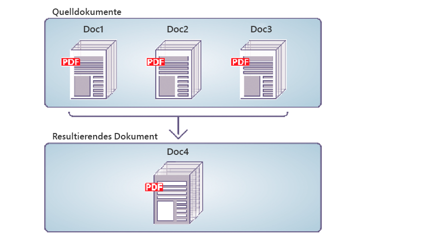

# Programmgesteuertes Assemblieren von PDF-Dokumenten {#programmatically-assembling-pdf-documents}

**Beispiele und Beispiele in diesem Dokument gelten nur für die AEM Forms on JEE-Umgebung.**

Sie können die Assembler-Dienst-API verwenden, um mehrere PDF-Dokumente in einem einzelnen PDF-Dokument zusammenzuführen. Die folgende Abbildung zeigt, wie drei PDF-Dokumente in einem einzelnen PDF-Dokument zusammengeführt werden.



Um zwei oder mehr PDF-Dokumente in einem PDF-Dokument zusammenzuführen, benötigen Sie ein DDX-Dokument. Ein DDX-Dokument beschreibt das PDF-Dokument, das der Assembler-Dienst erzeugt. Das heißt, das DDX-Dokument weist den Assembler-Dienst an, welche Aktionen ausgeführt werden sollen.

Angenommen, für diese Diskussion wird das folgende DDX-Dokument verwendet.

```xml
 <?xml version="1.0" encoding="UTF-8"?>
 <DDX xmlns="https://ns.adobe.com/DDX/1.0/">
     <PDF result="out.pdf">
         <PDF source="map.pdf" />
         <PDF source="directions.pdf" />
     </PDF>
 </DDX>
```

Dieses DDX-Dokument führt zwei PDF-Dokumente mit den Namen *map.pdf* und *instructions.pdf* in einem einzelnen PDF-Dokument zusammen.

>[!NOTE]
>
>Informationen zum Anzeigen eines DDX-Dokuments, das ein PDF-Dokument zerlegt, finden Sie unter [Programmgesteuertes Demontieren von PDF-Dokumenten](/help/forms/developing/programmatically-disassembling-pdf-documents.md#programmatically-disassembling-pdf-documents).

>[!NOTE]
>
>Weitere Informationen zum Assembler-Dienst finden Sie unter [Dienstreferenz für AEM Forms](https://www.adobe.com/go/learn_aemforms_services_63).

>[!NOTE]
>
>Weitere Informationen zu einem DDX-Dokument finden Sie unter [Assembler-Dienst und DDX-Referenz](https://www.adobe.com/go/learn_aemforms_ddx_63).

## Überlegungen beim Aufrufen des Assembler-Dienstes mit Webdiensten {#considerations-when-invoking-assembler-service-using-web-services}

Wenn Sie beim Zusammenstellen großer Dokumente Kopf- und Fußzeilen hinzufügen, tritt möglicherweise ein `OutOfMemory`-Fehler auf und die Dateien werden nicht zusammengestellt. Um das Risiko eines solchen Problems zu verringern, fügen Sie Ihrem DDX-Dokument ein `DDXProcessorSetting` -Element hinzu, wie im folgenden Beispiel gezeigt.

`<DDXProcessorSetting name="checkpoint" value="2000" />`

Sie können dieses Element als untergeordnetes Element des Elements `DDX` oder als untergeordnetes Element eines Elements `PDF result` hinzufügen. Der Standardwert für diese Einstellung ist 0 (null), wodurch der Checkpoint deaktiviert wird und sich das DDX so verhält, als wäre das Element `DDXProcessorSetting` nicht vorhanden. Wenn der Fehler `OutOfMemory` auftritt, müssen Sie den Wert möglicherweise auf eine Ganzzahl setzen, in der Regel zwischen 500 und 5000. Ein kleiner Checkpoint-Wert führt zu einem häufigeren Checkpoint.

## Zusammenfassung der Schritte {#summary-of-steps}

Führen Sie die folgenden Aufgaben aus, um ein einzelnes PDF-Dokument aus mehreren PDF-Dokumenten zusammenzuführen:

1. Projektdateien einschließen.
1. Erstellen Sie einen PDF Assembler-Client.
1. Referenzieren Sie ein vorhandenes DDX-Dokument.
1. Referenzieren von PDF-Eingabedokumenten.
1. Legen Sie Laufzeitoptionen fest.
1. Zusammenführen der PDF-Eingabedokumente.
1. Extrahieren Sie die Ergebnisse.

**Projektdateien einschließen**

Schließen Sie die erforderlichen Dateien in Ihr Entwicklungsprojekt ein. Wenn Sie eine Clientanwendung mit Java erstellen, schließen Sie die erforderlichen JAR-Dateien ein. Wenn Sie Webdienste verwenden, stellen Sie sicher, dass Sie die Proxy-Dateien einschließen.

Die folgenden JAR-Dateien müssen zum Klassenpfad Ihres Projekts hinzugefügt werden:

* adobe-livecycle-client.jar
* adobe-usermanager-client.jar
* adobe-assembler-client.jar
* adobe-utilities.jar (erforderlich, wenn AEM Forms auf JBoss bereitgestellt wird)
* jbossall-client.jar (erforderlich, wenn AEM Forms auf JBoss bereitgestellt wird)

Wenn AEM Forms auf einem anderen unterstützten J2EE-Anwendungsserver als JBoss bereitgestellt wird, müssen Sie die Dateien &quot;adobe-utilities.jar&quot;und &quot;jbossall-client.jar&quot;durch JAR-Dateien ersetzen, die spezifisch für den J2EE-Anwendungsserver sind, auf dem AEM Forms bereitgestellt wird.

**PDF Assembler-Client erstellen**

Bevor Sie einen Assembler-Vorgang programmgesteuert ausführen können, müssen Sie einen Assembler-Client erstellen.

**Vorhandenes DDX-Dokument referenzieren**

Zum Zusammenführen eines PDF-Dokuments muss auf ein DDX-Dokument verwiesen werden. Betrachten Sie beispielsweise das DDX-Dokument, das in diesem Abschnitt eingeführt wurde. Dieses DDX-Dokument weist den Assembler-Dienst an, zwei PDF-Dokumente in einem PDF-Dokument zusammenzuführen.

**Referenzeingabe-PDF-Dokumente**

Verweisen Sie auf PDF-Eingabedokumente, die Sie an den Assembler-Dienst übergeben möchten. Wenn Sie beispielsweise zwei PDF-Eingabedokumente mit dem Namen &quot;Map and Directions&quot;übergeben möchten, müssen Sie die entsprechenden PDF-Dateien übergeben.

Sowohl die Datei &quot;map.pdf&quot;als auch die Datei &quot;richtung.pdf&quot;müssen in einem Kollektionsobjekt platziert werden. Der Name des Schlüssels muss mit dem Wert des PDF-Quellattributs im DDX-Dokument übereinstimmen. Es spielt keine Rolle, welcher Name der PDF-Datei lautet, wenn der Schlüssel und das Quellattribut im DDX-Dokument übereinstimmen.

>[!NOTE]
>
>Wenn Sie den Vorgang `invokeDDX` aufrufen, wird ein `AssemblerResult` -Objekt zurückgegeben, das ein Collection-Objekt enthält. Dieser Vorgang wird verwendet, wenn Sie zwei oder mehr PDF-Eingabedokumente an den Assembler-Dienst übergeben. Wenn Sie jedoch nur eine Eingabe-PDF an den Assembler-Dienst übergeben und nur ein Rückgabedokument erwarten, rufen Sie den Vorgang `invokeOneDocument` auf. Beim Aufrufen dieses Vorgangs wird ein einzelnes Dokument zurückgegeben. Weitere Informationen zur Verwendung dieses Vorgangs finden Sie unter [Assemblieren verschlüsselter PDF-Dokumente](/help/forms/developing/assembling-encrypted-pdf-documents.md#assembling-encrypted-pdf-documents).

**Laufzeitoptionen festlegen**

Sie können Laufzeitoptionen festlegen, die das Verhalten des Assembler-Dienstes während der Ausführung eines Auftrags steuern. Sie können beispielsweise eine Option festlegen, mit der der Assembler-Dienst angewiesen wird, die Verarbeitung eines Auftrags fortzusetzen, wenn ein Fehler auftritt. Informationen zu den Laufzeitoptionen, die Sie festlegen können, finden Sie in der `AssemblerOptionSpec`-Klassenreferenz in der [AEM Forms API-Referenz](https://www.adobe.com/go/learn_aemforms_javadocs_63_en).

**Zusammenführen der PDF-Eingabedokumente**

Nachdem Sie den Service-Client erstellt haben, auf eine DDX-Datei verweisen, ein Sammlungsobjekt erstellen, das PDF-Eingabedokumente speichert, und Laufzeitoptionen festlegen, können Sie den DDX-Vorgang aufrufen. Bei Verwendung des in diesem Abschnitt angegebenen DDX-Dokuments werden die Dateien &quot;map.pdf&quot;und &quot;direction.pdf&quot;zu einem PDF-Dokument zusammengeführt.

**Ergebnisse extrahieren**

Der Assembler-Dienst gibt ein `java.util.Map` -Objekt zurück, das vom `AssemblerResult` -Objekt abgerufen werden kann und das Vorgangsergebnisse enthält. Das zurückgegebene `java.util.Map`-Objekt enthält die resultierenden Dokumente und alle Ausnahmen.

Die folgende Tabelle fasst einige der Schlüsselwerte und Objekttypen zusammen, die sich im zurückgegebenen `java.util.Map` -Objekt befinden können.

<table>
 <thead>
  <tr>
   <th><p>Schlüsselwert</p></th>
   <th><p>Objekttyp</p></th>
   <th><p>Beschreibung</p></th>
  </tr>
 </thead>
 <tbody>
  <tr>
   <td><p><code><i>documentName</i></code></p></td>
   <td><p><code>com.adobe.idp.Document</code></p></td>
   <td><p>Enthält die Zieldokumente, die in einem DDX-Ergebniselement angegeben sind</p></td>
  </tr>
  <tr>
   <td><p><code><i>documentName</i></code></p></td>
   <td><p><code>Exception</code></p></td>
   <td><p>Enthält eine Ausnahme für das Dokument</p></td>
  </tr>
  <tr>
   <td><p><code>OutputMapConstants.LOG_NAME</code></p></td>
   <td><p><code>com.adobe.idp.Documen</code></p></td>
   <td><p>Enthält das Auftragsprotokoll</p></td>
  </tr>
 </tbody>
</table>

**Siehe auch**

[Einbeziehung von AEM Forms Java-Bibliotheksdateien](/help/forms/developing/invoking-aem-forms-using-java.md#including-aem-forms-java-library-files)

[Verbindungseigenschaften festlegen](/help/forms/developing/invoking-aem-forms-using-java.md#setting-connection-properties)

[Programmgesteuerte Demontage von PDF-Dokumenten](/help/forms/developing/programmatically-disassembling-pdf-documents.md#programmatically-disassembling-pdf-documents)

## Zusammenführen von PDF-Dokumenten mit der Java-API {#assemble-pdf-documents-using-the-java-api}

Assemblieren eines PDF-Dokuments mithilfe der Assembler-Dienst-API (Java):

1. Projektdateien einschließen.

   Schließen Sie Client-JAR-Dateien wie adobe-assembler-client.jar in den Klassenpfad Ihres Java-Projekts ein.

1. Erstellen Sie einen PDF Assembler-Client.

   * Erstellen Sie ein `ServiceClientFactory`-&quot; -Objekt, das Verbindungseigenschaften enthält.
   * Erstellen Sie ein `AssemblerServiceClient` -Objekt, indem Sie dessen Konstruktor verwenden und das `ServiceClientFactory` -Objekt übergeben.

1. Referenzieren Sie ein vorhandenes DDX-Dokument.

   * Erstellen Sie ein `java.io.FileInputStream` -Objekt, das das DDX-Dokument darstellt, indem Sie seinen Konstruktor verwenden und einen string -Wert übergeben, der den Speicherort der DDX-Datei angibt.
   * Erstellen Sie ein `com.adobe.idp.Document`-Objekt, indem Sie seinen Konstruktor verwenden und das `java.io.FileInputStream`-Objekt übergeben.

1. Referenzieren von PDF-Eingabedokumenten.

   * Erstellen Sie ein `java.util.Map`-Objekt, das zum Speichern von PDF-Eingabedokumenten mit einem `HashMap`-Konstruktor verwendet wird.
   * Erstellen Sie für jedes PDF-Eingabedokument ein `java.io.FileInputStream` -Objekt, indem Sie dessen Konstruktor verwenden und den Speicherort des PDF-Eingabedokuments übergeben.
   * Erstellen Sie für jedes PDF-Eingabedokument ein `com.adobe.idp.Document`-Objekt und übergeben Sie das `java.io.FileInputStream`-Objekt, das das PDF-Dokument enthält.
   * Fügen Sie für jedes Eingabedokument einen Eintrag zum `java.util.Map`-Objekt hinzu, indem Sie dessen `put`-Methode aufrufen und die folgenden Argumente übergeben:

      * Ein string -Wert, der den Schlüsselnamen darstellt. Dieser Wert muss mit dem Wert des im DDX-Dokument angegebenen PDF-Quellelements übereinstimmen.
      * Ein `com.adobe.idp.Document` -Objekt (oder `java.util.List` -Objekt, das mehrere Dokumente angibt), das das PDF-Quelldokument enthält.

1. Legen Sie Laufzeitoptionen fest.

   * Erstellen Sie ein `AssemblerOptionSpec` -Objekt, das Laufzeitoptionen mithilfe des zugehörigen Konstruktors speichert.
   * Legen Sie Laufzeitoptionen fest, um Ihre Geschäftsanforderungen zu erfüllen, indem Sie eine Methode aufrufen, die zum `AssemblerOptionSpec` -Objekt gehört. Um beispielsweise den Assembler-Dienst anzuweisen, die Verarbeitung eines Auftrags fortzusetzen, wenn ein Fehler auftritt, rufen Sie die `setFailOnError` -Methode des Objekts auf und übergeben Sie `false`.`AssemblerOptionSpec`

1. Zusammenführen der PDF-Eingabedokumente.

   Rufen Sie die `invokeDDX` -Methode des Objekts `AssemblerServiceClient` auf und übergeben Sie die folgenden erforderlichen Werte:

   * Ein `com.adobe.idp.Document` -Objekt, das das zu verwendende DX-Dokument darstellt
   * Ein `java.util.Map` -Objekt, das die zu assemblierenden PDF-Eingabedateien enthält
   * Ein `com.adobe.livecycle.assembler.client.AssemblerOptionSpec` -Objekt, das die Laufzeitoptionen angibt, einschließlich standardmäßiger Schrift- und Auftragsprotokollebene

   Die `invokeDDX`-Methode gibt ein `com.adobe.livecycle.assembler.client.AssemblerResult`-Objekt zurück, das die Ergebnisse des Auftrags und alle aufgetretenen Ausnahmen enthält.

1. Extrahieren Sie die Ergebnisse.

   Um das neu erstellte PDF-Dokument abzurufen, führen Sie die folgenden Schritte aus:

   * Rufen Sie die `getDocuments` -Methode des Objekts `AssemblerResult` auf. Dadurch wird ein `java.util.Map` -Objekt zurückgegeben.
   * Iterieren Sie durch das `java.util.Map`-Objekt, bis Sie das resultierende `com.adobe.idp.Document`-Objekt finden. (Sie können das im DDX-Dokument angegebene PDF-Ergebniselement verwenden, um das Dokument abzurufen.)
   * Rufen Sie die `copyToFile`-Methode des Objekts `com.adobe.idp.Document` auf, um das PDF-Dokument zu extrahieren.

   >[!NOTE]
   >
   >Wenn `LOG_LEVEL` so eingestellt ist, dass ein Protokoll erstellt wird, können Sie das Protokoll mithilfe der `AssemblerResult` -Methode des Objekts `getJobLog` extrahieren.

**Siehe auch**

[Schnellstart (SOAP-Modus): Assemblieren eines PDF-Dokuments mit der Java-API](/help/forms/developing/assembler-service-java-api-quick.md#quick-start-soap-mode-assembling-a-pdf-document-using-the-java-api)

[Einbeziehung von AEM Forms Java-Bibliotheksdateien](/help/forms/developing/invoking-aem-forms-using-java.md#including-aem-forms-java-library-files)

[Verbindungseigenschaften festlegen](/help/forms/developing/invoking-aem-forms-using-java.md#setting-connection-properties)

## Zusammenführen von PDF-Dokumenten mithilfe der Webdienst-API {#assemble-pdf-documents-using-the-web-service-api}

Zusammenführen von PDF-Dokumenten mithilfe der Assembler-Dienst-API (Webdienst):

1. Projektdateien einschließen.

   Erstellen Sie ein Microsoft .NET-Projekt, das MTOM verwendet. Stellen Sie sicher, dass Sie die folgende WSDL-Definition verwenden: `http://localhost:8080/soap/services/AssemblerService?WSDL&lc_version=9.0.1`.

   >[!NOTE]
   >
   >Ersetzen Sie `localhost` durch die IP-Adresse des Servers, auf dem AEM Forms gehostet wird.

1. Erstellen Sie einen PDF Assembler-Client.

   * Erstellen Sie ein `AssemblerServiceClient` -Objekt mithilfe des Standardkonstruktors.
   * Erstellen Sie ein `AssemblerServiceClient.Endpoint.Address`-Objekt mit dem Konstruktor `System.ServiceModel.EndpointAddress` . Übergeben Sie einen string -Wert, der die WSDL an den AEM Forms-Dienst angibt (z. B. `http://localhost:8080/soap/services/AssemblerService?blob=mtom`). Sie müssen das Attribut `lc_version` nicht verwenden. Dieses Attribut wird verwendet, wenn Sie eine Dienstreferenz erstellen.
   * Erstellen Sie ein `System.ServiceModel.BasicHttpBinding` -Objekt, indem Sie den Wert des Felds `AssemblerServiceClient.Endpoint.Binding` abrufen. Wandeln Sie den Rückgabewert in `BasicHttpBinding` um.
   * Setzen Sie das `System.ServiceModel.BasicHttpBinding` -Feld des Objekts `MessageEncoding` auf `WSMessageEncoding.Mtom`. Dieser Wert stellt sicher, dass MTOM verwendet wird.
   * Aktivieren Sie die einfache HTTP-Authentifizierung, indem Sie die folgenden Aufgaben ausführen:

      * Weisen Sie dem Feld `AssemblerServiceClient.ClientCredentials.UserName.UserName` den Benutzernamen des AEM Formulars zu.
      * Weisen Sie dem Feld `AssemblerServiceClient.ClientCredentials.UserName.Password` den entsprechenden Kennwortwert zu.
      * Weisen Sie dem Feld `BasicHttpBindingSecurity.Transport.ClientCredentialType` den Konstantenwert `HttpClientCredentialType.Basic` zu.
      * Weisen Sie dem Feld `BasicHttpBindingSecurity.Security.Mode` den Konstantenwert `BasicHttpSecurityMode.TransportCredentialOnly` zu.

1. Referenzieren Sie ein vorhandenes DDX-Dokument.

   * Erstellen Sie ein Objekt `BLOB`, indem Sie den Konstruktor verwenden. Das `BLOB`-Objekt wird zum Speichern des DDX-Dokuments verwendet.
   * Erstellen Sie ein `System.IO.FileStream` -Objekt, indem Sie seinen Konstruktor aufrufen und einen string -Wert übergeben, der den Dateispeicherort des DDX-Dokuments und den Modus darstellt, in dem die Datei geöffnet werden soll.
   * Erstellen Sie ein Byte-Array, das den Inhalt des Objekts `System.IO.FileStream` speichert. Sie können die Größe des Byte-Arrays bestimmen, indem Sie die `Length` -Eigenschaft des Objekts `System.IO.FileStream` abrufen.
   * Füllen Sie das Byte-Array mit Stream-Daten, indem Sie die `Read` -Methode des Objekts `System.IO.FileStream` aufrufen und das Byte-Array, die Startposition und die zu lesende Stream-Länge übergeben.
   * Füllen Sie das `BLOB`-Objekt, indem Sie dessen `MTOM`-Eigenschaft dem Inhalt des Byte-Arrays zuweisen.

1. Referenzieren von PDF-Eingabedokumenten.

   * Erstellen Sie für jedes PDF-Eingabedokument ein `BLOB` -Objekt mithilfe des zugehörigen Konstruktors. Das `BLOB`-Objekt wird zum Speichern des PDF-Eingabedokuments verwendet.
   * Erstellen Sie ein `System.IO.FileStream` -Objekt, indem Sie seinen Konstruktor aufrufen und einen string -Wert übergeben, der den Dateispeicherort des PDF-Eingabedokuments und den Modus darstellt, in dem die Datei geöffnet werden soll.
   * Erstellen Sie ein Byte-Array, das den Inhalt des Objekts `System.IO.FileStream` speichert. Sie können die Größe des Byte-Arrays bestimmen, indem Sie die `Length` -Eigenschaft des Objekts `System.IO.FileStream` abrufen.
   * Füllen Sie das Byte-Array mit Stream-Daten, indem Sie die `Read` -Methode des Objekts `System.IO.FileStream` aufrufen. Übergeben Sie das Byte-Array, die Startposition und die zu lesende Stream-Länge.
   * Füllen Sie das `BLOB`-Objekt, indem Sie sein `MTOM`-Feld mit dem Inhalt des Byte-Arrays zuweisen.
   * Erstellen Sie ein `MyMapOf_xsd_string_To_xsd_anyType` -Objekt. Dieses Collection-Objekt wird zum Speichern von PDF-Eingabedokumenten verwendet.
   * Erstellen Sie für jedes PDF-Eingabedokument ein `MyMapOf_xsd_string_To_xsd_anyType_Item` -Objekt. Wenn beispielsweise zwei PDF-Eingabedokumente verwendet werden, erstellen Sie zwei `MyMapOf_xsd_string_To_xsd_anyType_Item`-Objekte.
   * Weisen Sie dem `key` -Feld des Objekts `MyMapOf_xsd_string_To_xsd_anyType_Item` einen Zeichenfolgenwert zu, der den Schlüsselnamen darstellt. Dieser Wert muss mit dem Wert des im DDX-Dokument angegebenen PDF-Quellelements übereinstimmen. (Führen Sie diese Aufgabe für jedes PDF-Eingabedokument aus.)
   * Weisen Sie das `BLOB`-Objekt, das das PDF-Dokument speichert, dem `MyMapOf_xsd_string_To_xsd_anyType_Item` -Objektfeld `value` zu. (Führen Sie diese Aufgabe für jedes PDF-Eingabedokument aus.)
   * Fügen Sie das `MyMapOf_xsd_string_To_xsd_anyType_Item`-Objekt zum `MyMapOf_xsd_string_To_xsd_anyType`-Objekt hinzu. Rufen Sie die `Add` -Methode des Objekts `MyMapOf_xsd_string_To_xsd_anyType` auf und übergeben Sie das `MyMapOf_xsd_string_To_xsd_anyType` -Objekt. (Führen Sie diese Aufgabe für jedes PDF-Eingabedokument aus.)

1. Legen Sie Laufzeitoptionen fest.

   * Erstellen Sie ein `AssemblerOptionSpec` -Objekt, das Laufzeitoptionen mithilfe des zugehörigen Konstruktors speichert.
   * Legen Sie Laufzeitoptionen fest, um Ihre Geschäftsanforderungen zu erfüllen, indem Sie einem Datenelement, das zum `AssemblerOptionSpec` -Objekt gehört, einen Wert zuweisen. Um beispielsweise den Assembler-Dienst anzuweisen, die Verarbeitung eines Auftrags fortzusetzen, wenn ein Fehler auftritt, weisen Sie `false` dem `AssemblerOptionSpec`-Datenelement des `failOnError`-Objekts zu.

1. Zusammenführen der PDF-Eingabedokumente.

   Rufen Sie die `invoke` -Methode des Objekts `AssemblerServiceClient` auf und übergeben Sie die folgenden Werte:

   * Ein `BLOB` -Objekt, das das DDX-Dokument darstellt.
   * Das `mapItem`-Array, das die PDF-Eingabedokumente enthält. Die Schlüssel müssen mit den Namen der PDF-Quelldateien übereinstimmen und die Werte müssen die `BLOB`-Objekte sein, die diesen Dateien entsprechen.
   * Ein `AssemblerOptionSpec` -Objekt, das Laufzeitoptionen angibt.

   Die `invoke`-Methode gibt ein `AssemblerResult`-Objekt zurück, das die Ergebnisse des Auftrags und eventuell aufgetretene Ausnahmen enthält.

1. Extrahieren Sie die Ergebnisse.

   Um das neu erstellte PDF-Dokument abzurufen, führen Sie die folgenden Schritte aus:

   * Greifen Sie auf das `AssemblerResult`-Feld des Objekts `documents` zu, bei dem es sich um ein `Map`-Objekt handelt, das die PDF-Dokumente mit den Ergebnissen enthält.
   * Iterieren Sie durch das `Map`-Objekt, bis Sie den Schlüssel finden, der dem Namen des Zieldokuments entspricht. Dann das `value` des Array-Mitglieds in ein `BLOB`-Element umwandeln.
   * Extrahieren Sie die Binärdaten, die das PDF-Dokument darstellen, indem Sie auf die `BLOB` -Eigenschaft des Objekts `MTOM` zugreifen. Dadurch wird ein Array von Bytes zurückgegeben, die Sie in eine PDF-Datei schreiben können.

   >[!NOTE]
   >
   >Wenn `LOG_LEVEL` so eingestellt ist, dass ein Protokoll erstellt wird, können Sie das Protokoll extrahieren, indem Sie den Wert des `AssemblerResult` -Datenelements des `jobLog` -Objekts abrufen.

**Siehe auch**

[AEM Forms mithilfe von MTOM aufrufen](/help/forms/developing/invoking-aem-forms-using-web.md#invoking-aem-forms-using-mtom)
