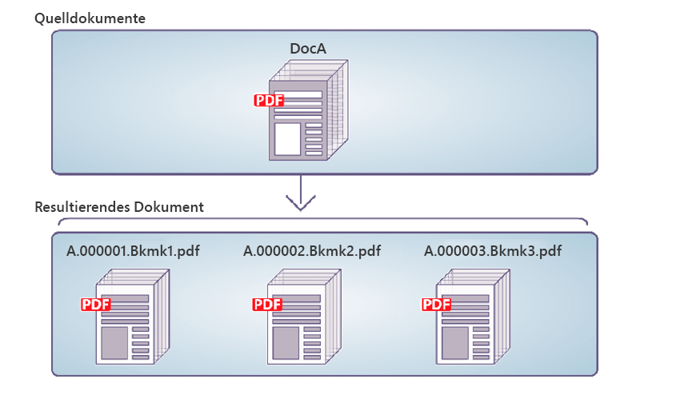

# Programmgesteuerte Demontage von PDF-Dokumenten {#programmatically-disassembling-pdf-documents}

**Beispiele und Beispiele in diesem Dokument gelten nur für die AEM Forms on JEE-Umgebung.**

Sie können ein PDF-Dokument aufteilen, indem Sie es an den Assembler-Dienst übergeben. In der Regel ist diese Aufgabe nützlich, wenn das PDF-Dokument ursprünglich aus vielen einzelnen Dokumenten erstellt wurde, z. B. aus einer Sammlung von Anweisungen. In der folgenden Abbildung ist DocA in mehrere Zieldokumente unterteilt, wobei das Lesezeichen der ersten Ebene auf einer Seite den Beginn eines neuen Zieldokuments angibt.



Um ein PDF-Dokument aufzuteilen, stellen Sie sicher, dass sich das Element `PDFsFromBookmarks` im DDX-Dokument befindet. Das Element `PDFsFromBookmarks` ist ein resultierendes Element und kann nur ein untergeordnetes Element des Elements `DDX` sein. Sie hat kein `result` -Attribut, da dies zur Generierung mehrerer Dokumente führen kann.

Das Element `PDFsFromBookmarks` bewirkt, dass für jedes Lesezeichen der Stufe 1 im Quelldokument ein einzelnes Dokument generiert wird.

Angenommen, für diese Diskussion wird das folgende DDX-Dokument verwendet.

```xml
 <?xml version="1.0" encoding="UTF-8"?>
 <DDX xmlns="https://ns.adobe.com/DDX/1.0/">
      <PDFsFromBookmarks prefix="stmt">
     <PDF source="AssemblerResultPDF.pdf"/>
 </PDFsFromBookmarks>
 </DDX>
```

>[!NOTE]
>
>Bevor Sie diesen Abschnitt lesen, sollten Sie sich mit dem Zusammenstellen von PDF-Dokumenten mithilfe des Assembler-Dienstes vertraut machen. (Siehe [Programmgesteuertes Assemblieren von PDF-Dokumenten](/help/forms/developing/programmatically-assembling-pdf-documents.md).)

>[!NOTE]
>
>Wenn Sie ein einzelnes PDF-Dokument an den Assembler-Dienst übergeben und ein einzelnes Dokument zurückerhalten, können Sie den Vorgang `invokeOneDocument` aufrufen. Verwenden Sie jedoch zum Aufteilen eines PDF-Dokuments den Vorgang `invokeDDX`, da zwar ein PDF-Eingabedokument an den Assembler-Dienst übergeben wird, der Assembler-Dienst jedoch ein Collection-Objekt zurückgibt, das ein oder mehrere Dokumente enthält.

>[!NOTE]
>
>Weitere Informationen zum Assembler-Dienst finden Sie unter [Dienstreferenz für AEM Forms](https://www.adobe.com/go/learn_aemforms_services_63).

>[!NOTE]
>
>Weitere Informationen zu einem DDX-Dokument finden Sie unter [Assembler-Dienst und DDX-Referenz](https://www.adobe.com/go/learn_aemforms_ddx_63).

## Zusammenfassung der Schritte {#summary-of-steps}

Führen Sie die folgenden Aufgaben aus, um ein PDF-Dokument aufzuteilen:

1. Projektdateien einschließen.
1. Erstellen Sie einen PDF Assembler-Client.
1. Referenzieren Sie ein vorhandenes DDX-Dokument.
1. Referenzieren Sie ein zu zerlegendes PDF-Dokument.
1. Legen Sie Laufzeitoptionen fest.
1. Aufteilen des PDF-Dokuments.
1. Speichern Sie die zerlegten PDF-Dokumente.

**Projektdateien einschließen**

Schließen Sie die erforderlichen Dateien in Ihr Entwicklungsprojekt ein. Wenn Sie eine Clientanwendung mit Java erstellen, schließen Sie die erforderlichen JAR-Dateien ein. Wenn Sie Webdienste verwenden, stellen Sie sicher, dass Sie die Proxy-Dateien einschließen.

Die folgenden JAR-Dateien müssen zum Klassenpfad Ihres Projekts hinzugefügt werden:

* adobe-livecycle-client.jar
* adobe-usermanager-client.jar
* adobe-assembler-client.jar
* adobe-utilities.jar (erforderlich, wenn AEM Forms auf JBoss bereitgestellt wird)
* jbossall-client.jar (erforderlich, wenn AEM Forms auf JBoss bereitgestellt wird)

Wenn AEM Forms auf einem unterstützten J2EE-Anwendungsserver bereitgestellt wird, der nicht JBoss ist, müssen Sie adobe-utilities.jar und jbossall-client.jar durch JAR-Dateien ersetzen, die spezifisch für den J2EE-Anwendungsserver sind, auf dem AEM Forms bereitgestellt wird.

**PDF Assembler-Client erstellen**

Bevor Sie einen Assembler-Vorgang programmgesteuert ausführen können, müssen Sie einen Assembler-Dienst-Client erstellen.

**Vorhandenes DDX-Dokument referenzieren**

Zum Aufteilen eines PDF-Dokuments muss auf ein DDX-Dokument verwiesen werden. Dieses DDX-Dokument muss das Element `PDFsFromBookmarks` enthalten.

**Referenzieren eines zu zerlegenden PDF-Dokuments**

Referenzieren Sie zum Aufteilen eines PDF-Dokuments eine PDF-Datei, die das zu zerlegende PDF-Dokument darstellt. Wenn an den Assembler-Dienst übergeben wird, wird für jedes Lesezeichen der Stufe 1 im Dokument ein separates PDF-Dokument zurückgegeben.

**Laufzeitoptionen festlegen**

Sie können Laufzeitoptionen festlegen, die das Verhalten des Assembler-Dienstes während der Ausführung eines Auftrags steuern. Sie können beispielsweise eine Option festlegen, mit der der Assembler-Dienst angewiesen wird, die Verarbeitung eines Auftrags fortzusetzen, wenn ein Fehler auftritt.

**Aufteilen des PDF-Dokuments**

Nachdem Sie den Assembler-Dienst-Client erstellt haben, auf das DDX-Dokument verweisen, auf ein zu zerteilendes PDF-Dokument verweisen und Laufzeitoptionen festlegen, können Sie ein PDF-Dokument aufteilen, indem Sie die Methode `invokeDDX` aufrufen. Sofern das DDX-Dokument Anweisungen zum Aufteilen des PDF-Dokuments enthält, gibt der Assembler-Dienst disassemblierte PDF-Dokumente innerhalb eines Sammlungsobjekts zurück.

**Speichern Sie die zerlegten PDF-Dokumente**

Alle zerlegten PDF-Dokumente werden innerhalb eines Sammlungsobjekts zurückgegeben. Durchsuchen Sie das Sammlungsobjekt und speichern Sie jedes PDF-Dokument als PDF-Datei.

**Siehe auch**

[Einbeziehung von AEM Forms Java-Bibliotheksdateien](/help/forms/developing/invoking-aem-forms-using-java.md#including-aem-forms-java-library-files)

[Verbindungseigenschaften festlegen](/help/forms/developing/invoking-aem-forms-using-java.md#setting-connection-properties)

[Programmgesteuertes Assemblieren von PDF-Dokumenten](/help/forms/developing/programmatically-assembling-pdf-documents.md)

## Aufteilen eines PDF-Dokuments mithilfe der Java-API {#disassemble-a-pdf-document-using-the-java-api}

Aufteilen eines PDF-Dokuments mithilfe der Assembler-Dienst-API (Java):

1. Projektdateien einschließen.

   Schließen Sie Client-JAR-Dateien wie adobe-assembler-client.jar in den Klassenpfad Ihres Java-Projekts ein.

1. Erstellen Sie einen PDF Assembler-Client.

   * Erstellen Sie ein `ServiceClientFactory`-&quot; -Objekt, das Verbindungseigenschaften enthält.
   * Erstellen Sie ein `AssemblerServiceClient` -Objekt, indem Sie dessen Konstruktor verwenden und das `ServiceClientFactory` -Objekt übergeben.

1. Referenzieren Sie ein vorhandenes DDX-Dokument.

   * Erstellen Sie ein `java.io.FileInputStream` -Objekt, das das DDX-Dokument darstellt, indem Sie seinen Konstruktor verwenden und einen string -Wert übergeben, der den Speicherort der DDX-Datei angibt.
   * Erstellen Sie ein `com.adobe.idp.Document`-Objekt, indem Sie seinen Konstruktor verwenden und das `java.io.FileInputStream`-Objekt übergeben.

1. Referenzieren Sie ein zu zerlegendes PDF-Dokument.

   * Erstellen Sie ein `java.util.Map`-Objekt, das zum Speichern von PDF-Eingabedokumenten mit einem `HashMap`-Konstruktor verwendet wird.
   * Erstellen Sie ein `java.io.FileInputStream`-Objekt, indem Sie seinen Konstruktor verwenden und den Speicherort des PDF-Dokuments an die Aufspaltung übergeben.
   * Erstellen Sie ein `com.adobe.idp.Document`-Objekt und übergeben Sie das `java.io.FileInputStream`-Objekt, das das PDF-Dokument enthält, das zerlegt werden soll.
   * Fügen Sie einen Eintrag zum `java.util.Map`-Objekt hinzu, indem Sie dessen `put`-Methode aufrufen und die folgenden Argumente übergeben:

      * Ein string -Wert, der den Schlüsselnamen darstellt. Dieser Wert muss mit dem Wert des im DDX-Dokument angegebenen PDF-Quellelements übereinstimmen.
      * Ein `com.adobe.idp.Document` -Objekt, das das zu zerlegende PDF-Dokument enthält.

1. Legen Sie Laufzeitoptionen fest.

   * Erstellen Sie ein `AssemblerOptionSpec` -Objekt, das Laufzeitoptionen mithilfe des zugehörigen Konstruktors speichert.
   * Legen Sie Laufzeitoptionen fest, um Ihre Geschäftsanforderungen zu erfüllen, indem Sie eine Methode aufrufen, die zum `AssemblerOptionSpec` -Objekt gehört. Um beispielsweise den Assembler-Dienst anzuweisen, die Verarbeitung eines Auftrags fortzusetzen, wenn ein Fehler auftritt, rufen Sie die `setFailOnError` -Methode des Objekts auf und übergeben Sie `false`.`AssemblerOptionSpec`

1. Aufteilen des PDF-Dokuments.

   Rufen Sie die `invokeDDX` -Methode des Objekts `AssemblerServiceClient` auf und übergeben Sie die folgenden erforderlichen Werte:

   * Ein `com.adobe.idp.Document` -Objekt, das das zu verwendende DX-Dokument darstellt
   * Ein `java.util.Map` -Objekt, das das zu zerlegende PDF-Dokument enthält
   * Ein `com.adobe.livecycle.assembler.client.AssemblerOptionSpec` -Objekt, das die Laufzeitoptionen angibt, einschließlich der Standardschriftart und der Auftragsprotokollebene

   Die `invokeDDX`-Methode gibt ein `com.adobe.livecycle.assembler.client.AssemblerResult`-Objekt zurück, das die zerlegten PDF-Dokumente und alle aufgetretenen Ausnahmen enthält.

1. Speichern Sie die zerlegten PDF-Dokumente.

   Führen Sie die folgenden Schritte aus, um die disassemblierten PDF-Dokumente abzurufen:

   * Rufen Sie die `getDocuments` -Methode des Objekts `AssemblerResult` auf. Dadurch wird ein `java.util.Map` -Objekt zurückgegeben.
   * Iterieren Sie durch das `java.util.Map`-Objekt, bis Sie das resultierende `com.adobe.idp.Document`-Objekt finden.
   * Rufen Sie die `copyToFile`-Methode des Objekts `com.adobe.idp.Document` auf, um das PDF-Dokument zu extrahieren.

**Siehe auch**

[Programmgesteuerte Demontage von PDF-Dokumenten](#programmatically-disassembling-pdf-documents)

[Schnellstart (SOAP-Modus): Aufteilen eines PDF-Dokuments mithilfe der Java-API](/help/forms/developing/assembler-service-java-api-quick.md#quick-start-soap-mode-disassembling-a-pdf-document-using-the-java-api)

[Einbeziehung von AEM Forms Java-Bibliotheksdateien](/help/forms/developing/invoking-aem-forms-using-java.md#including-aem-forms-java-library-files)

[Verbindungseigenschaften festlegen](/help/forms/developing/invoking-aem-forms-using-java.md#setting-connection-properties)

## Aufteilen eines PDF-Dokuments mithilfe der Webdienst-API {#disassemble-a-pdf-document-using-the-web-service-api}

Aufteilen eines PDF-Dokuments mithilfe der Assembler-Dienst-API (Webdienst):

1. Projektdateien einschließen.

   Erstellen Sie ein Microsoft .NET-Projekt, das MTOM verwendet. Stellen Sie sicher, dass Sie beim Festlegen einer Dienstreferenz die folgende WSDL-Definition verwenden: `http://localhost:8080/soap/services/AssemblerService?WSDL&lc_version=9.0.1`.

   >[!NOTE]
   >
   >Ersetzen Sie `localhost` durch die IP-Adresse des Servers, auf dem AEM Forms gehostet wird.

1. Erstellen Sie einen PDF Assembler-Client.

   * Erstellen Sie ein `AssemblerServiceClient` -Objekt mithilfe des Standardkonstruktors.
   * Erstellen Sie ein `AssemblerServiceClient.Endpoint.Address`-Objekt mit dem Konstruktor `System.ServiceModel.EndpointAddress` . Übergeben Sie einen string -Wert, der die WSDL an den AEM Forms-Dienst angibt (z. B. `http://localhost:8080/soap/services/AssemblerService?blob=mtom`). Sie müssen das Attribut `lc_version` nicht verwenden. Dieses Attribut wird verwendet, wenn Sie eine Dienstreferenz erstellen.
   * Erstellen Sie ein `System.ServiceModel.BasicHttpBinding` -Objekt, indem Sie den Wert des Felds `AssemblerServiceClient.Endpoint.Binding` abrufen. Wandeln Sie den Rückgabewert in `BasicHttpBinding` um.
   * Setzen Sie das `System.ServiceModel.BasicHttpBinding` -Feld des Objekts `MessageEncoding` auf `WSMessageEncoding.Mtom`. Dieser Wert stellt sicher, dass MTOM verwendet wird.
   * Aktivieren Sie die einfache HTTP-Authentifizierung, indem Sie die folgenden Aufgaben ausführen:

      * Weisen Sie dem Feld `AssemblerServiceClient.ClientCredentials.UserName.UserName` den Benutzernamen des AEM Formulars zu.
      * Weisen Sie dem Feld `AssemblerServiceClient.ClientCredentials.UserName.Password` den entsprechenden Kennwortwert zu.
      * Weisen Sie dem Feld `BasicHttpBindingSecurity.Transport.ClientCredentialType` den Konstantenwert `HttpClientCredentialType.Basic` zu.
      * Weisen Sie dem Feld `BasicHttpBindingSecurity.Security.Mode` den Konstantenwert `BasicHttpSecurityMode.TransportCredentialOnly` zu.

1. Referenzieren Sie ein vorhandenes DDX-Dokument.

   * Erstellen Sie ein Objekt `BLOB`, indem Sie den Konstruktor verwenden. Das `BLOB`-Objekt wird zum Speichern des DDX-Dokuments verwendet.
   * Erstellen Sie ein `System.IO.FileStream` -Objekt, indem Sie seinen Konstruktor aufrufen. Übergeben Sie einen string -Wert, der den Dateispeicherort des DDX-Dokuments und den Modus darstellt, in dem die Datei geöffnet werden soll.
   * Erstellen Sie ein Byte-Array, das den Inhalt des Objekts `System.IO.FileStream` speichert. Sie können die Größe des Byte-Arrays bestimmen, indem Sie die `Length` -Eigenschaft des Objekts `System.IO.FileStream` abrufen.
   * Füllen Sie das Byte-Array mit Stream-Daten, indem Sie die `Read` -Methode des Objekts `System.IO.FileStream` aufrufen und das Byte-Array, die Startposition und die zu lesende Stream-Länge übergeben.
   * Füllen Sie das `BLOB`-Objekt, indem Sie dessen `MTOM`-Eigenschaft dem Inhalt des Byte-Arrays zuweisen.

1. Referenzieren Sie ein zu zerlegendes PDF-Dokument.

   * Erstellen Sie ein Objekt `BLOB`, indem Sie den Konstruktor verwenden. Das `BLOB`-Objekt wird zum Speichern des PDF-Eingabedokuments verwendet. Dieses `BLOB` -Objekt wird als Argument an `invokeOneDocument` übergeben.
   * Erstellen Sie ein `System.IO.FileStream` -Objekt, indem Sie seinen Konstruktor aufrufen und einen string -Wert übergeben, der den Dateispeicherort des PDF-Eingabedokuments und den Modus darstellt, in dem die Datei geöffnet werden soll.
   * Erstellen Sie ein Byte-Array, das den Inhalt des Objekts `System.IO.FileStream` speichert. Sie können die Größe des Byte-Arrays bestimmen, indem Sie die `Length` -Eigenschaft des Objekts `System.IO.FileStream` abrufen.
   * Füllen Sie das Byte-Array mit Stream-Daten, indem Sie die `Read` -Methode des Objekts `System.IO.FileStream` aufrufen und das Byte-Array, die Startposition und die zu lesende Stream-Länge übergeben.
   * Füllen Sie das `BLOB`-Objekt, indem Sie seinem `MTOM`-Feld den Inhalt des Byte-Arrays zuweisen.
   * Erstellen Sie ein `MyMapOf_xsd_string_To_xsd_anyType` -Objekt. Dieses Collection-Objekt wird verwendet, um die PDF-Datei zur Aufspaltung zu speichern.
   * Erstellen Sie ein `MyMapOf_xsd_string_To_xsd_anyType_Item` -Objekt.
   * Weisen Sie dem `key` -Feld des Objekts `MyMapOf_xsd_string_To_xsd_anyType_Item` einen Zeichenfolgenwert zu, der den Schlüsselnamen darstellt. Dieser Wert muss mit dem Wert des im DDX-Dokument angegebenen PDF-Quellelements übereinstimmen.
   * Weisen Sie das `BLOB`-Objekt, das das PDF-Dokument speichert, dem `MyMapOf_xsd_string_To_xsd_anyType_Item` -Objektfeld `value` zu.
   * Fügen Sie das `MyMapOf_xsd_string_To_xsd_anyType_Item`-Objekt zum `MyMapOf_xsd_string_To_xsd_anyType`-Objekt hinzu. Rufen Sie die `MyMapOf_xsd_string_To_xsd_anyType`-Methode des Objekts `Add` auf und übergeben Sie das `MyMapOf_xsd_string_To_xsd_anyType`-Objekt.

1. Legen Sie Laufzeitoptionen fest.

   * Erstellen Sie ein `AssemblerOptionSpec` -Objekt, das Laufzeitoptionen mithilfe des zugehörigen Konstruktors speichert.
   * Legen Sie Laufzeitoptionen fest, um Ihre Geschäftsanforderungen zu erfüllen, indem Sie einem Datenelement, das zum `AssemblerOptionSpec` -Objekt gehört, einen Wert zuweisen. Um beispielsweise den Assembler-Dienst anzuweisen, die Verarbeitung eines Auftrags fortzusetzen, wenn ein Fehler auftritt, weisen Sie `false` dem `AssemblerOptionSpec` -Feld des Objekts `failOnError` zu.

1. Aufteilen des PDF-Dokuments.

   Rufen Sie die `invokeDDX` -Methode des Objekts `AssemblerServiceClient` auf und übergeben Sie die folgenden Werte:

   * Ein `BLOB` -Objekt, das das DDX-Dokument darstellt, das das PDF-Dokument auftrennt
   * Das `MyMapOf_xsd_string_To_xsd_anyType`-Objekt, das das zu zerlegende PDF-Dokument enthält
   * Ein `AssemblerOptionSpec` -Objekt, das Laufzeitoptionen angibt

   Die `invokeDDX`-Methode gibt ein `AssemblerResult`-Objekt zurück, das die Auftragsergebnisse und alle aufgetretenen Ausnahmen enthält.

1. Speichern Sie die zerlegten PDF-Dokumente.

   Führen Sie die folgenden Schritte aus, um die neu erstellten PDF-Dokumente abzurufen:

   * Greifen Sie auf das `AssemblerResult` -Feld des Objekts `documents` zu, bei dem es sich um ein `Map` -Objekt handelt, das die zerlegten PDF-Dokumente enthält.
   * Durchsuchen Sie das `Map`-Objekt, um jedes Zieldokument abzurufen. Dann das `value` des Array-Mitglieds in ein `BLOB`-Element umwandeln.
   * Extrahieren Sie die Binärdaten, die das PDF-Dokument darstellen, indem Sie auf die `BLOB` -Eigenschaft des Objekts `MTOM` zugreifen. Dadurch wird ein Array von Bytes zurückgegeben, die Sie in eine PDF-Datei schreiben können.

**Siehe auch**

[Programmgesteuerte Demontage von PDF-Dokumenten](#programmatically-disassembling-pdf-documents)

[AEM Forms mithilfe von MTOM aufrufen](/help/forms/developing/invoking-aem-forms-using-web.md#invoking-aem-forms-using-mtom)
