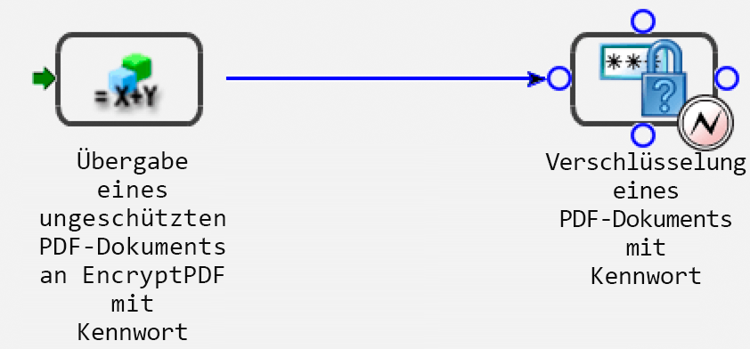
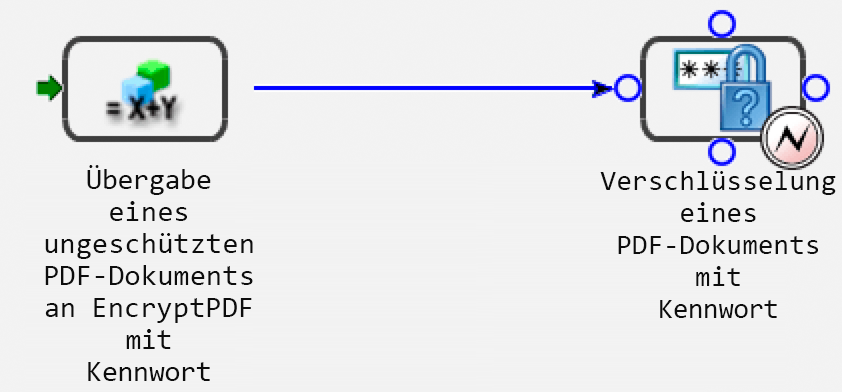

# Programmgesteuertes Verwalten von Endpunkten {#programmatically-managing-endpoints}

**Beispiele und Beispiele in diesem Dokument gelten nur für die AEM Forms on JEE-Umgebung.**

**Über Endpoint Registry-Dienst**

Der Endpoint Registry-Dienst bietet die Möglichkeit, Endpunkte programmgesteuert zu verwalten. Sie können beispielsweise die folgenden Typen von Endpunkten zu einem Dienst hinzufügen:

* EJB
* SOAP
* Überwachter Ordner
* E-Mail
* (Veraltet für AEM Formulare) Entfernen
* Task Manager

>[!NOTE]
>
>SOAP-, EJB- und (für AEM Forms on JEE nicht mehr unterstützt) Remoting-Endpunkte werden automatisch für jeden aktivierten Dienst erstellt. Die SOAP- und EJB-Endpunkte aktivieren SOAP und EJB für alle Dienstvorgänge.

Ein Remoting-Endpunkt ermöglicht es Flex-Clients, Vorgänge für den AEM Forms-Dienst aufzurufen, dem der Endpunkt hinzugefügt wird. Ein Flex-Ziel mit demselben Namen wie der Endpunkt wird erstellt und Flex-Clients können RemoteObjects erstellen, die auf dieses Ziel verweisen, um Vorgänge für den entsprechenden Dienst aufzurufen.

Die Endpunkte &quot;E-Mail&quot;, &quot;Task Manager&quot;und &quot;Watched Folder&quot;stellen nur einen bestimmten Vorgang des Dienstes bereit. Das Hinzufügen dieser Endpunkte erfordert einen zweiten Konfigurationsschritt, um eine Methode zum Aufrufen und Festlegen von Konfigurationsparametern sowie zum Angeben von Zuordnungen von Eingabe- und Ausgabeparametern auszuwählen.

Sie können TaskManager-Endpunkte in Gruppen namens *categories* organisieren. Diese Kategorien werden dann über TaskManager für Workspace verfügbar gemacht, wobei Endbenutzer die TaskManager-Endpunkte sehen, während sie kategorisiert sind. Innerhalb von Workspace sehen Endbenutzer diese Kategorien im Navigationsbereich. Die Endpunkte in jeder Kategorie werden als Prozesskarten auf der Seite &quot;Vorgänge starten&quot;in Workspace angezeigt.

Sie können diese Aufgaben mithilfe des Endpoint Registry-Dienstes ausführen:

* Fügen Sie EJB-Endpunkte hinzu. (Siehe [Hinzufügen von EJB-Endpunkten](programmatically-endpoints.md#adding-ejb-endpoints).)
* Fügen Sie SOAP-Endpunkte hinzu. (Siehe [Hinzufügen von SOAP-Endpunkten](programmatically-endpoints.md#adding-soap-endpoints).)
* Fügen Sie Endpunkte für überwachte Ordner hinzu (siehe [Endpunkte für überwachte Ordner hinzufügen](programmatically-endpoints.md#adding-watched-folder-endpoints)).
* E-Mail-Endpunkte hinzufügen. (Siehe [Hinzufügen von E-Mail-Endpunkten](programmatically-endpoints.md#adding-email-endpoints).)
* Fügen Sie Remoting-Endpunkte hinzu. (Siehe [Hinzufügen von Remoting-Endpunkten](programmatically-endpoints.md#adding-remoting-endpoints).)
* Fügen Sie TaskManager-Endpunkte hinzu (siehe [Hinzufügen von TaskManager-Endpunkten](programmatically-endpoints.md#adding-taskmanager-endpoints)).
* Ändern Sie Endpunkte (siehe [Ändern von Endpunkten](programmatically-endpoints.md#modifying-endpoints).)
* Entfernen Sie Endpunkte (siehe [Entfernen von Endpunkten](programmatically-endpoints.md#removing-endpoints).)
* Abrufen von Endpunkt-Connector-Informationen (siehe [Abrufen von Endpoint-Connector-Informationen](programmatically-endpoints.md#retrieving-endpoint-connector-information))

## Hinzufügen von EJB-Endpunkten {#adding-ejb-endpoints}

Sie können einem Dienst programmgesteuert einen EJB-Endpunkt hinzufügen, indem Sie die AEM Forms Java-API verwenden. Durch Hinzufügen eines EJB-Endpunkts zu einem Dienst aktivieren Sie eine Clientanwendung, um den Dienst mithilfe des EJB-Modus aufzurufen. Das heißt, beim Festlegen von Verbindungseigenschaften, die zum Aufrufen von AEM Forms erforderlich sind, können Sie den EJB-Modus auswählen. (Siehe [Einstellung von Verbindungseigenschaften](/help/forms/developing/invoking-aem-forms-using-java.md#setting-connection-properties).)

>[!NOTE]
>
>Mit Webdiensten können Sie keinen EJB-Endpunkt hinzufügen.

>[!NOTE]
>
>In der Regel wird einem Dienst standardmäßig ein EJB-Endpunkt hinzugefügt. Ein EJB-Endpunkt kann jedoch einem Prozess hinzugefügt werden, der programmgesteuert bereitgestellt wird oder wenn ein EJB-Endpunkt entfernt wurde und erneut hinzugefügt werden muss.

### Zusammenfassung der Schritte {#summary-of-steps}

Führen Sie die folgenden Aufgaben aus, um einem Dienst einen EJB-Endpunkt hinzuzufügen:

1. Projektdateien einschließen.
1. Erstellen Sie ein `EndpointRegistry Client` -Objekt.
1. Festlegen von EJB-Endpunktattributen.
1. Erstellen Sie einen EJB-Endpunkt.
1. Aktivieren Sie den -Endpunkt.

**Projektdateien einschließen**

Schließen Sie die erforderlichen Dateien in Ihr Entwicklungsprojekt ein. Die folgenden JAR-Dateien müssen zum Klassenpfad Ihres Projekts hinzugefügt werden:

* adobe-livecycle-client.jar
* adobe-usermanager-client.jar
* adobe-utilities.jar (erforderlich, wenn AEM Forms auf JBoss Application Server bereitgestellt wird)
* jbossall-client.jar (erforderlich, wenn AEM Forms auf JBoss Application Server bereitgestellt wird)

Informationen zum Speicherort dieser JAR-Dateien finden Sie unter [Einschließen von AEM Forms Java-Bibliotheksdateien](/help/forms/developing/invoking-aem-forms-using-java.md#including-aem-forms-java-library-files).

**Erstellen eines EndpointRegistry-Client-Objekts**

Bevor Sie einen EJB-Endpunkt programmgesteuert hinzufügen können, müssen Sie ein `EndpointRegistryClient` -Objekt erstellen.

**EJB-Endpunktattribute festlegen**

Um einen EJB-Endpunkt für einen Dienst zu erstellen, geben Sie die folgenden Werte an:

* **Connector-Kennung**: Gibt den Typ des zu erstellenden Endpunkts an. Um einen EJB-Endpunkt zu erstellen, geben Sie `EJB` an.
* **Beschreibung**: Gibt die Beschreibung des Endpunkts an.
* **Name**: Gibt den Namen des Endpunkts an.
* **Dienstkennung**: Gibt den Dienst an, zu dem der Endpunkt gehört.
* **Vorgangsname**: Gibt den Namen des Vorgangs an, der mithilfe des -Endpunkts aufgerufen wird. Geben Sie beim Erstellen eines EJB-Endpunkts ein Platzhalterzeichen ( `*`) an. Wenn Sie jedoch einen bestimmten Vorgang angeben möchten, anstatt alle Dienstvorgänge aufzurufen, geben Sie den Namen des Vorgangs an, anstatt das Platzhalterzeichen ( `*`) zu verwenden.

**Erstellen eines EJB-Endpunkts**

Nachdem Sie EJB-Endpunktattribute festgelegt haben, können Sie einen EJB-Endpunkt für einen Dienst erstellen.

**Endpunkt aktivieren**

Nachdem Sie einen neuen Endpunkt erstellt haben, müssen Sie ihn aktivieren. Nachdem Sie den -Endpunkt aktiviert haben, kann er zum Aufrufen des -Dienstes verwendet werden. Nachdem Sie den Endpunkt aktiviert haben, können Sie ihn in Administration Console anzeigen.

**Siehe auch**

[Hinzufügen eines EJB-Endpunkts mithilfe der Java-API](programmatically-endpoints.md#adding-an-ejb-endpoint-using-the-java-api)

[Einbeziehung von AEM Forms Java-Bibliotheksdateien](/help/forms/developing/invoking-aem-forms-using-java.md#including-aem-forms-java-library-files)

[Verbindungseigenschaften festlegen](/help/forms/developing/invoking-aem-forms-using-java.md#setting-connection-properties)

### Hinzufügen eines EJB-Endpunkts mithilfe der Java-API {#adding-an-ejb-endpoint-using-the-java-api}

Fügen Sie mithilfe der Java-API einen EJB-Endpunkt hinzu:

1. Projektdateien einschließen.

   Schließen Sie Client-JAR-Dateien wie adobe-livecycle-client.jar in den Klassenpfad Ihres Java-Projekts ein. (

1. Erstellen Sie ein EndpointRegistry-Client-Objekt.

   * Erstellen Sie ein `ServiceClientFactory`-&quot; -Objekt, das Verbindungseigenschaften enthält.
   * Erstellen Sie ein `EndpointRegistryClient` -Objekt, indem Sie dessen Konstruktor verwenden und das `ServiceClientFactory` -Objekt übergeben.

1. Festlegen von EJB-Endpunktattributen.

   * Erstellen Sie ein Objekt `CreateEndpointInfo`, indem Sie den Konstruktor verwenden.
   * Geben Sie den Wert der Connector-ID an, indem Sie die `setConnectorId`-Methode des Objekts `CreateEndpointInfo` aufrufen und den Zeichenfolgenwert `EJB` übergeben.
   * Geben Sie die Beschreibung des Endpunkts an, indem Sie die `setDescription` -Methode des Objekts `CreateEndpointInfo` aufrufen und einen Zeichenfolgenwert übergeben, der den Endpunkt beschreibt.
   * Geben Sie den Namen des Endpunkts an, indem Sie die `setName` -Methode des Objekts `CreateEndpointInfo` aufrufen und einen Zeichenfolgenwert übergeben, der den Namen angibt.
   * Geben Sie den Dienst an, zu dem der Endpunkt gehört, indem Sie die `setServiceId` -Methode des Objekts `CreateEndpointInfo` aufrufen und einen string -Wert übergeben, der den Dienstnamen angibt.
   * Geben Sie den Vorgang an, der aufgerufen wird, indem Sie die `setOperationName` -Methode des Objekts `CreateEndpointInfo` aufrufen und einen string -Wert übergeben, der den Vorgangsnamen angibt. Geben Sie für SOAP- und EJB-Endpunkte ein Platzhalterzeichen ( `*`) an, das alle Vorgänge umfasst.

1. Erstellen Sie einen EJB-Endpunkt.

   Erstellen Sie den Endpunkt, indem Sie die `createEndpoint` -Methode des Objekts `EndpointRegistryClient` aufrufen und das `CreateEndpointInfo` -Objekt übergeben. Diese Methode gibt ein `Endpoint` -Objekt zurück, das den neuen EJB-Endpunkt darstellt.

1. Aktivieren Sie den -Endpunkt.

   Aktivieren Sie den Endpunkt, indem Sie die Methode enable des Objekts `EndpointRegistryClient` aufrufen und das `Endpoint`-Objekt übergeben, das von der Methode `createEndpoint` zurückgegeben wurde.

**Siehe auch**

[Zusammenfassung der Schritte](programmatically-endpoints.md#summary-of-steps)

[QuickStart: Hinzufügen eines EJB-Endpunkts mithilfe der Java-API](/help/forms/developing/endpoint-registry-java-api-quick.md#quickstart-adding-an-ejb-endpoint-using-the-java-api)

[Einbeziehung von AEM Forms Java-Bibliotheksdateien](/help/forms/developing/invoking-aem-forms-using-java.md#including-aem-forms-java-library-files)

[Verbindungseigenschaften festlegen](/help/forms/developing/invoking-aem-forms-using-java.md#setting-connection-properties)

## Hinzufügen von SOAP-Endpunkten {#adding-soap-endpoints}

Sie können einen SOAP-Endpunkt mithilfe der AEM Forms Java API programmgesteuert zu einem Dienst hinzufügen. Durch Hinzufügen eines SOAP-Endpunkts aktivieren Sie eine Clientanwendung, um den Dienst mithilfe des SOAP-Modus aufzurufen. Wenn Sie also Verbindungseigenschaften festlegen, die zum Aufrufen von AEM Forms erforderlich sind, können Sie den SOAP-Modus auswählen.

>[!NOTE]
>
>Mit Webdiensten können Sie keinen SOAP-Endpunkt hinzufügen.

>[!NOTE]
>
>Normalerweise wird ein SOAP-Endpunkt standardmäßig einem Dienst hinzugefügt. Ein SOAP-Endpunkt kann jedoch einem Prozess hinzugefügt werden, der programmgesteuert bereitgestellt wird oder wenn ein SOAP-Endpunkt entfernt wurde und erneut hinzugefügt werden muss.

### Zusammenfassung der Schritte {#summary_of_steps-1}

Führen Sie die folgenden Aufgaben aus, um einem Dienst einen SOAP-Endpunkt hinzuzufügen:

1. Projektdateien einschließen.
1. Erstellen Sie ein `EndpointRegistryClient` -Objekt.
1. Festlegen von SOAP-Endpunktattributen.
1. Erstellen Sie einen SOAP-Endpunkt.
1. Aktivieren Sie den -Endpunkt.

**Projektdateien einschließen**

Schließen Sie die erforderlichen Dateien in Ihr Entwicklungsprojekt ein. Wenn Sie eine Clientanwendung mit Java erstellen, schließen Sie die erforderlichen JAR-Dateien ein. Wenn Sie Webdienste verwenden, stellen Sie sicher, dass Sie die Proxy-Dateien einschließen.

Die folgenden JAR-Dateien müssen zum Klassenpfad Ihres Projekts hinzugefügt werden:

* adobe-livecycle-client.jar
* adobe-usermanager-client.jar
* adobe-utilities.jar (erforderlich, wenn AEM Forms auf JBoss Application Server bereitgestellt wird)
* jbossall-client.jar (erforderlich, wenn AEM Forms auf JBoss Application Server bereitgestellt wird)

Diese JAR-Dateien sind erforderlich, um einen SOAP-Endpunkt zu erstellen. Sie benötigen jedoch zusätzliche JAR-Dateien, wenn Sie den SOAP-Endpunkt zum Aufrufen des Dienstes verwenden. Weitere Informationen zu AEM Forms-JAR-Dateien finden Sie unter [Einschließen von AEM Forms-Java-Bibliotheksdateien](/help/forms/developing/invoking-aem-forms-using-java.md#including-aem-forms-java-library-files).

**Erstellen eines EndpointRegistry-Client-Objekts**

Um einem Dienst programmgesteuert einen SOAP-Endpunkt hinzuzufügen, müssen Sie ein `EndpointRegistryClient` -Objekt erstellen.

**SOAP-Endpunktattribute festlegen**

Geben Sie die folgenden Werte an, um einem Dienst einen SOAP-Endpunkt hinzuzufügen:

* **Connector-ID-Wert**: Gibt den Typ des zu erstellenden Endpunkts an. Um einen SOAP-Endpunkt zu erstellen, geben Sie `SOAP` an.
* **Beschreibung**: Gibt die Beschreibung des Endpunkts an.
* **Name**: Gibt den Namen des Endpunkts an.
* **Dienstkennungswert**: Gibt den Dienst an, zu dem der Endpunkt gehört.
* **Vorgangsname**: Gibt den Namen des Vorgangs an, der mithilfe des -Endpunkts aufgerufen wird. Geben Sie beim Erstellen eines SOAP-Endpunkts ein Platzhalterzeichen ( `*`) an. Wenn Sie jedoch einen bestimmten Vorgang angeben möchten, anstatt alle Dienstvorgänge aufzurufen, geben Sie den Namen des Vorgangs an, anstatt das Platzhalterzeichen ( `*`) zu verwenden.

**SOAP-Endpunkt erstellen**

Nachdem Sie SOAP-Endpunktattribute festgelegt haben, können Sie einen SOAP-Endpunkt erstellen.

**Endpunkt aktivieren**

Nachdem Sie einen neuen Endpunkt erstellt haben, müssen Sie ihn aktivieren. Wenn der Endpunkt aktiviert ist, kann er zum Aufrufen des Dienstes verwendet werden. Nachdem Sie den Endpunkt aktiviert haben, können Sie ihn in Administration Console anzeigen.

**Siehe auch**

[Hinzufügen eines SOAP-Endpunkts mithilfe der Java-API](programmatically-endpoints.md#add-a-soap-endpoint-using-the-java-api)

[Einbeziehung von AEM Forms Java-Bibliotheksdateien](/help/forms/developing/invoking-aem-forms-using-java.md#including-aem-forms-java-library-files)

[Verbindungseigenschaften festlegen](/help/forms/developing/invoking-aem-forms-using-java.md#setting-connection-properties)

### Fügen Sie mithilfe der Java-API {#add-a-soap-endpoint-using-the-java-api} einen SOAP-Endpunkt hinzu.

Fügen Sie mithilfe der Java-API einen SOAP-Endpunkt zu einem Dienst hinzu:

1. Projektdateien einschließen.

   Schließen Sie Client-JAR-Dateien wie adobe-livecycle-client.jar in den Klassenpfad Ihres Java-Projekts ein.

1. Erstellen Sie ein EndpointRegistry-Client-Objekt.

   * Erstellen Sie ein `ServiceClientFactory`-&quot; -Objekt, das Verbindungseigenschaften enthält.
   * Erstellen Sie ein `EndpointRegistryClient` -Objekt, indem Sie dessen Konstruktor verwenden und das `ServiceClientFactory` -Objekt übergeben.

1. Festlegen von SOAP-Endpunktattributen.

   * Erstellen Sie ein Objekt `CreateEndpointInfo`, indem Sie den Konstruktor verwenden.
   * Geben Sie den Wert der Connector-ID an, indem Sie die `setConnectorId`-Methode des Objekts `CreateEndpointInfo` aufrufen und den Zeichenfolgenwert `SOAP` übergeben.
   * Geben Sie die Beschreibung des Endpunkts an, indem Sie die `setDescription` -Methode des Objekts `CreateEndpointInfo` aufrufen und einen Zeichenfolgenwert übergeben, der den Endpunkt beschreibt.
   * Geben Sie den Namen des Endpunkts an, indem Sie die `setName` -Methode des Objekts `CreateEndpointInfo` aufrufen und einen Zeichenfolgenwert übergeben, der den Namen angibt.
   * Geben Sie den Dienst an, zu dem der Endpunkt gehört, indem Sie die `setServiceId` -Methode des Objekts `CreateEndpointInfo` aufrufen und einen string -Wert übergeben, der den Dienstnamen angibt.
   * Geben Sie den aufzurufenden Vorgang an, indem Sie die `setOperationName` -Methode des Objekts `CreateEndpointInfo` aufrufen und einen string -Wert übergeben, der den Vorgangsnamen angibt. Geben Sie für SOAP- und EJB-Endpunkte ein Platzhalterzeichen ( `*`) an, das alle Vorgänge umfasst.

1. Erstellen Sie einen SOAP-Endpunkt.

   Erstellen Sie den Endpunkt, indem Sie die `createEndpoint` -Methode des Objekts `EndpointRegistryClient` aufrufen und das `CreateEndpointInfo` -Objekt übergeben. Diese Methode gibt ein `Endpoint` -Objekt zurück, das den neuen SOAP-Endpunkt darstellt.

1. Aktivieren Sie den -Endpunkt.

   Aktivieren Sie den Endpunkt, indem Sie die Methode enable des Objekts `EndpointRegistryClient` aufrufen und das `Endpoint`-Objekt übergeben, das von der Methode `createEndpoint` zurückgegeben wurde.

**Siehe auch**

[Zusammenfassung der Schritte](programmatically-endpoints.md#summary-of-steps)

[QuickStart: Hinzufügen eines SOAP-Endpunkts mithilfe der Java-API](/help/forms/developing/endpoint-registry-java-api-quick.md#quickstart-adding-a-soap-endpoint-using-the-java-api)

[Einbeziehung von AEM Forms Java-Bibliotheksdateien](/help/forms/developing/invoking-aem-forms-using-java.md#including-aem-forms-java-library-files)

[Verbindungseigenschaften festlegen](/help/forms/developing/invoking-aem-forms-using-java.md#setting-connection-properties)

## Hinzufügen von Endpunkten für überwachte Ordner {#adding-watched-folder-endpoints}

Sie können einen Endpunkt des Typs &quot;Überwachter Ordner&quot;mithilfe der AEM Forms Java-API programmgesteuert zu einem Dienst hinzufügen. Durch Hinzufügen eines Endpunkts des Typs &quot;Überwachter Ordner&quot;können Benutzer eine Datei (z. B. eine PDF-Datei) in einem Ordner ablegen. Wenn die Datei im Ordner abgelegt wird, wird der konfigurierte Dienst aufgerufen und die Datei bearbeitet. Nachdem der Dienst den vorgesehenen Vorgang ausgeführt hat, wird die geänderte Datei in einem angegebenen Ausgabeordner gespeichert. Ein überwachter Ordner ist so konfiguriert, dass er in einem festen Zeitintervall oder mit einem Cron-Zeitplan gescannt wird, z. B. jeden Montag, Mittwoch und Freitag um Mittag.

Um einen Endpunkt des Typs &quot;überwachter Ordner&quot;programmgesteuert zu einem Dienst hinzuzufügen, beachten Sie den folgenden kurzlebigen Prozess mit dem Namen *EncryptDocument*. (Siehe [Grundlegendes zu AEM Forms-Prozessen](/help/forms/developing/aem-forms-processes.md#understanding-aem-forms-processes).)



Dieser Prozess akzeptiert ein ungesichertes PDF-Dokument als Eingabewert und übergibt dann das ungesicherte PDF-Dokument an den `EncryptPDFUsingPassword`-Vorgang des Encryption-Dienstes. Das PDF-Dokument wird mit einem Kennwort verschlüsselt und das kennwortverschlüsselte PDF-Dokument ist der Ausgabewert dieses Prozesses. Der Name des Eingabewerts (das ungesicherte PDF-Dokument) ist `InDoc` und der Datentyp ist `com.adobe.idp.Document`. Der Name des Ausgabewerts (das kennwortverschlüsselte PDF-Dokument) ist `SecuredDoc` und der Datentyp ist `com.adobe.idp.Document`.

>[!NOTE]
>
>Mit Webdiensten können Sie keinen Endpunkt des Typs &quot;überwachter Ordner&quot;hinzufügen.

### Zusammenfassung der Schritte {#summary_of_steps-2}

Führen Sie die folgenden Aufgaben aus, um einem Dienst einen Endpunkt des Typs &quot;überwachter Ordner&quot;hinzuzufügen:

1. Projektdateien einschließen.
1. Erstellen Sie ein `EndpointRegistryClient` -Objekt.
1. Festlegen von Endpunktattributen für überwachte Ordner.
1. Geben Sie Konfigurationswerte an.
1. Definieren Sie Eingabeparameterwerte.
1. Definieren Sie einen Ausgabeparameterwert.
1. Erstellen Sie einen Endpunkt des Typs &quot;Überwachter Ordner&quot;.
1. Aktivieren Sie den -Endpunkt.

**Projektdateien einschließen**

Schließen Sie die erforderlichen Dateien in Ihr Entwicklungsprojekt ein. Wenn Sie eine Clientanwendung mit Java erstellen, schließen Sie die erforderlichen JAR-Dateien ein. Wenn Sie Webdienste verwenden, stellen Sie sicher, dass Sie die Proxy-Dateien einschließen.

Die folgenden JAR-Dateien müssen zum Klassenpfad Ihres Projekts hinzugefügt werden:

* adobe-livecycle-client.jar
* adobe-usermanager-client.jar
* adobe-utilities.jar (erforderlich, wenn AEM Forms auf JBoss Application Server bereitgestellt wird)
* jbossall-client.jar (erforderlich, wenn AEM Forms auf JBoss Application Server bereitgestellt wird)

Informationen zum Speicherort dieser JAR-Dateien finden Sie unter [Einschließen von AEM Forms Java-Bibliotheksdateien](/help/forms/developing/invoking-aem-forms-using-java.md#including-aem-forms-java-library-files).

**Erstellen eines EndpointRegistry-Client-Objekts**

Um einen Endpunkt des Typs &quot;überwachter Ordner&quot;programmgesteuert hinzuzufügen, müssen Sie ein `EndpointRegistryClient` -Objekt erstellen.

**Festlegen von Endpunktattributen für überwachte Ordner**

Geben Sie die folgenden Werte an, um einen Endpunkt des Typs &quot;überwachter Ordner&quot;für einen Dienst zu erstellen:

* **Connector-Kennung**: Gibt den Typ des zu erstellenden Endpunkts an. Um einen Endpunkt des Typs &quot;überwachter Ordner&quot;zu erstellen, geben Sie `WatchedFolder` an.
* **Beschreibung**: Gibt die Beschreibung des Endpunkts an.
* **Name**: Gibt den Namen des Endpunkts an.
* **Dienstkennung**: Gibt den Dienst an, zu dem der Endpunkt gehört. Um beispielsweise einen Endpunkt des Typs &quot;Überwachter Ordner&quot;zum Prozess hinzuzufügen, der in diesem Abschnitt eingeführt wird (ein Prozess wird zu einem Dienst, wenn er mithilfe von Workbench aktiviert wird), geben Sie `EncryptDocument` an.
* **Vorgangsname**: Gibt den Namen des Vorgangs an, der mithilfe des -Endpunkts aufgerufen wird. Beim Erstellen eines Endpunkts für einen überwachten Ordner für einen Dienst, der aus einem in Workbench erstellten Prozess stammt, lautet der Name des Vorgangs in der Regel `invoke`.

**Konfigurationswerte angeben**

Sie müssen Konfigurationswerte für einen Endpunkt des Typs &quot;überwachter Ordner&quot;angeben, wenn Sie einem Dienst programmgesteuert einen Endpunkt des Typs &quot;überwachter Ordner&quot;hinzufügen. Diese Konfigurationswerte werden von einem Administrator festgelegt, wenn ein Endpunkt des Typs &quot;überwachter Ordner&quot;mithilfe von Administration Console hinzugefügt wird.

Die folgende Liste gibt Konfigurationswerte an, die festgelegt werden, wenn einem Dienst programmgesteuert ein Endpunkt des Typs &quot;überwachter Ordner&quot;hinzugefügt wird:

* **url**: Gibt den Speicherort des überwachten Ordners an. In einer Clusterumgebung muss dieser Wert auf einen freigegebenen Netzwerkordner verweisen, auf den von jedem Computer im Cluster zugegriffen werden kann.
* **asynchron**: Identifiziert den Aufruftyp als asynchron oder synchron. Transiente und synchrone Prozesse können nur synchron aufgerufen werden. Der Standardwert lautet true. Asynchron wird empfohlen.
* **cronExpression**: Wird von Quarz verwendet, um die Abfrage des Eingabeordners zu planen. Weitere Informationen zum Konfigurieren des Cron-Ausdrucks finden Sie unter [https://quartz.sourceforge.net/javadoc/org/quartz/CronTrigger.html](https://quartz.sourceforge.net/javadoc/org/quartz/CronTrigger.html).
* **purgeDuration**: Dies ist ein obligatorisches Attribut. Dateien und Ordner im Ergebnisordner werden gelöscht, wenn sie älter als dieser Wert sind. Dieser Wert wird in Tagen gemessen. Dieses Attribut ist nützlich, um sicherzustellen, dass der Ergebnisordner nicht voll wird. Ein Wert von „-1“ Tage bedeutet, dass der Ergebnisordner nie gelöscht wird. Der Standardwert ist -1.
* **repeatInterval**: Das Intervall (in Sekunden) zum Überprüfen des überwachten Ordners auf Eingabe. Sofern &quot;Einschränken&quot;nicht aktiviert ist, sollte dieser Wert länger sein als die Verarbeitungszeit für einen durchschnittlichen Auftrag. Andernfalls kann das System überlastet werden. Der Standardwert ist 5. 
* **repeatCount**: Die Häufigkeit, mit der ein überwachter Ordner den Ordner oder Ordner überprüft. Der Wert „-1“ bedeutet uneingeschränktes Überprüfen („unendlich“). Der Standardwert ist -1.
* **throttleOn**: Beschränkt die Anzahl der Aufträge für überwachte Ordner, die zu einem beliebigen Zeitpunkt verarbeitet werden können. Die maximale Anzahl von Aufträgen wird durch den Wert batchSize bestimmt.
* **userName**: Der Benutzername, der beim Aufrufen eines Zieldienstes aus dem überwachten Ordner verwendet wird. Dieser Wert ist erforderlich. Der Standardwert ist „SuperAdmin“.
* **domainName**: Die Domäne des Benutzers. Dieser Wert ist erforderlich. Der Standardwert ist „DefaultDom“.
* **batchSize**: Die Anzahl der Dateien oder Ordner, die pro Überprüfung aufgenommen werden. Verwenden Sie diesen Wert, um eine Überlastung des Systems zu vermeiden. Das gleichzeitige Überprüfen zu vieler Dateien kann zu einem Absturz führen. Der Standardwert ist 2. 
* **waitTime**: Die Zeit in Millisekunden, die gewartet wird, bevor ein Ordner oder eine Datei nach der Erstellung überprüft wird. Wenn die Wartezeit beispielsweise 36.000.000 Millisekunden (eine Stunde) beträgt und die Datei vor einer Minute erstellt wurde, wird diese Datei aufgenommen, nachdem mindestens 59 Minuten vergangen sind. Dieses Attribut ist nützlich, um sicherzustellen, dass eine Datei oder ein Ordner vollständig in den Eingabeordner kopiert wurde. Wenn Sie beispielsweise eine große Datei verarbeiten müssen und das Herunterladen der Datei zehn Minuten dauert, legen Sie die Wartezeit auf 10&amp;ast;60 &amp;ast;1000 Millisekunden fest. Diese Einstellung verhindert, dass der überwachte Ordner die Datei überprüft, wenn er zehn Minuten lang nicht gewartet hat. Der Standardwert ist 0.
* **excludeFilePattern**: Das Muster, das ein überwachter Ordner verwendet, um zu bestimmen, welche Dateien und Ordner überprüft und aufgenommen werden sollen. Dateien oder Ordner mit diesem Muster werden nicht zur Verarbeitung überprüft. Diese Einstellung ist nützlich, wenn die Eingabe ein Ordner ist, der mehrere Dateien enthält. Der Inhalt des Ordners kann in einen Ordner kopiert werden, der einen Namen hat, der vom überwachten Ordner aufgenommen wird. Dieser Schritt verhindert, dass der überwachte Ordner einen Ordner zur Verarbeitung aufnimmt, bevor der Ordner vollständig in den Eingabeordner kopiert wird. Wenn beispielsweise der Wert excludeFilePattern `data*` lautet, werden alle Dateien und Ordner, die `data*` entsprechen, nicht erfasst. Dazu gehören Dateien und Ordner mit den Namen `data1`, `data2` usw. Darüber hinaus kann das Muster durch Platzhaltermuster ergänzt werden, um Dateimuster anzugeben. Der überwachte Ordner ändert den regulären Ausdruck, um Platzhaltermuster wie `*.*` und `*.pdf` zu unterstützen. Diese Platzhaltermuster werden von regulären Ausdrücken nicht unterstützt.
* **includeFilePattern**: Das Muster, das der überwachte Ordner verwendet, um zu bestimmen, welche Ordner und Dateien überprüft und aufgenommen werden sollen. Wenn dieser Wert beispielsweise `*` lautet, werden alle Dateien und Ordner aufgenommen, die `input*` entsprechen. Dazu gehören Dateien und Ordner mit den Namen `input1`, `input2` usw. Der Standardwert ist `*`. Dieser Wert zeigt alle Dateien und Ordner an. Darüber hinaus kann das Muster durch Platzhaltermuster ergänzt werden, um Dateimuster anzugeben. Der überwachte Ordner ändert den regulären Ausdruck, um Platzhaltermuster wie `*.*` und `*.pdf` zu unterstützen. Diese Platzhaltermuster werden von regulären Ausdrücken nicht unterstützt. Dieser Wert ist ein Pflichtwert.
* **resultFolderName**: Der Ordner, in dem die gespeicherten Ergebnisse gespeichert werden. Dieser Speicherort kann ein absoluter oder ein relativer Ordnerpfad sein. Wenn die Ergebnisse nicht in diesem Ordner angezeigt werden, überprüfen Sie den Fehlerordner. Schreibgeschützte Dateien werden nicht verarbeitet und im Fehlerordner gespeichert. Der Standardwert ist `result/%Y/%M/%D/`. Dies ist der Ergebnisordner im überwachten Ordner.
* **preserveFolderName**: Der Speicherort, an dem Dateien nach erfolgreicher Überprüfung und Aufnahme gespeichert werden. Dieser Speicherort kann ein absoluter, relativer oder null Ordnerpfad sein. Der Standardwert ist `preserve/%Y/%M/%D/`.
* **failureFolderName**: Der Ordner, in dem Fehlerdateien gespeichert werden. Dieser Speicherort ist stets relativ zum überwachten Ordner. Schreibgeschützte Dateien werden nicht verarbeitet und im Fehlerordner gespeichert. Der Standardwert ist `failure/%Y/%M/%D/`.
* **preserveOnFailure**: Bewahren Sie Eingabedateien auf, falls der Vorgang für einen Dienst nicht ausgeführt werden kann. Der Standardwert lautet true.
* **overwriteDuplicateFilename**: Wenn der Wert auf &quot;true&quot;gesetzt ist, werden Dateien im Ergebnisordner und im Aufbewahrungsordner überschrieben. Wenn der Wert auf &quot;false&quot;gesetzt ist, werden Dateien und Ordner mit dem Suffix &quot;numeric Index&quot;für den Namen verwendet. Der Standardwert lautet false.

**Definieren von Eingabeparameterwerten**

Beim Erstellen eines Endpunkts des Typs &quot;überwachter Ordner&quot;müssen Sie Eingabeparameterwerte definieren. Das heißt, Sie müssen die Eingabewerte beschreiben, die an den Vorgang übergeben werden, der vom überwachten Ordner aufgerufen wird. Betrachten Sie beispielsweise den in diesem Thema eingeführten Prozess. Er hat einen Eingabewert mit dem Namen `InDoc` und sein Datentyp ist `com.adobe.idp.Document`. Beim Erstellen eines Endpunkts des Typs &quot;überwachter Ordner&quot;für diesen Prozess (nachdem ein Prozess aktiviert wurde, wird er zu einem Dienst) müssen Sie den Eingabeparameterwert definieren.

Geben Sie die folgenden Werte an, um die für einen Endpunkt des Typs &quot;überwachter Ordner&quot;erforderlichen Eingabeparameterwerte zu definieren:

**Name des Eingabeparameters**: Der Name des Eingabeparameters. Der Name eines Eingabewerts wird in Workbench für einen Prozess angegeben. Wenn der Eingabewert zu einem Dienstvorgang gehört (einem Dienst, der kein in Workbench erstellter Prozess ist), wird der Eingabename in der Datei &quot;component.xml&quot;angegeben. Beispielsweise lautet der Name des Eingabeparameters für den in diesem Abschnitt eingeführten Prozess `InDoc`.

**Zuordnungstyp**: Wird zum Konfigurieren der zum Aufrufen des Dienstvorgangs erforderlichen Eingabewerte verwendet. Es gibt zwei Arten von Zuordnungen:

* `Literal`: Der Endpunkt des Typs &quot;Überwachter Ordner&quot;verwendet den im Feld eingegebenen Wert so, wie er angezeigt wird. Alle grundlegenden Java-Typen werden unterstützt. Wenn eine API beispielsweise Eingabe wie String, long, int und Boolean verwendet, wird die Zeichenfolge in den richtigen Typ konvertiert und der Dienst aufgerufen.
* `Variable`: Der eingegebene Wert ist ein Dateimuster, das vom überwachten Ordner zum Auswählen der Eingabe verwendet wird. Wenn Sie beispielsweise Variable für den Zuordnungstyp auswählen und das Eingabedokument eine PDF-Datei sein muss, können Sie `*.pdf`als Zuordnungswert angeben.

**Zuordnungswert**: Gibt den Wert des Zuordnungstyps an. Wenn Sie beispielsweise den Zuordnungstyp `Variable` auswählen, können Sie `*.pdf` als Dateimuster angeben.

**Datentyp**: Gibt den Datentyp der Eingabewerte an. Beispielsweise ist der Datentyp des Eingabewerts des in diesem Abschnitt eingeführten Prozesses `com.adobe.idp.Document`.

**Ausgabeparameterwert definieren**

Beim Erstellen eines Endpunkts des Typs &quot;überwachter Ordner&quot;müssen Sie einen Ausgabeparameterwert definieren. Das heißt, Sie müssen den Ausgabewert beschreiben, der von dem Dienst zurückgegeben wird, der vom Endpunkt &quot;Überwachter Ordner&quot;aufgerufen wird. Betrachten Sie beispielsweise den in diesem Thema eingeführten Prozess. Er hat einen Ausgabewert mit dem Namen `SecuredDoc` und sein Datentyp ist `com.adobe.idp.Document`. Beim Erstellen eines Endpunkts des Typs &quot;überwachter Ordner&quot;für diesen Prozess (nachdem ein Prozess aktiviert wurde, wird er zu einem Dienst) müssen Sie den Wert des Ausgabeparameters definieren.

Geben Sie die folgenden Werte an, um einen für einen Endpunkt des Typs &quot;überwachter Ordner&quot;erforderlichen Ausgabeparameterwert zu definieren:

**Name des Ausgabeparameters**: Der Name des Ausgabeparameters. Der Name eines Prozessausgabewerts wird in Workbench angegeben. Wenn der Ausgabewert zu einem Dienstvorgang gehört (ein Dienst, der kein in Workbench erstellter Prozess ist), wird der Ausgabename in der Datei &quot;component.xml&quot;angegeben. Beispielsweise lautet der Name des Ausgabeparameters für den in diesem Abschnitt eingeführten Prozess `SecuredDoc`.

**Zuordnungstyp**: Wird zum Konfigurieren der Ausgabe des Dienstes und Vorgangs verwendet. Die folgenden Optionen sind verfügbar:

* Wenn der Dienst ein einzelnes Objekt (ein einzelnes Dokument) zurückgibt, ist das Muster `%F.pdf` und das Quellziel ist sourcefilename.pdf. Beispielsweise gibt der in diesem Abschnitt eingeführte Prozess ein einzelnes Dokument zurück. Daher kann der Zuordnungstyp als `%F.pdf` definiert werden ( `%F` bedeutet, dass der angegebene Dateiname verwendet wird). Das Muster `%E` gibt die Erweiterung des Eingabedokuments an.
* Wenn der Dienst eine Liste zurückgibt, ist das Muster `Result\%F\` und das Quellziel ist Result\sourcefilename\source1 (output 1) und Result\sourcefilename\source2 (output 2).
* Wenn der Dienst eine Zuordnung zurückgibt, ist das Muster `Result\%F\` und das Quellziel ist Result\sourcefilename\file1 and Result\sourcefilename\file2. Wenn die Zuordnung mehr als ein Objekt enthält, ist das Muster `Result\%F.pdf` und das Quellziel ist Result\sourcefilename1.pdf (Ausgabe 1), Result\sourcefilenam2.pdf (Ausgabe 2) usw.

**Datentyp**: Gibt den Datentyp des Rückgabewerts an. Beispielsweise lautet der Datentyp des Rückgabewerts des in diesem Abschnitt eingeführten Prozesses `com.adobe.idp.Document`.

**Erstellen eines Endpunkts für überwachte Ordner**

Nachdem Sie die Attribute und Konfigurationswerte des Endpunkts festgelegt und Eingabe- und Ausgabeparameterwerte definiert haben, müssen Sie den Endpunkt des Typs &quot;Überwachter Ordner&quot;erstellen.

**Endpunkt aktivieren**

Nachdem Sie einen Endpunkt des Typs &quot;Überwachter Ordner&quot;erstellt haben, müssen Sie ihn aktivieren. Wenn der Endpunkt aktiviert ist, kann er zum Aufrufen des Dienstes verwendet werden. Nachdem Sie den Endpunkt aktiviert haben, können Sie ihn in Administration Console anzeigen.

**Siehe auch**

[Hinzufügen eines Endpunkts für überwachte Ordner mithilfe der Java-API](programmatically-endpoints.md#add-a-watched-folder-endpoint-using-the-java-api)

[Einbeziehung von AEM Forms Java-Bibliotheksdateien](/help/forms/developing/invoking-aem-forms-using-java.md#including-aem-forms-java-library-files)

[Verbindungseigenschaften festlegen](/help/forms/developing/invoking-aem-forms-using-java.md#setting-connection-properties)

### Hinzufügen eines Endpunkts für überwachte Ordner mithilfe der Java-API {#add-a-watched-folder-endpoint-using-the-java-api}

Fügen Sie mithilfe der AEM Forms Java-API einen Endpunkt des Typs &quot;überwachter Ordner&quot;hinzu:

1. Projektdateien einschließen.

   Schließen Sie Client-JAR-Dateien wie adobe-livecycle-client.jar in den Klassenpfad Ihres Java-Projekts ein.

1. Erstellen Sie ein EndpointRegistry-Client-Objekt.

   * Erstellen Sie ein `ServiceClientFactory`-&quot; -Objekt, das Verbindungseigenschaften enthält.
   * Erstellen Sie ein `EndpointRegistryClient` -Objekt, indem Sie dessen Konstruktor verwenden und das `ServiceClientFactory` -Objekt übergeben.

1. Festlegen von Endpunktattributen für überwachte Ordner.

   * Erstellen Sie ein Objekt `CreateEndpointInfo`, indem Sie den Konstruktor verwenden.
   * Geben Sie den Wert der Connector-ID an, indem Sie die `setConnectorId`-Methode des Objekts `CreateEndpointInfo` aufrufen und den Zeichenfolgenwert `WatchedFolder` übergeben.
   * Geben Sie die Beschreibung des Endpunkts an, indem Sie die `setDescription` -Methode des Objekts `CreateEndpointInfo` aufrufen und einen Zeichenfolgenwert übergeben, der den Endpunkt beschreibt.
   * Geben Sie den Namen des Endpunkts an, indem Sie die `setName` -Methode des Objekts `CreateEndpointInfo` aufrufen und einen Zeichenfolgenwert übergeben, der den Namen angibt.
   * Geben Sie den Dienst an, zu dem der Endpunkt gehört, indem Sie die `setServiceId` -Methode des Objekts `CreateEndpointInfo` aufrufen und einen string -Wert übergeben, der den Dienstnamen angibt.
   * Geben Sie den aufzurufenden Vorgang an, indem Sie die `setOperationName` -Methode des Objekts `CreateEndpointInfo` aufrufen und einen string -Wert übergeben, der den Vorgangsnamen angibt. Beim Erstellen eines Endpunkts für einen überwachten Ordner für einen Dienst, der aus einem in Workbench erstellten Prozess stammt, wird normalerweise der Name des Vorgangs aufgerufen.

1. Geben Sie Konfigurationswerte an.

   Für jeden Konfigurationswert, der für den Endpunkt des Typs &quot;überwachter Ordner&quot;festgelegt werden soll, müssen Sie die `setConfigParameterAsText`-Methode des Objekts `CreateEndpointInfo` aufrufen. Um beispielsweise den Konfigurationswert `url` festzulegen, rufen Sie die Methode `CreateEndpointInfo` des Objekts `setConfigParameterAsText` auf und übergeben Sie die folgenden string-Werte:

   * Ein string -Wert, der den Namen des Konfigurationswerts angibt. Geben Sie beim Festlegen des Konfigurationswerts `url` `url` an.
   * Ein string -Wert, der den Wert des Konfigurationswerts angibt. Geben Sie beim Festlegen des Konfigurationswerts `url` den Speicherort des überwachten Ordners an.

   >[!NOTE]
   >
   >Um alle für den EncryptDocument-Dienst festgelegten Konfigurationswerte anzuzeigen, sehen Sie sich das Java-Codebeispiel unter [QuickStart an: Hinzufügen eines Endpunkts für überwachte Ordner mit der Java-API](/help/forms/developing/endpoint-registry-java-api-quick.md#quickstart-adding-a-watched-folder-endpoint-using-the-java-api).

1. Definieren Sie Eingabeparameterwerte.

   Definieren Sie einen Eingabeparameterwert, indem Sie die `setInputParameterMapping` -Methode des Objekts `CreateEndpointInfo` aufrufen und die folgenden Werte übergeben:

   * Ein string -Wert, der den Namen des Eingabeparameters angibt. Beispielsweise lautet der Name des Eingabeparameters für den EncryptDocument-Dienst `InDoc`.
   * Ein string -Wert, der den Datentyp des Eingabeparameters angibt. Beispielsweise ist der Datentyp des Eingabeparameters `InDoc` `com.adobe.idp.Document`.
   * Ein string -Wert, der den Zuordnungstyp angibt. Sie können beispielsweise `variable` angeben.
   * Ein string -Wert, der den Wert des Zuordnungstyps angibt. Sie können beispielsweise &amp;ast;.pdf als Dateimuster angeben.

   >[!NOTE]
   >
   >Rufen Sie die `setInputParameterMapping`-Methode für jeden zu definierenden Eingabeparameterwert auf. Da der EncryptDocument-Prozess nur einen Eingabeparameter hat, müssen Sie diese Methode einmal aufrufen.

1. Definieren Sie einen Ausgabeparameterwert.

   Definieren Sie einen Ausgabeparameterwert, indem Sie die `setOutputParameterMapping` -Methode des Objekts `CreateEndpointInfo` aufrufen und die folgenden Werte übergeben:

   * Ein string -Wert, der den Namen des Ausgabeparameters angibt. Beispielsweise lautet der Name des Ausgabeparameters für den EncryptDocument-Dienst `SecuredDoc`.
   * Ein string -Wert, der den Datentyp des Ausgabeparameters angibt. Beispielsweise ist der Datentyp des Ausgabeparameters `SecuredDoc` `com.adobe.idp.Document`.
   * Ein string -Wert, der den Zuordnungstyp angibt. Sie können beispielsweise `%F.pdf` angeben.

1. Erstellen Sie einen Endpunkt des Typs &quot;Überwachter Ordner&quot;.

   Erstellen Sie den Endpunkt, indem Sie die `createEndpoint` -Methode des Objekts `EndpointRegistryClient` aufrufen und das `CreateEndpointInfo` -Objekt übergeben. Diese Methode gibt ein `Endpoint` -Objekt zurück, das den Endpunkt des überwachten Ordners darstellt.

1. Aktivieren Sie den -Endpunkt.

   Aktivieren Sie den Endpunkt, indem Sie die `enable` -Methode des `EndpointRegistryClient` -Objekts aufrufen und das `Endpoint` -Objekt übergeben, das von der `createEndpoint` -Methode zurückgegeben wurde.

**Siehe auch**

[Zusammenfassung der Schritte](programmatically-endpoints.md#summary-of-steps)

[QuickStart: Hinzufügen eines Endpunkts für überwachte Ordner mithilfe der Java-API](/help/forms/developing/endpoint-registry-java-api-quick.md#quickstart-adding-a-watched-folder-endpoint-using-the-java-api)

[Einbeziehung von AEM Forms Java-Bibliotheksdateien](/help/forms/developing/invoking-aem-forms-using-java.md#including-aem-forms-java-library-files)

[Verbindungseigenschaften festlegen](/help/forms/developing/invoking-aem-forms-using-java.md#setting-connection-properties)

### Konfigurationswerte für überwachte Ordner Konstante Datei {#watched-folder-configuration-values-constant-file}

Der [QuickStart: Wenn Sie einen Endpunkt des Typs &quot;überwachter Ordner&quot;mit der Java-API](/help/forms/developing/endpoint-registry-java-api-quick.md#quickstart-adding-a-watched-folder-endpoint-using-the-java-api) hinzufügen, wird eine Konstantendatei verwendet, die Teil Ihres Java-Projekts sein muss, damit der Schnellstart kompiliert werden kann. Diese Konstantendatei stellt Konfigurationswerte dar, die beim Hinzufügen eines Endpunkts für überwachte Ordner festgelegt werden müssen. Der folgende Java-Code stellt die Konstantendatei dar.

```java
 /**
     * This class contains constants that can be used when setting Watched Folder
     * configuration values
     */

 public final class WatchedFolderEndpointConfigConstants {

         public static final String PROPERTY_FILEPROVIDER_URL = "url";
         public static final String PROPERTY_PROPERTY_ASYNCHRONOUS = "asynchronous";
         public static final String PROPERTY_CRON_EXPRESSION = "cronExpression";
         public static final String PROPERTY_PURGE_DURATION = "purgeDuration";
         public static final String PROPERTY_REPEAT_INTERVAL = "repeatInterval";
         public static final String PROPERTY_REPEAT_COUNT = "repeatCount";
         public static final String PROPERTY_THROTTLE = "throttleOn";
         public static final String PROPERTY_USERNAMER = "userName";
         public static final String PROPERTY_DOMAINNAME = "domainName";
         public static final String PROPERTY_FILEPROVIDER_BATCH_SIZE = "batchSize";
         public static final String PROPERTY_FILEPROVIDER_WAIT_TIME = "waitTime";
         public static final String PROPERTY_EXCLUDE_FILE_PATTERN = "excludeFilePattern";
         public static final String PROPERTY_INCLUDE_FILE_PATTERN = "excludeFilePattern";
         public static final String PROPERTY_FILEPROVIDER_RESULT_FOLDER_NAME =  "resultFolderName";
         public static final String PROPERTY_FILEPROVIDER_PRESERVE_FOLDER_NAME = "preserveFolderName";
         public static final String PROPERTY_FILEPROVIDER_FAILURE_FOLDER_NAME = "failureFolderName";
         public static final String PROPERTY_FILEPROVIDER_PRESERVE_ON_FAILURE = "preserveOnFailure";
         public static final String PROPERTY_FILEPROVIDER_OVERWRITE_DUPLICATE_FILENAME = "overwriteDuplicateFilename";
        }
```

## Hinzufügen von E-Mail-Endpunkten {#adding-email-endpoints}

Sie können einen E-Mail-Endpunkt mithilfe der AEM Forms Java-API programmgesteuert zu einem Dienst hinzufügen. Durch Hinzufügen eines E-Mail-Endpunkts können Benutzer eine E-Mail-Nachricht mit einem oder mehreren Dateianlagen an ein bestimmtes E-Mail-Konto senden. Anschließend wird der Vorgang zum Konfigurieren des Dienstes aufgerufen und die Dateien werden bearbeitet. Nachdem der Dienst den angegebenen Vorgang ausgeführt hat, sendet er eine E-Mail-Nachricht mit den geänderten Dateien als Dateianlagen an den Absender.

Um einem Dienst programmgesteuert einen E-Mail-Endpunkt hinzuzufügen, beachten Sie den folgenden kurzlebigen Prozess mit dem Namen *MyApplication\EncryptDocument*. Informationen zu kurzlebigen Prozessen finden Sie unter [Grundlegendes zu AEM Forms-Prozessen](/help/forms/developing/aem-forms-processes.md#understanding-aem-forms-processes).


Dieser Prozess akzeptiert ein ungesichertes PDF-Dokument als Eingabewert und übergibt dann das ungesicherte PDF-Dokument an den `EncryptPDFUsingPassword`-Vorgang des Encryption-Dienstes. Dieser Prozess verschlüsselt das PDF-Dokument mit einem Kennwort und gibt das kennwortverschlüsselte PDF-Dokument als Ausgabewert zurück. Der Name des Eingabewerts (das ungesicherte PDF-Dokument) ist `InDoc` und der Datentyp ist `com.adobe.idp.Document`. Der Name des Ausgabewerts (das kennwortverschlüsselte PDF-Dokument) ist `SecuredDoc` und der Datentyp ist `com.adobe.idp.Document`.

>[!NOTE]
>
>Über Webdienste können Sie keinen E-Mail-Endpunkt hinzufügen.

### Zusammenfassung der Schritte {#summary_of_steps-3}

Führen Sie die folgenden Aufgaben aus, um einem Dienst einen E-Mail-Endpunkt hinzuzufügen:

1. Projektdateien einschließen.
1. Erstellen Sie ein `EndpointRegistryClient` -Objekt.
1. E-Mail-Endpunktattribute festlegen.
1. Geben Sie Konfigurationswerte an.
1. Definieren Sie Eingabeparameterwerte.
1. Definieren Sie einen Ausgabeparameterwert.
1. Erstellen Sie den E-Mail-Endpunkt.
1. Aktivieren Sie den -Endpunkt.

**Projektdateien einschließen**

Schließen Sie die erforderlichen Dateien in Ihr Entwicklungsprojekt ein. Wenn Sie eine Clientanwendung mit Java erstellen, schließen Sie die erforderlichen JAR-Dateien ein. Wenn Sie Webdienste verwenden, stellen Sie sicher, dass Sie die Proxy-Dateien einschließen.

Die folgenden JAR-Dateien müssen zum Klassenpfad Ihres Projekts hinzugefügt werden:

* adobe-livecycle-client.jar
* adobe-usermanager-client.jar
* adobe-utilities.jar (erforderlich, wenn AEM Forms auf JBoss Application Server bereitgestellt wird)
* jbossall-client.jar (erforderlich, wenn AEM Forms auf JBoss Application Server bereitgestellt wird)

Informationen zum Speicherort dieser JAR-Dateien finden Sie unter [Einschließen von AEM Forms Java-Bibliotheksdateien](/help/forms/developing/invoking-aem-forms-using-java.md#including-aem-forms-java-library-files).

**Erstellen eines EndpointRegistry-Client-Objekts**

Bevor Sie einen E-Mail-Endpunkt programmgesteuert hinzufügen können, müssen Sie ein `EndpointRegistryClient` -Objekt erstellen.

**E-Mail-Endpunktattribute festlegen**

Geben Sie die folgenden Werte an, um einen E-Mail-Endpunkt für einen Dienst zu erstellen:

* **Connector-ID-Wert**: Gibt den Typ des zu erstellenden Endpunkts an. Um einen E-Mail-Endpunkt zu erstellen, geben Sie `Email` an.
* **Beschreibung**: Gibt eine Beschreibung für den Endpunkt an.
* **Name**: Gibt den Namen des Endpunkts an.
* **Dienstkennungswert**: Gibt den Dienst an, zu dem der Endpunkt gehört. Um beispielsweise einen E-Mail-Endpunkt zum Prozess hinzuzufügen, der in diesem Abschnitt eingeführt wird (ein Prozess wird zu einem Dienst, wenn er mithilfe von Workbench aktiviert wird), geben Sie `EncryptDocument` an.
* **Vorgangsname**: Gibt den Namen des Vorgangs an, der mithilfe des -Endpunkts aufgerufen wird. Beim Erstellen eines E-Mail-Endpunkts für einen Dienst, der aus einem in Workbench erstellten Prozess stammt, lautet der Name des Vorgangs in der Regel `invoke`.

**Konfigurationswerte angeben**

Beim programmgesteuerten Hinzufügen eines E-Mail-Endpunkts zu einem Dienst müssen Sie Konfigurationswerte für einen E-Mail-Endpunkt angeben. Diese Konfigurationswerte werden von einem Administrator festgelegt, wenn ein E-Mail-Endpunkt über Administration Console hinzugefügt wird.

>[!NOTE]
>
>Das überwachte E-Mail-Konto ist ein spezielles Konto, das nur für den E-Mail-Endpunkt verwendet wird. Dieses Konto ist kein normales E-Mail-Konto des Benutzers. Das E-Mail-Konto eines regulären Benutzers darf nicht als das Konto konfiguriert werden, das der E-Mail-Anbieter verwendet, da der E-Mail-Anbieter E-Mail-Nachrichten aus dem Posteingang löscht, nachdem er mit den Nachrichten fertig ist.

Beim programmgesteuerten Hinzufügen eines E-Mail-Endpunkts zu einem Dienst werden die folgenden Konfigurationswerte festgelegt:

* **cronExpression**: Ein Cron-Ausdruck, wenn die E-Mail mithilfe eines Cron-Ausdrucks geplant werden muss.
* **repeatCount**: Gibt an, wie oft der E-Mail-Endpunkt den Ordner oder das Verzeichnis überprüft. Der Wert „-1“ bedeutet uneingeschränktes Überprüfen („unendlich“). Der Standardwert ist -1.
* **repeatInterval**: Die Scanrate in Sekunden, die der Empfänger für die Prüfung auf eingehende E-Mails verwendet. Der Standardwert ist 10. 
* **startDelay**: Die Zeit, die nach dem Start der Planung auf die Überprüfung gewartet wird. Die Standardzeit ist 0.
* **batchSize**: Die Anzahl der E-Mail-Nachrichten, die der Empfänger pro Überprüfung verarbeitet, um eine optimale Leistung zu erzielen. Der Wert „-1“ bedeutet alle E-Mails. Der Standardwert ist 2. 
* **userName**: Der Benutzername, der beim Aufrufen eines Zieldiensts aus einer E-Mail verwendet wird. Der Standardwert ist `SuperAdmin`.
* **domainName**: Ein obligatorischer Konfigurationswert. Der Standardwert ist `DefaultDom`.
* **domainPattern**: Gibt die Domänenmuster der eingehenden E-Mail an, die der Provider akzeptiert. Wenn beispielsweise `adobe.com` verwendet wird, werden nur E-Mails von adobe.com verarbeitet, E-Mails von anderen Domänen werden ignoriert.
* **filePattern**: Gibt die Muster für eingehende Dateianlagen an, die der Provider akzeptiert. Dazu gehören Dateien mit bestimmten Dateinamenerweiterungen (&amp;ast;.dat, &amp;ast;.xml), Dateien mit bestimmten Namen (data) und Dateien mit zusammengesetzten Ausdrücken im Namen und in der Erweiterung (&amp;ast;.[dD][aA]&#39;port&#39;). Der Standardwert ist `*`.
* **recipientSuccessfulJob**: Eine E-Mail-Adresse, an die Nachrichten gesendet werden, um erfolgreiche Aufträge anzuzeigen. Standardmäßig wird eine Benachrichtigung über erfolgreiche Aufträge immer an den Absender gesendet. Wenn Sie `sender` eingeben, werden E-Mail-Ergebnisse an den Absender gesendet. Es werden bis zu 100 Empfänger unterstützt. Geben Sie zusätzliche Empfänger mit E-Mail-Adressen an, von denen jeder durch ein Komma getrennt ist. Lassen Sie diesen Wert leer, um diese Option zu deaktivieren. In einigen Fällen möchten Sie möglicherweise einen Trigger durchführen und keine E-Mail-Benachrichtigung zum Ergebnis wünschen. Der Standardwert ist `sender`.
* **recipientFailedJob**: Eine E-Mail-Adresse, an die Benachrichtigungen über fehlgeschlagene Aufträge gesendet werden. Standardmäßig wird immer eine Benachrichtigung über fehlgeschlagene Aufträge an den Absender gesendet. Wenn Sie `sender` eingeben, werden E-Mail-Ergebnisse an den Absender gesendet. Es werden bis zu 100 Empfänger unterstützt. Geben Sie zusätzliche Empfänger mit E-Mail-Adressen an, von denen jeder durch ein Komma getrennt ist. Lassen Sie diesen Wert leer, um diese Option zu deaktivieren. Der Standardwert ist `sender`.
* **inboxHost**: Der Hostname oder die IP-Adresse des Posteingangs, die vom E-Mail-Anbieter überprüft werden sollen.
* **inboxPort**: Der Anschluss, den der E-Mail-Server verwendet. Der Standardwert ist für POP3 „110“ und für IMAP „143“. Ist SSL aktiviert, ist der Standardwert für POP3 „995“ und für IMAP „993“.
* **inboxProtocol**: Das E-Mail-Protokoll für den E-Mail-Endpunkt, das zum Überprüfen des Posteingangs verwendet werden soll. Die Optionen sind `IMAP` oder `POP3`. Der Hostmailserver des Posteingangs muss diese Protokolle unterstützen.
* **inboxTimeOut**: Zeitüberschreitung in Sekunden, damit der E-Mail-Anbieter auf Antworten im Posteingang wartet. Der Standardwert ist 60. 
* **inboxUser**: Der Benutzername, der zum Anmelden beim E-Mail-Konto erforderlich ist. Je nach E-Mail-Server und Konfiguration kann dies nur der Benutzernamenteil der E-Mail-Adresse oder die vollständige E-Mail-Adresse sein.
* **inboxPassword**: Das Kennwort für den Posteingangsbenutzer.
* **inboxSSLEnabled**: Legen Sie diesen Wert fest, um den E-Mail-Anbieter zu zwingen, SSL beim Senden von Benachrichtigungen zu Ergebnissen oder Fehlern zu verwenden. Stellen Sie sicher, dass der IMAP- oder POP3-Host SSL unterstützt.
* **smtpHost**: Der Hostname des E-Mail-Servers, an den der E-Mail-Anbieter Ergebnisse und Fehlermeldungen sendet.
* **smtpPort**: Der Standardwert für den SMTP-Port ist 25.
* **smtpUser**: Das Benutzerkonto, das der E-Mail-Anbieter verwenden soll, wenn er E-Mail-Benachrichtigungen zu Ergebnissen und Fehlern sendet.
* **smtpPassword**: Das Kennwort für das SMTP-Konto. Einige E-Mail-Server benötigen kein SMTP-Kennwort.
* **charSet**: Der vom E-Mail-Anbieter verwendete Zeichensatz. Der Standardwert ist `UTF-8`.
* **smtpSSLEnabled**: Legen Sie diesen Wert fest, um den E-Mail-Anbieter zu zwingen, SSL beim Senden von Benachrichtigungen zu Ergebnissen oder Fehlern zu verwenden. Stellen Sie sicher, dass der SMTP-Host SSL unterstützt.
* **failedJobFolder**: Gibt einen Ordner an, in dem Ergebnisse gespeichert werden sollen, wenn der SMTP-Mail-Server nicht betriebsbereit ist.
* **asynchron**: Wenn &quot;synchron&quot;festgelegt ist, werden alle Eingabedokumente verarbeitet und eine einzelne Antwort zurückgegeben. Wenn &quot;asynchron&quot;festgelegt ist, wird für jedes verarbeitete Eingabedokument eine Antwort gesendet. Beispielsweise wird für den in diesem Thema eingeführten Prozess ein E-Mail-Endpunkt erstellt und eine E-Mail-Nachricht an den Posteingang des Endpunkts gesendet, die mehrere ungesicherte PDF-Dokumente enthält. Wenn alle PDF-Dokumente mit einem Kennwort verschlüsselt sind und der Endpunkt als synchron konfiguriert ist, wird eine einzige Antwort-E-Mail-Nachricht mit allen angehängten gesicherten PDF-Dokumenten gesendet. Wenn der Endpunkt als asynchron konfiguriert ist, wird für jedes gesicherte PDF-Dokument eine separate Antwort-E-Mail-Nachricht gesendet. Jede E-Mail-Nachricht enthält ein einzelnes PDF-Dokument als Anlage. Der Standardwert ist „asynchron“.

**Definieren von Eingabeparameterwerten**

Beim Erstellen eines E-Mail-Endpunkts müssen Sie Eingabeparameterwerte definieren. Das heißt, Sie müssen die Eingabewerte beschreiben, die an den Vorgang übergeben werden, der vom E-Mail-Endpunkt aufgerufen wird. Betrachten Sie beispielsweise den in diesem Thema eingeführten Prozess. Er hat einen Eingabewert mit dem Namen `InDoc` und sein Datentyp ist `com.adobe.idp.Document`. Beim Erstellen eines E-Mail-Endpunkts für diesen Prozess (nachdem ein Prozess aktiviert wurde, wird er zu einem Dienst) müssen Sie den Eingabeparameterwert definieren.

Geben Sie die folgenden Werte an, um die für einen E-Mail-Endpunkt erforderlichen Eingabeparameterwerte zu definieren:

**Name des Eingabeparameters**: Der Name des Eingabeparameters. Der Name eines Eingabewerts wird in Workbench für einen Prozess angegeben. Wenn der Eingabewert zu einem Dienstvorgang gehört (einem Forms-Dienst, der kein in Workbench erstellter Prozess ist), wird der Eingabename in der Datei component.xml angegeben. Beispielsweise lautet der Name des Eingabeparameters für den in diesem Abschnitt eingeführten Prozess `InDoc`.

**Zuordnungstyp**: Wird zum Konfigurieren der zum Aufrufen des Dienstvorgangs erforderlichen Eingabewerte verwendet. Es gibt zwei Arten von Zuordnungstypen:

* `Literal`: Der E-Mail-Endpunkt verwendet den im Feld eingegebenen Wert, wie er angezeigt wird. Alle grundlegenden Java-Typen werden unterstützt. Wenn eine API beispielsweise Eingaben wie String, Long, Int oder Boolean verwendet, wird die Zeichenfolge in einen ordnungsgemäßen Typ konvertiert und der Dienst aufgerufen.
* `Variable`: Der eingegebene Wert ist ein Dateimuster, mit dem der E-Mail-Endpunkt die Eingabe auswählt. Wenn Sie beispielsweise Variable für den Zuordnungstyp auswählen und das Eingabedokument eine PDF-Datei sein muss, können Sie `*.pdf` als Zuordnungswert angeben.

**Zuordnungswert**: Gibt den Wert des Zuordnungstyps an. Wenn Sie beispielsweise einen Variablenzuordnungstyp auswählen, können Sie `*.pdf` als Dateimuster angeben.

**Datentyp**: Gibt den Datentyp der Eingabewerte an. Beispielsweise lautet der Datentyp des Eingabewerts des in diesem Abschnitt eingeführten Prozesses com.adobe.idp.Document.

**Ausgabeparameterwert definieren**

Beim Erstellen eines E-Mail-Endpunkts müssen Sie einen Ausgabeparameterwert definieren. Das heißt, Sie müssen den Ausgabewert beschreiben, der von dem Dienst zurückgegeben wird, der vom E-Mail-Endpunkt aufgerufen wird. Betrachten Sie beispielsweise den in diesem Thema eingeführten Prozess. Er hat einen Ausgabewert mit dem Namen `SecuredDoc` und sein Datentyp ist `com.adobe.idp.Document`. Beim Erstellen eines E-Mail-Endpunkts für diesen Prozess (nachdem ein Prozess aktiviert wurde, wird er zu einem Dienst) müssen Sie den Wert des Ausgabeparameters definieren.

Um einen für einen E-Mail-Endpunkt erforderlichen Ausgabeparameterwert zu definieren, geben Sie die folgenden Werte an:

**Name des Ausgabeparameters**: Der Name des Ausgabeparameters. Der Name eines Prozessausgabewerts wird in Workbench angegeben. Wenn der Ausgabewert zu einem Dienstvorgang gehört (ein Dienst, der kein in Workbench erstellter Prozess ist), wird der Ausgabename in der Datei &quot;component.xml&quot;angegeben. Beispielsweise lautet der Name des Ausgabeparameters für den in diesem Abschnitt eingeführten Prozess `SecuredDoc`.

**Zuordnungstyp**: Wird zum Konfigurieren der Ausgabe des Dienstes und Vorgangs verwendet. Die folgenden Optionen sind verfügbar:

* Wenn der Dienst ein einzelnes Objekt (ein einzelnes Dokument) zurückgibt, ist das Muster `%F.pdf` und das Quellziel ist sourcefilename.pdf. Beispielsweise gibt der in diesem Abschnitt eingeführte Prozess ein einzelnes Dokument zurück. Daher kann der Zuordnungstyp als `%F.pdf` definiert werden ( `%F` bedeutet, dass der angegebene Dateiname verwendet wird). Das Muster `%E` gibt die Erweiterung des Eingabedokuments an.
* Wenn der Dienst eine Liste zurückgibt, ist das Muster `Result\%F\` und das Quellziel ist Result\sourcefilename\source1 (output 1) und Result\sourcefilename\source2 (output 2).
* Wenn der Dienst eine Zuordnung zurückgibt, ist das Muster `Result\%F\` und das Quellziel ist Result\sourcefilename\file1 and Result\sourcefilename\file2. Wenn die Zuordnung mehr als ein Objekt enthält, ist das Muster `Result\%F.pdf` und das Quellziel ist Result\sourcefilename1.pdf (Ausgabe 1), Result\sourcefilenam2.pdf (Ausgabe 2) usw.

**Datentyp**: Gibt den Datentyp des Rückgabewerts an. Beispielsweise lautet der Datentyp des Rückgabewerts des in diesem Abschnitt eingeführten Prozesses `com.adobe.idp.Document`.

**Email-Endpunkt erstellen**

Nachdem Sie die E-Mail-Endpunktattribute und Konfigurationswerte festgelegt und Eingabe- und Ausgabeparameterwerte definiert haben, müssen Sie den E-Mail-Endpunkt erstellen.

**Endpunkt aktivieren**

Nachdem Sie einen E-Mail-Endpunkt erstellt haben, müssen Sie ihn aktivieren. Wenn der Endpunkt aktiviert ist, kann er zum Aufrufen des Dienstes verwendet werden. Nachdem Sie den Endpunkt aktiviert haben, können Sie ihn in Administration Console anzeigen.

**Siehe auch**

[Hinzufügen eines E-Mail-Endpunkts mithilfe der Java-API](programmatically-endpoints.md#add-an-email-endpoint-using-the-java-api)

[Einbeziehung von AEM Forms Java-Bibliotheksdateien](/help/forms/developing/invoking-aem-forms-using-java.md#including-aem-forms-java-library-files)

[Verbindungseigenschaften festlegen](/help/forms/developing/invoking-aem-forms-using-java.md#setting-connection-properties)

### Fügen Sie mithilfe der Java-API {#add-an-email-endpoint-using-the-java-api} einen E-Mail-Endpunkt hinzu.

Fügen Sie mithilfe der Java-API einen E-Mail-Endpunkt hinzu:

1. Projektdateien einschließen.

   Schließen Sie Client-JAR-Dateien wie adobe-livecycle-client.jar in den Klassenpfad Ihres Java-Projekts ein.

1. Erstellen Sie ein EndpointRegistry-Client-Objekt.

   * Erstellen Sie ein `ServiceClientFactory`-&quot; -Objekt, das Verbindungseigenschaften enthält.
   * Erstellen Sie ein `EndpointRegistryClient` -Objekt, indem Sie dessen Konstruktor verwenden und das `ServiceClientFactory` -Objekt übergeben.

1. E-Mail-Endpunktattribute festlegen.

   * Erstellen Sie ein Objekt `CreateEndpointInfo`, indem Sie den Konstruktor verwenden.
   * Geben Sie den Wert der Connector-ID an, indem Sie die `setConnectorId`-Methode des Objekts `CreateEndpointInfo` aufrufen und den Zeichenfolgenwert `Email` übergeben.
   * Geben Sie die Beschreibung des Endpunkts an, indem Sie die `setDescription` -Methode des Objekts `CreateEndpointInfo` aufrufen und einen Zeichenfolgenwert übergeben, der den Endpunkt beschreibt.
   * Geben Sie den Namen des Endpunkts an, indem Sie die `setName` -Methode des Objekts `CreateEndpointInfo` aufrufen und einen Zeichenfolgenwert übergeben, der den Namen angibt.
   * Geben Sie den Dienst an, zu dem der Endpunkt gehört, indem Sie die `setServiceId` -Methode des Objekts `CreateEndpointInfo` aufrufen und einen string -Wert übergeben, der den Dienstnamen angibt.
   * Geben Sie den aufzurufenden Vorgang an, indem Sie die `setOperationName` -Methode des Objekts `CreateEndpointInfo` aufrufen und einen string -Wert übergeben, der den Vorgangsnamen angibt. Beim Erstellen eines E-Mail-Endpunkts für einen Dienst, der aus einem in Workbench erstellten Prozess stammt, wird normalerweise der Name des Vorgangs aufgerufen.

1. Geben Sie Konfigurationswerte an.

   Für jeden Konfigurationswert, der für den E-Mail-Endpunkt festgelegt werden soll, müssen Sie die `setConfigParameterAsText` -Methode des Objekts `CreateEndpointInfo` aufrufen. Um beispielsweise den Konfigurationswert `smtpHost` festzulegen, rufen Sie die Methode `CreateEndpointInfo` des Objekts `setConfigParameterAsText` auf und übergeben Sie die folgenden Werte:

   * Ein string -Wert, der den Namen des Konfigurationswerts angibt. Geben Sie beim Festlegen des Konfigurationswerts `smtpHost` `smtpHost` an.
   * Ein string -Wert, der den Wert des Konfigurationswerts angibt. Geben Sie beim Festlegen des Konfigurationswerts `smtpHost` einen string -Wert an, der den Namen des SMTP-Servers angibt.

   >[!NOTE]
   >
   >Um alle in diesem Abschnitt eingeführten Konfigurationswerte für den EncryptDocument-Dienst anzuzeigen, sehen Sie sich das Java-Codebeispiel unter [QuickStart an: Hinzufügen eines E-Mail-Endpunkts mit der Java-API](/help/forms/developing/endpoint-registry-java-api-quick.md#quickstart-adding-an-email-endpoint-using-the-java-api).

1. Definieren Sie Eingabeparameterwerte.

   Definieren Sie einen Eingabeparameterwert, indem Sie die `setInputParameterMapping` -Methode des Objekts `CreateEndpointInfo` aufrufen und die folgenden Werte übergeben:

   * Ein string -Wert, der den Namen des Eingabeparameters angibt. Beispielsweise lautet der Name des Eingabeparameters für den EncryptDocument-Dienst `InDoc`.
   * Ein string -Wert, der den Datentyp des Eingabeparameters angibt. Beispielsweise ist der Datentyp des Eingabeparameters `InDoc` `com.adobe.idp.Document`.
   * Ein string -Wert, der den Zuordnungstyp angibt. Sie können beispielsweise `variable` angeben.
   * Ein string -Wert, der den Wert des Zuordnungstyps angibt. Sie können beispielsweise &amp;ast;.pdf als Dateimuster angeben.

   >[!NOTE]
   >
   >Rufen Sie die `setInputParameterMapping`-Methode für jeden zu definierenden Eingabeparameterwert auf. Da der EncryptDocument-Prozess nur einen Eingabeparameter hat, müssen Sie diese Methode einmal aufrufen.

1. Definieren Sie einen Ausgabeparameterwert.

   Definieren Sie einen Ausgabeparameterwert, indem Sie die `setOutputParameterMapping` -Methode des Objekts `CreateEndpointInfo` aufrufen und die folgenden Werte übergeben:

   * Ein string -Wert, der den Namen des Ausgabeparameters angibt. Beispielsweise lautet der Name des Ausgabeparameters für den EncryptDocument-Dienst `SecuredDoc`.
   * Ein string -Wert, der den Datentyp des Ausgabeparameters angibt. Beispielsweise ist der Datentyp des Ausgabeparameters `SecuredDoc` `com.adobe.idp.Document`.
   * Ein string -Wert, der den Zuordnungstyp angibt. Sie können beispielsweise `%F.pdf` angeben.

1. Erstellen Sie den E-Mail-Endpunkt.

   Erstellen Sie den Endpunkt, indem Sie die `createEndpoint` -Methode des Objekts `EndpointRegistryClient` aufrufen und das `CreateEndpointInfo` -Objekt übergeben. Diese Methode gibt ein `Endpoint` -Objekt zurück, das den E-Mail-Endpunkt darstellt.

1. Aktivieren Sie den -Endpunkt.

   Aktivieren Sie den Endpunkt, indem Sie die `enable` -Methode des `EndpointRegistryClient` -Objekts aufrufen und das `Endpoint` -Objekt übergeben, das von der `createEndpoint` -Methode zurückgegeben wurde.

**Siehe auch**

[Zusammenfassung der Schritte](programmatically-endpoints.md#summary-of-steps)

[QuickStart: Hinzufügen eines Endpunkts für überwachte Ordner mithilfe der Java-API](/help/forms/developing/endpoint-registry-java-api-quick.md#quickstart-adding-a-watched-folder-endpoint-using-the-java-api)

[Einbeziehung von AEM Forms Java-Bibliotheksdateien](/help/forms/developing/invoking-aem-forms-using-java.md#including-aem-forms-java-library-files)

[Verbindungseigenschaften festlegen](/help/forms/developing/invoking-aem-forms-using-java.md#setting-connection-properties)

### Konfigurationswerte für E-Mail Konstante Datei {#email-configuration-values-constant-file}

Der [QuickStart: Beim Hinzufügen eines E-Mail-Endpunkts mit der Java-API](/help/forms/developing/endpoint-registry-java-api-quick.md#quickstart-adding-an-email-endpoint-using-the-java-api) wird eine Konstantendatei verwendet, die Teil Ihres Java-Projekts sein muss, um den Schnellstart zu kompilieren. Diese Konstantendatei stellt Konfigurationswerte dar, die beim Hinzufügen eines E-Mail-Endpunkts festgelegt werden müssen. Der folgende Java-Code stellt die Konstantendatei dar.

```java
 /**
     * This class contains constants that can be used when setting email endpoint
     * configuration values
     */
 public class EmailEndpointConfigConstants {

     public static final String PROPERTY_EMAILPROVIDER_CRON_EXPRESSION = "cronExpression";
     public static final String PROPERTY_EMAILPROVIDER_REPREAT_COUNT = "repeatCount";
     public static final String PROPERTY_EMAILPROVIDER_REPREAT_INTERVAL = "repeatInterval";
     public static final String PROPERTY_EMAILPROVIDER_START_DELAY = "startDelay";
     public static final String PROPERTY_EMAILPROVIDER_BATCH_SIZE = "batchSize";
     public static final String PROPERTY_EMAILPROVIDER_USERNAME = "userName";
     public static final String PROPERTY_EMAILPROVIDER_DOMAINNAME = "domainName";
     public static final String PROPERTY_EMAILPROVIDER_DOMAINPATTERN = "domainPattern";
     public static final String PROPERTY_EMAILPROVIDER_FILEPATTERN = "filePattern";
     public static final String PROPERTY_EMAILPROVIDER_RECIPIENT_SUCCESSFUL_JOB = "recipientSuccessfulJob";
     public static final String PROPERTY_EMAILPROVIDER_RECIPIENT_FAILED_JOB = "recipientFailedJob";
     public static final String PROPERTY_EMAILPROVIDER_INBOX_HOST = "inboxHost";
     public static final String PROPERTY_EMAILPROVIDER_INBOX_PORT = "inboxPort";
     public static final String PROPERTY_EMAILPROVIDER_PROTOCOL = "inboxProtocol";
     public static final String PROPERTY_EMAILPROVIDER_INBOX_TIMEOUT = "inboxTimeOut";
     public static final String PROPERTY_EMAILPROVIDER_INBOX_USER = "inboxUser";
     public static final String PROPERTY_EMAILPROVIDER_INBOX_PASSWORD = "inboxPassword";
     public static final String PROPERTY_EMAILPROVIDER_INBOX_SSL = "inboxSSLEnabled";
     public static final String PROPERTY_EMAILPROVIDER_SMTP_HOST = "smtpHost";
     public static final String PROPERTY_EMAILPROVIDER_SMTP_PORT = "smtpPort";
     public static final String PROPERTY_EMAILPROVIDER_SMTP_USER = "smtpUser";
     public static final String PROPERTY_EMAILPROVIDER_SMTP_PASSWORD = "smtpPassword";
     public static final String PROPERTY_EMAILPROVIDER_CHARSET = "charSet";
     public static final String PROPERTY_EMAILPROVIDER_SMTP_SSL = "smtpSSLEnabled";
     public static final String PROPERTY_EMAILPROVIDER_FAILED_FOLDER = "failedJobFolder";
     public static final String PROPERTY_EMAILPROVIDER_ASYNCHRONOUS = "asynchronous";
 }
```

## Hinzufügen von Remoting-Endpunkten {#adding-remoting-endpoints}

>[!NOTE]
>
>LiveCycle Remoting-APIs werden für AEM Forms on JEE nicht mehr unterstützt.

Sie können einen Remoting-Endpunkt mithilfe der AEM Forms Java-API programmgesteuert zu einem Dienst hinzufügen. Durch Hinzufügen eines Remoting-Endpunkts aktivieren Sie eine Flex-Anwendung, um den Dienst mithilfe von Remoting aufzurufen. (Siehe [Aufrufen von AEM Forms mithilfe von (nicht mehr unterstützt für AEM Formulare) AEM Forms Remoting](/help/forms/developing/invoking-aem-forms-using-remoting.md#invoking-aem-forms-using-remoting).)

Um einen Remoting-Endpunkt programmgesteuert zu einem Dienst hinzuzufügen, beachten Sie den folgenden kurzlebigen Prozess namens *EncryptDocument*.



Dieser Prozess akzeptiert ein ungesichertes PDF-Dokument als Eingabewert und übergibt dann das ungesicherte PDF-Dokument an den `EncryptPDFUsingPassword`-Vorgang des Encryption-Dienstes. Das PDF-Dokument wird mit einem Kennwort verschlüsselt und das kennwortverschlüsselte PDF-Dokument ist der Ausgabewert dieses Prozesses. Der Name des Eingabewerts (das ungesicherte PDF-Dokument) ist `InDoc` und der Datentyp ist `com.adobe.idp.Document`. Der Name des Ausgabewerts (das kennwortverschlüsselte PDF-Dokument) ist `SecuredDoc` und der Datentyp ist `com.adobe.idp.Document`.

Um zu demonstrieren, wie Sie einem Dienst einen Remoting-Endpunkt hinzufügen, wird in diesem Abschnitt ein Remoting-Endpunkt zu einem Dienst namens EncryptDocument hinzugefügt.

>[!NOTE]
>
>Mit Webdiensten können Sie keinen Remoting-Endpunkt hinzufügen.

### Zusammenfassung der Schritte {#summary_of_steps-4}

Führen Sie die folgenden Aufgaben aus, um einen Endpunkt aus einem Dienst zu entfernen:

1. Projektdateien einschließen.
1. Erstellen Sie ein `EndpointRegistryClient` -Objekt.
1. Festlegen von Remoting-Endpunktattributen.
1. Erstellen Sie einen Remoting-Endpunkt.
1. Aktivieren Sie den -Endpunkt.

**Projektdateien einschließen**

Schließen Sie die erforderlichen Dateien in Ihr Entwicklungsprojekt ein. Wenn Sie eine Clientanwendung mit Java erstellen, schließen Sie die erforderlichen JAR-Dateien ein. Wenn Sie Webdienste verwenden, stellen Sie sicher, dass Sie die Proxy-Dateien einschließen.

Die folgenden JAR-Dateien müssen zum Klassenpfad Ihres Projekts hinzugefügt werden:

* adobe-livecycle-client.jar
* adobe-usermanager-client.jar
* adobe-utilities.jar (erforderlich, wenn AEM Forms auf JBoss Application Server bereitgestellt wird)
* jbossall-client.jar (erforderlich, wenn AEM Forms auf JBoss Application Server bereitgestellt wird)

Informationen zum Speicherort dieser JAR-Dateien finden Sie unter [Einschließen von AEM Forms Java-Bibliotheksdateien](/help/forms/developing/invoking-aem-forms-using-java.md#including-aem-forms-java-library-files).

**Erstellen eines EndpointRegistry-Client-Objekts**

Um einen Remoting-Endpunkt programmgesteuert hinzuzufügen, müssen Sie ein `EndpointRegistryClient` -Objekt erstellen.

**Festlegen von Remoting-Endpunktattributen**

Geben Sie die folgenden Werte an, um einen Remoting-Endpunkt für einen Dienst zu erstellen:

* **Connector-ID-Wert**: Gibt den Typ des zu erstellenden Endpunkts an. Um einen Remoting-Endpunkt zu erstellen, geben Sie `Remoting` an.
* **Beschreibung**: Gibt die Beschreibung des Endpunkts an.
* **Name**: Gibt den Namen des Endpunkts an.
* **Dienstkennungswert**: Gibt den Dienst an, zu dem der Endpunkt gehört. Um beispielsweise einen Remoting-Endpunkt zum Prozess hinzuzufügen, der in diesem Abschnitt eingeführt wird (ein Prozess wird zu einem Dienst, wenn er in Workbench aktiviert wird), geben Sie `EncryptDocument` an.
* **Vorgangsname**: Gibt den Namen des Vorgangs an, der mithilfe des -Endpunkts aufgerufen wird. Geben Sie beim Erstellen eines Remoting-Endpunkts ein Platzhalterzeichen (&amp;ast;) an.

**Remoting-Endpunkt erstellen**

Nachdem Sie die Remoting-Endpunktattribute festgelegt haben, können Sie einen Remoting-Endpunkt für einen Dienst erstellen.

**Endpunkt aktivieren**

Nachdem Sie einen neuen Endpunkt erstellt haben, müssen Sie ihn aktivieren. Wenn ein Remoting-Endpunkt aktiviert ist, ermöglicht es einem Flex-Client, den Dienst aufzurufen.

**Siehe auch**

[Hinzufügen eines Remoting-Endpunkts mithilfe der Java-API](programmatically-endpoints.md#add-a-remoting-endpoint-using-the-java-api)

[Einbeziehung von AEM Forms Java-Bibliotheksdateien](/help/forms/developing/invoking-aem-forms-using-java.md#including-aem-forms-java-library-files)

[Verbindungseigenschaften festlegen](/help/forms/developing/invoking-aem-forms-using-java.md#setting-connection-properties)

### Fügen Sie einen Remoting-Endpunkt mit der Java-API {#add-a-remoting-endpoint-using-the-java-api} hinzu.

Fügen Sie mithilfe der Java-API einen Remoting-Endpunkt hinzu:

1. Projektdateien einschließen.

   Schließen Sie Client-JAR-Dateien wie adobe-livecycle-client.jar in den Klassenpfad Ihres Java-Projekts ein.

1. Erstellen Sie ein EndpointRegistry-Client-Objekt.

   * Erstellen Sie ein `ServiceClientFactory`-&quot; -Objekt, das Verbindungseigenschaften enthält.
   * Erstellen Sie ein `EndpointRegistryClient` -Objekt, indem Sie dessen Konstruktor verwenden und das `ServiceClientFactory` -Objekt übergeben.

1. Festlegen von Remoting-Endpunktattributen.

   * Erstellen Sie ein Objekt `CreateEndpointInfo`, indem Sie den Konstruktor verwenden.
   * Geben Sie den Wert der Connector-ID an, indem Sie die `setConnectorId`-Methode des Objekts `CreateEndpointInfo` aufrufen und den Zeichenfolgenwert `Remoting` übergeben.
   * Geben Sie die Beschreibung des Endpunkts an, indem Sie die `setDescription` -Methode des Objekts `CreateEndpointInfo` aufrufen und einen Zeichenfolgenwert übergeben, der den Endpunkt beschreibt.
   * Geben Sie den Namen des Endpunkts an, indem Sie die `setName` -Methode des Objekts `CreateEndpointInfo` aufrufen und einen Zeichenfolgenwert übergeben, der den Namen angibt.
   * Geben Sie den Dienst an, zu dem der Endpunkt gehört, indem Sie die `setServiceId` -Methode des Objekts `CreateEndpointInfo` aufrufen und einen string -Wert übergeben, der den Dienstnamen angibt.
   * Geben Sie den Vorgang an, der von der `CreateEndpointInfo` -Methode des Objekts `setOperationName` aufgerufen wird, und übergeben Sie einen string -Wert, der den Vorgangsnamen angibt. Geben Sie für einen Remoting-Endpunkt ein Platzhalterzeichen (&amp;ast;) an.

1. Erstellen Sie einen Remoting-Endpunkt.

   Erstellen Sie den Endpunkt, indem Sie die `createEndpoint` -Methode des Objekts `EndpointRegistryClient` aufrufen und das `CreateEndpointInfo` -Objekt übergeben. Diese Methode gibt ein `Endpoint` -Objekt zurück, das den neuen Remoting-Endpunkt darstellt.

1. Aktivieren Sie den -Endpunkt.

   Aktivieren Sie den Endpunkt, indem Sie die `enable` -Methode des `EndpointRegistryClient` -Objekts aufrufen und das `Endpoint` -Objekt übergeben, das von der `createEndpoint` -Methode zurückgegeben wurde.

**Siehe auch**

[Zusammenfassung der Schritte](programmatically-endpoints.md#summary-of-steps)

[QuickStart: Hinzufügen eines Remoting-Endpunkts mit der Java-API](/help/forms/developing/endpoint-registry-java-api-quick.md#quickstart-adding-a-remoting-endpoint-using-the-java-api)

[Einbeziehung von AEM Forms Java-Bibliotheksdateien](/help/forms/developing/invoking-aem-forms-using-java.md#including-aem-forms-java-library-files)

[Verbindungseigenschaften festlegen](/help/forms/developing/invoking-aem-forms-using-java.md#setting-connection-properties)

## Hinzufügen von TaskManager-Endpunkten {#adding-taskmanager-endpoints}

Sie können einen TaskManager-Endpunkt programmgesteuert einem Dienst hinzufügen, indem Sie die AEM Forms Java-API verwenden. Durch Hinzufügen eines TaskManager-Endpunkts zu einem Dienst aktivieren Sie einen Workspace-Benutzer, um den Dienst aufzurufen. Das heißt, ein Benutzer, der in Workspace arbeitet, kann einen Prozess aufrufen, der über einen entsprechenden TaskManager-Endpunkt verfügt.

>[!NOTE]
>
>Mit Webdiensten können Sie keinen TaskManager-Endpunkt hinzufügen.

### Zusammenfassung der Schritte {#summary_of_steps-5}

Führen Sie die folgenden Aufgaben aus, um einem Dienst einen TaskManager-Endpunkt hinzuzufügen:

1. Projektdateien einschließen.
1. Erstellen Sie ein `EndpointRegistryClient` -Objekt.
1. Erstellen Sie eine Kategorie für den Endpunkt.
1. Festlegen von TaskManager-Endpunktattributen.
1. Erstellen Sie einen TaskManager-Endpunkt.
1. Aktivieren Sie den -Endpunkt.

**Projektdateien einschließen**

Schließen Sie die erforderlichen Dateien in Ihr Entwicklungsprojekt ein. Wenn Sie eine Clientanwendung mit Java erstellen, schließen Sie die erforderlichen JAR-Dateien ein. Wenn Sie Webdienste verwenden, stellen Sie sicher, dass Sie die Proxy-Dateien einschließen.

Die folgenden JAR-Dateien müssen zum Klassenpfad Ihres Projekts hinzugefügt werden:

* adobe-livecycle-client.jar
* adobe-usermanager-client.jar
* adobe-utilities.jar (erforderlich, wenn AEM Forms auf JBoss Application Server bereitgestellt wird)
* jbossall-client.jar (erforderlich, wenn AEM Forms auf JBoss Application Server bereitgestellt wird)

Informationen zum Speicherort dieser JAR-Dateien finden Sie unter [Einschließen von AEM Forms Java-Bibliotheksdateien](/help/forms/developing/invoking-aem-forms-using-java.md#including-aem-forms-java-library-files).

**Erstellen eines EndpointRegistry-Client-Objekts**

Bevor Sie einen TaskManager-Endpunkt programmgesteuert hinzufügen können, müssen Sie ein `EndpointRegistryClient` -Objekt erstellen.

**Erstellen einer Kategorie für den Endpunkt**

Kategorien werden verwendet, um Dienste in Workspace zu organisieren. Das heißt, ein Workspace-Benutzer kann einen Dienst mit einem TaskManager-Endpunkt aufrufen, indem er eine Kategorie in Workspace auswählt. Beim Erstellen eines TaskManager-Endpunkts können Sie entweder auf eine vorhandene Kategorie verweisen oder programmgesteuert eine neue Kategorie erstellen.

>[!NOTE]
>
>In diesem Abschnitt wird eine neue Kategorie beim Hinzufügen eines TaskManager-Endpunkts zu einem Dienst erstellt.

**TaskManager-Endpunktattribute festlegen**

Um einen TaskManager-Endpunkt für einen Dienst zu erstellen, geben Sie die folgenden Werte an:

* **Connector-Kennung**: Gibt den Typ des zu erstellenden Endpunkts an. Um einen TaskManager-Endpunkt zu erstellen, geben Sie `TaskManagerConnector` an.
* **Beschreibung**: Gibt die Beschreibung des Endpunkts an.
* **Name**: Gibt den Namen des Endpunkts an.
* **Dienstkennung**: Gibt den Dienst an, zu dem der Endpunkt gehört.
* **Kategorie**: Gibt einen Kategoriekennungswert an, der mit dem TaskManager-Endpunkt verknüpft ist.
* **Vorgangsname**: Beim Erstellen eines TaskManager-Endpunkts für einen Dienst, der aus einem in Workbench erstellten Prozess stammt, lautet der Name des Vorgangs normalerweise  `invoke`.

**TaskManager-Endpunkt erstellen**

Nachdem Sie TaskManager-Endpunktattribute festgelegt haben, können Sie einen TaskManager-Endpunkt für einen Dienst erstellen.

**Endpunkt aktivieren**

Nachdem Sie einen neuen Endpunkt erstellt haben, müssen Sie ihn aktivieren. Wenn der Endpunkt aktiviert ist, kann er verwendet werden, um den Dienst in Workspace aufzurufen. Nachdem Sie den Endpunkt aktiviert haben, können Sie ihn in Administration Console anzeigen.

**Siehe auch**

[Hinzufügen eines TaskManager-Endpunkts mithilfe der Java-API](programmatically-endpoints.md#add-a-taskmanager-endpoint-using-the-java-api)

[Einbeziehung von AEM Forms Java-Bibliotheksdateien](/help/forms/developing/invoking-aem-forms-using-java.md#including-aem-forms-java-library-files)

[Verbindungseigenschaften festlegen](/help/forms/developing/invoking-aem-forms-using-java.md#setting-connection-properties)

### Fügen Sie mithilfe der Java-API {#add-a-taskmanager-endpoint-using-the-java-api} einen TaskManager-Endpunkt hinzu.

Fügen Sie mithilfe der Java-API einen TaskManager-Endpunkt hinzu:

1. Projektdateien einschließen.

   Schließen Sie Client-JAR-Dateien wie adobe-livecycle-client.jar in den Klassenpfad Ihres Java-Projekts ein.

1. Erstellen Sie ein EndpointRegistry-Client-Objekt.

   * Erstellen Sie ein `ServiceClientFactory`-&quot; -Objekt, das Verbindungseigenschaften enthält.
   * Erstellen Sie ein `EndpointRegistryClient` -Objekt, indem Sie dessen Konstruktor verwenden und das `ServiceClientFactory` -Objekt übergeben.

1. Erstellen Sie eine Kategorie für den Endpunkt.

   * Erstellen Sie ein `CreateEndpointCategoryInfo` -Objekt, indem Sie dessen Konstruktor verwenden und die folgenden Werte übergeben:

      * Ein string -Wert, der den Bezeichnerwert der Kategorie angibt
      * Ein string -Wert, der die Beschreibung der Kategorie angibt
   * Erstellen Sie die Kategorie, indem Sie die `createEndpointCategory` -Methode des Objekts `EndpointRegistryClient` aufrufen und das `CreateEndpointCategoryInfo` -Objekt übergeben. Diese Methode gibt ein `EndpointCategory` -Objekt zurück, das die neue Kategorie darstellt.


1. Festlegen von TaskManager-Endpunktattributen.

   * Erstellen Sie ein Objekt `CreateEndpointInfo`, indem Sie den Konstruktor verwenden.
   * Geben Sie den Wert der Connector-ID an, indem Sie die `setConnectorId`-Methode des Objekts `CreateEndpointInfo` aufrufen und den Zeichenfolgenwert `TaskManagerConnector` übergeben.
   * Geben Sie die Beschreibung des Endpunkts an, indem Sie die `setDescription` -Methode des Objekts `CreateEndpointInfo` aufrufen und einen Zeichenfolgenwert übergeben, der den Endpunkt beschreibt.
   * Geben Sie den Namen des Endpunkts an, indem Sie die `setName` -Methode des Objekts `CreateEndpointInfo` aufrufen und einen Zeichenfolgenwert übergeben, der den Namen angibt.
   * Geben Sie den Dienst an, zu dem der Endpunkt gehört, indem Sie die `setServiceId` -Methode des Objekts `CreateEndpointInfo` aufrufen und einen string -Wert übergeben, der den Dienstnamen angibt.
   * Geben Sie die Kategorie an, zu der der Endpunkt gehört, indem Sie die `setCategoryId` -Methode des Objekts `CreateEndpointInfo` aufrufen und einen Zeichenfolgenwert übergeben, der den Kategoriekennungswert angibt. Sie können die `getId`-Methode des Objekts `EndpointCategory` aufrufen, um den Bezeichnerwert dieser Kategorie abzurufen.
   * Geben Sie den aufzurufenden Vorgang an, indem Sie die `setOperationName` -Methode des Objekts `CreateEndpointInfo` aufrufen und einen string -Wert übergeben, der den Vorgangsnamen angibt. Beim Erstellen eines `TaskManager`-Endpunkts für einen Dienst, der aus einem in Workbench erstellten Prozess stammt, lautet der Name des Vorgangs in der Regel `invoke`.

1. Erstellen Sie einen TaskManager-Endpunkt.

   Erstellen Sie den Endpunkt, indem Sie die `createEndpoint` -Methode des Objekts `EndpointRegistryClient` aufrufen und das `CreateEndpointInfo` -Objekt übergeben. Diese Methode gibt ein `Endpoint`-Objekt zurück, das den neuen TaskManager-Endpunkt darstellt.

1. Aktivieren Sie den -Endpunkt.

   Aktivieren Sie den Endpunkt, indem Sie die `enable` -Methode des `EndpointRegistryClient` -Objekts aufrufen und das `Endpoint` -Objekt übergeben, das von der `createEndpoint` -Methode zurückgegeben wurde.

**Siehe auch**

[Zusammenfassung der Schritte](programmatically-endpoints.md#summary-of-steps)

[QuickStart: Hinzufügen eines TaskManager-Endpunkts mithilfe der Java-API](/help/forms/developing/endpoint-registry-java-api-quick.md#quickstart-adding-a-taskmanager-endpoint-using-the-java-api)

[Einbeziehung von AEM Forms Java-Bibliotheksdateien](/help/forms/developing/invoking-aem-forms-using-java.md#including-aem-forms-java-library-files)

[Verbindungseigenschaften festlegen](/help/forms/developing/invoking-aem-forms-using-java.md#setting-connection-properties)

## Ändern von Endpunkten {#modifying-endpoints}

Sie können einen vorhandenen Endpunkt mithilfe der AEM Forms Java-API programmgesteuert ändern. Durch Ändern eines Endpunkts können Sie das Verhalten des Endpunkts ändern. Betrachten Sie beispielsweise einen Endpunkt des Typs &quot;Überwachter Ordner&quot;, der einen Ordner angibt, der als überwachter Ordner verwendet wird. Sie können Konfigurationswerte, die zum Endpunkt des Typs &quot;überwachter Ordner&quot;gehören, programmgesteuert ändern, sodass ein anderer Ordner als der überwachte Ordner funktioniert. Weitere Informationen zu Konfigurationswerten, die zu einem Endpunkt des Typs &quot;überwachter Ordner&quot;gehören, finden Sie unter [Hinzufügen von Endpunkten des Typs &quot;überwachter Ordner&quot;](programmatically-endpoints.md#adding-watched-folder-endpoints).

Um zu demonstrieren, wie Sie einen Endpunkt ändern, ändert dieser Abschnitt einen Endpunkt des Typs &quot;Überwachter Ordner&quot;, indem der Ordner geändert wird, der sich wie der überwachte Ordner verhält.

>[!NOTE]
>
>Sie können einen Endpunkt nicht mithilfe von Webdiensten ändern.

### Zusammenfassung der Schritte {#summary_of_steps-6}

Führen Sie die folgenden Aufgaben aus, um einen Endpunkt zu ändern:

1. Projektdateien einschließen.
1. Erstellen Sie ein `EndpointRegistryClient` -Objekt.
1. Rufen Sie den -Endpunkt ab.
1. Geben Sie neue Konfigurationswerte an.

**Projektdateien einschließen**

Schließen Sie die erforderlichen Dateien in Ihr Entwicklungsprojekt ein. Wenn Sie eine Clientanwendung mit Java erstellen, schließen Sie die erforderlichen JAR-Dateien ein. Wenn Sie Webdienste verwenden, stellen Sie sicher, dass Sie die Proxy-Dateien einschließen.

Die folgenden JAR-Dateien müssen zum Klassenpfad Ihres Projekts hinzugefügt werden:

* adobe-livecycle-client.jar
* adobe-usermanager-client.jar
* adobe-utilities.jar (erforderlich, wenn AEM Forms auf JBoss Application Server bereitgestellt wird)
* jbossall-client.jar (erforderlich, wenn AEM Forms auf JBoss Application Server bereitgestellt wird)

Informationen zum Speicherort dieser JAR-Dateien finden Sie unter [Einschließen von AEM Forms Java-Bibliotheksdateien](/help/forms/developing/invoking-aem-forms-using-java.md#including-aem-forms-java-library-files).

**Erstellen eines EndpointRegistry-Client-Objekts**

Um einen Endpunkt programmgesteuert zu ändern, müssen Sie ein `EndpointRegistryClient` -Objekt erstellen.

**Abrufen des zu ändernden Endpunkts**

Bevor Sie einen Endpunkt ändern können, müssen Sie ihn abrufen. Um einen Endpunkt abzurufen, müssen Sie eine Verbindung als Benutzer herstellen, der auf einen Endpunkt zugreifen kann. Es wird empfohlen, eine Verbindung als Administrator herzustellen. (Siehe [Einstellung von Verbindungseigenschaften](/help/forms/developing/invoking-aem-forms-using-java.md#setting-connection-properties)).

Sie können einen Endpunkt abrufen, indem Sie eine Liste von Endpunkten abrufen. Anschließend können Sie durch die Liste navigieren und nach dem jeweiligen zu entfernenden Endpunkt suchen. Sie können beispielsweise einen Endpunkt suchen, indem Sie den Dienst bestimmen, der dem Endpunkt und dem Endpunkttyp entspricht. Wenn Sie den Endpunkt suchen, können Sie ihn ändern.

**Angeben neuer Konfigurationswerte**

Geben Sie beim Ändern eines Endpunkts neue Konfigurationswerte an. Um beispielsweise einen Endpunkt des Typs &quot;Überwachter Ordner&quot;zu ändern, setzen Sie alle Konfigurationswerte des Endpunkts &quot;Überwachter Ordner&quot;zurück, nicht nur die, die Sie ändern möchten. Weitere Informationen zu Konfigurationswerten, die zu einem Endpunkt des Typs &quot;überwachter Ordner&quot;gehören, finden Sie unter [Hinzufügen von Endpunkten des Typs &quot;überwachter Ordner&quot;](programmatically-endpoints.md#adding-watched-folder-endpoints).

>[!NOTE]
>
>Informationen zu Konfigurationswerten, die zu einem E-Mail-Endpunkt gehören, finden Sie unter [Hinzufügen von E-Mail-Endpunkten](programmatically-endpoints.md#adding-email-endpoints).

>[!NOTE]
>
>Sie können den Dienst, der vom -Endpunkt aufgerufen wird, nicht ändern. Wenn Sie versuchen, den Dienst zu ändern, wird eine Ausnahme ausgelöst. Um den mit einem bestimmten Endpunkt verknüpften Dienst zu ändern, entfernen Sie den Endpunkt und erstellen Sie einen neuen. (Siehe [Entfernen von Endpunkten](programmatically-endpoints.md#removing-endpoints).)

**Siehe auch**

[Ändern eines Endpunkts mit der Java-API](programmatically-endpoints.md#modifying-an-endpoint-using-the-java-api)

[Einbeziehung von AEM Forms Java-Bibliotheksdateien](/help/forms/developing/invoking-aem-forms-using-java.md#including-aem-forms-java-library-files)

[Verbindungseigenschaften festlegen](/help/forms/developing/invoking-aem-forms-using-java.md#setting-connection-properties)

### Ändern eines Endpunkts mithilfe der Java-API {#modifying-an-endpoint-using-the-java-api}

Ändern Sie einen Endpunkt mithilfe der Java-API:

1. Projektdateien einschließen.

   Schließen Sie Client-JAR-Dateien wie adobe-livecycle-client.jar in den Klassenpfad Ihres Java-Projekts ein.

1. Erstellen Sie ein EndpointRegistry-Client-Objekt.

   * Erstellen Sie ein `ServiceClientFactory`-&quot; -Objekt, das Verbindungseigenschaften enthält.
   * Erstellen Sie ein `EndpointRegistryClient` -Objekt, indem Sie dessen Konstruktor verwenden und das `ServiceClientFactory` -Objekt übergeben.

1. Rufen Sie den zu ändernden Endpunkt ab.

   * Rufen Sie eine Liste aller Endpunkte ab, auf die der aktuelle Benutzer (angegeben in den Verbindungseigenschaften) zugreifen kann, indem Sie die `getEndpoints` -Methode des Objekts `EndpointRegistryClient` aufrufen und ein `PagingFilter` -Objekt übergeben, das als Filter dient. Sie können einen `(PagingFilter)null` -Wert übergeben, um alle Endpunkte zurückzugeben. Diese Methode gibt ein `java.util.List` -Objekt zurück, bei dem jedes Element ein `Endpoint` -Objekt ist. Weitere Informationen zu einem `PagingFilter`-Objekt finden Sie unter [AEM Forms API-Referenz](https://www.adobe.com/go/learn_aemforms_javadocs_63_en).
   * Iterieren Sie durch das `java.util.List`-Objekt, um zu ermitteln, ob es Endpunkte enthält. Wenn Endpunkte vorhanden sind, ist jedes Element eine `EndPoint`-Instanz.
   * Bestimmen Sie den Dienst, der einem Endpunkt entspricht, indem Sie die `getServiceId` -Methode des Objekts `EndPoint` aufrufen. Diese Methode gibt einen Zeichenfolgenwert zurück, der den Dienstnamen angibt.
   * Bestimmen Sie den Typ des Endpunkts, indem Sie die `getConnectorId` -Methode des Objekts `EndPoint` aufrufen. Diese Methode gibt einen Zeichenfolgenwert zurück, der den Typ des Endpunkts angibt. Wenn der Endpunkt beispielsweise ein Endpunkt des Typs &quot;überwachter Ordner&quot;ist, gibt diese Methode `WatchedFolder` zurück.

1. Geben Sie neue Konfigurationswerte an.

   * Erstellen Sie ein `ModifyEndpointInfo` -Objekt, indem Sie seinen Konstruktor aufrufen.
   * Rufen Sie für jeden festzulegenden Konfigurationswert die `setConfigParameterAsText` -Methode des Objekts `ModifyEndpointInfo` auf. Um beispielsweise den URL-Konfigurationswert festzulegen, rufen Sie die `setConfigParameterAsText` -Methode des Objekts `ModifyEndpointInfo` auf und übergeben Sie die folgenden Werte:

      * Ein string -Wert, der den Namen des Konfigurationswerts angibt. Um beispielsweise den Konfigurationswert `url` festzulegen, geben Sie `url` an.
      * Ein string -Wert, der den Wert des Konfigurationswerts angibt. Um einen Wert für den Konfigurationswert `url` zu definieren, geben Sie den Speicherort des überwachten Ordners an.
   * Rufen Sie die `modifyEndpoint` -Methode des Objekts `EndpointRegistryClient` auf und übergeben Sie das `ModifyEndpointInfo` -Objekt.


**Siehe auch**

[Zusammenfassung der Schritte](programmatically-endpoints.md#summary-of-steps)

[QuickStart: Ändern eines Endpunkts mit der Java-API](/help/forms/developing/endpoint-registry-java-api-quick.md#quickstart-modifying-an-endpoint-using-the-java-api)

[Einbeziehung von AEM Forms Java-Bibliotheksdateien](/help/forms/developing/invoking-aem-forms-using-java.md#including-aem-forms-java-library-files)

[Verbindungseigenschaften festlegen](/help/forms/developing/invoking-aem-forms-using-java.md#setting-connection-properties)

## Entfernen von Endpunkten {#removing-endpoints}

Sie können einen Endpunkt mithilfe der AEM Forms Java-API programmgesteuert aus einem Dienst entfernen. Nachdem Sie einen Endpunkt entfernt haben, kann der Dienst nicht mit der Aufrufmethode aufgerufen werden, die der Endpunkt aktiviert hat. Wenn Sie beispielsweise einen SOAP-Endpunkt aus einem Dienst entfernen, können Sie den Dienst nicht im SOAP-Modus aufrufen.

Um zu demonstrieren, wie Sie einen Endpunkt aus einem Dienst entfernen, entfernt dieser Abschnitt einen EJB-Endpunkt aus einem Dienst namens *EncryptDocument*.

>[!NOTE]
>
>Mit Webdiensten können Sie einen Endpunkt nicht entfernen.

### Zusammenfassung der Schritte {#summary_of_steps-7}

Führen Sie die folgenden Aufgaben aus, um einen Endpunkt aus einem Dienst zu entfernen:

1. Projektdateien einschließen.
1. Erstellen Sie ein `EndpointRegistryClient` -Objekt.
1. Rufen Sie den -Endpunkt ab.
1. Entfernen Sie den Endpunkt.

**Projektdateien einschließen**

Schließen Sie die erforderlichen Dateien in Ihr Entwicklungsprojekt ein. Wenn Sie eine Clientanwendung mit Java erstellen, schließen Sie die erforderlichen JAR-Dateien ein. Wenn Sie Webdienste verwenden, stellen Sie sicher, dass Sie die Proxy-Dateien einschließen.

Die folgenden JAR-Dateien müssen zum Klassenpfad Ihres Projekts hinzugefügt werden:

* adobe-livecycle-client.jar
* adobe-usermanager-client.jar
* adobe-utilities.jar (erforderlich, wenn AEM Forms auf JBoss Application Server bereitgestellt wird)
* jbossall-client.jar (erforderlich, wenn AEM Forms auf JBoss Application Server bereitgestellt wird)

Informationen zum Speicherort dieser JAR-Dateien finden Sie unter [Einschließen von AEM Forms Java-Bibliotheksdateien](/help/forms/developing/invoking-aem-forms-using-java.md#including-aem-forms-java-library-files).

**Erstellen eines EndpointRegistry-Client-Objekts**

Um einen Endpunkt programmgesteuert zu entfernen, müssen Sie ein `EndpointRegistryClient` -Objekt erstellen.

**Abrufen des zu entfernenden Endpunkts**

Bevor Sie einen Endpunkt entfernen können, müssen Sie ihn abrufen. Um einen Endpunkt abzurufen, müssen Sie eine Verbindung als Benutzer herstellen, der auf einen Endpunkt zugreifen kann. Es wird empfohlen, eine Verbindung als Administrator herzustellen. (Siehe [Einstellung von Verbindungseigenschaften](/help/forms/developing/invoking-aem-forms-using-java.md#setting-connection-properties)).

Sie können einen Endpunkt abrufen, indem Sie eine Liste von Endpunkten abrufen. Anschließend können Sie durch die Liste navigieren und nach dem jeweiligen zu entfernenden Endpunkt suchen. Sie können beispielsweise einen Endpunkt suchen, indem Sie den Dienst bestimmen, der dem Endpunkt und dem Endpunkttyp entspricht. Wenn Sie den Endpunkt suchen, können Sie ihn entfernen.

**Endpunkt entfernen**

Nachdem Sie einen neuen Endpunkt erstellt haben, müssen Sie ihn aktivieren. Wenn der Endpunkt aktiviert ist, kann er zum Aufrufen des Dienstes verwendet werden. Nachdem Sie den Endpunkt aktiviert haben, können Sie ihn in Administration Console anzeigen.

**Siehe auch**

[Entfernen eines Endpunkts mit der Java-API](programmatically-endpoints.md#removing-an-endpoint-using-the-java-api)

[Einbeziehung von AEM Forms Java-Bibliotheksdateien](/help/forms/developing/invoking-aem-forms-using-java.md#including-aem-forms-java-library-files)

[Verbindungseigenschaften festlegen](/help/forms/developing/invoking-aem-forms-using-java.md#setting-connection-properties)

### Entfernen eines Endpunkts mit der Java-API {#removing-an-endpoint-using-the-java-api}

Entfernen Sie einen Endpunkt mithilfe der Java-API:

1. Projektdateien einschließen.

   Schließen Sie Client-JAR-Dateien wie adobe-livecycle-client.jar in den Klassenpfad Ihres Java-Projekts ein.

1. Erstellen Sie ein EndpointRegistry-Client-Objekt.

   * Erstellen Sie ein `ServiceClientFactory`-&quot; -Objekt, das Verbindungseigenschaften enthält.
   * Erstellen Sie ein `EndpointRegistryClient` -Objekt, indem Sie dessen Konstruktor verwenden und das `ServiceClientFactory` -Objekt übergeben.

1. Rufen Sie den zu entfernenden Endpunkt ab.

   * Rufen Sie eine Liste aller Endpunkte ab, auf die der aktuelle Benutzer (angegeben in den Verbindungseigenschaften) Zugriff hat, indem Sie die `getEndpoints` -Methode des Objekts `EndpointRegistryClient` aufrufen und ein `PagingFilter` -Objekt übergeben, das als Filter dient. Sie können `(PagingFilter)null` übergeben, um alle Endpunkte zurückzugeben. Diese Methode gibt ein `java.util.List` -Objekt zurück, bei dem jedes Element ein `Endpoint` -Objekt ist.
   * Iterieren Sie durch das `java.util.List`-Objekt, um zu ermitteln, ob es Endpunkte enthält. Wenn Endpunkte vorhanden sind, ist jedes Element eine `EndPoint`-Instanz.
   * Bestimmen Sie den Dienst, der einem Endpunkt entspricht, indem Sie die `getServiceId` -Methode des Objekts `EndPoint` aufrufen. Diese Methode gibt einen Zeichenfolgenwert zurück, der den Dienstnamen angibt.
   * Bestimmen Sie den Typ des Endpunkts, indem Sie die `getConnectorId` -Methode des Objekts `EndPoint` aufrufen. Diese Methode gibt einen Zeichenfolgenwert zurück, der den Typ des Endpunkts angibt. Wenn der Endpunkt beispielsweise ein EJB-Endpunkt ist, gibt diese Methode `EJB` zurück.

1. Entfernen Sie den Endpunkt.

   Entfernen Sie den Endpunkt, indem Sie die `remove` -Methode des `EndpointRegistryClient` -Objekts aufrufen und das `EndPoint` -Objekt übergeben, das den zu entfernenden Endpunkt darstellt.

**Siehe auch**

[Zusammenfassung der Schritte](programmatically-endpoints.md#summary-of-steps)

[QuickStart: Entfernen eines Endpunkts mit der Java-API](/help/forms/developing/endpoint-registry-java-api-quick.md#quickstart-removing-an-endpoint-using-the-java-api)

[Einbeziehung von AEM Forms Java-Bibliotheksdateien](/help/forms/developing/invoking-aem-forms-using-java.md#including-aem-forms-java-library-files)

[Verbindungseigenschaften festlegen](/help/forms/developing/invoking-aem-forms-using-java.md#setting-connection-properties)

## Abrufen von Endpoint-Connector-Informationen {#retrieving-endpoint-connector-information}

Sie können mithilfe der AEM Forms-API programmgesteuert Informationen zu Endpunkt-Connectoren abrufen. Ein Connector ermöglicht es einem Endpunkt, einen Dienst mithilfe verschiedener Aufrufmethoden aufzurufen. Ein Connector für überwachte Ordner ermöglicht es beispielsweise einem Endpunkt, einen Dienst mithilfe überwachter Ordner aufzurufen. Durch das programmgesteuerte Abrufen von Informationen zu Endpunkt-Connectoren können Sie Konfigurationswerte abrufen, die mit einem Connector verknüpft sind, z. B. welche Konfigurationswerte erforderlich sind und welche optional sind.

Um zu demonstrieren, wie Sie Informationen zu Endpunkt-Connectoren abrufen, ruft dieser Abschnitt Informationen zu einem Connector für überwachte Ordner ab. (Siehe [Hinzufügen von Endpunkten für überwachte Ordner](programmatically-endpoints.md#adding-watched-folder-endpoints).)

>[!NOTE]
>
>Mit Webdiensten können Sie keine Informationen zu Endpunkten abrufen.

>[!NOTE]
>
>Dieses Thema verwendet die `ConnectorRegistryClient`-API zum Abrufen von Informationen zu Endpunkt-Connectoren. (Siehe [AEM Forms API Reference](https://www.adobe.com/go/learn_aemforms_javadocs_63_en).)

### Zusammenfassung der Schritte {#summary_of_steps-8}

Führen Sie die folgenden Aufgaben aus, um Endpunkt-Connector-Informationen abzurufen:

1. Projektdateien einschließen.
1. Erstellen Sie ein `ConnectorRegistryClient` -Objekt.
1. Geben Sie den Connector-Typ an.
1. Rufen Sie Konfigurationswerte ab.

**Projektdateien einschließen**

Schließen Sie die erforderlichen Dateien in Ihr Entwicklungsprojekt ein. Wenn Sie eine Clientanwendung mit Java erstellen, schließen Sie die erforderlichen JAR-Dateien ein. Wenn Sie Webdienste verwenden, stellen Sie sicher, dass Sie die Proxy-Dateien einschließen.

Die folgenden JAR-Dateien müssen zum Klassenpfad Ihres Projekts hinzugefügt werden:

* adobe-livecycle-client.jar
* adobe-usermanager-client.jar
* adobe-utilities.jar (erforderlich, wenn AEM Forms auf JBoss Application Server bereitgestellt wird)
* jbossall-client.jar (erforderlich, wenn AEM Forms auf JBoss Application Server bereitgestellt wird)

Wenn AEM Forms auf einem unterstützten J2EE-Anwendungsserver bereitgestellt wird, der nicht JBoss ist, ersetzen Sie adobe-utilities.jar und jbossall-client.jar durch JAR-Dateien, die spezifisch für den J2EE-Anwendungsserver sind, auf dem AEM Forms bereitgestellt wird. Informationen zum Speicherort aller AEM Forms-JAR-Dateien finden Sie unter [Einschließen von AEM Forms-Java-Bibliotheksdateien](/help/forms/developing/invoking-aem-forms-using-java.md#including-aem-forms-java-library-files).

**Erstellen eines ConnectorRegistry-Client-Objekts**

Um Endpunkt-Connector-Informationen programmgesteuert abzurufen, erstellen Sie ein `ConnectorRegistryClient` -Objekt.

**Connector-Typ angeben**

Geben Sie den Typ des Connectors an, von dem aus Informationen abgerufen werden sollen. Die folgenden Typen von Connectoren sind vorhanden:

* **EJB**: Ermöglicht es einer Client-Anwendung, einen Dienst im EJB-Modus aufzurufen.
* **SOAP**: Ermöglicht es einer Client-Anwendung, einen Dienst im SOAP-Modus aufzurufen.
* **Überwachter Ordner**: Ermöglicht überwachten Ordnern das Aufrufen eines Dienstes.
* **E-Mail**: Aktiviert E-Mail-Nachrichten zum Aufrufen eines Dienstes.
* **Remoting**: Aktiviert eine Flex-Clientanwendung zum Aufrufen eines Dienstes.
* **TaskManagerConnector**: Ermöglicht es einem Workspace-Benutzer, einen Dienst aus Workspace aufzurufen.

**Abrufen von Konfigurationswerten**

Nachdem Sie den Connector-Typ angegeben haben, können Sie Informationen zum Connector abrufen, z. B. den unterstützten Konfigurationswert. Beispielsweise können Sie für jeden Connector festlegen, welche Konfigurationswerte erforderlich sind und welche optional sind.

**Siehe auch**

[Abrufen von Endpunkt-Connector-Informationen mithilfe der Java-API](programmatically-endpoints.md#retrieve-endpoint-connector-information-using-the-java-api)

[Einbeziehung von AEM Forms Java-Bibliotheksdateien](/help/forms/developing/invoking-aem-forms-using-java.md#including-aem-forms-java-library-files)

[Verbindungseigenschaften festlegen](/help/forms/developing/invoking-aem-forms-using-java.md#setting-connection-properties)

### Abrufen von Endpunkt-Connector-Informationen mit der Java-API {#retrieve-endpoint-connector-information-using-the-java-api}

Rufen Sie Endpunkt-Connector-Informationen mithilfe der Java-API ab:

1. Projektdateien einschließen. .

   Schließen Sie Client-JAR-Dateien wie adobe-livecycle-client.jar in den Klassenpfad Ihres Java-Projekts ein.

1. Erstellen Sie ein Client-Objekt vom Typ ConnectorRegistry .

   * Erstellen Sie ein `ServiceClientFactory`-&quot; -Objekt, das Verbindungseigenschaften enthält.
   * Erstellen Sie ein `ConnectorRegistryClient`-Objekt, indem Sie seinen Konstruktor verwenden und das `ServiceClientFactory`-Objekt übergeben.

1. Geben Sie den Connector-Typ an.

   Geben Sie den Connector-Typ an, indem Sie die `getEndpointDefinition` -Methode des Objekts `ConnectorRegistryClient` aufrufen und einen string -Wert übergeben, der den Connector-Typ angibt. Um beispielsweise den Connector-Typ &quot;Überwachter Ordner&quot;anzugeben, übergeben Sie den Zeichenfolgenwert `WatchedFolder`. Diese Methode gibt ein `Endpoint` -Objekt zurück, das dem Connector-Typ entspricht.

1. Rufen Sie Konfigurationswerte ab.

   * Rufen Sie Konfigurationswerte ab, die mit diesem Endpunkt verknüpft sind, indem Sie die `getConfigParameters` -Methode des Objekts `Endpoint` aufrufen. Diese Methode gibt ein Array von `ConfigParameter` -Objekten zurück.
   * Rufen Sie Informationen zu den einzelnen Konfigurationswerten ab, indem Sie jedes Element im Array abrufen. Jedes Element ist ein `ConfigParameter` -Objekt. Sie können beispielsweise bestimmen, ob der Konfigurationswert erforderlich oder optional ist, indem Sie die `isRequired` -Methode des Objekts `ConfigParameter` aufrufen. Wenn der Konfigurationswert erforderlich ist, gibt diese Methode `true` zurück.

**Siehe auch**

[Zusammenfassung der Schritte](programmatically-endpoints.md#summary-of-steps)

[QuickStart: Abrufen von Endpunkt-Connector-Informationen mithilfe der Java-API](/help/forms/developing/endpoint-registry-java-api-quick.md#quickstart-retrieving-endpoint-connector-information-using-the-java-api)

[Einbeziehung von AEM Forms Java-Bibliotheksdateien](/help/forms/developing/invoking-aem-forms-using-java.md#including-aem-forms-java-library-files)

[Verbindungseigenschaften festlegen](/help/forms/developing/invoking-aem-forms-using-java.md#setting-connection-properties)
