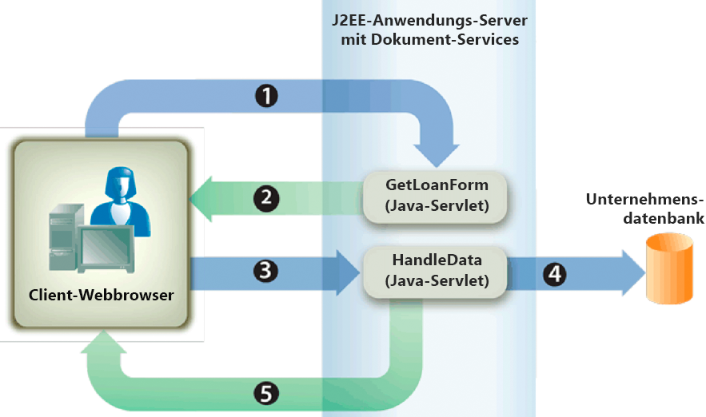

# Rendern interaktiver PDF forms {#rendering-interactive-pdf-forms}

**Beispiele und Beispiele in diesem Dokument gelten nur für die Umgebung AEM Forms on JEE.**

Der Forms-Dienst rendert interaktive PDF forms auf Client-Geräte (in der Regel Webbrowser), um Benutzerdaten zu erfassen. Nach der Wiedergabe eines interaktiven Formulars kann der Benutzer Daten in Formularfelder eingeben und auf eine Senden-Schaltfläche im Formular klicken, um Informationen an den Forms-Dienst zurückzusenden. Adobe Reader oder Acrobat müssen auf dem Computer installiert sein, auf dem der Client-Webbrowser ausgeführt wird, damit ein interaktives PDF-Formular sichtbar ist.

>[!NOTE]
>
>Bevor Sie ein Formular mit dem Forms-Dienst wiedergeben können, erstellen Sie einen Formularentwurf. In der Regel wird ein Formularentwurf in Designer erstellt und als XDP-Datei gespeichert. Informationen zum Erstellen eines Formularentwurfs finden Sie unter [Forms Designer](https://www.adobe.com/go/learn_aemforms_designer_63).

**Beispiel für einen Kreditantrag**

Ein Beispiel für einen Kreditantrag wird vorgestellt, um zu veranschaulichen, wie der Forms-Dienst interaktive Formulare nutzt, um Informationen von Benutzern zu erfassen. Mit dieser Anwendung kann ein Benutzer ein Formular mit Daten ausfüllen, die zur Sicherung eines Kredits erforderlich sind, und dann Daten an den Forms-Dienst senden. Das folgende Diagramm zeigt den logischen Fluss des Kreditantrags.



Die folgende Tabelle beschreibt die Schritte in diesem Diagramm.

<table>
 <thead>
  <tr>
   <th><p>Schritt</p></th>
   <th><p>Beschreibung</p></th>
  </tr>
 </thead>
 <tbody>
  <tr>
   <td><p>1</p></td>
   <td><p>Das Java-Servlet <code>GetLoanForm</code> wird von einer HTML-Seite aufgerufen. </p></td>
  </tr>
  <tr>
   <td><p>2</p></td>
   <td><p>Das Java-Servlet <code>GetLoanForm</code> verwendet die Forms-Dienst-Client-API, um das Kreditformular an den Client-Webbrowser zu rendern. (Siehe <a href="#render-an-interactive-pdf-form-using-the-java-api">Interaktives PDF-Formular mit der Java-API</a> rendern.)</p></td>
  </tr>
  <tr>
   <td><p>3</p></td>
   <td><p>Nachdem der Benutzer das Kreditangebot ausgefüllt und auf die Senden-Schaltfläche geklickt hat, werden die Daten an das Java-Servlet <code>HandleData</code> gesendet. (Siehe <i>"Darlehensformular"</i>.)</p></td>
  </tr>
  <tr>
   <td><p>4</p></td>
   <td><p>Das Java-Servlet <code>HandleData</code> verwendet die Forms-Dienst-Client-API, um die Formularübermittlung zu verarbeiten und Formulardaten abzurufen. Die Daten werden dann in einer Unternehmensdatenbank gespeichert. (Siehe <a href="/help/forms/developing/handling-submitted-forms.md#handling-submitted-forms">Behandeln des übermittelten Forms</a>.)</p></td>
  </tr>
  <tr>
   <td><p>5</p></td>
   <td><p>Ein Bestätigungsformular wird an den Webbrowser zurückgegeben. Daten wie der Vor- und Nachname des Benutzers werden mit dem Formular zusammengeführt, bevor es wiedergegeben wird. (Siehe <a href="/help/forms/developing/prepopulating-forms-flowable-layouts.md">Vorausfüllen von Forms mit flexiblen Layouts</a>.)</p></td>
  </tr>
 </tbody>
</table>

**Darlehensformular**

Dieses interaktive Darlehensformular wird durch das Java-Servlet des Beispielkreditantrags `GetLoanForm` wiedergegeben.


**Bestätigungsformular**

Dieses Formular wird vom Java-Servlet des Beispielkreditantrags (`HandleData`) wiedergegeben.


Das Java-Servlet `HandleData` füllt dieses Formular vorab mit dem Vor- und Nachnamen des Benutzers sowie dem Betrag. Nachdem das Formular vorausgefüllt wurde, wird es an den Client-Webbrowser gesendet. (Siehe [Vorausfüllen von Forms mit flexiblen Layouts](/help/forms/developing/prepopulating-forms-flowable-layouts.md))

**Java-Servlets**

Der Beispielkreditantrag ist ein Beispiel für eine Forms-Dienstanwendung, die als Java-Servlet existiert. Ein Java-Servlet ist ein Java-Programm, das auf einem J2EE-Anwendungsserver wie WebSphere ausgeführt wird und den Forms-Dienst-Client-API-Code enthält.

Der folgende Code zeigt die Syntax eines Java-Servlets mit dem Namen GetLoanForm:

```java
     public class GetLoanForm extends HttpServlet implements Servlet {
         public void doGet(HttpServletRequest req, HttpServletResponse resp
         throws ServletException, IOException {

         }
         public void doPost(HttpServletRequest req, HttpServletResponse resp
         throws ServletException, IOException {

             }
```

Normalerweise platzieren Sie Forms-Dienst-Client-API-Code nicht in der `doGet`- oder `doPost`-Methode eines Java-Servlets. Es ist besser, diesen Code in einer separaten Klasse zu platzieren, die Klasse innerhalb der `doPost`-Methode (oder `doGet`-Methode) zu instanziieren und die entsprechenden Methoden aufzurufen. Bei einer kürzeren Codeausführung werden die Codebeispiele in diesem Abschnitt jedoch auf ein Minimum beschränkt und Codebeispiele werden in die `doPost`-Methode eingefügt.

>[!NOTE]
>
>Weitere Informationen zum Forms-Dienst finden Sie unter [Dienste-Referenz für AEM Forms](https://www.adobe.com/go/learn_aemforms_services_63).

**Zusammenfassung der Schritte**

So rendern Sie ein interaktives PDF-Formular:

1. Schließen Sie Projektdateien ein.
1. Erstellen Sie ein Forms Client-API-Objekt.
1. Geben Sie URI-Werte an.
1. Anhängen von Dateien an das Formular (optional).
1. Interaktives PDF-Formular wiedergeben
1. Schreiben Sie den Formulardatenstream in den Client-Webbrowser.

**Projektdateien einschließen**

Schließen Sie die erforderlichen Dateien in Ihr Entwicklungsprojekt ein. Wenn Sie eine Clientanwendung mit Java erstellen, schließen Sie die erforderlichen JAR-Dateien ein. Wenn Sie Webdienste verwenden, stellen Sie sicher, dass Sie die Proxydateien einschließen.

**Forms Client API-Objekt erstellen**

Bevor Sie einen Forms-Dienst-Client-API-Vorgang programmgesteuert durchführen können, müssen Sie ein Forms Client-API-Objekt erstellen. Wenn Sie die Java-API verwenden, erstellen Sie ein `FormsServiceClient`-Objekt. Wenn Sie die Forms-Webdienst-API verwenden, erstellen Sie ein `FormsService`-Objekt.

**URI-Werte angeben**

Sie können URI-Werte angeben, die der Forms-Dienst zum Rendern eines Formulars benötigt. Ein Formularentwurf, der als Teil einer Forms-Anwendung gespeichert wird, kann mit dem Inhaltsstamm-URI-Wert `repository:///` referenziert werden. Betrachten Sie beispielsweise den folgenden Formularentwurf mit dem Namen *Loan.xdp*, der sich in einer Forms-Anwendung mit dem Namen *FormsApplication* befindet:


Um auf diesen Formularentwurf zuzugreifen, geben Sie `Applications/FormsApplication/1.0/FormsFolder/Loan.xdp` als Formularnamen (den ersten Parameter, der an die `renderPDFForm`-Methode übergeben wird) und `repository:///` als Inhaltsstamm-URI-Wert an.

>[!NOTE]
>
>Informationen zum Erstellen einer Forms-Anwendung mit Workbench finden Sie unter [Workbench Help](https://www.adobe.com/go/learn_aemforms_workbench_63).

Der Pfad zu einer Ressource in einer Forms-Anwendung lautet:

`Applications/Application-name/Application-version/Folder.../Filename`

Die folgenden Werte zeigen einige Beispiele für URI-Werte:

* Applications/AppraisalReport/1.0/Forms/FullForm.xdp
* Applications/AnotherApp/1.1/Assets/picture.jpg
* Applications/SomeApp/2.0/Resources/Data/XSDs/MyData.xsd

Beim Wiedergeben eines interaktiven Formulars können Sie URI-Werte wie die URL der Zielgruppe definieren, an die die Formulardaten gesendet werden. Die Zielgruppen-URL kann auf eine der folgenden Arten definiert werden:

* Klicken Sie beim Entwerfen des Formularentwurfs in Designer auf die Schaltfläche &quot;Senden&quot;
* Verwenden der Forms-Dienst-Client-API

Wenn die Zielgruppen-URL im Formularentwurf definiert ist, überschreiben Sie sie nicht mit der Forms-Dienst-Client-API. Wenn Sie also die Zielgruppen-URL mit der Forms-API festlegen, wird die angegebene URL im Formularentwurf auf die mit der API angegebene URL zurückgesetzt. Wenn Sie das PDF-Formular an die im Formularentwurf angegebene Zielgruppen-URL senden möchten, setzen Sie die Zielgruppen-URL programmgesteuert auf eine leere Zeichenfolge.

Wenn Sie über ein Formular mit einer Senden- und einer Berechnungsschaltfläche verfügen (mit einem entsprechenden Skript, das auf dem Server ausgeführt wird), können Sie programmgesteuert die URL definieren, an die das Formular gesendet wird, um das Skript auszuführen. Verwenden Sie die Senden-Schaltfläche im Formularentwurf, um die URL anzugeben, an die die Formulardaten gesendet werden. (Siehe [Berechnen von Formulardaten](/help/forms/developing/calculating-form-data.md).)

>[!NOTE]
>
>Anstatt einen URL-Wert anzugeben, der auf eine XDP-Datei verweist, können Sie auch eine `com.adobe.idp.Document`-Instanz an den Forms-Dienst übergeben. Die `com.adobe.idp.Document`-Instanz enthält einen Formularentwurf. (Siehe [Übergeben von Dokumenten an den Forms-Dienst](/help/forms/developing/passing-documents-forms-service.md).)

**Anhängen von Dateien an das Formular**

Sie können Dateien an ein Formular anhängen. Wenn Sie ein PDF-Formular mit Dateianlagen wiedergeben, können Benutzer die Dateianlagen in Acrobat über den Bereich &quot;Dateianlagen&quot;abrufen. Sie können verschiedene Dateitypen an ein Formular, wie z. B. eine Textdatei, oder an eine Binärdatei wie eine JPG-Datei anhängen.

>[!NOTE]
>
>Das Anhängen von Dateianlagen an ein Formular ist optional.

**Interaktives PDF-Formular wiedergeben**

Verwenden Sie zum Wiedergeben eines Formulars einen Formularentwurf, der in Designer erstellt und als XDP- oder PDF-Datei gespeichert wurde. Außerdem können Sie ein Formular wiedergeben, das mit Acrobat erstellt und als PDF-Datei gespeichert wurde. Um ein interaktives PDF-Formular wiederzugeben, rufen Sie die `FormsServiceClient`-Methode des Objekts `renderPDFForm` oder die `renderPDFForm2`-Methode auf.

Das `renderPDFForm`-Objekt verwendet ein `URLSpec`-Objekt. Der Inhaltsstamm der XDP-Datei wird mit der `URLSpec`-Objektmethode `setContentRootURI` an den Forms-Dienst übergeben. Der Name des Formularentwurfs ( `formQuery`) wird als separater Parameterwert übergeben. Die beiden Werte werden verkettet, um den absoluten Verweis auf den Formularentwurf zu erhalten.

Die `renderPDFForm2`-Methode akzeptiert eine `com.adobe.idp.Document`-Instanz, die das zu rendernde XDP- oder PDF-Dokument enthält.

>[!NOTE]
>
>Die Laufzeitoption für PDF-Dateien mit Tags kann nicht eingestellt werden, wenn das Eingabedateien ein PDF-Dokument ist. Wenn es sich bei der Eingabedatei um eine XDP-Datei handelt, kann die PDF-Option mit Tags festgelegt werden.

## Wiedergeben eines interaktiven PDF-Formulars mit der Java-API {#render-an-interactive-pdf-form-using-the-java-api}

Interaktives PDF-Formular mit der Forms API (Java) rendern:

1. Projektdateien einschließen

   Schließen Sie Client-JAR-Dateien wie &quot;adobe-forms-client.jar&quot;im Klassenpfad Ihres Java-Projekts ein.

1. Forms Client API-Objekt erstellen

   * Erstellen Sie ein `ServiceClientFactory`-&quot; -Objekt, das Verbindungseigenschaften enthält.
   * Erstellen Sie ein `FormsServiceClient`-Objekt, indem Sie den Konstruktor verwenden und das `ServiceClientFactory`-Objekt übergeben.

1. URI-Werte angeben

   * Erstellen Sie ein `URLSpec`-Objekt, das URI-Werte mithilfe seines Konstruktors speichert.
   * Rufen Sie die `setApplicationWebRoot`-Methode des Objekts auf und übergeben Sie einen Zeichenfolgenwert, der den Webstamm der Anwendung darstellt.`URLSpec`
   * Rufen Sie die `setContentRootURI`-Methode des Objekts auf und übergeben Sie einen Zeichenfolgenwert, der den Inhaltsstamm-URI-Wert angibt. `URLSpec` Stellen Sie sicher, dass sich der Formularentwurf im Inhaltsstamm-URI befindet. Andernfalls gibt der Forms-Dienst eine Ausnahme aus. Um auf das Repository zu verweisen, geben Sie `repository:///` an.
   * Rufen Sie die `setTargetURL`-Methode des Objekts auf und übergeben Sie einen Zeichenfolgenwert, der den URL-Wert der Zielgruppe angibt, an den die Formulardaten gesendet werden. `URLSpec` Wenn Sie die Zielgruppen-URL im Formularentwurf definieren, können Sie eine leere Zeichenfolge übergeben. Sie können auch die URL angeben, an die ein Formular gesendet wird, um Berechnungen durchzuführen.

1. Anhängen von Dateien an das Formular

   * Erstellen Sie ein `java.util.HashMap`-Objekt, um Dateianhänge mit dem Konstruktor zu speichern.
   * Rufen Sie die `java.util.HashMap`-Methode des Objekts `put` für jede Datei auf, die an das wiedergegebene Formular angehängt werden soll. Übergeben Sie die folgenden Werte an diese Methode:

      * Ein Zeichenfolgenwert, der den Namen der Dateianlage einschließlich der Dateinamenerweiterung angibt.
   * Ein `com.adobe.idp.Document`-Objekt, das die Dateianlage enthält.

   >[!NOTE]
   >
   >Wiederholen Sie diesen Schritt für jede Datei, die an das Formular angehängt werden soll. Dieser Schritt ist optional und Sie können `null` übergeben, wenn Sie keine Dateianlagen senden möchten.

1. Interaktives PDF-Formular wiedergeben

   Rufen Sie die `renderPDFForm`-Methode des Objekts auf und übergeben Sie die folgenden Werte:`FormsServiceClient`

   * Ein Zeichenfolgenwert, der den Namen des Formularentwurfs einschließlich der Dateinamenerweiterung angibt. Wenn Sie auf einen Formularentwurf verweisen, der Teil einer Forms-Anwendung ist, stellen Sie sicher, dass Sie den vollständigen Pfad angeben, z. B. `Applications/FormsApplication/1.0/FormsFolder/Loan.xdp`.
   * Ein `com.adobe.idp.Document`-Objekt, das Daten enthält, die mit dem Formular zusammengeführt werden sollen. Wenn Sie keine Daten zusammenführen möchten, übergeben Sie ein leeres `com.adobe.idp.Document`-Objekt.
   * Ein `PDFFormRenderSpec`-Objekt, das Laufzeitoptionen speichert. Dies ist ein optionaler Parameter und Sie können `null` angeben, wenn Sie keine Laufzeitoptionen angeben möchten.
   * Ein `URLSpec`-Objekt, das URI-Werte enthält, die vom Forms-Dienst benötigt werden.
   * Ein `java.util.HashMap`-Objekt, das Dateianlagen speichert. Dies ist ein optionaler Parameter und Sie können `null` angeben, wenn Sie keine Dateien an das Formular anhängen möchten.

   Die `renderPDFForm`-Methode gibt ein `FormsResult`-Objekt zurück, das einen Formulardatenstream enthält, der in den Client-Webbrowser geschrieben werden muss.

1. Schreiben des Formulardatenstreams in den Client-Webbrowser

   * Erstellen Sie ein `com.adobe.idp.Document`-Objekt, indem Sie die `FormsResult`-Methode &quot;s `getOutputContent`&quot;aufrufen.
   * Rufen Sie den Inhaltstyp des `com.adobe.idp.Document`-Objekts ab, indem Sie dessen `getContentType`-Methode aufrufen.
   * Legen Sie den Inhaltstyp des Objekts `javax.servlet.http.HttpServletResponse` fest, indem Sie die `setContentType`-Methode aufrufen und den Inhaltstyp des `com.adobe.idp.Document`-Objekts übergeben.
   * Erstellen Sie ein `javax.servlet.ServletOutputStream`-Objekt, das zum Schreiben des Formulardatenstreams in den Client-Webbrowser verwendet wird, indem Sie die `getOutputStream`-Methode des Objekts aufrufen.`javax.servlet.http.HttpServletResponse`
   * Erstellen Sie ein `java.io.InputStream`-Objekt, indem Sie die `com.adobe.idp.Document`-Methode des Objekts `getInputStream` aufrufen.
   * Erstellen Sie ein Bytearray und füllen Sie es mit dem Formulardatenstream, indem Sie die `read`-Methode des Objekts aufrufen und das Bytearray als Argument übergeben.`InputStream`
   * Rufen Sie die `write`-Methode des Objekts auf, um den Formulardatenstream an den Client-Webbrowser zu senden. `javax.servlet.ServletOutputStream` Übergeben Sie das Bytearray an die `write`-Methode.

## Interaktives PDF-Formular mit der Webdienst-API {#render-an-interactive-pdf-form-using-the-web-service-api} wiedergeben

Interaktives PDF-Formular mit der Forms API (Webdienst) wiedergeben:

1. Projektdateien einschließen

   * Erstellen Sie Java-Proxyklassen, die die Forms-Dienst-WSDL verwenden.
   * Schließen Sie die Java-Proxyklassen in Ihren Klassenpfad ein.

1. Forms Client API-Objekt erstellen

   Erstellen Sie ein `FormsService`-Objekt und legen Sie Authentifizierungswerte fest.

1. URI-Werte angeben

   * Erstellen Sie ein `URLSpec`-Objekt, das URI-Werte mithilfe seines Konstruktors speichert.
   * Rufen Sie die `setApplicationWebRoot`-Methode des Objekts auf und übergeben Sie einen Zeichenfolgenwert, der den Webstamm der Anwendung darstellt.`URLSpec`
   * Rufen Sie die `setContentRootURI`-Methode des Objekts auf und übergeben Sie einen Zeichenfolgenwert, der den Inhaltsstamm-URI-Wert angibt. `URLSpec` Stellen Sie sicher, dass sich der Formularentwurf im Inhaltsstamm-URI befindet. Andernfalls gibt der Forms-Dienst eine Ausnahme aus. Um auf das Repository zu verweisen, geben Sie `repository:///` an.
   * Rufen Sie die `setTargetURL`-Methode des Objekts auf und übergeben Sie einen Zeichenfolgenwert, der den URL-Wert der Zielgruppe angibt, an den die Formulardaten gesendet werden. `URLSpec` Wenn Sie die Zielgruppen-URL im Formularentwurf definieren, können Sie eine leere Zeichenfolge übergeben. Sie können auch die URL angeben, an die ein Formular gesendet wird, um Berechnungen durchzuführen.

1. Anhängen von Dateien an das Formular

   * Erstellen Sie ein `java.util.HashMap`-Objekt, um Dateianhänge mit dem Konstruktor zu speichern.
   * Rufen Sie die `java.util.HashMap`-Methode des Objekts `put` für jede Datei auf, die an das wiedergegebene Formular angehängt werden soll. Übergeben Sie die folgenden Werte an diese Methode:

      * Ein Zeichenfolgenwert, der den Namen der Dateianlage einschließlich der Dateinamenerweiterung angibt
   * Ein `BLOB`-Objekt, das die Dateianlage enthält

   >[!NOTE]
   >
   >Wiederholen Sie diesen Schritt für jede Datei, die an das Formular angehängt werden soll.

1. Interaktives PDF-Formular wiedergeben

   Rufen Sie die `renderPDFForm`-Methode des Objekts auf und übergeben Sie die folgenden Werte:`FormsService`

   * Ein Zeichenfolgenwert, der den Namen des Formularentwurfs einschließlich der Dateinamenerweiterung angibt. Wenn Sie auf einen Formularentwurf verweisen, der Teil einer Forms-Anwendung ist, stellen Sie sicher, dass Sie den vollständigen Pfad angeben, z. B. `Applications/FormsApplication/1.0/FormsFolder/Loan.xdp`.
   * Ein `BLOB`-Objekt, das Daten enthält, die mit dem Formular zusammengeführt werden sollen. Wenn Sie keine Daten zusammenführen möchten, übergeben Sie `null`.
   * Ein `PDFFormRenderSpec`-Objekt, das Laufzeitoptionen speichert. Dies ist ein optionaler Parameter und Sie können `null` angeben, wenn Sie keine Laufzeitoptionen angeben möchten.
   * Ein `URLSpec`-Objekt, das URI-Werte enthält, die vom Forms-Dienst benötigt werden.
   * Ein `java.util.HashMap`-Objekt, das Dateianlagen speichert. Dies ist ein optionaler Parameter und Sie können `null` angeben, wenn Sie keine Dateien an das Formular anhängen möchten.
   * Ein leeres `com.adobe.idp.services.holders.BLOBHolder`-Objekt, das von der Methode gefüllt wird. Auf diese Weise wird das gerenderte PDF-Formular gespeichert.
   * Ein leeres `javax.xml.rpc.holders.LongHolder`-Objekt, das von der Methode gefüllt wird. (Dieses Argument speichert die Anzahl der Seiten im Formular.)
   * Ein leeres `javax.xml.rpc.holders.StringHolder`-Objekt, das von der Methode gefüllt wird. (Dieses Argument speichert den Gebietsschemawert.)
   * Ein leeres `com.adobe.idp.services.holders.FormsResultHolder`-Objekt, das die Ergebnisse dieses Vorgangs enthält.

   Die `renderPDFForm`-Methode füllt das `com.adobe.idp.services.holders.FormsResultHolder`-Objekt, das als letzter Argumentwert übergeben wird, mit einem Formulardatenstream, der in den Client-Webbrowser geschrieben werden muss.

1. Schreiben des Formulardatenstreams in den Client-Webbrowser

   * Erstellen Sie ein `FormResult`-Objekt, indem Sie den Wert des `com.adobe.idp.services.holders.FormsResultHolder`-Datenelements des Objekts `value` abrufen.
   * Erstellen Sie ein `BLOB`-Objekt, das Formulardaten enthält, indem Sie die `getOutputContent`-Methode des Objekts aufrufen.`FormsResult`
   * Rufen Sie den Inhaltstyp des `BLOB`-Objekts ab, indem Sie dessen `getContentType`-Methode aufrufen.
   * Legen Sie den Inhaltstyp des Objekts `javax.servlet.http.HttpServletResponse` fest, indem Sie die `setContentType`-Methode aufrufen und den Inhaltstyp des `BLOB`-Objekts übergeben.
   * Erstellen Sie ein `javax.servlet.ServletOutputStream`-Objekt, das zum Schreiben des Formulardatenstreams in den Client-Webbrowser verwendet wird, indem Sie die `getOutputStream`-Methode des Objekts aufrufen.`javax.servlet.http.HttpServletResponse`
   * Erstellen Sie ein Bytearray und füllen Sie es durch Aufrufen der `BLOB`-Methode des Objekts `getBinaryData`. Diese Aufgabe weist dem Bytearray den Inhalt des Objekts `FormsResult` zu.
   * Rufen Sie die `write`-Methode des Objekts auf, um den Formulardatenstream an den Client-Webbrowser zu senden. `javax.servlet.http.HttpServletResponse` Übergeben Sie das Bytearray an die `write`-Methode.

**Schreiben des Formulardatenstreams in den Client-Webbrowser**

Wenn der Forms-Dienst ein Formular wiedergibt, gibt er einen Formulardatenstream zurück, den Sie in den Client-Webbrowser schreiben müssen. Beim Schreiben in den Client-Webbrowser ist das Formular für den Benutzer sichtbar.
