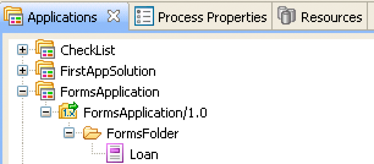

# Rendern interaktiver PDF forms {#rendering-interactive-pdf-forms}

**Beispiele und Beispiele in diesem Dokument gelten nur für die AEM Forms on JEE-Umgebung.**

Der Forms-Dienst rendert interaktive PDF forms an Client-Geräte, normalerweise Webbrowser, um Benutzerinformationen zu erfassen. Nachdem ein interaktives Formular wiedergegeben wurde, kann ein Benutzer Daten in Formularfelder eingeben und auf eine Senden-Schaltfläche im Formular klicken, um Informationen zurück an den Forms-Dienst zu senden. Adobe Reader oder Acrobat müssen auf dem Computer installiert sein, der den Client-Webbrowser hostet, damit ein interaktives PDF-Formular sichtbar ist.

>[!NOTE]
>
>Bevor Sie ein Formular mit dem Forms-Dienst wiedergeben können, erstellen Sie einen Formularentwurf. In der Regel wird ein Formularentwurf in Designer erstellt und als XDP-Datei gespeichert. Weitere Informationen zum Erstellen eines Formularentwurfs finden Sie unter [Forms Designer](https://www.adobe.com/go/learn_aemforms_designer_63).

**Beispiel für einen Kreditantrag**

Ein Beispiel für einen Kreditantrag wird eingeführt, um zu veranschaulichen, wie der Forms-Dienst interaktive Formulare verwendet, um Informationen von Benutzern zu erfassen. Mit dieser Anwendung kann ein Benutzer ein Formular mit Daten ausfüllen, die zur Sicherung eines Kredits erforderlich sind, und dann Daten an den Forms-Dienst senden. Das folgende Diagramm zeigt den Logikfluss des Kreditantrags.


Die folgende Tabelle beschreibt die Schritte in diesem Diagramm.

<table>
 <thead>
  <tr>
   <th><p>Schritt</p></th>
   <th><p>Beschreibung</p></th>
  </tr>
 </thead>
 <tbody>
  <tr>
   <td><p>1</p></td>
   <td><p>Das Java-Servlet <code>GetLoanForm</code> wird von einer HTML-Seite aus aufgerufen. </p></td>
  </tr>
  <tr>
   <td><p>2</p></td>
   <td><p>Das Java-Servlet <code>GetLoanForm</code> verwendet die Forms-Dienst-Client-API, um das Darlehensformular an den Client-Webbrowser zu rendern. (Siehe <a href="#render-an-interactive-pdf-form-using-the-java-api">Rendern eines interaktiven PDF-Formulars mit der Java-API</a>.)</p></td>
  </tr>
  <tr>
   <td><p>3</p></td>
   <td><p>Nachdem der Benutzer das Darlehensformular ausgefüllt und auf die Senden-Schaltfläche geklickt hat, werden die Daten an das Java-Servlet <code>HandleData</code> gesendet. (Siehe <i>"Darlehensformular"</i>.)</p></td>
  </tr>
  <tr>
   <td><p>4</p></td>
   <td><p>Das Java-Servlet <code>HandleData</code> verwendet die Client-API des Forms-Dienstes, um die Formularübermittlung zu verarbeiten und Formulardaten abzurufen. Die Daten werden dann in einer Unternehmensdatenbank gespeichert. (Siehe <a href="/help/forms/developing/handling-submitted-forms.md#handling-submitted-forms">Handhabung der übermittelten Forms</a>.)</p></td>
  </tr>
  <tr>
   <td><p>5</p></td>
   <td><p>Ein Bestätigungsformular wird an den Webbrowser zurückgegeben. Daten wie der Vor- und Nachname des Benutzers werden mit dem Formular zusammengeführt, bevor es wiedergegeben wird. (Siehe <a href="/help/forms/developing/prepopulating-forms-flowable-layouts.md">Vorausfüllen von Forms mit flexiblen Layouts</a>.)</p></td>
  </tr>
 </tbody>
</table>

**Darlehensformular**

Dieses interaktive Darlehensformular wird vom Java-Servlet des Beispielantrags `GetLoanForm` des Kreditantrags wiedergegeben.


**Bestätigungsformular**

Dieses Formular wird durch das Java-Servlet des Beispielkreditantrags `HandleData` wiedergegeben.


Das Java-Servlet `HandleData` füllt dieses Formular vorab mit dem Vor- und Nachnamen des Benutzers sowie dem Betrag. Nachdem das Formular vorausgefüllt wurde, wird es an den Client-Webbrowser gesendet. (Siehe [Vorausfüllen von Forms mit flexiblen Layouts](/help/forms/developing/prepopulating-forms-flowable-layouts.md))

**Java-Servlets**

Der Beispielkreditantrag ist ein Beispiel für eine Forms-Dienstanwendung, die als Java-Servlet vorhanden ist. Ein Java-Servlet ist ein Java-Programm, das auf einem J2EE-Anwendungsserver wie WebSphere ausgeführt wird und den Client-API-Code des Forms-Dienstes enthält.

Der folgende Code zeigt die Syntax eines Java-Servlets mit dem Namen GetLoanForm:

```java
     public class GetLoanForm extends HttpServlet implements Servlet {
         public void doGet(HttpServletRequest req, HttpServletResponse resp
         throws ServletException, IOException {

         }
         public void doPost(HttpServletRequest req, HttpServletResponse resp
         throws ServletException, IOException {

             }
```

Normalerweise würden Sie den Client-API-Code des Forms-Dienstes nicht in der `doGet`- oder `doPost`-Methode eines Java-Servlets platzieren. Es empfiehlt sich, diesen Code innerhalb einer separaten Klasse zu platzieren, die Klasse aus der `doPost` -Methode zu instanziieren (oder `doGet` -Methode) und die entsprechenden Methoden aufzurufen. Für Codekürzungen werden die Codebeispiele in diesem Abschnitt jedoch auf ein Minimum beschränkt und Codebeispiele werden in die `doPost`-Methode eingefügt.

>[!NOTE]
>
>Weitere Informationen zum Forms-Dienst finden Sie unter [Dienstreferenz für AEM Forms](https://www.adobe.com/go/learn_aemforms_services_63).

**Zusammenfassung der Schritte**

Um ein interaktives PDF-Formular wiederzugeben, führen Sie die folgenden Aufgaben aus:

1. Projektdateien einschließen.
1. Erstellen Sie ein Forms Client-API-Objekt.
1. Geben Sie URI-Werte an.
1. Anhängen von Dateien an das Formular (optional).
1. Rendern eines interaktiven PDF-Formulars
1. Schreiben Sie den Formular-Datenstrom in den Client-Webbrowser.

**Projektdateien einschließen**

Fügen Sie die erforderlichen Dateien in Ihr Entwicklungsprojekt ein. Wenn Sie eine Clientanwendung mit Java erstellen, schließen Sie die erforderlichen JAR-Dateien ein. Wenn Sie Webdienste verwenden, stellen Sie sicher, dass Sie die Proxy-Dateien einschließen.

**Erstellen eines Forms Client-API-Objekts**

Bevor Sie einen Client-API-Vorgang für den Forms-Dienst programmgesteuert ausführen können, müssen Sie ein Forms Client-API-Objekt erstellen. Wenn Sie die Java-API verwenden, erstellen Sie ein `FormsServiceClient` -Objekt. Wenn Sie die Forms-Webdienst-API verwenden, erstellen Sie ein `FormsService` -Objekt.

**URI-Werte angeben**

Sie können URI-Werte angeben, die der Forms-Dienst zum Rendern eines Formulars benötigt. Ein Formularentwurf, der als Teil einer Forms-Anwendung gespeichert wird, kann mithilfe des Inhaltsstamm-URI-Werts `repository:///` referenziert werden. Betrachten Sie beispielsweise den folgenden Formularentwurf mit dem Namen *Loan.xdp* in einer Forms-Anwendung mit dem Namen *FormsApplication*:



Um auf diesen Formularentwurf zuzugreifen, geben Sie `Applications/FormsApplication/1.0/FormsFolder/Loan.xdp` als Formularnamen (der erste Parameter, der an die `renderPDFForm` -Methode übergeben wird) und `repository:///` als URI-Wert für den Inhaltsstamm an.

>[!NOTE]
>
>Informationen zum Erstellen einer Forms-Anwendung mit Workbench finden Sie unter [Workbench Help](https://www.adobe.com/go/learn_aemforms_workbench_63).

Der Pfad zu einer Ressource in einer Forms-Anwendung lautet:

`Applications/Application-name/Application-version/Folder.../Filename`

Die folgenden Werte zeigen einige Beispiele für URI-Werte:

* Applications/AppraisalReport/1.0/Forms/FullForm.xdp
* Applications/AnotherApp/1.1/Assets/picture.jpg
* Applications/SomeApp/2.0/Resources/Data/XSDs/MyData.xsd

Beim Rendern eines interaktiven Formulars können Sie URI-Werte definieren, z. B. die Ziel-URL, an die die Formulardaten gesendet werden. Die Ziel-URL kann auf eine der folgenden Arten definiert werden:

* Auf der Schaltfläche &quot;Senden&quot;beim Entwerfen des Formularentwurfs in Designer
* Verwendung der Client-API des Forms-Dienstes

Wenn die Ziel-URL im Formularentwurf definiert ist, darf sie nicht mit der Client-API des Forms-Dienstes überschrieben werden. Das heißt, durch Festlegen der Ziel-URL mithilfe der Forms-API wird die angegebene URL im Formularentwurf auf die URL zurückgesetzt, die mithilfe der API angegeben wurde. Wenn Sie das PDF-Formular an die im Formularentwurf angegebene Ziel-URL senden möchten, legen Sie die Ziel-URL programmgesteuert auf eine leere Zeichenfolge fest.

Wenn Sie ein Formular mit einer Senden-Schaltfläche und einer Berechnungsschaltfläche (mit einem entsprechenden Skript, das auf dem Server ausgeführt wird) haben, können Sie programmgesteuert die URL definieren, an die das Formular gesendet wird, um das Skript auszuführen. Verwenden Sie die Senden-Schaltfläche im Formularentwurf, um die URL anzugeben, an die die Formulardaten gesendet werden. (Siehe [Berechnen von Formulardaten](/help/forms/developing/calculating-form-data.md).)

>[!NOTE]
>
>Anstatt einen URL-Wert anzugeben, der auf eine XDP-Datei verweist, können Sie auch eine `com.adobe.idp.Document`-Instanz an den Forms-Dienst übergeben. Die `com.adobe.idp.Document`-Instanz enthält einen Formularentwurf. (Siehe [Übergeben von Dokumenten an den Forms-Dienst](/help/forms/developing/passing-documents-forms-service.md).)

**Anhängen von Dateien an das Formular**

Sie können Dateien an ein Formular anhängen. Wenn Sie ein PDF-Formular mit Dateianlagen wiedergeben, können Benutzer die Dateianlagen in Acrobat mithilfe des Bereichs Dateianlagen abrufen. Sie können verschiedene Dateitypen an ein Formular anhängen, z. B. eine Textdatei, oder an eine Binärdatei, z. B. eine JPG-Datei.

>[!NOTE]
>
>Das Anhängen von Dateianlagen an ein Formular ist optional.

**Rendern eines interaktiven PDF-Formulars**

Verwenden Sie zum Wiedergeben eines Formulars einen Formularentwurf, der in Designer erstellt und als XDP- oder PDF-Datei gespeichert wurde. Außerdem können Sie ein Formular wiedergeben, das mit Acrobat erstellt und als PDF-Datei gespeichert wurde. Um ein interaktives PDF-Formular wiederzugeben, rufen Sie die `renderPDFForm`-Methode oder die `renderPDFForm2`-Methode des Objekts auf.`FormsServiceClient`

`renderPDFForm` verwendet ein `URLSpec` -Objekt. Der Inhaltsstamm an die XDP-Datei wird mithilfe der `setContentRootURI` -Methode des Objekts `URLSpec` an den Forms-Dienst übergeben. Der Name des Formularentwurfs ( `formQuery`) wird als separater Parameterwert übergeben. Die beiden Werte werden verkettet, um den absoluten Verweis auf den Formularentwurf zu erhalten.

Die `renderPDFForm2`-Methode akzeptiert eine `com.adobe.idp.Document`-Instanz, die das zu rendernde XDP- oder PDF-Dokument enthält.

>[!NOTE]
>
>Die Option zur PDF-Laufzeit mit Tags kann nicht festgelegt werden, wenn das Eingabedokument ein PDF-Dokument ist. Wenn es sich bei der Eingabedatei um eine XDP-Datei handelt, kann die getaggte PDF-Option festgelegt werden.

## Rendern eines interaktiven PDF-Formulars mit der Java-API {#render-an-interactive-pdf-form-using-the-java-api}

Rendern Sie ein interaktives PDF-Formular mithilfe der Forms API (Java):

1. Projektdateien einschließen

   Schließen Sie Client-JAR-Dateien wie adobe-forms-client.jar in den Klassenpfad Ihres Java-Projekts ein.

1. Erstellen eines Forms Client-API-Objekts

   * Erstellen Sie ein `ServiceClientFactory`-&quot; -Objekt, das Verbindungseigenschaften enthält.
   * Erstellen Sie ein `FormsServiceClient` -Objekt, indem Sie dessen Konstruktor verwenden und das `ServiceClientFactory` -Objekt übergeben.

1. URI-Werte angeben

   * Erstellen Sie ein `URLSpec`-Objekt, das URI-Werte mithilfe seines Konstruktors speichert.
   * Rufen Sie die `setApplicationWebRoot` -Methode des Objekts `URLSpec` auf und übergeben Sie einen string -Wert, der den Webstamm der Anwendung darstellt.
   * Rufen Sie die `setContentRootURI` -Methode des Objekts `URLSpec` auf und übergeben Sie einen Zeichenfolgenwert, der den URI-Wert für den Inhaltsstamm angibt. Stellen Sie sicher, dass sich der Formularentwurf im Inhaltsstamm-URI befindet. Andernfalls gibt der Forms-Dienst eine Ausnahme aus. Um auf das Repository zu verweisen, geben Sie `repository:///` an.
   * Rufen Sie die `setTargetURL` -Methode des Objekts auf und übergeben Sie einen Zeichenfolgenwert, der den Ziel-URL-Wert angibt, an den die Formulardaten gesendet werden. `URLSpec` Wenn Sie die Ziel-URL im Formularentwurf definieren, können Sie eine leere Zeichenfolge übergeben. Sie können auch die URL angeben, an die ein Formular gesendet wird, um Berechnungen durchzuführen.

1. Anhängen von Dateien an das Formular

   * Erstellen Sie ein `java.util.HashMap`-Objekt zum Speichern von Dateianlagen mithilfe des zugehörigen Konstruktors.
   * Rufen Sie die `put`-Methode des Objekts `java.util.HashMap` für jede Datei auf, die an das wiedergegebene Formular angehängt werden soll. Übergeben Sie die folgenden Werte an diese Methode:

      * Ein string -Wert, der den Namen des Dateianhangs angibt, einschließlich der Dateinamenerweiterung.
   * Ein `com.adobe.idp.Document` -Objekt, das den Dateianhang enthält.

   >[!NOTE]
   >
   >Wiederholen Sie diesen Schritt für jede Datei, die an das Formular angehängt werden soll. Dieser Schritt ist optional und Sie können `null` übergeben, wenn Sie keine Dateianlagen senden möchten.

1. Rendern eines interaktiven PDF-Formulars

   Rufen Sie die `renderPDFForm` -Methode des Objekts `FormsServiceClient` auf und übergeben Sie die folgenden Werte:

   * Ein string -Wert, der den Namen des Formularentwurfs einschließlich der Dateinamenerweiterung angibt. Wenn Sie auf einen Formularentwurf verweisen, der Teil einer Forms-Anwendung ist, stellen Sie sicher, dass Sie den vollständigen Pfad angeben, z. B. `Applications/FormsApplication/1.0/FormsFolder/Loan.xdp`.
   * Ein `com.adobe.idp.Document` -Objekt, das Daten enthält, die mit dem Formular zusammengeführt werden sollen. Wenn Sie keine Daten zusammenführen möchten, übergeben Sie ein leeres `com.adobe.idp.Document` -Objekt.
   * Ein `PDFFormRenderSpec` -Objekt, das Laufzeitoptionen speichert. Dies ist ein optionaler Parameter. Sie können `null` angeben, wenn Sie keine Laufzeitoptionen angeben möchten.
   * Ein `URLSpec` -Objekt, das URI-Werte enthält, die für den Forms-Dienst erforderlich sind.
   * Ein `java.util.HashMap` -Objekt, das Dateianlagen speichert. Dies ist ein optionaler Parameter. Sie können `null` angeben, wenn Sie keine Dateien an das Formular anhängen möchten.

   Die `renderPDFForm`-Methode gibt ein `FormsResult`-Objekt zurück, das einen Formulardatenstream enthält, der in den Client-Webbrowser geschrieben werden muss.

1. Schreiben Sie den Formulardaten-Stream in den Client-Webbrowser

   * Erstellen Sie ein `com.adobe.idp.Document` -Objekt, indem Sie die `FormsResult` -Methode des Objekts &quot;s `getOutputContent` aufrufen.
   * Rufen Sie den Inhaltstyp des Objekts `com.adobe.idp.Document` ab, indem Sie dessen Methode `getContentType` aufrufen.
   * Legen Sie den Inhaltstyp des Objekts `javax.servlet.http.HttpServletResponse` fest, indem Sie seine `setContentType`-Methode aufrufen und den Inhaltstyp des Objekts `com.adobe.idp.Document` übergeben.
   * Erstellen Sie ein `javax.servlet.ServletOutputStream` -Objekt, das zum Schreiben des Formulardatenstreams in den Client-Webbrowser durch Aufrufen der `javax.servlet.http.HttpServletResponse` -Methode des Objekts `getOutputStream` verwendet wird.
   * Erstellen Sie ein `java.io.InputStream` -Objekt, indem Sie die `getInputStream` -Methode des Objekts `com.adobe.idp.Document` aufrufen.
   * Erstellen Sie ein Byte-Array und füllen Sie es mit dem Formulardatenstream, indem Sie die `read` -Methode des Objekts `InputStream` aufrufen und das Byte-Array als Argument übergeben.
   * Rufen Sie die `write` -Methode des Objekts `javax.servlet.ServletOutputStream` auf, um den Formulardatenstream an den Client-Webbrowser zu senden. Übergeben Sie das Byte-Array an die `write`-Methode.

## Rendern eines interaktiven PDF-Formulars mit der Webdienst-API {#render-an-interactive-pdf-form-using-the-web-service-api}

Wiedergabe eines interaktiven PDF-Formulars mit der Forms-API (Webdienst):

1. Projektdateien einschließen

   * Erstellen Sie Java-Proxyklassen, die die Forms-Dienst-WSDL verwenden.
   * Schließen Sie die Java-Proxy-Klassen in Ihren Klassenpfad ein.

1. Erstellen eines Forms Client-API-Objekts

   Erstellen Sie ein `FormsService` -Objekt und legen Sie Authentifizierungswerte fest.

1. URI-Werte angeben

   * Erstellen Sie ein `URLSpec`-Objekt, das URI-Werte mithilfe seines Konstruktors speichert.
   * Rufen Sie die `setApplicationWebRoot` -Methode des Objekts `URLSpec` auf und übergeben Sie einen string -Wert, der den Webstamm der Anwendung darstellt.
   * Rufen Sie die `setContentRootURI` -Methode des Objekts `URLSpec` auf und übergeben Sie einen Zeichenfolgenwert, der den URI-Wert für den Inhaltsstamm angibt. Stellen Sie sicher, dass sich der Formularentwurf im Inhaltsstamm-URI befindet. Andernfalls gibt der Forms-Dienst eine Ausnahme aus. Um auf das Repository zu verweisen, geben Sie `repository:///` an.
   * Rufen Sie die `setTargetURL` -Methode des Objekts auf und übergeben Sie einen Zeichenfolgenwert, der den Ziel-URL-Wert angibt, an den die Formulardaten gesendet werden. `URLSpec` Wenn Sie die Ziel-URL im Formularentwurf definieren, können Sie eine leere Zeichenfolge übergeben. Sie können auch die URL angeben, an die ein Formular gesendet wird, um Berechnungen durchzuführen.

1. Anhängen von Dateien an das Formular

   * Erstellen Sie ein `java.util.HashMap`-Objekt zum Speichern von Dateianlagen mithilfe des zugehörigen Konstruktors.
   * Rufen Sie die `put`-Methode des Objekts `java.util.HashMap` für jede Datei auf, die an das wiedergegebene Formular angehängt werden soll. Übergeben Sie die folgenden Werte an diese Methode:

      * Ein string -Wert, der den Namen des Dateianhangs angibt, einschließlich der Dateinamenerweiterung
   * Ein `BLOB` -Objekt, das den Dateianhang enthält

   >[!NOTE]
   >
   >Wiederholen Sie diesen Schritt für jede Datei, die an das Formular angehängt werden soll.

1. Rendern eines interaktiven PDF-Formulars

   Rufen Sie die `renderPDFForm` -Methode des Objekts `FormsService` auf und übergeben Sie die folgenden Werte:

   * Ein string -Wert, der den Namen des Formularentwurfs einschließlich der Dateinamenerweiterung angibt. Wenn Sie auf einen Formularentwurf verweisen, der Teil einer Forms-Anwendung ist, stellen Sie sicher, dass Sie den vollständigen Pfad angeben, z. B. `Applications/FormsApplication/1.0/FormsFolder/Loan.xdp`.
   * Ein `BLOB` -Objekt, das Daten enthält, die mit dem Formular zusammengeführt werden sollen. Wenn Sie keine Daten zusammenführen möchten, übergeben Sie `null`.
   * Ein `PDFFormRenderSpec` -Objekt, das Laufzeitoptionen speichert. Dies ist ein optionaler Parameter. Sie können `null` angeben, wenn Sie keine Laufzeitoptionen angeben möchten.
   * Ein `URLSpec` -Objekt, das URI-Werte enthält, die für den Forms-Dienst erforderlich sind.
   * Ein `java.util.HashMap` -Objekt, das Dateianlagen speichert. Dies ist ein optionaler Parameter. Sie können `null` angeben, wenn Sie keine Dateien an das Formular anhängen möchten.
   * Ein leeres `com.adobe.idp.services.holders.BLOBHolder` -Objekt, das von der -Methode ausgefüllt wird. Damit wird das wiedergegebene PDF-Formular gespeichert.
   * Ein leeres `javax.xml.rpc.holders.LongHolder` -Objekt, das von der -Methode ausgefüllt wird. (Dieses Argument speichert die Anzahl der Seiten im Formular.)
   * Ein leeres `javax.xml.rpc.holders.StringHolder` -Objekt, das von der -Methode ausgefüllt wird. (Dieses Argument speichert den Gebietsschemawert.)
   * Ein leeres `com.adobe.idp.services.holders.FormsResultHolder` -Objekt, das die Ergebnisse dieses Vorgangs enthält.

   Die `renderPDFForm`-Methode füllt das `com.adobe.idp.services.holders.FormsResultHolder`-Objekt, das als letzter Argumentwert übergeben wird, mit einem Formulardatenstream, der in den Client-Webbrowser geschrieben werden muss.

1. Schreiben Sie den Formulardaten-Stream in den Client-Webbrowser

   * Erstellen Sie ein `FormResult` -Objekt, indem Sie den Wert des `com.adobe.idp.services.holders.FormsResultHolder` -Datenelements des Objekts `value` abrufen.
   * Erstellen Sie ein `BLOB`-Objekt, das Formulardaten enthält, indem Sie die `getOutputContent` -Methode des Objekts `FormsResult` aufrufen.
   * Rufen Sie den Inhaltstyp des Objekts `BLOB` ab, indem Sie dessen Methode `getContentType` aufrufen.
   * Legen Sie den Inhaltstyp des Objekts `javax.servlet.http.HttpServletResponse` fest, indem Sie seine `setContentType`-Methode aufrufen und den Inhaltstyp des Objekts `BLOB` übergeben.
   * Erstellen Sie ein `javax.servlet.ServletOutputStream` -Objekt, das zum Schreiben des Formulardatenstreams in den Client-Webbrowser durch Aufrufen der `javax.servlet.http.HttpServletResponse` -Methode des Objekts `getOutputStream` verwendet wird.
   * Erstellen Sie ein Byte-Array und füllen Sie es durch Aufrufen der `getBinaryData`-Methode des Objekts `BLOB`. Diese Aufgabe weist den Inhalt des Objekts `FormsResult` dem Byte-Array zu.
   * Rufen Sie die `write` -Methode des Objekts `javax.servlet.http.HttpServletResponse` auf, um den Formulardatenstream an den Client-Webbrowser zu senden. Übergeben Sie das Byte-Array an die `write`-Methode.

**Schreiben Sie den Formulardaten-Stream in den Client-Webbrowser**

Wenn der Forms-Dienst ein Formular wiedergibt, wird ein Formulardatenstream zurückgegeben, den Sie in den Client-Webbrowser schreiben müssen. Beim Schreiben in den Client-Webbrowser ist das Formular für den Benutzer sichtbar.
