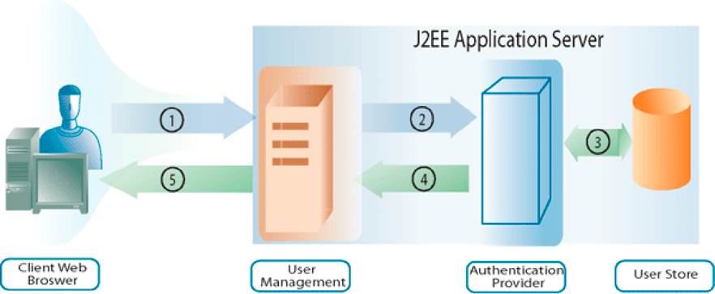
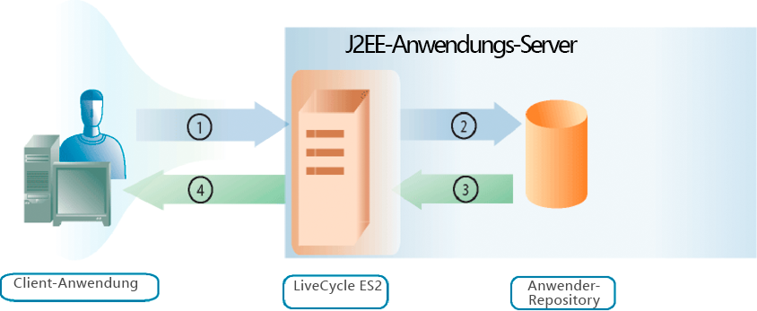

# Verwalten von Benutzern {#managing-users}

**Die Beispiele in diesem Dokument gelten nur für eine AEM Forms on JEE-Umgebung.**

**Über User Management**

Sie können die User Management-API verwenden, um Client-Programme zu erstellen, die Rollen, Berechtigungen und Prinzipale (welche Benutzende oder Gruppen sein können) verwalten und Benutzende authentifizieren können. Die User Management-API besteht aus den folgenden AEM Forms-APIs:

* Directory Manager Service-API
* Authentication Manager Service-API
* Authorization Manager Service-API

Mit User Management können Sie Rollen und Berechtigungen zuweisen, entfernen und festlegen. Außerdem können Sie Domains, Benutzer und Gruppen zuweisen, entfernen und abfragen. Schließlich können Sie User Management auch verwenden, um Benutzer zu authentifizieren.

In [Hinzufügen von Benutzern](users.md#adding-users) Sie erfahren, wie Sie Benutzer programmatisch hinzufügen. In diesem Abschnitt wird die Directory Manager Service-API verwendet.

In [Löschen von Benutzern](users.md#deleting-users) erfahren Sie, wie Sie Benutzer programmgesteuert löschen. In diesem Abschnitt wird die Directory Manager Service-API verwendet.

In [Verwalten von Benutzern und Gruppen](users.md#managing-users-and-groups) werden Sie den Unterschied zwischen einem lokalen Benutzer und einem Verzeichnisbenutzer verstehen und Beispiele für die Verwendung der Java- und Webservice-APIs zur programmgesteuerten Verwaltung von Benutzern und Gruppen sehen. In diesem Abschnitt wird die Directory Manager Service-API verwendet.

In [Verwalten von Rollen und Berechtigungen](users.md#managing-roles-and-permissions) lernen Sie die Systemrollen und -berechtigungen kennen und erfahren, wie Sie diese programmgesteuert erweitern können. Außerdem sehen Sie Beispiele, wie Sie die Java- und Webservice-APIs verwenden können, um Rollen und Berechtigungen programmgesteuert zu verwalten. In diesem Abschnitt werden sowohl die Directory Manager Service-API als auch die Authorization Manager Service-API verwendet.

In [Benutzerauthentifizierung](users.md#authenticating-users) sehen Sie Beispiele für die Verwendung der Java- und Webservice-APIs zur programmgesteuerten Authentifizierung von Benutzern. In diesem Abschnitt wird die Authorization Manager Service-API verwendet.

**Grundlagen zum Authentifizierungsprozess**

User Management bietet integrierte Authentifizierungsfunktionen und gibt Ihnen außerdem die Möglichkeit, eine Verbindung zu Ihrem eigenen Authentifizierungsanbieter herzustellen. Wenn User Management eine Authentifizierungsanfrage erhält (z. B. ein Benutzer versucht, sich anzumelden), werden Benutzerinformationen zur Authentifizierung an den Authentifizierungsanbieter weitergeleitet. User Management erhält die Ergebnisse vom Authentifizierungsanbieter, nachdem er den Benutzer authentifiziert hat.

Das folgende Diagramm zeigt die Interaktion zwischen einem Endbenutzer, der versucht, sich anzumelden, User Management und dem Authentifizierungsanbieter.

In der folgenden Tabelle werden die einzelnen Schritte des Authentifizierungsprozesses beschrieben.

<table>
 <thead>
  <tr>
   <th>
Schritt
</th>
   <th>
Beschreibung
</th>
  </tr>
 </thead>
 <tbody>
  <tr>
   <td>
1
</td>
   <td>
Ein Benutzer versucht, sich bei einem Service anzumelden, der User Management aufruft. Der Benutzer gibt einen Benutzernamen und ein Kennwort an. 
</td>
  </tr>
  <tr>
   <td>
2
</td>
   <td>
User Management sendet den Benutzernamen und das Passwort sowie Konfigurationsinformationen an den Authentifizierungsanbieter.
</td>
  </tr>
  <tr>
   <td>
3
</td>
   <td>
Der Authentifizierungsanbieter stellt eine Verbindung zum Benutzerspeicher her und authentifiziert den Benutzer.
</td>
  </tr>
  <tr>
   <td>
4
</td>
   <td>
Der Authentifizierungsanbieter gibt die Ergebnisse an User Management zurück.
</td>
  </tr>
  <tr>
   <td>
5
</td>
   <td>
User Management ermöglicht dem Benutzer entweder die Anmeldung oder verweigert den Zugriff auf das Produkt.
</td>
  </tr>
 </tbody>
</table>

>[!NOTE]
>
>Wenn die Zeitzone des Servers von der Zeitzone des Clients abweicht und der WSDL-Service für den Generate PDF-Service von AEM Forms auf einem nativen SOAP-Stapel mit einem .NET-Client auf einem WebSphere-Programm-Server-Cluster verwendet wird, kann der folgende User Management-Authentifizierungsfehler auftreten:

`[com.adobe.idp.um.webservices.WSSecurityHandler] errorCode:12803 errorCodeHEX:0x3203 message:WSSecurityHandler: UM authenticate returns exception : An error was discovered processing the <wsse:Security> header. (WSSecurityEngine: Invalid timestamp The security semantics of message have expired).`

**Grundlegendes zur Verzeichnisverwaltung**

User Management wird mit einem Verzeichnis-Service (DirectoryManagerService) geliefert, der Verbindungen zu LDAP-Verzeichnissen unterstützt. Wenn Ihr Unternehmen zum Speichern von Benutzereinträgen ein Nicht-LDAP-Repository verwendet, können Sie einen eigenen Verzeichnis-Service erstellen, der mit Ihrem Repository funktioniert.

Verzeichnis-Services rufen auf Anfrage von User Management Einträge aus einem Benutzerspeicher ab. User Management speichert regelmäßig Benutzer- und Gruppeneinträge in der Datenbank zwischen, um die Leistung zu verbessern.

Der Verzeichnis-Service kann verwendet werden, um die User Management-Datenbank mit dem Benutzerspeicher zu synchronisieren. Dieser Schritt stellt sicher, dass alle Benutzerverzeichnisinformationen sowie alle Benutzer- und Gruppeneinträge auf dem neuesten Stand sind.

Darüber hinaus bietet Ihnen der DirectoryManagerService die Möglichkeit, Domains zu erstellen und zu verwalten. Domains definieren unterschiedliche Benutzerbasen. Die Begrenzung einer Domain wird in der Regel entsprechend der Struktur Ihrer Organisation oder der Einrichtung Ihres Benutzerspeichers definiert. User Management-Domains bieten Konfigurationseinstellungen, die von Authentifizierungsanbietern und Anbietern von Verzeichnis-Services verwendet werden.

In der Konfigurations-XML, die von User Management exportiert wird, enthält der Stammknoten mit dem Attributwert `Domains` ein XML-Element für jede Domain, die für User Management definiert ist. Jedes dieser Elemente enthält andere Elemente, die Aspekte der Domain definieren, die bestimmten Service-Anbietern zugeordnet sind.

**Grundlegendes zu objectSID-Werten**

Bei der Verwendung von Active Directory ist es wichtig zu verstehen, dass ein `objectSID`-Wert kein eindeutiges Attribut über mehrere Domains hinweg ist. Dieser Wert speichert die Sicherheitskennung eines Objekts. In einer Umgebung mit mehreren Domains (z. B. einer Baumstruktur von Domains) kann der `objectSID`-Wert anders sein.

Ein `objectSID`-Wert würde sich ändern, wenn ein Objekt von einer Active Directory-Domain in eine andere Domain verschoben wird. Einige Objekte haben überall in der Domain den gleichen `objectSID`-Wert. Beispielsweise hätten Gruppen wie „BUILTIN\Administrators“, „BUILTIN\Power Users“ usw. denselben `objectSID`-Wert, unabhängig von den Domains. Diese `objectSID`-Werte sind bekannt.

## Hinzufügen von Benutzern {#adding-users}

Sie können die Directory Manager Service-API (Java und Webservice) verwenden, um programmgesteuert Benutzer zu AEM Forms hinzuzufügen. Nachdem Sie einen Benutzer hinzugefügt haben, können Sie diesen Benutzer beim Ausführen eines Service-Vorgangs verwenden, für den ein Benutzer erforderlich ist. Beispielsweise können Sie dem neuen Benutzer eine Aufgabe zuweisen.

### Zusammenfassung der Schritte {#summary-of-steps}

Um einen Benutzer hinzuzufügen, führen Sie die folgenden Schritte aus:

1. Schließen Sie Projektdateien ein.
1. Erstellen Sie einen DirectoryManagerService-Client.
1. Definieren Sie Benutzerinformationen.
1. Fügen Sie den Benutzer zu AEM Forms hinzu.
1. Überprüfen Sie, dass der Benutzer hinzugefügt wurde.

**Einbinden von Projektdateien**

Schließen Sie die erforderlichen Dateien in Ihr Entwicklungsprojekt ein. Wenn Sie ein Client-Programm mit Java erstellen, schließen Sie die erforderlichen JAR-Dateien ein. Wenn Sie Web-Services verwenden, schließen Sie die Proxy-Dateien ein.

**Erstellen eines DirectoryManagerService-Clients**

Bevor Sie einen Directory Manager Service-Vorgang programmgesteuert durchführen können, erstellen Sie einen Directory Manager Service-API-Client.

**Definieren von Benutzerinformationen**

Wenn Sie einen neuen Benutzer mithilfe der Directory Manager Service-API hinzufügen, definieren Sie Informationen für diesen Benutzer. Wenn Sie einen neuen Benutzer hinzufügen, definieren Sie normalerweise die folgenden Werte:

* **Domain-Name**: Die Domain, zu der der Benutzer gehört (z. B. `DefaultDom`).
* **Benutzerkennungswert**: Der Kennungswert des Benutzers (z. B. `wblue`).
* **Prinzipaltyp**: Der Typ des Benutzers (Sie können beispielsweise `USER)` angeben).
* **Vorname**: Ein Vorname für den Benutzer (z. B. `Wendy`).
* **Nachname**: Der Familienname des Benutzers (z. B. `Blue)`).
* **Gebietsschema**: Gebietsschema-Informationen für den Benutzer.

**Hinzufügen des Benutzers zu AEM Forms**

Nachdem Sie Benutzerinformationen definiert haben, können Sie den Benutzer zu AEM Forms hinzufügen. Um eine Benutzerin bzw. einen Benutzer hinzuzufügen, rufen Sie die Methode `createLocalUser` des `DirectoryManagerServiceClient`-Objekts auf.

**Überprüfen, ob der Benutzer hinzugefügt wurde**

Sie können überprüfen, ob der Benutzer hinzugefügt wurde, um sicherzustellen, dass keine Probleme aufgetreten sind. Suchen Sie den neuen Benutzer mithilfe des Wertes der Benutzerkennung.

**Siehe auch**

[Hinzufügen von Benutzern mithilfe der Java-API](users.md#add-users-using-the-java-api)

[Hinzufügen von Benutzern mithilfe der Webservice-API](users.md#add-users-using-the-web-service-api)

[Einbeziehung von AEM Forms Java-Bibliotheksdateien](/help/forms/developing/invoking-aem-forms-using-java.md#including-aem-forms-java-library-files)

[Verbindungseigenschaften festlegen](/help/forms/developing/invoking-aem-forms-using-java.md#setting-connection-properties)

[Löschen von Benutzern](users.md#deleting-users)

### Hinzufügen von Benutzern mithilfe der Java-API {#add-users-using-the-java-api}

So fügen Sie Benutzer mithilfe der Directory Manager Service-API (Java) hinzu:

1. Schließen Sie Projektdateien ein.

   Nehmen Sie Client-JAR-Dateien wie „adobe-usermanager-client.jar“ in den Klassenpfad Ihres Java-Projekts auf.

1. Erstellen Sie einen DirectoryManagerServices-Client.

   Erstellen Sie ein `DirectoryManagerServiceClient`-Objekt, indem Sie seinen Konstruktor verwenden und ein `ServiceClientFactory`-Objekt übergeben, das Verbindungseigenschaften enthält.

1. Definieren Sie Benutzerinformationen.

   * Erstellen Sie ein Objekt `UserImpl`, indem Sie den Konstruktor verwenden.
   * Legen Sie den Domain-Namen fest, indem Sie die Methode `setDomainName` des `UserImpl`-Objekts aufrufen. Übergeben Sie einen Zeichenfolgenwert, der den Domain-Namen angibt.
   * Legen Sie den Prinzipaltyp fest, indem Sie die Methode `setPrincipalType` des `UserImpl`-Objekts aufrufen. Übergeben Sie einen Zeichenfolgenwert, der den Typ des Benutzers angibt. Sie können beispielsweise `USER` angeben.
   * Legen Sie den Wert der Benutzerkennung fest, indem Sie die Methode `setUserid` des `UserImpl`-Objekts aufrufen. Übergeben Sie einen Zeichenfolgenwert, der den Wert der Benutzerkennung angibt. Sie können beispielsweise `wblue` angeben.
   * Legen Sie den kanonischen Namen fest, indem Sie die Methode `setCanonicalName` des `UserImpl`-Objekts aufrufen. Übergeben Sie einen Zeichenfolgenwert, der den kanonischen Namen der Benutzerin bzw. des Benutzers angibt. Sie können beispielsweise `wblue` angeben.
   * Legen Sie den Vornamen fest, indem Sie die Methode `setGivenName` des `UserImpl`-Objekts aufrufen. Übergeben Sie einen Zeichenfolgenwert, der den Vornamen der Benutzerin bzw. des Benutzers angibt. Sie können beispielsweise `Wendy` angeben.
   * Legen Sie den Familiennamen fest, indem Sie die Methode `setFamilyName` des `UserImpl`-Objekts aufrufen. Übergeben Sie einen Zeichenfolgenwert, der den Nachnamen der Benutzerin bzw. des Benutzers angibt. Sie können beispielsweise `Blue` angeben.

   >[!NOTE]
   >
   >Rufen Sie eine Methode auf, die zum `UserImpl`-Objekt gehört, um andere Werte festzulegen. Sie können beispielsweise den Wert des Gebietsschemas festlegen, indem Sie die Methode `setLocale` des `UserImpl`-Objekts aufrufen.

1. Fügen Sie die Person zu AEM Forms hinzu.

   Rufen Sie die Methode `createLocalUser` des `DirectoryManagerServiceClient`-Objekts auf und übergeben Sie die folgenden Werte:

   * Das `UserImpl`-Objekt, das die neue Person darstellt
   * Einen Zeichenfolgenwert, der das Passwort der Person darstellt

   Die `createLocalUser`-Methode gibt einen Zeichenfolgenwert zurück, der den Wert der lokalen Benutzerkennung angibt.

1. Stellen Sie sicher, dass der Benutzer hinzugefügt wurde.

   * Erstellen Sie ein Objekt `PrincipalSearchFilter`, indem Sie den Konstruktor verwenden.
   * Ermitteln Sie den Wert der Benutzerkennung, indem Sie die Methode `setUserId` des `PrincipalSearchFilter`-Objekts aufrufen. Übergeben Sie einen Zeichenfolgenwert, der den Wert der Benutzerkennung darstellt.
   * Rufen Sie die Methode `findPrincipals` des `DirectoryManagerServiceClient`-Objekts auf und übergeben Sie das `PrincipalSearchFilter`-Objekt. Diese Methode gibt eine `java.util.List`-Instanz zurück, bei der jedes Element ein `User`-Objekt ist. Iterieren Sie durch die `java.util.List`-Instanz, um den Benutzer zu suchen.

**Siehe auch**

[Zusammenfassung der Schritte](users.md#summary-of-steps)

[Schnellstart (SOAP-Modus): Hinzufügen von Benutzern mithilfe der Java-API](/help/forms/developing/user-manager-java-api-quick.md#quick-start-soap-mode-adding-users-using-the-java-api)

[Einbeziehung von AEM Forms Java-Bibliotheksdateien](/help/forms/developing/invoking-aem-forms-using-java.md#including-aem-forms-java-library-files)

[Verbindungseigenschaften festlegen](/help/forms/developing/invoking-aem-forms-using-java.md#setting-connection-properties)

### Hinzufügen von Benutzern mithilfe der Webservice-API {#add-users-using-the-web-service-api}

Fügen Sie Benutzer mithilfe der Directory Manager-Service-API (Webservice) hinzu:

1. Schließen Sie Projektdateien ein.

   Erstellen Sie ein Microsoft .NET-Projekt, das MTOM verwendet. Stellen Sie sicher, dass Sie die folgende WSDL-Definition für die Service-Referenz verwenden: `http://localhost:8080/soap/services/DirectoryManagerService?WSDL&lc_version=9.0.1`.

   >[!NOTE]
   >
   >Ersetzen Sie `localhost` durch die IP-Adresse des Servers, auf dem AEM Forms gehostet wird.

1. Erstellen Sie einen DirectoryManagerService-Client.

   * Erstellen Sie ein `DirectoryManagerServiceClient`-Objekt, indem Sie seinen Standardkonstruktor verwenden.
   * Erstellen Sie mithilfe des `System.ServiceModel.EndpointAddress`-Konstruktors ein `DirectoryManagerServiceClient.Endpoint.Address`-Objekt. Übergeben Sie einen Zeichenfolgenwert mit der WSDL an den AEM Forms-Service (z. B. `http://localhost:8080/soap/services/DirectoryManagerService?blob=mtom`). Sie brauchen das Attribut `lc_version` nicht zu verwenden. Dieses Attribut wird verwendet, wenn Sie einen Service-Verweis erstellen. Stellen Sie sicher, dass Sie `?blob=mtom` angeben.
   * Erstellen Sie ein `System.ServiceModel.BasicHttpBinding`-Objekt, indem Sie den Wert des `DirectoryManagerServiceClient.Endpoint.Binding`-Felds abrufen. Wandeln Sie den Rückgabewert in `BasicHttpBinding` um.
   * Stellen Sie das Feld `MessageEncoding` des Objekts `System.ServiceModel.BasicHttpBinding` auf `WSMessageEncoding.Mtom` ein. Dieser Wert stellt sicher, dass MTOM verwendet wird.
   * Aktivieren Sie die einfache HTTP-Authentifizierung, indem Sie die folgenden Schritte ausführen:

      * Weisen Sie dem Feld `DirectoryManagerServiceClient.ClientCredentials.UserName.UserName` den AEM Forms-Benutzernamen zu.
      * Weisen Sie dem Feld `DirectoryManagerServiceClient.ClientCredentials.UserName.Password` den entsprechenden Passwortwert zu.
      * Weisen Sie dem Feld `BasicHttpBindingSecurity.Transport.ClientCredentialType` den konstanten Wert `HttpClientCredentialType.Basic` zu.
      * Weisen Sie den konstanten Wert `BasicHttpSecurityMode.TransportCredentialOnly` dem Feld `BasicHttpBindingSecurity.Security.Mode` zu.

1. Definieren Sie Benutzerinformationen.

   * Erstellen Sie ein Objekt `UserImpl`, indem Sie den Konstruktor verwenden.
   * Legen Sie den Domain-Namen fest, indem Sie dem Feld `domainName` des `UserImpl`-Objekts einen Zeichenfolgenwert zuweisen.
   * Legen Sie den Prinzipaltyp fest, indem Sie dem Feld `principalType` des `UserImpl`-Objekts einen Zeichenfolgenwert zuweisen. Sie können beispielsweise `USER` angeben.
   * Legen Sie den Wert der Benutzerkennung fest, indem Sie dem Feld `userid` des `UserImpl`-Objekts einen Zeichenfolgenwert zuweisen.
   * Legen Sie den Wert des kanonischen Namens fest, indem Sie dem Feld `canonicalName` des `UserImpl`-Objekts einen Zeichenfolgenwert zuweisen.
   * Legen Sie den Wert des Vornamens fest, indem Sie dem Feld `givenName` des `UserImpl`-Objekts einen Zeichenfolgenwert zuweisen.
   * Legen Sie den Familiennamen fest, indem Sie dem Feld `familyName` des `UserImpl`-Objekts einen Zeichenfolgenwert zuweisen.

1. Fügen Sie die Person zu AEM Forms hinzu.

   Rufen Sie die Methode `createLocalUser` des `DirectoryManagerServiceClient`-Objekts auf und übergeben Sie die folgenden Werte:

   * Das `UserImpl`-Objekt, das die neue Person darstellt
   * Einen Zeichenfolgenwert, der das Passwort der Person darstellt

   Die `createLocalUser`-Methode gibt einen Zeichenfolgenwert zurück, der den Wert der lokalen Benutzerkennung angibt.

1. Stellen Sie sicher, dass der Benutzer hinzugefügt wurde.

   * Erstellen Sie ein Objekt `PrincipalSearchFilter`, indem Sie den Konstruktor verwenden.
   * Legen Sie den Wert der Benutzerkennung der Benutzerin bzw. des Benutzers fest, indem Sie dem Feld `userId` des `PrincipalSearchFilter`-Objekts einen Zeichenfolgenwert zuweisen, der den Wert der Benutzerkennung darstellt.
   * Rufen Sie die Methode `findPrincipals` des `DirectoryManagerServiceClient`-Objekts auf und übergeben Sie das `PrincipalSearchFilter`-Objekt. Diese Methode gibt ein `MyArrayOfUser`-Sammlungsobjekt zurück, bei dem jedes Element ein `User`-Objekt ist. Iterieren Sie durch die `MyArrayOfUser`-Sammlung, um den Benutzer zu finden.

**Siehe auch**

[Zusammenfassung der Schritte](users.md#summary-of-steps)

[AEM Forms mithilfe von MTOM aufrufen](/help/forms/developing/invoking-aem-forms-using-web.md#invoking-aem-forms-using-mtom)

[Aufrufen von AEM Forms mithilfe von SwaRef](/help/forms/developing/invoking-aem-forms-using-web.md#invoking-aem-forms-using-swaref)

## Löschen von Benutzern {#deleting-users}

Sie können die Directory Manager Service-API (Java und Webservice) verwenden, um Benutzer programmgesteuert aus AEM Forms zu löschen. Nachdem Sie einen Benutzer gelöscht haben, kann der Benutzer nicht mehr zum Ausführen eines Service-Vorgangs verwendet werden, für den ein Benutzer erforderlich ist. Beispielsweise können Sie einem gelöschten Benutzer keine Aufgabe zuweisen.

### Zusammenfassung der Schritte {#summary_of_steps-1}

Um einen Benutzer zu löschen, führen Sie die folgenden Schritte aus:

1. Schließen Sie Projektdateien ein.
1. Erstellen Sie einen DirectoryManagerService-Client.
1. Geben Sie den zu löschenden Benutzer an.
1. Löschen Sie den Benutzer aus AEM Forms.

**Einbinden von Projektdateien**

Schließen Sie die erforderlichen Dateien in Ihr Entwicklungsprojekt ein. Wenn Sie eine Clientanwendung mit Java erstellen, schließen Sie die erforderlichen JAR-Dateien ein. Wenn Sie Web-Services verwenden, schließen Sie die Proxy-Dateien ein.

**Erstellen eines DirectoryManagerService-Clients**

Bevor Sie einen Directory Manager Service-API-Vorgang programmgesteuert durchführen können, erstellen Sie einen Directory Manager Service-Client.

**Angeben, welcher Benutzer gelöscht werden soll**

Sie können eine Person angeben, die gelöscht werden soll, indem Sie den Wert der entsprechenden Benutzerkennung verwenden.

**Löschen der Person aus AEM Forms**

Um eine Benutzerin bzw. einen Benutzer zu löschen, rufen Sie die Methode `deleteLocalUser` des `DirectoryManagerServiceClient`-Objekts auf.

**Siehe auch**

[Löschen von Benutzern mithilfe der Java-API](users.md#delete-users-using-the-java-api)

[Löschen von Benutzern mit der Webservice-API](users.md#delete-users-using-the-web-service-api)

[Einbeziehung von AEM Forms Java-Bibliotheksdateien](/help/forms/developing/invoking-aem-forms-using-java.md#including-aem-forms-java-library-files)

[Verbindungseigenschaften festlegen](/help/forms/developing/invoking-aem-forms-using-java.md#setting-connection-properties)

[Hinzufügen von Benutzern](users.md#adding-users)

### Löschen von Benutzern mithilfe der Java-API {#delete-users-using-the-java-api}

So löschen Sie Benutzer mithilfe der Directory Manager Service-API (Java):

1. Schließen Sie Projektdateien ein.

   Nehmen Sie Client-JAR-Dateien wie „adobe-usermanager-client.jar“ in den Klassenpfad Ihres Java-Projekts auf.

1. Erstellen Sie einen DirectoryManagerService-Client.

   Erstellen Sie ein `DirectoryManagerServiceClient`-Objekt, indem Sie seinen Konstruktor verwenden und ein `ServiceClientFactory`-Objekt übergeben, das Verbindungseigenschaften enthält.

1. Geben Sie den zu löschenden Benutzer an.

   * Erstellen Sie ein Objekt `PrincipalSearchFilter`, indem Sie den Konstruktor verwenden.
   * Ermitteln Sie den Wert der Benutzerkennung, indem Sie die Methode `setUserId` des `PrincipalSearchFilter`-Objekts aufrufen. Übergeben Sie einen Zeichenfolgenwert, der den Wert der Benutzerkennung darstellt.
   * Rufen Sie die Methode `findPrincipals` des `DirectoryManagerServiceClient`-Objekts auf und übergeben Sie das `PrincipalSearchFilter`-Objekt. Diese Methode gibt eine `java.util.List`-Instanz zurück, bei der jedes Element ein `User`-Objekt ist. Iterieren Sie durch die `java.util.List`-Instanz, um den zu löschenden Benutzer zu suchen.

1. Löschen Sie den Benutzer aus AEM Forms.

   Rufen Sie die Methode `deleteLocalUser` des `DirectoryManagerServiceClient`-Objekts auf und übergeben Sie den Wert des Felds `oid` des `User`-Objekts. Rufen Sie die Methode `getOid` des `User`-Objekts auf. Verwenden Sie das `User`-Objekt, das aus der `java.util.List`-Instanz abgerufen wurde.

**Siehe auch**

[Zusammenfassung der Schritte](users.md#summary-of-steps)

[Schnellstart (EJB-Modus): Löschen von Benutzern mit der Java-API](/help/forms/developing/user-manager-java-api-quick.md#quick-start-soap-mode-deleting-users-using-the-java-api)

[Schnellstart (SOAP-Modus): Löschen von Benutzern mit der Java-API](/help/forms/developing/user-manager-java-api-quick.md#quick-start-soap-mode-deleting-users-using-the-java-api)

[Einbeziehung von AEM Forms Java-Bibliotheksdateien](/help/forms/developing/invoking-aem-forms-using-java.md#including-aem-forms-java-library-files)

[Verbindungseigenschaften festlegen](/help/forms/developing/invoking-aem-forms-using-java.md#setting-connection-properties)

### Löschen von Benutzern mit der Webservice-API {#delete-users-using-the-web-service-api}

Löschen Sie Benutzer mithilfe der Directory Manager-Service-API (Webservice):

1. Schließen Sie Projektdateien ein.

   Nehmen Sie Client-JAR-Dateien wie „adobe-usermanager-client.jar“ in den Klassenpfad Ihres Java-Projekts auf.

1. Erstellen Sie einen DirectoryManagerService-Client.

   * Erstellen Sie ein `DirectoryManagerServiceClient`-Objekt, indem Sie seinen Standardkonstruktor verwenden.
   * Erstellen Sie mithilfe des `System.ServiceModel.EndpointAddress`-Konstruktors ein `DirectoryManagerServiceClient.Endpoint.Address`-Objekt. Übergeben Sie einen Zeichenfolgenwert mit der WSDL an den AEM Forms-Service (z. B. `http://localhost:8080/soap/services/DirectoryManagerService?blob=mtom`). Sie brauchen das Attribut `lc_version` nicht zu verwenden. Dieses Attribut wird verwendet, wenn Sie einen Service-Verweis erstellen. Stellen Sie sicher, dass Sie `blob=mtom.` angeben
   * Erstellen Sie ein `System.ServiceModel.BasicHttpBinding`-Objekt, indem Sie den Wert des `DirectoryManagerServiceClient.Endpoint.Binding`-Felds abrufen. Wandeln Sie den Rückgabewert in `BasicHttpBinding` um.
   * Stellen Sie das Feld `MessageEncoding` des Objekts `System.ServiceModel.BasicHttpBinding` auf `WSMessageEncoding.Mtom` ein. Dieser Wert stellt sicher, dass MTOM verwendet wird.
   * Aktivieren Sie die einfache HTTP-Authentifizierung, indem Sie die folgenden Schritte ausführen:

      * Weisen Sie dem Feld `DirectoryManagerServiceClient.ClientCredentials.UserName.UserName` den AEM Forms-Benutzernamen zu.
      * Weisen Sie dem Feld `DirectoryManagerServiceClient.ClientCredentials.UserName.Password` den entsprechenden Passwortwert zu.
      * Weisen Sie dem Feld `BasicHttpBindingSecurity.Transport.ClientCredentialType` den konstanten Wert `HttpClientCredentialType.Basic` zu.
      * Weisen Sie den konstanten Wert `BasicHttpSecurityMode.TransportCredentialOnly` dem Feld `BasicHttpBindingSecurity.Security.Mode` zu.

1. Geben Sie den zu löschenden Benutzer an.

   * Erstellen Sie ein Objekt `PrincipalSearchFilter`, indem Sie den Konstruktor verwenden.
   * Legen Sie den Wert der Benutzerkennung fest, indem Sie dem Feld `userId` des `PrincipalSearchFilter`-Objekts einen Zeichenfolgenwert zuweisen.
   * Rufen Sie die Methode `findPrincipals` des `DirectoryManagerServiceClient`-Objekts auf und übergeben Sie das `PrincipalSearchFilter`-Objekt. Diese Methode gibt ein `MyArrayOfUser`-Sammlungsobjekt zurück, bei dem jedes Element ein `User`-Objekt ist. Iterieren Sie durch die `MyArrayOfUser`-Sammlung, um den Benutzer zu finden. Das `User`-Objekt, das aus dem `MyArrayOfUser`-Sammlungsobjekt abgerufen wurde, wird zum Löschen des Benutzers verwendet.

1. Löschen Sie den Benutzer aus AEM Forms.

   Löschen Sie die Benutzerin bzw. den Benutzer, indem Sie den Wert des Felds `oid` des `User`-Objekts an die Methode `deleteLocalUser` des `DirectoryManagerServiceClient`-Objekts übergeben.

**Siehe auch**

[Zusammenfassung der Schritte](users.md#summary-of-steps)

[AEM Forms mithilfe von MTOM aufrufen](/help/forms/developing/invoking-aem-forms-using-web.md#invoking-aem-forms-using-mtom)

[Aufrufen von AEM Forms mithilfe von SwaRef](/help/forms/developing/invoking-aem-forms-using-web.md#invoking-aem-forms-using-swaref)

## Erstellen von Gruppen {#creating-groups}

Sie können die Directory Manager-Service-API (Java und Webservice) verwenden, um AEM Forms-Gruppen programmgesteuert zu erstellen. Nachdem Sie eine Gruppe erstellt haben, können Sie diese Gruppe verwenden, um einen Service-Vorgang durchzuführen, für den eine Gruppe erforderlich ist. Beispielsweise können Sie der neuen Gruppe einen Benutzer zuweisen. (Siehe [Verwalten von Benutzern und Gruppen](users.md#managing-users-and-groups).)

### Zusammenfassung der Schritte {#summary_of_steps-2}

Gehen Sie wie folgt vor, um eine Gruppe zu erstellen:

1. Schließen Sie Projektdateien ein.
1. Erstellen Sie einen DirectoryManagerService-Client.
1. Stellen Sie sicher, dass die Gruppe nicht vorhanden ist.
1. Erstellen Sie die Gruppe.
1. Führen Sie eine Aktion mit der Gruppe aus.

**Einbinden von Projektdateien**

Schließen Sie die erforderlichen Dateien in Ihr Entwicklungsprojekt ein. Wenn Sie ein Client-Programm mit Java erstellen, schließen Sie die erforderlichen JAR-Dateien ein.

Die folgenden JAR-Dateien müssen zum Klassenpfad Ihres Projekts hinzugefügt werden:

* adobe-livecycle-client.jar
* adobe-usermanager-client.jar
* adobe-utilities.jar (erforderlich, wenn AEM Forms auf JBoss bereitgestellt wird)
* jbossall-client.jar (erforderlich, wenn AEM Forms auf JBoss bereitgestellt wird)

Weitere Informationen über den Speicherort dieser JAR-Dateien finden Sie unter [Einbeziehung von AEM Forms Java-Bibliotheksdateien](/help/forms/developing/invoking-aem-forms-using-java.md#including-aem-forms-java-library-files).

**Erstellen eines DirectoryManagerService-Clients**

Bevor Sie einen Directory Manager Service-Vorgang programmgesteuert durchführen können, erstellen Sie einen Directory Manager Service-API-Client.

**Ermitteln, ob die Gruppe vorhanden ist**

Stellen Sie beim Erstellen einer Gruppe sicher, dass die Gruppe nicht in derselben Domain schon vorhanden ist. Das heißt, zwei Gruppen können nicht denselben Namen innerhalb derselben Domain haben. Führen Sie dazu eine Suche durch und filtern Sie die Suchergebnisse anhand von zwei Werten. Legen Sie den Prinzipaltyp auf `com.adobe.idp.um.api.infomodel.Principal.PRINCIPALTYPE_GROUP` fest, um sicherzustellen, dass nur Gruppen zurückgegeben werden. Geben Sie außerdem den Domain-Namen an.

**Erstellen der Gruppe**

Nachdem Sie festgestellt haben, dass die Gruppe nicht schon in der Domain vorhanden ist, erstellen Sie die Gruppe und geben Sie die folgenden Attribute an:

* **CommonName**: Der Name der Gruppe.
* **Domain**: Die Domain, in der die Gruppe hinzugefügt wird.
* **Beschreibung**: Eine Beschreibung der Gruppe.

**Durchführen einer Aktion mit der Gruppe**

Nachdem Sie eine Gruppe erstellt haben, können Sie eine Aktion mit der Gruppe durchführen. Sie können zum Beispiel einen Benutzer zu der Gruppe hinzufügen. Um einen Benutzer zu einer Gruppe hinzuzufügen, rufen Sie den eindeutigen Kennungswert sowohl des Benutzers als auch der Gruppe ab. Übergeben Sie diese Werte an die Methode `addPrincipalToLocalGroup`.

**Siehe auch**

[Erstellen von Gruppen mithilfe der Java-API](users.md#create-groups-using-the-java-api)

[Einbeziehung von AEM Forms Java-Bibliotheksdateien](/help/forms/developing/invoking-aem-forms-using-java.md#including-aem-forms-java-library-files)

[Verbindungseigenschaften festlegen](/help/forms/developing/invoking-aem-forms-using-java.md#setting-connection-properties)

[Hinzufügen von Benutzern](users.md#adding-users)

[Löschen von Benutzern](users.md#deleting-users)

### Erstellen von Gruppen mithilfe der Java-API {#create-groups-using-the-java-api}

So erstellen Sie eine Gruppe mithilfe der Directory Manager Service-API (Java):

1. Schließen Sie Projektdateien ein.

   Nehmen Sie Client-JAR-Dateien wie „adobe-usermanager-client.jar“ in den Klassenpfad Ihres Java-Projekts auf.

1. Erstellen Sie einen DirectoryManagerService-Client.

   Erstellen Sie ein `DirectoryManagerServiceClient`-Objekt, indem Sie seinen Konstruktor verwenden und ein `ServiceClientFactory`-Objekt übergeben, das Verbindungseigenschaften enthält.

1. Ermitteln Sie, ob die Gruppe vorhanden ist.

   * Erstellen Sie ein Objekt `PrincipalSearchFilter`, indem Sie den Konstruktor verwenden.
   * Legen Sie den Prinzipaltyp fest, indem Sie das Objekt `setPrincipalType` des `PrincipalSearchFilter`-Objekts aufrufen. Übergeben Sie den Wert `com.adobe.idp.um.api.infomodel.Principal.PRINCIPALTYPE_GROUP`.
   * Legen Sie die Domain fest, indem Sie die Methode `setSpecificDomainName` des `PrincipalSearchFilter`-Objekts aufrufen. Übergeben Sie einen Zeichenfolgenwert, der den Domain-Namen angibt.
   * Um eine Gruppe zu finden, rufen Sie die Methode `findPrincipals` des `DirectoryManagerServiceClient`-Objekts auf (ein Prinzipal kann eine Gruppe sein). Übergeben Sie das `PrincipalSearchFilter`-Objekt, das den Prinzipaltyp und den Domain-Namen angibt. Diese Methode gibt eine `java.util.List`-Instanz zurück, bei der jedes Element eine `Group`-Instanz ist. Jede Gruppeninstanz entspricht dem Filter, der mithilfe des `PrincipalSearchFilter`-Objekts angegeben wird.
   * Iterieren Sie durch die `java.util.List`-Instanz. Rufen Sie für jedes Element den Gruppennamen ab. Stellen Sie sicher, dass der Gruppenname nicht mit dem neuen Gruppennamen übereinstimmt.

1. Erstellen Sie die Gruppe.

   * Wenn die Gruppe nicht existiert, rufen Sie die Methode `setCommonName` des `Group`-Objekts auf und übergeben Sie einen Zeichenfolgenwert, der den Gruppennamen angibt.
   * Rufen Sie die Methode `setDescription` des `Group`-Objekts auf und übergeben Sie einen Zeichenfolgenwert, der die Gruppenbeschreibung angibt.
   * Rufen Sie die Methode `setDomainName` des `Group`-Objekts auf und übergeben Sie einen Zeichenfolgenwert, der den Domain-Namen angibt.
   * Rufen Sie die Methode `createLocalGroup` des `DirectoryManagerServiceClient`-Objekts auf und übergeben Sie die `Group`-Instanz.

   Die Methode `createLocalUser` gibt einen Zeichenfolgenwert zurück, der den Wert der lokalen Benutzerkennung angibt.

1. Führen Sie eine Aktion mit der Gruppe aus.

   * Erstellen Sie ein Objekt `PrincipalSearchFilter`, indem Sie den Konstruktor verwenden.
   * Ermitteln Sie den Wert der Benutzerkennung, indem Sie die Methode `setUserId` des `PrincipalSearchFilter`-Objekts aufrufen. Übergeben Sie einen Zeichenfolgenwert, der den Wert der Benutzerkennung darstellt.
   * Rufen Sie die Methode `findPrincipals` des `DirectoryManagerServiceClient`-Objekts auf und übergeben Sie das `PrincipalSearchFilter`-Objekt. Diese Methode gibt eine `java.util.List`-Instanz zurück, bei der jedes Element ein `User`-Objekt ist. Iterieren Sie durch die `java.util.List`-Instanz, um den Benutzer zu suchen.
   * Fügen Sie eine Benutzerin bzw. einen Benutzer zur Gruppe hinzu, indem Sie die Methode `addPrincipalToLocalGroup` des `DirectoryManagerServiceClient`-Objekts aufrufen. Übergeben Sie den Rückgabewert der Methode `getOid` des `User`-Objekts. Übergeben Sie den Rückgabewert der Methode `getOid` des `Group`-Objekts (verwenden Sie die `Group`-Instanz, die die neue Gruppe darstellt).

**Siehe auch**

[Zusammenfassung der Schritte](users.md#summary-of-steps)

[Einbeziehung von AEM Forms Java-Bibliotheksdateien](/help/forms/developing/invoking-aem-forms-using-java.md#including-aem-forms-java-library-files)

[Verbindungseigenschaften festlegen](/help/forms/developing/invoking-aem-forms-using-java.md#setting-connection-properties)

## Verwalten von Benutzern und Gruppen {#managing-users-and-groups}

In diesem Thema wird beschrieben, wie Sie (Java) verwenden können, um Domains, Benutzer und Gruppen programmgesteuert zuzuweisen, zu entfernen und abzufragen.

>[!NOTE]
>
>Beim Konfigurieren einer Domain müssen Sie die eindeutige Kennung für Gruppen und Benutzer festlegen. Das ausgewählte Attribut darf nicht nur innerhalb der LDAP-Umgebung eindeutig sein, sondern muss auch unveränderlich sein und darf sich innerhalb des Verzeichnisses nicht ändern. Dieses Attribut muss außerdem vom einfachen Datentyp „String“ sein (die einzige Ausnahme, die derzeit für Active Directory 2000/2003 zulässig ist, ist `"objectsid"`, ein Binärwert). Das Novell eDirectory-Attribut `"GUID"`, ist beispielsweise kein einfacher Datentyp „String“ und funktioniert daher nicht.

* Verwenden Sie für Active Directory `"objectsid"`.
* Verwenden Sie für SunOne `"nsuniqueid"`.

>[!NOTE]
>
>Das Erstellen mehrerer lokaler Benutzer und Gruppen während einer laufenden LDAP-Verzeichnissynchronisierung wird nicht unterstützt. Wird dies dennoch versucht, können Fehler auftreten.

### Zusammenfassung der Schritte {#summary_of_steps-3}

Führen Sie die folgenden Schritte aus, um Benutzer und Gruppen zu verwalten:

1. Schließen Sie Projektdateien ein.
1. Erstellen Sie einen DirectoryManagerService-Client.
1. Rufen Sie die entsprechenden Benutzer- oder Gruppenvorgänge auf.

**Einbinden von Projektdateien**

Schließen Sie die erforderlichen Dateien in Ihr Entwicklungsprojekt ein. Wenn Sie ein Client-Programm mit Java erstellen, schließen Sie die erforderlichen JAR-Dateien ein. Wenn Sie Web-Services verwenden, stellen Sie sicher, dass Sie die Proxy-Dateien einschließen.

**Erstellen eines DirectoryManagerService-Clients**

Bevor Sie einen Directory Manager Service-Vorgang programmgesteuert durchführen können, müssen Sie einen Directory Manager Service-Client erstellen. Mit der Java-API wird dies durch die Erstellung eines `DirectoryManagerServiceClient`-Objekts erreicht. Mit der Webservice-API wird dies durch die Erstellung eines `DirectoryManagerServiceService`-Objekts erreicht.

**Aufrufen der entsprechenden Benutzer- oder Gruppenvorgänge**

Nachdem Sie den Service-Client erstellt haben, können Sie die Benutzer- oder Gruppenverwaltungsvorgänge aufrufen. Mit dem Service-Client können Sie Domains, Benutzerinnen bzw. Benutzer und Gruppen zuweisen, entfernen und abfragen. Beachten Sie, dass es möglich ist, entweder einen Verzeichnisprinzipal oder einen lokalen Prinzipal zu einer lokalen Gruppe hinzuzufügen. Es ist jedoch nicht möglich, einen lokalen Prinzipal zu einer Verzeichnisgruppe hinzuzufügen.

**Siehe auch**

[Verwalten von Benutzern und Gruppen mithilfe der Java-API](users.md#managing-users-and-groups-using-the-java-api)

[Verwalten von Benutzern und Gruppen mithilfe der Webservice-API](users.md#managing-users-and-groups-using-the-web-service-api)

[Einbeziehung von AEM Forms Java-Bibliotheksdateien](/help/forms/developing/invoking-aem-forms-using-java.md#including-aem-forms-java-library-files)

[Verbindungseigenschaften festlegen](/help/forms/developing/invoking-aem-forms-using-java.md#setting-connection-properties)

[Kurzanleitungen für die User Manager-API](/help/forms/developing/user-manager-java-api-quick.md#user-manager-java-api-quick-start-soap)

### Verwalten von Benutzern und Gruppen mithilfe der Java-API {#managing-users-and-groups-using-the-java-api}

Führen Sie die folgenden Aufgaben aus, um Benutzer, Gruppen und Domains mithilfe von (Java) programmgesteuert zu verwalten:

1. Schließen Sie Projektdateien ein.

   Nehmen Sie Client-JAR-Dateien wie „adobe-usermanager-client.jar“ in den Klassenpfad Ihres Java-Projekts auf. Weitere Informationen über den Speicherort dieser Dateien finden Sie unter [Einbeziehung von AEM Forms Java-Bibliotheksdateien](/help/forms/developing/invoking-aem-forms-using-java.md#including-aem-forms-java-library-files).

1. Erstellen Sie einen DirectoryManagerService-Client.

   Erstellen Sie ein `DirectoryManagerServiceClient`-Objekt, indem Sie seinen Konstruktor verwenden und ein `ServiceClientFactory`-Objekt übergeben, das Verbindungseigenschaften enthält. Weitere Informationen finden Sie unter [Festlegen von Verbindungseigenschaften &#x200B;](/help/forms/developing/invoking-aem-forms-using-java.md#setting-connection-properties)*.*

1. Rufen Sie die entsprechenden Benutzer- oder Gruppenvorgänge auf.

   Um eine Benutzerin bzw. einen Benutzer oder eine Gruppe zu finden, rufen Sie eine der Methoden des `DirectoryManagerServiceClient`-Objekts zum Suchen von Prinzipalen auf (da ein Prinzipal eine Person oder eine Gruppe sein kann). Im folgenden Beispiel wird die Methode `findPrincipals` mithilfe eines Suchfilters (ein `PrincipalSearchFilter`-Objekt) aufgerufen.

   Da der Rückgabewert in diesem Fall eine `java.util.List` ist, die `Principal`-Objekte enthält, iterieren Sie durch das Ergebnis und wandeln die `Principal`-Objekte entweder in `User`- oder `Group`-Objekte um.

   Mithilfe des resultierenden `User`- oder `Group`-Objekts (beide stammen von der `Principal`-Schnittstelle ab) können Sie die Informationen abrufen, die Sie für Ihre Workflows benötigen. Beispielsweise identifizieren die Werte für Domain-Namen und kanonische Namen gemeinsam einen Prinzipal eindeutig. Diese werden durch Aufrufen der Methoden `getDomainName` bzw. `getCanonicalName` des `Principal`-Objekts abgerufen.

   Um eine lokale Benutzerin bzw einen lokalen Benutzer aufzurufen, rufen Sie die Methode `deleteLocalUser` des `DirectoryManagerServiceClient`-Objekts auf und übergeben Sie die entsprechende Benutzerkennung.

   Um eine lokale Gruppe zu löschen, rufen Sie die Methode `deleteLocalGroup` des `DirectoryManagerServiceClient`-Objekts auf und übergeben Sie die Kennung der Gruppe.

**Siehe auch**

[Zusammenfassung der Schritte](users.md#summary-of-steps)

[Einbeziehung von AEM Forms Java-Bibliotheksdateien](/help/forms/developing/invoking-aem-forms-using-java.md#including-aem-forms-java-library-files)

[Verbindungseigenschaften festlegen](/help/forms/developing/invoking-aem-forms-using-java.md#setting-connection-properties)

### Verwalten von Benutzern und Gruppen mithilfe der Webservice-API {#managing-users-and-groups-using-the-web-service-api}

Führen Sie die folgenden Aufgaben aus, um Benutzer, Gruppen und Domains mithilfe der Directory Manager Service-API (Webservice) programmgesteuert zu verwalten:

1. Schließen Sie Projektdateien ein.

   * Erstellen Sie eine Microsoft .NET-Client-Assembly, die die Directory Manager-WSDL verwendet. (Siehe [Aufrufen von AEM Forms mithilfe von Base64-Codierung](/help/forms/developing/invoking-aem-forms-using-web.md#invoking-aem-forms-using-base64-encoding).)
   * Referenzieren Sie die Microsoft .NET-Client-Assembly. (Siehe [Erstellen einer .NET-Client-Assembly, die die Base64-Codierung verwendet](/help/forms/developing/invoking-aem-forms-using-web.md#creating-a-net-client-assembly-that-uses-base64-encoding).)

1. Erstellen Sie einen DirectoryManagerService-Client.

   Erstellen Sie ein Objekt vom Typ `DirectoryManagerServiceService`, indem Sie Ihren Kontruktor der Proxyklasse verwenden.

1. Rufen Sie die entsprechenden Benutzer- oder Gruppenvorgänge auf.

   Um eine Benutzerin bzw. einen Benutzer oder eine Gruppe zu finden, rufen Sie eine der Methoden des `DirectoryManagerServiceService`-Objekts zum Suchen von Prinzipalen auf (da ein Prinzipal eine Person oder eine Gruppe sein kann). Im folgenden Beispiel wird die Methode `findPrincipalsWithFilter` mithilfe eines Suchfilters (ein `PrincipalSearchFilter`-Objekt) aufgerufen. Bei Verwendung eines `PrincipalSearchFilter`-Objekts werden lokale Prinzipale nur dann zurückgegeben, wenn die Eigenschaft `isLocal` auf `true` gesetzt ist. Dieses Verhalten unterscheidet sich von dem, das mit der Java-API auftreten würde.

   >[!NOTE]
   >
   >Wenn die maximale Anzahl von Ergebnissen nicht im Suchfilter angegeben ist (durch das Feld `PrincipalSearchFilter.resultsMax`), werden maximal 1.000 Ergebnisse zurückgegeben. Dieses Verhalten unterscheidet sich von dem, was mit der Java-API auftritt, bei der 10 Ergebnisse das standardmäßige Maximum sind. Außerdem liefern Suchmethoden wie `findGroupMembers` nur dann Ergebnisse, wenn die maximale Anzahl von Ergebnissen im Suchfilter angegeben ist (z. B. über das Feld `GroupMembershipSearchFilter.resultsMax`). Dies gilt für alle Suchfilter, die von der Klasse `GenericSearchFilter` abstammen. Weitere Informationen finden Sie in der [AEM Forms-API-Referenz](https://www.adobe.com/go/learn_aemforms_javadocs_63_en).

   Da der Rückgabewert in diesem Fall ein `object[]` mit `Principal`-Objekten ist, iterieren Sie durch das Ergebnis und wandeln die `Principal`-Objekte entweder in `User`- oder `Group`-Objekte um.

   Mithilfe des resultierenden `User`- oder `Group`-Objekts (beide stammen von der `Principal`-Schnittstelle ab) können Sie die Informationen abrufen, die Sie für Ihre Workflows benötigen. Beispielsweise identifizieren die Werte für Domain-Namen und kanonische Namen gemeinsam einen Prinzipal eindeutig. Diese werden abgerufen, indem die Felder `domainName` und `canonicalName` des `Principal`-Objekts aufgerufen werden.

   Um eine lokale Benutzerin bzw. einen lokalen Benutzer zu löschen, rufen Sie die Methode `deleteLocalUser` des `DirectoryManagerServiceService`-Objekts auf und übergeben Sie die entsprechende Benutzerkennung.

   Um eine lokale Gruppe zu löschen, rufen Sie die Methode `deleteLocalGroup` des `DirectoryManagerServiceService`-Objekts auf und übergeben Sie die Kennung der Gruppe.

**Siehe auch**

[Zusammenfassung der Schritte](users.md#summary-of-steps)

[AEM Forms mithilfe von MTOM aufrufen](/help/forms/developing/invoking-aem-forms-using-web.md#invoking-aem-forms-using-mtom)

## Verwalten von Rollen und Berechtigungen {#managing-roles-and-permissions}

In diesem Thema wird beschrieben, wie Sie mithilfe der Authorization Manager Service-API (Java) Rollen und Berechtigungen programmgesteuert zuweisen, entfernen und ermitteln können.

In AEM Forms ist eine *Rolle* eine Gruppe von Berechtigungen für den Zugriff auf eine oder mehrere Ressourcen auf Systemebene. Diese Berechtigungen werden über User Management erstellt und von den Service-Komponenten erzwungen. Beispielsweise könnte ein Administrator einer Benutzergruppe die Rolle „Richtliniensatzautor“ zuweisen. Rights Management würde es dann den Benutzern dieser Gruppe mit dieser Rolle ermöglichen, Richtliniensätze über Administration-Console zu erstellen.

Es gibt zwei Arten von Rollen: *Standardrollen* und *benutzerdefinierte Rollen*. Standardrollen (*Systemrollen)* sind bereits in AEM Forms vorhanden. Es wird davon ausgegangen, dass Standardrollen vom Administrator nicht gelöscht oder geändert werden und daher unveränderlich sind. Benutzerdefinierte Rollen, die vom Administrator erstellt werden, der sie anschließend ändern oder löschen kann, sind somit veränderbar.

Rollen erleichtern die Verwaltung von Berechtigungen. Wenn einem Prinzipal eine Rolle zugewiesen wird, wird diesem Prinzipal automatisch eine Reihe von Berechtigungen zugewiesen, und alle spezifischen Zugriffsentscheidungen für den Prinzipal basieren auf dieser Gesamtmenge zugewiesener Berechtigungen.

### Zusammenfassung der Schritte {#summary_of_steps-4}

Führen Sie die folgenden Schritte aus, um Rollen und Berechtigungen zu verwalten:

1. Schließen Sie Projektdateien ein.
1. Erstellen Sie einen AuthorizationManagerService-Client.
1. Rufen Sie die entsprechenden Rollen- oder Berechtigungsvorgänge auf.

**Einbinden von Projektdateien**

Schließen Sie die erforderlichen Dateien in Ihr Entwicklungsprojekt ein. Wenn Sie ein Client-Programm mit Java erstellen, schließen Sie die erforderlichen JAR-Dateien ein. Wenn Sie Web-Services verwenden, stellen Sie sicher, dass Sie die Proxy-Dateien einschließen.

**Erstellen eines AuthorizationManagerService-Clients**

Bevor Sie einen AuthorizationManagerService-Vorgang für User Management programmgesteuert durchführen können, müssen Sie einen AuthorizationManagerService-Client erstellen. Mit der Java-API wird dies durch Erstellen eines `AuthorizationManagerServiceClient`-Objekts erreicht.

**Aufrufen der entsprechenden Rollen- oder Berechtigungsvorgänge**

Nachdem Sie den Service-Client erstellt haben, können Sie die Rollen- oder Berechtigungsvorgänge aufrufen. Mit dem Service-Client können Sie Rollen und Berechtigungen zuweisen, entfernen und bestimmen.

**Siehe auch**

[Verwalten von Rollen und Berechtigungen mithilfe der Java-API](users.md#managing-roles-and-permissions-using-the-java-api)

[Verwalten von Rollen und Berechtigungen mithilfe der Webservice-API](users.md#managing-roles-and-permissions-using-the-web-service-api)

[Einbeziehung von AEM Forms Java-Bibliotheksdateien](/help/forms/developing/invoking-aem-forms-using-java.md#including-aem-forms-java-library-files)

[Verbindungseigenschaften festlegen](/help/forms/developing/invoking-aem-forms-using-java.md#setting-connection-properties)

[Kurzanleitungen für die User Manager-API](/help/forms/developing/user-manager-java-api-quick.md#user-manager-java-api-quick-start-soap)

### Verwalten von Rollen und Berechtigungen mithilfe der Java-API {#managing-roles-and-permissions-using-the-java-api}

Führen Sie die folgenden Aufgaben aus, um Rollen und Berechtigungen mithilfe der Authorization Manager Service-API (Java) zu verwalten:

1. Schließen Sie Projektdateien ein.

   Nehmen Sie Client-JAR-Dateien wie „adobe-usermanager-client.jar“ in den Klassenpfad Ihres Java-Projekts auf.

1. Erstellen Sie einen AuthorizationManagerService-Client.

   Erstellen Sie ein `AuthorizationManagerServiceClient`-Objekt, indem Sie seinen Konstruktor verwenden und ein `ServiceClientFactory`-Objekt übergeben, das Verbindungseigenschaften enthält.

1. Rufen Sie die entsprechenden Rollen- oder Berechtigungsvorgänge auf.

   Um einem Prinzipal eine Rolle zuzuweisen, rufen Sie die Methode `assignRole` des `AuthorizationManagerServiceClient`-Objekts auf und übergeben Sie die folgenden Werte:

   * Ein `java.lang.String`-Objekt, das die Rollenkennung enthält
   * Ein Array von `java.lang.String`-Objekten, die die Prinzipalkennungen enthalten.

   Um eine Rolle von einem Prinzipal zu entfernen, rufen Sie die Methode `unassignRole` des `AuthorizationManagerServiceClient`-Objekts auf und übergeben Sie die folgenden Werte:

   * ein `java.lang.String`-Objekt, das die Rollenkennung enthält.
   * Ein Array von `java.lang.String`-Objekten, die die Prinzipalkennungen enthalten.

**Siehe auch**

[Zusammenfassung der Schritte](users.md#summary-of-steps)

[Schnellstart (SOAP-Modus): Verwalten von Rollen und Berechtigungen mit der Java-API](/help/forms/developing/user-manager-java-api-quick.md#quick-start-soap-mode-managing-roles-and-permissions-using-the-java-api)

[Einbeziehung von AEM Forms Java-Bibliotheksdateien](/help/forms/developing/invoking-aem-forms-using-java.md#including-aem-forms-java-library-files)

[Verbindungseigenschaften festlegen](/help/forms/developing/invoking-aem-forms-using-java.md#setting-connection-properties)

### Verwalten von Rollen und Berechtigungen mithilfe der Webservice-API {#managing-roles-and-permissions-using-the-web-service-api}

Verwalten Sie Rollen und Berechtigungen mithilfe der Authorization Manager Service-API (Webservice):

1. Schließen Sie Projektdateien ein.

   Erstellen Sie ein Microsoft .NET-Projekt, das MTOM verwendet. Stellen Sie sicher, dass Sie die folgende WSDL-Definition verwenden: `http://localhost:8080/soap/services/AuthorizationManagerService?WSDL&lc_version=9.0.1`.

   >[!NOTE]
   >
   >Ersetzen Sie `localhost` durch die IP-Adresse des Servers, auf dem AEM Forms gehostet wird.

1. Erstellen Sie einen AuthorizationManagerService-Client.

   * Erstellen Sie ein `AuthorizationManagerServiceClient`-Objekt, indem Sie seinen standardmäßigen Konstruktor verwenden.
   * Erstellen Sie ein `AuthorizationManagerServiceClient.Endpoint.Address`-Objekt, indem Sie den `System.ServiceModel.EndpointAddress`-Konstruktor verwenden. Übergeben Sie einen Zeichenfolgenwert, der dem AEM Forms-Service die WSDL angibt (z. B. `http://localhost:8080/soap/services/AuthorizationManagerService?blob=mtom`.) Sie brauchen das Attribut `lc_version` nicht zu verwenden. Dieses Attribut wird verwendet, wenn Sie einen Service-Verweis erstellen.
   * Erstellen Sie ein `System.ServiceModel.BasicHttpBinding`-Objekt, indem Sie den Wert des `AuthorizationManagerServiceClient.Endpoint.Binding`-Felds abrufen. Wandeln Sie den Rückgabewert in `BasicHttpBinding` um.
   * Stellen Sie das Feld `MessageEncoding` des Objekts `System.ServiceModel.BasicHttpBinding` auf `WSMessageEncoding.Mtom` ein. Dieser Wert stellt sicher, dass MTOM verwendet wird.
   * Aktivieren Sie die einfache HTTP-Authentifizierung, indem Sie die folgenden Schritte ausführen:

      * Weisen Sie dem Feld `AuthorizationManagerServiceClient.ClientCredentials.UserName.UserName` den AEM Forms-Benutzernamen zu.
      * Weisen Sie dem Feld `AuthorizationManagerServiceClient.ClientCredentials.UserName.Password` den entsprechenden Passwortwert zu.
      * Weisen Sie dem Feld `BasicHttpBindingSecurity.Transport.ClientCredentialType` den konstanten Wert `HttpClientCredentialType.Basic` zu.
      * Weisen Sie den konstanten Wert `BasicHttpSecurityMode.TransportCredentialOnly` dem Feld `BasicHttpBindingSecurity.Security.Mode` zu.

1. Rufen Sie die entsprechenden Rollen- oder Berechtigungsvorgänge auf.

   Um einem Prinzipal eine Rolle zuzuweisen, rufen Sie die Methode `assignRole` des `AuthorizationManagerServiceClient`-Objekts auf und übergeben Sie die folgenden Werte:

   * Ein `string`-Objekt, das die Rollenkennung enthält
   * Ein `MyArrayOf_xsd_string`-Objekt, das die Prinzipalkennungen enthält.

   Um eine Rolle von einem Prinzipal zu entfernen, rufen Sie die Methode `unassignRole` des `AuthorizationManagerServiceService`-Objekts auf und übergeben Sie die folgenden Werte:

   * ein `string`-Objekt, das die Rollenkennung enthält.
   * Ein Array von `string`-Objekten, die die Prinzipalkennungen enthalten.

**Siehe auch**

[Zusammenfassung der Schritte](users.md#summary-of-steps)

[AEM Forms mithilfe von MTOM aufrufen](/help/forms/developing/invoking-aem-forms-using-web.md#invoking-aem-forms-using-mtom)

## Authentifizieren von Benutzern {#authenticating-users}

In diesem Thema wird beschrieben, wie Sie mit der Authentication Manager Service API (Java) Benutzer programmgesteuert authentifizieren können, um Clientanwendungen die programmgesteuerte Authentifizierung von Benutzern zu ermöglichen.

Die Benutzerauthentifizierung kann erforderlich sein, um mit einer Unternehmensdatenbank oder anderen Unternehmensrepository, in denen sichere Daten gespeichert werden, zu interagieren.

Angenommen, ein Benutzer gibt auf einer Webseite einen Benutzernamen und ein Kennwort ein und sendet die Werte an einen J2EE-Anwendungs-Server, der als Host für Forms dient. Ein benutzerdefiniertes Forms-Programm kann den Benutzer mit dem Authentication Manager-Service authentifizieren.

Bei erfolgreicher Authentifizierung greift das Programm auf eine gesicherte Unternehmensdatenbank zu. Andernfalls wird dem Benutzer eine Nachricht gesendet, in der er darauf hingewiesen wird, dass er kein autorisierter Benutzer ist.

Das folgende Diagramm zeigt den logischen Fluss der Anwendung.

Die folgende Tabelle enthält eine Beschreibung der Schritte in diesem Diagramm

<table>
 <thead>
  <tr>
   <th>
Schritt
</th>
   <th>
Beschreibung
</th>
  </tr>
 </thead>
 <tbody>
  <tr>
   <td>
1
</td>
   <td>
Der Benutzer greift auf eine Website zu und gibt einen Benutzernamen und ein Kennwort an. Diese Informationen werden an einen J2EE-Anwendungs-Server übermittelt, der als Host für AEM Forms dient.
</td>
  </tr>
  <tr>
   <td>
2
</td>
   <td>
Die Benutzeranmeldeinformationen werden über den Authentication Manager-Service authentifiziert. Wenn die Benutzeranmeldeinformationen gültig sind, fährt der Workflow mit Schritt 3 fort. Andernfalls wird dem Benutzer eine Nachricht gesendet, in der er darauf hingewiesen wird, dass er kein autorisierter Benutzer ist.
</td>
  </tr>
  <tr>
   <td>
3
</td>
   <td>
Benutzerinformationen und Formularentwürfe werden aus einer gesicherten Unternehmensdatenbank abgerufen. 
</td>
  </tr>
  <tr>
   <td>
4
</td>
   <td>
Benutzerinformationen werden mit einem Formularentwurf zusammengeführt, und das Formular wird für den Benutzer gerendert. 
</td>
  </tr>
 </tbody>
</table>

### Zusammenfassung der Schritte {#summary_of_steps-5}

Zum programmgesteuerten Authentifizieren von Benutzern führen Sie folgende Schritte aus:

1. Schließen Sie Projektdateien ein.
1. Erstellen Sie einen AuthenticationManagerService-Client.
1. Rufen Sie den Authentifizierungsvorgang auf.
1. Rufen Sie bei Bedarf den Kontext ab, damit das Client-Programm ihn zur Authentifizierung an einen anderen AEM Forms-Service weiterleiten kann.

**Einbinden von Projektdateien**

Schließen Sie die erforderlichen Dateien in Ihr Entwicklungsprojekt ein. Wenn Sie ein Client-Programm mit Java erstellen, schließen Sie die erforderlichen JAR-Dateien ein. Wenn Sie Web-Services verwenden, stellen Sie sicher, dass Sie die Proxy-Dateien einschließen.

**Einen AuthenticationManagerService-Client erstellen**

Bevor Sie einen Benutzer programmgesteuert authentifizieren können, müssen Sie einen AuthenticationManagerService-Client erstellen. Wenn Sie die Java-API verwenden, erstellen Sie ein `AuthenticationManagerServiceClient`-Objekt.

**Authentifizierungsvorgang aufrufen**

Nachdem Sie den Service-Client erstellt haben, können Sie den Authentifizierungsvorgang aufrufen. Für diesen Vorgang sind Informationen zur Benutzerin bzw. zum Benutzer erforderlich, z. B. Name und Passwort. Wenn der Benutzer nicht authentifiziert werden kann, wird eine Ausnahme ausgelöst.

**Authentifizierungskontext abrufen**

Nachdem Sie den Benutzer authentifiziert haben, können Sie einen auf dem authentifizierten Benutzer basierenden Kontext erstellen. Anschließend können Sie den Inhalt verwenden, um andere AEM Forms-Services aufzurufen. Beispielsweise können Sie den Kontext verwenden, um einen `EncryptionServiceClient` zu erstellen und ein PDF-Dokument mit einem Kennwort zu verschlüsseln. Stellen Sie sicher, dass der authentifizierte Benutzer über die Rolle namens `Services User` verfügt, die zum Aufrufen eines AEM Forms-Service erforderlich ist.

**Siehe auch**

[Einbeziehung von AEM Forms Java-Bibliotheksdateien](/help/forms/developing/invoking-aem-forms-using-java.md#including-aem-forms-java-library-files)

[Verbindungseigenschaften festlegen](/help/forms/developing/invoking-aem-forms-using-java.md#setting-connection-properties)

[Kurzanleitungen für die User Manager-API](/help/forms/developing/user-manager-java-api-quick.md#user-manager-java-api-quick-start-soap)

[Verschlüsseln von PDF-Dokumenten mit einem Kennwort](/help/forms/developing/encrypting-decrypting-pdf-documents.md#encrypting-pdf-documents-with-a-password)

### Benutzer mithilfe der Java-API authentifizieren {#authenticate-a-user-using-the-java-api}

Authentifizieren Sie einen Benutzer mit der Authentication Manager Service API (Java):

1. Schließen Sie Projektdateien ein.

   Nehmen Sie Client-JAR-Dateien wie „adobe-usermanager-client.jar“ in den Klassenpfad Ihres Java-Projekts auf.

1. Erstellen Sie einen AuthenticationManagerServices-Client.

   Erstellen Sie ein `AuthenticationManagerServiceClient`-Objekt, indem Sie seinen Konstruktor aufrufen und ihm ein `ServiceClientFactory`-Objekt mit den Verbindungseigenschaften übergeben.

1. Rufen Sie den Authentifizierungsvorgang auf.

   Rufen Sie die Methode `authenticate` des `AuthenticationManagerServiceClient`-Objekts auf und übergeben Sie die folgenden Werte:

   * Ein `java.lang.String`-Objekt, das den Namen der Benutzerin bzw. des Benutzers enthält.
   * Ein Byte-Array (ein `byte[]`-Objekt), das das Passwort der Benutzerin bzw. des Benutzers enthält. Sie können das `byte[]`-Objekt durch Aufrufen der Methode `getBytes` des `java.lang.String`-Objekts beziehen.

   Die Authentifizierungsmethode gibt ein `AuthResult`-Objekt zurück, das Informationen zum authentifizierten Benutzer enthält.

1. Rufen Sie den Authentifizierungskontext ab.

   Rufen Sie die Methode `getContext` des `ServiceClientFactory`-Objekts auf, was ein `Context`-Objekt zurückgibt.

   Rufen Sie dann die Methode `initPrincipal` des `Context`-Objekts auf und übergeben Sie das `AuthResult`.

### Benutzer mithilfe der Webservice-API authentifizieren {#authenticate-a-user-using-the-web-service-api}

Authentifizieren Sie einen Benutzer mit der Authentication Manager Service API (Webservice):

1. Schließen Sie Projektdateien ein.

   * Erstellen Sie eine Microsoft .NET-Client-Assembly, welche die Authentication Manager-WSDL verwendet. (Siehe [Aufrufen von AEM Forms mithilfe von Base64-Codierung](/help/forms/developing/invoking-aem-forms-using-web.md#invoking-aem-forms-using-base64-encoding).)
   * Referenzieren Sie die Microsoft .NET-Client-Assembly. (Siehe „Verweisen auf die .NET-Client-Assembly“ in [Aufrufen von AEM Forms über Base64-Codierung](/help/forms/developing/invoking-aem-forms-using-web.md#invoking-aem-forms-using-base64-encoding)).

1. Erstellen Sie einen AuthenticationManagerService-Client.

   Erstellen Sie ein Objekt vom Typ `AuthenticationManagerServiceService`, indem Sie Ihren Kontruktor der Proxyklasse verwenden.

1. Rufen Sie den Authentifizierungsvorgang auf.

   Rufen Sie die Methode `authenticate` des `AuthenticationManagerServiceClient`-Objekts auf und übergeben Sie die folgenden Werte:

   * Ein `string`-Objekt, das den Namen der Benutzerin bzw. des Benutzers enthält.
   * Ein Byte-Array (ein `byte[]`-Objekt), dass das Passwort der Benutzerin bzw. des Benutzers erhält. Sie können das `byte[]`-Objekt erhalten, indem Sie ein `string`-Objekt, das das Kennwort enthält, mit der im folgenden Beispiel gezeigten Logik in ein `byte[]`-Array konvertieren.
   * Der zurückgegebene Wert ist ein `AuthResult`-Objekt, das Sie zum Abrufen von Informationen über den Benutzer verwendet können. Im folgenden Beispiel werden die Informationen der Benutzerin bzw. des Benutzers abgerufen, indem zunächst das Feld `authenticatedUser` des `AuthResult`-Objekts und anschließend die Felder `canonicalName` und `domainName` des resultierenden `User`-Objekts abgerufen werden.

**Siehe auch**

[AEM Forms mithilfe von MTOM aufrufen](/help/forms/developing/invoking-aem-forms-using-web.md#invoking-aem-forms-using-mtom)

[Aufrufen von AEM Forms mithilfe von SwaRef](/help/forms/developing/invoking-aem-forms-using-web.md#invoking-aem-forms-using-swaref)

## Programmgesteuerte Synchronisierung von Benutzern {#programmatically-synchronizing-users}

Sie können Benutzer mithilfe der User Management-API programmgesteuert synchronisieren. Wenn Sie Benutzende synchronisieren, aktualisieren Sie AEM Forms mit Benutzerdaten, die sich in Ihrem Benutzer-Repository befinden. Angenommen, Sie fügen Ihrem Benutzer-Repository neue Benutzer hinzu. Nachdem Sie einen Synchronisierungsvorgang durchgeführt haben, werden die neuen Benutzer zu AEM Forms-Benutzern. Außerdem werden Benutzer, die sich nicht mehr in Ihrem Benutzer-Respository befinden, aus AEM Forms entfernt.

Das folgende Diagramm zeigt das Synchronisieren von AEM Forms mit einem Benutzer-Respository.

Die folgende Tabelle enthält eine Beschreibung der Schritte in diesem Diagramm

<table>
 <thead>
  <tr>
   <th>
Schritt
</th>
   <th>
Beschreibung
</th>
  </tr>
 </thead>
 <tbody>
  <tr>
   <td>
1
</td>
   <td>
Ein Client-Programm fordert von AEM Forms die Durchführung eines Synchronisierungsvorgangs an.
</td>
  </tr>
  <tr>
   <td>
2
</td>
   <td>
AEM Forms führt einen Synchronisierungsvorgang durch.
</td>
  </tr>
  <tr>
   <td>
3
</td>
   <td>
Benutzerinformationen werden aktualisiert.
</td>
  </tr>
  <tr>
   <td>
4
</td>
   <td>
Ein Benutzer kann die aktualisierten Benutzerinformationen einsehen. 
</td>
  </tr>
 </tbody>
</table>

### Zusammenfassung der Schritte {#summary_of_steps-6}

Führen Sie die folgenden Schritte aus, um Benutzer programmgesteuert zu synchronisieren:

1. Schließen Sie Projektdateien ein.
1. Erstellen Sie einen UserManagerUtilServiceClient-Client.
1. Geben Sie die Unternehmens-Domain an.
1. Rufen Sie den Authentifizierungsvorgang auf.
1. Prüfen Sie, ob der Synchronisierungsvorgang abgeschlossen ist.

**Einbinden von Projektdateien**

Schließen Sie die erforderlichen Dateien in Ihr Entwicklungsprojekt ein. Wenn Sie ein Client-Programm mit Java erstellen, schließen Sie die erforderlichen JAR-Dateien ein. Wenn Sie Web-Services verwenden, stellen Sie sicher, dass Sie die Proxy-Dateien einschließen.

**Erstellen eines UserManagerUtilServiceClient**

Bevor Sie Benutzer programmgesteuert synchronisieren können, müssen Sie ein `UserManagerUtilServiceClient`-Objekt erstellen.

**Angeben der Unternehmens-Domain**

Bevor Sie mithilfe der User Management-API einen Synchronisierungsvorgang durchführen, geben Sie die Unternehmens-Domain an, zu der die Benutzer gehören. Sie können eine oder mehrere Unternehmens-Domains angeben. Bevor Sie einen Synchronisierungsvorgang programmgesteuert durchführen können, müssen Sie mithilfe von Administration Console eine Unternehmens-Domain einrichten. (Siehe [Administration-Hilfe](https://www.adobe.com/go/learn_aemforms_admin_63_de).)

**Aufrufen des Synchronisierungsvorgangs**

Nachdem Sie eine oder mehrere Unternehmens-Domains angegeben haben, können Sie den Synchronisierungsvorgang durchführen. Wie viel Zeit für diesen Vorgang benötigt wird, hängt von der Anzahl der Benutzereinträge ab, die sich im Benutzer-Repository befinden.

**Prüfen, ob der Synchronisierungsvorgang abgeschlossen ist**

Nachdem Sie einen Synchronisierungsvorgang programmgesteuert durchgeführt haben, können Sie feststellen, ob der Vorgang abgeschlossen ist.

**Siehe auch**

[Einbeziehung von AEM Forms Java-Bibliotheksdateien](/help/forms/developing/invoking-aem-forms-using-java.md#including-aem-forms-java-library-files)

[Verbindungseigenschaften festlegen](/help/forms/developing/invoking-aem-forms-using-java.md#setting-connection-properties)

[Kurzanleitungen für die User Manager-API](/help/forms/developing/user-manager-java-api-quick.md#user-manager-java-api-quick-start-soap)

[Verschlüsseln von PDF-Dokumenten mit einem Kennwort](/help/forms/developing/encrypting-decrypting-pdf-documents.md#encrypting-pdf-documents-with-a-password)

### Programmgesteuerte Synchronisation von Benutzern mithilfe der Java-API {#programmatically-synchronizing-users-using-the-java-api}

So synchronisieren Sie Benutzer mithilfe der User Management-API (Java):

1. Schließen Sie Projektdateien ein.

   Fügen Sie Client-JAR-Dateien wie „adobe-usermanager-client.jar“ und „adobe-usermanager-util-client.jar“ in den Klassenpfad Ihres Java-Projekts ein.

1. Erstellen Sie einen UserManagerUtilServiceClient-Client.

   Erstellen Sie ein `UserManagerUtilServiceClient`-Objekt, indem Sie seinen Konstruktor verwenden und ein `ServiceClientFactory`-Objekt übergeben, das Verbindungseigenschaften enthält.

1. Geben Sie die Unternehmens-Domain an.

   * Rufen Sie die Methode `scheduleSynchronization` des `UserManagerUtilServiceClient`-Objekts auf, um den Vorgang der Benutzersynchronisierung zu starten.
   * Erstellen Sie eine `java.util.Set`-Instanz mit Hilfe eines `HashSet`-Konstruktors. Stellen Sie sicher, dass Sie `String` als Datentyp angeben. Diese `Java.util.Set`-Instanz speichert die Domain-Namen, für die der Synchronisierungsvorgang gilt.
   * Rufen Sie für jeden hinzuzufügenden Domain-Namen die Hinzufügen-Methode des `java.util.Set`-Objekts auf und übergeben Sie den Domain-Namen.

1. Rufen Sie den Synchronisierungsvorgang auf.

   Rufen Sie die Methode `getContext` des `ServiceClientFactory`-Objekts auf, was ein `Context`-Objekt zurückgibt.

   Rufen Sie dann die Methode `initPrincipal` des `Context`-Objekts auf und übergeben Sie das `AuthResult`.

**Siehe auch**

[Programmgesteuerte Synchronisierung von Benutzern](users.md#programmatically-synchronizing-users)

[Einbeziehung von AEM Forms Java-Bibliotheksdateien](/help/forms/developing/invoking-aem-forms-using-java.md#including-aem-forms-java-library-files)

[Verbindungseigenschaften festlegen](/help/forms/developing/invoking-aem-forms-using-java.md#setting-connection-properties)
